义务教育教科书

# 语文

年级

上册

人民教育出版社

义 务 教 育 教 科 书

# 语文

一年级

上册

教育部组织编写

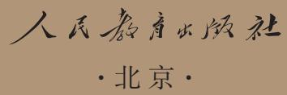

## 编修委员会

主    任：温儒敏  王立军

副 主 任：张伯江  王荣生

成    员（以姓氏笔画为序）：王  敏  王本华  过常宝  朱于国  伍新春  李小龙  李明新汪  锋  宋亚云  张继晓  张彬福  陈先云  陈建华  林建华倪文锦  徐  轶  漆永祥

本册主编：陈先云  汪  锋

编写人员（以姓氏笔画为序）：伍新春  孙  铭  李明新  张  沛  赵宁宁  徐  轶  滕春友

责任编辑：张漫漫  张  沛

责任设计：何安冉

责任校对：冯  运

责任印制：

义务教育教科书  语文  一年级  上册

教育部组织编写

出版人民教育出版社

（北京市海淀区中关村南大街17号院1 号楼 邮编：100081）

网 址 http://www.pep.com.cn

版权所有·侵权必究

## 目录

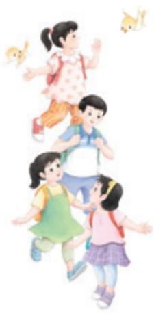

##

我是中国人…2  
我爱我们的祖国………………4  
我是小学生……6  
我爱学语文

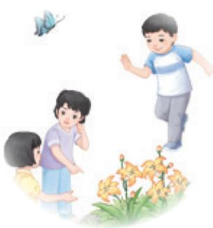

## 第一单元·识字

天地人 8  
金木水火土 9  
3 口耳目手足 11  
4 日月山川 13  
语文园地一 15  
◎ 快乐读书吧 读书真快乐 19

## 第二单元·汉语拼音

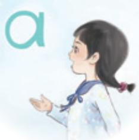

1 20  
2  
3  
4 d t n l 26  
◎ 语文园地二 28

## 人民教育出版社

## aoe

## 第三单元·汉语拼音

5   
6 j q x 34   
7   
8 zh ch sh r 38   
9   
◎ 语文园地三 42

## aoe

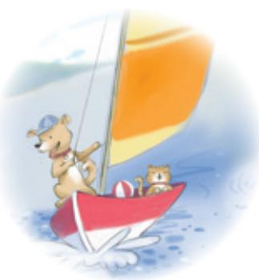

## 第四单元·汉语拼音

10 ai ei ui 45   
11 ao ou iu 47   
12 ie üe er 49   
13 an en in un ün   
14 ang eng ing ong 54   
◎ 语文园地四…………………………… 56

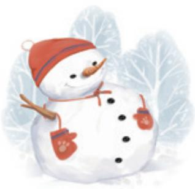

## 第五单元·阅读

秋天 60  
2 江南 62  
3 雪地里的小画家  
4 四季 66  
◎ 语文园地五 68

## 人民教育出版社

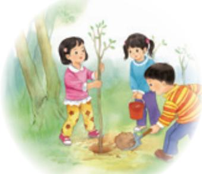

## 第六单元·识字

5 对韵歌 73  
日月明  
7 小书包 76  
8 升国旗 78  
◎ 语文园地六 80

## 第七单元·阅读

小小的船 84  
影子 86  
两件宝  
语文园地七 90

## 第八单元·阅读

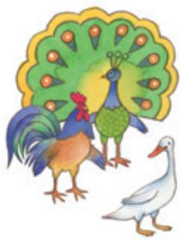

8 比尾巴 95  
9 乌鸦喝水 97  
10 雨点儿 99  
◎ 语文园地八 101  
识字表 105  
写字表 108  
笔画名称表 109  
常用偏旁名称表 110

# 我是中国人

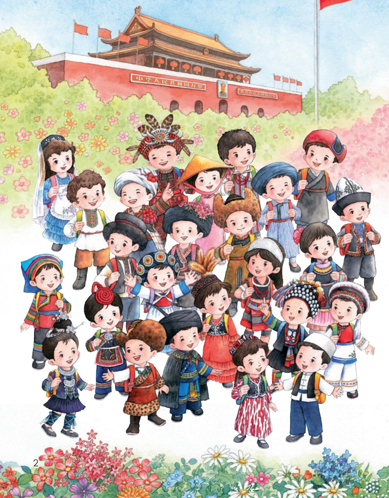

我是中国人。  
我们都是中国人。  
中华民族是一家。

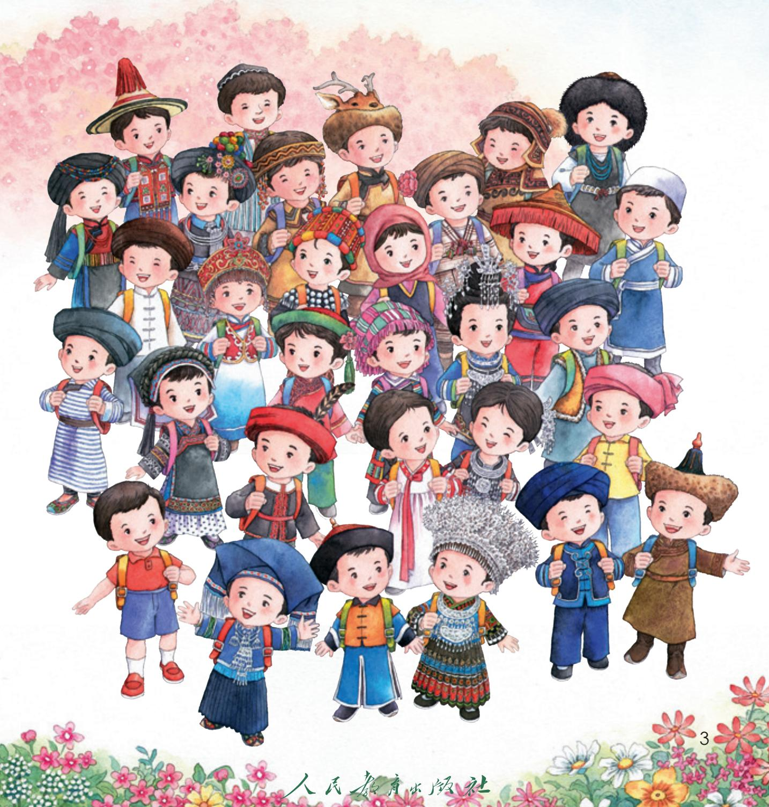

人民教育出版社

# 我爱我们的祖国

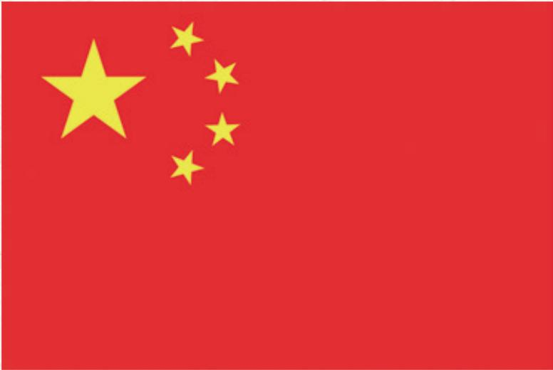

五星红旗

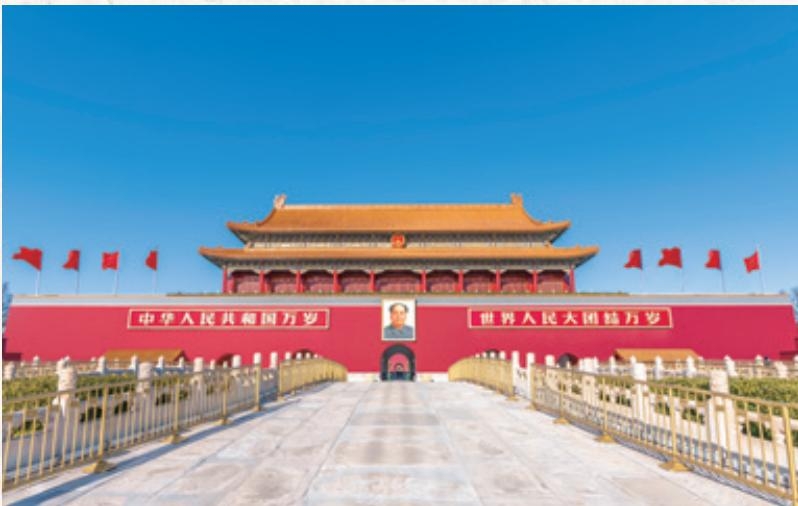  
北京天安门

我爱五星红旗。  
我爱北京天安门。我爱长江，我爱黄河。  
我爱中华人民共和国。

  
长江

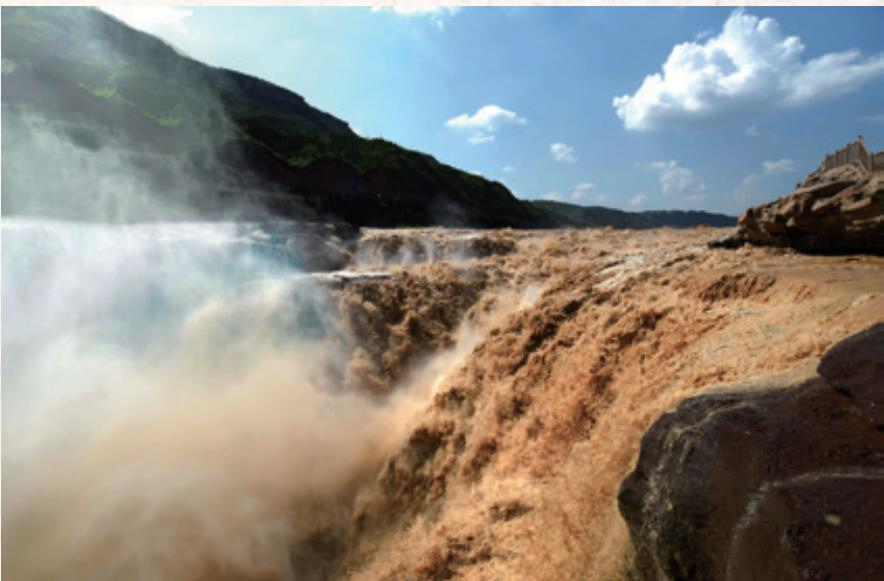  
黄河

# 我是小学生

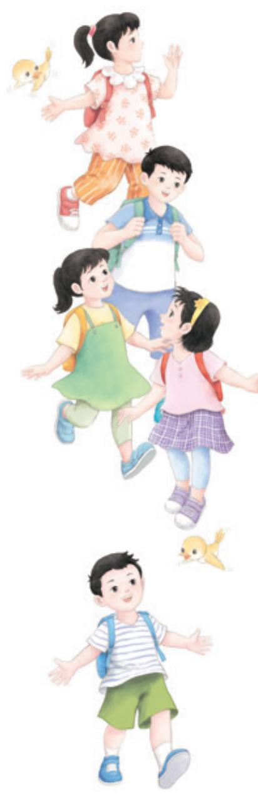

## 上学歌①

太阳当空照，  
花儿对我笑。  
小鸟说：“早，早，早，你为什么背上小书包？”我去上学校，  
天天不迟到。  
爱学习，爱劳动，  
长大要为人民立功劳。

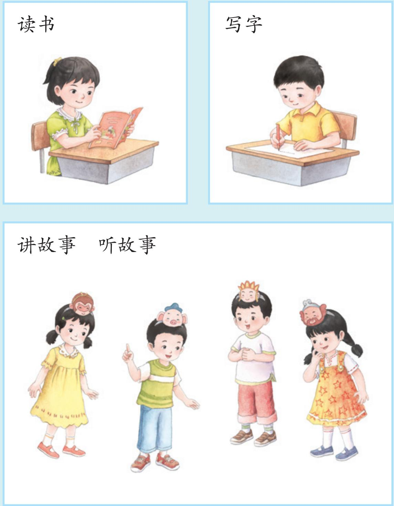

# 我爱学语文

第一单元·识字

人民教育出版社

1 天地人

天地人

# 你我他

天 地 人 你 我 他

人民教育出版社

# 金木水火土2

一二三四五，金木水火土。天地分上下，日月照今古。

（图）傅抱石 绘

南京博物院 藏

# 一 二 三 四 五 上 下

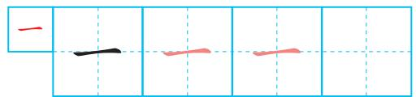

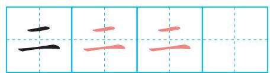

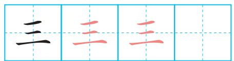

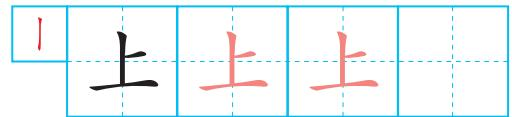

## 朗读课文。背诵课文。

朗读课文时，要用普通话。

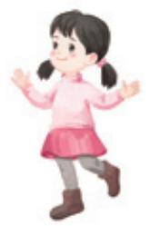

认识田字格。

竖中线

横中线

写字时，要注意笔画在田字格中的位置。

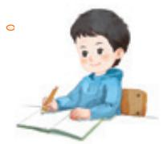

# 3 口耳目手足

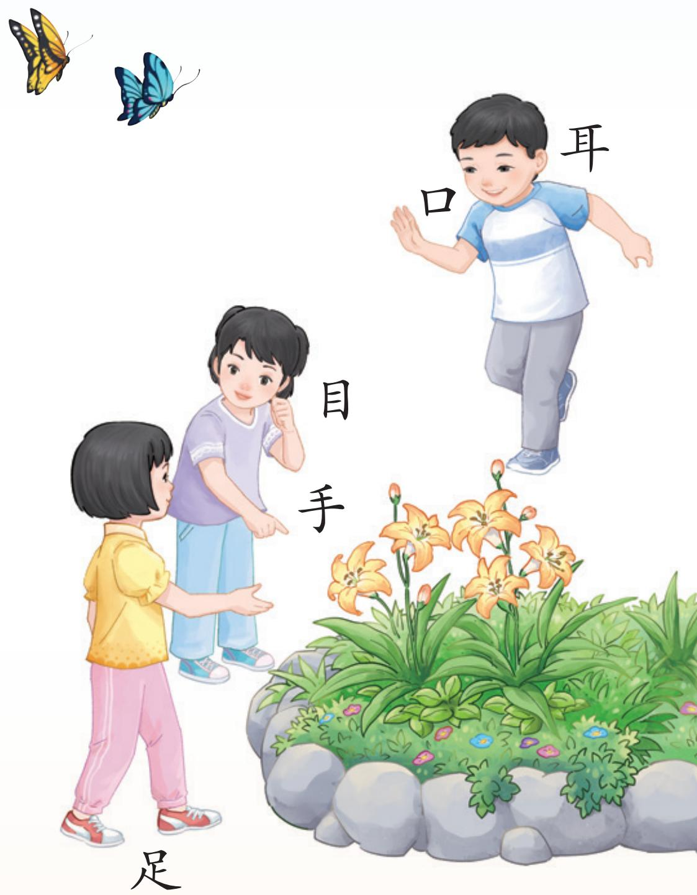

站如松，坐如钟。  
行如风，卧如弓。

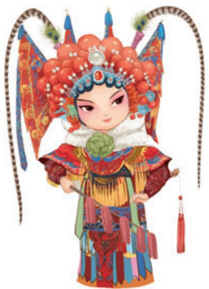

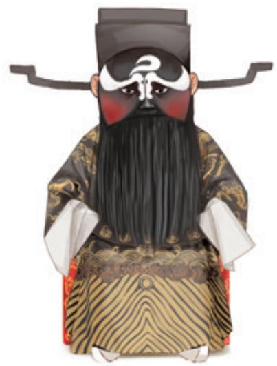

口 耳 目 手 足 站 坐

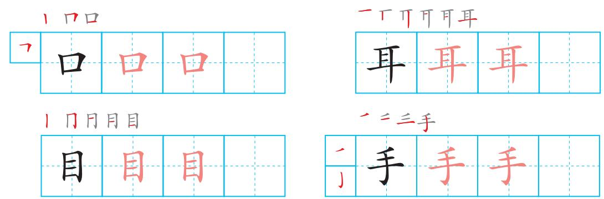

口、耳、目、手、足能做哪些事？

## 4 日月山川

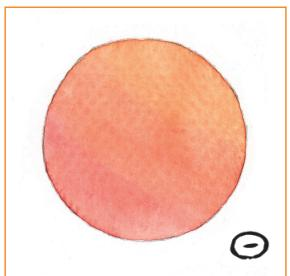  
日

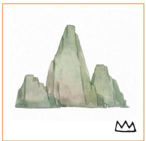  
山

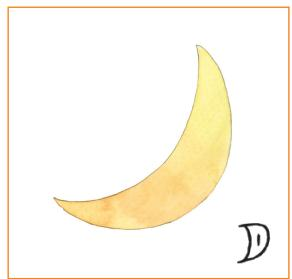  
月

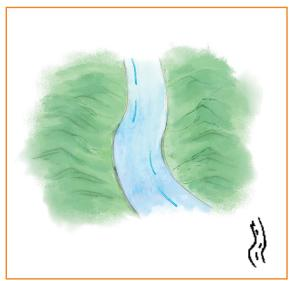  
川  
水

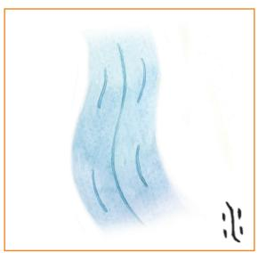

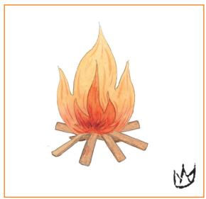  
火

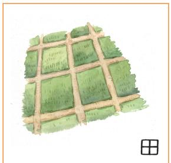  
田

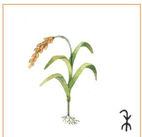  
禾

# 日 月 山 川 水 火 田 禾

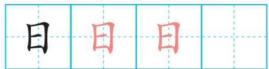

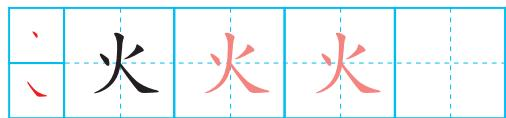

1门曰田田

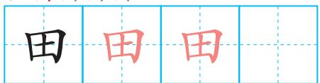

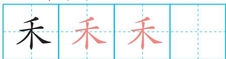

## 猜一猜，连一连。

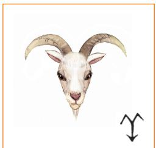

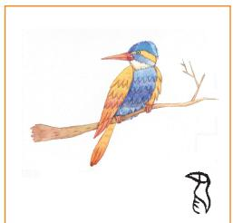

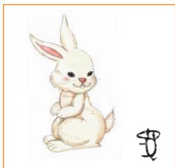

兔 鸟 竹 羊 木 网

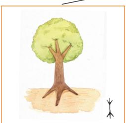

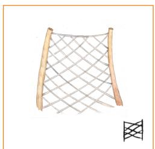

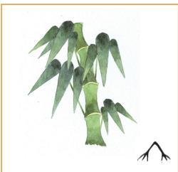

语文园地一

## 识字加油站

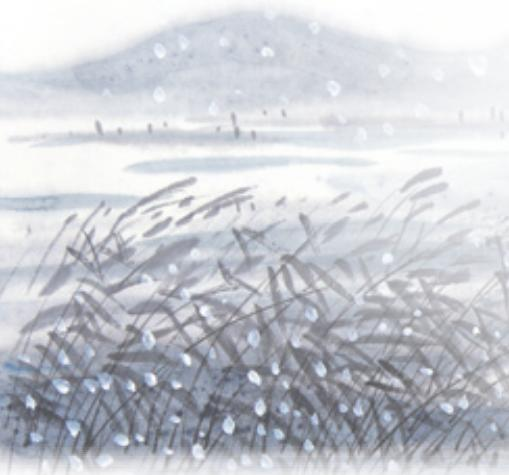

一片两片三四片，五片六片七八片。九片十片无数片，飞入芦花都不见。

你能猜出这是什么吗？

## 六 七 八 九 十

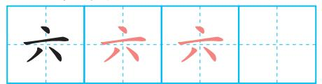

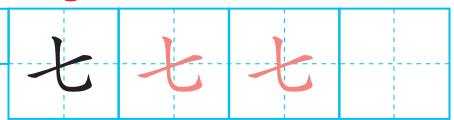

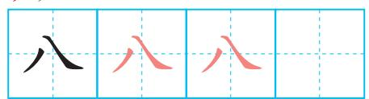

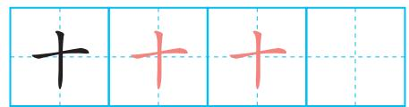

## 字词句运用

读一读，比一比。

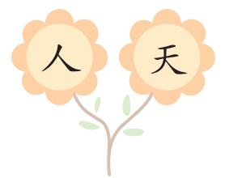

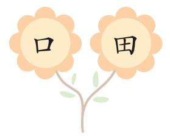

## 书写提示

## 日积月累

## 咏 鹅

[唐] 骆宾王

鹅，鹅，鹅，曲项向天歌。白毛浮绿水，红掌拨清波。

## 口语交际

## 我说你做

我们一起来做游戏吧！一个人发指令，其他人做动作。

## 和大人一起读

## 剪窗花①

小剪刀，手中拿，我学奶奶剪窗花。剪雪花，剪梅花，剪对喜鹊叫喳喳。剪只鸡，剪只鸭，剪条鲤鱼摇尾巴。大红鲤鱼谁来抱？哦！再剪一个胖娃娃。

# 快乐读书吧

## 读书真快乐

我经常和爸爸妈妈一起读有趣的故事书。

周末，我在书店看到了很多好看的图画书。

我读了很多书，会讲很多故事，同学们叫我“故事大王”。

学了拼音，我就可以认更多的字，读更多的书了！

# ü

<table><tr><td>í ī</td><td>ǐ ì</td></tr><tr><td>ú ū</td><td>ǔ ù</td></tr><tr><td>ü ú</td><td>ǚ ù</td></tr></table>

# p m

  
b ā bā

  
b á bá

  
b ǎ bǎ

  
b à bà

## 人民教育出版社

bà ba 爸爸 mā ma 妈妈

bà mā 爸 妈

# d t n

dǎ

tā

dé

tè

ná

dú

dī

tú

lā

né

tǐ

lè

nǐ

lǐ

nù

lù

nǚ

lǘ

dà dì大地

mǎ lù马路

ní tǔ 泥土

# dà mǎ lù tǔ大 马 路 土

## dú yi dú读 一 读 。

xiǎo bái tù 小白兔①

xiǎo bái tù chuān pí ǎo小白兔，穿皮袄，ěr duo cháng wěi ba xiǎo耳朵长，尾巴小。sān bàn zuǐ hú zi qiào三瓣嘴，胡子翘，yí dòng yí dòng zǒng zài xiào一动一动总在笑。

语文园地二

识字加油站

学校 ：

班级 ：

姓名：

# běn‘ xué xiào bān jí xìng míng wáng本 学 校 班 级 姓 名 王

九

## 用拼音

dú yi dú dú zhǔn shēng diào

读 一 读 ， 读 准 声 调 。

dǎ — dà

mō — mǒ

bí — bǐ

## 人民教育出版社

## bǐ yi bǐ dú yi dú比 一 比 ， 读 一 读 。

là bǐ

b — d

dà mǐ

fú tī

f — t

dì tú

  
中国地图

## 字词句运用

dú yi dú lián yi lián读 一 读 ， 连 一 连 。

他 八 马

七 地 你

目 土 足

## 日积月累

huà画

我还会说：妈、爸、大……

yuǎn kàn shān yǒu sè远看山有色，jìn tīng shuǐ wú shēng近听水无声。chūn qù huā hái zài春去花还在，rén lái niǎo bù jīng人来鸟不惊。

## 和大人一起读

# xiǎo bái tù hé xiǎo huī tù 小白兔和小灰兔①

lǎo shān yáng zài dì lǐ shōu bái cài xiǎo bái tù hé xiǎo huī tù老山羊在地里收白菜，小白兔和小灰兔lái bāngmáng来帮忙。

shōu wán bái cài lǎo shān yáng bǎ yì chē bái cài sòng gěi xiǎo huī收完白菜，老山羊把一车白菜送给小灰tù xiǎo huī tù shōu xià le shuō xiè xie nín兔。小灰兔收下了，说：“谢谢您！”

lǎo shān yáng yòu bǎ yì chē bái cài sòng gěi xiǎo bái tù xiǎo bái老山羊又把一车白菜送给小白兔。小白tù shuō wǒ bú yào bái cài qǐng nín gěi wǒ yì xiē cài zǐ ba兔说：“我不要白菜，请您给我一些菜籽吧。”lǎo shān yáng sòng gěi xiǎo bái tù yì bāo cài zǐ老山羊送给小白兔一包菜籽。

xiǎo bái tù huí dào jiā lǐ bǎ dì fān sōng zhòngshàng cài zǐ小白兔回到家里，把地翻松，种上菜籽。

# 人民教育出版社

guò le xiē rì zi bái cài zhǎng chū lái le xiǎo bái tù cháng 过了些日子，白菜长出来了。小白兔常 cháng gěi bái cài jiāo shuǐ shī féi bá cǎo zhuō chóng bái cài hěn 常给白菜浇水，施肥，拔草，捉虫。白菜很 kuài zhǎng dà le 快长大了。

xiǎo huī tù bǎ yì chē bái cài lā huí jiā lǐ tā bú gàn huó小灰兔把一车白菜拉回家里。他不干活le è le jiù chī lǎo shān yáng sòng de bái cài了，饿了就吃老山羊送的白菜。

guò le xiē rì zi xiǎo huī tù bǎ bái cài chī wán le yòu过了些日子，小灰兔把白菜吃完了，又dào lǎo shān yáng jiā lǐ qù yào bái cài到老山羊家里去要白菜。

zhè shí hou tā kàn jiàn xiǎo bái tù tiāo zhe yí dàn bái cài这 时 候， 他 看 见 小 白 兔 挑 着 一 担 白 菜，gěi lǎo shān yáng sòng lái le xiǎo huī tù hěn qí guài wèn dào xiǎo给老山羊送来了。小灰兔很奇怪，问道：“小bái tù nǐ de cài shì nǎr lái de白兔，你的菜是哪儿①来的？”

xiǎo bái tù shuō shì wǒ zì jǐ zhòng de zhǐ yǒu zì jǐ小 白 兔 说：“ 是 我 自 己 种 的。 只 有 自 己zhòng cái yǒu chī bù wán de cài种，才有吃不完的菜。”

  
① 在儿化词中，“儿”不单独发音，注音时在前面的音节后加 r，表示一个卷舌的动作。

5

哥gē 哥ge

dì di 弟弟

huà huà画画

hé huā荷花

# gē dì huà huā哥 弟 画 花

## dú yi dú读 一 读 。

## shuō huà说 话 ①

xiǎo xī liú shuō huà huā huā huā huā小溪流说话，哗哗，哗哗。xiǎo yǔ diǎn shuō huà shā shā shā shā小雨点说话，沙沙，沙沙。xiǎo gē zi shuō huà gū gū gū gū小鸽子说话，咕咕，咕咕。xiǎo yā zi shuō huà gā gā gā gā小鸭子说话，嘎嘎，嘎嘎。xiǎo huā māo shuō huà miāo miāo miāo miāo小花猫说话，喵喵，喵喵。xiǎo qīng wā shuō huà guā guā guā guā小青蛙说话，呱呱，呱呱。

# j q x

qì xī

qiā xiá

dǎ gǔ 打鼓 xià qí 下棋 dā jī mù 搭积木

# dǎ qí jī mù打 棋 积 木

## dú yi dú读 一 读 。

zài yì qǐ在一起 ①

xiǎo huáng jī xiǎo hēi jī小黄鸡，小黑鸡 ，huān huān xǐ xǐ zài yì qǐ欢欢喜喜在一起 。páo pao tǔ zhuōzhuo chóng刨刨土，捉捉虫 ，qīng cǎo dì shàng zuò yóu xì青草地上做游戏

s

zi

ci

si

zá

zé

zǔ

zuó

zǐ

cā

cè

cū

cuō

cì

sǎ

sè

sù

suǒ

sī

Z

ǜ

à

c c

s s

# zì cí jù zǐ字 词 句 子

## dú yi dú读 一 读 。

guò qiáo 过 桥 ①

shù xué tí yí dào dào 数学题，一道道， děng hào jiù xiàng yí zuò qiáo 等号就像一座桥。 zuò duì le zǒu guò qiáo 做对了，走过桥， zuò cuò le guò bù liǎo 做错了，过不了。 xiǎng yi xiǎng suàn yi suàn 想一想，算一算， kuài kuài lè lè guò le qiáo 快快乐乐过了桥。

# zh ch sh r

zhi

chi

shi

ri

zhā

chá

zhè

shà

chē

shé

rè

zhù

chū

shǔ

rǔ

zhuǎ

shuā

zhuō

chuō

shuō

ruò

zhí chī shī rì

cā zhuō zi擦桌子

zhé zhǐ 折纸

dú shū读书

# zhuō zhǐ dú shū桌 纸 读 书

## dú yi dú读 一 读 。

rào kǒu lìng 绕口令 ①

。
四
sì
十
shí四
sì
十
shí
十
shí
四
sì。
十
shí
四
sì
是
shì
是
shì四
sì
十
shí
是
shì
是
shì
不
bú
不
bú是
shì
是
shì
四
sì
十
shí
十
shí
四
sì四
sì
十
shí
十
shí
四
sì
四
sì
十
shí

wu

<table><tr><td>y</td><td>u</td><td>yi</td></tr><tr><td colspan="2">á</td><td>wu yu</td></tr></table>

zi 鸭子 乌wū 鸦yā yǐ 蚂蚁 鱼yú yā wū mǎ

# yú yā wū yā鱼 鸭 乌 鸦

## 读dú 一yi 读dú 。

nǎ zuò fáng zi zuì piào liang 哪座房子最漂亮 ①

yí zuò fáng liǎng zuò fáng   
一座房，两座房，   
qīng qīng de wǎ bái bái de qiáng   
青青的瓦，白白的墙。   
sān zuò fáng sì zuò fáng   
三座房，四座房，   
fáng qián huā guǒ xiāng wū hòu shù chéng háng 房前花果香，屋后树成 行。 nǎ zuò fáng zi zuì piào liang   
哪座房子最漂亮？   
yào shǔ wǒ men de xiǎo xué táng   
要数我们的小学堂。

# 语文园地三

## 识字加油站

课程表
<table><tr><td></td><td></td><td></td><td rowspan=1 colspan=1>星期二</td><td rowspan=1 colspan=1>星期三</td><td rowspan=1 colspan=1>星期四</td><td rowspan=1 colspan=1>星期五</td></tr><tr><td></td><td rowspan=1 colspan=1>第一节</td><td rowspan=1 colspan=1>语文</td><td rowspan=1 colspan=1>语文</td><td rowspan=1 colspan=1>数学</td><td rowspan=1 colspan=1>语文</td><td rowspan=1 colspan=1>数学</td></tr><tr><td></td><td rowspan=1 colspan=1>第二节</td><td rowspan=1 colspan=1>数学</td><td rowspan=1 colspan=1>数学</td><td rowspan=1 colspan=1>语文</td><td rowspan=1 colspan=1>美术</td><td rowspan=1 colspan=1>语文</td></tr><tr><td></td><td rowspan=1 colspan=6>课间操</td></tr><tr><td></td><td rowspan=1 colspan=1>第三节</td><td rowspan=1 colspan=1>道德与法治</td><td rowspan=1 colspan=1>语文</td><td rowspan=1 colspan=1>体育与健康</td><td rowspan=1 colspan=1>科学</td><td rowspan=1 colspan=1>体育与健康</td></tr><tr><td></td><td rowspan=1 colspan=1>第四节</td><td rowspan=1 colspan=1>音乐</td><td rowspan=1 colspan=1>体育与健康</td><td rowspan=1 colspan=1>语文</td><td rowspan=1 colspan=1>写字</td><td rowspan=1 colspan=1>音乐</td></tr><tr><td rowspan=2 colspan=1>下午</td><td rowspan=1 colspan=1>第五节</td><td rowspan=1 colspan=1>美术</td><td rowspan=1 colspan=1>综合实践活动</td><td rowspan=1 colspan=1>道德与法治</td><td rowspan=1 colspan=1>体育与健康</td><td rowspan=1 colspan=1>班会</td></tr><tr><td rowspan=1 colspan=1>第六节</td><td rowspan=1 colspan=1></td><td rowspan=1 colspan=1></td><td rowspan=1 colspan=1>劳动</td><td rowspan=1 colspan=1></td><td rowspan=1 colspan=1></td></tr></table>

## wǔ xīng qī yǔ wén shù xiě huì午 星 期 语 文 数 写 会

## 用拼音

还 能 摆 什 么 ？ 快 来 试 试 看 。

## 人民教育出版社

dú yi dú bǐ yi bǐ读 一 读 ， 比 一 比 。

z — zh

c — ch

s — sh

zì mǔ

cā bō li

sù shè

zhī zhū

hē chá

shū jià

dú yi dú zuò dòng zuò读 一 读 ， 做 动 作 。

shuā yá

tuō dì

qí mǎ

chī xī guā

lǐ fà

bá luó bo

## 字词句运用

dú yi dú zài tú lǐ zhǎo yi zhǎo读 一 读 ， 在 图 里 找 一 找 。

jī hé鸡 鱼 河

zuò kē shù一座山 一棵树

zhī gē duǒ四只鸽子 七朵花

## 日积月累

yì mú yí yàng 一模一样

sān tóu liù bì 三头六臂

一yì 心xīn 一yí 意yì

wǔ yán liù sè五颜六色

dú yī wú èr独一无二

shí quán shí měi十全十美

## 和大人一起读

① 本文是民间歌谣，选作课文时有改动。

## shuí huì fēi 谁会飞①

shuí huì fēi   
谁会飞？   
niǎo huì fēi   
鸟会飞。   
niǎo ér zěn yàng fēi   
鸟儿怎样飞？   
shān shan chì bǎng qù yòu huí 扇扇翅膀去又回。 shuí huì pǎo   
谁会跑？   
mǎ huì pǎo   
马会跑。   
mǎ ér zěn yàng pǎo   
马儿怎样跑？   
sì jiǎo téng kōngyǎng tiān jiào 四脚腾空仰天叫。 shuí huì yóu   
谁会游？   
yú huì yóu   
鱼会游。   
yú ér zěn yàng yóu   
鱼儿怎样游？   
yáo yao wěi ba bǎi bai tóu 摇摇尾巴摆摆头。

10

# ai ei ui

āi ái ǎi ài

ēi éi ěi èi

uī uí uǐ uì

g āi gāi

l èi lèi

t uǐ tuǐ

g u āi guāi

bēi

péi

fēi

huì

duī

chuī

tái

āi

cāi

gěi

wéi

hēi

zuǐ

suì

ruì

huài uài

pái duì

duìpái

luó bo 萝 卜

yā lí 鸭梨

bái cài白菜

xī guā 西瓜

蔬shū 菜cài

水shuǐ 果guǒ

# bái cài xī guā guǒ白 菜 西 瓜 果

## dú yi dú读 一 读 。

xǐ shǒu gē 洗手歌 ①

pái zhe duì xiàng qián zǒu排着队，向前走，zuò shén me qù xǐ shǒu做什么？去洗手。féi zào yòng lái cuō cuo shǒu肥皂用来搓搓手，qīng shuǐ bāng wǒ chōng chong shǒu清水帮我冲冲手，máo jīn gěi wǒ cā ca shǒu毛巾给我擦擦手。xiǎo shǒu xǐ de zhēn gān jìng小手洗得真干净，dà jiā yì qǐ xiào kāi kǒu大家一起笑开口。

11

# ao ou iu

iū iú iǔ iù

niǎo

tiào

shǎo

qiú

ròu

ao

tóu

yào

kǒu

jiù

diū

rào

zǎo

lóu

ou

iu

shōu

yóu

zǒu

xiū

liù

niú

xiǎo qiáo 小桥

liú shuǐ流水

chuí liǔ 垂柳

táo huā桃花

## xiǎo qiáo liú liǔ小 桥 流 柳

## dú yi dú读 一 读 。

huān yíng tái wān xiǎo péng you①欢 迎 台 湾 小 朋 友

yì zhī chuán yáng qǐ fān一只船，扬起帆，piāo a piāo a dào tái wān漂啊漂啊到台湾。jiē lái tái wān xiǎo péng you接来台湾小朋友，dào wǒ xué xiào lái cān guān到我学校来参观。shēn chū shuāng shǒu jǐn jǐn wò伸出双手紧紧握，rè qíng de huà ér shuō bù wán热情的话儿说不完。

人民教育出版社

12

ie

ye yue méi huā kāi 梅花开

xuě huā piāo 雪花飘

yè sè měi夜色美

# kāi xuě yè sè měi开 雪 夜 色 美

## dú yi dú读 一 读 。

yuè ér wān wān 月儿弯弯 ①

yuè ér wān wān guà lán tiān 月儿弯弯挂蓝天， xiǎo xī wān wān chū qīng shān 小溪弯弯出青山。 dà hé wān wān liú rù hǎi 大河弯弯流入海， shān lù wān wān dào xiào yuán 山路弯弯到校园。

13

an

en

un

yuan

yin

ün

yun

lán tiān蓝天

bái yún

白云

cǎo yuán草原

sēn lín森林

# lán yún cǎo yuán蓝 云 草 原

## 人民教育出版社

## dú yi dú读 一 读 。

## 家jiā ①

lán tiān shì bái yún de jiā蓝天是白云的家，shù lín shì xiǎo niǎo de jiā树林是小鸟的家，xiǎo hé shì yú ér de jiā小河是鱼儿的家，ní tǔ shì zhǒng zi de jiā泥土是种子的家。wǒ men shì zǔ guó de huā duǒ我们是祖国的花朵，zǔ guó jiù shì wǒ men de jiā祖国就是我们的家。

① 本文选自北京师范大学出版社 《义务教育课程标准实验教科书语文一年级上册》。

14

yóu yǒng游泳

huá bīng 滑冰

qí zì xíng chē骑自行车

dǎ pīng pāng qiú 打乒乓球

# bīng zì xíng chē冰 自 行 车

## 读dú 一yi 读dú 。

liǎng zhī yáng 两只羊 ①

qiáo dōng zǒu lái yì zhī yáng桥东走来一只羊，qiáo xī zǒu lái yì zhī yáng桥西走来一只羊，yì qǐ zǒu dào xiǎo qiáo shàng一起走到小桥上。nǐ yě bù kěn ràng  
你也不肯让，  
wǒ yě bù kěn ràng  
我也不肯让，  
pū tōng diào jìn hé zhōng yāng扑通掉进河中央

① 本文选自中华书局 《新小学教科书国语读本初级第三册》，有改动。

# 语文园地四

## 识字加油站

上午

昨天

gè上个月

qù nián去年

下午

jīn今天

这个月

今年

wǎn晚上

míng明天

下个月

明年

日

个

## 用拼音

dú yi dú bǎ yīn jié dú zhǔn读 一 读 ， 把 音 节 读 准 。

yǎn

yuǎn

yīn

yīng

jiǎn

juǎn

zuān

zhuān

chán

chuán

chuáng

## 人民教育出版社

## bǐ yi bǐ dú yi dú比 一 比 ， 读 一 读 。

xiě zì

dǎ léi

dié bèi zi

chuī qì qiú

duī xuě rén

diū shǒu juàn

## qiū yóu de shí hou nǐ xiǎng dài xiē shén me秋 游 的 时 候 ， 你 想 带 些 什 么 ？

mào zi

shuǐ hú

píng guǒ

tiào qí

miàn bāo

shuǐ cǎi bǐ

bǐng gān

yǔ sǎn

wàng yuǎn jìng

dú yi dú jì yi jì zài shuō yi shuō nǐ de míng zi lǐ读 一 读 ， 记 一 记 ， 再 说 一 说 你 的 名 字 里yǒu nǎ xiē shēng mǔ hé yùn mǔ  
有 哪 些 声 母 和 韵 母 。

$$
\textsf { b p m f }
$$

d t n l

zh ch sh r

$$
9 ^ { \mathrm { ~ k ~ h ~ } }
$$

$$
Z ~ \subset ~ \mathsf { à }
$$

$$
{ \mathrm { ~ j ~ } } \subset { \mathrm { ~ \times ~ } }
$$

$$
( \lor \textsf { á } )
$$

$$
\textsc { a o e }
$$

i u ü

ai ei ui

ao ou iu

ie üe er

an en in un ün

ang eng ing ong

zhi chi shi ri zi ci si

yi wu yu

ye yue yuan

yin yun ying

## 字词句运用

dú yi dú shuō yi shuō读 一 读 ， 说 一 说 。

pīn yi pīn xiě yi xiě拼 一 拼 ， 写 一 写 。

## 日积月累

mǐn nóng qí èr悯 农 （其 二）

táng lǐ shēn[唐] 李 绅

chú hé rì dāng wǔ锄禾日当午，hàn dī hé xià tǔ汗滴禾下土。

lǎo shī jiāo dà jiā niàn shū lǎo shī niàn yí jù wǒ men gēn老师教大家念书。 老师念一句， 我们跟zhe niàn yí jù chuāng wài de fēng chuī zhe xī xi shā shā chuāng wài着念一句。 窗外的风吹着， 淅淅沙沙。 窗外de niǎo jiào zhe jī ji zhā zhā的鸟叫着， 叽叽喳喳。

lǎo shī shuō fēng yě zài jiāo xiǎo niǎo niàn shū ma wǒ men老师说：“ 风也在教小鸟念书吗？” 我们zǐ xì de tīng chuāng wài de fēng niàn zhe xī xi shā shā chuāng仔细地听。 窗外的风念着：“ 淅淅沙沙。” 窗wài de niǎo niàn zhe jī ji zhā zhā外的鸟念着：“ 叽叽喳喳。”

wǒ men dōu xiào le hā hā xiǎo niǎo niàn cuò la我们都笑了。 哈哈！ 小鸟念错啦！

# qiū tiān 1 秋 天 ①

tiān qì liáng le shù yè huáng le yí piàn piàn yè天 气 凉 了， 树 叶 黄 了， 一 片 片 叶zi cóng shù shàng luò xià lái子从树上落下来。

tiān nà me lán nà me gāo yì qún dà yàn wǎng nán天那么蓝，那么高。一群大雁往南fēi yí huìr pái chéng gè rén zì yí huìr pái飞，一会儿排成个“人”字，一会儿排成chéng 个gè “ 一yī ” 字zì 。

à qiū tiān lái le啊！秋天来了！

  
① 本文选自人民教育出版社 《五年制小学课本语文第一册》，有改动。

# qiū qì le shù yè huáng piàn cóng lái fēi秋 气 了 树 叶 黄 片 从 来 飞

大 大 大

子 子 子

人 人 人

jiè zhù pīn yīn lǎng dú kè wén bèi sòng kè wén借 助 拼 音 朗 读 课 文 。 背 诵 课 文 。

shǔ yi shǔ kè wén yí gòng yǒu数 一 数 ， 课 文 一 共 有jǐ gè zì rán duàn几 个 自 然 段 ？

自然段的前面有两个空格。

dú yi dú xià miàn de cí yǔ zhù yì yī de dú yīn读 一 读 下 面 的 词 语 ， 注 意 ” 的 读 音 。yī yí piàn piàn yí huìr yì qún一 一片片 一会儿 一群

## jiāng nán2 江 南

hàn yuè fǔ汉乐府

jiāng nán kě cǎi lián江南可采莲，lián yè hé tián tián莲叶何田田。yú xì lián yè jiān鱼戏莲叶间。yú xì lián yè dōng鱼戏莲叶东，yú xì lián yè xī鱼戏莲叶西，yú xì lián yè nán鱼戏莲叶南，yú xì lián yè běi鱼戏莲叶北。

# jiāng nán kě cǎi lián xì jiān dōng běi江 南 可 采 莲 戏 间 东 北

lǎng dú kè wén bèi sòng kè wén朗 读 课 文 。 背 诵 课 文 。

# xuě dì lǐ de xiǎo huà jiā雪地里的小画家3

xià xuě la xià xuě la 下雪啦，下雪啦！

xuě dì lǐ lái le yì qún xiǎo huà jiā雪地里来了一群小画家。

xiǎo jī huà zhú yè xiǎo gǒu huà méi huā小鸡画竹叶，小狗画梅花，

xiǎo yā huà fēng yè xiǎo mǎ huà yuè yá小鸭画枫叶，小马画月牙。

bú yòng yán liào bú yòng bǐ不用颜料不用笔，

jǐ bù jiù chéng yì fú huà几步就成一幅画。

qīng wā wèi shén me méi cān jiā青蛙为什么没参加？

tā zài dòng lǐ shuì zháo la 他在洞里睡着啦。

# de jiā jī zhú yá yòng jǐ bù méi cān jiā的 家 鸡 竹 牙 用 几 步 没 参 加

竹 竹 竹

牙 牙 牙

几 几 几

lǎng dú kè wén bèi sòng kè wén朗 读 课 文 。 背 诵 课 文 。

马 马 马

用 用 用

xuě dì lǐ lái le nǎ xiē xiǎo huà jiā tā men huà le shén me雪 地 里 来 了 哪 些 小 画 家 ？ 他 们 画 了 什 么 ？qīng wā wèi shén me méi cān jiā青 蛙 为 什 么 没 参 加 ？

## sì jì 4 四 季 ①

cǎo yá jiān jiān草芽尖尖，tā duì xiǎo niǎo shuō他对小鸟说：

wǒ shì chūn tiān“我是春天。”

gǔ suì wān wān谷穗弯弯，tā jū zhe gōng shuō他鞠着躬说：

wǒ shì qiū tiān“我是秋天。”

hé yè yuán yuán荷叶圆圆，tā duì qīng wā shuō他对青蛙说：

wǒ shì xià tiān“我是夏天。”

xuě rén dà dù zi yì tǐng雪人大肚子一挺，tā wán pí de shuō  
他顽皮地说：

wǒ jiù shì dōng tiān“我就是冬天。”

niǎo shuō shì chūn qīng wā xià zhe pí de jiù dōng鸟 说 是 春 青 蛙 夏 着 皮 地 就 冬

1门四四四

是 是 是

天 天 天

lǎng dú kè wén 朗 读 课 文 。

nǐ xǐ huan nǎ ge jì jié fǎng zhào kè wén shuō yi shuō你 喜 欢 哪 个 季 节 ？ 仿 照 课 文 说 一 说 。

# 语文园地五

## 识字加油站

南

北

fǎn 反 zhèng

hòu 后 xiān 先

正

我也会说这样

nèi wài 内 外 的词语……

# nán nǚ guān zhèng fǎn xiān hòu nèi wài男 女 关 正 反 先 后 内 外

关

关

## 字词句运用

dú yi dú

读 一 读 ， 说 一 说 。

我最喜欢冬天，因为冬天可以堆雪人……

大地

树叶

飞鸟

青草

小鱼

青蛙

莲花

雪人

## 人民教育出版社

nǐ rèn shi nǎ xiē tóng xué de míng zi shì zěn me rèn shi de你 认 识 哪 些 同 学 的 名 字 ？ 是 怎 么 认 识 的 ？hé tóng xué jiāo liú和 同 学 交 流 。

## 日积月累

yì nián zhī jì zài yú chūn一年之计在于春，yí rì zhī jì zài yú chén一日之计在于晨。

yí cùn guāng yīn yí cùn jīn一寸光阴一寸金，cùn jīn nán mǎi cùn guāng yīn寸金难买寸光阴。

## 口语交际

# 交朋友

bān lǐ yǒu xiē tóng xué nǐ shì bú shì hái bú tài shú xi qù zuò班里有些同学你是不是还不太熟悉？去作gè zì wǒ jiè shào gēn tā men liáo liao tiān chéng wéi péng you ba个自我介绍，跟他们聊聊天，成 为朋友吧！

## 和大人一起读

# bá luó bo 拔萝卜①

lǎo gōng gong zhòng le yí gè luó bo luó bo zhǎng dà le lǎo 老公公种了一个萝卜。萝卜长大了，老 gōng gong qù dì lǐ bá luó bo 公公去地里拔萝卜。

lǎo gōng gong lā zhe luó bo老 公 公 拉 着 萝 卜yè zi hāi yō hāi yō叶子，“嗨哟！嗨哟！”bá ya bá bá bú dòng拔呀拔，拔不动。

lǎo gōng gong hǎn lǎo pó老 公 公 喊 老 婆po lái bāng máng lǎo pó po婆 来 帮 忙。 老 婆 婆lā zhe lǎo gōnggong lǎo gōng gong拉着老公公，老公公lā zhe luó bo yè zi hāi拉 着 萝 卜 叶 子，“ 嗨yō hāi yō bá ya bá哟！嗨 哟！”拔 呀 拔，bá bú dòng拔不动。

# 人民教育出版社

lǎo pó po hǎn xiǎo gū niang lái bāngmáng xiǎo gū niang lā zhe lǎo老婆婆喊小姑娘来帮忙。小姑娘拉着老pó po lǎo pó po lā zhe lǎo gōng gong lǎo gōng gong lā zhe luó bo婆婆，老婆婆拉着老公 公，老公 公拉着萝卜yè zi hāi yō hāi yō bá ya bá bá bú dòng叶子，“嗨哟！嗨哟！”拔呀拔，拔不动。

xiǎo gū niang hǎn xiǎo gǒu lái bāng máng xiǎo gǒu lā zhe xiǎo gū小 姑 娘 喊 小 狗 来 帮 忙。 小 狗 拉 着 小 姑niang xiǎo gū niang lā zhe lǎo pó po lǎo pó po lā zhe lǎo gōng娘， 小 姑 娘 拉 着 老 婆 婆， 老 婆 婆 拉 着 老 公gong lǎo gōng gong lā zhe luó bo yè zi hāi yō hāi yō公， 老 公 公 拉 着 萝 卜 叶 子，“ 嗨 哟！ 嗨 哟！”bá ya bá bá bú dòng拔呀拔，拔不动。

xiǎo gǒu hǎn xiǎo māo lái bāng máng小狗喊小 猫 来帮 忙 ……yún duì yǔ xuě duì fēng云对雨，雪对风。

huā duì shù niǎo duì chóng 花对树，鸟对虫。

shān qīng duì shuǐ xiù山清对水秀，

liǔ lǜ duì táo hóng柳绿对桃红。

第六单元·识字

duì gē yǔ fēng chóng qīng lǜ táo hóng对 歌 雨 风 虫 清 绿 桃 红

lǎng dú kè wén bèi sòng kè wén 朗 读 课 文 。背 诵 课 文 。

## rì yuè míng6 日月明 ①

rì yuè míng tián lì nán日月明，田力男。

xiǎo dà jiān xiǎo tǔ chén小大尖，小土尘。

èr rén cóng sān rén zhòng二人从，三人众。

shuāng mù lín sān mù sēn双木林，三木森。

yì rén bù chéng zhòng一人不成众，

dú mù bù chéng lín独木不成林。

zhòng rén yì tiáo xīn众人一条心，

huáng tǔ biàn chéng jīn 黄土变成金。

# lì jiān chén zhòng shuāng lín sēn bù tiáo xīn jīn力 尖 尘 众 双 林 森 不 条 心 金

lǎng dú kè wén 朗 读 课 文 。

dú yi dú读 一 读 。

力气 尘土 双手 金黄

树林 森林 关心 开心

nǐ néng cāi chū xià miàn zhè xiē zì de yì si ma你 能 猜 出 下 面 这 些 字 的 意 思 吗 ？

xiǎo shū bāo

# 小书包7

xiàng pí chǐ zi zuò yè běn 橡皮 尺子 作业本 bǐ dài qiān bǐ zhuàn bǐ dāo 笔袋 铅笔 转笔刀

wǒ de xiǎo shū bāo我的小书包，bǎo bèi zhēn bù shǎo宝贝真不少。kè běn zuò yè běn课本作业本，qiān bǐ zhuàn bǐ dāo铅笔转笔刀。tiān tiān qǐ de zǎo天天起得早，péi wǒ qù xué xiào陪我去学校。

人民教育出版社

勺

bāo chǐ zuò yè bǐ dāo bǎo bèi shǎo kè zǎo包 尺 作 业 笔 刀 宝 贝 少 课 早

尺 尺 尺

刀 刀 刀

本 本 本

不 不 不

少 少 少

lǎng dú kè wén shuō yi shuō nǐ de shū bāo lǐ yǒu nǎ xiē xué xí朗 读 课 文 。 说 一 说 你 的 书 包 里 有 哪 些 学 习yòng pǐn用 品 。

## dú yi dú zuò yi zuò读 一 读 ， 做 一 做 。

wǒ huì bǎ wén jù bǎi fàng zhěng qí wǒ huì zì jǐ zhěng lǐ shū bāo我会自己整理书包我 。会把文具摆放 整齐。

# 升国旗

zhōng guó中国

① 本文选自人民教育出版社 《九年一贯制试用课本 （全日制）语文第一册》，有改动。

## 人民教育出版社

wǔ xīng hóng qí wǒ men de guó qí五星红旗，我们的国旗。

guó gē shēng zhōng xú xú shēng qǐ国歌声中，徐徐升起。

yíng fēng piāo yáng duō me měi lì迎风飘扬，多么美丽。

xiàng zhe guó qí wǒ men lì zhèng向着国旗，我们立正。

wàng zhe guó qí wǒ men jìng lǐ望着国旗，我们敬礼。

口

shēng guó qí zhōng men shēng qǐ duō me xiàng lì升 国 旗 中 们 声 起 多 么 向 立

乙

lǎng dú kè wén bèi sòng kè wén朗 读 课 文 。 背 诵 课 文 。

人民教育出版社

# 语文园地六

## 识字加油站

学 校

老lǎo 师shī

gōngchǎng工 厂

工 人

我还知道很多职业……

yī yuàn shēng医 院 医 生

chuán dá shì mén wèi传 达 室 门 卫

## 字词句运用

dú yi dú dú zhǔn zì yīn

读 一 读 ， 读 准 字 音 。

nǐ men你 们

家jiā 里lǐ

nán shēng男 生

lán sè蓝 色

shàng shān上 山

sān nián三 年

xiě zì写 字

bào zhǐ 报 纸

dú yi dú hé tóng xué jiāo liú nǐ de fā xiàn读 一 读 ， 和 同 学 交 流 你 的 发 现 。

很多木字旁的字都和树木有关。

树 林 桃 桥

“桥”字为什么和树木有关呢？我想问问老师。

花 草 莲 菜

nǐ zài lù shàng rèn shi le nǎ xiē zì hé tóng xué jiāo liú你 在 路 上 认 识 了 哪 些 字 ？ 和 同 学 交 流 。

## kàn tú xiě cí yǔ zài shuō yì liǎng jù huà看 图 写 词 语 ， 再 说 一 两 句 话 。

## 书写提示

笔顺规则：从上到下。

叶 叶叶竹 竹竹

笔顺规则：从左到右。

## 日积月累

gǔ lǎng yuè xíng jié xuǎn古 朗 月 行 （节 选）

lǐ báitáng[唐] 李 白

xiǎo shí bù shí yuè小 时 不 识 月 ，hū zuò bái yù pán呼 作 白 玉 盘 。yòu yí yáo tái jìng又 疑 瑶 台 镜 ，fēi zài qīng yún duān飞 在 青 云 端 。

## 和大人一起读

# xiǎo sōng shǔ zhǎo huā shēng 小松鼠找花生 ①

dà shù páng biān de dì lǐ zhǎng zhe xǔ duō huā shēng huā shēng yǐ大树旁边的地里长着许多花生。花生已jīng kāi huā le yì duǒ duǒ jīn huáng sè de xiǎo huā zài yáng guāng xià经开花了，一朵朵金黄色的小花，在阳 光下gé wài xiān yàn格外鲜艳。

xiǎo sōng shǔ wèn yǎn shǔ zhè shì shén me huā a yǎn shǔ小松鼠问鼹鼠：“这是什么花啊？”鼹鼠shuō zhè shì huā shēng de huā dào le qiū tiān huì jiē huā shēng说：“ 这 是 花 生 的 花。 到 了 秋 天， 会 结 花 生。huā shēng kě hǎo chī la xiǎo sōng shǔ hěn gāo xìng tā xiǎng děng huā花生可好吃啦！”小松鼠很高兴，他想：等花shēng jiē le guǒ wǒ jiù bǎ tā zhāi xià lái liú zhe dōng tiān chī生结了果，我就把它摘下来，留着冬天吃。

xiǎo sōng shǔ měi tiān dōu dào dì lǐ qù kàn kan jiē huā shēng le小松鼠每天都到地里去，看看结花生了méi yǒu没有。

tā děng a děng a děng dào huā dōu luò guāng le yě méi他等啊，等啊，等到花都落光了，也没kàn jiàn huā shēng看见花生。

xiǎo sōng shǔ gǎn dào hěn qí小 松 鼠 感 到 很 奇guài zì yán zì yǔ de shuō shì怪，自言自语地说：“是shuí bǎ huā shēng zhāi zǒu le ne谁把花生摘走了呢？”

xiǎo xiǎo de chuán

# 小小的船5

wān wān de yuè ér xiǎo xiǎo de chuán 弯弯的月儿小小的船，

xiǎo xiǎo de chuán ér liǎng tóu jiān 小小的船儿两头尖。

wǒ zài xiǎo xiǎo de chuán lǐ zuò我在小小的船里坐，

zhǐ kàn jiàn shǎn shǎn de xīng xing lán lán de tiān只看见闪闪的星星蓝蓝的天。

① 本文作者叶圣陶。

lǎng dú kè wén bèi sòng kè wén朗 读 课 文 。 背 诵 课 文 。

dú yi dú zhào yàng zi shuō yi shuō读 一 读 ， 照 样 子 说 一 说 。

船 小小的船

月儿 弯弯的月儿

我还会说：弯弯的小河，蓝蓝的大海……

星星 闪闪的星星

天 蓝蓝的天

yǐng zi 6 影 子 ①

yǐng zi zài zuǒ   
影子在左，   
yǐng zi zài yòu   
影子在右，   
yǐng zi cháng cháng péi zhe wǒ 影子常常陪着我， tā shì wǒ de hǎo péng you 它是我的好朋友。 yǐng zi zài qián   
影子在前，   
yǐng zi zài hòu   
影子在后，   
yǐng zi cháng cháng gēn zhe wǒ 影子常常跟着我， jiù xiàng yì tiáo xiǎo hēi gǒu 就像一条小黑狗。

yǐng qián cháng hēi gǒu zuǒ yòu tā hǎo péng yǒu影 前 常 黑 狗 左 右 它 好 朋 友

在 在 在

左 左 左

右 右 右

lǎng dú kè wén 朗 读 课 文 。

我 我 我

nǐ de qián hòu zuǒ yòu dōu shì shuí你 的 前 后 左 右 都 是 谁 ？

# liǎng jiàn bǎo 两件宝7 ①

rén yǒu liǎng jiàn bǎo 人有两件宝， shuāng shǒu hé dà nǎo 双手和大脑。 shuāng shǒu huì zuò gōng 双手会做工， dà nǎo huì sī kǎo 大脑会思考。

yòng shǒu bú yòng nǎo用手不用脑，shì qing zuò bù hǎo事情做不好。yòng nǎo bú yòng shǒu用脑不用手，shá yě bàn bú dào啥也办不到。yòng shǒu yòu yòng nǎo用手又用脑，cái néng yǒu chuàng zào才能有创造。

jiàn yǒu hé zuò yě bàn dào yòu cái néng件 有 和 做 也 办 到 又 才 能

和 和 和

也 也 也

才 才 才

lǎng dú kè wén bèi sòng kè wén朗 读 课 文 。 背 诵 课 文 。

shuō shuo kè wén zhōng de liǎng jiàn bǎo néng zuò shén me wèi shén me yào  
说 说 课 文 中 的 两 件 宝 能 做 什 么 ， 为 什 么 要yòng shǒu yòu yòng nǎo  
“ 用 手 又 用 脑 ”。

# 语文园地七

## 识字加油站

shū

叔叔

哥哥 姐姐 弟弟 妹妹

## 字词句运用

bǐ yi bǐ xiě yi xiě

比 一 比 ， 写 一 写 。

## 人民教育出版社

dú yi dú hé tóng xué jiāo liú nǐ de fā xiàn读 一 读 ， 和 同 学 交 流 你 的 发 现 。

这几个字的意思都和时间有关。

明 晚 昨 春

妈  奶  姐  妹

## dú yi dú bèi yi bèi读 一 读 ， 背 一 背 。

chén miàn tài yáng早晨起来，面向太阳。前面是东，后面是西。左面是北，右面是南。

## 日积月累

zhòng guā dé guā zhòng dòu dé dòu  
种瓜得瓜， 种豆得豆。◎qián rén zāi shù hòu rén chéng liáng  
前人栽树， 后人乘凉。◎qiān lǐ zhī xíng shǐ yú zú xià  
千里之行， 始于足下。◎bǎi chǐ gān tóu gèng jìn yí bù  
百尺竿头， 更进一步。◎

## 口语交际

# yòng duō dà de shēng yīn shuō huà用多大的声音说话

shén me shí hou yào dà shēng shuō huà shén me shí hou yào xiǎo shēng什么时候要大声说话？什么时候要小声shuō huà xiǎng yi xiǎng shì yi shì说话？想一想，试一试。

请问，这里有人吗？

我给大家讲一个故事……

老师，我在教室里捡到一块橡皮。

◎ 有时候要大声说话，让别人听清楚。

◎ 有时候要小声说话，不影响其他人。

## 和大人一起读

## hóu zi lāo yuè liang 猴子捞月亮

yǒu zhī xiǎo hóu zi zài jǐng biān wán tā wǎng jǐng lǐ yí kàn有 只 小 猴 子 在 井 边 玩。 他 往 井 里 一 看，lǐ miàn yǒu gè yuè liang xiǎo hóu zi jiào qǐ lái zāo la zāo里 面 有 个 月 亮。 小 猴 子 叫 起 来：“ 糟 啦， 糟la yuè liang diào zài jǐng lǐ la啦！月亮掉在井里啦！”

dà hóu zi tīng jiàn le pǎo guò lái yí kàn gēn zhe jiào qǐ 大猴子听见了，跑过来一看，跟着叫起 lái zāo la zāo la yuè liang diào zài jǐng lǐ la 来：“糟啦，糟啦！月亮掉在井里啦！”

lǎo hóu zi tīng jiàn le pǎo guò lái yí kàn yě gēn zhe jiào老猴子听见了，跑过来一看，也跟着叫qǐ lái zāo la zāo la yuè liang diào zài jǐng lǐ la起来：“糟啦，糟啦！月亮掉在井里啦！”

fù jìn de hóu zi tīng jiàn 附近的猴子听见

le dōu pǎo guò lái kàn dà了， 都 跑 过 来 看。 大jiā gēn zhe jiào qǐ lái zāo家 跟 着 叫 起 来：“ 糟la zāo la yuè liang diào zài啦， 糟 啦！ 月 亮 掉 在jǐng lǐ la zán men kuài bǎ tā井 里 啦！ 咱 们 快 把 它lāo shàng lái  
捞上来！”

hóu zi men pá shàng le jǐng páng biān猴 子 们 爬 上 了 井 旁 边de dà shù lǎo hóu zi dào guà zài shù的 大 树。 老 猴 子 倒 挂 在 树shàng lā zhù dà hóu zi de jiǎo dà hóu上，拉住大猴子的脚。大猴zi yě dào guà zhe lā zhù lìng yì zhī hóu子也倒挂着，拉住另一只猴zi de jiǎo hóu zi men jiù zhè yàng yì zhī子的脚。猴子们就这样一只lā yì zhī yì zhí guà dào jǐng lǐ tou拉一只，一直挂到井里头，xiǎo hóu zi guà zài zuì xià biān小猴子挂在最下边。

xiǎo hóu zi shēn shǒu qù lāo yuè小 猴 子 伸 手 去 捞 月liang shǒu gāng pèng dào shuǐ yuè liang jiù亮， 手 刚 碰 到 水， 月 亮 就bú jiàn le不见了。

lǎo hóu zi yì tái tóu kàn jiàn老 猴 子 一 抬 头， 看 见yuè liang hái zài tiān shàng tā chuǎn zhe qì月 亮 还 在 天 上。 他 喘 着 气shuō bú yòng lāo le bú yòng lāo说：“ 不 用 捞 了， 不 用 捞le yuè liang hái hǎo hǎo de guà zài tiān了！ 月 亮 还 好 好 地 挂 在 天shàng ne上呢！”

shuí de wěi ba cháng 谁的尾巴长？

shuí de wěi ba duǎn谁的尾巴短？

shuí de wěi ba hǎo xiàng yì bǎ sǎn谁的尾巴好像一把伞？

hóu zi de wěi ba cháng猴子的尾巴长。

tù zi de wěi ba duǎn兔子的尾巴短。

sōng shǔ de wěi ba hǎo xiàng yì bǎ sǎn松鼠的尾巴好像一把伞。

shuí de wěi ba wān 谁的尾巴弯？

shuí de wěi ba biǎn谁的尾巴扁？

shuí de wěi ba zuì hǎo kàn谁的尾巴最好看？

gōng jī de wěi ba wān 公鸡的尾巴弯。

yā zi de wěi ba biǎn鸭子的尾巴扁。

kǒng què de wěi ba zuì hǎo kàn孔雀的尾巴最好看。

bǐ wěi bā shuí cháng duǎn bǎ sǎn tù zuì gōng比 尾 巴 谁 长 短 把 伞 兔 最 公

##

公 公 公

lǎng dú kè wén bèi sòng kè wén朗 读 课 文 。 背 诵 课 文 。

zhào yàng zi zuò wèn dá yóu xì照 样 子 做 问 答 游 戏 。

谁的尾巴最好看？?

孔雀的尾巴最好看。

yàng ài 谁的样子最可爱？?

兔子的样子最可爱。

# wū yā hē shuǐ 乌鸦喝水9

yì zhī wū yā kǒu kě le dào chù zhǎo shuǐ hē一 只 乌 鸦 口 渴 了， 到 处 找 水 喝。  
wū yā kàn jiàn yí gè píng zi píng zi lǐ yǒu shuǐ dàn  
乌 鸦 看 见 一 个 瓶 子， 瓶 子 里 有 水。 但

shì píng zi lǐ shuǐ bù 是，瓶子里水不

duō píng kǒu yòu xiǎo多， 瓶 口 又 小，wū yā hē bù zháo shuǐ乌 鸦 喝 不 着 水。

zěn me bàn ne怎么办呢？

wū yā kàn jiàn páng乌 鸦 看 见 旁biān yǒu xǔ duō xiǎo shí边 有 许 多 小 石zǐ xiǎng chū bàn fǎ子， 想 出 办 法lái le来了。

wū yā bǎ xiǎo shí zǐ yì kē yì kē de fàng jìn píng乌 鸦 把 小 石 子 一 颗 一 颗 地 放 进 瓶zi lǐ píng zi lǐ de shuǐ jiàn jiàn shēng gāo wū yā jiù子 里。 瓶 子 里 的 水 渐 渐 升 高， 乌 鸦 就hē zháo shuǐ le喝着水了。

hē zhī chù zhǎo zháo xǔ shí chū fǎ fàng jìn gāo喝 只 处 找 着 许 石 出 法 放 进 高

只

办 办 办

多 多 多

石 石 石

出 出 出

lǎng dú kè wén 朗 读 课 文 。

shuō yi shuō wū yā shì yòng shén me bàn fǎ hē zháo shuǐ de说 一 说 乌 鸦 是 用 什 么 办 法 喝 着 水 的 。

# yǔ diǎnr10 雨 点 儿

shǔ bù qīng de yǔ diǎnr cóng yún cai lǐ luò xià lái数不清的雨点儿，从云彩里落下来。

bàn kōng zhōng dà yǔ diǎnr wèn xiǎo yǔ diǎnr半 空 中， 大 雨 点 儿 问 小 雨 点 儿：nǐ yào dào nǎ lǐ qù“你要到哪里去？”

xiǎo yǔ diǎnr huí dá wǒ yào qù yǒu huā yǒu cǎo小 雨 点 儿 回 答：“ 我 要 去 有 花 有 草de dì fang nǐ ne的地方。你呢？”

dà yǔ diǎnr shuō wǒ yào qù méi yǒu huā méi yǒu大 雨 点 儿 说：“ 我 要 去 没 有 花 没 有cǎo de dì fang草的地方。”

bù jiǔ yǒu huā yǒu cǎo de dì fang huā gèng hóng不 久， 有 花 有 草 的 地 方， 花 更 红le cǎo gèng lǜ le méi yǒu huā méi yǒu cǎo de dì fang了，草更绿了。没有花没有草的地方，kāi chū le hóng de huā zhǎng chū le lǜ de cǎo开出了红的花，长出了绿的草。

diǎn shǔ cǎi bàn kōng wèn huí dá fāng jiǔ gèng zhǎng点 数 彩 半 空 问 回 答 方 久 更 长

来 来 来

你 你 你

fēn jué sè lǎng dú kè wén分 角 色 朗 读 课 文 。

半 半 半

有 有 有

dú yi dú xià miàn de cí yǔ zhù yì bù de dú yīn读 一 读 下 面 的 词 语 ， 注 意 “ 不 ” 的 读 音 。

bù duō bù xíng bù jiǔ bú yòng bú qù 不多 不行 不久 不用 不去

dú xià miàn de jù zi zhù yì dú hǎo tíng dùn读 下 面 的 句 子 ， 注 意 读 好 停 顿 。

不久，有花有草的地方，花更红了，草更绿了。没有花没有草的地方，开出了红的花，长出了绿的草。

语文园地八

## 识字加油站

lián yi lián

连 一 连 。

有些字可以

分成上下两部分。

## 字词句运用

dú yi dú读 一 读 。

果皮 树皮 加法 办法 回来 回答

许多 不许 到处 四处 方向 地方

## 人民教育出版社

xīn nián kuài dào le gěi jiā rén huò péng新 年 快 到 了 ， 给 家 人 或 朋you xiě yí jù zhù fú de huà ba友 写 一 句 祝 福 的 话 吧 ！

## 书写提示

笔顺规则：先外后内。

月 月月风 风风

小 小小水 水水

笔顺规则：先中间后两边。

## 日积月累

fēng 风

táng lǐ qiáo[唐] 李 峤

jiě luò sān qiū yè解 落 三 秋 叶 ，néng kāi èr yuè huā能 开 二 月 花 。guò jiāng qiān chǐ làng过 江 千 尺 浪 ，rù zhú wàn gān xié入 竹 万 竿 斜 。

# wǒ huì xiǎng bàn fǎ 我会想办法

xiǎo tù yào bǎ nán guā yùn huí jiā kě yǐ yòng nǎ xiē bàn fǎ小兔要把南瓜运回家，可以用哪些办法ne kuài lái bāng tā xiǎng xiang ba呢？快 来 帮 它 想 想 吧。

◎ 大胆说出自己的想法。

## 和大人一起读

## chūn jié tóng yáo 春节童谣①

xiǎo hái xiǎo hái nǐ bié chán小孩小孩你别馋，guò le là bā jiù shì nián过了腊八就是年là bā zhōu hē jǐ tiān腊八粥，喝几天lī li lā lā èr shí sān哩哩啦啦二十三èr shí sān táng guā zhān二十三，糖瓜粘èr shí sì sǎo fáng zi二十四，扫房子èr shí wǔ mò dòu fu二十五，磨豆腐。èr shí liù qù mǎi ròu二十六，去买肉。èr shí qī zǎi gōng jī二十七，宰公鸡。èr shí bā bǎ miàn fā二十八，把面发。èr shí jiǔ zhēngmán tou二十九，蒸馒头。sān shí wǎn shang áo yì xiǔ三十晚上熬一宿，chū yī chū èr mǎn jiē zǒu初一初二满街走。

## 识  字  表

## 识字

tiān dì rén nǐ wǒ tā1 天 地 人 你 我 他

yī èr sān sì wǔ shàng xià

2 一 二 三 四 五 上 下

kǒu ěr mù shǒu zú zhàn zuò

3 口 耳 目 手 足 站 坐

rì yuè shān chuān shuǐ huǒ tián hé4 日 月 山 川 水 火 田 禾

liù qī bā jiǔ shí语文园地一 六 七 八 九 十

## 汉语拼音

bà mā 3 爸 妈

大dà 马mǎ 路lù 土tǔ mǎ lù4

běn xué xiào bān jí xìng míng wáng语文园地二 本 学 校 班 级 姓 名 王

gē
dǎ
zì 弟
dì
棋
qí
词
cí 画
huà
积
jī
句
jù huā5 花
木
mù
子
zǐ6  
7  
zhuō 纸
zhǐ
鸭
yā 读
dú
乌
wū 书
shū
鸦
yā  
8 zhuō
yú  
9

wǔ xīng qī yǔ wén shù xiě huì语文园地三 午 星 期 语 文 数 写 会

① 识字表中蓝色的字此前已作为生字认读，此处作为多音字学习，不计入生字总数。

bái cài xī guā guǒ10 白 菜 西 瓜 果

xiǎo qiáo liú liǔ

lán yún cǎo yuán13 蓝 云 草 原

11 小 桥 流 柳

bīng zì xíng chē14 冰 自 行 车

kāi xuě yè sè měi12 开 雪 夜 色 美

wǎn zuó jīn míng gè zhè qù nián语文园地四 晚 昨 今 明 个 这 去 年

## 阅读

qiū qì le shù yè huáng piàn cóng lái fēi1 秋 气 了 树 叶 黄 片 从 来 飞

jiāng nán kě cǎi lián xì jiān dōng běi

2 江 南 可 采 莲 戏 间 东 北

de jiā jī zhú yá yòng jǐ bù méi cān jiā3 的 家 鸡 竹 牙 用 几 步 没 参 加

niǎo shuō shì chūn qīng wā xià zhe pí de jiù dōng4 鸟 说 是 春 青 蛙 夏 着 皮 地 就 冬

nán nǚ guān zhèng fǎn xiān hòu nèi wài语文园地五 男 女 关 正 反 先 后 内 外

## 识字

duì gē yǔ fēng chóng qīng lǜ táo hóng

5 对 歌 雨 风 虫 清 绿 桃 红

lì jiān chén zhòng shuāng lín sēn bù tiáo xīn jīn

6 力 尖 尘 众 双 林 森 不 条 心 金

bāo chǐ zuò yè bǐ dāo bǎo bèi shǎo kè zǎo

7 包 尺 作 业 笔 刀 宝 贝 少 课 早

shēng guó qí zhōng men shēng qǐ duō me xiàng lì

8 升 国 旗 中 们 声 起 多 么 向 立

lǎo shī gōng chǎng yī yuàn shēng mén wèi语文园地六 老 师 工 厂 医 院 生 门 卫

## 阅读

chuán wān ér liǎng tóu zài lǐ kàn jiàn shǎn5 船 弯 儿 两 头 在 里 看 见 闪

yǐng qián cháng hēi gǒu zuǒ yòu tā hǎo péng yǒu6 影 前 常 黑 狗 左 右 它 好 朋 友

jiàn yǒu hé zuò yě bàn dào yòu cái néng7 件 有 和 做 也 办 到 又 才 能

yé nǎi shū jiě mèi 语文园地七 爷 奶 叔 姐 妹

bǐ wěi bā shuí cháng duǎn bǎ sǎn tù zuì gōng8 比 尾 巴 谁 长 短 把 伞 兔 最 公

hē zhī chù zhǎo zháo xǔ shí chū fǎ fàng jìn gāo9 喝 只 处 找 着 许 石 出 法 放 进 高

diǎn shǔ cǎi bàn kōng wèn huí dá fāng jiǔ gèng zhǎng

10 点 数 彩 半 空 问 回 答 方 久 更 长

niú yáng zhuǎ yuán pīn yīn语文园地八 牛 羊 爪 元 拼 音

（共280 个生字）

## 写  字  表

## 识字

yī èr sān shàng  
2 一 二 三 上kǒu ěr mù shǒu  
3 口 耳 目 手rì huǒ tián hé  
4 日 火 田 禾

语文园地一

六liù 七qī 八bā 十shí

## 汉语拼音

语文园地二

九jiǔ 王wáng

语文园地三

wǔ xià午 下

语文园地四

个gè 去qù

## 阅读

1 le
kě
zhú
sì 子
zǐ
叶
yè
马
mǎ
小
xiǎo 大
dà
东
dōng
牙
yá
鸟
niǎo 人
rén
西
xī
用
yòng
是
shì2几
jǐ
天
tiān

nǚ kāi guān xiān语文园地五 女 开 关 先

## 识字

yún yǔ chóng shān shuǐ  
5 云 雨 虫 山 水lì nán tǔ mù xīn  
6 男 土 木 心běn dāo bù shǎo  
7 尺 本 刀 不 少zhōng wǔ fēng lì zhèng  
8 中 五 风 立 正

## 语文园地六

gōng chǎng mén wèi 工 厂 门 卫

## 阅读

yuè
zài
hé 儿
ér
我
wǒ
也
yě 头
tóu
左
zuǒ
又
yòu 里
lǐ
右
yòu
才
cái 见jiàn

## 语文园地七

爸bà 妈mā mā

bǐ
zhī
lái 巴
bā
多
duō
半
bàn cháng gōng8 长
办
bàn
你
nǐ 公
石
shí
有
yǒu出chū

niú yáng zhuǎ bái语文园地八 牛 羊 爪 白

（共 100 个字）

## 笔画名称表

<table><tr><td rowspan=1 colspan=1>笔画</td><td rowspan=1 colspan=1>名称</td><td rowspan=1 colspan=1>例字</td><td rowspan=1 colspan=1></td><td rowspan=1 colspan=1>笔画</td><td rowspan=1 colspan=1>名称</td><td rowspan=1 colspan=1>例字</td></tr><tr><td rowspan=1 colspan=1>一</td><td rowspan=1 colspan=1>横</td><td rowspan=1 colspan=1>一十</td><td rowspan=1 colspan=1></td><td rowspan=1 colspan=1>し</td><td rowspan=1 colspan=1>斜钩</td><td rowspan=1 colspan=1>我</td></tr><tr><td rowspan=1 colspan=1>一</td><td rowspan=1 colspan=1>竖</td><td rowspan=1 colspan=1>上木</td><td rowspan=1 colspan=1></td><td rowspan=1 colspan=1>ǜ</td><td rowspan=1 colspan=1>卧钩</td><td rowspan=1 colspan=1>心</td></tr><tr><td rowspan=1 colspan=1>1</td><td rowspan=1 colspan=1>撇</td><td rowspan=1 colspan=1>手八</td><td rowspan=1 colspan=1></td><td rowspan=1 colspan=1>1</td><td rowspan=1 colspan=1>横折折</td><td rowspan=1 colspan=1>凹</td></tr><tr><td rowspan=1 colspan=1>，</td><td rowspan=1 colspan=1>点</td><td rowspan=1 colspan=1>火头</td><td rowspan=1 colspan=1></td><td rowspan=1 colspan=1>τ</td><td rowspan=1 colspan=1>横折弯</td><td rowspan=1 colspan=1>船</td></tr><tr><td rowspan=1 colspan=1>一</td><td rowspan=1 colspan=1>捺</td><td rowspan=1 colspan=1>火人</td><td rowspan=1 colspan=1></td><td rowspan=1 colspan=1>て</td><td rowspan=1 colspan=1>横折提</td><td rowspan=1 colspan=1>话</td></tr><tr><td rowspan=1 colspan=1>一</td><td rowspan=1 colspan=1>提</td><td rowspan=1 colspan=1>虫我</td><td rowspan=1 colspan=1></td><td rowspan=1 colspan=1>フ</td><td rowspan=1 colspan=1>横折钩</td><td rowspan=1 colspan=1>用刀</td></tr><tr><td rowspan=1 colspan=1>7</td><td rowspan=1 colspan=1>横折</td><td rowspan=1 colspan=1>口五</td><td rowspan=1 colspan=1></td><td rowspan=1 colspan=1>乙</td><td rowspan=1 colspan=1>横斜钩</td><td rowspan=1 colspan=1>风</td></tr><tr><td rowspan=1 colspan=1>フ</td><td rowspan=1 colspan=1>横撇</td><td rowspan=1 colspan=1>了水</td><td rowspan=1 colspan=1></td><td rowspan=1 colspan=1>7</td><td rowspan=1 colspan=1>竖折折</td><td rowspan=1 colspan=1>鼎</td></tr><tr><td rowspan=1 colspan=1>一</td><td rowspan=1 colspan=1>横钩</td><td rowspan=1 colspan=1>你</td><td rowspan=1 colspan=1></td><td rowspan=1 colspan=1>ǔ</td><td rowspan=1 colspan=1>竖折撇</td><td rowspan=1 colspan=1>专</td></tr><tr><td rowspan=1 colspan=1>2</td><td rowspan=1 colspan=1>竖折</td><td rowspan=1 colspan=1>牙山</td><td rowspan=1 colspan=1></td><td rowspan=1 colspan=1>し</td><td rowspan=1 colspan=1>竖弯钩</td><td rowspan=1 colspan=1>七儿</td></tr><tr><td rowspan=1 colspan=1>ǔ</td><td rowspan=1 colspan=1>竖弯</td><td rowspan=1 colspan=1>西四</td><td rowspan=1 colspan=1></td><td rowspan=1 colspan=1>了</td><td rowspan=1 colspan=1>横折折折</td><td rowspan=1 colspan=1>凸</td></tr><tr><td rowspan=1 colspan=1>1</td><td rowspan=1 colspan=1>竖提</td><td rowspan=1 colspan=1>比长</td><td rowspan=1 colspan=1></td><td rowspan=1 colspan=1>3</td><td rowspan=1 colspan=1>横折折撇</td><td rowspan=1 colspan=1>及</td></tr><tr><td rowspan=1 colspan=1>ǐ</td><td rowspan=1 colspan=1>竖钩</td><td rowspan=1 colspan=1>可小</td><td rowspan=1 colspan=1></td><td rowspan=1 colspan=1>乙</td><td rowspan=1 colspan=1>横折弯钩</td><td rowspan=1 colspan=1>九几</td></tr><tr><td rowspan=1 colspan=1>レ</td><td rowspan=1 colspan=1>撇折</td><td rowspan=1 colspan=1>去云</td><td rowspan=1 colspan=1></td><td rowspan=1 colspan=1>了</td><td rowspan=1 colspan=1>横撇弯钩</td><td rowspan=1 colspan=1>那</td></tr><tr><td rowspan=1 colspan=1>ǔ</td><td rowspan=1 colspan=1>撇点</td><td rowspan=1 colspan=1>女妈</td><td rowspan=1 colspan=1></td><td rowspan=1 colspan=1>勺</td><td rowspan=1 colspan=1>竖折折钩</td><td rowspan=1 colspan=1>马鸟</td></tr><tr><td rowspan=1 colspan=1>）</td><td rowspan=1 colspan=1>弯钩</td><td rowspan=1 colspan=1>手子</td><td rowspan=1 colspan=1></td><td rowspan=1 colspan=1>了</td><td rowspan=1 colspan=1>横折折折钩</td><td rowspan=1 colspan=1>奶</td></tr></table>

## 常用偏旁名称表

<table><tr><td rowspan=1 colspan=1>偏旁</td><td rowspan=1 colspan=1>名称</td><td rowspan=1 colspan=1>例字</td><td rowspan=2 colspan=1></td><td rowspan=1 colspan=1>偏旁</td><td rowspan=1 colspan=1>名称</td><td rowspan=1 colspan=1>例字</td></tr><tr><td rowspan=1 colspan=1>イ</td><td rowspan=1 colspan=1>单人旁</td><td rowspan=1 colspan=1>作件</td><td rowspan=1 colspan=1>久</td><td rowspan=1 colspan=1>折文</td><td rowspan=1 colspan=1>夏冬</td></tr><tr><td rowspan=1 colspan=1>八</td><td rowspan=1 colspan=1>八字头</td><td rowspan=1 colspan=1>公</td><td rowspan=1 colspan=1></td><td rowspan=1 colspan=1>门</td><td rowspan=1 colspan=1>门字框</td><td rowspan=1 colspan=1>闪问</td></tr><tr><td rowspan=1 colspan=1>人</td><td rowspan=1 colspan=1>人字头</td><td rowspan=1 colspan=1>今会</td><td rowspan=1 colspan=1></td><td rowspan=1 colspan=1>八</td><td rowspan=1 colspan=1>三点水</td><td rowspan=1 colspan=1>江流</td></tr><tr><td rowspan=1 colspan=1>片</td><td rowspan=1 colspan=1>斜刀头</td><td rowspan=1 colspan=1>兔</td><td rowspan=1 colspan=1></td><td rowspan=1 colspan=1>户</td><td rowspan=1 colspan=1>宝盖头</td><td rowspan=1 colspan=1>家它</td></tr><tr><td rowspan=1 colspan=1>勺</td><td rowspan=1 colspan=1>包字头</td><td rowspan=1 colspan=1>包句</td><td rowspan=1 colspan=1></td><td rowspan=1 colspan=1>之</td><td rowspan=1 colspan=1>走之底</td><td rowspan=1 colspan=1>进这</td></tr><tr><td rowspan=1 colspan=1>ソ</td><td rowspan=1 colspan=1>倒八</td><td rowspan=1 colspan=1>关前</td><td rowspan=1 colspan=1></td><td rowspan=1 colspan=1>女</td><td rowspan=1 colspan=1>女字旁</td><td rowspan=1 colspan=1>奶妹</td></tr><tr><td rowspan=1 colspan=1>i</td><td rowspan=1 colspan=1>言字旁</td><td rowspan=1 colspan=1>说语</td><td rowspan=1 colspan=1></td><td rowspan=1 colspan=1>么</td><td rowspan=1 colspan=1>绞丝旁</td><td rowspan=1 colspan=1>绿红</td></tr><tr><td rowspan=1 colspan=1>è</td><td rowspan=1 colspan=1>双耳旁</td><td rowspan=1 colspan=1>院</td><td rowspan=1 colspan=1></td><td rowspan=1 colspan=1>木</td><td rowspan=1 colspan=1>木字旁</td><td rowspan=1 colspan=1>树桥</td></tr><tr><td rowspan=1 colspan=1>士</td><td rowspan=1 colspan=1>提土旁</td><td rowspan=1 colspan=1>地</td><td rowspan=1 colspan=1></td><td rowspan=1 colspan=1>日</td><td rowspan=1 colspan=1>日字旁</td><td rowspan=1 colspan=1>晚明</td></tr><tr><td rowspan=1 colspan=1>才</td><td rowspan=1 colspan=1>提手旁</td><td rowspan=1 colspan=1>把打</td><td rowspan=1 colspan=1></td><td rowspan=1 colspan=1>月</td><td rowspan=1 colspan=1>月字旁</td><td rowspan=1 colspan=1>朋</td></tr><tr><td rowspan=1 colspan=1>サ</td><td rowspan=1 colspan=1>草字头</td><td rowspan=1 colspan=1>莲花</td><td rowspan=1 colspan=1></td><td rowspan=1 colspan=1>…</td><td rowspan=1 colspan=1>四点底</td><td rowspan=1 colspan=1>点</td></tr><tr><td rowspan=1 colspan=1>口</td><td rowspan=1 colspan=1>口字旁</td><td rowspan=1 colspan=1>叶喝</td><td rowspan=1 colspan=1></td><td rowspan=1 colspan=1>禾</td><td rowspan=1 colspan=1>禾字旁</td><td rowspan=1 colspan=1>秋和</td></tr><tr><td rowspan=1 colspan=1>口</td><td rowspan=1 colspan=1>国字框</td><td rowspan=1 colspan=1>国回</td><td rowspan=2 colspan=1></td><td rowspan=1 colspan=1>穴</td><td rowspan=1 colspan=1>穴字头</td><td rowspan=1 colspan=1>空</td></tr><tr><td rowspan=1 colspan=1>乡</td><td rowspan=1 colspan=1>三撇</td><td rowspan=1 colspan=1>影彩</td><td rowspan=1 colspan=1>k</td><td rowspan=1 colspan=1>竹字头</td><td rowspan=1 colspan=1>笔答</td></tr><tr><td rowspan=1 colspan=1>才</td><td rowspan=1 colspan=1>反犬旁</td><td rowspan=1 colspan=1>狗</td><td rowspan=1 colspan=4></td></tr></table>

## 后  记

2017年投入使用的《义务教育教科书 语文》由温儒敏担任总主编，一〜六年级由陈先云、曹文轩、崔峦、李吉林担任主编。张沛、陈先云、郑宇、徐轶、崔峦、柯孔标、段宗平、滕春友参加一年级上册编写。2022年，教育部组建编修委员会，根据《义务教育语文课程标准（2022年版）》对教科书进行编写修订。编修委员会由温儒敏、王立军担任主任，张伯江、王荣生担任副主任。编修委员会下设修订组，负责具体修订工作。

教科书在北京、天津、内蒙古、浙江、安徽、湖北、湖南、重庆、四川等地部分学校进行了试教试用，征求了百余位专家学者和一线教师的意见。人民教育出版社承担了教科书的编辑出版和美术设计工作。胡博综、张智、王平、黄国想、李青杨为本书绘制插图，景绍宗为本书封面绘制插图。部分插图选自视觉中国。在教科书修订、编辑出版过程中，很多专家都提供过帮助，在此一并表示诚挚的谢意。

教科书需要在使用过程中不断修改完善，真诚希望广大师生和家长继续提出宝贵意见！

联系方式

电 话：010-58758903

电子邮箱：jcfk@pep.com.cn

意见反馈平台：jcyjfk.pep.com.cn

人民教育出版社

YIWU JIAOYU JIAOKESHU YUWEN

