# 语文

义务教育教科书

一年级下册

人民教育出版社

义务教育教科书

# 语文

下册

教育部组织编写

## 编修委员会

主任：温儒敏 王立军

副主任：张伯江 王荣生

成员（以姓氏笔画为序）：王 敏 王本华 过常宝 朱于国 伍新春 李小龙 李明新汪锋 宋亚云 张继晓 张彬福 陈先云 陈建华 林建华倪文锦 徐 轶漆永祥

本册主编：陈先云 汪 锋

编写人员（以姓氏笔画为序）：丁炜帅晓梅何致文张立军常志丹熊宁宁薛峰

责任编辑：熊宁宁 何致文

责任设计：昌梦洁

责任校对：王晶

责任印制：

义务教育教科书 语文 一年级 下册

教育部组织编写

出版人民教育出版社

（北京市海淀区中关村南大街17号院1号楼 邮编：100081)

网址 http://www.pep.com.cn

版权所有·侵权必究

## 目录

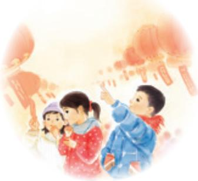

## 第一单元·识字

春夏秋冬…… … 2  
姓氏歌. 4  
小青蛙 6  
猜字谜 8  
语文园地一 . 10  
快乐读书吧 读读童谣和儿歌……15

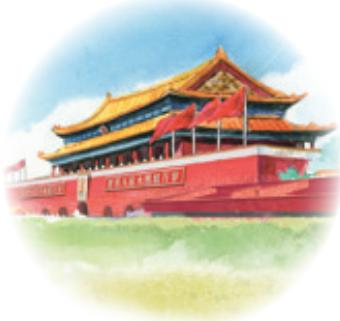

## 第二单元·阅读

热爱中国共产党   
2 吃水不忘挖井人   
3 我多想去看看… …20   
语文园地二 …22

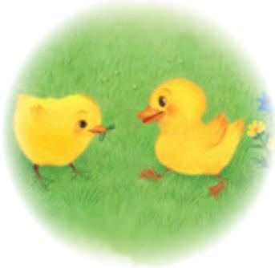

## 第三单元·阅读

小公鸡和小鸭子 …… 26  
树和喜鹊 …………29  
怎么都快乐 ... 31  
语文园地三 ……34

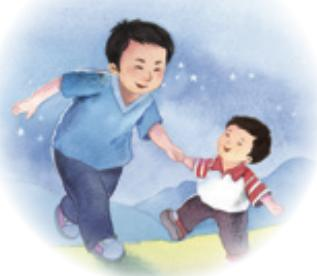

## 第四单元·阅读

静夜思 … ………39  
8 夜色.. ……40  
9 端午粽  
C 语文园地四 ……44

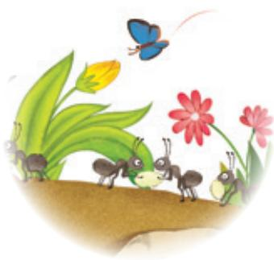

## 第五单元·识字

动物儿歌… ……48   
古对今 ……50   
操场上 …52   
8 人之初 …54   
O 语文园地五 ……56

## 第六单元·阅读

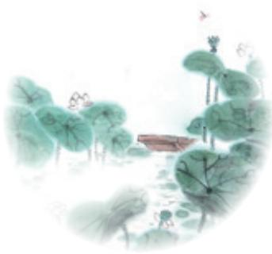

10 古诗二首…61   
……61   
……62   
11   
12 荷叶圆圆. …… …… 66   
13 要下雨了 .…… 69   
O 语文园地六 ……73

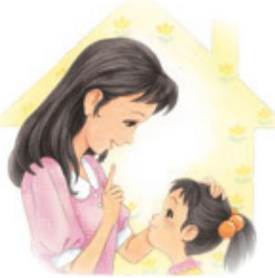

## 第七单元·阅读

14 文具的家 ……78  
15 一分钟. ……81  
16 动物王国开大会…………84  
17 小猴子下山 ……90  
O 语文园地七……… ……93

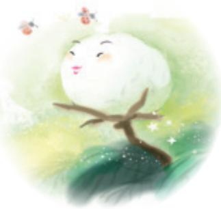

## 第八单元·阅读

18 棉花姑娘 … .... 98  
19 咕咚： ……102  
20 小壁虎借尾巴…… ……105  
O 语文园地八……………109  
识字表 ……114  
常用偏旁名称表 ……120

第一单元·识字

chūn xià qiū dōng

# ①春夏秋冬

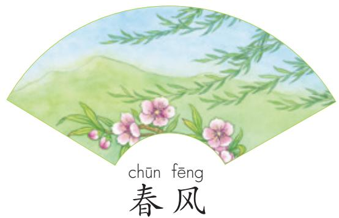

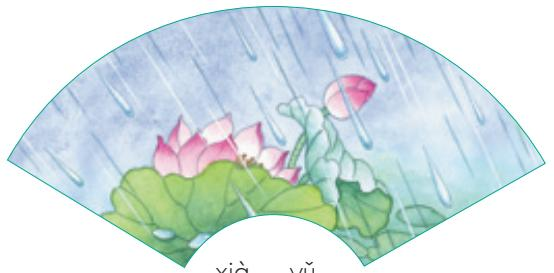

xià yǔ 夏雨

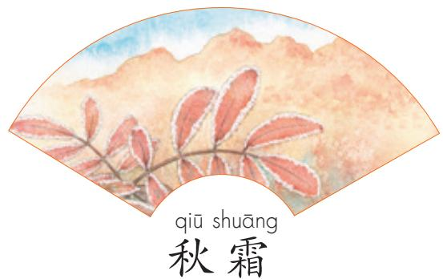

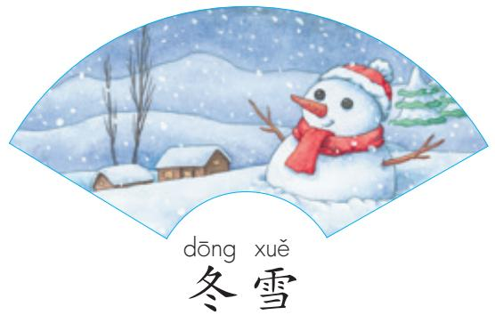

# chūn fēng chuī xià yǔ luò qiū shuāng jiàng dōng xuě piāo 春风吹 夏雨落 秋霜降 冬雪飘

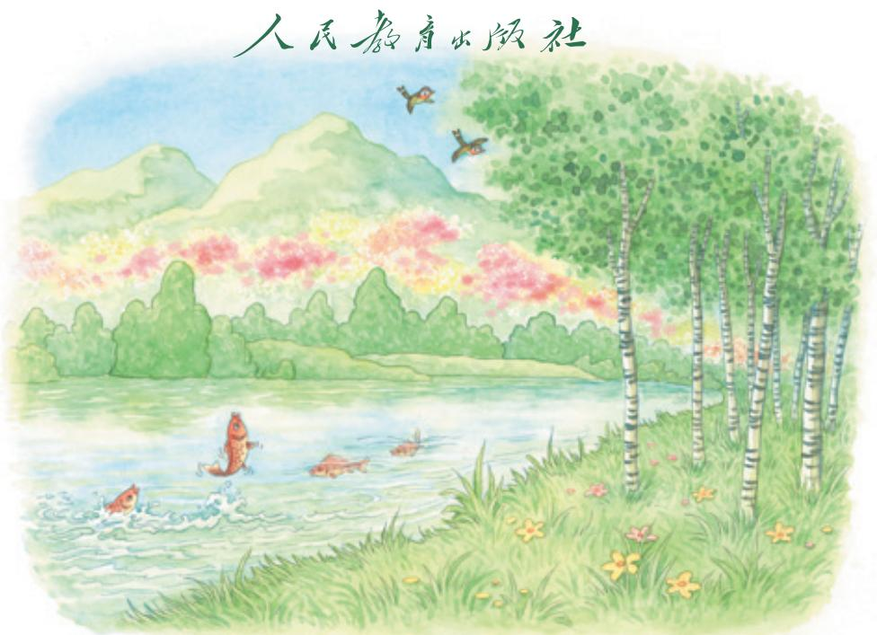

chí cǎo qīng 池草青

shuāng chuī luò jiàng piāo yóu chí rù 霜吹落降飘游池入

<table><tr><td rowspan=1 colspan=1>夕</td><td rowspan=1 colspan=2></td><td rowspan=1 colspan=1></td><td rowspan=1 colspan=1></td><td rowspan=1 colspan=1></td><td rowspan=1 colspan=1></td></tr><tr><td rowspan=1 colspan=1></td><td rowspan=1 colspan=2></td><td rowspan=1 colspan=1></td><td rowspan=1 colspan=1></td><td rowspan=1 colspan=1></td><td rowspan=1 colspan=1></td></tr><tr><td rowspan=2 colspan=1>花</td><td rowspan=1 colspan=2></td><td rowspan=1 colspan=1></td><td rowspan=1 colspan=1></td><td rowspan=1 colspan=1></td><td rowspan=1 colspan=1></td></tr><tr><td rowspan=1 colspan=2></td><td rowspan=1 colspan=1></td><td rowspan=1 colspan=1></td><td rowspan=1 colspan=1></td><td rowspan=1 colspan=1></td></tr><tr><td rowspan=1 colspan=1></td><td rowspan=1 colspan=2></td><td rowspan=1 colspan=1></td><td rowspan=1 colspan=1></td><td rowspan=1 colspan=1></td><td rowspan=1 colspan=1></td></tr><tr><td rowspan=1 colspan=1>八</td><td rowspan=1 colspan=1></td><td rowspan=1 colspan=1></td><td rowspan=1 colspan=1></td><td rowspan=1 colspan=1></td><td rowspan=1 colspan=1></td><td rowspan=1 colspan=1></td></tr></table>

  
朗读课文。背诵课文。

## xìng shì gē ②姓氏歌

nǐ xìng shén me wǒ xìng lǐ你姓什么？我姓李。

shén me lǐ mù zǐ lǐ什么李？木子李。

tā xìng shén me tā xìng zhāng 他姓什么？他姓张。

shén me zhāng gōng cháng zhāng 什么张？弓长张。

gǔ yuè hú kǒu tiān wú 古月胡，口天吴， shuāng rén xú yán wǔ xǔ 双人徐，言午许。

zhōng guó xìng shì yǒu hěn duō 中国姓氏有很多， zhào qián sūn lǐ 赵、钱、孙、李， zhōu wú zhèngwáng 周、吴、郑、王， zhū gě dōng fāng 诸葛、东方， shàng guān ōu yáng 上官、欧阳…

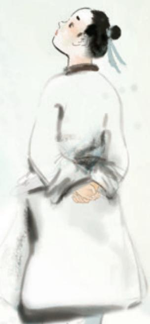

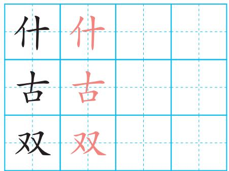

# shì shén lǐ zhāng gōng gǔ hú wú yán sūn 氏什李张弓古胡吴言孙

<table><tr><td rowspan=1 colspan=1></td><td rowspan=1 colspan=1></td><td rowspan=1 colspan=1></td><td rowspan=1 colspan=1></td><td rowspan=1 colspan=1></td><td rowspan=1 colspan=1></td><td rowspan=1 colspan=1></td><td rowspan=1 colspan=1></td></tr><tr><td rowspan=1 colspan=2></td><td rowspan=1 colspan=1></td><td rowspan=1 colspan=1></td><td rowspan=1 colspan=1></td><td rowspan=1 colspan=1></td><td rowspan=1 colspan=1></td><td rowspan=1 colspan=1></td></tr><tr><td rowspan=2 colspan=2>胡</td><td rowspan=2 colspan=1></td><td rowspan=2 colspan=1></td><td rowspan=1 colspan=1></td><td rowspan=1 colspan=1></td><td rowspan=1 colspan=1></td><td rowspan=1 colspan=1></td></tr><tr><td rowspan=1 colspan=1></td><td rowspan=1 colspan=1></td><td rowspan=1 colspan=1></td><td rowspan=1 colspan=1></td></tr><tr><td rowspan=2 colspan=2>言</td><td rowspan=1 colspan=2>言</td><td rowspan=1 colspan=1></td><td rowspan=1 colspan=1></td><td rowspan=1 colspan=1></td><td rowspan=1 colspan=1></td></tr><tr><td rowspan=1 colspan=1></td><td rowspan=1 colspan=1></td><td rowspan=1 colspan=1></td><td rowspan=1 colspan=1></td><td rowspan=1 colspan=1></td><td rowspan=1 colspan=1></td></tr></table>

## 朗读课文。背诵课文。

照样子做问答游戏。

你姓什么？

我姓张。

什么张？

弓长张。

介绍自己姓什么，可以用不同的方法。

你姓什么？

我姓方。

什么方？

方向的方。

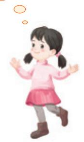

  
选做：班里的同学都有哪些姓？认一认，说一说。

xiǎo qīng wā ③小青蛙 1

hé shuǐ qīng qīng tiān qì qíng 河水清清天气晴， xiǎo xiǎo qīng wā dà yǎn jing 小小青蛙大眼睛。 bǎo hù hé miáo chī hài chóng 保护禾苗吃害虫， zuò le bù shǎo hǎo shì qing 做了不少好事情。 qǐng nǐ ài hù xiǎo qīng wā 请你爱护小青蛙 hǎo ràng hé miáo bù shēng bìng 好让禾苗不生病。

①本文选自四川人民出版社《字族文识字读本（第一册)》，有改动。

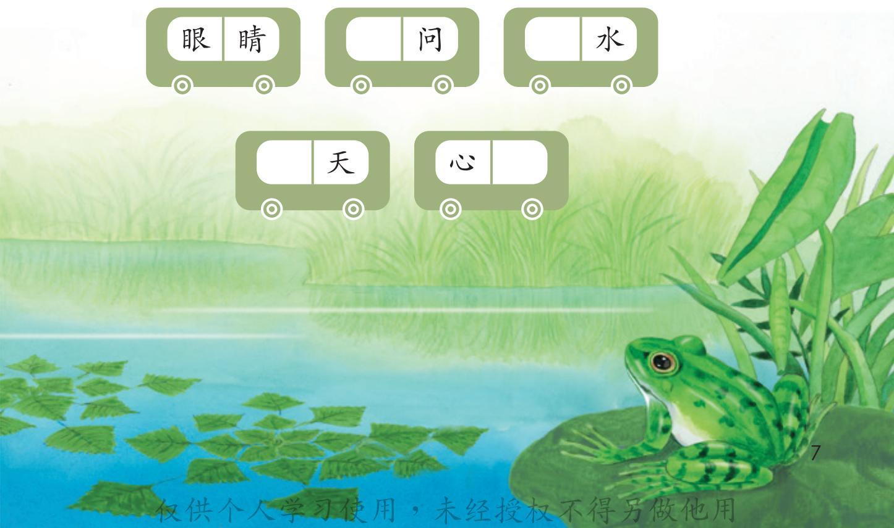

hé qíng yǎn jīng bǎo hù miáo chī shì qíng qǐng ràng 河晴眼睛保护苗吃事情请让

青青

清清

晴晴

苗苗

请请

生生

朗读课文。

读一读下面的字，说说你发现了什么，再填一填。

睛 情 晴 清 请

# cāi zì mí ④猜字谜

读了第一句话，我猜这应该是左右结构的字。

(一)

zuǒ biān lù yòu biān hóng 左边绿，右边红， zuǒ yòu xiāng yù qǐ liáng fēng 左右相遇起凉风。 lù de xǐ huan jí shí yǔ 绿的喜欢及时雨， hóng de zuì pà shuǐ lái gōng 红的最怕水来攻。

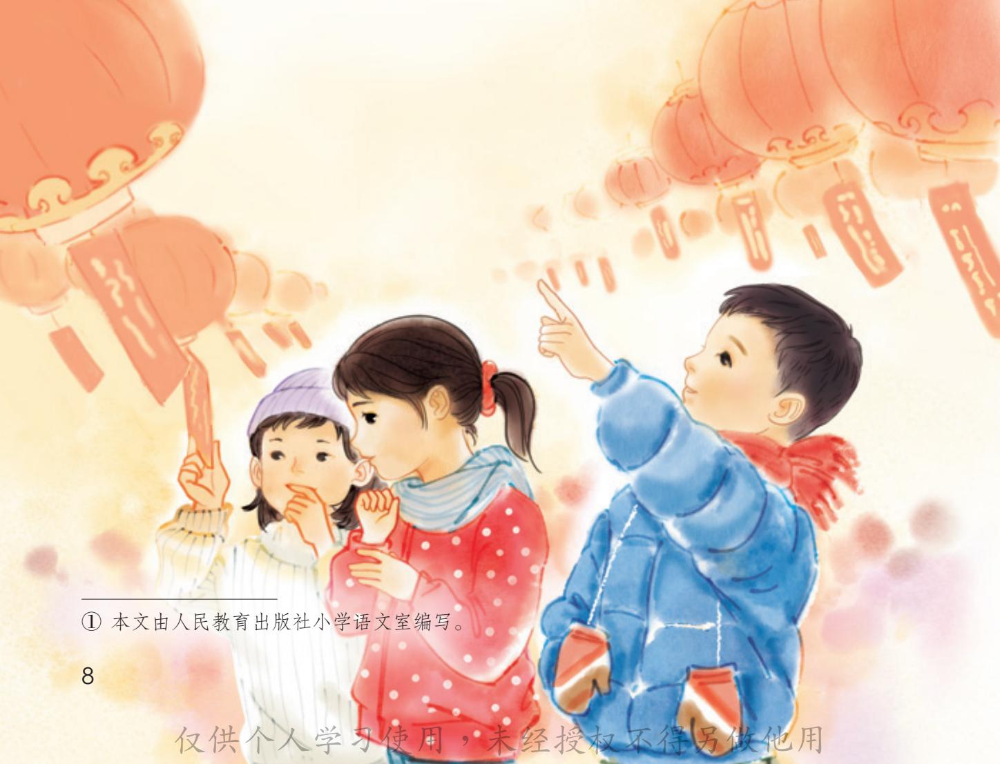

(二)

要猜的字加上不同的偏旁，可以组成新的字。

yán lái hù xiāng zūn zhòng 66 言”来互相尊重，

xīn zhì lìng rén gǎn dòng “心”至令人感动，

rì chū wàn lǐ wú yún “日”出万里无云，

shuǐ dào chún jìng tòu míng “水”到纯净透明。

cāi biān liáng xǐ huān shí pà gōng lìng gǎn dòng wàn wú 猜边凉喜欢时怕攻令感动万无

动动

无无

万万

明明

## 猜一猜。

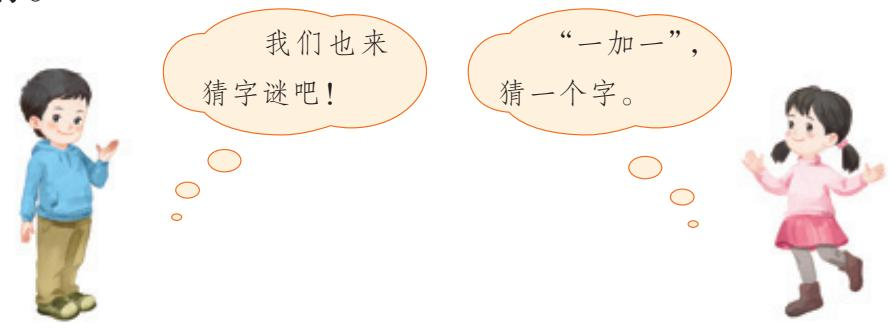

# 语文园地一

## 识字加油站

识字 组词 读课文

jì suàn jiǎn liè shì计算 减法 列算式

tú xíng kǎ hé chàng tuán 图形 卡片 合唱团

我在课本上见过这些词语。

shí zǔ jì suàn jiǎn shì tú xíng kǎ hé chàng tuán 识组计算减式图形卡合唱团

77

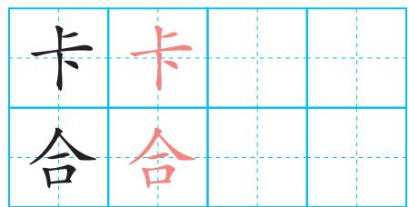

## 字词句运用

读一读，说说你发现了什么，再写一写。

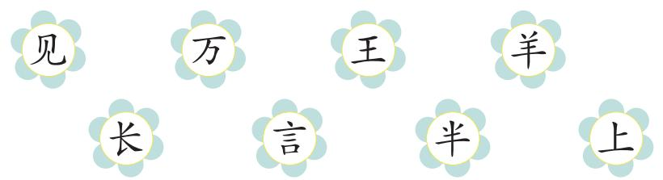

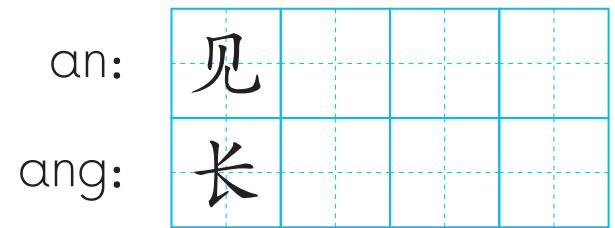

## 人民教育出版社

读一读，记一记《汉语拼音字母表》。

<table><tr><td>A B C D b d a C</td></tr><tr><td>f e g H 1 J K L M N k 1 i</td></tr><tr><td>h j m n O P ā R à T</td></tr><tr><td>O p q t r à</td></tr><tr><td>U V W X Y Z</td></tr><tr><td>u V W X y Z</td></tr></table>

## 读一读。

## zǔ guó duō me guǎng dà ① 祖国多么广大

dà xīng ān lǐng 大兴安岭，

xuě huā hái zài fēi wǔ 雪花还在飞舞。

cháng jiāng liǎng àn 长江两岸，

liǔ zhī yǐ jīng fā yá柳枝已经发芽。

hǎi nán dǎo shàng海南岛上，

dào chù shèng kāi zhe xiān huā 到处盛开着鲜花。

wǒ men de zǔ guó duō me guǎng dà我们的祖国多么广大。

## 书写提示

<table><tr><td rowspan=2 colspan=2>田田</td><td rowspan=1 colspan=1></td><td rowspan=1 colspan=1></td><td rowspan=1 colspan=1></td><td rowspan=1 colspan=1></td><td rowspan=1 colspan=1></td><td rowspan=1 colspan=1></td></tr><tr><td rowspan=1 colspan=1></td><td rowspan=1 colspan=1></td><td rowspan=1 colspan=1></td><td rowspan=1 colspan=1></td><td rowspan=1 colspan=1></td><td rowspan=1 colspan=1></td></tr><tr><td rowspan=2 colspan=1></td><td rowspan=2 colspan=1></td><td rowspan=2 colspan=1></td><td rowspan=2 colspan=1></td><td rowspan=1 colspan=1></td><td rowspan=1 colspan=1></td><td rowspan=1 colspan=1></td><td rowspan=1 colspan=1></td></tr><tr><td rowspan=1 colspan=1></td><td rowspan=1 colspan=1></td><td rowspan=1 colspan=1></td><td rowspan=1 colspan=1></td></tr><tr><td rowspan=2 colspan=1>白</td><td rowspan=2 colspan=1>日</td><td rowspan=1 colspan=1></td><td rowspan=1 colspan=1></td><td rowspan=1 colspan=1></td><td rowspan=1 colspan=1></td><td rowspan=1 colspan=1></td><td rowspan=1 colspan=1></td></tr><tr><td rowspan=1 colspan=1></td><td rowspan=1 colspan=1></td><td rowspan=1 colspan=1></td><td rowspan=1 colspan=1></td><td rowspan=1 colspan=1></td><td rowspan=1 colspan=1></td></tr></table>

笔顺规则：先外后内再封口。

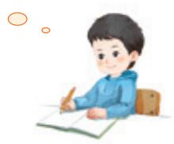

## 日积月累

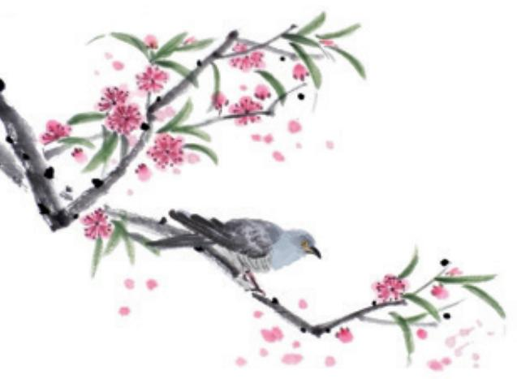

chūn xiǎo 春晓

táng mèng hào rán [唐]孟浩然

chūn mián bù jué xiǎo 春眠不觉晓， chù chù wén tí niǎo 处处闻啼鸟。 yè lái fēng yǔ shēng 夜来风雨声， huā luò zhī duō shǎo 花落知多少。

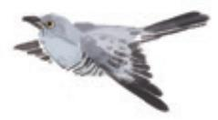

# qǐng nǐ bāng gè máng 请你帮个忙

yǒu shí hou wǒ men xū yào bié rén de bāng zhù gāi zěn yàng qǐng有时候我们需要别人的帮助，该怎样请qiú bāng zhù ne求帮助呢？

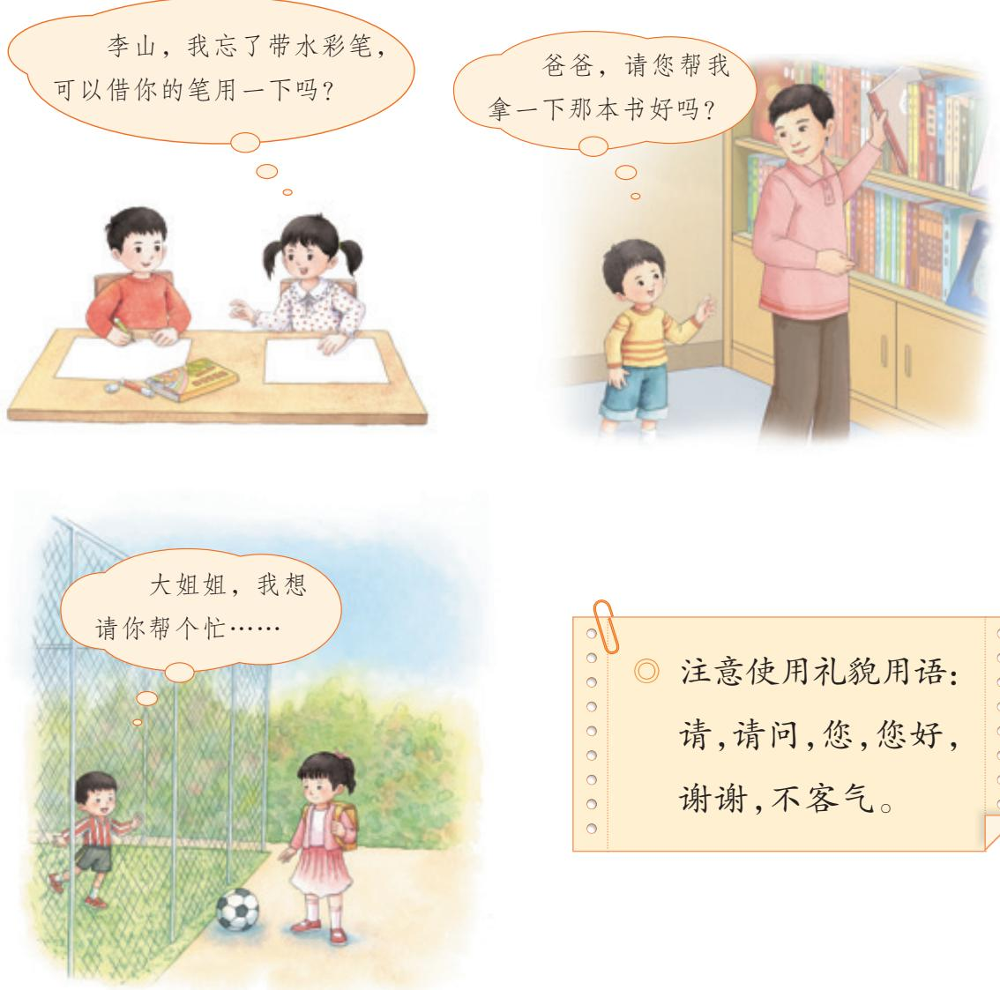

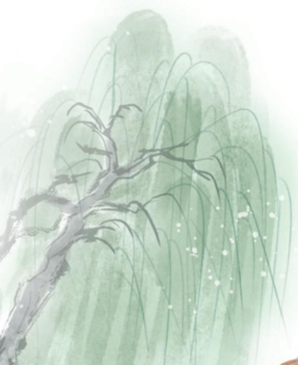

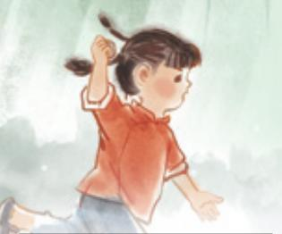

① 本文是传统绕口令。

## niū niu gǎn niú 妞妞赶牛

niū niu gǎn niú hé biān zǒu 妞妞赶牛河边走， niú niu yào chī hé biān liǔ 牛牛要吃河边柳， niū niu hù liǔ niǔ niú zǒu 妞妞护柳扭牛走， niú niu niǔ tóu dǐng niū niu 牛牛扭头顶妞妞， niū niu niù bú guò niú niu 妞妞拗不过牛牛， dī tóu jiǎn qǐ xiǎo shí tou 低头捡起小石头， xià de niú niu niǔ tóu zǒu 吓得牛牛扭头走。

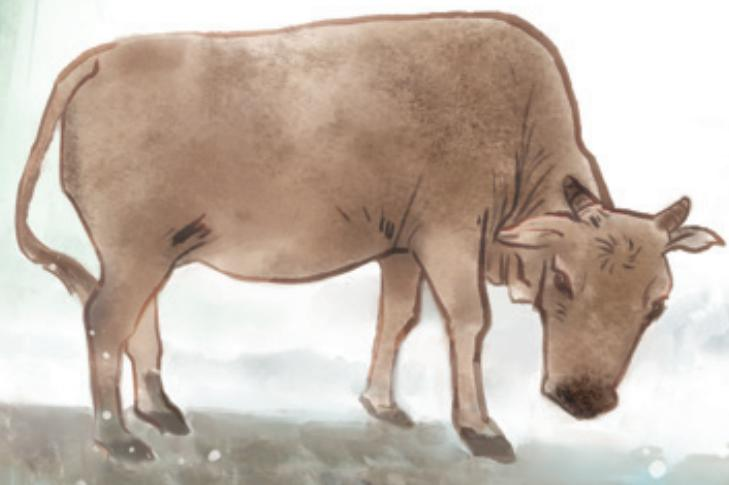

# 快乐读书吧

# dú du tóng yáo hé ér gē 读读童谣和儿歌

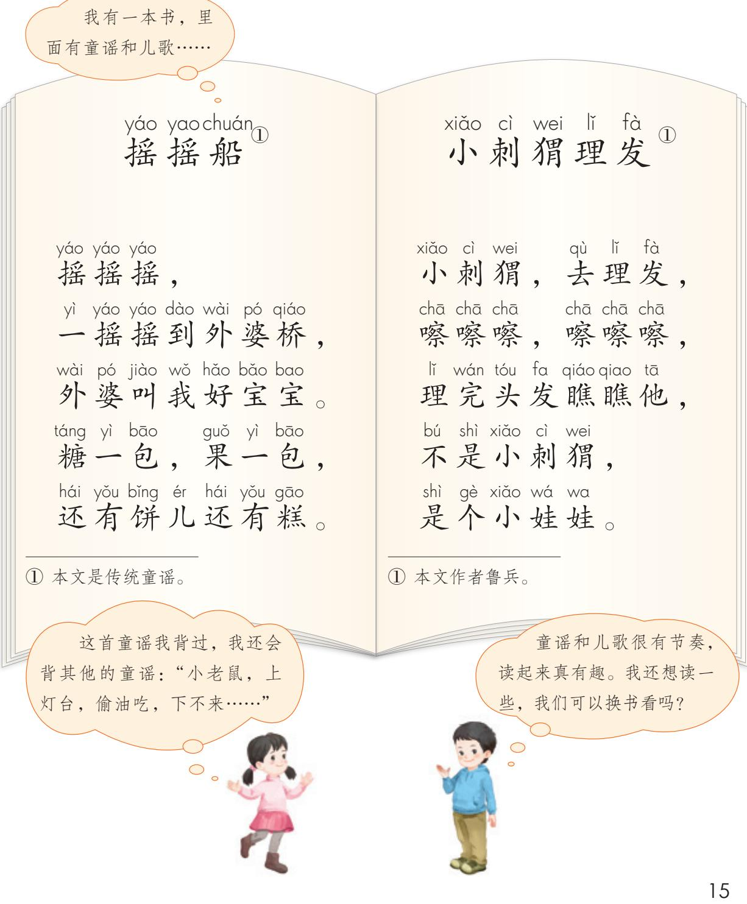

## rè ài zhōng guó gòng chǎn dǎng ①热爱中国共产党

huā ér xǐ huan tài yáng 花儿喜欢太阳， huā ér zài yáng guāng xià kāi fàng 花儿在阳光下开放。

niǎo ér xǐ huan lán tiān 鸟儿喜欢蓝天，

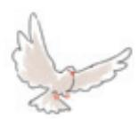

niǎo ér zài tiān kōng zhōng fēi xiáng 鸟儿在天空中飞翔。

wǒ men rè ài zhōng guó gòng chǎn dǎng我们热爱中国共产党，

wǒ men zài dǎng de huái bào lǐ xìng fú chéng zhǎng 我们在党的怀抱里幸福成长。

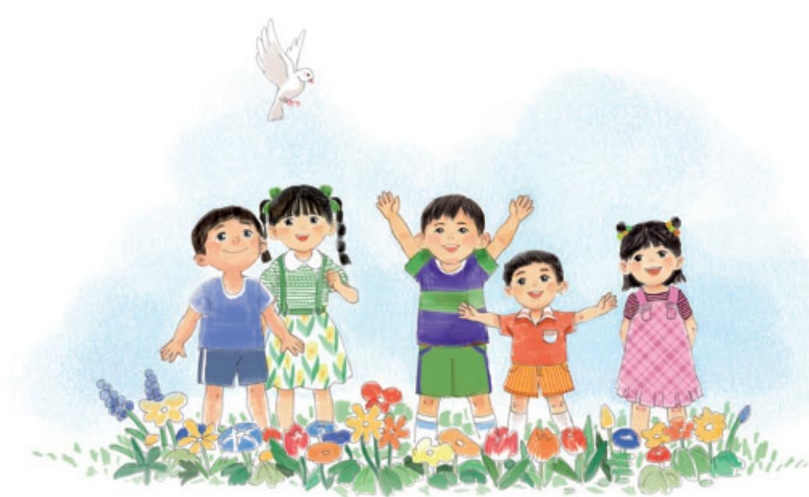  
①本文选自人民教育出版社《义务教育五年制小学教科书（试用本）语文第二册》。

## 人民教育出版社

rè ài gòng chǎn dǎng tài yáng guāng huái bào xìng fú chéng 热爱共产党太阳光怀抱幸福成

共共

党党

阳阳

立

太太

光光

朗读课文。

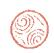

读一读。

花儿

花儿开放。

花儿在阳光下开放。

我们

我们成长。

我们在党的怀抱里幸福成长。

# chī shuǐ bú wàng wā jǐng rén 2 吃水不忘挖井人 ①

ruì jīn chéng wài yǒu gè cūn zi jiào shā zhōu bà máo zhǔ xí zài 瑞金城外有个村子叫沙洲坝，毛主席在 jiāng xī lǐng dǎo gé mìng de shí hou zài nàr zhù guo 江西领导革命的时候，在那儿住过。

cūn zi lǐ méi yǒu shuǐ jǐng xiāng qīn men chī shuǐ yào dào hěn yuǎn 村子里没有水井，乡亲们吃水要到很远 de dì fang qù tiāo máo zhǔ xí jiù dài lǐng zhàn shì hé xiāng qīn men wā 的地方去挑。毛主席就带领战士和乡亲们挖 le yì kǒu jǐng 了一口井。

jiě fàng yǐ hòu xiāng 解放以后，乡 qīn men zài jǐng páng biān lì 亲们在井旁边立 le yí kuài shí bēi shàng miàn 了一块石碑，上面 kè zhe chī shuǐ bú wàng 刻着：“吃水不忘 wā jǐng rén shí kè xiǎng niàn 挖井人，时刻想念 máo zhǔ xí 毛主席。”

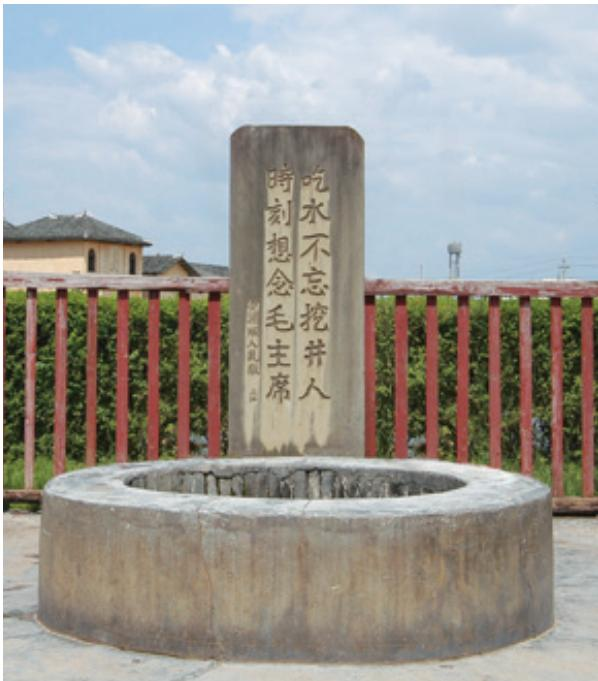

jǐng chéng cūn máo zhǔ xí zhù xiāng qīn zhàn shì xiǎng niàn 井城村毛主席住乡亲战士想念

井井

江江

方方

主主

住住

后后

朗读课文，注意读好词语之间的停顿。

读一读，记一记。

水井 井口

乡村 村子

想念 念书

主席 主动

乡亲 亲人

战士

战友

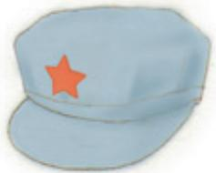

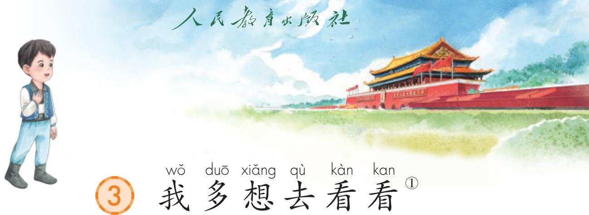

mā ma gào su wǒ yán zhe wān wān de xiǎo lù jiù huì zǒu 妈妈告诉我，沿着弯弯的小路，就会走 chū tiān shān yáo yuǎn de běi jīng yǒu yí zuò xióng wěi de tiān ān 出天山。遥远的北京，有一座雄伟的天安 mén guǎng chǎng shàng de shēng qí yí shì fēi cháng zhuàng guān wǒ duì mā 门，广场上的升旗仪式非常壮观。我对妈 mα shuō wǒ duō xiǎng qù kàn kan wǒ duō xiǎng qù kàn kan 妈说，我多想去看看，我多想去看看！

bà ba gào su wǒ yán zhe kuān kuān de gōng lù jiù huì zǒu 爸爸告诉我，沿着宽宽的公路，就会走 chū běi jīng yáo yuǎn de xīn jiāng yǒu měi lì de tiān shān xuě shān 出北京。遥远的新疆，有美丽的天山，雪山 shàng shèng kāi zhe jié bái de xuě lián wǒ duì bà ba shuō wǒ duō xiǎng 上盛开着洁白的雪莲。我对爸爸说，我多想 qù kàn kan wǒ duōxiǎng qù kàn kan 去看看，我多想去看看！

# gào sù zǒu jīng zuò ān guǎng chǎng fēi kuān lì jié 告诉走京座安广场非宽丽洁

<table><tr><td rowspan=2 colspan=1>合</td><td rowspan=2 colspan=1></td><td rowspan=2 colspan=2></td><td rowspan=1 colspan=1></td><td rowspan=1 colspan=1></td><td rowspan=1 colspan=1></td><td rowspan=1 colspan=1></td></tr><tr><td rowspan=1 colspan=1></td><td rowspan=1 colspan=1></td><td rowspan=1 colspan=1></td><td rowspan=1 colspan=1></td></tr><tr><td rowspan=2 colspan=1>会</td><td rowspan=1 colspan=1></td><td rowspan=1 colspan=1></td><td rowspan=1 colspan=1></td><td rowspan=1 colspan=1></td><td rowspan=1 colspan=1></td><td rowspan=1 colspan=1></td><td rowspan=1 colspan=1></td></tr><tr><td rowspan=1 colspan=1></td><td rowspan=1 colspan=2></td><td rowspan=1 colspan=1></td><td rowspan=1 colspan=1></td><td rowspan=1 colspan=1></td><td rowspan=1 colspan=1></td></tr><tr><td rowspan=1 colspan=2></td><td rowspan=1 colspan=2></td><td rowspan=1 colspan=1></td><td rowspan=1 colspan=1></td><td rowspan=1 colspan=1></td><td rowspan=1 colspan=1></td></tr><tr><td rowspan=1 colspan=2>小</td><td rowspan=1 colspan=2></td><td rowspan=1 colspan=1></td><td rowspan=1 colspan=1></td><td rowspan=1 colspan=1></td><td rowspan=1 colspan=1></td></tr></table>

<table><tr><td rowspan=2 colspan=1>白</td><td rowspan=1 colspan=1></td><td rowspan=1 colspan=1></td><td rowspan=1 colspan=1></td><td rowspan=1 colspan=1></td><td rowspan=1 colspan=1></td><td rowspan=1 colspan=1></td><td rowspan=1 colspan=1></td></tr><tr><td rowspan=1 colspan=1>J</td><td rowspan=1 colspan=1></td><td rowspan=1 colspan=1></td><td rowspan=1 colspan=1></td><td rowspan=1 colspan=1></td><td rowspan=1 colspan=1></td><td rowspan=1 colspan=1></td></tr><tr><td rowspan=2 colspan=1></td><td rowspan=1 colspan=1></td><td rowspan=1 colspan=1></td><td rowspan=1 colspan=1></td><td rowspan=1 colspan=1></td><td rowspan=1 colspan=1></td><td rowspan=1 colspan=1></td><td rowspan=1 colspan=1></td></tr><tr><td rowspan=1 colspan=1>C</td><td rowspan=1 colspan=1></td><td rowspan=1 colspan=1></td><td rowspan=1 colspan=1></td><td rowspan=1 colspan=1></td><td rowspan=1 colspan=1></td><td rowspan=1 colspan=1></td></tr><tr><td rowspan=2 colspan=1></td><td rowspan=1 colspan=1></td><td rowspan=1 colspan=1></td><td rowspan=1 colspan=1></td><td rowspan=1 colspan=1></td><td rowspan=1 colspan=1></td><td rowspan=1 colspan=1></td><td rowspan=1 colspan=1></td></tr><tr><td rowspan=1 colspan=1></td><td rowspan=1 colspan=1></td><td rowspan=1 colspan=1></td><td rowspan=1 colspan=1></td><td rowspan=1 colspan=1></td><td rowspan=1 colspan=1></td><td rowspan=1 colspan=1></td></tr></table>

朗读课文。说一说两个小朋友的愿望分别是什么。

读一读，记一记。

弯弯的小路

美丽的天山

雄伟的天安门

宽宽的公路

洁白的雪莲

zhuàng guān yí壮观的升旗仪式

你的愿望是什么？和同学说一说。还可以把说的写下来。

# 语文园地二

## 识字加油站

我能读出這些學习要求，还能照着做。

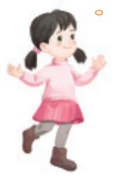

拼一拼，写一写。

rèn lián 认一认，连一连。

xuǎn quān选一选，圈一圈。

tú tián 涂一涂，填一填。

shì liàn 试一试，练一练。

rèn lián xuǎn quān tú tián shì liàn 认连选圈涂填试练

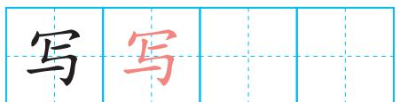

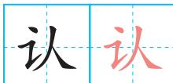

## 字词句运用

找一找，连一连。

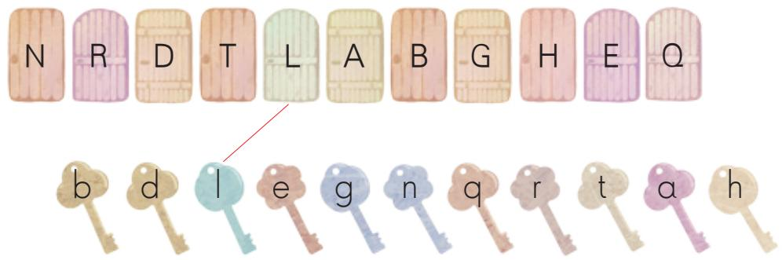

## 读一读，说一说你发现了什么。

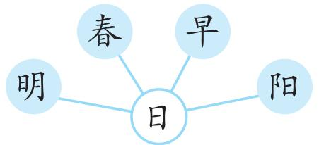

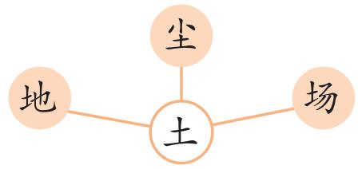

## 你在商店买东西时认识了哪些字？和同学交流。

直尺

牙 骨

chèn shān 衬衫

xiàng 橡皮

水杯

tào 外套

水彩笔

洗手液 xǐ

运动鞋 xié

## 日积月累

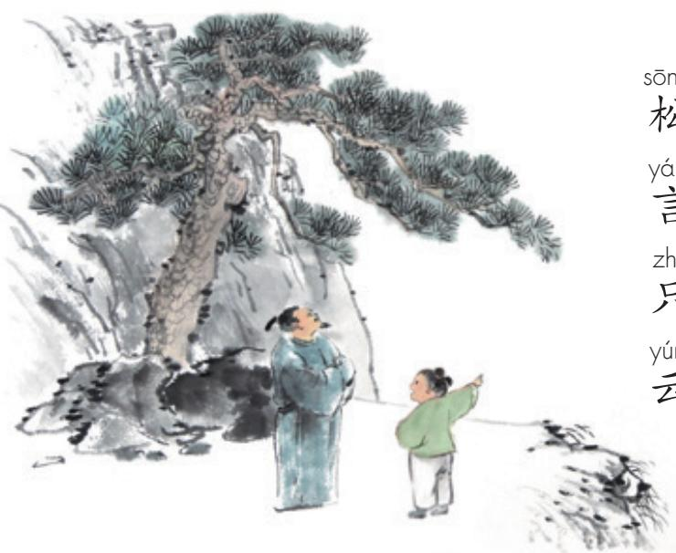

## xún yǐn zhě bú yù 寻隐者不遇

táng jiǎ dǎo [唐]贾岛

sōng xià wèn tóng zǐ 松下问童子， yán shī cǎi yào qù 言师采药去。 zhǐ zài cǐ shān zhōng 只在此山中， yún shēn bù zhī chù 云深不知处。

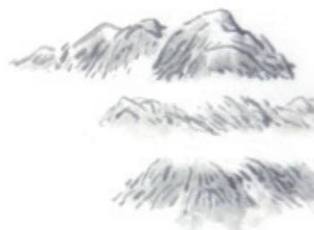

## 和大人一起读

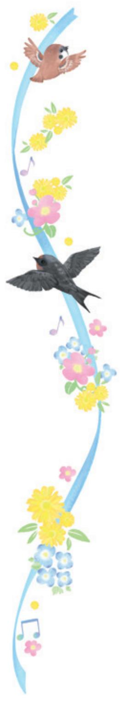

## kuài lè de jié rì 快乐的节日

xiǎo niǎo zài qián miàn dài lù   
小鸟在前面带路，   
fēng a chuī xiàng wǒ men   
风啊吹向我们。   
wǒ men xiàng chūn tiān yí yàng   
我们像春天一样，   
lái dào huā yuán lǐ lái dào cǎo dì shàng   
来到花园里，来到草地上。 xiān yàn de hóng lǐng jīn měi lì de yī shang 鲜艳的红领巾，美丽的衣裳， xiàng xǔ duō huā ér kāi fàng   
像许多花儿开放。   
huā ér xiàng wǒ men diǎn tóu   
花儿向我们点头，   
bái yáng shù huā lā lā xiǎng 白杨树哗啦啦响。 tā men tóng měi lì de xiǎo niǎo 它们同美丽的小鸟   
xiàng wǒ men zhù hè xiàng wǒ men gē chàng   
向我们祝贺，向我们歌唱。

tā men dōu shuō shì jiè shàng 它们都说世界上 yǒu wǒ men jiù gèng měi lì 有我们就更美丽。

gǎn xiè qīn ài de zǔ guó 感谢亲爱的祖国， ràng wǒ men zì yóu de chéng zhǎng 让我们自由地成长。 wǒ men xiàng xiǎo niǎo yí yàng 我们像小鸟一样， 2 děng shēn shàng de yǔ máo zhǎng de fēng mǎn 等身上的羽毛长得丰满， jiù yǒng gǎn de xiàng zhe gāo kōng fēi xiáng 就勇敢地向着高空飞翔， fēi xiàng wǒ men de lǐ xiǎng 飞向我们的理想。

tiào a tiào a tiào a   
跳啊，跳啊，跳啊！   
qīn ài de shū shu ā yí men   
亲爱的叔叔阿姨们，   
tóng wǒ men yì qǐ guò zhe kuài lè de jié rì 同我们一起过着快乐的节日。

# xiǎo gōng jī hé xiǎo yā zi小公鸡和小鸭子

xiǎo gōng jī hé xiǎo yā zi yí kuàir chū 小公鸡和小鸭子一块儿出 qù wán 去玩。

tā men zǒu jìn cǎo dì lǐ xiǎo gōng jī 他们走进草地里。小公鸡 zhǎo dào le xǔ duō chóng zi chī de hěn huān 找到了许多虫子，吃得很欢。 xiǎo yā zi zhuō bú dào chóng zi jí de zhí 小鸭子捉不到虫子，急得直 kū xiǎo gōng jī kàn jiàn le zhuō dàochóng zi 哭。小公鸡看见了，捉到虫子 jiù gěi xiǎo yā zi chī 就给小鸭子吃。

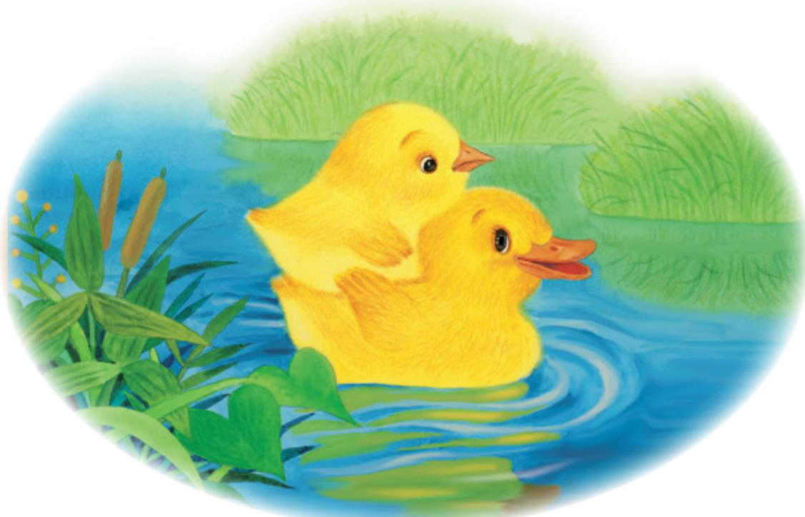

tā men zǒu dào xiǎo hé biān xiǎo yā zi shuō gōng jī dì 他们走到小河边。小鸭子说：“公鸡弟 di wǒ dào hé lǐ zhuō yú gěi nǐ chī xiǎo gōng jī shuō wǒ 弟，我到河里捉鱼给你吃。”小公鸡说：“我 yě qù xiǎo yā zi shuō bù xíng bù xíng nǐ bú huì yóu 也去。”小鸭子说：“不行，不行，你不会游 yǒng huì yān sǐ de xiǎo gōng jī bú xìn tōu tōu de gēn zài 泳，会淹死的！”小公鸡不信，偷偷地跟在 xiǎo yā zi hòu miàn yě xià le shuǐ 小鸭子后面，也下了水。

xiǎo yā zi zhèng zài shuǐ lǐ zhuō yú hū rán tīng jiàn xiǎo gōng jī 小鸭子正在水里捉鱼，忽然听见小公鸡 hǎn jiù mìng tā fēi kuài de yóu dào xiǎo gōng jī shēn biān ràng xiǎo gōng 喊救命。他飞快地游到小公鸡身边，让小公 jī zuò zài zì jǐ de bèi shàng xiǎo gōng jī shàng le àn xiào zhe duì 鸡坐在自己的背上。小公鸡上了岸，笑着对 xiǎo yā zi shuō yā zi gē ge xiè xie nǐ 小鸭子说：“鸭子哥哥，谢谢你。”

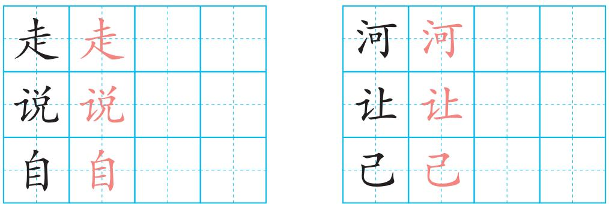

<table><tr><td rowspan=2 colspan=2>河河</td><td rowspan=1 colspan=2></td><td rowspan=1 colspan=1></td><td rowspan=1 colspan=1></td><td rowspan=1 colspan=1></td><td rowspan=1 colspan=1></td></tr><tr><td rowspan=1 colspan=2></td><td rowspan=1 colspan=1></td><td rowspan=1 colspan=1></td><td rowspan=1 colspan=1></td><td rowspan=1 colspan=1></td></tr><tr><td rowspan=2 colspan=1></td><td rowspan=1 colspan=1>L</td><td rowspan=1 colspan=1></td><td rowspan=1 colspan=1></td><td rowspan=1 colspan=1></td><td rowspan=1 colspan=1></td><td rowspan=1 colspan=1></td><td rowspan=1 colspan=1></td></tr><tr><td rowspan=1 colspan=1></td><td rowspan=1 colspan=1></td><td rowspan=1 colspan=1></td><td rowspan=1 colspan=1></td><td rowspan=1 colspan=1></td><td rowspan=1 colspan=1></td><td rowspan=1 colspan=1></td></tr><tr><td rowspan=2 colspan=1>己</td><td rowspan=1 colspan=1></td><td rowspan=1 colspan=1></td><td rowspan=1 colspan=1></td><td rowspan=1 colspan=1></td><td rowspan=1 colspan=1></td><td rowspan=1 colspan=1></td><td rowspan=1 colspan=1></td></tr><tr><td rowspan=1 colspan=1></td><td rowspan=1 colspan=1></td><td rowspan=1 colspan=1></td><td rowspan=1 colspan=1></td><td rowspan=1 colspan=1></td><td rowspan=1 colspan=1></td><td rowspan=1 colspan=1></td></tr></table>

wán de jí zhí kū gēn hū rán tīng hǎn kuài jǐ bèi 玩得急直哭跟忽然听喊快己背

<table><tr><td rowspan=1 colspan=1></td><td rowspan=1 colspan=1>二</td><td rowspan=1 colspan=1></td><td rowspan=1 colspan=1></td><td rowspan=1 colspan=1></td><td rowspan=1 colspan=1></td><td rowspan=1 colspan=1></td><td rowspan=1 colspan=1></td></tr><tr><td rowspan=1 colspan=1>人</td><td rowspan=1 colspan=1>C</td><td rowspan=1 colspan=1></td><td rowspan=1 colspan=1></td><td rowspan=1 colspan=1></td><td rowspan=1 colspan=1></td><td rowspan=1 colspan=1></td><td rowspan=1 colspan=1></td></tr><tr><td rowspan=1 colspan=1></td><td rowspan=1 colspan=1></td><td rowspan=1 colspan=1></td><td rowspan=1 colspan=1></td><td rowspan=1 colspan=1></td><td rowspan=1 colspan=1></td><td rowspan=1 colspan=1></td><td rowspan=1 colspan=1></td></tr><tr><td rowspan=1 colspan=1>と</td><td rowspan=1 colspan=1>し</td><td rowspan=1 colspan=1></td><td rowspan=1 colspan=1></td><td rowspan=1 colspan=1></td><td rowspan=1 colspan=1></td><td rowspan=1 colspan=1></td><td rowspan=1 colspan=1></td></tr><tr><td rowspan=1 colspan=1></td><td rowspan=1 colspan=1></td><td rowspan=1 colspan=1></td><td rowspan=1 colspan=1></td><td rowspan=1 colspan=1></td><td rowspan=1 colspan=1></td><td rowspan=1 colspan=1></td><td rowspan=1 colspan=1></td></tr><tr><td rowspan=1 colspan=1></td><td rowspan=1 colspan=1></td><td rowspan=1 colspan=2>自</td><td rowspan=1 colspan=1></td><td rowspan=1 colspan=1></td><td rowspan=1 colspan=1></td><td rowspan=1 colspan=1></td></tr></table>

朗读课文，读好小公鸡和小鸭子的对话。

读一读，比一比。

mian  
小公鸡跟在小鸭子后面，也下了水。tōu  
小公鸡偷偷地跟在小鸭子后面，也下了水。

小鸭子游到小公鸡身边。

小鸭子飞快地游到小公鸡身边。

# shù hé xǐ què 5 树和喜鹊

cóng qián zhè lǐ zhǐ yǒu yì kē shù shù shàng zhǐ yǒu yí gè从前，这里只有一棵树，树上只有一个  
niǎo wō niǎo wō lǐ zhǐ yǒu yì zhī xǐ què  
鸟窝，鸟窝里只有一只喜鹊。 结合第一自然段，我 结合第一自然段，我マ“孤的”比音用

shù hěn gū dān xǐ què yě hěn gū dān 树很孤单，喜鹊也很孤单。 八。

知道了“孤单”的意思。

hòu lái zhè lǐ zhòng le hǎo duō hǎo duō shù měi kē shù shàng 后来，这里种了好多好多树，每棵树上 dōu yǒu niǎo wō měi gè niǎo wō lǐ dōu yǒu xǐ què 都有鸟窝，每个鸟窝里都有喜鹊。

shù yǒu le lín jū 树有了邻居，   
xǐ què yě yǒu le lín jū   
喜鹊也有了邻居。 měi tiān tiān yí liàng 每天天一亮，   
xǐ què men jī ji zhā zhā   
喜鹊们叽叽喳喳   
jiào jǐ shēng dǎ zhe zhāo   
叫几声，打着招   
hu yì qǐ fēi chū qù le   
呼一起飞出去了。

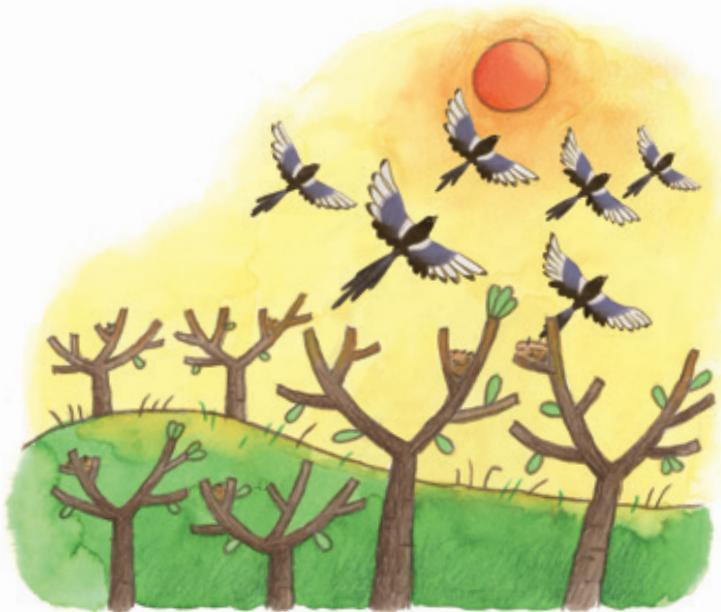

<table><tr><td rowspan=1 colspan=1></td><td rowspan=1 colspan=1></td><td rowspan=1 colspan=1></td><td rowspan=1 colspan=1></td><td rowspan=1 colspan=1></td><td rowspan=1 colspan=1></td><td rowspan=1 colspan=1></td><td rowspan=1 colspan=1></td></tr><tr><td rowspan=1 colspan=2>从</td><td rowspan=1 colspan=1></td><td rowspan=1 colspan=1></td><td rowspan=1 colspan=1></td><td rowspan=1 colspan=1></td><td rowspan=1 colspan=1></td><td rowspan=1 colspan=1></td></tr><tr><td rowspan=2 colspan=2>们们</td><td rowspan=1 colspan=1>7</td><td rowspan=1 colspan=1></td><td rowspan=1 colspan=1></td><td rowspan=1 colspan=1></td><td rowspan=1 colspan=1></td><td rowspan=1 colspan=1></td></tr><tr><td rowspan=1 colspan=1></td><td rowspan=1 colspan=1></td><td rowspan=1 colspan=1></td><td rowspan=1 colspan=1></td><td rowspan=1 colspan=1></td><td rowspan=1 colspan=1></td></tr><tr><td rowspan=1 colspan=2>仙</td><td rowspan=1 colspan=1></td><td rowspan=1 colspan=1></td><td rowspan=1 colspan=1></td><td rowspan=1 colspan=1></td><td rowspan=1 colspan=1></td><td rowspan=1 colspan=1></td></tr><tr><td rowspan=1 colspan=2>他</td><td rowspan=1 colspan=1></td><td rowspan=1 colspan=1></td><td rowspan=1 colspan=1></td><td rowspan=1 colspan=1></td><td rowspan=1 colspan=1></td><td rowspan=1 colspan=1></td></tr></table>

## 人民教育出版社

tiān yì hēi tā men yòu jī ji zhā zhā de yì qǐ fēi huí wō lǐ ān 天一黑，他们又叽叽喳喳地一起飞回窝里，安 ān jìng jìng de shuì jiào le   
安静静地睡觉了。

shù hěn kuài lè xǐ què yě hěn kuài lè 树很快乐，喜鹊也很快乐。

zhǐ hěn gū dān zhòng měi dōu lín jū jiào zhāo hū lè 只很孤单种每都邻居叫招呼乐

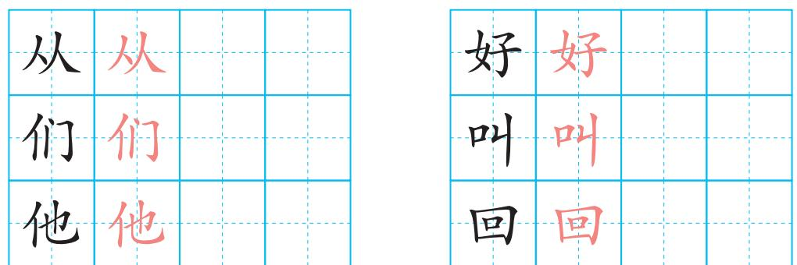

朗读课文，想一想哪些词语要读得重一点儿。

说一说：树和喜鹊后来为什么很快乐？

读一读，记一记。

què jī zhā   
从前 喜鹊 孤单 叽叽喳喳 jìng   
後來 邻居 快乐 安安静静

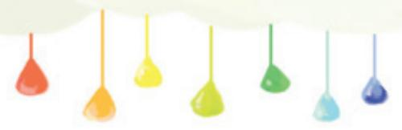

像“安安静静” 这样的四字词语，我 还能说几个。

# zěn me dōu kuài lè 6 怎么都快乐

yí gè rén wán hěn hǎo一个人玩，很好！

dú zì yì rén jìng qiāo qiāo de独自一人，静悄悄的，

zhèng hǎo yòng zhǐ zhé chuán zhé mǎ 正好用纸折船，折马…

tī jiàn zi tiào shéng dā jī mù 踢毽子，跳绳，搭积木，

dāng rán hái yǒu kàn shū huà huà tīng yīn yuè 当然还有看书，画画，听音乐……

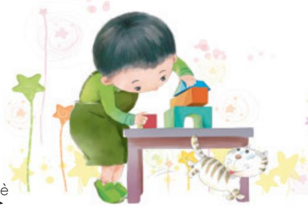

liǎng gè rén wán hěn hǎo两个人玩，很好！

jiǎng gù shi děi yǒu rén tīng cái xíng 讲故事得有人听才行，

nǐ jiǎng wǒ tīng wǒ jiǎng nǐ tīng 你讲我听，我讲你听。

hái yǒu xià xiàng qí dǎ yǔ máo qiú zuò qiāo qiāo bǎn 还有下象棋，打羽毛球，坐跷跷板……

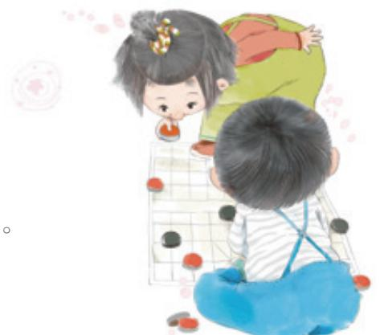

## sān gè rén wán hěn hǎo三个人玩，很好！

jiǎng gù shi duō gè rén tīng gèng yǒu jìn 讲故事多个人听更有劲，

nǐ jiǎng wǒ men tīng wǒ jiǎng nǐ men tīng 你讲我们听，我讲你们听。

liǎng gè rén shuǎi shéng zi 两个人甩绳子，

nǐ tiào wǒ tiào lún liú tiào 你跳，我跳，轮流跳。

sì gè rén wán hěn hǎo 四个人玩，很好！

wǔ gè rén wán hěn hǎo五个人玩，很好！

xǔ duō rén wán gèng hǎo 许多人玩，更好！

rén duō shén me yóu xì dōu néng wán人多，什么游戏都能玩，

bá hé lǎo yīng zhuō xiǎo jī 拔河，老鹰捉小鸡，

dǎ pái qiú dǎ lán qiú tī zú qiú 打排球，打篮球，踢足球……

lián kāi yùn dòng huì yě kě yǐ连开运动会也可以。

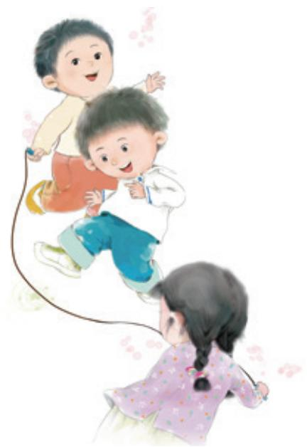

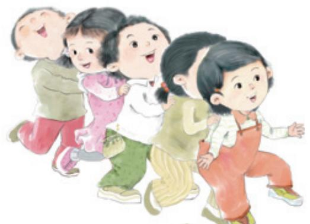

zěn dú tiào shéng dāng hái yuè děi yǔ qiú jìn lún pái 怎独跳绳当还乐得羽球劲轮排

快快

当当

画画

乐乐

书|书

毛毛

朗读课文，注意读好带感叹号的句子。

读一读，照样子说词语。

跳绳

踢足球

听音乐

看书

打排球

玩游戏

## 拓展活动

课文中的小朋友真开心，真是“怎么都快乐”！

1 我想到了我和小伙伴之间发生的有趣的事，我给大家讲一讲吧！I

## 语文园地三

## 识字加油站

我们在字典中怎么查到“厨”字呢？

cóng hàn yǔ pīn yīn yīn jié suǒ yǐn 从“汉语拼音音节索引” lǐ miàn zhǎo dào dà xiě zì mǔ 里面找到大写字母“C”。

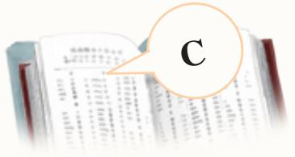

zài xià miàn zhǎo dào 在“C”下面找到“chu”① hé duì yìng de zhèng wén yè mǎ 和对应的正文页码。

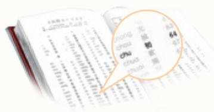

fān dào zhèng wén dì yè zhǎo dào 翻到正文第××页，找到 rán hòu àn shēng diào shùn xù zhǎo dào “chu”，然后按声调顺序找到 èr shēng jiù néng chá dào chú zì le 二声，就能查到“厨”字了。

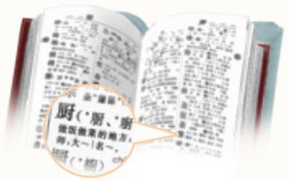

# yīn xù chá zì fǎ kǒu jué 音序查字法口诀

yīn xù chá zì yào jì láo xiān bǎ shǒu gè zì mǔ zhǎo 音序查字要记牢，先把首个字母找。 zì mǔ xià miànzhǎo yīn jié kàn kan tā zài dì jǐ yè 字母下面找音节，看看它在第几页。

用音序查字法从字典里找到下面的字，并组词。

mǔ yè zhǐ jīn cùn dīng qiān quán dàn 母页止斤寸丁千全旦

<table><tr><td rowspan=2 colspan=1></td><td rowspan=1 colspan=1>L</td><td rowspan=1 colspan=1></td><td rowspan=1 colspan=1></td><td rowspan=1 colspan=1></td><td rowspan=1 colspan=1></td><td rowspan=1 colspan=1></td><td rowspan=1 colspan=1></td></tr><tr><td rowspan=1 colspan=1></td><td rowspan=1 colspan=1></td><td rowspan=1 colspan=1></td><td rowspan=1 colspan=1></td><td rowspan=1 colspan=1></td><td rowspan=1 colspan=1></td><td rowspan=1 colspan=1></td></tr><tr><td rowspan=2 colspan=1></td><td rowspan=2 colspan=1>上</td><td rowspan=2 colspan=1></td><td rowspan=1 colspan=1></td><td rowspan=1 colspan=1></td><td rowspan=1 colspan=1></td><td rowspan=1 colspan=1></td><td rowspan=1 colspan=1></td></tr><tr><td rowspan=1 colspan=1></td><td rowspan=1 colspan=1></td><td rowspan=1 colspan=1></td><td rowspan=1 colspan=1></td><td rowspan=1 colspan=1></td></tr><tr><td rowspan=2 colspan=1></td><td rowspan=1 colspan=1>二</td><td rowspan=1 colspan=1></td><td rowspan=1 colspan=1></td><td rowspan=1 colspan=1></td><td rowspan=1 colspan=1></td><td rowspan=1 colspan=1></td><td rowspan=1 colspan=1></td></tr><tr><td rowspan=1 colspan=1></td><td rowspan=1 colspan=1></td><td rowspan=1 colspan=1></td><td rowspan=1 colspan=1></td><td rowspan=1 colspan=1></td><td rowspan=1 colspan=1></td><td rowspan=1 colspan=1></td></tr></table>

<table><tr><td rowspan=2 colspan=2>斤斤</td><td rowspan=1 colspan=1></td><td rowspan=1 colspan=1></td><td rowspan=1 colspan=1></td><td rowspan=1 colspan=1></td><td rowspan=1 colspan=1></td><td rowspan=1 colspan=1></td></tr><tr><td rowspan=1 colspan=1></td><td rowspan=1 colspan=1></td><td rowspan=1 colspan=1></td><td rowspan=1 colspan=1></td><td rowspan=1 colspan=1></td><td rowspan=1 colspan=1></td><td rowspan=1 colspan=1></td></tr><tr><td rowspan=1 colspan=1></td><td rowspan=1 colspan=1></td><td rowspan=1 colspan=1></td><td rowspan=1 colspan=1></td><td rowspan=1 colspan=1></td><td rowspan=1 colspan=1></td><td rowspan=1 colspan=1></td><td rowspan=1 colspan=1></td></tr><tr><td rowspan=1 colspan=1></td><td rowspan=1 colspan=1></td><td rowspan=1 colspan=1></td><td rowspan=1 colspan=1></td><td rowspan=1 colspan=1></td><td rowspan=1 colspan=1></td><td rowspan=1 colspan=1></td><td rowspan=1 colspan=1></td></tr><tr><td rowspan=2 colspan=1></td><td rowspan=1 colspan=1>7</td><td rowspan=1 colspan=1></td><td rowspan=1 colspan=1></td><td rowspan=1 colspan=1></td><td rowspan=1 colspan=1></td><td rowspan=1 colspan=1></td><td rowspan=1 colspan=1></td></tr><tr><td rowspan=1 colspan=1></td><td rowspan=1 colspan=1></td><td rowspan=1 colspan=1></td><td rowspan=1 colspan=1></td><td rowspan=1 colspan=1></td><td rowspan=1 colspan=1></td><td rowspan=1 colspan=1></td></tr></table>

## 日积月累

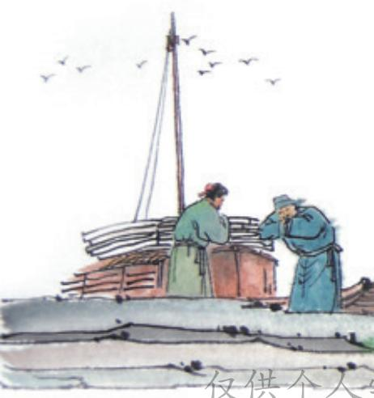

## zèng wāng lún 赠汪伦

táng lǐ bái [唐]李白

lǐ bái chéng zhōu jiāng yù xíng 李白乘舟将欲行，

hū wén àn shàng tà gē shēng 忽闻岸上踏歌声。

táo huā tán shuǐ shēn qiān chǐ 桃花潭水深千尺， bù jí wāng lún sòng wǒ qíng 不及汪伦送我情。

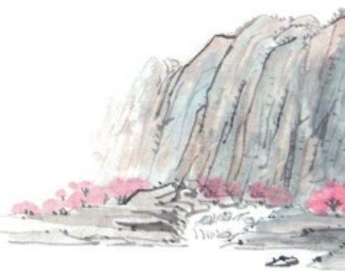

## 口语交际

dǎ diàn huà

# 打电话

nǐ dǎ guo diàn huà ma dǎ diàn huà yīng gāi zhù yì shén me ne你打过电话吗？打电话应该注意什么呢？

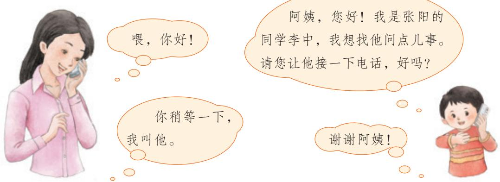

## lái shì yi shì ba 来试一试吧！

dǎ diàn huà yuē tóng xué wán

◇打电话约同学玩。

dǎ diàn huà wèn hòu zhǎng bèi

◇打电话问候长辈。

dǎ diàn huà xún wèn tú shū guǎn kāi fàng de shí jiān

打电话询问图书馆开放的时间。

给别人打电话时，要说清楚自己是谁。

接电话时，要主动向对方问好。

## 和大人一起读

## shuí hé shuí hǎo ① 谁和谁好

shuí hé shuí hǎo 谁和谁好？ téng hé guā hǎo 藤和瓜好， tā men shǒu lā shǒu 它们手拉手， bù chǎo yě bú nào 不吵也不闹。

shuí hé shuí hǎo 谁和谁好？ mì fēng hé huā hǎo 蜜蜂和花好， mì fēng lái cǎi mì 蜜蜂来采蜜， huā ér yǎng liǎn xiào 花儿仰脸笑。

①本文作者张玉庭。

shuí hé shuí hǎo 谁和谁好？ bái yún hé fēng hǎo 白云和风好， fēng wǎng nǎ lǐ guā 风往哪里刮， yún wǎng nǎ lǐ pǎo 云往哪里跑。

shuí hé shuí hǎo 谁和谁好？ wǒ hé tóng xué hǎo 我和同学好， dà jiā chàng zhe gē 大家唱着歌， yì qǐ shàng xué xiào 一起上学校。

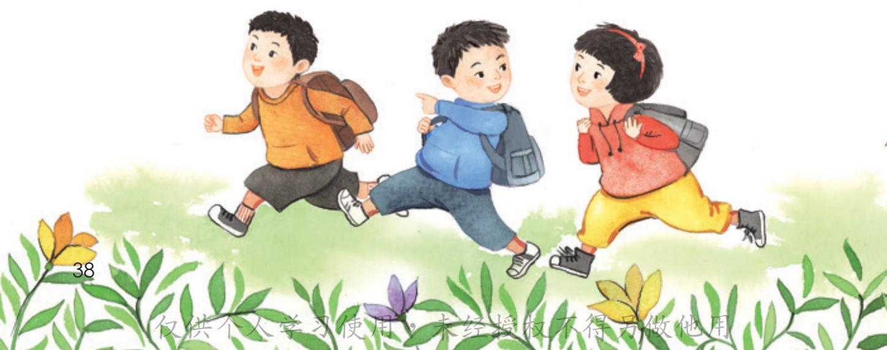

# jìng yè sī 静夜思

táng lǐ bái [唐]李白

chuáng qián míng yuè guāng 床前明月光，

yí shì dì shàng shuāng 疑是地上霜。

jǔ tóu wàng míng yuè 举头望明月， dī tóu sī gù xiāng 低头思故乡。

jìng sī chuáng yí jǔ wàng dī gù 静思床疑举望低故

思 思

前前

床床

朗读课文。背诵课文。

## yè sè 8 夜 色

wǒ cóng qián dǎn zi hěn xiǎo hěn xiǎo 我从前胆子很小很小， tiān yì hēi jiù bù gǎn wǎng wài qiáo 天一黑就不敢往外瞧。

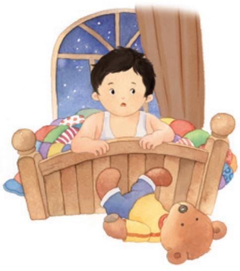

mā ma bǎ yǒng gǎn de gù shi jiǎng le yòu jiǎng妈妈把勇敢的故事讲了又讲，

kě wǒ yí kàn chuāng wài xīn jiù luàn tiào 可我一看窗外心就乱跳…

bà ba wǎn shang piān yào lā wǒ qù sàn bù 爸爸晚上偏要拉我去散步，

yuán lái huā cǎo dōu xiàng bái tiān yí yàng wēi xiào 原来花草都像白天一样微笑。

cóng cǐ zài hēi zài hēi de yè wǎn 从此再黑再黑的夜晚，

wǒ yě néng kàn jiàn xiǎo niǎo zěn yàng zài yuè guāng xià shuì jiào 我也能看见小鸟怎样在月光下睡觉…

① 本文作者柯岩。

舌

dǎn gǎn yǒng jiǎng chuāng luàn lā yàng xiào zài shuì jiào 胆敢勇讲窗乱拉样笑再睡觉

色色

讲讲

把把

笑 笑

样样

再再

朗读课文，注意读好句中的停顿。

读一读，记一记。

liàng 胆子胆量 大胆 勇敢勇气勇士

样子一样 花样

再见再三再次

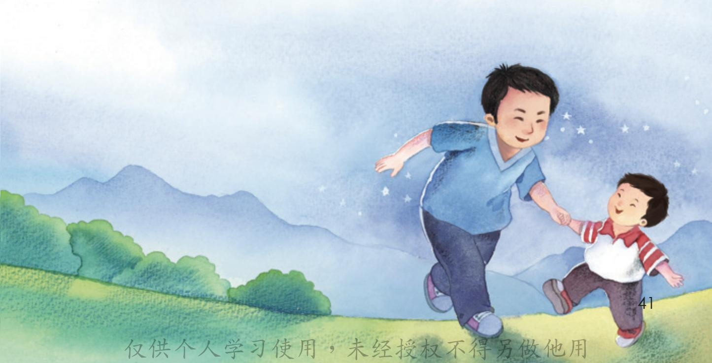

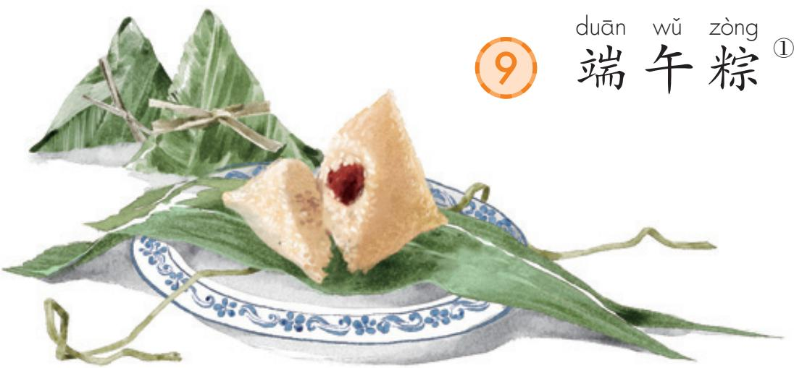

yí dào duān wǔ jié wài pó zǒng huì zhǔ hǎo yì guō zòng zi 一到端午节，外婆总会煮好一锅粽子， pàn zhe wǒ men huí qù 盼着我们回去。

zòng zi shì yòng qīng qīng de ruò zhú yè bāo de lǐ miàn guǒ 粽子是用青青的箬竹叶包的，里面裹 zhe bái bái de nuò mǐ zhōng jiān yǒu yì kē hóng hóng de zǎo wài 着白白的糯米，中间有一颗红红的枣。外 pó yì xiān kāi guō gài zhǔ shú de zòng zi jiù piāo chū yì gǔ qīng 婆一掀开锅盖，煮熟的粽子就飘出一股清 xiāng lái bāo kāi zòng yè yǎo yì kǒu zòng zi zhēn shì yòu nián 香来。剥开粽叶，咬一口粽子，真是又黏 yòu tián 又甜。

wài pó bāo de zòng zi shí fēn hǎo chī huā yàng yě duō 外婆包的粽子十分好吃，花样也多。   
chú le hóng zǎo zòng hái yǒu hóng dòu zòng hé xiān ròu zòng wǒ men   
除了红枣粽，还有红豆粽和鲜肉粽。我们   
zài wài pó jiā měi zī zī de chī le zhī hòu wài pó hái huì zhuāng   
在外婆家美滋滋地吃了之后，外婆还会装

## 人民教育出版社

yì xiǎo lán zòng zi yào wǒ men dài huí qù fēn gěi lín jū chī 一小篮粽子要我们带回去，分给邻居吃。

zhǎng dà hòu wǒ liǎo jiě dào rén men duān wǔ jié chī zòng zi 长大后我了解到，人们端午节吃粽子， chuán shuō shì wèi le jì niàn ài guó shī rén qū yuán 传说是为了纪念爱国诗人屈原。

duān zòng jié zǒng zhǔ pàn mǐ zǎo tián fēn xiān ròu liǎo 端粽节总煮盼米枣甜分鲜肉了

<table><tr><td rowspan=2 colspan=1>节</td><td rowspan=1 colspan=1>士</td><td rowspan=1 colspan=2></td><td rowspan=1 colspan=1></td><td rowspan=1 colspan=1></td><td rowspan=1 colspan=1></td><td rowspan=1 colspan=1></td></tr><tr><td rowspan=1 colspan=1>J</td><td rowspan=1 colspan=1></td><td rowspan=1 colspan=1></td><td rowspan=1 colspan=1></td><td rowspan=1 colspan=1></td><td rowspan=1 colspan=1></td><td rowspan=1 colspan=1></td></tr><tr><td rowspan=2 colspan=1>i</td><td rowspan=2 colspan=1></td><td rowspan=1 colspan=1></td><td rowspan=1 colspan=1></td><td rowspan=1 colspan=1></td><td rowspan=1 colspan=1></td><td rowspan=1 colspan=1></td><td rowspan=1 colspan=1></td></tr><tr><td rowspan=1 colspan=1></td><td rowspan=1 colspan=1></td><td rowspan=1 colspan=1></td><td rowspan=1 colspan=1></td><td rowspan=1 colspan=1></td><td rowspan=1 colspan=1></td></tr><tr><td rowspan=2 colspan=1>p</td><td rowspan=2 colspan=1>吃</td><td rowspan=2 colspan=1>吃</td><td rowspan=1 colspan=1></td><td rowspan=1 colspan=1></td><td rowspan=1 colspan=1></td><td rowspan=1 colspan=1></td><td rowspan=1 colspan=1></td></tr><tr><td rowspan=1 colspan=1></td><td rowspan=1 colspan=1></td><td rowspan=1 colspan=1></td><td rowspan=1 colspan=1></td><td rowspan=1 colspan=1></td></tr></table>

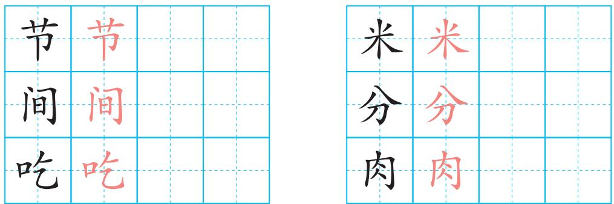

<table><tr><td rowspan=1 colspan=1></td><td rowspan=1 colspan=1>2</td><td rowspan=1 colspan=1></td><td rowspan=1 colspan=1></td><td rowspan=1 colspan=1></td><td rowspan=1 colspan=1></td><td rowspan=1 colspan=1></td><td rowspan=1 colspan=1></td></tr><tr><td rowspan=1 colspan=1></td><td rowspan=1 colspan=1></td><td rowspan=1 colspan=1></td><td rowspan=1 colspan=1></td><td rowspan=1 colspan=1></td><td rowspan=1 colspan=1></td><td rowspan=1 colspan=1></td><td rowspan=1 colspan=1></td></tr><tr><td rowspan=2 colspan=1>分</td><td rowspan=1 colspan=1></td><td rowspan=1 colspan=1></td><td rowspan=1 colspan=1></td><td rowspan=1 colspan=1></td><td rowspan=1 colspan=1></td><td rowspan=1 colspan=1></td><td rowspan=1 colspan=1></td></tr><tr><td rowspan=1 colspan=1></td><td rowspan=1 colspan=1></td><td rowspan=1 colspan=1></td><td rowspan=1 colspan=1></td><td rowspan=1 colspan=1></td><td rowspan=1 colspan=1></td><td rowspan=1 colspan=1></td></tr><tr><td rowspan=1 colspan=1></td><td rowspan=1 colspan=1></td><td rowspan=1 colspan=1></td><td rowspan=1 colspan=1></td><td rowspan=1 colspan=1></td><td rowspan=1 colspan=1></td><td rowspan=1 colspan=1></td><td rowspan=1 colspan=1></td></tr><tr><td rowspan=1 colspan=1>P</td><td rowspan=1 colspan=1></td><td rowspan=1 colspan=1></td><td rowspan=1 colspan=1></td><td rowspan=1 colspan=1></td><td rowspan=1 colspan=1></td><td rowspan=1 colspan=1></td><td rowspan=1 colspan=1></td></tr></table>

朗读课文，注意课文中的标点，读好停顿。

说一说外婆包的红枣粽是什么样的。

选做：你知道关于端午节或粽子的故事吗？和同学交流。

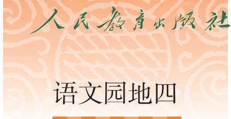

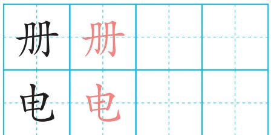

## 识字加油站

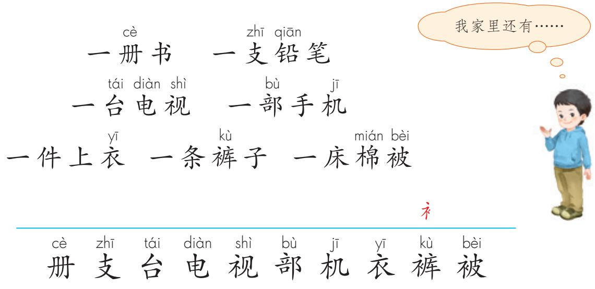

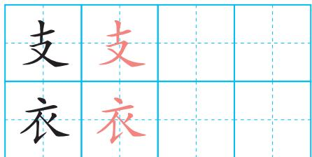

## 字词句运用

读一读，注意读好轻声。

胆子 样子 粽子

爸爸 妈妈 哥哥

## 眼睛 喜欢 故事

## 做拼音游戏。

yuán

我们找一些音节互相考一考吧！

跟上学期相比，我现在能把音节读得更快更准了。

zhuàng

biāo diǎn

## 书写提示

书书

间间

我我

笔顺规则：点在正上方或左上方，先写点。

笔顺规则：点在右上方，后写点。

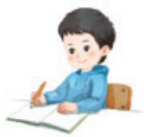

## 日积月累

尊老爱幼 lǎo

xuè nóng yú shuǐ 血浓于水

共乐融

shǒu zú qíng shēn 手足情深

tóng xīn xié lì 同心协力

tóng gān gòng kǔ 同甘共苦

笑俗之乐

聚一

## 和大人一起读

# pàng hū hū de xiǎo shǒu 胖乎乎的小手

quán jiā rén dōu xǐ huan lán lan huà de zhè zhāng huà 全家人都喜欢兰兰画的这张画。

bà ba gāng xià bān huí lái ná qǐ huà kàn le yòu kàn 爸爸刚下班回来，拿起画，看了又看， bǎ huà tiē zài le qiáng shàng lán lan bù míng bai wèn wǒ zhǐ 把画贴在了墙上。兰兰不明白，问：“我只 shì huà le zì jǐ de xiǎo shǒu wa wǒ yǒu nà me duō huà nín wèi 是画了自己的小手哇！我有那么多画，您为 shén me zhǐ tiē zhè yì zhāng ne 什么只贴这一张呢？”

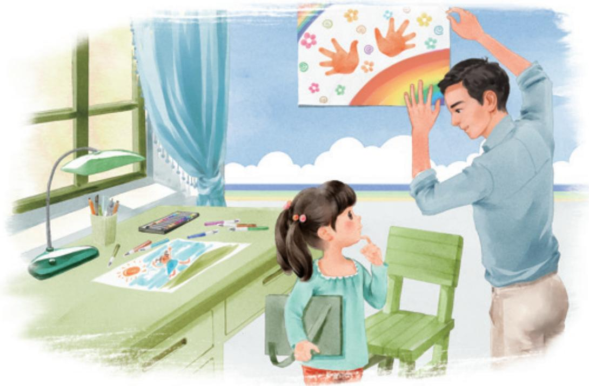

bà ba shuō zhè pàng hū hū de xiǎo 爸爸说：“这胖乎乎的小 shǒu tì wǒ ná guo tuō xié ya 手替我拿过拖鞋呀！”

mā ma xià bān huí lái kàn jiàn huà 妈妈下班回来，看见画， xiào zhe shuō zhè pàng hū hū de xiǎo shǒu gěi 笑着说：“这胖乎乎的小手给 wǒ xǐ guo shǒu juàn na 我洗过手绢哪！”

lǎo lao cóng chú fáng chū lái yì yǎn 姥姥从厨房出来，一眼 jiù kàn jiàn le huà shàng hóng rùn rùn de xiǎo 就看见了画上红润润的小 shǒu shuō zhè pàng hū hū de xiǎo shǒu bāng 手，说：“这胖乎乎的小手帮 wǒ náo guo yǎng yang a 我挠过痒痒啊！”

lán lan míng bai le quán jiā rén wèi shén 兰兰明白了全家人为什 me dōu xǐ huan zhè zhāng huà tā gāo xìng de 么都喜欢这张画。她高兴地 shuō děng wǒ zhǎng dà le xiǎo shǒu biànchéng 说：“等我长大了，小手变成 le dà shǒu tā huì bāng nǐ men zuò gèng duō 了大手，它会帮你们做更多 de shì qing 的事情！”

第五单元·识字

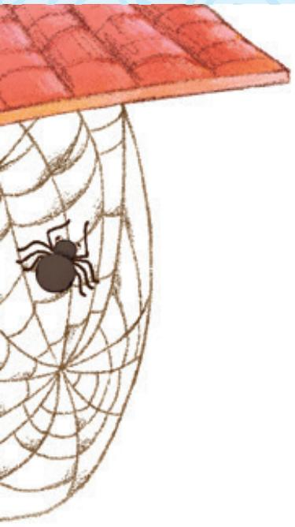

# dòng wù ér gē ⑤动物儿歌

qīng tíng bàn kōng zhǎn chì fēi 蜻蜓半空展翅飞， hú dié huā jiān zhuō mí cáng 蝴蝶花间捉迷藏。 qiū yǐn tǔ lǐ zào gōng diàn 蚯蚓土里造宫殿， mǎ yǐ dì shàng yùn shí liáng 蚂蚁地上运食粮。 kē dǒu chí zhōng yóu de huān 蝌蚪池中游得欢， zhī zhū fáng qián jié wǎng máng 蜘蛛房前结网忙。

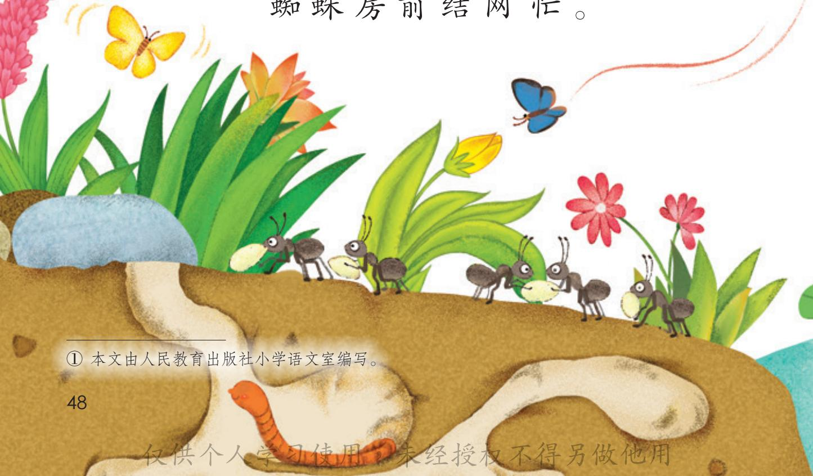

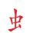

## 人民教育出版社

wù zhuō mí cáng zào mǎ yǐ yùn shí liáng fáng jié wǎng 物捉迷藏造蚂蚁运食粮房结网

物物

运运

房房

造造

欢欢

网网

朗读课文。

## 读一读，记一记。

qīng tíng zhǎn chì 蜻蜓展翅

bān 蚂蚁搬家 hú dié wǔ 蝴蝶飞舞

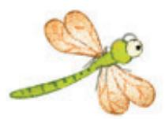

kē dǒu  yǒng 蝌蚪游泳 qiū yǐn sōng 蚯蚓松土

zhī zhū蜘蛛结网

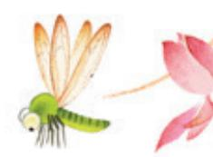

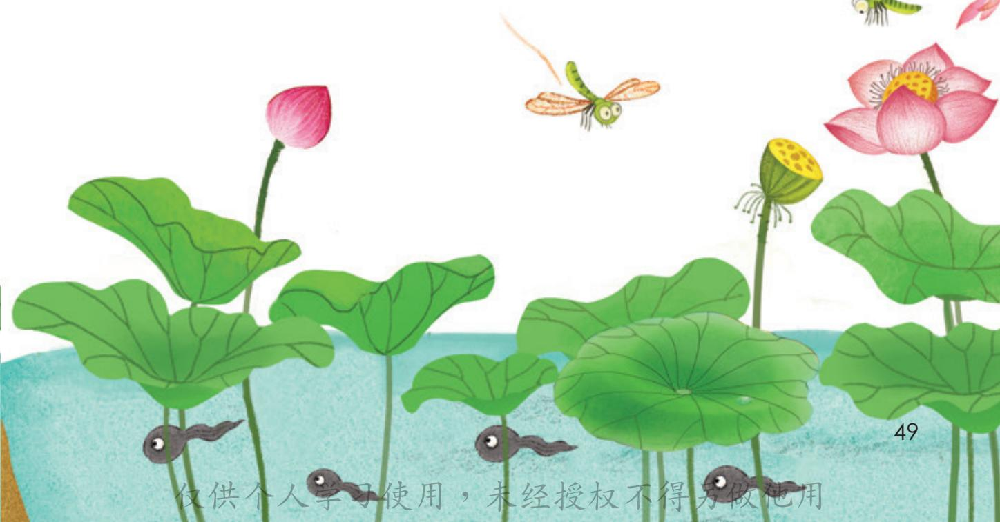

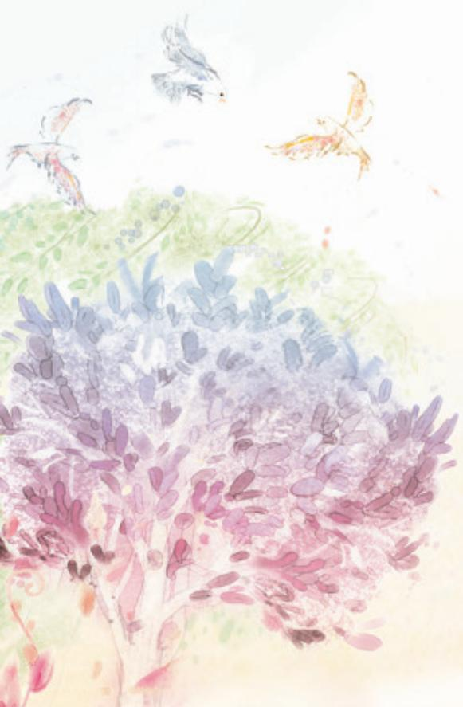

gǔ duì jīn   
古对今，   
yuán duì fāng   
圆对方。   
yán hán duì kù shǔ   
严寒对酷暑， chūn nuǎn duì qiū liáng 春暖对秋凉。 chén duì mù   
晨对暮，   
xuě duì shuāng   
雪对霜。   
hé fēng duì xì yǔ   
和风对细雨， zhāo xiá duì xī yáng 朝霞对夕阳。 táo duì lǐ   
桃对李，   
liǔ duì yáng   
柳对杨。   
yīng gē duì yàn wǔ   
莺歌对燕舞， niǎo yǔ duì huā xiāng   
鸟语对花香。

<table><tr><td>对</td><td>对</td><td></td><td></td></tr><tr><td>雪</td><td>康三7</td><td></td><td></td></tr><tr><td>夕</td><td></td><td></td><td></td></tr></table>

朗读课文。背诵课文。  
）读一读，记一记。

# yuán yán hán kù shǔ nuǎn chén xì zhāo xiá xī yáng xiāng 圆严寒酷暑暖晨细朝霞夕杨香

细细

语语

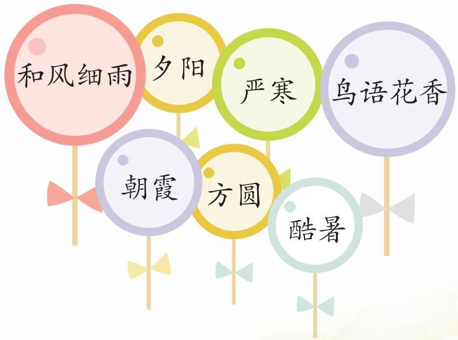

cāo chǎng shàng

# dǎ qiú bá hé pāi pí qiú 打球拔河 拍皮球

跳高 跑步 踢足球

líng shēng xiǎng xià kè le 铃声响，下课了。

cāo chǎng shàng zhēn rè nao操场上，真热闹。

tiào shéng tī jiàn diū shā bāo 跳绳踢毽丢沙包，

tiān tiān duàn liàn shēn tǐ hǎo 天天锻炼身体好。

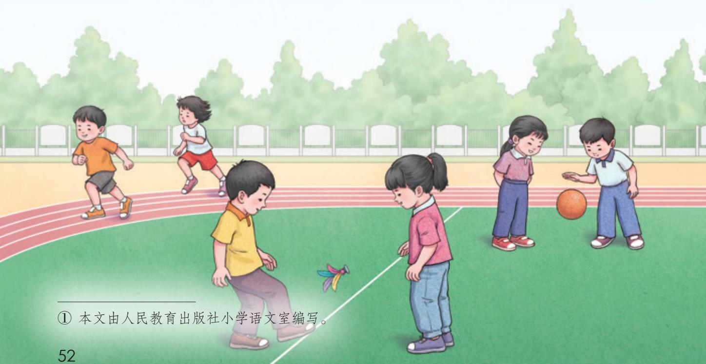

全

cāo bá pāi pǎo tī líng zhēn nào diū shā shēn tǐ 操拔拍跑踢铃真闹丢沙身体

打打

跑跑

沙沙

皮皮

足足

包

朗读课文。

读一读课文中表示体育活动的词语。再和同学说一说，

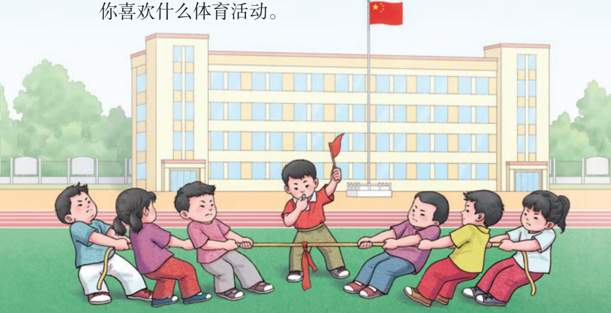

rén zhī chū 8 人之初 1

rén zhī chūxìng běn shàn 人之初，性本善 xìng xiāng jìn xí xiāng yuǎn 性相近，习相远。 gǒu bú jiào xìng nǎi qiān 苟不教，性乃迁， jiàozhī dào guìyǐzhuān 教之道，贵以专

zǐ bù xué fēi suǒ yí 子不学，非所宜 yòu bù xué lǎo hé wéi 幼不学，老何为？ yù bù zhuó bù chéng qì 玉不琢，不成器 rén bù xué bù zhī yì 人不学，不知义。

## 人民教育出版社

zhī chū xiāng jìn xí yuǎn jiào dào zhuān yòu yù zhī yì 之初相近习远教道专幼玉知义

近近 习习

学学

玉玉

义义

朗读课文。背诵课文。

读一读，记一记。

相近相反学习练习。

知道道路 专心专门

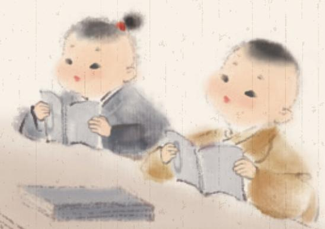

语文园地五

## 识字加油站

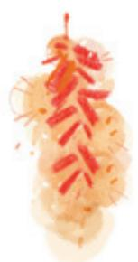

fàn bǎo   
有饭能吃饱， chá pào   
有水把茶泡。   
有足快快跑， qīng   
有手轻轻抱。 chuānpáo   
有衣穿长袍， biān pào   
有火放鞭炮。

fàn bǎo chá pào qīng chuān páo biān pào 饭饱茶泡轻穿袍鞭炮

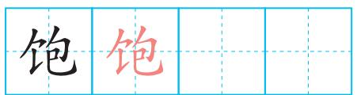

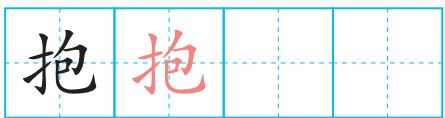

## 字词句运用

比一比，看谁先从字典里查到下面的字。

xī jiě zhǔn lóu bó 溪解准楼 伯

读一读，和同学交流你的发现。

吃

叫

吹

唱

口字旁的字大多和嘴有关。

## 抱拔捉拍

我还知道其他和身体有关的偏旁，如目字旁。

跑跳踢跟

## 选一选，填一填。

远处有

## 青 清

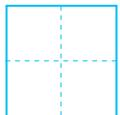

山，近处有

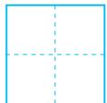

quán泉。

## 再 在

◇ 放学了，大家

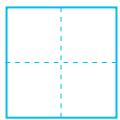

学校门口和老师说

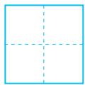

见。

## 日积月累

zhī ma kāi huā

zhú lán dǎ shuǐ yì cháng kōng

竹篮打水——一场空

shí wǔ gè diào tǒng dǎ shuǐ qī shàng bā xià 十五个吊桶打水—七上八下

# yì qǐ zuò yóu xì一起做游戏

# yāo qǐng xiǎo huǒ bàn yì qǐ zuò yóu xì ba 邀请小伙伴一起做游戏吧！

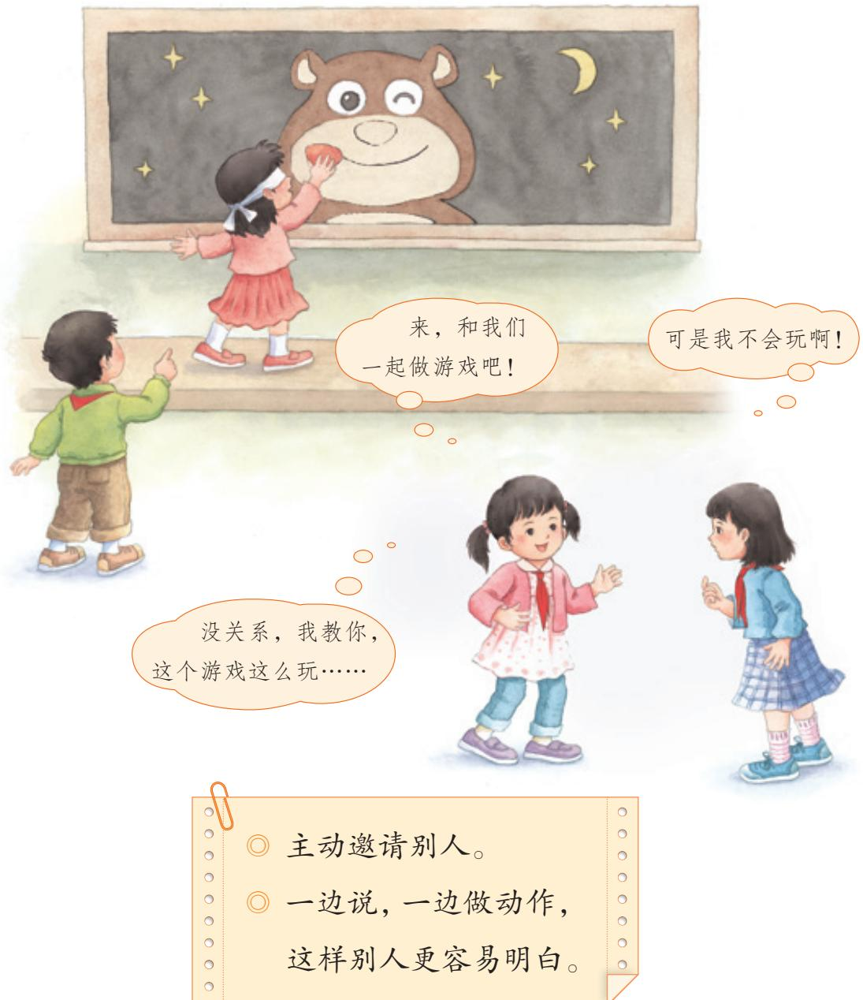

## 和大人一起读

sūn wù kōng dǎ yāo guài ① 孙悟空打妖怪

táng sēng qí mǎ dōng nà ge dōng 唐僧骑马咚那个咚， hòu miàn gēn zhe gè sūn wù kōng 后面跟着个孙悟空。 sūn wù kōng pǎo de kuài 孙悟空，跑得快， hòu miàn gēn zhe gè zhū bā jiè 后面跟着个猪八戒。 zhū bā jiè bí zi cháng 猪八戒，鼻子长， hòu miàn gēn zhe gè shā hé shang 后面跟着个沙和尚。 shā hé shang tiāo zhe luó 沙和尚，挑着箩， hòu miàn gēn zhe gè lǎo yāo pó 后面跟着个老妖婆。

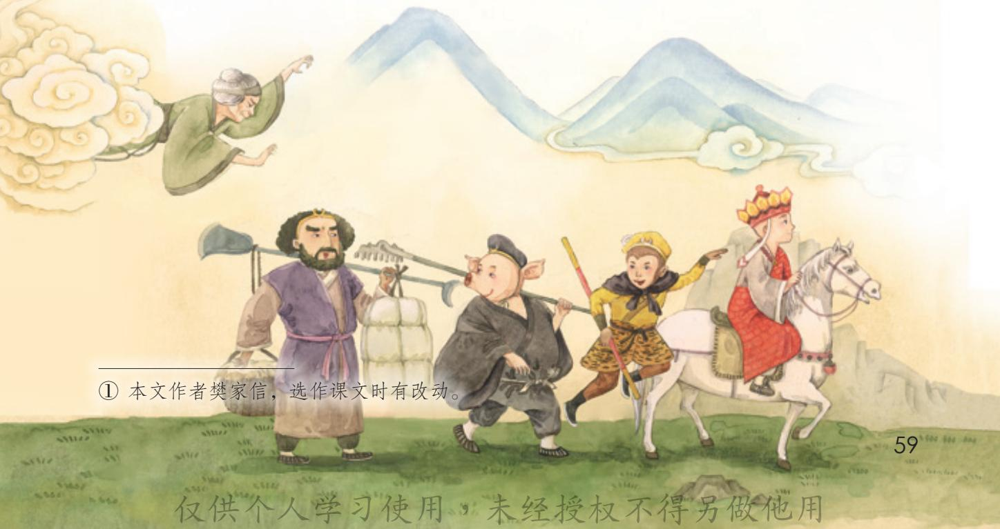

lǎo yāo pó zhēn zhèng huài 老妖婆，真正坏， piàn le táng sēng hé bā jiè 骗了唐僧和八戒。 táng sēng bā jiè zhēn hú tu 唐僧八戒真糊涂， shì rén shì yāo fēn bù qīng 是人是妖分不清。 fēn bù qīng shàng le dàng 分不清，上了当， duō kuī wù kōng yǎn jing liàng 多亏悟空眼睛亮。 yǎn jing liàng mào jīn guāng 眼睛亮，冒金光， gāo gāo jǔ qǐ jīn gū bàng 高高举起金箍棒。 jīn gū bàng yǒu lì liàng 金箍棒，有力量， yāo mó guǐ guài xiāo miè guāng 妖魔鬼怪消灭光。

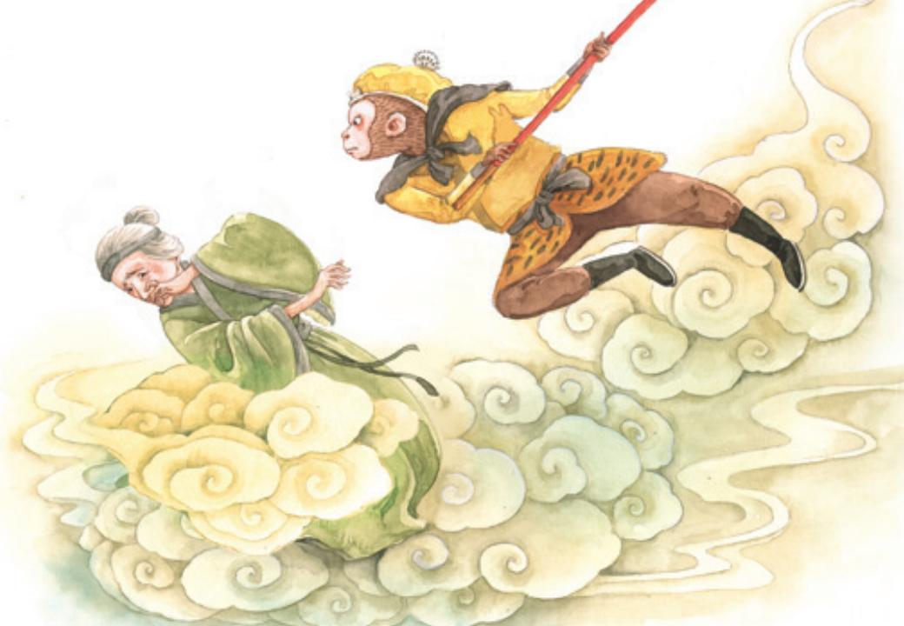

第六单元·阅读

# gǔ shī èr shǒu 10古诗二首

chí shàng 池 上

táng bái jū yì [唐]白居易

xiǎo wá chēng xiǎo tǐng 小娃撑小艇， tōu cǎi bái lián huí 偷采白莲回。 bù jiě cáng zōng jì 不解藏踪迹， fú píng yí dào kāi 浮萍一道开。

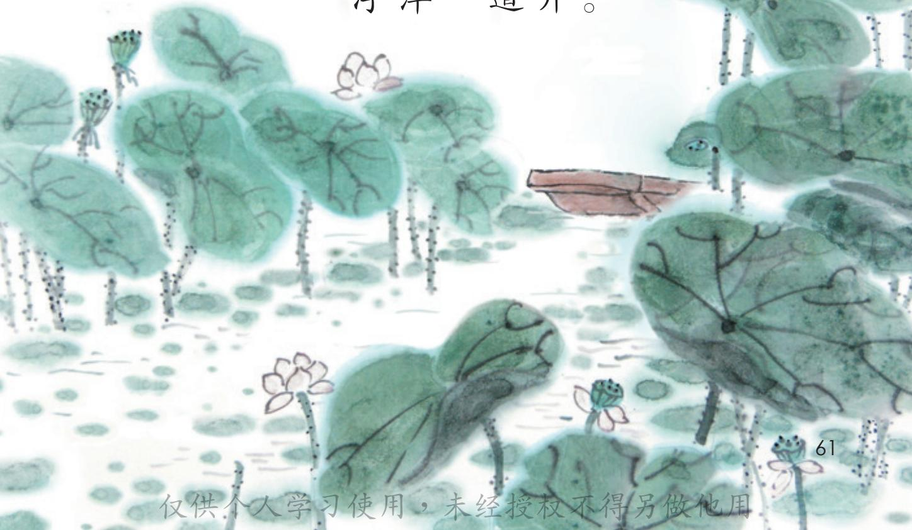

xiǎo chí 小 池

sòng yáng wàn lǐ [宋]杨万里

quán yǎn wú shēng xī xì liú 泉眼无声惜细流， shù yīn zhào shuǐ ài qíng róu 树阴照水爱晴柔。 xiǎo hé cái lù jiān jiān jiǎo 小荷才露尖尖角， zǎo yǒu qīng tíng lì shàng tóu 早有蜻蜓立上头。

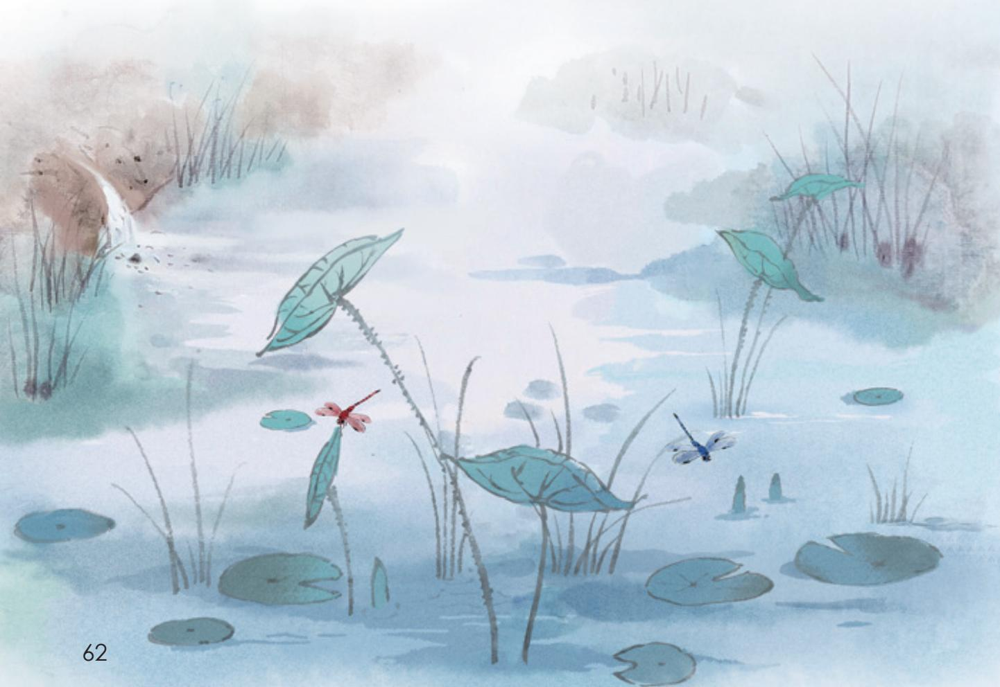

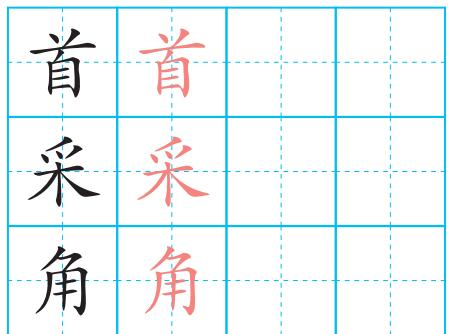

# shī shǒu tōu fú píng quán xī zhào róu hé lù jiǎo 诗首偷浮萍泉惜照柔荷露角

池池

尖尖

早早

朗读课文。背诵课文。

读一读，记一记。

浮萍飘浮

泉水 清泉

柔美 轻柔

爱惜可惜

照样照片

荷花荷叶

# làng huā 浪 花

wǒ zài shā tān shàng wán shuǎ làng huā kàn jiàn le mài zhe qīng 我在沙滩上玩耍。浪花看见了，迈着轻 qīng de bù zi zǒu lái qiāo qiāo de náo wǒ de xiǎo jiǎo yā hǎo yǎng 轻的步子走来，悄悄地挠我的小脚丫。好痒 a xiào de wǒ yǎn lèi dōu liú chū lái le tā cái huā huā huā de xiào 啊！笑得我眼泪都流出来了，它才哗哗哗地笑 zhe pǎo huí jiā 着跑回家。

yí huìr làng huā yòu chàng zhe xiào zhe pǎo lái le zhè cì 一会儿，浪花又唱着笑着跑来了。这次， tā qěi wǒ pěng lái xuě bái de bèi ké qīng qīng de xiǎo xiā wǒ de xiǎo 它给我捧来雪白的贝壳、青青的小虾。我的小 lán zi dōu zhuāng bú xià la 篮子都装不下啦！

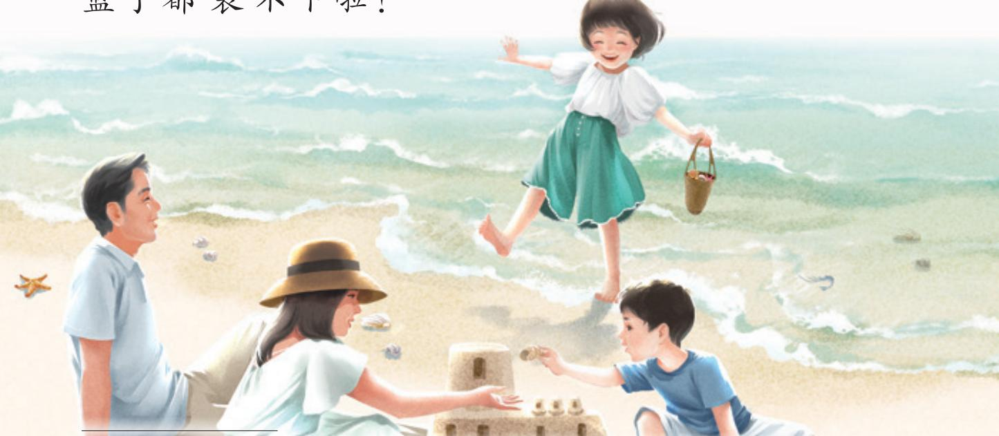  
①本文选自人民教育出版社《义务教育五年制小学教科书（试用本）语文第二册》，有改动。

<table><tr><td rowspan=2 colspan=1>目</td><td rowspan=2 colspan=1></td><td rowspan=2 colspan=1></td><td rowspan=2 colspan=1></td><td rowspan=1 colspan=1></td><td rowspan=1 colspan=1></td><td rowspan=1 colspan=1></td><td rowspan=1 colspan=1></td></tr><tr><td rowspan=1 colspan=1></td><td rowspan=1 colspan=1></td><td rowspan=1 colspan=1></td><td rowspan=1 colspan=1></td></tr><tr><td rowspan=2 colspan=1>它</td><td rowspan=1 colspan=1></td><td rowspan=1 colspan=1></td><td rowspan=1 colspan=1></td><td rowspan=1 colspan=1></td><td rowspan=1 colspan=1></td><td rowspan=1 colspan=1></td><td rowspan=1 colspan=1></td></tr><tr><td rowspan=1 colspan=1></td><td rowspan=1 colspan=1></td><td rowspan=1 colspan=1></td><td rowspan=1 colspan=1></td><td rowspan=1 colspan=1></td><td rowspan=1 colspan=1></td><td rowspan=1 colspan=1></td></tr><tr><td rowspan=2 colspan=1>今</td><td rowspan=1 colspan=1></td><td rowspan=1 colspan=1></td><td rowspan=1 colspan=1></td><td rowspan=1 colspan=1></td><td rowspan=1 colspan=1></td><td rowspan=1 colspan=1></td><td rowspan=1 colspan=1></td></tr><tr><td rowspan=1 colspan=1>C</td><td rowspan=1 colspan=1></td><td rowspan=1 colspan=1></td><td rowspan=1 colspan=1></td><td rowspan=1 colspan=1></td><td rowspan=1 colspan=1></td><td rowspan=1 colspan=1></td></tr></table>

## 人民教育出版社

huā huā huā làng huā pǎo qù yòu pǎo lái jiù xiàng táo qì de xiǎo 哗哗哗，浪花跑去又跑来，就像淘气的小 wá wa 娃娃。

làng mài qiāo lèi cì gěi ké xiā zhuāng xiàng táo wá 浪迈悄泪次给壳虾装像淘娃

泪泪

贝贝

娃娃

朗读课文。

读一读，比一比。

浪花就像小娃娃。

浪花就像淘气的小娃娃。

浪花跑来了。

浪花唱着笑着跑来了。

# hé yè yuán yuán 12 荷叶圆圆 ①

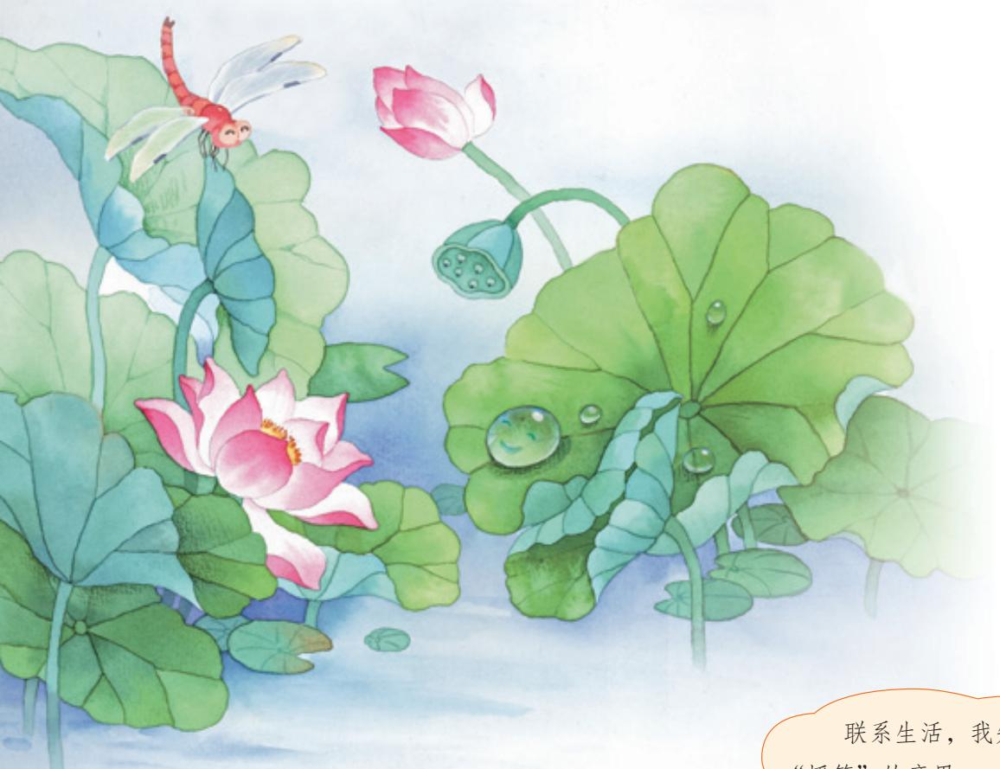

联系生活，我知道了“摇篮”的意思。

hé yè yuán yuán de lù lù de荷叶圆圆的，绿绿的。

xiǎo shuǐ zhū shuō hé yè shì wǒ de yáo lán xiǎo shuǐ zhū 小水珠说：“荷叶是我的摇篮。”小水珠 tǎng zài hé yè shàng zhǎ zhe liàng jīng jīng de yǎn jing 躺在荷叶上，眨着亮晶晶的眼睛。

xiǎo qīng tíng shuō hé yè shì wǒ de tíng jī píng xiǎo qīng 小蜻蜓说：“荷叶是我的停机坪。”小蜻 tíng lì zài hé yè shàng zhǎn kāi tòu míng de chì bǎng 蜓立在荷叶上，展开透明的翅膀。

## 人民教育出版社

xiǎo qīng wā shuō hé yè shì wǒ de gē tái xiǎo qīng wā 小青蛙说：“荷叶是我的歌台。”小青蛙 dūn zài hé yè shàng guā guā de fàng shēng gē chàng 蹲在荷叶上，呱呱地放声歌唱。

xiǎo yú ér shuō hé yè shì wǒ de liáng sǎn xiǎo yú ér 小鱼儿说：“荷叶是我的凉伞。”小鱼儿 zài hé yè xià xiào xī xī de yóu lái yóu qù pěng qǐ yì duǒ duǒ hěn 在荷叶下笑嘻嘻地游来游去，捧起一朵朵很 měi hěn měi de shuǐ huā 美很美的水花。

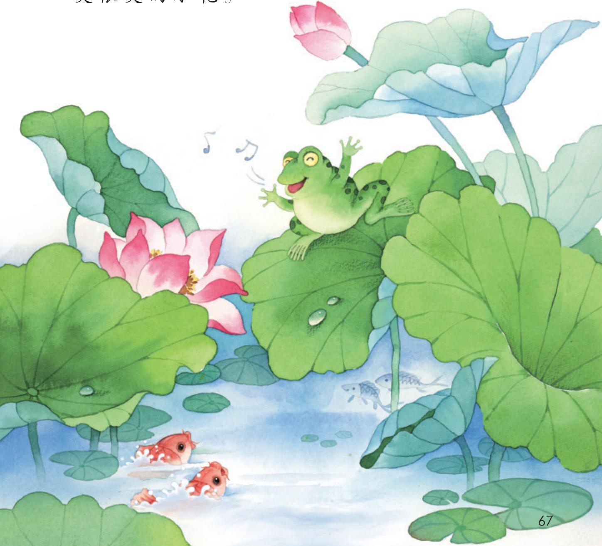

zhū yáo lán liàng jīng tíng píng zhǎn tòu chì bǎng duǒ 珠摇篮亮晶停坪展透翅膀朵

机机

唱 口日 曰 曰

乙

朵朵

伞伞

美美

朗读课文。背诵课文。

连一连，说一说。

小水珠 qīng tíng 蜻蜓 小青蛙

小鱼儿

停机坪

歌台

凉伞

摇篮

读一读，照样子写一写。

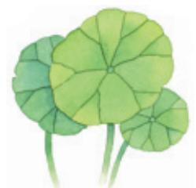  
荷叶圆圆的，绿绿的。

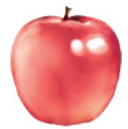

píng 苹果 O

# yào xià yǔ le 13 要下雨了 ①

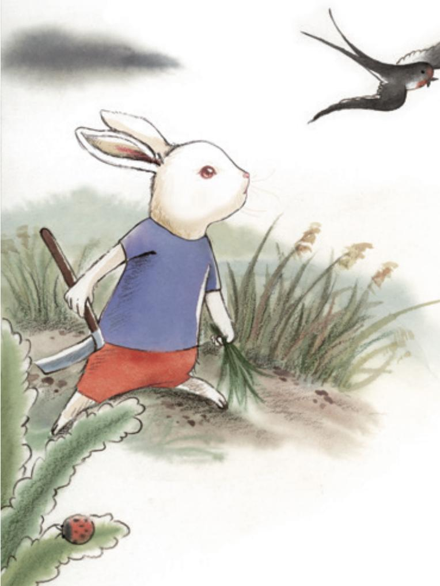

xiǎo bái tù wān zhe yāo zài 小白兔弯着腰在 shān pō shàng gē cǎo tiān yīn chén 山坡上割草。天阴沉 chén de xiǎo bái tù zhí qǐ shēn 沉的，小白兔直起身 zi shēn le shēn yāo 子，伸了伸腰。

xiǎo yàn zi cóng tā tóu shàng 小燕子从他头上 fēi guò xiǎo bái tù dà shēng hǎn 飞过。小白兔大声喊： yàn zi yàn zi nǐ wèi shén “燕子，燕子，你为什 me fēi de zhè me dī ya 么飞得这么低呀？”

yàn zi biān fēi biān shuō yào xià yǔ le kōng qì hěn cháo shī 燕子边飞边说：“要下雨了，空气很潮湿， chóng zi de chì bǎng zhān le xiǎo shuǐ zhū fēi bù gāo wǒ zhèng máng zhe 虫子的翅膀沾了小水珠，飞不高。我正忙着 zhuō chóng zi ne 捉虫子呢！”

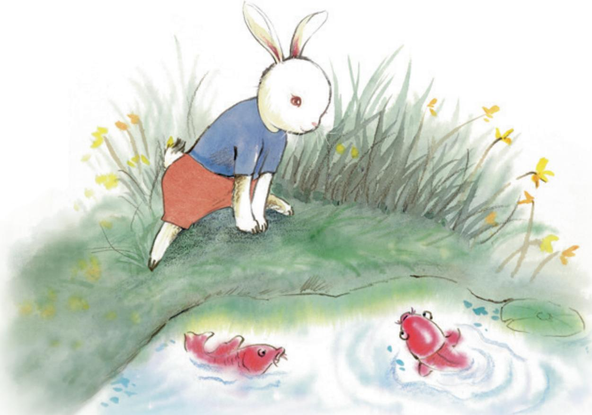

shì yào xià yǔ le ma xiǎo bái tù wǎng qián biān chí zi lǐ yí 是要下雨了吗？小白兔往前边池子里一 kàn xiǎo yú dōu yóu dào shuǐ miàn shàng lái le 看，小鱼都游到水面上来了。

xiǎo bái tù pǎo guò qù wèn xiǎo yú xiǎo yú jīn tiān 小白兔跑过去，问：“小鱼，小鱼，今天 zěn me yǒu kòng chū lái ya 怎么有空出来呀？”

xiǎo yú shuō yào xià yǔ le shuǐ lǐ mēn de hěn wǒ men 小鱼说：“要下雨了，水里闷得很，我们 dào shuǐ miàn shàng lái tòu tou qì xiǎo bái tù nǐ kuài huí jiā ba 到水面上来透透气。小白兔，你快回家吧， xiǎo xīn lín zháo yǔ 0 小心淋着雨。

读了这一段话，我知道了“闷”的意思。

## 人民教育出版社

xiǎo bái tù lián máng kuà qǐ lán zi wǎng jiā pǎo tā kàn jiàn lù 小白兔连忙挎起篮子往家跑。他看见路 biān yǒu yí dà qún mǎ yǐ jiù bǎ yào xià yǔ de xiāo xi gào su le 边有一大群蚂蚁，就把要下雨的消息告诉了 mǎ yǐ yì zhī dà mǎ yǐ shuō shì yào xià yǔ le wǒ men 蚂蚁。一只大蚂蚁说：“是要下雨了，我们 zhèng máng zhe bān dōng xi ne 正忙着搬东西呢！”

xiǎo bái tù jiā kuài bù zi wǎng jiā pǎo tā yì biān pǎo yì biān 小白兔加快步子往家跑。他一边跑一边 hǎn mā mα mā mα yào xià yǔ le 喊：“妈妈，妈妈，要下雨了！”

hōng lōng lōng tiān kōng xiǎng qǐ le yí zhèn léi shēng huā 轰隆隆，天空响起了一阵雷声。哗， huā huā dà yǔ zhēn de xià qǐ lái le 哗，哗，大雨真的下起来了！

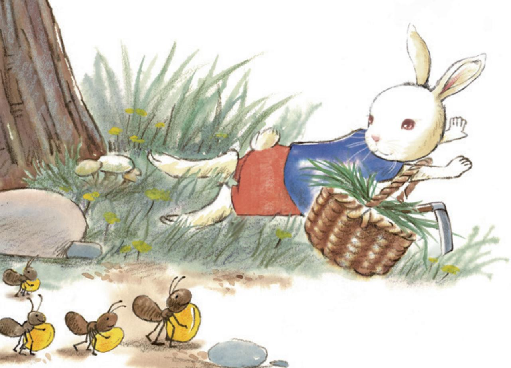

yào yāo yīn chén ya máng ne 要腰阴沉呀忙呢 ma miàn kòng mēn ba xiāo xī 吗面空闷吧消息

<table><tr><td rowspan=2 colspan=1></td><td rowspan=1 colspan=1></td><td rowspan=1 colspan=1></td><td rowspan=1 colspan=1></td><td rowspan=1 colspan=1></td><td rowspan=1 colspan=1></td><td rowspan=1 colspan=1></td><td rowspan=1 colspan=1></td></tr><tr><td rowspan=1 colspan=1></td><td rowspan=1 colspan=1></td><td rowspan=1 colspan=1></td><td rowspan=1 colspan=1></td><td rowspan=1 colspan=1></td><td rowspan=1 colspan=1></td><td rowspan=1 colspan=1></td></tr><tr><td rowspan=2 colspan=1>鱼</td><td rowspan=2 colspan=1>鱼</td><td rowspan=2 colspan=1>鱼</td><td rowspan=2 colspan=1></td><td rowspan=2 colspan=1></td><td rowspan=1 colspan=1></td><td rowspan=1 colspan=1></td><td rowspan=1 colspan=1></td></tr><tr><td rowspan=1 colspan=1></td><td rowspan=1 colspan=1></td><td rowspan=1 colspan=1></td></tr><tr><td rowspan=2 colspan=1></td><td rowspan=2 colspan=1></td><td rowspan=2 colspan=1></td><td rowspan=2 colspan=1></td><td rowspan=2 colspan=1></td><td rowspan=2 colspan=1></td><td rowspan=1 colspan=1></td><td rowspan=1 colspan=1></td></tr><tr><td rowspan=1 colspan=1></td><td rowspan=1 colspan=1></td></tr></table>

朗读课文。找一找故事里有哪些动物，再分角色读一读。

说说燕子、小鱼、蚂蚁下雨前在干什么。

读一读，记一记。

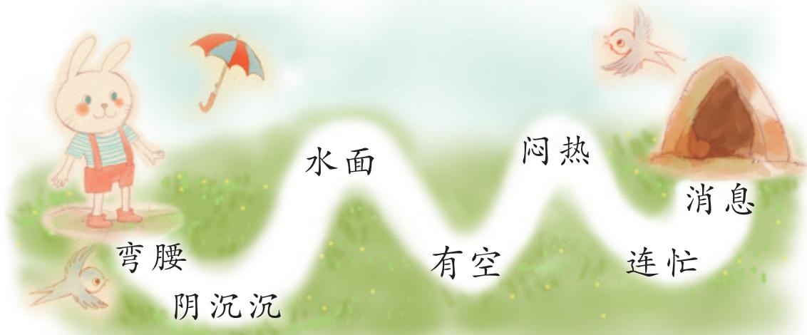

# 语文园地六

## 识字加油站

gùn dòu tāng   
冰棍 西瓜 绿豆汤 wén   
涼席 蚊香 花露水   
pú shàn yǐ yíng   
蒲扇 竹椅 萤火虫   
qiān zhī dǒu   
牵牛 织女 北斗星

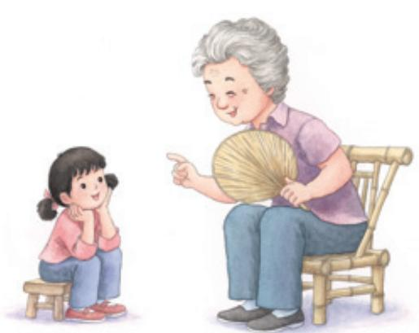

# gùn dòu tāng wén shàn yǐ qiān zhī dǒu 棍豆汤蚊扇椅牵织斗

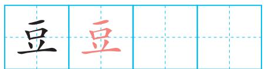

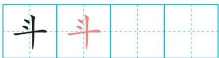

## 字词句运用

读一读，照样子说一说。

小白兔割草。

小白兔在山坡上割草。

小白兔弯着腰在山坡上割草。

小鸭子游泳。

小鸭子 O

小鸭子

读一读，加上标点，再抄写最后一句。

小鸟飞得真低呀

口 你写作业了吗

天安门前的人非常多

爸爸看见我来了开心地笑了

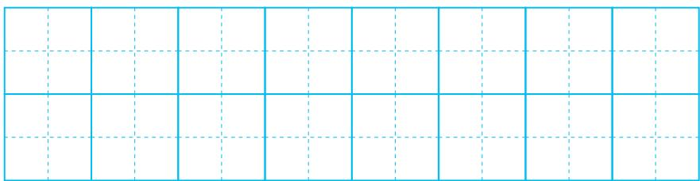

你在食品包装上认识了哪些字？和同学交流。

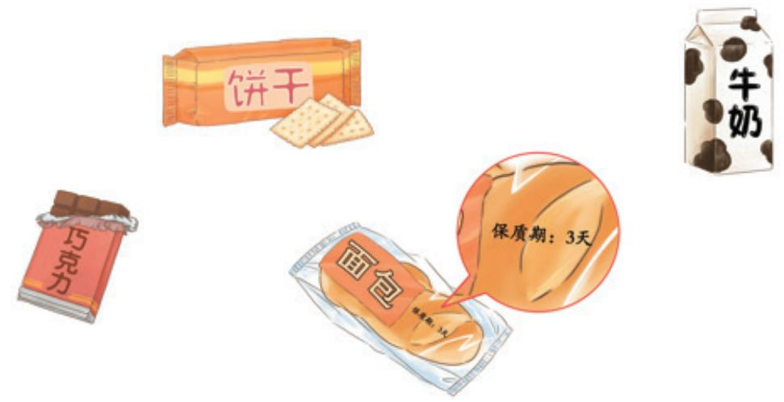

## 日积月累

zhāo xiá bù chū mén wǎn xiá xíng qiān lǐ

朝霞不出门，晚霞行千里。

yǒu yǔ shān dài mào wú yǔ bàn shān yāo

有雨山戴帽，无雨半山腰。

zǎo chen xià yǔ dàng rì qíng wǎn shang xià yǔ dào tiān míng

早晨下雨当日晴，晚上下雨到天明。

mǎ yǐ bān jiā shé guò dào dà yǔ bù jiǔ yào lái dào

蚂蚁搬家蛇过道，大雨不久要来到。

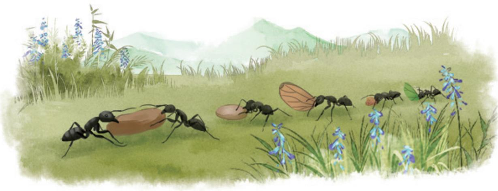

## 和大人一起读

# xià yè duō měi 夏夜多美

xià yè gōng yuán lǐ jìng qiāo qiāo de 夏夜，公园里静悄悄的。

shuǐ chí lǐ shuì lián gāng bì shàng yǎn jing jiù bèi wū wū de 水池里，睡莲刚闭上眼睛，就被呜鸣的

kū shēng jīng xǐng le tā zhēng kāi yǎn jing yí kàn shì yì zhī xiǎo mǎ 哭声惊醒了。她睁开眼睛一看，是一只小蚂 yǐ pā zài yì gēn shuǐ cǎo shàng shuì lián wèn xiǎo mǎ yǐ nǐ 蚁趴在一根水草上。睡莲问：“小蚂蚁，你 zěn me la   
怎么啦？”

xiǎo mǎ yǐ shuō wǒ bù xiǎo xīn diào jìn chí táng shàng bù liǎo 小蚂蚁说：“我不小心掉进池塘，上不了 àn la 岸啦！”

kuài shàng lái ba shuì lián wān wan yāo ràng tā pá le “快上来吧！”睡莲弯弯腰，让他爬了 shàng lái 上来。

xiǎo mǎ yǐ fēi cháng gǎn jī lián shēng shuō xiè xie nín shuì 小蚂蚁非常感激，连声说：“谢谢您，睡 lián gū gu 莲姑姑。”

shuì lián shuō jīn wǎn jiù zài zhèr zhù xià ba nǐ qiáo 睡莲说：“今晚就在这儿住下吧！你瞧， xià yè duō měi ya 夏夜多美呀！”

xiǎo mǎ yǐ yáo yao tóu shuō wǒ děi huí jiā yào bù 小蚂蚁摇摇头，说：“我得回家。要不， bà ba mā ma huì zháo jí de 爸爸妈妈会着急的。”

tā men de huà ràng zhèng zài shuì lián yè shàng xiū xi de qīng tíng tīng 他们的话让正在睡莲叶上休息的蜻蜓听 jiàn le tā wèn shuì lián gū gu yǒu shén me shì ma 见了。他问：“睡莲姑姑，有什么事吗？”

## 人民教育出版社

xiǎo mǎ yǐ xiǎng huí jiā kě wǒ méi bàn fǎ sòng tā “小蚂蚁想回家，可我没办法送他。”

qīng tíng shuō ràng wǒ lái sòng xiǎo mǎ yǐ ba 蜻蜓说：“让我来送小蚂蚁吧！”

shuì lián wèn tiān zhè me hēi nǐ néng xíng mα 睡莲问：“天这么黑，你能行吗？”

zhè shí yì zhī yíng huǒ chóng fēi lái le shuō wǒ lái gěi 这时，一只萤火虫飞来了，说：“我来给 nǐ men zhào liàng 你们照亮。”

xiǎo mǎ yǐ pá shàng fēi jī qīng tíng qǐ fēi le yíng 小蚂蚁爬上“飞机”，蜻蜓起飞了。萤 huǒ chóng zài qián miàn diǎn qǐ le liàng jīng jīng de xiǎo dēng long 火虫在前面点起了亮晶晶的小灯笼。

qīng tíng fēi ya fēi fēi guò qīng qīng de jiǎ shān fēi guò là là 蜻蜓飞呀飞，飞过青青的假山，飞过绿绿 de cǎo píng fēi dào yí zuò huā tán qián xiǎo mǎ yǐ dào jiā le 的草坪，飞到一座花坛前，小蚂蚁到家了。

xīng xing kàn jiàn le gāo xìng de zhǎ zhe yǎn 星星看见了，高兴地眨着眼。

à duō měi de xià yè ya 啊，多美的夏夜呀！

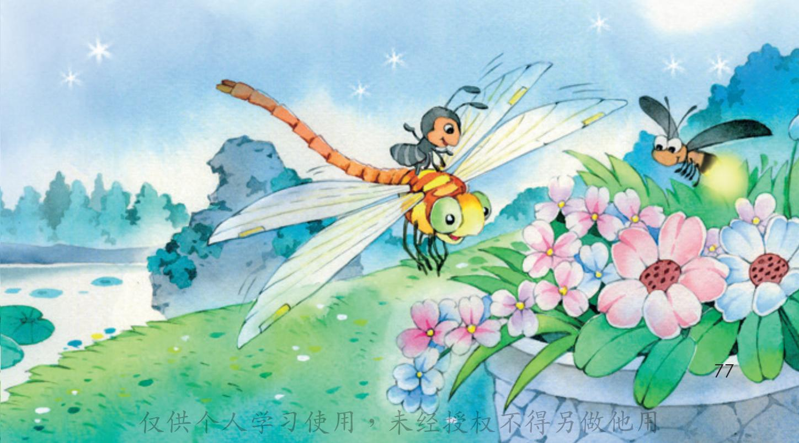

# wén jù de jiā 文具的家

qiān bǐ zhǐ yòng le yí cì jiù bù zhī diū dào nǎ lǐ qù le 铅笔，只用了一次，就不知丢到哪里去了。 xiàng pí zhǐ cā le yì huí zài xiǎng cā jiù zhǎo bù zháo le 橡皮，只擦了一回，再想擦，就找不着了。

bèi bei yì huí dào jiā jiù xiàng mā ma yào xīn de qiān bǐ 贝贝一回到家，就向妈妈要新的铅笔、 xīn de xiàng pí mā ma shuō nǐ zěn me tiān tiān diū dōng xi 新的橡皮。妈妈说：“你怎么天天丢东西 ne bèi bei zhǎ zhe yì shuāng dà yǎn jing duì mā ma shuō wǒ 呢？”贝贝眨着一双大眼睛，对妈妈说：“我 yě bù zhī dào 也不知道。”

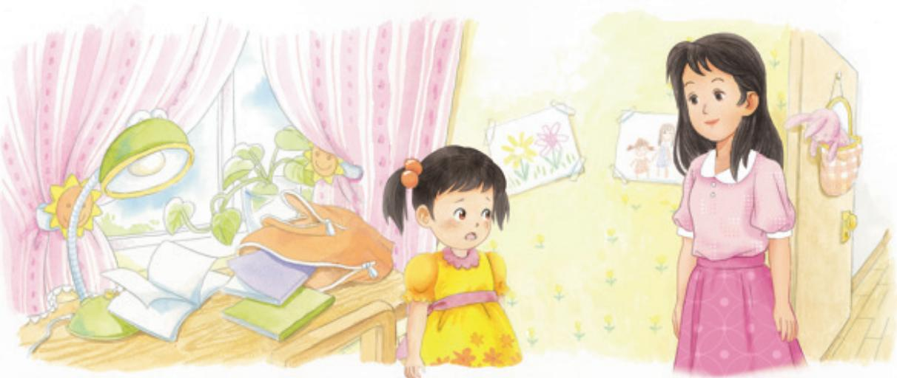

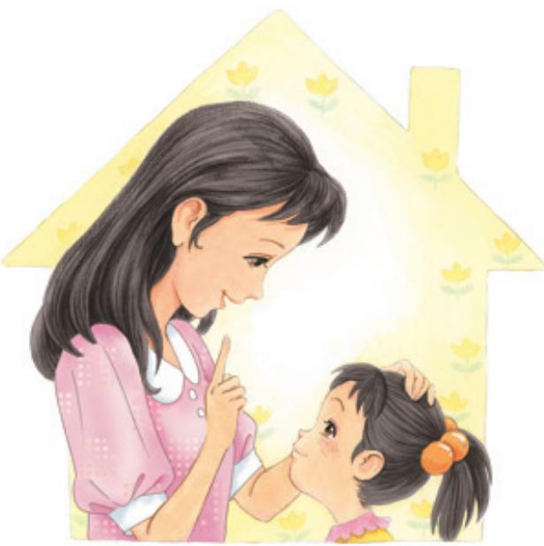

mā ma shuō bèi bei 妈妈说：“贝贝， nǐ yǒu yí gè jiā měi tiān fàng 你有一个家，每天放 xué hòu nǐ dōu píng píng ān ān 学后，你都平平安安 de huí jiā nǐ yào xiǎng xiang bàn 地回家。你要想想办 fǎ ràng nǐ de qiān bǐ xiàng 法，让你的铅笔、橡 pí hé zhuàn bǐ dāo yě yǒu zì jǐ 皮和转笔刀也有自己 de jiā ya 的家呀！”

bèi bei xiǎng qǐ lái le tā shū bāo lǐ de wén jù hé jiù 贝贝想起来了，她书包里的文具盒，就 shì zhè xiē wén jù de jiā 是这些文具的家。

cóng cǐ měi tiān fàng xué de shí hou bèi bei dōu yào zǐ xì 从此，每天放学的时候，贝贝都要仔细 jiǎn chá qiān bǐ ya xiàng pí yα zhuàn bǐ dāo wa suǒ yǒu de 检查，铅笔呀，橡皮呀，转笔刀哇，所有的 xiǎo huǒ bàn shì bú shì dōu huí jiā le 小伙伴是不是都回家了。

jù qiān xīn píng hé xiē cǐ zǐ jiǎn chá suǒ huǒ bàn 具铅新平盒些此仔检查所伙伴

知知

道道

放放

平平

安安

朗读课文。

说一说：为了不再丢文具，贝贝是怎么做的？

读一读，记一记。

新

新书

新年

新手

清新

平

平安

平时

平常

平地

伴

伙伴

做伴

相伴

结伴

# yì fēn zhōng 15一分钟 ①

dīng líng líng nào zhōng xiǎng le yuán yuan dǎ le gè hā qian 丁零零，闹钟响了。元元打了个哈欠， fān le gè shēn xīn xiǎng zài shuì yì fēn zhōng ba jiù shuì yì fēn 翻了个身，心想：再睡一分钟吧，就睡一分 zhōng bú huì chí dào de 钟，不会迟到的。

guò le yì fēn zhōng yuán yuan qǐ lái le tā hěn kuài de xǐ 过了一分钟，元元起来了。他很快地洗 le liǎn chī le zǎo fàn jiù bēi zhe shū bāo shàng xué qù le dào 了脸，吃了早饭，就背着书包上学去了。到 le shí zì lù kǒu tā kàn jiàn qián miàn shì lù dēng gāng xiǎng zǒu guò 了十字路口，他看见前面是绿灯，刚想走过 qù hóng dēng liàng le tā tàn le kǒu qì shuō yào shi zǎo 去，红灯亮了。他叹了口气，说：“要是早 yì fēn zhōng jiù hǎo le 一分钟就好了。”

## 人民教育出版社

tā děng le yí huìr cái zǒu guò shí zì lù kǒu tā xiàng 他等了一会儿，才走过十字路口。他向 tíng zài chē zhàn de gōng gòng qì chē pǎo qù yǎn kàn jiù yào dào le 停在车站的公共汽车跑去，眼看就要到了， chē zi kāi le tā yòu tàn le kǒu qì shuō yào shi zǎo yì fēn 车子开了。他又叹了口气，说：“要是早一分 zhōng jiù hǎo le 钟就好了。”

tā děng a děng yì zhí bú jiàn gōng gòng qì chē de yǐng zi 他等啊等，一直不见公共汽车的影子， yuán yuan jué dìng zǒu dào xué xiào qù 元元决定走到学校去。

dào le xué xiào yǐ jīng shàng kè le yuán yuan hóng zhe liǎn 到了学校，已经上课了。元元红着脸， dī zhe tóu zuò dào le zì jǐ de zuò wèi shàng lǐ lǎo shī kàn 低着头，坐到了自己的座位上。李老师看 le kàn shǒu biǎo shuō yuán yuan jīn tiān nǐ chí dào le èr shí 了看手表，说：“元元，今天你迟到了二十 fēn zhōng 分钟。”

yuán yuan fēi cháng hòu huǐ元元非常后悔。

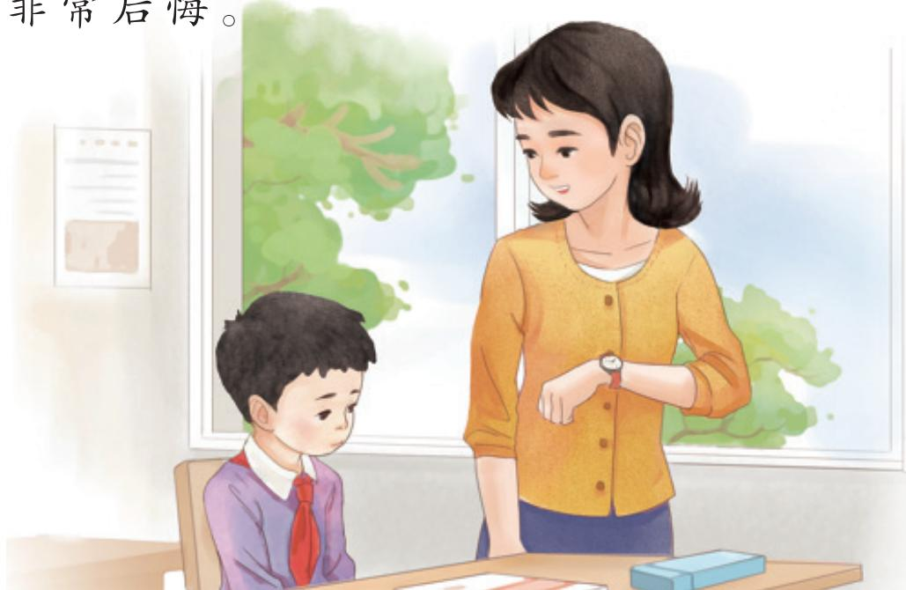

# zhōng chí bēi dēng děng a jué dìng yǐ jīng wèi biǎo 钟迟背灯等啊决定已经位表

元元

灯灯

车车

站站

坐坐

师师

老老

朗读课文。

根据课文内容说一说。

◇要是早一分钟，就能赶上绿灯了。

要是能赶上绿灯，就

◇要是能及时通过路口，就 O

◇要是能赶上公共汽车，就不会迟到了。

一分钟能做什么？试一试，做一做。

我一分钟能走（ ）步。

我一分钟能……

口 我一分钟能写（ ）个字。

# dòng wù wáng guó kāi dà huì16 动物王国开大会

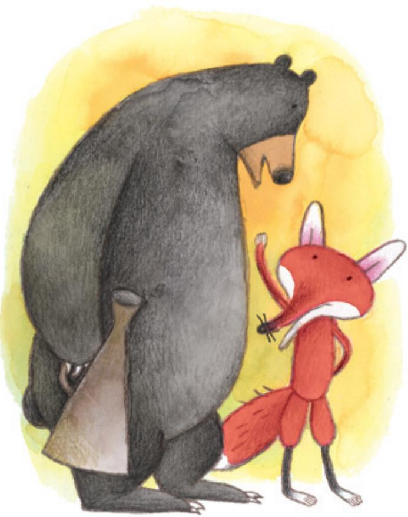

dòng wù wáng guó yào kāi 动物王国要开 dà huì lǎo hǔ ràng gǒu xióng 大会，老虎让狗熊 tōng zhī dà jiā gǒu xióng yòng 通知大家。狗熊用 lǎ ba dà shēng hǎn dà jiā 喇叭大声喊：“大家 zhù yì dòng wù wáng guó yào 注意，动物王国要 kāi dà huì qǐng nǐ men dōu 开大会，请你们都 cān jiā yì lián hǎn le 参加！”一连喊了 shí biàn 十遍。

hú li pǎo lái le duì gǒu xióng shuō nǐ hǎn yì bǎi biàn 狐狸跑来了，对狗熊说：“你喊一百遍， dà huì yě kāi bù qǐ lái 大会也开不起来。”

wèi shén me gǒu xióng wèn “为什么？”狗熊问。

yīn wèi nǐ méi gào su dà jiā dà huì zài nǎ yì tiān kāi “因为你没告诉大家，大会在哪一天开， shì jīn tiān hái shi míng tiān hái shi 是今天，还是明天，还是……”

gǒu xióng yì tīng shēn le shēn shé tou zuò le gè guǐ liǎn 狗熊一听，伸了伸舌头，做了个鬼脸，   
lián máng shuō duì duì duì yú shì jiù qù wèn lǎo hǔ   
连忙说：“对，对，对！”于是就去问老虎。

lǎo hǔ shuō dà huì jiù zài míng tiān kāi nǐ kuài qù tōng zhī 老虎说：“大会就在明天开，你快去通知 dà jiā ba 大家吧！”

gǒu xióng yòu yòng lǎ ba dà shēng hǎn dà jiā zhù yì dòng wù 狗熊又用喇叭大声喊：“大家注意，动物 wáng guó yào zài míng tiān kāi dà huì qǐng nǐ men dōu cān jiā yì 王国要在明天开大会，请你们都参加！” lián hǎn le shí biàn 连喊了十遍。

dà huī láng pǎo lái duì gǒu xióng shuō nǐ hǎn yì bǎi biàn 大灰狼跑来对狗熊说：“你喊一百遍， dà huì yě kāi bù qǐ lái 大会也开不起来。”

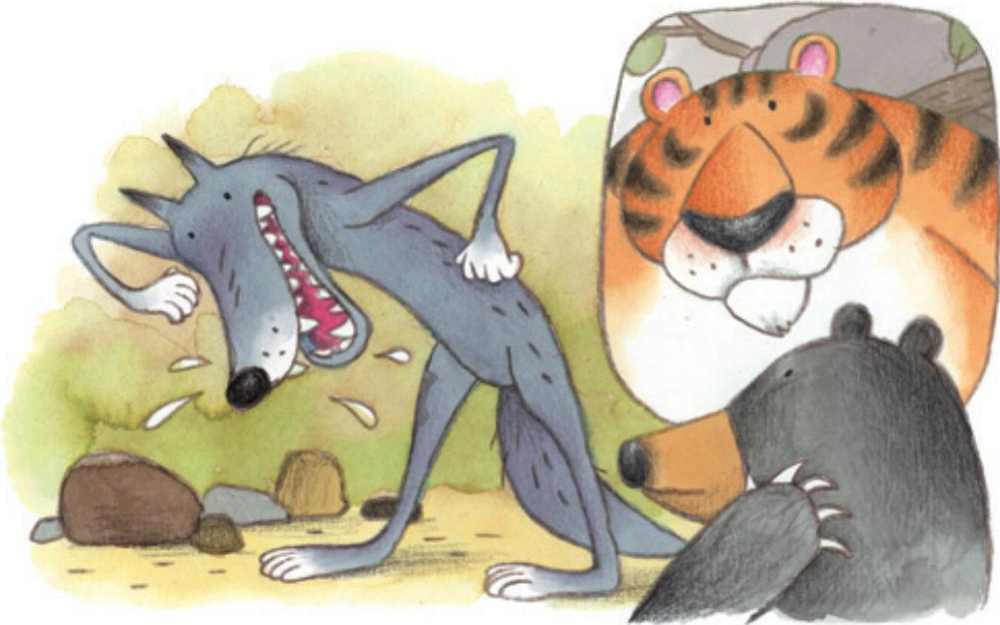

wèi shén me gǒu xióng wèn “为什么？”狗熊问。

yīn wèi nǐ méi gào su dà jiā zài míng tiān shén me shí hou “因为你没告诉大家，在明天什么时候 kāi shàng wǔ hái shi xià wǔ jǐ diǎn zhōng kāi 开，上午还是下午，几点钟开。

gǒu xióng yì tīng shuō yǒu dào lǐ yǒu dào lǐ yú 狗熊一听，说：“有道理，有道理！”于 shì yòu qù wèn lǎo hǔ 是又去问老虎。

lǎo hǔ shuō dà huì jiù zài míng tiānshàng wǔ bā diǎn kāi nǐ 老虎说：“大会就在明天上午八点开，你 zài qù tōng zhī dà jiā ba 再去通知大家吧！”

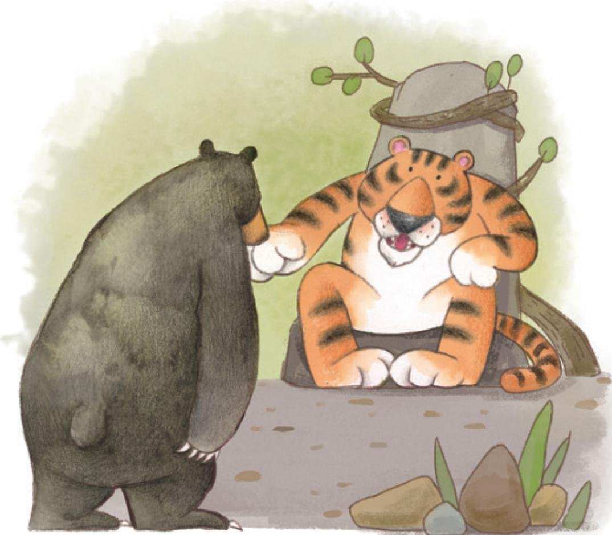

gǒu xióng yòu yòng 狗熊又用 lǎ ba dà shēng hǎn 喇叭大声喊： dà jiā zhù yì dòng “大家注意，动 wù wáng guó yào zài míng 物王国要在明 tiān shàng wǔ bā diǎn kāi 天上午八点开 dà huì qǐng nǐ men 大会，请你们 dōu cān jiā yì 都参加！” lián hǎn le shí biàn 连喊了十遍。

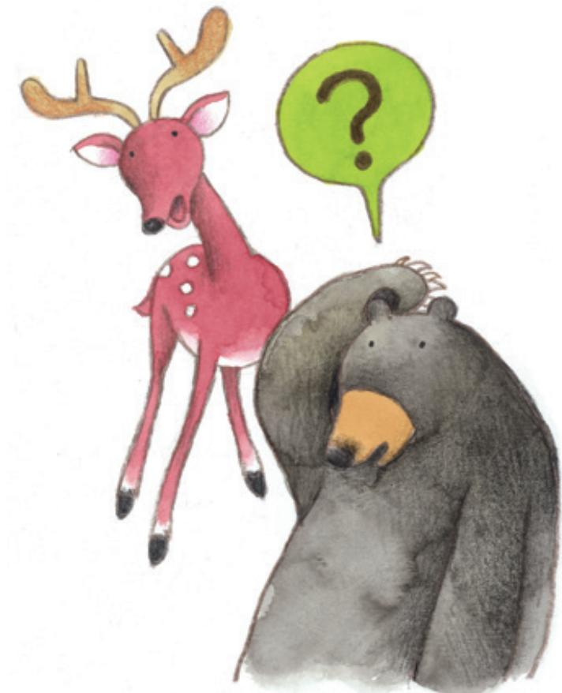

méi huā lù pǎo lái wèn gǒu xióng dà huì zài nǎr kāi ya 梅花鹿跑来问狗熊：“大会在哪儿开呀？ nǐ děi shuō qīng chu 你得说清楚。”

gǒu xióng chuí chui zì jǐ de nǎo dai shuō wǒ zěn me méi wèn 狗熊捶捶自己的脑袋，说：“我怎么没问 qīng chu ne yú shì yòu qù wèn lǎo hǔ 清楚呢？”于是又去问老虎。

āi yā wàng le shuō dì diǎn dà huì zài sēn lín guǎng chǎng “哎呀！忘了说地点。大会在森林广场 kāi nǐ zài qù tōng zhī dà jiā ba lǎo hǔ duì gǒu xióng shuō 开，你再去通知大家吧！”老虎对狗熊说。

## 人民教育出版社

qǐng zhù yì la gǒu xióng yòu yòng lǎ ba dà shēng hǎn “请注意啦！”狗熊又用喇叭大声喊， míng tiān shàng wǔ bā diǎn zài sēn lín guǎng chǎng kāi dà huì qǐng “明天上午八点，在森林广场开大会，请 dà jiā zhǔn shí cān jiā yì lián hǎn le shí biàn 大家准时参加！”一连喊了十遍。

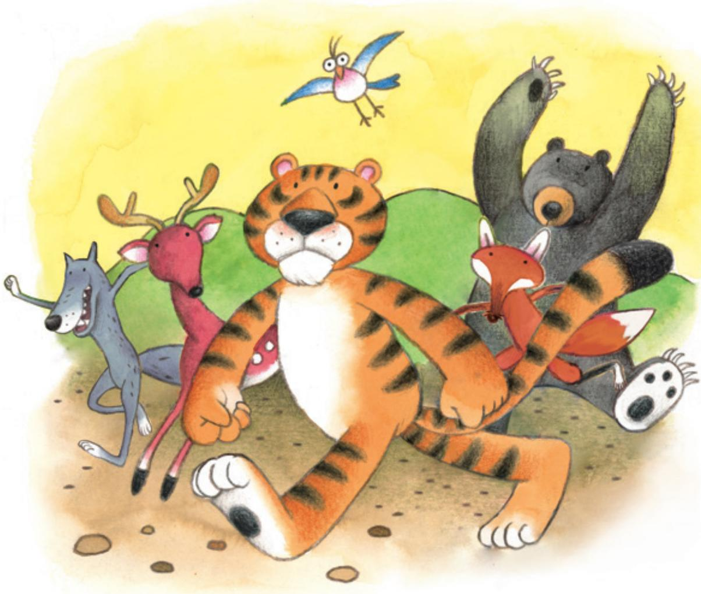

## 人民教育出版社

zhè yí cì dà jiā dōu míng bai le dì èr tiān shàng wǔ 这一次，大家都明白了。第二天上午，   
dòng wù men dōu lái dào sēn lín guǎng chǎng zhǔn shí cān jiā le dà huì   
动物们都来到森林广场，准时参加了大会。

看来，发布通知的时候，把时间、地点说清楚很重要！

hǔ xióng tōng zhù yì biàn bǎi 虎熊通注意遍百 wèi yīn shé lǐ yā wàng dì 为因舌理呀忘第

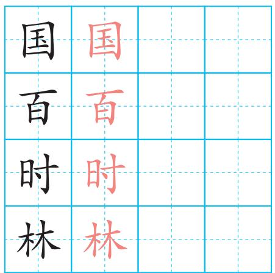

都都听 听点

分角色朗读课文。

狗熊一共通知了大家几次？为什么最后一次通知大家才听明白?

# xiǎo hóu zi xià shān 小猴子下山 ①

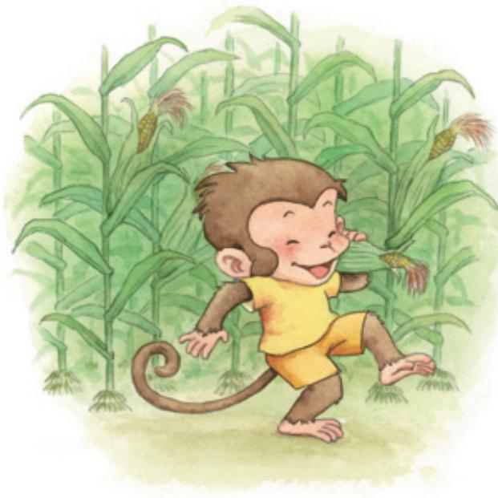

xiǎo hóu zi káng zhe yù 小猴子扛着玉 mǐ zǒu dào yì kē táo shù 米，走到一棵桃树 xià tā kàn jiàn mǎn shù de 下。他看见满树的 táo zi yòu dà yòu hóng fēi cháng 桃子又大又红，非常 gāo xìng jiù rēng le yù mǐ 高兴，就扔了玉米， qù zhāi táo zi 去摘桃子。

yǒu yì tiān xiǎo hóu zi 有一天，小猴子 xià shān lái zǒu dào yí kuài yù 下山来，走到一块玉 mǐ dì lǐ tā kàn jiàn yù mǐ 米地里。他看见玉米 jiē de yòu dà yòu duō fēi cháng 结得又大又多，非常 gāo xìng jiù bāi le yí gè 高兴，就掰了一个， káng zhe wǎng qián zǒu 扛着往前走。

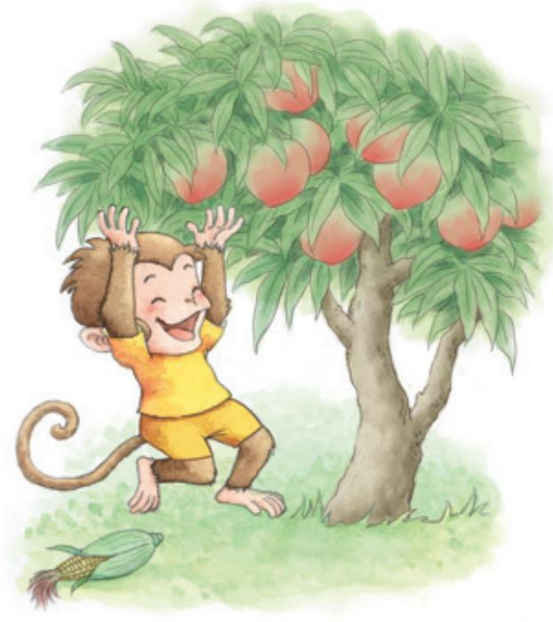

xiǎo hóu zi pěng zhe jǐ 小猴子捧着几 gè táo zi zǒu dào yí piàn 个桃子，走到一片 guā dì lǐ tā kàn jiàn mǎn 瓜地里。他看见满 dì de xī guā yòu dà yòu yuán 地的西瓜又大又圆， fēi cháng gāo xìng jiù rēng le 非常高兴，就扔了 táo zi qù zhāi xī guā 桃子，去摘西瓜。

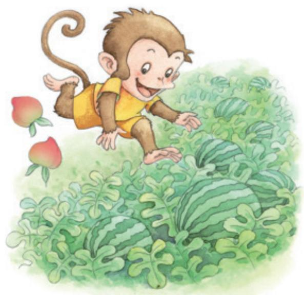

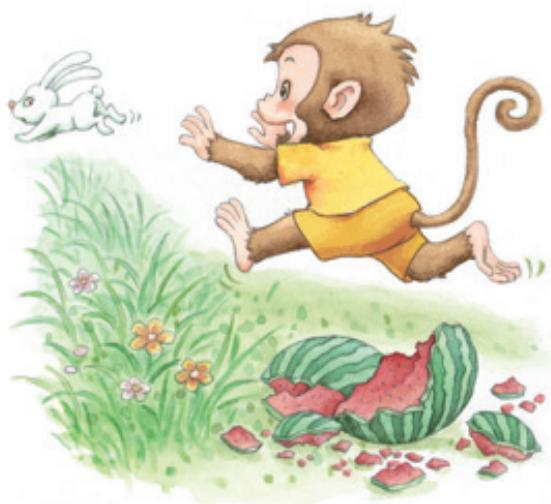

xiǎo hóu zi bào zhe yí gè dà 小猴子抱着一个大 xī guā wǎng huí zǒu zǒu zhe zǒu zhe 西瓜往回走。走着走着， tā kàn jiàn yì zhī xiǎo tù zi bèng bèng 他看见一只小兔子蹦蹦 tiào tiào de zhēn kě ài jiù rēng 跳跳的，真可爱，就扔 le xī guā qù zhuī xiǎo tù zi 了西瓜，去追小兔子。

xiǎo tù zi pǎo jìn shù lín lǐ bú jiàn le xiǎo hóu zi zhǐ 小兔子跑进树林里，不见了。小猴子只 hǎo kōng zhe shǒu huí jiā qù 好空着手回家去。

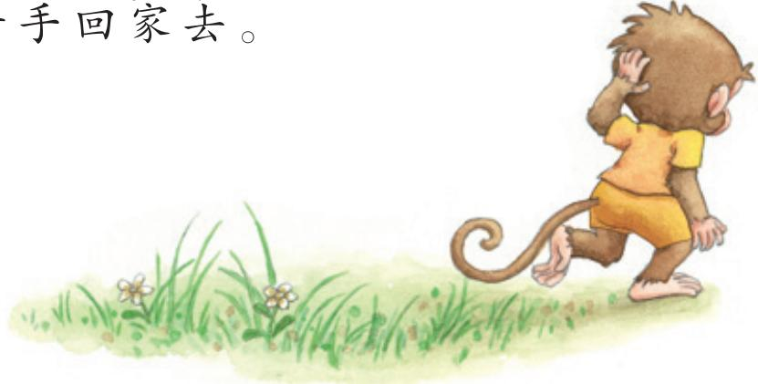

hóu kuài jiē xìng bāi káng wǎng kē mǎn rēng zhāi pěng zhuī 猴块结兴掰扛往棵满扔摘捧追

高高

兴兴

着着

往往

瓜瓜

兔兔

进进

朗读课文。

结合插图，说说小猴子看到了什么，做了什么，最后为什么“只好空着手回家去”。

读读做做，再选几个词各说一句话。

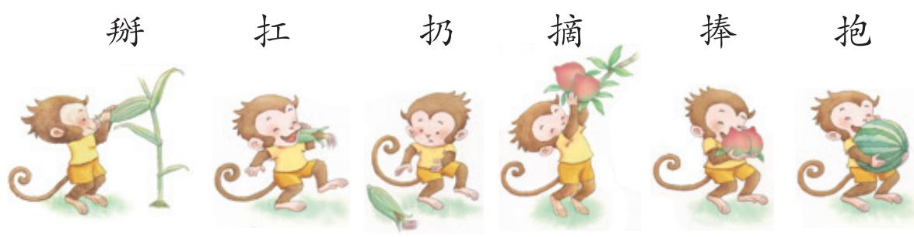

## 拓展活动

学习了这几篇课文，我知道了养成好习惯很重要。

我还知道其他好习惯，我们一起交流一下吧！

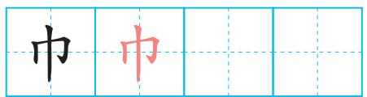

# 语文园地七

## 识字加油站

shuā   
牙刷 刷牙   
shū   
梳子 梳头

## 卫生间

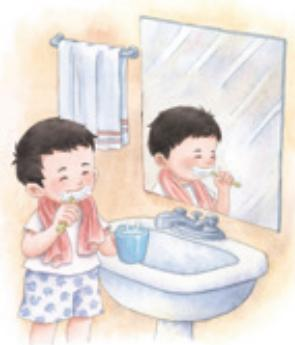

jīn cā   
毛巾 擦手 zào xǐ zǎo   
香皂 洗澡   
liǎn pén   
脸盆 洗脸

shuā shū jīn zào xǐ zǎo liǎn pén 刷梳巾皂洗澡脸盆

## 字词句运用

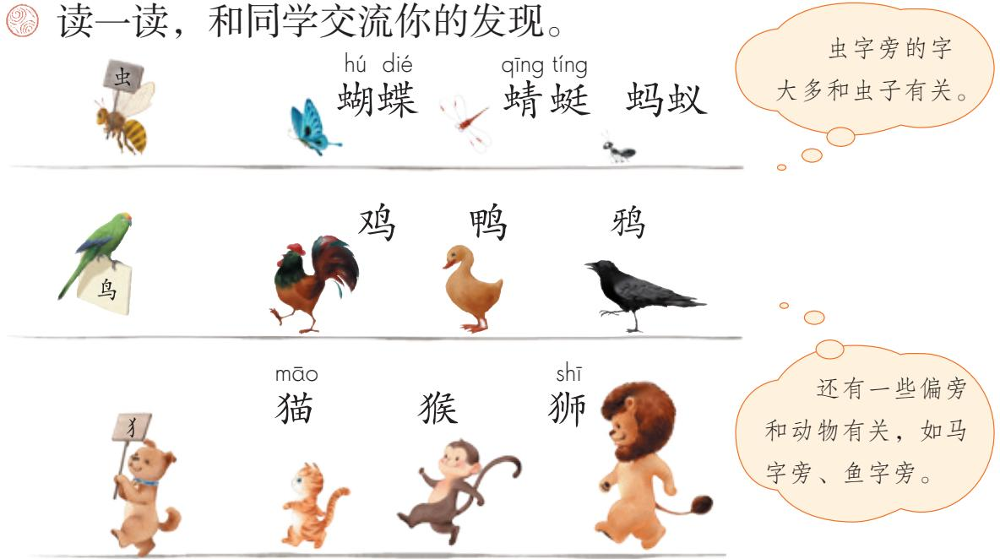

从下面的词语中选择几个，展开想象说几句话。

花朵 笑声 阳光 草地

告诉 歌唱 跑步 喜欢

## 书写提示

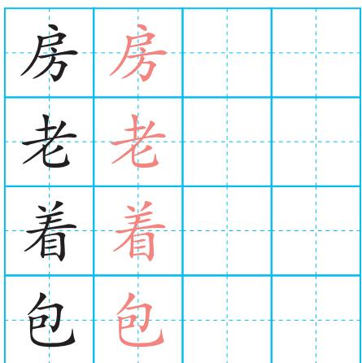

笔顺规则：左上包围和右上包围的字先外后内。

## 日积月累

bù zhī zé wèn bù néng zé xué xún zǐ   
不知则问，不能则学。—《荀子》 dú wàn juàn shū xíng wàn lǐ lù dǒng qí chāng   
读万卷书，行万里路。——董其昌 dú shū pò wàn juàn xià bǐ rú yǒu shén   
读书破万卷，下笔如有神。 dù fǔ -杜甫

# tīng gù shi jiǎng gù shi 听故事，讲故事

yì biān kàn tú yì biān tīng lǎo shī jiǎng xiǎo māo zhòng yú一边看图，一边听老师讲《小猫种鱼》de gù shi rán hòu zì jǐ jiǎng jiang zhè ge gù shi的故事。然后自己讲讲这个故事。

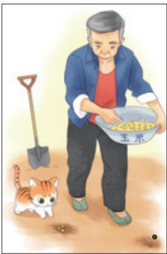

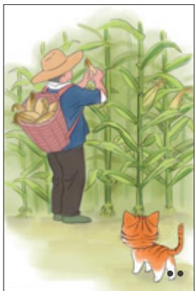

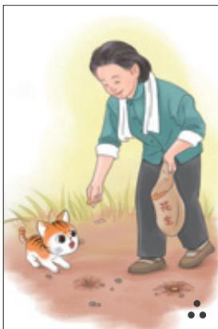

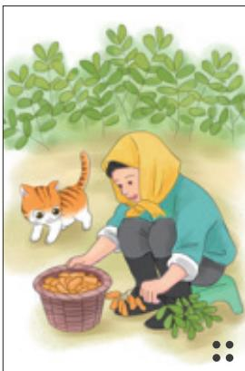

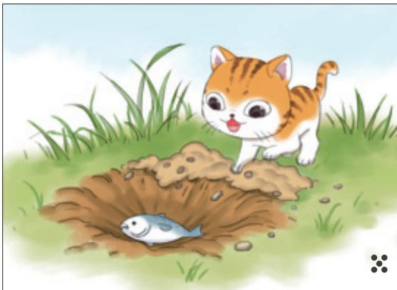

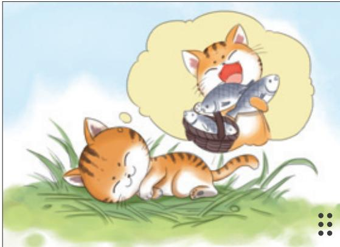

听故事的时候，可以借助图画记住故事内容。

讲故事的时候，声音要大一些，让别人听清楚。

## hú li hé wū yā 狐狸和乌鸦

hú li zài shù lín lǐ zhǎo chī de 狐狸在树林里找吃的。   
tā lái dào yì kē dà shù xià kàn jiàn wū   
他来到一棵大树下，看见乌   
yā zhèng zhàn zài shù zhī shàng zuǐ lǐ diāo zhe   
鸦正站在树枝上，嘴里叼着   
yí piàn ròu hú li chán de zhí liú kǒu shuǐ   
一片肉。狐狸馋得直流口水。

tā yǎn zhū yí zhuàn duì wū yā shuō 他眼珠一转，对乌鸦说： qīn ài de wū yā nín hǎo ma wū 亲爱的乌鸦，您好吗？”乌 yā méi yǒu huí dá 鸦没有回答。

①本文根据《伊索寓言》相关内容改写。

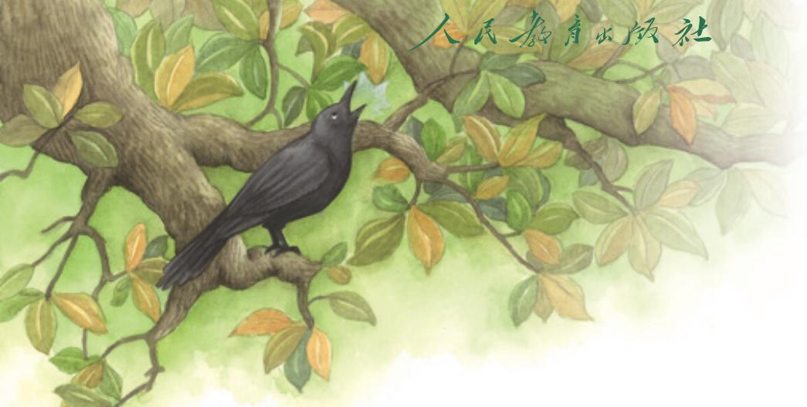

hú li péi zhe xiào liǎn shuō qīn ài de wū yā nín de 狐狸赔着笑脸说：“亲爱的乌鸦，您的 hái zi hǎo ma wū yā kàn le hú li yì yǎn hái shi méi yǒu 孩子好吗？”乌鸦看了狐狸一眼，还是没有 huí dá 回答。

hú li yòu yáo yao wěi ba shuō qīn ài de wū yā nín 狐狸又摇摇尾巴，说：“亲爱的乌鸦，您 de yǔ máo zhēn piào liang má què bǐ qǐ nín lái kě jiù chà duō 的羽毛真漂亮，麻雀比起您来，可就差多 le nín de sǎng zi zhēn hǎo shuí dōu ài tīng nín chàng gē nín jiù 了。您的嗓子真好，谁都爱听您唱歌，您就 chàng jǐ jù ba 唱几句吧！”

wū yā tīng le hú li de huà fēi cháng dé yì yú shì chàng 乌鸦听了狐狸的话，非常得意，于是唱 le qǐ lái wā wū yā gāng yì kāi kǒu ròu jiù diào le 了起来。“哇……”乌鸦刚一开口，肉就掉了 xià lái 下来。

hú li diāo qǐ ròu yí liù yān pǎo diào le狐狸叼起肉，一溜烟跑掉了。

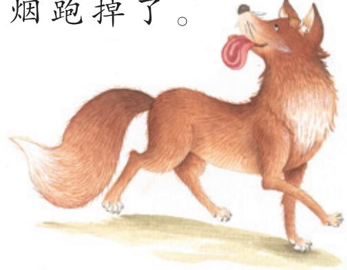

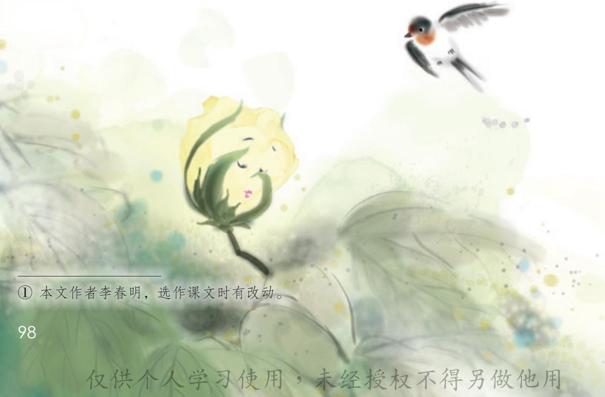

# mián huā gū niang 18 棉花姑娘 ①

mián huā gū niang shēng bìng le yè zi 棉花姑娘生病了，叶子 shàng yǒu xǔ duō kě wù de yá chóng tā duō me 上有许多可恶的蚜虫。她多么 pàn wàng yǒu yī shēng lái gěi tā zhì bìng a 盼望有医生来给她治病啊！

yàn zi fēi lái le mián huā gū niang shuō qǐng nǐ bāng wǒ zhuō 燕子飞来了。棉花姑娘说：“请你帮我捉 hài chóng ba yàn zi shuō duì bu qǐ wǒ zhǐ huì zhuō kōng zhōng 害虫吧！”燕子说：“对不起，我只会捉空中 fēi de hài chóng nǐ hái shi qǐng bié rén bāng máng ba 飞的害虫，你还是请别人帮忙吧！”

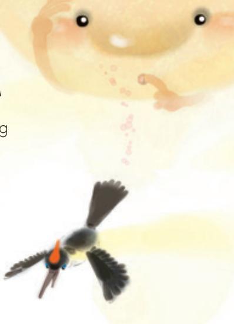

zhuó mù niǎo fēi lái le mián huā 啄木鸟飞来了。棉花 gū niang shuō qǐng nǐ bāng wǒ zhuō hài chóng 姑娘说：“请你帮我捉害虫 ba zhuó mù niǎo shuō duì bu qǐ 吧！”啄木鸟说：“对不起， wǒ zhǐ huì zhuō shù gàn lǐ de hài chóng 我只会捉树干里的害虫，你 hái shi qǐng bié rén bāng máng ba 还是请别人帮忙吧！”

qīng wā tiào lái le mián huā gū niang gāo xìng de shuō qǐng nǐ 青蛙跳来了。棉花姑娘高兴地说：“请你 bāng wǒ zhuō hài chóng ba qīng wā shuō duì bu qǐ wǒ zhǐ huì 帮我捉害虫吧！”青蛙说：“对不起，我只会 zhuō shuǐ tián lǐ de hài chóng nǐ hái shi qǐng bié rén bāng máng ba 捉水田里的害虫，你还是请别人帮忙吧！”

hū rán yì qún yuán 忽然，一群圆 yuán de xiǎo chóng zi fēi lái le 圆的小虫子飞来了， hěn kuài jiù bǎ yá chóng chī 很快就把蚜虫吃 guāng le mián huā gū niang 光了。棉花姑娘 jīng qí de wèn nǐ men 惊奇地问：“你们 shì shuí ya xiǎo chóng zi 是谁呀？”小虫子 shuō wǒ men shēn shàng yǒu 说：“我们身上有

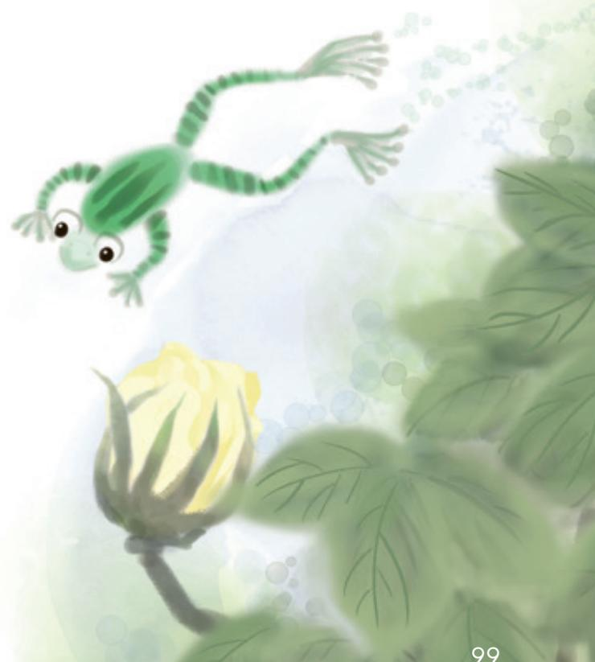

<table><tr><td rowspan=1 colspan=1></td><td rowspan=1 colspan=1>h</td><td rowspan=1 colspan=1></td><td rowspan=1 colspan=1></td><td rowspan=1 colspan=1></td><td rowspan=1 colspan=1></td><td rowspan=1 colspan=1></td><td rowspan=1 colspan=1></td></tr><tr><td rowspan=1 colspan=1>女</td><td rowspan=1 colspan=1>U</td><td rowspan=1 colspan=1></td><td rowspan=1 colspan=1></td><td rowspan=1 colspan=1></td><td rowspan=1 colspan=1></td><td rowspan=1 colspan=1></td><td rowspan=1 colspan=1></td></tr><tr><td rowspan=2 colspan=1></td><td rowspan=1 colspan=1>不</td><td rowspan=1 colspan=1></td><td rowspan=1 colspan=1></td><td rowspan=1 colspan=1></td><td rowspan=1 colspan=1></td><td rowspan=1 colspan=1></td><td rowspan=1 colspan=1></td></tr><tr><td rowspan=1 colspan=1>C</td><td rowspan=1 colspan=1></td><td rowspan=1 colspan=1></td><td rowspan=1 colspan=1></td><td rowspan=1 colspan=1></td><td rowspan=1 colspan=1></td><td rowspan=1 colspan=1></td></tr><tr><td rowspan=2 colspan=2>身</td><td rowspan=2 colspan=1>身</td><td rowspan=1 colspan=1></td><td rowspan=1 colspan=1></td><td rowspan=1 colspan=1></td><td rowspan=1 colspan=1></td><td rowspan=1 colspan=1></td></tr><tr><td rowspan=1 colspan=1></td><td rowspan=1 colspan=1></td><td rowspan=1 colspan=1></td><td rowspan=1 colspan=1></td><td rowspan=1 colspan=1></td></tr><tr><td rowspan=2 colspan=2>久久</td><td rowspan=1 colspan=1></td><td rowspan=1 colspan=1></td><td rowspan=1 colspan=1></td><td rowspan=1 colspan=1></td><td rowspan=1 colspan=1></td><td rowspan=1 colspan=1></td></tr><tr><td rowspan=1 colspan=1></td><td rowspan=1 colspan=1></td><td rowspan=1 colspan=1></td><td rowspan=1 colspan=1></td><td rowspan=1 colspan=1></td><td rowspan=1 colspan=1></td><td rowspan=1 colspan=1></td></tr></table>

<table><tr><td rowspan=2 colspan=1></td><td rowspan=1 colspan=1>小</td><td rowspan=1 colspan=1></td><td rowspan=1 colspan=1></td><td rowspan=1 colspan=1></td><td rowspan=1 colspan=1></td><td rowspan=1 colspan=1></td><td rowspan=1 colspan=1></td></tr><tr><td rowspan=1 colspan=1>二</td><td rowspan=1 colspan=1></td><td rowspan=1 colspan=1></td><td rowspan=1 colspan=1></td><td rowspan=1 colspan=1></td><td rowspan=1 colspan=1></td><td rowspan=1 colspan=1></td></tr><tr><td rowspan=2 colspan=1></td><td rowspan=2 colspan=1>F</td><td rowspan=2 colspan=1></td><td rowspan=1 colspan=1></td><td rowspan=1 colspan=1></td><td rowspan=1 colspan=1></td><td rowspan=1 colspan=1></td><td rowspan=1 colspan=1></td></tr><tr><td rowspan=1 colspan=1></td><td rowspan=1 colspan=1></td><td rowspan=1 colspan=1></td><td rowspan=1 colspan=1></td><td rowspan=1 colspan=1></td></tr><tr><td rowspan=1 colspan=1></td><td rowspan=1 colspan=1></td><td rowspan=1 colspan=1></td><td rowspan=1 colspan=1></td><td rowspan=1 colspan=1></td><td rowspan=1 colspan=1></td><td rowspan=1 colspan=1></td><td rowspan=1 colspan=1></td></tr></table>

## 人民教育出版社

qī gè bān diǎn jiù xiàng qī kē xīng xing dà jiā jiào wǒ men qī xīng 七个斑点，就像七颗星星，大家叫我们七星 piáo chóng   
瓢虫。”

bù jiǔ mián huā gū niang de bìng hǎo le zhǎng chū le bì là 不久，棉花姑娘的病好了，长出了碧绿 bì lù de yè zi tǔ chū le xuě bái xuě bái de mián huā tā liě 碧绿的叶子，吐出了雪白雪白的棉花。她咧 kāi zuǐ xiào la 开嘴笑啦！

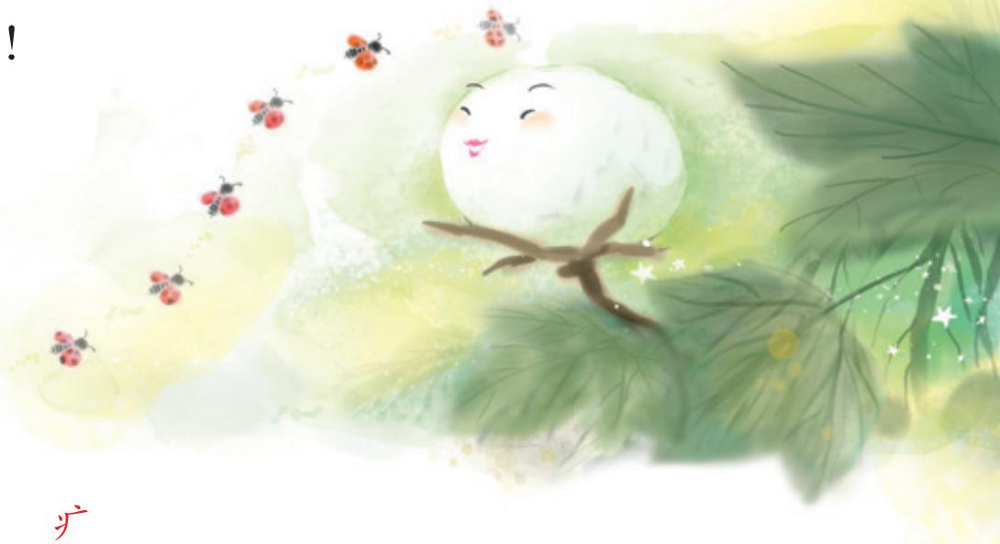

# mián gū niáng bìng tā zhì yàn bāng hài bié gàn jīng qí 棉姑娘病她治燕帮害别干惊奇

朗读课文，读好课文中的对话。

连一连，说一说：棉花姑娘先后请求谁帮她看病？最后谁把她的病治好了？

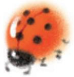

捉空中的害虫

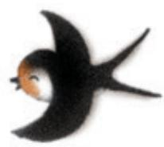

捉树干里的害虫

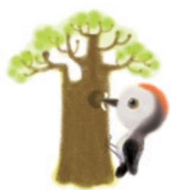

捉水田里的害虫

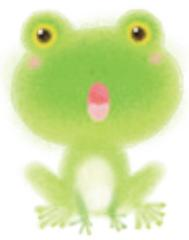

捉棉花叶子上的害虫

读一读，照样子说一说。

碧绿碧绿的叶子

雪白雪白的棉花

火紅火紅的太陽

碧绿碧綠的

雪白雪白的

火紅火紅的

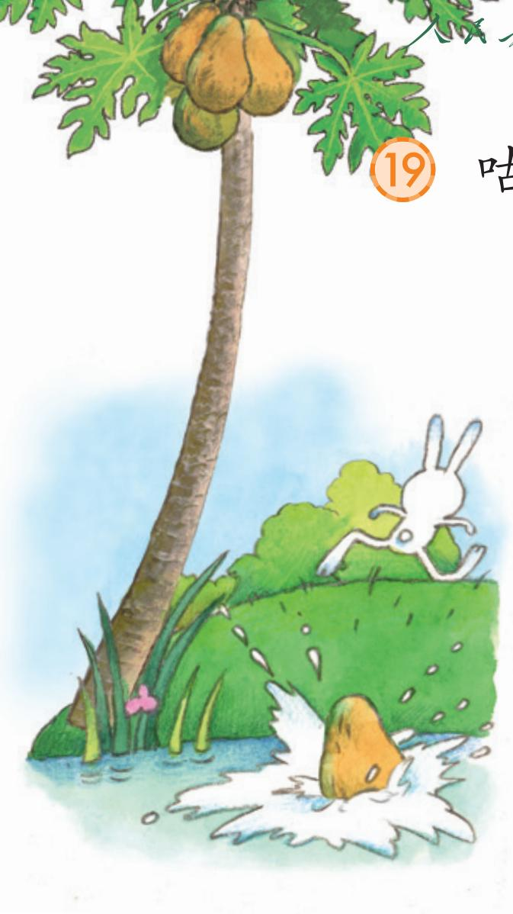

木瓜熟了。一个木diào瓜从高高的树上掉进湖里，咕咚！

兔子吓了一跳，拔腿就跑。小猴子看见了，问他为什么跑。兔子一边跑一边叫：“不好啦，‘咕咚’来了，可怕极了！”

小猴子一听，就跟着跑起来。他一边跑一边大wa叫：“不好啦，不好啦，‘咕咚’来了，大家快跑哇！”

这一下可热闹了。狐狸呀，山羊啊，小鹿哇，táo一个跟着一个跑起来。大伙儿一边跑一边叫：“快逃mìng命啊，‘咕咚’来了！”

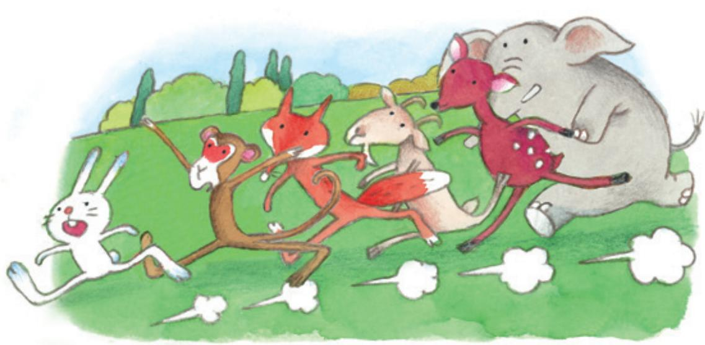

大象看见了，也跟着跑起来。野牛拦住他，问：nǎ“咕咚’在哪里，你看见了？”大象说：“没看见，大伙儿都说‘咕咚’来了。”野牛又问大伙儿，大伙儿也都说没看见。

最后问兔子，兔子说：“是我听见的，‘咕咚’就在那边的湖里。”

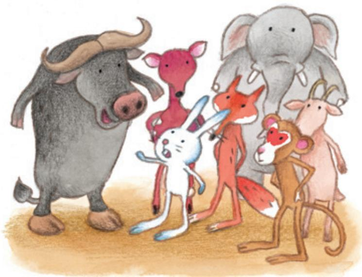

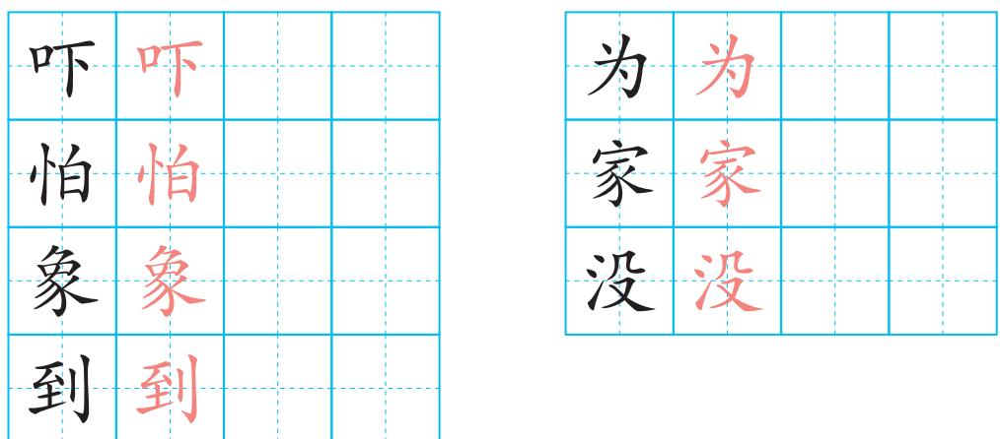

兔子领着大家来到湖边。正好又有一个木瓜从高高的树上掉进湖里，咕咚！

大伙儿你看看我，我看看你，都笑了。

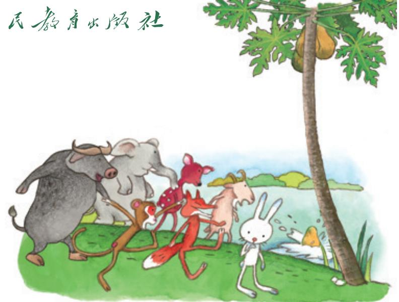

咕咚熟掉湖吓啦鹿象野拦哪那领

页

朗读课文。说说你借助图画认识了哪些字。

说一说：大伙儿为什么跟着兔子一起跑？野牛是怎么做的？

# bì jiè 20 小壁虎借尾巴

小壁虎在墙角捉蚊子，一条蛇咬住了他的尾巴。小壁虎一zhèng duàn挣，挣断尾巴逃走了。

没有尾巴多难看na哪！小壁虎想：向谁去借一条尾巴呢？

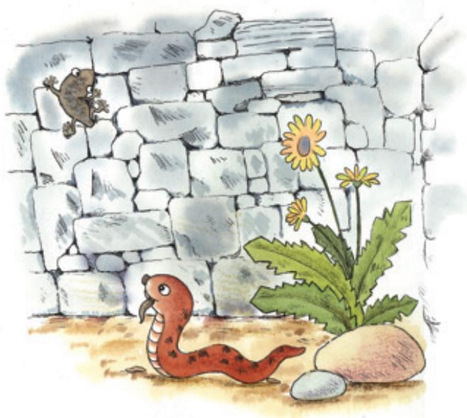

小壁虎爬呀爬，爬到小河边。他看见小鱼摇着  
尾巴，在河里游来游去。小壁虎说：“小鱼姐姐，您  
把尾巴借给我行吗？”小鱼说：“不行啊，我要用尾bō  
巴拨水呢。” 1

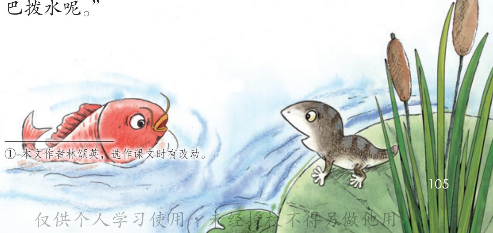

小壁虎爬呀爬，爬到大树上。他看见老牛甩着bó尾巴，在树下吃草。小壁虎说：“牛伯伯，您把尾巴yíng借给我行吗？”老牛说：“不行啊，我要用尾巴赶蝇子呢。”

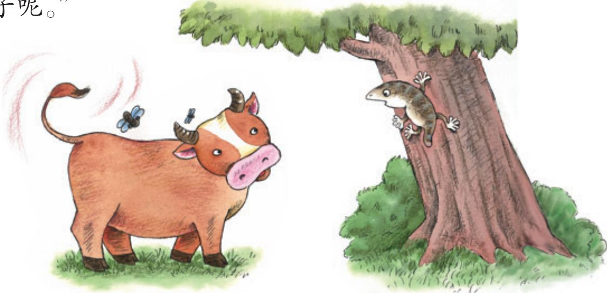

yán bǎi小壁虎爬呀爬，爬到房檐下。他看见燕子摆着ā yí尾巴，在空中飞来飞去。小壁虎说：“燕子阿姨，您把尾巴借给我行吗？”燕子说：“不行啊，我要用尾巴zhǎng wò掌握方向呢。”

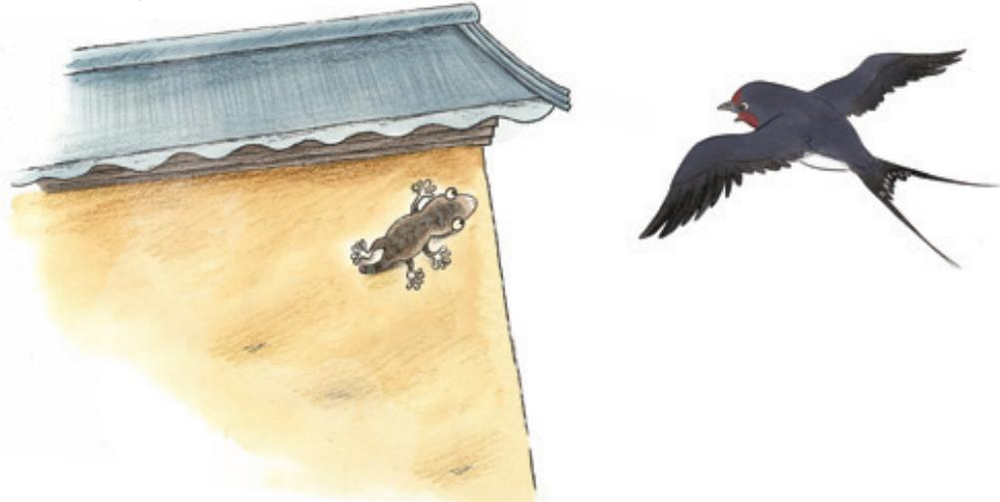

小壁虎借不到尾巴，心guò里很难过。他爬呀爬，爬回家里找妈妈。

小壁虎把借尾巴的事告诉了妈妈。妈妈笑着说：shǎ“傻孩子，你转过身子看看。”小壁虎转身一看，高兴得叫了起来：“我长出一条新尾巴啦！”

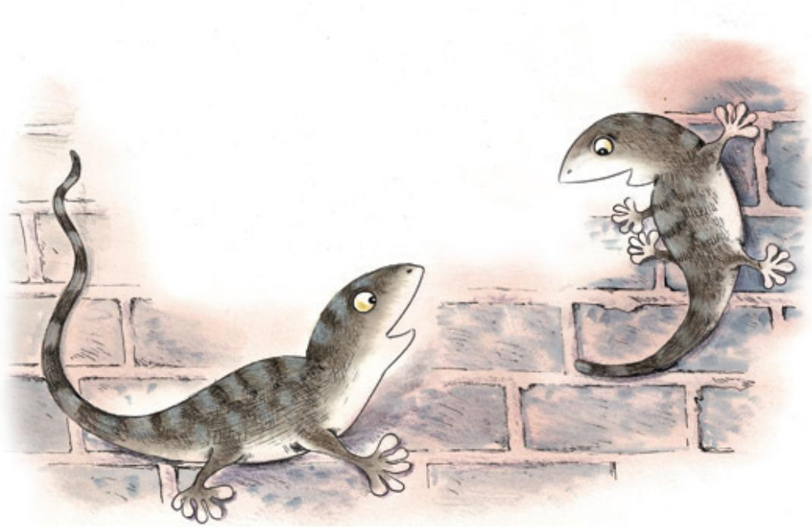

走

壁借咬难哪爬您拨赶摆过孩转

向向

行行

赶赶

找找

边边

草草

过过

读课文时，遇到不认识的字，猜一猜读音和意思。再和同学交流你是怎么猜的。

分角色朗读课文，注意读好带问号的句子。

说一说：小壁虎都找谁借过尾巴？结果怎么样？

我还知道其他动物尾巴的用处呢！

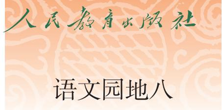

## 识字加油站

$$
c h \breve { \mathrm { { G } } } \mathrm { { o } }
$$

$$
\square \ + \ 1 5 \ = \ \pi l y
$$

$$
\pm + \pi = \pm \pi
$$

$$
T + \pi = \pi
$$

$$
A + 4 = A \neq
$$

$$
\frac { 1 4 } { 5 } \times ( - x ) = \frac { 5 } { 1 5 }
$$

$$
\dot { \frac { \triangledown } { \triangledown } } - \dot { \triangledown } = \dot { \triangledown }
$$

$$
7 \div \frac { 2 } { 5 } - x = \frac { 2 } { x }
$$

$$
\widehat { \mathbb { E } } ^ { } - \mathbb { E } ^ { } = \widehat { \mathbb { X } }
$$

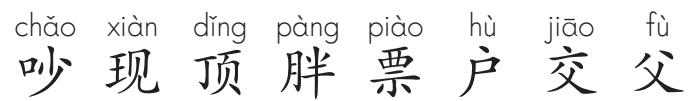

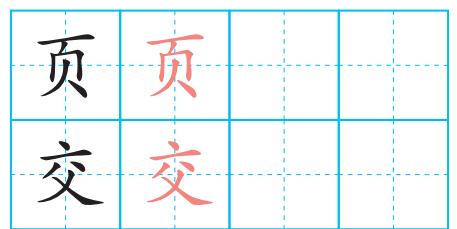

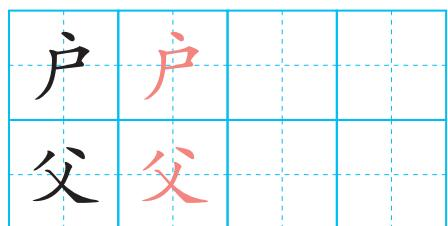

## 字词句运用

比一比，填一填。

午牛

刀力

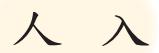

玉主

$$
\Psi \left[ { \frac { 1 } { 1 } } \right]
$$

$$
\boxed  \begin{array} { c } { \boxed { \begin{array} { c } { \begin{array} { r l } \end{array} } } \\ { \begin{array} { r l } \end{array} } \\ { \begin{array} { r l } \end{array} } \end{array} } \succeq \overleftarrow { \begin{array} { r l } \end{array} } \end{array}
$$

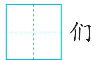

$$
\boxed { \begin{array} { c } { 1 } \\ { 1 } \\ { 1 } \\ { 1 } \\ { 1 } \\ { 1 } \end{array} } , \big \} ,
$$

$$
x = \frac { 1 } { 1 }
$$

$$
\frac { \mu _ { n } } { \frac { H _ { n } } { H _ { n } } } = - \frac { \mu _ { n } } { \frac { 1 } { n } } = - \frac { \mu _ { n } } { \frac { 1 } { n } }
$$

$$
\pm \boxed { \begin{array} { c } { \begin{array} { r l } \end{array} } } &  \left[ \begin{array} { c } { \begin{array} { r l } \end{array} } \\ { \begin{array} { r l } \end{array} } \\ { \begin{array} { r l } \end{array} } \\ { \begin{array} { r l } \end{array} } \end{array} \right] . \end{array}
$$

$$
\boxed { \begin{array} { c } { 1 } \\ { 1 } \\ { \cdots - 1 - \cdots - 1 } \\ { 1 } \\ { 1 } \end{array} } \dot { \mathcal { R } }
$$

你有过下面这些心情吗？说一说，写一写。

  
高兴

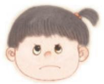  
生气

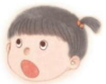  
害怕

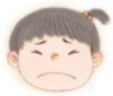  
难过

## 日积月累

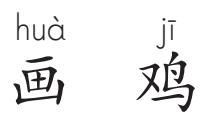  
míng táng yín [明]唐寅

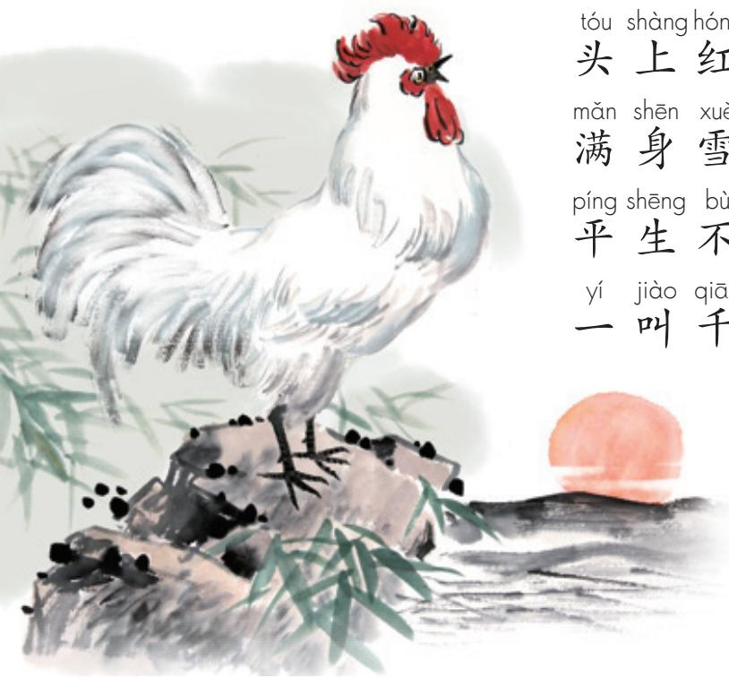  
tóu shàng hóng guān bú yòng cái 头上红冠不用裁， mǎn shēn xuě bái zǒu jiāng lái 满身雪白走将来。  
píng shēng bù gǎn qīng yán yǔ 平生不敢轻言语， yí jiào qiān mén wàn hù kāi 一叫千门万户开。

# xiǎo xióng zhù shān dòng①小熊住山洞

xiǎo xióng yì jiā zhù zài shān dòng lǐ xióng bà ba xiǎng kǎn yì xiē 小熊一家住在山洞里，熊爸爸想砍一些 shù gài yì jiān xīn fáng zi 树，盖一间新房子。

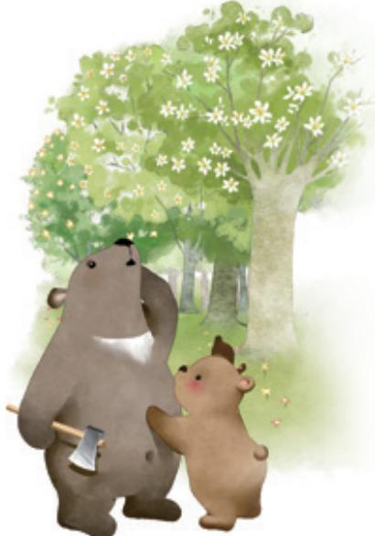

chūn tiān xióng bà ba dài zhe xiǎo 春天，熊爸爸带着小 xióng lái dào sēn lín lǐ shù shàng kāi mǎn 熊来到森林里。树上开满 le huā xiǎo xióngshuō bà ba shù 了花，小熊说：“爸爸，树 shàng de huā kāi de duō piào liang a wǒ 上的花开得多漂亮啊！我 men hái shi bú yào kǎn le ba 们还是不要砍了吧！”

xià tiān xiǎo xióng hé xióng bà ba 夏天，小熊和熊爸爸   
lái dào sēn lín lǐ shù shàng zhǎng mǎn le   
来到森林里。树上长满了   
lù yóu yóu de yè zi xiǎo xióng shě bù   
绿油油的叶子，小熊舍不   
dé yòu shuō bà ba shù yè zhǎng   
得，又说：“爸爸，树叶长   
de duō lù ya jiù bié kǎn le ba   
得多绿呀！就别砍了吧！”

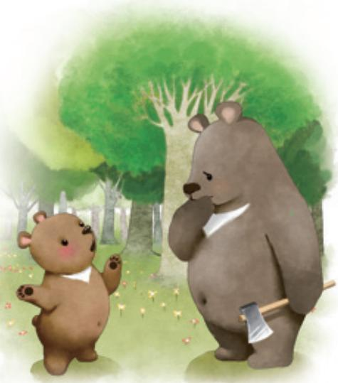

qiū tiān xiǎo xióng hé xióng 秋天，小熊和熊 bà ba lái dào sēn lín lǐ shù 爸爸来到森林里。树 shàng jiē zhe hóng hóng de guǒ zi 上结着红红的果子， xiǎo xióng duì bà ba shuō shù 小熊对爸爸说：“树 shàng jiē le nà me duō guǒ zi 上结了那么多果子， wǒ bù rěn xīn kǎn 我不忍心砍。”

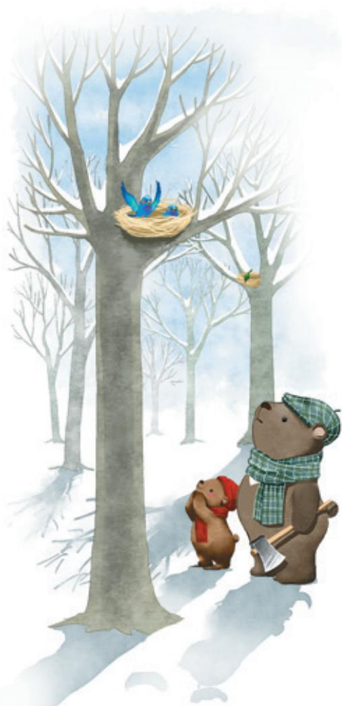

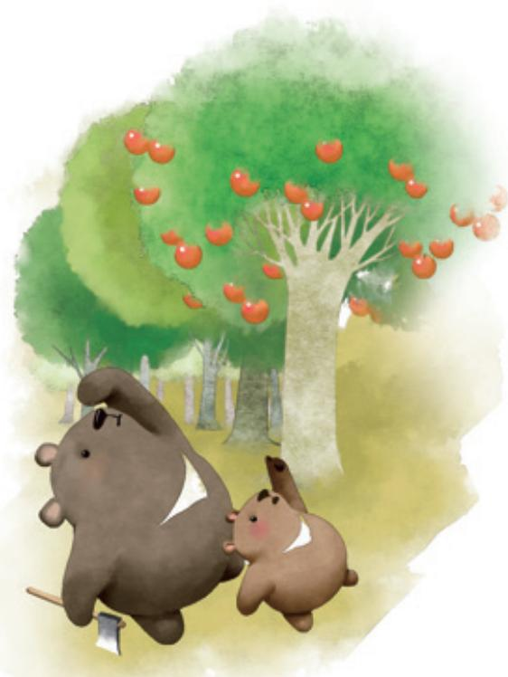

dōng tiān xiǎo xióng hé xióng bà ba lái 冬天，小熊和熊爸爸来 dào sēn lín lǐ xióng bà ba gāng jǔ qǐ fǔ 到森林里。熊爸爸刚举起斧 tóu hū rán tīng dào le shù shàng niǎo ér 头，忽然听到了树上鸟儿 de shēng yīn hǎo xiàng zài shuō qiú qiu 的声音，好像在说：“求求 nǐ bié huǐ le wǒ men de jiā xiǎo 你，别毁了我们的家！”小 xióng lián máng duì xióng bà ba shuō bà 熊连忙对熊爸爸说：“爸 ba nǐ kǎn le zhè kē shù xiǎo niǎo men 爸，你砍了这棵树，小鸟们 jiù méi yǒu jiā le bié kǎn le ba 就没有家了，别砍了吧！”

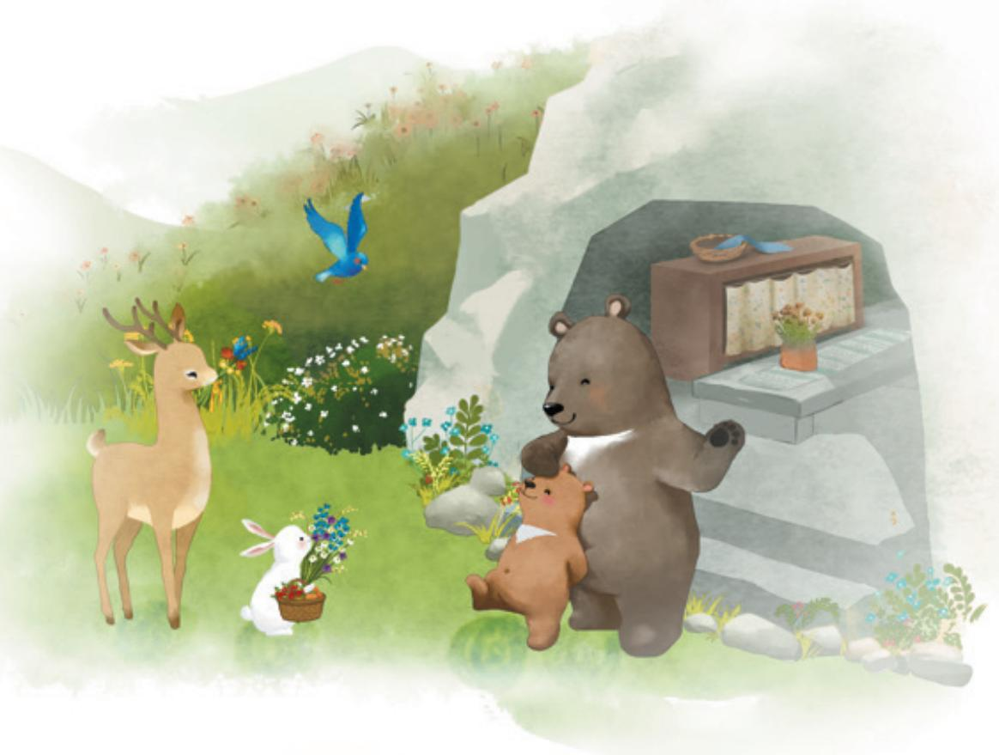

jiù zhè yàng yì nián yòu yì nián xiǎo xióng yì jiā méi yǒu 就这样，一年又一年，小熊一家没有 kǎn shù yì zhí zhù zài shān dòng lǐ sēn lín lǐ de dòng wù dōu 砍树，一直住在山洞里。森林里的动物都 hěn gǎn jī xiǎo xióng yì jiā gěi tā men sòng lái le hǎo duō xiān huā 很感激小熊一家，给他们送来了好多鲜花 hé guǒ zi 和果子。

## 识字表

## 识字

shuāng chuī luò jiàng piāo yóu chí rù 1霜吹落降飘游池入

shì shén lǐ zhāng gōng gǔ hú wú yán sūn 2氏什李张弓古胡吴言孙

hé qíng yǎn jīng bǎo hù miáo chī shì qíng qǐng ràng 3河晴眼睛保护苗吃事情请让

cāi biān liáng xǐ huān shí pà gōng lìng gǎn dòng wàn wú 4猜边凉喜欢时怕攻令感动万无

shí zǔ jì suàn jiǎn shì tú xíng kǎ hé chàng 语文园地一 识组计算减式图形卡合唱 tuán 团

## 阅读

rè ài gòng chǎn dǎng tài yáng guāng huái bào xìng fú chéng 1热爱共产党太阳光怀抱幸福成

jǐng chéng cūn máo zhǔ xí zhù xiāng qīn zhàn shì xiǎng niàn 2井城村毛主席住乡亲战士想念

gào sù zǒu jīng zuò ān guǎng chǎng fēi kuān lì jié 3告诉走京座安广场非宽丽洁

rèn lián xuǎn quān tú tián shì liàn 语文园地二 认连选圈涂填试练

wán de jí zhí kū gēn hū rán tīng hǎn kuài jǐ bèi 4玩得急直哭跟忽然听喊快己背

<table><tr><td>6怎独跳绳当还乐得羽球劲轮排</td><td>5只很孤单种每都邻居叫招呼乐</td><td></td><td>zěn dú tiào shéng dāng hái yuè děi yǔ qiú jìn lún pái</td><td>zhǐ hěn gū dān zhòng měi dōu lín jū jiào zhāo hū lè</td><td></td><td></td><td></td><td></td><td></td><td></td><td></td><td></td><td></td><td></td></tr><tr><td></td><td></td><td>语文园地三</td><td></td><td>mǔ yè zhǐ jīn cùn dīng qiān quán dàn 母页止斤寸丁千全旦</td><td></td><td>jìng sī chuáng yí jǔ wàng dī gù</td><td></td><td></td><td></td><td></td><td></td><td></td><td rowspan="2"></td></tr><tr><td>7 8</td><td></td><td></td><td>静思床疑举望低故 dǎn gǎn yǒng jiǎng chuāng luàn lā yàng xiào zài shuì jiào</td><td></td><td>胆敢勇讲窗乱拉样笑再睡觉</td><td></td><td></td><td></td><td></td><td></td><td></td></tr><tr><td></td><td>9端粽节总煮盼米枣甜分鲜肉了</td><td>duān zòng jié zǒng zhǔ pàn mǐ zǎo tián fēn xiān ròu</td><td></td><td></td><td></td><td></td><td></td><td></td><td></td><td></td><td></td><td rowspan="2">liǎo</td></tr><tr><td></td><td></td><td></td><td></td><td>cè zhī tái diàn shì bù jī yī kù bèi</td><td></td><td></td><td></td><td></td><td></td><td></td><td></td></tr><tr><td></td><td>语文园地四</td><td></td><td>册支台电视部机衣裤被</td><td></td><td></td><td></td><td></td><td></td><td></td><td></td><td></td><td rowspan="2"></td></tr><tr><td>识字</td><td></td><td></td><td></td><td></td><td></td><td></td><td></td><td></td><td></td><td></td><td>wù zhuō mí cáng zào mǎ yǐ yùn shí liáng fáng jié wǎng</td></tr><tr><td>5</td><td></td><td>物捉迷藏造蚂蚁运食粮房结网 yuán yán hán kù shǔ nuǎn chén xì zhāo xiá xī yáng xiāng 圆严寒酷暑暖晨细朝霞夕杨香</td><td></td><td></td><td></td><td></td><td></td><td></td><td></td><td></td><td></td></tr><tr><td>6</td><td></td><td>cāo bá pāi pǎo tī líng zhēn nào diū shā shēn tǐ 7操拔拍跑踢铃真闹丢沙身体</td><td></td><td></td><td></td><td></td><td></td><td></td><td></td><td></td><td></td></tr><tr><td></td><td></td><td>zhī chū xiāng jìn xí yuǎn jiào dào zhuān yòu yù zhī yì 8之初相近习远教道专幼玉知义</td><td></td><td></td><td></td><td></td><td></td><td></td><td></td><td></td><td></td></tr><tr><td></td><td>语文园地五</td><td></td><td>fàn bǎo chá pào qīng chuān páo biān pào 饭饱茶泡轻穿袍鞭炮</td><td></td><td></td><td></td><td></td><td></td><td></td><td></td><td></td></tr><tr><td>阅读</td><td></td><td></td><td></td><td></td><td></td><td></td><td></td><td></td><td></td><td></td><td></td></tr><tr><td>11浪迈悄泪次给壳虾装像淘娃</td><td></td><td>làng mài qiāo lèi cì gěi ké xiā zhuāng xiàng táo wá</td><td>shī shǒu tōu fú píng quán xī zhào róu hé lù jiǎo 10诗首偷浮萍泉惜照柔荷露角</td><td></td><td></td><td></td><td></td><td></td><td></td><td></td><td></td></tr></table>

<table><tr><td></td><td>12珠摇篮亮晶停坪展透翅膀朵 yào yāo yīn chén ya máng ne ma miàn kòng mēn ba xiāo 13要腰阴沉呀忙呢吗面空闷吧消 xī</td><td>zhū yáo lán liàng jīng tíng píng zhǎn tòu chì bǎng duǒ</td><td></td><td></td><td></td><td></td><td></td><td></td><td></td><td></td><td></td><td></td><td></td></tr><tr><td colspan="2">语文园地六</td><td>息</td><td>gùn dòu tāng wén shàn yǐ qiān zhī dǒu 棍豆汤蚊扇椅牵织斗</td><td></td><td></td><td></td><td></td><td></td><td></td><td></td><td></td><td></td><td></td></tr><tr><td rowspan="4">15钟迟背灯等啊决定已经位表</td><td rowspan="4">14具铅新平盒些此仔检查所伙伴 zhōng chí bēi dēng děng a jué dìng yǐ jīng wèi biǎo</td><td></td><td></td><td></td><td></td><td></td><td>jù qiān xīn píng hé xiē cǐ zǐ jiǎn chá suǒ huǒ bàn</td><td></td><td></td><td></td><td></td><td></td></tr><tr><td></td><td></td><td></td><td></td><td></td><td></td><td></td><td></td><td></td><td></td><td></td></tr><tr><td></td><td>hǔ xióng tōng zhù yì biàn bǎi wèi yīn shé lǐ yā wàng 16虎熊通注意遍百为因舌理呀忘</td><td></td><td></td><td></td><td></td><td></td><td></td><td></td><td></td><td></td><td></td></tr><tr><td>dì 第</td><td></td><td>hóu kuài jiē xìng bāi káng wǎng kē mǎn rēng zhāi pěng zhuī</td><td></td><td></td><td></td><td></td><td></td><td></td><td></td><td></td><td></td></tr><tr><td></td><td>语文园地七刷梳巾皂洗澡脸盆</td><td></td><td>shuā shū jīn zào xǐ zǎo liǎn pén</td><td></td><td></td><td></td><td></td><td>17猴块结兴掰扛往棵满扔摘捧追</td><td></td><td></td><td></td><td></td><td></td></tr><tr><td colspan="2">8治别</td><td></td><td></td><td></td><td></td><td></td><td></td><td></td><td></td><td></td><td></td><td></td><td></td></tr><tr><td rowspan="4"></td><td rowspan="2">19咕咚熟掉湖吓啦鹿象野拦哪那 lǐng 领</td><td></td><td>gū dōng shú diào hú xià la lù xiàng yě lán nǎ nà</td><td></td><td></td><td></td><td></td><td></td><td></td><td></td><td></td><td></td><td></td></tr><tr><td></td><td></td><td></td><td></td><td></td><td></td><td></td><td></td><td></td><td></td><td></td><td></td></tr><tr><td>bì jiè yǎo nán na pá nín bō gǎn bǎi guò hái zhuǎn 20壁借咬难哪爬您拨赶摆过孩转</td><td></td><td></td><td></td><td></td><td></td><td></td><td></td><td>chǎo xiàn dǐng pàng piào hù jiāo fù</td><td></td><td></td><td></td><td></td></tr><tr><td colspan="2">语文园地八</td><td></td><td>吵现顶胖票户交父</td><td></td><td></td><td></td><td></td><td></td><td></td><td></td><td></td><td></td></tr></table>

## 写字表

## 识字

chūn dōng chuī huā fēi rù

1 春冬吹花飞入

shén me gǔ hú shuāng yán

2什么古胡双言

qīng qīg qíng miáo qǐng shēng

3青清晴苗请生

zì hóng dòng wàn wú míng

4字红动万无明

wén kǎ piàn hé语文园地一 文卡片合

## 阅读

gòng chǎn dǎng tài yáng guāng

1共产党太阳光

jǐng zhǔ jiāng zhù fāng hòu

2井主江住方后

gào de huì běi jīņg guǎng

3告的会北京广

xiě rèn 语文园地二 写认

zǒu hé shuō ràng zì jǐ

4走河说让自己

cóng hǎo men jiào tā huí

5从好们叫他回

kuài lè dāng shū huà máo

6快乐当书画毛

zhǐ jīn cùn dīng qiān dàn 语文园地三 止斤寸丁千旦

8色把讲样笑再

9节米间分吃肉

cè zhī diàn yī 语文园地四 册支电衣

## 识字

W物 o对 d打m近 20造m今皮x习 咖运烟雪咖跑远 huān  
5 欢父细乙足学  
6  
7  
8

bǎo bào 语文园地五 饱抱

## 阅读

10 shǒu 首眼J机这 川池间泪台o看 ā采ā它 尖贝咖伞咖面 品角q气o朵咖问 o早娃美问加   
11   
12   
13

dòu dǒu 语文园地六 豆斗

bǐ zhī dào fàng píng ān

14笔知道放平安

yuán dēng chē zhàn zuò lǎo shī

15元灯车站坐老师

guó dōu bǎi tīng shí diǎn lín

16国都百听时点林

17高兴着往瓜兔进

jīn 语文园地七 巾洗

tā kōng hái gàn shēn xīng jiǔ

18她空还干身星久

xià wèi pà jiā xiàng méi dào 19吓为怕家象没到

xiàng biān xíng cǎo gǎn guò zhǎo

20向边行草赶过找

语文园地八 页

（共200个字）

## 常用偏旁名称表

<table><tr><td rowspan=1 colspan=1>偏旁</td><td rowspan=1 colspan=1>名称</td><td rowspan=1 colspan=1>例字</td><td rowspan=1 colspan=1></td><td rowspan=1 colspan=1>偏旁</td><td rowspan=1 colspan=1>名称</td><td rowspan=1 colspan=1>例字</td></tr><tr><td rowspan=1 colspan=1>小</td><td rowspan=1 colspan=1>立刀旁</td><td rowspan=1 colspan=1>刷别</td><td rowspan=1 colspan=1></td><td rowspan=1 colspan=1>心</td><td rowspan=1 colspan=1>爪字头</td><td rowspan=1 colspan=1>爱</td></tr><tr><td rowspan=1 colspan=1>—</td><td rowspan=1 colspan=1>京字头</td><td rowspan=1 colspan=1>京亮</td><td rowspan=1 colspan=1></td><td rowspan=1 colspan=1>火</td><td rowspan=1 colspan=1>火字旁</td><td rowspan=1 colspan=1>炮灯</td></tr><tr><td rowspan=1 colspan=1>八</td><td rowspan=1 colspan=1>两点水</td><td rowspan=1 colspan=1>凉减</td><td rowspan=1 colspan=1></td><td rowspan=1 colspan=1>户</td><td rowspan=1 colspan=1>户字头</td><td rowspan=1 colspan=1>房扇</td></tr><tr><td rowspan=1 colspan=1>力</td><td rowspan=1 colspan=1>力字旁</td><td rowspan=1 colspan=1>动劲</td><td rowspan=1 colspan=1></td><td rowspan=1 colspan=1>ネ</td><td rowspan=1 colspan=1>示字旁</td><td rowspan=1 colspan=1>福视</td></tr><tr><td rowspan=1 colspan=1>又</td><td rowspan=1 colspan=1>又字旁</td><td rowspan=1 colspan=1>欢难</td><td rowspan=1 colspan=1></td><td rowspan=1 colspan=1>心</td><td rowspan=1 colspan=1>心字底</td><td rowspan=1 colspan=1>想思</td></tr><tr><td rowspan=1 colspan=1>大</td><td rowspan=1 colspan=1>大字头</td><td rowspan=1 colspan=1>牵奇</td><td rowspan=1 colspan=1></td><td rowspan=1 colspan=1>目</td><td rowspan=1 colspan=1>目字旁</td><td rowspan=1 colspan=1>眼睡</td></tr><tr><td rowspan=1 colspan=1>イ</td><td rowspan=1 colspan=1>双人旁</td><td rowspan=1 colspan=1>得很</td><td rowspan=1 colspan=1></td><td rowspan=1 colspan=1>皿</td><td rowspan=1 colspan=1>皿字底</td><td rowspan=1 colspan=1>盒盆</td></tr><tr><td rowspan=1 colspan=1>仓</td><td rowspan=1 colspan=1>食字旁</td><td rowspan=1 colspan=1>饭饱</td><td rowspan=1 colspan=1></td><td rowspan=1 colspan=1>全</td><td rowspan=1 colspan=1>金字旁</td><td rowspan=1 colspan=1>铃铅</td></tr><tr><td rowspan=1 colspan=1>广</td><td rowspan=1 colspan=1>广字头</td><td rowspan=1 colspan=1>席座</td><td rowspan=1 colspan=1></td><td rowspan=1 colspan=1>扩</td><td rowspan=1 colspan=1>病字头</td><td rowspan=1 colspan=1>病</td></tr><tr><td rowspan=1 colspan=1>小</td><td rowspan=1 colspan=1>竖心旁</td><td rowspan=1 colspan=1>情快</td><td rowspan=1 colspan=1></td><td rowspan=1 colspan=1>衣</td><td rowspan=1 colspan=1>衣字旁</td><td rowspan=1 colspan=1>裤初</td></tr><tr><td rowspan=1 colspan=1>尸</td><td rowspan=1 colspan=1>尸字头</td><td rowspan=1 colspan=1>居展</td><td rowspan=1 colspan=1></td><td rowspan=1 colspan=1>页</td><td rowspan=1 colspan=1>页字旁</td><td rowspan=1 colspan=1>领顶</td></tr><tr><td rowspan=1 colspan=1>5</td><td rowspan=1 colspan=1>弓字旁</td><td rowspan=1 colspan=1>张</td><td rowspan=2 colspan=1></td><td rowspan=1 colspan=1>虫</td><td rowspan=1 colspan=1>虫字旁</td><td rowspan=1 colspan=1>蚂蚊</td></tr><tr><td rowspan=1 colspan=1>子</td><td rowspan=1 colspan=1>子字旁</td><td rowspan=1 colspan=1>孙孤</td><td rowspan=1 colspan=1>舌</td><td rowspan=1 colspan=1>舌字旁</td><td rowspan=1 colspan=1>乱甜</td></tr><tr><td rowspan=1 colspan=1>王</td><td rowspan=1 colspan=1>王字旁</td><td rowspan=1 colspan=1>玩现</td><td rowspan=1 colspan=1></td><td rowspan=1 colspan=1>米</td><td rowspan=1 colspan=1>米字旁</td><td rowspan=1 colspan=1>粽粮</td></tr><tr><td rowspan=1 colspan=1>车</td><td rowspan=1 colspan=1>车字旁</td><td rowspan=1 colspan=1>轮转</td><td rowspan=1 colspan=1></td><td rowspan=1 colspan=1>走</td><td rowspan=1 colspan=1>走字底</td><td rowspan=1 colspan=1>赶</td></tr><tr><td rowspan=1 colspan=1>牛</td><td rowspan=1 colspan=1>牛字旁</td><td rowspan=1 colspan=1>物</td><td rowspan=1 colspan=1></td><td rowspan=1 colspan=1>足</td><td rowspan=1 colspan=1>足字旁</td><td rowspan=1 colspan=1>跟跑</td></tr><tr><td rowspan=1 colspan=1>文</td><td rowspan=1 colspan=1>反文旁</td><td rowspan=1 colspan=1>攻故</td><td rowspan=1 colspan=1></td><td rowspan=1 colspan=1>雨</td><td rowspan=1 colspan=1>雨字头</td><td rowspan=1 colspan=1>霜露</td></tr></table>

## 后记

2017年投入使用的《义务教育教科书语文》由温儒敏担任总主编，一\~六年级由陈先云、曹文轩、崔峦、李吉林担任主编。吴然、沈大安、张一清、张立霞、陈先云、徐轶、常志丹、熊宁宁参加一年级下册编写。2022年，教育部组建编修委员会，根据《义务教育语文课程标准（2022年版)》对教科书进行编写修订。编修委员会由温儒敏、王立军担任主任，张伯江、王荣生担任副主任。编修委员会下设修订组，负责具体修订工作。

教科书在北京、天津、内蒙古、浙江、安徽、湖北、湖南、重庆、四川等地部分学校进行了试教试用，征求了百余位专家学者和一线教师的意见。人民教育出版社承担了教科书的编辑出版和美术设计工作。周建民、徐开云、焦洁、李红专为本书绘制插图，景绍宗为本书封面绘制插图。在教科书修订、编辑出版过程中，很多专家都提供过帮助，在此一并表示诚挚的谢意。

教科书需要在使用过程中不断修改完善，真诚希望广大师生和家长继续提出宝贵意见！

联系方式

电话：010-58758605

电子邮箱：jcfk@pep.com.cn

意见反馈平台：jcyjfk.pep.com.cn

YIWU JIAOYU JIAOKESHU YUWEN

语文

一年级 下册

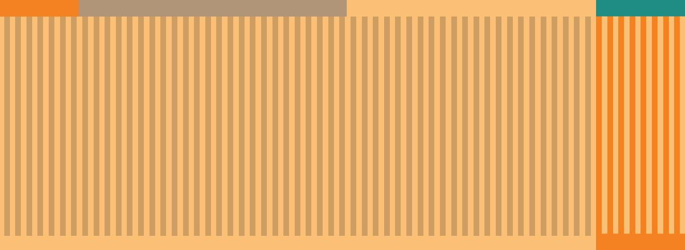