义务教育教科书

# 语文

二年级

上册

义务教育教科书

# 语文

## 二年级

上册

教育部组织编写

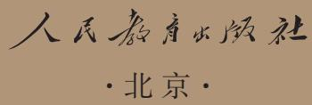

编修委员会

主任：温儒敏 王立军

副主任：张伯江王荣生

成员（以姓氏笔画为序）:王 敏 王本华 过常宝 朱于国 伍新春 李小龙 李明新汪锋 宋亚云 张继晓 张彬福 陈先云 陈建华 林建华倪文锦 徐轶 漆永祥

本册主编：陈先云汪锋

编写人员（以姓氏笔画为序）：叶黎明张国龙陈先云郑宇贾宁倪鸣熊宁宁

责任编辑：魏 航 熊宁宁

责任设计：何安冉

责任校对：褚君

责任印制：

义务教育教科书 语文 二年级 上册

教育部组织编写

出版人民教育出版社

（北京市海淀区中关村南大街17号院1号楼 邮编：100081）

网址 http://www.pep.com.cn

版权所有·侵权必究

## 目录

## 第一单元·阅读

小蝌蚪找妈妈…………………1  
我是什么……  
3 植物妈妈有办法……8  
语文园地一………………11  
快乐读书吧  
读读童话故事……15

## 第二单元·识字

场景歌………………………………16  
树之歌………………………………18  
拍手歌…… ……20  
4 田家四季歌……………………23  
语文园地二………………………25

## 第三单元·阅读

彩虹… …28   
去外婆家…… ……30   
数星星的孩子………………32   
语文园地三………………35

## 第四单元·阅读

古诗二首……………39  
登鹤雀楼………………………39  
望庐山瀑布…………………40  
黄山奇石………………42  
日月潭………… ……45  
10 葡萄沟………………… …47  
语文园地四……………50

## 第五单元·阅读

11 坐井观天…………………54  
12 寒号鸟…………56  
13 我要的是葫芦……………60  
语文园地五………………63

## 第六单元·阅读

14 八角楼上……67   
15 朱德的扁担……………………69   
16 难忘的泼水节……72   
17 刘胡兰… ……75   
语文园地六………………78

## 第七单元·阅读

18 古诗二首……81  
江雪……………………………81  
敕勒歌…………………………82  
19 雾在哪里………………………84  
20 雪孩子………………87  
语文园地七………………91

## 第八单元·阅读

21 称赞…………………………95   
22 纸船和风筝……98   
23 快乐的小河……………101   
语文园地八……………104   
识字表……108   
写字表……113   
词语表……116

# xiǎo kē dǒu zhǎo mā ma 小蝌蚪找妈妈 ①

chí táng lǐ yǒu yì qún xiǎo kē dǒu dà dà de nǎo dai hēi 池塘里有一群小蝌蚪，大大的脑袋，黑 huī sè de shēn zi shuǎi zhe cháng cháng de wěi ba kuài huo de yóu lái 灰色的身子，甩着长长的尾巴，快活地游来 yóu qù 游去。

xiǎo kē dǒu yóu wa yóu guò le jǐ tiān zhǎng chū le liǎng tiáo 小蝌蚪游哇游，过了几天，长出了两条 hòu tuǐ tā men kàn jiàn lǐ yú mā ma zài jiāo xiǎo lǐ yú bǔ shí 后腿。他们看见鲤鱼妈妈在教小鲤鱼捕食， jiù yíng shàng qù wèn lǐ yú ā yí wǒ men de mā ma zài nǎ 就迎上去，问：“鲤鱼阿姨，我们的妈妈在哪 lǐ lǐ yú mā ma shuō nǐ men de mā ma sì tiáo tuǐ kuān 里？”鲤鱼妈妈说：“你们的妈妈四条腿，宽 zuǐ ba nǐ men dào nà biān qù zhǎo ba 嘴巴。你们到那边去找吧！

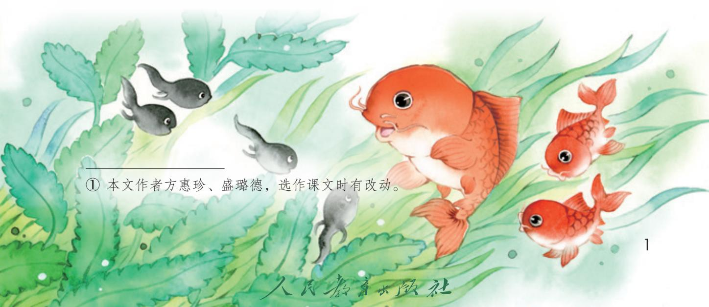

xiǎo kē dǒu yóu wa yóu 小蝌蚪游哇游，   
guò le jǐ tiān zhǎng chū le   
过了几天，长出了   
liǎng tiáo qián tuǐ tā men kàn   
两条前腿。他们看   
jiàn yì zhī wū guī bǎi dòng zhe   
见一只乌龟摆动着 sì tiáo tuǐ zài shuǐ lǐ yóu lián máng zhuī shàng qù jiào zhe mā 四条腿在水里游，连忙追上去，叫着：“妈 ma mā mα wū guī xiào zhe shuō wǒ bú shì nǐ men de mā 妈，妈妈！”乌龟笑着说：“我不是你们的妈 mα nǐ men de mā ma tóu dǐng shàng yǒu liǎng zhī dà yǎn jing pī zhe 妈。你们的妈妈头顶上有两只大眼睛，披着 lù yī shang nǐ men dào nà biān qù zhǎo ba   
绿衣裳。你们到那边去找吧！”

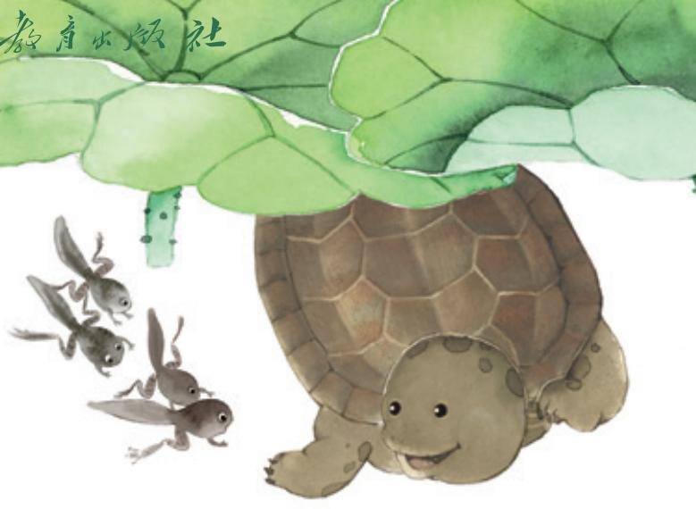

xiǎo kē dǒu yóu wa yóu guò le jǐ tiān wěi ba biàn duǎn 小蝌蚪游哇游，过了几天，尾巴变短 le tā men yóu dào hé huā páng biān kàn jiàn hé yè shàng dūn zhe yì 了。他们游到荷花旁边，看见荷叶上蹲着一 zhī dà qīng wā pī zhe bì lù de yī shang lù zhe xuě bái de dù 只大青蛙，披着碧绿的衣裳，露着雪白的肚 pí gǔ zhe yí duì dà yǎn jing 皮，鼓着一对大眼睛。

xiǎo kē dǒu yóu guò qù jiào zhe mā mα mā mα 小蝌蚪游过去，叫着：“妈妈，妈妈！”   
qīng wā mā ma dī tóu yí kàn xiào zhe shuō hǎo hái zi nǐ   
青蛙妈妈低头一看，笑着说：“好孩子，你   
men yǐ jīng zhǎng chéng qīng wā le kuài tiào shàng lái ba tā men hòu   
们已经长成青蛙了，快跳上来吧！”他们后

tuǐ yì dēng xiàng qián yí tiào 腿一蹬，向前一跳， bèng dào le hé yè shàng 蹦到了荷叶上。 \_

bù zhī shén me shí 不知什么时 hou xiǎo qīng wā de wěi 候，小青蛙的尾 ba yǐ jīng bú jiàn le tā 巴已经不见了。他 men gēn zhe mā ma tiān tiān 们跟着妈妈，天天 qù zhuō hài chóng 去捉害虫。

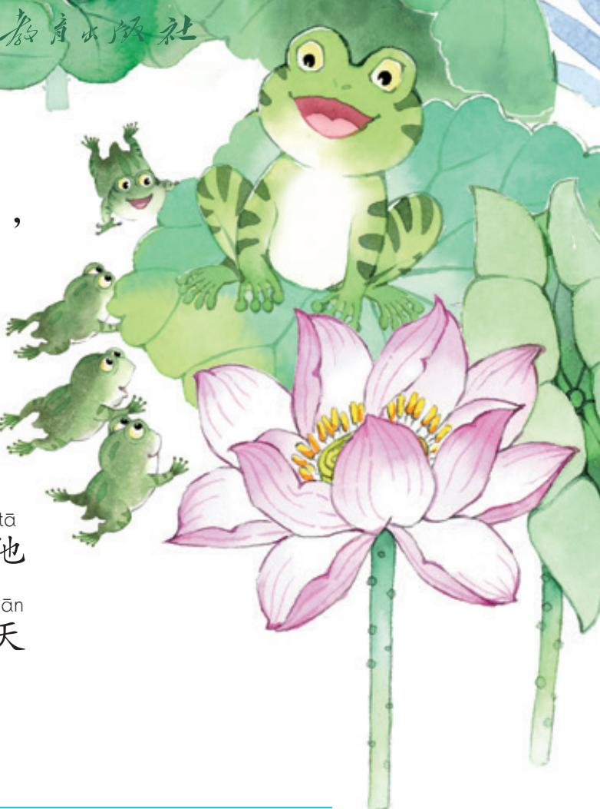

kē dǒu nǎo dài huī shuǎi huó tuǐ 蝌蚪脑袋灰甩活腿 jiāo yíng zuǐ guī pī dūn dù gǔ 教迎嘴龟披蹲肚鼓

两两

哪哪

那那

孩孩

条条

宽宽

短短

成成

# 人民教育出版社

分角色朗读课文。

小蝌蚪是怎样长成青蛙的？按顺序把下面的图片连起来，再讲一讲小蝌蚪找妈妈的故事。

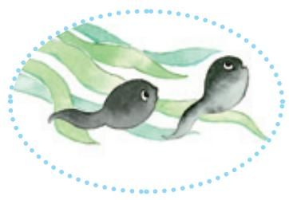

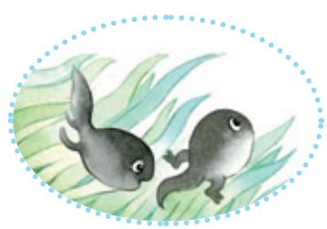

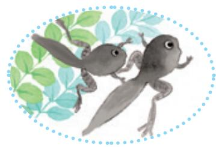

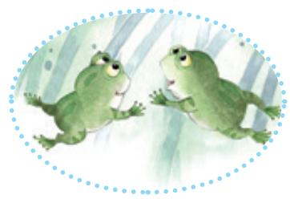

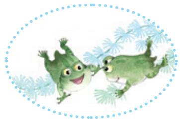

读一读，注意加点的词。

bì shang 披着碧绿的衣裳 露着雪白的肚皮 鼓着大大的眼睛 甩着长长的尾巴

我发現這些加點的词是表示动作的。

读一读，记一记。

shǔ  
脑袋 口袋 袋子 袋鼠  
快活 生活 活动 活力jiē  
欢迎 迎接 迎风 迎面

# wǒ shì shén me

# ②我是什么

wǒ huì biàn tài yáng yí shài wǒ jiù biàn chéng qì shēng dào 我会变。太阳一晒，我就变成汽。升到 tiān kōng wǒ yòu biàn chéng wú shù jí xiǎo jí xiǎo de diǎnr lián chéng 天空，我又变成无数极小极小的点儿②，连成 yí piàn zài kōng zhōng piāo fú yǒu shí hou wǒ chuān zhe bái yī fu 一片，在空中飘浮。有时候我穿着白衣服， yǒu shí hou wǒ chuān zhe hēi yī fu zǎo chen hé bàng wǎn wǒ yòu bǎ hóng 有时候我穿着黑衣服，早晨和傍晚我又把红 páo pī zài shēn shàng rén men jiào wǒ yún 袍披在身上。人们叫我“云”。

wǒ zài kōng zhōng yuè shēng yuè gāo tǐ wēn yuè lái yuè dī biàn 我在空中越升越高，体温越来越低，变 chéng le wú shù xiǎo shuǐ dī xiǎo shuǐ dī jù zài yì qǐ luò xià lái 成了无数小水滴。小水滴聚在一起落下来 rén men jiào wǒ yǔ yǒu shí hou wǒ biàn chéng xiǎo yìng qiú dǎ xià 人们叫我“雨”。有时候我变成小硬球打下 lái rén men jiù jiào wǒ bīng báo dào le dōng tiān wǒ biàn 来，人们就叫我“冰雹”。到了冬天，我变 chéng xiǎo huā duǒ piāo xià lái rén men 成小花朵飘下来，人们 yòu jiào wǒ xuě 又叫我“雪”。

①本文选自新华书店晋绥分店《国语课本（小学校初级用）第三册》，有改动。  
②在儿化词中，“儿”不单独发音，注音时在前面的音节后加r，表示一个卷舌的动作。

píng cháng wǒ zài chí zi lǐ shuì jiào zài xiǎo xī lǐ sàn bù 平常我在池子里睡觉，在小溪里散步， zài jiāng hé lǐ bēn pǎo zài hǎi yáng lǐ tiào wǔ chàng gē kāi 在江河里奔跑，在海洋里跳舞，唱歌，开 dà huì 大会。

yǒu shí hou wǒ hěn wēn hé yǒu shí hou wǒ què hěn bào zào 有时候我很温和，有时候我却很暴躁。 wǒ zuò guo xǔ duō hǎo shì guàn gài tián dì fā dòng jī qì bāng 我做过许多好事，灌溉田地，发动机器，帮 zhù rén men gōng zuò wǒ yě zuò guo xǔ duō huài shì yān mò zhuāng 助人们工作。我也做过许多坏事，淹没庄 jia chōng huǐ fáng wū gěi rén men dài lái zāi hài rén men xiǎng 稼，冲毁房屋，给人们带来灾害。人们想 chū zhǒng zhǒng bàn fǎ guǎn zhù wǒ ràng wǒ guāng zuò hǎo shì bú zuò 出种种办法管住我，让我光做好事，不做 huài shì 坏事。

xiǎo péng you nǐ men cāi cai wǒ shì shén me小朋友，你们猜猜：我是什么？

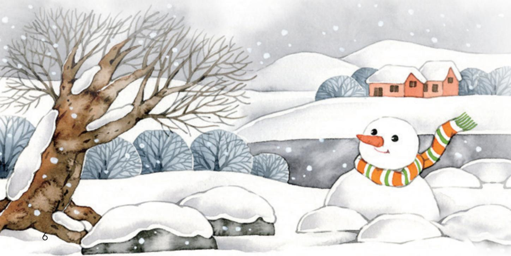

人民教育出版社

# qì yuè wēn dī bēn hǎi yáng fā huài 汽越温滴奔海洋发坏

mò zhuāng jià wū dài zāi zhǒng guǎn

没庄稼屋带灾种管

升升 连连

起起 海海

洋洋 许许

作作办办

法法

朗读课文。说说“我”是什么，“我”会变成些什么。

读一读，比一比，体会加点词的意思。

小水滴聚在一起落下来，人们叫我“雨”。

□ 有时候①我变成小硬球打下来，人们就叫我“冰雹”。

◇到了冬天，我变成小花朵飘下来，人们又叫我“雪”。

读一读，记一记。

guàngài qì yān chōng huǐ 灌溉田地 发动机器 淹没庄稼 冲毁房屋

①本册教科书在非全文注音时，按本音标注汉字字音，其中用棕色拼音标注的字在这里改读轻声。

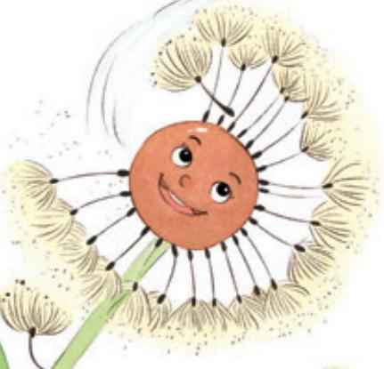

# zhí wù mā ma yǒu bàn fǎ 3 植物妈妈有办法

hái zi rú guǒ yǐ jīng zhǎng dà 孩子如果已经长大，

jiù děi gào bié mā ma sì hǎi wéi jiā 就得告别妈妈，四海为家。

niú mǎ yǒu jiǎo niǎo yǒu chì bǎng 牛马有脚，鸟有翅膀，

zhí wù lǚ xíng yòu yòng shén me bàn fǎ 植物旅行又用什么办法？

pú gōng yīng mā ma zhǔn bèi le jiàng luò sǎn 蒲公英妈妈准备了降落伞，

bǎ tā sòng gěi zì jǐ de wá wa 把它送给自己的娃娃。

zhǐ yào yǒu fēng qīng qīng chuī guò 只要有风轻轻吹过，

hái zi men jiù chéng zhe fēng fēn fēn chū fā 孩子们就乘着风纷纷出发。

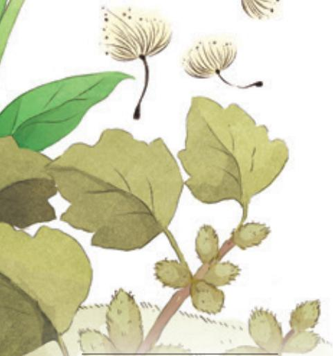  
① 本文作者戴巴棣，选作课文时有改动。

cāng ěr mā ma yǒu gè hǎo bàn fǎ 苍耳妈妈有个好办法，

tā gěi hái zi chuān shàng dài cì de kǎi jiǎ 她给孩子穿上带刺的铠甲。

zhǐ yào guà zhù dòng wù de pí máo 只要挂住动物的皮毛，

hái zi men jiù néng qù tián yě shān wā 孩子们就能去田野、山洼。

shí liu mā ma de dǎn zi tǐng dà 石榴妈妈的胆子挺大，

tā bú pà xiǎo niǎo chī diào wá wa 她不怕小鸟吃掉娃娃。

hái zi men zài niǎo dù zi lǐ shuìshàng yí jiào 孩子们在鸟肚子里睡上一觉，

jiù huì zuān chū lái luò hù ān jiā 就会钻出来落户安家。

wān dòu mā ma gèng yǒu bàn fǎ 豌豆妈妈更有办法，

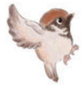

tā ràng dòu jiá shài zài tài yáng dǐ xià 她让豆荚晒在太阳底下。

pā de yì shēng dòu jiá zhà kāi 啪的一声，豆荚炸开，

hái zi men jiù bèng zhe tiào zhe lí kāi mā ma 孩子们就蹦着跳着离开妈妈。

zhí wù mā ma de bàn fǎ hěn duō hěn duō植物妈妈的办法很多很多，

bú xìn nǐ jiù zǐ xì guān chá 不信你就仔细观察。

nà lǐ yǒu xǔ xǔ duō duō de zhī shi 那里有许许多多的知识，

cū xīn de xiǎo péng you què dé bú dào tā 粗心的小朋友却得不到它。

zhí rú jiǎo lǚ zhǔn bèi sòng fēn 植如脚旅准备送纷

guà tǐng zuān dǐ zhà lí cū dé 挂挺钻底炸离粗得

经经别别|

轻轻 发发

胆胆肚肚

更更识识

朗读课文。

课文介绍了哪几种植物？在课文中画出来，再说说它们是怎么传播种子的。

选做：你还知道哪些植物传播种子的方法？仿照课文说一说。

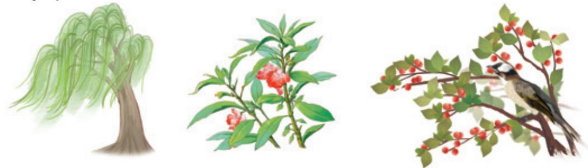

## 识字加油站

lǎng晴朗

闪电

冰雹

霾风冻 w雾bo暴霜

阴雷雨 转 晴 阵问夹 雨雪

我还知道和天气有关的其他词语。

lǎng wù bào léi zhèn dòng jiā 朗雾暴雷阵冻夹

## 字词句运用

体会每组加点词的不同意思，选一组演一演。

迎上去 追上去

shang 穿衣裳 披红袍

甩甩手摇摇头

读一读，用加点的词语说说你的日常生活。

有时候我穿着白衣服，有时候我穿着黑衣服，早晨bàng和傍晚我又把红袍披在身上。

# 人民教育出版社

xī sàn

□ 平常我在池子里睡觉，在小溪里散步，在江河里奔跑，wǔ在海洋里跳舞，唱歌，开大会。

## 书写提示

海海

作作

都都

别别

有的字左边窄，右边宽；有的字左边宽，右边窄。

写字时要保持正确 的坐姿和执笔姿势。

## 日积月累

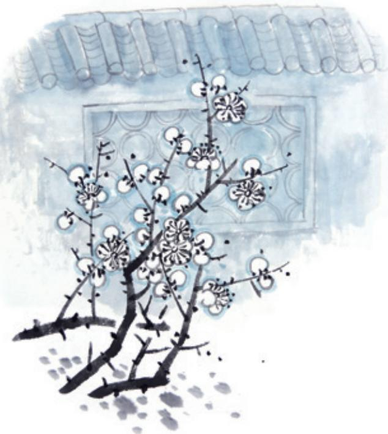

méi huā 梅花

sòng wáng ān shí [宋]王安石

qiáng jiǎo shù zhī méi 墙角数枝梅， líng hán dú zì kāi 凌寒独自开。 yáo zhī bú shì xuě 遥知不是雪， wèi yǒu àn xiāng lái 为有暗香来。

## 口语交际

## 有趣的动物

鹦鹉会学人说话，萤火虫能发出亮光，松鼠的尾巴好像 降落伞……动物真有趣！

和同学交流：你喜欢哪种动物？它有趣在哪儿？先想好要讲的内容，再讲给同学听。听的同学可以提问或补充。

说话前先想好要说的内容。有不明白的地方，有礼貌地提问。

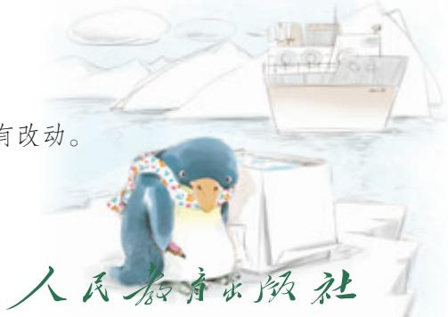

## 我爱阅读

# qǐ é jì 企鹅寄冰

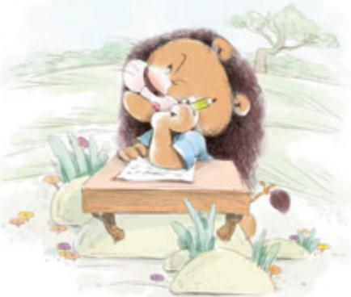

shī yán zhōu狮子大王住在炎热的非洲。

夏天来了，狮子大王不停地叫着：“热啊，热啊。”河马jí lěng  
说：“听说在南极有一种很冷很冷的东西，叫作冰。”狮子大kè fēng xìn  
王听了，立刻给南极的企鹅写了一封信，请他寄一块冰来。

好多天以后，企鹅收到了信。他说：“啊，狮子大王想róng yì tiāo要一块冰，太容易了，我这里可是冰天雪地啊。”企鹅挑了一块冰，装在袋子里，给狮子大王寄去。

装冰的箱子先上了轮船，又上了飞机。

过了很多天，狮子大王收到了箱子。他打开一看，觉得guài tuì好奇怪：“呀，怎么是一袋水？”狮子大王生气地把箱子退回去了，还给企鹅写了一封信。

又过了很多天，企鹅收到了箱子和信。狮子大王的信上写着：“我请你寄块冰来，你为什么寄来一袋水？”企鹅连ma忙把箱子打开：“这明明是冰嘛，怎么说是水呢？”看着袋hú子里的冰块，企鹅也糊涂了。

## tóng huà 读读童话故事

chā dā liè来吧，插上想象的翅膀，搭上童话王国的列车，看看那里发生了什么。

ná yǐ fēng每次拿到书，我们可以先看看书的封面，找找zhě书名和作者。看到书名，你也许会好奇这本童话书|里讲了什么故事，主人公有怎样的经历。先猜猜看，再打开童话故事书，我们一起来读一读。

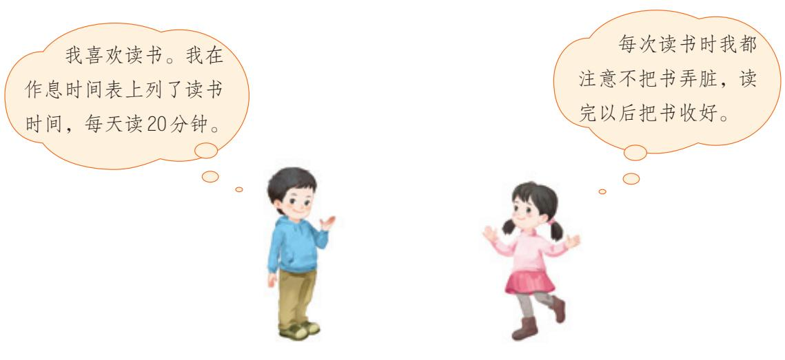

yì zhī hǎi ōu yì tiáo fān chuán 一只海鸥，一条帆船。

yì sōu jūn jiàn yí chù gǎng wān 一艘军舰，一处港湾。

yì fāng yú táng yí kuài dào tián 一方鱼塘，一块稻田。

yì háng chuí liǔ yí zuò huā yuán 一行垂柳，一座花园。

yí dào xiǎo xī yí zuò shí qiáo 一道小溪，一座石桥。

yì cóng cuì zhú yì qún fēi niǎo 一丛翠竹，一群飞鸟。

yí miàn duì qí yì bǎ tóng hào 一面队旗，一把铜号。

yí duì hóng lǐng jīn yí piàn huān xiào一队“红领巾”，一片欢笑。

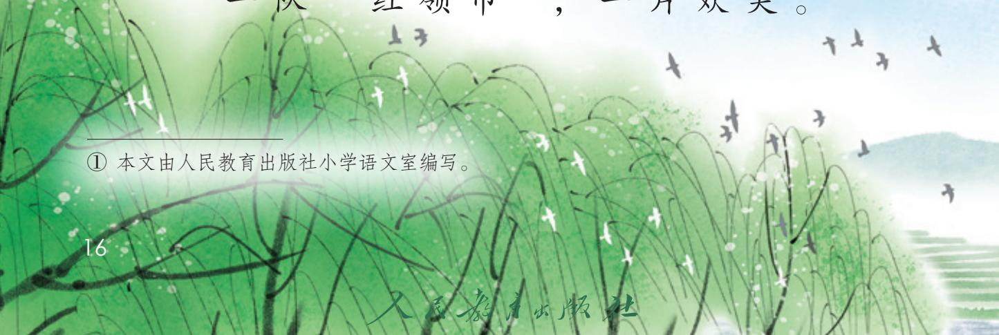

## 人民教育出版社

fān gǎng wān táng dào háng chuí yuán xī cóng cuì qún duì tóng hào 帆港湾塘稻行垂园溪丛翠群队铜号

处处

块块

座座

园园

群群

队队

领领

朗读课文。

说一说，看谁说得多。

一（）鱼塘

一（）稻田

我会说：“一条帆船、一只帆船、一队帆船……”

一（）石桥

一（）翠竹

一（）海鸥

一（）帆船

选一张你喜欢的照片或图画，仿照课文说说上面有些什么。

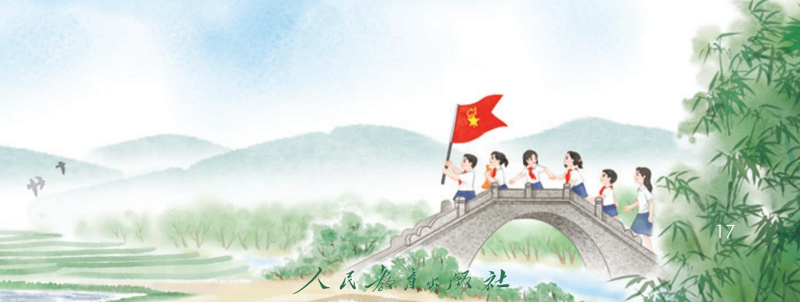

松树

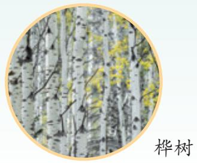

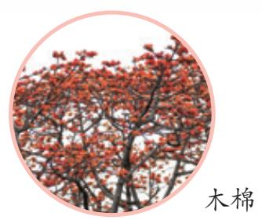

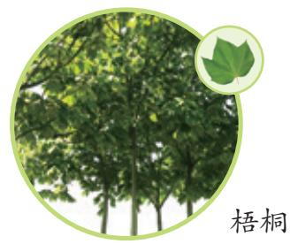

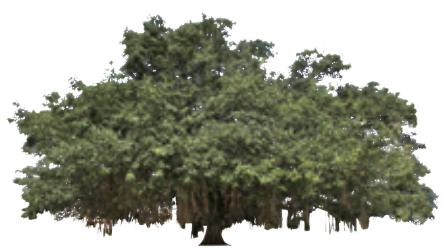

## shù zhī gē2 树之歌 ①

yáng shù gāo róng shù zhuàng 杨树高，榕树壮， wú tóng shù yè xiàng shǒu zhǎng 梧桐树叶像手掌。 fēng shù qiū tiān yè ér hóng 枫树秋天叶儿红， sōng bǎi sì jì pī lù zhuāng 松柏四季披绿装。 mù mián xǐ nuǎn zài nán fāng 木棉喜暖在南方， huà shù nài hán shǒu běi jiāng 桦树耐寒守北疆。 yín xìng shuǐ shān huó huà shí 银杏水杉活化石， jīn guì kāi huā mǎn yuàn xiāng 金桂开花满院香。

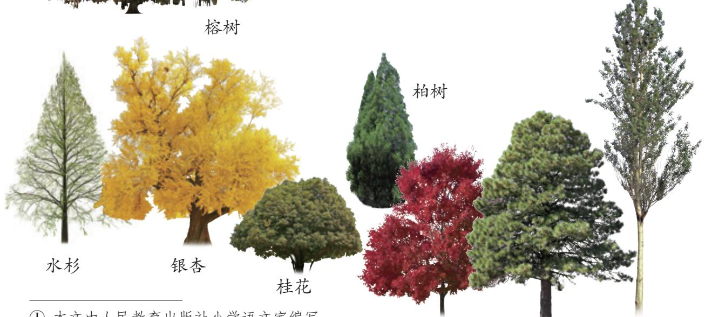  
①本文由人民教育出版社小学语文室编写。  
枫树

róng zhuàng wú tóng zhǎng fēng sōng bǎi huà shǒu yín xìng shān huà guì 榕壮梧桐掌枫松柏桦守银杏杉化桂

树树

杨杨

之之

柏柏

松松

金金

化化

桂桂

## 朗读课文。背诵课文。

读一读，你还能说出这样的词语吗？

pāo 泡桐 白桦 云杉 翠柏

gēn zhī shāo 树根 树干 树枝 树梢

读一读，记一记。

十年树木，百年树人。

guī树高百尺，叶落归根。

树无根不长，人无志不立。

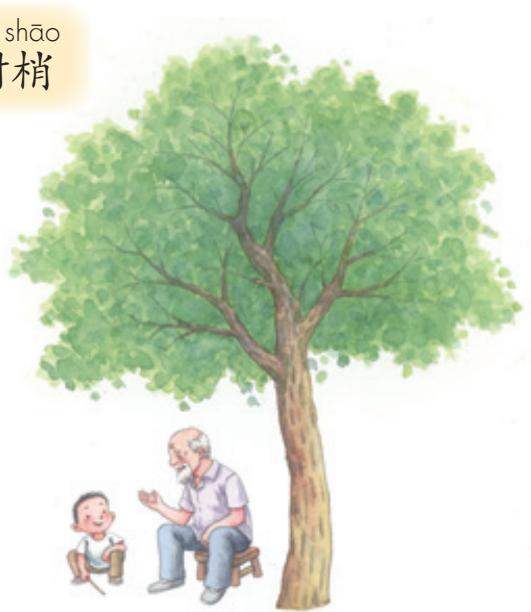

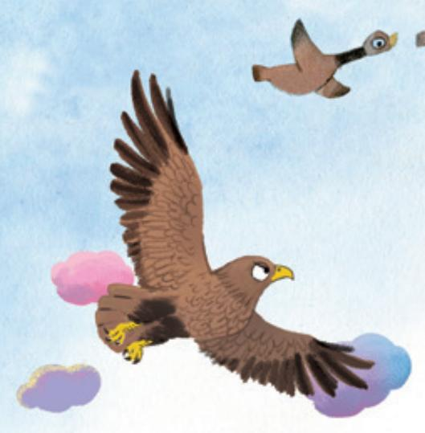

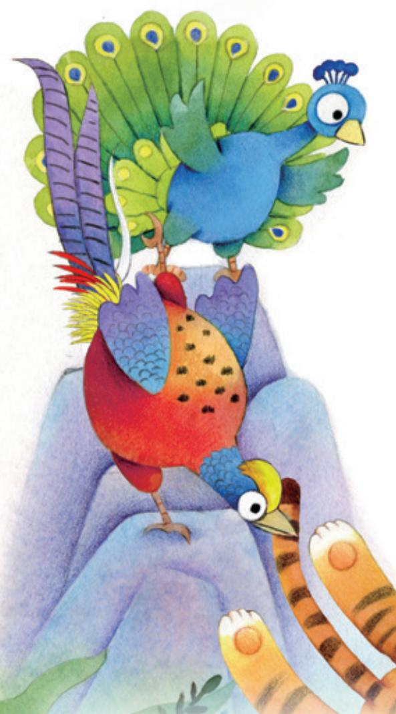

①本文由人民教育出版社小学语文室编写。

## pāi shǒu gē 3 拍手歌 ①

nǐ pāi yī wǒ pāi yī 你拍一，我拍一， dòng wù shì jiè hěn xīn qí 动物世界很新奇。

nǐ pāi èr wǒ pāi èr 你拍二，我拍二， kǒng què jǐn jī shì huǒ bànr 孔雀锦鸡是伙伴儿。

nǐ pāi sān wǒ pāi sān 你拍三，我拍三， xióng yīng fēi xiáng yún cai jiān 雄鹰飞翔云彩间。

nǐ pāi sì wǒ pāi sì 你拍四，我拍四， tiān kōng yàn qún huì xiě zì 天空雁群会写字。

## 人民教育出版社

nǐ pāi wǔ wǒ pāi wǔ 你拍五，我拍五， cóng lín shēn chù yǒu měng hǔ 丛林深处有猛虎。

nǐ pāi liù wǒ pāi liù 你拍六，我拍六， huáng lí bǎi líng chàng bù xiū 黄鹂百灵唱不休。

nǐ pāi qī wǒ pāi qī 你拍七，我拍七， zhú lín xióng māo zài xī xì 竹林熊猫在嬉戏。

nǐ pāi bā wǒ pāi bā 你拍八，我拍八， dà xiǎo dòng wù dōu yǒu jiā 大小动物都有家。

nǐ pāi jiǔ wǒ pāi jiǔ 你拍九，我拍九， rén hé dòng wù shì péng you 人和动物是朋友。

nǐ pāi shí wǒ pāi shí 你拍十，我拍十， bǎo hù dòng wù shì dà shì 保护动物是大事。

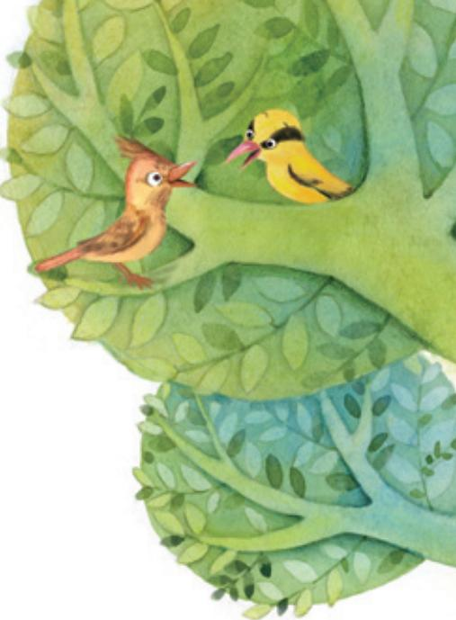

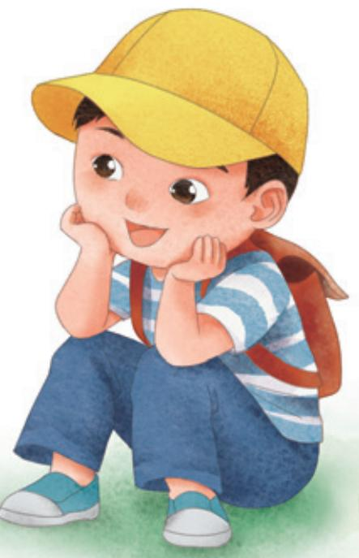

shì jiè kǒng què jǐn xióng yīng xiáng yàn shēn měng líng xiū māo 世界孔雀锦雄鹰翔雁深猛灵休猫

拍拍

世世

界界

彩彩

丛丛

休休

朋朋

友友

保保

护护

朗读课文。

读一读，说说每组加点的字有什么相同的部分。

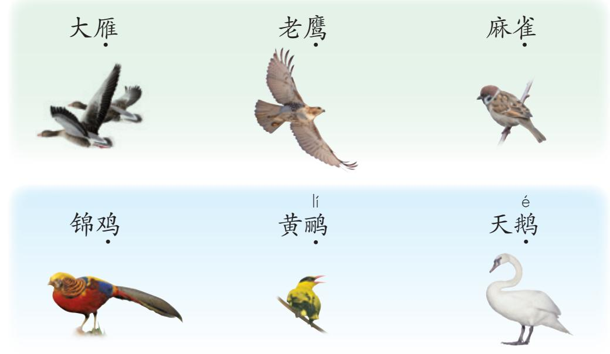

# tián jiā sì jì gē ④田家四季歌

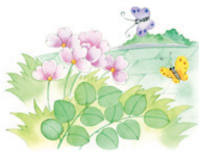  
chūn jì lǐ chūn fēng chuī春季里，春风吹，  
huā kāi cǎo zhǎng hú dié fēi 花开草长蝴蝶飞。  
mài miáo ér duō nèn sāng yè ér zhèng féi 麦苗儿多嫩，桑叶儿正肥。  
xià jì lǐ nóng shì máng 夏季里，农事忙，  
cǎi sāng yǎng cán yòu chā yāng采桑养蚕又插秧。  
zǎo qǐ qín gēng zuò guī lái dài yuè guāng 早起勤耕作，归来戴月光。

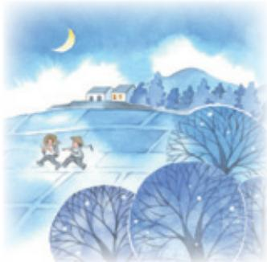

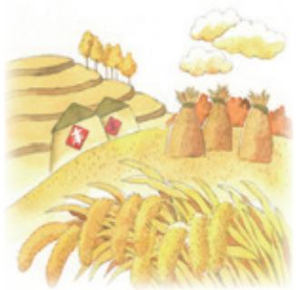  
qiū jì lǐ dào shàng cháng 秋季里，稻上场，  
gǔ xiàng huáng jīn lì lì xiāng 谷像黄金粒粒香。  
shēn tǐ suī xīn kǔ xīn lǐ xǐ yáng yáng 身体虽辛苦，心里喜洋洋。

人民教育出版社

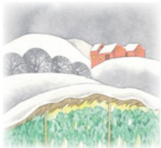

dōng jì lǐ xuě chū qíng   
冬季里，雪初晴，   
xīn zhì mián yī nuǎn yòu qīng   
新制棉衣暖又轻。   
yì nián nóng shì liǎo dà jiā xiào yíng yíng 一年农事了，大家笑盈盈。

jì hú dié mài nèn féi nóng qín 季蝴蝶麦嫩肥农勤

guī dài cháng gǔ suī xīn kǔ zhì 归戴场谷虽辛苦制

肥 肥

农农事事

谷谷体体

虽虽 辛辛

朗读课文。背诵课文。

我还知道其他的农事活动。

读一读，记一记。 gēng lí bō chāyāng chú gē 耕田犁地播种插秧除草割麦打谷

## 语文园地二

## 识字加油站

读书的时候，遇到了不认识的字，该怎么办？

遇到不认识的字，可以用部首查字法查字典，如“诚”字。

美对丑，爱对恨。真诚对虚假，热忱对冷漠。  
雪中送炭见真情，助人为乐献爱心。  
贫对富，冷对暖。饥寒对温饱，索取对奉献。  
人人献出一点爱，人间永远是春天。

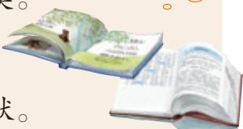

要查“诚”的读音，先要确定这个字的部首是“i”，再数数“i”的笔画，共2画。

在“部首目录”里的“2画”中找到部首“i”和它所在的页码。

按照页码，在“检字表”中找“i”部。再数数“诚”字除去部首还有几画，然后在相应笔画数的位置找到“诚”字和它在正文中的页码。

按照页码，在正文中就可以查到“诚”字了。

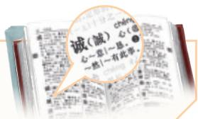

查一查下面的部首在“检字表”的哪一页。

（）イ（）（）（）（）

## 人民教育出版社

## 用部首查字法查查下面的字。

<table><tr><td rowspan=1 colspan=1>要查的字</td><td rowspan=1 colspan=1>部首</td><td rowspan=1 colspan=1>除去部首有几画</td><td rowspan=1 colspan=1>字的页码</td><td rowspan=1 colspan=1>读音</td></tr><tr><td rowspan=1 colspan=1>恨</td><td rowspan=1 colspan=1></td><td rowspan=1 colspan=1></td><td rowspan=1 colspan=1></td><td rowspan=1 colspan=1></td></tr><tr><td rowspan=1 colspan=1>假</td><td rowspan=1 colspan=1></td><td rowspan=1 colspan=1></td><td rowspan=1 colspan=1></td><td rowspan=1 colspan=1></td></tr><tr><td rowspan=1 colspan=1>漠</td><td rowspan=1 colspan=1></td><td rowspan=1 colspan=1></td><td rowspan=1 colspan=1></td><td rowspan=1 colspan=1></td></tr><tr><td rowspan=1 colspan=1>富</td><td rowspan=1 colspan=1></td><td rowspan=1 colspan=1></td><td rowspan=1 colspan=1></td><td rowspan=1 colspan=1></td></tr><tr><td rowspan=1 colspan=1>饥</td><td rowspan=1 colspan=1></td><td rowspan=1 colspan=1></td><td rowspan=1 colspan=1></td><td rowspan=1 colspan=1></td></tr></table>

# 丑恨诚虚假漠助贫富饥

诚诚

## 日积月累

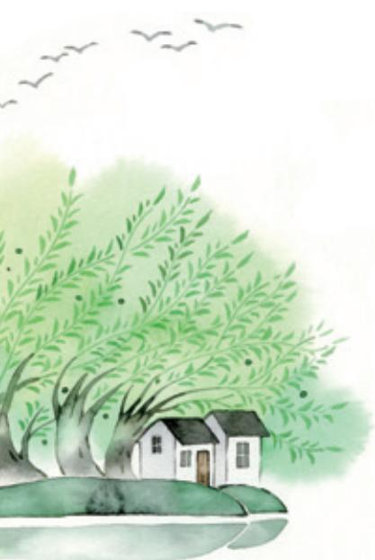

shǔ jiǔ gē数九歌

yī jiǔ èr jiǔ bù chū shǒu   
一九二九不出手，   
sān jiǔ sì jiǔ bīng shàng zǒu   
三九四九冰上走，   
wǔ jiǔ liù jiǔ yán hé kàn liǔ   
五九六九，沿河看柳，   
qī jiǔ hé kāi bā jiǔ yàn lái   
七九河开，八九雁来，   
jiǔ jiǔ jiā yì jiǔ gēng niú biàn dì zǒu 九九加一九，耕牛遍地走。

## 我爱阅读

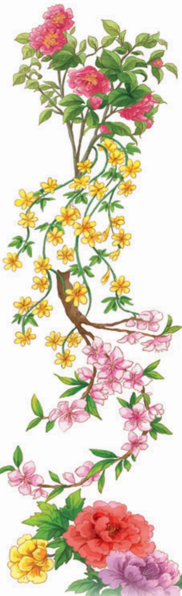  
①本文是民间歌谣。文中的月份指的是农历的月份。

## 十二月花名歌①

zhēng   
正月山茶满盆开，   
二月迎春初开放。   
三月桃花红十里， mǔ dān   
四月牡丹国色香。 liú sì   
五月石榴红似火，   
六月荷花满池塘。 mò lì   
七月茉莉花如雪， zhī   
八月桂花满枝香。 jú zī tài   
九月菊花姿百态， fú róng zhuāng   
十月芙蓉正上妆。 xiān àn   
冬月水仙案头摆，   
là méi   
腊月寒梅斗冰霜。

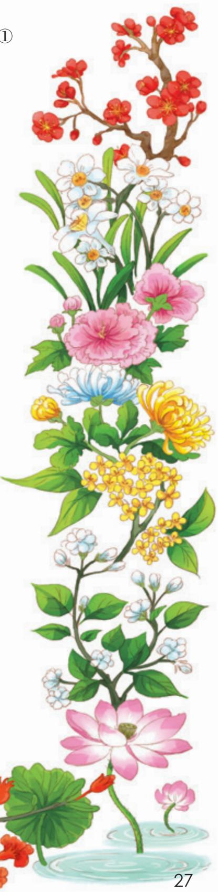

# cǎi hóng 4 彩 虹 ①

yǔ tíng le tiānshàng chū xiàn le yí zuò měi lì de qiáo 雨停了，天上出现了一座美丽的桥。

bà ba nín jiāo huā yòng de nà bǎ shuǐ hú ne rú guǒ wǒ 爸爸，您浇花用的那把水壶呢？如果我 tí zhe tā zǒu dào qiáo shàng bǎ shuǐ sǎ xià lái nà bú jiù shì 提着它，走到桥上，把水洒下来，那不就是 wǒ zài xià yǔ ma nín jiù bú yòng tiāo shuǐ qù jiāo tián le nín gāo 我在下雨吗？您就不用挑水去浇田了，您高 xìng mα 兴吗？

mā mα nín shū tóu yòng de nà miàn jìng zi ne rú guǒ wǒ 妈妈，您梳头用的那面镜子呢？如果我 ná zhe tā zǒu dào qiáo shàng tiān shàng bú jiù duō le yí gè yuè 拿着它，走到桥上，天上不就多了一个月 liang ma wǒ ná zhe yuán yuán de yuè liangzhào zhe nín shū tóu nín gāo 亮吗？我拿着圆圆的月亮照着您梳头，您高 xìng mα 兴吗？

## 人民教育出版社

gē ge nǐ jì zài mén qián shù shàng de 哥哥，你系在门前树上的 qiū qiān ne rú guǒ wǒ bǎ tā guà zài cǎi hóng 秋千呢？如果我把它挂在彩虹 qiáo shàng zuò zhe qiū qiān dàng lái dàng qù huā 桥上，坐着秋千荡来荡去，花 qún zi piāo a piāo de bú jiù chéng le yì duǒ 裙子飘啊飘的，不就成了一朵 cǎi yún ma nǐ kàn jiàn le gāo xìng mα 彩云吗？你看见了，高兴吗？

hóng jiāo hú tí sǎ tiāo jìng ná jì dàng qún 虹浇壶提洒挑镜拿系荡裙

丽丽

提提

吗吗

圆圆

哥哥

挂挂

秋秋

啊啊

朗读课文。

看到天上的彩虹，文中的“我”想为家人做哪些事？说说你体会到了什么。

# qù wài pó jiā 5 去外婆家

xiǎo shí hou wǒ zuì dà de lè qù jiù shì qù wài pó jiā 小时候，我最大的乐趣就是去外婆家。

wài pó de jiā zài shān jiǎo xià shān shàng shān xià bǎo bèi duō 外婆的家在山脚下。山上山下宝贝多， yǒu chī de yǒu wán de hái yǒu kàn de 有吃的，有玩的，还有看的。

yǒu shí hou jiù jiu cóng shān shàng gàn huó huí lái huì dài yì xiē 有时候舅舅从山上干活回来，会带一些   
shān zhā shì zi huò máo lì zi wài pó zǒng yào gěi wǒ liú yí fèn   
山楂、柿子或毛栗子，外婆总要给我留一份。

tiān qì hǎo de shí hou zài wū hòu de shānshàng wán huì kàn 天气好的时候，在屋后的山上玩，会看 dào yì zhī zhī xiǎo shān què zài lín jiān huān kuài de bèng lái tiào qù tā 到一只只小山雀在林间欢快地蹦来跳去，它 men shì wǒ zuì xǐ huan de bǎo bèi wài pó gào su wǒ cóng xiǎo wèi 们是我最喜欢的宝贝。外婆告诉我，从小喂 dà de shān què bú huì táo jī jī yí jiào jiù fēi dào nǐ shǒu 大的山雀不会逃，唧唧一叫，就飞到你手 shàng chàng zhī xiǎo qǔ gěi nǐ tīng 上，唱支小曲给你听。

měi dào chūn tiān wài pó jiā wū hòu de shān shàng kāi mǎn le 每到春天，外婆家屋后的山上，开满了   
chà zǐ yān hóng de dù juān huā hái yǒu xǔ xǔ duō duō shuō bù chū   
姹紫嫣红的杜鹃花，还有许许多多说不出

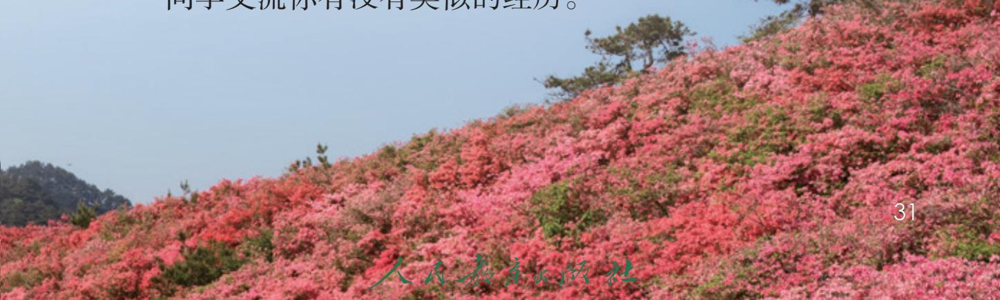

## 人民教育出版社

míng zi de yě huā jiù mā chū mén cǎi jǐ duǒ yě huā dài zài tóu 名字的野花。舅妈出门，采几朵野花戴在头 shàng huò zhě bié zài yī fu shàng zǒu qǐ lù lái xiāng qì pū bí 上，或者别在衣服上，走起路来香气扑鼻。

wài pó jiā zhēn yǒu qù 外婆家真有趣！

婆篌邏舅籤醫份喂選笛署服罪鼻

宝宝

活活

些些

总总

给给

诉诉

曲曲

名名

香 香

朗读课文。

说一说外婆家带给“我”哪些乐趣。再和同学交流你有没有类似的经历。

# shǔ xīng xing de hái zi

# ⑥数星星的孩子

wǎn shang mǎn tiān de xīng xing xiàng wú shù zhēn zhū sǎ zài bì yù 晚上，满天的星星像无数珍珠撒在碧玉 pán lǐ yí gè hái zi zuò zài yuàn zi lǐ kào zhe nǎi nai yǎng 盘里。一个孩子坐在院子里，靠着奶奶，仰 qǐ tóu zhǐ zhe tiān kōng shǔ xīng xing yì kē liǎng kē yì 起头，指着天空数星星。一颗、两颗…一 zhí shǔ dào le jǐ bǎi kē 直数到了几百颗。

nǎi nai xiào zhe shuō shǎ hái zi yòu zài shǔ xīng xing le 奶奶笑着说：“傻孩子，又在数星星了。 nà me duō xīng xing yì shǎn yì shǎn de luàn dòng yǎn jing dōu kàn huā 那么多星星，一闪一闪地乱动，眼睛都看花 le nǐ néng shǔ de qīng ma 了，你能数得清吗？”

hái zi shuō nǎi nai néng kàn de jiàn jiù néng shǔ de 孩子说：“奶奶，能看得见，就能数得 qīng xīng xing shì zài dòng kě bú shì luàn dòng nín kàn zhè kē 清。星星是在动，可不是乱动。您看，这颗 xīng hé nà kē xīng zhōng jiān zǒng shì gé nà me yuǎn 星和那颗星，中间总是隔那么远。

yé ye zǒu guò lái shuō hái zi nǐ kàn de hěn zǐ 爷爷走过来，说：“孩子，你看得很仔   
xì tiān shàng de xīng xing shì zài dòng kě shì kàn qǐ lái tā men zhī   
细。天上的星星是在动，可是看起来它们之

jiān de jù lí hǎo xiàng shì bú biàn de wǒ men de zǔ xiān bǎ tā men 间的距离好像是不变的。我们的祖先把它们 fēn chéng yì zǔ yì zǔ de hái gěi qǐ le míng zi yé ye tíng 分成一组一组的，还给起了名字。” 爷爷停 le tíng zhǐ zhe běi biān de tiān kōng shuō nǐ kàn nà qī kē 了停，指着北边的天空，说：“你看，那七颗 xīng lián qǐ lái xiàng yì bǎ sháo zi jiào běi dǒu qī xīng sháo kǒu 星，连起来像一把勺子，叫北斗七星。勺口 duì zhe de nà kē xīng jiù shì běi jí xīng běi dǒu qī xīng zǒng shì 对着的那颗星，就是北极星。北斗七星总是 rào zhe běi jí xīng zhuàn yé ye shuō de huà shì zhēn de ma zhè hái 绕着北极星转。”爷爷说的话是真的吗？这孩 zi yí yè méi shuì hǎo jǐ cì qǐ lái kàn xīng xing tā kàn qīng chǔ 子一夜没睡好，几次起来看星星。他看清楚 le běi dǒu qī xīng guǒ rán shì rào zhe běi jí xīng zhuàn dòng de 了，北斗七星果然是绕着北极星转动的。

zhè ge shǔ xīng xing de hái zi míng jiào zhāng héng shì hàn cháo 这个数星星的孩子名叫张衡，是汉朝 rén tā kè kǔ zuān yán tiān wén hòu lái chéng le zhù míng de tiān wén 人。他刻苦钻研天文，后来成了著名的天文 xué jiā 学家。

zhēn sǎ bì kào yǎng kē jù biàn 珍撒碧靠仰颗距变 zǔ sháo rào zhuàn chǔ hàn kè yán 祖勺绕转楚汉刻研

晚晚

奶奶您您

很很

变变

张张

汉汉

朗读课文。想一想：下面的句子怎么读更好？

星星是在动，可不是乱动。

ge◇ 这颗星和那颗星，中间总是隔那么远。

北斗七星果然是绕着北极星转动的。

爷爷告诉了张衡哪些知识？他听了以后是怎么想的，又是怎么做的？

张衡的故事给你带来什么样的启发？联系课文内容和生活经验，和同学交流。

语文园地三

## 识字加油站

tán gāng qín wǔ dǎo   
弹钢琴 练舞蹈 唱京戏 niē ní wéi   
画图画 捏泥人 下围棋 gǔn tiě huán huá tī   
荡秋千 滚铁环 滑滑梯

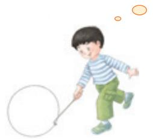

tán gāng qín niē ní wéi gǔn tiě huán huá tī 弹钢琴捏泥围滚铁环滑梯

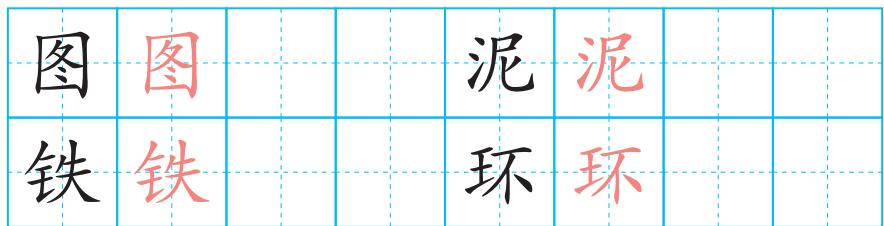

## 字词句运用

比一比，填一填。

园圆

只支

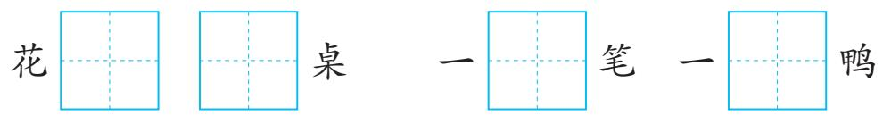

## 人民教育出版社

## 进近

## 坐座

远

出

位

$$
\boxed { \begin{array} { c } { 1 } \\ { 1 } \\ { 1 } \\ { \cdots = \cdots = \frac { 1 } { 6 } } \\ { 1 } \\ { 1 } \\ { 1 } \end{array} }
$$

车

给下面的句子加上标点，再读一读。

◇ 一阵秋风吹过树叶像蝴蝶一样飘落下来

jìng我打开窗户一看竟然下雪了

guài,

这棵树的叶子真奇怪 是什么树呢

你平时是怎样积累词句的？和同学交流。

白云 乌云 朝霞 晚霞

雨点 霜冻 雪花 冰雹

我积累了一些词语和句子。老师说在平时的学习中主动积累是一个好习惯。

小溪河流湖泊 海洋

你积累了哪些词句？我们来交流一下吧。

含苞欲放 百花争艳花红柳绿 春色满园

熱爱書吧——這是知识

的源泉！苏联]高尔基

## 日积月累

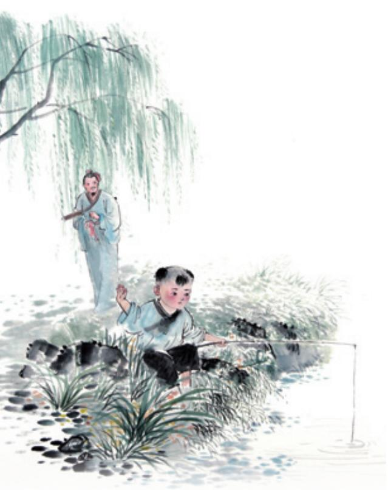

xiǎo ér chuí diào 小儿垂钓

táng hú lìngnéng [唐]胡令能

péng tóu zhì zǐ xué chuí lún 蓬头稚子学垂纶， cè zuò méi tái cǎo yìng shēn 侧坐莓苔草映身。 lù rén jiè wèn yáo zhāo shǒu 路人借问遥招手， pà dé yú jīng bú yìng rén 怕得鱼惊不应人。

## 口语交际

## 做手工

你做过什么手工作品？选一件介绍给同学，说一说：你做的是什么？是怎么做的？

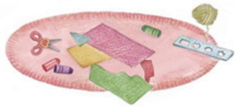

按照顺序说。

注意听，记住主要信息。

## wén wǔ 闻鸡起舞

jìn tì yǔ liú kūn晋朝有一个名叫祖逖的青年，他与好友刘琨住在一起。fān fù

一天夜里，祖逖翻来覆去睡不着，他想：怎样才能为国xiào yìng bào家效力呢？他决心练就过硬的本领，报效国家。到了后半yú tuī xǐng夜，祖逖听到鸡叫的声音，于是，他推醒刘琨，两个人起床wǔ yì zhí jiàn到院子里练习武艺。祖逖手执长剑，刘琨舞起大刀，认真地yǐ lùn guā练习起来。从此以后，无论是寒冬还是酷暑，无论是刮风还yóu是下雨，一听到鸡叫，他们就立刻起身练武。由于勤学苦qiáng练，他们的武艺都变得很高强。

jiāng jūn wǔ jì lù 后来，祖逖当上了将军。他带领的队伍纪律严明，作战 shèngzhàng 勇敢，打了不少胜仗。

人民教育出版社

第四单元·阅读

# gǔ shī èr shǒu ⑦古诗二首

dēng guàn què lóu 登鹳雀楼

táng wáng zhī huàn [唐]王之涣

bái rì yī shān jìn 白日依山尽， huáng hé rù hǎi liú 黄河入海流。 yù qióng qiān lǐ mù 欲穷千里目， gèng shàng yì céng lóu 更上一层楼。

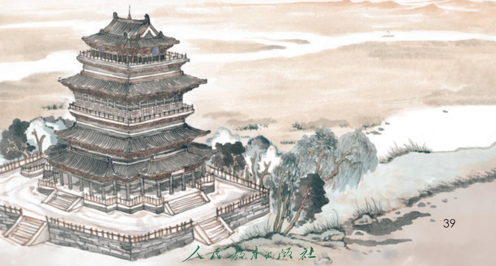

# wàng lú shān pù bù 望庐山瀑布

táng lǐ bái [唐]李白

rì zhào xiāng lú shēng zǐ yān 日照香炉生紫烟 yáo kàn pù bù guà qián chuān 遥看瀑布挂前川。 fēi liú zhí xià sān qiān chǐ 飞流直下三千尺， yí shì yín hé luò jiǔ tiān 疑是银河落九天。

dēng táng yī jìn yù qióng céng pù bù lú zǐ yān yáo 登唐依尽欲穷层瀑布炉紫烟遥

依依尽尽

穷穷层层

照照 炉炉

烟烟川川

直直银银

朗读课文。背诵课文。

读诗句，想画面，再用自己的话说一说。

白日依山尽，黄河入海流。

飞流直下三千尺，疑是银河落九天。

读一读，记一记。

穷尽 山穷水尽

dié 层叠 层林叠翠

sàn烟云 烟消云散山川 名山大川

# huáng shān qí shí 8 黄山奇石 ①

zhōng wài wén míng de huáng shān fēng jǐng qū zài wǒ guó ān huī shěng 中外闻名的黄山风景区在我国安徽省 nán bù nà lǐ jǐng sè xiù lì shén qí yóu qí shì nà xiē guài 南部。那里景色秀丽神奇，尤其是那些怪 shí yǒu qù jí le 石，有趣极了。

jiù shuō xiān táo shí ba tā hǎo xiàng cóng tiān shàng fēi xià 就说“仙桃石”吧，它好像从天上飞下 lái de yí gè dà táo zi luò zài shān dǐng de shí pán shàng 来的一个大桃子，落在山顶的石盘上。

zài yí zuò dǒu qiào de shān fēng shàng yǒu yì 在一座陡峭的山峰上，有一 联系生活，我 能猜出“陡峭”的 zhī hóu zi tā liǎng zhī gē bo bào zhe tuǐ 意思。 只“猴子”。它两只胳膊抱着腿， yí dòng bú dòng de dūn zài shān tóu wàng zhe fān gǔn de yún hǎi zhè 一动不动地蹲在山头，望着翻滚的云海。这 jiù shì yǒu qù de hóu zi guān hǎi 就是有趣的“猴子观海”。

①本文选自人民教育出版社《义务教育五年制小学教科书（实验本）语文第四册》，有改动。

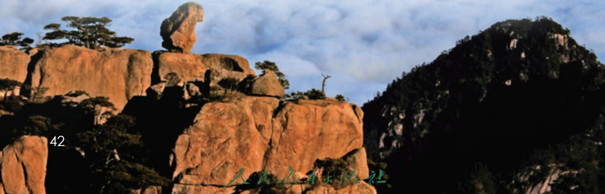

xiān rén zhǐ lù jiù gèng yǒu qù le yuǎn yuǎn wàng qù “仙人指路”就更有趣了！远远望去， nà jù shí zhēn xiàng yí wèi xiān rén zhàn zài gāo gāo de shān fēng shàng shēn 那巨石真像一位仙人站在高高的山峰上，伸 zhe shǒu bì zhǐ xiàng qián fāng 着手臂指向前方。

měi dāng tài yáng shēng qǐ yǒu zuò shān fēng shàng de jǐ kuài jù 每当太阳升起，有座山峰上的几块巨 shí jiù biàn chéng le yì zhī jīn guāng shǎn shǎn de xióng jī tā shēn zhe 石，就变成了一只金光闪闪的雄鸡。它伸着 bó zi duì zhe tiān dū fēng bú zhù de tí jiào bú yòng shuō zhè 脖子，对着天都峰不住地啼叫。不用说，这 jiù shì zhù míng de jīn jī jiào tiān dū le 就是著名的“金鸡叫天都”了。

huáng shān de qí shí hái yǒu hěn duō rú tiān gǒu wàng 黄山的奇石还有很多，如“天狗望 yuè shī zi qiǎng qiú xiān nǚ tán qín nà xiē jiào bù chū 月”“狮子抢球”“仙女弹琴”。那些叫不出 míng zi de qí xíng guài zhuàng de yán shí zhèngděng nǐ qù gěi tā men qǐ 名字的奇形怪状的岩石，正等你去给它们起 míng zi ne 名字呢！

wén jǐng qū shěng xiù shén xiān pán 闻景区省秀神仙盘 zhǐ jù shēn dū zhù qiǎng zhuàng yán 指巨伸都著抢状岩

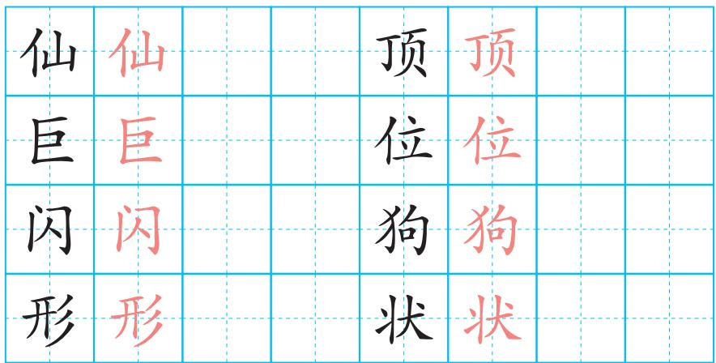

朗读课文。

读句子，照样子用上加点的词语说说图片里的石头，再选一张图片写一写。

它好像从天上飞下来的一个大桃子，落在山顶的石盘上。 f=n\~ hi

tēng bí那巨石真像一位仙人站在高高的山峰上，伸着手臂指向前方。

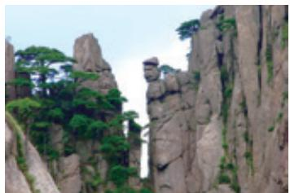

读一读，选几个词语说说某处景物。

风景 景色 风景如画

zhī秀丽 秀美 一枝独秀

mì kuàng、yí 神奇神秘心旷神怡 远近闻名 百闻不如一见

# rì yuè tán 9 日月潭 ①

rì yuè tán shì wǒ guó tái wān shěng zuì dà de yí gè hú tā 日月潭是我国台湾省最大的一个湖，它 zài tái wān shěng zhōng bù de shān qū nà lǐ qún shān huán rào shù mù 在台湾省中部的山区。那里群山环绕，树木 mào shèng zhōu wéi yǒu xǔ duō míng shèng gǔ jì 茂盛，周围有许多名胜古迹。

rì yuè tán hěn shēn hú shuǐ bì là hú zhōng yāng yǒu gè měi 日月潭很深，湖水碧绿。湖中央有个美   
lì de xiǎo dǎo bǎ hú shuǐ fēn chéng liǎng bàn běi biān xiàng yuán yuán de   
丽的小岛，把湖水分成两半：北边像圆圆的   
tài yáng jiào rì tán nán biān xiàng wān wān de yuè liang jiào yuè tán   
太阳，叫日潭；南边像弯弯的月亮，叫月潭。

qīng chén hú miàn shàng piāo zhe báo báo de wù tiān biān de chén 清晨，湖面上飘着薄薄的雾。天边的晨 xīng hé shān shàng de diǎn diǎn dēng guāng yǐn yǐn yuē yuē de dào yìng zài hú 星和山上的点点灯光，隐隐约约地倒映在湖 shuǐ zhōng 水中。

zhōng wǔ tài yáng gāo zhào zhěng gè rì yuè tán de měi jǐng hé 中午，太阳高照，整个日月潭的美景和   
zhōu wéi de jiàn zhù dōu qīng xī de zhǎn xiàn zài yǎn qián yào shi xià   
周围的建筑，都清晰地展现在眼前。要是下   
qǐ méng méng xì yǔ rì yuè tán hǎo xiàng pī shàng qīng shā zhōu wéi de   
起蒙蒙细雨，日月潭好像披上轻纱，周围的 jǐng wù yí piàn méng lóng jiù xiàng tóng huà zhōng 景物一片朦胧，就像童话中 de xiān jìng   
的仙境。

rì yuè tán fēng guāng xiù lì xī yǐn 日月潭风光秀丽，吸引 le xǔ xǔ duō duō de zhōng wài yóu kè 了许许多多的中外游客。

联系上下文，我能猜出“朦胧”的意思。

tán mào shèng shèng yāng dǎo yǐn yuē dào yìng zhěng tóng xī yǐn kè 潭茂盛胜央岛隐约倒映整童吸引客

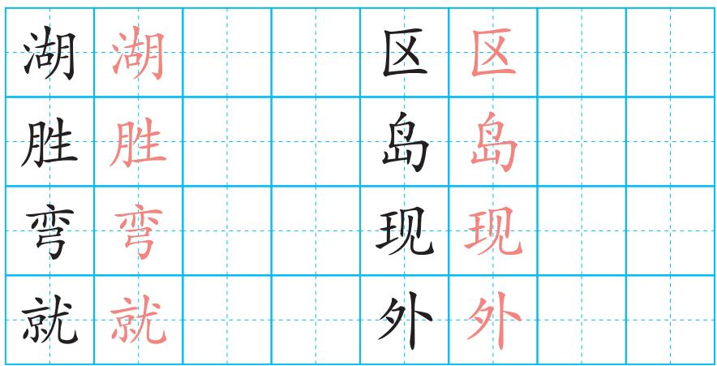

朗读课文。背诵第2\~4自然段。

你觉得日月潭美在哪儿？找出有关的句子读一读。

读一读，记一记。

群山环绕

树木茂盛

jì 名胜古迹 山清水秀 点点灯光 méng 蒙蒙细雨

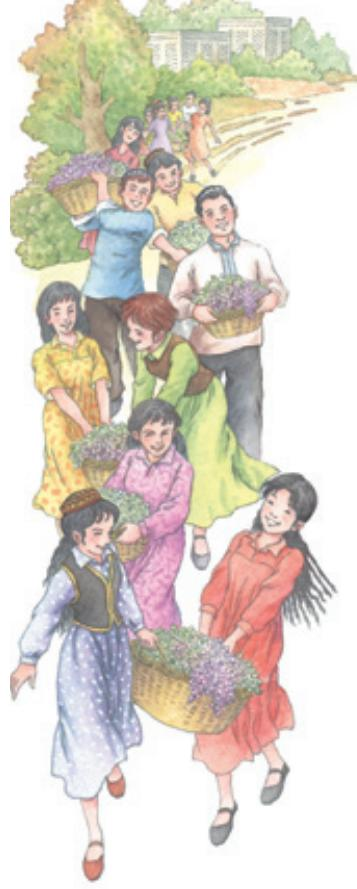

## pú tao gōu 10 葡萄沟 ①

xīn jiāng tǔ lǔ fān yǒu gè dì fang jiào pú 新疆吐鲁番有个地方叫葡 tao gōu nà lǐ shèngchǎn shuǐ guǒ wǔ yuè yǒu 萄沟，那里盛产水果。五月有 sāng shèn liù yuè yǒu xìng zi wú huā guǒ 桑葚，六月有杏子、无花果， dào le qī yuè fèn rén men zuì xǐ ài de pú 到了七月份，人们最喜爱的葡 tao chéng shú le 萄成熟了。

pú tao zhòng zài shān pō de tī tián shàng mào mì de zhī yè xiàng 葡萄种在山坡的梯田上。茂密的枝叶向   
sì miàn zhǎn kāi jiù xiàng dā qǐ le yí gè gè lù sè de liáng péng   
四面展开，就像搭起了一个个绿色的凉棚。   
pú tao yí dà chuàn yí dà chuàn de guà zài lù yè dǐ xià yǒu hóng   
葡萄一大串一大串地挂在绿叶底下，有红   
de bái de zǐ de dàn lù de wǔ guāng shí sè měi lì   
的、白的、紫的、淡绿的，五光十色，美丽   
jí le yào shi zhè shí hou nǐ dào pú tao gōu qù rè qíng hào kè   
极了。要是这时候你到葡萄沟去，热情好客   
de wéi wú ěr zú lǎo xiāng zhǔn huì zhāi xià zuì tián de pú tao ràng   
的维吾尔族老乡，准会摘下最甜的葡萄，让   
nǐ chī gè gòu   
你吃个够。 联系上文和生活，我知道了 联系上文和生活，我知道了

“五光十色”的意思。

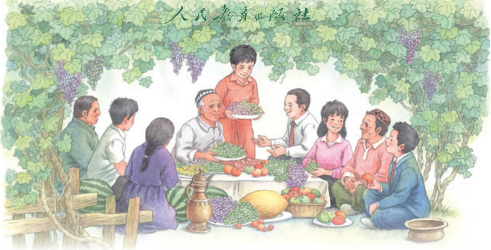

shōu xià lái de pú tao yǒu de yùn dào chéng shì qù yǒu de 收下来的葡萄，有的运到城市去，有的 yùn dào liàng fáng lǐ zhì chéng pú tao gān liàng fáng xiū zài shān pō shàng 运到晾房里制成葡萄干。晾房修在山坡上， sì miàn qiáng shàng yǒu xǔ duō xiǎo kǒng lǐ miàn dìng zhe xǔ duō mù jià 四面墙上有许多小孔，里面钉着许多木架 zi chéng chuàn de pú tao guà zài jià zi shàng lì yòng liú dòng de rè 子。成串的葡萄挂在架子上，利用流动的热 kōng qì ràng shuǐ fèn zhēng fā diào jiù chéng le pú tao gān zhè lǐ 空气，让水分蒸发掉，就成了葡萄干。这里 shēng chǎn de pú tao gān yán sè xiān wèi dào tián fēi cháng yǒu míng 生产的葡萄干颜色鲜，味道甜，非常有名。

pú tao gōu zhēn shì gè hǎo dì fang 葡萄沟真是个好地方。

pú táo gōu pō mì zhī dàn hào zú 葡萄沟坡密枝淡好族

gòu shōu shì gān dìng fèn yán wèi 够收市干钉分颜味 份份 枝枝 客客 城城 市市 孔孔 钉钉 味味

朗读课文，注意下面加点字的读音。种葡萄 好客 葡萄干 水分

为什么说“葡萄沟真是个好地方”？

读读下面的句子，照样子写一写。chuàn

葡萄一大串一大串地挂在绿叶底下，有红的、白jí的、紫的、淡绿的，五光十色，美丽极了。

公园里的花都开了，有桃花、杏花、迎春花，

下课了，同学们在操场上活动，，处处欢声笑语，热闹极了。

我们的祖国有数不清的好地方。

我们一起在地图上找一找，将来有机会去看看祖国的大好河山吧！

语文园地四

## 识字加油站

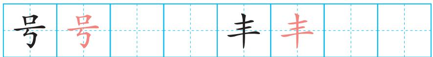

## 字词句运用

读一读，和同学交流你的发现。

白色 雪白 米白 奶白zǎo  
红色 火红 桃红 枣红é  
黃色 土黄 鹅黄 金黄mò  
绿色 草绿 翠绿 墨绿

我发现在“白”字前面加上“雪”“米”“奶”，可以用来形容不同的白色。

我还会说：“西瓜红、天蓝……”

## 人民教育出版社

你能说出加点词语在句中的意思吗？

fǎn

那美丽如画的山水，怎能不令人流连忘返？

八路军隐蔽在山里，敌人很难发现。

去还是不去？小明拿不定主意，很烦恼。

## 下面的事物像什么？看谁想得妙，说得多。

柳条 云朵 枫叶 xié 椅子 路灯 胡子 鞋

爸爸的鞋像小船。

弟弟的鞋像鸟窝。

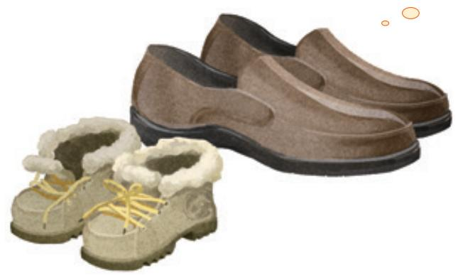

## 日积月累

yǒu shān jiē tú huà wú shuǐ bù wén zhāng

有山皆图画，无水不文章。

bái mǎ xī fēng sài shàng xìng huā yān yǔ jiāng nán

白马西风塞上，杏花烟雨江南。

qīng fēng míng yuè běn wú jià jìn shuǐ yuǎn shān jiē yǒu qíng

清风明月本无价，近水远山皆有情。

wù suǒ shān tóu shān suǒ wù tiān lián shuǐ wěi shuǐ lián tiān

雾锁山头山锁雾，天连水尾水连天。

## 写话

## 喜爱的玩具

每个人都有自己喜爱的玩具。你最喜爱的玩具是什么？它是什么样子的？你为什么喜欢它？先和同学交流，再写下来。

写的时候注意，一段话的开头要空两格，标点符号一般也要占一格。 A

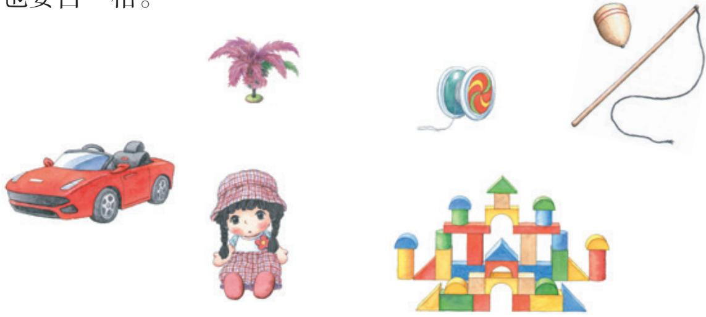

## 我爱阅读

## 画家乡①

孩子们爱家乡，也爱画自己美丽的家乡。

涛涛的家乡在海边。他画的海那么蓝，那么宽。一艘艘jiǎn船上装满了鱼和虾。那个在海边捡贝壳的孩子，就是涛涛。

山山的家乡在山里。她画的山那么高，水那么清。房前屋后都是又高又大kuà的树。画里的山山，挎着小竹篮，正要mó gū到树林里去采蘑菇呢。

平平的家乡在平原。她画的平原tǎn那么平坦，那么宽广。有金黄的稻子、yóu雪白的棉花，还有一大片一大片绿油油的菜地。屋前有鸡、鸭，屋后有几丛青翠的竹子。那个正在田野上奔跑的小女孩，就是平平。

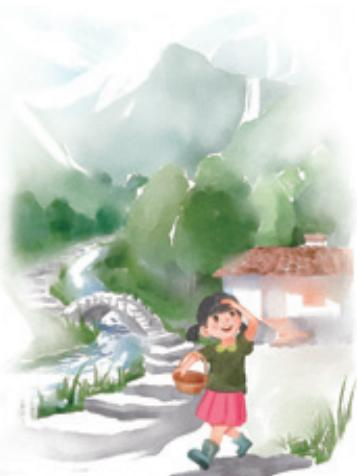

## áng sà ěr

昂萨尔的家乡在草原。他画的草原一眼望不到边。草长yōu xián pǐ jùn得又绿又密，羊在悠闲地吃草。一匹骏马从远处奔来，昂萨qí尔正骑在马上赶着羊群。

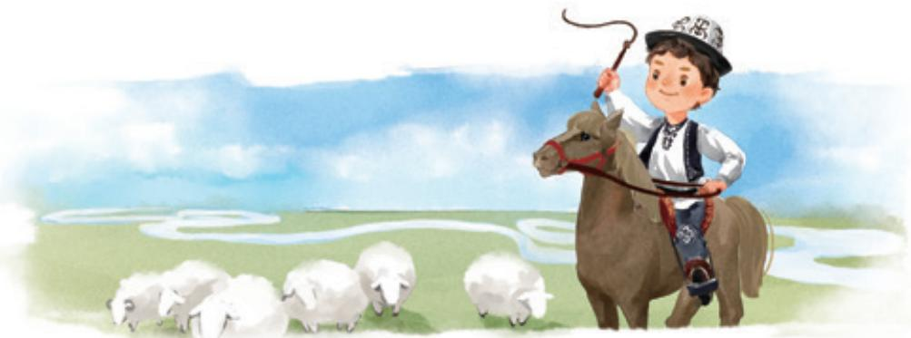

京京的家乡在城市。他画的城市那么美。宽宽的街道，lóu guǎn高高的楼房，还有好几个街心公园。那个正跑向图书馆的小男孩，就是京京。

小朋友，你的家乡一定也很美，请你画出来吧！

## zuò jǐng guān tiān 11 坐井观天 ①

qīng wā zuò zài jǐng lǐ xiǎo niǎo fēi lái luò zài jǐng yánshàng 青蛙坐在井里。小鸟飞来，落在井沿上。

qīng wā wèn xiǎo niǎo nǐ cóng nǎr lái ya 青蛙问小鸟：“你从哪儿来呀？”

xiǎo niǎo huí dá shuō wǒ cóng tiān shàng lái fēi le yì bǎi 小鸟回答说：“我从天上来，飞了一百 duō lǐ kǒu kě le xià lái zhǎo diǎnr shuǐ hē 多里，口渴了，下来找点儿水喝。”

qīng wā shuō péng you bié shuō dà huà le tiān bú guò 青蛙说：“朋友，别说大话了！天不过 jǐng kǒu nà me dà hái yòng fēi nà me yuǎn ma 井口那么大，还用飞那么远吗？”

xiǎo niǎo shuō nǐ nòng cuò le tiān wú biān wú jì dà 小鸟说：“你弄错了。天无边无际，大 de hěn na 得很哪！”

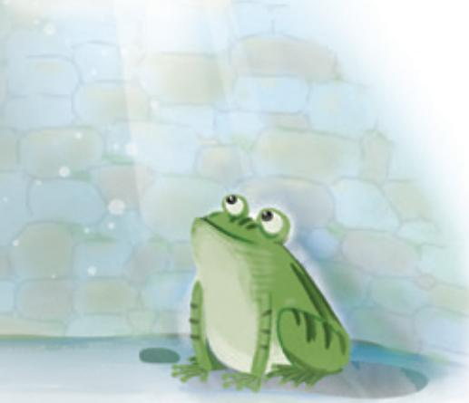

qīng wā xiào le shuō péng 青蛙笑了，说：“朋 you wǒ tiān tiān zuò zài jǐng lǐ 友，我天天坐在井里， yì tái tóu jiù néng kàn jiàn tiān wǒ 一抬头就能看见天。我 bú huì nòng cuò de 不会弄错的。”

①本文选自人民教育出版社《全日制十年制学校小学课本（试用本）语文第二册》，有改动。

## 人民教育出版社

xiǎo niǎo yě xiào le shuō péng you nǐ shì nòng cuò le 小鸟也笑了，说：“朋友，你是弄错了。 bú xìn nǐ tiào chū jǐng lái kàn yi kàn ba 不信，你跳出井来看一看吧。”

guān yán kě huà nòng cuò jì tái xìn 观沿渴话弄错际抬信

分角色朗读课文，读好下面的句子。

天不过井口那么大，还用飞那么远吗？

天无边无际，大得很哪！

不信，你跳出井来看一看吧。

小鸟和青蛙在争论什么？他们的说法为什么不一样？

选做：如果青蛙听了小鸟的话，跳出井口后会看到什么？请和同学交流。

# hán háo niǎo 寒号鸟 ①

shān jiǎo xià yǒu yì dǔ shí yá yá shàng yǒu yí dào fèng hán 山脚下有一堵石崖，崖上有一道缝，寒 háo niǎo jiù bǎ zhè dào fèng dàng zuò zì jǐ de wō shí yá qián miàn yǒu 号鸟就把这道缝当作自己的窝。石崖前面有 yì tiáo hé hé biān yǒu yì kē dà yáng shù yáng shù shàng zhù zhe xǐ 一条河，河边有一棵大杨树，杨树上住着喜 què hán háo niǎo hé xǐ què miàn duì miàn zhù zhe chéng le lín jū 鹊。寒号鸟和喜鹊面对面住着，成了邻居。

jǐ zhèn qiū fēng shù yè luò jìn dōng tiān kuài yào dào le 几阵秋风，树叶落尽，冬天快要到了。

yǒu yì tiān tiān qì qíng lǎng xǐ què yì zǎo fēi chū qù 有一天，天气晴朗。喜鹊一早飞出去， dōng xún xī zhǎo xián huí lái yì xiē kū cǎo jiù máng zhe zuò wō 东寻西找，衔回来一些枯草，就忙着做窝， zhǔn bèi guò dōng hán háo niǎo què zhǐ zhī dào chū qù wán lèi le jiù 准备过冬。寒号鸟却只知道出去玩，累了就 huí lái shuì jiào xǐ què shuō hán háo niǎo bié shuì le tiān qì 回来睡觉。喜鹊说：“寒号鸟，别睡了。天气 nuǎn huo gǎn kuài zuò wō 暖和，赶快做窝。”

hán háo niǎo bù tīng quàn gào tǎng zài yá fèng lǐ duì xǐ què shuō 寒号鸟不听劝告，躺在崖缝里对喜鹊说： shǎ xǐ què bú yào chǎo tài yáng gāo zhào zhèng hǎo shuì jiào “傻喜鹊，不要吵。太阳高照，正好睡觉。

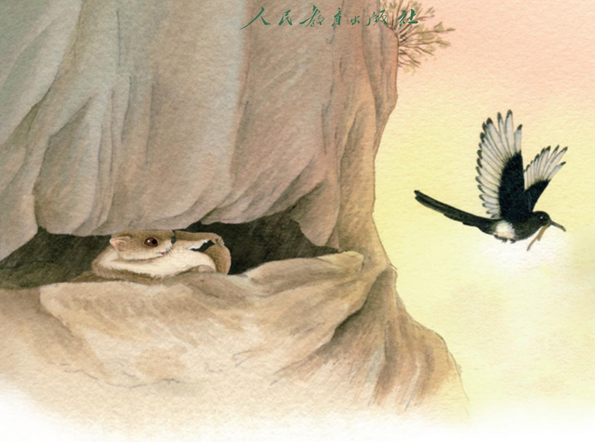

dōng tiān shuō dào jiù dào hán fēng hū hū de guā zhe xǐ què 冬天说到就到，寒风呼呼地刮着。喜鹊 zhù zài wēn nuǎn de wō lǐ hán háo niǎo zài yá fèng lǐ dòng de zhí dǎ 住在温暖的窝里。寒号鸟在崖缝里冻得直打 duō suo bù tíng de jiào zhe duō luō luō duō luō luō hán fēng 哆嗦，不停地叫着：“哆啰啰，哆啰啰，寒风 dòng sǐ wǒ míng tiān jiù zuò wō 冻死我，明天就做窝。 9

dì èr tiān qīng zǎo fēng tíng le tài yáng nuǎn nuǎn de hǎo xiàng 第二天清早，风停了，太阳暖暖的，好像 yòu shì chūn tiān le xǐ què lái dào yá fèng qián quàn hán háo niǎo chèn 又是春天了。喜鹊来到崖缝前劝寒号鸟：“趁 tiān qíng kuài zuò wō xiàn zài lǎn duò jiāng lái nán guò 天晴，快做窝。现在懒惰，将来难过。”

hán háo niǎo hái shi bù tīng quàn gào shēn shen lǎn yāo dá dào 寒号鸟还是不听劝告，伸伸懒腰，答道： shǎ xǐ què bié luō suo tiān qì nuǎn huo dé guò qiě guò “傻喜鹊，别啰唆。天气暖和，得过且过。”

hán dōng là yuè dà xuě fēn fēi běi fēng xiàng shī zi yí yàng 寒冬腊月，大雪纷飞。北风像狮子一样 kuáng hǒu yá fèng lǐ lěng de xiàng bīng jiào hán háo niǎochóng fù zhe āi 狂吼，崖缝里冷得像冰窖。寒号鸟重复着哀 háo duō luō luō duō luō luō hán fēng dòng sǐ wǒ míng tiān jiù 号：“哆啰啰，哆啰啰，寒风冻死我，明天就 zuò wō 做窝。”

tiān liàng le tài yáng chū lái le xǐ què zài zhī tóu hū huàn 天亮了，太阳出来了，喜鹊在枝头呼唤 hán háo niǎo kě shì hán háo niǎo yǐ jīng zài yè lǐ dòng sǐ le 寒号鸟。可是，寒号鸟已经在夜里冻死了。

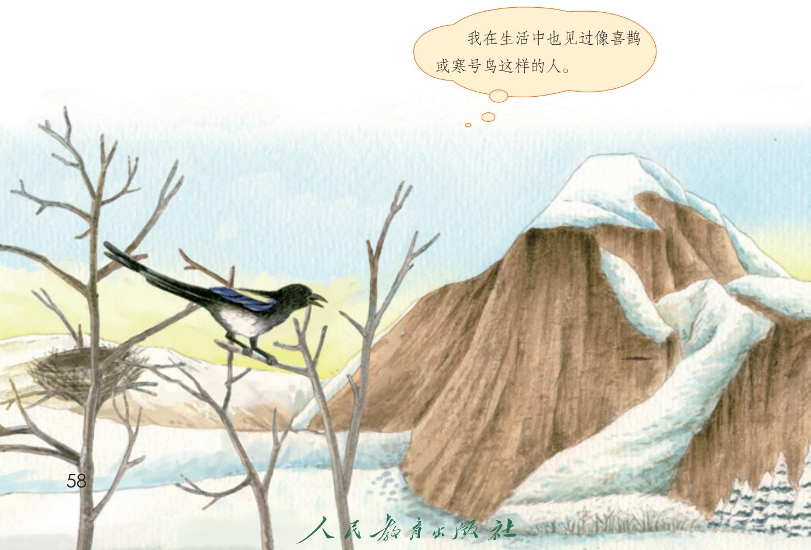

# háo dàng què xún kū què quàn guā sǐ 号当鹊寻枯却劝刮死

阵阵 做做

冻冻 第第

像像冷冷

冰冰 亮亮

分角色朗读课文。想一想：为什么喜鹊能住在温暖的窝里，寒号鸟却冻死了？

根据下面的提示，说说寒号鸟和喜鹊的故事。là冬天快要到了→冬天说到就到—→寒冬腊月

读一读，照样子说一说。

duōsuō 冻得直打哆嗦 mào hàn 热得直冒汗

jiào   
冷得像冰窖 zhēng lóng   
热得像蒸笼

人民教育出版社

# wǒ yào de shì hú lu 1③我要的是葫芦①

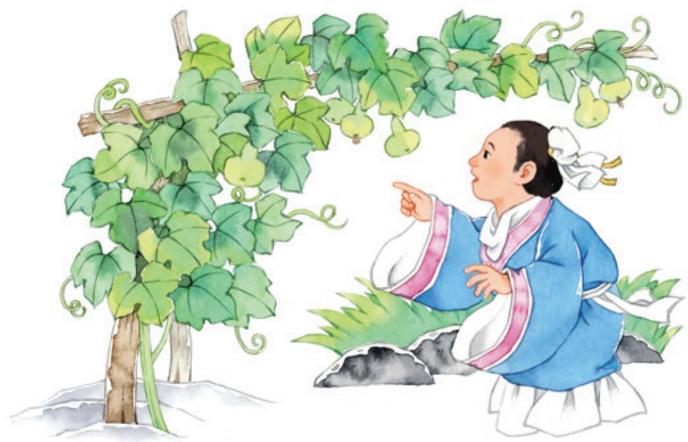

cóng qián yǒu gè rén zhòng le yì kē hú lu xì cháng de 从前，有个人种了一棵葫芦。细长的 hú lu téng shàng zhǎng mǎn le là yè hái kāi chū le jǐ duǒ xuě bái 葫芦藤上长满了绿叶，还开出了几朵雪白 de xiǎo huā huā xiè yǐ hòu téng shàng guà le jǐ gè xiǎo hú lu 的小花。花谢以后，藤上挂了几个小葫芦。 duō me kě ài de xiǎo hú lu a nà ge rén měi tiān dōu yào qù 多么可爱的小葫芦啊！那个人每天都要去 kàn jǐ cì 看几次。

# 人民教育出版社

yǒu yì tiān tā kàn jiàn yè zi shàng pá zhe yì xiē yá chóng 有一天，他看见叶子上爬着一些蚜虫， xīn lǐ xiǎng yǒu jǐ gè chóng zi pà shén me tā dīng zhe xiǎo hú lu 心里想，有几个虫子怕什么！他盯着小葫芦 zì yán zì yǔ de shuō wǒ de xiǎo hú lu kuài zhǎng a kuài zhǎng 自言自语地说：“我的小葫芦，快长啊，快长 a zhǎng de sài guò dà nán guā cái hǎo ne 啊！长得赛过大南瓜才好呢！

yí gè lín jū kàn jiàn le duì tā shuō nǐ bié guāng dīng zhe 一个邻居看见了，对他说：“你别光盯着 hú lu le yè zi shàng shēng le yá chóng kuài zhì yi zhì ba 葫芦了，叶子上生了蚜虫，快治一治吧！” nà ge rén gǎn dào hěn qí guài shuō shén me yè zi shàng de chóng 那个人感到很奇怪，说：“什么？叶子上的虫 hái yòng zhì wǒ yào de shì hú lu 还用治？我要的是葫芦。”

méi guò jǐ tiān yè zi shàng de yá chóng gèng duō le xiǎo hú 没过几天，叶子上的蚜虫更多了。小葫 lu màn màn de biàn huáng le yí gè yí gè dōu luò le 芦慢慢地变黄了，一个一个都落了。

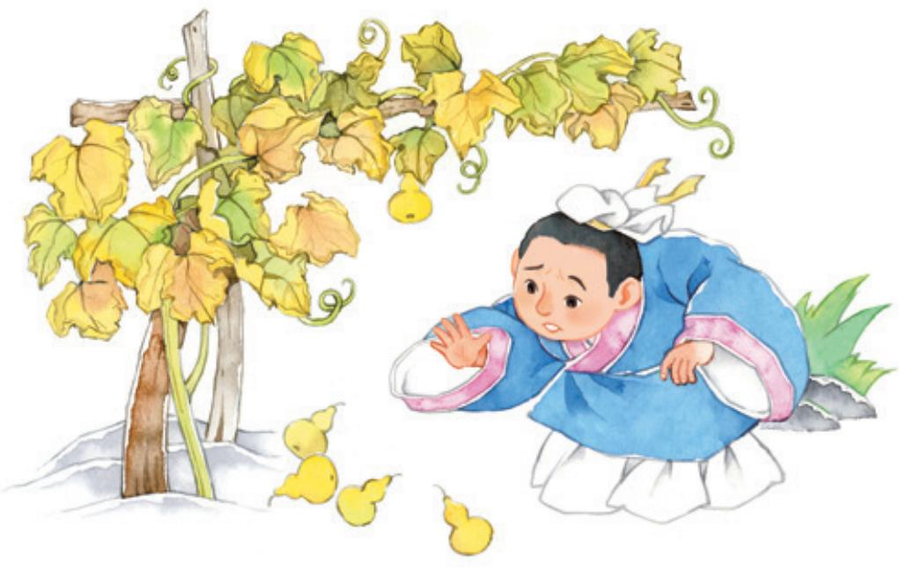

hú lú xiè yǐ dīng sài guài màn

葫芦谢以盯赛怪慢

种种棵棵

以|以|次|次

想想邻邻

居居吧吧

奇奇怪怪

朗读课文。想一想：种葫芦的人想要葫芦，为什么最后却一个也没得到？

读一读，注意句子不同的语气。

有几个虫子怕什么！

叶子上的虫还用治？

有几个虫子不可怕。

叶子上的虫不用治。

选做：“小葫芦慢慢地变黄了，一个一个都落了”，这时候种葫芦的人会想些什么，又会做些什么？

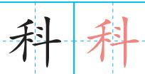  
fáng消防车

# 语文园地五

## 识字加油站

jiào

轿车

救护车

渔 船

  
轮船

# jiào jiù mó tuō fáng yú huò kē kǎo chá 轿救摩托防渔货科考察

## 字词句运用

读一读，注意加点的字，看谁读得准。

我会根据词语的意思来判断多音字的读音。

口号

每当

种子

好人

分别

号叫

当作

种地

好客

水分

全都

教师

没有

干枯

银行

首都

教书

沉没

干活

飞行

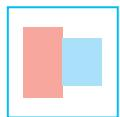

读一读，猜一猜词语的意思。

不言不语 只言片语 三言两语 千言万语háo guǎ mì豪言壮语 少言寡语 自言自语 甜言蜜语

注意下面句子中加点的词语，仿照例子在括号中加上合适的词语，再读一读。

细长的葫芦藤上长满了绿叶，还开出了几朵雪白的小花。

茂密的枝叶向四面展开，就像搭起了一个个绿色的péng  
凉棚。

（）天空飘着（）气球。

（）池塘开满（）荷花。

## 书写提示

有的字左边短，右边长；有的字左边长，右边短。

肥肥

如如

## 日积月累

shào nián bù zhī qín xué kǔ lǎo lái fāng zhī dú shū chí   
少年不知勤学苦，老来方知读书迟 yí rì dú shū yí rì gōng yí rì bù dú shí rì kōng   
一日读书一日功，一日不读十日空 shū shān yǒu lù qín wéi jìng xué hǎi wú yá kǔ zuò zhōu   
书山有路勤为径，学海无涯苦作舟。

## 口语交际

## 商 量

在生活中，有时候我们需要跟别人商量事情。比如，你想和小丽调换一下值日的时间，该怎样跟她商量呢？

小丽，我想跟你商量一件事情。我可以和你调换一下值日的时间吗？今天是我奶奶的生日，我想早一点儿回家。

不好意思，我今天也有事。

没关系，那我再问问别人吧！

遇到下面的情况，你会怎样跟别人商量？和同学说一说。

向同学借的书没有看完，想再多借几天。

最爱看的电视节目就要开始了，但爸爸正在看足球

比赛。

用合适的语气和别人商量。

把自己的想法说清楚。

# zhōu qiú jiàn 刻舟求剑 ①

从前，有个人坐船过江。一不小心，挂在他身上的宝xián剑掉进江里去了。那个人马上拿出小刀在船舷上刻了一个jì记号。

páng cuī lāo

旁边的人催他：“还不赶快捞！在船舷上刻记号有什么用啊？”

那个人不慌不忙地指了指刻的记号，说：“不用着急，àn宝剑是从这儿掉下去的，等船靠了岸，我就从这儿跳下去，准能把宝剑捞上来。”

①本文根据《吕氏春秋·察今》相关内容改写。

# bā jiǎo lóu shàng 14八角楼上 ①

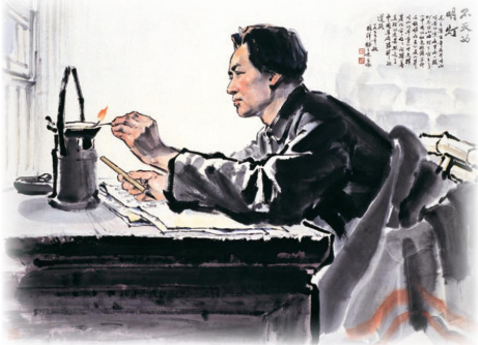  
（图）杨之光、鸥洋绘

zài jǐng gāng shān jiān kǔ dòuzhēng de nián dài máo zhǔ xí zhù zài 在井冈山艰苦斗争的年代，毛主席住在 máo píng cūn de bā jiǎo lóu měi dāng yè mù jiàng lín de shí hou bā 茅坪村的八角楼。每当夜幕降临的时候，八 jiǎo lóu shàng de dēng jiù liàng le 角楼上的灯就亮了。

zhè shì gè hán dōng là yuè de shēn yè máo zhǔ xí chuān zhe dān 这是个寒冬腊月的深夜，毛主席穿着单   
jūn yī pī zhe báo tǎn zi zuò zài zhú yǐ shàng xiě wén zhāng tā   
军衣，披着薄毯子，坐在竹椅上写文章。他   
yòu shǒu wò zhe bǐ zuǒ shǒu qīng qīng de bō le bō dēng xīn dēng guāng   
右手握着笔，左手轻轻地拨了拨灯芯，灯光

## 人民教育出版社

gèng jiā míng liàng le níng shì zhe zhè xīng xīng zhī huǒ máo zhǔ xí zài 更加明亮了。凝视着这星星之火，毛主席在 chén sī lián tǎn zi huá luò xià lái yě méi yǒu chá jué dào jiù zài 沉思，连毯子滑落下来也没有察觉到。就在 zhè zhǎn qīng yóu dēng xià máo zhǔ xí xiě xià le xǔ duō guāng huī zhù 这盏清油灯下，毛主席写下了许多光辉著 zuò zhào liàng le zhōng guó gé mìng shèng lì de dào lù 作，照亮了中国革命胜利的道路。

lóu jiān dòu dài lín là jūn báo zhāng 楼艰斗代临腊军薄章

wò níng jué yóu huī gé mìng lì 握凝觉油辉革命利

楼楼 代代 穿穿 视视 利利 路路

朗读课文。说说毛主席是怎样工作的。

读下面的句子，体会加点词语的意思。

每当夜幕降临的时候，八角楼上的灯就亮了。

这是个寒冬腊月的深夜，毛主席穿着单军衣，披着薄毯子，坐在竹椅上写文章。

凝视着这星星之火，毛主席在沉思，连毯子滑落下来也没有察觉到。

# zhū dé de biǎn dan 15 朱德的扁担

nián zhū dé tóng zhì dài lǐng duì wu dào jǐng gāng shān 1928年，朱德同志带领队伍到井冈山， gēn máo zé dōngtóng zhì dài lǐng de duì wu huì shī le hóng jūn zài shān 跟毛泽东同志带领的队伍会师了。红军在山 shàng shān xià bù yuǎn chù jiù shì dí rén 上，山下不远处就是敌人。

hóng jūn yào gǒng gù jǐng gāng shān gēn jù dì fěn suì dí rén de 红军要巩固井冈山根据地，粉碎敌人的 wéi gōng xū yào chǔ bèi zú gòu de liáng shi jǐng gāng shān shàng shēng 围攻，需要储备足够的粮食。井冈山上生 chǎn de liáng shi bù duō cháng chángyào chōu chū yì xiē rén dào shān xià níng 产的粮食不多，常常要抽出一些人到山下宁 gāng de máo píng qù tiāo liáng cóng jǐng gāng shān dào máo píng lái huí yǒu 冈的茅坪去挑粮。从井冈山到茅坪，来回有 wǔ liù shí lǐ shān gāo lù dǒu fēi cháng nán zǒu kě shì měi cì 五六十里，山高路陡，非常难走。可是每次 tiāo liáng dà jiā dōu zhēng zhe qù 挑粮，大家都争着去。

zhū dé tóng zhì yě gēn zhàn shì men yí kuàir qù tiāo liáng tā 朱德同志也跟战士们一块儿去挑粮。他   
chuān zhe cǎo xié dài zhe dǒu lì tiāo qǐ liáng shi gēn dà jiā yí 穿着草鞋，戴着斗笠，挑起粮食，跟大家一   
kuàir pá shān bái tiān tiāo liáng pá shān wǎn shang hái cháng cháng zhěng   
块儿爬山。白天挑粮爬山，晚上还常常整 yè zhěng yè de yán jiū zěn yàng gēn dí rén dǎ zhàng dà jiā kàn le xīn 夜整夜地研究怎样跟敌人打仗。大家看了心 téng jiù bǎ tā nà gēn biǎn dan cáng le qǐ lái bú liào zhū dé 疼，就把他那根扁担藏了起来。不料，朱德 tóng zhì yòu zhǎo lái yì gēn biǎn dan xiě shàng zhū dé de biǎn dan 同志又找来一根扁担，写上“朱德的扁担 wǔ gè zì   
五个字。

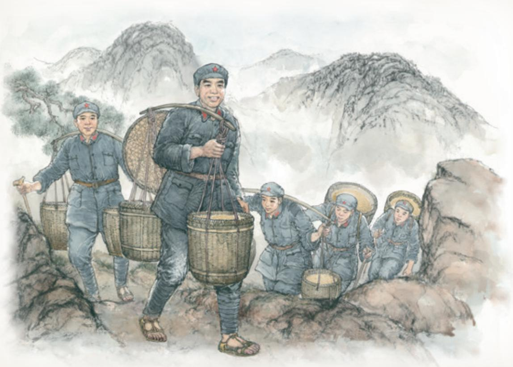

dà jiā jiàn le yuè fā jìng ài zhū dé tóng zhì bù hǎo yì 大家见了，越发敬爱朱德同志，不好意 si zài cáng tā de biǎn dan le 思再藏他的扁担了。

zhū dé biǎn dàn tóng zhì wǔ dí gēn jù chōu dǒu xié téng jìng 朱德扁担同志伍敌根据抽陡鞋疼敬

同同

志志

军军

敌敌

常 常

非非

每每

战战

士士

戴 戴

朗读课文。

说一说：战士们为什么要把朱德同志的扁担藏起来？大家为什么越发敬爱朱德同志了？

读一读，连一连。

挑起穿着戴着

lì 草鞋 斗笠 粮食

# nán wàng de pō shuǐ jié 16难忘的泼水节

huǒ hóng huǒ hóng de fèng huáng huā kāi le dǎi zú rén mín yì nián 火红火红的凤凰花开了，傣族人民一年 yí dù de pō shuǐ jié yòu dào le 一度的泼水节又到了。

nián de pō shuǐ jié dǎi zú rén mín tè bié gāo xìng 1961年的泼水节，傣族人民特别高兴，   
yīn wèi jìng ài de zhōu ēn lái zǒng lǐ hé tā men yì qǐ guò pō shuǐ jié   
因为敬爱的周恩来总理和他们一起过泼水节。

nà tiān zǎo chen rén men qiāo qǐ xiàng jiǎo gǔ cóng sì miàn bā 那天早晨，人们敲起象脚鼓，从四面八 fāng gǎn lái le wèi le huān yíng zhōu zǒng lǐ rén men zài dì shàng sǎ 方赶来了。为了欢迎周总理，人们在地上撒 mǎn le fèng huáng huā de huā bàn hǎo xiàng pū shàng le xiān hóng de dì 满了凤凰花的花瓣，好像铺上了鲜红的地 tǎn yì tiáo tiáo lóng chuán shǐ guò jiāng miàn yí chuàn chuàn huā pào shēng shàng 毯。一条条龙船驶过江面，一串串花炮升上 tiān kōng rén men huān hū zhe zhōu zǒng lǐ lái le 天空。人们欢呼着：“周总理来了！”

zhōu zǒng lǐ shēn chuān duì jīn bái guà kā fēi sè cháng kù tóu 周总理身穿对襟白褂、咖啡色长裤，头   
shàng bāo zhe yì tiáo shuǐ hóng sè tóu jīn xiào róng mǎn miàn de lái dào   
上包着一条水红色头巾，笑容满面地来到   
rén qún zhōng tā jiē guò yí miàn xiàng jiǎo gǔ qiāo qǐ huān lè de gǔ   
人群中。他接过一面象脚鼓，敲起欢乐的鼓 diǎn cǎi zhe fèng huáng huā pū chéng de dì tǎn tóng dǎi zú rén mín 点，踩着凤凰花铺成的“地毯”，同傣族人民 yì qǐ tiào wǔ   
一起跳舞。

kāi shǐ pō shuǐ le zhōu zǒng lǐ yì shǒu duān zhe chéng mǎn qīng shuǐ 开始泼水了。周总理一手端着盛满清水 de yín wǎn yì shǒu ná zhe bǎi shù zhī zhàn le shuǐ xiàng rén men pō 的银碗，一手拿着柏树枝蘸了水，向人们泼 sǎ wèi rén men zhù fú dǎi zú rén mín yì biān huān hū yì biān 洒，为人们祝福。傣族人民一边欢呼，一边 xiàng zhōu zǒng lǐ pō shuǐ zhù fú tā jiàn kāng cháng shòu 向周总理泼水，祝福他健康长寿。

qīng qīng de shuǐ pō α sǎ a zhōu zǒng lǐ hé dǎi zú 清清的水，泼啊，洒啊！周总理和傣族 rén mín xiào a tiào a shì nà me kāi xīn 人民笑啊，跳啊，是那么开心！

duō me xìng fú a nián de pō shuǐ jié多么幸福啊，1961年的泼水节！

duō me lìng rén nán wàng a nián de pō shuǐ jié多么令人难忘啊，1961年的泼水节！

pō mín dù tè zhōu ēn qiāo pū lóng 泼民度特周恩敲铺龙 chuàn róng cǎi shǐ chéng wǎn zhù shòu 串容踩始盛碗祝寿

难难 忘忘 民民 因因 理理 串串 裤裤 令令

朗读课文。用下面的词语，说说周总理是怎样和傣族人民一起过泼水节的。fèng huáng象脚鼓 凤凰花 银碗 柏树枝

看看插图，从课文中找出描写周总理样子的句子读一读。

# liú hú lán ⑦刘胡兰①

nián yuè rì tiān yīn chén chén de guó mín dǎng 1947年1月12日，天阴沉沉的，国民党 fǎn dòng pài bāo wéi le yún zhōu xī cūn yóu yú pàn tú de chū mài 反动派包围了云周西村。由于叛徒的出卖， nián qīng de gòng chǎn dǎng yuán liú hú lán bèi bǔ le guān zài yí zuò 年轻的共产党员刘胡兰被捕了，关在一座 miào lǐ 庙里。

dí rén wèn liú hú lán xiàn zài yǒu rén gòng chū nǐ shì gòng 敌人问刘胡兰：“现在有人供出你是共   
chǎn dǎng yuán nǐ men cūn lǐ hái yǒu shuí shì liú hú lán huí dá   
产党员！你们村里还有谁是？”刘胡兰回答： jiù wǒ yí gè dí rén xiǎng shōu mǎi liú hú lán duì tā shuō 就我一个！”敌人想收买刘胡兰，对她说： shuō chū lái jiù gěi nǐ yí fèn dì liú hú lán dà shēng huí   
“说出来，就给你一份地。”刘胡兰大声回   
dá gěi wǒ yí gè jīn rén wǒ yě bù shuō dí rén yòu wēi   
答：“给我一个金人，我也不说！”敌人又威   
xié tā shuō bù shuō jiù dǎ sǐ nǐ liú hú lán fèn nù de huí   
胁她说：“不说就打死你！”刘胡兰愤怒地回   
dá dǎ sǐ yě bù shuō liú hú lán xiànggāng tiě zhù chéng shì de   
答：“打死也不说！”刘胡兰像钢铁铸成似的，

yì diǎnr yě bú dòng yáo 一点儿也不动摇。

dí rén bǎ liú hú lán lā dào miào mén kǒu de guǎng chǎng shàng 敌人把刘胡兰拉到庙门口的广场上， dāng zhe tā hé xiāng qīn men de miàn zhá sǐ le bèi bǔ de liù míng gé 当着她和乡亲们的面，铡死了被捕的六名革 mìng qún zhòng dí rén zhǐ zhe xiě lín lín de zhá dāo shuō zài bù 命群众。敌人指着血淋淋的铡刀说：“再不 shuō yě zhá sǐ nǐ liú hú lán tǐng qǐ xiōng táng shuō yào 说，也铡死你！”刘胡兰挺起胸膛说：“要 shā yào kǎn yóu nǐ men pà sǐ bù dāng gòng chǎn dǎng tā yíng 杀要砍由你们，怕死不当共产党！”她迎 zhe hū hū de běi fēng tà zhe liè shì de xiān xuè zǒu dào zhá dāo 着呼呼的北风，踏着烈士的鲜血，走到铡刀 qián liú hú lán guāng róng de xī 前。刘胡兰光荣地牺 shēng le dāng shí tā hái bú dào 牲了，当时她还不到 shí wǔ suì   
十五岁。

máo zhǔ xí tīng dào zhè 毛主席听到这 ge xiāo xi qīn bǐ wèi tā tí 个消息，亲笔为她题 cí shēng de wěi dà sǐ de 词：“生的伟大，死的 guāng róng 光荣。”

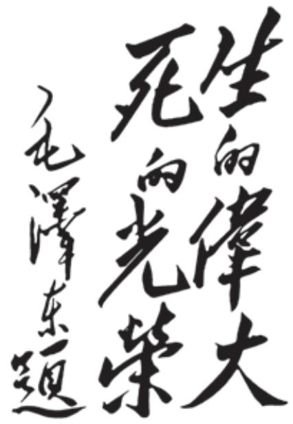

liú lán pài yóu yú mài yuán bǔ mǎi shì tà liè róng suì tí 刘兰派由于卖员捕买似踏烈荣岁题

反反

村村

由由

于于

员员

被被

声声

岁岁

消消

息息

朗读课文。说说从哪些地方可以看出刘胡兰在敌人面前“一点儿也不动摇”。

联系上下文，说说加点词语的意思。

敌人想收买刘胡兰。

wēi xié

敌人又威胁她说：“不说就打死你！”

xī shēng

刘胡兰光荣地牺牲了，当时她还不到十五岁。

## 拓展活动

读了革命先辈的故事，我知道今天的幸福生活来之不易。

我还想去找更多革命先辈的故事读一读，再讲给别人听。

## 语文园地六

## 识字加油站

我能根据字形特点判断用哪个字。

fēng 山( )

bào chǎo爆（）

锋峰蜂

mìfēng蜜（）

幕墓慕

（）名

zhēng chǎo争（）

fēng刀（）

吵抄炒

chāo摘（）

mù （)地

mù()布

锋蜜峰蜂爆争抄炒幕墓慕

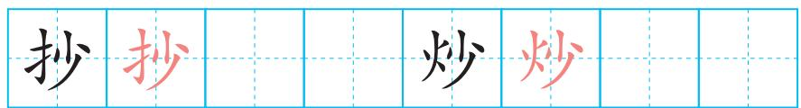

## 字词句运用

读一读，和同学交流你的发现。

包—饱抱炮

方—放防房

青—清晴情

马—妈蚂吗

我发现“妈、蚂、吗”的读音和“马”很接近。

我认识的一些字也有这样的特点，如“份、纷”的读音和“分”很接近。

## 日积月累

yǒu zhì zhě shì jìng chéng hòu hàn shū 有志者事竟成。 《后汉书》 zhì dāng cún gāo yuǎn zhū gě liàng 志当存高远。 ——诸葛亮 qióng qiě yì jiān bú zhuì qīng yún zhī zhì 穷且益坚，不坠青云之志。

wáng bó 王勃

## 写话

## 学写留言条

你有事情想告诉别人，那个人刚好不在，暂时又联系不上，怎么办呢？这时候可以写张留言条。

先写留言条的标题。

留言条

再写是留给谁的。

妈妈：

然后写有什么事。

佳佳约我去他家看书。我晚饭前回来。

最后写自己的名字和时间。

小欣

11月4日下午

从下面选择一种情况，写一张留言条。

去办公室还书，老师不在。

要和爷爷一起去超市，爸爸还没回家。

# 王二小①

王二小是儿童团员。他常常一边放牛，一边替八路军shào放哨。

有一天，日寇来扫荡，走到山口迷了路。敌人看见王二小在山坡上放牛，就叫他带路。

王二小装着顺从的样子走在前面，把敌人带进了八路军 mái fú 的埋伏圈。

nǎo xiū nù cán rěn shā yīng敌人发现上了当，恼羞成怒，残忍地杀害了小英雄王二小。

xùn sù chōng miè这时候，八路军迅速地冲出来，消灭了全部敌人。

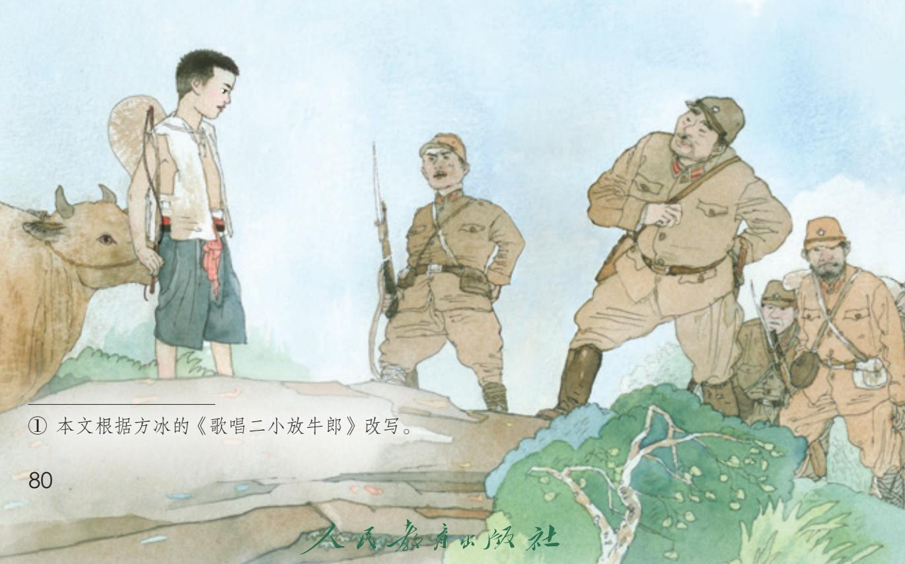

第七单元·阅读

# gǔ shī èr shǒu 18古诗二首

江 难雪

táng liǔ zōng yuán [唐]柳宗元

qiān shān niǎo fēi jué 千山鸟飞绝， wàn jìng rén zōng miè 万径人踪灭。 gū zhōu suō lì wēng 孤舟蓑笠翁， dú diào hán jiāng xuě 独钓寒江雪。

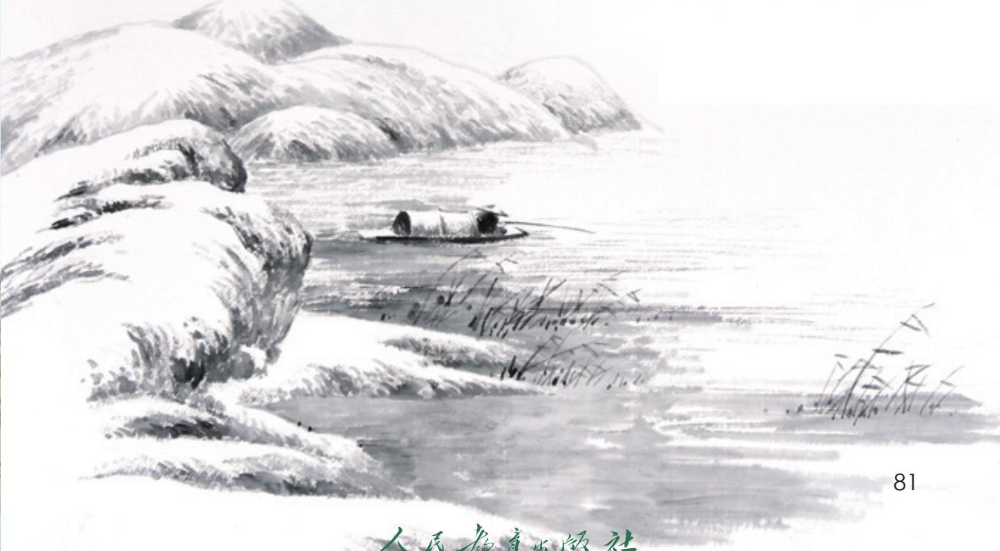

收勤歌

běi cháo mín gē 北朝民歌

chì lè chuān yīn shān xià 敕勒川，阴山下，

tiān sì qióng lú lǒng gài sì yě 天似穹庐，笼盖四野。

tiān cāng cāng yě máng máng 天苍苍，野茫茫，

fēng chuī cǎo dī xiàn niú yáng 风吹草低见牛羊。

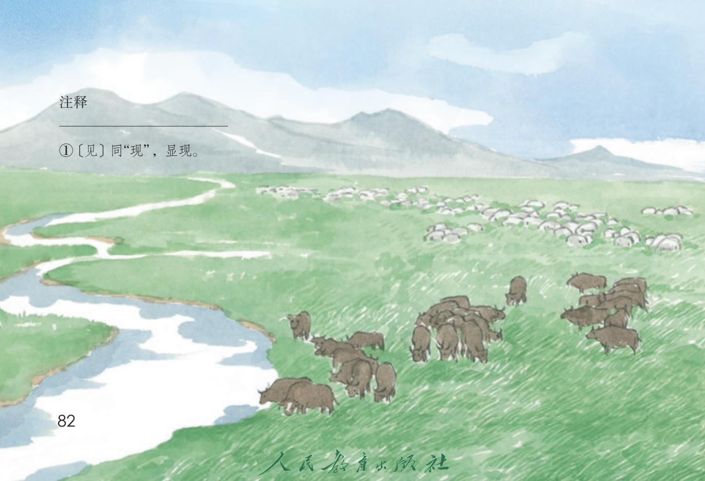

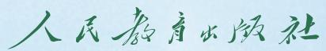

jué jìng zōng miè zhōu diào sì lú lǒng gài cāng máng 绝径踪灭舟钓似庐笼盖苍茫

绝绝灭灭

舟舟独独

阴阴似|似

野野低低

朗读课文。背诵课文。

读诗句，想画面，再用自己的话说一说。

◇ 千山鸟飞绝，万径人踪灭。

天苍苍，野茫茫，风吹草低见牛羊。

# wù zài nǎ lǐ 19 雾在哪里 ①

cóng qián yǒu yí piàn wù tā shì gè táo qì de hái zi 从前有一片雾，他是个淘气的孩子。

yǒu yì tiān wù fēi dào hǎi shàng 有一天，雾飞到海上。

wǒ yào bǎ dà hǎi cáng qǐ lái yú shì tā bǎ dà hǎi “我要把大海藏起来。”于是，他把大海 cáng le qǐ lái wú lùn shì hǎi shuǐ chuán zhī hái shi lán sè de 藏了起来。无论是海水、船只，还是蓝色的 yuǎn fāng dōu kàn bú jiàn le 远方，都看不见了。

xiàn zài wǒ yào bǎ tiān kōng lián tóng tài yáng yì qǐ cáng qǐ “现在我要把天空连同太阳一起藏起 lái yú shì tā bǎ tiān kōng lián tóng tài yáng yì qǐ cáng le qǐ 来。”于是，他把天空连同太阳一起藏了起 lái shà shí sì zhōu biàn àn le wú lùn shì tiān kōng hái shi 来。霎时，四周变暗了，无论是天空，还是 tiān kōng zhōng de tài yáng dōu kàn bú jiàn le 天空中的太阳，都看不见了。

wù lái dào àn biān 雾来到岸边。

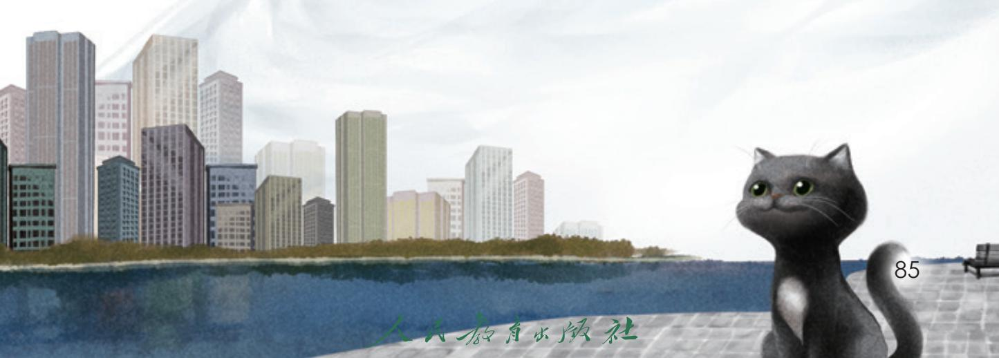

## 人民教育出版社

xiàn zài wǒ yào bǎ hǎi àn cáng qǐ lái wù “现在我要把海岸藏起来。”雾 bǎ hǎi àn cáng le qǐ lái tóng shí yě bǎ chéng shì cáng 把海岸藏了起来，同时也把城市藏 le qǐ lái fáng wū jiē dào shù mù qiáoliáng 了起来。房屋、街道、树木、桥梁， shèn zhì xíng rén hé xiǎo hēi māo wù bǎ yí qiè dōu cáng 甚至行人和小黑猫，雾把一切都藏 le qǐ lái shén me dōu kàn bú jiàn le 了起来，什么都看不见了。

tā duǒ dào chéng shì de shàng kōng shuō dào 他躲到城市的上空，说道： xiàn zài wǒ gāi bǎ shuí cáng qǐ lái ne kàn “现在，我该把谁藏起来呢？”看 lái zài yě méi yǒu kě cáng de le 来，再也没有可藏的了。

wǒ yào bǎ zì jǐ cáng qǐ lái “我要把自己藏起来。”

bù jiǔ dà hǎi lián tóng chuán zhī tiān kōng lián 不久，大海连同船只，天空连   
tóng tài yáng hǎi àn lián tóng chéng shì jiē dào lián tóng   
同太阳，海岸连同城市，街道连同   
fáng wū hé qiáo liáng dōu lù chū lái le lù shàng zǒu   
房屋和桥梁，都露出来了。路上走

## 人民教育出版社

zhe xíng rén xiǎo hēi māo yě chū xiàn le tā yáo zhe hēi wěi ba 着行人。小黑猫也出现了，它摇着黑尾巴， yōu xián de sàn bù   
悠闲地散步。

wù ne xiāo shī le bù zhī dào nǎ lǐ qù le 雾呢？消失了，不知到哪里去了。

lùn àn àn jiē liáng shèn zhì qiè duǒ gāi yōu xián sàn shī 论暗岸街梁甚至切躲该悠闲散失

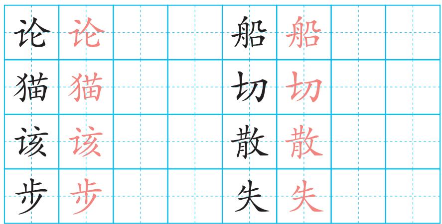

朗读课文，读好雾说话时的语气。

结合课文内容说一说：雾都把什么藏了起来？藏起来之后是什么样的？

课文说雾“是个淘气的孩子”，在你看来，雾又是什么呢？

# xuě hái zi

# 雪孩子

xuě xià gè bù tíng yì lián xià le hǎo jǐ tiān 雪，下个不停，一连下了好几天。

zhè tiān zǎo shang tiān qíng le tù mā ma yào chū mén qù 这天早上，天晴了，兔妈妈要出门去。 xiǎo bái tù rǎng qǐ lái mā mα mā mα wǒ yě yào qù 小白兔嚷起来：“妈妈，妈妈，我也要去！”

tù mā ma shuō hǎo hái zi mā mα yǒu shì nǐ bù néng 兔妈妈说：“好孩子，妈妈有事，你不能 gēn zhe qù tù mā ma zài mén wài de kòng dì shàng gěi xiǎo bái tù 跟着去。”兔妈妈在门外的空地上给小白兔 duī le gè xuě hái zi xiǎo bái tù yǒu le xiǎo huǒ bàn jiù bù gēn 堆了个雪孩子。小白兔有了小伙伴，就不跟 mā ma qù le 妈妈去了。

①本文作者嵇鸿，选作课文时有改动。

xiǎo bái tù tiào wǔ gěi xuě hái zi kàn chàng gē gěi xuě hái zi 小白兔跳舞给雪孩子看，唱歌给雪孩子 tīng tā wán lèi le jiù huí jiā qù shuì wǔ jiào wū zi lǐ 听。他玩累了，就回家去睡午觉。“屋子里 zhēn lěng gǎn kuài wǎng huǒ duī lǐ tiān bǎ chái ba 真冷，赶快往火堆里添把柴吧！

xiǎo bái tù tiān le chái bǎ huǒ shāo de wàng wàng de wū zi 小白兔添了柴，把火烧得旺旺的，屋子 lǐ jiàn jiàn nuǎn huo le tā tǎng zài chuáng shàng bì shàng yǎn jing yí 里渐渐暖和了。他躺在床上，闭上眼睛，一 huìr jiù shuì zháo le 会儿就睡着了。

huǒ yuè shāo yuè wàng āi yā huǒ bǎ páng biān de chái duī shāo 火越烧越旺。哎呀，火把旁边的柴堆烧 zháo le xiǎo bái tù shuì de zhèng xiāng tā yì diǎnr yě bù zhī dào 着了！小白兔睡得正香，他一点儿也不知道。

bù hǎo le xiǎo bái tù jiā zháo huǒ le xuě hái zi “不好了！小白兔家着火了！”雪孩子 kàn jiàn cóng xiǎo bái tù jiā de chuāng hu lǐ mào chū hēi yān cuān chū huǒ 看见从小白兔家的窗户里冒出黑烟，蹿出火 xīng tā yì biān hǎn yì biān xiàng xiǎo bái tù jiā pǎo qù 星。他一边喊，一边向小白兔家跑去。

xiǎo bái tù xiǎo bái tù nǐ zài nǎ lǐ xuě hái zi “小白兔，小白兔！你在哪里？”雪孩子 chōng jìn wū lǐ mào zhe qiàng rén de yān tàng rén de huǒ zhǎo wa 冲进屋里，冒着呛人的烟、烫人的火，找哇 zhǎo wa zhōng yú zhǎo dào le xiǎo bái tù tā lián máng bǎ xiǎo bái tù 找哇，终于找到了小白兔。他连忙把小白兔 bào qǐ lái pǎo dào wū wài 抱起来，跑到屋外。

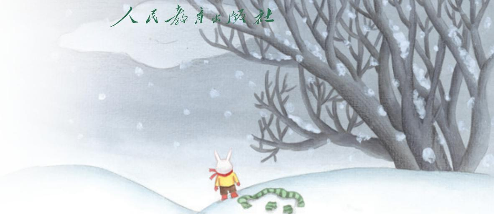

xiǎo bái tù dé jiù le xuě hái zi què hún shēn shuǐ lín lín de 小白兔得救了，雪孩子却浑身水淋淋的。

zhè shí hou shù lín lǐ de xiǎo hóu zi xiǎo shān yáng dōu gǎn lái 这时候，树林里的小猴子、小山羊都赶来 jiù huǒ le bù yí huìr dà jiā jiù bǎ huǒ pū miè le 救火了。不一会儿，大家就把火扑灭了。

tù mā ma huí lái le jī dòng de shuō xiè xie dà jiā lái 兔妈妈回来了，激动地说：“谢谢大家来 jiù huǒ jiù le xiǎo bái tù xiè xie dà jiā 救火，救了小白兔，谢谢大家！”

yí shì shuí jiù le xiǎo bái tù xiǎo dòng wù men shuō “咦，是谁救了小白兔？”小动物们说， zhēn děi xiè xie tā ne “真得谢谢他呢！”

zhè shí jiù xiǎo bái tù de xuě hái zi bú jiàn le tā yǐ 这时，救小白兔的雪孩子不见了。他已 jīng huà chéng shuǐ le 经化成水了。

bù xuě hái zi hái zài ne qiáo tài yáng shài zhe shài zhe 不，雪孩子还在呢！瞧，太阳晒着晒着，   
tā biàn chéng le hěn qīng hěn qīng de shuǐ qì fēi yα fēi yα fēi   
他变成了很轻很轻的水汽。飞呀，飞呀，飞   
shàng tiān kōng biàn chéng le yì duǒ bái yún yì duǒ měi lì de bái yún   
上天空，变成了一朵白云，一朵美丽的白云。

要要

伙伙

伴伴

歌歌

得得

闭闭

忙忙

谁谁

汽汽

朗读课文。

读一读，比一比。

雪孩子变成了水汽。

雪孩子变成了水汽，很轻很轻的水汽。

雪孩子变成了一朵白云。

雪孩子变成了一朵白云，一朵美丽的白云。

看着雪孩子变成了白云，小白兔会想些什么呢？想一想，再写下来。

shù è zhǎo zé níng gàng gǎn 跟踪 洗漱 饥饿 沼泽 安宁 杠杆 dòng kù zhá gāo huáng 栋梁 买卖 车库 闸门 羊羔 蝗虫

# 语文园地七

## 识字加油站

读一读，你还能说出这样的词语吗？

shù è zhǎo zé níng gàng gǎn dòng kù zhá gāo huáng 漱饿沼泽宁杠杆栋库闸羔蝗

<table><tr><td rowspan=1 colspan=1></td><td rowspan=1 colspan=1></td><td rowspan=1 colspan=1></td><td rowspan=1 colspan=1></td><td rowspan=1 colspan=1></td><td rowspan=1 colspan=1></td><td rowspan=1 colspan=1></td><td rowspan=1 colspan=1></td><td rowspan=1 colspan=1>h</td><td rowspan=1 colspan=1></td><td rowspan=1 colspan=1></td><td rowspan=1 colspan=1></td><td rowspan=1 colspan=1></td><td rowspan=1 colspan=1></td><td rowspan=1 colspan=1></td><td rowspan=1 colspan=1></td></tr><tr><td rowspan=1 colspan=1></td><td rowspan=1 colspan=1></td><td rowspan=1 colspan=1></td><td rowspan=1 colspan=1></td><td rowspan=1 colspan=1></td><td rowspan=1 colspan=1></td><td rowspan=1 colspan=1></td><td rowspan=1 colspan=1></td><td rowspan=1 colspan=1>2</td><td rowspan=1 colspan=1></td><td rowspan=1 colspan=1></td><td rowspan=1 colspan=1></td><td rowspan=1 colspan=1></td><td rowspan=1 colspan=1></td><td rowspan=1 colspan=1></td><td rowspan=1 colspan=1></td></tr><tr><td rowspan=1 colspan=1></td><td rowspan=1 colspan=1></td><td rowspan=1 colspan=1></td><td rowspan=1 colspan=1></td><td rowspan=1 colspan=1></td><td rowspan=1 colspan=1></td><td rowspan=1 colspan=1></td><td rowspan=1 colspan=1></td><td rowspan=1 colspan=2>庆</td><td rowspan=1 colspan=1></td><td rowspan=1 colspan=1></td><td rowspan=1 colspan=1></td><td rowspan=1 colspan=1></td><td rowspan=1 colspan=1></td><td rowspan=1 colspan=1></td></tr><tr><td rowspan=1 colspan=1></td><td rowspan=1 colspan=1></td><td rowspan=1 colspan=1></td><td rowspan=1 colspan=1></td><td rowspan=1 colspan=1></td><td rowspan=1 colspan=1></td><td rowspan=1 colspan=1></td><td rowspan=1 colspan=1></td><td rowspan=1 colspan=2></td><td rowspan=1 colspan=1></td><td rowspan=1 colspan=1></td><td rowspan=1 colspan=1></td><td rowspan=1 colspan=1></td><td rowspan=1 colspan=1></td><td rowspan=1 colspan=1></td></tr></table>

## 字词句运用

用部首查字法查下面的字，并填一填。

<table><tr><td rowspan=1 colspan=1>要查的字</td><td rowspan=1 colspan=1>部首</td><td rowspan=1 colspan=1>部首页码</td><td rowspan=1 colspan=1>除去部首有几画</td><td rowspan=1 colspan=1>字的页码</td><td rowspan=1 colspan=1>读音</td><td rowspan=1 colspan=1>组词</td></tr><tr><td rowspan=1 colspan=1></td><td rowspan=1 colspan=1></td><td rowspan=1 colspan=1></td><td rowspan=1 colspan=1></td><td rowspan=1 colspan=1></td><td rowspan=1 colspan=1></td><td rowspan=1 colspan=1></td></tr><tr><td rowspan=1 colspan=1></td><td rowspan=1 colspan=1></td><td rowspan=1 colspan=1></td><td rowspan=1 colspan=1></td><td rowspan=1 colspan=1></td><td rowspan=1 colspan=1></td><td rowspan=1 colspan=1></td></tr><tr><td rowspan=1 colspan=1></td><td rowspan=1 colspan=1></td><td rowspan=1 colspan=1></td><td rowspan=1 colspan=1></td><td rowspan=1 colspan=1></td><td rowspan=1 colspan=1></td><td rowspan=1 colspan=1></td></tr></table>

我发现很多独体字的部首是它的第一笔。

我把我知道的部首整理了出来，以后查字典就会更快了。

读一读，注意加点的字。你整理了哪些容易写错的字？和同学交流。

加点的字我曾经写错过。我把正确的写在改错本上，会经常看一看。

我把容易弄混的字作比较，并分类整理。

棉 被·领·步 带散

地代

带后.见 彩以·再

果汽·做· 园·水事 家 体家

## 你见过下面这些词语描写的景象吗？选一两个，跟同学说一说当时的情景。

云开雾散 liáo 云雾缭绕 wēi 微风习习 xiào 寒风呼啸 冰天雪地 é 鹅毛大雪 风雨交加 míng 电闪雷鸣

读读下面的句子，说说有趣在哪里。

◇ “我要把大海藏起来。”于是，雾把大海藏了起来。

tiáo juàncā hàn   
调皮的风拿了我的手绢，擦过了汗，扔到地上；又 mào   
拿了妹妹的圆帽子，当作铁环滚走了。

## 日积月累

## 夜宿山寺 sù shān

táng lǐ bái [唐]李白

wēi lóu gāo bǎi chǐ 危楼高百尺， shǒu kě zhāi xīng chén 手可摘星辰。 bù gǎn gāo shēng yǔ 不敢高声语， kǒng jīng tiān shàng rén 恐惊天上人。

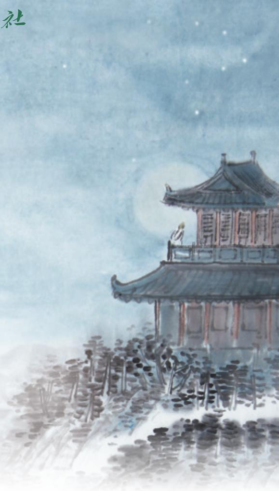

## 写话

## 看图写故事

看看下面这幅图，小老鼠在干什么？电脑屏幕上突然出现了谁？接下来会怎样？

先和同学说一说，再写下来，分享自己的奇思妙想。注意书写工整。

## 我爱阅读

## 分不清是鸭还是霞

天空飘着一片霞，

水上游来一群鸭。

霞是五彩霞，

má 鸭是麻花鸭。

麻花鸭游进五彩霞，

五彩霞网住麻花鸭。

乐坏了鸭，

拍碎了霞，

分不清是鸭还是霞。

# chēng zàn 21 称赞 ①

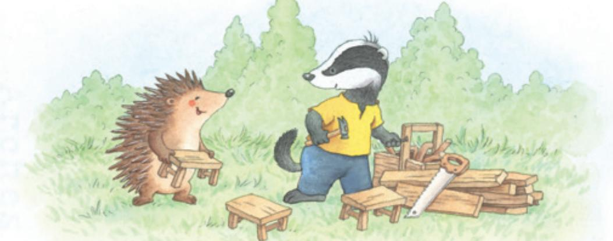

xiǎo cì wei qù sēn lín lǐ cǎi guǒ zi zài xiǎo lù biān tā 小刺猬去森林里采果子。在小路边，他 kàn jiàn yì zhī xiǎo huān zài xué zuò mù gōng xiǎo huān yǐ jīng zuò chéng le 看见一只小獾在学做木工。小獾已经做成了 sān gè xiǎo bǎn dèng bǎn dèng zuò de hěn cū cāo dàn shì kàn de 三个小板凳。板凳做得很粗糙，但是看得 chū tā zuò de hěn rèn zhēn 出，他做得很认真。

xiǎo cì wei zǒu dào xiǎo huān shēn biān ná qǐ bǎn dèng zǐ xì de 小刺猬走到小獾身边，拿起板凳仔细地 kàn le kàn tā duì xiǎo huān shuō nǐ zhēn néng gàn xiǎo bǎn dèng zuò 看了看。他对小獾说：“你真能干，小板凳做 de yí gè bǐ yí gè hǎo 得一个比一个好！”

zhēn de ma xiǎo huān gāo xìng jí le “真的吗？”小獾高兴极了。

bàng wǎn xiǎo cì wei bào zhe jǐ gè hóng hóng de dà píng guǒ 傍晚，小刺猬抱着几个红红的大苹果， wǎng jiā lǐ zǒu 往家里走。

xiǎo huān jiàn xiǎo cì wei lái le gāo xìng de yíngshàng qù tā 小獾见小刺猬来了，高兴地迎上去。他 sòng gěi xiǎo cì wei yì bǎ yǐ zi xiǎo cì wei bù hǎo yì si de 送给小刺猬一把椅子，小刺猬不好意思地 shuō wǒ zěn me néng yào nǐ de yǐ zi ne wǒ kě méi gàn shén 说：“我怎么能要你的椅子呢？我可没干什 me yα 么呀！”

xiǎo huān lā zhe xiǎo cì wei de shǒu shuō zài wǒ yǒu diǎnr 小獾拉着小刺猬的手，说：“在我有点儿 xiè qì de shí hou shì nǐ chēngzàn le wǒ ràng wǒ yǒu le zì xìn 泄气的时候，是你称赞了我，让我有了自信。 qiáo wǒ yǐ jīng huì zuò yǐ zi le zhè shì wǒ de yì diǎnr xīn 瞧，我已经会做椅子了。这是我的一点儿心 yì shōu xià ba 意，收下吧。”

xiǎo cì wei lián máng ná chū liǎng gè dà píng guǒ duì xiǎo huān 小刺猬连忙拿出两个大苹果，对小獾 shuō liú xià ba zhè yě shì wǒ de yì diǎnr xīn yì 说：“留下吧，这也是我的一点儿心意！”

xiǎo huān jiē guò píng guǒ 小獾接过苹果 wén le wén shuō nǐ de 闻了闻，说：“你的 píng guǒ zhēn xiāng wǒ cóng lái 苹果真香，我从来 méi yǒu jiàn guo zhè me hǎo de 没有见过这么好的 píng guǒ 苹果。”

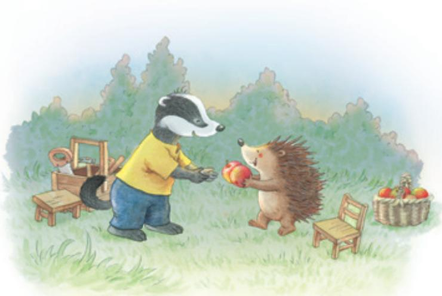

## 人民教育出版社

xiǎo cì wei yě gāo xìng jí le shuō xiè xie nǐ nǐ de 小刺猬也高兴极了，说：“谢谢你，你的 chēng zàn xiāo chú le wǒ yì tiān de pí láo 称赞消除了我一天的疲劳！”

chēng zàn cì wèi bǎn dèng dàn jí bàng píng xiè jiē chú pí láo 称赞刺猬板凳但极傍苹泄接除疲劳

仔仔

极极

送送

椅椅

怎怎

拉拉

收收

接接

默读课文，试着不出声，不指读。

小刺猬和小獾是怎样称赞对方的？受到称赞后有什么反应？找出相关语句和同学交流，再选一句抄下来。

你在什么情况下受到过别人的称赞或是称赞过别人？说说你当时的感受。

## ②2 纸船和风筝①

松鼠和小熊住在一座山上。松鼠住在山顶，小熊住在山脚。山上的小溪往下流，正好从小熊的家门口流过。

松鼠折了一只纸船，放在小溪里。纸船漂哇漂，漂到了小熊家门口。

小熊拿起纸船一看，乐坏了。纸船里放着一个小松果，松果上挂着一张纸条，上面写着：“祝你快乐！”

小熊也想折一只纸船送给松鼠，可是纸船不能漂到山上去。怎么办呢？他想了想，就扎了一只风筝。风筝乘着风，飘哇飘，飘到了松鼠家门口。

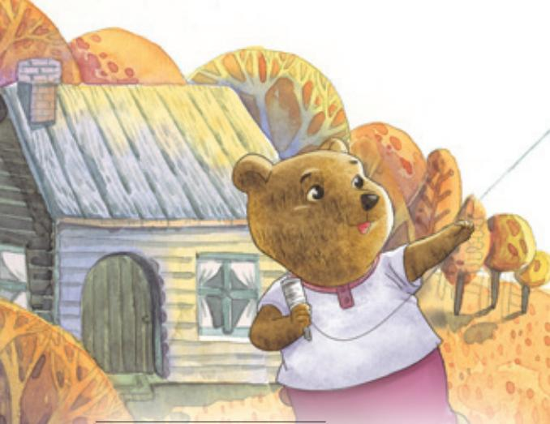  
①本文作者刘保法，选作课文时有改动。

松鼠一把抓住风筝的线一看，也乐坏了。风筝上挂着一个草莓，风筝的翅膀上写着：“祝你幸福！”

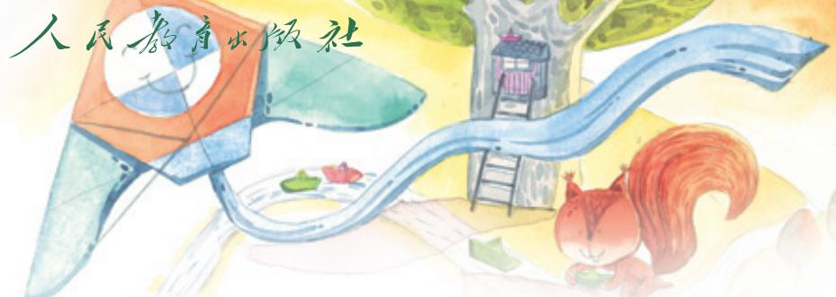

纸船和风筝让他们俩成了好朋友。

可是有一天，他们俩为了一点儿小事吵了一架。山顶上再也看不到飘荡的风筝，小溪里再也看不到漂流的纸船了。

小熊很难过。他还是每天扎一只风筝，但是不好意思把风筝放起来，就把风筝挂在高高的树枝上。

松鼠也很难过。他还是每天折一只纸船，他也不好意思把纸船放进小溪，就把纸船放到屋顶上。

过了几天，松鼠再也受不了啦。他在一只折好的纸船上写了一句话：“如果你愿意和好，就放一只风筝吧！”他把这只纸船放进了小溪。

傍晚，松鼠看见一只只美丽的风筝朝他飞来，高兴得哭了。他连忙爬上屋顶，取下纸船，把一只只纸船放到了小溪里。

筝鼠折漂扎乘抓线莓俩架受愿朝取

<table><tr><td></td><td>纸纸</td><td></td><td></td><td></td><td>抓抓</td><td></td><td></td><td></td><td></td></tr><tr><td>线</td><td></td><td>线</td><td></td><td></td><td>吵吵</td><td></td><td></td><td></td><td></td></tr><tr><td></td><td>但但</td><td></td><td></td><td></td><td></td><td></td><td></td><td></td><td></td></tr><tr><td></td><td></td><td></td><td></td><td>受</td><td>受</td><td></td><td></td><td></td><td></td></tr><tr><td>句</td><td>句</td><td></td><td></td><td></td><td>哭哭</td><td></td><td></td><td></td><td></td></tr></table>

默读课文，试着不出声，不指读。

读课文，猜猜下面加点字的读音，和同学交流你是怎么猜出来的。说说你用这些方法还认识了哪些字。

根据下面的提示讲讲这个故事。

小熊拿起纸船一看，乐坏了。

松鼠一把抓住风筝的线一看，也乐坏了。

小熊很难过。  
松鼠也很难过。松鼠高兴得哭了。

选做：小熊也想写一张卡片，挂在风筝上送给松鼠，请你替他写一写吧。

## ②3 快乐的小河

一条小河唱着歌向前流着，他太着急了，迎面撞在一座大山上。“撞得我好疼啊！”小河流出眼泪，扬起一片水花。他抱怨说：“我流过松软的沙土，流过滑溜的泥地，野花为我唱歌，青草跟我游戏，大家都跟我好。只有你，又高又大的山，撞疼了我，呜鸣呜……”

大山笑了，慈祥地说：“别哭了，可爱的小河。听我对你讲，不平静的水才有力量，跌几个跟头怕什么？这可以让你更有劲儿呢！你看这山里的泉水，从山上跳下来，一路上摔了多少跟头啊，可是他唱着快乐的歌，勇敢地向前奔跑，从来不叫苦。”

小河擦了擦眼泪，告别大山，来到泉水旁边。他对泉水说：“咱们做好朋友吧！手拉着手，一块儿向前流。”

泉水说：“好啊！请你带我流向很远很远的地方。

流过田野，给大地穿上美丽的衣裳；流进大海，推着 船儿驶向前方……”

小河说：“你真勇敢！”

泉水说：“瀑布比我更勇敢。你看，他从那么高的山顶上跳下来，一点儿也不怕，还大声地笑着，叫着，把坚硬的石头冲刷得那么光滑。”

小河高兴地冲着瀑布喊道：“勇敢的瀑布，咱们做好朋友吧！手拉着手，一块儿向前流。”

瀑布高兴地回答：“好啊，好啊！”

三个好伙伴，手拉着手，蹦啊，跳啊，溅起一片片水花，一起流向远方。

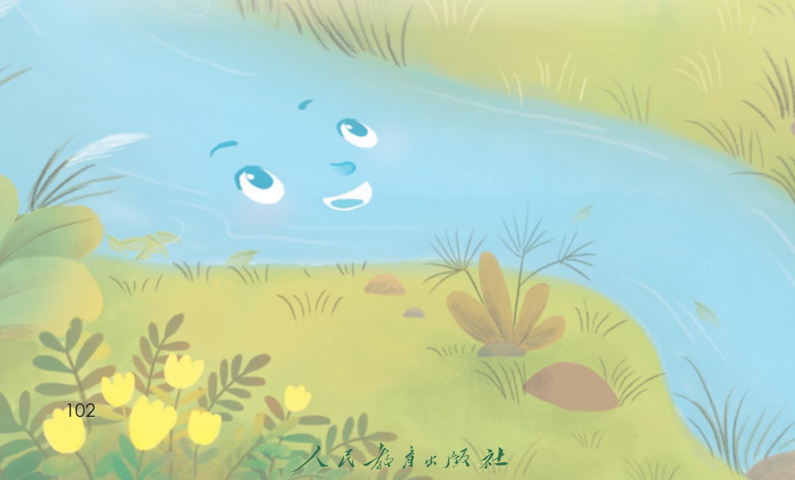

撞怨软鸣慈祥量跌摔擦咱推驶坚硬

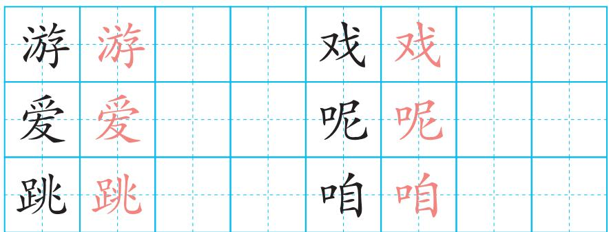

默读课文，不认识的字先猜一猜，再和同学交流，并查字典验证。

分角色朗读课文。说说小河是怎么得到快乐的。

读一读，照样子说一说，看谁说得多。

坚硬的石头 奇形怪状的石头 ）的石头

慈祥地说 高兴地说 ）地说

# 语文园地八

## 识字加油站

试着给下面的动物分类，再和同学交流分类的方法。

b狼蚕

xīng 猩猩

qiū yǐn

蚯蚓

白鹤

luò tuó

shé

骆驼

蛇

虾

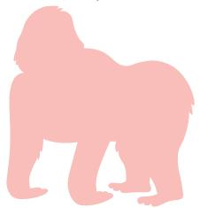

鸭 子

狮子

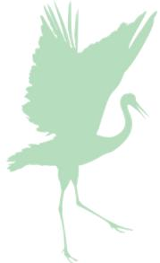

# láng xīng hè shé gē cán qiū yǐn luò tuó shī 狼猩鹤蛇鸽蚕蚯蚓骆驼狮

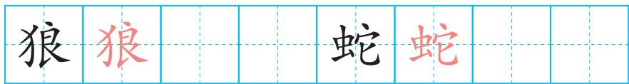

## 字词句运用

猜猜下面词语的读音，再选择合适的放在句子里读一读。 叭 唰 吱呀 叮当 嘟嘟嘟 哗啦哗啦 叽叽喳喳

窗外响起小鸟 的叫声。

，雨不停地下着。

## 人民教育出版社

## 读下面的成语，和同学交流你的发现。

tūn , yàn   
狼吞虎咽 fèngwǔ   
龙飞凤舞 míng fèi   
鸡鸣狗吠

惊弓之鸟 lòu 漏网之鱼 害群之马 胆小如鼠 yì 如虎添翼 如鱼得水

## 书写提示

数数

群群

先看后写，能減少修改次数，保持页面整洁。

有的字左右两边宽窄大致相等。

船船

能能

## 日积月累

jǐ suǒ bú yù wù shī yú rén 己所不欲，勿施于人。

lún yǔ 《论语》

yǔ péng yǒu jiāo yán ér yǒu xìn 与朋友交，言而有信。

lún yǔ 《论语》

bù yǐ guī jǔ bù néng chéng fāng yuán mèng zǐ 不以规矩，不能成方圆。—《孟子》

## 口语交际

## 看图讲故事

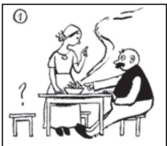

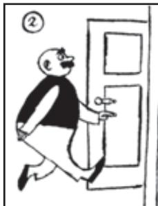

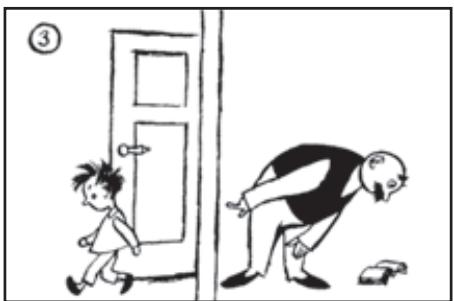

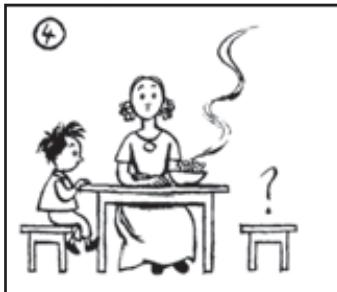

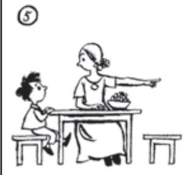

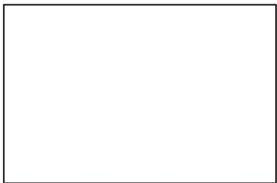  
(图)[德国]埃·奥·卜劳恩 绘

看图，先了解每幅图的内容，再把这些图的内容连起来，讲一讲这个故事。

想一想，这个故事接下来会怎么样?

按顺序讲清楚图意。认真听，判断别人讲的是哪幅图的内容。

## 我爱阅读

## hú wēi 狐假虎威 ①

在茂密的森林里，有一只老虎正在寻找食物。一只狐狸cuàn dǎi从老虎身边窜过。老虎扑过去，把狐狸逮住了。

狐狸眼珠子一转，扯着嗓子问老虎：“你敢吃我？”

“为什么不敢？”老虎一愣。

“老天爷派我来做你们百兽的首领，你吃了我，就是违kàng抗了老天爷的命令。我看你有多大的胆子！”

老虎迟疑地松开了爪子。

狐狸摇了摇尾巴，说：“我带你到百兽面前走一趟，让你看看我的威风。”

老虎跟着狐狸朝森林深处走去。狐狸神气活现，摇头摆尾；老虎半信半疑，东张西望。

森林里的野猪啦，小鹿啦，兔子啦，看见狐狸大摇大摆 nà mèn 地走过来，跟往常很不一样，都很纳闷。再往狐狸身后一 sā 看，呀，一只大老虎！大大小小的野兽吓得撒腿就跑。

qi shi pián老虎信以为真。其实他受骗了。原来，狐狸是借着老虎的威风把百兽吓跑的。

## 识字表

## 阅读

1 dǒu nǎo dài 披

qì yuè wēn dī bēn hǎi yáng fā huài mò zhuāng jià wū 2 汽越温滴奔海洋发坏没庄稼屋 dài zāi zhǒng guǎn 带灾种管

zhí rú jiǎo lǚ zhǔn bèi sòng fēn guà tǐng zuān dǐ zhà   
|ncūdé   
离粗得

lǎng wù bào léi zhèn dòng jiā 语文园地一 朗雾暴雷阵冻夹

## 识字

fān gǎng wān táng dào háng chuí yuán xī cóng cuì qún duì 1帆港湾塘稻行垂园溪丛翠群队 tóng hào 铜号

róng zhuàng wú tóng zhǎng fēng sōng bǎi huà shǒu yín xìng shān 2榕壮梧桐掌枫松柏桦守银杏杉

<table><tr><td>3 猫</td><td>h化 māo 4季蝴蝶麦嫩肥农勤归戴场谷虽 xīn kǔ zhì</td><td></td><td></td><td>shì jiè kǒng què jǐn xióng yīng xiáng yàn shēn měng líng xiū 世界孔雀锦雄鹰翔雁深猛灵休 jì hú dié mài nèn féi nóng qín guī dài cháng gǔ suī</td><td></td><td></td><td></td><td rowspan="11"></td><td rowspan="11">jī</td></tr><tr><td></td><td>辛苦制</td><td>语文园地二丑恨诚虚假漠助贫富饥</td><td></td><td>chǒu hèn chéng xū jiǎ mò zhù pín fù</td><td></td><td></td><td></td><td></td></tr><tr><td>阅读</td><td></td><td></td><td></td><td></td><td></td><td></td><td></td><td></td></tr><tr><td>4</td><td></td><td>hóng jiāo hú tí sǎ tiāo jìng ná jì dàng qún</td><td></td><td></td><td>虹浇壶提洒挑镜拿系荡裙</td><td></td><td></td><td>pó hòu qù jiù huò liú fèn wèi táo qǔ zhě fú pū</td></tr><tr><td>5</td><td>b鼻</td><td>婆候趣舅或留份喂逃曲者服扑</td><td></td><td></td><td></td><td></td><td></td><td></td></tr><tr><td></td><td></td><td>zhēn sǎ bì kào yǎng kē jù biàn zǔ sháo rào zhuàn chǔ 6珍撒碧靠仰颗距变祖勺绕转楚 hàn kè yán</td><td>汉刻研</td><td></td><td></td><td></td><td></td><td></td></tr><tr><td></td><td>语文园地三弹钢琴捏泥围滚铁环滑梯</td><td></td><td></td><td></td><td>tán gāng qín niē ní wéi gǔn tiě huán huá tī dēng táng yī jìn yù qióng céng pù bù lú zǐ yān yáo</td><td></td><td>7登唐依尽欲穷层瀑布炉紫烟遥</td><td></td></tr><tr><td></td><td></td><td>8景指著</td><td></td><td></td><td></td><td></td><td></td><td></td></tr></table>

qiǎng zhuàng yán 抢状岩

xī 9 潭茂盛胜央岛隐约倒映整童吸 引 kè 客

10 葡萄沟坡密枝淡好族收 dìng fèn yán wèi 钉分颜味

dìng xiào fēng chāng fù wò pù gǎi qiān tuì gēng 语文园地四 订效丰昌付卧铺改签退更 wéi mǎ 维码

guān yán kě huà nòng cuò jì tái xìn 11观沿渴话弄错际抬信

háo dàng què xún kū què quàn guā sǐ jiāng qiě kuáng lěng 12号当鹊寻枯却劝刮死将且狂冷 chóng fù āi huàn 重复哀唤

13葫芦谢以盯赛怪慢

jiào jiù mó tuō fáng yú huò kē kǎo chá 语文园地五 轿救摩托防渔货科考察

14 楼艰年花临腊军簿丰握凝览油辉革命利

zhū dé biǎn dàn tóng zhì wǔ dí gēn jù chōu dǒu xié 15朱德扁担同志伍敌根据抽陡鞋

<table><tr><td></td><td>téng jìng 疼敬 16泼民度特周恩敲铺龙串容踩始 chéng wǎn zhù shòu 盛碗祝寿</td><td></td><td></td><td></td><td></td><td>pō mín dù tè zhōu ēn qiāo pū lóng chuàn róng cǎi shǐ</td></tr><tr><td></td><td>suì tí 岁题</td><td>liú lán pài yóu yú mài yuán bǔ mǎi shì tà liè róng 17刘兰派由于卖员捕买似踏烈荣</td><td>fēng mì fēng fēng bào zhēng chāo chǎo mù mù mù 语文园地六锋蜜峰蜂爆争抄炒幕墓慕</td><td></td><td></td><td></td></tr><tr><td></td><td></td><td></td><td>jué jìng zōng miè zhōu diào sì lú lǒng gài cāng máng 18绝径踪灭舟钓似庐笼盖苍茫</td><td></td><td></td><td></td><td></td></tr><tr><td></td><td>shī 失</td><td></td><td>lùn àn àn jiē liáng shèn zhì qiè duǒ gāi yōu xián sàn 19论暗岸街梁甚至切躲该悠闲散 duī lèi tiān chái shāo wàng bì āi páng chōng wa zhōng hún</td><td></td><td></td><td></td><td></td></tr><tr><td></td><td>lín shài 淋晒</td><td></td><td>20堆累添柴烧旺闭哎旁冲哇终浑</td><td></td><td></td><td></td><td></td></tr><tr><td>huáng</td><td></td><td></td><td>shù è zhǎo zé níng gàng gǎn dòng kù zhá gāo 语文园地七漱饿沼泽宁杠杆栋库闸羔</td><td></td><td></td><td></td><td></td></tr><tr><td></td><td>蝗</td><td></td><td>chēng zàn cì wèi bǎn dèng dàn jí bàng píng xiè jiē chú</td><td></td><td></td><td></td><td></td></tr><tr><td></td><td></td><td></td><td>21称赞刺猬板凳但极傍苹泄接除</td><td></td><td></td><td></td><td></td></tr><tr><td></td><td>pí láo 疲劳</td><td></td><td></td><td></td><td></td><td></td><td></td></tr></table>

zhēng shǔ zhé piāo zā chéng zhuā xiàn méi liǎ jià shòu yuàn 22筝鼠折漂扎乘抓线莓俩架受愿 cháo qǔ 朝取

zhuàng yuàn ruǎn wū cí xiáng liàng diē shuāi cā zán tuī shǐ 23撞怨软鸣慈祥量跌摔擦咱推驶 jiān yìng 坚硬

láng xīng hè shé gē cán qiū yǐn luò tuó shī 语文园地八 狼猩鹤蛇鸽蚕蚯蚓骆驼狮

（共460个生字）

## 写字表

## 阅读

liǎng tiáo nǎ kuān nà duǎn hái chéng

1两条哪宽那短孩成

shēng lián qǐ hǎi yáng xǔ zuò bàn fǎ

2升连起海洋许作办法

rú yǐ jīng bié qīng fā dǎn dù gèng shí

3如已经别轻发胆肚更识

zhuǎn jiā 语文园地一 转夹

## 识字

chù kuài zuò yuán qún duì lǐng

1 处块座园群队领

shù zhī yáng sōng bǎi huà jīn guì

2 树之杨松柏化金桂

pāi shì jiè cǎi cóng xiū péng yǒu bǎo hù

3拍世界彩丛休朋友保护

jì féi nóng shì gǔ tǐ suī xīn kǔ chū 4季肥农事谷体虽辛苦初

chǒu chéng

语文园地二丑诚

阅读

lì tí ma yuán gē qiū guà a 4丽提吗圆哥秋挂啊

bǎo huó xiē zǒng gěi sù qǔ míng xiāng

5宝活些总给诉曲名香

shǔ wǎn nǎi nín yé hěn biàn sháo zhāng hàn

6数晚奶您爷很变勺张汉

tú ní tiě huán 语文园地三 图泥铁环

yī jìn qióng céng zhào lú yān chuān zhí yín

7依尽穷层照炉烟川直银

xiān dǐng jù wèi shǎn gǒu xíng zhuàng

8仙顶巨位闪狗形状

hú qū shèng dǎo wān xiàn jiù wài

9湖区胜岛弯现就外

fèn zhī kè chéng shì kǒng dìng wèi

10份枝客城市孔钉味

语文园地四号丰

guān ya dá huà tái néng xìn

11 观呀答话抬能信

zhèn zuò dòng dì xiàng lěng bīng liàng

12阵做冻第像冷冰亮

zhòng kē yǐ cì xiǎng lín jū ba qí guài 13种棵以次想邻居吧奇怪

huò kē语文园地五 货科

lóu dài chuān shì lì lù

14 楼代穿视利路

tóng zhì jūn dí cháng fēi měi zhàn shì dài

15同志军敌常非每战士戴

nán wàng mín yīn lǐ chuàn kù lìng

16难忘民因理串裤令

fǎn cūn yóu yú yuán bèi shēng suì xiāo xī 17反村由于员被声岁消息

chāo chǎo 语文园地六 抄炒

jué miè zhōu dú yīn sì yě 18绝灭舟独阴似野低

lùn chuán māo qiè gāi sàn bù shī

19论船猫切该散步失

20要伙伴歌得闭忙谁汽

jī è níng kù 语文园地七 饥饿宁库

ná zǐ jí sòng 21 拿仔极送椅怎拉收接

zhǐ zhuā xiàn chǎo dàn shòu jù kū

22纸抓线吵但受句哭

yóu xì ài ne tiào zán

23游戏爱呢跳咱

láng shé 语文园地八 狼蛇

（共250个字）

## 词语表

## 阅读

1 妈妈 身子 他们 看见 我們 哪里 那边

雪白过去孩子什么

2 太阳 天空 一起冬天 花朵池子 江河

海洋许多田地工作办法你们

3 如果 已经长大告别 四海为家自己 出发

动物胆子 肚子 那里知识

## 识字

1 花园 飞鸟 红领巾 欢笑

2 杨树 树叶 松柏 化石 开花

3 拍手 世界云彩丛林 竹林 朋友 保护

4 四季春风农事月光身体辛苦心里

阅读

4 天上 美丽 爸爸 下来 不用 高兴 哥哥

秋千 彩云

5 宝贝 干活 回来 一些 天气欢快它们  
告诉名字出门  
6 星星晚上 无数奶奶中间总是爷爷  
北边 勺子 转动 这个 后来  
8 那些山顶山头云海仙人前方仙女  
9 山区群山 树木 灯光中午 眼前细雨  
风光中外  
10 地方 水果 月份 枝叶 五光十色 好客 老乡  
有的城市空气水分这里味道有名  
11 坐井观天哪儿回答大话不过那么抬头  
12 当作前面面对面出去过冬知道赶快  
正好明天 清早好像一样天亮出来  
13 从前以后多么那个叶子虫子自言自语  
邻居奇怪  
14 年代 更加 明亮 星星之火 中国 胜利 道路  
15 同志红军敌人生产 常常来回 非常  
战士一块儿 白天  
16 难忘 火红 人民 因为 总理 人们 四面八方  
为了 人群欢乐开心

17 由于 年轻 共产党员 共产党 现在一点儿消息

19 于是 无论 船只 同时 行人一切上空看来不久 路上 出现 散步 消失

20 空地 伙伴 唱歌 回家 一会儿 着火 火星

一边连忙树林水汽白云

21 果子 木工 身边 仔细 能干 椅子 怎么自信从来这么

22 上面 快乐 可是 难过 但是 和好

23 眼泪水花青草 游戏只有可爱可以

多少 咱们 田野大地远方

（共239个词）

## 后记

2017年投入使用的《义务教育教科书语文》由温儒敏担任总主编，一\~六年级由陈先云、曹文轩、崔峦、李吉林担任主编。张沛、张一清、郑宇、段宗平、聂鸿飞、熊宁宁、滕春友、魏航参加二年级上册编写。2022年，教育部组建编修委员会，根据《义务教育语文课程标准（2022年版)》对教科书进行编写修订。编修委员会由温儒敏、王立军担任主任，张伯江、王荣生担任副主任。编修委员会下设修订组，负责具体修订工作。

教科书在北京、天津、内蒙古、浙江、安徽、湖北、湖南、重庆、四川等地部分学校进行了试教试用，征求了百余位专家学者和一线教师的意见。人民教育出版社承担了教科书的编辑出版和美术设计工作。查加伍、王国栋、王晓鹏、龙淼为本书绘制插图，景绍宗为本书封面绘制插图。在教科书修订、编辑出版过程中，很多专家都提供过帮助，在此一并表示诚挚的谢意。

教科书需要在使用过程中不断修改完善，真诚希望广大师生和家长继续提出宝贵意见！

联系方式

电话：010-58758689

电子邮箱：jcfk@pep.com.cn

意见反馈平台：jcyjfk.pep.com.cn

人民教育出版社

YIWU JIAOYU JIAOKESHU YUWEN