义务教育教科书

# 语文

二年级

下册

人民教育出版社

义务教育教科书

# 语文

## 二年级下册

教育部组织编写

编修委员会

主任：温儒敏 王立军

副主任：张伯江王荣生

成员（以姓氏笔画为序）:王 敏 王本华 过常宝 朱于国 伍新春 李小龙 李明新汪 锋 宋亚云 张继晓 张彬福 陈先云 陈建华 林建华倪文锦徐轶漆永祥

本册主编：陈先云 汪锋

编写人员（以姓氏笔画为序）：张立霞林孝杰柯孔标 施建平姚颖 郭蕾

责任编辑：林孝杰 张立霞

责任设计：昌梦洁

责任校对：冯 运

责任印制：

义务教育教科书 语文 二年级 下册

教育部组织编写

出版人民教育出版社

（北京市海淀区中关村南大街17号院1号楼 邮编：100081)

网址 http://www.pep.com.cn

版权所有·侵权必究

## 目录

## 第一单元·阅读

古诗二首………1  
咏柳…… ……1  
村居…… ……2  
找春天………… …4  
开满鲜花的小路……………6  
邓小平爷爷植树……9  
语文园地一…………………11

## 第二单元·阅读

5 雷锋叔叔，你在哪里……15  
6 千人糕…… ……18  
我不是最弱小的………21  
语文园地二…………24  
快乐读书吧  
读读儿童故事…… 28

## 第三单元·识字

神州谣………………………………29  
传统节日……………………………31  
3 “贝”的故事……………33  
4 中国美食……………………………35  
语文园地三…………………37

## 第四单元·阅读

8 彩色的梦……………………42  
9 一匹出色的马………………45  
10 枫树上的喜鹊……48  
语文园地四………51

##

## 第五单元·阅读

寓言二则……  
亡羊补牢……………………55  
堰苗助长……………………56  
12 画杨桃……………………………58  
13 小马过河…………………………61  
语文园地五………………65

## 第六单元·阅读

14 古诗二首……… ……69  
绝句… …69  
晓出净慈寺送林子方…70  
15 雷雨… …72  
16 要是你在野外迷了路…74  
17 太空生活趣事多……………77  
语文园地六………………79

## 第七单元·阅读

18 大象的耳朵……84  
19 蜘蛛开店………87  
20 青蛙卖泥塘………………………90  
21 小毛虫……94  
语文园地七………………97

## 第八单元·阅读

22 羿射九日……………………100   
23 黄帝的传说………………103   
24 大禹治水…………………106   
语文园地八…………109   
识字表……113   
写字表……117   
词语表………120

第一单元·阅读

# ①古诗二首

yǒng 咏 柳

hè[唐]贺知章

zhuāng   
碧玉妆成一树高， sī tāo   
万条垂下绿丝绦。 cái   
不知细叶谁裁出， jiǎn   
二月春风似剪刀。

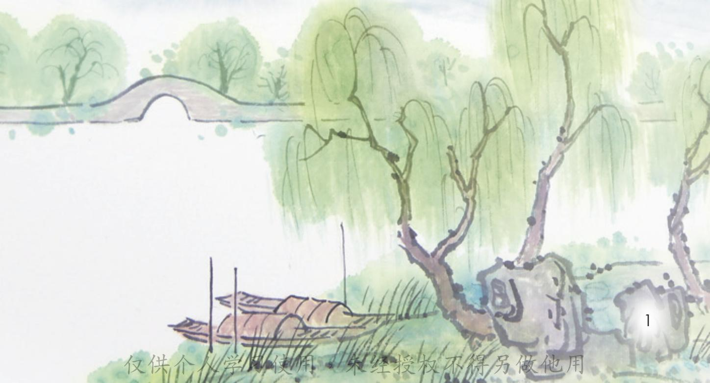

# 村居

dǐng [清]高鼎

yīng   
草长莺飞二月天，   
fú dī zuì   
拂堤杨柳醉春烟。   
儿童散学归来早， chèn yuān   
忙趁东风放纸鸢。

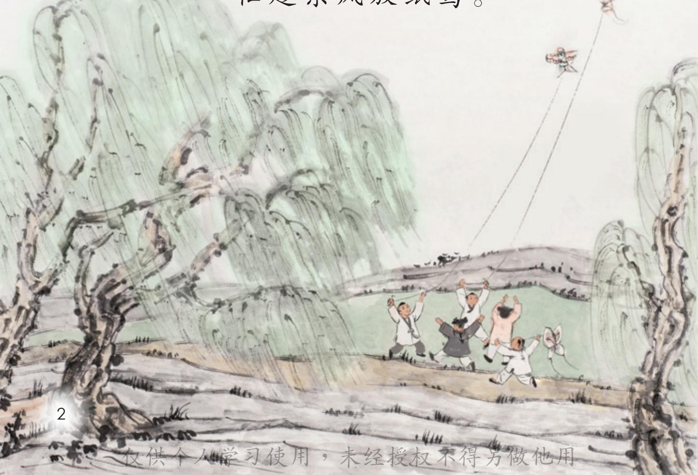

yǒng hè zhuāng sī cái jiǎn yīng fú dī zuì chèn 咏贺妆丝裁剪莺拂堤醉趁

绿绿

剪剪

童童

归归

朗读课文。背诵课文。

填一填，想象画面，说说诗句中描绘的春天美景。

◇不知细叶谁裁出，

莺飞 ，拂堤杨柳醉

读一读，记一记。

chóu祝贺 可喜可贺 丝绸 蚕丝

吹拂 春风拂面 河堤 堤岸

# ②找春天

春天来了！春天来了！

我们几个孩子脱掉棉袄，冲出家门，奔向田野，去寻找春天。

xiū zhēyǎn春天像个害羞的小姑娘，遮遮掩掩，躲躲藏藏。我们仔细地找哇，找哇。

小草从地下探出头来，那是春天的眉毛吧？

早开的野花一朵两朵，那是春天的眼睛吧？tǔ yá fú树木吐出点点嫩芽，那是春天的音符吧？jiě dīng解冻的小溪叮叮咚咚，那是春天的琴声吧？

  
①本文作者经绍珍，选作课文时有改动。

春天来了！我们看到了她，我们听到了她，我们闻到了她，chù我们触到了她。她在柳枝上荡秋千，在风筝尾巴上摇哇摇；她在dù juān喜鹊、杜鹃嘴里叫，在桃花、杏花枝头笑……

tuō ǎo zhē yǎn tàn méi tǔ yá fú jiě chù dù juān 脱袄遮掩探眉吐芽符解触杜鹃

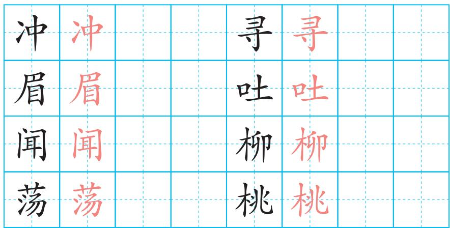

朗读课文，感受春天的美景。说说“我们”找到的春天是什么样的。

读下面的句子，试试怎样读更好。

小草从地下探出头来，那是春天的眉毛吧？

春天来了！我们看到了她，我们听到了她，我们闻到了她，我们触到了她。

选做：你找到的春天是什么样的？仿照第4\~7自然段或第8自然段说一说。

# ③开满鲜花的小路

## yóu dì you ai

/an guo  
邮递员黄狗在门口喊：“鼹鼠先生，您的包裹单！jǐng jì  
原来，长颈鹿大叔给鼹鼠先生寄来了一个包裹

鼹鼠先生赶紧骑着摩托车，到邮局去领包裹。他lì回家后打开包裹，看见一堆小颗粒，可认不出是什么东西。

鼹鼠先生拿着包裹，来到松鼠太太家。他问松鼠太太：“长颈鹿大叔寄来一个包裹，您能帮我看看是什么东西吗？”

松鼠太太拿过来一看，里面空空的，什么也没pò lòu有。原来，包裹破了，里面的东西不见了。看来都漏ào sàng在来时的路上啦！鼹鼠先生很懊丧。

春天来了，鼹鼠先生要去松鼠太太家做客。啊，

# 人民教育出版社

通往松鼠太太家的路，成了一条开满鲜花的小路。

鼹鼠先生路过刺猬太太家，正巧，刺猬太太走出xuàn门。看到门前开着一大片绚丽多彩的鲜花，她惊奇地说：“这是谁在我家门前种的花？多美啊！”

鼹鼠先生回答：“我不知道！”

鼹鼠先生经过狐狸①太太家，正巧，狐狸太太走出门。看到门前开着一大片五颜六色的鲜花，她奇怪地问：“这是谁在我家门前种的花？真美啊！”

鼹鼠先生回答：“我不知道！”

鼹鼠先生来到松鼠太太门前。松鼠太太走出门，cù看见门前的小路上花朵簇簇，小松鼠、小刺猬和小狐bèng狸在那里快活地蹦啊跳啊。

松鼠太太对鼹鼠先生说：“我知道了，去年长颈zǐ鹿大叔寄给您的是花籽。这是多么美好的礼物啊！”

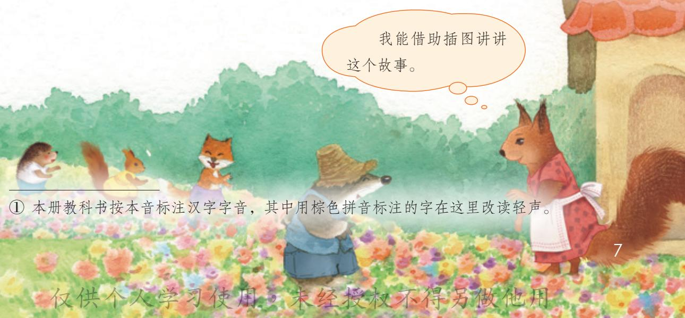

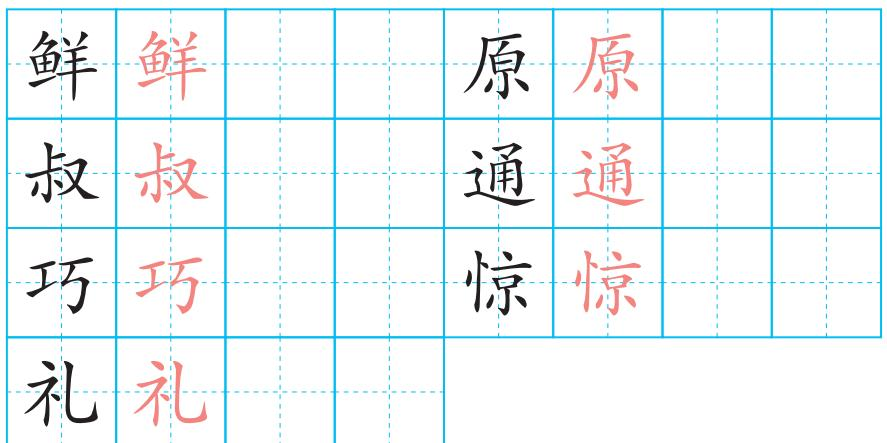

分角色朗读课文。

读一读，注意加点的部分。再看看课文插图，照样子说一说。

门前开着一大片五颜六色的鲜花。

房子旁边 O

山坡上

为什么说长颈鹿大叔寄来的花籽是“美好的礼物”？生活中还有什么也是美好的礼物？

# dèng 4 邓小平爷爷植树

1987年4月5日，是个令人难忘的日子。

tán

这一天，碧空如洗，万里无云。在北京天坛公园líng gé植树的人群里，83岁高龄的邓小平爷爷格外引人注qiāo zhì bó wā kēng é目。只见他手握铁锹，兴致勃勃地挖着树坑，额头已hàn réngkěn经满是汗珠，仍不肯休息。

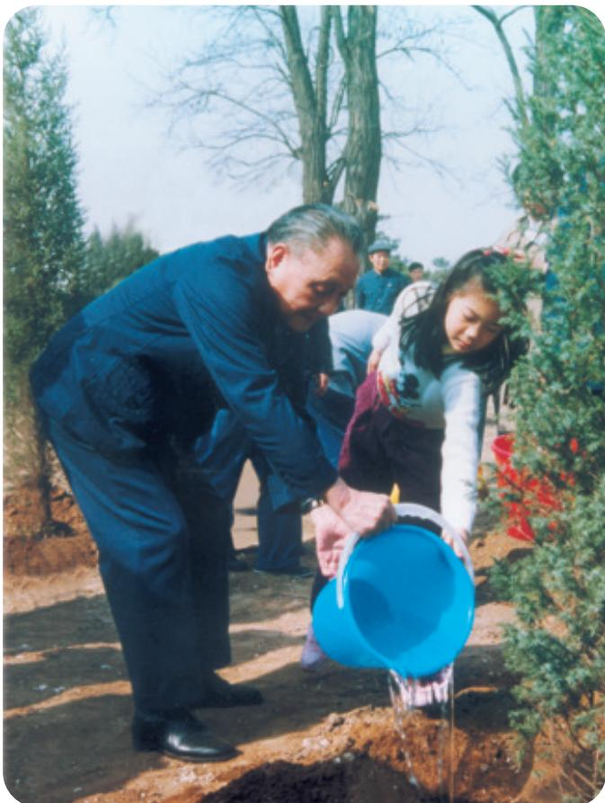

一个树坑挖好jīng  
了。邓爷爷精心地zhuó  
挑选了一棵茁壮的yí  
柏树苗，小心地移入huī  
树坑，又挥锹填了几  
锹土。他站到几步之  
外仔细看看，觉得  
不是很直，连声说：  
“不行，不行！”他又fú  
走上前把树苗扶正。

①本文根据欧庆林的《首都百余万军民义务植树》改写，原文刊载于1987年4月6日《人民日报》。

## 人民教育出版社

zāi

一棵绿油油的小柏树栽好了，就像战士一样笔直地站在那里。邓爷爷的脸上露出了满意的笑容。

今天，邓小平爷爷亲手栽种的柏树已经长大了，成了天坛公园一处美丽的风景。

dèng tán líng gé zhì bó wā é hàn réng kěn zhuó yí huī fú 邓坛龄格致勃挖额汗仍肯茁移挥扶

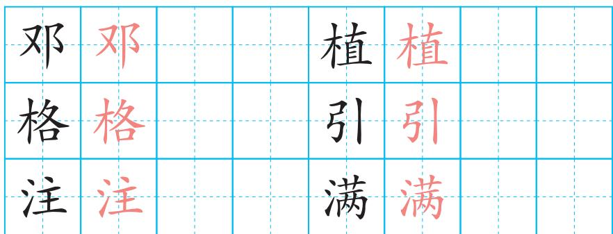

朗读课文。

默读第3自然段。结合课文内容和插图，说说邓爷爷植树的情景。

## 拓展活动

我们也去找春天吧！去看一看，听一听，闻一闻……

我还要把春天里的发现告诉小伙伴。

## 识字加油站

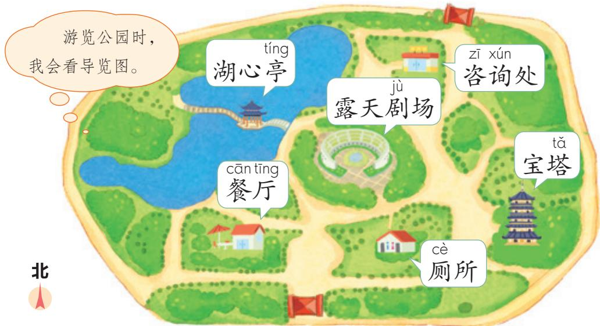

# tíng zī xún jù tǎ cān tīng cè 亭咨询剧塔餐厅厕

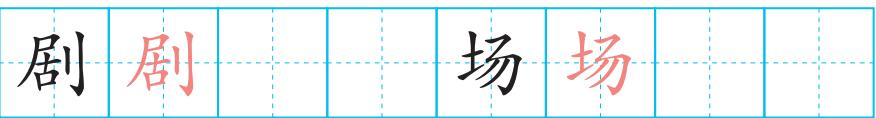

## 字词句运用

补充合适的词语，再说一说：你在春天里看到了什么，

感受到了什么？

暖暖的阳光让我感到春天来了。

的天空 的阳光 的微风

的田野 的柳条 的草坪

<table><tr><td rowspan=2 colspan=1>处</td><td rowspan=2 colspan=2>处</td><td rowspan=1 colspan=1></td><td rowspan=1 colspan=1></td><td rowspan=1 colspan=1></td><td rowspan=1 colspan=1></td></tr><tr><td rowspan=1 colspan=1></td><td rowspan=1 colspan=1></td><td rowspan=1 colspan=1></td><td rowspan=1 colspan=1></td></tr><tr><td rowspan=2 colspan=1>通通</td><td rowspan=1 colspan=2></td><td rowspan=1 colspan=1></td><td rowspan=1 colspan=1></td><td rowspan=1 colspan=1></td><td rowspan=1 colspan=1></td></tr><tr><td rowspan=1 colspan=2></td><td rowspan=1 colspan=1></td><td rowspan=1 colspan=1></td><td rowspan=1 colspan=1></td><td rowspan=1 colspan=1></td></tr></table>

根据不同的提问，读读下面的句子。

种子睡在松软的泥土里。

什么睡在松软的泥土里？

❤种子睡在哪里？

种子睡在什么样的泥土里？

## 书写提示

<table><tr><td rowspan=2 colspan=1>原原</td><td rowspan=1 colspan=1></td><td rowspan=1 colspan=1></td><td rowspan=1 colspan=1></td><td rowspan=1 colspan=1></td><td rowspan=1 colspan=1></td></tr><tr><td rowspan=1 colspan=1></td><td rowspan=1 colspan=1></td><td rowspan=1 colspan=1></td><td rowspan=1 colspan=1></td><td rowspan=1 colspan=1></td></tr><tr><td rowspan=1 colspan=1>巴</td><td rowspan=1 colspan=1></td><td rowspan=1 colspan=1></td><td rowspan=1 colspan=1></td><td rowspan=1 colspan=1></td><td rowspan=1 colspan=1></td></tr><tr><td rowspan=1 colspan=1>自</td><td rowspan=1 colspan=1></td><td rowspan=1 colspan=1></td><td rowspan=1 colspan=1></td><td rowspan=1 colspan=1></td><td rowspan=1 colspan=1></td></tr></table>

左上包围的字，书写时包围部分的撇画要写得舒展。

左下包围的字，书写时包围部分的捺画要写得舒展。

## 日积月累

## fù赋得古原草送别（节选）

yì [唐]白居易

离离原上草，

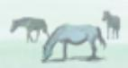

一岁一枯荣。

野火烧不尽，

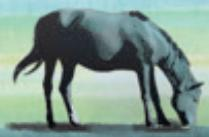

春风吹又生。

## 口语交际

## 用怎样的语气说话

说话的时候，使用恰当的语气，能让听的人感到舒服。

读下面的句子，注意语气，体会不同的效果。

我不是故意的！

我不是故意的。

阿姨，请您让一下。

阿姨，请您让一下好吗？

如果遇到下面的情形，你会怎样说？试一试，注意说话的语气。

妈妈让我学钢琴，但我想学画画。我会跟妈妈说……

上学迟到了，老师批评了我。下课后我对老师说……

看到同学洗手后忘了关水龙头，我会跟他说……

说话的语气不要太生硬。

尽量使用温和的语气。

## 我爱阅读

# sǔn 笋芽儿

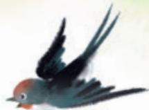

zòu

沙沙沙，沙沙沙。春雨姑娘在绿色的叶丛中弹奏着乐曲，xǐng低声呼唤着沉睡的笋芽儿：“笋芽儿，醒醒啊，春天来啦！”

笋芽儿被叫醒了。她揉了揉眼睛，伸了伸懒腰，看看四qī sā jiāo周仍然一片漆黑，撒娇地说：“是谁在叫我啊？”

## hōnglōng

轰隆隆！轰隆隆！雷公公把藏了好久的大鼓重重地敲了sǎng起来。他用粗重的嗓音呼唤着笋芽儿。

笋芽儿扭动着身子，一个劲儿地向上钻。

妈妈见了，忙给笋芽儿穿上一件又一件衣服，还不停地láo dāo唠叨：“别着凉，千万别着凉。”

笋芽儿终于钻出了地面。她睁开眼睛一看，啊，多么明亮、多么美丽的世界啊！桃花笑红了脸，柳树摇着绿色的长biàn jīzhā辫子，小燕子叽叽喳喳地叫着…笋芽儿看看这儿，看看那儿，怎么也看不够。她高兴地说：“多美好的春光啊！我要快快长大！”

duàn fǔ zī rùn yào 春雨姑娘不断地爱抚她，滋润她。太阳公公照耀她，给 jiàn 她温暖。笋芽儿脱下一件件衣服，长成了一棵健壮的竹子 gāng háo 她站在山冈上，自豪地喊着：“我长大啦！”

# ⑤雷锋叔叔，你在哪里①

沿着长长的小溪，jì  
寻找雷锋的足迹。  
雷锋叔叔，你在哪里，  
你在哪里？小溪说：  
céng  
昨天，他曾路过这里，抱着迷路的孩子，  
mào méng  
冒着蒙蒙的细雨。  
qiáo nìng wō瞧，那泥泞路上的脚窝，就是他留下的足迹。

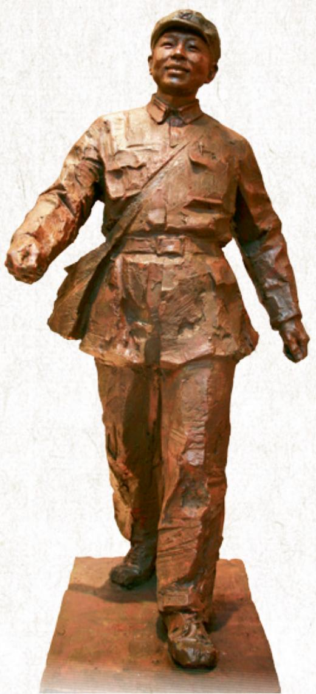  
（图）吴为山 塑

## 人民教育出版社

shùn  
顺着弯弯的小路，  
寻找雷锋的足迹。  
雷锋叔叔，你在哪里，你在哪里？  
小路说：  
昨天，他曾路过这里，  
背着年迈的大娘，jīng jí  
踏着路上的荆棘。bàn yíng  
瞧，那花瓣上晶莹的露珠，  
就是他洒下的汗滴。  
乘着温暖的春风，mì  
我们四处寻觅。  
啊，终于找到了xū xiàn  
哪里需要献出爱心，  
雷锋叔叔就出现在哪里。

jì céng mào méng qiáo nìng wō shùn jīng jí bàn yíng mì xū xiàn 迹曾冒蒙瞧泞窝顺荆棘瓣莹觅需献

<table><tr><td>雷</td><td>雷</td><td></td><td></td><td></td><td>锋</td><td></td><td></td></tr><tr><td></td><td></td><td></td><td></td><td>背</td><td></td><td></td><td></td></tr><tr><td>作</td><td>昨</td><td></td><td></td><td>月</td><td>背</td><td></td><td></td></tr><tr><td>洒 西</td><td>酒</td><td></td><td></td><td></td><td></td><td></td><td></td></tr><tr><td></td><td></td><td></td><td></td><td>一</td><td>汗暖</td><td></td><td></td></tr><tr><td>温</td><td>温</td><td></td><td></td><td>暖 爱 2</td><td></td><td></td><td></td></tr></table>

听老师讲雷锋的故事，再试着有感情地朗读课文，注意这首诗歌有问有答的特点。

猜猜下面词语的意思，并说说你是怎么猜出来的。足迹 泥泞 晶莹 寻觅

读句子，想画面，再根据课文内容，说一说雷锋的故事。沿着长长的小溪，冒着蒙蒙的细雨，雷锋叔叔…顺着弯弯的小路，踏着路上的荆棘，雷锋叔叔…

# gāo 6千人糕

一天，爸爸对孩子说：“今天我们来吃千人糕吧。”“爸爸，什么是千人糕？”孩子好奇地问。

“需要很多很多人才能做成的糕。”爸爸回答。

孩子想：这糕要很多很多人才能做成，一定特别大，也许比桌子还大吧？

爸爸端来一块糕，那糕看上去跟平时吃的糕没什cháng么两样。难道它的味道很特别吗？孩子急忙尝了尝，ma笑了：“这不就是平常吃的米糕嘛！您给我买过。”

爸爸说：“是的，就是平常吃的米糕。你知道这糕是怎么做成的吗？”

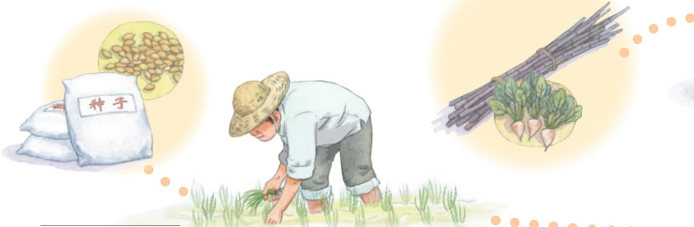

# 人民教育出版社

mò fěn táng孩子说：“是把大米磨成粉做的，还加了糖。”

爸爸说：“是啊，大米是用农民种的稻子加工出liào来的。农民种稻子需要种子、农具、肥料、水………”

爸爸接着说：“糖呢，是用甘蔗汁或者甜菜汁熬出来的。甘蔗、甜菜也要有人种。熬糖的时候，要有工具，还得有火…就算米糕做好了，还得要人包xiāo shòu装、送货、销售，这些又需要很多人的劳动。”

爸爸拿起面前的糕，说：“你看，一块平平常常的糕，要经过很多很多人的劳动，才能摆在我们面前。”

孩子听了爸爸的话，仔细想了想，说：“爸爸， dí què yīng 这糕的确应该叫‘千人糕’啊！”

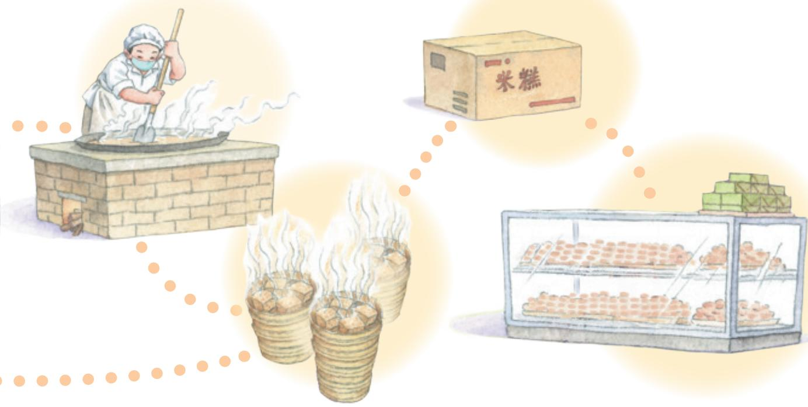

gāo cháng ma mò fěn táng liào gān 糕尝嘛磨粉糖料甘 zhè zhī áo xiāo shòu dí què yīng 蔗汁熬销售的确应

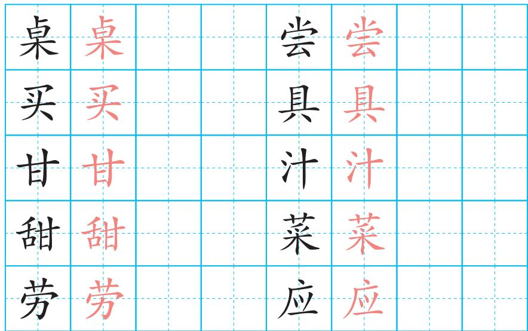

默读课文。结合课文内容和插图，说说一块平常的米糕为什么被称作“千人糕”。

我们穿的衣服、用的文具等，都要经过很多人的劳动，举个例子说一说。

读一读，记一记。

dàn 蛋糕 雪糕 糕点

米粉 面粉 粉丝

shí 确定确实正确

# ruò⑦我不是最弱小的

mò sà yà夏天的一个周末，四岁的萨沙和哥哥托利亚跟父母一起到森林中去玩。森林里的景色是那么美好，空气是那么清新。他们来到林中的一片空地。那里盛开着美丽的铃兰花。

“看！这儿还有一朵野蔷薇呢！”大家被萨沙的cù yōng  
叫声吸引过来。原来有一丛野蔷薇，被铃兰花簇拥suí  
着，开出了第一朵粉红色的花。带着露珠的花朵随风  
wǔ fēnfāng liáo  
舞动，芬芳扑鼻。一家人坐在野蔷薇旁边，聊起天来。

tū jǐn突然，雷声大作，紧接着下起了雨。妈妈赶紧从dì背包里拿出雨衣递给身边的托利亚，托利亚又把雨衣给了萨沙。

萨沙不解地问：“妈妈，您和托利亚都需要雨衣呀，为什么要给我呢？”

妈妈回答说：“我们应该保护比自己弱小的。”

# 人民教育出版社

萨沙又问：“这就是说，我是最弱小的了？”

“要是你谁也保护不了，那你就是最弱小的。”妈mō妈说着摸了摸萨沙的头。

萨沙朝野蔷薇花丛走去。雨水已经打掉了两片野xiǎn jiāo蔷薇花瓣，花儿无力地垂着头，显得更加娇弱。萨xiān沙掀起雨衣，轻轻地遮在野蔷薇花上，问道：“妈妈，现在我还是最弱小的吗？”

妈妈笑着说：“不，不，你能保护更弱小的，你是勇敢的孩子啦！”

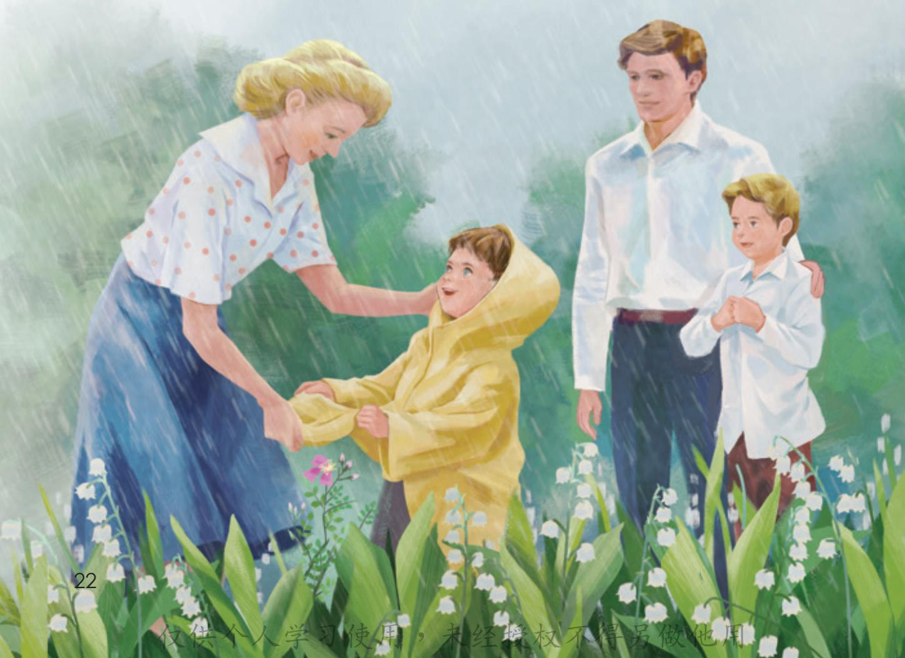

末末

周周

母母

吸吸

芬芬

芳芳

勇勇

递递

敢敢

分角色朗读课文。

读下面的句子，结合妈妈的回答，体会萨沙心里的想法。

您和托利亚都需要雨衣呀，为什么要给我呢？

这就是说，我是最弱小的了？

现在我还是最弱小的吗？

找出描写雨前、雨中野蔷薇花的句子，边读边想象画面，再选一个句子抄下来。

# 语文园地二

## 识字加油站

邻居赵叔叔是一名理发师。

教师

chéng 工程师

mó shù 魔术师

jiàn zhù建筑师

fà。理发师

yǎn演员

yíng营业员

wù服务员

pàn 裁判员

sì yǎng 饲养员

# chéng mó shù jiàn zhù fà yǎn yíng wù pàn sì yǎng 程魔术建筑发演营务判饲养

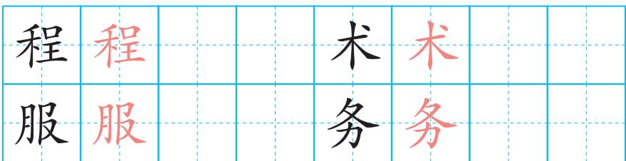

## 字词句运用

下面这些字查什么部首？查一查，记一记。

鹿麝 金鉴 高敲 音章

黑默衣裂辛辣 鱼鲁

记住这些可以作为部首的字，我查字典更快了。

我翻看字典的部首目录，又知道了一些新部首。

读句子，体会加点词语的意思，说说你的发现。

这糕要很多很多人才能做成，一定特别大。

难道它的味道很特别吗？

鼹鼠先生经过狐狸太太家，正巧，狐狸太太走出门。

一块平平常常的糕，要经过很多很多人的劳动，才能摆在我们面前。

把你积累的词语写下来。

形容生气：气呼呼

形容高兴：兴高采烈

形容难过：悲伤

## 日积月累

yǔ méi guī yú予人玫瑰，手有余香。

平时肯帮人，急时有人帮。

与其锦上添花，不如雪中送炭。

## 写话

## 我的好朋友

写一写你的一个好朋友。向大家介绍一下：他是谁？长什么样子？你们经常一起做什么？

<table><tr><td rowspan=1 colspan=1>谁</td><td rowspan=1 colspan=1>长什么样子</td><td rowspan=1 colspan=1>经常一起做的事</td></tr><tr><td rowspan=1 colspan=1>张池</td><td rowspan=1 colspan=1>◇他的个子高高的。◇他笑起来有小酒窝。</td><td rowspan=1 colspan=1>我们天天一起上学，一起回家。◇我们经常一起踢毽子。</td></tr></table>

## 我爱阅读

## jì zé 雷锋日记二则①

1960年8月20日

shè

望花区成立了一个人民公社，我把平时节约下qiányuán liáo zāo hóng  
来的一百元钱支援了他们；辽阳市遭受了洪水的灾jiǎn cún  
害，我把省吃俭用积存的一百元钱寄给了辽阳灾区shǎ  
人民。有些人说我是“傻子”，是不对的。我要做一个有利于人民、有利于国家的人。如果说这是“傻子”，那我是甘心愿意做这样的“傻子”的。shè  
革命需要这样的“傻子”，建设也需要这样的“傻子”。我就是长着一个心眼，我一心向着党，向着社会主义，向着共产主义。

## 1961年10月15日

今天是星期日，我没有外出，给班里的同志洗rù kuí bǔ xiéchuī  
了五床褥单，帮高奎云战友补了一床被子，协助炊sǎo shì  
事班洗了六百多斤白菜，打扫了室内外卫生，还做líng suì  
了一些零碎事…总的来说，今天我尽到了一个勤  
务员应尽的义务，虽然累了一点儿，也感到很快活。  
班里的同志感到很奇怪，不知道谁把褥单都洗得干jìng  
干净净的。高奎云同志惊奇地说：“谁把我的破被子  
huàn shí  
换走了？”其实他还不知道是我给他补好的呢！我yīng  
觉得当一名无名英雄是最光荣的。今后还应该多做fán  
一些日常的、细小的、平凡的工作，少说漂亮话。

# 快乐读书吧

# 读读儿童故事

wán dǒng shàn liáng故事里的儿童，有的顽皮、可爱，有的懂事、善良；有xīn yù的过着平淡温馨的生活，有的会有意想不到的奇遇…让我们找一些儿童故事书，一起读一读。

读书的时候，我们可以先看看书的目录。目录告诉我们书里主要写了什么，要读的内容从哪一页开始。

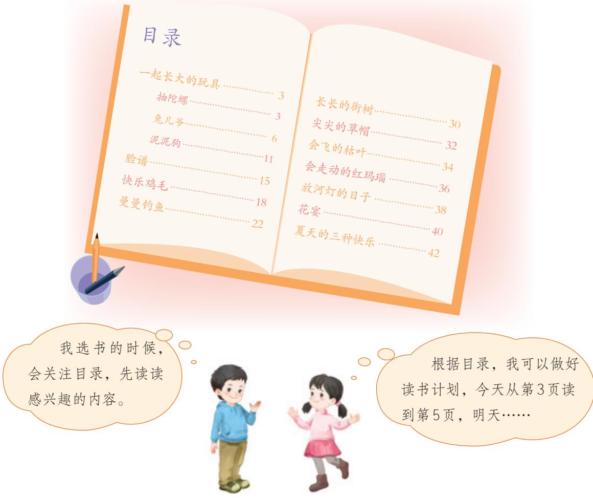

第三单元·识字

## zhōu yáo 1 神州谣 ①

huá我神州，称中华，山川美，可入画。

yǒng  
黄河奔，长江涌，sǒng  
长城长，珠峰耸。

gé xiá台湾岛，隔海峡，yǔ lù与大陆，是一家。

gè yì nóng 各民族，情谊浓， qí fèn fán 齐奋发，共繁荣 神神州州

华华各各

族族情情

谊谊

齐 齐

朗读课文。

读句子，注意加点的词。

黄河奔，长江涌，

“耸”让我感受

到了……

长城长，珠峰耸。

读一读，记一记。

yán 华夏儿女 炎黄子孙

wēi 神州大地 巍巍中华

民族团结 世界大同

qiáng 奋发图强 繁荣昌盛

## chuán tǒng2 传统节日

春节到，人欢笑，   
tiē   
贴窗花，放鞭炮。 xiāo   
元宵节，看花灯， xiàng cháo   
大街小巷人如潮。   
清明节，雨纷纷， jì sǎo   
先人墓前去祭扫。   
过端午，赛龙舟， ài táng   
粽香艾香满堂飘。 qǐ   
七月七，来乞巧， láng   
牛郎织女会鹊桥。 bǐng   
过中秋，吃月饼，   
十五圆月当空照。

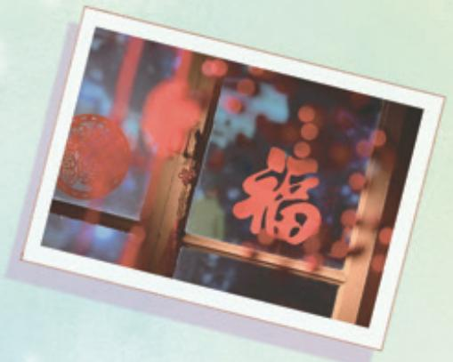

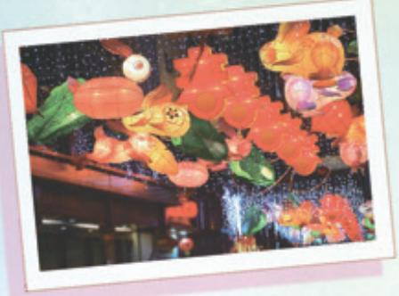

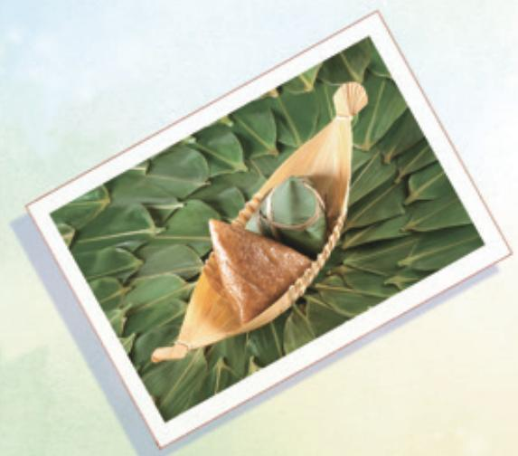

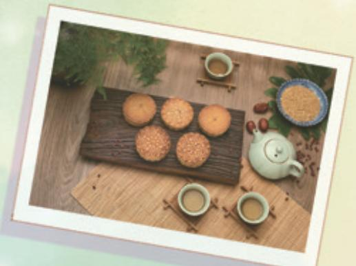

重阳节，要敬老，shǎng jú踏秋赏菊去登高。转眼又是新春到，全家团圆真热闹。

chuán tǒng tiē xiāo xiàng cháo jì sǎo ài táng qǐ láng bǐng shǎng jú 传统贴宵巷潮祭扫艾堂乞郎饼赏菊

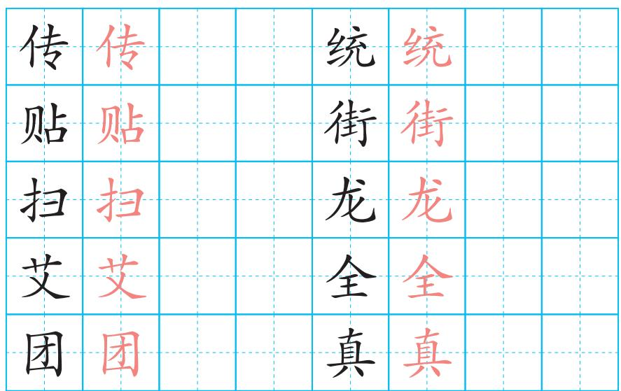

朗读课文。背诵课文。

按照时间顺序排列下面的节日，再选一两个说说你是怎样过节的。端午节 清明节 元宵节 春节 重阳节 中秋节

# ③“贝”的故事

一些生活在水里的动物，用贝壳保护自己的身jiǎ gǔ体。甲骨文中的“贝”字，就像一种海贝的样子。

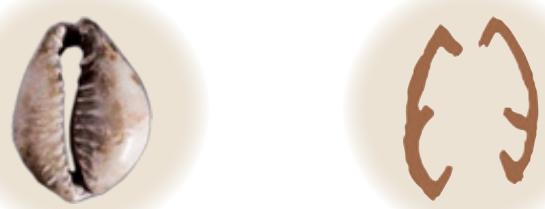

古时候，人们觉得贝壳很漂亮，很珍贵，喜欢把shì pǐn ér xié它们当作饰品戴在身上。而且贝壳可以随身携带，不yì sǔn qián bì容易损坏，于是古人还把贝壳当作钱币。所以，用piān cái zhuàn péi gòu“贝”作偏旁的字大多与钱财有关，如“赚、赔、购、贫、货”。

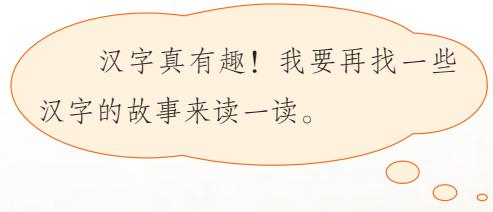

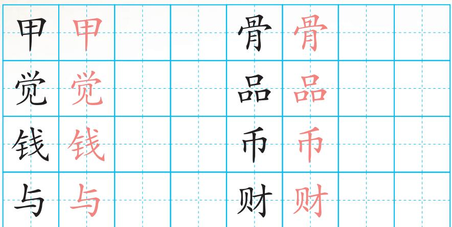

單聲藻簧梯器務易損戰吊財簾膳病

朗读课文。讲一讲“贝”的故事。

读一读，记一记。

珍贵 贵重

损坏破损

硬币纸币

财富财产

赔本赔礼

购买采购

看图，猜猜加点字的偏旁与什么有关。

铜镜

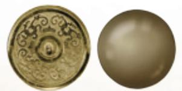

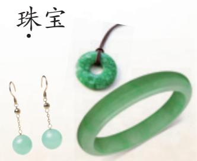

# ④中国美食

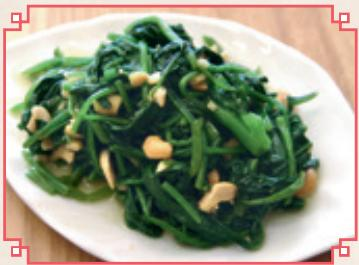  
bàn bō 凉拌菠菜

  
jiān fǔ 香煎豆腐

  
qié红烧茄子

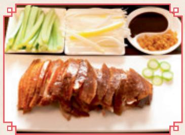  
kǎo 烤鸭

  
水煮鱼

  
cōng 葱爆羊肉

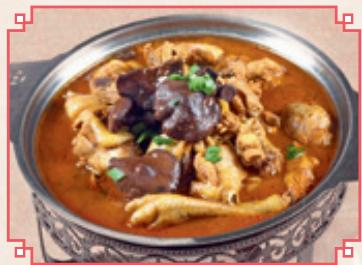  
dùn mó gū 小鸡炖蘑菇  
我还能说出更多的家乡美食。

zhēng jiǎo 蒸饺

zhá jiàng 炸酱面

zhōu 小米粥

dàn 蛋炒饭

bàn bō jiān fǔ qié kǎo cōng dùn 拌菠煎腐茄烤葱炖

mó gū zhēng jiǎo zhá jiàng zhōu dàn

蘑菇蒸饺炸酱粥蛋

食食 茄茄

烤烤 鸭鸭

煮煮 鸡鸡

蛋蛋 饭饭

## 读一读，说说制作哪些食物时需要用到这些方法。

炒烤烧爆炖炸

煎蒸煮

我知道：煮鸡蛋、烤羊肉串、清蒸鲈鱼……

用部首查字法查下面的字，再说说你的发现。

灶焰烫煲熏 可

# 语文园地三

## 识字加油站

读下面的词语，你会想到什么食物？

jīn   
甜津津   
nì   
油腻膩

suān liū 酸溜溜

mián 软绵绵

là hū   
辣乎乎 cuì   
脆生生   
pēn   
香喷喷   
bāng   
硬邦邦

jīn suān liū là hū pēn nì mián cuì bāng 津酸溜辣乎喷腻绵脆邦

乎乎

## 字词句运用

读一读，和同学交流你的发现。

烧煮 烤蒸 炒煎

我知道带“火”和“…”的字多与“火”有关。

想惊 感怕 hu 怒

品剑切刮剪刺分

我发现“慕”中的“小”也和“心”有关。

## 选一选，连一连。

遇到不认识的字，可以根据偏旁猜猜意思，再查字典验证。

霄宵削

元

苹果 九云外

赔

陪

土

培

伴

钱

## 和同学交流你在写字方面的心得体会。

写字之前，我会认真观察字的结构和笔画。

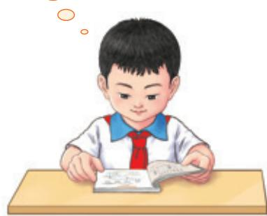

保持正确的坐姿和执笔姿势，可以帮助我们把字写好。

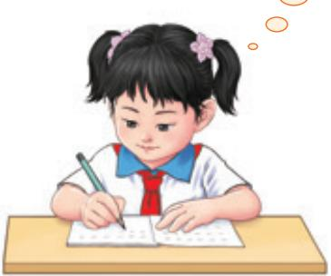

## 日积月累

子鼠 chén 辰龙 shēn 申猴

牛 ū酉 蛇鸡 寅午如戌 虎马 狗

mǎo   
卯兔 wèi   
未羊 hài zhū 亥猪

## 口语交际

## 长大以后做什么

你长大以后想做什么？为什么？跟小组同学说一说你的愿望，然后问一问他们的愿望是什么。

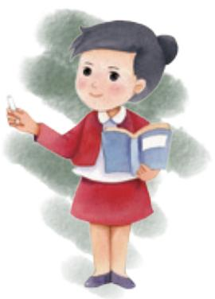

清楚地表达想法，简单说明理由。

◎对感兴趣的内容多问一问。

## 我爱阅读

zhū一株紫丁香

diǎn  
踮起脚尖儿，  
走进安静的小院，  
我们把一株紫丁香，zāi  
栽在老师窗前。

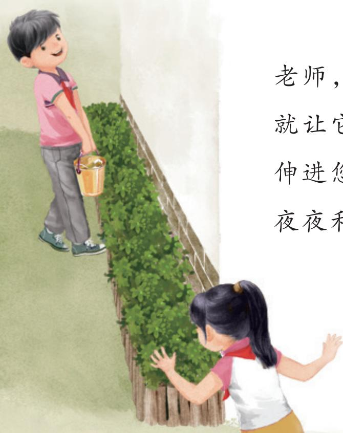

老师，老师，就让它绿色的枝叶，伸进您的窗口，夜夜和您做伴。

①本文作者滕毓旭，选作课文时有改动。

老师绿叶在风里沙沙，那是我们给您唱歌，juàn帮您消除一天的疲倦。

老师  
满树盛开的花儿，  
那是我们的笑脸，  
感谢您时时把我们挂牵。kùn zhǎ  
夜深了，星星困得眨眼，  
老师，休息吧，mèng  
让花香飘进您的梦里，  
那梦啊，准是又香又甜。

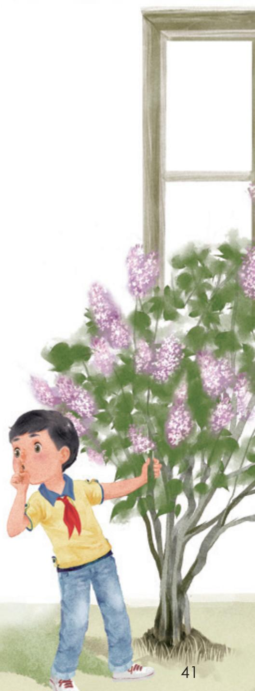

第四单元·阅读

# mèng 8 彩色的梦

我有一大把彩色的梦，  
有的长，有的圆，有的硬。tǎng liáo  
他们躺在铅笔盒里聊天，bèng  
一打开，就在白纸上跳蹦。

脚尖滑过的地方，

大块的草坪，绿了；

大朵的野花，红了；

大片的天空，蓝了，

蓝——得——透——明！

① 本文作者高洪波，选作课文时有改动。

在葱郁的森林里，  
雪松们拉着手，  
请小鸟留下歌声。cōng  
小屋的烟囱上，bān  
结一个苹果般的太阳，  
又大—又红！

联系插图和词语“森林”，我能猜到“葱郁”的意思。

我的彩色铅笔，jīng  
是大森林的精灵。jìng  
我的彩色梦境，  
有水果香，有季节风，dīng níng  
还有紫葡萄的叮咛，  
在溪水里流动……

mèng tǎng liáo bèng yù cōng bān jīng jìng dīng níng 梦躺聊蹦郁囱般精境叮咛

<table><tr><td>梦</td><td>梦铅森苹灵</td><td></td><td></td><td></td><td>硬</td><td>硬</td><td></td><td></td><td></td></tr><tr><td rowspan="2">钊 几口</td><td rowspan="2"></td><td></td><td></td><td rowspan="2"></td><td rowspan="2"></td><td rowspan="2"></td><td rowspan="2"></td><td rowspan="2"></td><td rowspan="2"></td></tr><tr><td></td><td></td></tr><tr><td rowspan="2"></td><td></td><td></td><td></td><td></td><td></td><td></td><td></td><td rowspan="2"></td><td rowspan="2"></td></tr><tr><td></td><td></td><td></td><td></td><td></td><td></td><td></td></tr><tr><td rowspan="2"></td><td></td><td></td><td></td><td></td><td></td><td></td><td></td><td></td><td></td></tr><tr><td></td><td></td><td></td><td></td><td>盒结</td><td></td><td></td><td></td><td></td></tr><tr><td rowspan="2">森苹灵</td><td></td><td></td><td></td><td></td><td>精</td><td>盒结精流</td><td></td><td></td><td></td></tr><tr><td></td><td></td><td></td><td></td><td>精</td><td></td><td></td><td></td><td></td></tr><tr><td rowspan="2"></td><td></td><td></td><td></td><td></td><td></td><td></td><td></td><td></td><td></td></tr><tr><td></td><td></td><td></td><td></td><td></td><td></td><td></td><td></td><td></td></tr><tr><td rowspan="2"></td><td></td><td></td><td></td><td></td><td></td><td></td><td></td><td></td><td></td></tr><tr><td></td><td></td><td></td><td></td><td></td><td></td><td></td><td></td><td></td></tr><tr><td rowspan="2"></td><td></td><td></td><td></td><td></td><td></td><td></td><td></td><td></td><td></td></tr><tr><td></td><td></td><td></td><td></td><td>流</td><td></td><td></td><td></td><td></td></tr><tr><td rowspan="2"></td><td></td><td></td><td></td><td></td><td></td><td></td><td></td><td></td><td></td></tr><tr><td></td><td></td><td></td><td></td><td></td><td></td><td></td><td></td><td></td></tr><tr><td rowspan="2"></td><td></td><td></td><td></td><td></td><td></td><td></td><td></td><td></td><td></td></tr><tr><td></td><td></td><td></td><td></td><td></td><td></td><td></td><td></td><td></td></tr><tr><td rowspan="2"></td><td></td><td></td><td></td><td></td><td></td><td></td><td></td><td></td><td></td></tr><tr><td></td><td></td><td></td><td></td><td></td><td></td><td></td><td></td><td></td></tr><tr><td rowspan="2"></td><td></td><td></td><td></td><td></td><td></td><td></td><td></td><td></td><td></td></tr><tr><td></td><td></td><td></td><td></td><td></td><td></td><td></td><td></td><td></td></tr><tr><td rowspan="2"></td><td></td><td></td><td></td><td></td><td></td><td></td><td></td><td></td><td></td></tr><tr><td></td><td></td><td></td><td></td><td></td><td></td><td></td><td></td><td></td></tr><tr><td rowspan="2"></td><td></td><td></td><td></td><td></td><td></td><td></td><td></td><td></td><td></td></tr><tr><td></td><td></td><td></td><td></td><td></td><td></td><td></td><td></td><td></td></tr><tr><td rowspan="2"></td><td></td><td></td><td></td><td></td><td></td><td></td><td></td><td></td><td></td></tr><tr><td></td><td></td><td></td><td></td><td></td><td></td><td></td><td></td><td></td></tr><tr><td rowspan="2"></td><td></td><td></td><td></td><td></td><td></td><td></td><td></td><td></td><td></td></tr><tr><td></td><td></td><td></td><td></td><td></td><td></td><td></td><td></td><td></td></tr></table>

朗读课文，边读边想象，体会“我”对彩色梦境的喜爱。

你想用彩色铅笔画些什么？试着仿照第2小节或第3小节，把想画的内容用几句话写下来。

读一读，记一记。

聊天 闲聊 无聊

mèn 葱郁 浓郁郁闷

精灵 精力 精彩

梦境 环境 境界

# pǐ⑨一匹出色的马

一个春天的傍晚，妈妈牵着妹妹，爸爸牵着我，jiāo一起到郊外去散步。我们沿着一条小河走。河水碧绿wēi fàn bō wén碧绿的，微风吹过，泛起层层波纹。河岸上垂下来的柳叶，拂过妈妈和爸爸的头发， 联系生活实际，我知道了“波纹”的意思。我和妹妹看着都笑了。

路的一边是田野，葱葱绿绿的，非常可爱，像一tǎn片柔软的绿毯。

春天的郊外，景色异常美丽。我们一边看，一边liàn shě走，路已经走了不少，却还恋恋不舍，不想回去。

当我们往回走的时候，妹妹求妈妈抱她：“我很累，走不动了，抱抱我。”

妈妈摇摇头，回答说：“不行啊，我也很累，抱不动你了。”

妹妹转过头求爸爸。爸爸不作声，他松开我的

## 人民教育出版社

zhū shí手，从路旁一株柳树下，拾起一根又长又细的枝条，把它递给了妹妹，说：“这是一匹出色的马，你走不动了，就骑着它回家吧。”

妹妹高兴地跨上“马”，蹦蹦跳跳地奔向前去，不时回头看看我们。等我们回到家时，她站在门口，jiāo ào骄傲地说：“看！我比你们先到家。”

pǐ jiāo wēi fàn bō wén yì liàn shě qiú zhū shí qí jiāo ào 匹郊微泛波纹异恋舍求株拾骑骄傲 试着有感情地朗读课文，感受美好的亲情。

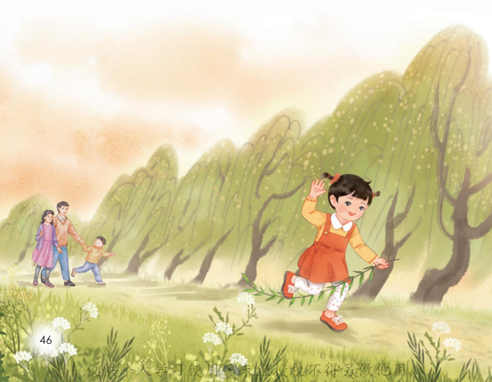

读句子，体会妹妹的变化，再说说她为什么会有这样的变化。

当我们往回走的时候，妹妹求妈妈抱她：“我很累，走不动了，抱抱我。”

妹妹高兴地跨上“马”，蹦蹦跳跳地奔向前去，不时回头看看我们。

找出描写郊外景色的句子，边读边想象画面，再选一个句子抄下来。

# ⑩0枫树上的喜鹊

我们村的渡口旁有一棵枫树，我很喜欢它。它好像yīn把很大又很高的绿色太阳伞，一直打开着。它的绿荫bì遮蔽了渡口。枫树上有一个我能猜出“绿荫”喜鹊窝，我喜欢极了。 的意思。

是的，我喜欢站在枫树下，抬头看喜鹊窝。我常常觉得喜鹊会跟我说话，我像童话书里那样，在心中ā yí称呼她喜鹊阿姨。

我真是喜欢极了。上个星期天早上，我正要撑着渡船到对岸的树林里去打柴，发现喜鹊阿姨的窝里已经有了几只小喜鹊。

我真是像童话书里那样，在心中称呼他们喜鹊弟弟。

从那天起，我一有空，便来到渡口边，站在枫树下看望我的喜鹊弟弟。喜鹊弟弟长得真快，好极了。我看见喜鹊阿姨站在窝边，一会儿教喜鹊弟弟唱歌，一会儿教他们做游戏，一会儿教他们学自己发明的拼音字母……

“鹊！鹊！鹊！”喜鹊阿姨教道。

我知道，这便是α、o、e。

喜鹊弟弟也跟着学：“鹊，鹊，鹊……”

今天早上，太阳从渡口对岸的山冈后面升上来了，我看见喜鹊阿姨站在窝边，指着上升的太阳，问喜鹊弟弟：“鹊！鹊鹊鹊？”

我懂得，她问话的意思是：“看！那是什么？”

喜鹊弟弟一齐快乐地回答：“鹊！鹊鹊！鹊鹊鹊！”

我懂得，喜鹊弟弟很快给出了答案：“妈妈，那是太阳！太阳升上来了！”

我真高兴啊！

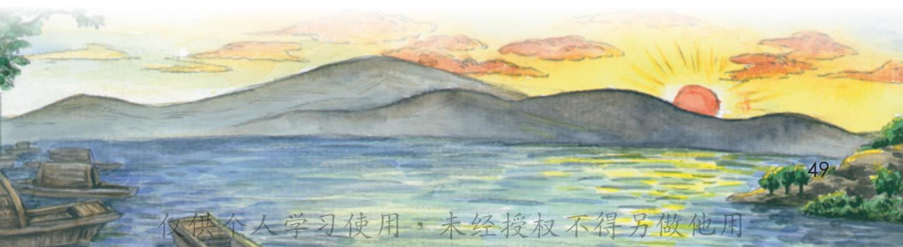

dù yīn bì ā yí chēng biàn gāng dǒng àn 渡荫蔽阿姨撑便冈懂案

默读课文。文中反复说“我喜欢”，说说“我”喜欢的是什么。

看到下面的情景，你会想到什么？试着写下来。

我看见喜鹊阿姨找了一条虫子回来，站在窝边。喜鹊弟弟一齐叫道：“鹊！鹊！鹊鹊鹊！”

我懂得，他们的意思是：“

喜鹊阿姨把虫子送到喜鹊弟弟嘴里，叫起来：“鹊，鹊，鹊……”

我知道，她是在说：“99

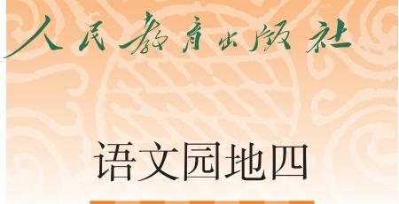

## 识字加油站

dǎo wēng xiàng 拨浪鼓 不倒翁 七巧板 橡皮泥 qiāng kòng tǎn kè háng móxíng 玩具枪 遥控坦克 航母模型

dǎo wēng xiàngqiāng kòng tǎn kè háng mó xíng 倒翁橡枪控坦克航模型

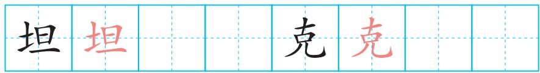

## 字词句运用

照样子，用加点的词语说句子。

我看见喜鹊阿姨站在窝边，一会儿教喜鹊弟弟唱歌，一会儿教他们做游戏，一会儿教他们学自己发明的拼音字母……

## 照样子说一说，再写一写自己喜欢的景物。

田野  
葱葱绿绿的tǎn  
像一片柔软的绿毯  
天上的云  
雪白雪白的  
好像一群小绵羊

我会说：天上的云一团一团的，好像巨大的棉花糖……

大树又粗又壮就像……

## 日积月累

失信不立。

诚信者，天下之结也。

小信成则大信立。

zhuàn《左传》

《管子》

hán 《韩非子》

# 人民教育出版社

## 写话

## 看图写故事

看图，想一想：小青虫、蚂蚁和蝴蝶利用鸡蛋壳做了哪些事情？有哪些有趣的经历？把它们一天的经历写下来吧！

写的时候，可以用上下面的词语。

早上 过了一会儿

到了下午

天黑了

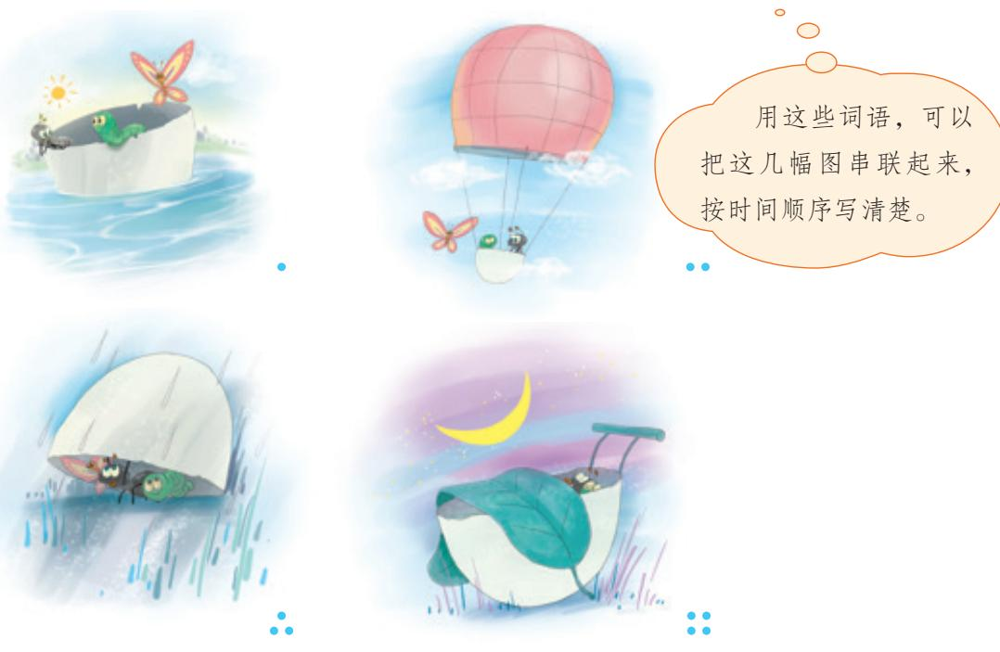

## 我爱阅读

手影戏①

shāng diàn

晚上，妈妈到商店去买东西，宁宁在街灯下等妈妈。他站着没劲，独自玩起了手影戏。

①本文作者张彦，选作课文时有改动。

# 人民教育出版社

qū qiáng他双手一屈一伸，在灯光前一照，墙壁上马上映出一个dùn黑影来：走路一顿一顿，尖嘴巴一张一合，这是一只在找鸡zǎi妈妈的小鸡崽。

忽然，小鸡的对面也出现了一个手影。一对长耳朵，一pū个短尾巴，噗，噗，跳过来。哎呀，不能再跳过来，再跳要yā bà压着小鸡了。可是兔子挺霸道的，还在跳过来。噗！噗！宁mò宁回头一看，一个陌生的男孩也在做手影。

谁怕你？宁宁手一变，墙上出现一只猫—喵，喵，向兔子扑去。

那个男孩吓了一跳，连忙将兔子变成了狗——汪汪汪，狗咬猫。

鸣哇，鸣哇，猫变成了大熊。

啊鸣，啊鸣，老虎要吃熊。

比老虎厉害的还有什么？宁宁想不起来，他差点儿哭了。

干吗要跟人吵架？还是跟他和好吧。宁宁马上变出一只lēng鸽子来：尖尖的嘴，长长的翅膀，扑棱棱，鸽子飞了起来。

那个男孩愣了一阵，也变出了一只鸽子。

看，现在两只鸽子偎依在一起了。

妈妈出来了，她看见宁宁与一个男孩玩得正欢呢。

# yù zé11 寓言二则

wáng bǔ láo 亡羊补牢 ①

从前有个人，养了几只羊。一天早上，他去放juàn kū lóng羊，发现羊少了一只。原来羊圈破了个窟窿，夜里狼diāo从窟窿钻进去，把羊叼走了。

邻居劝他说：“赶紧把羊圈修一修，堵上那个窟 窿吧！”

他说：“羊已经丢了，还修羊圈干什么？”

第二天早上，他去放羊，发现羊又少了一只。原来狼又从窟窿钻进去，把羊叼走了。

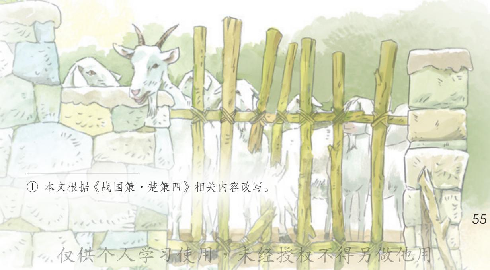

## 人民教育出版社

他很后悔没有听邻居的劝告，心想，现在修还不shí晚。他赶紧堵上那个窟窿，把羊圈修得结结实实的。从此，他的羊再也没丢过。

## yà揠苗助长

古时候有个人，他巴望自己田里的禾苗长得快些，天天到田边去看。可是，一天，两天，三天，禾jiāo苗好像一点儿也没有长高。他在田边焦急地转来转去，自言自语地说：“我得想个办法帮它们长。”

一天，他终于想出了办法，就急忙跑到田里，把禾苗一棵一棵往高里拔。从中午一直忙到太阳落山，jīn弄得筋疲力尽。

他回到家里，一边大口喘气一边说：“今天可把fèi jié我累坏了！力气总算没白费，禾苗都长高了一大截。”

他的儿子不明白是怎么回事，第二天跑到田里一看，禾苗都枯死了。

yù zé wáng bǔ láo juàn diāo xiū 寓则亡补牢圈叼修 dǔ huǐ shí jiāo jīn chuǎn fèi jié 堵悔实焦筋喘费截

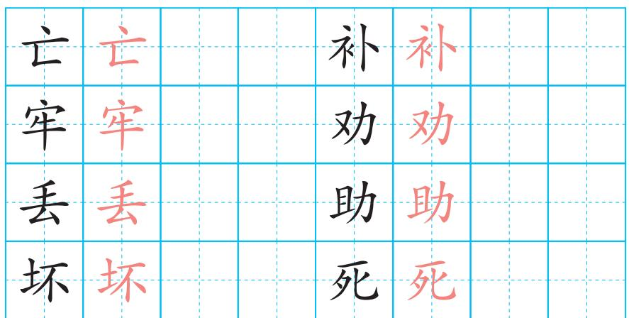

默读课文。说说“亡羊补牢”“揠苗助长”两个成语的意思。

读一读，说说每组的两个句子有什么不同。

ku long他堵上那个窟窿，把羊圈修得结结实实的。他赶紧堵上那个窟窿，把羊圈修得结结实实的。

他在田边转来转去。

他在田边焦急地转来转去。

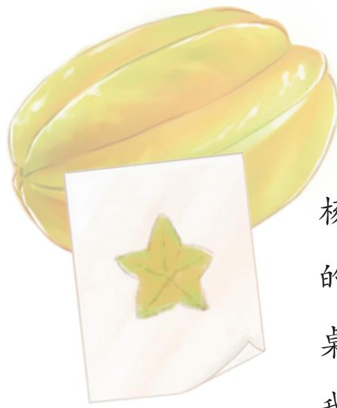

## ①② 画杨桃①

有一次上图画课，老师把两个  
杨桃摆在讲桌上，要同学们画。我shì  
的座位在教室前排靠边的地方，讲  
桌上那两个杨桃的一端正对着我。  
我看到的杨桃根本不像平时看到的

ér那样，而像是五个角的什么东西。我认认真真地看，老老实实地画，自己觉得画得很准确。

当我把这幅画交出去的时候，班里几个同学看见hā了，哈哈大笑起来。

“杨桃是这个样子的吗？”

“倒不如说是五角星吧！”

老师看了看这幅画，到我的座位上坐下来，审视了一下讲桌上的杨桃，然后回到讲桌前，举起我的那页画纸，问大家：

“这幅画画得像不像？”

“不像！”

“它像什么？”

“像五角星！”

sú shang老师的神情变得严肃了。半晌，他又问道：“画杨桃画成了五角星，好笑吗？”

“好——笑！”有几个同学抢着答道，同时发出xī嘻嘻的笑声。

于是，老师请这几个同学轮流坐到我的座位上。他对第一个坐下的同学说：“现在你看看那杨桃，像你平时看到的杨桃吗？”

“不……像。”

“那么，像什么呢？”

“像……五……五角星。”

“好，下一个。”

老师让这几个同学回到自己的座位上，然后和颜yuè悦色地说：“大家发现了吗？看的角度不同，杨桃的样子也就不一样。当我们看见别人把杨桃画成五角星的时候，不要忙着发笑，要看看人家是从什么角度看的。”

老师的教诲让我终生难忘。

shì ér fú hā shěn sù shǎng xī yuè huì 室而幅哈审肃晌嘻悦诲

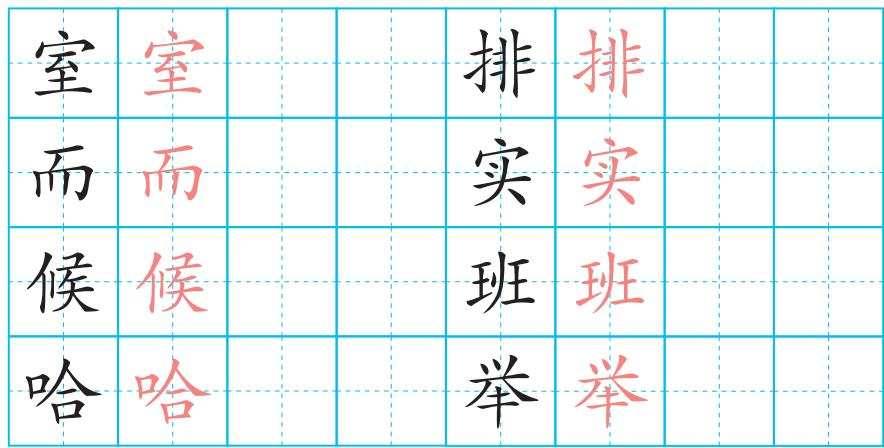

朗读课文，注意对话的语气。

看到“我”画的杨桃，老师做了什么，同学们的态度发生了什么变化？用自己的话说一说。

读一读，记一记。

卧室教室办公室

而且 反而 视而不见

审题审美 审判员

yú喜悦 愉悦 赏心悦目

# 1③ 小马过河

péng马棚里住着一匹老马和一匹小马。

有一天，老马对小马说：“你已经长大了，能帮妈妈做点儿事吗？”小马连蹦带跳地说：“怎么不能？我很愿意帮您做事。”老马高兴地说：“那好啊，你把tuó fáng这半口袋麦子驮到磨坊去吧。”

小马驮起口袋，飞快地往磨坊跑去。跑着跑着，dǎng huā一条小河挡住了去路，河水哗哗地流着。小马为难了，心想：我能不能过去呢？如果妈妈在身边，问问她该怎么办，那多好啊！可是他离家已经很远了。

小马向四周望望，看见一头老牛在河边吃草，小dā bó马嗒嗒嗒跑过去，问道：“牛伯伯，请您告诉我，这

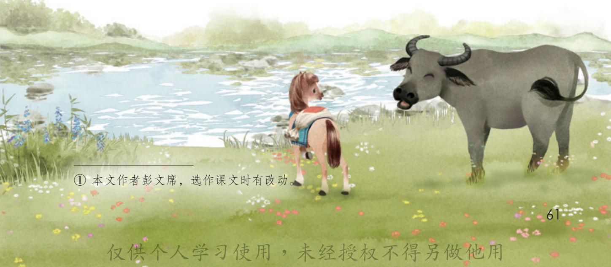

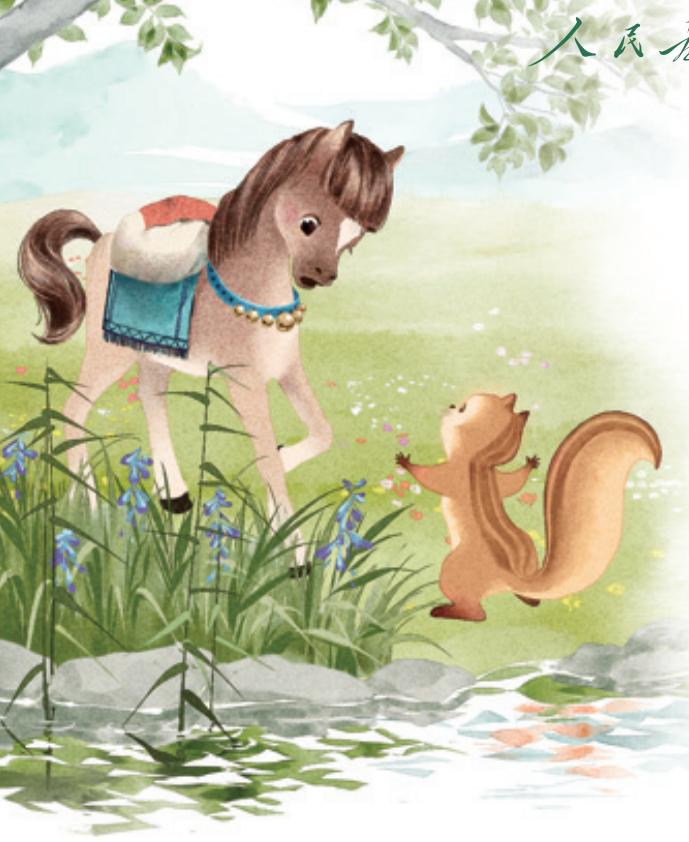

tāng条河，我能蹚过去吗？”qiǎn gāng老牛说：“水很浅，刚没过小腿，能蹚过去。”

小马听了老牛的话，立刻跑到河边，准备蹚过去。突然，从树上跳下一只松鼠，拦住他大叫：“小马！别过河，别过河，你

yān会淹死的！”小马吃惊地问：“水很深吗？”松鼠认真地说：“深得很哩！昨天，我的一个伙伴就是掉在这条河里淹死的！”

小马连忙收住脚步，不知道怎么办才好。他叹了ài口气，说：“唉！还是回家问问妈妈吧！”

小马甩甩尾巴，跑回家去。妈妈问他：“怎么回来啦？”小马难为情地说：“一条河挡住了去路，我……我过不去。”妈妈说：“那条河不是很浅吗？”小马说：“是啊！牛伯伯也这么说。可是松鼠说河水很深，还淹死过他的伙伴呢！”妈妈说：“那么河水

## 人民教育出版社

到底是深还是浅呢？你仔细想过他们的话吗？”小马低下了头，说：“没……没想过。”妈妈亲切地对小马说：“孩子，光听别人说，自己不动脑筋，不去试试，是不行的。河水是深是浅，你去试一试就知道了。”

小马跑到河边，刚刚抬起前蹄，松鼠又大叫起来：“怎么？你不要命啦！”小马说：“让我试试吧！”他下了河，小心地蹚到了对岸。原来河水既不像老牛说的那样浅，也不像松鼠说的那样深。

péng tuó fáng dǎng bó qiǎn gāng yān li tàn ài tí jì 棚驮坊挡伯浅刚淹哩叹唉蹄既 分角色朗读课文，注意读出恰当的语气。

<table><tr><td rowspan=1 colspan=2>原</td><td rowspan=1 colspan=1></td><td rowspan=1 colspan=1></td><td rowspan=1 colspan=1></td><td rowspan=1 colspan=1></td><td rowspan=1 colspan=1></td><td rowspan=1 colspan=1></td><td rowspan=1 colspan=2>立</td><td rowspan=1 colspan=1></td><td rowspan=1 colspan=1></td><td rowspan=1 colspan=1></td><td rowspan=1 colspan=1></td><td rowspan=1 colspan=1></td><td rowspan=1 colspan=1></td></tr><tr><td rowspan=1 colspan=1>尺</td><td rowspan=1 colspan=1></td><td rowspan=1 colspan=1></td><td rowspan=1 colspan=1></td><td rowspan=1 colspan=1></td><td rowspan=1 colspan=1></td><td rowspan=1 colspan=1></td><td rowspan=1 colspan=1></td><td rowspan=1 colspan=2>思</td><td rowspan=1 colspan=1></td><td rowspan=1 colspan=1></td><td rowspan=1 colspan=1></td><td rowspan=1 colspan=1></td><td rowspan=1 colspan=1></td><td rowspan=1 colspan=1></td></tr><tr><td rowspan=1 colspan=1></td><td rowspan=1 colspan=1></td><td rowspan=1 colspan=1></td><td rowspan=1 colspan=1></td><td rowspan=1 colspan=1></td><td rowspan=1 colspan=1></td><td rowspan=1 colspan=1></td><td rowspan=1 colspan=1></td><td rowspan=1 colspan=1>人</td><td rowspan=1 colspan=1></td><td rowspan=1 colspan=1></td><td rowspan=1 colspan=1></td><td rowspan=1 colspan=1></td><td rowspan=1 colspan=1></td><td rowspan=1 colspan=1></td><td rowspan=1 colspan=1></td></tr><tr><td rowspan=1 colspan=1></td><td rowspan=1 colspan=1></td><td rowspan=1 colspan=1></td><td rowspan=1 colspan=1></td><td rowspan=1 colspan=1></td><td rowspan=1 colspan=1></td><td rowspan=1 colspan=1></td><td rowspan=1 colspan=1></td><td rowspan=1 colspan=1></td><td rowspan=1 colspan=1></td><td rowspan=1 colspan=1></td><td rowspan=1 colspan=1></td><td rowspan=1 colspan=1></td><td rowspan=1 colspan=1></td><td rowspan=1 colspan=1></td><td rowspan=1 colspan=1></td></tr><tr><td rowspan=1 colspan=1></td><td rowspan=1 colspan=1></td><td rowspan=1 colspan=1></td><td rowspan=1 colspan=1></td><td rowspan=1 colspan=1></td><td rowspan=1 colspan=1></td><td rowspan=1 colspan=1></td><td rowspan=1 colspan=1></td><td rowspan=1 colspan=1>公</td><td rowspan=1 colspan=1></td><td rowspan=1 colspan=1></td><td rowspan=1 colspan=1></td><td rowspan=1 colspan=1></td><td rowspan=1 colspan=1></td><td rowspan=1 colspan=1></td><td rowspan=1 colspan=1></td></tr><tr><td rowspan=1 colspan=1>久</td><td rowspan=1 colspan=1></td><td rowspan=1 colspan=1></td><td rowspan=1 colspan=1></td><td rowspan=1 colspan=1></td><td rowspan=1 colspan=1></td><td rowspan=1 colspan=1></td><td rowspan=1 colspan=1></td><td rowspan=1 colspan=1></td><td rowspan=1 colspan=1>C</td><td rowspan=1 colspan=1></td><td rowspan=1 colspan=1></td><td rowspan=1 colspan=1></td><td rowspan=1 colspan=1></td><td rowspan=1 colspan=1></td><td rowspan=1 colspan=1></td></tr><tr><td rowspan=2 colspan=1></td><td rowspan=1 colspan=1></td><td rowspan=1 colspan=1></td><td rowspan=1 colspan=1></td><td rowspan=1 colspan=1></td><td rowspan=1 colspan=1></td><td rowspan=1 colspan=1></td><td rowspan=1 colspan=1></td><td rowspan=1 colspan=1></td><td rowspan=1 colspan=1>与</td><td rowspan=1 colspan=1></td><td rowspan=1 colspan=1></td><td rowspan=1 colspan=1></td><td rowspan=1 colspan=1></td><td rowspan=1 colspan=1></td><td rowspan=1 colspan=1></td></tr><tr><td rowspan=1 colspan=1></td><td rowspan=1 colspan=1></td><td rowspan=1 colspan=1></td><td rowspan=1 colspan=1></td><td rowspan=1 colspan=1></td><td rowspan=1 colspan=1></td><td rowspan=1 colspan=1></td><td rowspan=1 colspan=1>小</td><td rowspan=1 colspan=1>十</td><td rowspan=1 colspan=1></td><td rowspan=1 colspan=1></td><td rowspan=1 colspan=1></td><td rowspan=1 colspan=1></td><td rowspan=1 colspan=1></td><td rowspan=1 colspan=1></td></tr></table>

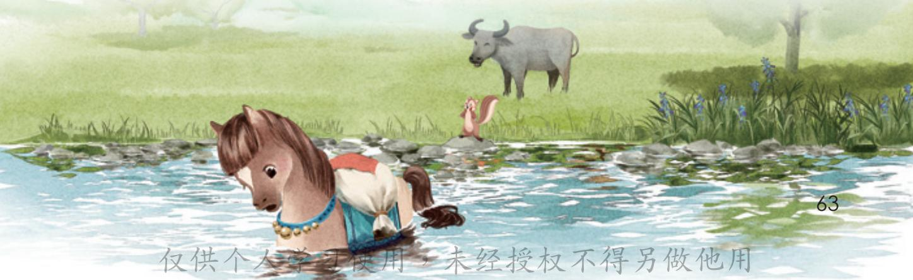

试着用下面的词语，讲讲这个故事。

驮麦子磨坊

挡住 为难 浅

拦住 吃惊 深

动脑筋 试一试 小心

你同意下面的说法吗？说说你的理由。

河水既不像老牛说的那样浅，也不像松鼠说的那样sāhuǎng深，所以老牛和松鼠对小马撒谎了。

小马向老牛、老马请教，是对的。

yàn shì

别人的经验不一定适合你。

◇什么事都要自己去试一试。

## 拓展活动

这个单元的课文让我懂得了很多道理。

我还想到了生活中的一些人和事，我们来交流一下吧！

## 识字加油站

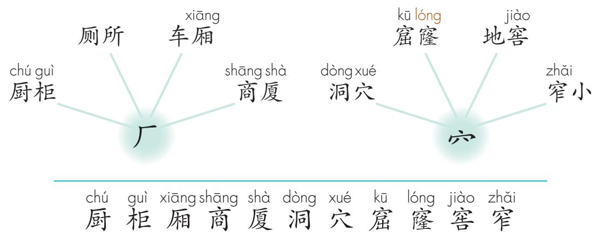

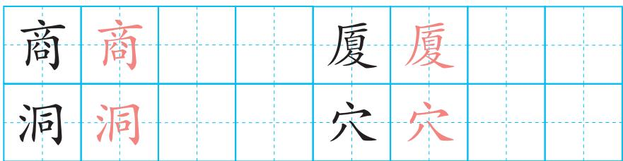

## 字词句运用

读一读，和同学交流你的发现。

寻找教诲叫嚷

伙伴周围峡谷

明亮 柔软 清澈

我发现“寻”和“找”的意思相近，“寻找”的意思也和它们差不多。

我发现还有些词是由意思相反的字组成的，如“来往、始终、买卖”。

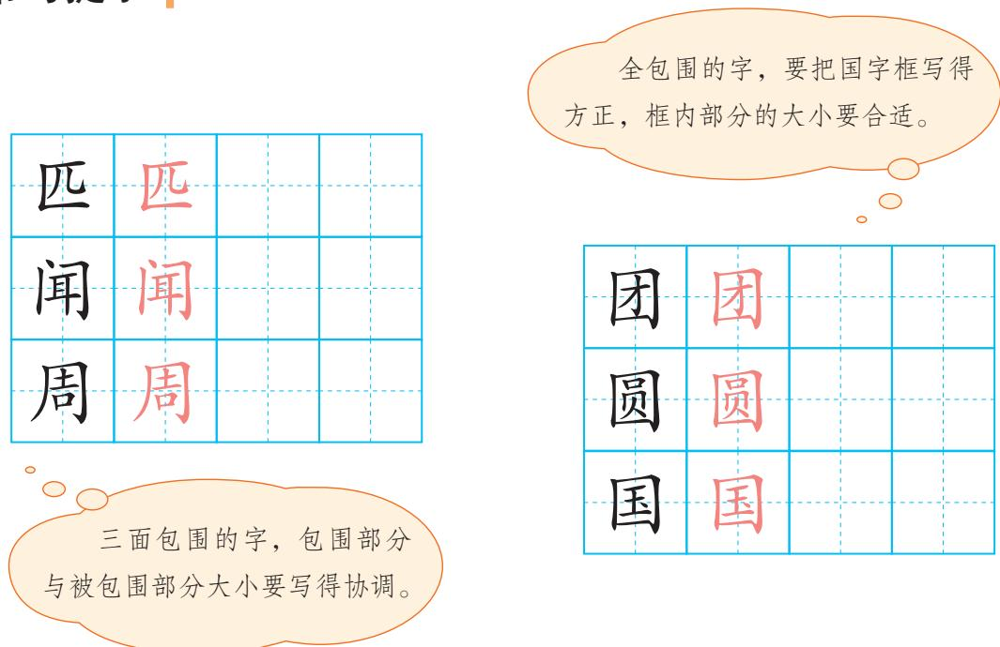

读一读，再选择一两个词语演一演。 shǎ mī hē 微笑 狂笑 傻笑 笑眯眯 笑呵呵 tì fù 眉开眼笑 破涕为笑 哈哈大笑 捧腹大笑

读句子，注意加点的词语，试试怎样读更好。

小马连蹦带跳地说：“怎么不能？我很愿意帮您做事。”

◇小马难为情地说：“一条河挡住了去路，我……我过不去。”

老师和颜悦色地说：“看的角度不同，杨桃的样子也就不一样。”

## 书写提示

<table><tr><td rowspan=2 colspan=1>匹匹</td><td rowspan=1 colspan=1></td><td rowspan=1 colspan=1></td><td rowspan=1 colspan=1></td><td rowspan=1 colspan=1></td><td rowspan=1 colspan=1></td><td rowspan=1 colspan=1></td></tr><tr><td rowspan=1 colspan=2></td><td rowspan=1 colspan=1></td><td rowspan=1 colspan=1></td><td rowspan=1 colspan=1></td><td rowspan=1 colspan=1></td></tr><tr><td rowspan=2 colspan=1>闻闻</td><td rowspan=1 colspan=2></td><td rowspan=1 colspan=1></td><td rowspan=1 colspan=1></td><td rowspan=1 colspan=1></td><td rowspan=1 colspan=1></td></tr><tr><td rowspan=1 colspan=2></td><td rowspan=1 colspan=1></td><td rowspan=1 colspan=1></td><td rowspan=1 colspan=1></td><td rowspan=1 colspan=1></td></tr><tr><td rowspan=2 colspan=1>周</td><td rowspan=2 colspan=2>周</td><td rowspan=1 colspan=1></td><td rowspan=1 colspan=1></td><td rowspan=1 colspan=1></td><td rowspan=1 colspan=1></td></tr><tr><td rowspan=1 colspan=1></td><td rowspan=1 colspan=1></td><td rowspan=1 colspan=1></td><td rowspan=1 colspan=1></td><td rowspan=1 colspan=1></td></tr></table>

## 日积月累

guān bì niǔ wà lǚ jù冠必正，纽必结，袜与履，俱紧切。zhì wùdùn wū huì置冠服，有定位，勿乱顿，致污秽。

wéi yì lì唯德学，唯才艺，不如人，当自砺。ruò yǐn qī若衣服，若饮食，不如人，勿生戚。

quī —《弟子规》

## 口语交际

## 图书借阅公约

班级图书角建起来了，和同学讨论一下：班里的图书角应该怎样管理？如，怎样借阅图书，怎样爱护图书，怎样保证大家都能借到书。讨论的时候，注意听别人的想法。

在小组讨论的基础上，形成班级的《图书借阅公约》，张贴在班里的图书角。

主动发表意见。

一个人说完，另一个人再说。

# lǔ jù 鲁班造锯 ①

相传鲁班是我国古代有名的工匠和发明家，木工用的锯，就是他发明的。

有一回，鲁班领着大家建造一座宫殿，需要很多大木tú kǎn料，于是他让徒弟们上山去砍树。当时还没有锯，砍树全靠fǔ斧子，一天砍不了几棵。鲁班很着急，就亲自上山去看。

山很陡，鲁班抓住树根和杂草，一步一步往上爬。忽huá xiě然，他的手指被一根小草划破了，流出血来。

一根小草怎么会这样厉害？鲁班仔细一看，发现小草的chǐ lá叶子边上有许多小齿。他在手指上试了试，一拉就是一道口xǐng子。这可提醒了鲁班，他想：如果用铁打一把有齿的工具，在树上来回拉，不是比用斧子砍快得多吗？

鲁班马上回去打了一把，拿到山上一试，果然又快又省力。

鲁班就这样发明了锯。

后来，人们不断改进，制造出了各种各样的锯。

人民教育出版社

第六单元·阅读

# ④古诗二首

绝 句

fǔ [唐]杜甫

lí míng   
两个黄鹂鸣翠柳， lù   
一行白鹭上青天。 hán lǐng   
窗含西岭千秋雪， bó   
门泊东吴万里船。

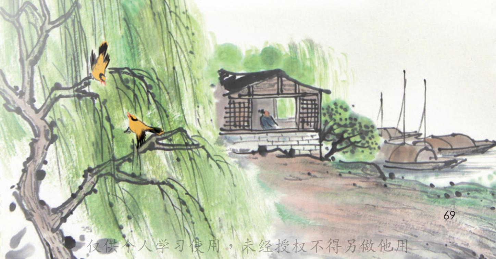

人民教育出版社

# xiǎo jìng sì 晓出净慈寺送林子方

sòng [宋]杨万里

bì jìng毕竟西湖六月中，

风光不与四时同。

接天莲叶无穷碧，

映日荷花别样红。

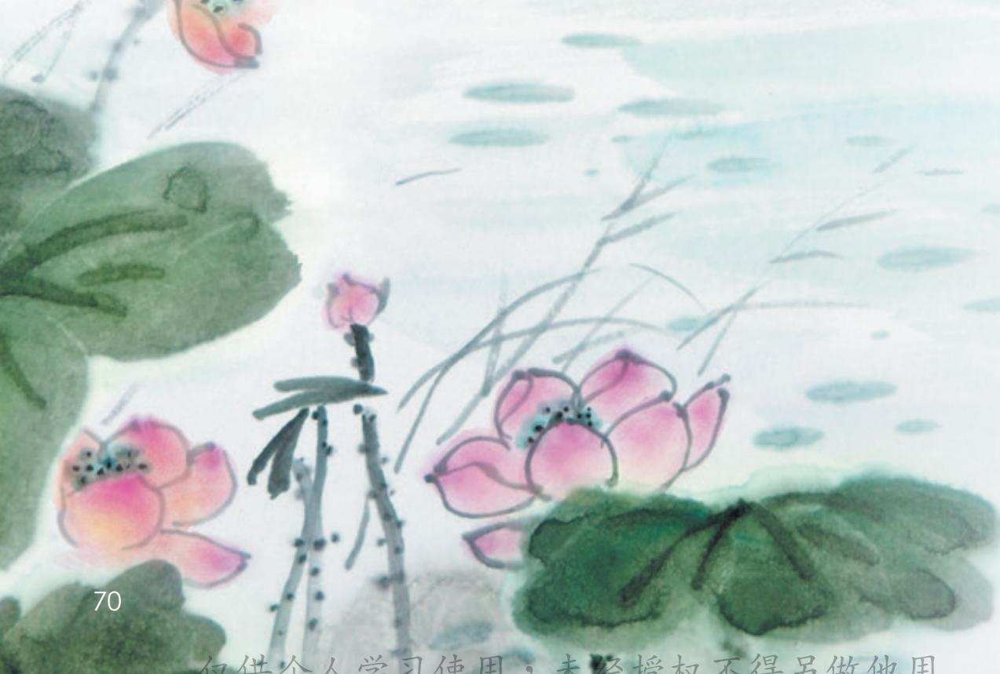

fǔ míng hán lǐng bó xiǎo jìng sì sòng bì jìng 甫鸣含岭泊晓净寺宋毕竟

含含

岭岭

泊泊

吴吴

净净

莲 莲

映映

朗读课文。背诵课文。

读下面的诗句，说说你想到了什么样的画面。

两个黄鹂鸣翠柳，一行白鹭上青天。

接天莲叶无穷碧，映日荷花别样红。

# 15雷雨 ①

满天的乌云，黑沉沉地压下来。树上的叶子一动chán不动，蝉一声也不出。

忽然一阵大风，吹得树枝乱摆。一只蜘蛛从网上垂下来，逃走了。

闪电越来越亮，雷声越来越响。

huā

哗，哗，哗，雨下起来了。

雨越下越大。往窗外望去，树啊，房子啊，都看不清了。

jiàn

渐渐地，渐渐地，雷声小了，雨声也小了。

天亮起来了。打开窗户，清新的空气迎面扑来。

雨停了。太阳出来了。一条彩虹挂在天空。蝉叫了。蜘蛛又坐在网上。池塘里水满了，青蛙也叫起来了。

yā chán zhī zhū xiǎng huā jiàn 压蝉蜘蛛响哗渐

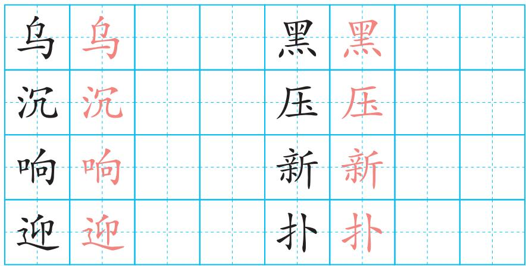

朗读课文。说说雷雨前、雷雨中和雷雨后景色的变化。 背诵课文。

读句子，注意加点的词，再选一个句子抄下来。

满天的乌云，黑沉沉地压下来。

一只蜘蛛从网上垂下来，逃走了。

一条彩虹挂在天空。

读一读，说说你见过什么样的雨，当时是怎样的情景。

<table><tr><td>毛毛雨</td><td>阵雨</td><td>雷雨</td><td>暴雨</td></tr></table>

## ⑩6要是你在野外迷了路

要是你在野外迷了路，huāng  
可千万别慌张。zhēn  
大自然有很多天然的指南针，biàn  
会帮助你辨别方向。

zhōng dǎo太阳是个忠实的向导，它在天空给你指点方向。中午的时候它在南边，地上的树影正指着北方。

zhǎn   
北极星是盏指路灯， yǒng   
它永远高挂在北方。   
要是你能认出它， chuǎng   
就不会在黑夜里乱闯。

## 人民教育出版社

pèng  
要是碰上阴雨天，  
大树也会来帮忙。chóu  
枝叶稠的一面是南方，xī  
枝叶稀的一面是北方。  
雪特别怕太阳，qú  
沟渠里的积雪会给你指点方向。  
看看哪边雪化得快，哪边化得慢，  
就可以分辨北方和南方。

要是你在野外迷了路，可千万别慌张。大自然有很多天然的指南针，需要你细细观察，多多去想。

huāng zhēn biàn zhōng dǎo zhǎn yǒng chuǎng pèng chóu xī qú 慌针辨忠导盏永闯碰稠稀渠

指指

南南

针针

帮帮

忠忠

导导

永永

夜夜

特特

积积

朗读课文。说说课文写了哪几种“天然的指南针”，它们是怎样帮助人们辨别方向的。

读一读，记一记。

慌张 惊慌 辨别 分辨

白学游

永

选做：生活中还有哪些辨别方向的办法？可以请教周围的人。

# 17太空生活趣事多

yǔ zhòu

航天员乘坐宇宙飞船飞往太空，空间站就是他们在太空的家。在太空中生活，说起来还挺有趣呢！

onu在空间站里，站着睡觉和躺着睡觉一样舒服。不wěn bì xū gù cāng过，要想睡个安稳觉，航天员必须钻进固定在舱壁上的睡袋里。不然，一不小心就会飘到别处去。

在空间站里活动也需要技巧。跟在地面上用腿脚bì行走不同，航天员在舱体里移动主要靠手臂。为了方便航天员在舱体中活动，舱壁上安装了很多特制的扶qí shè shī手。平时，航天员会依靠这些扶手或其他设施稳定自己的身体。

pu bel在空间站里，是没有办法用普通的杯子喝水的。zhòng tài jí shǐ因为水处于失重状态，即使把杯子倒过来，水也不会yǐn往下流。航天员要想喝到水，得使用一种带吸管的饮水袋，直接把水挤到嘴里。

航天员在太空中洗澡可不是一件容易的事，因为从喷头喷出的水总是飘浮在空中。为了解决这个问题，

## 人民教育出版社

yàn fēng yù tǒng科研人员做了一个试验。他们设计了一个密封浴桶，在下边安装吸管，它可以把喷头喷出来的水朝一个方wán向吸。但洗完澡以后，航天员还要花很长时间清理身má fán体上和浴桶里的水，实在太麻烦了。所以，现在航天miǎnshī shì jiǎn员通常只用免洗湿巾擦拭身体，这就简单省事多了。

你看，在太空中生活，是不是很有趣？

yǔ zhòu wěn bì xū gù bēi zhòng 宇宙稳必须固杯重 tài jí yǐn yù tǒng jiǎn 态即使饮挤浴桶简

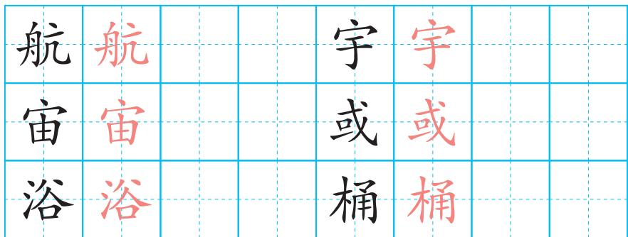

朗读课文。说说太空生活有哪些有趣的事情。

读一读，记一记。

平稳 四平八稳

zī 姿态 千姿百态 牢固稳固

使劲使用

# 语文园地六

## 识字加油站

bó guǎn博物馆

jiū研究所

lǎn展览馆

shào哨所

jì科技馆

zhěn诊所

yù  
体育馆  
là  
律师事务所

bó guǎn lǎn jì yù jiū shào zhěn lù 博馆览技育究哨诊律

所所

## 字词句运用

下面这些字你能写对吗？

含 迎 留

不要多写或少写笔画。

<table><tr><td></td><td></td><td></td><td></td><td></td><td></td></tr><tr><td></td><td></td><td></td><td></td><td></td><td></td></tr></table>

## 荡 满敬

<table><tr><td></td><td></td><td></td><td></td><td></td></tr><tr><td></td><td></td><td></td><td></td><td></td></tr></table>

注意字是上下结构还是左右结构。

猜猜加点词语的意思，和同学交流理解词语的方法。

他没有明说，只是用眼神暗示我。

渔船靠岸了，原本安静的码头一下子喧闹起来。

miǎn shāng

我们使用剪刀时，要谨慎地操作，不可大意，以免受伤。

班级图书角给你的读书生活带来了什么变化？和同学交流。

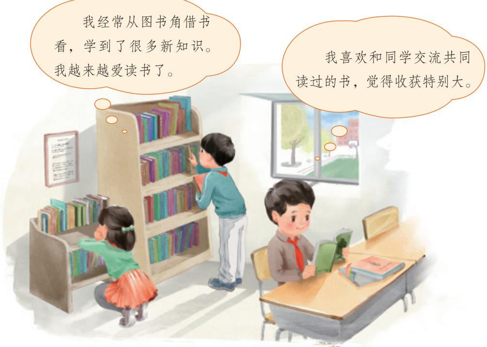

## 日积月累

## 二十四节气歌

春雨惊春清谷天，máng  
夏满芒夏暑相连chǔ  
秋处露秋寒霜降，  
冬雪雪冬小大寒。

## 写话

## 心中的“问号”

为什么星星会眨眼睛？

为什么雨后天上挂着彩虹？

树叶的形状为什么是各种各样的？

花为什么是五颜六色的呢？

下雨时蜘蛛逃到哪儿去了？

是谁告诉蝉要下雨了？

石头上怎么會有貝壳呢？

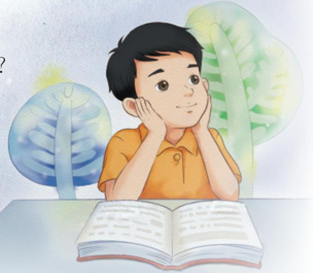

大自然真是奇妙啊！你的心中是不是也藏着很多“问号”？提出你的问题，把它们写在卡片上。

写完后，和小伙伴交换卡片，分享问题，互相交流对问题的思考。

## 我爱阅读

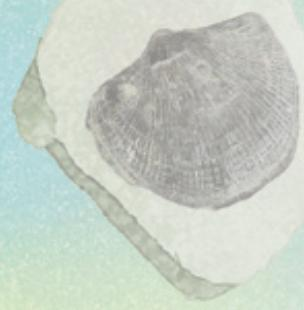

## 最大的“书”①

一天，爸爸带川川去爬山。爬到半zhì kān山腰，他们看见一位地质勘探队员，正pā趴在大石头上看着什么。川川走过去，好奇地问：“叔叔，您在看什么？”

“我在看‘书’呢！”

“哪里有书啊？”

“岩石就是书啊！你看，这岩石一层hòu一层的，不就像一册厚厚的书吗？”

川川认真地问：“这上面有字吗？”

“有。你来看，这是雨点儿留下的脚yìn hén印，叫雨痕；这是波浪的足迹，叫波痕；kuàng还有这些闪光的、透明的，是矿物。它们都是字啊！”

川川又问：“这上面有图画吗？”

叔叔说：“有。你看，这儿有树叶，这儿有贝壳，那块石头上还有一条小鱼呢！”

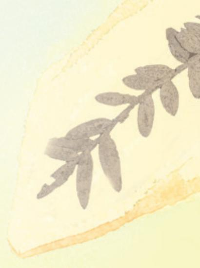

“这能说明什么呢？”

“它告诉我们，在很久很久以前，这里是一片长满树木的陆地。后来，陆地沉下去了，这里就变成了大海。又过了很多很多万年，海底慢慢上升，这里又变成了高山，就是我们脚下的这座山。”

“讀這本岩石書有什麼用呢？”páo川川总爱刨根问底。

叔叔说：“用处可大呢！它能告 mái méi tàn 诉我们，哪里埋着煤炭，哪里藏着 铁矿……把这本‘书’读懂，就能 zàng 为国家找到更多的宝藏！”

“太好了，太好了！”川川高兴地说，“等我长大了，也要读懂这本最大的‘书’！”

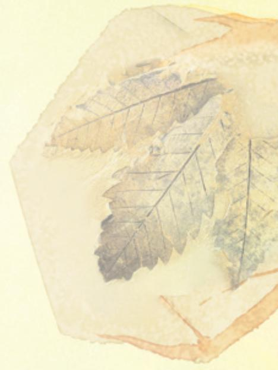

# 18 大象的耳朵

dā大象有一对大耳朵，像扇子似的，耷拉着。

这一天，大象正在路上慢慢地散步，遇到了小兔子。

小兔子说：“咦，大象啊，你的耳朵怎么耷拉下来了？”

大象说：“我生来就是这样啊。”

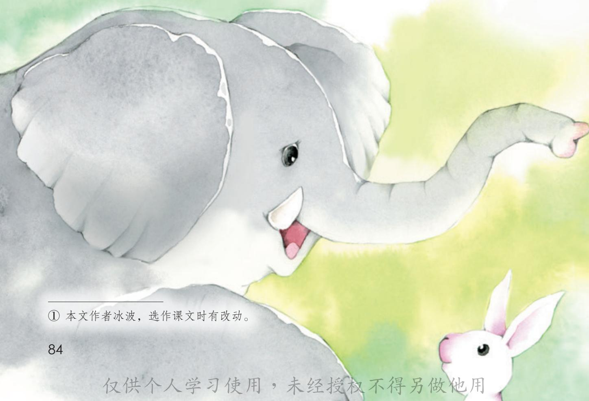

小兔子说：“你看，我的耳朵是竖着的，你的耳朵一定是出毛病了。”

后来，大象又遇到了小羊。小羊也说：“大象啊，你的耳朵怎么是耷拉着的呢？”

小鹿、小马，还有小老鼠，见到了大象，都要说他的耳朵。

大象也不安起来，他自言自语地说：“他们都这么说，是不是我的耳朵真的有毛病啦？我得让我的耳朵竖起来。”

怎么才能让耳朵竖起来呢？

gān每天，大象站着睡觉的时候，就用两根竹竿把耳朵撑起来。

可是，大象的耳朵眼儿里，经常有小虫子飞进去，还在里面跳wǔ tòng fán舞，吵得他又头痛，又心烦。

## 人民教育出版社

最后，大象还是把他的耳朵放了下来。这样，虫子飞不进去了。有虫子来的话，大象只要把他的大耳shān朵一扇，就能把他们赶跑。

大象说：“我还是让耳朵耷拉着吧。人家是人家，我是我。”

dā yù yí shù gān wǔ tòng fán shān 耷遇咦竖竿舞痛烦扇

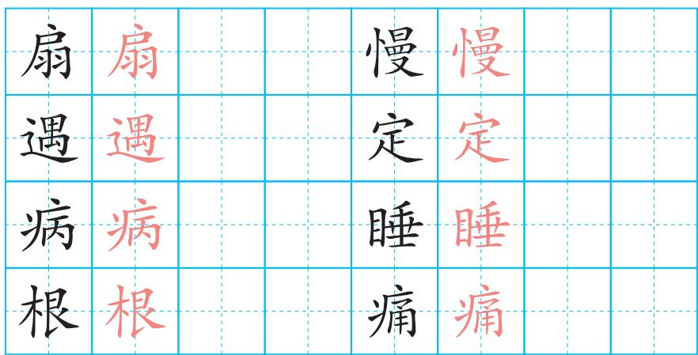

朗读课文，注意读好疑问的语气。

画出课文中大象的话，说说大象的想法是怎么改变的。

“人家是人家，我是我。”结合生活实际，说说你是怎么理解这句话的。

diàn

# 19 蜘蛛开店

有一只蜘蛛，每天蹲在网上等着小飞虫落在上jì mò面，好寂寞，好无聊啊。

蜘蛛决定开一家商店。卖什么呢？就卖口罩吧，因为口罩织起来很简单。

于是，蜘蛛在一间小木屋外面挂了一个招牌，上biān gù面写着：“口罩编织店，每位顾客只需付一元钱。”

顾客来了，是一只河马。河马嘴巴那么大，口罩fū wán好难织啊，蜘蛛用了一整天的工夫，终于织完了。

晚上，蜘蛛想：还是卖围巾吧，因为围巾织起来很简单。

huàn

第二天，蜘蛛的招牌换了，上面写着：“围巾编

织店，每位顾客只需付一元钱。”

顾客来了，只见身子不见头。蜘蛛向上一看，原来是一只长颈bó鹿。他和大树一样高，脖子特别长，脑袋从树叶间露出来，正对着蜘蛛笑呢。

蜘蛛织啊织，足足忙了一个星期，才织完那条长长的围巾。

蜘蛛累得趴倒在地上，心里wà想：还是卖袜子吧，因为袜子织起来很简单。

于是，蜘蛛的招牌又换了，上面写着：“袜子编织店，每位顾客只需付一元钱。”

可是，蜘蛛看到顾客后，却吓得匆忙跑回网上。wú gōng原来那位顾客竟是一条四十二只脚的蜈蚣！

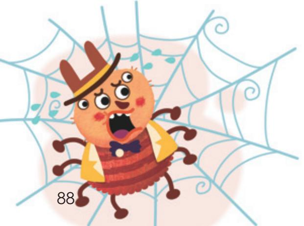

diàn jì mò zhào pái biān gù fū wán bó pā wà cōng wú gōng 店寂寞罩牌编顾夫完脖趴袜匆蜈蚣

需 需

夫未

期期

决决

付付

终终

## 朗读课文。根据示意图讲一讲这个故事。

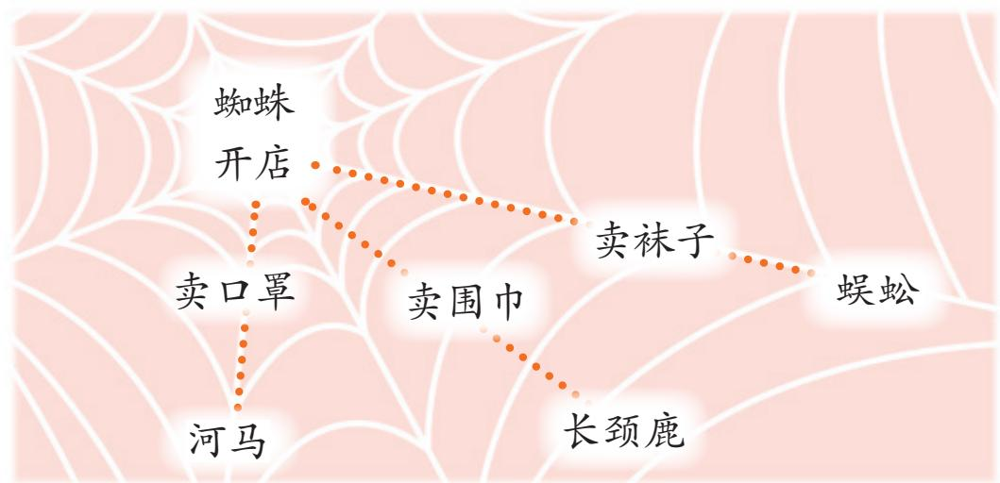

接下来会发生什么事？展开想象，续编故事，讲给大家听。

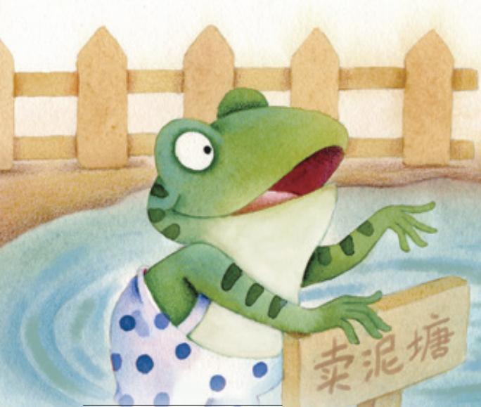  
① 本文作者季颖，选作课文时有改动。

# 20青蛙卖泥塘①

làn

青蛙住在烂泥塘里。他觉得这儿不怎么样，想把huàn bān泥塘卖掉，换一些钱搬到城里住。

于是青蛙在泥塘边竖起一块牌子，上面写着“卖泥塘”三个字。

lou

“卖泥塘喽，卖泥塘！”青蛙站在牌子边大声吆hè喝起来。一头老牛走过来，看了看泥塘，说：“这个kēng shū水坑坑嘛，在里边打打滚倒挺舒服。不过，要是周围有些草就更好了。”

老牛不想买泥塘，走了。

青蛙想，要是在泥塘周围种些草，就能卖出去jí bō了。于是他就去采集草籽，播撒在泥塘周围的地上。

到了春天，泥塘周围长出了绿茵茵的小草。青蛙又站在牌子旁边，大声吆喝起来：“卖泥塘喽，卖泥塘！”一只野鸭飞来了，看了看泥塘，说：“这地方好是好，就是塘里的水太少了。”

野鸭没有买泥塘，飞走了。

青蛙想，要是能往泥塘里引些水，就能卖出去kǎn  
了。于是他跑到周围的山里找到泉水，又砍了些竹子，  
把竹子破开，一根一根接起来，把水引到泥塘里来。

等泥塘灌足了水以后，青蛙又站在牌子旁，大声吆喝起来：“卖泥塘喽，卖泥塘！”可是泥塘还是没有卖出去。

小鸟飞来说，这里缺点儿树；蝴蝶飞来说，这里缺点儿花；小兔跑来说，这里还缺条路；小猴跑来说，这儿应该盖所房子；小狐狸说……每次听了小动物的话，青蛙都想：对！对！要是那样的话，泥塘准

## 人民教育出版社

能卖出去。于是青蛙就照着他们的话去做，栽了树， 种了花，修了路，还在泥塘旁边盖了房子……

“卖泥塘喽，卖泥塘！”有一天，青蛙又站在牌子旁吆喝起来，“多好的地方！有树，有花，有草，有水塘。你可以看蝴蝶在花丛中飞舞，听小鸟在树上yǒng唱歌。你可以在水里尽情游泳，躺在草地上晒太阳。lèng这儿还有道路通到城里…”青蛙说到这里，突然愣住了，他想：这么好的地方，自己住挺好的，为什么要卖掉呢？

于是青蛙不再卖泥塘了。

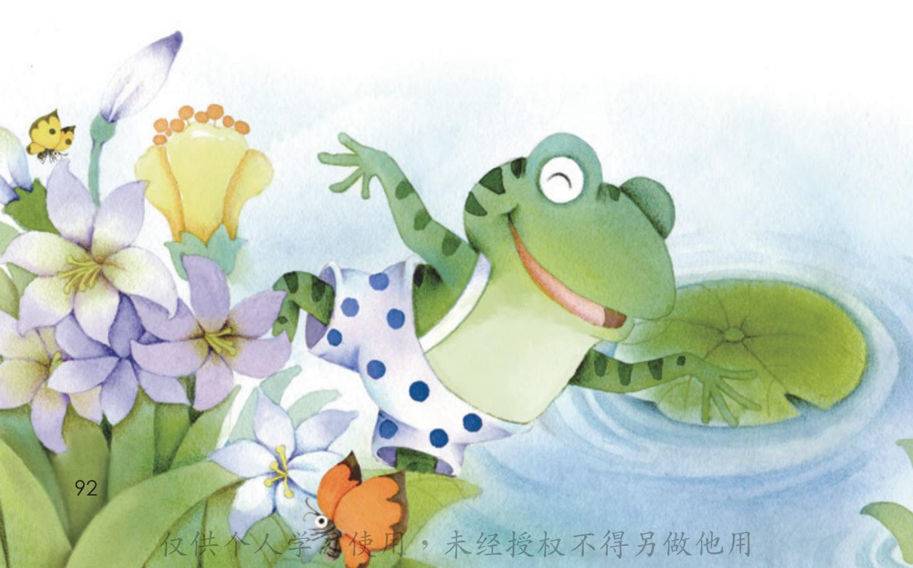

làn huàn bān hè kēng shū jí bō yīn kǎn guàn quē zāi yǒng lèng 烂换搬喝坑舒集播茵砍灌缺栽泳愣

蛙蛙

卖卖

搬搬

倒倒

泉泉

砍砍

破破

泳泳

朗读课文。分角色演一演这个故事。

说一说青蛙为卖泥塘做了哪些事，最后为什么又不卖泥塘了。

选做：青蛙最后吆喝了些什么？如果向同学推荐一样东西，如一本书、一种文具，你会说些什么？

# ②1小毛虫

一条小毛虫趴在一片叶子上，用新奇liáng kūn的目光打量着周围的一切：大大小小的昆虫又是唱，又是跳，跑的跑，飞的飞…lián到处生机勃勃。只有它，这个可怜的小毛虫，既不会唱，也不会跑，更不会飞。

muc小毛虫费了九牛二虎之力，才挪动了bèn zhuō lìng一点点。当它笨拙地从一片叶子爬到另一fǎng fú片叶子上时，它觉得自己仿佛周游了整个世界。

jǐn bìngbēi xiàn尽管如此，它并不悲观失望，也不羡rèn hé慕任何人。它懂得：每个人都有自己该做的事情。它，一条小小的毛虫，眼前最要紧的是学会fǎng jiǎn抽丝纺织，为自己编织一间牢固的茧屋。

小毛虫一刻也没有迟疑，尽心竭力地工作着。它织啊，织啊，最后把自己从头到脚裹进了温暖的茧屋里。

“以后会怎样呢？”它在与世隔绝的茧屋里问。

“万事万物都有自己的规律！”小毛虫听到一个nài dài声音在回答，“你要耐心等待，以后会明白的。”

chen xing e时辰到了，它清醒过来，变成了一只飞蛾，再也不是以前那条笨手笨脚的小毛虫了。它灵巧地从茧子zhèng yíng里挣脱出来，惊奇地发现自己身上生出了轻盈的翅bān lán yú膀，上面布满色彩斑斓的花纹。它愉快地舞动了一下róng翅膀，如绒毛一般，从叶子上飘然而起。它飞啊飞，ǎi渐渐地消失在蓝色的雾霭之中。

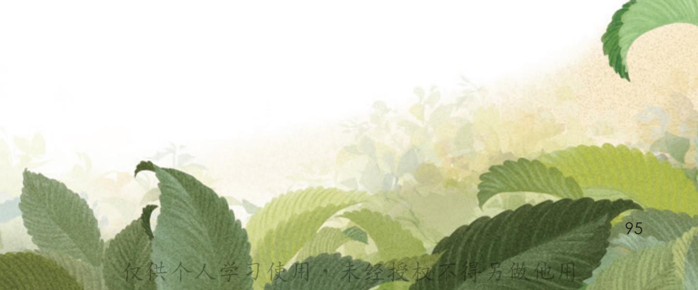

liáng kūn lián lìng fǎng fú jǐn bìng rèn

量昆怜另仿佛尽并任

hé fǎng jié guī dài xǐng zhèng yú

何纺竭规待醒挣愉

朗读课文。

小毛虫经历了哪些变化？借助提示讲讲这个故事。

每个人都有自己该做的事情。

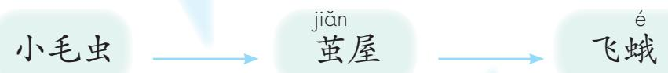

万事万物都有自己的规律。

读一读，记一记。生机勃勃 尽心竭力 与世隔绝bèn bān lán笨手笨脚 色彩斑斓 九牛二虎之力

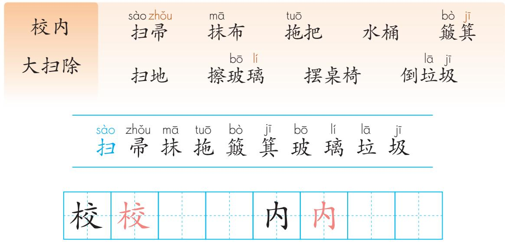

# 语文园地七

## 识字加油站

## 字词句运用

猜一猜加点字的读音和意思，再查查字典，看看猜得对不对。

各色各样的花沾满了小露珠，迎接着清晨的阳光。

这封信没有署名，也不知道是谁寄来的。

他揭开锅盖，发现小米粥已经煮好了。

读句子，说一说你的发现。

大象有一对大耳朵，像扇子似的，耷拉着。

那棵大枫树好像一把又高又大的绿色太阳伞。

绿油油的小柏树就像战士一样笔直地站在那里。

## 日积月累

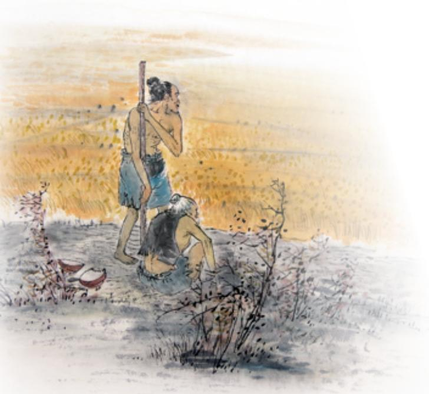

## mǐn悯农（其一）

shēn [唐]李绅

sù  
春种一粒粟，  
秋收万颗子。  
四海无闲田，yóu  
农夫犹饿死。

## 写话

## 我想养小动物

如果可以养小动物，你想养什么？写写你的理由，试着多写几条。

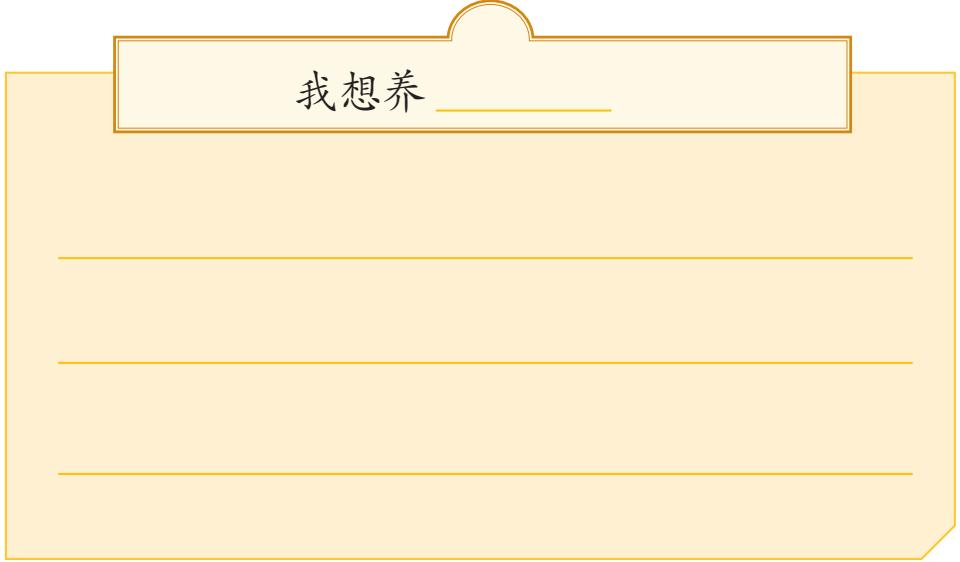

## 我爱阅读

## shang① 月亮姑娘做衣裳

夜晚，月亮姑娘出来了，细细的，弯弯的，像眉毛。凉féngfù风吹得她有点儿冷，她想，还是找一位裁缝师傅做件衣裳吧！

裁缝师傅给她量了尺寸，让她四天以后来取。过了四lián天，月亮姑娘长胖了一点儿，好像弯弯的镰刀。她来取衣裳了。kòu衣裳做得真漂亮，可惜太小，穿在身上连扣子也扣不上。

裁缝师傅决定重做一件，又给她量了尺寸，让她再过四hé天来取。过了四天，月亮姑娘又长胖了一点儿，像只核桃。tào她来取衣裳了。衣裳做得更漂亮了，可惜连套也套不进去。

裁缝师傅涨红了脸，说：“我只好重做了。”又是四天过去了，月亮姑娘来取衣裳。裁缝师傅看到她变得圆圆的，像ǎ一只圆盘，吃了一惊：“啊？你又长胖了！”他叹了一口气，cái说：“唉，你的身材量不准，我没法给你做衣裳了。”

月亮姑娘看着那漂亮的衣裳，又望望自己圆圆的身子，不好意思地对裁缝师傅说：“不，老师傅，这不能怨您。不是您量不准，而是我每天都在变化。”

后来，月亮姑娘再也不找人做衣裳了。

# yì shè 羿射九日 ①

很久很久以前，在世界最东边的海上，生长着一sāng棵大树叫扶桑。扶桑的枝头站着一个太阳，底下还有九个太阳。每天天快亮时，扶桑枝头的太阳就坐上两轮车，开始从东往西穿过天空。十个太阳每天轮换，给大地万物带来光明和温暖。

可是，有一天，这十个太阳觉得轮流值日太没意思啦，于是，他们一齐跑了出来，出现在天空中。十zhì个太阳像十个大火球，炙烤着大地。

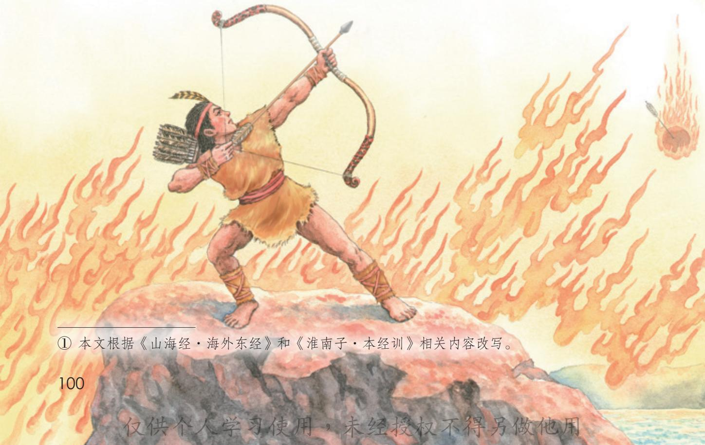

禾苗被晒枯了，土地被烤焦了，江河里的水快要róng lèi蒸干了，连地上的沙石好像都要熔化了。人类的日子非常艰难。

神箭手羿决心帮助人们脱离苦海。他翻过九十九kuà座高山，跨过九十九条大河，来到东海边。他登上一座dā sōu大山，搭上神箭，拉开神弓，对准天上的一个太阳，嗖liè地就是一箭。那个太阳一下子爆裂开，一团团火球到cuàn pū处乱窜，接着，噗噗地掉在地上。

羿一口气射下了九个太阳，炎热渐渐退去。羿又伸手拔箭，准备射下最后一个太阳。这个太阳害怕极了，慌慌张张地躲进了大海里。

天上没有了太阳，整个世界一片黑暗。羿想，没有了太阳，就没有了光明和温暖，庄稼不能生长，人类和动物也没法活下去，这样可不行。于是，羿留下了最后一个太阳。

## 人民教育出版社

从此，太阳每天从东方升起，到西方落下。土地zī rùn téng渐渐滋润起来，花草树木渐渐繁茂起来，江河奔腾欢唱，大地上重新现出了勃勃生机。

shè sāng zhí róng lèi jiàn fān kuà dā liè cuàn yán zī rùn téng 射桑值熔类箭翻跨搭裂窜炎滋润腾

<table><tr><td>射</td><td>射</td><td></td><td></td><td></td><td></td><td></td><td></td><td></td><td></td></tr><tr><td></td><td></td><td></td><td></td><td></td><td>最</td><td>最</td><td></td><td></td><td></td></tr><tr><td>女 ム口</td><td>始</td><td></td><td></td><td></td><td>换</td><td>换</td><td></td><td></td><td></td></tr><tr><td></td><td></td><td></td><td></td><td></td><td></td><td></td><td></td><td></td><td></td></tr><tr><td>值</td><td>值</td><td></td><td></td><td></td><td>弓</td><td>7LO</td><td></td><td></td><td></td></tr><tr><td></td><td></td><td></td><td></td><td></td><td></td><td></td><td></td><td></td><td></td></tr><tr><td>炎</td><td>炎</td><td></td><td></td><td></td><td>此</td><td>此</td><td></td><td></td><td></td></tr></table>

默读课文，不出声，不指读。

根据表格里的内容，讲一讲这个故事。

<table><tr><td>起因</td><td>经过</td><td>结果</td></tr><tr><td>zhì 十个太阳炙烤</td><td>yì 羿射下了九个</td><td>大地上重新</td></tr><tr><td>着大地，人类的日</td><td>太阳，留下了最后</td><td>现出了勃勃生机。</td></tr><tr><td>子很艰难。</td><td>一个。</td><td></td></tr></table>

你觉得故事里哪些内容很神奇？和同学交流。

# dì 23 黄帝的传说

xuān yuán

相传五六千年前，有一个部落的首领名叫轩辕。chuàng他有很多创造发明，深受人们爱戴。大家推举他统领lián méng zūn部落联盟，尊称他为“黄帝”。

## 造车

那时候，人们出远门都得靠步行，运东西也只能依靠人力，既不方便，又很辛苦。

有一年夏天，黄帝正在干活，忽然一阵大风刮mào来，把他头上的草帽吹掉了。草帽是圆的，掉到地上qǐ后向前滚出了很远。这件事给了黄帝启发。他想：如果做个架子，再装上像草帽一样能滚动的东西，就可zhào àn shè以用来搬运物品了。于是，他号召部落民众，按照设cái想找来需要的材料，试了一次又一次，终于把车造了出来，样子就像现在的独轮手推车。

## 人民教育出版社

duàn

后来，人们在使用过程中不断改进，发明了双轮xùn tì车，又驯服了牛和马，用它们来代替人拉车，出远门、搬运东西方便多了。

## 造船

一个秋天的傍晚，黄帝干完了活，同大伙儿坐在qí河边休息。他看到水面上漂着许多树叶，其中一个叶片上有一只蚂蚁，虽然河水很深，蚂蚁却安安稳稳地在上面爬着。

黄帝指着那片树叶，高兴地对大家说：“你们看，dāi蚂蚁待在树叶上，就能在河里浮着不沉下去。如果造一个像树叶一样浮在水面的东西，能让人待在上面，我们就可以在水上自由来去了。”大家听了，都觉得有道理。

第二天，他们找来一根很粗很粗的树干，把它放  
进河里。可是，树干是圆的，人一爬上去，它就滚动  
起来，人在上面根本待不住。怎么办呢？他们一起商duàn  
量，终于想出了办法：把树干中间的一段挖空，人在

## 人民教育出版社

jiǎng里面，果然能坐稳了。他们又用木头做了桨，就能在水面上自由地行动了。

车和船的发明，使水陆交通得到了发展，为人们hù gōng shàn相互往来提供了便利，极大地改善了人们的生活。

dì chuàng mào qǐ zhào àn shè cái 帝创帽启召按设材 duàn tì qí dāi duàn hù gōng shàn 断替其待段互供善

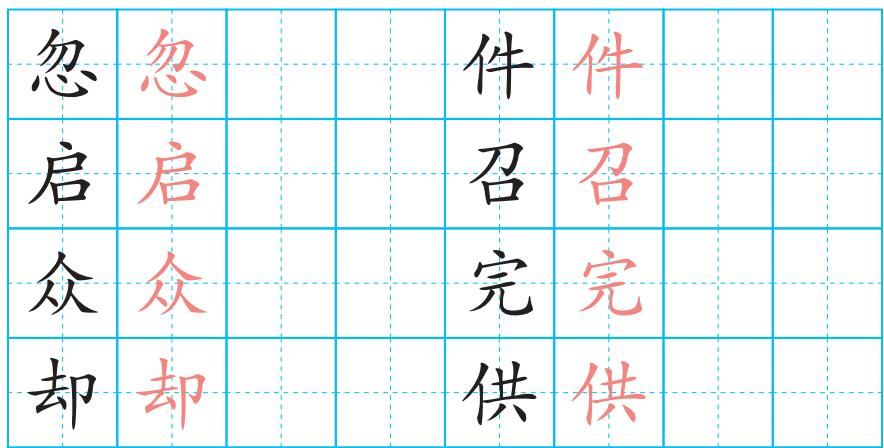

默读课文。

借助下面的提示，讲一讲黄帝造车和造船的故事。

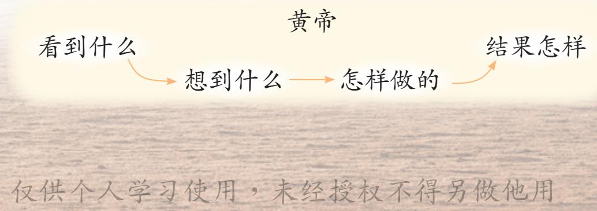

# yǔ24 大禹治水

我国有这样一个传说。

很久很久以前，洪水经常泛滥。大水淹没了田huǐ dú shòu shāng shēngchù地，冲毁了房屋，毒蛇猛兽到处伤害人和牲畜。人们流离失所，过着痛苦的生活。

洪水给百姓带来了无数的灾难，必须治好它。gǔn bà当时，一个名叫鲧的人领着大家治水。他筑坝挡水tā结果洪水冲塌了堤坝，水灾反而更严重了。鲧花了九年时间治水，洪水仍然没有被治服，他的儿子禹jì xù继续治水。

bài xùn shū禹吸取了鲧失败的教训，采用疏导的办法治水cí záo  
他不辞劳苦，跟成千上万的人一起，开山凿石，疏通  
了很多河道，让洪水通过河道，最后流到大海里去。

禹离开家乡，一去就是十三年。据说，他一心治水，到处奔波，曾经多次路过自己家，都没有走进家门看一看。

# 人民教育出版社

禹带着大家经过多年的努力，终于治服了洪水。qū毒蛇猛兽被驱赶走了，人们把家搬了回来。禹把粮食的种子发给人们，让大家在被水淹过的土地上耕种。他还带领大家修筑沟渠，用沟渠里的水浇田。huī农业生产渐渐恢复了，百姓安居乐业，重新过上了幸福的生活。

jī gōng jì zūn人们感激禹治水的功绩，尊称他为“大禹”。

疏努驱功绩

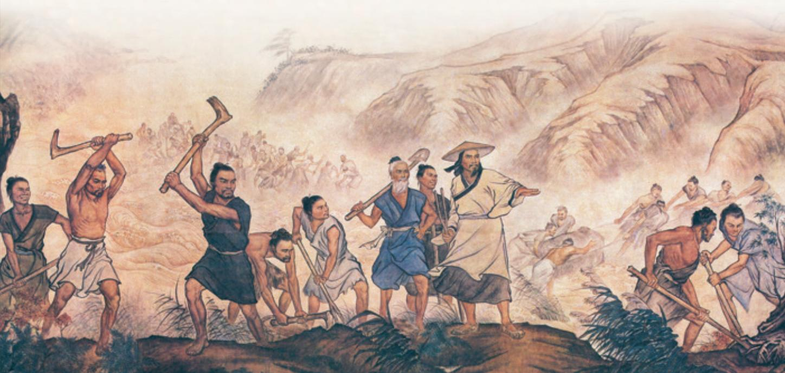  
（图）應洪聲繪

<table><tr><td>治姓</td><td colspan="3">治姓</td><td></td><td></td><td rowspan="2">洪</td><td rowspan="2"></td><td rowspan="2"></td><td rowspan="2"></td><td rowspan="2"></td></tr><tr><td></td><td></td><td></td><td></td><td></td><td></td></tr><tr><td></td><td></td><td></td><td></td><td></td><td></td><td></td><td></td><td></td><td></td><td></td></tr><tr><td></td><td></td><td></td><td></td><td></td><td></td><td></td><td></td><td></td><td></td><td></td></tr><tr><td>必</td><td></td><td></td><td></td><td></td><td></td><td>带须</td><td>洪带须</td><td></td><td></td><td></td></tr><tr><td>仍</td><td></td><td>必仍续</td><td></td><td></td><td></td><td>继</td><td>继</td><td></td><td></td><td></td></tr><tr><td>续</td><td></td><td></td><td></td><td></td><td></td><td>业</td><td>业</td><td></td><td></td><td></td></tr></table>

默读课文。

按照下面的提示，讲一讲大禹治水的故事。

洪水带来了灾难。

鲧用筑坝挡水的办法，没有治好洪水。

禹用疏导的办法，带领人们治好了洪水。

禹带领百姓恢复生产，大家过上了幸福生活。

读一读，记一记。

洪水 防洪

毁坏 损毁

毒蛇 毒害

继续连续

疏通 稀疏

驱赶驱除

# 语文园地八

## 识字加油站

gōu chǎn钩（钩子）金铲（铲子）

chéng shì橙（橙子） 木 … 柿（柿子）

yuán zhǎng源（源头）水 涨（涨潮）

jù càn 炬（火炬）火灿（灿烂）

kuǎ fén垮（打垮）土坟（坟墓）

gōu chǎn chéng shì yuán zhǎng jù càn kuǎ fén 钩铲橙柿源涨炬灿垮坟

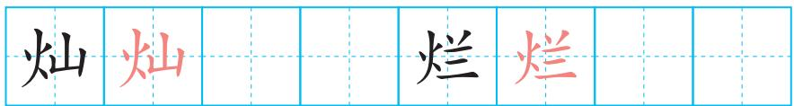

## 字词句运用

读一读，和同学交流你的发现。

冰冷冻凉

海流洒滴

我知道带“↓”的字大多跟冰冷有关，与带“注”的字不同。

我會註意區分偏旁容易混淆的字，了解它们的意思。

神补 祖袜 礼 福被 shān 衫

读一读下面的词语，选择一两个说句子。

忽然突然

立刻 马上

shùn zhǎ 一瞬间 一眨眼

zhú 逐渐渐渐

徐徐

tūn 慢吞吞 慢悠悠

读句子，想象画面，再照样子写一写。

最后一个太阳害怕极了，慌慌张张地躲进了大海里。

李明 跑进了教室。

如果李明很高兴，我会这样写……

## 书写提示

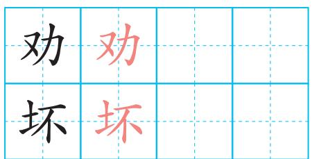

有的字作为偏旁时，笔画的形态会发生变化。

有的字作为偏旁时，笔顺也会发生变化。

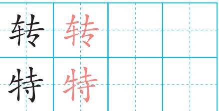

## 日积月累

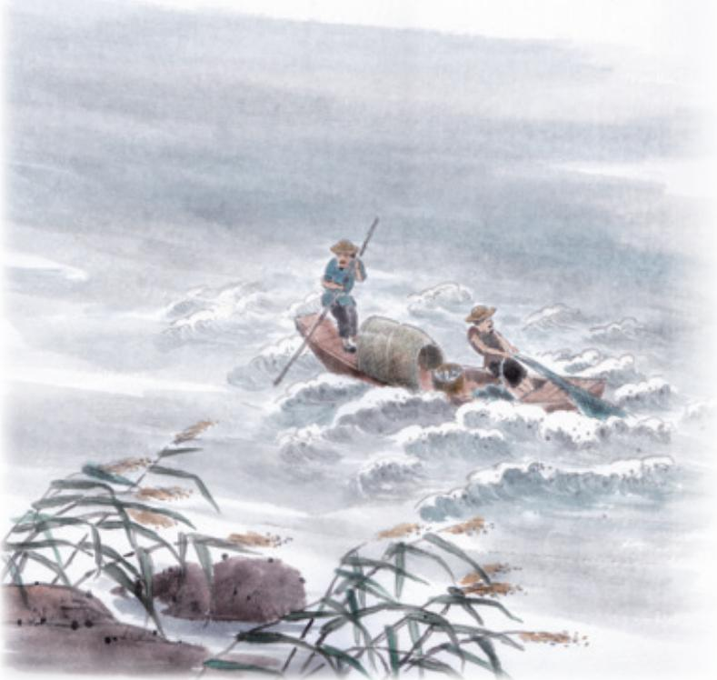

## 江上渔者

fàn zhòng [宋]范仲淹

江上往来人，lú  
但爱鲈鱼美。jūn  
君看一叶舟，出没风波里。

## 口语交际

## 推荐一部动画片

在你看过的动画片中，哪一部给你留下的印象最深？把它推荐给同学吧！

跟大家说说，这部动画片给你留下了怎样的印象，也可以讲讲最吸引你的角色或故事片段。

注意说话的速度，让别人听清楚。

认真听，了解别人讲的内容。

## 我爱阅读

# 李时珍①

wěi yào明朝出了一位伟大的医药学家，叫李时珍。

李时珍家世代行医，他的父亲医术很高。李时珍看到医生能救死扶伤，解除病人的痛苦，就立下志向，要像父亲一样为人们看病。

李时珍处处留心向父亲学习，二十多岁开始给人看病，jiù一面行医，一面研究药物。他发现旧的药物书有不少缺点：jì zǎi许多有用的药物没有记载；有些药物只记了个名称，没有说kuàng xìng明形状和生长情况；还有一些药物记错了药性和药效。他wēi xiǎn想，病人吃错了药，那多危险啊，于是决定重新编写一部完善的药物书。

为了写这部书，李时珍不但注意积累为人治病的经验，chí还坚持到各地去采药。他不怕山高路远，不怕严寒酷暑，有时上山采药好几天不下山，饿了就吃些干粮，天黑了就在山bài fǎng liè上过夜。他拜访了很多医生、农民、渔民和猎人，向他们学到了书上没有的知识。

李时珍用了近三十年的时间，作了多次修改，终于完成了gāng一部新的药物书，这就是著名的《本草纲目》。

## 识字表

## 阅读

yǒng hè zhuāng sī cái jiǎn yīng fú dī zuì chèn 1咏贺妆丝裁剪莺拂堤醉趁

tuō ǎo zhē yǎn tàn méi tǔ yá fú jiě chù dù juān 2脱袄遮掩探眉吐芽符解触杜鹃

3裹颈寄粒破漏懊丧啊巧绚狐狸 zǐ lǐ 籽礼

4 挥扶

tíng zī xún jù tǎ cān tīng cè 语文园地一 亭咨询剧塔餐厅厕

jì 5 xiàn

gāo cháng ma mò fěn táng liào gān zhè zhī áo xiāo shòu 6 糕尝嘛磨粉糖料甘蔗汁熬销售 的确应

ruò mò yà cù yōng suí fēn fāng tū jǐn dì mō xiǎn 7弱末亚簇拥随芬芳突紧递摸显

<table><tr><td>jiāo xiān 娇掀 chéng mó shù jiàn zhù fà yǎn yíng wù pàn sì</td></tr><tr><td>语文园地二 程魔术建筑发演营务判饲 yǎng 养</td></tr><tr><td>识字 zhōu yáo huá yǒng sǒng gé xiá yǔ lù gè yì nóng qí 1 州谣华涌耸隔峡与陆各谊浓齐 fèn fán</td></tr><tr><td>奋繁</td></tr><tr><td></td></tr><tr><td>shǎng jú 赏菊 甲薑 嘉携易錢吊财</td></tr><tr><td>3 péi gòu 赔购</td></tr><tr><td>bàn bō jiān fǔ qié kǎo cōng dùn mó gū zhēng jiǎo zhá 4 拌菠煎腐茄烤葱炖蘑菇蒸饺炸</td></tr><tr><td>jiàng zhōu dàn 酱粥蛋 语文园地三</td></tr><tr><td>jīn suān liū là hū pēn nì mián cuì bāng 津酸溜辣乎喷腻绵脆邦</td></tr><tr><td></td></tr><tr><td>阅读</td></tr><tr><td>mèng tǎng liáo bèng yù cōng bān jīng jìng dīng níng 8梦躺聊蹦郁囱般精境叮咛</td></tr><tr><td>pǐ jiāo wēi fàn bō wén yì liàn shě qiú zhū shí qí 9 匹郊微泛波纹异恋舍求株拾骑</td></tr></table>

验骄傲

dù yīn bì ā yí chēng biàn gāng dǒng àn 10渡荫蔽阿姨撑便冈懂案

dǎo wēng xiàngqiāng kòng tǎn kè háng mó xíng 语文园地四 倒翁橡枪控坦克航模型

11 萬亡 單窗四修堵悔实窯務ch chuǎn fèei

shì ér fú hā shěn sù shǎng xī yuè huì 12室而幅哈审肃晌嘻悦诲

péng tuó fáng dǎng bó qiǎn gāng yān li tàn ài tí jì 13棚驮坊挡伯浅刚淹哩叹唉蹄既

chú guì xiāng shāng shà dòng xué kū lóng jiào zhǎi 语文园地五 厨柜厢商厦洞穴窟窿窖窄

fǔ míng hán lǐng bó xiǎo jìng sì sòng bì jìng 14甫鸣含岭泊晓净寺宋毕竟

yā chán zhī zhū xiǎng huā jiàn 15压蝉蜘蛛响哗渐

huāng zhēn biàn zhōng dǎo zhǎn yǒng chuǎng pèng chóu xī qú 16慌针辨忠导盏永闯碰稠稀渠

zhòu wěn bì xū jí shǐ 17 浴 简

bó guǎn lǎn jì yù jiū shào zhěn lù 语文园地六 博馆览技育究哨诊律

dā yù yí shù gān wǔ tòng fán shān 18耷遇咦竖竿舞痛烦扇

diàn jì mò zhào pái biān gù fū wán bó pā wà cōng 19店寂寞罩牌编顾夫完脖趴袜匆

làn huàn bān hè kēng shū jí bō yīn kǎn guàn quē zāi 20烂换搬喝坑舒集播茵砍灌缺栽

liáng kūn lián lìng fǎng fú jǐn bìng rèn hé fǎng jié guī 21量昆怜另仿佛尽并任何纺竭规 dài xǐng zhèng yú 待醒挣愉

sào zhǒu mā tuō bò jī bō lí lā jī 语文园地七 扫帚抹拖簸箕玻璃垃圾

22射桑值熔类箭翻跨搭裂窜炎滋 rùn téng 润腾

dì chuàng mào qǐ zhào àn shè cái duàn tì qí dāi duàn 23帝创帽启召按设材断替其待段 hù gōng shàn 互供善

hóng làn huǐ dú shāng nàn jì xù bài xùn shū nǔ qū 24洪滥毁毒伤难继续败训疏努驱 huī gōng jì 恢功绩

gōu chǎn chéng shì yuán zhǎng jù càn kuǎ fén 语文园地八 钩铲橙柿源涨炬灿垮坟

（共450个生字）

## 写字表

阅读

1 诗碧妆绿丝剪童归

2冲寻眉吐闻柳荡桃

3鲜原叔通巧惊礼

4邓植格引注满

语文园地一 剧场

5雷锋昨背洒汗温暖

6桌尝买具甘汁甜菜劳应

7弱周末母吸芬芳递勇敢

语文园地二 程术服务

识字

1 神州华各族情谊齐

2传统贴街扫龙艾全团真

3甲骨觉品钱币与财

4食茄烤鸭煮鸡蛋饭

语文园地三 辣乎

阅读

8梦硬铅盒森结苹精灵流

9 匹妹波纹恋舍求奔

10旁阿姨弟便教拼音

语文园地四 坦克

11亡补牢劝丢助坏死

12室排而实候班哈举

13愿意麦伯刻突然掉

语文园地五 商厦洞穴

14窗含岭泊吴净莲映

15乌黑沉压响新迎扑

16指南针帮忠导永夜特积

17航宇宙或浴桶

语文园地六 馆所

18扇慢遇定病睡根痛

19店决需付夫终期

20蛙卖搬倒泉砍破泳

21仿佛并任何纺织迟

语文园地七 校内

22射最始换值弓炎此

23忽件启召众完却供

24治洪姓带必须仍继续业

语文园地八 灿烂

（共250个字）

## 词语表

## 阅读

2 春天 寻找 眉毛 野花 柳枝 桃花

3 鲜花先生原来大叔太太做客正巧

惊奇快活美好礼物

4 植树 碧空如洗 万里无云 格外 引人注目

休息 小心 笔直

5 雷锋叔叔昨天温暖爱心

6 好奇也许桌子 平时难道平常农民

加工 农具 甜菜工具 劳动经过 应该

7 弱小周末父母吸引芬芳背包雨衣

为什么勇敢

识字

1 神州 中华 山川 长江 长城 民族情谊

2 传统 节日 春节 花灯 清明节 先人 龙舟

中秋 转眼团圆

3 故事 生活 甲骨文 样子 钱币 钱财 有关

4 美食 茄子 烤鸭 水煮鱼 羊肉 蛋炒饭

阅读

8 彩色 铅笔盒 森林 雪松 歌声 苹果 精灵

季节 流动

9 出色 妹妹 碧绿 波纹 恋恋不舍 柳树 枝条不时

10 绿色 一直 说话 童话 阿姨 发现 弟弟

11 亡羊补牢 劝告 禾苗 力气 明白

12 杨桃 图画 讲桌 座位 教室 老老实实 时候哈哈大笑 五角星 画纸 神情

13 愿意 飞快 为难 伯伯 立刻 突然 吃惊认真难为情

15 雷雨乌云 黑沉沉闪电雷声窗户 清新迎面

16 野外 天然指南针帮助方向 忠实 向导

指点 北极星 永远 黑夜 帮忙 特别 积雪

17 航天员宇宙飞船空间站活动 主要 方便

直接 浴桶 清理 实在 通常

18大象耳朵扇子似的慢慢遇到一定

每天睡觉经常人家

19 决定商店 河马工夫终于 星期

20 青蛙 野鸭 泉水 花丛 尽情 游泳

21 新奇 目光 到处 仿佛 周游任何事情

纺织怎样以前灵巧色彩花纹

22开始光明值日决心最后从此欢唱

23 传说首领步行忽然启发搬运号召

民众自由道理根本果然提供便利

24洪水痛苦百姓必须反而仍然治服

继续采用奔波带领农业安居乐业

（共240个词）

## 后记

2017年投入使用的《义务教育教科书语文》由温儒敏担任总主编，一\~六年级由陈先云、曹文轩、崔峦、李吉林担任主编。帅晓梅、江洪春、沈大安、张立霞、陈先云、林孝杰、徐轶、常志丹参加二年级下册编写。2022年，教育部组建编修委员会，根据《义务教育语文课程标准（2022年版)》对教科书进行编写修订。编修委员会由温儒敏、王立军担任主任，张伯江、王荣生担任副主任。编修委员会下设修订组，负责具体修订工作。

教科书在北京、天津、内蒙古、浙江、安徽、湖北、湖南、重庆、四川等地部分学校进行了试教试用，征求了百余位专家学者和一线教师的意见。人民教育出版社承担了教科书的编辑出版和美术设计工作。焦洁、李赞谦、赵晓宇、陈锋为本书绘制插图，景绍宗为本书封面绘制插图。在教科书修订、编辑出版过程中，很多专家都提供过帮助，在此一并表示诚挚的谢意。

教科书需要在使用过程中不断修改完善，真诚希望广大师生和家长继续提出宝贵意见！

联系方式

电话：010-58758611

电子邮箱：jcfk@pep.com.cn

意见反馈平台：jcyjfk.pep.com.cn

YIWU JIAOYU JIAOKESHU YUWEN

语文

二年级下册

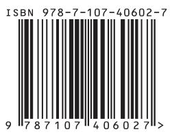