# 语文

义务教育教科书

## 三年级

上册

人民教育出版社

义 务 教 育 教 科 书

# 语文

# 三年级

上册

教育部组织编写

## 编修委员会

主 任：温儒敏 王立军

副 主 任：张伯江 王荣生

成 员（以姓氏笔画为序）：王 敏 王本华 过常宝 朱于国 伍新春 李小龙 李明新汪 锋 宋亚云 张继晓 张彬福 陈先云 陈建华 林建华倪文锦 徐 轶 漆永祥

本册主编：李明新 伍新春

编写人员（以姓氏笔画为序）：帅晓梅 向 瑞 何 源 郑 宇 赵宁宁 滕春友 薛 峰

责任编辑：柳美彤 冯 颖

责任设计：何安冉

责任校对：闵冬娜

责任印制：

义务教育教科书  语文  三年级  上册

教育部组织编写

出版人民教育出版社

（北京市海淀区中关村南大街17号院1 号楼 邮编：100081）

网 址 http://www.pep.com.cn

版权所有·侵权必究

## 目录

第一单元..................  
阅读  
1 大青树下的小学 ................2  
2 花的学校 ...........................5  
3\* 不懂就要问........................7  
口语交际 我的暑假生活.............9  
习作 猜猜他是谁 ......................10  
◎ 语文园地......... .......11  
第二单元. 13  
阅读  
4 古诗三首.... ..........14  
望洞庭...........  
山行.......... ........ 14  
夜书所见.......................... 15  
5 铺满金色巴掌的水泥道....16  
6 秋天的雨......... .............19  
7\* 听听，秋的声音 ...............22  
习作 写日记 ............. .............24  
◎ 语文园地............. .............25  
第三单元..  
阅读  
8 总也倒不了的老屋 ...........28  
9\* 犟龟........  
10\* 小狗学叫............... ............36  
口语交际 名字里的故事 ...........41  
习作 续写故事 ..........................42  
◎ 语文园地..............................43  
第四单元.... .45  
阅读  
11 宝葫芦的秘密（节选）......46  
12 在牛肚子里旅行 ...............49  
13\* 一块奶酪...........................52  
习作 我来编童话.......................54  
◎ 语文园地..............................55  
◎ 快乐读书吧  
在那奇妙的王国里...........57

## 人民教育出版社

第五单元..... ...59  
阅读  
14 搭船的鸟.......... .................60  
15 金色的草地.......................62  
习作 我们眼中的缤纷世界.......65  
例文  
我家的小狗......................66  
我爱故乡的杨梅 ..............67  
第六单元.. .69  
阅读  
16 富饶的西沙群岛 ...............70  
17 海滨小城...........................73  
18 美丽的小兴安岭 ...............75  
19\* 香港，璀璨的明珠 ...........78  
习作 这儿真美 ..........................80  
◎ 语文园地..............................81  
第七单元.. 83  
阅读  
20 古诗三首...........................84  
鹿柴....... ...... 84  
望天门山.......................... 84  
饮湖上初晴后雨 .............. 85  
21 大自然的声音...................86  
22 读不完的大书...................89  
口语交际 身边的“小事”............91  
习作 我有一个想法...................92  
◎ 语文园地..............................93  
第八单元....... ....95  
阅读  
23 司马光........... ........... 96  
24 一定要争气....................... 97  
25 手术台就是阵地 ............. 100  
26\* 一个粗瓷大碗................. 103  
口语交际 请教 ......................... 105  
习作 那次经历真难忘............. 106  
◎ 语文园地............................ 107  
识字表 ....... ........109  
写字表 ......................................112  
词语表 ...... .....114

标\*的是略读课文。第三单元是阅读策略单元，第五单元是习作单元。

第一单元

美丽的校园，  
成长的摇篮，  
梦想启航的地方。

寻访多彩校园，留下欢乐印迹。

◎ 阅读时，关注有新鲜感的词语和句子。

◎ 体会习作的乐趣。

# 大青树下的小学①1

bà

早晨，从山坡上，从坪坝里，从一条条开着绒球花和太dǎi阳花的小路上，走来了许多小学生，有汉族的，有傣族的，pō áng有景颇族的，还有阿昌族和德昂族的。大家高高兴兴来到学校，都成了好朋友。同学们向在校园里欢唱的小鸟打招呼，yáng向敬爱的老师问好，向高高飘扬的国旗敬礼。

“当，当当！当，当当！”大青树上的铜钟敲响了。

上课了，大家在教室里一起朗读课文，那声音真好听！这时候，窗外十分安静，树枝不摇了，鸟儿不叫了，蝴蝶停

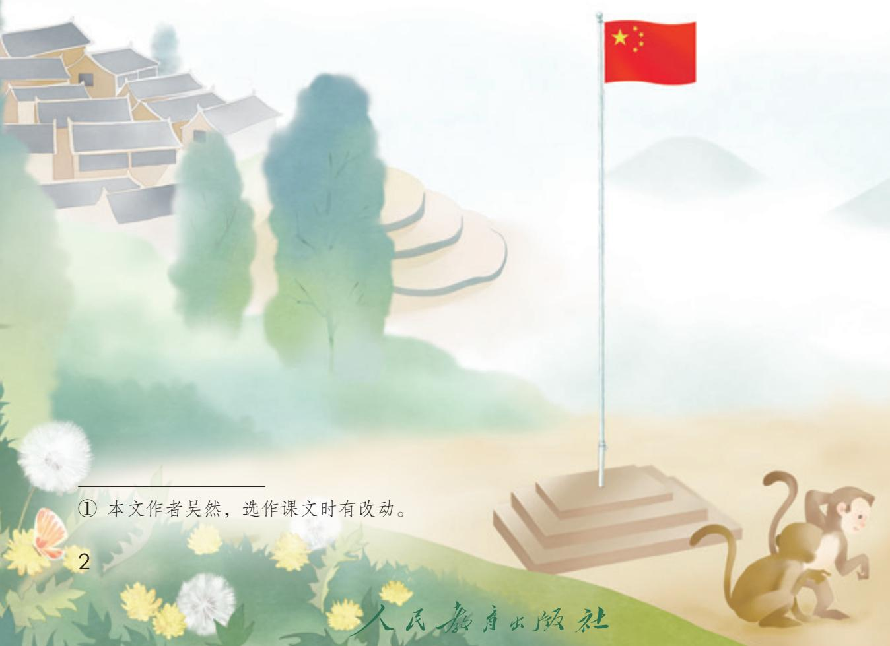

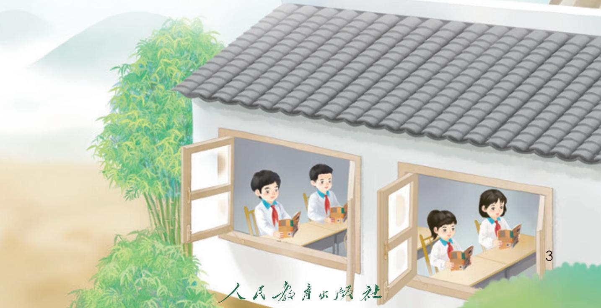

在花朵上，好像都在听同学们读课文。最有趣的是，跑来了两只猴子。这些山林里的朋友，是那样好奇地听着。下课了，大家在大青树下跳孔雀舞，jiāo  
摔跤，做游戏，招引来许多小鸟，连松鼠也赶来看热闹。

这就是我们可爱的小学，一所边疆的小学。同shuǎ学们在这里学习、玩耍，在这里愉快成长。古老的fèng铜钟，挂在大青树粗壮的枝干上。凤尾竹的影子，qiáng huàng在洁白的墙上摇晃……

róng áng yáng fèng qiáng huàng

# 绒 昂 扬 凤 墙 晃

坡 球 招 呼 扬飘

读 热 闹 粗 洁壮

朗读课文，一边读一边想象课文描写的画面。在文中画出你觉得有新鲜感的词句，和同学交流。

这所学校有哪些特别的地方？用自己的话说一说。

你的学校是什么样的？同学们在学校里做些什么？选择一个场景说一说。

教室里 操场上 花坛边

图书室里 教学楼前 大树下

读一读，记一记。

昂扬  昂贵  昂首挺胸

飘扬  表扬  神采飞扬

墙壁  城墙  铜墙铁壁

摇晃  晃动  摇头晃脑

# 花的学校①2

当雷云在天上轰响，六月的阵雨落下的时候，湿润的东huāng dí风走过荒野，在竹林中吹着风笛。

于是，一群一群的花从无人知道的地方突然跑出来，在绿草上跳舞，狂欢。

妈妈，我真的觉得那些花朵是在地下的学校里上学。

他们关了门做功课。如果他们想在放学以前出来游戏，fá他们的老师是要罚他们的。

雨一来，他们便放假了。

树枝在林中互相碰触着，绿叶在狂风里簌簌地响，雷云shang拍着大手。这时，花孩子们便穿了紫的、黄的、白的衣裳，冲了出来。

你可知道，妈妈，他们的家是在天上，在星星所住的地方。

你没有看见他们怎样地急着要到那儿去吗？你不知道他们为什么那样急急忙忙吗？

我自然能够猜得出他们是对谁扬起双臂来，他们也有他们的妈妈，就像我有我自己的妈妈一样。

人民教育出版社

hōng shī huāng dí fá jià bì

# 轰 湿 荒 笛 罚 假 臂

轰 湿 润 笛 狂 功

罚 互 碰 黄 急

朗读课文，想象花“在绿草上跳舞，狂欢”的情景。

读一读，注意加点的部分，说说你从中体会到了什么。

湿润的东风走过荒野 ，在竹林中吹着风笛 。

◇ 树枝在林中互相碰触 着，绿叶在狂风里簌簌地响，雷云拍着大手。

“雨一来，他们便放假了。”你喜欢这样的表达吗？照样子写一写，如，“清风一吹，他们……”“蝴蝶一来，他们……”。

## 资料袋

泰戈尔，印度作家、诗人，曾获1913年诺贝尔文学奖。主要作品有诗集《吉檀迦利》《新月集》《园丁集》《飞鸟集》等。

# 不懂就要问 \* ①3

默读课文，想想课文讲了一件什么事，谈谈你对这件事的看法。把你觉得有新鲜感的词句画下来，和同学交流。

sī shú孙中山小时候在私塾读书。那时候上课，先生念，学yī生跟着念，咿咿呀呀，像唱歌一样。学生读熟了，先生就让sòng他们一个一个地背诵。至于书里的意思，先生从来不讲。

一天，孙中山来到学校，lì  
照例把书放到先生面前，流利  
地背出前一天所学的功课。先

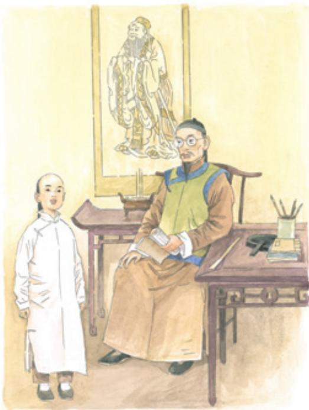

生听了，连连点头。接着，先生在孙中山的书上又圈了一段，他念一句，叫孙中山念一句。孙中山会读了，就回到座位上练习背诵。他读了几遍，就背下来了。可是，书里说的是什hú么意思，他一点儿也不懂。孙中山想：这样糊里糊涂地背，有什么用呢？于是，他壮着胆子站起来，问：“先生，您刚才让我背的这段书是什么意思？请您给我讲讲吧！”

这一问，把正在摇头晃脑高dāi声念书的同学们吓呆了，课堂里shà霎时变得鸦雀无声。

先生拿着戒尺，走到孙中山lì跟前，厉声问道：“你会背了吗？”

“会背了。”孙中山说着，就把那段书一字不漏地背了出来。

先生收起戒尺，摆摆手让孙

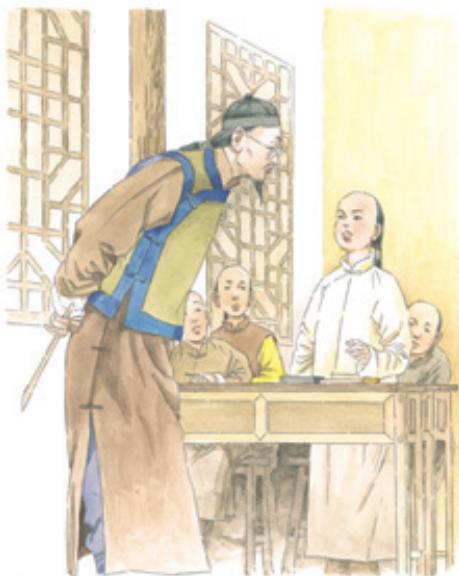

中山坐下，说：“我原想，书中的道理，你们长大了自然会知道的。现在你们既然想听，我就讲讲吧！”

xiáng

先生讲得很详细，大家听得很认真。

后来，有个同学问孙中山：“你向先生提出问题，不怕ái挨打吗？”

孙中山笑了笑，说：“学问学问，不懂就要问。为了弄清楚道理，就是挨打也值得。”

sòng lì hú jiè lì xiáng ái诵 例 糊 戒 厉 详 挨

## 口语交际

## 我的暑假生活

## 你的暑假是怎么度过的？经历了哪些新鲜事？和同学分享一下吧！

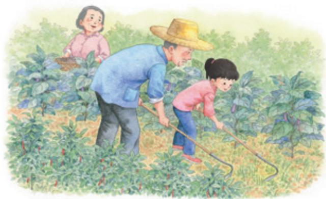

我跟爷爷奶奶学会了做简单的农活。现在我会摘茄子，还会给菜地锄草……

爸爸妈妈带我去了游乐园。这是我第一次坐摩天轮，从空中往下看，视野一下子开阔了，地上的人和车都变小了……

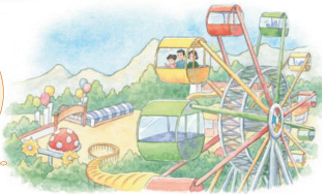

想好要讲的内容以后，先试着给家人讲一讲，听听他们有什么建议。

和同学交流的时候，要把自己的经历讲清楚。讲的时候可以出示相关的图片或实物，帮助别人更好地理解你讲的内容。

◎ 选择别人可能感兴趣的内容讲。

◎ 借助图片或实物讲。

## 猜猜他是谁

我们来做一个“猜猜他是谁”的游戏吧！

选择一个同学，用几句话或一段话写一写他。注意文中不能出现他的名字，但是要让别人读了之后能猜出你写的是谁。

他的头发又黑又硬，一根根向上竖着……

他关心班里的每个人，不管是谁遇到困难，他都会主动帮忙。有一次……

他特别爱笑，一个小笑话就能让他笑个不停……

他酷爱踢足球，也喜欢跑步，经常能在操场上看到他奔跑的身影……

你选的是谁？他有哪些特别的地方？选择一两点写下来。

写的时候，注意一段话的开头要空两格。写好以后读给同学听，看看他们能不能猜出你写的是谁。也可以把全班同学的习作贴在墙报上，大家一起来猜一猜。

# 语文园地

## 梳理与交流

有新鲜感的词句往往能带给我们新奇的体验和感受。你读到过哪些有新鲜感的词句？和同学一起交流吧！

窗外十分安静，树枝不摇了，鸟儿不叫了，蝴蝶停在花朵上，好像都在听同学们读课文。

看到这样的词句我会多读几遍，然后抄写下来。

我愿意我是一个更夫，整夜在街上走，提了灯去追逐影子。

## 词句段运用

下面的成语有什么特点？说说你的发现。摇头晃脑 披头散发 张牙舞爪 提心吊胆面红耳赤 手忙脚乱 手疾眼快 口干舌燥

怎样朗读能更好地表达句子的意思？想一想，练一练，再和同学交流。

◇ 妈妈，我真的觉得那些花朵是在地下的学校里上学。

◇ 书里说的是什么意思，他一点儿也不懂。

◇ 孙中山笑了笑，说：“学问学问，不懂就要问。为了弄清楚道理，就是挨打也值得。”

## 人民教育出版社

在班里组织几个兴趣小组吧！试着给每个兴趣小组取个响亮的名字，吸引有相同爱好的同学一起开展活动。

## 篮球侠

## 巧手剪纸组

## 探索者小队

我为兴趣小组取的名字能体现出活动的特点。

## 黑白棋社

我在名字中加入有个性的词语，让人一看就能记住。

## 日积月累

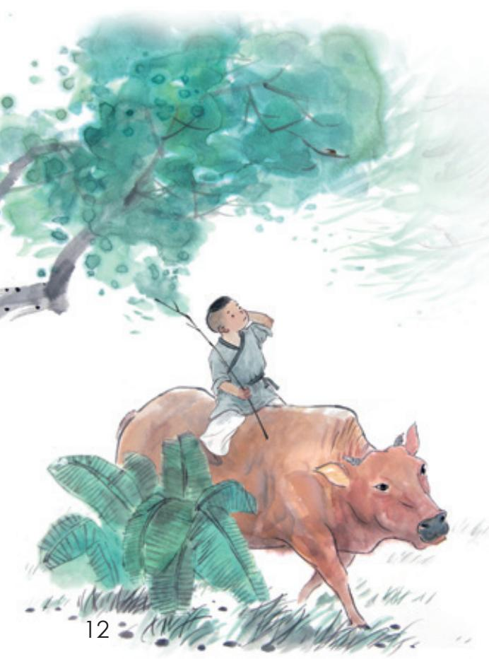

## 所 见

[清] 袁 枚

牧童骑黄牛，yuè歌声振林樾。意欲捕鸣蝉，忽然闭口立。

## 第二单元

金秋的阳光，  
洒在树叶上，  
洒在花瓣上，  
也洒在我们的心上。感受金秋时节的自然之美。  
运用多种方法理解难懂的词语。  
学习写日记，记录自己的见闻、感受。

## 阅 读

## 古诗三首

## 望洞庭 tíng ①

yǔ xī[唐] 刘禹锡

湖光秋月两相和，② wèi mó   
潭面无风镜未磨。   
遥望洞庭山水翠， luó   
白银盘里一青螺。③

## 山 行

mù[唐] 杜 牧

远上寒山石径斜xié ，① ② 白云生处有人家。③ 停车坐爱枫林晚，④ 霜叶红于二月花。

## 注释

①〔洞庭〕洞庭湖，位于今湖南北部。  
②〔和〕协调，和谐。  
③〔青螺〕青绿色的螺。这里比喻洞庭湖中的君山。

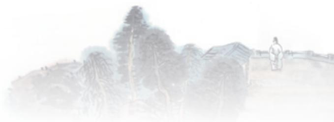

## 注释

①〔寒山〕深秋时节的山。   
②〔斜〕曲折向前延伸。   
③〔生〕产生，生出。   
④〔坐〕因为。

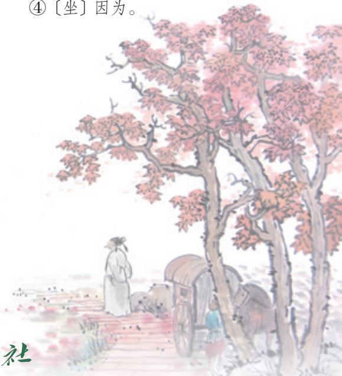

## 夜书所见

shào [宋] 叶绍翁

xiāo   
萧萧梧叶送寒声，①   
江上秋风动客情。 tiǎo cù   
知有儿童挑促织，② ③ lí   
夜深篱落一灯明。④

注释

①〔萧萧〕这里形容风吹梧桐叶发出的声音。

②〔挑〕用细长的东西拨。

③〔促织〕蟋蟀，也叫蛐（qū）蛐。

④〔篱落〕篱笆。

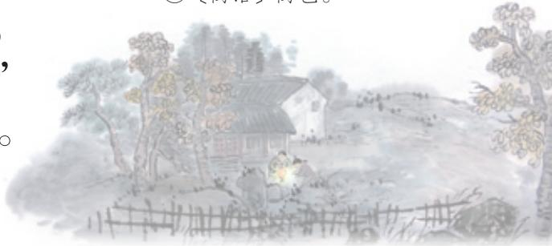

# tíng wèi mó xié xiāo tiǎo cù庭 未 磨 斜 萧 挑 促

庭 相 未 寒 斜 枫 霜 挑 深

有感情地朗读课文。背诵课文。默写《山行》。

这三首诗写的是哪个季节的景色？你是从哪些地方发现的？

结合注释，用自己的话说说下列诗句的意思。

◇ 遥望洞庭山水翠，白银盘里一青螺。

◇ 停车坐爱枫林晚，霜叶红于二月花。

# 铺满金色巴掌的水泥道①5

一夜秋风，一夜秋雨。

我背着书包去上学时，天开始放晴了。

啊！多么明朗的天空。

可是，地面还是潮湿的，不时还能看见一个亮晶晶的水wā洼，映着一角小小的蓝天。

道路两旁的法国梧桐树，掉下了一片片金黄金黄的叶子。zhān lù这一片片闪着雨珠的叶子，一掉下来，便紧紧地粘在湿漉漉的水泥道上了。

我走在院墙外的水泥道上。水泥道像铺上了一块彩色的tǎn yìn地毯。这是一块印着落叶图案的、闪闪发光的地毯，从脚下一直铺到很远很远的地方，一直到路的尽头……

每一片法国梧桐树的落叶，都像一个金色的小巴掌，熨tiē liè帖地、平展地粘在水泥道上。它们排列得并不规则，甚至有líng zēng些凌乱，然而，这更增添了水泥道的美。

我一步一步小心地走着，一片一片仔细地数着。我穿着zōng xuē一双棕红色的小雨靴。你瞧，这多像两只棕红色的小鸟，在秋天金黄的叶丛间，愉快地蹦跳着，歌唱着……

要不是怕上课迟到，我会走得很慢很慢的。

一夜秋风，一夜秋雨。

当我背着书包去上学时，第一回觉得，门前的水泥道真美啊！

zhān yìn liè líng zēng zōng粘 印 列 凌 增 棕

朗 晶 珠 粘 印 案 日

展 列 规 则 凌 乱

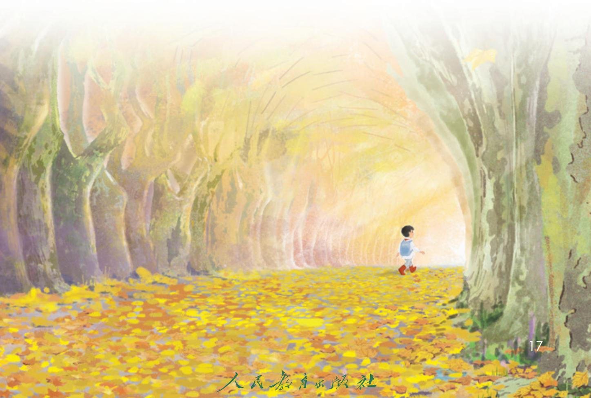

## 人民教育出版社

朗读课文。把你喜欢的句子抄写下来。

你是用什么方法理解下面加点词语的？和同学交流。

◇ 啊！多么明朗的天空。

◇ 它们排列得并不规则，甚至有些凌乱。

读一读，记一记。

脚印  印章  印刷

排列  并列  列车

凌晨  凌空  盛气凌人

增添  增加  与日俱增

## 选 做

“铺满金色巴掌的水泥道”，多美的发现啊！你在上学或放学路上看到了什么样的景色？用几句话写下来吧。

## 阅读链接

从我家到小学要经过一条大街，一条曲曲弯弯的巷子。我  
放学回家喜欢东看看，西看看，看看那些手工作坊、布店、酱  
园、杂货店、爆仗店、烧饼店、卖石灰麻刀的铺子、染坊……zàn  
我到银匠店里去看银匠在一个模子上錾出一个小罗汉，到竹器pá  
厂看师傅怎样把一根竹竿做成筢草的筢子，到车匠店看车匠用  
硬木车旋出各种形状的器物，看灯笼铺糊灯笼……百看不厌。qí选自汪曾祺的《自报家门》，有改动。

# 6 秋天的雨

yào shi

秋天的雨，是一把钥匙。它带着清凉和温柔，轻轻地，轻轻地，趁你没留意，把秋天的大门打开了。

bīn

秋天的雨，有一盒五彩缤纷的颜料。你看，它把黄色给  
了银杏树，黄黄的叶子像一把把小扇子，扇哪扇哪，扇走méi  
了夏天的炎热。它把红色给了枫树，红红的枫叶像一枚枚  
yóu shuǎng  
邮票，飘哇飘哇，邮来了秋天的凉爽。金黄色是给田野的，jú  
看，田野像金色的海洋。橙红色是给果树的，橘子、柿子你  
挤我碰，争着要人们去摘呢！菊花仙  
子得到的颜色就更多了，紫红的、淡  
黄的、雪白的……美丽的菊花在秋雨pín  
里频频点头。

读到这里，我理解了“五彩缤纷”的意思。

秋天的雨，藏着非常好闻的气味。梨香香的，葡萄甜甜的，还有苹果、橘子，好多好多香甜的气味，都躲在小雨滴gōu里呢！小朋友的脚，常被那香味勾住。

## 人民教育出版社

秋天的雨，吹起了金色的小喇叭①。它告诉大家，冬天  
快要来了。小松鼠找来松果当粮食，小青蛙在加紧挖洞，准hòu shang  
备舒舒服服地睡大觉。松柏穿上厚厚的、油亮亮的衣裳，杨  
树、柳树的叶子飘到树妈妈的脚下。它们都在准备过冬了。

秋天的雨，带给大地的是一曲丰收的歌，带给小朋友的是一首欢乐的歌。

yào shi bīn méi yóu jú pín lí gōu lǎshuǎng bā 钥 匙 缤 枚 邮 爽 橘 频 梨 勾 喇 叭

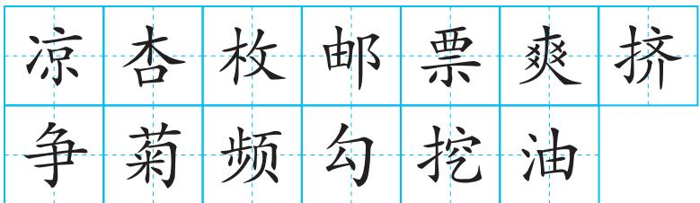

有感情地朗读课文。背诵第2自然段。

课文从哪几个方面写了秋天？和同学交流你感兴趣的内容。

想象一下：秋天的雨还会把颜色分给谁呢？照样子写一写。

它把黄色给了银杏树，黄黄的叶子像一把把小扇子，扇哪扇 哪，扇走了夏天的炎热。

秋分过后，黑夜就渐渐比白天长了，缺乏阳光的寒冷时节又开始了。

田野里空荡荡的，夏天太阳所赐予的物产已经收获完毕，许多植物已经褪色或枯死。在植物和动物适应冬季以前，迁徙的季节来临了。

植物的种子和果实在传播。许多种子装备着小小的翅膀或jì是“降落伞”，比如蓟类植物，风把它们的种子从妈妈那里带走，吹到尽可能远的地方。地上到处都是新的种子。如果所有的种子都落在同一个地方，它们就会互相抢夺地盘和阳光。

许多幼小的动物正在成长。它们离开了父母，自己去找一处新的住所。小蜘蛛用闪闪发亮的丝将自己悬挂在空中，有时候它们远离原来的巢穴，到几公里之外搭建新家，有时候它们就直接在遇到的第一根树枝上安家。

候鸟也开始了它们的旅途。随着秋天的光照时间一天天变短，候鸟的“生物钟”催促着它们：是时候了，出发吧！它们向着太阳，飞向那白昼更长、气候更温暖的南方。燕子早早地启程了，因为它知道，要不了多久，这里将没有昆虫可吃。金翅雀是一种以蓟类植物为生的雀鸟，它会停留更长的时间，直到大雪覆盖它最爱吃的食物—蓟类植物的种子。

选自德国乌纳·雅各布的《太阳时钟》，顾白译，有改动。

## 听听，秋的声音 \* 7

有感情地朗读课文，一边读一边想象，然后和同学交流：你听到了秋天的哪些声音？

听听，  
秋的声音，dǒu  
大树抖抖手臂，  
shuā  
“唰唰”，

是黄叶道别的话音。

听听，

秋的声音，  
xī shuài zhèn  
蟋蟀振动翅膀，qū  
“ ”，yùn  
是和阳台告别的歌韵。  
一排排大雁追上白云，  
撒下一阵暖暖的叮咛；lüè  
一阵阵秋风掠过田野，yín  
送来一片丰收的歌吟。

##

## 立

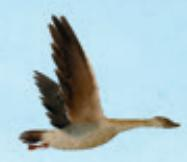

听听，  
走进秋，liáo kuò  
走进这辽阔透明的音乐厅，  
你好好地去听秋的声音。秋的声音，  
在每一片叶子里，  
在每一朵小花上，  
在每一滴汗水里，  
在每一颗饱满的谷粒里。听听，  
秋的声音，  
从远方匆匆地来，  
向远方匆匆地去。  
听听，  
我们去听秋的声音。

## dǒu zhèn yùn lüè yín liáo kuò 抖 振 韵 掠 吟 辽 阔

## 写日记

你写过日记吗？读读下面的日记，说说你有什么发现。

## 9月29日  星期一  晴

早上起床时，我发现那颗松动的牙齿更松了。我想把它摇掉，可是左摇右摇，牙齿就是不掉。唉！怎么办呢？这种感觉真难受。晚饭前，我忍不住又去晃动它，晃了几下，啊，终于掉了！

妈妈把我的这颗牙齿洗干净，收起来了。

和同学交流：

◇ 日记里可以写些什么？

◇ 日记的格式是怎样的？

◇ 写日记有什么好处？

准备一个日记本，开始记录自己的生活吧！坚持写下去，你一定会大有收获。

写的时候注意格式和标点符号。

# 语文园地

## 梳理与交流

读书时遇到不理解的词语，你会怎么做？分小组完成下面的活动，看看哪个小组总结的方法多。

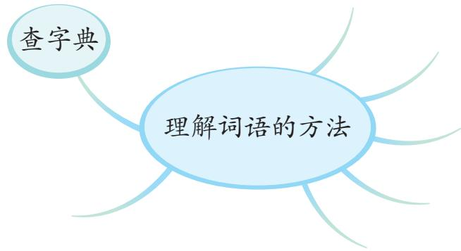

## 词句段运用

你会用哪些词语来形容不同的季节？写下来和同学交流。

春：暖和　春光明媚

夏：

秋：

冬：

说说你是用什么方法理解下面加点词语的。

听了老师的这番话，我憧憬着即将到来的那一天，期待着在活动中有出色的表现。

◇ 小明打碎了家里的花瓶，心中有些忐忑不安 ，害怕爸爸妈妈会责备他。

## 书写提示

<table><tr><td>狂 罚</td><td></td><td>木 目</td><td></td></tr><tr><td></td><td></td><td>西 票</td><td></td></tr><tr><td>笛</td><td></td><td>频</td><td></td></tr><tr><td>湿</td><td></td><td>霜</td><td></td></tr></table>

使用钢笔时，要注意执笔姿势正确，书写规范、端正、整洁。

横画要写得平稳，竖画要写得端正。横平竖直，字就平稳端正。

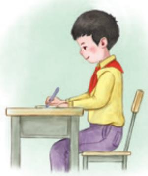

## 日积月累

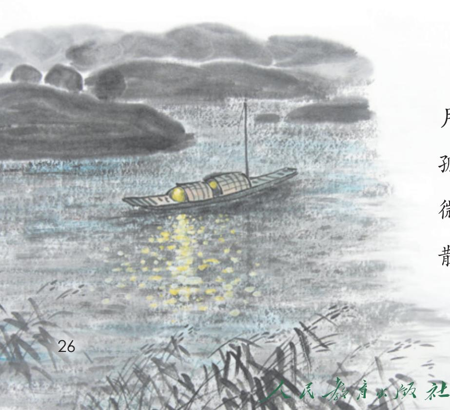

## 舟夜书所见

[清] 查慎行

月黑见渔灯，孤光一点萤。微微风簇浪，散作满河星。

# 第三单元

猜测与推想，使我们的阅读之旅充满了乐趣。

◎ 了解预测的基本方法并尝试运用。

◎ 尝试续编故事。

#

## 阅 读

老屋总也倒不了，是被施了魔法吗？

## 8 总也倒不了的老屋

老屋已经活了一百多岁了。它的窗户变成 了黑窟窿，门板也破了洞，很久很久没人住了。

“好了，我到了倒下的时候了！”它自言自语着，准备往旁边倒去。

图中的老屋看上去那么慈祥，它应该会答应吧！

“等等，老屋！”一个小小的声音在它门前响起，“再过一个晚上，行吗？今天晚上有暴风雨，我找不到一个安心睡觉的地方。”

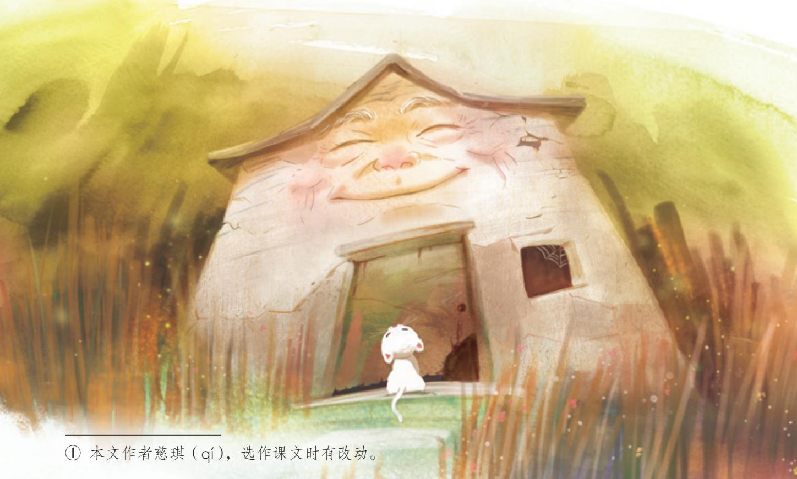

mī

老屋低头看看，吃力地眯起眼睛：“哦，是小猫啊。好吧，我就再站一个晚上。”

第二天，天晴了。小猫从破窗户里跳了miāo出来：“喵喵，谢谢！”

老屋说：“再见！好了，我到了倒下的时候了！”

“等等，老屋！”一个小小的声音在它门前响起，“再过二十几天，行吗？主人想拿走fū我的蛋，可是我想孵小鸡。我找不到一个安心孵蛋的地方。”

我想老屋可能会不耐烦了。

老屋低头看看，墙壁吱吱呀呀地响：“哦，是老母鸡啊。好吧，我就再站二十几天。”

二十多天后，老母鸡从门上的破洞里走jī了出来，九只小鸡从门板下面叽叽叫着钻了出来：“叽叽，谢谢！”

老屋说：“再见！好了，我到了倒下的时候了！”

一读到这句话，我就知道，一定又有谁来请老屋帮忙了。

我猜到了老屋会怎么回答。

“等等，老屋！”一个小极了的声音在它门前响起，不注意根本听不到，“请再站一会儿吧，我肚子好饿好饿，外面的树被砍光了，我找不到一个安心织网抓虫的地方。”

老屋低头看看，眼睛眯成一条缝：“哦，是小蜘蛛啊。好吧，我就再站一会儿。”

小蜘蛛飞快地爬进屋子，在屋梁上织了一ǒu ěr张又大又漂亮的网。偶尔有虫子撞到网上，小蜘蛛马上爬过去把虫子吃掉。

老屋可能还会遇到其他需要帮助的小动物。

“小蜘蛛，你吃饱了吗？”老屋问。

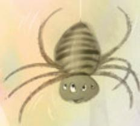

“没有，没有！”小蜘蛛一边忙着补网，一边回答，“老屋老屋，我给您讲个故事吧！”

老屋想，这倒很有意思。于是它就开始听小蜘蛛讲故事。

估计老屋不会倒了。

小蜘蛛的故事一直没讲完，因此，老屋到现在还站在那儿，边晒太阳，边听小蜘蛛讲故事。

# mī ò miāo fū jī fèng ǒu ěr眯 哦 喵 孵 叽 缝 偶 尔

屋 板 准 备 等 暴

哦 钻 爬 漂 晒

读课文的过程中，你猜到后面会发生什么了吗？你是怎么猜的？和同学交流。

当我读到老母鸡请求老屋不要倒下时，我猜老屋可能会不耐烦，因为它又一次被别人打扰。

故事中的老屋已经帮助过小猫和老母鸡了，我一读到小蜘蛛来请求老屋，就猜到老屋会同意。

我发现，文章的题目、插图，文章内容里的一些线索，都可以帮助我们预测。

我预测的内容有的跟故事的实际内容一样，有的不一样。

老屋给你留下了什么样的印象？联系插图和课文内容说一说。

读下面的故事，一边读一边想：接下来可能会发生什么事情？再和同学说说陶陶是一只怎样的乌龟。

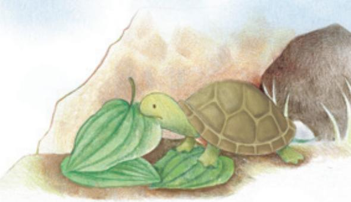

这是一个美丽的早晨，阳光灿烂。乌龟陶陶正坐在她那shì舒适的小洞前，吃着车前草的叶子。她的头顶上，是一棵古gǎn lǎn tán老的橄榄树，一对鸽子正在树上谈话：狮王二十八世要举行hūn yāo qìng diǎn gōngdiàn tú婚礼了，他邀请所有动物前去参加庆典。狮王的宫殿路途遥远，而庆典不久就要开始，必须马上动身。两只鸽子说完就飞走了。

xiàn

陶陶听见鸽子的谈话，陷入了沉思：如果所有动物都被kuò shǐ邀请了，当然也包括我，为什么我不去参加这有史以来最热闹的婚礼呢？

想了整整一天一夜后，陶陶终于拿定主意，第二天一大早便上路了。她一步一步向前爬去，虽然很慢，却一直没有停下。

路过一片荆棘丛时，陶陶遇到了蜘蛛。得知她要去参加

狮王的婚礼，蜘蛛哈哈大笑，巨大的蜘蛛网被笑声震得剧烈chàn  
地颤动起来。

“婚礼两周后就要举行了，你可是慢得出奇呀，怎么可能赶得上呢？”陶陶看了看自己的腿—它们虽然短小，却很结实。她满怀信心地说：“我会准时赶到那里的。”

蜘蛛充满同情地劝她：“陶陶，我的腿不但比你的灵巧，bèi还多一倍呢，连我都觉得路途太遥远，你还是清醒点儿，赶紧回家吧！”

“很遗憾，我不能这样，我的决定是不可改变的。”陶陶hēng chī友好地回答，又哼哧哼哧地开始赶路了。

越过种种障碍，穿过树林和沙地，陶陶日夜不停地赶路。

有一天，陶陶经过一个池塘，她想停下来喝口水。在一téng wō dèng片常春藤的叶子上，一只蜗牛正瞪着双眼打量着她。陶陶客气地跟蜗牛打听去狮王二十八世的宫殿怎么走。

蜗牛想了好一会儿，才把自己那迷迷糊糊的思绪理清zāo楚。他难过地告诉陶陶：“太糟了！你完全走反了方向。”

“非常感谢你给我指路！”说完，陶陶慢慢掉头往回走。

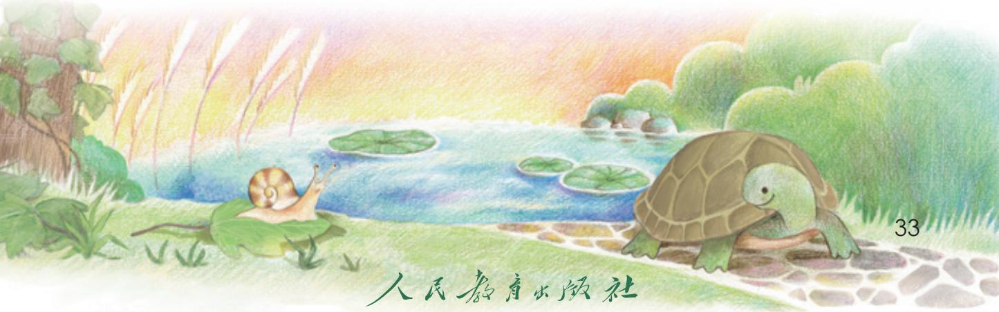

# 人民教育出版社

jī qiāng“可是，后天就要举行婚礼了呀！”蜗牛几乎带着哭腔说。chí“只要一步一步坚持走，我会准时赶到的。”陶陶说。

越过种种障碍，穿过树林和沙地，陶陶日夜不停地赶路。

后来，她遇到了正躺在石头上打盹儿的壁虎。得知陶陶的来意，壁虎居高临下地打量着她说：“作为狮王王宫的高guān zàn级官员，我正式通知你，婚礼暂时取消了。由于非常突然的原因，狮王二十八世不得不和老虎开战。你可以回家了。”

táo shì tán hūn qìng diǎn tú kuò shǐ bèi jī chí guān陶 适 谈 婚 庆 典 途 括 史 倍 几 持 官

在读课文的过程中你预测了哪些内容？故事还没有结束，你认为后来可能会发生什么事情？你为什么这样想？

我在故事的很多地方作了预测。当读到蜘蛛劝说陶陶放弃参加狮王二十八世的婚礼时，联系课文题目，我就猜到陶陶不会听劝；读到蜗牛告诉陶陶完全走反了方向时，我根据生活经验预测她一定赶不上婚礼了。

我发现“越过种种障碍，穿过树林和沙地，陶陶日夜不停地赶路”这句话在文中出现了两次，我预测后面可能还会出现很多障碍。

听老师把故事讲完，看看自己的预测和原文有哪些相同和不同。

当发现自己的预测和原文的实际内容不同时，我会及时修正自己的想法，接着猜测后面可能发生什么。

我预测的内容没有原文丰富，有的还与原文不一致，但是我的预测也是有依据的。

读读下面这些文章的标题和书名，猜猜里面可能写了些什么。

《躲猫猫大王》

《帽子的秘密》

《柔软的阳光》

《团圆》

《小灵通漫游未来》

# 小狗学叫 \* ①10

读故事，一边读一边预测后面的内容。想一想：故事的结局可能是什么？

从前，有一条不会叫的狗。它不会像狗一样叫，不会像mōu sī猫一样叫，也不会像牛那样哞哞叫，更不会像马那样嘶鸣。líng mò它是一只孤零零的小狗，不知道怎么到了一个陌生的地方。它并没有发现自己有什么毛病，是别的动物让它知道，不会xiàn叫其实是一种很大的缺陷。它们对它说：

“你怎么不叫？”

“我不会……我是外来的……”

“这算什么回答啊。你难道不知道狗是会叫的？”

“干吗要叫？”

“狗会叫，因为它们是狗。它们对过路的陌生人叫，对  
rě tǎoyàn  
惹人讨厌的猫叫，对着满月叫。它们高兴的时候叫，紧张的nù  
时候叫，发怒的时候也叫。它们白天叫得多，但晚上也叫。”

“也许是这样，可我……”

“可你怎么啦？你这只狗可真特别。去，去！总有一天你会上新闻的。”

# 人民教育出版社

小狗不知道该怎么回答这些指责。它不会叫，也不知道怎么才能学会。

“你跟我学。”有一次，一只同情它的小公鸡对它说。那wō只小公鸡喔喔喔地叫了几声。

“我觉得很难。”小狗对小公鸡说道。

“不难，容易极了。你好好听着，看我的嘴，注意观察，学我的样子。”

小公鸡又喔喔喔地叫起来。

小狗试着照小公鸡的样子做，但嘴里只发出一种滑稽的咯gē咯声，吓得旁边的小母鸡都逃走了。

“不要紧，”小公鸡说道，“第一次能这样就很不错了。你再试试，来！”小狗又试了一次，两次，三次，都没能成功。

从此，它天天都练习，从早到晚偷偷地练。有时候，为了更suǒ xìng自由，它索性到树林里去练。

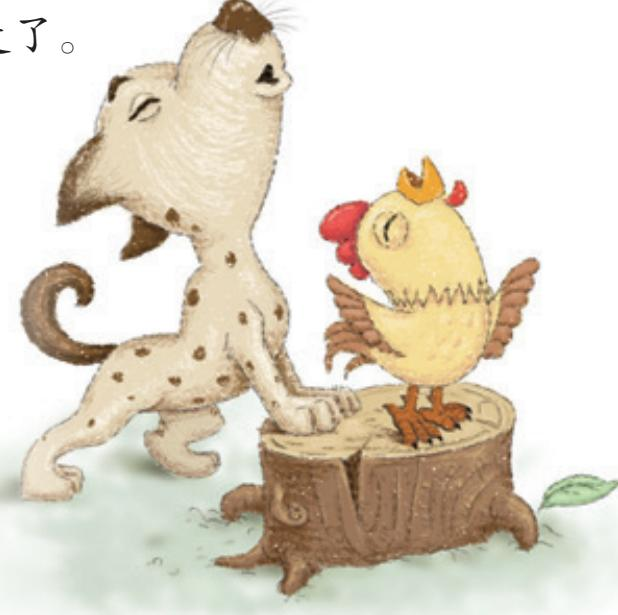

一天早晨，它在树林里练习，发出的喔喔喔的叫声是那bī  
么逼真，那么好听，那么洪亮。一只狐狸听到了，心里寻思fǎng  
着：公鸡终于来找我了，我得去感谢它的来访。狐狸真的去jì chā  
了，还没忘记带上刀叉和餐巾，因为对狐狸来说，没有比小

# 人民教育出版社

tí公鸡更美味可口的午餐了。可以想象，当它看见啼叫的是一只狗而不是小公鸡时，该是多么失望啊！那只狗蹲坐着，一声又一声地喔喔叫着。

我能猜出小狗和狐狸 会有怎样的交流。

狐狸真想哈哈大笑。它在地上打着滚，捧着肚子，竭力rěn wěi qū mò忍着不笑出声来。小狗感到很委屈，低着头，含着泪水默默走开了。

附近的一只杜鹃看着小狗走过去，很同情它。

“你怎么啦？”

“没什么。”

“那你为什么这样伤心？”

“唉……没什么好说的……因为我不会叫。”

“要是就因为这个，那我可以教你。你听我怎么叫，尽可能模仿我。咕咕……咕咕……咕咕……你听明白了吗？”

“我觉得很容易。”

“容易极了，我从小就会这样叫。你试试！咕咕……”

“咕……”小狗学着杜鹃叫，“咕……”

它那天试了，第二天、第三天又试了。一个星期过后，它已经学得相当不错了。小狗真高兴，心想：我终于会叫了，现在别人再也不能取笑我了。

就在那几天，人们开始打猎了，树林里来了很多猎人，zhòng  
里面还有百发百中的神枪手。一个猎人经过那里，听见树丛miáo pēng  
中传来咕咕的叫声，就举枪瞄准，“砰！砰！”连开了两枪。

幸好没打中。子弹擦过小狗的耳边，就像连环画里画的chà fēng那样。小狗拔腿就跑。它很诧异：那个猎人准是发疯了，竟然对狗开枪！

狗跑啊，跑啊……

## jú第一种结局

狗跑啊，跑啊，它跑到了一片草地上，一头小母牛正在那里安详地吃草。

“你去哪儿啊？”

“我不知道。”

“那你就别走了，这里的青草特别鲜嫩。”

“唉，青草不能医治我的病……”

“你病啦？”

“可不是！我不会叫。”

“可是，这是世界上最容易的事！你听我叫：哞……哞……哞……还有比这更好听的叫声吗？”

……

## 第二种结局

狗跑啊，跑啊，它碰上了一个农夫。

## 第三种结局

狗跑啊，跑啊，突然停住了，它听见一种奇怪的叫声：wāng“汪汪，汪汪……”

这叫声像在对我说什么，它想，尽管我搞不清这是什么动物在叫。

“汪，汪……”

mò má tǎo yàn fǎng jì rěn wěi qū zhòng dàn fēng jú wāng gǎo陌 吗 讨 厌 访 记 忍 委 屈 中 弹 疯 局 汪 搞

故事的几种结局可能是怎样的？说说你的理由。然后听老师读故事的结局，看看和自己的预测有哪些相同和不同。

你喜欢故事中的哪些内容？和同学交流。

选一本同学不熟悉的故事书，读给他们听。读的时候，在某些地方停下来，让他们猜猜后面可能会发生什么。

## 口语交际

## 名字里的故事

每个人都有名字。你知道自己的名字有什么含义吗？回家问问长辈吧。你的名字里也许饱含着他们对你的期待，说不定还藏着一个故事呢！

我还要问问家里人，看看他们的名字有什么含义。

有些名人的名字很有趣，我想去了解一下。

和同学交流名字的含义或来历，可以是关于自己名字的，也可以是关于其他人名字的。

听同学讲的时候，如果有感兴趣的或不理解的内容，可以向讲的人提出来，进一步了解。

和同学交流之后，回家和家里人说说，你从同学的讲述里知道了哪些新鲜事。

◎ 把了解到的信息讲清楚。

◎ 听别人讲话的时候，表现出交流的兴趣。

## 续写故事

下面的图讲了什么事情？接下来可能会发生什么？请你把故事写完。

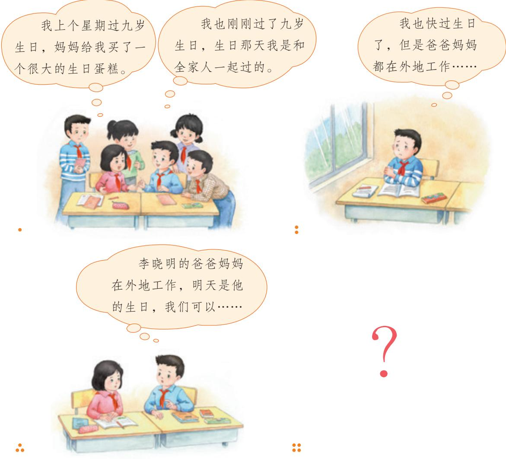

写好以后和同学交流习作，说说你更喜欢谁写的故事。

# 语文园地

## 梳理与交流

预测的方法对你的阅读有哪些帮助？你是怎么运用预测来阅读的？和同学交流你的心得。

一边读一边预测后面的内容，我感受到了阅读的乐趣，也更好地理解了文章的意思。

学习了怎样预测后，我读书更仔细了，注意到了更多的细节。

在图书馆选书时，我会先根据封面上的书名和插图猜猜书的大致内容。

## 识字加油站

读一读，写一写。

我通过查字典认识了这些加点的字。

恒3 心 神圣3 萌3 发 妥3 当车轴 阁楼 培植 厘米

恒 圣 萌 妥 轴 阁 培 厘

# 人民教育出版社

## 词句段运用

读句子，说说你有什么发现。再照样子写句子，注意标点符号的用法。

◇ 她满怀信心地说：“我会准时赶到那里的。”

“小蜘蛛，你吃饱了吗？”老屋问。

“不要紧，”小公鸡说道，“第一次能这样就很不错了。”

学习下面的修改符号，并试着使用这些符号修改自己的习作。

◇ 李老师以经走了。

◇ 他穿着一件灰色的上衣，一顶蓝色的帽子。

菜园里种了很多蔬菜，有土豆、黄瓜、西瓜和西红柿。

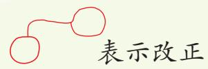

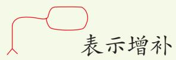

表示删除

## 日积月累

◎ 不迁怒，不贰过。 —《论语》

◎ 爱人若爱其身。 —《墨子》

◎ 仁者爱人，有礼者敬人。 —《孟子》

◎ 与人善言，暖于布帛；伤人以言，深于矛戟。xún—《荀子》

## 第四单元

乘着想象的翅膀，  
游历奇妙的童话王国，看花儿跳舞，  
听星星歌唱。

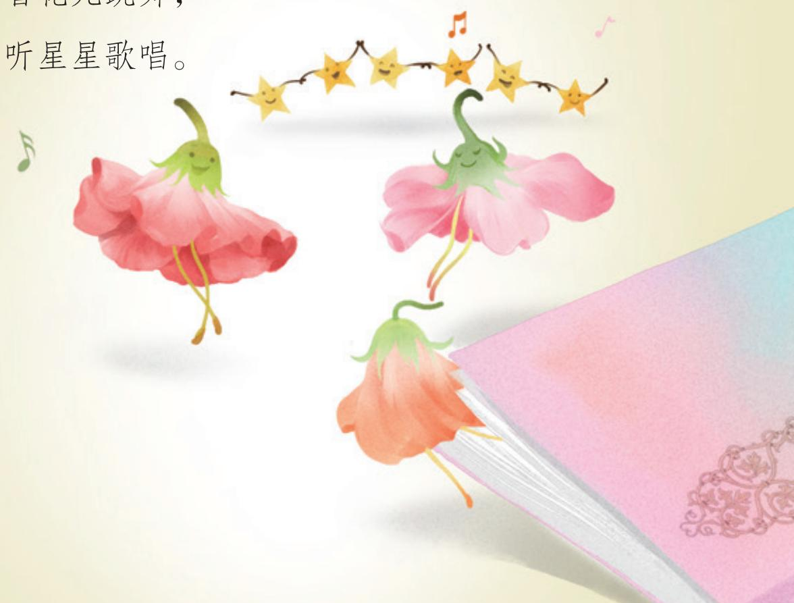

阅读童话，构筑充满童心的精神乐园。

◎ 感受童话丰富的想象，体会其中的真善美。

◎ 试着自己编童话、写童话。

## mì 宝葫芦的秘密（节选）①

jiè shào

我来给你们讲个故事。可是我先得介绍介绍我自己：我bǎo姓王，叫王葆。我要讲的，正是我自己的一件事情，是我和宝葫芦的故事。

你们也许要问：“什么？宝葫芦？就是传说故事里的那种宝葫芦吗？”

不错，正是那种宝葫芦。

yāo

可是我要声明，我并不是什么神仙，也不是什么妖怪。pǔ我和你们一样，是一个平平常常的普通人。你们瞧，我是一shào个少先队员，我也和你们一样，很爱听故事。

至于宝葫芦的故事，那我从小就知道了。那是我奶奶讲féng给我听的。奶奶每逢要求我干什么，就得给我讲个故事。这jǔ是我们的规矩。

guāi

“乖小葆，来，奶奶给你洗个脚。”奶奶总是一面撵我，一面招手。

tàng

“我不干，我怕烫。”我总是一面溜开，一面摆手。

“不烫啊。冷了好一会儿了。”

“那，我怕冷。”

奶奶撵上了我，说洗脚水刚好不烫也不冷，非洗不可。

我只好让步。不过我有一个条件：“你爱洗就让你洗。你可得讲个故事。”就这么着，奶奶讲了个宝葫芦的故事。

“好小葆，别动！”奶奶刚给我洗了脚，忽然又提出一个新的要求来，“让我给你剪一剪……”

什么！剪脚指甲啊？那不行！我光着脚丫，一下地就gē bó zhuài跑。可是胳膊给奶奶拽住了。没有办法。

不过我得提出我的条件：“那，非得讲故事。”于是奶奶又讲了一个—又是宝葫芦的故事。

我就这么着，从很小的时候起，听奶奶讲故事，一直听pī  
到我十来岁。奶奶每次讲的都不一样。上次讲的是张三劈面  
撞见了一位神仙，得了一个宝葫芦。下次讲的是李四出去远gōng  
足旅行，一游游到了龙宫，得到了一个宝葫芦。王五呢，他  
因为是一个好孩子，肯让奶奶给他换衣服，所以得到了一个zhào jué  
宝葫芦。至于赵六得的一个宝葫芦—那是掘地掘出来的。

不管张三也好，李四也好，一得到了这个宝葫芦，可就幸福极了，要什么有什么。张三想：“我要吃水蜜桃。”立刻xī就有一盘水蜜桃。李四希望有一条大花狗，马上就冒出了那chòng tiǎn么一条—冲着他摇尾巴，舔他的手。

后来呢？后来不用说，他们全都过上了好日子。

lián xì

我听了这些故事，常常就联系到自己：“我要是有了一个宝葫芦，我该怎么办？我该要些什么？”

一直到我长大了，有时候还想起它来。我有几次对着一道算术题发愣，不知道要怎么列式子，就由“8”字想到了宝葫芦—假如我有这么一个，那可就省心了。

我和同学们比赛种向日葵，我家里的那几棵长得又瘦又  
长，上面顶着一个小脑袋，可怜巴巴的样儿，比谁的也比不  
上。我就又想到了那个宝贝：“那，我得要一棵最好最好的bàng huàn bà  
向日葵，长得不能再棒的向日葵。”可那只不过是幻想罢了。

可我总还是要想到它。那一天我和科学小组的同学闹翻了，我又想到了它。“要是我有那么一个葫芦，那……”

pǔ shào jǔ yā jué xī lián xì kuí shòugōng chòng bà普 少 矩 丫 宫 掘 希 冲 联 系 葵 瘦 罢

葫 芦 错 错 並 普 宫 肯 肯 怜

朗读课文。说说奶奶给王葆讲了关于宝葫芦的哪些故事，宝葫芦有什么神奇之处。

王葆为什么特别想要一个宝葫芦？如果你有了宝葫芦，你会用来做什么？

选 做

当王葆真的得到了宝葫芦时，他逐渐认识到靠宝葫芦不劳而获，带给他的不是幸福，而是烦恼。这是怎么回事呢？感兴趣的同学可以读读《宝葫芦的秘密》这本书。

# 在牛肚子里旅行12

xī shuài

有两只小蟋蟀，一只叫青头，另一只叫红头。它们是一对非常要好的朋友。有一天，吃过早饭，青头对红头说：“咱们玩捉迷藏吧！”

“那让我先藏，你来找。”红头说。

“好吧！”青头说完，转过身子闭上眼睛。

红头向周围看了看，悄悄地躲在一个草堆里不作声了。

“藏好了吗？”青头大声问。

红头不说话，只露两只眼睛偷偷地看。它心想：我要是dā yìng一答应，就会被青头发现。

正在这时，一头大黄牛从红头后面慢慢走过来。红头做梦也没有想到，大黄牛突然低下头来吃草。可怜的红头还没jí juǎn有来得及跳开，就和草一起被大黄牛卷到嘴里了。

“救命啊！救命啊！”红头拼命地叫起来。

“你在哪儿？”青头急忙问。

“我被牛吃了……正在它的嘴里……救命啊！救命啊！”

青头大吃一惊，它一下子蹦到牛身上，可是那头牛用尾gū lù巴轻轻一扫，青头就给摔到地上了。青头不顾疼痛，一骨碌

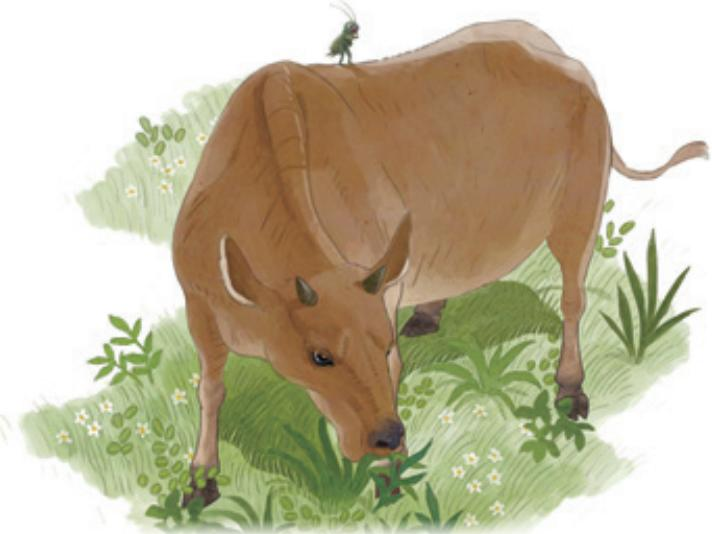

爬 起 来 大 声 喊：chǐ  
“躲过它的牙齿，  
牛在这时候不会仔jiáo  
细嚼的，它会把你tūn  
和草一起吞到肚子  
里去……”

“那我马上就会死掉。”红头哭起来。它和草已经一起进了牛的肚子。

青头又跳到牛身上，隔着肚皮和红头说话：“红头！不wèi要怕，你会出来的。我听说牛的胃有四个胃室，前三个主要chǔ cún是储存食物的，第四个才是管消化的！”

“可是你说这些对我有什么用呢？”红头悲哀地说。

“当然有用。等一会儿牛休息的时候，它要把刚才吞进yàn去的草重新送回嘴里，然后细嚼慢咽……你是勇敢的蟋蟀，你一定能出来的。”

“谢谢你！”红头的声音小得几乎听不见了。它咬着牙不让自己失去知觉。

红头在牛肚子里随着草一起移动，从第一个胃室到了第二个胃室，又从第二个胃室回到了牛嘴里。这一下，红头又看见了光亮。可是，它已经一动也不能动了。

cèng

这时，青头爬到牛鼻子上，用它的身体在牛鼻孔里蹭来蹭去。

“阿嚏！”牛打了一个喷嚏，红头随着一团草一下子给喷了出来。

红头看见自己的朋友，高兴得流下了眼泪：“谢谢你……”

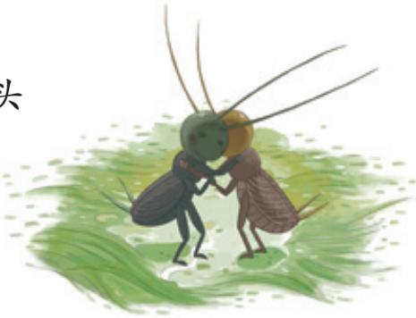

青头笑眯眯地说：“不要哭，就当是一次在牛肚子里的旅行吧！”

# dā yìng jí juǎn gū lù chǐ jiáo tūn wèi yàn答 应 及 卷 骨 碌 齿 嚼 吞 胃 咽

另 睛 卷 救思 齿

分角色朗读课文，体会青头和红头对话时的心情，读出相应的语气。

从哪里可以看出青头和红头是“非常要好的朋友”？默读全文，至少找出三处来说明。

画出红头在牛肚子里旅行的路线，想象它旅行的惊险，再把这个故事讲给别人听。

# lào 13 一块奶酪①

默读课文，想想课文围绕一块奶酪讲了一件什么事，再说说你喜不喜欢文中的蚂蚁队长，理由是什么。

蚂蚁队长集合好队伍，向大家宣布：“今天搬运粮食，chǔ只许出力，不许偷嘴。谁偷嘴就要处罚谁。”

一只小蚂蚁在队列里嘀咕：“要是偷嘴的是您呢？”蚂蚁队长说：“照样要受处罚。”

大家一听，都来劲了，争先恐后赶到运粮地点，抢着抬lǎn大的，搬重的，谁也不愿偷懒。

就在这时，蚂蚁队长发现了一块大奶酪。那块奶酪实在太大了，它左抬抬不起，右搬搬不动，只好叫来七八只小蚂蚁当助手。

tǎng

奶酪多诱人啊！抬着它，不要说吃，单是闻闻，都要淌tiǎn口水。小蚂蚁们嘴叼着它，要做到不趁机舔一下，那要有多yì qiáng jì xìng大的毅力、多强的纪律性啊！

zhuài

蚂蚁队长叼着奶酪的一角往前拽着，也许是用力过猛，zhā  
一下就把那个角拽掉了。盯着那一点儿掉在地上的奶酪渣，fàn  
蚂蚁队长想：丢掉，实在太可惜；趁机吃掉它，又要犯不jìn  
许偷嘴的禁令。怎么办呢？它的心七上八下，只好下令：

“休息一会儿！”

听到命令，大家放下奶酪，却不走开。

“大家分散开，哪里凉快就到哪里休息。”

大家依旧不动，眼睛望着别处，心却牵挂着那一点儿奶酪渣。

蚂蚁队长生气了。它登上一块大石板，突然下令：“注shào意啦，全体都有。稍息！立正！向后—转！齐步—走！”等小蚂蚁们消失在草丛中，它才大叫：“立—定！原地休息！”

这时，奶酪旁边只有蚂蚁队长，它要是偷嘴，谁也看xiù不见。它低下头，嗅嗅那点儿奶酪渣，味道真香！可是，yóu yù duò它犹豫了一会儿，终于一跺脚：“注意啦，全体都有。稍息！立正！向后—转！齐步—走！”

小蚂蚁们从四面八方的草丛里走拢来了。当它们重新jù聚到奶酪旁边时，蚂蚁队长命令年龄最小的一只蚂蚁：“这点儿奶酪渣是刚才弄掉的，丢了可惜，你吃掉它吧！”

大家又干起活来了，劲头比刚才更足，奶酪一会儿就被搬进洞里去了。

xuān chǔ kǒng yòu yì qiáng jì xìng zhā fàn jìn jiù jù宣 处 恐 诱 毅 强 纪 性 渣 犯 禁 旧 聚

## 我来编童话

童话世界真奇妙，我们也来编童话故事吧。

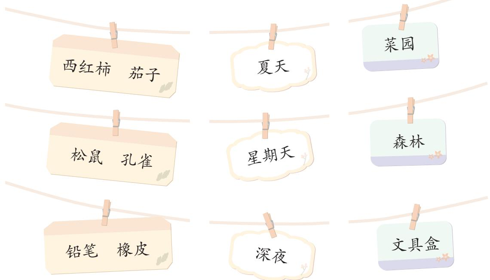

看到上面这些词语，你的脑海里浮现出了怎样的画面？你想到了什么样的故事？选择一组，发挥想象，把故事写下来。

写之前想一想：

◇ 故事里有哪些角色？（可以是上面提供的角色，还可以添加你喜欢的其他角色。）

◇ 故事发生在什么时间？是在哪里发生的？

◇ 他们在那里做什么？他们之间发生了什么事？

写完后给故事加一个题目，注意题目要居中。再试着用学过的修改符号修改你的习作。

# 语文园地

## 梳理与交流

你读过哪些童话故事？和同学交流你阅读童话的体会。

童话故事中充满了奇特的想象：神奇的宝葫芦能满足主人的一切愿望，蟋蟀可以在牛肚子里旅行，蚂蚁也有自己的纪律和准则。

在童话的世界里，植物、动物不但和人一样会说话，而且也有喜怒哀乐。

阅读童话，我们会经历很多不可思议的事情，认识一些令人钦佩的朋友，还能获得很多启示。

## 识字加油站

读一读，比一比，写一写。

shēn jiè shào zōng   
伸—申（申请） 界—介（介绍） 棕—宗（祖宗） zhǐ zhàn fá   
指—旨（主旨）    站—占（占领） 泛—乏（乏力）

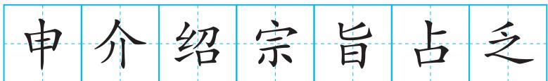

## 词句段运用

读词语，根据加点字的意思读准字音。

处分

到处3

假期

假扮

住处

假装

中断

中枪

中间

假3 日

中计

## 读一读，和同学交流你的发现。

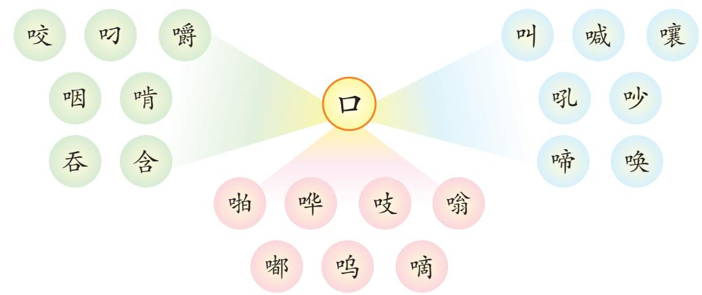

## 下面的成语有什么特点？你还能说出类似的成语吗？

百发百中

四面八方

七上八下

百战百胜

四通八达

七嘴八舌

百依百顺

四平八稳

七手八脚

## 日积月累

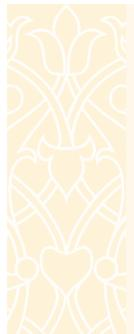

◎ 人心齐，泰山移。

◎ 二人同心，其利断金。

◎ 三个臭皮匠，顶个诸葛亮。

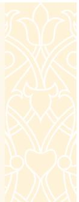

# 快乐读书吧

## 在那奇妙的王国里

在童话王国里，小蝌蚪四处寻找自己的妈妈，小壁虎着急地向别的动物借尾巴，雪孩子和小白兔在一起嬉戏玩耍，王子和公主过上了幸福的生活……在那里，一切都有可能发生，一切都妙不可言。

## 你读过吗

《安徒生童话》创造了一个奇妙的童话王国，这是丹麦作家安徒生送给全世界孩子和大人共同的礼物。善良的拇指姑娘，卖火柴的小女孩，坚定的锡兵，历经磨难的丑小鸭……这些故事里的主人公，一定会给你留下难以磨灭的印象。

“是的，我要和你一块儿去！”拇指姑娘说。她坐在鸟儿的背上，把脚搁在他展开的双翼上，同时用腰带把自己紧紧地系在他最结实的一根羽毛上。燕子就这样飞到空中，飞过了森林，飞过了海洋，飞过了常年积雪的高山。在寒冷的高空中，拇指姑娘冻得发起抖来。于是她就钻到鸟儿温暖的羽毛下面，只把她的小脑袋伸出来欣赏下面那些美丽的景致。

终于，他们来到了温暖的国度，那儿的阳光更加明亮。田沟里、篱笆上，到处都结满了最美丽的绿色和紫色的葡萄。树林里到处挂着柠檬和橙子。

—选自丹麦安徒生的《拇指姑娘》，叶君健译，有改动。

童话世界无奇不有。阅读时，充分发挥想象，能更好地领略童话的魅力。

我们可以把自己想象成童话中的主人公，和故事中的人物一起欢笑，一起悲伤。

## 相信你可以读更多

童话王国里还有许许多多动人的故事。

当你走进叶圣陶笔下《稻草人》的世界，你会知道在夜间的田野，星星怎样眨眼，月亮怎样微笑。你还会知道，田野里的人们有着怎样的辛苦和悲伤。

翻开德国格林兄弟搜集整理的《格林童话》，你能从一个个妙趣横生的故事中，感悟生活的真谛和做人的道理。灰姑娘虽然身处逆境，却仍然心怀美好，真诚待人；小裁缝勇敢乐观，用自己的智慧战胜巨人……

童话，这个奇妙的王国，等待着你去漫游，去发现。

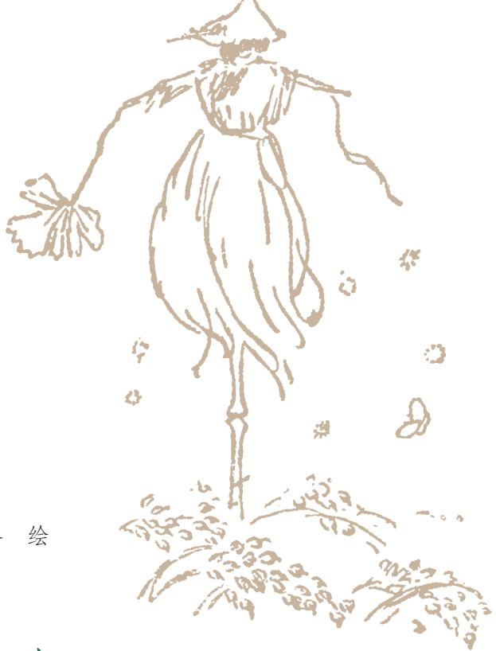

（图）许敦谷 绘

第五单元

生活中不缺少美，只是缺少发现美的眼睛。

—— [法国 ] 罗丹

◎ 体会作者是怎样留心观察周围事物的。

◎ 仔细观察，把观察所得写下来。

## 阅 读

# 14 搭船的鸟

我和母亲坐着小船，到乡下外祖父家里去。我们坐在船cāng péng lā舱里，天下着雨，雨点儿打在船篷上，沙啦沙啦地响。船夫suō lǔ披着蓑衣在船后用力地摇着橹。

后来雨停了。我看见一只彩色的小鸟站在船头，多么美yīngwǔ丽啊！它的羽毛是翠绿的，翅膀带着一些蓝色，比鹦鹉还漂亮。它还有一张红色的长嘴。

它什么时候飞来的呢？它静悄悄地停在船头不知有多久了。它站在那里做什么呢？难道它要和我们一起坐船到外祖父家里去吗？

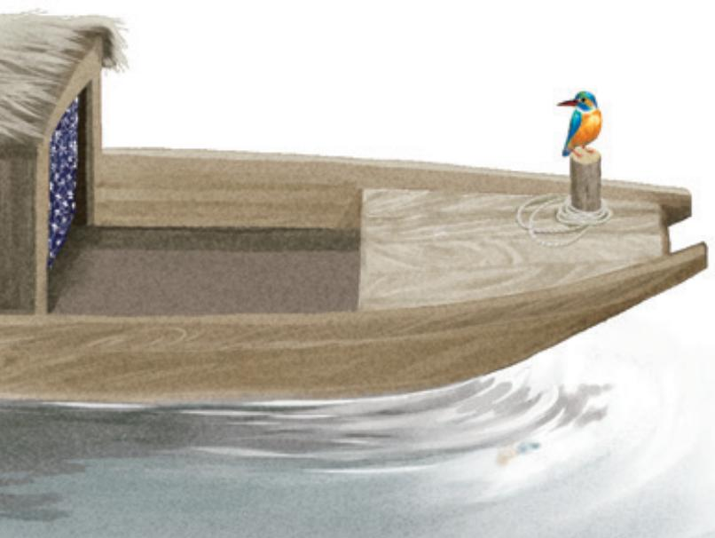

我正想着，它一下子冲进水里，不见了。可是，没一会xián儿，它飞起来了，红色的长嘴衔着一条小鱼。它站在船头，一口把小鱼吞了下去。

母亲告诉我，这是一只翠鸟。哦，这只翠鸟搭了我们的船，在捕鱼吃呢。

cāng lā yīng wǔ xián舱 啦 鹦 鹉 衔

搭 祖 披 摇 停 羽翠 蓝 静 悄 吞 捕

默读课文，想想作者对哪些事物作了细致观察，说说你是从哪里看出来的。

读下面这段话，注意加点的词语，想象翠鸟捕鱼的情景。

我正想着，它一下子冲进水里，不见了。可是，没一会儿，它飞起来了，红色的长嘴衔着一条小鱼。它站在船头，一口把小鱼吞了下去。

# 15 金色的草地

pú

我们住在乡下，窗前是一大片草地。草地上长满了蒲公yīng英。当蒲公英盛开的时候，这片草地就变成金色的了。

shuǎ

我和弟弟常常在草地上玩耍。有一次，弟弟跑在我前liào面，我装着一本正经的样子，喊：“谢廖沙！”他回过头来，róng我就使劲一吹，把蒲公英的茸毛吹到他的脸上。弟弟也假装qiàn打哈欠，把蒲公英的茸毛朝我脸上吹。就这样，这些并不引人注目的蒲公英，给我们带来了不少快乐。

有一天，我起得很早去钓鱼，发现草地并不是金色的，  
而是绿色的。中午回家的时候，我看见草地是金色的。傍晚  
的时候，草地又变绿了。这是为什么呢？我来到草地上，仔lǒng  
细观察，发现蒲公英的花瓣是合拢的。原来，蒲公英的花就

  
① 本文作者是苏联的普里什文（1873—1954），译者茹香雪，选作课文时有改动。

像我们的手掌，可以张开、合上。花朵张开时，花瓣是金色的，草地也是金色的；花朵合拢时，金色的花瓣被包住了，草地就变成绿色的了。

多么可爱的草地！多么有趣的蒲公英！从那时起，蒲公英成了我们最喜爱的一种花。

pú yīng shuǎ róng qiàn lǒng蒲 英 耍 茸 欠 拢

蒲 耍 劲 脸

欠 朝 钓 察 拢 喜

朗读课文，一边读一边想象课文描写的情景。

仔细读读第3自然段，把下面的内容补充完整，体会作者观察的细致。

早上，草地 ，因为蒲公英

中午，草地 ，因为蒲公英

傍晚，草地 ，因为蒲公英

我们只要稍加留意，就会发现事物是变化着的。如，向日葵会随着太阳转动，含羞草被触碰后会“害羞”地低下头……你留意过哪些事物的变化？和同学交流。

# 人民教育出版社

## 梳理与交流

留心观察有哪些好处？结合学过的课文和同学交流。

一次平常的探亲之旅，因为留心观察，作者认识了一个可爱的新朋友—会“搭船”的翠鸟。

窗前的草地对作者来说再熟悉不过了，但作者稍加留意，就发现了奇妙的变化。

翠鸟的美在于它有着色彩艳丽的羽毛和敏捷的身手。

草地的色彩会发生奇妙的变化，原来是因为蒲公英的花有时张开有时合拢。

留心周围的事物，我们就会有新的发现。

细致的观察可以让我们对事物有更多更深的了解。

## 初试身手

你在生活中观察到了什么？用几句话写下来和同学交流吧！

雨停了，我和爸爸去买菜，在路上看到好几只蜗牛正慢悠悠地爬着……

妈妈经常给我买香蕉吃。香蕉的皮黄澄澄的，形状像弯弯的月牙，摸上去很光滑。放到鼻子边闻，有一股淡淡的香味。剥开皮尝一口，是一种很软糯的口感……

## 我们眼中的缤纷世界

这段时间我们观察了不少身边的事物，有了很多新发现，简单列出来和同学交流。这次习作，就让我们把最近观察时印象最深的事物写下来。

写完后，自己读一读，修改错别字和不通顺的语句。再把你认为写得好的部分读给小组同学听，展示你的观察所得。

交流习作之后，试着说说最近的观察感受，和同学分享心得。如：

◇ 观察时要细致一些，注意事物的变化。

◇ 观察时可以用眼睛看，用耳朵听，还可以用手摸，用鼻子闻，有时还可以尝一尝。

可以从事物的不同方面观察。

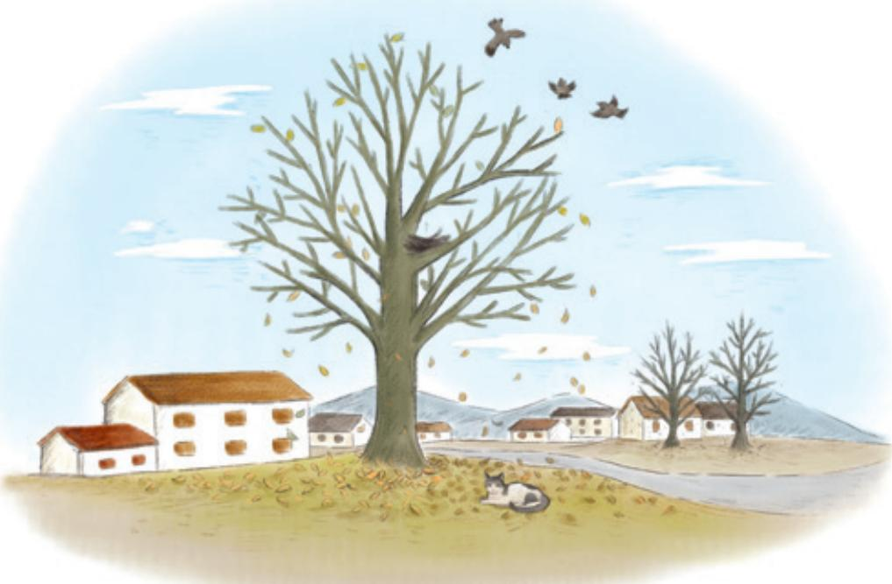

## 例 文

作者观察得真仔细，他发现“王子”认“狗”字的时候叫得最欢。

## 我家的小狗①

我得好好写写我们家的小狗，它叫“王子”，是我们村里长得最花、毛色最漂亮的一只狗。它跑得guāi特别快，我总也追不上它。不过“王子”很乖，它总是在前面等着我。

我教过“王子”认字，可是它连一个字母也没学会，不过它倒是挺爱上课的。我教它念“狗”的时候，它叫得最欢。它准是在想，这是在说它自己呀！“王子”还会数数，不过总共才会数到二。

它喜欢哼哼叫和汪汪叫。

“你要干什么？”“王子”在我面前哼哼时，我问它。

它汪地叫一声，晃一晃脑袋，表示想要出去。

“现在还想干什么？”当我们走出院子时，我接着问它。

“王子”又汪地叫一声，朝铁路那边跑去。

“你该一次说完哪！”我一边埋怨，一边跟在它  
后面跑。我知道“王子”想去那儿干什么，它喜欢shū  
同火车赛跑。每次都是它输，可它从不在乎。每当有火车开过来，“王子”都以为能跑赢它。等到跑不动了，它便冲着远去的火车汪汪叫上几声，不知是yǔn mà dùn  
允许火车开走呢，还是骂了火车一顿。

“王子”竟敢跟火车赛跑，真有趣。

经过仔细观察，作者发现了“王子”的淘气可爱。把你觉得它淘气可爱的部分找出来，和同学交流。

## méi 我爱故乡的杨梅

我的故乡在江南，我爱故乡的杨梅。

tān lán shǔn

细雨如丝，一棵棵杨梅树贪婪地吮吸着春天的xiá甘露。它们伸展着四季常绿的枝条，一片片狭长的叶子在雨雾中欢笑着。

端午节过后，杨梅树上挂满了杨梅。

杨梅圆圆的，和桂圆一样大小，遍身生着小刺。等杨梅渐渐长熟，刺也渐渐软了，平了。摘一个放

作者把杨梅的变化观察得多仔细啊！

进嘴里，舌尖触到杨梅那平滑的刺，是那样细腻而柔软。

杨梅先是淡红的，随后变成深红，最后几乎变成黑的了。它不是真的变黑，而是因为太红了，看上去像黑的。你轻轻咬开它，就可以看见那新鲜红嫩的果chún rǎn肉，嘴唇上舌头上同时染满了鲜红的汁水。

作者把杨梅的味道写得这么具体可感，让人想亲自尝一尝它的滋味。

没有熟透的杨梅又酸又甜，熟透了就甜津津的，叫人越吃越爱吃。我小时候，有一次杨梅吃得太多，感觉牙齿又酸又软，连豆腐也咬不动了。我这才知道，杨梅虽然熟透了，酸味还是有的，因为它太甜，吃起来就不觉得酸了。吃多了杨梅再吃别的东西，才感觉到牙齿已经被它酸倒了。

填写下面的表格，体会作者细致的观察。

<table><tr><td rowspan=1 colspan=1>杨梅</td><td rowspan=1 colspan=1>特点</td></tr><tr><td rowspan=1 colspan=1>外形</td><td rowspan=1 colspan=1></td></tr><tr><td rowspan=1 colspan=1>颜色</td><td rowspan=1 colspan=1></td></tr><tr><td rowspan=1 colspan=1>味道</td><td rowspan=1 colspan=1></td></tr></table>

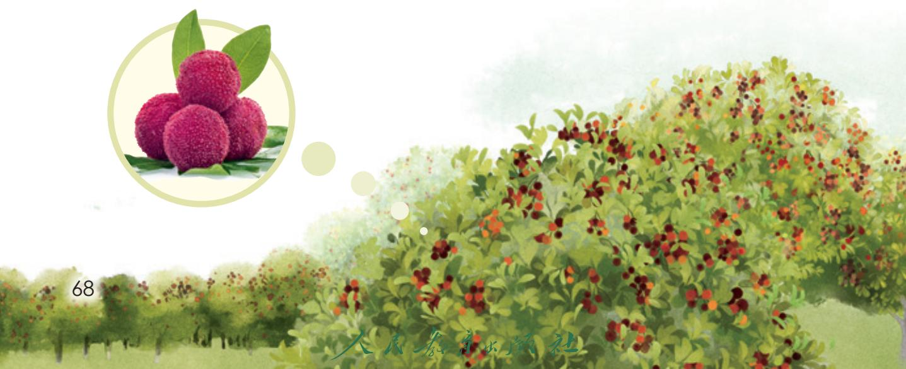

## 人民教育出版社

第六单元

祖国，我爱你。我爱你壮美的山河，我爱你每一寸土地。

饱览大好河山，感受祖国之美。

◎ 借助关键语句理解一段话的意思。

◎ 学习围绕一个意思把一段话写清楚。

# ráo16 富饶的西沙群岛

西沙群岛位于南海的西北部，是我国海南省三沙市的一yōu部分。那里风景优美，物产丰富，是个可爱的地方。

西沙群岛一带海水五光十色，瑰丽无比：有深蓝的，淡青的，浅绿的，杏黄的。一块块，一条条，相互交错着。因为海底高低不平，有山崖，有峡谷，海水有深有浅，从海面看，色彩就不同了。

shān hú zhàn海底的岩石上生长着各种各样的珊瑚，有的像绽开的花shēn lǎn rú朵，有的像分枝的鹿角。海参到处都是，在海底懒洋洋地蠕huá wēi wǔ动。大龙虾全身披甲，划过来，划过去，样子挺威武。

  
① 本文选自人民教育出版社《十年制学校小学课本（试用本）语文第六册》，有改动。

鱼成群结队地在珊瑚丛中穿来穿去，好看极了。有的全yīng chā身布满彩色的条纹；有的头上长着一簇红缨；有的周身像插着好些扇子，游动的时候飘飘摇摇；有的眼睛圆溜溜的，身上长满了刺，鼓起气来像皮球一样圆。各种各样的鱼多得数不清。正像人们说的那样，西沙群岛的海里一半是水，一半是鱼。

西沙群岛也是鸟的天下。岛上有一qī片片茂密的树林，树林里栖息着各种海hòu鸟。遍地都是鸟蛋。树下堆积着一层厚fèn厚的鸟粪，这是非常宝贵的肥料。

我发现这段话是围绕第一句话来写的。

bèi

富饶的西沙群岛，是我们祖祖辈辈生活的地方。随着祖国建设事业的发展，可爱的西沙群岛，必将变得更加美丽，更加富饶。

# ráo yōu yá shēn lǎn huá wēi wǔ chā qī hòu fèn bèi饶 优 崖 参 懒 划 威 武 插 栖 厚 粪 辈

# 景 优 淡 浅 岩底

# 料划 布 茂 密 厚

有感情地朗读课文。说说从哪些地方可以看出西沙群岛风景优美、物产丰富。

选择你喜欢的部分，向别人介绍西沙群岛。

小练笔

从下面的图中选择一幅，围绕一个意思写几句话。

## 海滨小城①17

hào

这是一座海滨小城。人们走到街道尽头，就可以看见浩hàn瀚的大海。天是蓝的，海也是蓝的。海天交界的水平线上，jiàn棕色的机帆船和银色的军舰来来往往。天空飞翔着白色的、ōu灰色的海鸥，还飘着跟海鸥一样颜色的云朵。

早晨，机帆船、军舰、海鸥、云朵，都被朝阳镀上了一gē bei层金黄色。帆船上的渔民，军舰上的战士，他们的脸和胳臂也镀上了一层金黄色。

海边是一片沙滩，沙滩上遍地是各种颜色、各种花纹的cǎi贝壳。这里的孩子见得多了，都不去理睬这些贝壳，贝壳只好寂寞地躺在那里。远处响起了汽笛声，那是出海捕鱼的船zài xiè队回来了。船上满载着银光闪闪的鱼，还有青色的虾和蟹、luó xuān金黄色的海螺。船队一靠岸，海滩上就喧闹起来。

ān yē gǎn小城里每一个庭院都栽了很多树。有桉树、椰子树、橄lǎn huáng榄树、凤凰树，还有别的许多亚热带树木。初夏，桉树叶子散发出来的香味，飘得满街满院都是。凤凰树开了花，开得那么热闹，小城好像笼罩在一片片红云中。

# 人民教育出版社

小城的公园更美。这里栽着许许多多榕树。一棵棵榕树就像一顶顶撑开的绿绒大伞，树叶密不透风，可以遮太阳，féng挡风雨。树下摆着石凳，每逢休息的日子，石凳上总是坐满了人。

小城的街道也美。除了沥青的大路，都是用细沙铺成gē zhī的，踩上去咯吱咯吱地响，好像踩在沙滩上一样。人们把街道打扫得十分干净，甚至连一片落叶都没有。

这座海滨小城真是又美丽又整洁。

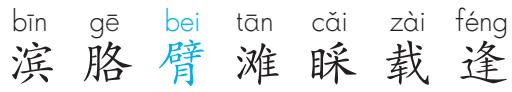

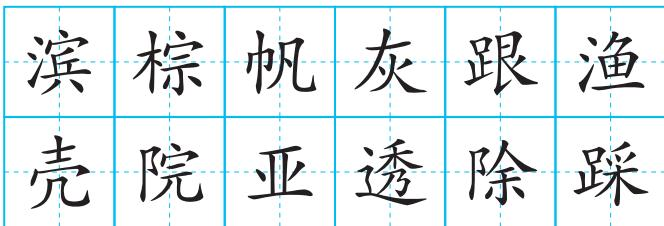

朗读课文。说说课文写了海滨小城的哪些景象，这些景象是什么样的。

有些句子很重要，可以帮助我们理解一段话的意思，你能从课文中找出来吗？

在课文中画出你认为写得好的句子，抄写下来和同学交流。

# xīng18 美丽的小兴安岭

我国东北的小兴安岭，有数不清的红松、白桦、栎树……几百里连成一片，就像绿色的海洋。

春天，树木抽出新的枝条，长出嫩绿的叶子。山上的积róng huì cóng雪融化了，雪水汇成小溪，淙淙地流着。溪里涨满了春水。fǔ cè xīn小鹿在溪边散步，它们有的俯下身子喝水，有的侧着脑袋欣赏自己映在水里的影子。

夏天，树木长得葱葱茏茏，密密层层的枝叶把森林封得严严实实的，挡住了人们的视线，遮住了蓝蓝的天空。早rǔ晨，雾从山谷里升起来，整个森林浸在乳白色的浓雾里。太lǚ yào shāo sù shè阳出来了，千万缕耀眼的金光穿过树梢，照射在工人宿舍门前的草地上。草地上盛开着各种各样的野花，红的、白的、黄的、紫的，真像个美丽的大花坛。

秋天，白桦和栎树的叶子变黄了，松柏显得更苍翠了。秋风吹来，落叶在林间飞舞。这时候，森林向人们献出了酸zhēn甜可口的山葡萄，又香又脆的榛子，鲜嫩的蘑菇和木耳，还yào有人参等名贵药材。

冬天，雪花在空中飞舞。树上积满了白雪。地上的雪厚xī厚的，又松又软，常常没过膝盖。西北风呼呼地刮过树梢。mián diāo黑熊躲进自己的洞里冬眠。紫貂捕捉野兔当美餐。松鼠靠秋天收藏在树洞里的松子过日子，有时候还到枝头散散步，看看春天是不是快要来临。

小兴安岭一年四季景色诱人，是一座美丽的大花园，也是一座巨大的宝库。

xīng róng cè xīn fēng jìn rǔ shāo sù shè yào mián 兴 融 侧 欣 封 浸 乳 梢 宿 舍 药 眠

抽 封 严 挡 坛 显

苍 药 材 软 刮 捉

有感情地朗读课文。想想为什么说小兴安岭“是一座美丽的大花园，也是一座巨大的宝库”。

读下面的句子，体会加点的词语好在哪里。

◇ 春天，树木抽出新的枝条，长出嫩绿的叶子。

◇ 早晨，雾从山谷里升起来，整个森林浸在乳白色的浓雾里。

如果到小兴安岭旅游，你会选择哪个季节去？结合课文内容说说你的理由。

选 做

你的家乡哪个季节最美？美在哪里？写一段话和同学交流。

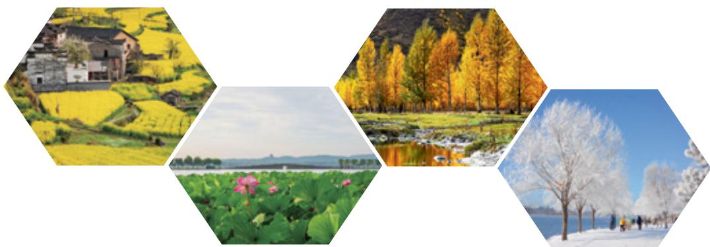

# cuǐ càn\* 19 香港，璀璨的明珠

默读课文，找出段落中的关键语句，想想课文围绕香港介绍了哪些内容。为什么香港被誉为“璀璨的明珠”？结合课文内容说说你的理解。

香港位于我国南部，南海之滨，虽然面积不大，却是xiǎngyù mào享誉世界的金融、航运和贸易中心，还是购物、品尝美食和旅游的好去处。

香港有着繁荣的贸易活动，是一座举世闻名的贸易港城市。世界各地的商人都乐意来这里做生意，来自不同国lín láng家和地区的商品，琳琅满目，应有尽有，“万国市场”的kuì名号当之无愧。

人们爱把香港称作“美食天堂”。名满天下的粤菜、ōu zhōu jiā yáo jù川菜，东南亚各地的风味饮食，欧洲各国的佳肴，一应俱jǐn yàn全。游客不仅能大饱口福，还可以在享受美食盛宴的同yàn时，体验香港的多元文化。

##

香港还是一个旅游胜地。美不胜收的维多利亚港，让fǎn yì人流连忘返。位于国际会议展览中心东北侧广场上的金紫diāo sù荆雕塑，是中外游客的必到之处，这是1997年香港回归祖zhèng fǔ zèng国时中央政府赠送的礼物。每当夜幕降临，香港便成了灯huì huàn的海洋。大型灯光音乐汇演“幻彩咏香江”将声和光交织zī shuò在一起，把香港的夜景映照得绚丽多姿。港湾里闪烁的灯yàn光，像五颜六色的焰火洒落人间。马路上一串串明亮的车ní灯，如同闪光的长河，奔流不息。高楼大厦的霓虹灯流光yì溢彩，热情欢迎来自五洲四海的游客。

未来，在共建“一带一路”和粤港澳大湾区建设的进bàn jué程中，香港将扮演重要角色，祖国南海之滨的这颗明珠必duó定更加璀璨夺目。

mào kuì jǐn yì zhèng fǔ zèng huàn yàn ào bàn jué贸 愧 仅 议 政 府 赠 幻 焰 澳 扮 角

## 这儿真美

花园、果园，田野、小河……我们周围有许多美丽的地方，你发现了吗？

让我们把身边的美景介绍给别人吧！

写之前仔细观察，看看这个地方有些什么，是什么样子的。

写的时候，试着运用从课文中学到的方法，围绕一个意思写一段话。如：

◇ 操场后面的小花园真美……

◇ 村里的果园就像一幅色彩斑斓的图画……

◇ 一到池塘边，我就被眼前的景色吸引住了……

写好后自己读一读，看看句子是否通顺，意思是否清楚。然后读给同学听，和同学分享你发现的美景。

可以用上这学期新学的词语。

盛开 翠绿 明朗 闪闪发光 茂密 香甜 静悄悄 美不胜收 粗壮 清凉 亮晶晶 奔流不息

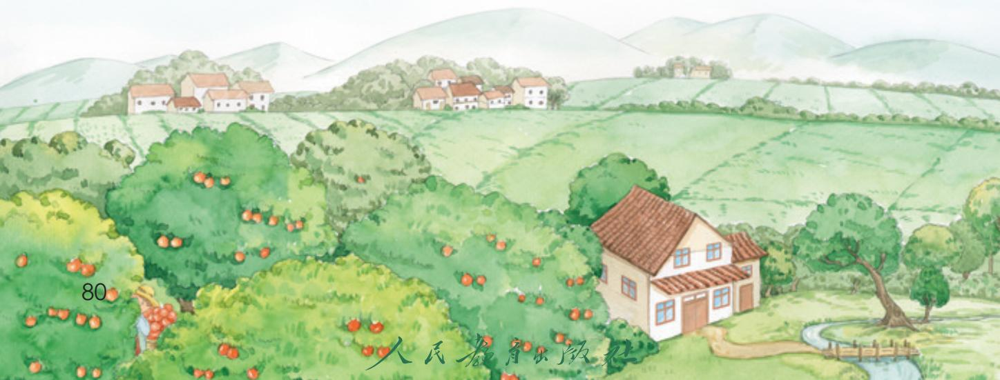

# 语文园地

## 梳理与交流

你在阅读时关注段落中的关键语句了吗？结合读过的文章和同学交流。

有的时候，一段话的开头就表达了这段话的主要意思，后面的内容都是围绕开头这句话来写的。

这样的句子也有可能在一段话的末尾或中间。

找到这样的句子，可以帮助我们更好地理解一段话的意思。

我们习作的时候也可以学着这样写。

## 词句段运用

读一读，想象句子描写的情形，然后照样子写句子。

◇ 各种各样的鱼多得数不清。

◇ 夏天，树木长得葱葱茏茏。

◇ 王老师急得直跺脚。

◇ 他跑得像兔子一样快。

妈妈累得

得 O

## 人民教育出版社

看到下面的词语，你的眼前会浮现怎样的画面？选择一两个词语写句子。

懒洋洋 慢腾腾 颤巍巍 兴冲冲

静悄悄 空荡荡 乱糟糟 闹哄哄

用下面的句子开头，试着说一段话。

◇ 车站的人可真多……

◇ 我喜欢夏天的夜晚……

◇ 阅览室里一片静悄悄……

## 日积月累

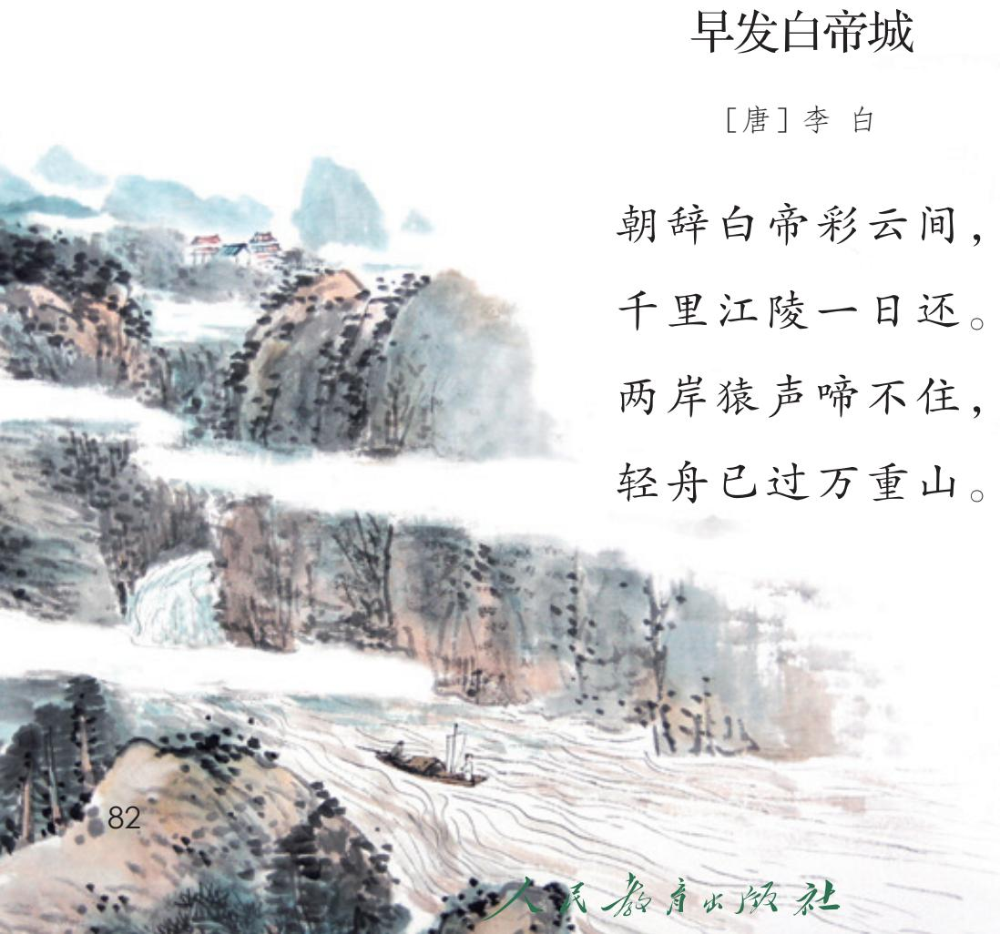

第七单元

大自然赐给我们许多珍贵的礼物，你发现了吗？

探索自然，发现生命之美。

◎ 感受课文生动的语言，积累喜欢的语句。

◎ 留心生活，把自己的想法记录下来。

## 阅 读

## 20 古诗三首

## ①鹿  柴

[唐] 王 维

空山不见人，②但闻人语响。fǎn  
③返景入深林，tái  
复照青 苔上。

## 注释

①〔鹿柴〕在今陕西蓝田，王维曾在这里隐居。柴，同“寨”，栅栏，这里读zhài。  
②〔但〕只，只是。  
③〔返景〕傍晚的阳光。

## ①望天门山

[ 唐 ] 李 白

##

② ③天门中断楚江开， ④碧水东流至此回。 两岸青山相对出， 孤帆一片日边来。

## 注释

①〔天门山〕今安徽当涂县的东梁山（古代称博望山）与和县的西梁山的合称，两山隔江相对，像一座天然的大门。  
②〔楚江〕长江中下游部分河段在古代流经楚地，所以叫楚江。  
③〔开〕打开，这里指长江断开了天门山。  
④〔回〕回旋。江水被阻隔产生旋涡。

## 饮湖上初晴后雨

sū shì [宋] 苏 轼

liàn yàn   
水光潋滟晴方好，① ② yì   
山色空蒙雨亦奇。③ ④   
欲把西湖比西子，⑤ mǒ yí   
淡妆浓抹总相宜。

注释

①〔潋滟〕波光闪动的样子。

②〔方〕正。

③〔空蒙〕隐隐约约的样子。

④〔亦〕也。

⑤〔西子〕西施，春秋时代越国的美女。

# 返fǎn 苔tái 亦yì 抹mǒ 宜yí

返 望 断 楚 岸至

宜孤 饮 亦 欲 抹

有感情地朗读课文。背诵课文。默写《望天门山》。

用自己的话说说下列诗句的意思，想象诗中描绘的景色。

◇ 返景入深林，复照青苔上。

◇ 两岸青山相对出，孤帆一片日边来。

◇ 水光潋滟晴方好，山色空蒙雨亦奇。

# 21 大自然的声音①

miào

大自然有许多美妙的声音。

zòu

风，是大自然的音乐家。他会在森林里演奏他的手风琴。当他翻动树叶，树叶便像歌手一样，唱出各种不同的歌曲。不一样的树叶，有不一样的声音；不一样的季节，有不ní nán一样的音乐。当微风拂过，那声音轻轻柔柔的，好像呢喃细jī语，让人感受到大自然的温柔；当狂风吹起，整座森林都激wěi chōng动起来，合奏出一首雄伟的乐曲，那声音充满力量，令人感受到大自然的威力。

水，也是大自然的音乐家。下雨的时候，他喜欢玩打击qì乐器。小雨滴敲敲打打，一场热闹的音乐会便开始了。滴滴答答……叮叮咚咚……所有的树林，树林里的每片树叶，所有的房子，房子的屋顶和窗户，都发出不同的声音。当小雨huì cóng滴汇聚起来，他们便一起唱着歌：小溪淙淙，流向河流；河chán xiōng péngpài流潺潺，流向大海；大海哗哗，汹涌澎湃。从一首轻快的山lán中小曲，唱到波澜壮阔的海洋大合唱。

zhā

动物是大自然的歌手。走在公园里，听听树上叽叽喳喳jī的鸟叫；坐在一棵树下，听听唧哩哩唧哩哩的虫鸣；在水塘边散步，听听青蛙的歌唱。你知道他们唱的是什么吗？他们的歌声好像告诉我们：“我在歌唱，我很快乐！”

miào zòu ní nán jī wěi chōng jī qì huì 妙 奏 呢 喃 激 伟 充 击 器 汇

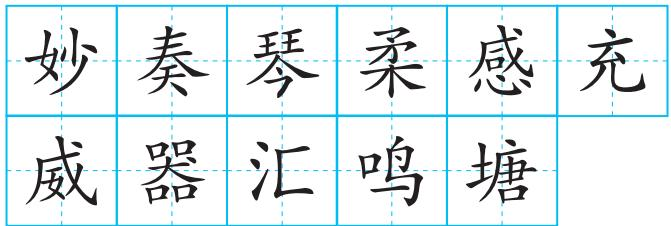

朗读课文，体会大自然声音的美妙。背诵第2\~3自然段。

填一填，再说说课文写了大自然的哪些声音。

大自然有许多美妙的声音。

风，是大自然的音乐家。

## 人民教育出版社

读读下面描写声音的词语，再说说你在哪里听到过这样的声音。

轻轻柔柔的呢喃细语 雄伟的乐曲 充满力量的声音

热闹的音乐会 轻快的山中小曲    波澜壮阔的海洋大合唱

## 选 做

你听到过哪些“美妙的声音”？试着用上你积累的词句，写几句话和同学交流，如，“鸟儿是大自然的歌手……”“厨房是一个音乐厅……”。

## 瀑  布

叶圣陶

还没看见瀑布，先听见瀑布的声音，好像叠叠的浪涌上岸滩，又像阵阵的风吹过松林。

山路忽然一转，啊，望见了瀑布的全身！这般景象没法比喻，千丈青山衬着一道白银。

站在瀑布脚下仰望，  
好伟大呀，一座珍珠的屏！时时来一阵风，  
把它吹得如烟，如雾，如尘。

# 读不完的大书①

我五六岁时，就喜欢到大自然中去寻找好玩的东西。高xiè远的天空，广阔的大地，空中的浮云飞鸟，水里的虾蟹游shòu鱼，地上的走兽昆虫、花草树木……世界万物，不仅好玩，xiá还让人沉思和遐想。

小麻雀叽叽喳喳、蹦蹦跳跳的，叫人愉悦。老鹰在高空xuán jiàn盘旋，展翅滑翔，突然猛扑而下，给人以雄健勇猛的感觉。xù lěi zhēn蚂蚁搬家，井然有序，当两军对垒时，那勇敢忠贞的精神，pèi真叫人敬佩。

植物的开花、结籽，暑寒荣枯，有着不同的趣味。花儿zī有红的、黄的、紫的、蓝的，有单瓣的、重瓣的，千姿百态。草的叶子各不相同，有长有短，有宽有窄，有的还带着刺。

我家房子前后栽有各种果树，有梨树、桃树、橘子树、yòu柚子树，在不同的时间里，它们开不同的花，结不同的果。刚从树上摘下的果子，味道格外鲜美。

我最喜爱的，是我家屋后的两丛竹子和一株棕榈。竹子sǔn长得快，雨后春笋，一天长几寸，没几天就长得和我一样高

## 人民教育出版社

了。微风吹来，沙沙的竹叶声，如同温柔的细语。池塘边的fù chāo fán棕榈树高大挺拔，大蒲扇似的叶子在风中摇摆，一副超凡脱sú  
俗的样子。在秋高气爽的日子里，它倒映在池塘的水中，小鱼在倒影间游玩，又是另一种境界。

大自然是一本看不完的大画册，是一部永远读不完的大ào mì书，里面有无穷的奥秘，有无尽的乐趣。

má xuán xù zhēn zī sǔn chāo fán sú ào mì麻 旋 序 贞 姿 笋 超 凡 俗 奥 秘

虾 昆 仅 序 荣 枯 姿

态 刺 梨 部 奥 秘

朗读课文，感受大自然的乐趣。

课文描写了大自然中哪些“好玩的东西”？读下面的句子，再找出类似的语句读一读，体会生动的语言。

◇ 小麻雀叽叽喳喳、蹦蹦跳跳的，叫人愉悦。

◇ 老鹰在高空盘旋，展翅滑翔，突然猛扑而下，给人以雄健勇猛的感觉。

◇ 微风吹来，沙沙的竹叶声，如同温柔的细语。

在大自然这本“读不完的大书”中，你都读到了什么？和同学交流。

## 口语交际

身边的“小事”

我们的身边每天都在发生各种各样的“小事”，每件事都以不同的方式影响着我们的生活。

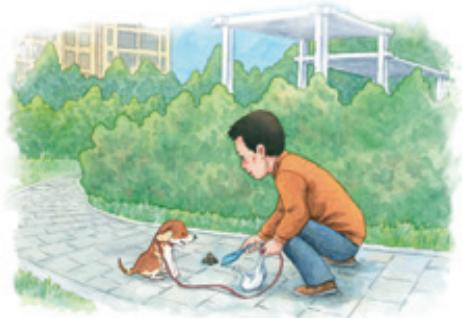

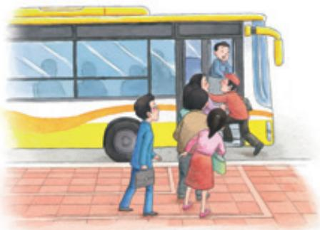

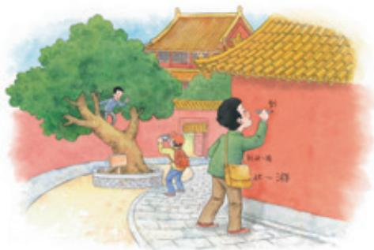

你的身边有哪些类似这样的“小事”？和小组同学交流你发现的令人感到温暖的行为，或是不文明的行为，再谈谈你对这些行为的看法。

汇总小组同学谈到的“小事”，和其他小组交流。

◎ 清楚地表达自己的看法。

◎ 汇总小组意见时，尽可能反映每个人的想法。

## 我有一个想法

生活中有很多需要改进的问题。如果我们积极表达自己的想法，提出改进建议和解决办法，就能使生活变得更加美好。如：

我发现爱玩手机的人特别多。上个月我们去给爷爷祝寿，聚会的时候大家都在各自看手机，很少一起聊天。我爸爸下班回家后也一直玩手机，谁叫他都不理。

过于沉迷手机会影响与别人的交往，我们不应该总是玩手机，应该用更多的时间关心身边的人。

最近我一直在想，我们班能不能开辟一个植物角呢？我们可以在植物角养花种草，或是种花生、种豆子，还可以根据季节的变化更换不同的植物。我们可以轮流照看它们，给它们浇水、施肥。这样既可以使班里的同学了解不同植物的特点，还可以使大家亲近自然，为教室增添大自然的气息。

生活中有哪些问题引起了你的关注？你有什么想法？从自己发现的或同学列举的问题中选择一个写一写。

写的时候，要把问题和你的想法写清楚。如果有改进建议和解决办法，也可以写下来。

写好以后读给同学听，看看他是否明白你的想法，再问问他对这个问题有什么看法，然后修改自己的习作。

# 语文园地

## 梳理与交流

你有摘抄的习惯吗？平时是怎么做摘抄的？和同学说一说并分享你的摘抄本。

读书时，我会先画出写得好的语句，再抄写下来。

我喜欢归类摘抄。把描写同类事物的语句分门别类地写下来，经常翻看，对我的习作很有帮助。

摘抄时，遇到写得生动的语句，我会在旁边写写感受，特别喜欢的还会背下来。

我会在合适的地方注明摘抄内容的出处。

## 识字加油站

读一读，认一认，想想每行加点的字有什么特点。

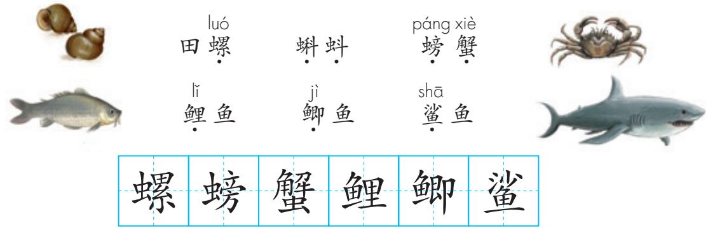

## 人民教育出版社

## 词句段运用

读下面的句子，注意加点的词语，说说你有什么发现。

◇ 小溪淙淙，流向河流；河流潺潺，流向大海；大海哗哗，汹涌澎湃。

◇ 遥远的夜空有一个弯弯的月亮 ，弯弯的月亮下面是那弯弯的小桥……

我能接着往下说弯弯的小桥旁边……

## 书写提示

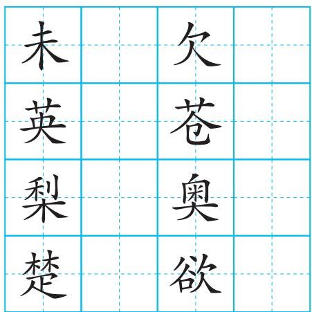

撇和捺写得舒展，字形就优美。

## 日积月累

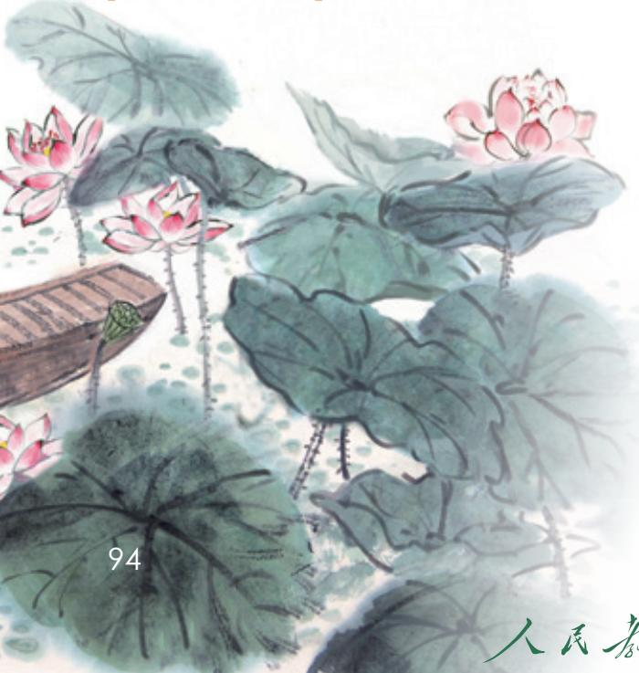

## 采莲曲

[唐] 王昌龄

荷叶罗裙一色裁，芙蓉向脸两边开。乱入池中看不见，闻歌始觉有人来。

## 人民教育出版社

第八单元

美好的品质，

犹如温暖的阳光，

带给我们希望和力量。

感悟美好品质，获取精神力量。

◎ 学习带着问题默读，理解课文内容。

◎ 学写一件简单的事。

## 阅 读

# sī23 司马光

wèng群儿戏于庭②，一儿登瓮③，足跌jiē qì没水中。众皆 弃去 ，光 持石击瓮破bèng之 ，水迸 ，儿得活。

注释

① 本文选自《宋史·司马光传》，题目为后人所加。

②〔庭〕庭院。

③〔瓮〕口小肚大的陶器。

④〔皆〕全，都。

⑤〔去〕离开。

⑥〔光〕指司马光。

⑦〔之〕它，这里指瓮。

⑧〔迸〕涌出，喷出。

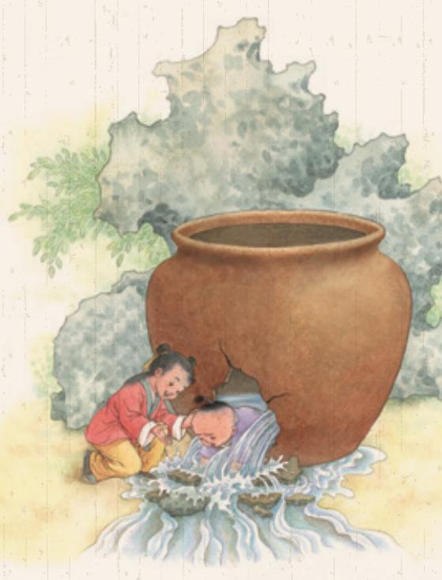

## 司sī 皆jiē 弃qì

## 司 登 跌 皆 弃 持 击

跟着老师朗读课文，注意读准字音，把握好停顿。背诵课文。

借助注释，用自己的话讲一讲这个故事。

这篇课文的语言和其他课文有什么不同？和同学交流。

# 一定要争气24

童第周是我国著名的生物学家，长期从事科学研究，取得了zhuó zhè卓著的成就。他出生在浙江省一pì个偏僻的山村里，小时候家里不yù富裕，只能一边帮家里做农活，一边跟父亲念点儿书。

童第周17岁进入当地的一jī chǔ chà  
所中学读书。由于文化基础差，  
他学习很吃力，第一学期期末考jūn  
试，平均成绩才45分。校长要  
他退学或降级，经过童第周再三  
kěn  
恳求，才同意他跟班再试读一个  
学期。第二学期，童第周更加  
珍惜这难得的学习机会。早晨  
天不亮，他就悄悄起床，借着  
校园的路灯看书。夜里同学们入  
睡了，他又到路灯下面去看书。值班老师发现后，关了路灯，让他进屋睡觉。他趁老师不注意，又溜到厕所外的灯下学习。经过半年的努力，他的各科成绩都赶了上来，几何还考了满分。童第周看着成绩单，心bèn  
想：一定要争气，我并不比别人笨。别人能办到的事，我经过努力也一定能办到。

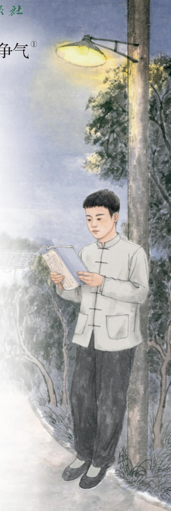

童第周28岁的时候，得到亲友资助，去比利时留学，ōu zhōu shòu跟随欧洲很有名的生物学教授学习。一起学习的还有其他国家的学生。那时的中国贫穷落后，在世界上没有地位，中国学生常常被外国同学瞧不起。童第周暗暗下定决心，一定要为中国人争气。

xiàng yàn bō luǎn mó那位教授要做一项实验，需要剥离青蛙卵的外膜，这bāo gòu jiàn是观察卵细胞形态、结构和发育过程的关键环节。工作的nài难度很大，不但要有熟练的技巧，还要耐心细致，多年来jiàn没人能够做成。童第周不声不响地刻苦钻研，反复实践，终于取得成功。教授兴奋地说：“童第周真行！”

zhèn

青蛙卵外膜的成功剥离，震惊了欧洲同行。童第周激动地想：一定要争气，中国人并不比外国人笨。外国人认为很难办到的事，我们中国人经过努力，照样能办到。

“一定要争气！”这句话一直激励着童第周向科学的高pān峰不断攀登。

yù chà jūn zī ōu zhōu shòu xiàng yàn gòu nài lì 裕 差 均 资 欧 洲 授 项 验 构 耐 励

念 差 考 试 均 退

努 单 留 度 奋

默读课文，想一想童第周是在什么情况下想到“一定要争气”的，他是怎样“争气”的。

读一读，注意加点的部分，说说你从中体会到童第周怎样的品质。

◇ 校长要他退学或降级，经过童第周再三恳求，才同意他跟班再试读一个学期。

◇ 第二学期，童第周更加珍惜这难得的学习机会。早晨天不亮，他就悄悄起床，借着校园的路灯看书。

◇ 童第周不声不响 地刻苦钻研 ，反复实践 ，终于取得成功。

结合童第周“争气”的故事，联系生活实际谈谈你对“一定要争气”这句话的理解。

# 手术台就是阵地①25

xiāo

1939年春，齐会战斗打响了。气焰嚣张的日军刚刚到bàng齐会一带就挨了当头一棒，被我军消灭了五百多人。

敌人不断反扑，战斗非常激烈。我军的伤员陆续从火线miào dài上抬下来。在离火线不远的一座小庙里，白求恩大夫正在给xuè伤员做手术。他已经两天两夜没休息了，眼球上布满了血丝。xiāo突然，几发炮弹落在小庙前的空地上。硝烟滚滚，弹片纷飞，zhèn小庙被烟雾淹没了。白求恩仍然镇定地站在手术台旁。他接niè mǐn jié fù qiāng过助手递过来的镊子，敏捷地从伤员的腹腔里取出一块弹片，丢在盘子里。

hǒu

敌机不断地在上空吼叫，炮弹不断地在周围爆炸。师卫生部长匆匆赶来，对白求恩说：“师长决定让您和一部分伤chè员离开这里。”白求恩沉思了一会儿，说：“我同意撤走部分伤员。至于我个人，要和战士们在一起，不能离开。”部长kěn wēi xiǎn恳求说：“白求恩同志，这儿危险，让您离开这里，是战斗shì形势的需要哇！”白求恩说：“谢谢师长的关心。可是，手术台是医生的阵地。战士们没有离开他们的阵地，我怎么能离开自己的阵地呢？部长同志，请您转告师长，我是一名八路军战士，不是你们的客人。”白求恩低下头，继续给伤员做手术。

一连几发炮弹落在小庙的周围。庙的一角落下了许多wǎ lián瓦片。挂在门口的布帘烧着了，火苗向手术台扑过来。助dān xùn sù手们赶忙把火扑灭。担架队抬起做过手术的伤员，迅速向duó miǎo后方转移。白求恩仍然争分夺秒地给伤员做手术，做了一个又一个。

齐会战斗进行了三天三夜，胜利结束了。白求恩大夫在手术台旁，连续工作了六十九个小时。

shù

bàng dài xuè xiāo wēi xiǎn shì wǎ lián dān xùn sù duó miǎo棒 大 血 硝 危 险 势 瓦 帘 担 迅 速 夺 秒棒 伤 陆 血 取 盘

匆 医 迅 速 夺 秒

默读课文，体会战斗的激烈，再说说你对“手术台就是阵地”这句话的理解。

读下面的句子，说说你是用什么方法理解加点词语的。

◇ 气焰嚣张的日军刚刚到齐会一带就挨了当头一棒，被我军消灭了五百多人。

◇ 白求恩仍然镇定地站在手术台旁。

◇ 白求恩仍然争分夺秒地给伤员做手术，做了一个又一个。

读一读，找出更多描写白求恩的语句，和同学交流他给你留下的印象。

◇ 他已经两天两夜没休息了，眼球上布满了血丝。

◇ 他接过助手递过来的镊子，敏捷地从伤员的腹腔里取出一块弹片，丢在盘子里。

◇ 白求恩说：“谢谢师长的关心。可是，手术台是医生的阵地。战士们没有离开他们的阵地，我怎么能离开自己的阵地呢？”

# \* 26 一个粗瓷cí 大碗

带着问题默读课文，再和同学说说这个“粗瓷大碗”背后有什么感人的故事。你还可以查查资料，了解有关赵一曼的事迹，并向他人介绍。

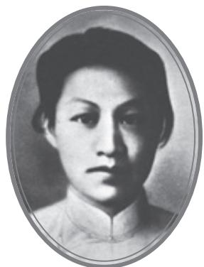  
赵一曼

chén

中国人民革命军事博物馆里，陈列着一个粗瓷大碗，是zhào màn赵一曼在东北人民革命军②中担任团政治委员时用过的。这kàng个碗，赵一曼仅仅用过一次，但是抗联的老战士都能认出来。因为这个碗有着一段令人感动的故事。

有一回，一场袭击日寇的战斗刚刚结束，小通讯员给赵一曼送来一个鼓鼓的挂包。打开一看，是个粗瓷大碗。赵一táng gāng曼吃饭用的搪瓷缸子早就送给一个新战士了，通讯员一直想给她另找一个碗，好不容易在这次战斗中找到了，就连忙给她送来。

赵一曼看着这个碗，对通讯员说：“哪里拿来的，请你huán还到哪里去！”

“这……这……敌人都被消灭了，往哪里还啊！”通讯

# 人民教育出版社

员为难地说。

liáng

开饭了。通讯员用这个大碗给赵一曼盛了满满一碗高粱dùn米饭，他想：这回我们政委该吃顿饱饭了。

zào

赵一曼一看，就知道是从病号灶盛来的。那些日子非常艰苦，抗联部队几个月来都是靠野菜、草根、橡子面充饥。有时候乡亲们冒着危险给部队送来一点儿粮食，但得留给zhān伤病员吃。团长、政委和战士们一样，嘴边有几个月没沾过jīn粮食了。赵一曼看到这碗高粱米饭，不禁想起战士们的艰苦生活，想起同志之间的友爱，想起通讯员对她的关心……

chuī

赵一曼端着碗轻轻走进炊事棚，趁人不注意的时候，把guō碗里的饭倒进锅里，又从另一口锅里盛了半碗野菜粥。

炊事员老李在旁边看得清楚，他没吭声，眼里却含着泪花。

第二天开饭的时候，赵一曼又没有碗了。小通讯员急得直叫：“我说政委同志啊，给你一百个碗也架不住你这么‘丢’啊！”

赵一曼笑着说：“是啊，什么时候才能不‘丢’碗呢？”zhēn据后来“侦察”，这个粗瓷大碗已经成了七班的菜盆了。

cí zhào kàng shù gāng huán dùn zào zhān jīn guō zhēn瓷 赵 抗 束 缸 还 顿 灶 沾 禁 锅 侦

## 口语交际

## 请 教

有时候，我们会遇到一些难以理解或不好解决的问题，不知道该怎么办。

我对本单元课文中的一些内容很感兴趣，比如童第周到底是怎么剥离青蛙卵外膜的，可是我查了很多资料都没弄明白……

生活中我经常丢三落四，上课了才发现忘带作业本，出去秋游又忘记带水……

如果你遇到这类问题，向别人请教是个好办法。

和同学交流：向别人请教应该注意什么？如：

◇ 在别人方便的时候请教。

◇ 把需要解决的问题说清楚。

◇ 不管别人是否能帮你解决问题，都要向别人表示感谢。

把你遇到的问题提出来，向别人请教，听听他们有什么好的建议。

◎ 有礼貌地向别人请教。

◎ 不清楚的地方及时追问。

# 那次经历真难忘

在你的记忆里，有哪些经历特别难忘，印象特别深刻？

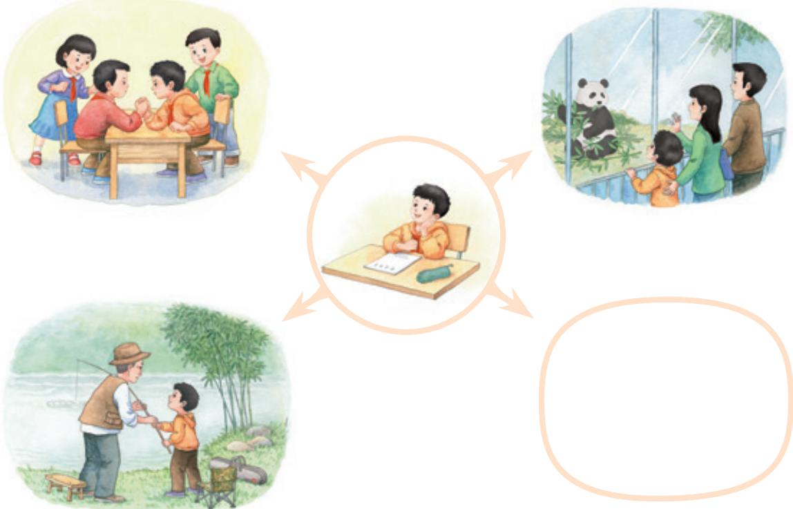

回忆一下，当时发生了什么事？把事情的经过像放电影一样在脑海里回想一遍，然后写下来。写的时候注意标点符号的用法。

可以看照片帮助回忆，也可以和一起经历过这件事的人聊一聊。

写好以后读一读，看看有没有表达出难忘的心情。

和同学交流习作，跟他们分享你的经历。如果有同学看不明白的地方，试着修改一下。

# 语文园地

## 梳理与交流

你在默读文章时有什么好的做法？和同学交流。

默读的时候不要发出声音，不要指读，也不要动唇，否则会影响阅读速度。

我默读时，会随时把不认识的字、不理解的词语画出来，读完后再想办法弄清楚它们的意思。

我会带着问题默读。一边读一边思考，能帮助我更好地理解内容。没读懂的地方我会标记出来，联系上下文进一步思考，或者向别人请教。

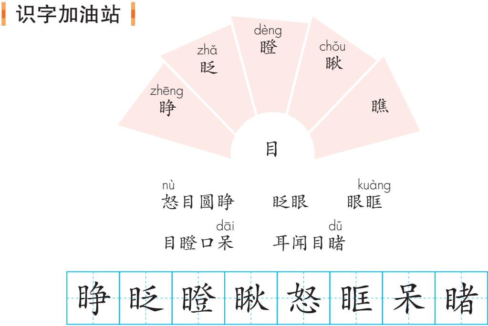

## 词句段运用

读下面的句子，说说加点的词语是否可以互相调换，再选择一个词语写一句话。

◇  我军的伤员陆续从火线上抬下来。

◇ 白求恩低下头，继续给伤员做手术。

◇ 白求恩大夫在手术台旁，连续工作了六十九个小时。

社区要开读书交流会，需要提前准备哪些物品？请你帮志愿者列一份清单。

书籍：

文具：

设备：

：

## 日积月累

◎士不可以不弘毅，任重而道远。 —《论语》

◎ 志不强者智不达，言不信者行不果。

—《墨子》

◎锲而舍之，朽木不折；锲而不舍，金石可镂。xún《荀子》

## 识 字 表

róng áng yáng fèng qiánghuàng 1 绒 昂 扬 凤 墙 晃

轰hōng 湿shī 荒huāng 笛dí 罚fá 假jià 臂bì

sòng lì hú jiè lì xiáng ái

3 诵 例 糊 戒 厉 详 挨

4 庭 未 磨 斜 萧 挑 促

zhān yìn liè líng zēng zōng

5 粘 印 列 凌 增 棕

yào shi bīn méi yóu shuǎng jú pín lí gōu lǎ bā 6 钥 匙 缤 枚 邮 爽 橘 频 梨 勾 喇 叭

dǒu zhèn yùn lüè yín liáo kuò 7 抖 振 韵 掠 吟 辽 阔

mī ò miāo fū jī fèng ǒu ěr8 眯 哦 喵 孵 叽 缝 偶 尔

táo shì tán hūn qìng diǎn tú kuò shǐ bèi jī chí guān9 陶 适 谈 婚 庆 典 途 括 史 倍 几 持 官

mò má tǎo yàn fǎng jì rěn wěi qū zhòng dàn fēng jú10 陌 吗 讨 厌 访 记 忍 委 屈 中 弹 疯 局

汪wāng 搞gǎo

héng shèng méng tuǒ zhóu gé péi lí 语文园地 恒 圣 萌 妥 轴 阁 培 厘

pǔ shào jǔ yā gōng jué xī chòng lián xì kuí shòu bà11 普 少 矩 丫 宫 掘 希 冲 联 系 葵 瘦 罢dā yìng jí juǎn gū lù chǐ jiáo tūn wèi yàn12 答 应 及 卷 骨 碌 齿 嚼 吞 胃 咽xuān chǔ kǒng yòu yì qiáng jì xìng zhā fàn jìn jiù jù13 宣 处 恐 诱 毅 强 纪 性 渣 犯 禁 旧 聚shēn jiè shào zōng zhǐ zhàn fá语文园地 申 介 绍 宗 旨 占 乏cāng lā yīng wǔ xián14 舱 啦 鹦 鹉 衔pú yīng shuǎ róng qiàn lǒng15 蒲 英 耍 茸 欠 拢ráo yōu yá shēn lǎn huá wēi wǔ chā qī hòu fèn bèi16 饶 优 崖 参 懒 划 威 武 插 栖 厚 粪 辈bīn gē bei tān cǎi zài féng17 滨 胳 臂 滩 睬 载 逢xīng róng cè xīn fēng jìn rǔ shāo sù shè yào mián18 兴 融 侧 欣 封 浸 乳 梢 宿 舍 药 眠mào kuì jǐn yì zhèng fǔ zèng huàn yàn ào bàn jué19 贸 愧 仅 议 政 府 赠 幻 焰 澳 扮 角fǎn tái yì mǒ yí20 返 苔 亦 抹 宜miào zòu ní nán jī wěi chōng jī qì huì21 妙 奏 呢 喃 激 伟 充 击 器 汇má xuán xù zhēn zī sǔn chāo fán sú ào mì22 麻 旋 序 贞 姿 笋 超 凡 俗 奥 秘luó páng xiè lǐ jì shā语文园地 螺 螃 蟹 鲤 鲫 鲨sī jiē qì23 司 皆 弃

yù chà jūn zī ōu zhōu shòu xiàng yàn gòu nài lì 24 裕 差 均 资 欧 洲 授 项 验 构 耐 励

bàng dài xuè xiāo wēi xiǎn shì wǎ lián dān xùn sù duó25 棒 大 血 硝 危 险 势 瓦 帘 担 迅 速 夺miǎo秒

cí zhào kàng shù gāng huán dùn zào zhān jīn guō zhēn26 瓷 赵 抗 束 缸 还 顿 灶 沾 禁 锅 侦

zhēng zhǎ dèng chǒu nù kuàng dāi dǔ 语文园地 睁 眨 瞪 瞅 怒 眶 呆 睹

（共250个生字）

## 写 字 表

1 坡 球招 呼 飘 扬 读 热 闹 粗 壮 洁

2 轰 湿 润 笛 狂 功 罚 互 碰 黄 急

4 庭 相 未 寒 径 斜 枫 霜 挑 深 落

5 朗 晶 珠 粘 印 案 展 列 规 则 凌 乱

6 凉 杏 枚 邮 票 爽 挤 争 菊 频 勾 挖 油

8 屋 板 准 备 等 暴 哦 钻 爬 漂 晒

语文园地 恒 圣 萌 妥 轴 阁 培 厘

11 葫 芦 错 普 宫 肯 冒 式 怜

12 旅 另 睛 及 卷 救 命 尾 齿 胃 管 刚 咬

语文园地 申 介 绍 宗 旨 占 乏

14 搭 亲 祖 披 摇 停 羽 翠 蓝 静 悄 吞 捕

15 蒲 英 盛 耍 使 劲 脸 欠 朝 钓 察 拢 喜

16 景 优 淡 浅 底 岩 鹿 划 布 茂 密 厚 料

17 滨 棕 帆 灰 跟 渔 壳 院 亚 透 除 踩

18 抽 封 严 挡 坛 显 苍 药 材 软 刮 捉

20 返 望 断 楚 至 岸 孤 饮 亦 欲 抹 宜

21 妙 奏 琴 柔 感 充 威 器 汇 鸣 塘

22 虾 昆 仅 序 荣 枯 姿 态 刺 梨 部 奥 秘

语文园地 螺 螃 蟹 鲤 鲫 鲨

23 司 登 跌 皆 弃 持 击

24 念 差 考 试 均 退 努 单 留 度 奋

25 棒 伤 陆 血 取 盘 匆 医 迅 速 夺 秒

语文园地 睁 眨瞪 瞅 怒 眶 呆 睹

（共 250 个字）

## 词 语 表

1 山坡  学校  飘扬  课文  声音  招引  热闹

古老  粗壮  枝干  洁白

2 轰响  阵雨  湿润  风笛  狂欢  觉得  功课

放学  老师  急急忙忙

5 秋风  放晴  明朗  地面  亮晶晶  落叶  图案

闪闪发光  尽头  排列  规则  凌乱  歌唱  迟到

6 秋天  清凉  炎热  枫树  邮票  凉爽  果树

菊花  仙子  频频  气味  香甜  松果  丰收

8 门板  准备  旁边  暴风雨  安心  低头  吃力

再见  母鸡  注意  屋子  漂亮  意思  因此

语文园地 恒心  神圣  萌发  妥当  车轴  阁楼

培植  厘米

11 声明  神仙  普通  让步  条件  指甲  得到

衣服  所以  要是  同学  可怜  最好  科学

12 旅行  要好  答应  做梦  来得及  救命

大吃一惊  尾巴  牙齿  肚皮  食物  消化  当然

刚才  知觉  光亮

语文园地 申请  介绍  主旨  占领  乏力

14 母亲 外祖父 船夫  羽毛  翠绿 静悄悄  翠鸟捕鱼

15 草地  蒲公英  盛开  玩耍  一本正经  使劲钓鱼  观察  合拢  张开  喜爱

16 风景  优美  物产  交错  岩石  鹿角  成群结队

布满 条纹  周身  皮球  茂密  肥料  祖国

事业  发展

17 海滨  街道  交界  水平线  机帆船  来来往往朝阳  渔民  贝壳  汽笛  出海  银光闪闪  庭院亚热带  散发  打扫  干净

18 东北  密密层层  严严实实  视线  山谷  起来照射  各种各样  花坛  显得  苍翠  药材  捕捉野兔  景色  宝库

21 大自然  美妙  音乐家  手风琴  歌手  感受

温柔  合奏  充满  威力  乐器  屋顶  河流

轻快  合唱  水塘

22 昆虫  万物  沉思  搬家  井然有序  精神  植物

千姿百态  鲜美  池塘  秋高气爽  倒映  游玩

画册  无穷  奥秘  无尽

语文园地 田螺  螃蟹  鲤鱼  鲫鱼  鲨鱼

24 生物  从事  成就  学期  考试  再三  同意

难得  值班  努力  留学  国家  落后  地位

环节  难度  刻苦  兴奋

25 手术台  阵地  战斗  打响  消灭  伤员  陆续

血丝  匆匆  医生  转告  赶忙  迅速  争分夺秒

语文园地 怒目圆睁  眨眼  眼眶  目瞪口呆

耳闻目睹

（共 250 个词）

## 后  记

2017年投入使用的《义务教育教科书 语文》由温儒敏担任总主编，一～六年级由陈先云、曹文轩、崔峦、李吉林担任主编。冯颖、陈先云、郑宇、柳美彤、段宗平、施建平、徐轶、温儒敏参加三年级上册编写。2022年，教育部组建编修委员会，根据《义务教育语文课程标准（2022年版）》对教科书进行编写修订。编修委员会由温儒敏、王立军担任主任，张伯江、王荣生担任副主任。编修委员会下设修订组，负责具体修订工作。

教科书在北京、天津、内蒙古、浙江、安徽、湖北、湖南、重庆、四川等地部分学校进行了试教试用，征求了百余位专家学者和一线教师的意见。人民教育出版社承担了教科书的编辑出版和美术设计工作。周申、胡荣环、倪静、马艳芳为本书绘制插图，景绍宗为本书封面绘制插图。在教科书修订、编辑出版过程中，很多专家都提供过帮助，在此一并表示诚挚的谢意。

教科书需要在使用过程中不断修改完善，真诚希望广大师生和家长继续提出宝贵意见！

联系方式

电 话：010-58758622

电子邮箱：jcfk@pep.com.cn

意见反馈平台：jcyjfk.pep.com.cn

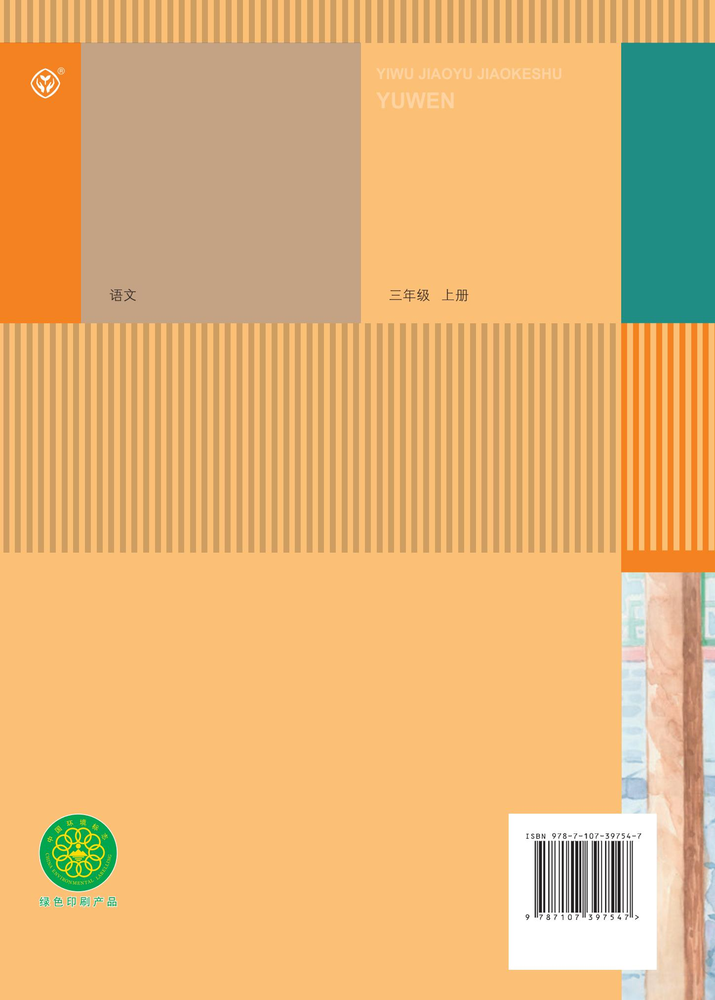

