义务教育教科书

# 语文

三年级

下册

人民教育出版社

义务教育教科书

# 语文

## 三年级

## 下册

教育部组织编写

·北京·

## 编修委员会

主任：温儒敏 王立军

副主任：张伯江王荣生

成员（以姓氏笔画为序)：王敏 王本华 过常宝 朱于国伍新春 李小龙 李明新汪锋 宋亚云 张继晓 张彬福 陈先云 陈建华 林建华倪文锦徐 轶 漆永祥

本册主编：李明新 伍新春

编写人员（以姓氏笔画为序）：

丁炜孙铭汪锋张沛陈先云贾宁倪鸣

责任编辑：杨祎张漫漫

责任设计：昌梦洁

责任校对：陈喆

责任印制：

义务教育教科书 语文 三年级 下册

教育部组织编写

出版人民教育出版社

（北京市海淀区中关村南大街17号院1号楼 邮编：100081)

网址 http://www.pep.com.cn

版权所有·侵权必究

## 目录

第一单元·  
阅读  
1 古诗三首……2  
绝句…… …2  
惠崇春江晚景…………………2  
三衢道中…………………………3  
2 燕子……  
3 荷花…… ……6  
4\*昆虫备忘录……………8  
口语交际 春游去哪里……………11  
习作我的植物朋友……………………12  
语文园地…… ………13  
第二单元 .15  
阅读  
5守株待兔……………………………………16  
6 会摇尾巴的狼………………………18  
7 鹿角和鹿腿……………………………21  
8\* 池子与河流…………………………23  
口语交际 劝告……… ……27  
习作看图画，写一写……………28  
语文园地………………29  
快乐读书吧  
小故事大道理……………………31  
第三单元· ·33  
阅读  
9 海底世界…… ……34  
10 石蜂……… ……36  
11\*小虾… …38  
习作 我做了一项小实验………40  
语文园地……………………41  
第四单元… …43  
阅读  
12 古诗三首………………44  
元日…… ……44  
清明……… ……44  
九月九日忆山东兄弟……45  
13 纸的发明…………………………………47

## 人民教育出版社

14 赵州桥…… …50  
15\*一幅名扬中外的画………52  
专题学习活动 中华传统节日…..54  
语文园地… …55  
第五单元  
阅读  
16胡萝卜先生的长胡子………·58  
17我变成了一棵树………………61  
习作 奇妙的想象………………………65  
例文  
一支铅笔的梦想……………66  
尾巴它有一只猫……………67  
第六单元 69  
阅读  
18 童年的水墨画………………………70  
19 肥皂泡…… ………72  
20 灰雀………… …75  
21\*我不能失信………………………77  
口语交际 应该怎样安排座位…79  
习作身边那些有特点的人………80  
语文园地…… …81  
第七单元… ..83  
阅读  
22 火烧云…………………………………84  
23 暴风雨来临之前…………………87  
24 我们奇妙的世界……89  
习作国宝大熊猫…………………………92  
语文园地…………… ……93  
第八单元… .95  
阅读  
25 慢性子裁缝和急性子顾客..96  
26 漏………… ……………100  
27\*枣核………… ……104  
口语交际 趣味故事会……………107  
习作 这样想象真有趣……………108  
语文园地…………………………………109  
识字表…… ……111  
写字表………… ……114  
词语表…… ……116

第一单元

áo鸟儿在空中翱翔，蝴蝶xī在花间嬉戏……大自然中，处处有可爱的生灵。

▲亲近动物植物，热爱自然与生命。

试着一边读一边想象画面；体会优美生动的语句。

试着把观察到的事物写清楚。

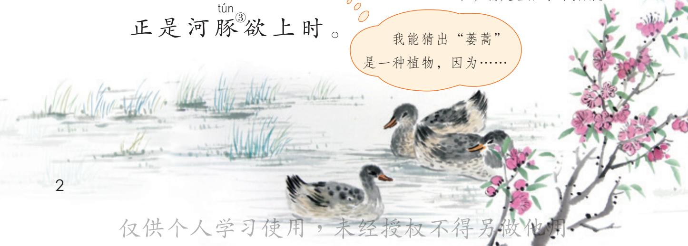

## 阅读

## ① 古诗三首

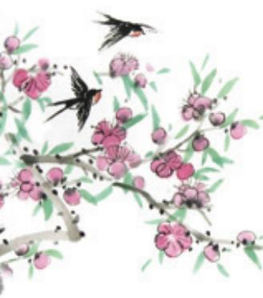

## 绝句

[唐]杜甫

迟日江山丽，春风花草香。泥融®飞燕子，yuān yāng沙暖睡鸳鸯。

huìchóng   
惠崇春江晚景 sū shì [宋]苏轼 竹外桃花三两枝， 春江水暖鸭先知。 lóu hāo   
蒌蒿满地芦芽短， tún   
正是河豚欲上时。

## 注释

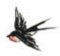

①〔迟日〕春日。   
②〔泥融〕泥土变得湿软。

## 注释

①惠崇是北宋名僧，能诗 善画。这首诗是苏轼为 惠崇的画作《春江晚景》 所写的题画诗。

②〔芦芽〕芦苇的嫩芽。   
③〔河豚〕一种肉味鲜美的 鱼，肝脏、血液等有毒 性，需处理后才可食用。

## 人民教育出版社

## qú三衢 1 道中

zēng [宋]曾几

méi   
梅子黄时日日晴， 小溪泛尽山行。 绿阴不减来时路， lí   
添得黄鹂四五声。

## 注释

①〔三衢〕地名，在今浙江衢州一带。

②〔小溪泛尽〕乘小船到小溪 的尽头。

③〔却〕再，又。

④〔阴〕树荫。

yuān yāng huì chóng tún zēng méi 鸳鸯惠崇豚曾梅

融 燕 鸳 巴 鸯 惠

有感情地朗读课文。背诵课文。默写《绝句》。

结合诗句的意思，想象画面，说说三首诗分别写了怎样的景象。

# ② 燕子

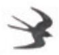

一身乌黑的羽毛，一对轻快有力的翅膀，加上剪刀似的còu尾巴，凑成了那样可爱的活泼的小燕子。

二三月的春日里，轻风微微地吹拂着，如毛的细雨由天上洒落着，千条万条的柔柳，红的白的黄的花，青的草，绿màn的叶，都像赶集似的聚拢来，形成了烂漫无比的春天。这时líng lì候，那些小燕子，那么伶俐可爱的小燕子，也由南方飞来，加入这光彩夺目的图画中，为春光平添了许多生趣。

小燕子带了它的剪刀似的尾巴，在阳光满地时，斜飞于kuàng旷亮无比的天空，叽的一声，已由这里的稻田上，飞到那边的高柳下了。

lín héng yì另有几只却在波光粼粼的湖面上横掠着，小燕子的翼yùn尖或剪尾，偶尔沾了一下水面，那小圆晕便一圈一圈地荡yàng漾开去。

那边还有飞倦了的几对，闲散地在纤细的电线上休憩 —嫩蓝的春天，几支木杆，几痕细线连于杆与杆之间， gān hén线上停着几个小黑点，那便是燕子。多么有趣的一幅图画呀！

còu líng lì kuàng héng yì yàng juàn sǎn xiān gān hén 凑伶俐旷横翼漾倦散纤杆痕

凑泼集偶尔沾闲纤杆

朗读课文，边读边想象画面，并读出对燕子的喜爱之情。背诵第1\~2自然段。

读一读，记一记，再说几个类似的词语。剪刀似的尾巴 伶俐可爱的小燕子光彩夺目的图画 旷亮无比的天空

找出课文中优美生动的语句，读一读，再抄写下来。

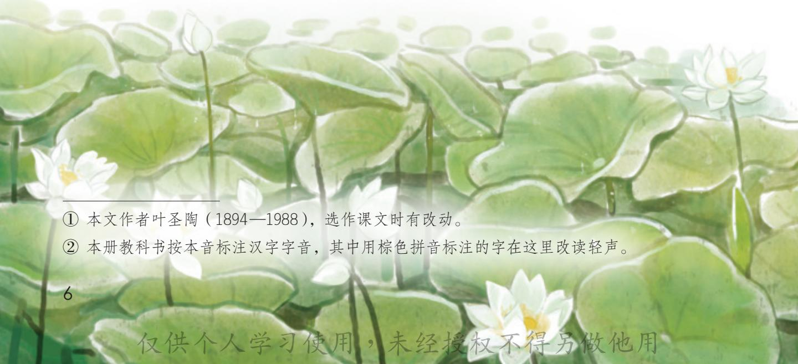

# ③荷花®

清早，我到公园去玩，一进门就闻到一阵清香。我赶紧往荷花池边跑去。

荷花已经开了不少了。荷叶挨挨挤挤的，像一个个碧绿的大圆盘。白

“挨挨挤挤”和“冒”用得真好！

荷花在这些大圆盘之间冒出来。有的才展开两三片花瓣儿。péng  
有的花瓣儿全展开了，露出嫩黄色的小莲蓬。有的还是花zhàng  
骨朵儿，看起来饱胀得马上要破裂似的。

这么多的白荷花，一朵有一朵的姿势。看看这一朵，很美；看看那一朵，也很美。如果把眼前的一池荷花看作一大幅活的画，那画家的本领可真了不起。

我忽然觉得自己仿佛就是一朵荷花，穿着雪白的衣裳，piān站在阳光里。一阵微风吹过来，我就翩翩起舞，雪白的衣裳

# 人民教育出版社

dǎo

随风飘动。不光是我一朵，一池的荷花都在舞蹈。风过了，qīngtíng我停止了舞蹈，静静地站在那儿。蜻蜓飞过来，告诉我清早飞行的快乐。小鱼在脚下游过，告诉我昨夜做的好梦……

过了好一会儿，我才记起我不是荷花，我是在看荷花呢。

āi péng zhàng shang piān qīng tíng 挨蓬胀裳翩蜻蜓

荷 紧 挨蓬胀 烈衣 微

有感情地朗读课文，注意读好下面的词语。背诵第2\~3自然段。花瓣儿花骨朵儿莲蓬衣裳

默读课文，借助想象说说你从哪些地方体会到了这一池荷花是“一大幅活的画”。

画出课文中你觉得优美生动的语句，和同学交流你的体会。

小练笔

第2自然段写出了荷花不同的样子，仿照着写一种你喜欢的植物。 A

# lù④昆虫备忘录

蜻蜓、瓢虫、蚂蚱…这些昆虫你了解吗？它们身上的秘密你知道多少？默读课文，说说你最感兴趣的内容。

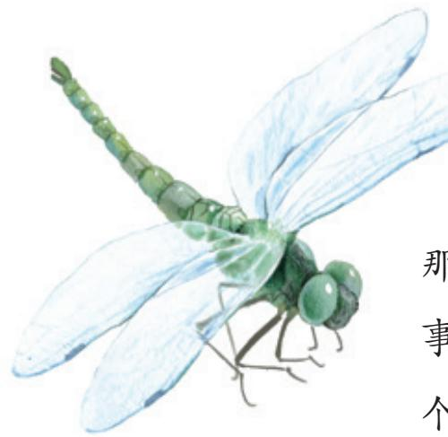

## 复 眼

我从一本书上知道蜻蜓有复眼，从zuó  
那以后，就一直在琢磨复眼是怎么回  
事。“复眼”，想必是好多小眼睛合成一  
个大眼睛。那它怎么看东西呢？是每个  
小眼睛都看到一个小形象，合成一个大

形象，还是每个小眼睛看到形象的一部分，合成一个完整的形象？总是琢磨不出来。

凡是有复眼的昆虫，视觉都很灵敏。蜻蜓就有复眼，苍yíng蝇也有。你走近蜻蜓和苍蝇，还有一段距离，它们就发现cēng了，噌飞了。

我曾经想过：如果人长了一对复眼……

还是不要！那成什么样子！

# 花大姐

piáo kuǎn chóu 瓢虫款款地落下来了，折好它的黑绸 chèn mó 衬裙—膜翅，顺顺溜溜；收拢硬翅，严 丝合缝。

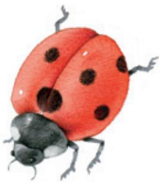

北京人把瓢虫叫作“花大姐”，好名字！

瓢虫，朱红的、瓷漆似的硬翅，上有小圆点，特别漂xiā亮。圆点是有定数的，不能瞎点。小圆点，叫作“星”，有yá七星瓢虫、十四星瓢虫…星点不同。有的瓢虫吃蚜虫，是yì shǔ益虫；有的瓢虫吃马铃薯嫩叶，是害虫。我说，吃马铃薯嫩叶的瓢虫，你们就不能改改口味，也吃蚜虫吗？

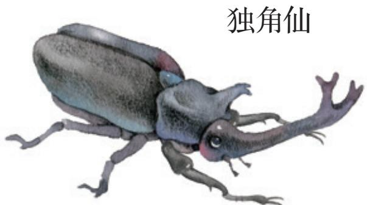

吃晚饭的时候，鸣—扑！飞来一只独角仙，摔在灯yūn下。它摔得很重，摔晕了。轻轻一捏，就捏住了。

独角仙，在甲虫里可能算是最大的，从头到脚，约有两xī寸。它的壳多为深色，挺硬的，头部尖端有一只犀牛一样的bà角。这家伙，是昆虫里的霸王。

# 人民教育出版社

lóng

独角仙的力气很大。北京隆福寺过去有独角仙卖。据说tào liàng给它套上一辆泥制的小车，它拉着就走。

## 鸭 mà

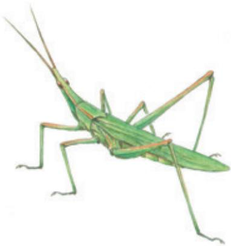

河北人把尖头绿蚂蚱叫作“挂大扁儿”。我挺喜欢“挂大扁儿”这个名字。

尖头蚂蚱是国画家很喜欢画的。画草虫的很少有没画过tāo蚂蚱的。齐白石、王雪涛都画过。我小时候也画过不少，因为它的形态好掌握，很好画。

蚂蚱飞起来会咯咯作响，不知道它是怎么弄出这种声音的。蚂蚱的膜翅是淡淡的桃红色的，非常好看。

还有一种“土蚂蚱”，身体粗短，方头，色黑如泥土，bān hè翅上有黑斑。这种蚂蚱，抓住它，它就吐出一泡褐色的口水，顶讨厌。

lù zuó mǐn kuǎn mó xiā yì liàng mà bān hè 录琢敏款膜瞎益辆蚂斑褐

## 口语交际

春游去哪里

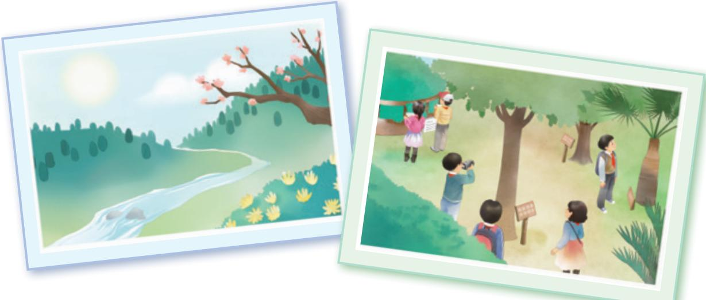

春天到了，我们去哪儿春游呢？提出自己的想法和同学讨论。每个人选一个地方，说说为什么推荐这个地方，可以在那里开展哪些活动。

先分组讨论，小组提出推荐的地点；再全班交流，各小组把推荐的理由说清楚；然后投票选出春游最值得去的一两个地方。

◎ 把推荐的理由说清楚。

耐心听别人讲完，尽量不打断别人的话。

# 我的植物朋友

大自然中有各种各样的植物。让我们选择一种植物，走近它，了解它，和它交朋友。

照样子，为自己的植物朋友做个记录卡吧。

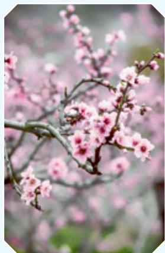

名称：桃花

样子：花骨朵儿胀鼓鼓的。已经绽放的花朵，一个花瓣儿挨着一个花瓣儿，围成圆形。

颜色：粉红

气味：淡淡的清香

其他：春天开放。结出的果实是桃子，也有只开花不结果的观赏桃花。颜色还有鲜红的、纯白的。

借助记录卡，写一写你的植物朋友，让更多的人了解它。

写之前再去观察一下，看一看，摸一摸，闻一闻……也许你会有新的发现。

写的时候，试着把你观察和感受到的写清楚。

写完后，把自己的习作读给同学听。写同一种植物的同学还可以一起交流。

# 语文园地

## 梳理与交流

你在阅读时积累了哪些优美生动的语句？和同学交流你的体会。

小燕子的翼尖或剪尾，偶尔沾了一下水面，那小圆晕便一圈一圈地荡漾开去。

作者的感受真独特，把花骨朵儿的状态写活了。

读到這句话，我能體會到小燕子飞行的轻盈。

有的还是花骨朵儿，看起来饱胀得马上要破裂似的。

瓢虫款款地落下来了，折好它的黑绸衬裙——膜翅，顺顺溜溜；收拢硬翅，严丝合缝。

这些细致的动作描写，让小瓢虫仿佛出现在了我的面前。

## 识字加油站

读一读，说说你发现了什么。

此它

bǐ匕（匕首）

忆 y艺

yǐ艺（乙方）

沉壳

rǒng冗（冗长）

突状

quǎn犬（军犬）

说税

duì兑（兑换）

熱勢

zhí执（争执）

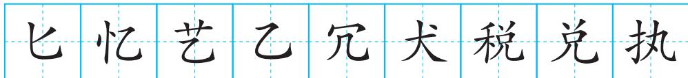

# 人民教育出版社

## 词句段运用

读一读，说说括号中的哪个词语用在句子里更合适。

水面的小圆晕一圈圈地（荡漾飘荡）开去。

因为是水面，所以……

他们走在回家的路上，唱起了一首（轻巧轻快）的歌曲。

这只小狗的鼻子真（灵巧 灵敏），老远就闻到了食物的气味。

读一读，照样子写出一种小动物的外形特点。

□ 一身乌黑的羽毛，一对轻快有力的翅膀，加上剪刀似的尾巴，凑成了那样可爱的活泼的小燕子。

独角仙的壳多为深色，挺硬的，头部尖端有一只犀牛一样的角。

## 日积月累

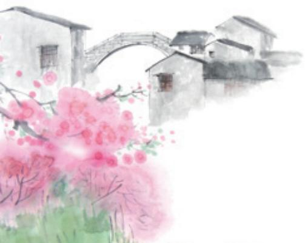

## 忆江南

[唐]白居易

ān江南好，风景旧曾谙。日出江花红胜火，春来江水绿如蓝。能不忆江南？

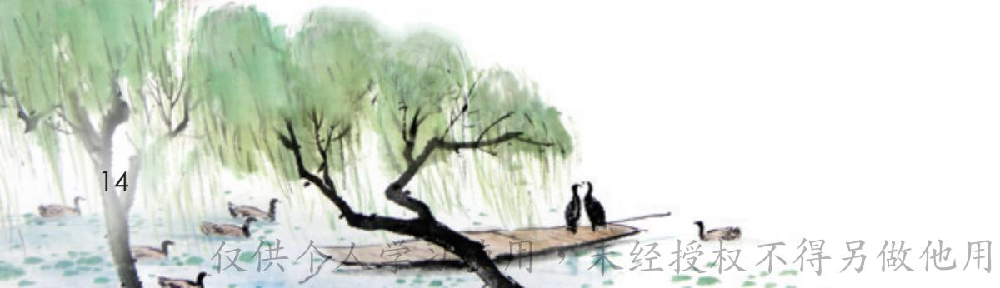

人民教育出版社

第二单元

寓言是生活的一面镜子。

▲从寓言中获得人生启示。

读故事，明白其中的道理。

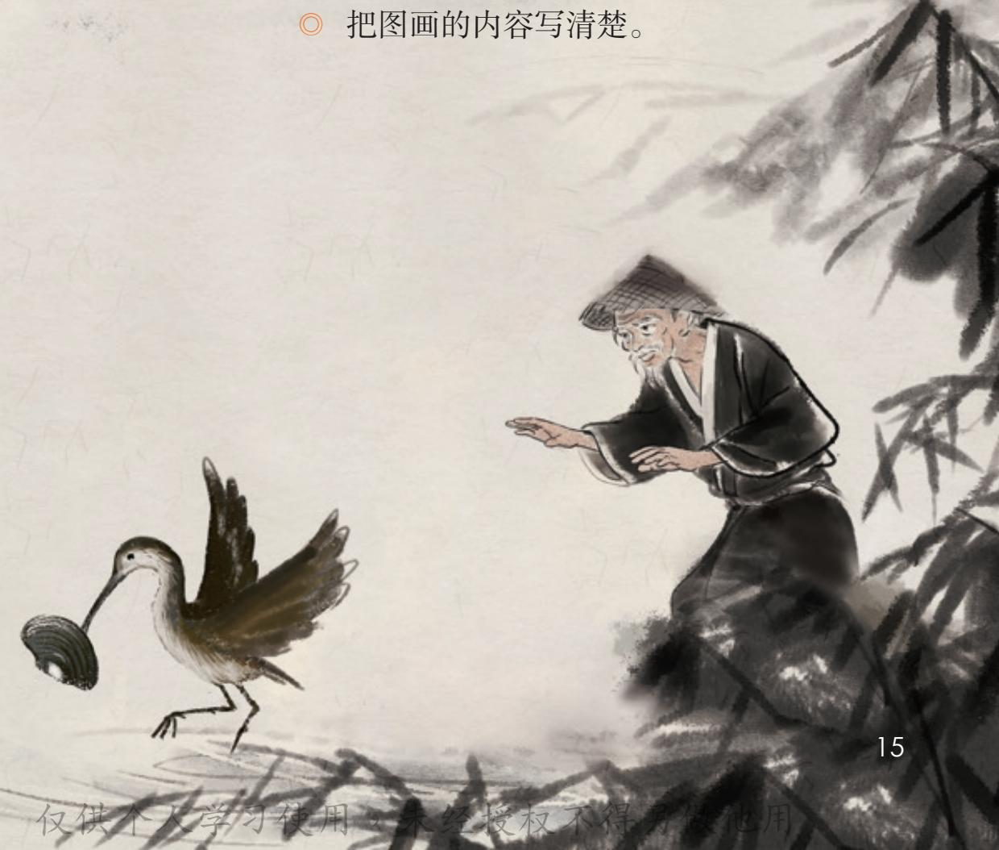

# ⑤ 守株待兔

geng 宋人有耕者，田中有株。兔走触株，折颈而死。因 释其未而守株，冀复得兔。兔不可复得，而身为宋 国笑。

注释

① 本文选自《韩非子·五蠹（dù)》，

题目为后人所加。株，树桩。

②〔走〕跑。

③〔因〕于是。

④〔释〕放下。  
⑤〔耒〕古代用来耕田的一种农具。  
⑥〔冀〕希望。

gēng i shì ji 耕释冀

守株待宋耕 折颈释其复

把课文读通顺，注意把握好停顿。背诵课文。

借助注释读懂课文，说说那个农夫为什么会被别人笑话。

## yuán 南辕北辙

从前有一个人，乘着马车在大路上飞驰。

他的朋友看见了，叫住他问：“你上哪儿去啊？”

他回答说：“到楚国去。”

朋友很奇怪，提醒他说：“楚国在南边，你怎么往北边走啊？”

他说：“没关系，我的马跑得快。”

朋友说：“马跑得越快，离楚国不是越远了吗？”

他说：“没关系，我的车夫是个好把式！”

朋友摇摇头，说：“那你哪一天才能到楚国啊！”

他说：“没关系，不怕时间久，我带的盘缠多。”

楚国在南边，他硬要往北边走。他的马越好，车夫的本领越大，盘缠带得越多，走得越远，就越到不了楚国。

——根据《戰國策·魏策四》相關內容改寫。

# ⑥会摇尾巴的狼

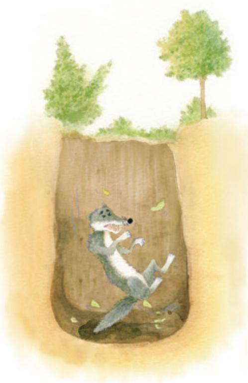

狼掉进陷阱里，怎么爬也爬不上来。老山羊从这里路过，狼连忙打招呼，说：“好朋友！为了我们的友情，帮帮忙吧！”

老山羊问：“你是谁？为什么跑到陷阱里去了？”

狼装出一副又老实又可怜的 mú 模样，说：“我，你不认识了吗？ xùn liáng 我是又忠诚又驯良的狗啊！为了 háo yóu yù

救一只掉进陷阱的小鸡，我毫不犹豫地跳了下来，没想到再也爬不上去了。唉！可怜可怜我这善良的狗吧！”

老山羊看了狼几眼，说：“你不像狗，倒很像狼！”

狼连忙半闭着眼睛，说：“我是狼狗，所以有点儿像狼。  
我的性情很温和，跟羊特别亲。你只要伸下一条腿来，我就tiǎn shī  
得救了。我一定好好答谢你，给你舔毛，帮你咬虱子………”

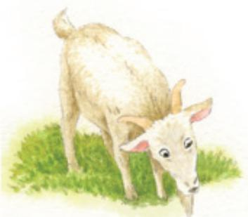

“别再花言巧语了。”老山羊说，“你piàn骗不了我，狗都是老老实实的，不像你这jiǎo huá样狡猾。”

狼着急了，赶忙说：“请您相信，我的的确确是狗。不信，你看我还会摇尾巴。”

狼把尾巴使劲摇了几下，扑扑扑，把陷阱里的尘土都扬了起来。

老山羊看到这条硬尾巴，心里完全明白了，说：“你再xiōng è会摇尾巴，也还是凶恶的狼。你干尽了坏事，谁也不会来救你的。”

狼终于露出了凶相，  
liě zī  
咧开嘴，龇着牙，对老hěn rǎng  
山羊恶狠狠地叫嚷：“你  
这老家伙！不快点儿过  
来，等我出去就吃掉你！”老山羊轻蔑地看了  
狼一眼，说：“你不会活liè  
多久了，猎人会来收拾  
你的。”说完就走开了。

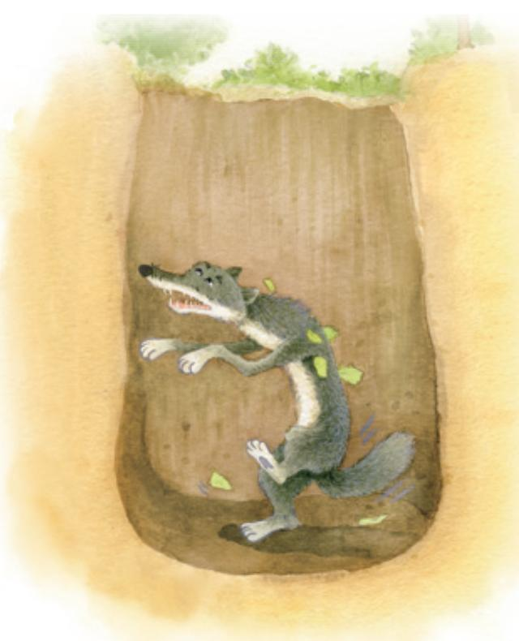

# mú xùn liáng háo yóu yù jiǎo huá xiōng è xiàng hěn liè 模驯良毫犹豫狡猾凶恶相狠猎

# 装驯良善伸谢

尘凶恶狠猎拾

分角色朗读课文，读出狼和老山羊对话的语气。

结合课文内容，说说老山羊是如何一步步识破骗局的。

读读“阅读链接”，再联系课文，说说你从这两个故事的结局中明白了什么道理。

## 农夫与蛇

从前，一个很冷的冬天，有个农夫在路上看见一条冻僵了的蛇。农夫可怜这条蛇，就解开自己的衣服，把它放在怀里。

蛇得到温暖，苏醒了。它一醒过来，就咬了农夫一口。农夫中了毒，临死的时候说：“蛇是害人的东西，我不该怜悯它。”

——根据《伊索寓言》相关内容改写。

# ⑦鹿角和鹿腿

丛林中，住着一只漂亮的鹿。

有一天，鹿口渴了，找到一个池塘，痛痛快快地喝起水来。池水清清的，像一面镜子。鹿忽然发现了自己倒映在水中的影子：“咦，这是我吗？”

鹿摆摆身子，水中的倒影也跟着摆动起来。他从来没有注意到自己是这么漂亮！他不着急离开了，对着池水欣赏自yún chèn己的美丽：“啊！我的身段多么匀称，我的角多么精美别致，shān hú好像两束美丽的珊瑚！”

一阵清风吹过，池水泛起了层层波纹。鹿忽然看到了自juē zhòu己的腿，不禁噘起了嘴，皱起了眉头：“唉，这四条腿太细pèi了，怎么配得上这两只美丽的角呢！”

鹿开始抱怨起自己的腿来。就在他没精打采地准备离开的时候，忽然听到远处传来一阵脚步声。他机灵地支起耳朵，不错，正是脚步声！鹿猛一回头，哎呀，一头狮子正悄bī悄地向自己逼近。

鹿不敢犹豫，撒开长腿就跑。有力的长腿在灌木丛中蹦来跳去，不一会儿，就把凶猛的狮子远远地甩在了后面。就在狮子灰心丧气不想再追的时候，鹿的角却被树枝挂住了。狮子赶紧抓住这个机会，猛扑过来。眼看就要追上了，鹿用chě尽全身力气，使劲一扯，才把两只角从树枝中挣脱出来，然后又拼命向前奔去。这次，狮子再也没有追上。

鹿跑到一条小溪边，停下脚步，一边喘气，一边休息。他叹了口气，说：“两只美丽的角差点儿让我送了命，可四条难看的腿却让我狮口逃生！”

yún chèn zhòu pèi sā chě 匀称皱配撒扯

渴喝匀称致束配

甩丧追扯叹逃

朗读课文，注意读出鹿的心情变化。

根据下面的提示，用自己的话讲讲这个故事。

角：美丽欣赏差点儿送命

腿：难看抱怨狮口逃生

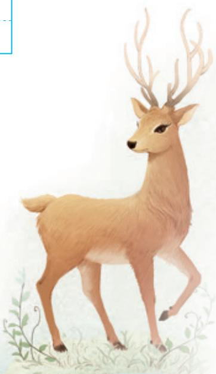

下面的说法，你赞成哪一种？说说你的理由。

美丽的鹿角不重要，实用的鹿腿才是重要的。

□ 鹿角和鹿腿都很重要，它们各有各的长处。

# ⑧池子与河流

寓言故事也可以用诗的形式来讲。分角色朗读课文，读出对话的语气，了解池子与河流的观点分别是什么。再结合生活实际说说你获得的启示。

“这是怎么回事？”

池子对她的邻居河流说道，

“我什么时候看见你，

你总是滚滚滔滔！

亲爱的姐姐，你难道不会疲劳？

“我总是看见，

你一会儿背着沉重的货船，

一会儿驮着长串的木筏，

还有小划子啊小船，

简直数也数不完。

pāo yá  
“你几时才能抛开这样的生涯？  
要是换了我，说句老实话，chóu  
我可真要愁死啦！  
我的命运有多好，  
比起来，你我相差竟这么大！“固然，我并不出名，  
我没有出现在地图上，  
wān yán guàn  
像你那样蜿蜒地贯穿全国，  
也没有行吟诗人为我弹琴歌唱。——这一切其实都是空的。  
“可是，我安闲地躺在柔软的泥土里，fù diàn  
像贵妇人躺在鸭绒垫上一样。  
我不用为大船和木筏操心，  
小划子有多重也用不着想，  
至多，有一两片树叶被微风吹落，xiōng táng  
在我的胸膛上轻轻摇荡。yōu lù  
“这清闲的生活无忧无虑，  
还有什么能够代替？píng  
任凭人世间忙忙碌碌，zhé  
我只在睡梦中推究哲理。”  
“啊，你在推究哲理？”  
河流说道，  
“水要流动才能保持清洁，  
这个自然规律，难道你已经忘掉？  
“我是一条伟大的河流，zūn xún  
那是因为我遵循着这条规律，  
不顾自身的安逸。  
我用源源不断的清洁的水，  
年年给人们带来利益，zūn  
这就使我受到尊敬，光荣无比。  
也许，我将永远奔流不息，  
可你早被遗忘，不再有人提起。”

## 人民教育出版社

河流的话果然应验。  
河流至今长流不断，yū sè  
而可怜的池子却一年年淤塞，  
整个让青苔铺满，wěi  
又让芦苇遮掩，  
到头来完全枯干。

shuāi才能不利用就要衰退，zhú它会逐渐磨灭；duò才能一旦让懒惰支配，它就一无所为。

tāo guàn fù diàn yōu lù píng zhé zūn xún yì zūn shuāi 滔贯妇垫忧虑凭哲遵循逸尊衰

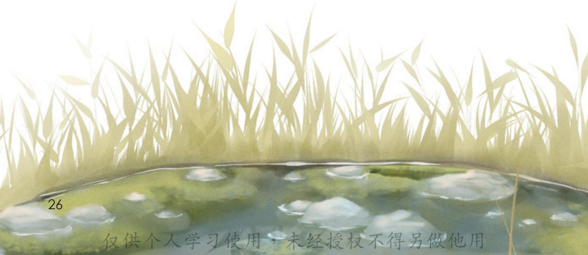

## 口语交际

## 劝 告

有一位同学，下课时坐在楼梯的扶手上往下滑。高年级同学看到了，劝他别这么做。

你这样太危险了，有可能会撞到别人。

你怎么不遵守学校纪律呢？太不应该了！

小同学，别这么玩，扶手很滑，如果没抓稳，你会摔伤的！

你觉得那位同学更有可能接受谁的劝告？为什么？如果遇到下面这些情况，你会怎样劝他们？

◇有同学乱穿马路。

表哥喜欢玩网络游戏，一玩就是几个小时。

注意说话的语气，不要用指责的口吻。多从对方的角度着想，这样对方更容易接受。

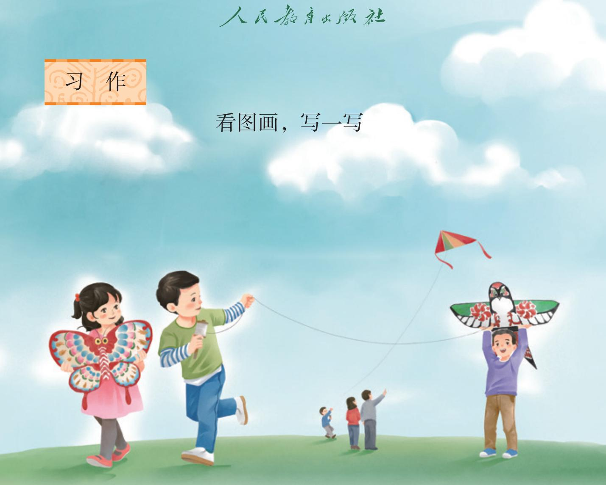

请你把上面这幅图画的内容介绍给大家。

写之前，先仔细观察图画，想一想：

图画上有哪些人？他们在干什么？

他们的动作分别是怎样的？可能说了哪些话？

写的时候，要把自己看到的、想到的写清楚。

写完后，跟同学交换习作读一读，互相评一评：图画的内容是不是介绍清楚了？有没有错别字？根据同学的意见修改习作。

# 语文园地

## 梳理与交流

你对寓言有了哪些认识？你是怎么读懂寓言的？和同学交流。

许多寓言故事给我留下了深刻印象。《乌鸦喝水》《狐假虎威》《揠苗助长》…这些故事我一读就记住了。

寓言中往往蕴含着道理。读了《守株待兔》，我明白了做事要靠自己的努力，不要有侥幸心理。

读寓言故事时，我能想到生活中的许多人和事。

## 词句段运用

说说下面两组词语有什么特点，照样子写几个。

源源不断 津津有味无忧无虑 无边无际

读一读，注意加点的部分，照样子把句子补充完整。

鹿忽然看到了自己的腿，不禁听起了嘴，皱起了眉头：“唉，这四条腿太细了，怎么配得上这两只美丽的角呢！”

◇他 ：“你真是急死我了！”

“可是，后天就要举行婚礼了呀！”蜗牛几乎带着哭腔说。

“这次我终于可以好好地玩儿啦！”姐姐

读通知，注意格式，再选择一种情况或结合生活实际，写一个通知。

## 通知

全体同学：

4月9日下午3点，请到操场集合，观看文艺表演。

少先队大队委4月7日

◇通知各班班长领取新校服。

通知全班同学进行大扫除。

## 书写提示

植

驯

最

猎

横画或竖画较多的字，書寫時要先考慮好這些筆畫的长短和间距，避免拥挤。

## 日积月累

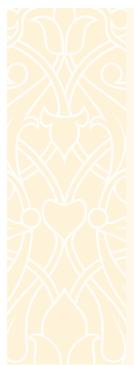

掩耳盗铃自相矛盾井底之蛙杞人忧天刻舟求剑杯弓蛇影

hán dān   
邯郸学步 yú   
滥竽充数   
画蛇添足

# 快乐读书吧

# 小故事大道理

儿童文学家严文井曾说：“寓言是一个魔袋，袋子很小，却能从里面取出很多东西来。”寓言故事一般比较短小，但背后往往藏着深刻的道理。

## 你读过吗

中国古代寓言凝结着中华民族的智慧。这些寓言故事题材广泛，形式活泼，读起来既轻松有趣，又发人深省。读了下面这则寓言，你明白了什么道理？和同学分享你获得的启示。

## 叶公好龙

古时候有一位叶公，非常喜欢龙。他穿的衣服上绣着龙，戴的帽子上镶着龙；住的房子也一样，墙壁上画着龙，柱子上雕着龙。这些龙张牙舞爪，回旋盘绕，好像在云雾里飞翔。

天上的真龙听说叶公这么喜欢龙，就决定去拜访他。霎时间，乌云滚滚，雷电交加，真龙到了叶公家里，把头伸进了南窗，把尾巴绕到了北窗。

叶公见了真龙，吓得脸色发白，浑身发抖，连忙跑走了。原来他喜欢的不是真龙。

根据《新序·杂事》相关内容改写。

读寓言，先要读懂故事内容，再体会故事中的道理。

联系生活中的人和事，可以帮助我们更深入地理解故事中的道理。

## 相信你可以读更多

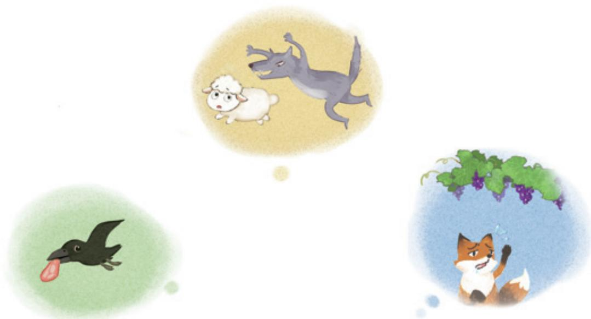

除了中国的寓言，还可以读一读其他国家的寓言。伊索寓言、拉封丹寓言、克雷洛夫寓言，都在世界上有很大的影响。

伊索寓言中大多是动物故事，就像一个奇妙的动物王国。漫步其中，我们会看到吃不到葡萄反而说葡萄酸的狐狸，还会遇到用自己的智慧成功逃生的小羊……

读拉封丹寓言和克雷洛夫寓言时，我们会发现，很多故事都似曾相识，却被赋予了新的意义。老故事，新道理，这也是很多古老的寓言能够代代相传、历久弥新的原因。

快来打开寓言宝库的大门吧！

# 第三单元

看，花儿在悄悄绽放；听，虫儿在窃窃私语……自然界如此奇妙，留心观察，会有新的发现。

▲观察自然，探索世界。

借助关键语句概括一段话的大意。

做个小实验，把实验过程写清楚。

## 阅读

# 9 海底世界

你可知道，大海的深处是怎样的？

tāo péng pài

海面上波涛澎湃的时候，海底依然很宁静。最大的风浪，也只能影响到海面以下几十米深。阳光很难射进深海，水越深光线越暗，几百米以下就全黑了。在这一片黑暗的深shuò海里，却有许多光点像闪烁的星星，那是有发光器官的深水鱼在游动。

海底是否没有一点儿声音呢？不是的。海底的动物常常qiè sī  
在窃窃私语。你用水中听音器一听，就能听见各种声音：有wēng jiū  
的像蜜蜂一样嗡嗡，有的像小鸟一样啾啾，有的像小狗一样hān  
汪汪，还有的好像在打鼾…它们吃东西的时候发出一种声jǐng bào  
音，行进的时候发出另一种声音，遇到危险还会发出警报。海里的动物，各有各的活动方法。海参靠肌肉伸缩爬suō  
行，每小时只能前进四米。有一种鱼身体像梭子，每小时能  
游几十千米，攻击其他动物的时候，比普通的火车还快。乌  
zéi  
贼和章鱼能突然向前方喷水，利用水的反推力迅速后退。还miǎn  
有些贝类自己不动，却能巴在轮船底下作免费的长途旅行。

## 人民教育出版社

chā

海底的植物差异也很大。它们的色彩多种多样，有褐色zǎo dá的，有紫色的，还有红色的。最大的海藻长达二三百米。最bāo小的单细胞海藻，要用显微镜才能看清楚。

海底蕴藏着丰富的煤、铁、石油和天然气，还有陆地上chǔ shǔ储量很少的稀有金属。

海底真是个景色奇异、物产丰富的世界。

fǒu qiè sī jī suō miǎn chā zǎo dá bāo méi chǔ shǔ 否窃私肌缩免差藻达胞煤储属

官否窃私汪危险

肌攻免费异达

朗读课文。说说课文是从哪几个方面介绍海底世界的。

默读第3～5自然段，找出各段的关键句，再说说每段话的意思。

读下面的句子，注意加点的部分，体会这样写的好处。

◇ 海底的动物常常在窃窃私语。

还有些贝类自己不动，却能巴在轮船底下作免费的长途旅行。

# ①0石蜂

石蜂每次采完蜜都能回到自己的家，我认为它们靠的不zhèng是记忆力。我想做实验验证一下。

一天，我在我家草料棚的蜂窝里捉了一些石蜂，把它们  
分别放进不同的纸袋里。我叫小女儿在蜂窝旁等着，自己带  
着石蜂，走到四公里外它们从来没有去过的地方。我打开纸  
袋，在它们身上做了白色记号，然后把它们放走。二十只左  
右的石蜂向四面飞散，好像在寻找回家的方向。这时候刮起gài  
了狂风，石蜂飞得很低，几乎要触到地面，大概这样可以减zǔ  
少阻力。我想，它们飞得这么低，怎么能看到远处的家呢？

在回家的路上，我担心石蜂找不到家了。没等我跨进家门，小女儿就冲过来，脸红红的，看上去很激动。她高声喊道：“有两只石蜂飞回来了！它们两点四十分回到蜂窝里，身上还沾着花粉呢。”

我放石蜂的时候是将近两点钟，也就是说，在大约三刻钟的时间里，那两只石蜂飞了四公里路，这还包括了采花蜜和花粉的时间。

傍晚时，我亲眼看到另外三只飞了回来，身上也都带着花粉。第二天我检查蜂窝时，发现了十五只身上有白色记号的石蜂。

## 人民教育出版社

这样，二十只左右的石蜂，至少有十五只没有迷失方wù nì向，准确无误地回到了家。尽管它们逆风而飞，沿途都是一些陌生的景物，但它们真的飞回来了。

石蜂确实靠的不是记忆力，而是一种我无法解释的特殊的能力。

zhèng gài zǔ wù nì shū 证概阻误逆殊

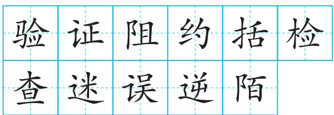

## 默读课文，把下面的图表补充完整。

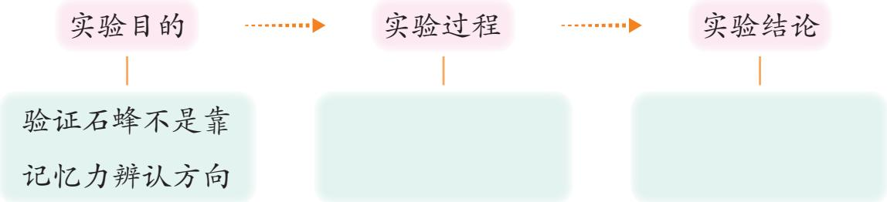

读一读，注意加点的部分，说说你从中体会到了什么。再从课文中找出类似的语句，和同学交流。

◇ 二十只左右的石蜂向四面飞散，好像在寻找回家的方向。

石蜂飞得很低，几乎要触到地面，大概这样可以减少阻力。

它们两点四十分回到蜂窝里，身上还沾着花粉呢。

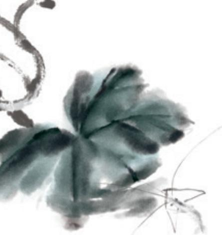

# ①小虾

默读课文，说说第3自然段主要写了什么，你是借助哪个关键句了解到的。把课文中写得细致生动的语句抄写下来。

院子里的葡萄架下，一口缸闲着。夏天，积了大半缸雨xì水。从葡萄架的空隙里漏下的阳光，洒落在水面上，像许多大大小小的圆镜。我想，这缸不正好用来养小鱼小虾吗？

我和邻居阿成哥跑到村边小溪里，在竹荫下静水处，轻轻掀开小石块，或者把手伸到大石块下，捉了一些小虾，带回家养在缸里。这些小虾，有的通体透明，像玻璃似的，这shāo是才长大的；有的稍带灰黑色，甚至背上、尾巴上还积着泥，长着青苔，这是老的，大家叫它千年虾。

缸里的小虾十分有趣。它们有的独自荡来荡去，有的互zhú  
相追逐，有的紧贴住缸壁。要是你用小竹枝去动动那些正在  
休息的小虾，它们会立即向别的安静的角落蹦去，一路上像fù  
生了气似的，不停地舞动着前面那双细长的腿，腿末端那副  
钳子一张一张的，胡须也一翘一翘地摆动着，连眼珠子也一  
突一突的。如果这时碰到正在闲游的同伴，说不定就要打起bó  
来。小虾的搏斗很激烈，蹦出水面是常有的事，有时还会蹦  
到缸外的地面上。

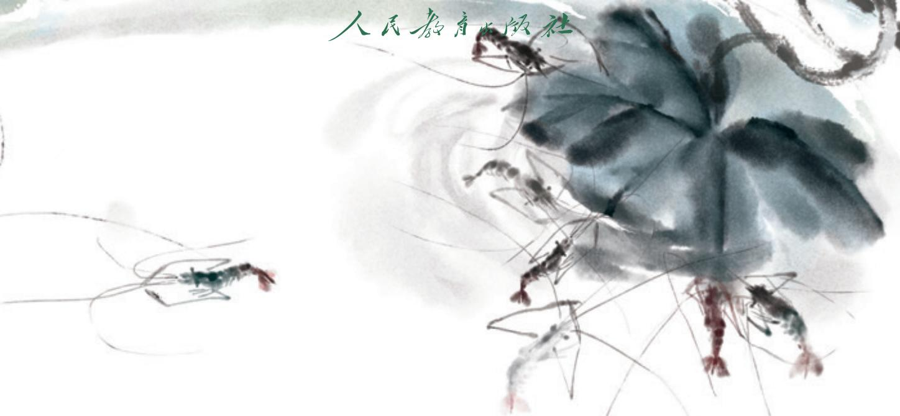

我觉得该让它们在缸里生活得更快乐些。后来，我就和jiǎn阿成哥到小溪里采了一些水草，捡了些石块放在缸里。我们记得，小溪里的虾是挺喜欢钻到石块下面休息的。

有一天，我从缸里捉起几只较大的虾，发现它们的腹部luǎn藏着许多圆圆的卵。不久，缸里的小虾真的多了起来。

有时葡萄架上一片落叶掉进缸里，不一会儿，叶子下就会聚起许多小小的虾。

## 我做了一项小实验

你做过什么小实验？向大家介绍一下。

写之前，可以先借助图表整理小实验的主要信息。

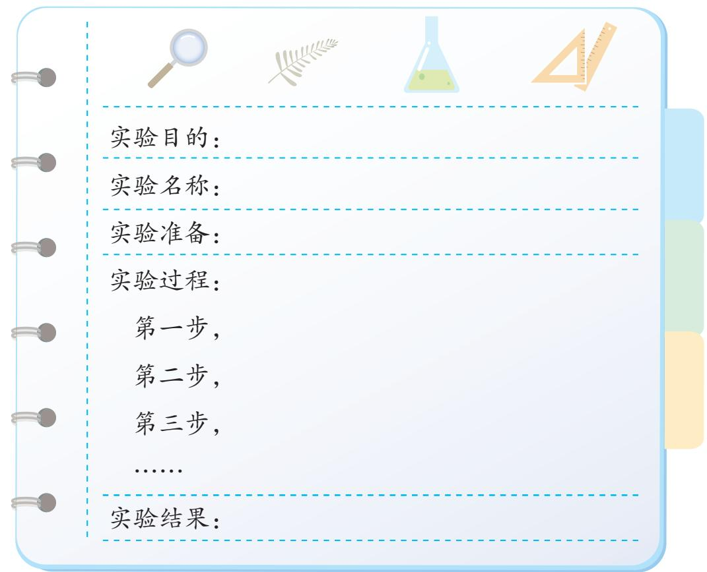

写的时候，可以用上“先……接着……然后……最后……”这样的句式，把做小实验的经过写清楚。还可以写一写自己做实验时的心情、实验中有趣的发现等。

写完后，把自己的习作和同学交换读一读，再评一评：实验过程是否写清楚了？有没有用得不合适的词语？

# 语文园地

## 梳理与交流

阅读时，你是怎样概括文中一段话的大意的？和同学交流。

有時可以直接用关键语句概括一段话的大意。如：《海底世界》中的“海里的动物，各有各的活动方法”这句话，就是第4自然段的大意；《小虾》第3自然段的大意可以用第1句话来概括。

有时候，一段话的大意可以根据关键语句的提示进行概括。如，根据《海底世界》第3自然段开头部分的提示，再结合文中的具体描述，这个自然段的大意可以概括为：海底的动物会发出各种各样的声音。

## 词句段运用

观察时主动思考、提出问题是个好习惯。读下面的句子，照样子写一写你在生活中的观察和思考。

这时候刮起了狂风，石蜂飞得很低，几乎要触到地面，大概这样可以减少阻力。我想，它们飞得这么低，怎么能看到远处的家呢？

这个路口总是很畅通，那个路口却总是堵车。两个路口才相距一百米，差别却这么大，到底是什么原因呢？

# 人民教育出版社

下面这段话只修改了一部分。读一读，看看还有什么问题，用修改符号改一改。

我养了螃蟹一只，他眼睛、嘴巴都不大怎么显眼，钳子子倒是很大。它最爱显摆它的钳了。有一次，我轻轻点了它一下用一根小棍，它立刻转动身体，向我高高举起那大钳子剪刀似的。我又点了几下，它钳子越举越高，突然，整个身子翻了过去。它急了，腿和钳子在空中乱舞，好不容易才借助玻璃缸壁翻身过来。

表示对调

表示移动

我要用修改符号修改自己的习作。

## 日积月累

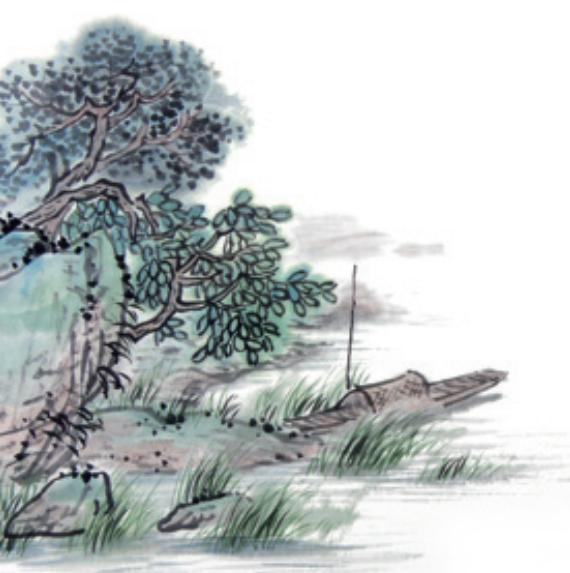

## chú 滁州西涧

wéi [唐]韦应物

独怜幽草涧边生，上有黄鹂深树鸣。春潮带雨晚来急，野渡无人舟自横。

中华优秀传统文化，是中华民族的根和魂。

## 第四单元

感受古人智慧，领略中华文化的魅力。

了解课文是怎么围绕一个意思把一段话写清楚的。

收集传统节日的资料，交流节日的风俗习惯，写一写过节的情景。

## 阅读

## 12 古诗三首

## 元 日

[宋]王安石

爆竹声中一岁除，tú sū  
春风送暖入屠苏®。tóng  
千门万户曈曈日，  
总把新桃换旧符。

清明 mù [唐]杜牧

清明时节雨纷纷， hún   
路上行人欲断魂。 jiǔ   
借问酒家何处有？   
牧童遥指杏花村。

## 注释

①〔元日〕指农历正月初一。

②〔屠苏〕这里指一种用屠苏等花草制作的酒，根据古代风俗，常在元日饮用。

③〔曈曈〕这里形容太阳出来后天色渐亮的样子。

④〔新桃换旧符〕用新桃符换下旧桃符。桃符是古代新年时悬挂在大门上用以辟邪的门饰，春联的前身。

注释

①〔清明〕我国传统节日，有扫墓、踏青等习俗。

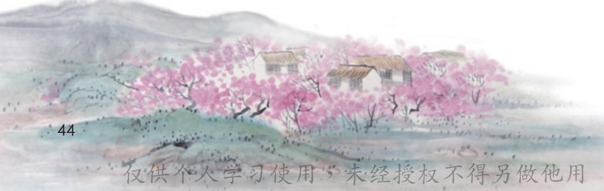

xiōng九月九日忆山东兄弟

[唐]王维

独在异乡为异客，jiā  
每逢佳节倍思亲。  
遥知兄弟登高处，zhū yú  
遍插茱萸少一人。

注释

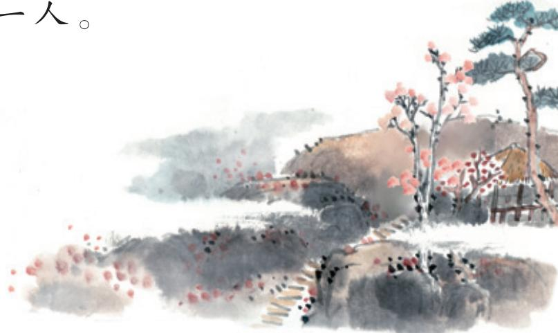

①〔九月九日〕指农历九月初九重阳节，这一天有登高的习俗。

②〔山东〕这里指华山以东。

③〔茱萸〕一种香气浓郁的植物，古人在重阳节有插戴茱萸的习俗。

mù hún jiǔ xiōng jiā 牧魂酒兄佳

# 旧 符牧纷 魂 借酒 遥兄逢 佳 倍

有感情地朗读课文。背诵课文。默写《清明》。

这三首诗分别写的是哪个传统节日？写出了什么样的节日情景？

## 活动提示

我国有很多传统节日，如春节、端午节、中秋节，这些节日有着深厚的文化内涵和独特的习俗。

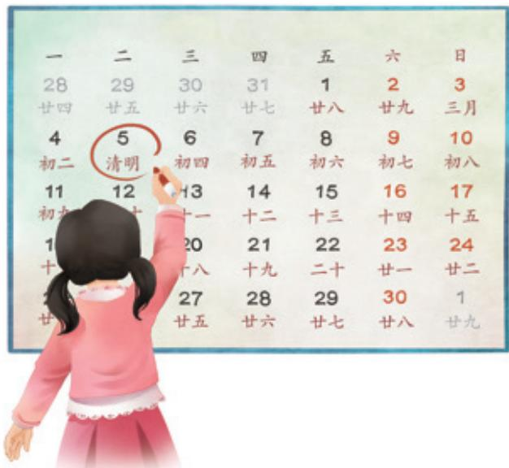

让我们开展一次专题学习活动，了解我国的重要传统节日以及节日的习俗。

自由组成小组，先商量一下，打算了解哪些传统节日，怎么了解，用什么方式记录，然后各自开展活动。

<table><tr><td>节日</td><td>过节时间</td><td>节日习俗</td></tr><tr><td>端午节</td><td>农历五月初五</td><td>吃粽子，赛龙舟，挂艾蒿</td></tr><tr><td></td><td></td><td></td></tr><tr><td></td><td></td><td></td></tr></table>

# 人民教育出版社

# 13 纸的发明

gòng

造纸术的发明，是中国对世界文明的伟大贡献之一。

早在几千年前，我们的祖先就创造了文字。那时候还没shòu有纸，人们把文字刻或写在竹木、玉石、陶器、兽骨、青bó yóu铜、丝帛等材料上。尤其是竹片和木片，是造纸术发明之前中国使用时间最长、应用最广、影响最大的书写材料。这些竹片、木片用绳子穿起来，就成了一册册的书。但是，这bèn yuè cún种书很笨重，阅读、携带、保存都很不方便。古时候用“学富五车”形容一个人学问高，就是说他读过的书很多，需要用几辆车拉才行呢！

jiǎn

miè

后来，人们用蚕茧制作丝绵时，发现盛放蚕茧的篾席上chú会留下一层薄片，可用于书写，这实际上就是早期纸的雏形。考古学家发现，在两千多年前的西汉时期，人们已经懂cāo得了用麻来造纸。但麻纸比较粗糙，不便书写。

cài lún

在一千九百多年前的东汉时期，有个叫蔡伦的人，吸收lěi  
了人们长期积累的经验，改进了造纸术。他把树皮、麻头、suì qiē dǎojiāng  
破布、旧渔网等原料剪碎或切断，浸在水里捣烂成浆；再用  
竹帘抄起一部分纸浆，纸浆会在竹帘上形成一层均匀的薄liàng  
片，晾干后就成了既轻便又好用的纸。用这种方法造纸，原jià pián  
料容易得到，价格又便宜，可以大量制造，能满足多数人的chéng  
需要，所以这种造纸方法就传承下来了。

xiǎn

我国的造纸术首先传到邻近的朝鲜半岛和日本，后来又shè传到阿拉伯世界和欧洲，极大地促进了人类社会的进步和文化的发展。

gòng yóu bèn yuè cún cài lún lěi qiē jià pián xiǎn shè 贡尤笨阅存蔡伦累切价便鲜社

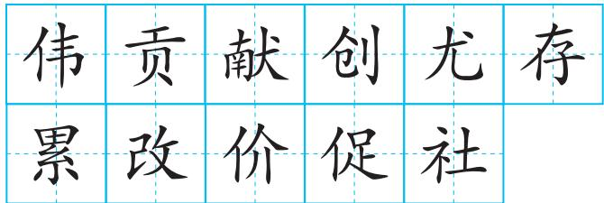

默读课文，想想每个自然段的意思，再照样子填写下面的图表。

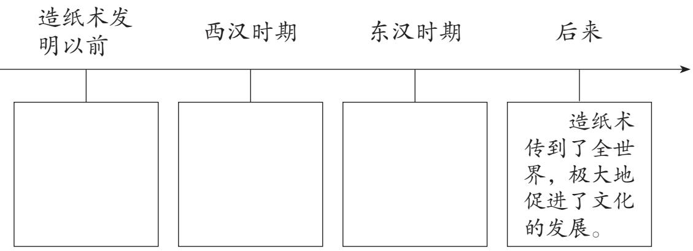

结合课文中的相关语句，说说为什么蔡伦改进的造纸方法能传承下来。

## 选做

我国古代在很多领域都取得了重要的科技成就。如，张衡发明了测验地震的仪器地动仪，祖冲之把圆周率的计算结果精确到了小数点后第七位，毕昇发明了活字印刷术。查找相关资料，和同学交流。

## 活动提示

你们小组开展了哪些活动？了解了哪些传统节日？小组内交流一下。

整理收集到的资料，再商量商量，打算怎样展示活动的成果，还可以补充哪些资料。

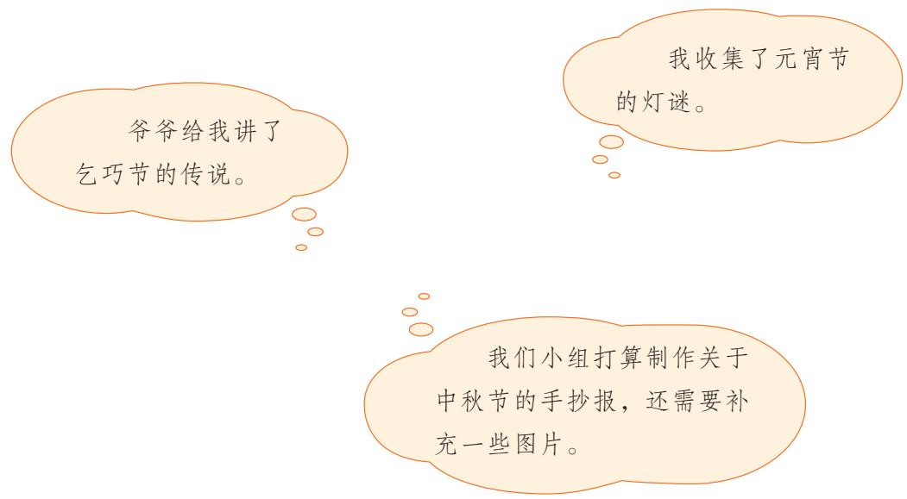

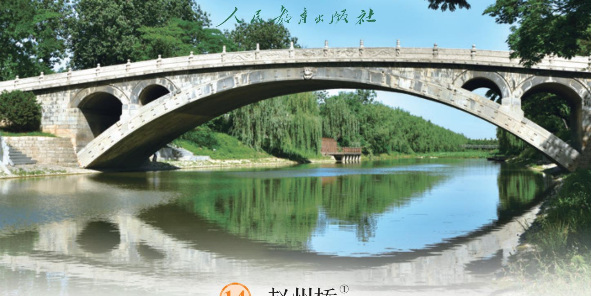

## 14 赵州桥

xiàn xiáo

gǒng

河北省赵县的洨河上，有一座世界闻名的石拱桥，叫安jì suí jiàng济桥，又叫赵州桥。它是隋朝的石匠李春设计并参加建造的，到现在已经有一千四百多年了。

赵州桥非常雄伟。桥长五十多米，有九米多宽。这么qì dūn长的桥，全部用石头砌成，下面没有桥墩，只有一个净跨三十七米多的拱形大桥洞。大桥洞顶上的左右两边，还各有两个拱形的小桥洞。平时，河水从大桥洞流过，发大水的时候，河水还可以从四个小桥洞流过。这种设计，在建桥史上是一个创举，既减轻了流水对桥身的冲击力，使桥不容易被大水冲毁，又减轻了桥身的重量，节省了石料。

## 人民教育出版社

lán

这座桥不但坚固，而且美观。桥面两侧有石栏，栏板上diāo chán雕刻着精美的图案：有的刻着两条相互缠绕的龙，嘴里吐出zhǎo dǐ美丽的水花；有的刻着两条飞龙，前爪相互抵着，各自回首遥望；还有的刻着双龙戏珠。所有的龙似乎都在游动，真像活了一样。

zhì huì

赵州桥体现了劳动人民的智慧和才干，是我国宝贵的历yí史文化遗产。

xiàn gǒng jì jiàng qì lán zhǎo dǐ zhì huì lì yí 县拱济匠砌栏爪抵智慧历遗

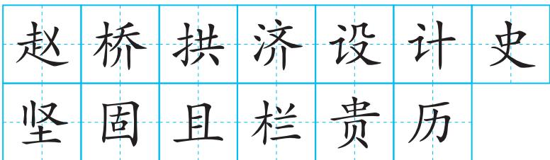

朗读课文。说说从哪里可以看出“赵州桥体现了劳动人民的智慧和才干”。

抄写第3自然段，体会这段话是怎样把赵州桥的“美观”写清楚的。

试着用下面的词语，以导游的身份向游客介绍赵州桥。

世界闻名 雄伟创举 美观

# ①5一幅名扬中外的画

默读课文，说一说为什么《清明上河图》会名扬中外。结合课文内容和图画，向别人介绍《清明上河图》。

北宋时候，有位画家叫张择端。他画了一幅著名的biàn画—《清明上河图》，画的是北宋都城汴京热闹的场面。这幅画有八九百年的历史，早已名扬中外，现在保存在北京故宫博物院里。

张择端画这幅画的时候，下了很大功夫。光是画上的人物就有好几百个：有从乡下来的农民，有撑船的船工，有做各种买卖的生意人，有留着长胡子的道士，有走江湖的医tān fàn 1生，有摆小摊的摊贩，有官吏和读书人……三百六十行，哪一行的人都画在上面了。

画上的街市可热闹了。街上有挂着各种招牌的店铺。走

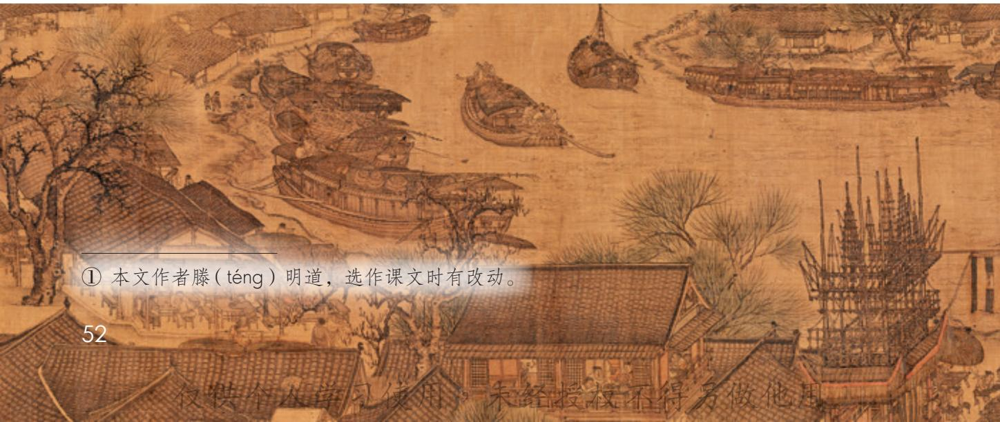

在街上的，是来来往往、形态各异的人：有的骑着马，有的lú  
挑着担，有的赶着毛驴，有的推着独轮车，有的悠闲地在街上溜达。画面上的这些人，有的不到一寸，有的甚至只有黄豆那么大。别看画上的人小，每个人在干什么，都能看得清清楚楚。

最有意思的是桥北头的情景：一个人骑着马，正往桥下shèng走。因为人太多，眼看就要撞上对面来的一乘轿子。就在这lóng zhuài个紧急时刻，马笼头一下子被拽住了，这才没让马撞上那乘轿子。旁边两头运货的小毛驴正在下坡，脚下不稳。站在桥rǎo栏杆边欣赏风景的人被惊扰了，连忙回过头来……你看，张择端画的画，是多么传神啊！

《清明上河图》使我们看到了八九百年以前的古都风貌，看到了当时普通百姓的生活情景。

zé tān fàn lì lú shèng lóng zhuài rǎo mào 择摊贩吏驴乘笼拽扰貌

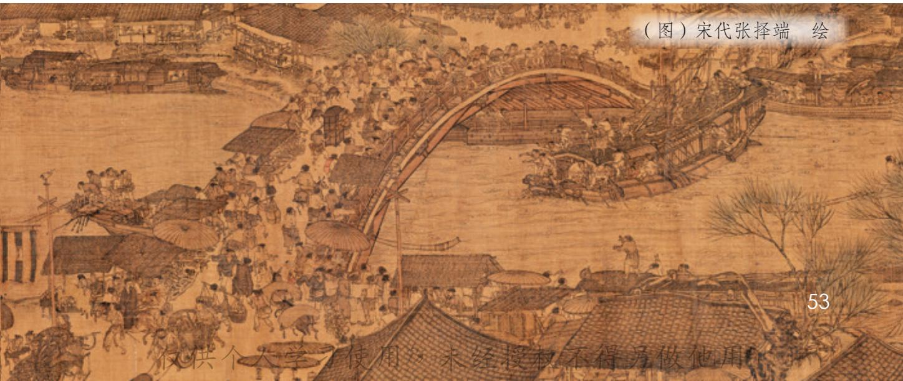

## 专题学习活动

## 中华传统节日

这段时间，我们对感兴趣的节日进行了深入的了解，一定有很多收获。

写一写过节的情景。

选一个传统节日，写一篇短文。可以写自己家过节的情景，也可以写节日中发生的印象深刻的事。

展示活动成果。

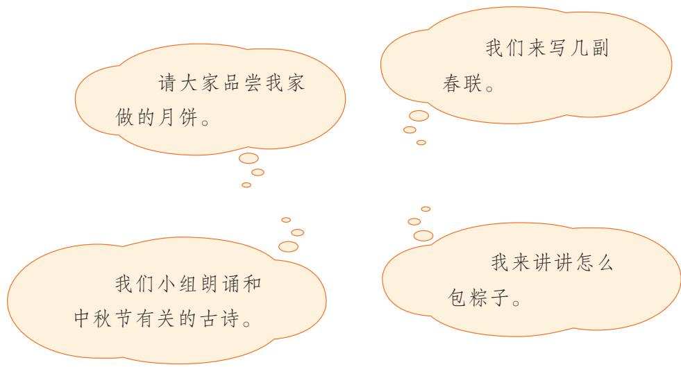

展示成果时，本组的同学可以补充，其他小组的同学可以提问，最后评一评哪个小组的活动开展得好。

# 语文园地

## 梳理与交流

怎样在一段话里把一个意思写清楚？结合读过的文章，和同学交流你的心得体会。

《赵州桥》第3自然段，为了写清楚“赵州桥非常美观”，详细介绍了桥面石栏上精美的图案，把各种姿态的龙写得活灵活现。

《一幅名扬中外的画》第3自然段，写了挂着各种招牌的店铺，还写了来来往往、形态各异的人，从而写出了“画上街市的热闹”。

## 识字加油站

读一读，写一写。

yuán援（援助）

zhì tóu掷（投掷）

lāo捞（打捞）

chāi拆（拆分）

jiǎo搅（搅动）

tuò拓（拓展）

投

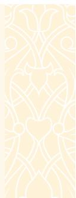

# 人民教育出版社

## 词句段运用

对照流程图读读下面这段话，照样子口头介绍一次手工活动的过程，如剪纸、捏泥人、拼装玩具、编花绳。

剪碎或切断→浸→捣→抄→晾

有个叫蔡伦的人，吸收了人们长期积累的经验，改进了造纸术。他把树皮、麻头、破布、旧渔网等原料剪碎或切断，浸在水里捣烂成浆；再用竹帘抄起一部分纸浆，纸浆会在竹帘上形成一层均匀的薄片，晾干后就成了既轻便又好用的纸。

读一读，想想下面的句子在表达上有什么共同点，再照样子写一写。

走在街上的，是来来往往、形态各异的人：有的骑着马，有的挑着担，有的赶着毛驴，有的推着独轮车，有的悠闲地在街上溜达。

桥面两侧有石栏，栏板上雕刻着精美的图案：有的刻着两条相互缠绕的龙，嘴里吐出美丽的水花；有的刻着两条飞龙，前爪相互抵着，各自回首遥望；还有的刻着双龙戏珠。

## 日积月累

文房四宝：笔墨纸砚

雅人四好：琴棋书画

中医四诊：望闻问切

## 人民教育出版社

第五单元

想象力比知识更重要。

[美国]爱因斯坦

在阅读中感受想象的神奇。

发挥想象写故事。

# luó bo16 胡萝卜先生的长胡子

chóu

胡萝卜先生常常为胡子发愁，因为他长着浓密的胡子，必须每天刮。

有一天，胡萝卜先生匆匆忙忙刮了胡子，就吃着果酱面包上街去了。因为他近视，就没有发现漏刮了一根胡子。这根胡子长在下巴的右边，胡萝卜先生吃果酱面包的时候，胡子沾到了甜甜的果酱。对一根胡子来说，果酱是多么好的营养品啊！

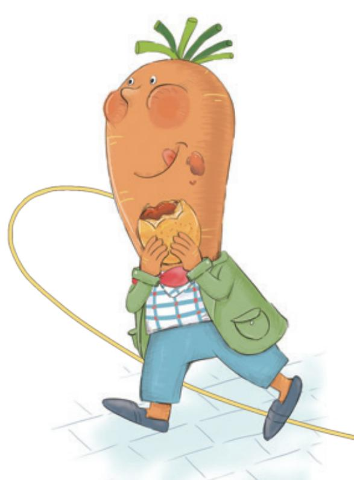  
①本文作者王一梅，选作课文时有改动。

于是，胡萝卜先生一步一步走的时候，这根胡子就在一点儿一点儿地变长。只要看看胡萝卜先生走了多长的路，就可以知道他的这根胡子已经长了多长了。

胡萝卜先生还在继续走，长胡子被风吹到了身体后面，他完全不知道。

在很远的街口，有一个男孩正在放风筝。线实在太短了，他的风筝只能飞过屋顶。

胡萝卜先生的胡子刚好在风里飘动着。“这绳子够长了，就是不知道够不够结实。”小男孩说完就扯了扯胡子，他确定足够结实，就剪了一段用来放风筝。

胡萝卜先生继续往前走，当他走过鸟太太家的树底下，liàng niào鸟太太正在找绳子晾小鸟的尿布。

胡萝卜先生的胡子刚好在风里飘动着。于是，鸟太太剪了一段长长的胡子，系在两根树枝的中间：“这下好了，我总算找到一根够长的绳子了。”

胡萝卜先生就这样一直走，他的胡子也一直长。当他走进一家眼镜店的时候，他的胡子已经不再发疯地长了。由于一路上他的胡子派上了许多用场，已经不是那么长了，刚好jiān tāo挂到他的肩膀上。这时，胡萝卜先生开始掏钱买眼镜。

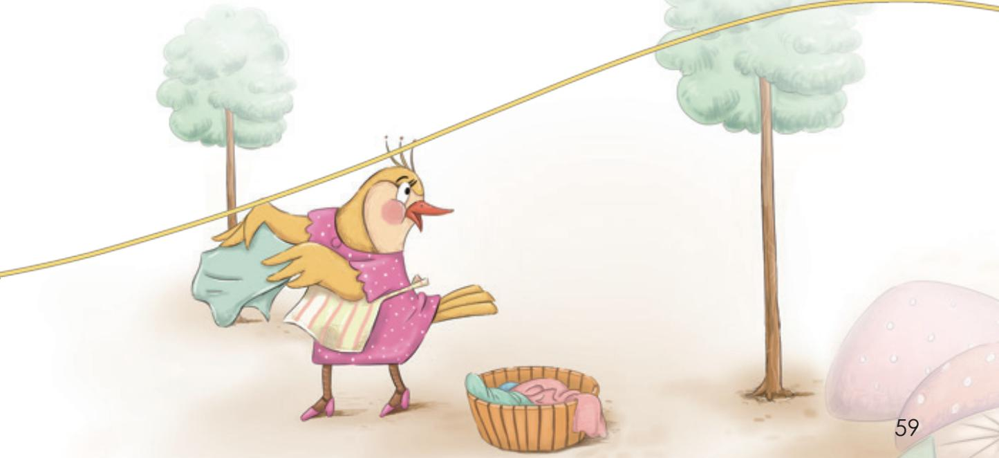

## 人民教育出版社

眼镜店的白菜小姐是个非常机灵的女孩，她一边给胡萝卜先生戴眼镜，一边说：“如果你害怕不小心把眼镜摔了，就在眼镜腿上系一根绳子，然后挂在脖子上。”白菜小姐说着，就用那根胡子系住了眼镜。

当胡萝卜先生的眼镜不小心从鼻子上滑落下来的时候，就会被他的胡子拉住。胡萝卜先生说：“我的胡子真是太棒了。”

是的，胡萝卜先生的胡子确实是太棒了，大家都这么说。

luó bo chóu liàng niào jiān tāo 萝卜愁晾尿肩掏

萝 愁浓够确段 系 姐

朗读课文。说说胡萝卜先生的长胡子派上了哪些用场。

如果胡萝卜先生的长胡子继续长，还会发生什么？展开想象，和同学交流。

# ①7 我变成了一棵树①

“英英，吃饭了！”

我在树下玩得好好的，一点儿都不想吃饭。

“英英，吃饭了！”妈妈的嗓门又大了许多。

我真希望变成一棵树，这样就没人在你玩的时候叫你吃yǎng饭了。我心里想着，就觉得身上痒痒的，低头一看，发现许多小树枝正从我身上冒出来。呀，我真的变成了一棵树！

你猜，我变的树上会长什么？当然不是苹果啦，梨也不对对了，鸟窝！

我变的树上长满了各种形状的鸟窝：三角形的、正方形tuǒ líng的，还有长方形的、圆形的、椭圆形的、菱形的……风一吹，它们就在枝头跳起了舞。

我会请小白兔、小刺猬、小松鼠、小鸭子、小鳄鱼、小狐狸住在里面，如果你喜欢也可以住进来。

你怎么住进来？别担心，我会弯下腰，让鸟窝离你很近很近，你只需轻轻一跳或者轻轻一爬，就像平时上你的小床那么容易。

傍晚的时候，妈妈背着一个大包过来了，我的心嗵嗵地

## 人民教育出版社

zhèn líng跳着，震得树上的鸟窝都一动一动的，发出丁零丁零的声音。

“你好！”妈妈向我点了点头，“请问我可以住在那个三角形的鸟窝里吗？”

她不知道我变成了树！我有点儿高兴，又有些失望。一些树枝轻轻地垂下，妈妈顺着这些树枝爬了上来，坐在那个三角形的鸟窝里。

cháng

妈妈打开背包，从里面拿出好多东西：巧克力、香肠、面包、花生、牛奶…她把这些好吃的分给小动物们。他们一起在我的鸟窝里津津有味地吃了起来。

“咕噜噜…”我的肚子里发出一种怪怪的声音，把他们吓了一跳。他们也只是奇怪地互相望了一眼，又继续吃起来。

“咕噜噜…”我肚子里的声音越来越响了。这时候，我开始想念家里那些香喷喷的饭菜，好像还看见爸爸正在大口大kěn cù口地啃着一块糖醋排骨。天哪，那可是我最喜欢吃的东西！

“咦，下雨了。”小狐狸抬头望了望，可天空中一丝乌云都没有。

“是你的牛奶打翻了吗？”小鳄鱼问小松鼠。

“你看，这不好好的嘛。”

“那么，可能是一只虫子撒的尿。”

“不对，是大树在哭。”小白兔发现了树干上不断往下滴的水珠。

唉，变成了树真麻烦。他们连水珠是从我的嘴巴里流出来的都不知道。

“小馋猫，肚子饿了，对吧？英英！”妈妈说话了，还对我眨了一下眼睛。

噢，最了解我的人到底还是妈妈。

哎呀，她是怎么知道我的秘密的？

sǎng yǎng tuǒ líng è zhèn líng cháng kěn cù chán 嗓痒椭菱鳄震零肠啃醋馋

希担容易震

零肠麻烦

默读课文，说说文中哪些想象让你觉得新奇有趣。

如果你也会变，你想变成什么？变了以后会发生什么奇妙的事？

# 人民教育出版社

## 梳理与交流

读了本单元这些充满想象力的课文，你有哪些体会？激发了你怎样的想象？和同学交流。

大胆想象创造出了现实中不存在的事物和景象，读这样的故事感觉真有意思。

胡萝卜先生的胡子沾了果酱后竟然会变长，派上了许多用场，这样的想象新奇又有趣。顺着课文的思路想象，我觉得胡萝卜先生的胡子还能当袋鼠的跳绳，还能……

“我”变成了一棵树，长满了各种形状的鸟窝，小动物们和妈妈住在鸟窝里。大胆想象，可以让我们拥有奇异的经历。

## 初试身手

在纸上按出自己的手指印，再把它画成想象中的事物，看谁想得新奇。

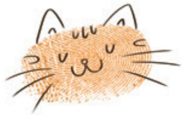

选一个开头，展开想象，大家一起接龙编故事。

夏天到了，虫子王国一片沸腾。瞌睡虫们纷纷飞出洞口，去寻找自己的朋友…

◇ 一阵大风过后，小牧童被吹到了颠倒村。他睁开眼睛，只见树枝和树叶长进土里，树根却张牙舞爪地伸向天空…

## 奇妙的想象

在想象的世界里，什么都可能发生，一切都变得那么奇妙。下面这些题目一定会激发你无穷的遐想。

选一个题目写一个想象故事，也可以写其他的想象故事。要大胆想象，创造出属于自己的想象世界。

写完后，可以跟同学交换习作。说说自己最喜欢同学写的什么内容，什么地方需要修改。

在墙报上开辟一个专栏，如“想象岛”，展示大家的习作。

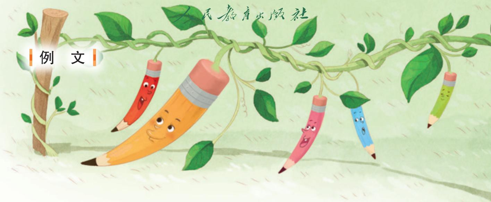

当铅笔有了梦想，它会想做些什么呢?

## 一支铅笔的梦想

想一想，一支老憋在抽屉里的铅笔，会有多少梦想？

第一个梦想，是溜出教室。知道我要做什么吗？我要到山坡上，萌出嫩嫩的芽儿；还要在头顶上，开出一朵漂亮的花儿。蝴蝶啊蜜蜂啊，就猜不出我是谁了。哈，多么好玩！多么开心！

豆角、丝瓜和铅笔一样，都是细长的。铅笔想成为“长长的豆角”“嫩嫩的丝瓜”，我觉得这样的想象自然、合理。

第二个梦想，是跳进荷塘里。知道我要做什么吗？我要为小鱼虾，撑起阴凉的伞；伞上，还趴着大眼睛青蛙。有的在伞上歌唱，有的在伞下玩耍。哈，多么好玩！多么开心！

第三个梦想，是躲到菜园里去。知道我要做什wěi么吗？我要在青叶间，长成长长的豆角；或者，伪装成嫩嫩的丝瓜。菜园里的派对马上开始！哈，多么好玩！多么开心！

## 人民教育出版社

第四个梦想，是来到小溪边。知道我要做什么gāo吗？我要为玩水的鸟当船篙，为过河的蚂蚁当木fá筏。船上的、岸边的一齐喝彩！哈，多么好玩！多么开心！

第五个梦想，是跑到运动场上。知道我要做什么吗？我要当一会儿小松鼠的撑竿，当一阵儿小猴biāo jiǎng子的标枪。挂在脖子上的奖牌亮闪闪的。哈，多么好玩！多么开心！

谁也不知道，一支铅笔有多少梦想……就像种在gǎo稿纸上的字，发多少芽，开多少花，结多少童话。

铅笔想为小松鼠当撑竿，为小猴子当标枪。它为什么会这样想呢？

铅笔还会有哪些梦想？仿照课文说一说。

## 尾巴它有一只猫①

有一条尾巴，它很自豪地说：“我拥有一只猫！”

拥有一只猫，这条尾巴真不得了。可是，一条尾巴怎么能拥有一只猫呢？难道，它把猫养在家里，或者把它关在笼子里，或者……哎，真是想不出来。

猫有尾巴，尾巴怎么能有一只猫呢？

“用不着关，”这条尾巴得意地说，“我从出生开始，就拥有这只猫，无论它干什么，都听我的话，都跟在我身边。”

尾巴那么小，它的猫应该特别特别小。会不会

就是一只跳蚤？

“跳蚤怎么会是猫呢？”尾巴说，“我这只猫特别guāi乖，我天天骑着它满地跑。”

尾巴上的跳蚤听见它的话，哈哈大笑：“如果你有一只猫，那你为什么还跟着它到处跑？是猫有你这条尾巴，而不是你这条尾巴有一只猫。”

像这样反方向去想象，尾巴就能有一只猫了。真有意思！

尾巴坚持自己的想法：“我就是有一只猫。我跟着它跑是因为我乐意。你看看小孩子，个个当爸爸妈妈的小尾巴，跟着他们跑。难道只能是爸爸妈妈有小孩子，不能是小孩子有爸爸妈妈吗？猫可以有一条尾巴，为什么尾巴就不能有一只猫？”

另一条尾巴听到了，高兴地说：“哎呀，原来我有一只狗哇，真好！”原来，它是一条狗的尾巴。

狗生气了吗？没有，因为它也听见了猫尾巴的话。它跟在主人的身后，高兴地想：“对呀，原来我有一个人，真神奇！”

“尾巴它有一只猫”“喜欢睡觉的风”……你还想到了什么新鲜有趣的说法？展开想象说一说。

第六单元

在童年的百花园里，我们看到了真善美。

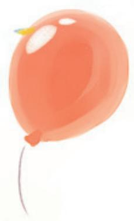

▲品味多彩童年，感受美好的童心。

运用多种方法理解难懂的句子。

写一个身边的人，尝试写出这个人的特点。

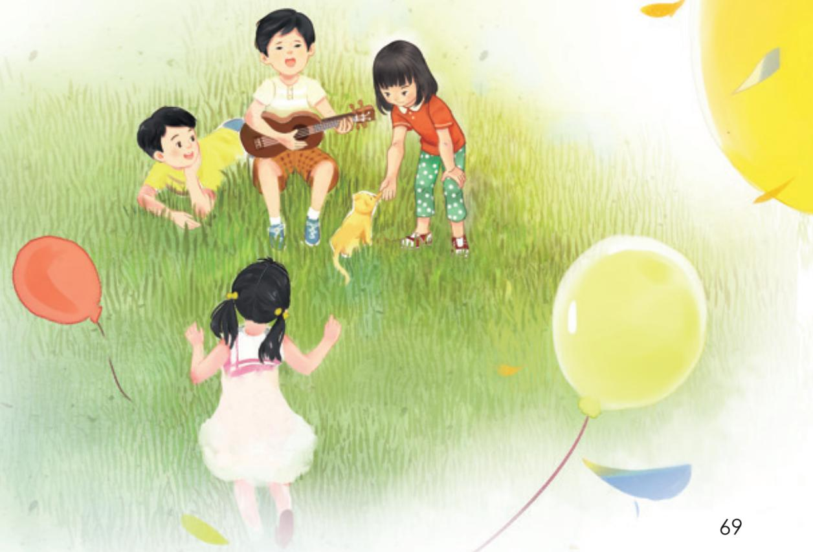

## 阅读

## mò童年的水墨画

## 溪 边

垂柳把溪水当作梳妆的镜子，  
山溪像绿玉带一样平静。rǎn  
人影给溪水染绿了，  
钓竿上立着一只红蜻蜓。suì  
忽然扑腾一声人影碎了，  
草地上蹦跳着鱼儿和笑声。

## 江上

像刚下水的鸭群，  
扇动翅膀拍水戏耍。  
一双双小手拨动着浪花，  
jiàn  
你拨我溅笑哈哈。  
是哪个“水葫芦”一下钻入水中，出水时只见一阵水花两排银牙。

## 林 中

松树刚洗过澡一身清清爽爽，  
松针上一串串雨珠明明亮亮。  
小蘑菇钻出泥土戴一顶斗笠，  
像一朵朵山花在树下开放。  
是谁一声欢叫把雨珠抖落，  
只见松林里一个个斗笠像蘑菇一样。

# mò rǎn suì jiàn 墨染碎溅

垂染碎翅膀拨浪抖

朗读课文。说说你在溪边、江上、林中分别看到了怎样的画面。

联系上下文，说说下面诗句的意思。

◇人影给溪水染绿了。

◇只见松林里一个个斗笠像蘑菇一样。

# 19 肥皂泡 1

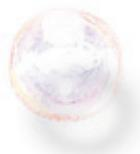

小的时候，游戏的种类很多，其中我最爱玩的是吹肥皂泡。

láng

下雨的时节，不能到山上海边去玩，母亲总教我们在廊子上吹肥皂泡。她说阴雨时节天气潮湿，肥皂泡不容易破裂。

shèng

方法是把用剩的碎肥皂放在一只小木碗里，加上点儿水，huò róng tào zhàn nián和弄和弄，使它溶化，然后用一支竹笔套管，蘸上那黏稠的肥皂水，慢慢地吹起，吹成一个轻圆的网球大小的泡儿，

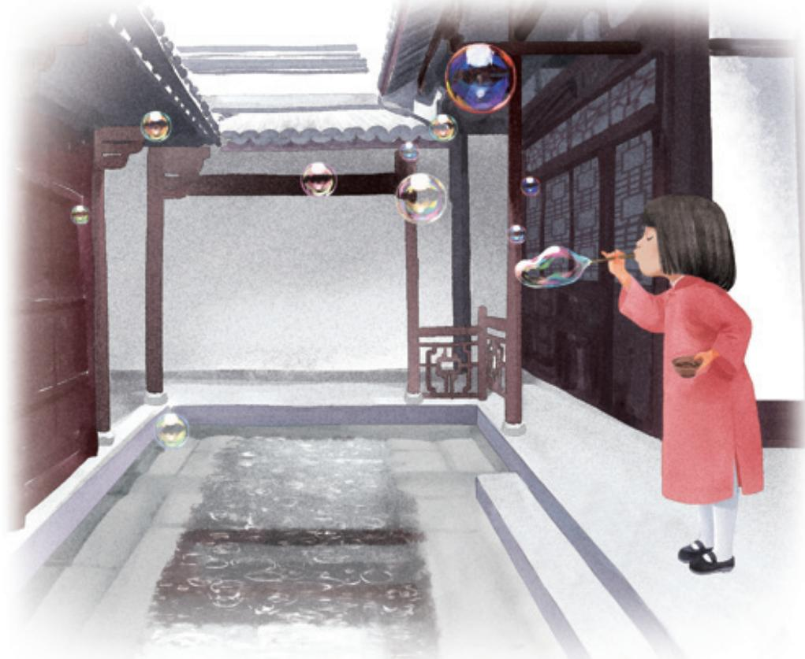  
①本文作者冰心（1900—1999)，选作课文时有改动。

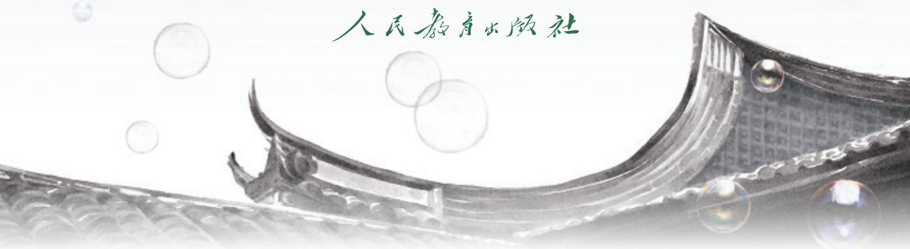

再轻轻地一提，那轻圆的球儿便从管上落了下来，软悠悠地ruò  
在空中飘游。若用扇子在下面轻轻地扇送，有时能飞得很高  
很高。

这肥皂泡，吹起来很美丽，五色的浮光，在那轻清透明línglóng的球面上乱转。若是扇得好，一个大球会分裂成两三个玲珑娇软的小球，四散分飞。有时吹得太大了，扇得太急了，这chàn wēi脆薄的球，会扯成长圆的形式，颤巍巍的，光影零乱。这xuán bǐng时大家都悬着心，仰着头，屏住呼吸，不久，这光丽的薄球就无声地散裂了，肥皂水落了下来，洒到眼睛里，大家róu都忽然低了头，揉出了眼泪。

那一个个轻清脆丽的小球，像一串美丽的梦，是我们自己小心地轻轻吹起的，吹了起来，又轻轻地飞起，是那么圆满，那么自由，那么透明，那么美丽。借着扇子的轻风，把她们一个个送上天去送过海去。到天上，轻轻地挨着明月，渡过天河跟着夕阳西去。或者轻悠悠地飘过大海，飞越山diān yīng巅，又低低地落下，落到一个熟睡中的婴儿的头发上……目送着她们，我心里充满了快乐、骄傲与希望。

# shèng huò róng tào ruò xuán bǐng diān yīng 剩和溶套若悬屏巅婴

皂泡类弄溶

套悠若骄傲

朗读课文。用自己的话说说“我”吹肥皂泡的过程。

课文中有一些句子不容易读懂，如，“五色的浮光，在那轻清透明的球面上乱转”。在课文中找一找，结合生活经验说说这些句子的意思。

读句子，体会丰富的想象，再想一想：这些轻清脆丽的小球，还有哪些美好的去处呢？

借着扇子的轻风，把她们一个个送上天去送过海去。

到天上，轻轻地挨着明月，渡过天河跟着夕阳西去。

或者轻悠悠地飘过大海，飞越山巅，又低低地落下，落到一个熟睡中的婴儿的头发上…

## 资料袋

冰心，原名谢婉莹，现代散文家、诗人。她的作品充满了对大自然的赞美，以及对母爱与童真的歌颂，如《繁星》《春水》《寄小读者》。

# 20灰雀

有一年冬天，列宁在郊外养病。他每天到公园散步。公xiōng pú园里有一棵高大的白桦树，树上有三只灰雀：两只胸脯是粉wǎn红的，一只胸脯是深红的。它们在树枝间来回跳动，婉转地rě歌唱，非常惹人喜爱。列宁每次走到白桦树下，都要停下来，仰望这三只欢快的灰雀，还经常给它们带来面包渣和谷粒。

一天，列宁又来到公园，走到白桦树下，发现那只胸脯深红的灰雀不见了。他在周围的树林中找遍了，也没有找到。

这时，列宁看见一个小男孩，就问：“孩子，你看见过一只深红色胸脯的灰雀吗？”

男孩说：“没……我没看见。”

列宁说：“一定是飞走了或者是冻死了。天气严寒，它怕冷。”

那个男孩本来想告诉列宁灰雀没有死，但又不敢讲。

列宁自言自语地说：“多好的灰雀呀，可惜再也飞不回来了。”

男孩看看列宁，说：“会飞回来的，一定会飞回来的。它还活着。”

列宁问：“会飞回来？”

“一定会飞回来！”男孩肯定地说。

第二天，列宁来到白桦树下，果然又看到那只灰雀欢蹦乱跳地在枝头歌唱。那个男孩站在白桦树旁，低着头。

列宁看看男孩，又看看灰雀，微笑着说：“你好！灰雀，昨天你到哪儿去了？”

当然，灰雀没有告诉列宁昨天它去哪儿了。列宁也没再问那个男孩，因为他已经知道，男孩是诚实的。

xiōng pú wǎn rě 胸脯婉惹

雀养粉惹 仰 粒 遍 百 日

分角色朗读课文，读出对话的语气。

默读课文，想一想：列宁和小男孩在对话的时候，他们各自心里想的是什么？

联系课文内容，说说你对课文最后一句话的理解。

# ②1我不能失信①

孔子说：“人而无信，不知其可也。”在现实生活中，一个人要做到时时处处守信并不容易。默读课文，结合生活经验，说说你对下面句子的理解：“一个人在家，是很没劲。可是，我并不后悔，因为我没有失信。”

yào

一个风和日丽的早晨，宋耀如一家用过早餐，准备到一位朋友家去做客。二女儿宋庆龄特别高兴，她早就盼着到这位伯伯家去了。伯伯家养的鸽子，尖尖的嘴巴，红红的眼睛，漂亮极啦！伯伯还说准备送她一只呢！

她刚走到门口，突然停住了脚步，皱起了眉头。

爸爸看见了，奇怪地问：“庆龄，你怎么不走啦？”

“爸爸，我不能去了！我昨天和小珍约好了，今天她来dié我们家，我教她叠花篮。”庆龄说。

“你不是一直想去伯伯家吗？改天再教小珍吧。”爸爸说完，拉起庆龄的手就要走。

“不行！不行！我走了，小珍来了会扑空的，那多不好啊！”庆龄边说边把手抽回来。

“那……回来你去小珍家解释一下，表示歉意，改天再

教她叠花篮，好不好？”妈妈在一旁说。

“不，妈妈。您说过，nuò  
做人要信守诺言。如果我  
忘记了这件事，见到她时  
向她道歉是可以的，但我  
已经想起来了，就不能失  
信了！”庆龄坚定地说。

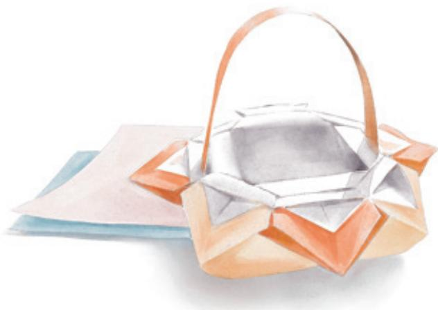

“我明白了，我们的庆龄是个守信用的孩子。”妈妈望着庆龄笑了笑，说，“那你就留下来吧！”

送家里人出门后，庆龄一个人回到房间里，耐心地等候着。她一会儿拿起一本书看，一会儿又坐到琴凳上弹钢琴，平时很熟的曲子，今天却总是弹不准。可是，直到家里人吃过午饭回来，小珍也没有来。妈妈心疼地说：“我的女儿一个人在家，该多没意思啊！”庆龄仰起脸回答道：“一个人在家，是很没劲。可是，我并不后悔，因为我没有失信。”

yào shì qiàn nuò 耀示歉诺

## 口语交际

## 应该怎样安排座位

每隔一段时间，班里就要调整座位。应该怎样调整呢？每个人可能都有自己的想法。

我觉得个子矮的同学可以坐前面，个子高的同学坐后面，这样每个人都能看清楚黑板。

前后排同学的座位应该定期轮换，有利于保护大家的视力。

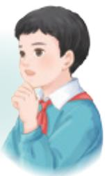

如果教室里的桌椅能分小组摆放就好了，这样更方便小组讨论和开展活动。

怎样安排座位更合适，大家来讨论一下吧。发言的时候先表明自己的观点，再说清楚理由。

讨论后，大家一起总结几条建议，供老师安排座位时参考。

O 认真倾听，想想别人的建议是否有道理。

表达观点时要注意尊重不同的想法。

围绕以上问题和同学交流，然后选一个人写一写。

## 身边那些有特点的人

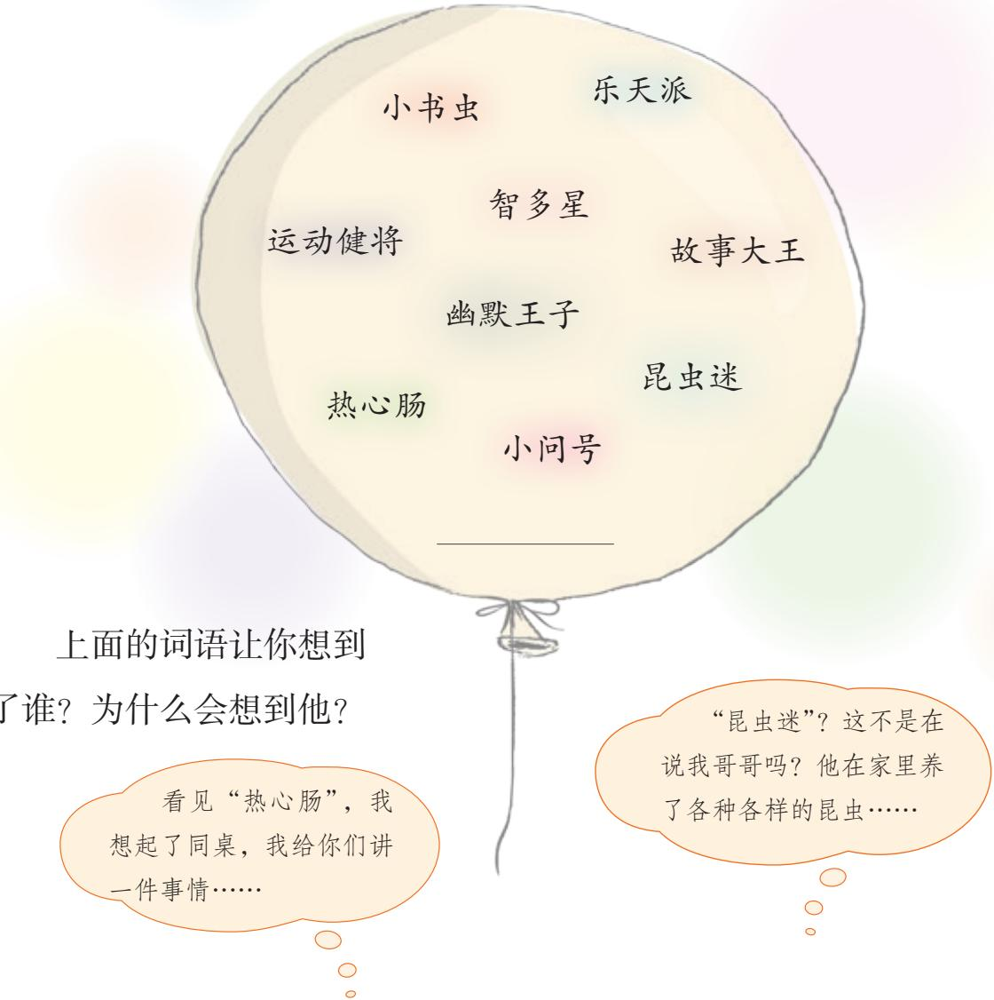  
你还想到了哪些类似的词语？这些词语可以用来形容哪些人？

写完后取个题目，用上表示人物特点的词语，如“我们班的昆虫迷”“家有智多星”“飞毛腿小阳”。

如果有可能，还可以给你写的那个人看看，听听他的评价。

# 语文园地

## 梳理与交流

阅读时，你用什么方法理解难懂的句子？和同学交流。

我发现，理解难懂的句子和理解难懂的词语，方法比较接近。

结合生活经验，我理解了《肥皂泡》里“有时吹得太大了，扇得太急了，这脆薄的球，会扯成长圆的形式，颤巍巍的，光影零乱”这句话，因为我吹泡泡时，就看到过这样的情景。

联系上下文，我知道了“只见松林里一个个斗笠像蘑菇一样”原来是在写孩子们的样子。

理解难懂的句子，还可以查查资料，或者向别人请教。

## 识字加油站

读一读，说说你想象到的画面。

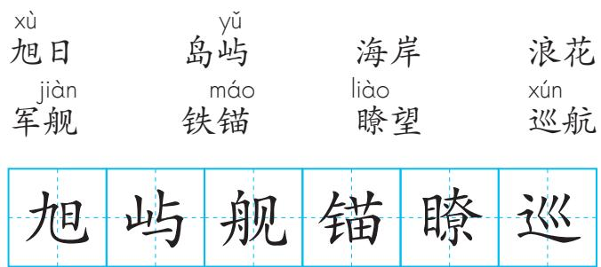

## 词句段运用

读一读，说说两组加点词语的意思。

米饭没熟，还要再蒸一会儿。

平时很熟的曲子，今天却总是弹不准。

我很喜欢苹果的味道。

这本书越看越有味道。

读读下面的寻物启事，注意格式，照样子写一写。

## 寻物启事

昨天下午放学后，我把一件蓝色外套落在了操场上。如果有人捡到，请与我联系。非常感谢！

三年级（1）班 李晓宇5月20日

## 日积月累

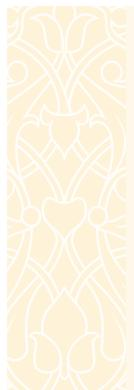

见善则迁，有过则改。 《周易》

过而不改，是谓过矣。 —《论语》

人谁无过？过而能改，善莫大焉。

# 第七单元

天地间隐藏着无穷无尽的奥秘，等待我们去发现。

发现世界之美，领略大自然的奇妙。

阅读写景的文章，了解所描写景物的特点。

初步学习整合信息，介绍一种事物。

# 22 火烧云

晚饭过后，火烧云上来了。霞光照得小孩子的脸红红的。tán  
大白狗变成红的了。红公鸡变成金的了。黑母鸡变成紫檀色zhū yíng  
的了。喂猪的老头儿在墙根靠着，笑盈盈地看着他的两头小  
白猪变成小金猪了。他刚想说“你们也变了……”，旁边走来  
个乘凉的人对他说：“您老人家必要高寿，您老是金胡子了。”

tóng

天上的云从西边一直烧到东边，红彤彤的，好像是天空着了火。

这地方的火烧云变化极多，一会儿红彤彤的，一会儿金灿灿的，一会儿半紫半黄，一会儿半灰半百合色。葡萄灰、梨黄、茄子紫，这些颜色天空都有。还有些说也说不出来、见也没见过的颜色。

① 本文选自《呼兰河传》，作者萧红(1911—1942)，有改动。

一会儿，天空出现一匹马，马头向南，马尾向西。马是guì跪着的，像等人骑上它的背，它才站起来似的。过了两三秒钟，那匹马大起来了，腿伸开了，脖子也长了，尾巴却不见了。看的人正在寻找马尾巴，那匹马变模糊了。

忽然又来了一条大狗。那条狗十分凶猛，在向前跑，后边似乎还跟着好几条小狗。跑着跑着，小狗不知哪里去了大狗也不见了。

miào

接着又来了一头大狮子，跟庙门前的石头狮子一模一zhèn样，也那么大，也那样蹲着，很威武很镇静地蹲着。可是一转眼就变了，再也找不着了。

huǎng hū

一时恍恍惚惚的，天空里又像这个又像那个，其实什么róu也不像，什么也看不清了。必须低下头，揉一揉眼睛，沉静piān一会儿再看。可是天空偏偏不等待那些爱好它的孩子。一会儿工夫，火烧云就下去了。

# tán zhū yíng tóng guì miào zhèn róu piān 檀猪盈彤跪庙镇揉偏

# 烧盈乘寿彤

# 颜钟武镇偏

朗读课文。背诵第3\~6自然段。

说说课文写了火烧云的哪些特点，你是从哪些语句了解到的。

读读下面这些表示颜色的词语，再说几个类似的。

红彤彤金灿灿

葡萄灰 茄子紫

半紫半黄半灰半百合色

## 资料袋

萧红，现代小说家，代表作有小说《生死场》《呼兰河传》《马伯乐》等。《呼兰河传》以童年生活的回忆为线索，描绘了一幅20世纪20年代呼兰小城的风俗画。

# ②③ 暴风雨来临之前

mèn

空气越来越沉闷，太阳被云遮住了，天空黑了。奇形怪màn yán状的乌云从西边的天空蔓延过来，很快就要到村子的上空hūn了，树木和草全都变得昏暗了。

一切都显得很不安。牛低着头。马摇着尾巴，鼻子不停 zōng 地呼气，鬃毛摆来摆去。

xiōng bī

乌云气势汹汹地逼近了。很远的地方发出了轻微的响声。一会儿，声音停止了，一切又都沉寂下来，好像在等待kuàng什么不平常的情况。平时爱在阳光下唱着歌到处飞来飞去的wēng鸟儿，现在到哪里去了？平时爱在草丛里嗡嗡叫的昆虫，现在又到哪里去了？什么东西都躲起来了，一点儿动静都没有。树枝不摇，树叶也不动了。

天空划过一道闪电。村子里的人都急急忙忙地收拾东西，要在雷雨以前赶回家。

bào

新鲜的微风像是最初的报信者，从树林那边轻轻地吹过来，凉凉地吹在急急赶路的人们的脸上。它吹过树叶微微抖动的树梢。地上的尘土被轻轻地吹起来，又悄悄地落到树丛里。

凉风过去之后，大风跟着来了。它吹进了村子，把村子里的公鸡和母鸡吹得乱跑，把它们的羽毛也吹得乱蓬蓬的。

大风过去之后，又是一片寂静。

突然，轰隆隆的雷声震响了天空，它告诉人们，暴风雨来了。

mèn màn yán hūn xiōng kuàng bào lōng 闷蔓延昏汹况报隆

临 越闷昏 暗 况报梢 隆

默读课文，边读边想象画面。

在暴风雨来临之前，起风前和起风后的景象有什么不同？各有什么特点？

选做

你见过暴风雨吗？当时的情景是怎样的？和同学交流。

# 我们奇妙的世界

这是一个奇妙的世界，一切看上去都是有生命的。

你看天空的珍藏——

清晨，太阳升起，带来新的一天。开始，天空呈粉红wèi色，慢慢地变成了蔚蓝色，太阳就像一个大火球一样升起来了。

有时，云彩在蓝色的天空中飞行，如同经过雕饰一样，呈现出各种奇妙的形状，告诉我们许多奇妙的故事……

当云彩变得又黑又重时，雨点就会噼噼啪啪地降落到大地上。

雨后，我们会看到地上有许多水洼，就像有趣的镜子，映射着我们的脸。

一天结束了，落日的余晖不时变幻着颜色，好像有谁在天空涂上了金色、红色和紫色。

黑夜降临了，我们看见夜空中群星闪烁，就像千千万万là zhú支极小的蜡烛在发光。

再看大地的珍藏——

我们能看到植物生长的奇迹——极小的一粒种子种到地里，生根，发芽，不久就开花了，花很漂亮。

我们能看到各种颜色诱人的水果，圆润的鲜红色的樱桃，深紫色的李子，浅黄色的梨。

夏日，在大树下乘凉，我们会感叹，大树带来这么多绿荫。

秋天带着金黄色的光辉神奇地到来了，那时，道路上好máng像洒满了光芒。蝴蝶张开漂亮的翅膀在空中翩翩起舞。

鸟儿为了建造它们的房子，衔着泥土振翅飞翔。

我们领略秋风的劲吹——树枝颤动，树叶飘落。

yán zhù

冬天，我们看到了房檐上垂下的冰柱，它们好像一把把jiàn锋利的刀剑在阳光下闪耀。等到积雪融化时，从房檐上落下的小水滴，就像一颗颗珍珠。

只要我们仔细地观察、寻找，就能从极普通的事物中wéi找到美——各种形状的卵石，三桅小船的模型，颜色各异的羽毛。

是的，世界上奇妙的事物是无穷的，只要我们去寻找。

# chéng wèi diāo wā shuò là zhú máng lüè jìng zhù jiàn 呈蔚雕洼烁蜡烛芒略劲柱剑

# 呈幻李夏辉芒建柱剑

有感情地朗读课文。说说你从哪里体会到了世界的“奇妙”。

结合生活经验，说说你对“一切看上去都是有生命的”这句话的理解。

## 小练笔

读下面的句子，感受这些普通而又美好的事物，再照样子写一写你在大自然中的发现。

雨后，我们会看到地上有许多水洼，就像有趣的镜子，映射着我们的脸。

口 黑夜降临了，我们看见夜空中群星闪烁，就像千千万万支极小的蜡烛在发光。

夏日，在大树下乘凉，我们会感叹，大树带来这么多绿荫。

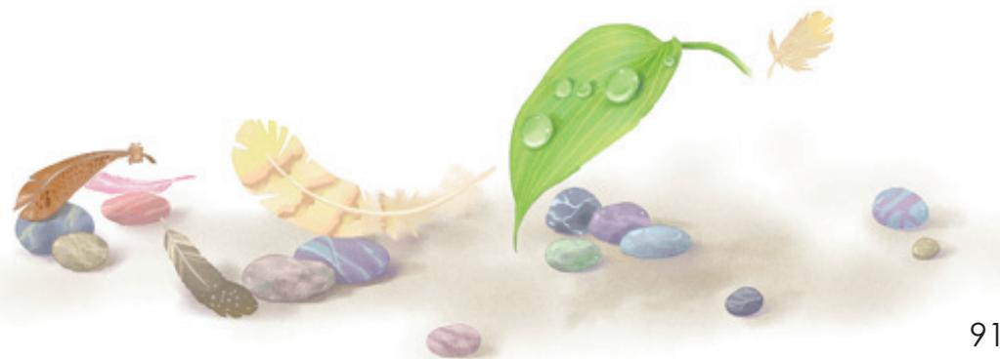

## 国宝大熊猫

大熊猫人见人爱，是我们的国宝。许多小朋友想更多地了解大熊猫，可能有些疑问需要解答：

大熊猫是猫吗？

大熊猫生活在什么地方？

◇ 大熊猫为什么被视为中国的国宝？

…

这次习作，就让我们围绕这些问题，介绍一下大熊猫。

可以参考下面图表中提供的信息，也可以再查找资料，补充其他内容。

<table><tr><td>名称</td><td>大熊猫</td></tr><tr><td>类别</td><td>哺乳动物</td></tr><tr><td>食物</td><td>爱吃竹叶、竹笋等，有时也吃肉</td></tr><tr><td>分布地区</td><td>四川、陕西和甘肃等地 </td></tr><tr><td></td><td></td></tr></table>

写完后，自己读一读，看看需不需要补充新内容。还可以跟同学交换习作，互相检查对大熊猫的介绍是否准确。如果有内容不准确、表达不通顺、标点使用不合理等问题，试着用学过的修改符号改一改。

# 语文园地

## 梳理与交流

你在平时积累了哪些有新鲜感的写景词句？和同学交流你的摘抄本，再结合习作，说说你是怎样运用这些词句的。

金黄的落叶在秋风中翩翩起舞。

我积累了“翩翩起舞”这个词，觉得用在这里很合适。

7黑夜降临了，我们看见夜空中群星闪烁，就像千千万万支极小的蜡烛在发光。

清晨到来了，我们看见太阳从遥远的天边升起，就像一个刚刚点燃的大火球。

这是我仿写的句子。

## 词句段运用

读一读，记一记，再说几个描写四季特点的词语。

花红柳绿 莺歌燕舞 百鸟争鸣 百花齐放五谷丰登 硕果累累 天高云淡 秋高气爽

下面的例句是分别围绕一个意思写的。读一读，再选一个开头照样子写一写。

这地方的火烧云变化极多，一会儿红彤彤的，一会儿金灿灿的，一会儿半紫半黄，一会儿半灰半百合色。

伯伯家养的鸽子，尖尖的嘴巴，红红的眼睛，漂亮极啦！

◇雨下得真大…… ◇小丽多才多艺……

## 书写提示

<table><tr><td rowspan=2 colspan=1>」</td><td rowspan=1 colspan=1>L</td><td rowspan=1 colspan=1></td><td rowspan=1 colspan=1></td><td rowspan=1 colspan=1></td><td rowspan=1 colspan=1></td><td rowspan=1 colspan=1></td><td rowspan=1 colspan=1></td></tr><tr><td rowspan=1 colspan=1></td><td rowspan=1 colspan=1></td><td rowspan=1 colspan=1></td><td rowspan=1 colspan=1>3</td><td rowspan=1 colspan=1></td><td rowspan=1 colspan=1></td><td rowspan=1 colspan=1></td></tr><tr><td rowspan=1 colspan=1></td><td rowspan=1 colspan=1></td><td rowspan=1 colspan=1></td><td rowspan=1 colspan=1></td><td rowspan=1 colspan=1></td><td rowspan=1 colspan=1></td><td rowspan=1 colspan=1></td><td rowspan=1 colspan=1></td></tr><tr><td rowspan=1 colspan=1></td><td rowspan=1 colspan=1></td><td rowspan=1 colspan=1></td><td rowspan=1 colspan=1></td><td rowspan=1 colspan=1></td><td rowspan=1 colspan=1>厂</td><td rowspan=1 colspan=1></td><td rowspan=1 colspan=1></td></tr></table>

笔画较少的字，要把笔画写开一些。

笔画较多的字， 要把笔画写得短小 些，缩小笔画间距。

<table><tr><td rowspan=1 colspan=1></td><td rowspan=1 colspan=1></td><td rowspan=1 colspan=1></td><td rowspan=1 colspan=2>仙</td><td rowspan=1 colspan=1></td><td rowspan=1 colspan=1></td></tr><tr><td rowspan=1 colspan=1></td><td rowspan=1 colspan=1></td><td rowspan=1 colspan=1></td><td rowspan=1 colspan=2></td><td rowspan=1 colspan=1></td><td rowspan=1 colspan=1></td></tr><tr><td rowspan=2 colspan=1>颜颜</td><td rowspan=1 colspan=1></td><td rowspan=1 colspan=1></td><td rowspan=1 colspan=2>暴</td><td rowspan=1 colspan=1></td><td rowspan=1 colspan=1></td></tr><tr><td rowspan=1 colspan=1></td><td rowspan=1 colspan=1></td><td rowspan=1 colspan=1></td><td rowspan=1 colspan=1>公</td><td rowspan=1 colspan=1></td><td rowspan=1 colspan=1></td></tr></table>

## 日积月累

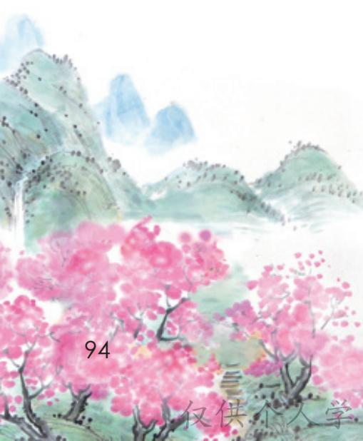

## 大林寺桃花

[唐]白居易

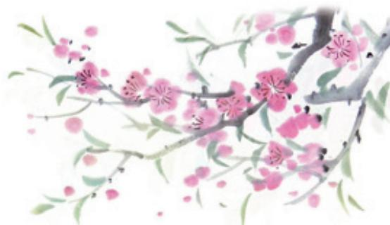

人间四月芳菲尽，山寺桃花始盛开。长恨春归无觅处，不知转入此中来。

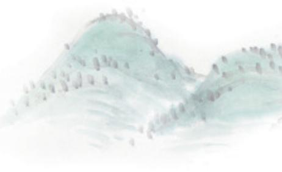

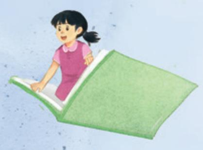

# 第八单元

有趣的故事，留下的不仅是开心的笑声，还有许多的思考。

▲走进趣味故事，增长生活智慧。

了解故事的主要内容，复述故事。

根据提示，展开想象，尝试编童话故事。

## féng ②5 慢性子裁缝和急性子顾客

故事发生在冬天。裁缝店里走进一位顾客。

顾客把一卷布料放到桌上，对裁缝说：“我想做件棉袄。我已经跑了三家裁缝店了。第一家说要到秋天才能做好。第二家fù问我有没有等到夏天的耐心。第三位师傅倒是强些，但他最早也要到开春才能交货。我可等不及，都没让他们做。告诉您，我和别的顾客不一样，我是个性子最急的顾客。请问师傅，您准备让我什么时候来取衣服—秋天？夏天？春天？……”

“不，”裁缝说，“就在冬天。”

裁缝又补充一句：“不过，我指的是明年冬天。”

顾客噌的一下子跳起来：“这么慢啊！”

裁缝说：“我和别的裁缝不一样，我是个性子最慢的裁缝啊。”

“那就算啦，我还是去找刚才的师傅吧。”顾客夹起布料就要走。

“别走，”裁缝把顾客叫住，“我知道您是个急性子。依我看，我做的活儿最适合您这种性子的顾客啦。’

nà

急性子顾客挺纳闷：“为什么？”

“照您的性子，您肯定会一拿到衣服就穿在身上，不是吗？”裁缝说。

顾客说：“那当然。我可不愿意把新衣服藏在箱子里。’

裁缝说：“那么，您要是在别的季节拿到新棉袄，也肯定会由着性子穿上。可是您无论在秋天、夏天还是春天穿一件棉袄，人家都会笑话您的。我呢，决不会让人笑话您。非但如此，在您穿上我做的美观大方的新棉袄的时候，大家还kuājiǎng xiàn会围着您直夸奖，甚至羡慕您呢。”

这位顾客歪着头想了想，不得不承认裁缝说得有道理。于是，做衣服的事儿就算说定了。

不料，这位顾客第二天又跑到裁缝店来，说：“我不做棉袄了！”

“等到明年冬天，时间实在太长啦。”顾客提出，“把我jiá那棉袄里的棉花拽掉，改成夹袄，让我提前在秋天就能穿上合时的新衣服吧。”

“不要棉花了，行啊。”裁缝答应了，“为您服务，没说的！”

顾客满意地走了。可是第三天他又来了。

xiù

“师傅，把我那夹袄的袖子剪去一截儿，改成夏天能穿chèn shān的短袖衬衫吧，我实在等不及了。”

裁缝点点头：“剪袖子，kā chā只要咔嚓咔嚓两剪子，好办得很，没问题。”

又过了一天，那顾客再

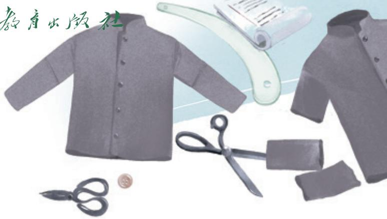

来的时候，裁缝笑着问他：“怎么，您那件短袖衬衫还能改成什么？”

顾客说：“对不起，麻烦您再给我改成春装吧。袖子嘛，把上次剪下来的再接上去就是啦。”

裁缝这回摇头了：“接上去的袖子多难看啊。”

“那您别管，只要能让我早些在春天穿上。您别忘了，我可是个急性子顾客啊。”

iu ∠E裁缝说：“亲爱的顾客，我要对您负责。我不会让您穿上这么难看的衣裳，这也坏了我的名声啊。”

顾客泄气了。但裁缝又拍拍他的肩，说：“您放心，凭我的手艺，不用接袖子也能给您做出一件最漂亮的春装。”

顾客感动极了：“那太谢谢啦。您真的不用接袖子？”

“根本不用。”裁缝解释说，“因为您的布在我的柜子里gē搁着，我还没开始裁料呢。”

顾客惊讶、恼怒地瞪大了眼睛！

“您可别忘了，”裁缝提醒他说，“我是个慢性子裁缝啊。”

此时，这位顾客会说些什么呢？

# 上 顾 奖 承 袖补 衫 负 责 人

分角色朗读课文，读出裁缝和顾客对话的语气。

默读课文，填写下面的表格，再借助表格复述这个故事。

<table><tr><td rowspan=1 colspan=1>时间</td><td rowspan=1 colspan=1>急性子顾客的要求</td><td rowspan=1 colspan=1>慢性子裁缝的反应</td></tr><tr><td rowspan=1 colspan=1>第一天</td><td rowspan=1 colspan=1></td><td rowspan=1 colspan=1></td></tr><tr><td rowspan=1 colspan=1>第二天</td><td rowspan=1 colspan=1></td><td rowspan=1 colspan=1></td></tr><tr><td rowspan=1 colspan=1>第三天</td><td rowspan=1 colspan=1></td><td rowspan=1 colspan=1></td></tr><tr><td rowspan=1 colspan=1>又过了一天</td><td rowspan=1 colspan=1></td><td rowspan=1 colspan=1></td></tr></table>

## 选做

假如裁缝是急性子，顾客是慢性子，他们之间又会发生怎样的故事呢？发挥想象，讲给同学听。

# 26 漏 ①

从前，有一户人家：一个老公公，一个老婆婆，还喂着jǐ一头黑脊背、白胸脯的小胖驴。

山上住着一只老虎，山下住着一个贼。老虎嘴馋，一心想着吃这头小胖驴；贼手痒，一心想着偷这头小胖驴。

一天晚上，下着蒙蒙小雨。老虎来了，贼也来了。老虎用爪在墙壁上抓，贼用手在屋顶上挖，不一会儿，墙被老虎抓了个窟窿，屋顶被贼挖了个窟窿。老虎钻进驴圈，贼也正想往下跳。忽然，老公公和老婆婆在里屋说起话来，老虎和贼吓得大气都不敢出了。

老公公说：“好像有什么声音在响？”

老婆婆说：“唉！管他狼哩，管他虎哩，我什么都不怕，就怕漏！

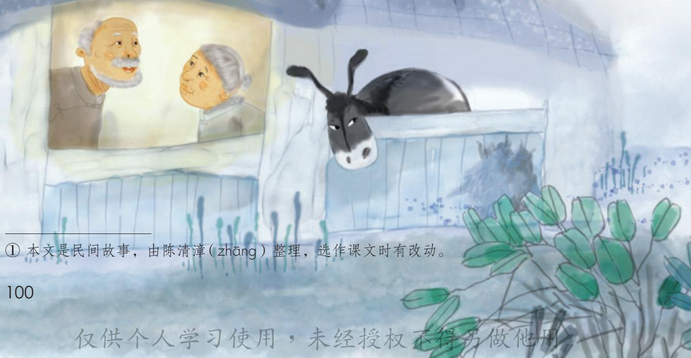

老虎趴在驴圈里想：“翻山越岭我什么都见过，就是没mò见过‘漏’，莫非‘漏’比我还厉害？”

贼蹲在屋顶上想：“走南闯北我什么都听说过，就是没听说过‘漏’，莫非‘漏’比我还厉害？”

老虎吓得浑身发抖，贼听得腿脚发软。贼心里害怕，脚下一滑，扑通从屋顶的窟窿里跌下来，正巧摔到虎背上。老虎未料到房上会有东西掉下来，心想：“坏事，‘漏’捉我来了！”撒腿就往外跑。

贼栽得晕头转向，一摸是个毛乎乎的东西，心想：“坏事，‘漏’等着吃我哩！”拼命抱住虎脖子不敢松手。

老虎驮着贼，贼骑着老虎，跑哇，跑哇，累得老虎筋都diān快断了，颠得贼骨头架都快散了。跑着跑着，雨大了起来。wāi jiāo前边有棵歪脖老树，老虎想：“漏’真厉害，像胶一样，粘cèng住我了。到树跟前，得把它蹭下来，好逃命。”

xuàn

贼也想：“漏’真厉害，旋风一样，停都不停，一定是

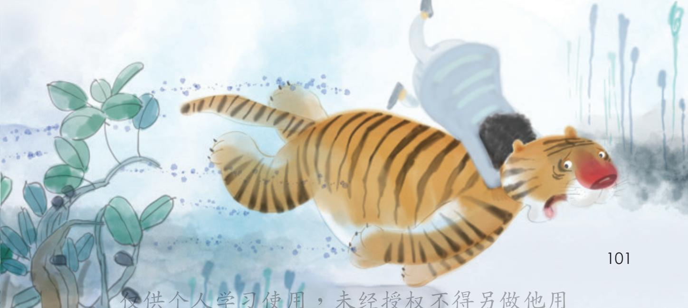

cuān

驮到家再吃我。到树跟前，得想法蹿上去，好逃命。”

zòng

到了树跟前，老虎把身子一歪，贼顺势一纵，蹿到树上。老虎一边往前跑一边想：“终于甩掉‘漏’了！”贼一边往上爬一边想：“终于甩掉‘漏’了！”

雨越下越大。

老虎被雨一淋，清醒了许多，想想不甘心，还是要回去吃驴，就转身往回走。

贼被雨一淋，清醒了许多，想想不甘心，还是要回去偷 驴，就下树准备往回走。

老虎走着走着，走到了歪脖老树跟前。贼又冷又饿，正在下树，看见走来一个黑乎乎的东西，心想：“漏’又来xián了，这下我可活不成了！”他赶忙往树梢上爬，总嫌离地太kā chā近，紧爬慢爬，咔嚓一声，树枝断了，一个倒栽葱摔了下来，顺着山坡往下滚。

老虎正走着，见天上掉下个黑乎乎的东西，响声又这么大，心想：“漏’又来了，这下我可活不成了！”赶紧逃跑。下过雨的山坡又湿又滑，老虎腿一软，顺着山坡往下滚。

老虎和贼一齐滚下了山坡，浑身沾满泥水，撞在了一块儿。他俩对看了一眼，同时惊恐地大喊：“漏’哇—”然后都吓昏了过去。

天快亮了，小胖驴在驴圈里安安稳稳地吃着干草。

kàng

老公公和老婆婆从炕头上坐了起来。滴答，滴答——他们抬头看看屋顶唉，说怕漏，偏就又漏雨了！

jǐ zéi mò yūn diān wāi jiāo xuàn zòng xián 脊贼莫晕颠歪胶旋纵嫌

漏胖驴爪莫厉

害闯摸歪胶纵

默读课文，说说故事中的哪些内容你觉得有意思。

选择喜欢的部分，和同学分角色朗读，体会故事的趣味。

借助下面的示意图和文字提示，按照地点变化的顺序，复述这个故事。

老公公老婆婆说“漏”，吓跑了虎和贼。

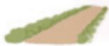

虎驮着贼，贼骑着虎。

虎甩掉贼，贼蹿上树。虎和贼树下相遇，滚下山坡。

虎和贼以为对方就是“漏”，都吓昏了过去。

老公公老婆婆再说“漏”。

# hé 27枣 核 ①

默读课文，复述这个故事。如果有兴趣，试着续编故事。

古时候，在山脚下的一个村庄里有一户人家。家里只有qī夫妻两个人，他们成天盼着要个小孩，常常叹着气说：“咱哪怕有个枣核那么大的孩子也好哇！”没想到说了这个话不久，果然生了一个枣核那么大的孩子。夫妻俩欢喜得很，给孩子起了个名叫“枣核”。

diē

一年又一年，枣核一点儿也不见长。爹说：“枣核呀，你真叫我白欢喜了一场！”娘说：“枣核呀，你一点儿不见长，我真为你愁得慌！”枣核说：“爹、娘，你们不用愁，别看我人

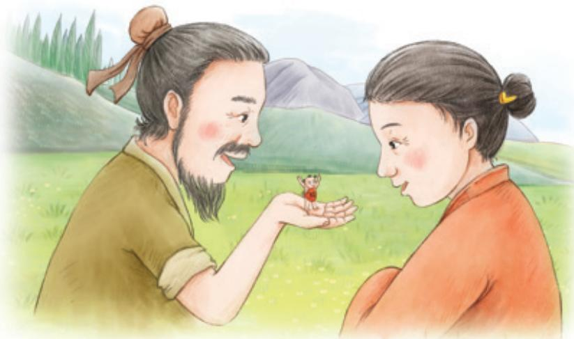

小，一样能做事情。”

枣核很勤快，天天干活，学了很多的本领。他能扶犁，能赶驴，柴比别人打得多，因为别人上不去的地方他也能上去，他一蹦就能蹦到屋脊那么高。邻居们都夸枣核，枣核的爹娘非常高兴。

cōng hán 枣核不光勤快，也很聪明。有一年大旱，庄稼没收成， yá yì nà 县衙门还派衙役向庄稼人要官粮。庄稼人纳不上粮，衙役就 把牛、驴都牵走了。

牵走了牛、驴，大伙儿愁得很。枣核说：“大家都不用lie愁，我有办法！”有的人不相信，说：“我才不信咧，你别小biàn人儿说大话啦！”枣核也不争辩，只是说：“不信，你们就等着看。”

shuān

到了晚上，枣核跑到县衙门拴牛、驴的院子外面，一蹦jiāng蹦进院子里。等衙役们睡着了，枣核解开缰绳，又一蹦蹦到yāo驴耳朵里，“哦喝！哦喝！”大声吆喝着赶驴。衙役们从梦里跳了起来，惊慌地喊着：“有人进来牵驴啦！有人进来牵sōu驴啦！”他们拿着大刀长枪到处搜人。

闹腾了一阵，衙役们什么也没搜着，刚刚躺下，又听到  
了吆喝声：“哦喝！哦喝！”于是衙役们又都跳了起来，还是zhē  
没搜到人。可刚躺下，又听到吆喝声。折腾了大半夜，衙役kùn  
们困得很，有一个衙役头子说：“不用管他，不知是个什么

东西在作怪，咱们睡咱们的觉吧。”这时候枣核从驴耳朵里shēng跳了出来，把门打开，赶着牲口回到了村子。

牲口没了，官府岂能善罢甘休。天一亮，县官就带着衙役去捉人。枣核蹦出来说：“牲口是我牵走的，你们要怎么样？”

县官叫着说：“快给我绑起来！快给我绑起来！”

衙役们拿出铁链来绑枣核，噗的一声，枣核从铁链缝里蹦了出来，站在那里哈哈大笑。衙役们急得不知怎么办才sāi dā好，县官说：“把他塞进钱褡①里，背到大堂去！”

县官坐了大堂，把惊堂木②一拍，说：“给我打！”

衙役们打这面，枣核蹦到那面去，打那面，枣核蹦到这zhàng rǎng面来，怎么也打不着。县官鼻子都气歪了，脸涨得通红，嚷道：“多加几个人，多拿几条棍，给我狠狠地打！”

枣核这次不往别处蹦，一蹦蹦到了县官的胡子上，抓着胡子荡秋千。县官直喊：“快打！快打！”衙役一棍子打下去，没打着枣核，却打着县官的下巴骨啦，把县官的牙都打了下来。满堂的人慌了起来，跑上前去照顾县官，枣核大摇大摆地走了。

## hé qī diē lí cōng hàn nà sōu zhē kùn qǐ zhàng 核妻爹犁聪旱纳搜折困岂涨

## 口语交际

## 趣味故事会

有趣的故事，大家都喜欢听。组织一次“趣味故事会”，大家都来讲讲有趣的故事吧！

选一个故事，多读几遍，记住故事的内容。

先自己试着讲讲，想想怎么讲会更吸引人。如，注意语气、表情的变化。

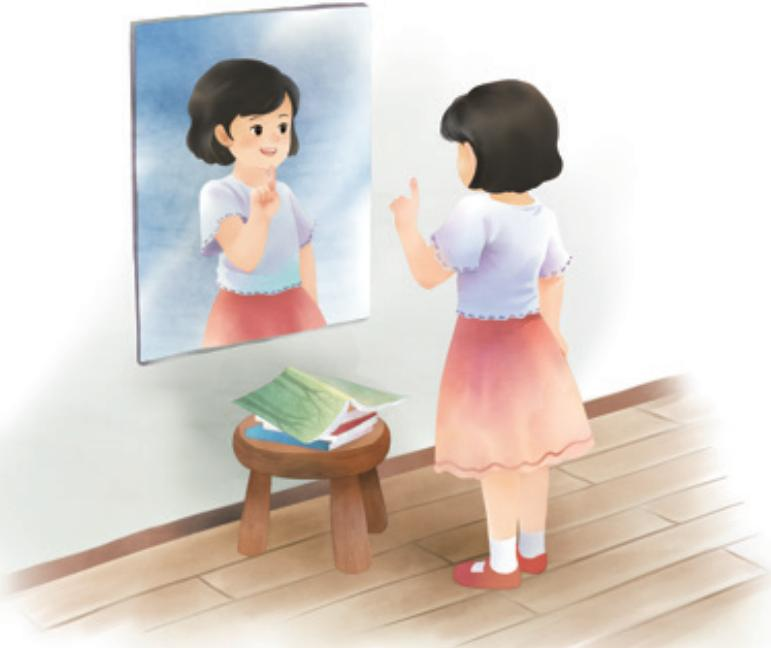

讲故事的时候要自然、大方。听故事的时候要集中注意力，认真听。听后说说故事中哪里最有趣。

讲故事时配合恰当的语气和表情。

认真听别人讲故事，记住主要内容。

## 这样想象真有趣

如果母鸡能在天空飞翔，如果蚂蚁的个头比树还高，如果老鹰变得胆小如鼠，如果蜗牛健步如飞，如果…这些动物的经历一定很奇特，它们的故事一定很有趣。

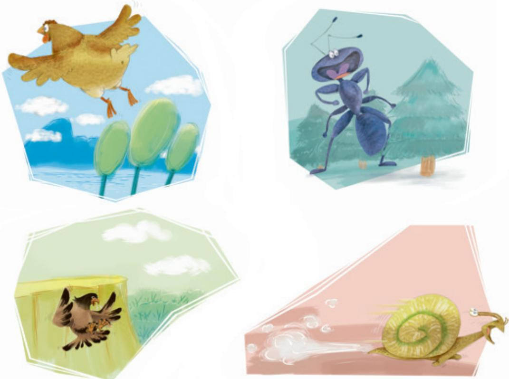

一旦动物失去了原来的主要特征，或是变得与原来完全相反.它们的生活会有什么变化？又会发生哪些奇异的事情呢？

选一种动物作为主角，大胆想象，编一个童话故事，把想象的内容写清楚。

写完后，用学过的修改符号修改自己的习作。然后在小组或班里和同学交换读，看看大家的想象有趣在哪里。

# 语文园地

## 梳理与交流

复述能帮助我们更好地理解故事内容。你在复述故事的时候，有哪些好的做法？和同学交流。

复述故事不是背诵文章，而是用自己的话把故事内容讲出来。

我会借助表格、示意图等梳理故事的主要内容，这样就能按顺序复述，重要情节也不会遗漏。

## 识字加油站

读一读，说说你发现了什么。

ké sòu láo dāo yāo   
呼吸 咳嗽 唠叨 吆喝 fěng jiè biàn   
诉说 讽刺 告诫 辩论

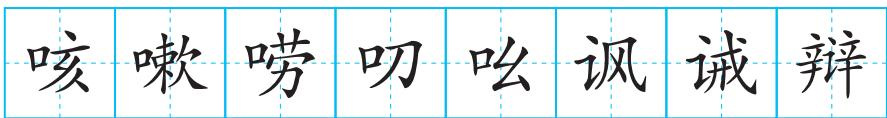

## 人民教育出版社

## 词句段运用

读一读，体会两个句子中加点部分表现的情景，再照样子写一写。

顾客噌的一下子跳起来：“这么慢啊！”

◇椰子扑通一声掉进水里。

你觉得下面的故事题目有趣吗？说几个这样的题目，和同学交流。

慢性子裁缝和急性子顾客

胖驴和瘦马

大个子兔子和小个子狼

大方的魔法师和小气的巫婆

照样子，用自己的话转述别人说的话。

裁缝说：“我和别的裁缝不一样，我是个性子最慢的裁缝啊。”

裁缝说，他和别的裁缝不一样，他是个性子最慢的裁缝。

裁缝又补充一句：“不过，我指的是明年冬天。”

老婆婆说：“唉！管他狼哩，管他虎哩，我什么都不怕，就怕漏！”

## 日积月累

◎兵来将挡，水来土掩。

不入虎穴，焉得虎子。

眼见为实，耳听为虚。

近朱者赤，近墨者黑。

## 识字表

yuān yāng huì chóng tún zēng méi 1鸳鸯惠崇豚曾梅

còu líng lì kuàng héng yì yàng juàn sǎn xiān gān hén 2凑伶俐旷横翼漾倦散纤杆痕

3挨蓬胀裳翩蜻蜓

lù zuó mǐn kuǎn mó xiā yì liàng mà bān hè 4录琢敏款膜瞎益辆蚂斑褐

bǐ yì yǐ rǒng quǎn shuì duì zhí 语文园地 匕忆艺乙冗犬税兑执

5 耕释冀

mú xùn liáng háo yóu yù jiǎo huá xiōng è xiàng hěn liè 6模驯良毫犹豫狡猾凶恶相狠猎

yún chèn zhòu pèi sā chě

7匀称皱配撒扯

tāo guàn fù diàn yōu lù píng zhé zūn xún yì zūn shuāi 8滔贯妇垫忧虑凭哲遵循逸尊衰

fǒu qiè sī jī suō miǎn chā zǎo dá bāo méi chǔ shǔ 9否窃私肌缩免差藻达胞煤储属

10证概阻误逆殊

xì shāo zhú fù qián qiào bó jiǎn jiào fù luǎn 11隙稍逐副钳翘搏捡较腹卵

mù hún jiǔ xiōng jiā 12牧魂酒兄佳

gòng yóu bèn yuè cún cài lún lěi qiē jià pián xiǎn shè 13贡尤笨阅存蔡伦累切价便鲜社

xiàn gǒng jì jiàng qì lán zhǎo dǐ zhì huì lì yí 14县拱济匠砌栏爪抵智慧历遗

zé tān fàn lì lú shèng lóng zhuài rǎo mào 15择摊贩吏驴乘笼拽扰貌

yuán zhì tóu lāo chāi jiǎo tuò 语文园地 援掷投捞拆搅拓

luó bo chóu liàng niào jiān tāo

16萝卜愁晾尿肩掏

sǎng yǎng tuǒ líng è zhèn líng cháng kěn cù chán 17嗓痒椭菱鳄震零肠啃醋馋

mò rǎn suì jiàn

18墨染碎溅

shèng huò róng tào ruò xuán bǐng diān yīng 19剩和溶套若悬屏巅婴

20 胸脯婉惹

yào shì qiàn nuò

21 耀示歉诺

xù yǔ jiàn máo liào xún 语文园地 旭屿舰锚瞭巡

tán zhū yíng tóng guì miào zhèn róu piān

22檀猪盈彤跪庙镇揉偏

mèn màn yán hūn xiōng kuàng bào lōng

23闷蔓延昏汹况报隆

chéng wèi diāo wā shuò là zhú máng lüè jìng zhù jiàn 24呈蔚雕洼烁蜡烛芒略劲柱剑

féng xiāng kuā jiǎng chéng jiá xiù chèn shān fù zé yà nǎo 25缝箱夸奖承夹袖衬衫负责讶恼

26脊贼莫晕颠歪胶旋纵嫌

hé qī diē lí cōng hàn nà sōu zhē kùn qǐ zhàng 27核妻爹犁聪旱纳搜折困岂涨

ké sòu láo dāo yāo fěng jiè biàn 语文园地 咳嗽唠叨吆讽诫辩

（共250个生字）

## 写字表

1 融燕鸳鸯惠崇芽梅泛减

2 凑泼集偶尔沾闲纤杆

3 荷紧挨蓬胀裂势微记

语文园地 匕忆艺乙冗犬税兑执

5 守株待宋耕折颈释其复

6 装驯良善伸谢尘凶恶狠猎拾

7 渴喝匀称致束配甩丧追扯叹逃

9 官否窃私汪危险肌攻免费异达

10 验证阻约括检查迷误逆陌

12 旧符牧纷魂借酒遥兄逢佳倍

13伟贡献创尤存累改价促社

14 赵桥拱济设计史坚固且栏贵历

语文园地 援掷投捞拆搅拓

16萝卜愁浓够确段系姐

17 希担容易震零肠麻烦   
18 垂染碎翅膀拨浪抖   
19 皂泡类弄溶套悠若骄傲   
20 雀养粉惹仰粒遍者惜   
语文园地 旭屿舰锚瞭巡   
22 烧盈乘寿彤颜钟武镇偏   
23 临越闷昏暗况报梢隆   
24 呈幻李夏辉芒建柱剑   
25 性顾夸奖承袖衬衫负责泄恼   
26 漏胖驴爪莫厉害闯摸歪胶纵   
语文园地 咳嗽唠叨吆讽诫辩

（共250个字）

## 词语表

2 燕子 乌黑剪刀 活泼轻风 洒落赶集

光彩夺目 春光 偶尔 閑散 纤细 电線

3 荷花 公园 清香 赶紧 荷叶 莲蓬 破裂

姿势 画家本领了不起微风 停止

语文园地〕匕首乙方冗长军犬兑换争执

6 友情 认识 忠诚 驯良善良 温和 答谢

花言巧语 着急相信尘土凶恶恶狠狠

猎人 收拾

7 痛快 匀称 精美 别致 眉头 没精打采 机灵

灰心喪氣机會嘆氣 逃生

9 宁静 器官是否 窃窃私语危险 方法 肌肉

攻击 利用 后退 免费差异 清楚奇异

10 实验验证记号减少阻力大约包括

检查至少迷失无误逆风陌生景物

能力

13 文明 伟大 贡献 祖先 创造 材料 尤其

保存吸收积累经验改进价格便宜

满足促进社会

14 闻名 设计 创举减轻不但 坚固而且

美观体现才干宝贵历史文化

语文园地援助 投掷 打捞拆分 搅动 拓展

16 胡萝卜 胡子 发愁浓密 面包 完全 结实

确定足够确实

17 希望形状喜欢担心 容易丁零失望

巧克力 香肠 花生 牛奶 互相 想念 饭菜

可能 麻烦 眼睛 秘密

18 童年 垂柳 平静 翅膀 戏耍 葫芦 松树

清爽泥土开放

19 肥皂泡 种类 其中 溶化 网球 分裂形式

圆满夕阳目送骄傲

20 养病 粉红 仰望或者 严寒本来可惜

肯定 微笑 诚实

语文园地旭日 岛屿 海岸 浪花 军舰 铁锚

瞭望巡航

22 火烧云 笑盈盈 乘凉 高寿 红彤彤 变化

金灿灿 颜色 似乎 威武 镇静 其实 沉静

偏偏等待爱好

23 来临 沉闷 奇形怪状 昏暗 轻微 情况 动静

赶路 抖动 树梢 乱蓬蓬 轰隆隆

24 奇妙生命呈现变幻圆润李子夏日

感叹 光辉神奇光芒 建造冰柱锋利

刀剑融化

25 性子 顾客 笑话 大方 夸奖 承认 提前

服务满意袖子衬衫负责名声泄气

放心手艺感动恼怒

26 莫非厉害走南闯北听说发抖害怕松手

骨头逃命甘心逃跑

语文园地呼吸 咳嗽 唠叨 吆喝 诉说 讽刺

告诫 辩论

（共271个词）

## 后记

2017年投入使用的《义务教育教科书语文》由温儒敏担任总主编，一\~六年级由陈先云、曹文轩、崔峦、李吉林担任主编。杨祎、汪军、张沛、张立霞、陆云、徐轶、曹文轩、崔峦参加三年级下册编写。2022年，教育部组建编修委员会，根据《义务教育语文课程标准（2022年版)》对教科书进行编写修订。编修委员会由温儒敏、王立军担任主任，张伯江、王荣生担任副主任。编修委员会下设修订组，负责具体修订工作。

教科书在北京、天津、内蒙古、浙江、安徽、湖北、湖南、重庆、四川等地部分学校进行了试教试用，征求了百余位专家学者和一线教帅的意见。人民教育出版社承担了教科书的编辑出版和美术设计工作。何保全、于泉滢、黄晨靓、黄晓莹为本书绘制插图，景绍宗为本书封面绘制插图。在教科书修订、编辑出版过程中，很多专家都提供过帮助，在此一并表示诚挚的谢意。

教科书需要在使用过程中不断修改完善，真诚希望广大师生和家长继续提出宝贵意见！

联系方式

电话：010-58758996

电子邮箱：jcfk@pep.com.cn

意见反馈平台：jcyjfk.pep.com.cn

YIWU JIAOYU JIAOKESHU YUWEN

语文

三年级 下册

