全国优秀教材特等奖

义务教育教科书

## 四年级

上册

人民教育出版社

# 语文

义 务 教 育 教 科 书

# 语文

# 四年级

上册

教育部组织编写

总主编  温儒敏

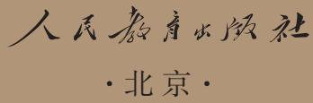

总  主  编：温儒敏

小学主编：陈先云（执行） 曹文轩 崔 峦 李吉林

编写人员：（以姓氏笔画为序）

伍新春 何致文 沈大安 张一清

陈先云 林孝杰 郑 宇 常志丹

责任编辑：常志丹 林孝杰 何致文

美术编辑：何安冉

义务教育教科书  语文  四年级  上册

教育部组织编写

出    版

（北京市海淀区中关村南大街17号院1号楼  邮编：100081）

网    址  http://www.pep.com.cn

版权所有·未经许可不得采用任何方式擅自复制或使用本产品任何部分·违者必究

如发现内容质量问题，请登录中小学教材意见反馈平台：jcyjfk.pep.com.cn

第一单元......  
1 观潮..................... ......2  
2 走月亮........... ......5  
3\* 现代诗二首...........................8  
秋晚的江上.........................8  
花牛歌............. ............9  
4\* 繁星.............. .......10  
◎ 口语交际：我们与环境.......11  
◎ 习作：推荐一个好地方......12  
◎ 语文园地..............................13  
第二单元......... .....15  
5 一个豆荚里的五粒豆...........16  
6 夜间飞行的秘密..................21  
7 呼风唤雨的世纪..................25  
8\* 蝴蝶的家.............. ...............28  
◎ 习作：我的家人...................30  
◎ 语文园地..............................31

## 目录

第三单元 ..... ....33  
9 古诗三首..............................34  
暮江吟..............  
题西林壁...........................34  
雪梅.............. ..................35  
10 爬山虎的脚..........................36  
11 蟋蟀的住宅..........................39  
◎ 口语交际：  
爱护眼睛，保护视力.......43  
◎ 习作：写观察日记..............44  
◎ 语文园地..............................45  
第四单元 ....... ...47  
12 盘古开天地..........................48  
13 精卫填海..............................50  
14 普罗米修斯..........................51  
15\* 女娲补天..............................54  
◎ 习作：我和 过一天......56

## 人民教育出版社

◎ 语文园地..............................57  
◎ 快乐读书吧：  
很久很久以前..................59  
第五单元...... ...61  
16 麻雀....... ....62  
17 爬天都峰.... ......65  
◎ 习作例文：  
我家的杏熟了..................68  
小木船..............................70  
◎ 习作：生活万花筒..............72  
第六单元.......... ........73  
18 牛和鹅........... ......74  
19 一只窝囊的大老虎..............79  
20 陀螺....... ....84  
◎ 口语交际：安慰..................89  
◎ 习作：记一次游戏..............90  
◎ 语文园地..............................91  
第七单元... ..93  
21 古诗三首..............................94  
出塞....... .......94  
凉州词.............. ........94  
夏日绝句...........................95  
22 为中华之崛起而读书...........96  
23\* 梅兰芳蓄须..........................99  
24\* 延安，我把你追寻.............104  
◎ 习作：写信.........................106  
◎ 语文园地.............................107  
第八单元... .109  
25 王戎不取道旁李.................110  
26 西门豹治邺.........................111  
27\* 故事二则.............................115  
扁鹊治病..........................115  
纪昌学射..........................116  
◎ 口语交际：  
讲历史人物故事.............118  
◎ 习作：我的心儿怦怦跳......119  
◎ 语文园地.............................120  
识字表 ......... .......123  
写字表......... ......126  
词语表...... ....128

标\*的是略读课文

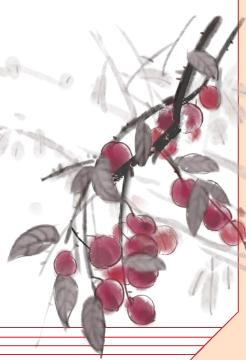

第一单元

江流天地外，山色有无中。[唐] 王维

◎ 边读边想象画面，感受自然之美。  
◎ 推荐一个好地方，写清楚推荐理由。

钱塘江大潮，自古以来被称为天下奇观。

农历八月十八是一年中传统的观潮日。这一天早上，我yán们来到了海宁市的盐官镇，据说这里是观潮最好的地方。我们随着观潮的人群，登上了海塘大堤。宽阔的钱塘江横卧在眼前。江面很平静，越往东越宽，在雨后的阳光下，笼罩着bó yì一层蒙蒙的薄雾。镇海古塔、中山亭和观潮台屹立在江边。yǐn远处，几座小山在云雾中若隐若现。江潮还没有来，海塘大áng堤上早已人山人海。大家昂首东望，等着，盼着。

lóng

午后一点左右，从远处传来隆隆的响声，好像闷雷滚dǐng fèi diǎn动。顿时人声鼎沸，有人告诉我们，潮来了！我们踮着脚往东望去，江面还是风平浪静，看不出有什么变化。过了一会儿，响声越来越大，只见东边水天相接的地方出现了一条白线，人群又沸腾起来。

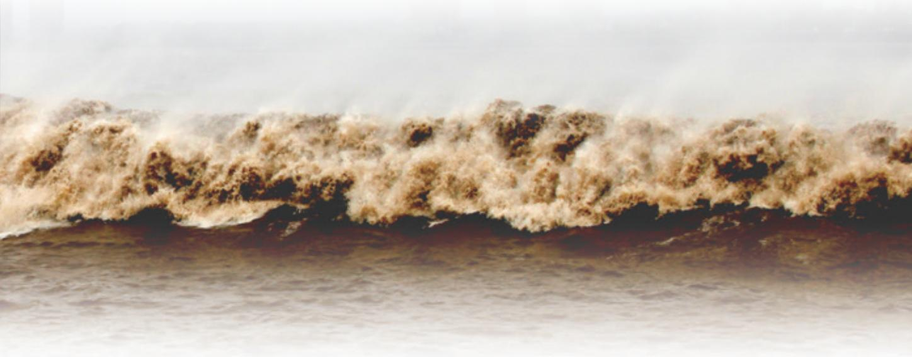

guàn

那条白线很快地向我们移来，逐渐拉长，变粗，横贯江面。再近些，只见白浪翻滚，形成一堵高高的水墙。浪

潮越来越近，犹如千万匹白色战 hào   
马齐头并进，浩浩荡荡地飞奔而 bēng   
来；那声音如同山崩地裂，好像 zhèn   
大地都被震得颤动起来。

读这段话，我仿佛看到了潮水来时的样子，听到了潮水奔腾的声音。

shà

màn

霎时，潮头奔腾西去，可是余波还在漫天卷地般涌来， huī 江面上依旧风号浪吼。过了好久，钱塘江才恢复了平静。

yán bó yì áng dǐng fèi guàn hào bēng zhèn shà yú huī 盐 薄 屹 昂 鼎 沸  贯 浩  崩 震 霎 余 恢

潮 据 堤 阔 盼 滚 顿 逐

渐 堵 犹 崩 震 霎 余

有感情地朗读课文。背诵第3〜4自然段。

说说课文是按照什么顺序描写钱塘江大潮的，你的脑海中浮现出怎样的画面，选择印象最深的和同学交流。

读下面这首诗，从课文中找出与诗的内容相关的句子。

浪淘沙（其七）

yǔ xī[唐] 刘禹锡

tāo zhàng八月涛声吼地来，头高数丈触山回。yú须臾却入海门去，卷起沙堆似雪堆。

## 资料袋

钱塘江大潮汹涌澎湃，与当地的特殊地形有关。钱塘江入海的地方叫杭州湾。杭州湾外宽内窄，呈喇叭形，东面的湾口宽达一

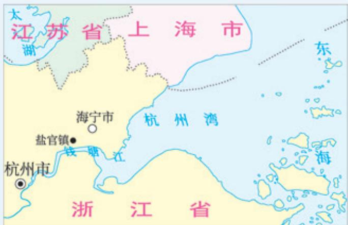

百千米，而西面海宁市盐官镇附近的江面，只有两千余米。同时，江底泥沙淤积，形成庞大的沙坎，从东往西逐渐升高，最高处在盐官镇上游。涨潮时，潮水从湾口涌入，向西奔来，受渐狭江面约束，以及水下沙坎的影响，潮越来越高，最终形成了壮观的钱塘江涌潮。

# 2 走月亮

秋天的夜晚，月亮升起来了，从洱海那边升起来了。

是在洱海里淘洗过吗？月盘是那样明亮，月光是那样柔和，照亮了高高的点苍山，照亮了村头的大青树，也照亮了，照亮了村间的大道和小路……

这时候，阿妈喜欢牵着我，在洒满月光的小路上走着，走着……啊，我和阿妈走月亮！

细细的溪水，流着山草和野花的香味，流着月光。灰é luǎn yō白色的鹅卵石布满河床。哟，卵石间有多少可爱的小水塘啊，每个小水塘都抱着一个月亮！哦，阿妈，白天你在溪里洗衣裳，而我，用树叶做小船，运载许多新鲜的花瓣……哦，阿妈，我们到溪边去吧，去看看小水塘，看看水塘里的月亮，看看我采过野花的地方。

啊，我和阿妈走月亮……

村道已经修补过，坑坑洼洼的地方已经填上碎石和新  
土。就要收庄稼了，收庄稼前，要把道路修一修，补一补，sú yuè  
这是村里的风俗。秋虫唱着，夜鸟拍打着翅膀，鱼儿跃出水là  
面，泼剌声里银光一闪……从果园那边飘来果子的甜香，是

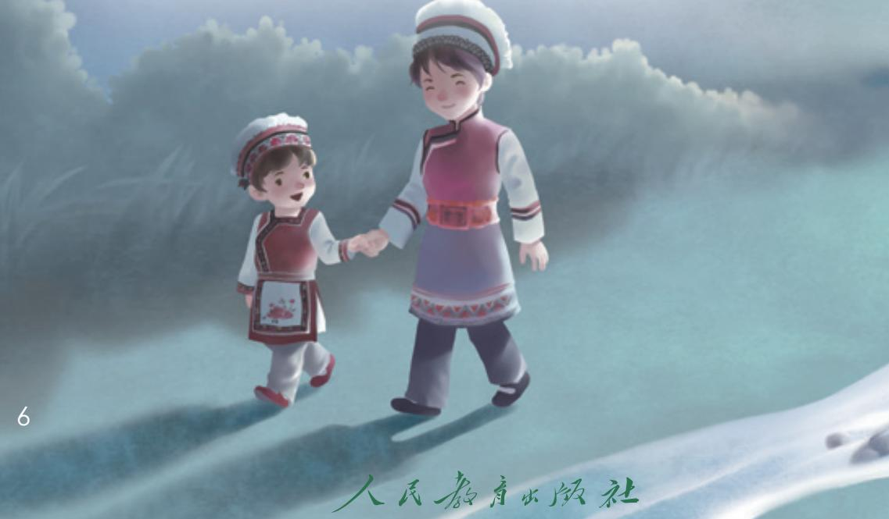

#

读到这里，我仿佛闻到了水果的香味。

雪梨，是火把梨，还是紫葡萄？都有。在坡头那片月光下的果园里，这些好吃

的果子挂满枝头。沟水汩汩，很满意地响着。是啊，它旁  
边，是它浇灌过的稻田。哦，阿妈，这不就是我们家的地  
吗？春天，我们种的油菜开花了，我在田地里找兔草，我把  
蒲公英吹得飞啊飞……收了油菜，栽上水稻。看，稻谷就要suì dù  
成熟了，稻穗低垂着头，稻田像一块月光镀亮的银毯。哦，gěng  
阿妈，我们到田埂上去吧，你不是说学校放假了，阿爸就要  
回来了吗？我们采哪一塘新谷招待阿爸呢？

啊，我和阿妈走月亮……

有时，阿妈给我讲月亮的故事，一个古老的传说；有  
时，却什么也不讲，只是静静地走着，走着。走过月光闪闪的  
溪岸，走过石拱桥，走过月影团团的果园，走过庄稼地和菜  
地……啊，在我仰起脸看阿妈的时候，我突然看见，美丽的月shuò  
亮牵着那些闪闪烁烁的小星星，好像也在天上走着，走着……多么奇妙的夜晚啊，我和阿妈走月亮！

# é luǎn sú yuè suì dù gěng shuò 鹅 卵 俗 跃 穗 镀 埂 烁

# 淘 牵 鹅 卵 洼坑 填 庄

# 稻 熟稼 俗 跃 葡 萄

有感情地朗读课文。背诵第4自然段。

阿妈牵着“我”走过“月光闪闪的溪岸”，“细细的溪水，流着山草和野花的香味，流着月光”……你的脑海中浮现出了怎样的画面？课文中还有哪些画面给你留下了深刻的印象？和同学交流。

读一读，再从课文中找出其他优美生动的句子，抄写下来。

哟，卵石间有多少可爱的小水塘啊，每个小水塘都抱着一个月亮！

看，稻谷就要成熟了，稻穗低垂着头，稻田像一块月光镀亮的银毯。

## 小练笔

读读课文第6自然段，说说“我”的所见所想。你还记得月下的某个情景吗？仿照着写一写。

# 现代诗二首 \* 3

反复朗读下面两首诗，说说诗中描绘了哪些景物，这些景物构成了怎样的画面。

秋晚的江上①

cháo   
归巢的鸟儿，   
尽管是倦了，   
还驮着斜阳回去。   
双翅一翻，   
把斜阳掉在江上； wěi   
头白的芦苇，   
也妆成一瞬的红颜了。

① 本诗作者刘大白。

## 花牛歌①

花牛在草地里坐，luó压扁了一穗剪秋罗。

花牛在草地里眠，bà zhàn白云霸占了半个天。

花牛在草地里走，小尾巴甩得滴溜溜。

花牛在草地里做梦，太阳偷渡了西山的青峰。

cháo wěi luó bà zhàn巢 苇 罗 霸 占

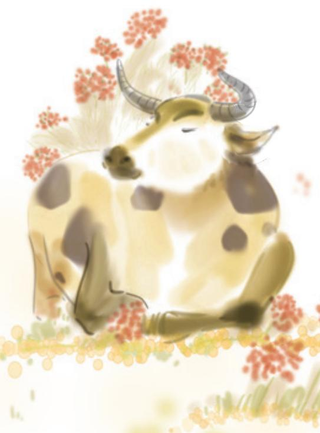

## 繁  星 \*4

有感情地朗读课文，根据课文的描述想象繁星满天的画面。你也看过夜晚的繁星吧？说说你当时的感受。

我爱月夜，但我也爱星天。从前在家乡七八月的夜晚，在庭院里纳凉的时候，我最爱看天上密密麻麻的星星。

三年前，在南京我住的地方有一道后门，每晚我打开后门，便看见一个静寂的夜。下面是一片菜园，上面是星群密布的蓝天。星光在我们的肉眼里虽然微小，然而它使我们觉得光明无处不在。

如今在海上，每晚和繁星相对，我把它们认得很熟了。我躺在舱面上，仰望天空。深蓝色的天空里，悬着无数半mèi明半昧的星。船在动，星也在动，它们是这样低，真是摇zhuì摇欲坠呢！渐渐地我的眼睛模糊了，我好像看见无数萤火虫在我的周围飞舞。海上的夜是柔和的，是静寂的，是梦幻的。我望着那许多认识的星，我仿佛看见它们在对我眨眼，我仿佛听见它们在小声说话。这时候我忘记了一切。huái在星的怀抱中我微笑着，我沉睡着。我觉得自己是一个小孩子，现在睡在母亲的怀里了。

## mèi zhuì huái 昧 坠 怀

## 口语交际

## 我们与环境

观山，看海，听雨，赏花……和大自然亲密接触，让我们心旷神怡。每个人都希望生活在美好的环境里。可是，只要大家稍稍留心就不难发现，人类的许多行为正破坏着我们的生活环境。

围绕下面的话题和同学交流。

◇ 我们身边存在哪些环境问题？对人们的身体健康有什么危害？

◇ 这些年来，哪些环境问题得到了有效的治理？为了更好的生活环境，我们可以做些什么？

如果开车时停候时间长，我们可以提醒爸爸妈妈将汽车熄火。这样可以减少尾气排放，也可以节省燃料。

最后离开教室的同学要记得关灯，大家一起努力，做到不开“无人灯”。

讨论后，可以选出十项简单易行的做法，印成《保护环境小建议十条》，张贴在学校、社区等地方的布告栏里。

◎ 围绕话题发表看法，不跑题。

◎ 判断别人的发言是否与话题相关。

## 推荐一个好地方

水乡小镇让我们赏心悦目，游乐场让我们兴奋不已，书店让我们流连忘返，村头的小树林是我们的乐园……每个人都有自己喜欢的地方，你愿意和大家分享吗？推荐一个好地方给同学吧。

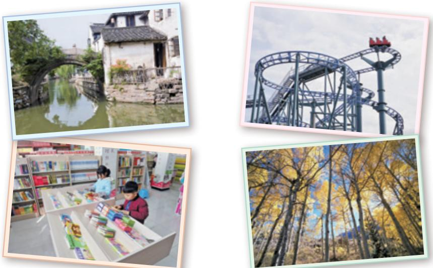

你打算推荐什么地方？这个地方在哪里？它有什么特别之处？写出推荐的理由，吸引大家去看看。

如，推荐一个古镇：

◇ 这个古镇很美……

◇ 在那里可以了解以前人们的生活……

◇ 这个古镇有很多好吃的……

写完后，自己先读一读，看看有没有把这个地方介绍清楚，有没有把推荐的理由写充分。再读给同学听，请他们提出修改建议。

举办“最受欢迎的好地方”推荐会，看看哪些地方最吸引大家。

#

# 语文园地

## 交流平台

我能根据文章中的描写想象画面。如读《观潮》，我仿佛看到了钱塘江潮由远及近、奔腾而来的样子。

我还能想象文章中描写的声音。如读《走月亮》，我似乎听到了潺潺的溪流声、秋虫的鸣叫声……

读文章，我还能“闻”到味道……

## 词句段运用

读下面的词语，你想到了什么画面？和同学交流。 luó xuān lóng chè xiāo 人声鼎沸 锣鼓喧天 震耳欲聋 响彻云霄 qiǎo 低声细语 窃窃私语 鸦雀无声 悄无声息

选一个事物，用上一两个加点的词语描绘它，再写下来。

风 烟花 霎时 顿时 忽然雷雨 小狗 过了一会儿 一会儿 工夫

## 书写提示

那条白线很快地向我们移来，逐渐拉长，变粗，横贯江面。再近些，只见白浪翻滚形成一堵高高的水墙。

◎ 字的中心要在横格的中线上，保持水平。

◎ 差 不 多， 号保 和持 字一 之

◎ 认字， 真 对养 待成 次 写

## 日积月累

## 鹿 柴zhài

wéi[唐] 王 维

空山不见人，但闻人语响。fǎn返景入深林，tái复照青苔上。

第二单元

为学患无疑，疑则有进。 [宋] 陆九渊

◎ 阅读时尝试从不同角度去思考，提出自己的问题。  
◎ 写一个人，注意把印象最深的地方写出来。

# jiá5 一个豆荚里的五粒豆

读课文，积极思考， 看看你可以提出什么问题。

wān

有一个豆荚，里面有五粒豌豆。豆荚和豌豆都是绿的，豌豆就以为整个世界都是绿的。豆荚在生长，豌豆也在生长。豌豆按照它们在家庭里的地位，坐成一排。太阳在外边照着，把豆荚晒得暖洋洋的。这里既温暖，又舒适；白天明亮，夜间黑暗。豌豆坐在那儿越长越大，它们想，我们得做点儿事情啊。

“难道我永远就在这儿坐下去吗？”它们中的一个问，jiāng“老这样坐下去，我恐怕会变得僵硬起来。我觉得外面似乎yù发生了一些事情——我有这种预感！”

许多天过去了。豆荚变黄了，这几粒豌豆也变黄了。“整个世界都变黄啦！”它们说。

忽然，它们觉得豆荚震动了一下。豆荚被摘下，跟许多别的丰满的豆荚在一起，溜到一个衣服口袋里去了。

“我们不久就要被打开了！”豌豆们说。于是它们就等待这件事情的发生。

“我倒想要知道，我们之中谁会走得最远！”最小的一粒豌豆说。

jiē“是的，事情马上就要揭晓了。”最大的那粒豌豆说。

啪！豆荚裂开来了。那五粒豌豆全都躺在一个孩子的手中。这个孩子紧紧地捏着它们，说可以当作玩具枪的子弹用。他马上把第一粒豌豆装进去，把它射了出去。

“现在我要飞到广阔的世界里去了！如果你能捉住我，就请来吧！”第一粒豌豆说完就飞走了。

“我，”第二粒说，“我将直接飞进太阳里去。这才像一粒豌豆呢，而且与我的身份非常相称！”于是，它也飞走了。

“我们到了哪儿，就在哪儿住下来。”接下来的两粒说，“不过，我们还得向前滚。”在被装进玩具枪之前，它们从小孩的手中滑落到地上，打起滚来。但这两粒豌豆最终还是被装进玩具枪里去了。它们说：“我们才会飞得最远呢！”

“该怎么样就怎么样吧！”最后的那一粒说。它被射到空中，落到顶楼窗子下面的一块旧板子上，正好钻进一个tái长满了青苔的裂缝里。青苔把它裹起来，它躺在那儿真可qiú以说成了一个囚犯。

在这个小小的顶楼里住着一个穷苦的女人。她很强壮，qín pī很勤劳，每天擦火炉，劈木柴，干很多苦活，不过还是很穷。她有一个女儿，身体非常虚弱，躺在床上一整年了。小女孩安静地、耐心地整天在家里躺着，而她的母亲每天

到外面去挣点儿生活费。

春天的一个早晨，当母亲准备出去工作的时候，阳光温和地从那个小窗子射进来，一直射到地上。

小女孩望着最低的那块窗玻璃说：“有个绿东西从窗玻璃旁边探出头来，它是什么呢？”

母亲向窗边走去，把窗户打开一半。“啊！”她说，“我的天，原来是一粒小豌豆在这里生了根，还长出小叶子来了。它是怎么钻进这个缝隙里去的？你现在有一个小花园了！”

母亲把小女孩的床搬得更靠近窗子，好让她看到这粒正在生长着的豌豆。

“妈妈，我觉得我好了一些！”晚上，这个小女孩说，“太阳今天在我身上照得怪暖和的。这粒豌豆长得好极了，我也会好起来的。我能爬起来，走到温暖的太阳光中去。”

“但愿如此。”母亲虽然不太相信，但还是仔细地用一根小棍子把这植物支起来，好使它不至于被风吹断，因为它使女儿对生命产生了希望。她从窗台上牵了一根绳子到kuàng窗框的上端去，使这棵豌豆苗可以顺着它向上生长。

它的确在向上长——人们每天都可以看到它在生长。

“真的，它现在要开花了！”这个母亲慢慢开始相信，她的孩子会好起来。她记起最近这孩子讲话时，要比以前愉快得多，而且最近几天她也能自己爬起来，坐在床上，用兴奋的眼光望着这一粒豌豆所形成的小花园。一星期以后，小女孩第一次能够坐一整个钟头。她快乐地坐在温暖的太阳光里。窗子打开了，她面前是一朵盛开的、紫色的豌豆花。小女孩低下头来，轻轻地吻了一下它柔嫩的叶子。这一天简直像一个节日。

其余的几粒豌豆呢？曾经想飞到广阔世界里去的那一jiǎn粒，它落到了屋顶的水笕里，被一只鸽子吃掉了。那两粒曾在地上打滚的豌豆也没有走多远，也被鸽子吃掉了。它们还算有些实际的用途。那本来想飞进太阳里去的豌豆，却落到了水沟里，在脏水里躺了好几个星期，而且涨得大大的。

“我又胖又美！”这粒豌豆说，“我胖得要爆裂开来了。我想任何豌豆从来不曾、也永远不会达到这种地步的。我是五粒豌豆中最了不起的一粒。”

yì此刻，顶楼窗子旁那个小女孩——她的脸上洋溢着健康的光彩，她的眼睛发着亮光——正注视着豌豆花，快乐地微笑着，心里充满了感激。

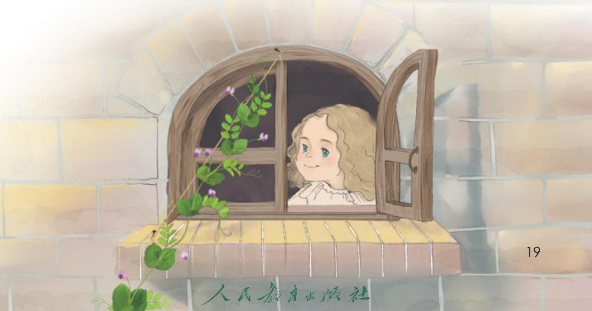

# wān jiāng yù jiē tái qiú kuàng yì 豌 僵 预 揭 苔 囚 框 溢

豌 按 舒 适 日 立 恐 便 硬 暗 僵

枪 耐 探 愉 曾 沟 溢

读完课文，把你的问题写下来。

小组交流，仿照下面的问题清单整理大家提出的问题，说说你有什么发现。

小组问题清单

课文说被青苔包裹的豌豆像“一个囚犯”，但它却长得很好，为什么？

我发现有的问题是针对课文的一部分内容提的，有的问题是针对全文提的。

◇ 母亲为什么要把一株豌豆苗称为“一个小花园”呢？

◇ 掉到水沟里的那粒豌豆真的是最了不起的吗？

伴随着豌豆苗的成长，为什么小女孩的病就慢慢好了呢？和同学交流你的想法。

# 6 夜间飞行的秘密

一位同学读了这篇课文，提出了一些问题，写在了旁边和文后。你的问题是什么呢？把它们写下来，和同学交流。

清朗的夜空出现两个亮点，越来越近，才看清楚是一红一绿的两盏灯。接着传来了lóng隆隆声，这是一架飞机在夜航。

在漆黑的夜里，飞机是怎么做到安全飞行的呢？要想了解其中的秘密，我们可以从biānfú蝙蝠说起。

蝙蝠能在夜里飞行，还能捕捉飞蛾和蚊子；而且无论怎么飞，从来没见过它跟什么jí东西相撞，即使一根极细的电线，它也能灵bì ruì巧地避开。难道它的眼睛特别敏锐，能在漆黑的夜里看清楚所有的东西吗？

人民教育出版社

为了弄清楚这个问题，两百多年前，科学家做了一次实验。他们在一间屋子里横七jì竖八地拉了许多绳子，绳子上系了许多铃dāng铛，然后把蝙蝠的眼睛蒙上，让它在屋子里飞。蝙蝠飞了几个钟头，铃铛一个也没响，那么多的绳子，它一根也没碰着。

科学家又做了两次实验：一次把蝙蝠的sāi耳朵塞上，一次把蝙蝠的嘴封住，让它在屋yíng子里飞。蝙蝠就像没头苍蝇似的到处乱撞，挂在绳子上的铃铛响个不停。

zhèng

三次实验的结果证明，蝙蝠夜里飞行，靠的不是眼睛，而是靠嘴和耳朵配合起来探路的。

后来，科学家经过反复研究，终于揭开了蝙蝠能在夜里飞行的秘密。它一边飞，一边从嘴里发出超声波。人的耳朵听不见超声波，蝙蝠的耳朵却能听见。超声波向前传播时，遇zhàngài到障碍物就反射回来，传到蝙蝠的耳朵里，蝙蝠就立刻改变飞行的方向。

知道蝙蝠在夜里如何飞行，你猜到飞机夜间飞行的秘密了吗？现代飞机上安装了雷

## 人民教育出版社

达，雷达的工作原理与蝙蝠探路类似。雷达通过天线发出无线电波，无线电波遇到障碍yíng物就反射回来，被雷达接收到，显示在荧光píng  
屏上。从雷达的荧光屏上，驾驶员能够清楚地看到前方有没有障碍物，所以飞机飞行就更安全了。

一位同学阅读后提出的问题：

◇ 飞机在夜间安全飞行仅靠雷达就可以吗？

◇ 超声波在生活中还有什么用途呢？

biān fú jí ruì jì dāng yíng zhèng zhàng ài yíng píng 蝙 蝠 即 锐 系 铛 蝇 证 障 碍 荧 屏

蚊 弄 科 横 竖 绳 系 蝇

证 复 研 究 达 驾 驶

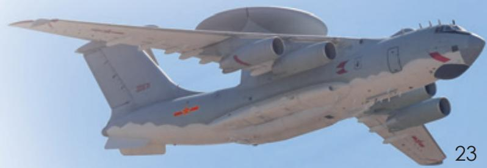

## 人民教育出版社

分小组整理问题清单，想一想可以从哪些角度提问。

下面是一个小组的问题清单和对问题的讨论，你从中受到什么启发？

## 小组问题清单

◇ 无线电波跟超声波是一样的吗？

为什么课文没有具体写后两次实验？

飞蛾、萤火虫、猫头鹰，它们在夜间活动也是靠超声波吗？

我发现这三个问题的提问角度是不一样的，第1 个问题是针对课文内容来提问的。

第 2 个问题是从课文的写法上来提问的。

第 3 个问题是从课文中得到启示，联系生活经验提出的。

读下面的片段，试着从不同角度提出问题，和同学交流。

马铃薯和藕不是植物的根，而是茎。它们躲在泥土里变了模样，你不要把它们认错了。这种变了模样的茎，有一个总的名称，叫作变态茎。

变态茎分好几种。马铃薯和洋姜长得肥肥胖胖，叫作块茎；bí qí yù suàn荸荠、慈姑和芋头长得圆头圆脑，叫作球茎；洋葱和大蒜头，lín长得一瓣一瓣的，好像鳞片一样，叫作鳞茎；藕和生姜长得像根一样，就叫作根状茎。

——选自朱江的《它们是茎，还是根？》，有改动

# 呼风唤雨的世纪7

一位同学读了下面这篇课文，在旁边和文后写下了自己的问题。读课文，写下你的问题，和同学交流。

20世纪是一个呼风唤雨的世纪。

是谁来呼风唤雨呢？当然是人类。靠什么呼风唤雨呢？靠的是现代科学技术。在20世纪100年的时间里，人类利用现代科学技huò术获得了那么多奇迹般的、出乎意料的发现和发明。正是这些发现和发明，使人类的生活大大改观，其改变的程度超过了人类历史上百万年的总和。

人类在上百万年的历史中一直很依赖自然，生活在一个慢吞吞、静悄悄、一到夜里就黑暗无光的世界。那时没有收音机，没有电视，没有飞机，更没有宇宙飞船。人们只能在神话中用“千里眼”“顺风耳”和腾云驾雾的神仙，来寄托自己的美好愿望。我们的祖先大概谁也没有料到，他们的那么多幻

为什么说20世纪是一个“呼风唤雨”的世纪呢？

“发现”和“发明”有什么区别？

“‘ 千里眼腾云驾雾的神仙”在现代指 ‘顺风 耳’ 和什么？

想在现代纷纷变成了现实。20世纪的成就，真可以用“忽如一夜春风来，千树万树梨花开”来形容。

qián

20世纪，人类登上月球，潜入深海，洞yì suǒ察百亿光年外的天体，探索原子核世界的奥秘；20世纪，电视、程控电话、因特网以及bó民航飞机、高速火车、远洋船舶等，日益把人类居住的星球变成联系紧密的“地球村”。人类生活的舒适、方便，是连过去的王公贵族也不敢想的。科学在改变着人类的精神文zhì化生活，也在改变着人类的物质生活。

1923年，英国数学家、哲学家伯特sù兰·罗素说：“归根到底，是科学使得我们这个时代不同于以往的任何时代。”现在，这句话依然适用。回顾20世纪的百年历程，科学的确创造了一个又一个神话，为人类创造了比以往任何时代都要美好的生活。在新的世纪里，现代科学技术必将继续创造一个个奇迹，不断改善我们的生活。

## 一位同学阅读后提出的问题：

# huàn jì huò lài qián yì suǒ ào bó zhì zhé唤 纪 获 赖 潜 亿 索 奥 舶 质 哲

唤 纪 技 程 超 亿 核改

# 奥 益 联 质 哲 任 善

分小组整理问题清单，筛选出对理解课文最有帮助的问题。

下面是一个小组在整理问题时的讨论，你从中受到什么启发？

问题一：什么是“程控电话”？

问题二：“忽如一夜春风来，千树万树梨花开”是什么意思？ 20世纪的科学成就为什么可以用这句诗来形容？

问题三：现代科学技术给我们带来的全是好处吗？

我发现阅读中产生的问题很多，有些问题不影响对课文内容的理解。

有的问题可以帮助我理解课文的内容。

有的问题可以引发我深入思考。

“现代科学技术必将继续创造一个个奇迹，不断改善我们的生活”，联系生活实际，谈谈自己的理解。

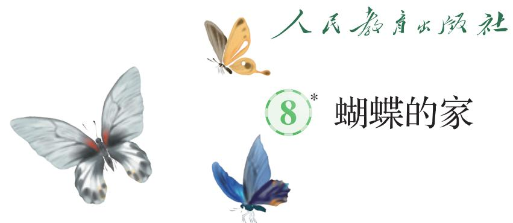

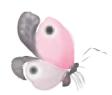

读课文，提出自己的问题，再试着把问题分分类，选出你认为最值得思考的几个问题，并尝试解决。

我常想，下大雨的时候，青鸟、麻雀这些鸟都要躲避起来，蝴蝶怎么办呢？天是那样低沉，云是那样黑，雷、hàn xuān电、雨、风，吼叫着，震撼着，雨点密集地喧嚷着，风将银色的雨幕斜挂起来，世界几乎都被冲洗遍了，就连树林里也黑压压的、水淋淋的，到处都是湿的。这不是难为蝴蝶吗？

我一想起来就为蝴蝶着急，这样的天气它们能躲在哪里呢？它们的身体是那样轻盈，载不动一个水点；它lán们身上的彩粉是那样斑斓，一点儿水都不能沾；它们是那样柔弱，比一片树叶还无力，怎么禁得起这猛烈的风雨呢？想到这里，我简直没法再想下去了，心里是那样着急。

但是，一位小朋友非常确定地说：“它们和我们一样，肯定有家。下雨的时候，它们就会急忙飞回家里去哩！”

不过它们的家在哪里呢？人们的屋宇里从没有见过有蝴蝶来避雨。麦田里呢？也不能避雨。树林里呢？到处是水珠滚坠。园里的花朵是它们的家吗？花朵自己已经被雨点打得抖个不停了，怎能容它们藏身呢？就连老树干的底面，lù  
也是顺下水来，湿漉漉的。蝴蝶的家到底在哪里呢？我真为蝴蝶着急了。

它们的家会不会是在桥下面呢？这也未可知，但是有一点可以确定：这里从没见过有蝴蝶落到石头上的呀！那它们会不会是藏在树叶下面？这倒有些说得过去，但我也从没见过蝴蝶在树叶下面避雨呀，而且树叶也经常被风吹得翻转不定，被雨冲刷得透湿，也不像是蝴蝶的家呀！我真为蝴蝶着急了。

一个女孩对我说：“雨后，蝴蝶就会重新出来，在阳光里飞。它们是那么高兴，那么鲜艳。我想，它们一定是藏在qiǎo一个秘密的家里。它们的家一定美丽而香甜，不像家雀儿似yán的，一下雨就飞到人们的屋檐下避雨。一定是这样的。”

她的话说得倒是不错，但我却从来没有见到过下雨时蝴蝶藏身的地方。谁要是能说给我听，我就不着急了。

bì hàn xuān qiǎo yán 避 撼 喧 雀 檐

## 习 作

## 我的家人

家人与我们朝夕相处，是这个世界上我们最熟悉、最亲近、最信赖的人。你一定很了解自己的家人，他们有什么特点呢？

我奶奶脾气特别好，总是笑眯眯的。她还特别会做好吃的，我最喜欢吃奶奶做的饭。

我爷爷已经退休了，他每天练习书法，一年三百六十五天从不间断，非常有毅力。

我爸爸是卡车司机，他很忙，一年到头很少在家。他很会讲故事，一有空就讲给我和弟弟听。

我妹妹今年四岁。她很淘气，也很聪明。

家人身上表现出来的特点往往不止一个，要选择他们最与众不同的特点来写。在选择事例时，也应该选择印象最深、最能反映他们特点的事。

可以选择一个家人来写，也可以选择家中的几个人来写。

写好了读给同桌听，看看有没有不通顺的句子。回家读给家人听，请他们评评写得像不像。

# 语文园地

## 交流平台

阅读的时候我要动脑筋思考，积极提出问题。

可以试着从不同角度提出问题，让自己的思考更加全面和深入。

我要筛选出最值得思考的问题，加深对文章的理解。

我们要养成敢于提问、善于提问的习惯。

## 识字加油站

zhù
dǔ

chāo 煤—媒méi 赔—芬— 培氛fēn

贝

zhàng 账hè 木 樟杠gàng zhāng

jiǎo
猾
huá

你发现了什么？

zhù chāo péi dǔ méi fēn zhàng hè zhāng gàng jiǎo huá 驻 钞 培 赌 媒 氛 账 贺 樟 杠 狡 猾

## 人民教育出版社

## 词句段运用

读一读，体会每组句子在表达上的不同。

◇ 那时没有收音机，没有电视，没有飞机，更没有宇宙飞船。

◇ 那时没有收音机、电视、飞机和宇宙飞船。

◇ 那条狗高兴的时候叫，紧张的时候叫，发怒的时候也叫。

◇ 那条狗高兴、紧张、发怒的时候都叫。

读下面的句子，说说你的发现，再抄写下来。

◇ 是谁来呼风唤雨呢？当然是人类。

◇ 靠什么呼风唤雨呢？靠的是现代科学技术。

◇ 竺可桢每天去北海公园，单是为了观赏景物吗？不是。他是去观察物候，作科学研究的。

## 日积月累

◎ 好问则裕，自用则小。 ——《尚书》

◎ 博学之，审问之，慎思之，明辨之，笃行之。

◎ 智能之士，不学不成，不问不知。 —— 王充

◎ 人非生而知之者，孰能无惑？ —— 韩愈

# 第三单元

处处留心皆学问。

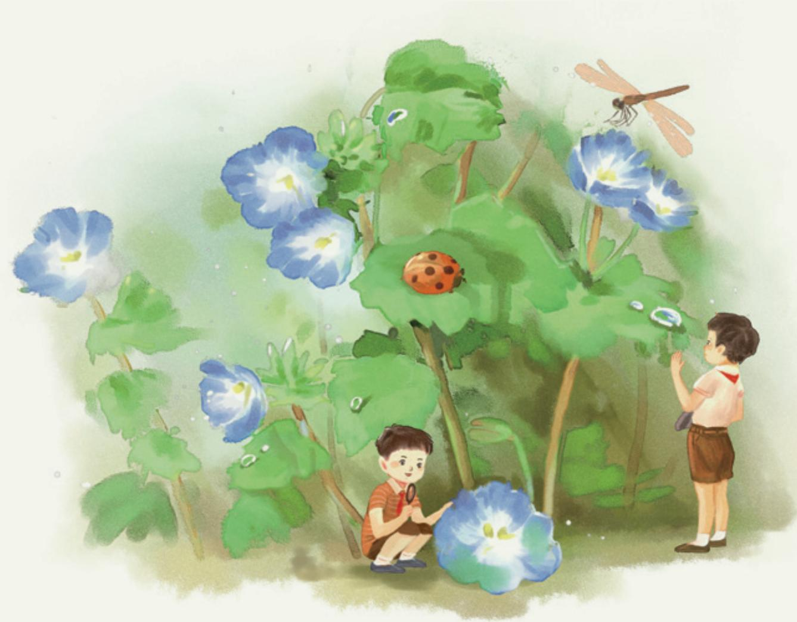

◎ 体会文章准确生动的表达，感受作者连续细致的观察。

◎ 进行连续观察，学写观察日记。

# 9 古诗三首

## mù 暮江吟

[唐] 白居易

一道残阳铺水中， sè 半江瑟瑟半江红。① 可怜九月初三夜，② 露似真珠月似弓。③

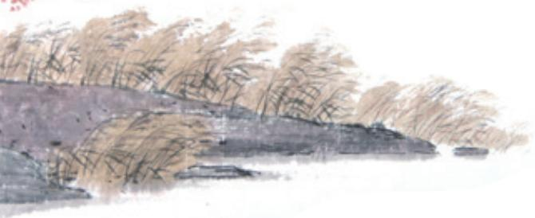

## 题 西林 壁① ②

shì [宋] 苏 轼

横看成岭侧成峰，远近高低各不同。不识庐山真面目，yuán只缘身在此山中。③

## 注释

①〔瑟瑟〕这里形容未受到残阳照射的江水所呈现的青绿色。

②〔可怜〕可爱。   
③〔真珠〕这里指珍珠。

## 注释

① 〔题〕书写，题写。  
②〔西林〕西林寺，在今江西庐山脚下。  
③〔缘〕因为。

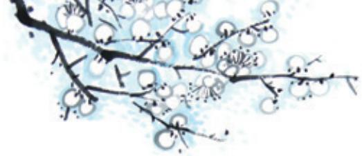

雪 梅

lú yuè [宋] 卢 钺

xiáng   
梅雪争春未肯降，①   
sāo   
骚人阁笔费评章。③ ④② xùn   
梅须逊雪三分白，⑤ shū   
雪却输梅一段香。

注释

①〔降〕服输。

②〔骚人〕诗人。

③〔阁〕同“搁”，放下。这里读gē。

④〔评章〕评议。这里指评议梅与雪的高下。

⑤〔逊〕不及，比不上。

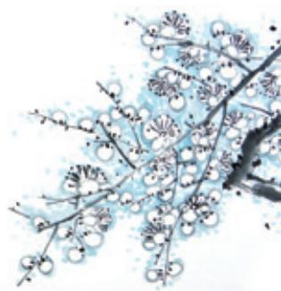

# mù sè yuán xiáng sāo xùn shū 暮 瑟 缘 降 骚 逊 输

暮 吟 题 侧 峰 庐

缘 降 费 须 逊 输

有感情地朗读课文。背诵课文。默写《题西林壁》。

想象 “一道残阳铺水中，半江瑟瑟半江红”的景象，用自己的话说一说。

说说你对下列诗句的理解。

◇ 不识庐山真面目，只缘身在此山中。

◇ 梅须逊雪三分白，雪却输梅一段香。

# 爬山虎的脚10

学校操场北边墙上满是爬山虎。我家也有爬山虎，从小院的西墙爬上去，在房顶上占了一大片地方。

爬山虎刚长出来的叶子是嫩红的，不几天叶子长大，就变成嫩绿的。爬山虎的嫩叶，不大引人注意，引人注意的是长大了的叶子。那些叶子绿得那么新鲜，看着非常舒jūn服。叶尖一顺儿朝下，在墙上铺得那么均匀，没有重叠起来的，也不留一点儿空隙。一阵风拂过，一墙的叶子就漾起波纹，好看得很。

以前，我只知道这种植物叫爬山虎，可不知道它怎么能爬。今年，我注意了，原来爬山虎是有脚的。爬山虎的bǐng脚长在茎上。茎上长叶柄的地方，反面伸出枝状的六七根wō细丝，这些细丝很像蜗牛的触角。细丝跟新叶子一样，也是嫩红的。这就是爬山虎的脚。

爬山虎的脚触着墙的时候，六七根细丝的头上就变成小圆片，巴住墙。细丝原先是直的，qū现在弯曲了，把爬山虎的嫩茎拉一把，使它紧贴在墙上。爬山虎就是这样一脚一脚地往上爬。如果你仔

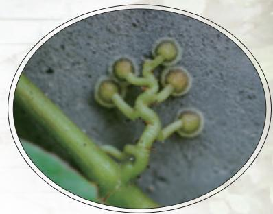

jiāo

细看那些细小的脚，你会想起图画上蛟龙的爪子。

爬山虎的脚要是没触着墙，不几天就萎了，后来连痕迹也没有了。触着墙的，细丝和小圆片逐渐变成灰色。不要瞧不起那些灰色的脚，那些脚巴在墙上相当牢固，要是你的手指不费一点儿劲，休想拉下爬山虎的一根茎。

jūn bǐng wō qū wěi均 柄 蜗 曲 萎

柄 瞧

朗读课文。说说从哪些地方可以看出作者观察得特别仔细。

根据课文内容，说一说爬山虎是怎样往上爬的。

找出课文中你觉得写得准确、形象的句子，抄写下来。

## 资料袋

要写好观察日记，必须仔细地观察事物并做好观察记录。参考下面两种记录形式，把自己的观察所得记录下来。

## ◇ 图文结合

9月10日

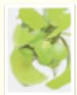

9月25日

11月10日

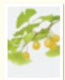

10月25日

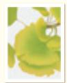

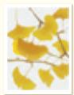

银杏的种子 是 浅 绿 色的，和树叶的颜色很相似。

银杏的种子成熟了，是黄色的。

银杏的种子开始掉落，叶子从外向内开始变黄了。

银杏的叶子全变成黄色的了。

## ◇ 做表格

<table><tr><td rowspan=1 colspan=1>观察对象</td><td rowspan=1 colspan=1>时间</td><td rowspan=1 colspan=1>体长</td><td rowspan=1 colspan=1>颜色</td><td rowspan=1 colspan=1>吃食情况</td></tr><tr><td rowspan=4 colspan=1>蚕</td><td rowspan=1 colspan=1>4月8日</td><td rowspan=1 colspan=1>约2毫米</td><td rowspan=1 colspan=1>灰褐色</td><td rowspan=1 colspan=1>食量很小，吃嫩桑叶。</td></tr><tr><td rowspan=1 colspan=1>4月18日</td><td rowspan=1 colspan=1>约12毫米</td><td rowspan=1 colspan=1>白色</td><td rowspan=1 colspan=1>食量变大，吃较嫩的桑叶。</td></tr><tr><td rowspan=1 colspan=1>4月27日</td><td rowspan=1 colspan=1>约41 毫米</td><td rowspan=1 colspan=1>白偏青</td><td rowspan=1 colspan=1>食量很大，吃较老的桑叶。</td></tr><tr><td rowspan=1 colspan=1></td><td rowspan=1 colspan=1></td><td rowspan=1 colspan=1></td><td rowspan=1 colspan=1></td></tr></table>

# zhái蟋蟀的住宅

居住在草地上的蟋蟀，差不多和蝉一样有名。它的出名不光由于它的唱歌，还由于它的住宅。

yǐn

别的昆虫大多在临时的隐蔽所藏身。它们的隐蔽所得háo来不费功夫，弃去毫不可惜。蟋蟀和它们不同，不肯随遇shèn zhǐ liáng而安。它常常慎重地选择住址，一定要排水优良，并且有温和的阳光。它不利用现成的洞穴。它的舒服的住宅是自jué己一点儿一点儿挖掘的，从大厅一直到卧室。

蟋蟀怎么会有建筑住宅的才能呢？它有特别好的工具吗？没有。蟋蟀并不是挖掘技术的专家，它的工具是那样柔弱，所以人们对它的劳动成果感到惊奇。

在儿童时代，我到草地上去捉蟋蟀，把它们养在笼子sōu里，用菜叶喂它们。现在为了研究蟋蟀，我又搜索起它们的巢穴来。

在朝着阳光的斜坡上，青草丛中隐藏着一条倾斜的隧zhòu  
道，即使有骤雨，这里也立刻就会干的。隧道顺着地势弯  
弯曲曲，最多九寸深，一指宽，这便是蟋蟀的住宅。出口

的地方总有一丛草半掩着，就像一座门。蟋蟀出来吃周围pá的嫩草，绝不去碰这一丛草。那微斜的门口，经过仔细耙扫，收拾得很平坦。这就是蟋蟀的平台。当四周很安静的时候，蟋蟀就在这平台上弹琴。

zhì

屋子的内部没什么布置，但是墙壁很光滑。主人有的是时间，把粗糙的地方修理平整。大体上讲，住所是很简pǔ朴的，清洁、干燥，很卫生。假使我们想到蟋蟀用来挖掘的工具是那样简单，这座住宅真可以算是伟大的工程了。

蟋蟀盖房子大多是在十月，秋天初寒的时候。它用前足bā qián è扒土，还用钳子似的大颚搬掉较大的土块。它用强有力的后足踏地。后腿上有两排锯，用它们将泥土推到后面，倾斜地铺开。

工作做得很快。蟋蟀钻到土底下干活，如果感到疲劳，它就在未完工的家门口休息一会儿，头朝着外面，触须轻

微地摆动。不大一会儿，它又进去继续工作。我一连看了两个钟头，看得有些不耐烦了。

住宅的重要部分快完  
成了。洞已经挖了有两寸chǎng  
深，够宽敞的了。余下的  
是长时间的整修，今天做

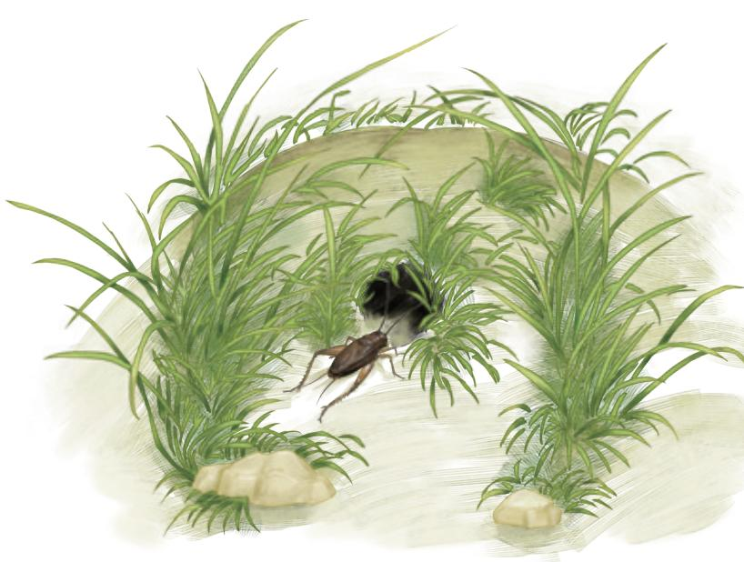

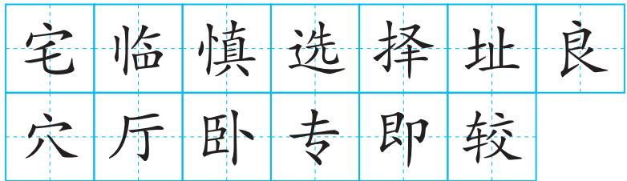

一点儿，明天做一点儿。这个洞可以随天气的变冷和它身体的增长而加深加阔。即使在冬天，只要天气温和，太阳晒到pāo它住宅的门口，还可以看见蟋蟀从里面不断地抛出泥土来。

zhái yǐn háo shèn zhǐ liáng jué sōu qīng zhòu zhì pāo宅 隐 毫 慎 址 良 掘 搜 倾 骤 置 抛

默读课文，说说课文围绕蟋蟀的住宅讲了哪两方面的内容，作者是怎样观察的。

用自己的话介绍蟋蟀住宅的修建过程，想想为什么蟋蟀的住宅可以算是“伟大的工程”。

课文把蟋蟀比作人，把蟋蟀的巢穴比作人的住宅，说说这样写的好处。读下面的片段，想想在表达上与课文有什么不同。

蟋蟀体形微扁，头部圆形，触角长，呈线状。有翅时，翅qū hè平叠于躯体上。多数体色呈褐色或黑色，深浅不一。雄虫利用cí位于前翅基部的脊产生求偶鸣声。多数雌性的产卵器很显著，呈筒状或针状。

——选自英国麦加文的《昆虫》，王琛柱译，有改动

## 燕子窝

6 月 28 日

燕子已经不衔泥了，它们往窝里衔干草和绒毛，铺垫子。真没想到，它们把全部建筑工程估算得这么周到——原本就应该让窝的一边比另一边建得快一些！雌燕子把窝的左边堆到了顶，雄燕子的右半边窝却始终没有堆完。这么着燕子窝就成了一个有缺口的泥圆球，右上角留了一个洞口。不消说，它们的窝就应该是这样的——这就是家的大门啊！要不然，这对燕子可怎么进它们的家呢？我当初骂雄燕子懒，看来是冤枉它了。

今天是雌燕子头一次留在家里过夜。

## 6 月 30 日

窝做好了。雌燕子老待在窝里不出门，大概是产下第一个蛋了。雄燕子不时给雌燕子衔一些小虫来，还不停地唱歌，欢天喜地、叽叽喳喳地说着贺词。

第一批贺客——那一群燕子又飞来了。它们一只一只地打窝旁飞过去，向窝里张望着，在窝前扑棱着翅膀。这时女主人的小脸正探出门外，说不定它们在吻着这位幸福的女主人呢！客人们叽叽喳喳热闹了一阵子，就散了。

猫时常爬上屋顶，从梁上往屋檐下张望。它是不是在焦急地等待窝里的小燕子出世呢？

——选自苏联比安基的 《森林报·夏》，王汶译，有改动

## 口语交际

爱护眼睛，保护视力

眼睛是心灵的窗口，它很脆弱，容易受到伤害。平时，你注意保护自己的眼睛吗？

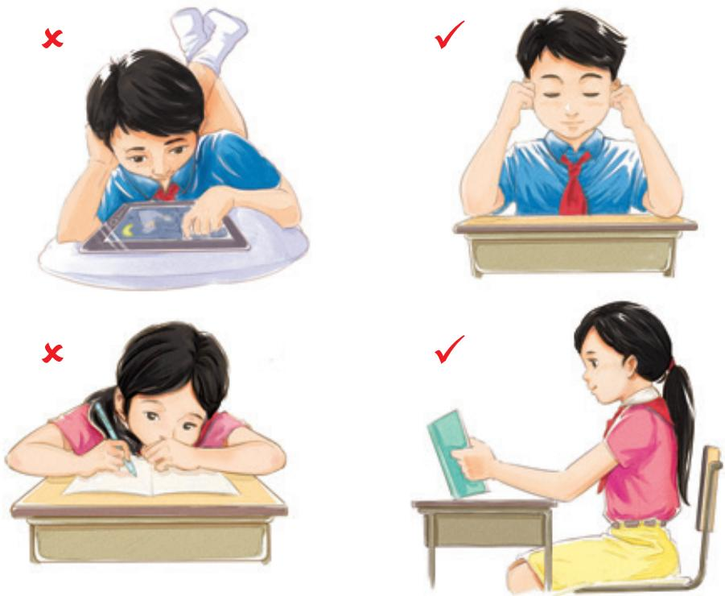

让我们开展一次活动。先了解本班同学的视力情况；然后分小组对班里同学的视力情况和影响视力的原因进行分析，并交流如何保护视力；最后，全班讨论怎样才能保护好视力，提出保护

视力的建议。

◎ 小组讨论时，注意说话的音量，避免干扰其他小组。

◎ 不重复别人说过的话。如果想法接近，可以先表示认同，再继续补充。

## 写观察日记

叶圣陶经过一段时间的观察，了解了爬山虎向上爬的秘密；法布尔观察了很久，终于看到了蟋蟀筑巢的全过程；比安基用日记的形式，记下了燕子筑巢及孵蛋的情况。我们也可以试着进行连续观察，用观察日记记录自己的收获。

我在花盆里种下几粒种子，观察种子发芽的过程。

秋天到了，有的树叶开始变色了，我要记录树叶颜色的变化。

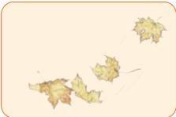

月亮有时圆圆的，有时弯弯的，我要观察月亮变化的过程。

我要观察家里养的小猫。

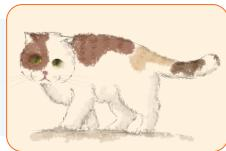

观察日记，主要是记录观察对象的变化，还可以写写观察的过程，观察者当时的想法和心情，如果能附上图画或照片就更好了。

整理观察日记，在小组内分享。评一评，谁观察得细致，内容记得准确。

#

# 语文园地

## 交流平台

只有进行细致的观察，才能写得准确。

它用前足扒土，还用钳子似的大颚搬掉较大的土块。它用强有力的后足踏地。后腿上有两排锯，用它们将泥土推到后面，倾斜地铺开。

爬山虎的脚要是没触着墙，不几天就萎了，后来连痕迹也没有了。触着墙的，细丝和小圆片逐渐变成灰色。

作者不但观察细致，还连续观察了一段时间。

观察不仅要用眼睛看，还要用耳朵听，用心想。

那微斜的门口，经过仔细耙扫，收拾得很平坦。这就是蟋蟀的平台。当四周很安静的时候，蟋蟀就在这平台上弹琴。

## 词句段运用

连一连，为下面的动物找到家。

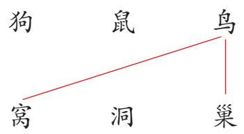

猪

马

圈

鱼

牛

虎

塘

厩jiù

穴

棚

我发现“鸟窝”也可以叫“鸟巢”。

## 人民教育出版社

读下面两组句子，注意加点的词语，体会每组句子意思的不同。

触着墙的，细丝和小圆片变成灰色。

触着墙的，细丝和小圆片逐渐变成灰色。

“逐渐”说明爬山虎的脚是一点儿一点儿变成灰色的。

隧道顺着地势弯弯曲曲，九寸深，一指宽，这便是蟋蟀的住宅。

隧道顺着地势弯弯曲曲，最多九寸深，一指宽，这便是蟋蟀的住宅。

## 日积月累

◎ 立了秋，把扇丢。

◎ 二八月，乱穿衣。

◎ 夏雨少，秋霜早。

◎ 八月里来雁门开，雁儿脚上带霜来。

◎ 一场秋雨一场寒，十场秋雨要穿棉。

◎ 八月暖，九月温，十月还有小阳春。

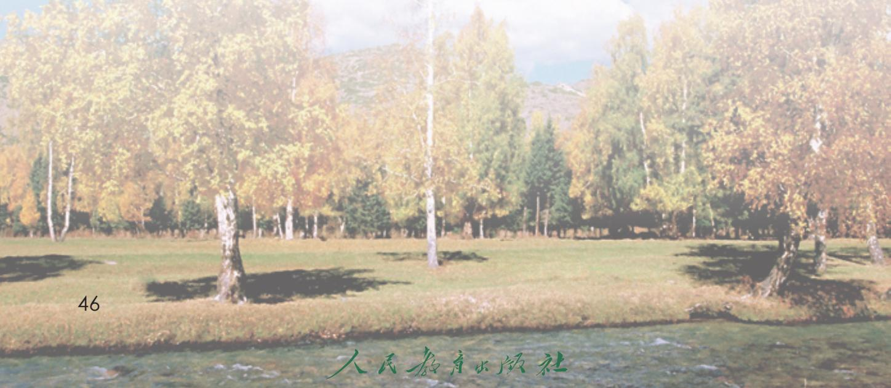

# 第四单元

神话，永久的魅力，人类童年时代飞腾的幻想。

◎ 了解故事的起因、经过、结果，学习把握文章的主要内容。

◎ 感受神话中神奇的想象和鲜明的人物形象。

◎ 展开想象，写一个故事。

# 盘古开天地

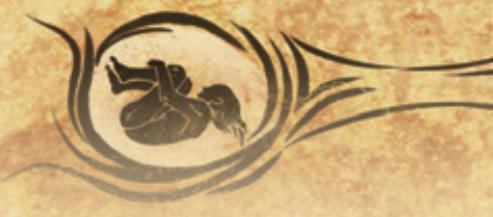

hùn dùn

很久很久以前，天和地还没有分开，宇宙混沌一片，像个大鸡蛋。有个叫盘古的巨人，在混沌之中睡了一万八千年。

有一天，盘古醒来了，睁眼一看，周围黑乎乎一片，什kā chā么也看不见。他一使劲翻身坐了起来，只听咔嚓一声，“大鸡蛋”裂开了一条缝，一丝微光透了进来。巨人见身边有一pī把斧头，就拿起斧头，对着眼前的黑暗劈过去，只听见一声huǎn巨响，“大鸡蛋”碎了。轻而清的东西，缓缓上升，变成了zhuó天；重而浊的东西，慢慢下降，变成了地。

天和地分开后，盘古怕它们还会合在一起，就头顶天，脚踏地，站在天地当中，随着它们的变化而变化。天每天zhàng升高一丈，地每天加厚一丈，盘古的身体也跟着长高。

这样过了一万八千年，天升得高极了，地变得厚极了。é盘古这个巍峨的巨人就像一根柱子，撑在天和地之间，不让它们重新合拢。又不知过了多少年，天和地终于成形了，盘古也精疲力竭，累得倒下了。

盘古倒下以后，他的身体发生了巨大的变化。他呼出的气息变成了四季的风和飘动的云；他发出的声音化作了

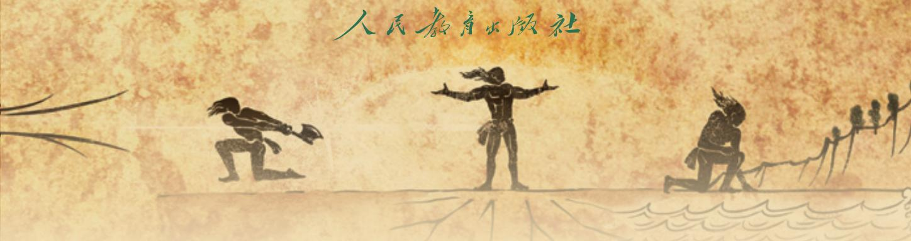

隆隆的雷声；他的左眼变成了太阳，照耀大地，他的右眼zhī qū  
变成了月亮，给夜晚带来光明；他的四肢和躯干变成了大yè  
地的四极和五方的名山；他的血液变成了奔流不息的江河；  
他的汗毛变成了茂盛的花草树木；他的汗水变成了滋润万  
物的雨露……

伟大的巨人盘古，用他的整个身体创造了美丽的世界。

pī huǎn zhuó zhàng lóng zhī qū yè 劈 缓 浊 丈 隆 肢 躯 液

睁 翻 斧 劈 缓 浊 丈

撑 竭 累 液 奔 茂 滋

边读边想象画面，说说你心目中的盘古是什么样的。

从课文中找出你认为神奇的地方，说说盘古开天地的过程。

选 做

课后收集中国的神话故事读一读，然后讲给同学听。

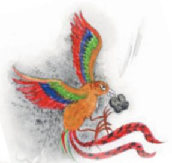

# 精卫填海①13

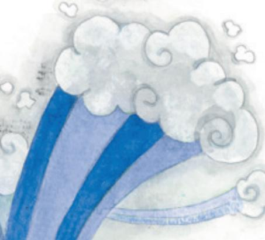

shào yuē炎帝②之少女③，名曰女娃。女娃游nì fǎn于东海，溺④而不返，故⑤为精卫，常衔yīn西山之木石，以堙⑥于东海。

## 注释

① 本文选自《山海经·北山经》。精卫，神话中鸟的名字，形状像乌鸦，头上有花纹，白色的嘴，红色的脚，传说是炎帝小女儿溺水身亡后的化身。

②〔炎帝〕传说中上古时期的部落首领。

③〔少女〕小女儿。

④〔溺〕溺水，淹没。

⑤〔故〕因此。

⑥〔堙〕填塞。

shào yuē nì fǎn 少 曰 溺 返

曰 溺 返 衔

正确、流利地朗读课文。背诵课文。

结合注释，用自己的话讲讲精卫填海的故事。

精卫给你留下了怎样的印象？和同学交流。

# sī14 普罗米修斯

很久很久以前，地面上没有火，人们只好吃生的东西，在无边的黑暗中度过一个又一个长夜。就在这时候，有一位名叫普罗米修斯的天神来到了人间，看到人类没有火的cǎn dào悲惨情景，决心冒着危险，到天上去“盗”取火种。

有一天，当太阳车从天空驰过的时候，普罗米修斯跑到太阳车那里，从喷射着火焰的车轮上，拿了一颗火星，带qū到人间。自从有了火，人类就开始用它烧熟食物，驱寒取暖，并用火来驱赶危害人类安全的猛兽……

得知普罗米修斯从天上取走火种的消息，众神的领袖bài chéng fēn fù宙斯气急败坏，决定给普罗米修斯以最严厉的惩罚，吩咐火神立即执行。

hè huái

火神赫淮斯托斯很敬佩普罗米修斯，悄悄对他说：“只shù要你向宙斯承认错误，归还火种，我一定请求他饶恕你。”

普罗米修斯摇摇头，坚定地回答：“为人类造福，有什rěn么错？我可以忍受各种痛苦，但决不会承认错误，更不会归还火种！”

## 人民教育出版社

火神不敢违抗宙斯的命令，只好把普罗米修斯押到高加索山上。普罗米修斯双手和双脚戴着铁环，被死死地锁zāo在高高的悬崖上。他既不能动弹，也不能睡觉，日夜遭受着风吹雨淋的痛苦。尽管如此，普罗米修斯就是不向宙斯qū屈服。

狠心的宙斯又派了一只凶恶的鹫鹰，每天站在普罗米zhuó gānzàng修斯的双膝上，用它尖利的嘴巴，啄食他的肝脏。白天，他的肝脏被吃光了，可是一到晚上，肝脏又重新长了出来。这样，普罗米修斯所承受的痛苦，永远没有了尽头。

许多年来，普罗米修斯一直被锁在那个可怕的悬崖上。

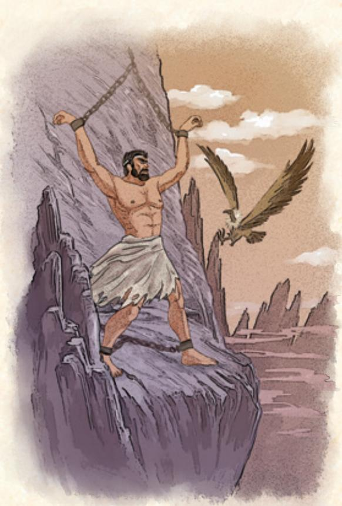

有一天，著名的大力lè士赫拉克勒斯经过高加索山。他看到普罗米修斯被fèn锁在悬崖上，心中愤愤不wǎn平，便挽弓搭箭，射死了zá那只鹫鹰，又用石头砸碎liàn了锁链。普罗米修斯—这位敢于从天上“盗”取火种的英雄，终于获得了自由。

# sī cǎn dào chí shù yā suǒ zāo è zàng fèn zá斯 惨 盗 驰 恕 押 锁 遭 恶 脏 愤 砸

# 悲 惨 兽 佩 坚 违 抗

环 锁 既 狠 著 愤 获

朗读课文，注意读好众神的名字。

按照起因、经过、结果的顺序，讲一讲普罗米修斯“盗”火的故事。

故事中哪个情节触动了你？和同学交流。

## 阅读链接

从前，在很远很远的地方有一个燧明国，太阳和月亮都照不到那里，所以那里没有白天黑夜，更没有春夏秋冬。燧明国国内有棵名叫燧木的火树，曲盘起来，有一万顷地那么大，能够发出火光，燧明国的人就在火树下生活。后来，有一个圣人来到了这个国家，在这棵大树下休息。他忽然看见许多像猫头鹰一样的鸟，它们在枝叶间用嘴啄木，每啄一下，就有灿然的火光闪现。于是，圣人领悟到了钻木取火的道理，回去就试着用小木棍来钻木，果然钻出了火。圣人发现了生火的方法，让人们不再过茹毛饮血的生活，所以后人称呼他为燧人。

我从燧人钻木取火的故事中感受到了不同的神奇。

——根据袁珂的《神话选译百题》相关内容改写

# wā\*15 女娲补天

《女娲补天》这个神话故事，处处充满着神奇的想象。默读课文，说说故事的起因、经过和结果。发挥自己的想象，试着把女娲从各地拣来五种颜色石头的过程说清楚、说生动。

自从女娲创造了人类，大地上到处欢声笑语，人们过着快乐幸福的生活。

不料有一年，天地忽然发生了一场大变动。天上露出yǒu hóng一个大窟窿，地上也裂开了一道道黑黝黝的深沟，洪水从地下喷涌而出，各种野兽也从山林里跑出来残害人类。人cuò xiàn hùn bù们惊慌失措，四处奔逃，整个世界陷入了一片混乱和恐怖之中。

女娲看到这情景，难过极了，决心把天和地修补起来，让人类重新过上幸福的生活。

这可是一项巨大而又艰难的工作。女娲先从各地拣来  
chì  
赤、青、黄、白、黑五种颜色的石头，燃起神火熔炼。随xī nián jiāng  
着神火渐渐熄灭，五种颜色的石头被炼成了黏稠的石浆。  
女娲用这些石浆把天上的大窟  
窿修补好。从此，天上便有了  
五色的云霞。女娲担心补好的tā  
天再塌下来，于是又杀了一只zhǎn  
大海龟，斩下它的四条腿，竖  
立在大地的四方，把人类头顶  
上的天空撑起来，这样天就再tān  
没有了坍塌的危险。接着，她  
奋勇杀死了在中原一带作恶的  
黑龙，其他野兽见此情景，吓  
得纷纷逃回山林，再不敢到处cuàn  
流窜残害人类了。最后，女娲  
把芦苇烧成灰，撒到水中，芦  
灰越积越厚，把喷涌洪水的地  
缝也堵住了。

天和地终于恢复了平静，人类获得了新生。人们世世代sòng代怀念着女娲，传颂着她的伟jì大功绩。

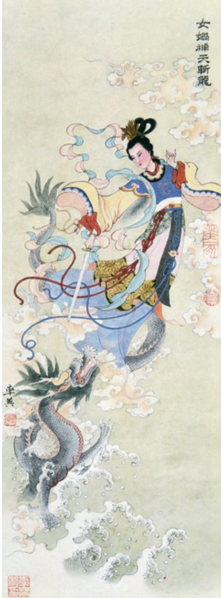  
（图）任率英

# hóng cuò hùn xiàng xī jiāng tā cuàn sòng jì 洪 措 混 项 熄 浆 塌 窜 颂 绩

## 我和 过一天

我们读过很多故事，里面的人物有的本领高强、爱憎分明，如哪吒、葫芦娃；有的机智聪明、惩恶扬善，如神笔马良；有的美丽纯洁、温柔善良，如白雪公主。你了解他们吗？喜欢他们吗？你还喜欢哪些人物呢？

如果有机会和他们中的某一位过上一天，你会选择谁？你们会一起去哪里？会做些什么？会发生什么故事呢？

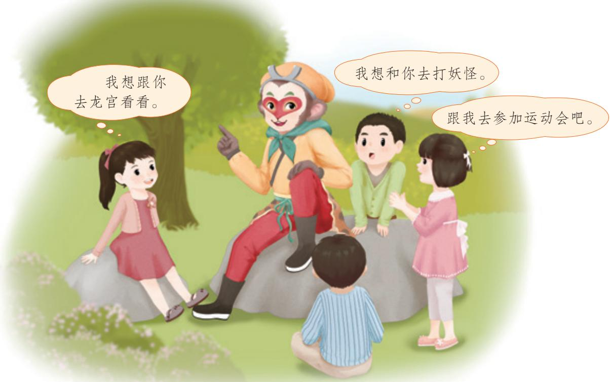

把自己的想法和小组同学说一说，再写下来。写完后，听听同学的意见，认真修改，最后誊写清楚。

# 人民教育出版社

# 语文园地

## 交流平台

神话充满神奇的想象，像《盘古开天地》《女娲补天》……让我赞叹不已。

神话中很多人物个性鲜明，如精卫坚韧执着、普罗米修斯勇敢不屈……

古人创造了许多神话故事，来表达他们对世界的认识，如普罗米修斯上天“盗”取火种，就是古希腊人对火种来源的一种解释。

## 识字加油站

pǔ huì lěi ruǐ 花圃 花卉 花蕾 花蕊 méi mò lì mǔdān táng 玫瑰 茉莉 牡丹 海棠

pǔ huì lěi ruǐ méi mò lì mǔ dān táng圃 卉 蕾 蕊 玫 茉 莉 牡 丹 棠

## 词句段运用

说说下面的词语让你想到了哪些人物或故事。腾云驾雾 上天入地 神机妙算 各显神通bǔ三头六臂 神通广大 未卜先知 刀枪不入

读下面的句子，感受想象的神奇。你在其他神话故事中，也读到过让你感到神奇的地方吗？和同学交流。

轻而清的东西，缓缓上升，变成了天；重而浊的东西，慢慢下降，变成了地。

◇ 当太阳车从天空驰过的时候，普罗米修斯跑到太阳车那里，从喷射着火焰的车轮上，拿了一颗火星，带到人间。wā jiǎn chì

◇ 女娲先从各地拣来赤、青、黄、白、黑五种颜色的石头，燃起神火熔炼。随着神火渐渐熄灭，五种颜色的石头被炼成了nián黏稠的石浆。女娲用这些石浆把天上的大窟窿修补好。

## 日积月累

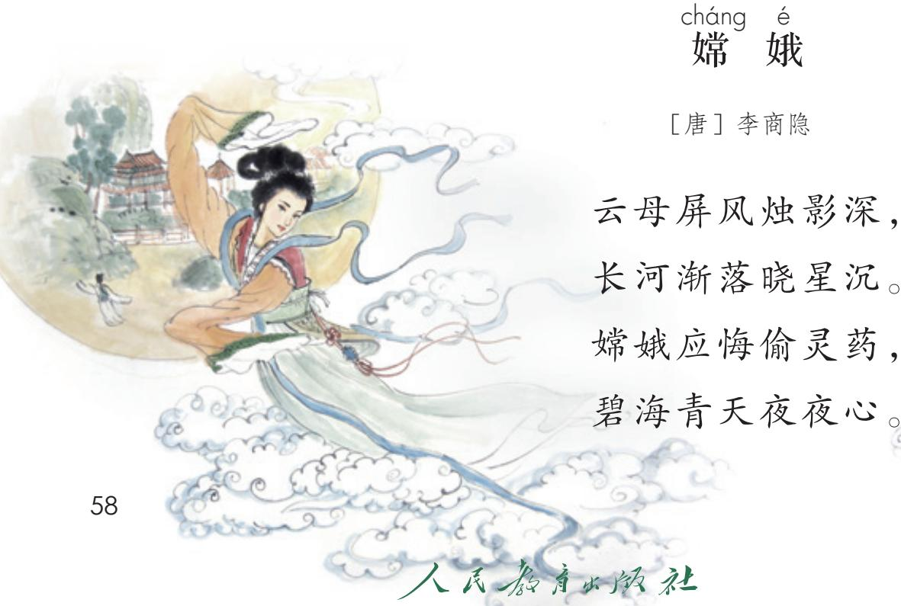

## 快乐读书吧

## 很久很久以前

世界是如何起源的？

人类是怎样产生的？

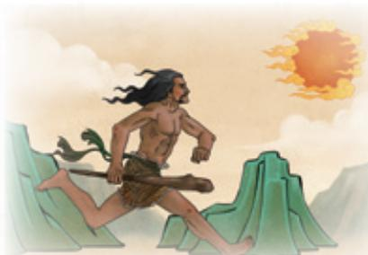

神和英雄是怎样生活的？

我们的祖先对世界的许多问题都抱有强烈的好奇心，他们尝试着用神话的方式给出解释，并依靠口头讲述使其代代相传。

## 你读过吗

古时候，人们饱受疾病之苦。为了治病救人，神农亲自试吃各种植物，以确定它们的药性。据说他的身体是透明的，吃了植物之后，可以看到植物在他身体里的反应。他试吃的植物太多了，经常中毒，最多的时候，一天之内中毒竟达七十次。幸亏他有神性，才不致死亡。后来，他获得了一根神奇的红色鞭子，无论什么植物，只要用这根鞭子一抽，立刻就能够显示出它的药性。神农根据各种植物的药性来治疗人们的疾病。相传我国第一部药学著作《本草经》就是神农所作，因此神农又被称为医药之神。

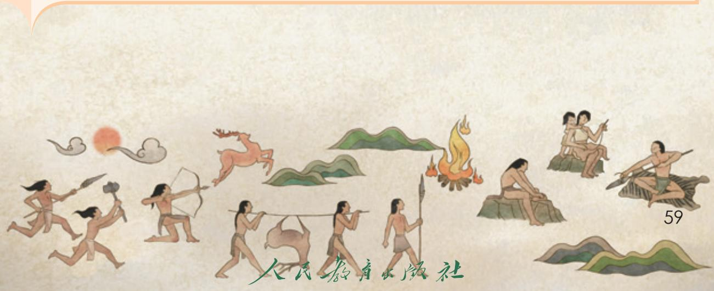

## 人民教育出版社

神农尝百草是我国著名的神话，展现了先人的开拓精神。让我们阅读更多的中国神话，感受神话那永恒的魅力。

远古时候人们认为神话是真实而神圣的，一定要在严肃的仪式上郑重地讲出来。

神话通常气魄宏大，如女娲补天、羿射九日，读的时候要发挥想象，感受其中的神奇。

## 相信你可以读更多

世界各地也流传着多姿多彩的神话传说。在这些充满想象的故事中，有许多鲜明的人物形象：古希腊神话中勇敢的大力士赫拉克勒斯，用音乐征服草木万物的俄耳甫斯；永远挂着迷人微笑的北欧光明之神巴德尔，爱恶作剧的火神洛基；还有敢捉弄北风的美洲辛格比……这些人物形象至今仍然熠熠生辉。

世界神话传说中藏着无穷无尽的奥秘，你读得越多，收获就越多，赶快开始吧！

第五单元

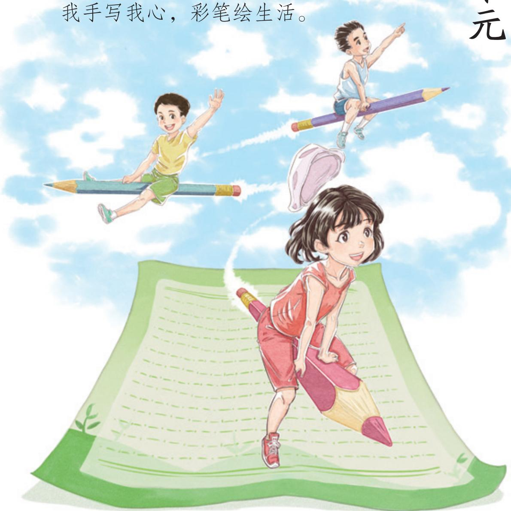

◎ 了解作者是怎样把事情写清楚的。

◎ 写一件事，把事情写清楚。

# 16 麻  雀

我打猎回来，走在林荫路上。猎狗跑在我的前面。

突然，我的猎狗放慢脚步，悄悄地xiù向前走，好像嗅到了前面有什么野物。

风猛烈地摇撼着路旁的白桦树。  
我顺着林荫路望去，看见一只小麻雀nài  
呆呆地站在地上，无可奈何地拍打着  
小翅膀。它嘴角嫩黄，头上长着绒毛，  
分明是刚出生不久，从巢里掉下来的。

猎狗慢慢地走近小麻雀，嗅了嗅，张开大嘴，露出锋利的牙齿。突然，一只老麻雀从一棵树上飞下来，像一块石zhā shā头似的落在猎狗面前。它挓挲起全身的羽毛，绝望地尖叫着。

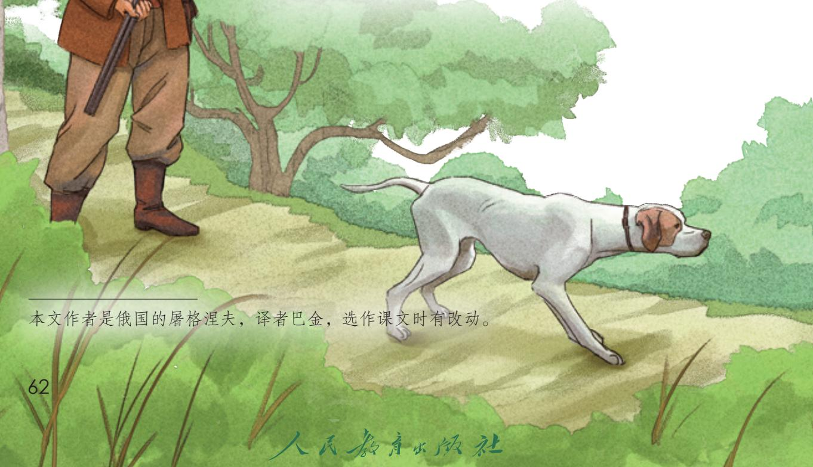

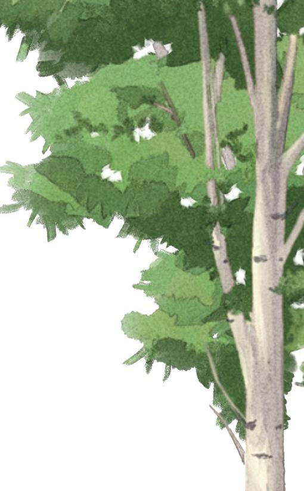

老麻雀用自己的身躯掩护着小麻zhěng雀，想拯救自己的幼儿。它准备着一场搏斗，可是因为紧张，它浑身发抖，发sī yǎ出嘶哑的声音。在它看来，猎狗是个多páng么庞大的怪物啊！可是它不能安然地站在高高的没有危险的树枝上，一种强大的力量使它飞了下来。

猎狗愣住了，它可能没料到老麻雀会有这么大的勇气，慢慢地，慢慢地向后退。

我急忙唤回我的猎狗，带着它走开了。

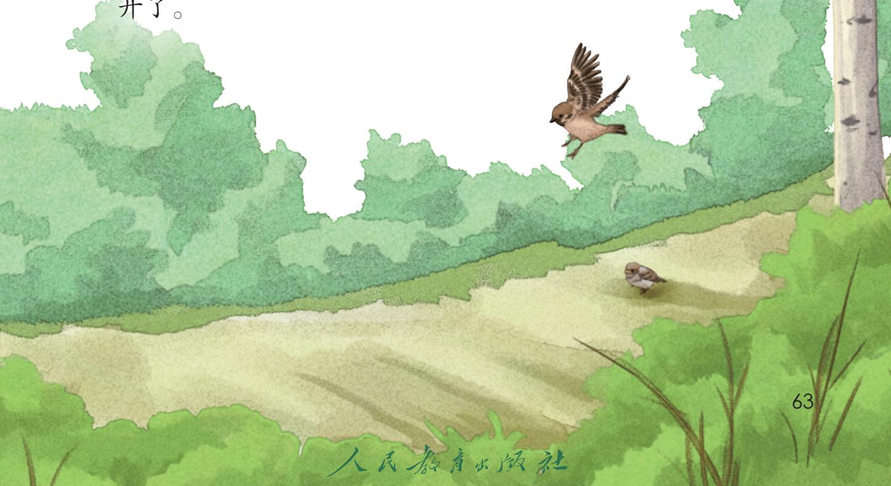

xiù nài zhěng sī yǎ páng

# 嗅 奈 拯 嘶 哑 庞

嗅 呆 奈 巢 齿 躯 掩

护 幼 搏 旦量

朗读课文。说说课文围绕麻雀写了一件什么事，这件事的起因、经过和结果是怎样的。

课文是怎样把下面的内容写清楚的？找出相关句子读一读。

wèi

◇ 老麻雀的无畏

◇ 猎狗的攻击与退缩

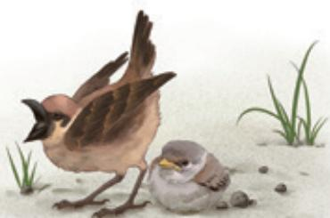

# 17 爬天都峰

假日里，爸爸带我去黄山，爬天都峰。

我站在天都峰脚下抬头望：啊，峰顶这么高，在云彩jí上面哩！我爬得上去吗？再看看笔陡的石级，石级边上的liàn铁链，似乎是从天上挂下来的，真叫人发颤！

忽然听到背后有人叫我：“小朋友，你也来爬天都峰？”

我回头一看，是一位白发苍苍的老爷爷，年纪比我爷爷还大哩！我点点头，仰起脸，问：“老爷爷，您也来爬天都峰？”

老爷爷也点点头，说：“对，咱们一起爬吧！”

我奋力向峰顶爬去，一会儿攀着铁链上，一会儿手脚并用向上爬，像小猴子一样……

爬呀爬，我和老爷爷，还有爸爸，终于都爬上了天都峰顶。

xiàng

在鲫鱼背前，爸爸给我和老爷爷照了一张相，留作纪biàn hē  
念。老爷爷拉拉我的小辫子，笑呵呵地说：“谢谢你啦，小  
朋友。要不是你的勇气鼓舞我，我还下不了决心哩！现在

居然爬上来了！”

“不，老爷爷，我是看您也要爬天都峰，才有勇气向上爬的！我应该谢谢您！”

爸爸听了，笑着说：“你们这一老一小真有意思，都会jí从别人身上汲取力量！”

jí liàn pān xiàng biàn hē级 链 攀 相 辫 呵

级 链 颤 攀 猴 念 辫 呵

这篇课文写了一件什么事？是按照什么顺序写的？

“我”开始不敢爬，最后爬上去了。课文是怎么把“我”爬山的过程写清楚的？

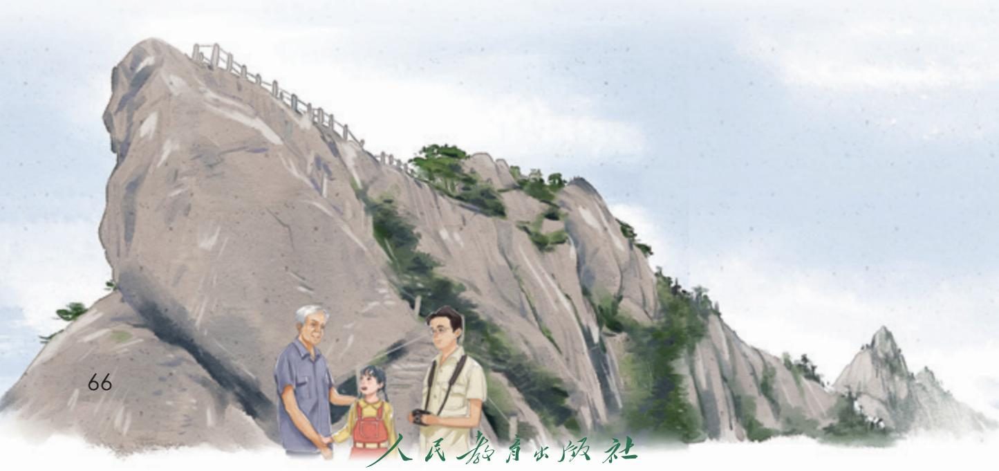

## 交流平台

写一件事，要把事情的起因、经过、结果写清楚。

写事情要按照一定的顺序写。如，《爬天都峰》是按照爬山前、爬山中、爬上峰顶后的顺序来写的。

时间、地点、人物要交代明白。

《麻雀》的作者把看到的、听到的、想到的都写了下来，活灵活现地展现了麻雀和猎狗相遇时的情形。

## 初试身手

看图并发挥想象，把图片的内容说清楚。

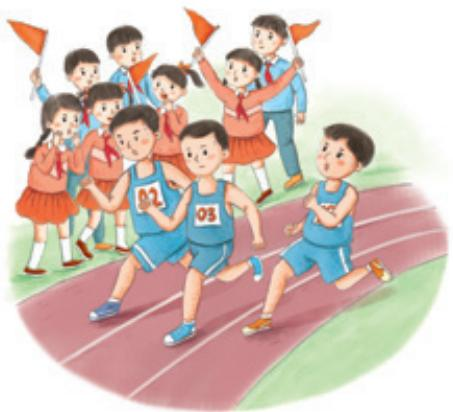

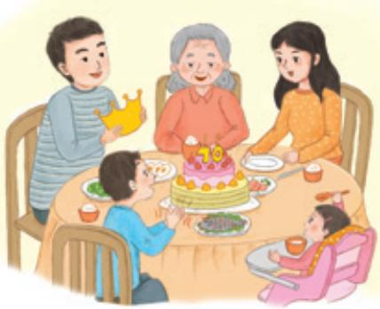

观察家人炒菜、擦玻璃或者做其他家务的过程，用一段话把这个过程写下来，注意用上表示动作的词语。

## 习作例文

## 我家的杏熟了

我家院子里有一棵大杏树。每年到了麦收时  
节，树上就结满了金黄的杏。从我家门前路过的人，xiàn hē  
总要望望那棵杏树，羡慕地说道：“嗬，好杏啊！”

杏树是奶奶亲手栽的，听奶奶说栽杏树的时wēi候还没有我呢。有一回，我依偎在奶奶的怀里问她：“奶奶，咱们家树上的杏有多少个？”

“就像天上的星星一样，多得数不清。要不，你数数看。”

开头通过 “说杏”“数杏”， 介绍了杏好、杏 多。

我仰着头数起来，“一、二、三……”数啊，rěn数啊，数到后来就糊涂了。奶奶忍不住笑了。我不知道奶奶是笑我傻，还是笑杏多。

这一年，杏又熟了。有一天，奶奶正在做饭，忽然听见有孩子在哭。奶奶急忙走出去，原来是邻居家的小淘淘嘴馋摘杏，不小心从树上摔下来了。和他一起来的小伙伴见了奶奶都低下了头，不敢吱声。我没好气地说：“看我奶奶怎么收拾你们！”

奶奶走过去扶起小淘淘，给他揉揉腿，看他没伤着，就站起身往屋里走，又回过头来对孩子们说：“你们先别走。”

# 人民教育出版社

过了一会儿，奶奶拿了一根长竹竿从屋里出来了。她走到树下，挑熟了的杏往下打。她脚底下站不大稳，身子颤颤巍巍的。

杏一个接一个落在地上。奶奶把它们捡起来，dōu不一会儿就捡了一围兜。奶奶把小淘淘和他的伙伴都叫了过来，一人分给五六个，剩下的几个给了我。看他们吃得那样香甜，奶奶嘴角露出了微笑，转过头对我说：“要记住，杏熟了，让乡亲们都尝个鲜，果子大家吃，才真的香甜呢！”

听了奶奶的话，我点了点头。从那以后，我zhǔ fù  
每年都照着奶奶的嘱咐，把熟透了的金黄金黄的  
杏分给小伙伴们吃，也送给邻居叔叔婶子们尝鲜。

奶奶“打杏 ”“ 捡 杏 ”“分杏”的动作、语言写得很清楚。

结尾交代了奶奶“分杏”这件事对“我”的影响。

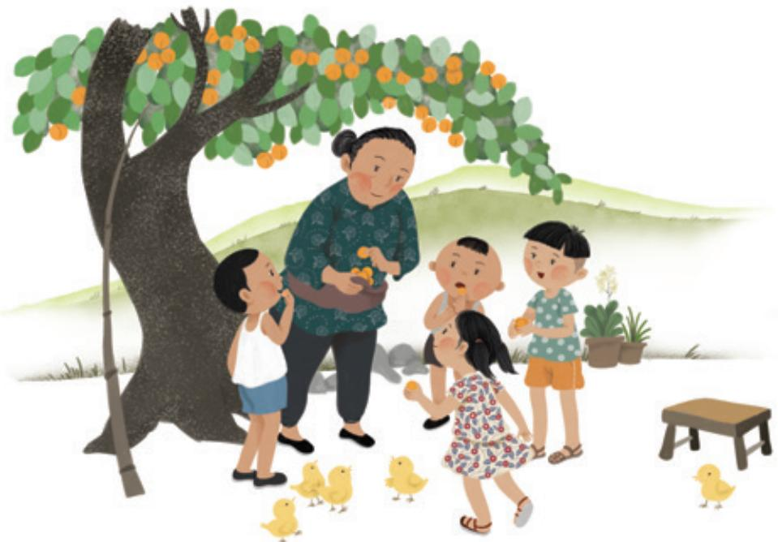

按照事情发展的顺序，课文是怎么把奶奶“分杏”这件事写清楚的？

事情是围绕“小木船”来写的。

简单介绍陈明和“我”是好朋友。

友谊破裂 的过程写得很 清楚。

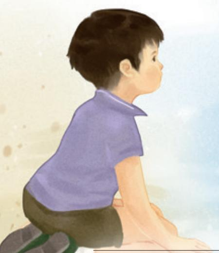

## 小木船

每当我看见珍藏在抽屉里的那只精致的小木船，就想起陈明来。

上小学一年级的时候，陈明和我是同班同学。我们两家离得很近。每天我们一起上学，回家，一起温习功课。我们成了形影不离的好朋友，直到四年级。

有一天，发生了一件不愉快的事。我们俩温习完功课，把自己在舰模小组做的小木船拿出来玩。我见他那只做得很精致，就拿在手上，翻过来掉过去地看，总舍不得放下。不料我一失手，啪的一声，小木船掉在地上，摔坏了。他一看，急了，哭着要我赔。我上前分辩说：“我不是故意的。”他生气地说：“谁叫你不小心，非赔不可！还用力推了我一下。我往后一退，正好一脚踩在小木船上，把它踩碎了。这一下，陈明更生气了。他拿起我的小木船，使劲摔在地上，用脚踩了两下，一把抓起书包，头也不回地走了。看着被他踩坏的小木船，我也气得说不出话来。我们的友谊从此破裂了。

本文选自人民教育出版社 《全日制十年制学校小学课本 （试用本）语文第七册》，有改动。

转眼几个月过去了。有一天放学回家，我走在前面，陈明走在后面。我偷偷地回头看了他一dōu眼，他右手插在裤兜里，裤兜胀得鼓鼓的，不知zuàn手里攥着什么。忽然，他几步追上了我，从裤兜里掏出一只精致的小木船来。我惊讶地望着他。他满脸通红，激动地说：“那次是我不好，不该弄坏你的船。明天我家就要搬走了，我做了这只船sāi送给你，留个纪念吧！”说着，他把小木船塞到我手里。想想那天发生的事，本来是我的错，望着他那双热情的眼睛，我一句话也说不出来，只是紧紧地握住他的手。

这段话交代了“我”和陈明和好的过程。

陈明跟着爸爸妈妈搬到外地去了。那天以后，我们俩再也没有见过面。我把他送给我的小木船珍藏在抽屉里。一看见这只精致的小木船，我就好像看见陈明站在我的面前。

“我”和陈明的矛盾持续了很长一段时间，课文只用“转眼几个月过去了”一句话加以交代，你觉得课文有没有把事情写清楚？和同学交流。

## 生活万花筒

每天都会发生各种各样的事情，有些是我们亲身经历的，有些是我们看到的，还有些是我们听说的。

选一件你印象深的事，按一定的顺序把这件事情写清楚。可以参考下面的题目，也可以另选要写的内容。

捉蚊趣事 一件烦心事她收到了礼物 爷爷戒烟了照片里的温暖 家庭风波教室里的掌声 信不信由你

写之前，仔细想想这件事的起因、经过、结果是怎样的。

<table><tr><td>事情</td><td></td></tr><tr><td>起因</td><td></td></tr><tr><td>经过</td><td></td></tr><tr><td>结果</td><td></td></tr></table>

写完后，读给同学听，请同学说说这件事是否写清楚了，再参考同学的建议修改。

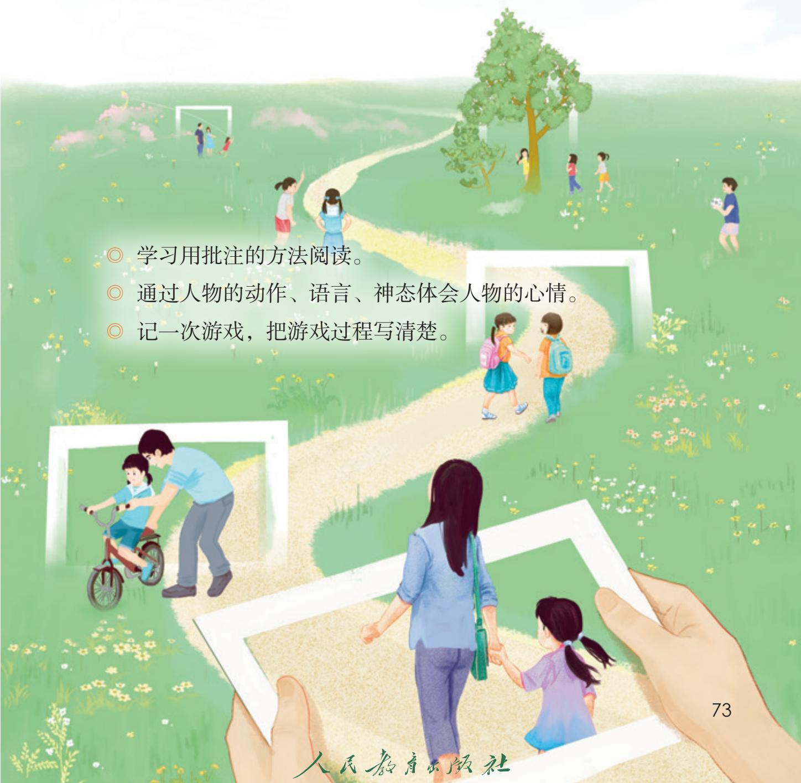

第六单元

童年啊！是梦中的真，是真中的梦，是回忆时含泪的微笑。

——冰心

# 18 牛和鹅

大家都说：牛的眼睛看人，觉得人比牛大，所以牛是怕人的；鹅的眼睛看人，觉得人比鹅小，所以鹅不怕人。

我们都很相信这句话。

所以我们看到牛，一点儿不害怕，敢用手拍它的背，摸它的肚子，甚至敢用树枝去wèi触它的屁股呢！可是牛像是无所谓似的，只bān是眨眨眼，把尾巴甩几甩。有的孩子还敢扳牛角，叫它跪下来，然后骑到牛背上去。我quán chuí那时虽然不敢这样，可是用拳头捶捶牛背还是敢的。

我们看到鹅，那就完全两样了：总是远远地站在安全的地方，才敢看它。要是在路上碰到鹅，就得绕个大圈子才敢走过去。

有一次，我们放学回家，走过池塘边，看见有四只大白鹅在靠近岸边的水里游。我

们马上都不说话了，贴着墙壁，悄悄地走过去。我的心里很害怕，怕它们看见了会追过wán  
来。这时，有一个顽皮的孩子故意要引它们yū  
来，就吁哩哩哩地叫了一声。鹅听见了，就竖起头来，侧着眼睛看了看，竟爬到岸上，一摇一摆地、神气地朝我们走过来；还伸长脖子，gā  
嘎嘎地叫着，扑打着大翅膀，好像在它们眼里根本没有我们这些人似的。孩子们惊呼起来，急急逃跑，鹅追得更  
快了。我吓得脚也软了，更跑不快。这时，dā  
带头的那只老公鹅就啪嗒啪嗒地跑了过来，  
嘎嘎，它赶上了我，嘎嘎，它张开嘴，一口jīn  
就咬住了我当胸的衣襟，拉住我不放。在忙  
乱中，我的书包掉了，鞋子也弄脱了。我  
想，它一定要把我咬死了。我就又哭又叫，  
可是叫些什么，当时自己也不知道，大概是  
这样叫吧：“鹅要吃我了！鹅要咬死我了！”

逃跑—被鹅咬住—呼救，那种惊慌失措写得很真实。

也许是我的哭叫更惹怒了这只老公鹅。zhuó  
它用全身的力量来拖我，啄我，扇动翅膀来  
扑打我。我几乎被它拖倒了——因为当时我

还很小，只不过跟它一样高呢！其他几只鹅在后面嘎嘎大叫着助威。

就在这时候，池塘里划来了一只小船，kuí捉鱼的金奎叔从船里跳上岸，飞快地走了过来（这些，我都是后来才知道的，当时是完全昏乱了）。金奎叔是个结实的汉子，他的bó胳膊比我的腿还粗。他一把握住了鹅的长脖子。鹅用脚爪划他，用嘴啄他。可是金奎叔的力气是那么大，他轻轻地把鹅提了起来，píng然后就像摔一个酒瓶似的，呼的一下，把这只老公鹅甩到了半空中。它张开翅膀，啪啪啪地落到了池塘中。这一下，其余三只鹅也怕了，纷纷张开翅膀，跳进池塘里，向远处游去。

这一摔是那么痛快，远处的孩子们全笑bù了起来，我也挂着泪笑了。一切的恐怖，全消失了。因为在金奎叔的手里，鹅是那么弱，那么可笑，它，不过跟一个酒瓶子一样罢了！

金奎叔帮我穿上鞋，拾起书包，用大手摸摸我的头，说：“鹅有什么可怕的！看把你吓成这样。”

我说：“因为鹅把我们看得比它小哇！”

金奎叔说：“让它这样看好了！可是，píng qī它要是凭这点来欺负人，那咱们可不答应，qiā就得掐住它的脖子，把它摔到池塘里去。记lín着，霖哥儿，下次可别怕它们。”

我记住金奎叔的话，从此不再怕鹅了。有什么可怕的！虽然它把我们看得比它小，可我们实在比它强啊！怕它干吗？果然，我不怕它，它也不敢咬我，碰到了，只是嘎嘎叫几声，扇几下翅膀，就摇摇摆摆走开了。

看来鹅并不可怕！只要不怕它，鹅就不敢欺负人了。

看到牛，我也不再无缘无故欺负它了。我觉得虽然它把我们看得比它大，可我们平白地去欺负它干吗？

直到现在，我还记着金奎叔的话。

wèi quán chuí wán yū jīn bó píng bù píng qī qiā 谓 拳 捶 顽 吁 襟 膊 瓶 怖 凭 欺 掐

摸 甚 跪 捶 绕 脖 脱顽

概 惹 昏 握 凭摔 掐结合课文中的批注，想想可以从哪些角度给文章作批注，和同学交流。

一边默读一边画出相关词句，体会“我”见到鹅和被鹅袭击时的心情。

说说为什么“直到现在，我还记着金奎叔的话”。

## 阅读链接

牛的眼睛总是湿润的，它终生都在流泪。牛的眼睛是诚实的，在生命界，它的眼睛最没有恶意。牛的眼睛也是美丽的，无论雌雄老少，都有着好看的双眼皮，长着善眨动的睫毛，以及天真黑亮的眸子。

牛在任何地方都会留下蹄印，这是它用全身的重量烙下的印章。它不在意自己身后留下了什么，绝不回头看自己蹄印的深浅，走过去就走过去了，它相信自己的每一步都是实实在在走过去的。雨过天晴，牛的蹄窝里的积水像一片小小的湖，会摄下天空和白云的倒影，有时还会摄下人的倒影。那些留在树林里和旷野上的蹄印，将会被落叶和野花遮掩起来，成为蛐蛐们的乐池。而有些蹄印，比如牛因为探路踩在幽谷苔藓上的，就永远留在那里了，成为大自然永久的秘密。

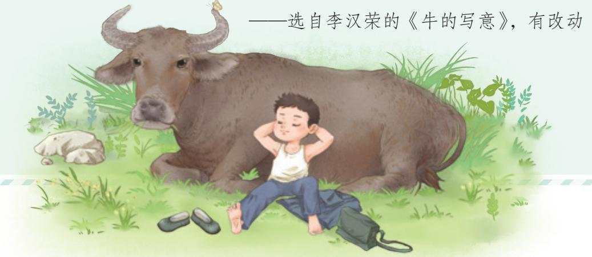

## náng19 一只窝囊的大老虎

我念的那所小学每星期六下午全校开周会，会上总有文艺表演。由十二个班级轮流演出，每个学期一个班级至多轮到两次。

我一直没在台上露过面，看着同班的小朋友在台上又唱又跳，边说边比画，我真个xiàn羡慕得要死。我多想在台上露露脸，尝尝大家都看着我、给我鼓掌是什么味道。

有一回又轮到我们班表演，班主任在分jué yīn派角色的时候，我殷切期待的目光可能引起了她的注意。分派到最后，她看了我半晌才下决心说：“就这样吧，你扮老虎。”

这一回我们班演的是《兄妹历险记》，中间有这么一段情节：兄妹俩在森林里迷了路，碰上一只大老虎。我就扮这只大老虎，用不着说话。

于是开始排练。我套上老虎皮，那是一件画着黑道道的黄布连衣裤，背后拖着一条硬邦邦的尾巴，穿上了手脚都不露。还得套上个纸糊的老虎头，那老虎头也是黄底子上画着黑道道，额头正中还有个“王”字。

这倒好，脸还是露不成。捧着严严实实kuī的“头盔”，我正发愣。那个演哥哥的小朋huò友还故意逗我：“你会豁虎跳吗？”

“不会。”我只好照实回答。

“不会豁虎跳算什么老虎？”他撇了撇嘴。

真没想到，事到临头还会出现危机。我看着老师的脸，就怕她改变主意。

老师真是个通情达理的好老师。她说：“不要紧，扮老虎不一定要豁虎跳。你先四脚着地爬上台，见了他们兄妹俩就站起来，ā wū啊呜啊呜叫着，向他们扑过去，他们逃，你就追。等到猎人上场，对你连开两枪，你就躺下来—死掉。记住了吗？”

“记住了！”我连忙答应。我有充分的自信。

“现在开始排练。你把老虎头套上。”

méi jiàng

套上老虎头，一股霉糨糊味儿直冲脑kuī门，眼前也一片模糊。亏得眼睛那儿挖了两个小窟窿，要不就什么也看不见了。

我弯下身子向前爬，老师在一旁不断地提示：“向前爬，再向前爬，快站起来，你没看见他们吗？向他们扑过去！唉，你怎么不叫哇？嗓门要大。别忘了你不是猫，你是一只大老虎！”

我还以为扮老虎是最容易不过的了，不用说话，不用露脸，没想到也这么难。

看来老师对我的演技并不满意，她倒没说什么。那位演哥哥的小朋友话可多了，说我这只老虎太窝囊，连豁虎跳也不会，只会在地上爬，还说他从没见过不会豁虎跳的老虎。随他说去吧，我这个配角虽然配不上他，可是老师没撤换我，他也只好将就。

终于到了星期六，到了下午，到了我们班演出的那个时刻。

我穿上老虎皮，套上老虎头，紧张地等  
候在后台的上场口。忽然背后有人轻轻推了  
我一把。我知道推我的是老师，立刻弯下身  
子爬上场去，嘴里啊呜啊呜直叫。只听见台hōng  
下一阵哄堂大笑，笑得我脸上一阵热。我已

人民教育出版社

zhuō

经明白，我笨拙的表演把全场的老师同学都逗乐了，他们从没见过这样窝囊的老虎。

我总算一直演到了躺下来死掉。到底怎么演完的，我一点儿也记不起来，只记得耳边的笑声接连不断。等到幕布拉下，我站起来摘下老虎头，满头满脸都是汗珠。

老师倒没说什么。那位演哥哥的小朋友āi唉声叹气地对我说：“你一出场就豁几个虎跳，那就强多了。”我没回答他，可是心里想：是啊，要是我会豁虎跳，这场戏就不至于砸锅了。

shì

后来呢？后来我发誓，今后决不再扮演老虎。可是每回上动物园，我总要去看看老虎，想看看老虎是怎么豁虎跳的。可是老虎kē duó在笼子里不是打瞌睡，就是垂头丧气地踱来踱去，从没见过它们豁过什么虎跳。

为什么不会豁虎跳就不能扮老虎呢？为什么没豁虎跳就会惹起哄堂大笑呢？我至今还不明白。

# náng lòu xiàn jué yīn kuī piě ā méi kuī hōng zhuō āi囊 露 羡 角 殷 盔 撇 啊 霉 亏 哄 拙 唉

殷 俩 练 套 裤班 鼓

逃 亏 挖 撤 堂 砸 锅

默读课文，在你不理解的地方作批注，和同学交流。

从开始对演出充满期待，到最后疑惑不解，“我”的心情有怎样的变化？为什么会有那样的变化？结合课文相关语句，填写下面的表格。

<table><tr><td>“我”的心情</td><td>原因</td></tr><tr><td>期待表演</td><td>想在台上露脸，获得大家的掌声。</td></tr><tr><td>有些担心</td><td></td></tr><tr><td></td><td></td></tr></table>

结合生活经验说一说：“我”的演出窝囊吗？可以怎么开导“我”？

## 选 做

排练时的情形，“我”记忆很深刻，而表演时“到底怎么演完的，我一点儿也记不起来”。你有过类似的经历吗？写下来和同学交流。

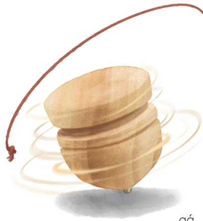

# 20 陀  螺

在我的故乡，陀螺不叫陀螺，叫作“冰gá尜儿”，顾名思义，就是冰上的小家伙。

做冰尜儿用的是木头，柳木、榆木、松木、枣木、梨木都可以。抽打冰尜儿，当然是在冬季的冰天雪地里，最好的场所是冰qiàn面。好的冰尜儿尖部嵌一颗滚珠，转起来能wǔ mèi增加许多妩媚。顶不济的，也要钉上一枚铁dīng钉，否则转不了多少圈，尖部就会开裂。无论嵌上滚珠，还是钉上铁钉，冰尜儿都不会裂开，能毫无怨言地让你抽打，在冰面上旋转，舞蹈。

抽冰尜儿的小伙伴们，都爱比个高下。他们往往各站一角，奋力抽转自己的冰尜儿，让它朝对方撞去。这时你看吧，两只旋转的陀螺奋勇搏斗，旋风般撞向对手，刚一接触，又各自闪向一边，然后重整旗鼓再

战——直到其中一方被撞翻才告一段落。赛  
陀螺每次都是体重个大的一方占上风。因  
此，只有小陀螺的大多在自家院子里玩，不kuàng  
拿到马路上去应战。况且小陀螺有个难听的  
chuò zhuī  
绰号叫“角锥”，意思是小且细。抽打“角tì dāng  
锥”的大多是拖鼻涕穿开裆裤的，他们的兴  
趣在于抽鞭子，对陀螺的质量往往不在意。

我从小就不甘人后，更不愿自己的陀螺bīng yuè bài像金兵见到岳家军，一战即败。于是四处寻找木头，为削出得心应手的陀螺，就差没把椅子腿拿来“废物利用”了。为此不知挨了多少责骂，可仍然不肯住手。然而一个孩子无论如何是削不出高质量的陀螺的，因此，曾有很长一段时间我的世界堆满乌云，快乐像过冬的燕子一般，飞到一个谁也看不到的地方去了。

这种懊恼终于引起了长辈的注意。我的叔叔，一位很有童心的年轻民警，答应在我生日那天送我一只陀螺。这消息曾使我一整huǎnghū天处于恍惚的状态，老想象着那只陀螺英武的风姿。

叔叔的礼物不错！

这只陀螺不是人工削出来的，而是一位木工在旋床上旋出来的，圆且光滑，如同一枚鸭蛋。虽然它远不如我想象中的那么漂亮，但我极高兴地接受了它。尤其当我看到这枚“鸭蛋”的下端已嵌上一粒大滚珠时，更是手hèn舞足蹈，恨不得马上在马路上一显身手！

我的陀螺刚一露面，就招来了一顿嘲shuài笑。的确，在各色帅气的陀螺面前，它长得不伦不类，该平的地方不平，该尖的地方不尖，看不出一丝一毫与同伴相斗的能力。这使我士气大减，只是在一旁抽打，不敢向任何人挑战。

然而世间许多事都是不可预料的，追求  
“和平”只是我的个人愿望，小伙伴们不甘寂xìn  
寞，一个大陀螺的主人开始傲慢地向我挑衅。

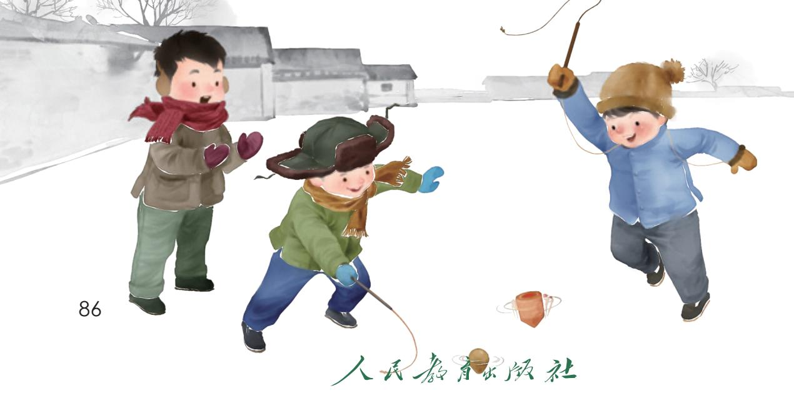

大陀螺摇头晃脑，挺着肚皮一次次冲过来，我的“鸭蛋”则不动声色地闪躲。一次次冲击，一次次闪躲，终于无法避开，它们狠狠地撞上了！

奇怪的是，我的陀螺个头小，却顽强得niǔ出奇！明明被撞翻在一边，一扭身又照样旋转起来。它圆头圆脑，好像上下左右都能找到支撑点似的。结果呢，大陀螺在这个始终chè kuì立于不败之地的对手面前，彻底溃败了。

huáng

这真是个辉煌的时刻！我尝到了胜利的滋味，品到了幸运的甜头。无意中获得的“荣誉”，虽然小如微尘，对好胜的孩子来说，也足以陶醉许久了——直到现在我还能兴致勃勃地写下这些文字，便是一种有力的证明吧！

我的冰尜儿，木工随便旋出的小木头chǒu块，丑小鸭生出的一只丑鸭蛋，在童年的zhōng一个冬日里，给了我极大的欢乐和由衷的háo自豪。

这真应了一句古话：人不可貌相，海水不可斗量。

dīng kuàng bīng bài hèn shuài chè kuì yù chǒu háo

钉 况 兵 败 恨 帅 彻 溃 誉 丑 豪

否 旋 况 败 椅 尤 恨

帅 预 溃 品 丑 豪

默读课文，在你体会比较深的地方作批注。

读下面的句子，体会“我”心情变化的过程。

◇ 因此，曾有很长一段时间我的世界堆满乌云，快乐像过冬的燕子一般，飞到一个谁也看不到的地方去了。

huǎnghū

◇ 这消息曾使我一整天处于恍惚的状态，老想象着那只陀螺英武的风姿。

◇ 尤其当我看到这枚“鸭蛋”的下端已嵌上一粒大滚珠时，更是手舞足蹈，恨不得马上在马路上一显身手！

这使我士气大减，只是在一旁抽打，不敢向任何人挑战。

◇ 这真是个辉煌的时刻！我尝到了胜利的滋味，品到了幸运的甜头。

“人不可貌相，海水不可斗量”，说说你对这句话的理解。

## 口语交际

## 安 慰

一个人遇到不顺心的事，往往心里会很难过。此时，如果有人安慰他一下，心情肯定会好一些。

在运动会4×100米接力赛中，小峰摔倒了，他的班级在这个项目上没有取得名次。

小丽的家要搬到另外一个城市，她马上就要离开自己的好朋友了。

出去玩的时候，小冰把手表弄丢了。这块手表是妈妈送给他的生日礼物。

都怪我，我要是没摔倒就好了。

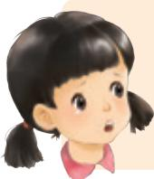

我不想搬走，不想离开好朋友。

我特别喜欢这块表，丢了好心疼啊！

如果你的朋友遇到了以上情况，要设身处地地想一想他的心情，然后再考虑怎样安慰他。选一种情况，和同学模拟练习。还可以想想周围有没有需要安慰的人，怎么安慰他比较好。

◎ 选择合适的方式进行安慰。◎ 借助语调、手势等恰当地表达自己的情感。

## 记一次游戏

丢沙包、抢椅子、跳长绳、两人三足跑、一二三木头人……游戏可以锻炼我们各方面的能力，可以让我们进入自由自在的快乐天地。今天就让我们来做一做、写一写有趣的游戏。

我们先一起来玩一个游戏。这个游戏可以是个传统游戏，也可  
以是个新游戏；可以是室内的，也可以是室外的。做完游戏后，把  
这个游戏写下来，也可以写以前和其他人一起拍摄一些游戏 拍摄一些游戏  
玩过的游戏。写之前可以想一想： 时的场景，可以帮 时的场景，可以帮

◇ 游戏前，你作过哪些准备？

助我们写好游戏。

◇ 在游戏中，你做了些什么？印象比较深的是什么？

◇ 游戏结束后，你有什么想法和感受？如，应遵守规则，伙伴间要团结协作，遇事要勇敢果断，坚持到底……

根据这些问题，把游戏写清楚，还可以写写自己当时的心情。写好后，给习作拟一个题目，最好能反映自己的感受。然后，自己读一读，用修改符号改正其中的错别字和不通顺的句子，最后誊写清楚。

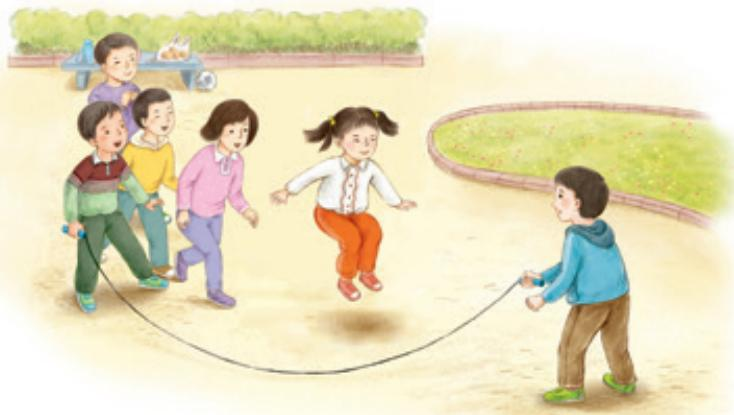

# 语文园地

## 交流平台

一边阅读一边作批注是很好的阅读方法。读文章时，遇到写得好的地方、有疑问的地方、有启发的地方……随时都可以作批注。

批注的方法多种多样。如，可以标画出相应的词句，也可以在旁边的空白处简单写写自己的批语。

读完文章，作完批注，再重新读一下文章和批注，可以加深对文章的理解，会有新的收获。

同学之间也可以互相交流自己作的批注，了解别人对文章的想法，丰富自己对文章的理解。

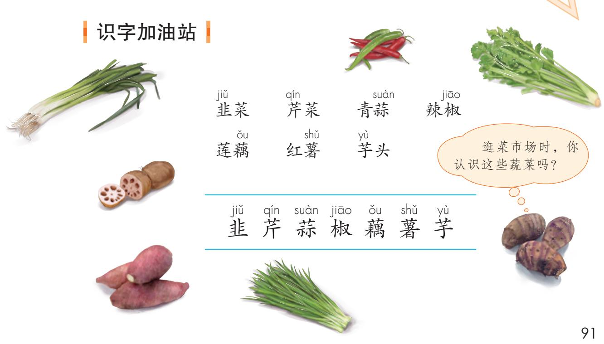

# 人民教育出版社

## 词句段运用

你知道下面词语的意思吗？说说你会在什么情况下使用它们。

打头阵 挑大梁 占上风 破天荒栽跟头 敲边鼓 开绿灯 碰钉子

我知道做事遭到拒绝或者受到挫折时，可以用“碰钉子”这个词语。

选一个词语，仿照例子用动作描写来表现它。

写“害怕”：

◇ 我们马上都不说话了，贴着墙壁，悄悄地走过去。我的心里很害怕，怕它们看见了会追过来。

◇ 妈妈一走，我就把屋里所有的灯都打开，然后钻进被窝，蒙上头，大气儿都不敢喘。

## 日积月累

◎ 尺有所短，寸有所长。 ◎ 机不可失，时不再来。

◎ 差之毫厘，谬以千里。 ◎ 病从口入，祸从口出。

◎ 一言既出，驷马难追。 ◎ 比上不足，比下有余。

第七单元

天下兴亡，匹夫有责。

◎ 关注主要人物和事件，学习把握文章的主要内容。

◎ 学习写书信。

## 21 古诗三首

## 出 sài塞

[唐] 王昌龄

秦时明月汉时关， zhēng   
万里长征人未还。 jiàng   
但使龙城飞将在，① ②   
不教胡马度阴山。③ ⑤ ④

## 注释

①〔但使〕只要。  
② 〔龙城飞将〕汉朝名将李广。这里泛指英勇善战的将领。  
③〔教〕令，使。  
④ 〔胡马〕指侵扰中原的北方游牧民族骑兵。  
⑤〔阴山〕位于今内蒙古中部及河北北部。

## 凉州词①

hàn[唐] 王 翰

葡萄美酒夜光杯，② pí pá 欲饮琵琶马上催。③ 醉卧沙场君莫笑，④ 古来征战几人回？

## 注释

① 〔凉州词〕唐代曲名，起源于凉州 （今甘肃武威）一带。  
② 〔夜光杯〕用美玉制成的杯子，夜间能够发光。这里指极精致的酒杯。  
③〔欲饮琵琶马上催〕正要举杯痛饮，却听到马上弹起琵琶的声音，在催人出发了。  
④〔沙场〕战场。

## 人民教育出版社

## 夏日绝句

[宋] 李清照

jié生当作人 杰，死亦为鬼雄。至今思项羽，①不肯过江东。②

## 注释

①〔项羽〕秦朝末年的起义军领袖，后来与刘邦争夺天下，失败自杀。

②〔不肯过江东〕项羽在与刘邦的斗争中失败，有人劝他东渡长江，再作打算。但他觉得无颜见江东父老，不肯渡江，自杀身死。江东，长江在安徽芜湖、江苏南京间作西南、东北流向，古人习惯上称自此以下的长江南岸地区为江东。

塞sài 秦qín 征zhēng 将jiàng 杰jié

塞 秦 征 词 催

醉 杰 亦 雄 项

有感情地朗读课文。背诵课文。默写《出塞》《夏日绝句》。

结合注释，说说下列诗句的意思。你从中体会到了什么？

◇ 但使龙城飞将在，不教胡马度阴山。

◇ 醉卧沙场君莫笑，古来征战几人回？

◇ 生当作人杰，死亦为鬼雄。

# jué 22 为中华之崛起而读书

fèng

新学年开始了，修身课上，奉天①东fàn wèi关模范学校的魏校长向学生们提出了一个严肃的问题：“你们为什么而读书？”

“为家父而读书。”

“为明理而读书。”

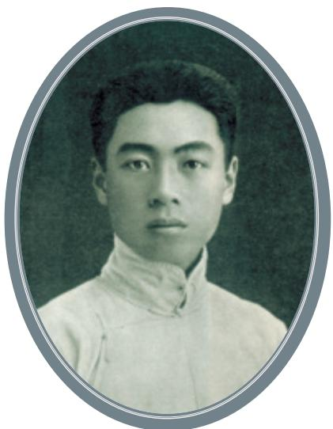  
青年周恩来

méi

“为光耀门楣而读书。”有人干脆这样回答。

有位同学一直默默地坐在那里，若有所思。魏校长注意到了，他打手势让大家安静下来，点名让那位同学回答。xī那位同学站了起来，清晰而坚定地回答道：

“为中华之崛起而读书！”

魏校长听了为之一振！他怎么也没想到，一个十二三岁的孩子，竟然有如此的抱负和胸怀！他睁大眼睛又追问了一句：“你再说一遍，为什么而读书？”

“为中华之崛起而读书！”

魏校长听了，连声赞叹：“好哇！为中华之崛起，有志xiào者当效此生！”

这位同学是谁呢？他就是周恩来，后来成为了中华人

民共和国的第一任总理。

周恩来出生于1898年。十二岁那年，他离开家乡江苏huái淮安，随回家探亲的伯父来到了东北。在奉天上学的时候，伯父告诉他，奉天有些地方被外国人占据了，不要随便去玩，有事也要绕着走，免得惹出麻烦没有地方说理。

少年周恩来疑惑不解，问道：“被外国人占据？为什么呢？”

“中华不振哪！”伯父叹了口气，没有再说什么。

十二岁的周恩来当然不能完全明白伯父的话，但是“中华不振”四个字和伯父沉郁的表情却让他难以忘怀。

一个星期天，周恩来背着伯父，约了一个同学来到了被外国人占据的地方。这一带果真和别处大不相同：街道上热闹非凡，往来的大多是外国人。

周恩来和同学一路上左顾右盼，忽然发现巡警局门前围着一群人。他们凑了过去，只见人群中有个女人正在哭诉着什么。一问才知道，这个女人的亲人被外国人的汽车yà chéng轧死了，她原本指望巡警局给她撑腰，惩处这个外国人，zhào xùn chì谁知中国巡警不但不惩处肇事的外国人，反而训斥她。围观的中国人都紧握着拳头，但这是在被外国人占据的地盘wèi里，谁又敢怎么样呢？大家只能劝慰这个不幸的女人。

此时的周恩来才真正体会到“中华不振”这四个字的

nàn qū沉重分量。怎么把祖国和人民从苦难和屈辱中拯救出来呢？这个问题像一团烈火一直燃烧在周恩来心中。所以，当修身课上魏校长提出为什么而读书这个问题时，就有了“为中华之崛起而读书”的响亮回答。

jué fàn wèi xī xiào huái huò chéng xùn chì nàn崛 范 魏 晰 效 淮 惑 惩 训 斥 难

肃 默 晰 振 胸 怀 赞 效 凡 顾 训 斥

默读课文，想想课文讲了哪几件事，再连起来说说课文的主要内容。

课文多次出现“中华不振”这个词语，查阅资料了解当时的社会状况，结合下面周恩来写的诗，理解他立下如此志向的原因。

suì  
大江歌罢掉头东，邃密群科济世穷。chóu  
面壁十年图破壁，难酬蹈海亦英雄。

## 小练笔

如果有人问你为什么而读书，你的回答是什么？想一想，写下来，注意写清楚理由。

# xù 23 梅兰芳蓄须

在京剧舞台上，梅兰芳主演的《贵妃醉酒》《霸王别姬》等享誉世界。默读课文，说说梅兰芳用了哪些办法拒绝为日本人演戏，在这个过程中经历了哪些危险和困难。有兴趣的同学可以查找资料，深入了解这位京剧大师。

梅兰芳先生是闻名世界的京剧表演艺术家。他在舞台dàn上唱旦角，为了演出的需要，总是把胡须剃得干干净净的。但他的一生中，有几年却是留着胡须的。

1937年，日军占领上海，梅兰芳被迫藏身租界，以躲jiū chán yāo gǎng避日本人的纠缠。1938年底，有人邀请他去香港演戏。演出结束后，梅兰芳在香港住了下来，深居简出，不再登台。对于一个视舞台为生活、视艺术为生命的人来说，不能演出，不能创作，无异于虚度生命。到了深夜，梅兰芳关紧门窗，拉上特制的厚窗帘，才能在寓所悄悄地细声吟唱，这对他来说已经很知足了。一个艺术大师就用这种方式坚持着对艺术的追求。

1941年12月香港沦陷。日本驻港司令官亲自出马，多

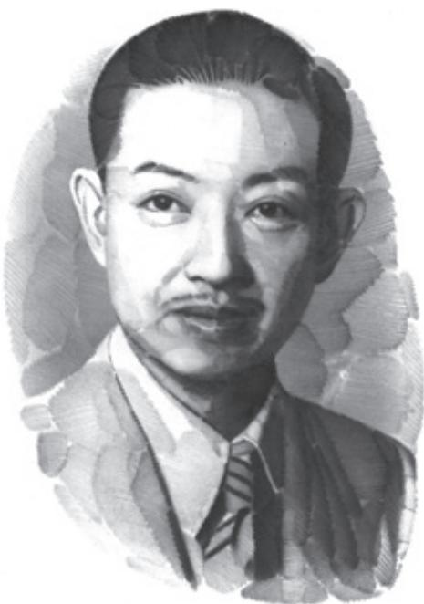

次逼迫梅兰芳演戏。梅兰芳可rěn  
以忍受生活的困顿，直面战争d qīn的危险，但他难以抵抗来自侵lüè rǎo jù  
略者随时随地的骚扰。拒绝的借口都用尽了，梅兰芳最后只能蓄须明志，表示对日本帝国主义的抗议，表明不给侵略者演戏的决心。后来，梅兰芳不kān  
堪其扰，只好又回到了上海。

长期不演戏，没有了经济来源，又要养家，梅兰芳准备卖掉北京的房子。听说梅兰芳要卖房子，很多戏园子老板找上门来说：“梅先生，您何必卖房子，只要您把胡子一剃，qiān dìng一登台，还愁没钱花？”有的甚至说，只要签订演出合同，就预支二十两黄金给梅兰芳。但是，无论戏园子老板开出nìng的条件多么优厚，梅兰芳全部拒绝了。他宁可卖房度日，也决不在日本侵略者的统治下登台演出。

一次，日本侵略军要庆祝“大东亚圣战”，要求他必zhǎn须上台演出。梅兰芳斩钉截铁地说：“普通的演出我都不参加，这样的庆祝会当然更不会去了。”但是，拒绝演出总得要想出个办法啊。

梅兰芳找到一位当医生的好朋友，说明了自己的危险处境，请朋友设法让他生一场“大病”，以摆脱日本人。这个朋友被他的爱国精神感动了，决心帮助他渡过难关，于是给他打了伤寒预防针，人打了这种针就会连日发高烧。

日本人不相信梅兰芳病了，专门派了一个军医来检查。日本军医闯进梅兰芳的家，看见他盖着棉被躺在床上，床边桌子上放着很多药。军医用手摸了摸梅兰芳的额头，滚zhàn烫滚烫的，看不出破绽，只好认定梅兰芳得了重病，不能wàng登台演出了。日本侵略者的妄想最终没有实现，梅兰芳为此差点儿丢了性命。

当抗日战争取得胜利的消息传来时，梅兰芳当即剃了胡须，高兴地向大家宣布：“胜利了，我该登台演出了！”前来看他演出的人太多了，很多人没有座位就站着看。

作为艺术家，梅兰芳先生高超的表演艺术让人喜爱，他的民族气节更令人敬佩！

xù pò zū jiū chán yāo gǎng rǎo jù qiān dìng nìng yāo wàng 蓄 迫 租 纠 缠 邀 港 扰 拒 签 订 宁 要 妄

## 难忘的一课

抗日战争胜利以后，我在台湾一家航业公司的轮船上工作。

有一次，我们的船停泊在高雄港。我上了岸，穿过市区，向郊外走去。不记得走了多远，我看到前面有一所乡村小学，白色的围墙，门外栽着一排树。

校园里很静，我走近一间教室，站在窗外，见一位年轻的台湾教师正在教孩子们学习祖国的文字。他用粉笔在黑板上一笔一画地写着：

“我是中国人，我爱中国。”

他写得很认真，也很吃力。台湾“光复”不久，不少教师也是重新学习祖国文字的。

接着，他先用闽南语，然后又用还不太熟练的国语，带着孩子们一遍一遍地读。老师和孩子们都显得那么严肃认真，又那么富有感情，好像每个字音都发自他们火热而真挚的心。

我被这动人的情景吸引住了。怀着崇高的敬意，我悄悄地从后门走进教室，在最后一排的空位上坐下，和孩子们一起，跟着那位教师，大声地、整齐地、一遍又一遍地朗读着：

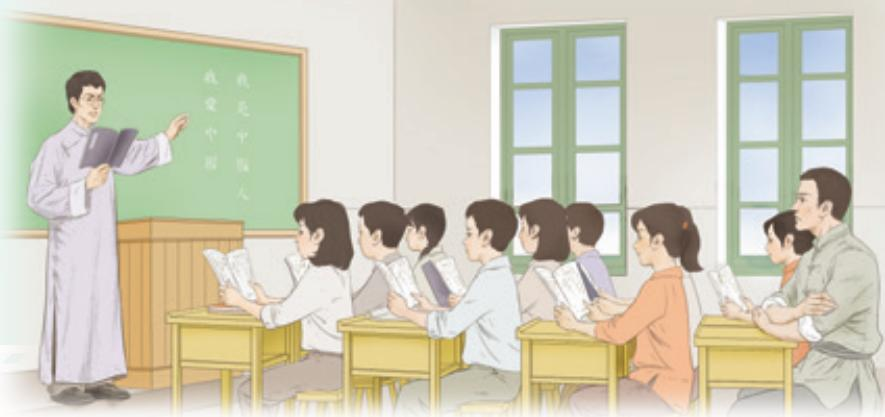

“我是中国人，我爱中国。”

老师和孩子们发现了我，但是，好像谁也没有感到意外。从那一双双眼睛里，可以看出大家对我是欢迎的。课在继续，大家读得更起劲了。

下课了，孩子们把我围了起来。

老师也走了过来。他热情地和我握了握手，说：“我的国语讲得不好，是初学的。你知道，在日本统治时期，我们上的都是日本人办的学校，讲国语是不准许的。”

“我觉得，你今天这一课上得好极了！你教得很有感情，孩子们学得也很有感情。”

接着，这位老师一定要领我去看一看他们的小礼堂。

说是礼堂，不过是一间比较宽敞的屋子。

这位老师指着礼堂两面墙上新画的几幅中国历代伟人像，说：“这里原来画的都是日本人，现在‘光复’了，画上了我们中国自己的伟人。”我看到上面有孔子，有诸葛亮，有郑成功，还有孙中山。看着看着，我的眼睛不觉湿润了。这是多么强烈的民族精神，多么深厚的爱国情意啊！

我紧紧地握着这位年轻的台湾教师的手，激动地重复着他刚才教给孩子们的那句话：“我是中国人，我爱中国。”还有什么别的话比这句最简单的话，更能表达我此时的全部感情呢？

本文作者田野，选用时有改动

## yán延24\* 安，我把你追寻

有感情地朗读这首诗。想一想：诗中多次提到“追寻”，是在追寻什么？和同学交流你的想法。如果有不懂的内容，如“南泥湾开荒”“杨家岭讲话”，可以查找相关资料帮助理解。

像翩翩归来的燕子，xī在追寻昔日的春光；像茁壮成长的小树，在追寻雨露和太阳。

追寻你，延河叮咚的流水， 追寻你，枣园梨花的清香， jué 追寻你，南泥湾开荒的镢头， 追寻你，杨家岭讲话的会场。

一排排高楼大厦像雨后春笋，lín láng一件件家用电器满目琳琅；

máo  
我们永远告别了破旧的茅屋，kàng  
却忘不了延安窑洞温热的土炕。

宇宙飞船探索太空的奥秘，电子计算机奏出美妙的交响；我们毫不犹豫丢掉了老牛破车，却不能丢宝塔山顶天立地的脊梁。

huáng  
延安，你的精神灿烂辉煌！dàn  
一旦失去了你啊，  
那就仿佛没有了灵魂，  
怎能向美好的未来展翅飞翔？

啊！延安，我把你追寻， 追寻信念，追寻金色的理想； mèi 追寻温暖，追寻明媚的春光； 追寻光明，追寻火红的太阳！

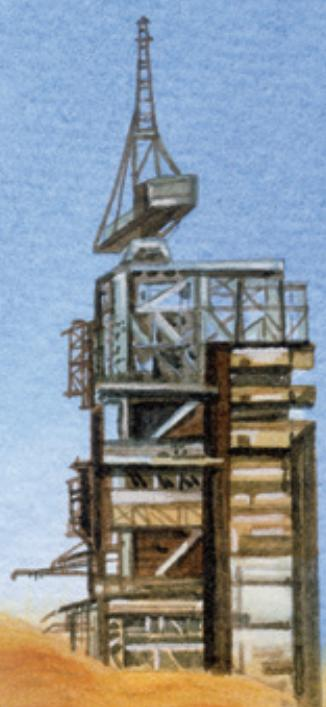

<table><tr><td>亲爱的叔叔：</td><td>称呼</td></tr><tr><td></td><td rowspan="9">问候语 正文</td></tr><tr><td>您好！</td></tr><tr><td>您寄来的书我已经收到了，我很喜欢。谢谢您！</td></tr><tr><td>告诉您一个好消息，我们学校搬进了新的校园。新</td></tr><tr><td>教室宽敞明亮，配有多媒体设备，上课时老师经常使用</td></tr><tr><td>它们。学校有一个很大的操场，我每天都会去踢足球。</td></tr><tr><td>搬进新校园，同学们天天都很开心。</td></tr><tr><td>您好久没回来了，家里人都很想您。今年过年，</td></tr><tr><td></td></tr><tr><td>您会回来吗？</td><td></td></tr><tr><td>祝</td><td>祝福语</td></tr><tr><td></td><td></td></tr><tr><td>身体健康！</td><td></td></tr><tr><td>侄儿小杰</td><td>署名</td></tr><tr><td>2018年11月25日</td><td>日期</td></tr><tr><td></td><td></td></tr><tr><td></td><td></td></tr></table>

## 习 作

## 写 信

书信曾经是人们和远方的亲人朋友互通消息、交流感情的主要方式，现在仍然是重要的联络手段。下面是小杰写给叔叔的一封信。

写好的信要寄出去，还需要有信封，和同学交流一下写信封的注意事项。

请给你的亲友或者其他人写一封信，可以通过邮局寄给对方，也可以通过电子邮件发给对方。

#

# 语文园地

## 交流平台

我发现题目有时能提示文章的主要内容，如《观潮》《盘古开天地》。

弄清事情的起因、经过、结果，能帮助我们把握文章的主要内容，如《普罗米修斯》。

有的文章写了不止一件事，如《为中华之崛起而读书》一共写了三件事，可以先弄清每件事讲了什么，然后把几件事连起来，就能把握文章的主要内容了。

## 词句段运用

读一读，想想这些词语一般用来形容哪些人。

lǐn wèi   
志存高远 精忠报国 大义凛然 英勇无畏 bǐng ē   
视死如归 铁面无私 秉公执法 刚正不阿

读下面两组例句，体会不同的语气，然后想想在后面的两个情境中你要怎么说，写下来读一读。

围观的中国人都紧握着拳头，但这是在被外国人占据的地盘里，谁又敢怎么样呢？

围观的中国人都紧握着拳头，但这是在被外国人占据的地盘里，谁也不敢怎么样。

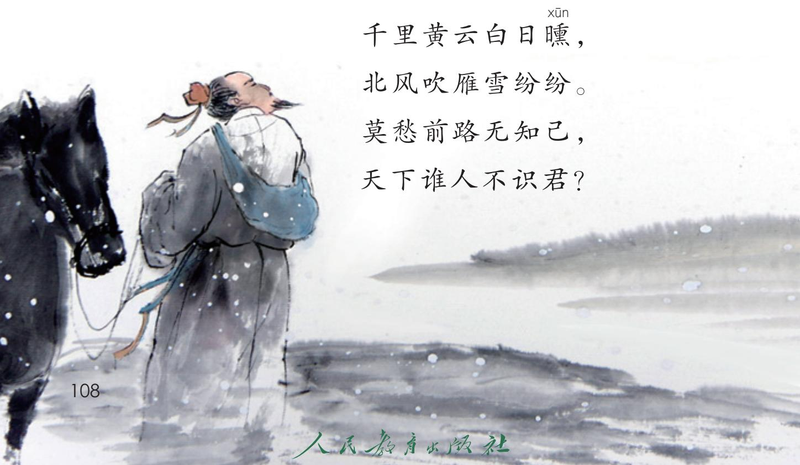

## 人民教育出版社

您何必卖房子，只要您把胡子一剃，一登台，还愁没钱花？◇ 您不用卖房子，只要您把胡子一剃，一登台，就不愁没钱花。

小明在公共场合乱丢垃圾，还说反正有清洁工打扫，你提醒他说……

过生日，你收到了梦mèi寐以求的礼物，你有点儿不敢相信地说……

## 日积月累

## 别董大

[ 唐 ] 高 适

# 第八单元

时光如川浪淘沙，青史留名多俊杰。

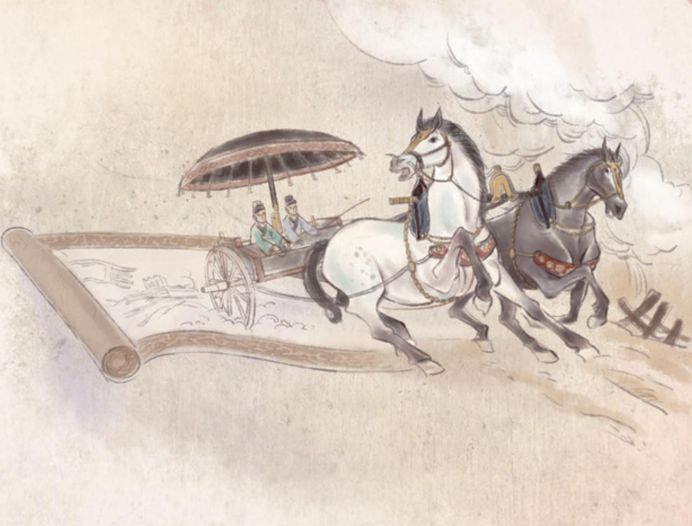

◎ 了解故事情节，简要复述课文。

◎ 写一件事，能写出自己的感受。

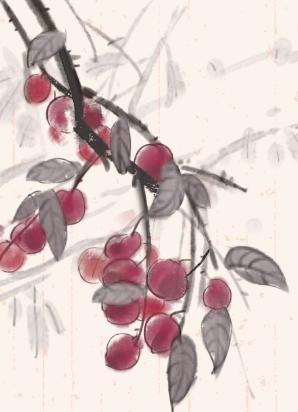

# róng 王戎不取道旁李①25

## zhū

王戎七岁，尝②与诸小儿游。看道边李树多子折枝，诸jìng wéi儿竞走③取之，唯④戎不动。人问之，答曰：“树在道边而多子，此必苦李。”取之，信然⑤。

注释

① 本文选自《世说新语·雅量》。王戎，晋朝人，“竹林七贤”之一，自幼聪慧。

②〔尝〕曾经。

③〔竞走〕争着跑过去。

④〔唯〕只有。

⑤〔信然〕的确如此。

戎 诸 竞 唯 róng zhū jìng wéi

戎 尝 诸 竞 唯

正确、流利地朗读课文。背诵课文。

结合注释，用自己的话讲讲这个故事。

说说为什么“树在道边而多子，此必苦李”。

# bào yè26 西门豹 治邺

zhāng

战国时期，魏国的国君派西门豹去管理漳河边上的邺wú县。西门豹到了那个地方，看到田地荒芜，人烟稀少，就找了位老大爷来，问他是怎么回事。

qǔ xí

老大爷说：“都是河神娶媳妇给闹的。河神是漳河的神，每年要娶一个年轻漂亮的姑娘。要不给他送去，漳河就要发大水，把田地全淹了。”

西门豹问：“这话是谁说的？”

shēn

老大爷说：“巫婆说的。地方上的官绅每年出面给河神办喜事，硬逼着老百姓出钱。每闹一次，他们要收几百万钱，办喜事只花二三十万，多下来的就跟巫婆分了。”

西门豹问：“新娘是哪儿来的？”

老大爷说：“哪家有年轻的女孩，巫婆就带着人到哪家去选。有钱的人家花点儿钱就过去了，没钱的只好眼睁睁地看着女孩被他们拉走。到了河神娶媳妇那天，他们在漳河边放一条苇席，把女孩打扮好了，让她坐在苇席上，顺着水漂去。苇席先还是浮着的，到了河中心就连女孩一起沉下去了。有女孩的人家差不多都逃到外地去了，所以人口越来越少，这地方也越来越穷。”

西门豹问：“那么漳河发过大水没有呢？”

老大爷说：“没有发过。倒是夏天雨水少，年年干旱。”

西门豹说：“这样说来，河神还真灵啊。下一回他娶媳妇，请告诉我一声，我也去送送新娘。”

到了河神娶媳妇的日子，漳河边上站满了老百姓。西门豹带着卫士，真的来了，巫婆和官绅急忙迎接。那巫婆guà tú已经七十多岁了，背后跟着十来个穿着绸褂的女徒弟。

西门豹说：“把新娘领来让我看看。”巫婆叫徒弟把那个打扮好的姑娘领了来。西门豹一看，女孩满脸泪水。他回过头来对巫婆说：“不行，这个姑娘不漂亮，河神不会满意的。麻烦你去跟河神说一声，说我要选个漂亮的，过几天就送去。”说完，他叫卫士架起巫婆，把她投进了漳河。

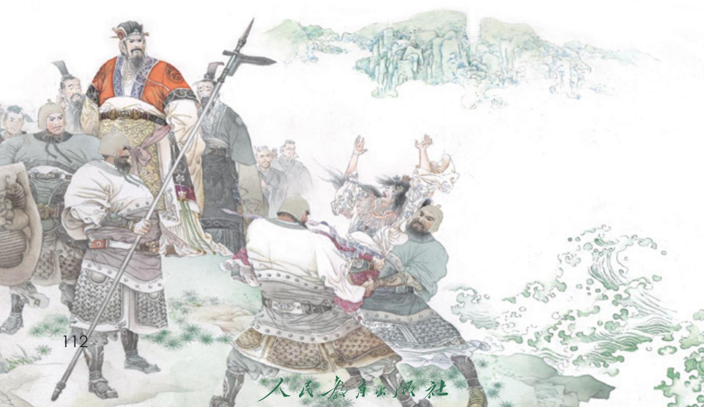

巫婆在河里扑腾了几下就沉下去了。等了一会儿，西门豹对官绅的头子说：“巫婆怎么还不回来，麻烦你去催一催吧。”说完，又叫卫士把官绅的头子投进了漳河。

diào

西门豹面对着漳河站了很久。那些官绅都提心吊胆，大气儿也不敢出。西门豹回过头来，看着他们说：“怎么还不回来，请你们去催催吧！”说着又要叫卫士把他们扔下漳河去。

官绅一个个吓得面如土色，跪下来磕头求饶，把头都磕破了，直淌血。西门豹说：“好吧，再等一会儿。”过了一会儿，他才说：“起来吧。看样子是河神把他们留下了。你们都回去吧。”

老百姓都明白了，巫婆和官绅都是骗钱害人的。从此，谁也不敢再提给河神娶媳妇，漳河也没有发大水。

záo

西门豹发动老百姓开凿了十二条渠道，把漳河的水引gài到田里。庄稼得到灌溉，年年都获得好收成。

bào qǔ xí wū shēn hàn tú diào kē záo gài 豹 娶 媳 巫 绅 旱 徒 吊 磕 凿 溉

豹 娶 媳 女 淹 逼 ē 饶 骗 灌 溉默读课文，根据课文内容填空，并简要复述课文。（ ） （ ） 兴修水利

找出第10〜14自然段中描写西门豹言行的句子，说说西门豹惩治巫婆和官绅的办法好在哪里。

## 选 做

剧本主要依靠人物对话来推动情节，刻画人物。在老师的指导下，试着根据“阅读链接”中的剧本开头改编课文，并演一演这个故事。

## 阅读链接

## 西门豹治邺

时间：战国时期地点：魏国邺县，漳河河边

人物：西门豹（邺县县令）老 巫（给河神娶亲的巫婆）新 娘（准备送给河神做媳妇的姑娘）官绅、小巫（河神娶亲的参与者）卫士、围观百姓若干

〔这天是给河神送亲的日子，漳河边上站满了围观的老百姓。老巫带着手下的小巫布置好婚礼现场，等待着官绅的到来。西门豹从左边上，后面跟着几个卫士。几个官绅从右边上，见到西门豹打躬作揖。

西门豹 什么时候送新娘子啊？老 巫 ……

# 故事二则 \* 27

默读课文，找出课文中表示故事发展先后顺序的词句，简要复述这两个故事，再和同学交流你从中明白的道理。

## 扁鹊治病①

bài huánhóu

有一天，名医扁鹊去拜见蔡桓侯。

扁鹊在蔡桓侯身边站了一会儿，说：“据我看来，您皮fū肤上有点儿小病。要是不治，恐怕会向体内发展。”蔡桓侯说：“我的身体很好，什么病也没有。”扁鹊走后，蔡桓侯对左右的人说：“这些做医生的，总喜欢给没有病的人治病。医治没有病的人，才容易显示自己的高明！”

过了十天，扁鹊又来拜见蔡桓侯，说道：“您的病已经发展到皮肉之间了，要是不治还会加深。”蔡桓侯听了很不高兴，没有理睬他。扁鹊只好退了出去。

十天后，扁鹊再一次来拜见，对蔡桓侯说：“您的病已经发展到肠胃里，再不治会更加严重。”蔡桓侯听了非常不高兴。扁鹊连忙退了出去。

又过了十天，扁鹊老远望见蔡桓侯，只看了几眼，就

掉头跑了。蔡桓侯觉得奇怪，派人去问他：“扁鹊，你为什么一声不响就跑掉了？”扁鹊解释道：“病在皮肤上，用热fū zhā  
敷就能够治好；发展到皮肉之间，用扎针的方法可以治好；jì  
即使发展到肠胃里，服几剂汤药也还能治好；一旦深入骨suǐ  
髓，只能等死，医生再也无能为力了。现在病已经深入骨髓，所以我不再请求给他医治！”

五天之后，蔡桓侯浑身疼痛，派人去请扁鹊给他治病。扁鹊早知道蔡桓侯要来请他，几天前就跑到秦国去了。不久，蔡桓侯病死了。

## jǐ 纪昌学射①

飞卫是一名射箭能手。有个叫纪昌的人，想学习射箭，就去向飞卫请教。

开始练习的时候，飞卫对纪昌说：“你要想学会射箭，biāo首先应该下功夫练眼力。你要牢牢地盯住一个目标，不能眨眼！”纪昌回家之后，就开始练习起来。妻子织布的时候，他躺在织布机下面，睁大眼睛，死死盯住织布机的踏板。两年以后，纪昌的本领练得相当到家了——就是锋利zhuī的锥尖要刺到眼角了，他的眼睛也不眨一下。

纪昌对自己的成绩感到很满意，以为练得差不多了，就再次去拜见飞卫。飞卫对他说：“虽然你已经取得了不小的成绩，但你的眼力还不够。你要练到把极小的东西看得很大，把模糊难辨的东西看得很清楚，那时候再来见我。”纪昌记住了飞卫的话，回到家里，又开始练习起来。他用shuān shī一根牛尾毛拴住一只虱子，把它吊在窗口，然后每天站在虱子旁边，聚精会神地盯着它。那只小虱子，在纪昌的眼里一天天大起来，练到后来，大得竟然像车轮一样。

取得了这样大的进步，纪昌赶紧跑到飞卫那里，报告了这个好消息。飞卫高兴地说：“你就要成功了！”于是，飞卫开始教他怎样开弓，怎样放箭。

后来，纪昌成了百发百中的射箭能手。

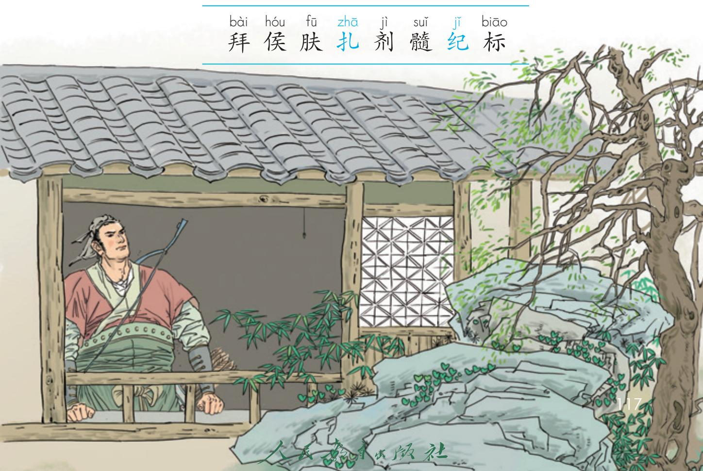

## 口语交际

## 讲历史人物故事

西门豹治邺、王戎不取道旁李，还有匡衡凿壁借光、刘备三顾茅庐……这些历史人物故事，生动有趣，给人智慧与启迪，历经千百年仍然广为流传。

让我们开一次故事会，选择一个你最喜欢的历史人物故事，讲给同学听。

讲之前，好好读一读这个故事。可以把重要信息写在小卡片上，帮助记忆。对听众可能有疑惑的地方，可以作些说明。

讲的时候，注意语气，还可以用适当的动作和表情吸引听众，想不起来的时候可以看看小卡片。

讲完之后，问问同学是否喜欢你的故事，有没有听明白，对你还有什么建议。

◎ 用卡片提示讲述内容。

◎ 使用恰当的语气和肢体语言，可以让讲述更生动。

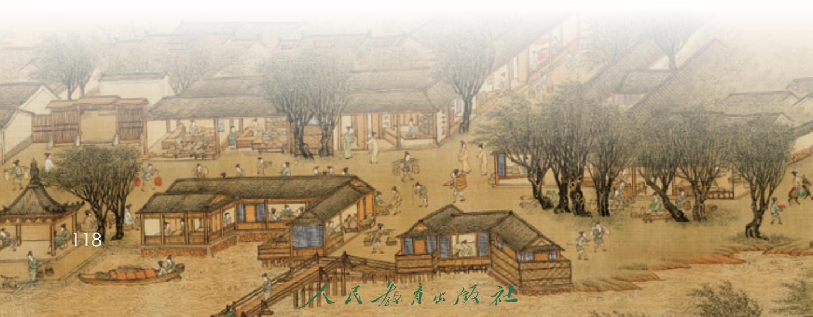

## 我的心儿怦怦跳

参加百米比赛 登上领奖台  
参加班干部竞选 一个人走夜路  
第一次当众讲故事 在出站口等待久别的爸爸归来

你有过上面的经历吗？你当时的心情是怎样的呢？同学之间说一说。

选一件令你心儿怦怦跳的事情写下来，写清楚事情的经过和当 时的感受。写完后先修改，再誊写清楚。

提心吊胆 心急如焚 胆战心惊 魂飞魄散

喜出望外 手舞足蹈 热泪盈眶 欣喜若狂

脸上火辣辣的 汗毛都竖起来了 倒吸一口凉气

心里打起鼓来 怀里像揣了只兔子 心都提到了嗓子眼儿

十五个吊桶打水——七上八下

我积累了很多写心情的词语，可以用在这次习作中。

#

# 语文园地

## 交流平台

简要复述课文，要注意以下几点：

复述前多读几遍课文，熟悉课文内容。

复述时要抓住课文的主要内容，对于其他内容可以适当省略。如，《西门豹治邺》中调查民情这个情节不是主要内容，可以复述得简单一些；而惩治巫婆和官绅是主要内容，要讲得详细一些。

按照事情发展顺序进行复述，要注意课文中一些提示顺序的词句，如《扁鹊治病》中表示时间的词句，这样不容易遗漏情节。

## 识字加油站

gāng冈—纲（提纲）

shòu受—授（传授）

jiàn建—键（键盘）

zòu奏—揍（挨揍）

pǔ普—谱（乐谱）

mò末—沫（泡沫）

xiù秀—锈（生锈）

zhuān专—砖（砖头）

zōng宗—综（综合）

kuàng广—矿（矿物）

yǎng羊—氧（氧气）

jù具—俱（俱乐部）

你还能说出类似的字吗？

gāng shòu zòu jiàn pǔ xiù mò zhuān kuàng zōng yǎng jù 纲 授 揍 键 谱 锈 沫 砖 矿 综 氧 俱

## 词句段运用

抄写下面的词语，注意加点的字不要写错。平时还有哪些字容易写错？和同学交流。茂盛 投降 赞叹 麻雀 胸怀 既然暮色   拨打 裤子 出塞 富饶 严厉

读一读，体会每组中的两个句子在表达上的不同。

官绅一个个吓得面如土色，跪下来磕头求饶，把头都磕破了，直淌血。

◇ 官绅跪地求饶。

huán

◇ 蔡桓侯觉得奇怪，派人去问他：“扁鹊，你为什么一声不响就跑掉了？”

◇ 蔡桓侯派人问扁鹊，他为什么不说话就跑掉了。

文成公主和她的随从们，跨过一条条大河，翻过一座座高sà  
山，走了一程又一程，终于来到了拉萨。

bá shè

◇ 文成公主和她的随从们经过长途跋涉来到了拉萨。

读了这些例子，我也会长话短说了。

## 书写提示

纪昌记住了飞卫的话，回到家里，又开始练习起来。他用一根牛尾毛拴住一只虱子，把它吊在窗口，然后每天站在虱子旁边，聚精会神地盯着它。那只小虱子，在纪昌的眼里一天天大起来，练到后来，大得竟然像车轮一样。

提高书写速度的方法：

◎ 集中注意力。

◎ 掌握正确的运笔方式。

◎ 一句话要连贯地写出来。

◎ 书写速度要均匀，不要忽快忽慢。

## 日积月累

móuhào bīn   
眉清目秀 亭亭玉立 明眸皓齿 文质彬彬 lǐn hàn   
相貌堂堂 威风凛凛 膀大腰圆 短小精悍 huàn   
容光焕发 鹤发童颜 慈眉善目 老态龙钟

## 识  字  表

yán bó yì áng dǐng fèi guàn hào bēng zhèn shà yú huī 盐 薄 屹 昂 鼎 沸 贯 浩 崩 震 霎 余 恢

é luǎn sú yuè suì dù gěng shuò

2 鹅 卵 俗 跃 穗 镀 埂 烁

cháo wěi luó bà zhàn

3 巢 苇 罗 霸 占

mèi zhuì huái

4 昧 坠 怀

wān jiāng yù jiē tái qiú kuàng yì

5 豌 僵 预 揭 苔 囚 框 溢

biān fú jí ruì jì dāng yíng zhèngzhàng ài yíng píng6 蝙 蝠 即 锐 系 铛 蝇 证 障 碍 荧 屏

huàn jì huò lài qián yì suǒ ào bó zhì zhé7 唤 纪 获 赖 潜 亿 索 奥 舶 质 哲

8 避 撼 喧 雀 檐

zhù chāo péi dǔ méi fēn zhàng hè zhāng gàng jiǎo 驻 钞 培 赌 媒 氛 账 贺 樟 杠 狡

mù sè yuán xiáng sāo xùn shū

9 暮 瑟 缘 降 骚 逊 输

jūn bǐng wō qū wěi

10 均 柄 蜗 曲 萎

<table><tr><td></td><td></td><td></td><td></td><td></td><td></td><td></td><td>pī huǎn zhuó zhàng lóng zhī qū yè</td><td></td><td>zhái yǐn háo shèn zhǐ liáng jué sōu qīng zhòu zhì pāo 11宅隐毫慎址良掘搜倾骤置抛</td><td></td><td></td><td></td><td></td></tr><tr><td>12劈缓浊丈隆肢躯液</td><td></td><td></td><td>shào yuē nì fǎn</td><td></td><td></td><td></td><td></td><td></td><td></td><td></td><td></td><td></td><td></td></tr><tr><td>13少曰溺返</td><td></td><td></td><td></td><td></td><td></td><td></td><td></td><td></td><td>sī cǎn dào chí shù yā suǒ zāo è zàng fèn zá</td><td>14斯惨盗驰恕押锁遭恶脏愤砸</td><td></td><td></td><td></td></tr><tr><td></td><td></td><td></td><td></td><td></td><td></td><td></td><td></td><td></td><td></td><td>hóng cuò hùn xiàng xī jiāng tā cuàn sòng jì 15洪措混项熄浆塌窜颂绩</td><td></td><td></td><td></td></tr><tr><td></td><td></td><td></td><td></td><td></td><td></td><td></td><td></td><td></td><td></td><td>pǔ huì lěi ruǐ méi mò lì mǔ dān táng 圃卉蕾蕊玫茉莉牡丹棠</td><td></td><td></td><td></td></tr><tr><td></td><td>语文园地</td><td></td><td></td><td></td><td>xiù nài zhěng sī yǎ páng</td><td></td><td></td><td></td><td></td><td></td><td></td><td></td><td></td></tr><tr><td></td><td>16嗅奈拯嘶哑庞</td><td></td><td></td><td></td><td>jí liàn pān xiàng biàn hē</td><td></td><td></td><td></td><td></td><td></td><td></td><td></td><td></td></tr><tr><td></td><td>17级链攀相辫呵</td><td></td><td></td><td></td><td></td><td></td><td></td><td></td><td></td><td>wèi quán chuí wán yū jīn bó píng bù píng qī qiā 18谓拳捶顽吁襟膊瓶怖凭欺掐</td><td></td><td></td><td></td></tr><tr><td></td><td></td><td></td><td></td><td></td><td></td><td></td><td></td><td></td><td></td><td>náng lòu xiàn jué yīn kuī piě ā méi kuī hōng zhuō āi 19囊露羡角殷盔撇啊霉亏哄拙唉</td><td></td><td></td><td></td></tr><tr><td></td><td></td><td></td><td></td><td></td><td></td><td></td><td></td><td></td><td></td><td>dīng kuàng bīng bài hèn shuài chè kuì yù chǒu háo 20钉况兵败恨帅彻溃誉丑豪</td><td></td><td></td><td></td></tr><tr><td></td><td></td><td></td><td></td><td></td><td></td><td></td><td></td><td></td><td>jiǔ qín suàn jiāo ǒu shǔ yù 韭芹蒜椒藕薯芋</td><td></td><td></td><td></td><td></td></tr><tr><td></td><td>语文园地</td><td></td><td></td><td>sài qín zhēng jiàng jié</td><td></td><td></td><td></td><td></td><td></td><td></td><td></td><td></td><td></td></tr><tr><td></td><td>21塞秦征将杰</td><td></td><td></td><td></td><td></td><td></td><td></td><td></td><td>jué fàn wèi xī xiào huái huò chéng xùn chì nàn</td><td></td><td></td><td></td><td></td></tr><tr><td></td><td></td><td></td><td></td><td></td><td></td><td></td><td></td><td></td><td>22崛范魏晰效淮惑惩训斥难</td><td></td><td></td><td></td><td></td></tr><tr><td></td><td></td><td></td><td></td><td></td><td></td><td></td><td></td><td></td><td></td><td>xù pò zū jiū chán yāo gǎng rǎo jù qiān dìng nìng yāo 23蓄迫租纠缠邀港扰拒签订宁要</td><td></td><td></td><td></td></tr></table>

<table><tr><td></td><td>wàng 妄</td><td>h诸</td><td></td><td></td><td></td><td rowspan="11"></td><td></td><td></td><td rowspan="11">（共250个生字）</td></tr><tr><td>24 25 26</td><td>戎</td><td>ó延</td><td>昔 茅</td><td>máo kàng dàn mèi 炕旦媚 wéi</td><td></td></tr><tr><td>豹</td><td>bào </td><td>娶</td><td>光 唯 à</td><td></td><td>媳巫绅旱徒吊磕凿溉</td></tr><tr><td>27</td><td>拜</td><td>bài hóu 侯</td><td>u fū zhā jì, suǐ jǐ biāo</td><td>肤扎剂髓纪标</td><td></td></tr><tr><td></td><td>语文园地</td><td></td><td>gāng shòu zòu jiàn</td><td>纲授揍键谱锈沫砖矿综氧</td><td></td></tr><tr><td></td><td></td><td>俱</td><td></td><td></td><td></td></tr><tr><td></td><td></td><td></td><td></td><td></td><td></td></tr><tr><td></td><td></td><td></td><td></td><td></td><td></td></tr><tr><td></td><td></td><td></td><td></td><td></td><td></td></tr><tr><td></td><td></td><td></td><td></td><td></td><td></td></tr><tr><td></td><td></td><td></td><td></td><td></td><td></td></tr><tr><td></td><td></td><td></td><td></td><td></td><td></td></tr><tr><td></td><td></td><td></td><td></td><td></td><td></td></tr><tr><td></td><td></td><td></td><td></td><td></td><td></td></tr><tr><td></td><td></td><td></td><td></td><td></td><td></td></tr><tr><td></td><td></td><td></td><td></td><td></td><td></td></tr><tr><td></td><td></td><td></td><td></td><td></td><td></td></tr><tr><td></td><td></td><td></td><td></td><td></td><td></td></tr><tr><td></td><td></td><td></td><td></td><td></td><td></td></tr><tr><td></td><td></td><td></td><td></td><td></td><td></td></tr><tr><td></td><td></td><td></td><td></td><td></td><td></td></tr><tr><td></td><td></td><td></td><td></td><td></td><td></td></tr><tr><td></td><td></td><td></td><td></td><td></td><td></td></tr><tr><td></td><td></td><td></td><td></td><td></td><td></td></tr><tr><td></td><td></td><td></td><td></td><td></td><td></td></tr><tr><td></td><td></td><td></td><td></td><td></td><td></td></tr><tr><td></td><td></td><td></td><td></td><td></td><td></td></tr><tr><td></td><td></td><td></td><td></td><td></td><td></td></tr><tr><td></td><td></td><td></td><td></td><td></td><td></td></tr><tr><td></td><td></td><td></td><td></td><td></td><td></td></tr><tr><td></td><td></td><td></td><td></td><td></td><td></td></tr><tr><td></td><td></td><td></td><td></td><td></td><td></td></tr><tr><td></td><td></td><td></td><td></td><td></td><td></td></tr><tr><td></td><td></td><td></td><td></td><td></td><td></td></tr><tr><td></td><td></td><td></td><td></td><td></td><td></td></tr><tr><td></td><td></td><td></td><td></td><td></td><td></td></tr><tr><td></td><td></td><td></td><td></td><td></td><td></td></tr><tr><td></td><td></td><td></td><td></td><td></td><td></td></tr><tr><td></td><td></td><td></td><td></td><td></td><td></td></tr><tr><td></td><td></td><td></td><td></td><td></td><td></td></tr><tr><td></td><td></td><td></td><td></td><td></td><td></td></tr><tr><td></td><td></td><td></td><td></td><td></td><td></td></tr><tr><td></td><td></td><td></td><td></td><td></td><td></td></tr><tr><td></td><td></td><td></td><td></td><td></td><td></td></tr><tr><td></td><td></td><td></td><td></td><td></td><td></td></tr><tr><td></td><td></td><td></td><td></td><td></td><td></td></tr><tr><td></td><td></td><td></td><td></td><td></td><td></td></tr><tr><td></td><td></td><td></td><td></td><td></td><td></td></tr><tr><td></td><td></td><td></td><td></td><td></td><td></td></tr><tr><td></td><td></td><td></td><td></td><td></td><td></td></tr><tr><td></td><td></td><td></td><td></td><td></td><td></td></tr><tr><td></td><td></td><td></td><td></td><td></td><td></td></tr><tr><td></td><td></td><td></td><td></td><td></td><td></td></tr><tr><td></td><td></td><td></td><td></td><td></td><td></td></tr><tr><td></td><td></td><td></td><td></td><td></td><td></td></tr><tr><td></td><td></td><td></td><td></td><td></td><td></td></tr><tr><td></td><td></td><td></td><td></td><td></td><td></td></tr><tr><td></td><td></td><td></td><td></td><td></td><td></td></tr><tr><td></td><td></td><td></td><td></td><td></td><td></td></tr><tr><td></td><td></td><td></td><td></td><td></td><td></td></tr><tr><td></td><td></td><td></td><td></td><td></td><td></td></tr><tr><td></td></table>

## 写 字 表

潮 据 堤 阔 盼 滚 顿 逐 渐 堵 犹 崩 震 霎 余  
2 淘 牵 鹅 卵 坑 洼 填 庄 稼 俗 跃 葡 萄 稻 熟  
豌 按 舒 适 暗 恐 僵 硬 枪 耐 探 愉 曾 沟 溢  
蚊 弄 科 横 竖 绳 系 蝇 证 复 研 究 达 驾 驶  
唤 纪 技 改 程 超 亿 核 奥 益 联 质 哲 任 善  
暮 吟题 侧 峰 庐 缘 降 费 须 逊 输  
10 虎 操 占 嫩 顺 均 叠 隙 茎 柄 萎 瞧 固  
11 宅 临 慎 选 择 址 良 穴 厅 卧 专 即 较  
12 睁 翻 斧 劈 缓 浊 丈 撑 竭 累 液 奔 茂 滋  
13 曰 溺 返 衔  
14 悲 惨 兽 佩 坚 违 抗 环 锁 既 狠 著 愤 获  
16 嗅 呆 奈 巢 齿 躯 掩 护 幼 搏 庞 量 愣  
17 级 链颤 攀 猴 念 辫 呵  
18 摸 甚 跪 捶 绕 顽 脖 脱 概 惹 昏 握 摔 凭 掐  
19 班 鼓 殷 俩 练 套 裤 逃 亏 挖 撤 堂 砸 锅  
20 否 旋 况 败 椅 尤 恨 帅 预 溃 品 丑 豪  
21 塞 秦 征 词 催 醉 杰 亦 雄 项  
22 肃 默 晰 振 胸 怀 赞 效 凡 顾 训 斥  
25 戎 尝 诸 竞 唯  
26 豹 派 娶 媳 妇 淹 逼 浮 旱 徒 扔 饶 骗 灌 溉

（共250个字）

## 词  语  表

1 奇观 农历 据说 宽阔 人山人海 滚动 顿时

逐渐 犹如 齐头并进 山崩地裂 霎时 余波

2 柔和 鹅卵石 河床 新鲜 修补 坑坑洼洼

庄稼 风俗 葡萄 满意 水稻 成熟 招待

5 豌豆 按照 暖洋洋 舒适 黑暗 恐怕 僵硬

丰满 等待 强壮 虚弱 耐心 愉快 兴奋

曾经 水沟 洋溢 感激

6 蚊子 灵巧 科学家 横七竖八 绳子 苍蝇

证明 反复 研究 雷达 显示 驾驶员

7 呼风唤雨 世纪 技术 改变 程度 超过

腾云驾雾 幻想 原子核 奥秘 日益 联系

物质 哲学 任何 创造 改善

10 爬山虎 操场 嫩红 舒服 均匀 重叠 空隙

叶柄 反面 触角 弯曲 细小 痕迹 瞧不起  
牢固 休想  
11 住宅 临时 功夫 随遇而安 慎重 选择 住址  
优良 洞穴 大厅 卧室 专家 即使 平整  
清洁 卫生 疲劳  
12 睁眼 黑乎乎 翻身 斧头 缓缓 上升 下降  
精疲力竭 血液 奔流不息 汗毛 茂盛 滋润  
雨露  
14 人间 悲惨 情景 危害 猛兽 严厉 敬佩  
悄悄 坚定 违抗 狠心 尖利 著名 愤愤不平  
获得  
16 打猎 猛烈 无可奈何 拍打 嘴角 分明 牙齿  
绝望 尖叫 身躯 掩护 幼儿 搏斗 庞大  
安然 强大 力量  
17 假日 云彩 石级 发颤 年纪 奋力 猴子  
纪念 辫子 笑呵呵 鼓舞 居然  
18 甚至 顽皮 故意 脖子 扑打 忙乱 大概

助威 昏乱 结实 汉子 可笑 无缘无故 平白

19 文艺 表演 班级 鼓掌 角色 殷切 期待

排练 危机 通情达理 充分 自信 提示 撤换

紧张  哄堂大笑 砸锅 至今

20 冰天雪地 否则 旋转 重整旗鼓 况且

得心应手 椅子 尤其 手舞足蹈 恨不得 预料

不动声色 顽强 溃败 自豪

22 严肃 默默 清晰 抱负 胸怀 赞叹 表情

忘怀 果真 非凡 左顾右盼 指望 训斥 体会

分量 响亮

26 管理 人烟 媳妇 新娘 眼睁睁 干旱 迎接

徒弟 面如土色 求饶 灌溉 收成

## 后 记

《义务教育教科书 语文》（一〜六年级）由教育部组织编写，北京大学中文系温儒敏教授担任总主编。

王宁、张联荣、柳士镇、张健、翟京华、郑桂华、陈秀玲、武琼、陈萍等专家对教科书的修改完善给予了悉心指导；金波、吴然、吴立岗、熊宁宁、段宗平等多次审阅教科书内容，提出了修改建议；在教育部的组织下，广大一线优秀教师通读教科书，保证了教学的适切性；在试教试用过程中，北京市、河南省、广东省等地教研部门及部分学校给予了大力支持，为教科书质量的进一步提升提供了保障。

人民教育出版社承担了教科书的编辑出版工作，在组织编写、试教试用等方面给予了全方位的协助。人民教育出版社小学语文室全体同仁始终是教科书编写的中坚力量。于泉滢、金葆、李丹蕾、王晶晶为本书绘制插图，景绍宗为本书封面绘制插图。卢中南为本书“书写提示”栏目书写了硬笔书法范例。对教科书的编写、出版提供过帮助的同仁和社会各界朋友还有很多，在此一并表示诚挚的谢意。

教科书投入使用后，我们根据各方意见作了修订，真诚希望广大师生和家长继续提出宝贵意见！

联系方式

电 话：010-58758609

电子邮箱：jcfk@pep.com.cn

编 者

人民教育出版社

YIWU JIAOYU JIAOKESHU YUWEN

四年级 上册

