全国优秀教材特等奖

义务教育教科书

## 四年级

下册

人民教育出版社

# 语文

义务教育教科书

# 语文

# 四年级

下册

教育部组织编写

总主编 温儒敏

总主编：温儒敏

小学主编：陈先云（执行）曹文轩崔 峦 李吉林

编写人员：（以姓氏笔画为序）

何源郑宇柯孔标徐轶

崔峦温儒敏熊宁宁魏航

责任编辑：郑宇熊宁宁向瑞

美术编辑：昌梦洁

义务教育教科书 语文 四年级 下册

教育部组织编写

出版人民教育出版社

（北京市海淀区中关村南大街17号院1号楼 邮编：100081)

网址 http://www.pep.com.cn

## 人民教育出版社

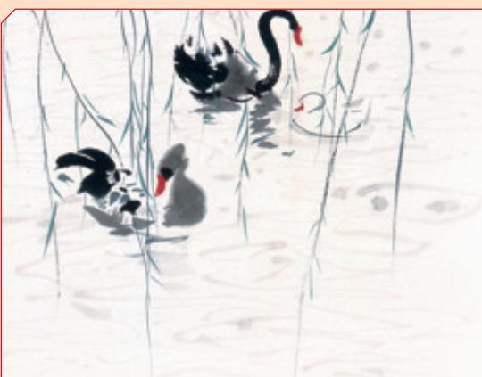

## 目录

1 古诗词三首… ……2  
四时田园杂兴（其二十五)…2  
宿新市徐公店………………2  
清平乐·村居…………………………3  
2 乡下人家…… …4  
3 天窗…… …7  
4\*三月桃花水…… ……10  
口语交际：转述………………11  
习作：我的乐园………………………12  
语文园地…… ……13  
第二单元… …15  
5 琥珀…… …16  
6 飞向蓝天的恐龙…………………20  
7 纳米技术就在我们身边…24  
8\*千年梦圆在今朝……………………26  
口语交际：说新闻………29  
习作：我的奇思妙想………30  
语文园地…………………………………31  
快乐读书吧：  
探索科学的奥秘……………33  
第三单元 35  
9 短诗三首…………… ……36  
繁星(七一)……………………36  
繁星(三ー)………………36  
繁星(一五九)……37  
10绿…… ……38  
11 白桦…… ……40  
12\*在天晴了的时候…………42  
综合性学习：  
轻叩诗歌大门…………………44  
语文园地……  
第四单元… 47  
13 猫… …48

## 人民教育出版社

14 母鸡……51  
15 白鹅…………… …54  
习作：我的动物朋友…………59  
语文园地……………………60  
第五单元· 63  
16 海上日出………64  
17 记金华的双龙洞………………66  
O 习作例文：  
颐和园……70  
七月的天山…………………72  
O 习作：游 ……74  
第六单元…… ……75  
18 文言文二则…………………………76  
囊萤夜读……………………………76  
铁杵成针………………………………76  
19 小英雄雨来（节选)………78  
20\*我们家的男子汉………………………87  
21\*芦花鞋…… ……91  
口语交际：  
朋友相处的秘诀………97  
习作：我学会了 ……98  
语文园地………………………99  
第七单元· 101  
22 古诗三首…………102  
芙蓉楼送辛渐………………102  
塞下曲…………102  
墨梅……103  
23 黄继光…………………………………104  
24“诺曼底号”遇难记………109  
25\*挑山エ………………………………………114  
口语交际：自我介绍………117  
习作：我的“自画像”……118  
语文园地…………………………………119  
第八单元…… …121  
26 宝葫芦的秘密（节选)……122  
27 巨人的花园………………………………125  
28\*海的女儿………………129  
习作：故事新编……………………134  
语文园地……………………………135  
识字表…………… ……137  
写字表……… …140  
词语表……  
标\*的是略读课文

## 人民教育出版社

第一单元

纯朴的乡村，一道独特的风景，一幅和谐的画卷。

抓住关键语句，初步体会课文表达的思想感情

写喜爱的某个地方，表达出自己的感受。

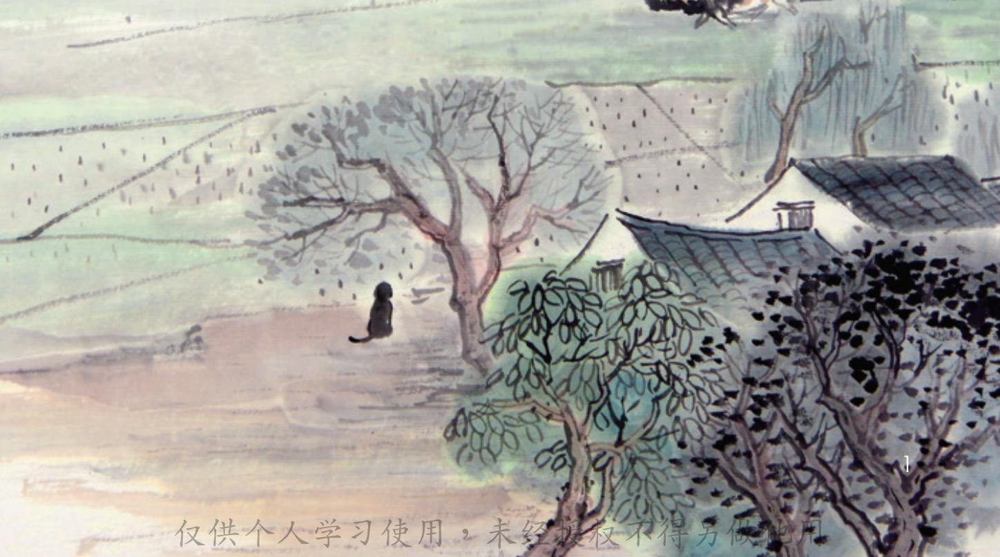

## ①古诗词三首

zá四时田园杂兴（其二十五）

[宋]范成大

梅子金黄杏子肥，麦花雪白菜花稀。日长篱落无人过，wéi jiá惟有蜻蜓蛱蝶飞。

xú宿新市徐公店

[宋]杨万里

shū篱落疏疏一径深，树头新绿未成阴®儿童急走追黄蝶，飞入菜花无处寻。

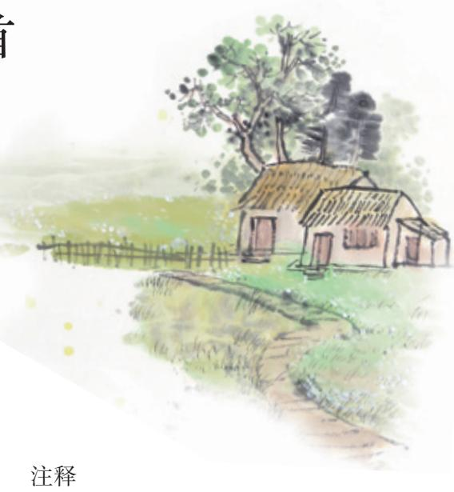

①〔杂兴〕随兴而写的诗。“兴”，这里读xìng。  
②〔蛱蝶〕蝴蝶的一种。

注释

①〔疏疏〕稀疏。   
②〔阴〕树荫。

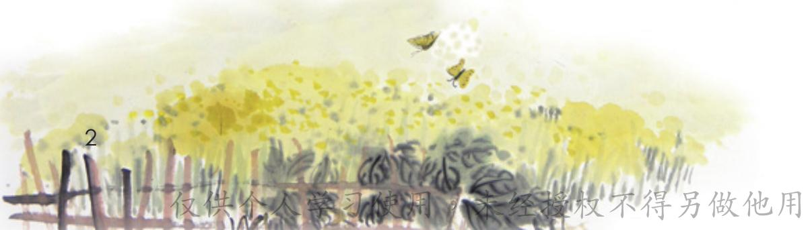

清平乐®·村居®

jí [宋]辛弃疾

茅檐低小，溪上青青草。 醉里吴音相媚好，白发谁家翁 ǎo chú 媪？ 大儿锄豆溪东，中儿 正织鸡笼。最喜小儿亡赖，溪 bō 头卧剥莲蓬。

## 注释

①〔清平乐〕词牌名。“乐”，这里读yuè。

②〔村居〕词题。

③〔吴音〕这首词是辛弃疾闲居带湖（今属江西）时写的。此地古代属吴地，所以称当地的方言为“吴音”。

④〔翁媪〕老翁和老妇。

⑤〔亡赖〕同“无赖”，这里指顽皮、淘气。“亡”，这里读wú。

zá lí xú shū chú bō 杂篱徐疏锄剥

杂稀蜻蜓蝶宿徐

疏茅 詹翁笼赖剥

有感情地朗读课文。背诵课文。默写《宿新市徐公店》。

读下面的诗句，说说你眼前浮现出了怎样的情景。

wéi jiá

□ 日长篱落无人过，惟有蜻蜓蛱蝶飞。

儿童急走追黄蝶，飞入菜花无处寻。

◇ 大儿锄豆溪东，中儿正织鸡笼。最喜小儿亡赖，溪头卧剥莲蓬。

人民教育出版社

# ②乡下人家

乡下人家总爱在屋前搭一瓜架，或种南瓜，或种丝瓜，让那些瓜藤攀上棚架，爬上屋檐。当花儿落了的时候，藤上便结出了青的、红的瓜，它们一个个挂在房前，衬着那长长gòu的藤，绿绿的叶。青、红的瓜，碧绿的藤和叶，构成了一道别有风趣的装饰，比那高楼门前蹲着一对石狮子或是竖着两根大旗杆，可爱多了。

有些人家，还在门前的场地上种几株花，芍药，凤仙，guān xù pǔ sù鸡冠花，大丽菊，它们依着时令，顺序开放，朴素中带着几分华丽，显出一派独特的农家风光。还有些人家，在屋后种几十枝竹，绿的叶，青的竿，投下一片浓浓的绿荫。

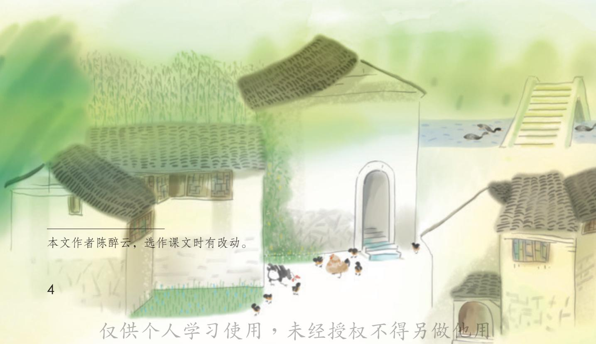

几场春雨过后，到那里走走，你常常会看见许多鲜嫩的笋，成群地从土里探出头来。

鸡，乡下人家照例总要养几只的。从他们的房前屋后走shuài过，你肯定会瞧见一只母鸡，率领一群小鸡，在竹林中觅食；或是瞧见耸着尾巴的雄鸡，在场地上大踏步地走来走去。

他们的屋后倘若有一条小河，那么在石桥旁边，在绿树  
荫下，你会见到一群鸭子游戏水中，不时地把头扎到水下去fù dǎo  
觅食。即使附近的石头上有妇女在捣衣，它们也从不吃惊。

若是在夏天的傍晚出去散步，你常常会瞧见乡下人家吃晚饭的情景。他们把桌椅饭菜搬到门前，天高地阔地吃起来。天边的红霞，向晚的微风，头上飞过的归巢的鸟儿，huì都是他们的好友。它们和乡下人家一起，绘成了一幅自然、xié和谐的田园风景画。

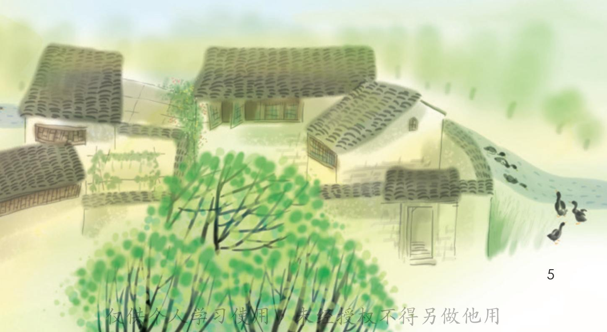

## 人民教育出版社

秋天到了，纺织娘寄住在他们屋前的瓜架上。月明人静的夜里，它们便唱起歌来：“织，织，织，织啊！织，织，织，织啊！”那歌声真好听，赛过催眠曲，让那些辛苦一天的人们，甜甜蜜蜜地进入梦乡。

乡下人家，不论什么时候，不论什么季节，都有一道独特、迷人的风景。

我从这句话，体會到了课文表达的思想感情。

gòu guān xù pǔ sù shuài tǎng fù dǎo huì xié 构冠序朴素率倘附捣绘谐

h 尊 几 从 足 K 上 4 北 眠 白 云 白

朗读课文，想象画面。如果给课文配画，你觉得可以画几幅？ 试着给每幅画取个名字。

你对课文描写的哪一处景致最感兴趣？和同学交流。

读一读，再从课文中找出其他生动形象的句子，抄写下来。

几场春雨过后，到那里走走，你常常会看见许多鲜嫩的笋，成群地从土里探出头来。

口 他们把桌椅饭菜搬到门前，天高地阔地吃起来。

## 选做

你眼中的乡村景致是怎样的？用一段话写下来。

仅供个人学习使用，未经授权不得另做他用

# ③天窗

乡下的房子只有前面一排木板窗。暖和的晴天，木板窗扇扇打开，光线和空气都有了。

碰着大风大雨，或者北风呼呼叫的冬天，木板窗只好关起来，屋子里就黑得像地洞似的。

于是乡下人在屋顶开一个小方洞，装一块玻璃，叫作“天窗”。

夏天阵雨来了时，孩子们顶喜欢在雨里跑跳，仰着脸看闪电，然而大人们偏就不许。“到屋里来啊！”随着木板窗的关闭，孩子们也就被关在地洞似的屋里了。这时候，wèi jiè小小的天窗是你唯一的慰藉。

从那小小的玻璃，你会看见雨脚在那里卜落卜落跳，piē你会看见带子似的闪电一瞥；你想象到这雨，这风，这雷，这电，怎样猛厉地扫荡了这世界，你想象它们的威力比你在露天真实感到的要大十倍百倍。小小的天窗会使你的想象锐利起来！

晚上，当你被逼着上床去“休息”的时候，也许你还

忘不了月光下的草地河滩。你偷偷地从帐子里伸出头来，仰起了脸。这时候，小小的天窗又是你唯一的慰藉！

文中两次提到小小的藉 天 窗 是“唯 一体 的会 慰”，从中可 以 到课文表达的思想感 感情。

你会从那小玻璃上面的一粒星，一朵云，想象到无数闪闪烁烁可爱的星，无数像山似的、马似的、巨人似的奇幻的云彩；你会从那小玻璃上面掠过的一条黑影，想象到这也许是灰色的蝙蝠，也许是会唱歌的夜莺，也许是霸气十足的猫头鹰…总之，夜的美丽神奇，立刻会在你的想象中展开。

发明这天窗的大人们，是应得感谢的。因为活泼会想的孩子们知道怎样从“无”中看出“有”，从“虚”中看出“实”，比任何他们看到的都更真切，更阔达，更复杂，更确实！

# 慰籍 b卜

慰 曰 锐滩 帐蝙 中巨冊 田

默读课文，说说天窗在哪儿，为什么要开天窗。

在什么情况下，小小的天窗成了孩子们“唯一的慰藉”？找出相关语句和同学交流，再有感情地读一读。

读句子，回答括号里的问题。

口 你想象到这雨，这风，这雷，这电，怎样猛厉地扫荡了这世界，你想象它们的威力比你在露天真实感到的要大十倍百倍。（“扫荡”给了你怎样的感觉？为什么通过天窗感受到的风雨雷电的威力，比在露天真实感受到的要大十倍百倍？)

口 因为活泼会想的孩子们知道怎样从“无”中看出“有”，从“虚”中看出“实”。（结合课文，说说孩子们是怎样从“无”中看出“有”，从“虚”中看出“实”的。）

# ④三月桃花水

在课文中，作者把春水叫作“桃花水”。有感情地朗读课文，体会优美的语言，读出作者对桃花水的喜爱和赞美之情。

是什么声音，像一串小铃铛，轻轻地走过村边？是什么光芒，像一匹明洁的丝绸，映照着蓝天？

啊，河流醒来了！三月的桃花水，舞动着绮丽的朝霞，向前流啊。有一千朵桃花，点点洒在河面，有一万个小酒窝，在水中回旋。

三月的桃花水，是春天的竖琴。

那忽大忽小的水声，应和着拖拉机的鸣响；那纤细的tán低语，是在和刚刚从雪被里伸出头来的麦苗谈心；那碰着岸边石块的叮当声，像是大路上车轮滚过的铃声…

三月的桃花水，是春天的明镜。

它看见燕子飞过天空，翅膀上裹着白云；它看见垂柳披上了长发，如雾如烟；它看见一群姑娘来到河边，水底立刻浮起一朵朵红莲，她们捧起了水，像抖落一片片花瓣…

啊，地上草如茵，两岸柳如眉，三月桃花水，叫人多沉醉。

## 和谈

本文作者刘湛秋，选作课文时有改动。

## 口语交际

## 转述

有时候，我们需要把一些事情转述给别人。

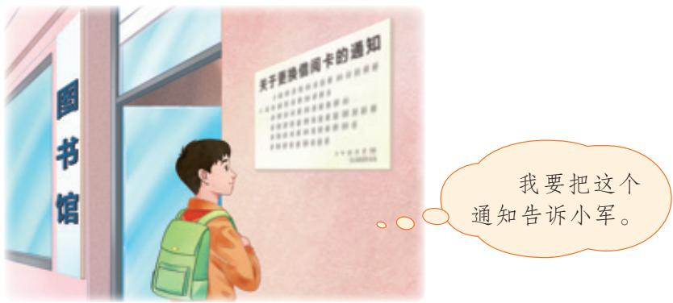

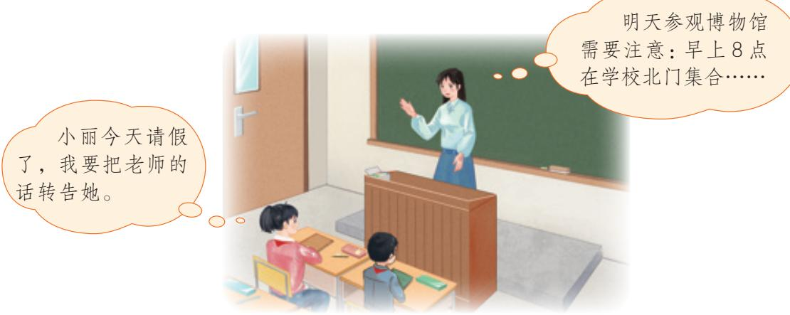

根据上面的情境，联系生活实际，分小组进行转述。

转述事情，一定要记住要点。如果需要转述的内容没弄清楚，要想办法确认。

还可以联系生活中的其他情境，和同学练一练。

弄清要点，转述时不要遗漏主要信息。

注意人称的转换。

## 我的乐园

湖畔、林间、广场、校园………处处留下了我们欢快的笑声。这些地方都是我们的乐园。

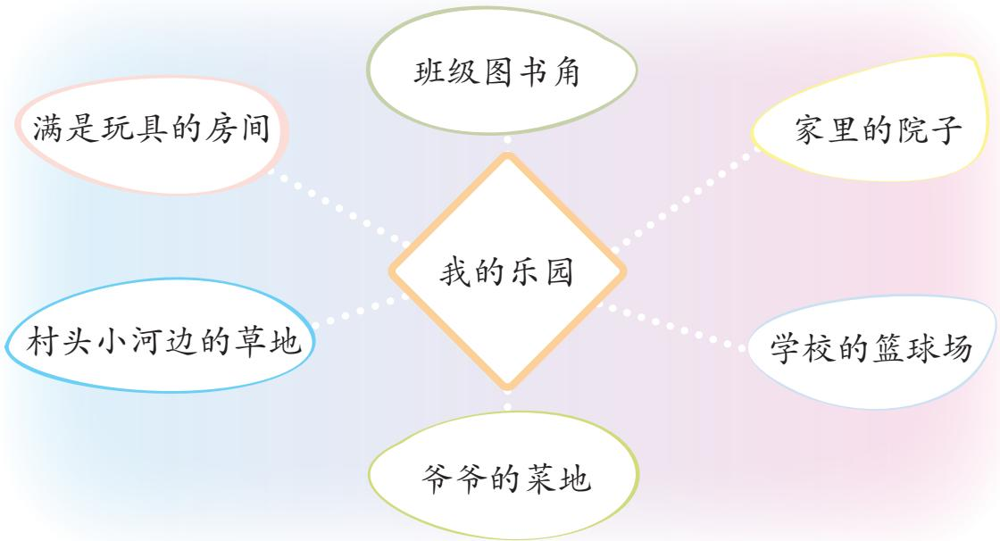

你的乐园是什么样子的？你最喜欢在那儿干什么？这个乐园给你带来了怎样的快乐？把你的乐园介绍给同学吧。写之前，可以照样子填写下面的表格。

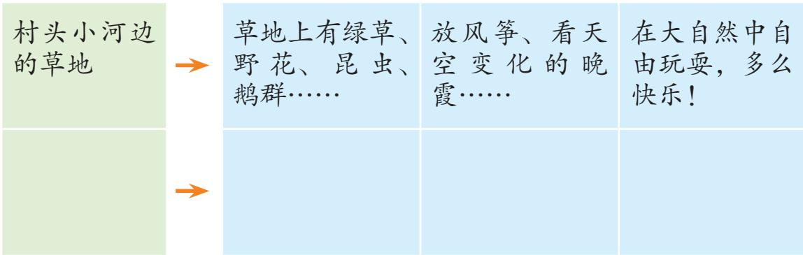  
写完后，把习作读给同学听，让他们也来感受你的快乐。

# 语文园地

## 交流平台

我发现课文中的一些语句表达了作者的思想感情。

我从《乡下人家》的最后一句“乡下人家，不论什么时候，不论什么季节，都有一道独特迷人的风景”，感受到了乡下人家的美。

学习《天窗》时，我从“小小的天窗是你唯一的慰藉”这句话中，体会到天窗给孩子们带来的快乐。

## 词句段运用

读一读，选两三个词语，说说你体会到的乡村和城市生活的不同。

cuǐ càn huáng 繁华 璀璨 高楼林立 车水马龙灯火辉煌 wò mì chuī niǎo quǎn 肥沃 静谧 炊烟袅袅依山傍水 鸡犬相闻

读句子，再选一幅图画照样子写一写。

天边的红霞，向晚的微风，头上飞过的归巢的鸟儿，都是他们的好友。它们和乡下人家一起，绘成了一幅自然、和谐的田园风景画。

◇ 飞翔的海鸥，金色的沙滩，白色的浪花，构成了迷人的海滨景观。

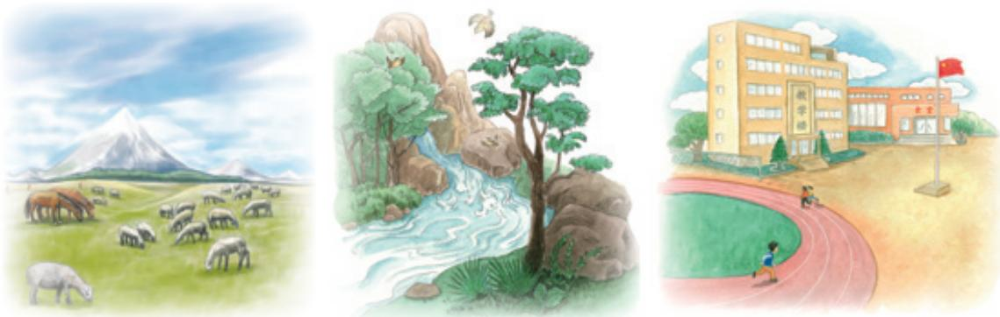

日积月累

卜算子·咏梅

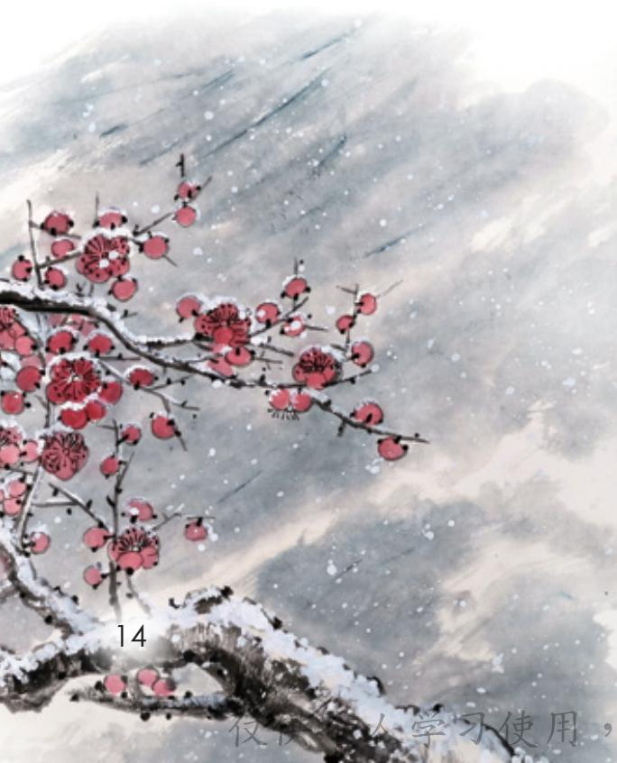

毛泽东

风雨送春归，  
飞雪迎春到。  
已是悬崖百丈冰，qiào  
犹有花枝俏。  
俏也不争春，  
只把春来报。màn  
待到山花烂漫时，  
她在丛中笑。

第二单元

蓝天、森林、大海，蕴藏着自然的奥秘；过去、现在、未来，述说着科技的精彩……

阅读时能提出不懂的问题，并试着解决。  
展开奇思妙想，写一写自己想发明的东西。

## ⑤琥珀

这个故事发生在很久很久以前，约莫算来，总有几千万年了。一个夏日，太阳暖暖地照着，海在很远的地方翻腾怒sà吼，绿叶在树上飒飒地响。

一只小苍蝇展开柔嫩的绿翅膀，在阳光下快乐地飞舞。wēng它嗡嗡地穿过草地，飞进树林。那里长着许多高大的松树，zhī太阳照得火热，可以闻到一股松脂的香味。

那只小苍蝇停在一棵大松树上。它伸起腿来掸掸翅膀，shì拂拭那长着一对红眼睛的圆脑袋。它飞了大半天，身上已经沾满了灰尘。

忽然，有个蜘蛛慢慢爬过来，想把那只苍蝇当作一顿美餐。它小心地划动长长的腿，沿着树干向下爬，离小苍蝇越来越近了。

晌午的太阳热辣辣地照射着整个树林。许多老松树渗出厚厚的松脂，松脂在太阳光里闪闪地发出金黄的光。

蜘蛛刚扑过去，突然发生了一件可怕的事情。一大滴松脂从树上滴下来，刚好落在树干上，把苍蝇和蜘蛛一齐包在里头。

小苍蝇不能掸翅膀了，蜘蛛也不能再想什么美餐了。nián fǔ两只小虫都淹没在老松树黏稠的黄色泪珠里。它们前俯后zhá fān仰地挣扎了一番，终于不动了。

松脂继续滴下来，盖住了原来的，最后积成一个松脂球，把两只小虫重重包裹在里面。

几十年，几百年，时间一转眼就过去了。成千上万只绿翅膀的苍蝇和八只脚的蜘蛛来了又去了。谁也不会想到mái很久很久以前，有两只小虫被埋在一个松脂球里，挂在一棵老松树上。

后来，陆地渐渐沉下去，海水渐渐漫上来，逼近那古老的森林。有一天，水把森林淹没了，波浪不断冲刷着树干，甚至把树连根拔起。树断绝了生机，慢慢地腐烂了，剩下的只有那些松脂球，被埋在泥沙下面。

几千万年过去了，那些松脂球成了化石。

péng pài tāo

海风猛烈地吹，澎湃的波涛把海里的泥沙卷到岸边。

有个渔民带着儿子走过海滩。那孩子赤着脚，他踩着了沙里的一块硬东西，就把它挖了出来。

“爸爸，你看！”他快活地叫起来，“这是什么？”

他爸爸接过来，仔细看了看。

“这是琥珀，孩子。”他高兴地说，“有两个小东西关在里面呢，一只苍蝇，一个蜘蛛。这是很少见的。”

在那块透明的琥珀里，两个小东西仍旧好好地躺着。我们可以看见它们身上的每一根毫毛，还可以想象它们当时在黏稠的松脂里怎样挣扎，因为它们的腿的四周显出好几圈黑色的圆环。从那块琥珀，我们可以推测发生在几千万年前的故事的详细情形，并且可以知道，在远古时代，世界上就已经有苍蝇和蜘蛛了。

hǔ pò wēng zhī shì shèn fǔ zhá fān mái péng pài 琥珀嗡脂拭渗俯扎番埋澎湃

怒 吼 脂 脂 拭 馨 食 晌 辣

渗挣番埋刷测详

默读课文，提出不懂的问题，并试着解决。如，课文为什么说“从那块琥珀，我们可以推测发生在几千万年前的故事的详细情形”？

用自己的话说说这块琥珀形成的过程。

“推测”是什么意思？联系琥珀形成的过程，说说下面推测的依据是什么。

晌午的太阳热辣辣地照射着整个树林。许多老松树渗出厚厚的松脂，松脂在太阳光里闪闪地发出金黄的光。

一大滴松脂从树上滴下来，刚好落在树干上，把苍蝇和蜘蛛一齐包在里头。

读下面的“阅读链接”，找出课文中的相关段落，体会它们在表达上的不同。

## 阅读链接

如果你留心观察一些裂开的或受过损伤的松柏类或桃树、槐树的树干，会发现树干上分泌出了黄色透明的树脂，它们便是琥珀的前身。正是这些树脂经过漫长的岁月，最终形成了琥珀。

天然琥珀的形成可以简单分成三个阶段：树脂→硬树脂→琥珀。从树干分泌出来的树脂带着浓浓的香味，可以流动；树脂被砂泥等沉积物掩埋后，地下深处的高温和高压，导致树脂中的有机物发生化学反应，树脂变成了硬树脂；在高温和高压的持续作用下，硬树脂中的有机物进一步发生化学反应，硬树脂最终石化形成了琥珀。

——根据王文利的《琥珀物语》相关內容改写

人民教育出版社

# 6 飞向蓝天的恐龙

说到恐龙，人们往往想到凶猛的霸王龙或者笨重、迟dùn钝的马门溪龙；谈起鸟类，我们头脑中自然会浮现轻灵的lán鸽子或者五彩斑斓的孔雀。二者似乎毫不相干，但近年来màn发现的大量化石显示：在中生代时期，恐龙的一支经过漫áo长的演化，最终变成了凌空翱翔的鸟儿。

hè xū

早在19世纪，英国学者赫胥黎就注意到恐龙和鸟类在gé  
骨骼结构上有许多相似之处。在研究了大量恐龙和鸟类化  
石之后，科学家们提出，鸟类不仅和恐龙有亲缘关系，而  
且很可能就是一种小型恐龙的后裔。根据这一假说，一些  
与鸟类亲缘关系较近的恐龙应该长有羽毛，但一直没有找  
到化石证据。20世纪末期，我国科学家在辽宁西部首次发

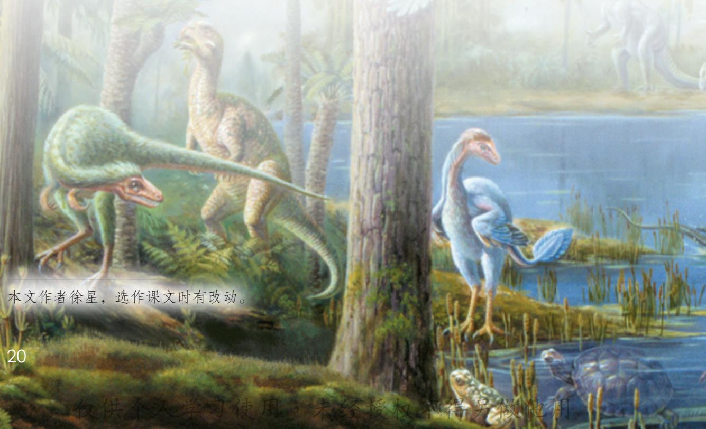

现了保存有羽毛的恐龙化石，顿时使全世界的研究者们欣喜若狂。辽西的发现向世人展示了恐龙长羽毛的证据，给miáo这幅古生物学家们描绘的画卷涂上了点睛之笔。

恐龙是如何飞向蓝天的呢？让我们穿越时空隧道，访问中生代的地球，看看这一演化过程吧！

地球上的第一种恐龙大约出现在两亿四千万年前。它  
和狗一般大小，两条后腿粗壮有力，能够支撑起整个身体。yǎn  
数千万年后，它的后代繁衍成一个形态各异的庞大家族。  
有些恐龙像它们的祖先一样用两足奔跑，有些恐龙则用四dūn  
足行走。有些恐龙身长几十米，重达数十吨；有些恐龙则rú  
身材小巧，体重只有几千克。有些恐龙凶猛异常，是茹毛  
饮血的食肉动物；有些恐龙则温顺可爱，以植物为食。其  
中，一些猎食性恐龙的身体逐渐变小，越来越像鸟类：骨lú péng jié  
骼中空，身体轻盈；脑颅膨大，行动敏捷；前肢越来越长，

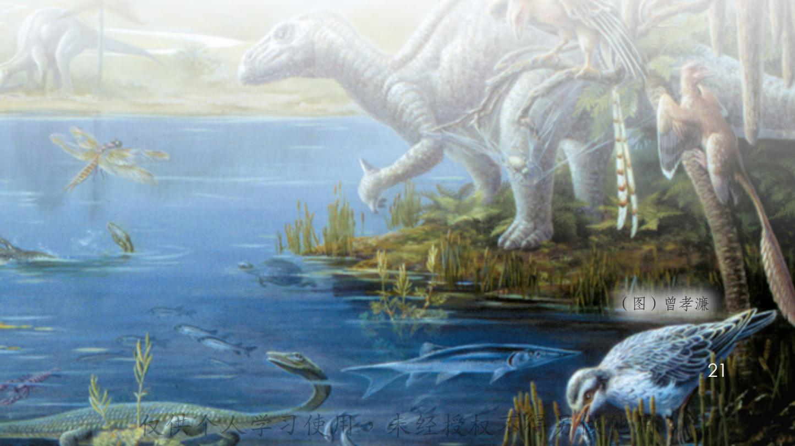

## 人民教育出版社

lín

能像鸟翼一样拍打；体表长出美丽的羽毛，不再披着鳞片或鳞甲。它们中的一些种类可能为了躲避敌害或寻找食物而转移到树上生存。这些树栖的恐龙在树木之间跳跃，降落，慢慢具备了滑翔能力，并最终能够主动飞行。不过，另一种看法是，飞行并非始于树栖生活。有些科学家推测，一种生活在地面上的带羽毛的恐龙，在奔跑过程中学会了飞翔。不管怎样，科学家们认为：原本不会飞的恐龙最终pì变成了天之骄子—鸟类，它们飞向了蓝天，从此开辟了zhǎn  
崭新的生活天地。

亿万年前，一种带羽毛的恐龙脱离同类，飞向蓝天，演化出今天的鸟类大家族。科学家们希望能够全面揭示这一历史进程。随着越来越多相关化石的发现，他们离这一愿望的实现已越来越近了。

dùn miáo suì yǎn dūn lú péng jié pì zhǎn 钝描隧衍吨颅膨捷辟崭

笨钝鸽 毫凌 隧

态吨颅膨肢翼辟

默读课文，把不懂的问题写下来，并试着解决。

假如你是一个解说员，会怎样简明扼要地介绍恐龙飞向蓝天，演化成鸟类的过程？

课文中的不少语句表达很准确，如“科学家们希望能够全面揭示这一历史进程”。找出这样的语句读一读，说说自己的体会。

## 小练笔

读一读，注意加点的部分，再照样子写一段话。

数千万年后，它的后代繁衍成一个形态各异的庞大家族。有些恐龙像它们的祖先一样用两足奔跑，有些恐龙则用四足行走。有些恐龙身长几十米，重达数十吨；有些恐龙则身材小巧，rú体重只有几千克。有些恐龙凶猛异常，是茹毛饮血的食肉动物；有些恐龙则温顺可爱，以植物为食。

## 资料袋

科学界存在着多种解释鸟类起源的假说。有人认为鸟类起源于一种早期鳄形动物，也有人提出鸟类源自一类叫作“槽齿类”的爬行动物，还有人推测鸟类由兽脚类恐龙演化而来。1996年以来，在我国辽西及其周边地区，发现了许多保存有羽毛的恐龙化石。有后肢修长的尾羽龙、体态臃肿的北票龙、满嘴利牙的中国鸟龙、身体小巧的小盗龙，还有耀龙、近鸟龙等。这些恐龙，有的身披纤维状的原始羽毛，有的身披五颜六色的片状羽毛，为科学界解答鸟类起源问题提供了重要依据。

# ⑦纳米技术就在我们身边

纳米技术是20世纪90年代兴起的高新技术。如果说20世纪是微米的世纪，21世纪必将是纳米的世纪。

什么是纳米技术呢？这得从纳米说起。纳米是非常非常小的长度单位，1纳米等于十亿分之一米。如果把直径pīng pāng为1纳米的小球放到乒乓球上，就好像把乒乓球放在地球上，可见纳米有多么小。纳米技术的研究对象一般在1纳米到100纳米之间，不仅肉眼根本看不见，就是普通的光学显yōng微镜也无能为力。这种纳米级的物质拥有许多新奇的特性，纳米技术就是研究并利用这些特性造福人类的一门学问。

纳米技术就在我们身边。冰箱里如果使用一种纳米涂jūn chòu shū层，就会具有杀菌和除臭功能，能够使蔬菜保鲜期更长。有tàn一种叫作“碳纳米管”的神奇材料，比钢铁结实百倍，而且非常轻，将来我们有可能坐上“碳纳米管天梯”到太空旅行。在最先进的隐形战机上，用到一种纳米吸波材料，能够把探测雷达波吸收掉，所以雷达根本看不见它。

ái zhèng

纳米技术可以让人们更加健康。癌症很可怕，但如果là在只有几个癌细胞的时候就能发现的话，死亡率会大大降

## 人民教育出版社

低。利用极其灵敏的纳米检测技术，可以实现疾病的早期检测与预防。未来的纳米机器人甚至可以通过血管直达病zào灶，杀死癌细胞。生病的时候，需要吃药。现在吃一次药最多管一两天，未来的纳米缓释技术，能够让药物效力缓慢地释放出来，服一次药可以管一周，甚至一个月。

纳米技术将给人类的生活带来深刻的变化。在不远的将来，我们的衣食住行都会有纳米技术的影子。

pīng pāng yōng jūn chòu shū tàn ái zhèng lù jí zào 乒乓拥菌臭蔬碳癌症率疾灶

纳 拥 箱 蔬 石 隐建 康 朋 疾 需

朗读课文，把课文中的科技术语读正确。读了课文，你有什么不懂的问题？提出来和同学交流。

“纳米技术就在我们身边”“纳米技术可以让人们更加健康”，选择其中一句话，结合课文内容和查找的资料，说说你的理解。

## 选做

如果让你利用纳米技术，你会把它运用到生活中的哪些地方？发挥想象说一说。

# ⑧千年梦圆在今朝

默读课文，说说中华民族千年的飞天梦是怎样逐步实现的。感兴趣的同学，可以查阅资料，了解我国在航天领域的最新成就。

飞离地球、遨游太空是中华民族很久以来的梦想。在chángé古代就有“嫦娥奔月”的神话，有人飞上天、空中飞车的kūnpéng lǎn传说，还有“鲲鹏展翅”“九天揽月”的奇妙想象。富有激情和超凡想象力的炎黄子孙，在千百年的岁月流转之中，不断地尝试实现自己的美好愿望。

传说，我国明代的官员万户，是世界历史上第一个试验利用火箭上天的人。他把四十七支火箭安装在椅子背后，自己坐在椅子上，手拿两只大风筝，叫人点火发射。随着一声巨响，他消失在了火焰和烟雾中。尽管他的火箭飞行尝试没有成功，但万户仍然被国际航天史学家公认为人类qū飞行探索的先驱。为了纪念他，国际天文学联合会将月球上的一座环形山命名为“万户”。

jiàn

万户那种勇于实践的探索精神，极大地震撼和鼓舞着zhuó人们。数百年来，坚定而执着的炎黄子孙，在实现飞天梦的过程中，遭受了无数失败，付出了惨重代价，但是，始终没有放弃飞离地球的努力。

1949年，中华人民共和国成立，中华民族的历史掀开  
了崭新的一页，中国的航天事业也呈现出勃勃生机。毛泽东  
主席在苏联第一颗人造卫星上天之后的第二年—1958年，  
庄重地表示：“我们也要搞人造卫星。”经过十多年的努力，  
1970年4月24日，寂寞而辽阔的太空中，第一次响起了中国qióng  
人的声音，那穿越苍穹的《东方红》乐曲，让海内外华人振  
奋不已。中国成为世界上第五个能够独立发射卫星的国家。

在准备发射人造卫星的同时，中国科学家满怀希望地dǎng开始了载人航天技术的探索。1992年9月21日，党中央决shī定实施载人航天工程，一百一十多个单位直接承担了研制、建设和发射任务。经过广大科技人员、工人和解放军官兵xiè十余年的不懈努力，2003年10月15日早晨9时，在酒泉卫lóng星发射中心，随着一声震耳欲聋的巨响，我国自行研制的wǎn“神舟五号”飞船被送上太空。火箭宛若一条巨龙，划出一道绚丽的曲线，瞬间便消失在了苍穹之中。10月16日早晨6时23分，飞船在环绕地球十四圈后成功返回着陆场。航天员杨利伟在即将登机返回北京的时候，用三句话概括了他的太空旅行：“飞船运行正常。我自我感觉良好。我为祖国感到骄傲。”

我国首次载人航天飞行的成功，向全世界宣告：中国已经成为第三个独立掌握载人航天技术的国家。

“神舟五号”成功发射的第二年，我国正式实施探月工程。2007年10月24日，我国成功发射第一颗月球探测卫星bēi“嫦娥一号”，这是我国航天事业的又一座里程碑。2019年1月3日，“嫦娥四号”探测器实现了人类首次月球背面shè软着陆，并传回了第一张月背近距离拍摄的清晰的月表形貌图。随后，“嫦娥四号”着陆器与它的月球车“玉兔二号”，顺利进行了互相拍摄，带有五星红旗的着陆器和月球车，在月球背面留下了历史性的珍贵影像。

péng lǎn qū jiàn zhuó dǎng shī xiè wǎn bēi 鹏揽驱践着党施懈宛碑

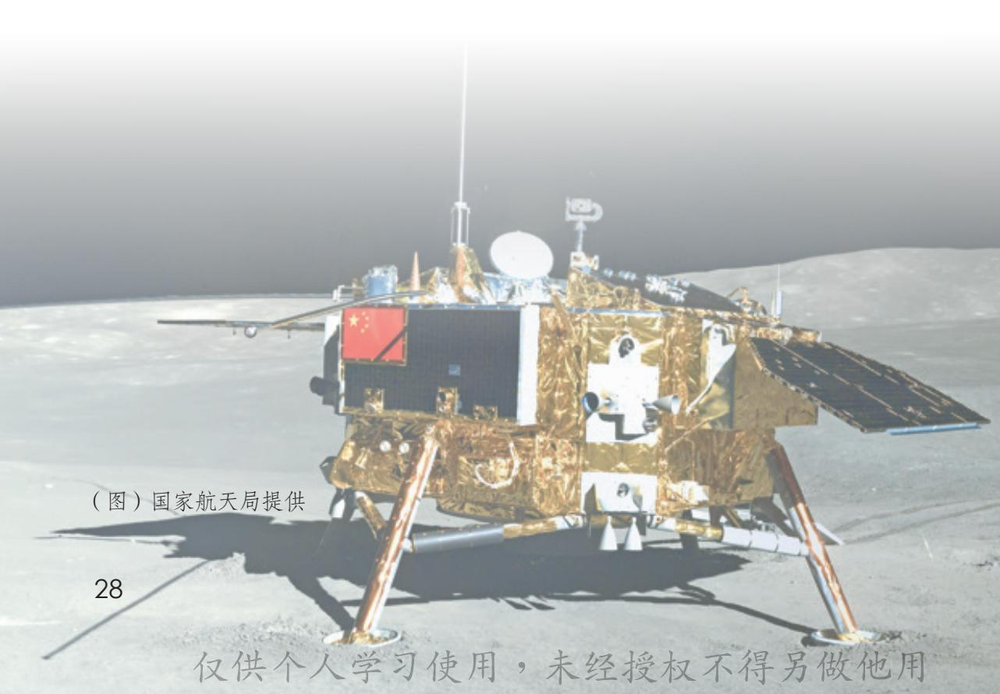

## 口语交际

## 说新闻

通过报纸、电视、广播、网络等，我们看到或听到过各种新闻，如：

2023年5月22日，“一带一路”年度汉字发布活动在陕西汉中举行

2023年5月28日，C919国产大型客机圆满完成首次商业飞行

我国成功举办第31届世界大学生夏季运动会

◇本市新增一座儿童游乐园

在你最近了解的新闻中，选一则感兴趣的和同学交流。要说明新闻的来源，把新闻讲清楚，不要随意更改内容。最后，还可以说说自己对这则新闻的看法。

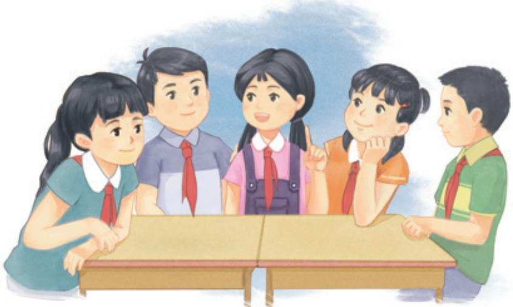

◎准确传达信息。

◎清楚、连贯地讲述。

# 我的奇思妙想

生活中，我们常常会有一些奇思妙想，想发明一些神奇的东西。

水上行走鞋

## 会飞的木屋

会变大变小的书包

你想发明什么？它是什么样子的，有哪些功能？把它写出来介绍给大家吧！可以参考下面的提示，想想自己要写的内容。还可以把你想发明的东西画出来，帮助自己描述。

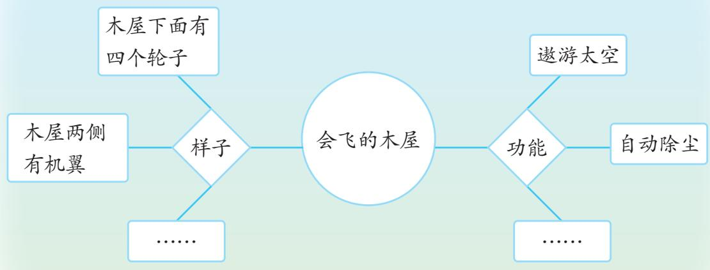  
写完后，把习作读给同桌听，请同桌说说你是否写清楚了。

# 语文园地

## 交流平台

遇到不懂的问题，应该怎样解决呢？

我通常会联系上下文，并结合生活经验来解决问题。

查资料可以帮助我们理解不懂的问题。如，为什么《琥珀》的作者把故事发生的时间设定在几千万年前？我查资料知道了琥珀的形成需要几千万年。

我是请教别人后知道的。

## 识字加油站

bīn   
滨—宾（宾馆） zhào   
挑—兆（预兆） zhǒng   
中肿（肿胀） luó   
罗—逻（巡逻）

jí洁—吉（吉利）

tíng挺—廷（宫廷）

jiē   
介—阶（台阶） zhèng   
正—政（政府） xián   
减—咸（咸菜） yǔ   
预—予（赠予） zhǐ   
止—趾（脚趾） liú   
刘—浏（浏览）

bīn jí xián zhào tíng yǔ zhǒng jiē zhǐ luó zhèng liú 宾吉咸兆廷予肿阶趾逻政浏

# 人民教育出版社

## 词句段运用

下面这些词语，有的是近几十年出现的，有的是在原有含义的基础上有了新的意思。选一两个你知道的，和同学交流。

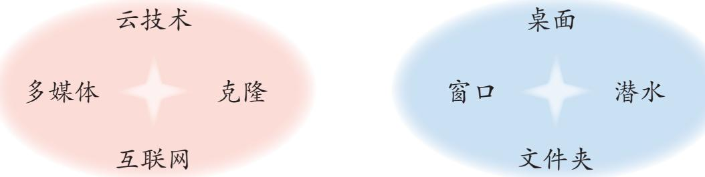

读句子，注意加点的部分，再照样子写一个事物。

地球上的第一种恐龙和狗一般大小，两条后腿粗壮有力，能够支撑起整个身体。

如果把直径为1纳米的小球放到乒乓球上，就好像把乒乓球放在地球上，可见纳米有多么小。

有一种叫作“碳纳米管”的神奇材料，比钢铁结实百倍。

## 日积月累

pàn 江畔独步寻花

[唐]杜甫

黄师塔前江水东，春光懒困倚微风。cù桃花一簇开无主，可爱深红爱浅红？

## 快乐读书吧

## 探索科学的奥秘

生活中的很多事物和现象都蕴藏着科学的奥秘。为什么铁会生锈？为什么面包放久了会发硬？为什么水能带走脏东西？……你想知道这些问题的答案吗？快来读一读科普作品吧！

## 你读过吗

科普作品一般会介绍各种各样的科学知识，内容有趣，形式丰富，语言生动，以引人入胜的方式激发读者的好奇和探索。以下是一个科普作品片段，你能回答其中的问题吗？

你们家里每天总有人生炉子，煮马铃薯。也许你自己就很会生炉子或者煮马铃薯。可是请你解释一下：为什么炉子里的柴会毕剥作响？为什么烟会走烟筒出去，而不向屋里冒？煤油燃烧的时候，从哪里来的烟？为什么烘烤的马铃薯有一层硬皮，煮的却没有？恐怕你不能解释明白吧。或者问你：水为什么能灭火？我的一位熟人回答说：“水能灭火，因为它又湿又冷。”可是煤油也又湿又冷，你倒是试试用煤油来灭火吧！不，你还是不试为好，一试就得报火警了。你看，问题挺简单，可是要回答它却不那么容易。我再给你猜十二个关于最简单事物的谜，你愿意不愿意？

——作者是苏联的米·伊林，译者董纯才，选用时有改动

阅读科普作品的时候，可能会遇到一些不理解的科技术语。这时要运用在课上学过的方法，试着去理解。

读完后还可以查一查，書中談到的一些科學問題，现在有什么新的研究成果。

## 相信你可以读更多

在数学、物理、化学、生物等领域，我国一代又一代科学家把探求真理、献身科学作为毕生追求。他们始终保持对科学的好奇心，在潜心研究科学的同时，也致力于向大众普及科学知识，创作了许多优秀的科普作品，如李四光《看看我们的地球》、高士其《灰尘的旅行》、贾兰坡《人类起源的演化过程》。

让我们读读这些作品，共同感受科学世界里的那些奥秘。

## 人民教育出版社

第三单元

诗歌，让我们用美丽的眼睛看世界。

初步了解现代诗的一些特点，体会诗歌表达的情感。

根据需要收集资料，初步学习整理资料的方法。

合作编小诗集，举办诗歌朗诵会。

人民教育出版社

⑨短诗三首

繁星(七一)

这些事màn是永不漫灭的回忆：  
月明的园中，藤萝的叶下，母亲的膝上。

繁星（一三一)

大海啊！哪一颗星没有光？哪一朵花没有香？哪一次我的思潮里tāo没有你波涛的清响？

本诗作者冰心，选作课文时有改动。

人民教育出版社

繁星（一五九）

母亲啊！天上的风雨来了，鸟儿躲到它的巢里；心中的风雨来了，我只躲到你的怀里。

漫涛

## 繁漫灭藤萝膝涛躲

反复朗读课文，体会诗歌的韵味。背诵课文。

“月明的园中，藤萝的叶下，母亲的膝上”，唤起了你怎样的感受？

朗读第2首诗，体会诗歌表达的情感，和同学交流。

第3首诗中的两个“风雨”有什么不一样？

## 活动提示

诗歌的海洋里有无数珍宝。让我们开展综合性学习，感受诗歌的魅力。

可以通过阅读报纸、杂志、书籍等方式，收集喜欢的现代诗。准备一个摘抄本，把它们工整地抄写下来，注意写清楚作者和出处

## ①绿

好像绿色的墨水瓶倒翻了，到处是绿的……

到哪儿去找这么多的绿： 墨绿、浅绿、嫩绿、 翠绿、淡绿、粉绿…… 绿得发黑、绿得出奇。

刮的风是绿的，下的雨是绿的，流的水是绿的，阳光也是绿的。

所有的绿集中起来，  
jǐ  
挤在一起，  
重叠在一起，  
chā  
静静地交叉在一起。

本诗作者艾青，选作课文时有改动。

突然一阵风，  
好像舞蹈教练在指挥，  
所有的绿就整齐地按着节拍飘动在一起……

# 挤

# 瓶挤叉挥

有感情地朗读课文。背诵课文。

这首诗表现的“绿”，是大自然的景象，更是诗人的感觉。说说“所有的绿就整齐地按着节拍飘动在一起”带给你怎样的感受。

艾青笔下的“绿”给我们留下了很多想象的空间，宗璞笔下的“绿”，又带给你怎样的感受？结合“阅读链接”说一说。

## 阅读链接

雨中去访灵隐，一下车，只觉得绿意扑眼而来。道旁古木参天，苍翠欲滴，似乎飘着的雨丝也都是绿的。飞来峰上层层叠叠的树木，有的绿得发黑，深极了，浓极了；有的绿得发蓝，浅极了，亮极了。峰下蜿蜒的小径，布满青苔，直绿到了石头缝里。

——选自宗璞的《西湖漫笔》

## (11) 白桦

在我的窗前，有一棵白桦，仿佛涂上银霜，披了一身雪花。

毛茸茸的枝头，xiù xiāo雪绣的花边潇洒，zhàn串串花穗齐绽，洁白的流苏如画。

ménglóng 在朦胧的寂静中 玉立着这棵白桦， huī 在灿灿的金晖里 闪着晶亮的雪花。

chángyáng   
白桦四周徜徉着   
shān   
姗姗来迟的朝霞， ái   
它向白雪皑皑的树枝   
又抹一层银色的光华。

本诗作者是苏联的叶赛宁，译者顾蕴璞，选作课文时有改动。

# xiù xiāo zhàn méng lóng huī cháng yáng 绣潇绽朦胧晖徜徉

化 乐 萧 南心乃

朦胧寂霞抹

有感情地朗读课文。

读一读，选择几个词语描述这棵白桦，说说它给你留下了怎样的印象。

shān   
洁白的流苏 灿灿的金晖 姗姗来迟的朝霞 ái   
晶亮的雪花 银色的光华白雪皑皑的树枝

选做

诗歌中常常写到一些植物，你知道哪些与植物有关的诗歌？摘抄你最喜欢的一首，和同学交流。

## 活动提示

这段时间，我们阅读、收集了许多诗歌，还做了自己的诗歌摘抄本，大家可以交流一下。

还可以试着当个“小诗人”写写诗，把自己的感受表达出来。写的时候要注意分行。写完后，和同学交流。

## 12在天晴了的时候

有感情地朗读并背诵课文。结合自已喜欢的诗句，和同学交流读后的感受。有兴趣的同学，还可以用诗的形式，写写自已看到过的雨后天晴的景象。

在天晴了的时候，

该到小径中去走走：

给雨润过的泥路，

一定是凉爽又温柔；

炫耀着新绿的小草，

you已一下子洗净了尘垢；

不再胆怯的小白菊，

慢慢地抬起它们的头，

本诗作者戴望舒。

## 人民教育出版社

试试寒，试试暖，  
然后一瓣瓣地绽透；  
抖去水珠的凤蝶儿，  
在木叶间自在闲游，  
把它的饰彩的智慧书页，pù  
曝着阳光一开一收。到小径中去走走吧，  
在天晴了的时候：  
chì xié  
赤着脚，携着手，  
shè  
踏着新泥，涉过溪流。mái  
新阳推开了阴霾了，yùn  
溪水在温风中晕皱，  
看山间移动的暗绿  
云的脚迹—它也在闲游。

## 综合性学习

## 轻叩诗歌大门

在本次综合性学习中，我们已经收集、创作了诗歌。让我们继续开展活动，进一步了解诗歌，感受诗歌的魅力。

合作编小诗集。

先想想可以编排哪些内容：可以是收集的诗和自己写的诗，还可以是与诗有关的故事或资料。再想想怎么编排：可以从诗人、内容、形式等角度给诗歌分类，可以配上插图，还可以用书法形式展示喜欢的诗。最后，给小诗集取一个好听的名字，制作封面和目录，装订后在班里展示。

举办诗歌朗诵会。

先进行小组讨论，如，选哪几首诗歌来朗诵，采用什么形式才能使本组的朗诵更精彩。再全班一起商量怎样开好班级诗歌朗诵会，如，推选谁做主持人，怎样安排节目顺序。根据商量的结果，大家分头准备。在组织活动的过程中，遇到困难可以请教老师。

用恰当的语气读出诗歌表达的情感。

表情、手势要自然。

# 人民教府出版社

# 语文园地

## 交流平台

我很喜欢本单元的诗歌，读起来朗朗上口、悦耳动听，很有节奏感。

诗歌常常表达诗人独特的感受，蕴含着丰富的想象。因此，语言表达也很独特，如，阳光是“绿的”，寂静是“朦胧的”，小草“炫耀着新绿。

诗歌往往饱含着真挚的情感，如，“永不漫灭的回忆”和“我只躲到你的怀里”，让我体会到了诗人对母亲的深深依恋。

## 识字加油站

你了解下面这些古代文人吗？和同学交流。

qū yuān mèng fǔ 屈原 陶渊明 孟浩然 杜甫 hán yù yǔ xī zhòng gōng 韩愈 刘禹锡 范仲淹 龚自珍

qū yuān mèng fǔ hán yù yǔ xī zhòng gōng 屈渊孟甫韩愈禹锡仲龚

## 词句段运用

读一读，注意加点的部分。你还知道其他描写颜色的句子吗？和同学交流。

在我的窗前，有一棵白桦，仿佛涂上银霜，披了一身雪花。

◇ 白雾与远天晴空连在一起，晶白中透着淡蓝、青苍，一碧qǐng万顷。

那草滩的绿，绿得娇嫩；那菜花的黄，黄得蓬勃；而那湖水的蓝，又是蓝得多么醉人啊！

读一读，注意加点的部分，再仿照着写一写。

这些事是永不漫灭的回忆:  
月明的园中，藤萝的叶下，母亲的膝上。  
春天的早晨，怎样的可爱呢！yě  
融冶的风，飘扬的衣袖，静悄的心情。

## 日积月累

诗和音乐一样，生命全在节奏。——朱光潜

诗是人类向未来所寄发的信息，诗给人类以朝向理想的勇气。 —艾青

诗是强烈感情的自然流露，它源于宁静中回忆起来的情感。 英国华兹华斯

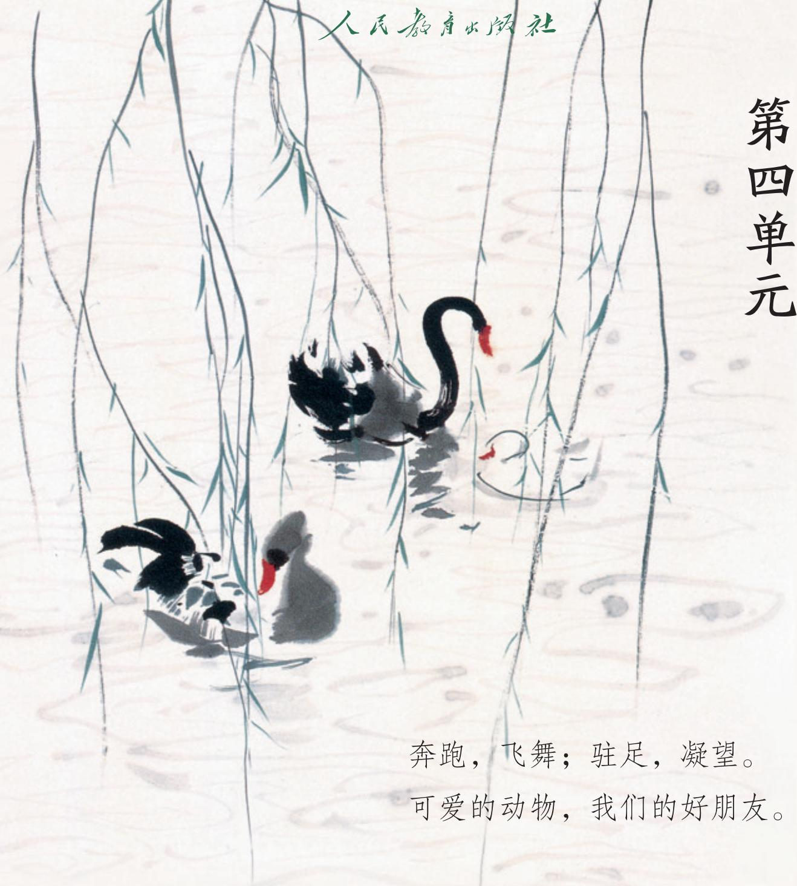  
（图）吴冠中

体会作家是如何表达对动物的感情的。

写自己喜欢的动物，试着写出特点。

# 13猫

猫的性格实在有些古怪。

说它老实吧，它的确有时候很乖。它会找个暖和的地yōu lù方，成天睡大觉，无忧无虑，什么事也不过问。可是，它决定要出去玩玩，就会出走一天一夜，任凭谁怎么呼唤，它也不肯回来。说它贪玩吧，的确是啊，要不怎么会一天一夜不zhí回家呢？可是，它听到老鼠的一点儿响动，又是多么尽职。bǐng它屏息凝视，一连就是几个钟头，非把老鼠等出来不可！

它要是高兴，能比谁都温柔可亲：用身子蹭你的腿，把脖子伸出来让你给它抓痒，或是在你写作的时候，跳上桌gǎo来，在稿纸上踩印几朵小梅花。它还会 来，在稿纸上踩印几朵小梅花。它还会

qiāng  
丰富多腔地叫唤，长短不同，粗细各异，lū  
变化多端。在不叫的时候，它还会咕噜

咕噜地给自己解闷。这可都凭它的高兴。它若是不高兴啊，无论谁说多少好话，它也一声不出，连半朵小梅花也不肯印在稿纸上！

它什么都怕，总想藏起来。可是它又那么勇猛，不要说见着小虫和老鼠，就是遇上蛇也敢斗一斗。

这种古怪的小动物，真让人觉得可爱。

满月的小猫们就更好玩了，腿脚还不稳，

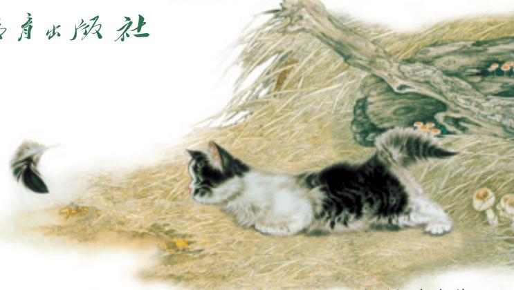  
（图）米春茂

可是已经学会淘气。妈妈的尾巴，一根鸡毛，都是它们的  
好玩具，耍个没完没了。一玩起来，它们不知要摔多少跟  
头，但是跌倒了马上起来，再跑再跌。它们的头撞在门上，bǐ  
桌腿上，和彼此的头上，撞疼了也不哭。它们的胆子越来  
越大，逐渐开辟新的游戏场所。它们到院子里来了。院中yāng  
的花草可遭了殃。它们在花盆里摔跤，抱着花枝打秋千，shé  
所过之处，枝折花落。你见了，绝不会责打它们，它们是  
那么生气勃勃，天真可爱！

yōu lù zhí bǐng cèng gǎo qiāng yāng shé 忧虑职屏蹭稿腔殃折

忧 虑 贪 职 蹭 稿 腔 解 闷 蛇 1 曲旦 殃盆 勃

默读课文，说说课文围绕猫的可爱讲了哪几层意思。

举例说说可以从哪些地方看出作者非常喜欢猫，再把你的体会有感情地读出来。

# 人民教育出版社

## 小练笔

读一读，体会这段话的表达特点，再照样子写一写。

guāi

说它老实吧，它的确有时候很乖。它会找个暖和的地方，成天睡大觉，无忧无虑，什么事也不过问。可是，它决定要出去玩玩，就会出走一天一夜，任凭谁怎么呼唤，它也不肯回来。

读下面的“阅读链接”，体会不同作家对猫的喜爱之情。

## 阅读链接

小猫白玉似的毛色上，黄斑错落得非常明显。当它蹲在草地上或蹦跳在凤仙花丛里的时候，望去真是美丽。每当附近四邻或路过的人，见了称赞说“好猫”的时候，妻脸上就现出一种莫可言说的得意，好像是养着一个好儿子，或是好女儿。阿吉、阿满这两个孩子从学校一回来就用带子逗它玩，或是捉迷藏似的在庭间追赶它。我也常于初秋的夕阳中坐在檐下对这小动物作种种的遐想。

选自夏可尊的《猫》，有改动

它一身的白毛像雪似的，中间夹着数块墨色的细毛，黑白相间，白的显得越白，而黑的越发显得黑了。脸一半白，半黑，两颗小电灯泡似的眼睛在脸中间闪啊闪，见我低下头看它，它也一个劲地盯着我。一条全黑的尾巴躺在地上，悠然自得地摇摆着。嘴张得很大，露出几颗嫩白的小齿，咪咪地叫着，那几根细鱼骨头似的白胡须，傲傲地动着。

——选自周而复的《猫》，有改动

# 14 母鸡

我一向讨厌母鸡。听吧，它由前院嘎嘎到后院，由后院再嘎嘎到前院，没完没了，并且没有什么理由，讨厌！有的时候，它不这样乱叫，而是细声细气的，有什么心事似的，颤颤巍巍的，顺着墙根，或沿着田坝，那么扯长了gē da声如怨如诉，使人心中立刻结起个小疙瘩来。

wǔ

它永远不反抗公鸡，有时候却欺侮最忠厚的鸭子。更wù dú可恶的是遇到另一只母鸡的时候，它会下毒手，趁其不备，zuǒ狠狠地咬一口，咬下一撮儿毛来。

到下蛋的时候，它差不多是发了狂，恨不能让全世界lóng都知道它这点儿成绩；就是聋人也会被它吵得受不了。

chú

可是，现在我改变了心思，我看见一只孵出一群小雏鸡的母鸡。

不论是在院里，还是在院外，它总是挺着脖儿，表示出世界上并没有可怕的东西。一只鸟儿飞过，或是什么东西响了一声，它立刻警戒起来：歪着头听；挺着身儿预备作战；看看前，看看后，咕咕地警告鸡雏要马上集合到它身边来。

# 人民教育出版社

zhuó

发现了一点儿可吃的东西，它咕咕地紧叫，啄一啄那个东西，马上便放下，让它的儿女吃。结果，每一只鸡雏的肚子都圆圆地下垂，像刚装了一两个汤圆儿似的，它自己shòu却消瘦了许多。假若有别的大鸡来抢食，它一定出击，把它们赶出老远，连大公鸡也怕它三分。

它教鸡雏们啄食，掘地，用土洗澡，一天不知教多少次。它还半蹲着，让它们挤在它的翅下、胸下，得一点儿fú温暖。它若伏在地上，鸡雏们有的便爬到它的背上，啄它hēng的头或别的地方，它一声也不哼。

tí qī在夜间若有什么动静，它便放声啼叫，顶尖锐，顶凄惨，无论多么贪睡的人都得起来看看，是不是有了黄鼠狼。

它负责，慈爱，勇敢，辛苦，因为它有了一群鸡雏。它伟大，因为它是鸡母亲。一个母亲必定就是一位英雄。

我不敢再讨厌母鸡了。

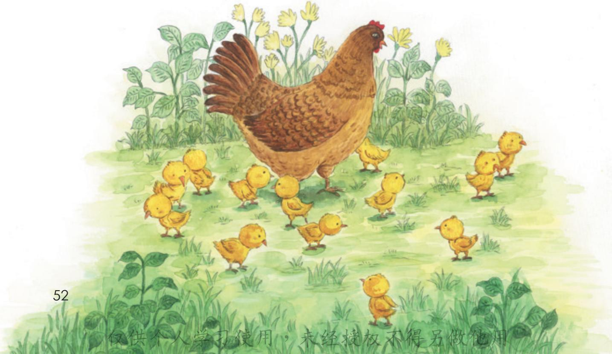

# gē da wǔ wù dú lóng zhuó fú hēng tí qī 疙瘩侮恶毒聋啄伏哼啼凄

丰 结 敬 芯

戒歪咕汤掘伏啼

默读课文，画出“我”对母鸡的态度前后变化的句子，说说为什么有这样的变化。

老舍先生用词很严谨，他写母鸡“负责，慈爱，勇敢，辛苦”，母鸡真的就是这样。结合课文内容说一说。

《猫》和《母鸡》都是老舍先生的作品。比一比，说说两篇课文在表达上有哪些相同和不同之处。

## 资料袋

老舍（1899—1966），原名舒庆春，字舍予，“老舍”是他最常用的笔名。他是杰出的语言大师被誉为“人民艺术家”。他一生创作了一千多篇（部）作品，有长篇小说《骆驼祥子》、话剧《茶馆》等经典著作。

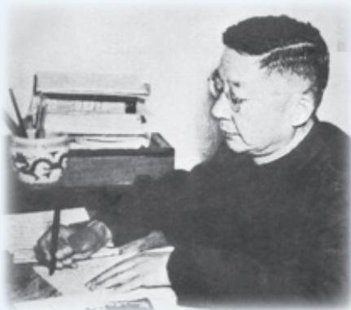

# 1 白鹅

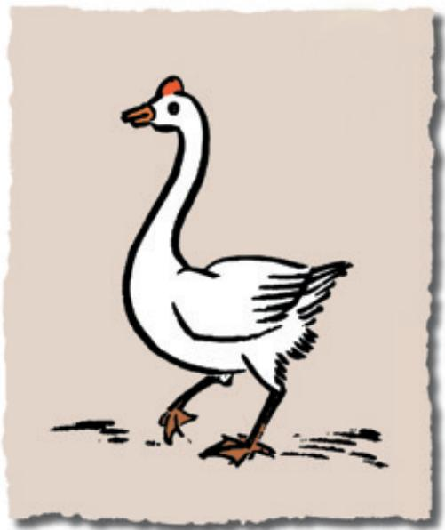

这白鹅，是一位即将远行的朋友送给我的。我抱着这雪白的“大鸟”回家，放在院子里。它伸长了头颈，左顾右盼，我一看这姿态，想道：“好一个高傲的动物！”

（图）丰子恺

鹅的高傲，更表现在它的叫声、步态和吃相中。

這個自然段在文中有什么作用呢？

diào zhèng

鹅的叫声，音调严肃郑重，似厉声 kān 呵斥。它的旧主人告诉我：养鹅等于养狗，它也能看守门 户。后来我看到果然如此：凡有生客进来，鹅必然厉声叫 xiāo bā háng 嚣；甚至篱笆外有人走路，它也要引吭大叫，不亚于狗的 fèi 狂吠。

鹅的步态，更是傲慢了。大体上与鸭相似，但鸭的步cù调急速，有局促不安之相；鹅的步调从容，大模大样的，pō颇像京剧里的净角出场。它常傲然地站着，看见人走来也毫不相让；有时非但不让，竟伸过颈子来咬你一口。

## 人民教育出版社

鹅的吃饭，常常使我们发笑。我们的鹅是吃冷饭的，一日三餐。它需要三样东西下饭：一样是水，一样是泥，一样是草。先吃一口冷饭，再喝一口水，然后再到别处去吃一口泥和草。大约这些泥和草也有各种可口的滋味。这shē chǐ gǒu pì些食料并不奢侈，但它的吃法，三眼一板，一丝不苟。譬如吃了一口饭，倘若水盆放在远处，它一定从容不迫地大踏步走上前去，饮一口水，再大踏步走去吃泥、吃草。吃过泥和草再回来吃饭。

这样从容不迫地吃饭，必须有一个人在旁侍候，像饭guān  
馆里的堂倌一样。因为附近的狗，都知道我们这位鹅老爷kuī sì  
的脾气，每逢它吃饭的时候，狗就躲在篱边窥伺。等它吃  
过一口饭，踏着方步去喝水、吃泥、吃草的当儿，狗就敏  
捷地跑过来，努力地吃它的饭。鹅老爷偶然早归，伸颈去  
咬狗，并且厉声叫骂，狗立刻逃往篱边，蹲着静候；看它

再吃了一口饭，再走开去喝水、吃泥、吃草的时候，狗又敏捷地跑上来，把它的饭吃完，扬长而去。等到鹅再来

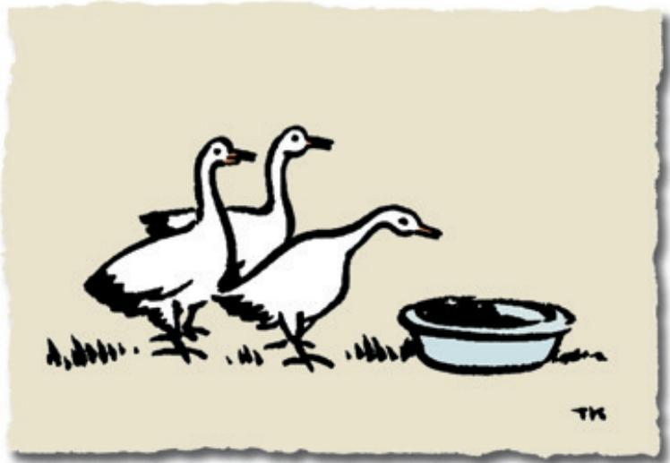  
（图）丰子恺

吃饭的时候，饭罐已经空空如也。鹅便昂首大叫，似乎责备人们供养不周。这时我们便替它添饭，并且站着侍候。因为邻近狗很多，一狗方去，一狗又来蹲着窥伺了。

我们不胜其烦，以后便将饭罐和水盆放在一起，免得它走远去，让鸡、狗偷饭吃。然而它所必需的泥和草，所在的地点远近无定。为了找这些食物，它仍是要走远去的。因此鹅吃饭时，非有一个人侍候不可，真是架子十足！

diào kān xiāo háng fèi cù pō shē chǐ gǒu pì shì kuī sì 调看嚣吭吠促颇奢侈苟譬侍窥伺

周 颇剧 辟 馆

附脾敏捷昂供添

朗读课文，体会语言的趣味。

课文里有许多表现鹅高傲的词语，如“引吭大叫”“傲然”“架子十足”。找一找，分类抄下来，再体会作者是如何把“高傲”写清楚的。

叫声：

步态：

吃相：

读句子，回答括号里的问题。

鸭的步调急速，有局促不安之相；鹅的步调从容，大模大样的，颇像京剧里的净角出场。（把鹅和鸭的步调进行比较，这样写有什么好处？)

因为附近的狗，都知道我们这位鹅老爷的脾气，每逢它吃饭的时候，狗就躲在篱边窥伺。（把鹅称作“鹅老爷”，你从中体会到了什么？)

读下面的“阅读链接”，和课文《白鹅》比一比，说说两位作家笔下的鹅有什么共同点，再体会两篇文章表达上的相似之处。

## 阅读链接

## 白公鹅

要是可以把军衔授给禽类的话，这只白公鹅理当荣膺海军上将衔了。它板正的姿势啦，步态啦，和别的公鹅攀谈时的腔调啦，全是海军上将的派头。

它走起路来慢条斯理，仔细掂量着每一步。落步之前，它总要先把脚掌往上抬抬，再合上掌蹼，就像收起张开的扇面一样；然后摆一会儿这个姿势，再不慌不忙地把脚掌放到地上。通过车辙凌乱而泥泞的路时，它也那么有办法，身上的任何一根细翎都不沾上一点儿污泥。就是狗在身后追赶，这只鹅也决不举步奔跑。它总是高傲地、一动不动地挺着长长的脖子，好像头上顶着一罐水。

# 人民教育出版社

当白鹅在浅水滩里挺直身子，扇动起两只长长的有力的翅膀时，水面上便泛起层层涟漪，岸边的芦苇也会沙沙作响。

这只白鹅在整片河湾里最引人注目。它过得无忧无虑，自由自在。青草茂密的河岸属于它，水边最洁净的沙滩也属于它。

可最糟糕的是，白鹅把我下了鱼饵的一片水面，也划为自己的地盘。我们为这片水面打了好长时间的官司，它根本没把我放在眼里。有时它率领一伙公鹅横成一排，直奔鱼竿，而且还要赖在那里；有时它们在河对岸洗澡，大声叫唤，拍打翅膀，互相嬉戏。要不，它就与邻近的鹅群来上一场厮打，弄得满河里漂浮着撕咬下来的乱羽。如果赶上这么一场用以耀武扬威的乱子，你就甭想有鱼咬钩了。

有多少次，它径直把我罐头筒里的鱼饵咽进了肚里，有时还拖走挂着鱼饵的钓绳。干这种勾当它从不偷偷摸摸，总是从从容容、不紧不慢的，因为它自认为是这条河的主宰。白鹅大概认为这个世界上的所有东西都属于它。它要是知道了连它自己也属于村里的少年斯焦普卡—他愿意的话，就可以把它抓起来，交给母亲，用它和鲜白菜一起熬汤喝——那可就要大吃一惊了。

本文作者是俄国的叶·诺索夫，译者李颜，选用时有改动

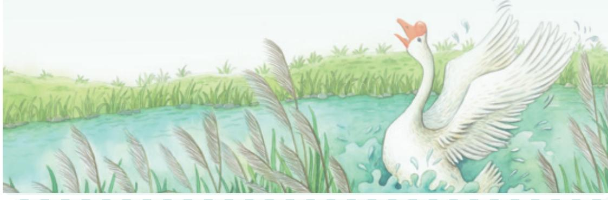

## 我的动物朋友

有时候，我们需要向别人介绍自己的动物朋友。从下面的情境中选择一个，向别人介绍你的动物朋友。如果你没有养过这些动物，也可以就自己熟悉的动物创设一个情境来写。写之前想一想，你打算从哪些方面介绍它，它在这些方面有怎样的特点。

星期天放羊回来，发现我最喜爱的一只小羊不见了，我想请小伙伴帮忙找一找。

我要跟小伙伴强调，小 羊的左眼圈是黑色的……

我们全家要外出旅行一段时间，只好请邻居帮忙喂养我的小狗。

我要给邻居讲清楚，我家小狗特别爱吃肉…

我们家就要搬到外地去了，我想请一位同学收养我的小猫。

我要給同學讲一讲小猫的可爱……

写完后，同桌互相评一评，看看是否根据需要写出了动物的特点。

# 人民教育出版社

# 语文园地

## 交流平台

◇猫的性格实在有些古怪。

鹅吃饭时，非有一个人侍候不可，真是架子十足！

如果赶上这么一场用以耀武扬威的乱子，你就甭想有鱼咬钩了。

从字面上看，作者好像并不喜欢这些小动物，实际上课文的字里行间却藏着对它们深深的爱。

读到这样的句子，我就想起妈妈经常跟别人说：“我们家那个傻孩子……”

我们说话和习作的时候，可以试着运用这种方法。

## 识字加油站

gān gǎn qiào qiào   
杆—肝（肝脏）—秆（麦秆）消—俏（俏丽）—峭（陡峭） bǔ pǔ lún lūn   
捕—哺（哺育）—浦（黄浦江）轮—沦（沦落）—抡（抡拳） huàn huàn jùn jùn   
换—涣（涣散）—焕（焕发）骏—俊（英俊）—峻（严峻）

gān gǎn qiào qiào bǔ pǔ lún lūn huàn huàn jùn jùn 肝秆俏峭哺浦沦抡涣焕俊峻

## 词句段运用

下面这些词语分别指的是哪一类人？选一两个说一说。千里马 老黄牛 百灵鸟 领头羊 小蜜蜂纸老虎 变色龙 铁公鸡 应声虫 哈巴狗

体会下面句子中冒号的用法，再从词语中选一个，仿照着写一写。

◇ 它要是高兴，能比谁都温柔可亲：用身子蹭你的腿，把脖子伸出来让你给它抓痒。

什么东西响了一声，它立刻警戒起来：看看前，看看后，咕chú咕地警告鸡雏要马上集合到它身边来。

后来我看到鹅果然能看守门户：凡有生客进来，鹅必然厉声bā  
叫嚣；甚至篱笆外有人走路，它也要引吭大叫，不亚于狗的  
狂吠。

活泼的小狗 细心的小亮 热心肠的老奶奶

如果去掉下面句子中加点的词，表达效果有什么不同？

说它贪玩吧，的确是啊，要不怎么会一天一夜不回家呢？

它若是不高兴啊，无论谁说多少好话，它也一声不出，连半朵小梅花也不肯印在稿纸上！

< 它板正的姿势啦，步态啦，和别的公鹅攀谈时的腔调啦，全是海军上将的派头。

## 书写提示

有些人家，在屋后种几十枝竹，绿的叶，青的竿，投下一片浓浓的绿荫。几场春雨过后到那里走走，你常常会看见许多鲜嫩的笋，成群地从土里探出头来。

字距要比行距小。字的大小基本一致。两边留的空白大致相等。

## 日积月累

## 蜂

[唐]罗隐

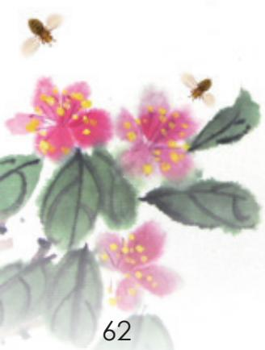

不论平地与山尖，无限风光尽被占。采得百花成蜜后，为谁辛苦为谁甜？

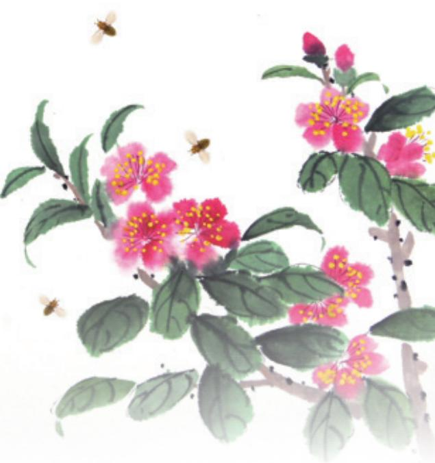

第五单元

妙笔写美景，巧手著奇观。

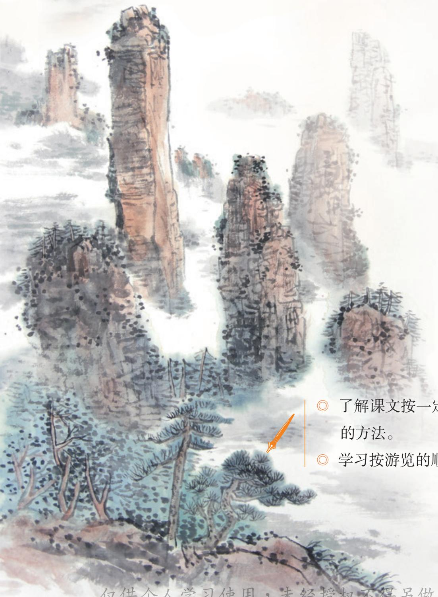

了解课文按一定顺序写景物的方法。

学习按游览的顺序写景物。

# 16 海上日出

为了看日出，我常常早起。那时天还没有大亮，周围非常清静，船上只有机器的响声。

天空还是一片浅蓝，颜色很浅。转眼间天边出现了一kuò道红霞，慢慢地在扩大它的范围，加强它的亮光。我知道太阳要从天边升起来了，便不转眼地望着那里。

果然，过了一会儿，在那个地方出现了太阳的小半边hè脸，红是真红，却没有亮光。太阳好像负着重荷似的一步一步，慢慢地努力上升，到了最后，终于冲破了云霞，完chà全跳出了海面，颜色红得非常可爱。一刹那间，这个深红的圆东西，忽然发出了夺目的亮光，射得人眼睛发痛，它旁边的云片也突然有了光彩。

有时太阳走进了云堆中，它的光线却从云里射下来，直射到水面上。这时候要分辨出哪里是水，哪里是天，倒也不容易，因为我就只看见一片灿烂的亮光。

本文作者巴金，选作课文时有改动。

# 人民教育出版社

有时天边有黑云，而且云片很厚，太阳出来，人眼还  
看不见。然而太阳在黑云里放射的光芒，透过黑云的重围xiāng  
替黑云镶了一道发光的金边。后来太阳才慢慢地冲出重围  
出现在天空，甚至把黑云也染成了紫色或者红色。这时候  
发亮的不仅是太阳、云和海水，连我自己也成了光亮的了。

这不是很伟大的奇观吗？

##

扩范努刹烂替镶紫仅

默读课文，说说海上日出的景象。

读句子，注意加点的部分，想想这样写有什么好处。

太阳好像负着重荷似的一步一步，慢慢地努力上升，到了最后，终于冲破了云霞，完全跳出了海面，颜色红得非常可爱

## 选做

有兴趣的同学可以去看看日出，结合自己的体会，说说课文描写日出的精彩之处。

# 17 记金华的双龙洞

zhè

4月14日，我在浙江金华，游北山的双龙洞。

出金华城大约五公里到罗店，过了罗店就渐渐入山。公路盘曲而上。山上开满了映山红，无论花朵还是叶子，都比盆栽的杜鹃显得有精神。油桐也正开花，这儿一丛，cù那儿一簇，很不少。山上沙土呈粉红色，在别处似乎没有见过。粉红色的山，各色的映山红，再加上或浓或淡的新绿，眼前一片明艳。

一路迎着溪流。随着山势，溪流时而宽，时而窄，时而缓，时而急，溪声也时时变换调子。入山大约五公里就来到双龙洞口，那溪流就是从洞里出来的。

wù

在洞口抬头望，山相当高，突兀森郁，很有气势。洞口像桥洞似的，很宽。走进去，仿佛到了个大会堂，周围是石壁，头上是高高的石顶，在那里聚集一千或是八百人开个会，一定不觉得拥挤。泉水靠着洞口的右边往外流。这是外洞。

在外洞找泉水的来路，原来从靠左边的石壁下方的孔隙流出。虽说是孔隙，可也容得下一只小船进出。怎样小

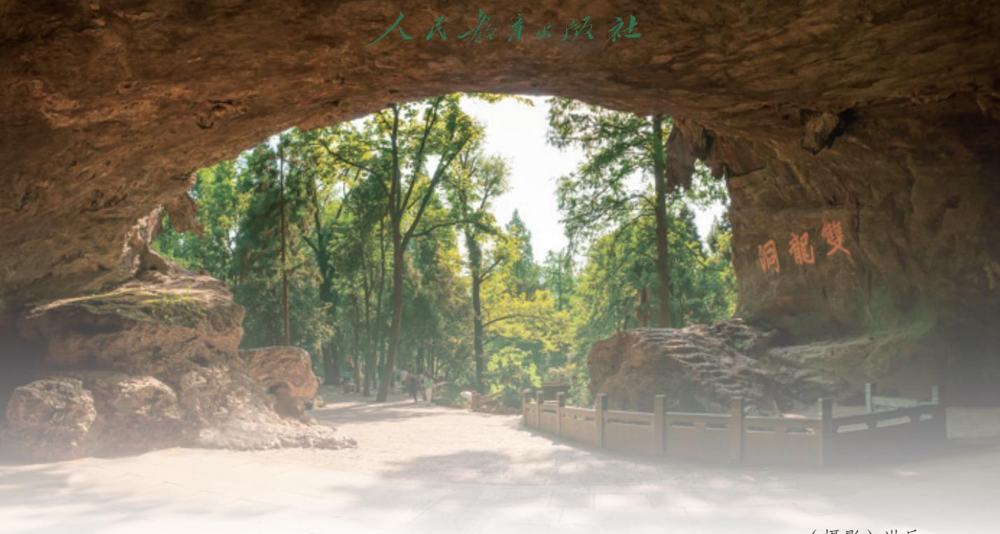  
（摄影）洪兵

的小船呢？两个人并排仰卧，刚合适，再没法容第三个人，是这样小的小船。船两头都系着绳子，管理处的工人先进内洞，在里边拉绳子，船就进去，在外洞的工人拉另一头的绳子，船就出来。我怀着好奇的心情独个儿仰卧在小船tún  
里，自以为从后脑到肩背，到臀部，到脚跟，没有一处不贴着船底了，才说一声“行了”，船就慢慢移动。眼前昏暗了，可是还能感觉左右和上方的山石似乎都在朝我挤压过来。我又感觉要是把头稍微抬起一点儿，准会撞破额角，擦伤鼻子。大约行了两三丈的水程吧，就登陆了。这就到了内洞。

内洞一团漆黑，什么都看不见。工人提着汽油灯，也只能照见小小的一块地方，余外全是昏暗，不知道有多么宽广。工人高高举起汽油灯，逐一指点洞内的景物。先看

# 人民教育出版社

wān yán

到的是蜿蜒在洞顶的双龙，一条黄龙，一条青龙。我顺着他的指点看，有点儿像。其他那些石钟乳和石笋，这是什么，那是什么，大都依据形状想象成神仙、动物以及宫室、器用，名目有四十多。这些石钟乳和石笋，形状变化多端，再加上颜色各异，即使不比作什么，也很值得观赏。

在洞里走了一转，觉得内洞比外洞大得多，大概有十来进房子那么大。泉水靠着右边缓缓地流，声音轻轻的。上源在深黑的石洞里。

我排队等候，又仰卧在小船里，出了洞。

zhè cù tún qī wān yán 浙簇臀漆蜿蜒

浙 四 木 鹃 窄 郁 肩 殿移 额 陆 孚 笋 端 源

默读课文，理清作者游双龙洞的顺序，再把下面的路线图补充完整。

路上→()→()→()→()→出洞

读由外洞进内洞的部分，体会作者是怎样把孔隙的狭小和自己的感受写清楚的。

# 人民教育出版社

## 交流平台

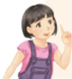

写游览过的一个地方，可以按游览的顺序来写。如，《记金华的双龙洞》就是按游双龙洞的顺序来写的，游览经过清楚明了。

可以把特别吸引你的景物作为重点来写。如，《记金华的双龙洞》重点写了外洞和内洞之间的孔隙。

如果景物发生了变化，可以按照变化的顺序来写。如，《海上日出》的第2～3自然段就是按照早晨太阳变化的顺序来写的。

## 初试身手

星期天，你要带一位同学参观植物园。根据下面的示意图，画出参观路线，再按顺序说一说。

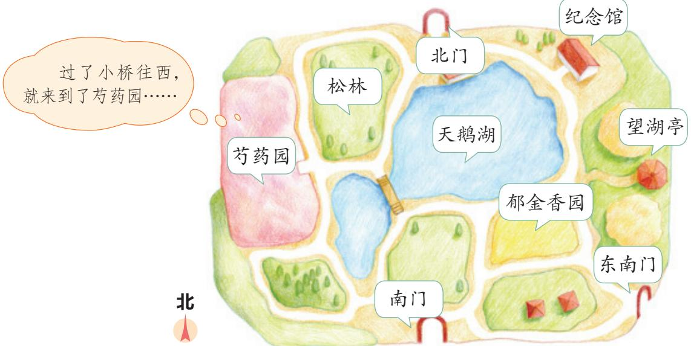

观察附近的一处景物，和同学交流看到了什么，再试着按一定的顺序写下来。

# 人民教育出版社

## 习作例文

“来到有名的长廊”，交代了游览的地点。

“走完长廊，就来到了万寿山脚下”，过渡很自然。

“抬头一看”“向下望”，观察不同位置的景物时，视角也有变化。

## 颐和园

北京的颐和园是个美丽的大公园。

diàn

进了颐和园的大门，绕过大殿，就来到有名的长廊。绿漆的柱子，红漆的栏杆，一眼望不到头。这条长廊有七百多米长，分成二百七十三间。jiàn每一间的横槛上都有五彩的画，画着人物、花草、风景，几千幅画没有哪两幅是相同的。长廊两旁栽满了花木，这一种花还没谢，那一种花又开了。微风从左边的昆明湖上吹来，使人神清气爽。

走完长廊，就来到了万寿山脚下。抬头一看，一座八角宝塔形的三层建筑耸立在半山腰上，黄liú fó色的琉璃瓦闪闪发光。那就是佛香阁。下面的一huáng排排金碧辉煌的宫殿，就是排云殿。

登上万寿山，站在佛香阁的前面向下望，颐和园的景色大半收在眼底。葱郁的树丛，掩映着

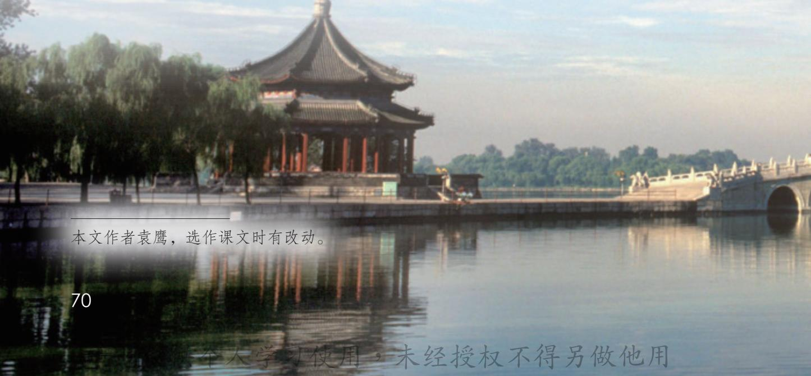

## 人民教育出版社

黄的绿的琉璃瓦屋顶和朱红的宫墙。正前面，昆  
明湖静得像一面镜子，绿得像一块碧玉。游船、fǎng  
画舫在湖面慢慢地滑过，几乎不留一点儿痕迹。tiào  
向东远眺，隐隐约约可以望见几座古老的城楼和  
城里的白塔。

湖面静得像游慢的 慢美

从万寿山下来，就是昆明湖。昆明湖围着长长的堤岸，堤上有好几座式样不同的石桥，两岸栽着数不清的倒垂的杨柳。湖中心有个小岛，远远望去，岛上一片葱绿，树丛中露出宫殿的一角。游人走过长长的石桥，就可以去小岛上玩。这座石桥有十七个桥洞，叫十七孔桥。桥栏杆上有上百根石柱，柱子上都雕刻着小狮子。这么多的狮子，姿态不一，没有哪两只是相同的。

颐和园到处有美丽的景色，说也说不尽，希望你有机会去细细游赏。

默读课文，画出起过渡作用的句子，体会作者是怎样把游览的顺序写清楚的，再把下面的路线图补充完整。

长廊()→()→()

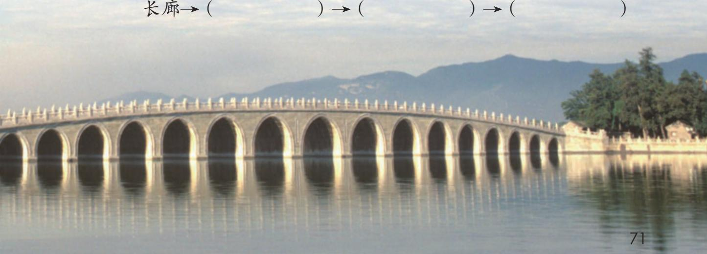

## 七月的天山

七月的新疆，最理想的是骑马上天山。

雪断来到流条 峰崖的山 上雪脚写 从 高到飞水下得 耸峭泻 ， 的壁下再溪有的很理。

进入天山，戈壁滩上的炎暑被远远地抛在后边，迎面送来的雪山寒气，会使你感到像秋天似的凉爽。蓝天衬着高耸的巨大的雪峰，太阳下，duàn雪峰间的云影就像白缎上绣了几朵银灰色的花。xiè融化的雪水，从峭壁断崖上飞泻下来，像千百条闪耀的银链，在山脚下汇成冲激的溪流，浪花往上抛，形成千万朵盛开的白莲。每到水势缓慢的huí wō yìn洄水涡，都有鱼儿在欢快地跳跃。这个时候，饮马溪边，你骑在马上，可以俯视阳光透射到的清chè lán澈的水底。在五彩斑斓的溪水和石子之间，鱼群lín闪闪的鳞光映着雪水清流，给寂静的天山增添了无限生机。

再往里走，天山显得越来越美。白皑皑群峰  
的雪线以下，是蜿蜒无尽的翠绿的原始森林，密yā  
密的塔松像撑开的巨伞，重重叠叠的枝丫，漏下  
斑斑点点细碎的日影。骑马穿行林中，只听见马  
蹄溅起漫流在岩石上的水的声音，使密林显得更yōu  
加幽静。走进天山深处，山色逐渐变得柔嫩，山形也yíng  
逐渐变得柔美。这里溪流缓慢，萦绕着每一个山  
脚。在轻轻荡漾着的溪流的两岸，满是高过马头  
的野花，五彩缤纷，像织不完的锦缎那么绵延不  
断，像天边的霞光那么灿烂耀眼，像高空的彩虹jiǎo  
那么绚丽夺目。马走在花海中，显得格外矫健；  
人浮在花海上，显得格外精神。在马上你用不着ān  
离鞍，只要稍一伸手就可以捧到满怀心爱的鲜花。

虽然天山这时并不是春天，但是有哪一个春天的花园能比得过这时天山的无边繁花呢？

9 默读课文，说说作者是按怎样的顺序写天山的，你是从哪些语句看出来的。

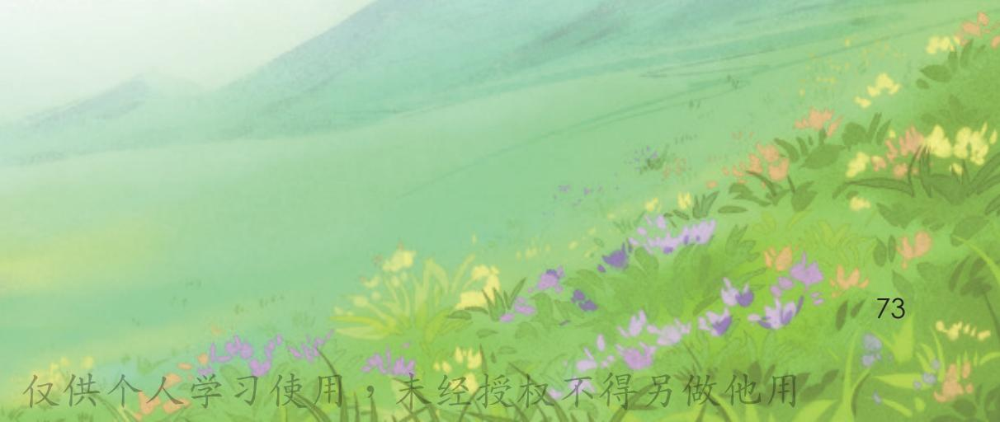

## 习作

游\_

你游览过哪些地方？哪个地方给你留下的印象最深?

上个周末，我去了我家附近的公园。这一次，我选择了一条与往常不同的游览路线。

我游览过长城，那里的烽火台给我留下了深刻的印象。

每到秋天，我就会去果园玩。

在横线上填写这个地方的名称，把题目补充完整。按照游览的顺序写写这个地方，把游览的过程写清楚。

可以先画出游览路线图，帮助自己理清思路。

印象深刻的景物要作为重点来写，注意把它的特点写出来。

口 可以用过渡句，使景物的转换更自然。

写完后，与同学交换习作，互相看看游览的顺序、景物的特点是否写清楚了，并提出修改意见。

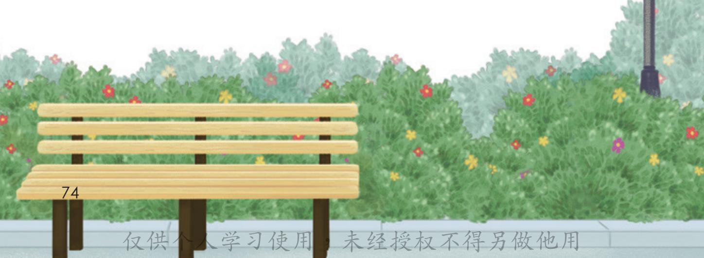

人民教育出版社

第六单元

深深浅浅的脚印，写满成长的故事。

#

学习把握长文章的主要内容。按一定顺序把事情的过程写清楚

# 18文言文二则

# 囊萤夜读①

胤恭勤②不倦，博学多通③。家贫不常得油，夏月则yān练囊④盛数十萤火以照书，以夜继日焉。

注释

①本文选自《晋书·车胤传》。囊，用口袋 ③〔通〕通晓，明白。装。萤，萤火虫。 ④〔练囊〕白色薄绢做的口袋。

②〔恭勤〕肃敬勤勉。

## 铁杵成针①

磨针溪，在象耳山下。世传李太白读书山中，未ǎo成，弃去。过是②溪，逢老媪方③磨铁杵。问之，曰：“欲zú作针。”太白感其意④，还卒业⑤。

注释

# gōng qín yān zú

# 恭勤焉卒

囊萤恭勤博贫逢

正确、流利地朗读课文。背诵《囊萤夜读》。

借助注释，理解课文中每句话的意思。

照样子，根据课文内容填一填。

用这样的方法，我能更好地学习文言文。

◇胤恭勤不倦。（疲倦）

◇家贫不常得油。（）

世传李太白读书山中，未成，弃去。（）

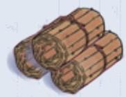

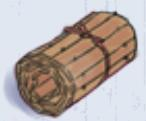

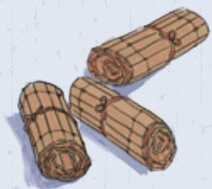

# 19 小英雄雨来（节选）

晋察冀边区的北部有一条还乡河，河里长着很多芦苇。河边有个小村庄。芦花开的时候，远远望去，黄绿的芦苇xù上好像盖了一层厚厚的白雪。风一吹，鹅毛般的苇絮就飘飘悠悠地飞起来，把这几十家小房屋都罩在柔软的芦花里。因此，这村就叫芦花村。十二岁的雨来就是这村的。

雨来最喜欢这条紧靠着村边的还乡河。每到夏天，雨来和铁头、三钻儿，还有很多小朋友，好像一群鱼，在河páo里钻上钻下，藏猫猫，狗刨，立浮，仰浮。雨来仰浮的本领最高，能够脸朝天在水里躺着，不但不沉底，还要把小肚皮露在水面上。

妈妈不让雨来耍水，怕出危险。有一天，妈妈见雨来yǒu从外面进来，光着身子，浑身被太阳晒得黝黑发亮。妈妈niǔ知道他又去耍水了，把脸一沉，叫他过来，扭身就到炕上tiáo抓笤帚。雨来一看要挨打了，撒腿就往外跑。

妈妈紧跟着追出来。雨来一边跑一边回头看。糟了！眼看要追上了，往哪儿跑呢？铁头正赶着牛从河沿回来，远远地向雨来喊：“往河沿跑！往河沿跑！”雨来听出了话里的意思，转身就朝河沿跑。妈妈还是死命追着不放，到qiū底追上了，可是雨来浑身光溜溜的像条小泥鳅，怎么也抓不住。只听见扑通一声，雨来扎进河里不见了。妈妈立在河沿上，望着渐渐扩大的水圈直发愣。

忽然，远远的水面上露出个小脑袋来。雨来像小鸭子一样抖着头上的水，用手抹一下眼睛和鼻子，嘴里吹着气，望着妈妈笑。

读完這部分後，我要分 停 下 来想一想，这部分主要讲的是什么。

秋天。

爸爸从集上卖苇席回来，同妈妈商量：“看见了区上的mǎ工作同志，说是孩子们不上学念书不行，起码要上夜校。

叫雨来上夜校吧。要不，将来闹个睁眼瞎。”

夜校就在三钻儿家的豆腐房里，房子很破。教夜课的guà是东庄学堂里的女老师，穿着青布裤褂，胖胖的，剪着短发。女老师走到黑板前面，屋里嗡嗡嗡嗡说话的声音立刻停止了，只听见哗啦哗啦翻课本的声音。雨来从口袋里掏出课本，这是用土纸油印的，软鼓囊囊的。雨来怕揉坏了，向妈妈要了一块红布，包了个书皮，上面用铅笔歪歪斜斜地写了“雨来”两个字。雨来把书放在腿上，翻开书。

女老师斜着身子，用手指点着黑板上的字，念着：

“我们是中国人，

我们爱自己的祖国。”

大家就随着女老师的手指，齐声轻轻地念起来：

“我们——是——中国人，

我们——爱——自己的——祖国。”

## 三

有一天，雨来从夜校回到家，躺在炕上，背诵当天晚上学会的课文。可是背了不到一半，他就睡着了。

不知什么时候，门吱扭响了一声。雨来睁开眼，看见闪进一个黑影。妈妈划了根火柴，点着灯，一看，原来是爸爸出外卖席子回来了。他肩上披着子弹袋，腰里插着手liú榴弹，背上还背着一杆长长的步枪。爸爸怎么忽然这样打

# 人民教育出版社

扮起来了呢？

爸爸对妈妈说：“鬼子又‘扫荡’了，民兵都到区上集合，要一两个月才能回来。”雨来问爸爸：“爸爸，远不远？”爸爸把手伸进被里，摸着雨来光溜溜的脊背，说：“这哪有准儿呢？说远就远，说近就近。”爸爸又转过脸对妈妈lǎo jiù说：“明天你到东庄他姥姥家去一趟，告诉他舅舅，就说区上说的，叫他赶快把村里的民兵带到区上去集合。”妈bā dā妈问：“区上在哪儿？”爸爸装了一袋烟，吧嗒吧嗒抽着，说：“叫他们在河北一带村里打听。”

kuāng lāng

雨来还想说什么，可是门哐啷响了一下，就听见爸爸走出去的脚步声。不大一会儿，什么也听不见了，只从街上传来一两声狗叫。

第二天，吃过早饭，妈妈就到东庄去，临走说晚上才能回来。过了晌午，雨来吃了点儿剩饭，因为看家，不能pā到外面去，就趴在炕上念他那红布包着的识字课本。

忽然听见街上咕咚咕咚有人跑，把屋子震得好像摇晃起来，窗户纸哗啦哗啦响。

雨来一骨碌下了炕，把书塞在怀里就往外跑，刚要迈kǎn门槛，进来一个人，雨来正撞在这个人的怀里。他抬头一看，是李大叔。李大叔是区上的交通员，常在雨来家落脚。

随后听见日本鬼子鸣哩哇啦地叫。李大叔忙把墙角那kāng盛着一半糠皮的缸搬开。雨来愣住了：“咦！这是什么时候挖的洞呢？”李大叔跳进洞里，说：“把缸搬回原地方，你就快到别的院里去，对谁也不许说。”

十二岁的雨来使尽气力，才把缸挪回到原地。

雨来刚到堂屋，见十几把雪亮的刺刀从前门进来，他撒kā shuān腿就往后院跑。背后咔啦一声枪栓响，有人大声叫道：“站住！”雨来没理他，脚下像踩着风，一直朝后院跑去。只sōu听见子弹向他头上嗖嗖地飞来。可是后院没有门，把雨来急出一身冷汗。靠墙有一棵桃树，雨来抱着树就往上爬。鬼子已经追到树底下，伸手抓住雨来的脚，往下一拉，雨níng kǔn bǎng来就摔在地上。鬼子把他两只胳膊向背后一拧，捆绑起来，sǎng推推搡搡回到屋里。

## 四

鬼子把前后院都翻遍了。

屋子里遭了劫难，连枕头都给刺刀挑破了。炕沿上坐着个鬼子军官，两眼红红的，用中国话对雨来说：“小孩，huǎng问你话，不许撒谎！”他突然望着雨来的胸脯，张着嘴，眼睛睁得圆圆的。

雨来低头一看，原来刚才一阵子挣扎，识字课本从怀里露出来了。鬼子一把抓在手里，翻着看了看，问他：“谁给你的？”雨来说：“捡来的！”

鬼子露出满口金牙，做了个鬼脸，温和地对雨来说：“不

huáng

要害怕！小孩，皇军是爱护的！”说着，就叫人给他松绑。

雨来把手放下来，觉得胳膊发麻发痛。扁鼻子军官用手摸着雨来的脑袋，说：“这本书谁给你的，没有关系，我不问了。别的话要统统告诉我！刚才有个人跑进来，看见dū nāng没有？”雨来用手背抹了一下鼻子，嘟嘟囔囔地说：“我在屋里，什么也没看见。”

扁鼻子军官把书扔在地上，伸手往皮包里掏。雨来心里想：“掏什么呢？找刀子？鬼子生了气要挖小孩眼睛的！”只见他掏出来的却是一把雪白的糖块。

扁鼻子军官把糖往雨来手里一塞，说：“吃！你吃！你得说出来他在什么地方！”他又伸出那个戴金戒指的手指，说：“这个，金的，也给你！”

雨来没有接他的糖，也没有回答他。

旁边一个鬼子嗖地抽出刀来，瞪着眼睛要向雨来头上劈。扁鼻子军官摇摇头。两个人叽叽咕咕说了一阵。那鬼qiào子向雨来横着脖子翻白眼，使劲把刀放回鞘里。

扁鼻子军官压住肚子里的火气，用手轻轻地拍着雨来的肩膀，说：“我最喜欢小孩。那个人，你看见没有？说啊！”

雨来摇摇头，说：“我在屋里，什么也没看见。”

扁鼻子军官的目光立刻变得凶恶可怕，他向前弓着身  
子，伸出两只大手。啊！那双手就像鹰的爪子，扭着雨来liě  
的两只耳朵，向两边拉。雨来疼得直咧嘴。鬼子又抽出一

## 人民教育出版社

jiū

只手来，在雨来的脸上打了两巴掌，又把他脸上的肉揪起  
一块，咬着牙拧。雨来的脸立刻变成白一块，青一块，紫liè qiè  
一块。鬼子又向他胸脯上打了一拳。雨来打个趔趄，后退sháo guì  
几步，后脑勺正碰在柜板上，但立刻又被抓过来，肚子撞  
在炕沿上。

雨来半天才喘过气来，脑袋里像有一窝蜂，嗡嗡地叫。他两眼直冒金星，鼻子流着血。一滴一滴的血滴下来，溅在课本那几行字上：

“我们是中国人，

我们爱自己的祖国。”

鬼子打得累了，雨来还是咬着牙，说：“没看见！”áo bì

扁鼻子军官气得暴跳起来，嗷嗷地叫：“枪毙，枪毙！拉出去，拉出去！”

## 五

太阳已经落下去。蓝蓝的天上飘着的浮云像一块一块红绸子，映在还乡河上，像开了一大朵一大朵鸡冠花。苇塘的芦花被风吹起来，在上面飘飘悠悠地飞着。

芦花村里的人听到河沿上响了几枪。老人们含着泪，说：

“雨来是个好孩子！死得可惜！”

“有志不在年高。”

芦花村的孩子们，雨来的好朋友铁头和三钻儿几个人，

听到枪声都鸣鸣地哭了。

李大叔是谁？前面好像提到过，我再看看前面的内容。

板，扒开苇叶。院子里空空的，一个人影也没有，四处也yāo不见动静。忽然听见街上有人吆喝：“豆腐啦！卖豆腐啦！”这是芦花村的暗号，李大叔知道敌人已经走远了。

可是怎么不见雨来呢？他跑到街上，看见许多人往河沿跑，一打听，才知道雨来被鬼子打死在河里了！

李大叔脑袋轰的一声，眼泪就流下来了。他一股劲地跟着人们向河沿跑。

到了河沿，别说尸首，连一滴血也没看见。

大家呆呆地在河沿上立着。还乡河静静的，河水打着xuán wō漩涡哗哗地向下流去。虫子在草窝里叫着。不知谁说：“也许鬼子把雨来扔在河里，冲走了！”

大家就顺着河岸向下找。突然铁头叫起来：“啊！雨来！雨来！”

在芦苇丛里，水面上露出个小脑袋来。雨来还是像小鸭子一样抖着头上的水，用手抹一下眼睛和鼻子，扒着芦苇，向岸上的人问道：“鬼子走了？”

“啊！”大家都高兴得叫起来，“雨来没有死！雨来没有死！”

原来枪响以前，雨来就趁鬼子不防备，一头扎到河里去了。鬼子慌忙向水里打枪，可是我们的小英雄雨来已经从水底游到远处去了。

jìn xù niǔ lǎo bā sāi wū wā

晋絮扭姥吧塞鸣哇

kāng shuān kǔn bǎng jié bì bā shī 糠栓捆绑劫毙扒尸

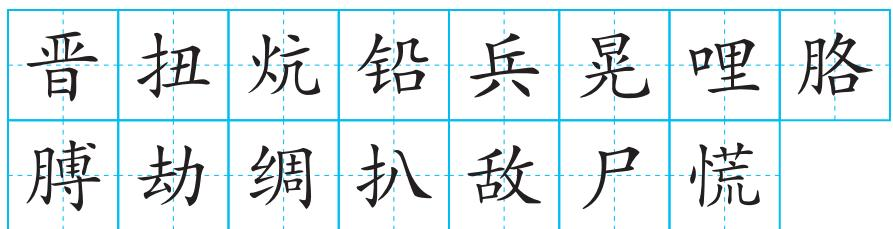

为什么说雨来是小英雄？带着这个问题，尝试用较快的速度默读课文。

给其他五个部分列出小标题，再说说课文的主要内容。

游泳本领高

四

五

三

六

课文中多次写到还乡河的景色，找出来读一读，再说说写这些景色有什么作用。

# ②0我们家的男子汉

尝试用较快的速度默读课文。结合课文中的小标题，说说为什么称这个孩子为“男子汉”，作者对他有着怎样的情感。还可以给每个部分换个小标题。

我们家里有一个男子汉，那是姐姐的孩子。姐姐生下huī他后，就和姐夫到安徽去了，把他留在家中由我们来照看。

## 他对食物的兴趣

mǔ

“他吃饭很爽气。”带他的保姆这么说他。确实，他吃  
饭吃得很好，量很多，范围很广什么都要吃，而且吃  
得极有滋味，叫人看了不由得也会嘴馋起来。当然，和所  
有的孩子一样，他不爱吃青菜。可是我对他说：“不吃青菜  
会死的。”他便吃了，吃得很多。他不愿死，似乎是深感活  
着的乐趣的。他对所有的滋味都有兴趣，为了吃一客小笼  
包子，他可以耐心地等上三刻钟；他会为他喜欢吃的东西mí  
编儿歌一样的谜语。当实在不能再吃了的时候，他便吃自mǔ chún qiào  
己的大拇指，吃得十分专心，以至前边的嘴唇都有些翘了mǐ  
起来。当《少林寺》风靡全国时，他也学会了一套足以乱  
真的醉拳。耍起来，眼神都恍惚了，十分入迷。他向往着shàng hūn  
去少林寺当和尚。可是我们告诉他，当和尚不能吃荤。他bàn  
说：“用肉汤拌饭可以吗？”“不可以。”“那么棒冰可以吃  
吗？”他小心地问，是问“棒冰”，而不是冰激凌，甚至不  
是雪糕。“那山上恐怕是没有棒冰的。”我们感到非常抱歉。

## 他对独立的要求

不知从什么时候起，和他出去，他不愿让人牵他的手jué jiàng  
了。一只胖胖的小手在我的手掌里，像一条倔强的活鱼一  
样挣扎着。有一次，我带他去买东西，他提出要让他自己zuàn guì  
买。我给了他一角钱。他攥着钱，走近了柜台，忽然又胆  
怯起来。我说：“你递上钱，我帮你说好了。”“不要，不  
要，我自己说。”他说。到了zhǔ fù  
柜台前，他又嘱咐我一句：“你  
不要讲话啊！”营业员终于过  
来了，他神情有点儿紧张，勇  
敢地开口了：“同志，买，买，  
买……”他忘了要买什么东西rěn  
了。我终于忍不住了：“买一包zhā liáo  
山楂片。”他好久没说话，潦草jǔ  
地吃着山楂片，神情有些沮丧，

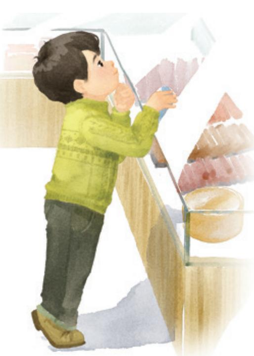

我有点儿后悔起来。后来，他会自个儿拿着五个汽水瓶和一元钱到门口小店换橘子水了。他是一定要自己去的。假如我不放心，跟在他后面，他便停下脚步不走了：“你回去，回去嘛！”我只得由他去了。他买橘子水日益熟练起来，情绪日益高涨，最终变成了一种可怕的狂热。为了能尽快地拿着空瓶再去买，他便努力地喝橘子水。一个炎热的中午，我从外面回来，见他正在门口小店买橘子水。他站在冰箱前面，露出半个脑袋。营业员只顾和几个成年人做生意，看都不看他一眼。他满头大汗地、耐心地等待着。我很想走过去帮他叫一声“同志”，可最后还是忍住了。

## 他面对生活挑战的沉着

当他满两周岁的时候，我们决定把他送进托儿所。去kēng  
的那天早晨，他一声不吭，很镇静地四下打量着。当别的liáo  
孩子哭的时候，他才想起来哭。哭声嘹亮，并无伤感，似yí  
乎只为了参加一个仪式。每天早上，送他去托儿所都很容  
易，不像我们姐妹几个小时候那样，哭着闹着不肯去。问  
他喜欢托儿所吗，他说：“不喜欢。”可是他明白了自己不  
得不去，也就坦然地接受了这个现实，不作任何无效的挣  
扎。据老师说，他吃饭很好，睡觉很好，唱歌游戏都很好，jū xī  
只不过有点儿拘束。然而，他迅速地熟悉起来，开始交朋

# 人民教育出版社

友，打架。每天去接他，都要听老师几句抱怨。

他四岁那年，他的保姆病了，回乡了，他终于要去安徽了。他是极不愿意去的。走的前一天，他对外婆说：“外婆，你不要我了，把我扔出去了。”外婆几乎动摇了，想把他留下。那时候，上海到合肥，每天只有一班火车，人很多。车门被行李和人堵满了，大人们只好先挤上车，把他留在月台上。他着急地喊起来：“我怎么办呢？”我安慰他：“上不去，就不走了。”他仍然很着急，认为自己是非走不可的。姐姐说：“让他从窗口爬进来吧！”我把他抱了起来，他勇dēng敢地抓住窗框，两只脚有力地蹬着车厢，攀上了窗口。窗fáng口边的旅客不约而同地伸手去抱他。他推开那些妨碍他的cuān手，抓住一双最得力的，蹿进了车厢，淹没在拥挤的人群里了。

这就是我们家的男子汉。看着他一点儿一点儿长大，kuò他的脸盘的轮廓，他的手掌上的细纹，他的身体，他的力气，他的智慧，他的性格，还有他的性别，那样神秘地一点儿一点儿鲜明，突出，扩大，再扩大，实在是一件最最奇妙的事情。

huī mí chún shàng bàn jué jiàng zhǔ 徽谜唇尚拌倔强嘱 fù rěn jǔ kēng yí dēng fáng 咐忍沮吭仪蹬妨

## ②1芦花鞋

默读课文，为每个部分列出小标题，再和同学交流印象最深的内容。

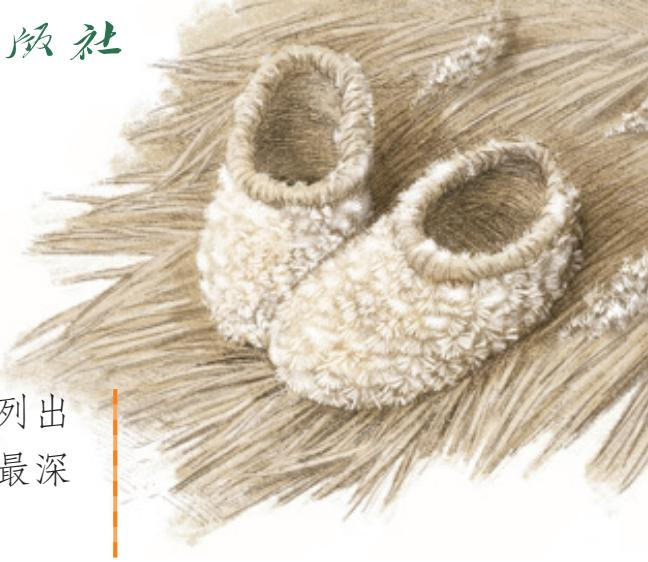

这里出产一种冬天穿的芦花鞋。

那鞋的制作工序是：先将上等的芦花采回来，然后将cuō它们均匀地搓进草绳里，再编织成鞋。那鞋很厚实，像暖和和的鸟窝。

收罢秋庄稼，青铜家就已决定：今年冬闲时，全家人一起动手，编织一百双芦花鞋，然后让青铜背着，到油麻地镇上去卖。

这是家里的一笔收入，一笔很重要的收入。想到这笔收入，全家人都很兴奋，觉得心里亮堂堂的，未来的日子亮堂堂的。

青铜拿着一只大布口袋，钻进芦苇荡的深处，挑那些luō  
毛茸茸的、蓬松松的、闪着银光的芦花，将它们从穗上捋  
下来。头年的不要，只采当年的。那芦花很像鸭绒，看着，kuí  
心里就觉得暖和。妹妹葵花跟着青铜，一起走进芦苇荡。

她仰起头来，不停地寻觅着，见到特别漂亮的一穗，她不采，总是喊：“哥，这儿有一穗！”青铜闻声，就会赶过来。见到葵花手指着的那一穗真是好花，就会笑眯眯的。

当第一双男鞋和第一双女鞋分别从爸爸和妈妈的手中编织出来时，全家人都很开心。两双鞋，在一家人手里传来传去地看个没够。

这两双芦花鞋，实在是太好看了。那柔软的芦花，竟像是长在上面的一般。被风一吹，那花都往一个方向倾覆而去，露出金黄的稻草来。让人想到落在树上的鸟，风吹起时，细软的绒毛被吹开，露出身子来。两双鞋，既像四只鸟窝，又像两对鸟。

青铜一家，老老少少，将所有空闲都用在了芦花鞋的编织上。他们编织了一百零一双鞋。第一百零一双是为青铜编的。青铜也应该有一双新的芦花鞋。

接下来的日子里，青铜天天背着几十双芦花鞋到油麻地镇上去卖。那些芦花鞋实在太招人喜欢了，一双一双地卖了出去，仅仅过了三天，就只剩下十一双了。

天下了一夜大雪，积雪足有一尺厚，早晨门都很难推开。雪还在下。

奶奶对青铜说：“今天就别去镇上卖鞋了。”爸爸妈妈也都对青铜说：“剩下的十一双，一双是给你的，还有十双，卖得了就卖，卖不了就留着自家人穿。”葵花也一个劲地说：“哥，今天就别去卖鞋了。”

但青铜却坚持着今天一定要去镇上。他用手势对奶奶他们说①：“今天天冷，更会有人买鞋的。”

妈妈说：“那你选一双穿上，不然就别去了。”

青铜同意了。他挑了一双适合他的芦花鞋，将脚洗得干干净净，穿上了。然后拿起余下的十双芦花鞋，朝大人们摇摇手，便跑进了风雪里。

到了镇上一看，街上几乎没有人，只有大雪不住地抛落在空寂的街面上。不一会儿，挂在绳子上的十双芦花鞋就落满了雪。

对面屋子里围炉烤火的人招呼青铜：“进屋里来吧，这里能看到你的鞋，丢不了。”青铜摇了摇手，坚持守在芦花鞋旁。

到了中午，雪大了起来，成团成团地往下抛落。望着漫天大雪，青铜在心里不住地说着：“买鞋的，快来吧！买鞋的，快来吧！……”

雪在他的祈求中，渐渐停了。青铜将芦花鞋一双双取下，把落在上面的积雪扑打干净后，重又挂到绳子上。

## 人民教育出版社

这时，街上走来一行路过这里的城里人，马上要过年了，他们要从这里坐轮船回城里去。他们或背着包，或提gē着包，一路说笑着，一路咯吱咯吱地踩着雪走过来。青铜没有招呼他们。因为他认为，城里人是不会买他的芦花鞋的，他们只穿布棉鞋和皮棉鞋。

但他们走过芦花鞋时，却有几个人停住了。其余的见  
这几个人停住了，也都停住了。那十双被雪地映照着的芦  
花鞋，一下吸引住了他们。其中肯定有一两个是搞艺术的，zé  
看着这些鞋，嘴里啧啧啧地感叹不已。他们忘记了它们的  
用途，只是觉得它们好看—不是一般地好看，而是特别

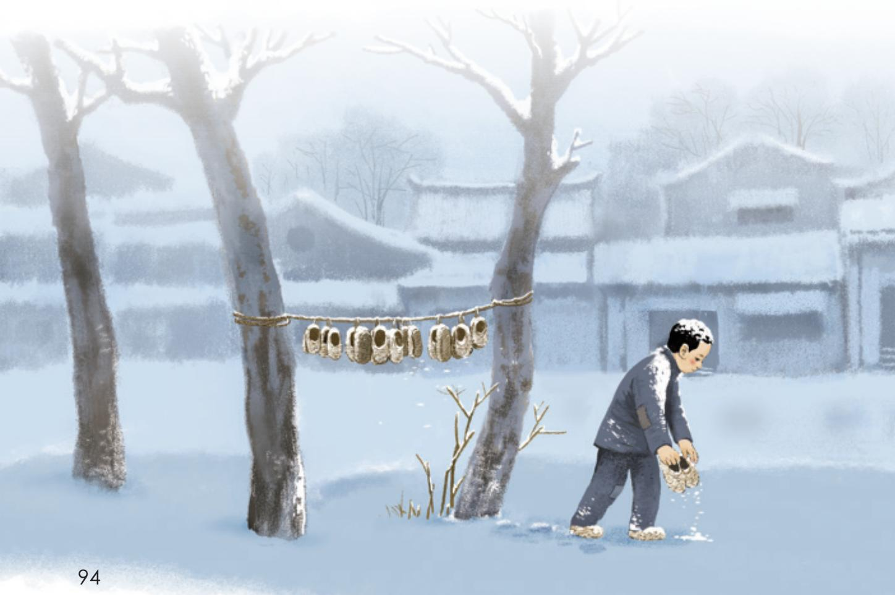

地好看。他们一个个走上前来，用手抚摸着它们——这一抚摸，使他们对这些鞋更加喜欢。还有几个人将它们拿到鼻子底下闻了闻，一股稻草香，在这清新的空气里，格外分明。

一个人说：“买一双回去挂在墙上，倒不错。”好几个人点头，并各自取了一双，唯恐下手晚了，被别人拿了去。

一共九个人，都拿了芦花鞋，其中一个人拿了两双，十双鞋都在他们手中了。接下来就是谈价钱。青铜一直疑惑着，直到人家一个劲地问他多少钱一双，他才相信他们真的要买这些鞋。他没有因为他们的眼神里闪现出来的那份欣喜而涨价，还是报了他本来想卖的价。他们都觉得便宜，二话没说，就付了钱。青铜抓着一大把钱，站在雪地上，一时竟有点儿反应不过来。

天晴了，四周一片明亮。青铜沿着来时的路往回走着。

有一个人朝他追了过来，并在他身后大声喊着：“孩子，你停一停！”青铜停下了，转过身去，疑惑地望着向他跑过来的人。那人跑到青铜跟前，说：“我看到他们买的芦花鞋了，心里好喜欢，你还有卖的吗？”青铜摇了摇头，yí hàn心里很为那人感到遗憾。那人失望地一摊手，并叹息了一声。青铜望着那个人，心里觉得有点儿对不住他。

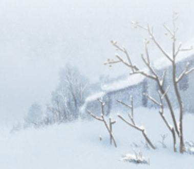

那人掉头朝轮船码头走去。

青铜掉头往家走去。

走着走着，青铜放慢了脚步。他的目光落在了自己脚上的那双芦花鞋上。雪在芦花鞋下咯吱咯吱地响着。他越走越慢，后来停下了。他看看天空，看看雪地，最后又把目光落在了自己脚上的芦花鞋上。

他觉得双脚暖和和的。

但过了一会儿，他将右脚从芦花鞋里拔了出来，站在了雪地上。他的脚板顿时感到了一股针刺般的寒冷。他又将左脚从芦花鞋里拔了出来，站在了雪地上。又是一股刺骨的寒冷。他弯下腰，捡起了那双芦花鞋，放到眼前看着。wū因为一路上都是雪，那双鞋竟然没有一丝污迹，看上去完全是一双新鞋。他笑了笑，掉头朝那个人追了过去。

他的赤脚踏过积雪时，溅起了一蓬蓬雪屑……

槎葵祈遗憾污屑

## 口语交际

# 朋友相处的秘诀

和朋友相处，最重要的是什么？有人认为，是彼此信任；有人认为，是愿意分享，不自私………你的看法是什么呢？

分小组讨论，至少提出三条大家认为最重要的意见。

怎样才能更好地汇总小组意见呢？下面是某小组在讨论“怎样表达对父母的爱”时作的记录，供参考。

先记录每个同学的想法，再把相近的整合在一起，然后標记出大多数同學认同的想法。

√1.帮父母分担一些家务事。（小光）

√2.父母生病了，给他们递上一杯热水。（小光）

√ 3.父母过生日时送上我们的礼物。（小文）（小丽）

√4.提醒父母增减衣服。（小杰）

5.给父母准备一件生日礼物。（小丽）

将小组意见汇总后，派代表在全班汇报。其他组员可以作补充，尽可能全面地反映小组意见。

根据讨论的目的，记录重要信息。

分类整理小组意见，有条理地汇报。

我学会了

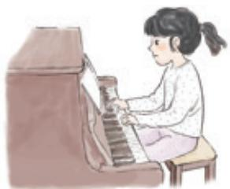

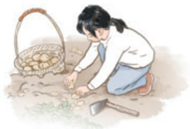

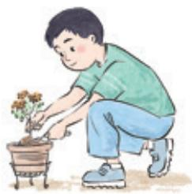

我们正慢慢长大，学会了做很多事情。你学会的哪件事情让你最有成就感？把它填在横线上，再把学做这件事的经历、体会和同学分享。写之前想一想：

你是怎样一步步学会做这件事的？

学习过程中遇到了哪些困难？是怎么克服的？

有哪些有趣的经历？心情有哪些变化？

写完后，读读自己的习作，修改不通顺的地方。和同学互换习作，看看学习的过程是否写清楚了。

# 人民教育出版社

# 语文园地

## 交流平台

我发现本单元的课文很长，而且是分成几个部分写的。《小英雄雨来》用序号标示每个部分，《我们家的男子汉》用小标题，《芦花鞋》用空行的方式。

这样，我们只要把每个部分的主要意思连起来，就能把握课文的主要内容了。今后，遇到类似的文章，我也要运用这样的方法把握主要内容。

我在阅读过程中，有时还会停下来，思考一下前面的内容，想想讲了什么。

有时我忘记了前面的一些内容，就再返回去看一看。

## 词句段运用

下面的成语都与古人读书求学的故事有关，选两三个，讲讲它们的故事和含义。

囊萤夜读 悬梁刺股 凿壁偷光 chǔ 铁杵成针 程门立雪 手不释卷

读下面两组句子，体会加点部分表达的不同感情，再照样子改写后两个句子。

妈妈还是死命追着不放，到底追上了，可是雨来浑身光溜溜qiū  
的像条小泥鳅，怎么也抓不住。

雨来像小鸭子一样抖着头上的水，用手抹一下眼睛和鼻子嘴里吹着气，望着妈妈笑。

◇那双手就像鹰的爪子，扭着雨来的两只耳朵，向两边拉。

她似乎感到德军那几双恶狼般的眼睛都盯在越来越短的蜡烛上。

她跳着轻快的舞蹈。

那个小偷远远地盯着柜台里的珠宝。

## 日积月累

## 独坐敬亭山

[唐]李白

众鸟高飞尽，孤云独去闲。相看两不厌，只有敬亭山。

# 第七单元

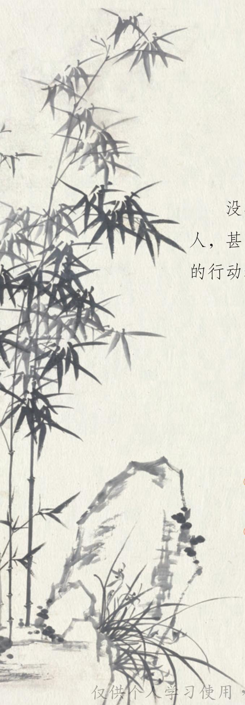

没有伟大的品格，就没有伟大的人，甚至也没有伟大的艺术家，伟大的行动者。

法国]罗曼·罗兰

从人物的语言、动作等描写中感受人物的品质。

学习从多个方面写出人物的特点。

<table><tr><td>fú róng 芙蓉楼①送辛渐</td><td>注释</td></tr><tr><td>[唐]王昌龄</td><td>①〔芙蓉楼〕故址在今江苏 镇江北，下临长江。 ②〔吴〕镇江在古代属于</td></tr><tr><td>寒雨连江夜入吴®，</td><td>吴地。 ③〔平明〕天刚亮。</td></tr><tr><td>平明送客楚山孤。 luò</td><td>④〔楚山〕泛指长江中下游 北岸的山。长江中下游北</td></tr><tr><td>洛阳亲友如相问， 一片冰心在玉壶。</td><td>岸在古代属于楚地范围。 ⑤〔冰心〕像冰一样晶莹、 纯洁的心。</td></tr><tr><td></td><td></td></tr><tr><td>lú lún [唐]卢纶</td><td></td></tr><tr><td>月黑雁飞高， chán dùn 单于夜遁逃。</td><td>注释</td></tr><tr><td></td><td>①〔单于〕匈奴的首领。这</td></tr><tr><td>欲将轻骑逐，</td><td>里泛指侵扰唐朝的游牧</td></tr><tr><td>大雪满弓刀。</td><td>民族首领。</td></tr></table>

## 古诗三首

墨梅

miǎn [元]王冕

yàn   
我家洗砚池头树，   
朵朵花开淡墨痕。   
不要人夸好颜色， qián kūn   
只留清气满乾坤。

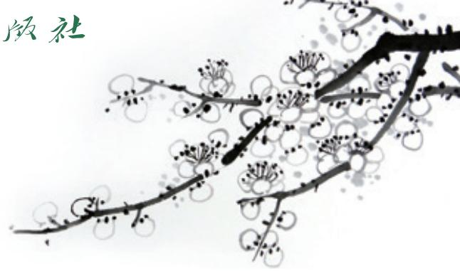

注释

①〔洗砚池〕传说会稽（今浙江绍兴）蕺山下有晋代大书法家王羲之的洗砚池。由于经常洗笔砚，池塘的水都染黑了。

②〔乾坤〕天地间。

# fú róng luò chán yàn qián kūn 芙蓉洛单砚乾坤

# 芙 荧 灾 雁

有感情地朗读课文。背诵课文。默写《芙蓉楼送辛渐》。

说说下面诗句的意思，再想想这些诗句表现了怎样的精神品格。

洛阳亲友如相问，一片冰心在玉壶。

欲将轻骑逐，大雪满弓刀。

不要人夸好颜色，只留清气满乾坤。

# 23 黄继光

1952年10月，上甘岭战役打响了。这是朝鲜战场上最激烈的一次阵地战。

黄继光所在的营已经持续战斗了四天四夜，第五天夜晚接到上级的命令，要在黎明之前夺下被敌人占领的597.9高地。

进攻开始了，大炮在轰鸣。战士们占领了一个又一个山头，就要到达597.9高地的主峰了。突然，敌人一个火力lǚ点凶猛地射击起来。战士们屡次突击，都被比雨点还密的枪弹压了回来。

东方升起了启明星，营参谋长看看表，已经四点多cuī了。如果不很快摧毁这个火力点，在黎明前就攻不下597.9高地的主峰，已经夺得的那些山头就会全部丢失。

黄继光愤怒地注视着敌人的火力点，他转过身来坚定地对营参谋长说：“参谋长，请把这个任务交给我吧！”营参谋长紧握着黄继光的手，说：“好，我相信你一定能完成这个光荣而艰巨的任务。”

黄继光带上两个战士，拿了手雷，喊了一声：“让祖国人民听我们胜利的消息吧！”便向敌人的火力点爬去。

敌人发现他们了。几发照明弹升上天空，黑夜变成了白天。炮弹在他们周围爆炸。他们冒着浓烟，冒着烈火，pú fú xī匍匐前进。一个战士牺牲了，另一个战士也负伤了。摧毁火力点的重任落在了黄继光一个人的肩上。

火力点里的敌人把机枪对准黄继光，子弹像冰雹一样射过来。黄继光肩上腿上都负了伤。他用尽全身的力气，更加顽强地向前爬，还有二十米，十米…近了，更近了。

啊！黄继光突然站起来了！在暴风雨一样的子弹中站起来了！他举起右臂，手雷在探照灯的光亮中闪闪发光。

轰！敌人的火力点塌了半边，黄继光晕倒了。战士们赶紧冲上去，不料才冲到半路，敌人的机枪又叫起来，战士们被压在山坡上。

天快亮了，规定的时间马上到了。营参谋长正在着急，只见黄继光又站起来了！他张开双臂，向喷射着火舌táng的火力点猛扑上去，用自己的胸膛堵住了敌人的枪口。

“冲啊，为黄继光报仇！”喊声惊天动地。战士们像海涛一样向上冲，占领了597.9高地，消灭了阵地上的全部敌人。

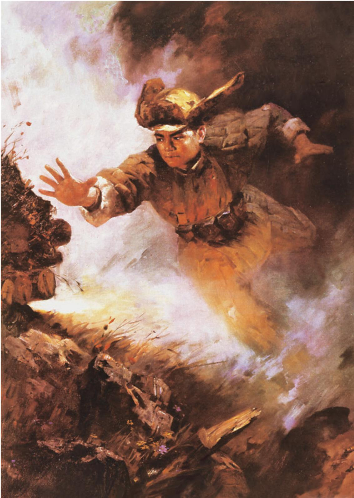  
（图）张洪赞

# yì lǚ cuī báo yūn táng 役屡摧雹晕膛

## 营射弹荣爆炸

有感情地朗读课文。简要复述课文。

找出课文中描写黄继光动作的语句，说说从中体会到他怎样的英雄气概。

下面的句子对表现人物品质起到了怎样的作用？和同学交流。

几发照明弹升上天空，黑夜变成了白天。炮弹在他们周围爆炸。

火力点里的敌人把机枪对准黄继光，子弹像冰雹一样射过来。

## 阅读链接

## 祖国，我终于回来了

钱学森是我国杰出的科学家。他早年留学美国，以优异的成绩获得了博士学位，成为航空工程和空气动力学专家。他在火箭研究方面取得了很大进展，被美国麻省理工学院聘为终身教授。在美国，金钱、地位、名誉，他都有了。

但是，一听到中华人民共和国成立的消息，钱学森便立即决定放弃美国的一切，回国工作，为建设祖国贡献自己的全部力量。

# 人民教育出版社

1950年，钱学森辞去工作，办好了回国手续，买好了回国的飞机票，把行李交给打包公司打包。然而，就在这时，他接到美国移民局的通知：不准离开美国！他被迫退掉飞机票。美国海关把他的行李打开检查，硬说里面藏着重要机密，说钱学森是间谍。其实，他的行李里面装的只是准备带回国的教科书和笔记本。几天后，钱学森突然被捕，被关在一个海岛的拘留所里，受到无休止的折磨。每天晚上，看守人员每隔十分钟就来开一次灯，使他无法休息。半个月时间，他就消瘦了很多。

美国当局对钱学森的迫害，引起了美国科学界的公愤。不少美国朋友出面营救钱学森。他们募捐一万五千美元，把钱学森从拘留所里保释出来。但是，美国联邦调查局并没有停止对他的迫害。他的行动受到限制，信件受到检查，电话受到监听。然而，钱学森没有屈服，他不断提出要求：我要离开美国，回到祖国去。

他坚持斗争了五年。他的斗争得到了世界各国主持正义的人们的支持，更得到了中国政府和中国人民的亲切关怀。周恩来总理对钱学森十分关心，亲自过问他的情况，并指示参加中美两国大使级会晤的中国代表，在会晤中提出关于钱学森博士回国的问题。1955年，美国政府不得不同意钱学森回国。同年9月17日，钱学森登上了回国的轮船。10月8日，他含着幸福的泪花，终于回到了祖国的怀抱。

根据刘敬智的《钱学森—中国人的骄傲》相关内容改写

# nuò24 “诺曼底号”遇难记

1870年3月17日夜晚，哈尔威船长照例走着从南安普dūn mí敦到根西岛这条航线。大海上夜色正浓，烟雾弥漫。船长站在驾驶室里，小心翼翼地驾驶着他的“诺曼底号”。乘客们都进入了梦乡。

“诺曼底号”是一艘大轮船，在英伦海峡也许可以算得上是最漂亮的邮船之一。它装货容量六百吨，船体长二百二十英尺①，宽二十五英尺。海员们都说它很“年轻”，因为它才七岁，是1863年造的。

雾越来越浓了，轮船驶出南安普敦河后，来到茫茫大āi yī mài gū海上，距离埃居伊山脉估计有十五海里。轮船缓缓行驶着。这时大约凌晨四点钟。

周围一片漆黑，船桅的梢尖隐约可辨。

像这类英国船，晚上出航是没有什么可怕的。

突然，沉沉夜雾中冒出一枚黑点，它好似一个幽灵，qiào  
又仿佛一座山峰。只见一个阴森森的往前翘起的船头，突mǎ  
破黑暗，在一片浪花中飞驶过来。那是“玛丽号”，一艘

装有螺旋推进器的大轮船，它从敖德萨起航，船上载着五百吨小麦，行驶速度非常快，负载又特别大。它笔直地朝着“诺曼底号”逼了过来。

眼看就要撞船，已经没有任何办法避开它了。一瞬间，大雾中似乎耸起许许多多船只的幻影，人们还没来得及zàng一一看清，就要死到临头，葬身鱼腹了。

全速前进的“玛丽号”向“诺曼底号”的侧舷撞过去，pōu在它的船身上剖开一个大窟窿。

由于这一猛撞，“玛丽号”自己也受了伤，终于停了下来。

“诺曼底号”上有二十八名船员和一名女服务员，还有三十一名乘客，其中十二名是妇女。

震荡可怕极了。一刹那间，男人、女人、小孩，所有luǒ的人都奔到甲板上，人们半裸着身子，奔跑着，尖叫着，qì xiōng tuān哭泣着，惊恐万状，一片混乱。海水哗哗往里灌，汹涌湍急，势不可当。轮机火炉被海浪呛得嘶嘶地直喘粗气。

船上没有封舱用的防漏隔墙。哈尔威船长站在指挥台tǐng上，大声吼喝：“全体安静，注意听命令！把救生艇放下去。妇女先走，其他乘客跟上，船员断后。必须把六十人救出去！”

实际上一共有六十一人，但是他把自己给忘了。

船员赶紧解开救生艇的绳索。大家一窝蜂拥了上去，

# 人民教育出版社

sǎng

lè

这股你推我搡的势头，险些把小艇都弄翻了。奥克勒福大wéizhì cù  
副和三名工头拼命想维持秩序，但整个人群因为猝然而至  
的变故简直都像疯了似的，乱得不可开交。几秒钟前大家hān mò  
还在酣睡，蓦地，而且，立时立刻，就要丧命，这怎么不pò  
叫人失魂落魄！

就在这时，船长威严的声音压倒了一片呼号和嘈杂，黑暗中人们听到这一段简短有力的对话：

“洛克机械师在哪儿？”

“船长叫我吗？”

“炉子怎么样了？”

“海水淹了。”

“火呢？”

“灭了。”

“机器怎样？”

“停了。”

船长喊了一声：“奥克勒福大副？” K

大副回答：“到！”

船长问道：“还有多少分钟？” 福

“二十分钟。”

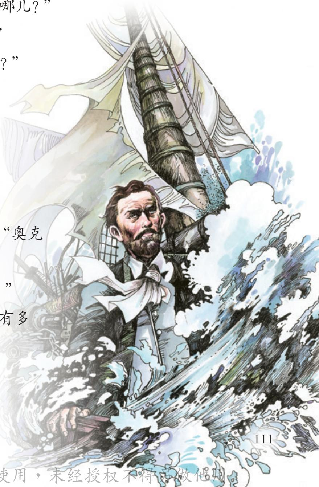

仅供个人学习使用，未经授权不得做g

“够了，”船长说，“让每个人都下到小艇上去。奥克勒福大副，你的手枪在吗？”

“在，船长。”

“哪个男人胆敢抢在女人前面，你就开枪打死他。”

大家立时不出声了。没有一个人违抗他的意志，人们感到有一个伟大的灵魂出现在他们的上空。

zhào huò

“玛丽号”也放下救生艇，赶来搭救由于它肇祸而遇难的人员。

救援工作进行得井然有序，几乎没有发生什么争执或ōu bǐ殴斗。事情总是这样，哪里有可鄙的利己主义，哪里也会有悲壮的舍己救人。

哈尔威巍然屹立在他的船长岗位上，指挥着，主宰着，领导着大家。他把每件事和每个人都考虑到了，面对惊慌失措的众人，他镇定自若，仿佛他不是给人而是给灾难下qiǎn达命令，就连失事的船舶似乎也听从他的调遣。

过了一会儿，他喊道：“把克莱芒救出去！”

克莱芒是见习水手，还不过是个孩子。

轮船在深深的海水中慢慢下沉。

人们尽力加快速度划着小艇，在“诺曼底号”和“玛suō丽号”之间来回穿梭。

“快干！”船长又叫道。

二十分钟到了，轮船沉没了。

船头先下去，须臾，海水把船尾也浸没了。

哈尔威船长一个手势也没有做，一句话也没有说，犹zhù如铁铸，纹丝不动，随着轮船一起沉入了深渊。人们透过阴惨惨的雾气，凝视着这尊黑色的雕像徐徐沉进大海。

哈尔威船长的生命就这样结束了。

在英伦海峡上，没有任何一个海员能与他相提并论。

他一生都要求自己忠于职守，履行做人之道。面对死亡，他又践行了一次英雄的壮举。

mí mài zàng pōu luǒ qì xiōng wéi zhì hān xiè gǎng zǎi qiǎn 弥脉葬剖裸泣汹维秩酣械岗宰遣

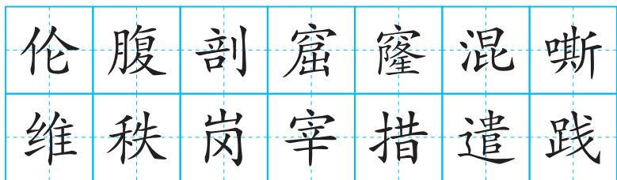

朗读课文，读好人物的对话。

“诺曼底号”遇难时，哈尔威船长是怎么做的？你从中感受到他怎样的品质？

哈尔威船长的英雄壮举，让你对生命有了怎样的体会？

# ②5挑山工

默读课文，说说挑山工是怎样登山的。作者说“这位山民的几句朴素的话，似乎包蕴着意味深长的哲理”，找出这几句话读一读，联系上下文说说其中包含了怎样的哲理。

在泰山上，随处都可以碰到挑山工。他们肩上搭一根diàn光溜溜的扁担，扁担两头的绳子挂着沉甸甸的货物。登山的时候，他们一条胳膊搭在扁担上，另一条胳膊随着步子héng有节奏地一甩一甩，使身体保持平衡。他们走的路线是折尺形的，从台阶左侧起步，斜行向上，登上七八级，到了台阶右侧，就转过身子，反方向斜行，到了左侧再转回来。每转一次身，扁担换一次肩。这样曲折向上登，才能使挂在扁担前头的东西不碰到台阶，还可以省些力气。担了重物，如果照一般登山的人那样直往上走，膝盖会受不住的。但是路线曲折，就会使路程加长。挑山工登山走的路程大约比游人多一倍！

奇怪的是挑山工花的时间并不比游人多。你轻快地从他们身边走过，以为把他们远远地甩在后边了。你在什么地方饱览壮丽的山色，或者在道边诵读凿在石壁上的古人的题句，或者在喧闹的溪流边洗脸洗脚，他们已经不声不响地从你身旁走过，悄悄地走到前头去了。等你发现，你会大吃一惊，以为他们像仙人那样，是腾云驾雾赶上来的。

有一次，我同几个画友去泰山写生，就遇到过这种情zhàng ǎi况。我们在山下买登山用的青竹杖，遇到一个挑山工，矮chǎng个子，脸黑生生的，眉毛很浓，四十来岁，敞开的白土布guà shuān褂子中间露出鲜红的背心。他扁担一头拴着几张木凳子，另一头捆着五六个青皮西瓜。我们很快就超过了他。到了回马岭那条陡直的山道前，我们累了，舒展身子躺在一块xiē被山风吹得干干净净的大石头上歇歇脚。我们发现那个挑山工就坐在对面的草地上抽烟。随后，我们跟他差不多同时起程，很快就把他甩在后边，直到看不见他了。等到爬上半山的五松亭，我们看见有个人在那株姿态奇特的古松下整理挑子，那正是他。他把褂子脱掉了，光穿着红背心，yǒu现出健美的黑黝黝的肌肉。我很惊异，走过去跟他攀谈起jū来。这位山民倒不拘束，挺爱说话。他告诉我，他家住在山脚下，他天天挑货上山，干了近二十年了，一年四季，一天一个来回。

我把心中那个不解之谜说了出来：“我看你们走得很慢，怎么反而常常跑到我们前头去了呢？你们有什么近道吗？”

他听了，黑生生的脸上显出一丝得意的神色。他说：“我们哪里有近道，还不是和你们走的同一条道？你们肩膀上没有挑子，是走得快，可是一路上东看西看，玩玩闹闹，总得停下来嘛！我们跟你们不一样，不像你们那么随便，dān高兴怎么就怎么。一步踩不实不行，更不能耽误工夫。我们得一个劲往前走。别看我们慢，走长了就跑到你们前边去了。”

我心悦诚服地点着头，感到这位山民的几句朴素的yùn话，似乎包蕴着意味深长的哲理。没等我细细体味，他担起挑子又起程了。

从泰山回来，我画了一幅画—在陡直的似乎没有尽头的山道上，一个穿红背心的挑山工给肩头的重物压弯了腰，他一步一步地向上攀登。这幅画一直挂在我的书桌前，因为我需要它。

## tài zhàng chǎng jū yùn 泰杖敞拘蕴

## 口语交际

## 自我介绍

和别人初次见面，转学到新学校，应聘校报记者…我们常常需要向别人作自我介绍。面对不同的情况，自我介绍也应该有所不同。

选择或创设一个情境，试着作自我介绍。介绍前，想一想是要向谁介绍自己，介绍自己的目的是什么，介绍时需要注意些什么。

◇ 刚刚转学到另一所学校，老师让你向全班同学作自我介绍。

应聘校报记者，负责人让你介绍一下自己。

报名参加电视台《我是小歌手》节目，导演请你作自我介绍。

去家门口的车站接一位不认识的客人，你需要先在电话里介绍自己，接站时让他能够认出你。

介绍完后，和同学交流，听听他们的意见，看看有什么需要改进的地方。

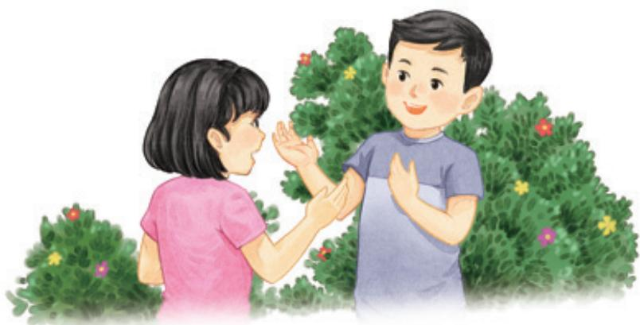

对象和目的不同，介绍的内容有所不同。

## 我的“自画像”

假如你们班来了一位新班主任，他想尽快熟悉班里的同学。请以“我的‘自画像’”为题，向班主任介绍自己，让他更好地了解你。

写之前想一想：

你的外貌有什么特点？

你的主要性格特点是什么？

你最大的爱好和特长是什么？

你还想介绍自己的哪些情况？可以用什么事例来说明？

选择自己最想介绍的几方面内容写下来。写完后，读给家人听，请他们说说哪些地方写得像，哪些地方不像，再根据他们的建议改一改。

# 语文园地

## 交流平台

他张开双臂，向喷射着火舌的火力点猛扑上去，用自己的胸膛堵住了敌人的枪口。

我发现从人物的动作可以感受到人物的品质。

哈尔威船长站在指挥台上，大声吼喝：“全体安静，注意听命令！把救生艇放下去。妇女先走，其他乘客跟上，船员断后。必须把六十人救出去！”

从语言描写可以看出人物的一些特点。

## 识字加油站

可以用这些词语表现人的品质、心情……

ǎi kāng kǎi xián qī   
和蔼 慷慨 贤惠 悲戚 jù bīn zào fén   
临危不惧 彬彬有礼 焦躁不安心急如焚

ǎi kāng kǎi xián qī jù bīn zào fén 蔼慷慨贤戚惧彬躁焚

## 词句段运用

用学过的修改符号，修改下面这段话。

我特别喜欢游泳，每天都坚持练习。工夫不负有心人，今年“六一”儿童节前，学校组织了一次游泳竟赛，同学们都忍不住情不自禁地为我鼓掌，我获得了一等奖。老师告诉我们，好成绩的取得，跟是否勤学苦练有很大的关系。

仿照下面的句子，选一种情况写一组连续的动作。

他勇敢地抓住窗框，两只脚有力地蹬着车厢，攀上了窗口。

口 罗盛教听到孩子们的哭喊声，知道有孩子落水了，就急忙向河边跑过去。他一边飞奔，一边脱棉衣。冰窟窿里泛着水花，罗盛教猛地跳了下去。他在水里摸了好一阵，也没摸到。他钻出水面吸了口气，立刻又钻了下去。

蝴蝶飞舞 小男孩打羽毛球 妈妈下班回到家

## 日积月累

天行健，君子以自强不息。 ——《周易》

胜人者有力，自胜者强。 —《老子》

不怨天，不尤人。 ——《论语》

生于忧患而死于安乐。

—《孟子》

# 第八单元

奇妙的童话，点燃缤纷的焰火，照亮我们五彩的梦。

  
感受童话的奇妙，体会人物真善美的形象。  
按自己的想法新编故事。

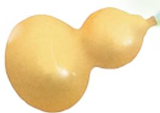

# 26 宝葫芦的秘密（节选）

我来给你们讲个故事。可是我先得介绍介绍我自己：我bǎo姓王，叫王葆。我要讲的，正是我自己的一件事情，是我和宝葫芦的故事。

你们也许要问：“什么？宝葫芦？就是传说故事里的那种宝葫芦吗？”

不错，正是那种宝葫芦。

可是我要声明，我并不是什么神仙，也不是什么妖怪。我和你们一样，是一个平平常常的普通人。你们瞧，我是一个少先队员，我也和你们一样，很爱听故事。

至于宝葫芦的故事，那我从小就知道了。那是我奶奶讲给我听的。奶奶每逢要求我干什么，就得给我讲个故事。这jǔ是我们的规矩。

“乖小葆，来，奶奶给你洗个脚。”奶奶总是一面我，一面招手。

“我不干，我怕烫。”我总是一面溜开，一面摆手。

“不烫啊。冷了好一会儿了。”

“那，我怕冷。”

奶奶撵上了我，说洗脚水刚好不烫也不冷，非洗不可。

我只好让步。不过我有一个条件：“你爱洗就让你洗。你可得讲个故事。”就这么着，奶奶讲了个宝葫芦的故事。

“好小葆，别动！”奶奶刚给我洗了脚，忽然又提出一个新的要求来，“让我给你剪一剪………”

什么！剪脚指甲啊？那不行！我光着脚丫，一下地就zhuài跑。可是胳膊给奶奶拽住了。没有办法。

不过我得提出我的条件：“那，非得讲故事。”于是奶奶又讲了一个—又是宝葫芦的故事。

我就这么着，从很小的时候起，听奶奶讲故事，一直听到我十来岁。奶奶每次讲的都不一样。上次讲的是张三劈面撞见了一位神仙，得了一个宝葫芦。下次讲的是李四出去远足旅行，一游游到了龙宫，得到了一个宝葫芦。王五呢，他因为是一个好孩子，肯让奶奶给他换衣服，所以得到了一个宝葫芦。至于赵六得的一个宝葫芦——那是掘地掘出来的。

不管张三也好，李四也好，一得到了这个宝葫芦，可就幸福极了，要什么有什么。张三想：“我要吃水蜜桃。”立刻就有一盘水蜜桃。李四希望有一条大花狗，马上就冒出了那chòng么一条—冲着他摇尾巴，舔他的手。

后来呢？后来不用说，他们全都过上了好日子。

我听了这些故事，常常就联系到自己：“我要是有了一个宝葫芦，我该怎么办？我该要些什么？”

一直到我长大了，有时候还想起它来。我有几次对着一道算术题发愣，不知道要怎么列式子，就由“8”字想到了宝葫芦——假如我有这么一个，那可就省心了。

shòu

我和同学们比赛种向日葵，我家里的那几棵长得又瘦又长，上面顶着一个小脑袋，可怜巴巴的样儿，比谁的也比不上。我就又想到了那个宝贝：“那，我得要一棵最好最好的向日葵，长得不能再棒的向日葵。”可那只不过是幻想罢了。

可我总还是要想到它。那一天我和科学小组的同学闹翻了，我又想到了它。“要是我有那么一个葫芦，那………”

yāo jǔ guāi niǎn yā zhuài chòng shòu 妖矩乖撵丫拽冲瘦

介绍妖矩乖烫丫

拽福舔葵瘦棒罢

默读课文，说一说王葆为什么想得到一个宝葫芦。

奶奶给王葆讲了哪些故事？选一个，根据已有内容创编故事，讲给同学听。

## 选做

当王葆真的得到了一个宝葫芦时，他逐渐认识到靠宝葫芦不劳而获，带给他的不是幸福，而是烦恼。这是怎么回事呢？感兴趣的同学可以读读《宝葫芦的秘密》这本书。

# ②7 巨人的花园

每天下午，孩子们放学后，总喜欢到巨人的花园里去玩。

这是一个很可爱的大花园。园里长满了柔嫩的青草，草丛中到处露出星星似的美丽花朵。还有十二棵桃树，春天开shuò出淡红色和珍珠色的鲜花，秋天结出丰硕的果子。小鸟们在树上唱着悦耳的歌，歌声是那么动听，孩子们都停止了游戏来听他们唱歌。“我们在这儿多么快乐！”孩子们欢叫着。

有一天，巨人回来了。之前，他离家去看朋友，在那里一住就是七年。现在他回到家，看见孩子们正在花园里玩。

“你们在这儿做什么？”他叱责道。孩子们吓得跑开了。

“我自己的花园就是我自己的花园，”巨人自言自语道，yǔn“这是随便什么人都懂得的。除了我自己以外，我不允许任何qì人在里面玩。”于是他在花园的四周砌了一道高墙，挂出一块布告牌：

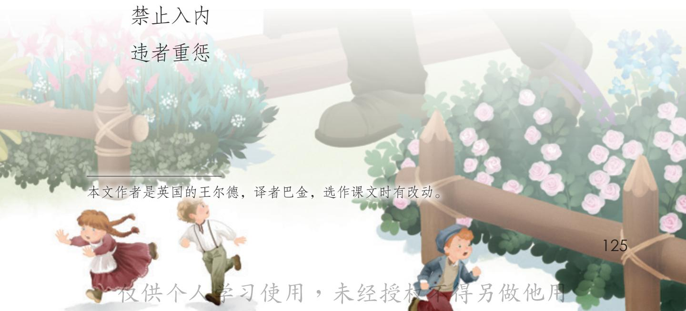

那些可怜的孩子们现在没有地方玩了，只能在高墙外面转来转去，谈论着墙内美丽的花园。“我们从前在那儿是多么快乐啊！”他们都这样说。

春天来了，乡下到处开着小花，到处有小鸟歌唱。单单在巨人的花园里，仍旧是冬天的景象。小鸟不肯在他的花园里唱歌，因为那里没有孩子们的踪迹；桃树也忘了开花；偶尔有一朵美丽的花从草丛中伸出头来，可是一看见那块布告牌，就马上缩回到地里睡觉去了。高兴的只有雪和霜两位。他们嚷道：“春天把这个花园忘记了，我们一年到头都可以住fù在这儿啦！”雪用他的白色大衣覆盖着青草，霜把所有的树枝涂成了银色。他们还请来北风同住。北风身上裹着皮衣，xiào整天在花园里呼啸着。他说：“这是个好地方，我们一定要请雹来玩一玩。”于是雹也来了。他每天总要在屋顶上闹三个钟头，然后又在花园里绕着圈子用力跑。

“我不懂为什么春天来得这样迟，”巨人坐在窗前，望着窗外那凄凉的花园，“我盼望天气快点儿变好。”

可是春天始终没有来，夏天也没有来。秋天给每个花园带来了金色果实，但巨人的花园却什么也没有。

一天早晨，巨人还在睡觉，忽然听见了动人的音乐。他以为是国王的乐队从门外走过，其实是一只小小的梅花雀在窗外唱歌。他很久没有听见小鸟在花园里唱歌了，觉得这是全世界最动听的音乐。这时，雹停止了疯闹，北风也不再吼

lǚ叫，一缕阳光从窗外射进来。“春天到底来了。”巨人说。他跳下床往外看。

他看见一幅奇特的景象。孩子们从墙上一个小洞爬进花园里来了，他们都坐在桃树上面。桃树看见孩子们回来十分高兴，纷纷用花朵把自己装饰起来，还在孩子们头上轻轻地舞动胳膊。小鸟们快乐地飞舞歌唱。花儿们也从绿草丛中伸出头来。这的确是很可爱的景象。只有一个角落还是冬天。这是花园里最远的角落，一个小男孩正站在那里。他太小了，手还挨不到树枝，只好在树旁转来转去，哭得很厉害。这棵可怜的树仍然满身盖着雪和霜，北风还在树顶上吼叫。“快爬上来，孩子！”桃树一面对小男孩说，一面尽可能地把树枝垂下去，然而孩子还是太小了。

巨人看见这个情景，心也软了。他对自己说：“我多么自私啊！现在我明白为什么春天不肯到这儿来了。”他十分后悔自己先前的举动。

他轻轻地走下楼，静悄悄地打开前门，走进花园里。孩  
子们看见他，非常害怕，立刻逃走了，花园里又出现了冬天  
的景象。只有那个小男孩没有跑开，因为他的眼里充满了泪  
水，看不见巨人走过来。巨人悄悄地走到他后面，轻轻抱起  
他，放到树枝上。这棵树马上开花了，小鸟们也飞来歌唱。lǒu jiá  
小男孩伸手搂住巨人，亲吻着他的脸颊。别的孩子看见巨人  
不再像先前那样凶狠了，也都跑了回来。春天也跟着一起回

来了。巨人对他们说：“孩子们，花园现在是你们的了。”他拿出一把大斧子，拆除了围墙。

从那以后，巨人的花园又成了孩子们的乐园。孩子们站在巨人的脚下，爬上巨人的肩膀，尽情地玩耍。

许多年过去，巨人老了。他不能再跟孩子们一块儿玩了，只能坐在椅子上看孩子们玩各种游戏，同时也欣赏着他自己的花园。他说：“我有许多美丽的花，可孩子们却是最美丽的花。”

shuò yǔn qì fù xiào lǚ lǒu jiá 硕允砌覆啸缕搂颊

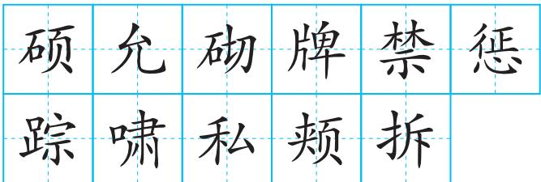

朗读课文，边读边想象画面。

说说巨人的花园发生了哪些变化，巨人又有什么转变。

## 小练笔

发挥想象，把孩子们在巨人的花园里尽情玩耍的情景写下来。

# ②8海的女儿

这篇课文是著名童话《海的女儿》的开头部分。用较快的速度读一读，说说你觉得奇妙的地方，再和同学交流那位最小的公主给你留下的印象。感兴趣的同学可以完整地读读这篇童话，说说你对最小的公主有了哪些新的了解。

在海的远处，水是那么蓝，像最美丽的矢车菊花瓣；又是那么清，像最明亮的玻璃。同时它又是那么深，深得任何铁锚都达不到底。要想从海底一直达到水面，必须把许多许多教堂的尖塔一个一个地叠起来才成。海底的人就住在这下面。

不过，千万不要以为那儿只是一片铺满了白沙的海底。不是的，那儿生长着最奇异的树木和其他植物。它们的枝干和叶子是那么柔软，只要水轻微地流动一下，它们就摇动起来，好像活的一样。鱼儿们在这些枝叶中间游来游去，diàn像是天空中的飞鸟。海里最深的地方有一座海王的宫殿。shān hú它的墙是用珊瑚砌成的，尖顶的高窗子是用最亮的琥珀做成bàng的，屋顶上铺着黑色的蚌壳，它们随着水的流动可以自动开合。这简直太好看了，因为每一个蚌壳里面都含有亮晶huáng晶的珍珠。随便哪一颗珍珠都可以成为王后皇冠上最耀眼的装饰品。

## 人民教育出版社

住在海底的海王已经独自生活了好多年，他的老母亲为他管理着家务。她是一个聪明的女人，可是对于自己高贵的出身总感到不可一世，因此她的尾巴上老是戴着一打牡蛎—其余的显贵只能每人戴上半打。除此以外，她是值得大加称赞的，特别是因为她非常爱那些小小的海公主——她的孙女们。她们是六个美丽的女孩，而她们之中那位最年幼的要算是最美丽的了。她的皮肤光滑柔嫩，像玫瑰的花瓣；她的眼睛是蔚蓝色的，像最深的湖水。不过跟其他公主一样，她没有腿，她的下身是一条鱼尾。

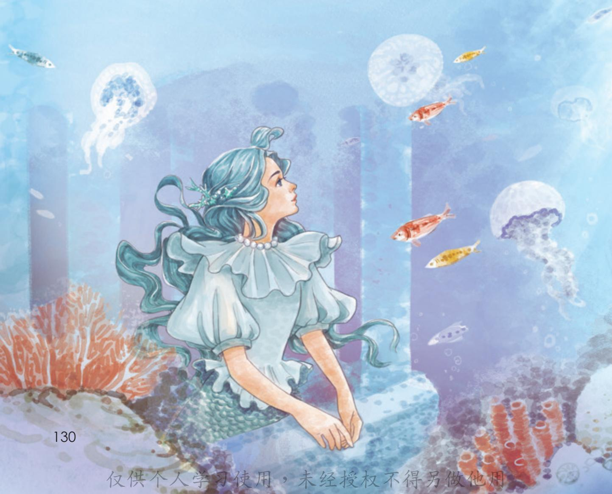

她们可以把漫长的日子消磨在王宫里，在墙上长着鲜花的大厅里。那些琥珀镶的大窗子是开着的，鱼儿向她们游去，正如我们打开窗子的时候，燕子会飞进来一样。不过鱼儿会一直游向这些公主，在她们手里找东fǔ西吃，让她们抚摸自己。

宫殿外面有一座很大的花园，里边生长着许多火红和深蓝色的树木。树上的果子亮得像黄金，花朵开得像燃烧着的火，枝干和叶子在不停地摇动。地上全是最细的沙子liú蓝得像硫黄发出的光焰。在那儿，处处都闪烁着一种奇异的蓝色光彩。你很容易以为自己是在高高的空中而不是在海底，你的头上和脚下全是一片蓝天。当海非常沉静的时piē è候，你可以瞥见太阳：它像一朵紫色的花，从它的花萼里射出各种颜色的光。

在花园里，每一位公主都有自己的一小块地方，在那jīng  
里她们可以随意栽种。有的把自己的花坛布置得像一条鲸  
鱼，有的觉得最好把自己的花坛布置得像一个小人鱼。可

## 人民教育出版社

是最年幼的那位却把自己的花坛布置得圆圆的，像一轮太阳，同时她也只种像太阳一样红的花。她是一个古怪的孩子，不大爱讲话，总是静静地在想着什么。当姐姐们从沉船中弄来新奇的东西装点花园的时候，她除了火红的花以外，只想要一个美丽的大理石像。这石像是一个美丽的男子，它是用一块洁白的石头雕刻出来的，跟一条遭难的船一同沉到海底。在石像旁边，她种了一株像玫瑰花那样红的垂柳。这树长得非常茂盛，它新鲜的枝叶垂向石像，一直垂到那蓝色的沙底。它的倒影带有一种紫蓝的色调。像它的枝条一样，这影子也从不静止：树根和树顶看起来好nì  
像在做着亲昵的游戏。

她最大的乐趣是听关于我们人类世界的故事。她的老祖母不得不把自己所知道的关于船只和城市、人类和动物的知识全都讲给她听。特别使她感到美好的事情是：地上的花能散发出香气，而海底的花却不能；地上的森林是绿色的，而且在树枝间游来游去的鱼儿会唱得那么清脆和好听。老祖母所说的“鱼儿”其实就是小鸟，但是假如她不这样讲的话，小公主就听不懂她的故事了，因为小公主还从来没有看到过一只小鸟。

“等你满了十五岁，”老祖母说，“我就准许你浮到水面上去。那时你可以坐在月光底下的石头上面，看巨大的船只从你身边驶过。你也可以看到树林和城市。”

## 人民教育出版社

在一年之内，她最大的姐姐就要满十五岁了。可是其余的呢——她们一个比一个小一岁。因此，小公主还要足足地等五个年头才能从海底浮上来，来看看我们的世界。不过，每一位公主都答应大家说，她要把自己第一天看到和发现的东西讲给大家听，因为她们的老祖母所讲的确实不太够—她们希望了解的东西真不知有多少！

她们谁也没有那位最年幼的妹妹渴望得厉害，而她恰恰要等最久，同时她是那么地沉默和富于深思。不知道有多少个夜晚，她站在开着的窗子旁边，透过深蓝色的水朝上面凝望，凝望着鱼儿摆动它们的尾巴和翅。她还看到月亮和星星—当然，它们射出的光显得比较弱，但是透过海水，它们看起来要比我们人眼看到的大得多。假如有一块类似黑云的东西在它们下面浮过去的话，她便知道，这如果不是一条鲸鱼从她上面游过，就是一条装载着许多旅客的船在航行。可是那些旅客们怎么也想不到，他们下面有一位美丽的小人鱼，正朝着他们的船伸出一双洁白的小手。

现在，那位最大的公主已经到了十五岁，可以浮到水面上去了。

## shǐ diàn fǔ jīng qià 矢殿抚鲸恰

## 故事新编

你一定知道《龟兔赛跑》的故事吧？如果让你重新编一个龟兔赛跑的故事，你会怎么编呢？

先设想一下故事的结局：

◇乌龟和兔子都赢了。

乌龟和兔子都没能赢。

◇兔子赢了。

◇乌龟又赢了。

假如我们选“乌龟又赢了”这个结局，可以想象新的故事情节，如：

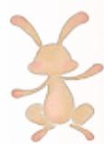

◇ 河流挡道 撞上树桩 掉进陷阱（路遇不测）

◇ 跑反方向 这回比谁跑得慢（急中出错）

◇路过一片萝卜地，看到了水灵灵的萝卜（遇到诱惑）

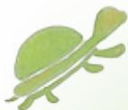

新增了一段下坡路，乌龟头一缩迅速滚下（赛道变化）

◇借助滑板 利用宝葫芦（借助工具）

新编故事是不是特别有趣？我们也来写一写吧！可以新编《龟兔赛跑》，也可以另选一个熟悉的故事，如《狐假虎威》《坐井观天》《狐狸和乌鸦》，创编新故事。

编完后，可以配上插图，把习作贴在教室的墙报上，大家一起分享这些有趣的故事。

# 人民教育出版社

# 语文园地

## 交流平台

读童话时，我们不仅能感受到童话充满着奇妙的想象，里面的人物大都拥有非凡的能力，还能感受到人物真善美的形象。

如《巨人的花园》中，“巨人悄悄地走到他后面，轻轻抱起他，放到树枝上。这棵树马上开花了，小鸟们也飞来歌唱”。从这两句话，我们可以体会到故事的神奇，也可以感受到原本凶狠的巨人变成了一个和善的人。再如，读《海的女儿》，我们既会向往童话中奇幻的海底世界，又会对那位渴望看一看人类世界的小公主产生深刻印象。

除了本单元学习的几篇童话，其他童话也都充满了奇思妙想，并有着丰富多样的人物形象。阅读时，要注意体会。

## 词句段运用

读下面的句子，说说加点的词语有什么不同。

◇这时候，小小的天窗是你唯一的慰藉。

◇ 每当我伤心难过时，总会得到好朋友小傑的安慰。

这个字怎么写？我忘记了。

chán

任岁月潺潺流淌，不能忘怀的，始终是老师深情的目光。

想想下面的句子是怎样描写冬天的，再照样子写一写其他季节。

雪用他的白色大衣覆盖着青草，霜把所有的树枝涂成了银色。他们还请来北风同住。北风身上裹着皮衣，整天在花园里呼啸着。

冬天，黑熊躲进自己的洞里冬眠。紫貂捕捉野兔当美餐。松鼠靠秋天收藏在树洞里的松子过日子。

北风呼啸，隆冬来临，刺骨的寒风吹起雪花。不一会儿，地上、树上、屋顶上就积满了厚厚软软的白雪。

## 书写提示

做几个有趣的书签，在书签上写一句你喜欢的格言。

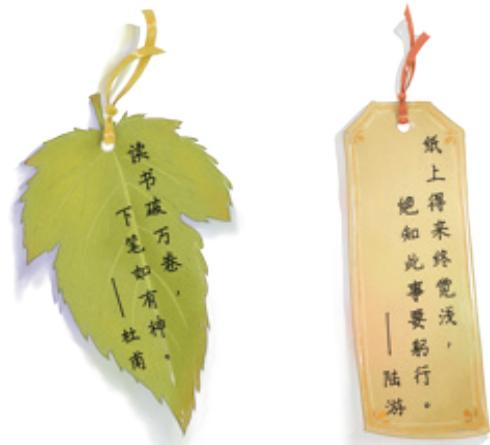

竖写时，要自右向左书写。

字距要均匀。

上下字要对齐。

注意作者名字的位置，使格式更美观。

## 日积月累

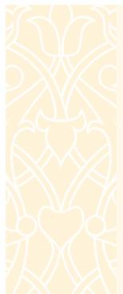

少年不知勤学苦，老来方知读书迟。

◎一日读書一日功，一日不读十日空。

学习不怕根底浅，只要迈步总不迟。

书山有路勤为径，学海无涯苦作舟。

## 识字表

杂篱徐蔬锄 lí 1

gòu guān xù pǔ sù shuài tǎng fù dǎo huì xié 2构冠序朴素率倘附捣绘谐

wèi jiè bǔ

3 慰藉卜

4 纤和谈

5琥珀嗡脂拭渗俯扎番埋澎湃

dùn miáo suì yǎn dūn lú péng jié pì zhǎn 6钝描隧衍吨颅膨捷辟崭

pīng pāng yōng jūn chòu shū tàn ái zhèng lù jí zào 7乒乓拥菌臭蔬碳癌症率疾灶

péng lǎn qū jiàn zhuó dǎng shī xiè wǎn bēi 8鹏揽驱践着党施懈宛碑

bīn jí xián zhào tíng yǔ zhǒng jiē zhǐ luó zhèng 语文园地 宾吉咸兆廷予肿阶趾逻政 浏

9漫涛

jǐ chā 10 挤 叉

<table><tr><td></td><td>11绣潇绽朦胧晖徜徉</td><td></td><td></td><td>xiù xiāo zhàn méng lóng huī cháng yáng</td><td>xuàn gòu qiè pù chì xié shè yùn</td><td>屈渊孟甫韩愈禹锡仲龚</td><td></td><td rowspan="11"></td></tr><tr><td>语文园地</td><td></td><td></td><td></td><td></td><td></td><td>12炫垢怯曝赤携涉晕</td><td>qū yuān mèng fǔ hán yù yǔ xī zhòng gōng</td></tr><tr><td></td><td></td><td></td><td></td><td></td><td></td><td>yōu là zhí bǐng cèng gǎo qiāng yāng shé 13忧虑职屏蹭稿腔殃折</td><td></td></tr><tr><td></td><td></td><td></td><td></td><td></td><td></td><td>gē da wǔ wù dú lóng zhuó fú hēng tí qī 14疙瘩侮恶毒聋啄伏哼啼凄</td><td></td></tr><tr><td></td><td>sì 伺</td><td></td><td></td><td></td><td></td><td>gān gǎn qiào qiào bǔ pǔ lún lūn huàn huàn jùn</td><td>肝秆俏峭哺浦沦抡涣焕俊</td></tr><tr><td></td><td>语文园地 峻</td><td></td><td></td><td></td><td></td><td></td><td></td></tr><tr><td></td><td></td><td>kuò hè chà xiāng 16扩荷刹镶</td><td></td><td></td><td>zhe  t g wn yán</td><td></td><td></td></tr><tr><td>17浙簇臀漆蜿蜒</td><td></td><td></td><td>gōng qín yān zú</td><td></td><td></td><td></td><td>jìn xù niǔ lǎo bā sāi wū wā kāng shuān kǔn bǎng jié</td></tr><tr><td></td><td>18恭勤焉卒</td><td></td><td></td><td></td><td></td><td></td><td>晋絮扭姥吧塞呜哇糠栓捆绑劫</td></tr><tr><td>19</td><td></td><td>bì bā shī</td><td></td><td></td><td></td><td></td><td></td></tr><tr><td></td><td></td><td>毙扒尸</td><td></td><td></td><td></td><td></td><td></td></tr></table>

dēng fáng

蹬妨

cuō kuí qí yí hàn wū xiè

21 搓葵祈遗憾污屑

fú róng luò chán yàn qián kūn

22芙蓉洛单砚乾坤

yì lǚ cuī báo yūn táng

23役屡摧雹晕膛

24 qi遗n

25泰杖敞拘蕴

语文园地 蔼慷慨贤戚惧彬躁焚

26妖矩乖撵丫拽冲瘦

shuò yǔn qì fù xiào lǚ lǒu jiá

27硕允砌覆啸缕搂颊

28 矢殿抚鲸恰

（共250个生字）

## 写字表

1 杂稀蜻蜓蝶宿徐疏茅檐翁笼赖剥

2 构饰蹲凤序投例率耸踏倘绘谐寄眠

3 慰藉卜锐滩帐烁蝙蝠霸鹰

5 怒吼脂拭餐划晌辣渗挣番埋刷测详

6 笨钝鸽毫凌末描隧态吨颅膨肢翼辟

7 纳拥箱臭蔬碳钢隐健康胞疾防灶需

9 繁漫灭藤萝膝涛躲

10 瓶挤叉挥

11 桦涂茸绣潇穗胜胧寂霞抹

13 忧虑贪职屏蹭稿腔解闷蛇遭殃盆勃

14 讨厌坝忠毒绩孵警戒歪咕汤掘伏啼

15 调促颇剧苟譬侍馆附脾敏捷昂供添

16 扩范努刹烂替镶紫仅

17 浙罗杜鹃窄郁肩臀移额陆乳笋端源

18 囊萤恭勤博贫逢   
19 晋扭炕铅兵晃哩胳膊劫绸扒敌尸慌   
22 芙蓉洛壶雁   
23 营射弹荣爆炸   
24 伦腹剖窟窿混嘶维秩岗宰措遣践   
26 介绍妖矩乖拟烫丫拽福舔葵瘦棒罢   
27 硕允砌牌禁惩踪啸私颊拆

（共250个字）

## 词语表

2 屋檐 构成 装饰 顺序 华丽 独特 照例

率领 踏步 倘若 和谐 催眠曲 甜蜜 梦乡

3 慰藉 扫荡威力 锐利 河滩 帐子 闪烁

奇幻 蝙蝠 霸气 猫头鹰 复杂

5 怒吼松脂拂拭灰尘 美餐晌午 热辣辣

淹没挣扎成千上万 冲刷断绝推测详细

6 恐龙 笨重 迟钝 鸽子 凌空 根据 末期

描绘隧道地球形态膨大 前肢具备

开辟脫离

7 纳米 无能为力 拥有 冰箱 功能 蔬菜 材料

钢铁隐形健康细胞疾病预防病灶

需要 深刻

9 繁星藤萝 波涛

10 墨绿 嫩绿 集中 交叉 教练 指挥 整齐

<table><tr><td>节拍</td></tr><tr><td>11 白桦 毛茸茸 潇洒 朦胧 寂静 朝霞</td></tr><tr><td>13 呼唤 响动 尽职 屏息 稿纸 梅花 解闷 勇猛满月淘气</td></tr><tr><td>14 讨厌理由心事反抗忠厚毒手成绩</td></tr><tr><td>警戒 预备 汤圆</td></tr><tr><td>15 即将 姿态 高傲 音调 局促 京剧 一丝不苟 譬如侍候饭馆附近脾气敏捷空空如也</td></tr><tr><td>昂首供养</td></tr><tr><td>16 清静扩大范围努力刹那夺目分辨</td></tr><tr><td>灿烂不仅</td></tr><tr><td>17 杜鹃气势聚集拥挤 心情脚跟移动</td></tr><tr><td>昏暗挤压额角登陆宽广石钟乳石笋 观赏</td></tr><tr><td></td></tr><tr><td>19 芦花发愣铅笔摇晃 胳膊劫难鬼脸</td></tr><tr><td>戒指绸子敌人尸首防备慌忙</td></tr><tr><td>23 战场 持续命令 占领射击 突击 枪弹</td></tr></table>

愤怒注视光荣艰巨消息炮弹爆炸

烈火子弹不料规定惊天动地消灭

24 行驶凌晨窟窿混乱维持秩序岗位

主宰调遣践行

26 介绍 声明 妖怪 规矩 劈面 幸福 向日葵

27 柔嫩 丰硕 允许 禁止 踪迹 呼啸 始终

吼叫自私 举动脸颊凶狠拆除

## 后 记

《义务教育教科书语文》（一\~六年级）由教育部组织编写，北京大学中文系温儒敏教授担任总主编。

王宁、张联荣、柳士镇、张健、翟京华、郑桂华、陈秀玲、武琼、陈萍等专家对教科书的修改完善给予了悉心指导；金波、李明新、张沛、张立霞、向瑞、熊春萍等多次审阅教科书内容，提出了修改建议：在教育部的组织下，广大一线优秀教师通读教科书，保证了教学的适切性：在试教试用过程中，北京市、河南省、广东省等地教研部门及部分学校给予了大力支持，为教科书质量的进一步提升提供了保障。

人民教育出版社承担了教科书的编辑出版工作，在组织编写、试教试用等方面给予了全方位的协助。人民教育出版社小学语文室全体同仁始终是教科书编写的中坚力量。姜吉维、李彪、孙强、王国栋为本书绘制插图，景绍宗为本书封面绘制插图。丁永康和北京第二实验小学的学生为本书“书写提示”栏目书写了硬笔书法作品。对教科书的编写、出版提供过帮助的同仁和社会各界朋友还有很多，在此一并表示诚挚的谢意。

教科书投入使用后，我们根据各方意见作了修订，真诚希望广大师生和家长继续提出宝贵意见！

联系方式

电话：010-58758907

电子邮箱：jcfk@pep.com.cn

编 者

YIWU JIAOYU JIAOKESHU YUWEN

语文

四年级 下册

