全国优秀教材特等奖

义务教育教科书

五年级

下册

人民教育出版社

# 语文

义务教育教科书

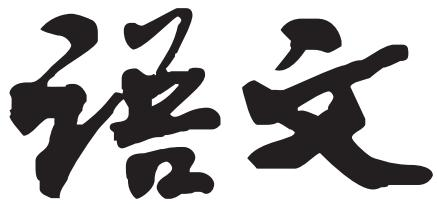

# 五年级

下册

教育部组织编写

总主编 温儒敏

总主编：温儒敏

小学主编：陈先云（执行）曹文轩崔 峦 李吉林

编写人员：（以姓氏笔画为序）

何源余琴张沛陆云

陈先云郑宇柳美彤 温儒敏

责任编辑：柳美彤张沛郑宇

美术编辑：何安冉

义务教育教科书 语文 五年级 下册

教育部组织编写

出版人民教育出版社

（北京市海淀区中关村南大街17号院1号楼 邮编：100081)

网址 http://www.pep.com.cn

## 人民教育出版社

## 目录

第一单元……  
1 古诗三首…… …2  
四时田园杂兴(其三十一)…2  
稚子弄冰……………2  
村晚……  
2 祖父的园子…………  
3\* 月是故乡明…… …8  
4\* 梅花魂…… …10  
O 口语交际：  
走进他们的童年岁月………13  
O 习作：那一刻，我长大了……14  
O 语文园地……………………………15  
第二单元…… .17  
5 草船借箭…… …18  
6 景阳冈……………… …………22  
7\* 猴王出世…… ……28  
8\* 红楼春趣……31  
口语交际：怎么表演课本剧…35  
O 习作：写读后感………………36  
O 语文园地……  
O 快乐读书吧：  
读古典名著，品百味人生…39  
第三单元…… …41  
综合性学习：遨游汉字王国………42  
汉字真有趣………43  
O 我爱你，汉字………………47  
第四单元… .53  
9 古诗三首………  
从军行……54  
秋夜将晓出篱门迎凉有感…54  
闻官军收河南河北………………55  
10 青山处处埋忠骨………………………56  
11 军神…… ……59  
12\*清贫…… …63  
习作：他了…65  
O 语文园地………… ……66

## 人民教育出版社

第五单元… 69  
13 人物描写一组…………… …70  
摔跤…… ……70  
他像一棵挺脱的树……………71  
两茎灯草…… ……72  
14 刷子李…… ……74  
O 习作例文：  
我的朋友容容……78  
小守门员和他的观众们……80  
O 习作：形形色色的人…………82  
第六单元 ·83  
15 自相矛盾……… ……84  
16 田忌赛马…… ……85  
17 跳水…… …87  
O 习作：神奇的探险之旅………89  
O 语文园地………… ……90  
第七单元… ··93  
18 威尼斯的小艇………………………94  
19 牧场之国……… ……97  
20\*金字塔…… ………99  
金字塔夕照………99  
不可思议的金字塔……………100  
口语交际：我是小小讲解员…103  
习作：中国的世界文化遗产…104  
语文园地…………… …………105  
第八单元…… …107  
21 杨氏之子……108  
22 手指……… ……109  
23\* 童年的发现………… ………112  
口语交际：我们都来讲笑话…115  
O 习作：漫画的启示……………116  
语文园地……………… ………117  
识字表…… …119  
写字表…… ………121  
词语表…… ……123

标\*的是略读课文

第一单元

每一个人都有他自己的童年往事，快乐也好，辛酸也好，对于他都是心动神移的最深刻的记忆。

——冰心

体会课文表达的思想感情。

把一件事的重点部分写具体。

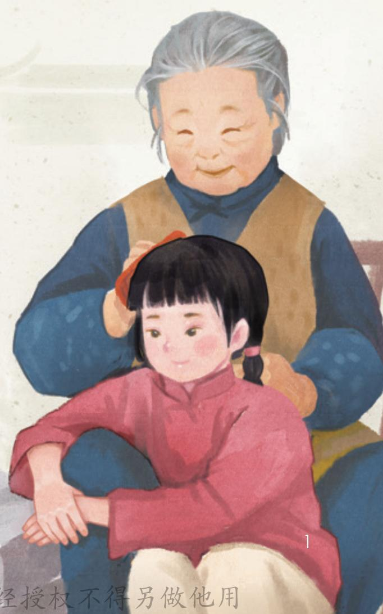

仅供个人学习使用，未经授权不得另做他用

## ①古诗三首

# 四时田园杂兴（其三十一）

[宋]范成大

zhòu yún 昼出耘田夜绩麻， 村庄儿女各当家。 gòng 童孙未解供耕织， 也傍桑阴学种瓜。

## 注释

①〔耘田〕在田间除草。   
②〔绩麻]把麻搓成线。   
③〔解〕理解，懂得。   
④〔供〕从事。   
⑤〔傍〕靠近。   
⑥〔阴〕树荫。

## 稚子弄冰 zhì

[宋]杨万里

稚子金盆脱晓冰，zhēng  
彩丝穿取当银钲qìng  
敲成玉磬穿林响，  
忽作玻璃碎地声。

## 注释

①〔稚子〕幼小的孩子。  
②〔金盆〕一般指铜盆。  
③〔钲〕一种金属打击乐器。  
④〔磬〕一种打击乐器，形状  
像曲尺。  
⑤〔玻璃〕古代常指一种玉石。

村晚

[宋]雷震

bēi草满池塘水满陂，

yl山衔落日浸寒漪®。

牧童归去横牛背，

短笛无腔信口。

注释

①〔陂〕池岸。   
②〔漪〕水中的波纹。   
③〔腔〕曲调。   
④〔信口〕随口。

昼耘供稚漪

昼耘桑晓

有感情地朗读课文。背诵课文。默写《四时田园杂兴》（其三十一）。

读下面的诗句，说说你眼前浮现出怎样的画面，体会其中的乐趣。

童孙未解供耕织，也傍桑阴学种瓜。

稚子金盆脱晓冰，彩丝穿取当银钲。

◇ 牧童归去横牛背，短笛无腔信口吹。

选做

根据古诗内容，展开想象，选择其中一首改写成短文。

# ②祖父的园子

zhà

我家有一个大花园，这花园里蜜蜂、蝴蝶、蜻蜓、蚂蚱，样样都有。蝴蝶有白蝴蝶、黄蝴蝶。这种蝴蝶小，不太好看。好看的是大红蝴蝶，满身带着金粉。蜻蜓是金的，蚂蚱是绿的。蜜蜂则嗡嗡地飞着，满身绒毛，落到一朵花上，胖乎乎，圆滚滚，就像一个小毛球似的不动了。

花园里边明晃晃的，红的红，绿的绿，新鲜漂亮。

kěn

据说这花园，从前是一个果园。祖母喜欢养羊，羊把果树给啃  
了，果树渐渐地都死了。到我有记忆的时候，园子里就只有一棵樱  
桃树、一棵李子树，因为樱桃和李子都不大结果子，所以觉得它们  
并不存在。小的时候，只觉得园子里边就有一棵大榆树。这榆树在  
园子的西北角上，来了风，榆树先呼叫，来了雨，榆树先冒烟。太bàng  
阳一出来，榆树的叶子就发光了，它们闪烁得和沙滩上的蚌壳一样。

祖父整天都在园子里，我也跟着他在里面转。祖父戴一顶大草帽，我戴一顶小草帽；祖父栽花，我就栽花；祖父拔草，我就拔草。祖父种小白菜的时候，我就跟在后边，用脚把那下了种的土窝一个一个地溜平。哪里会溜得准，不过是东一脚西一脚地瞎闹。有时不但没有把菜种盖上，反而把它踢飞了。

祖父铲地，我也铲地。因为我太小，拿不动锄头，祖父就把锄头杆拔下来，让我单拿着那个锄头的“头”来铲。其实哪里是铲，不过是伏在地上，用锄头乱钩一阵。我认不得哪个是苗，哪个是gē草，往往把韭菜当作野草割掉，把狗尾草当作谷穗留着。

祖父发现我铲的那块地还留着一片狗尾草，就问我：“这是什么？”

我说：“谷子。”

祖父大笑起来，笑够了，把草拔下来，问我：“你每天吃的就是这个吗？”

我说：“是的。”

我看祖父还在笑，就说：“你不信，我到屋里拿来给你看。”

我跑到屋里拿了一个谷穗，远远地抛给祖父，说：“这不是样的吗？”

祖父把我叫过去，慢慢讲给我听，说谷子是有芒针的，狗尾草dū却没有，只是毛嘟嘟的，很像狗尾巴。

我并不细看，不过马马虎虎承认下来就是了。一拾头，看见一个黄瓜长大了，我跑过去摘下来，吃黄瓜去了。黄瓜还没有吃完.我又看见一只大蜻蜓从旁边飞过，于是丢下黄瓜又去追蜻蜓了。蜻蜓飞得那么快，哪里会追得上？好在一开始我也没有存心一定要追wō上，跟着蜻蜓跑了几步就又去做别的了。采一朵倭瓜花，捉一个绿shuān蚂蚱，把蚂蚱腿用线绑上，绑了一会儿，线头上只拴着一条腿，而不见蚂蚱了。

玩腻了，我又跑到祖父那里乱闹一阵。祖父浇菜，我也过来浇，但不是往菜上浇，而是拿着水瓢，拼尽了力气，把水往天空一luo扬，大喊着：“下雨啰！下雨啰！”

太阳在园子里是特别大的，天空是特别高的。太阳光芒四射，亮得使人睁不开眼睛，亮得蚯蚓不敢钻出地面来，蝙蝠不敢从黑暗的地方飞出来。凡是在太阳下的，都是健康的、漂亮的。拍一拍手，仿佛大树都会发出声响；叫一两声，好像对面的土墙都会回答似的。

花开了，就像睡醒了似的。鸟飞了，就像在天上逛似的。虫子叫了，就像在说话似的。一切都活了，要做什么，就做什么。要怎么样，就怎么样，都是自由的。倭瓜愿意爬上架就爬上架，愿意爬上房就爬上房。黄瓜愿意开一朵花，就开一朵花，愿意结一个瓜，就结一个瓜。若都不愿意，就是一个瓜也不结，一朵花也不开，也没有人问它。玉米愿意长多高就长多高，它若愿意长上天去，也没有人管。蝴蝶随意地飞，一会儿从墙头上飞来一对黄蝴蝶，一会儿又从墙头上飞走一只白蝴蝶。它们是从谁家来的，又要飞到谁家去？太阳也不知道。

天空蓝悠悠的，又高又远。

可是白云一来，一大团一大团的，从祖父的头上飘过，好像要压到祖父的草帽了。

我玩累了，就在房子底下找个阴凉的地方睡着了。不用枕头，不用席子，把草帽遮在脸上就睡了。

蚱啃樱蚌割嘟倭拴啰逛

蝴蚱嗡樱榆拔瞎

铲锄割|瓢逛

默读课文，说说祖父的园子里有些什么，“我”和祖父在园子里做了什么。

读下面的句子，体会“我”的内心感受，再从课文中找出类似的句子，和同学交流。

◇ 凡是在太阳下的，都是健康的、漂亮的。拍一拍手，仿佛大树都会发出声响；叫一两声，好像对面的土墙都会回答似的。

黄瓜愿意开一朵花，就开一朵花，愿意结一个瓜，就结一个瓜。若都不愿意，就是一个瓜也不结，一朵花也不开，也没有人问它。

读下面的“阅读链接”，说说你对课文有什么新的体会，再有感情地朗读课文。

## 阅读链接

呼兰河这小城里边，以前住着我的祖父，现在埋着我的祖父。

我出生的时候，祖父已经六十多岁了，我长到四五岁，祖父就快七十了。我还没有长到二十岁，祖父就七八十岁了。祖父一过了八十，就死了。

从前那后花园的主人，而今不见了。老主人死了，小主人逃荒去了。

那园里的蝴蝶、蚂蚱、蜻蜓，也许还是年年仍旧，也许现在完全荒凉了。

小黄瓜，大倭瓜，也许还是年年地种着，也许现在根本没有了。

那早晨的露珠是不是还落在花盆架上，那午间的太阳是不是还照着那大向日葵，那黄昏时候的红霞是不是还会一会儿工夫变出一匹马来，一会儿工夫变出一条狗来，那么变着。

这一些不能想象了。

……

以上我所写的并没有什么优美的故事，只因它们充满我幼年的记忆，忘却不了，难以忘却，就记在这里了。

——选自萧红的《呼兰河传》，有改动

# 3 月是故乡明

自古以来，月亮常常寄托了中国人的思乡之情。默读课文，说说作者由月亮想到了哪些往事，抒发了哪些感受。如果有兴趣，再搜集一些思乡的古诗，和同学交流。

每个人都有个故乡，每个人的故乡都有个月亮。人人都爱自己故乡的月亮。

但是，如果只有孤零零一个月亮，未免显得有点儿孤单。因此，在中国古代诗文中，总有什么东西给月亮当陪衬，最多的是山和水，比如“山高月小”“三潭印月”，不可胜数。我的故乡是在山东西北部的大平原上。我小的时候，从来没有见过山，也不知山为何物。我曾幻想，山大概是一个圆而粗的柱子吧，顶天立地，好不威风。后来到了济南，才见到山，恍然大悟：山原来是这个样子啊！因此，我在故乡望月，从来不同山联系。像苏东坡说的“月出pái huái于东山之上，徘徊于斗牛之间”，完全是我无法想象的。

至于水，我故乡的小村子里却到处都是。几个大苇坑占了村子面积的一多半。在我这个小孩子眼中，虽不能像洞庭湖“八月湖水miǎo平”那样有气派，但也颇有烟波浩渺之势。到了夏天，黄昏后，我躺gōu在坑边场院的地上，数天上的星星。有时候在古柳下面点起篝火，然后上树一摇，成群的知了飞落下来，比白天用嚼烂的麦粒去粘要容易得多。我天天晚上乐此不疲，天天盼望黄昏早早来临。

到了更晚的时候，我走到坑边，抬头看到晴空一轮明月，清

光四溢，与水里的那个月亮相映成趣。我当时虽然还不懂什么叫诗méng  
兴，可觉得心中油然有什么东西在萌动。有时候在坑边玩很久，才chéngchè  
回家睡觉。在梦中见到两个月亮叠在一起，清光更加晶莹澄澈。

我在故乡只待了六年，以后就离乡背井，漂泊天涯。在济南住了十多年，在北京度过四年，又回到济南待了一年，然后在欧洲住了近十一年，又回到北京，到现在已经四十多年了。在这期间，我yǐ nǐ曾到过将近三十个国家，看到过许许多多的月亮。在风光旖旎的瑞lái yín qǐng士莱芒湖上，在无边无垠的非洲大沙漠中，在碧波万顷的大海中é在巍峨雄奇的高山上，我都看到过月亮。这些月亮应该说都是美妙绝伦的，我都非常喜欢。但是，看到它们，我立刻就会想到故乡苇坑上面和水中的那个小月亮。对比之下，我感到这些广阔世界的大月亮，无论如何比不上我那心爱的小月亮。不管我离开故乡多远我的心立刻就飞回去了。我的小月亮，我永远忘不掉你！

我现在年事已高，住的朗润园是燕园胜地。夸大一点儿说，此zhuì地有茂林修竹，绿水环流，还有几座土山点缀其间，风光无疑是绝妙的。每逢望夜，一轮当空，月光闪耀于碧波之上，上下空蒙，碧数顷，荷香远溢，宿鸟幽鸣，真不能不说是赏月胜地。荷塘月色的奇景，就在我的窗外。然而，每逢这样的良辰美景，我想到的却仍然是故乡苇坑里的那个平凡的小月亮。

月是故乡明，我什么时候能够再看到故乡的月亮啊！

徘徊渺篝萌澄澈旖

旎瑞莱垠顷峨燕缀

# ④梅花魂

默读课文，说说课文写了外祖父的哪几件事，表现了他怎样的感情，再和同学交流你对题目的理解。

故乡的梅花又开了。一年一度，那朵朵冷艳、缕缕幽芳的梅花，总让我想起漂泊他乡、葬身异国的外祖父。

我出生在东南亚的星岛，从小和外祖父生活在一起。外祖父年轻时读了不少经、史、诗、词，又能书善画，在星岛文坛颇负盛名。我很小的时候，外祖父常常抱着我，坐在花梨木大交椅上，一遍又一遍、不厌其烦地教我读唐诗宋词。每当读到“独在异乡为异客，每逢佳节倍思亲”“春草明年绿，王孙归不归”“自在飞花轻似梦，无边丝雨细如愁”之类的句子，常会有一颗两颗冰凉的泪珠落sāi在我的腮边、手背。这时候，我会拍着手笑起来：“外公哭了！外公哭了！”老人总是摇摇头，长长地叹一口气，说：“莺儿，你还小呢，不懂！”

外祖父家中有不少古玩，我偶尔摆弄，老人也不甚在意。唯独qiú  
书房里那一幅老干虬枝的墨梅图，他分外爱惜，家人碰也碰不得。  
我五岁那年，有一回到书房玩耍，不小心在上面留了个脏手印，外  
祖父顿时拉下脸来。有生以来，我第一次听到他训斥我母亲：“孩子diàn  
要管教好，这清白的梅花，是能玷污的吗？”训罢，便用刀片轻轻  
刮去污迹，又用细绸子慢慢抹净。看见慈祥的外祖父大发脾气，我

心里又害怕又奇怪：一幅画而已，有什么稀罕的呢？

有一天，母亲忽然跟我说：“莺儿，我们要回中国去！”

“干吗要回去呢？”

“那儿才是我们的祖国啊！”

哦！祖国，就是那拥有长江、黄河、万里长城的地方吗？我欢呼起来，小小的心充满了欢乐。

可是，我马上想起外祖父，我亲爱的外祖父。我问母亲：“外公走吗？”

“外公年纪太大了……”

我跑进外祖父的书房，老人正躺在藤椅上。我说：“外公，您也 回祖国去吧！”

想不到外祖父竟像小孩子一样，鸣鸣鸣地哭了起来……

离别的前一天早上，外祖父早早地起了床，把我叫到书房里，zhèng郑重地递给我一卷白杭绸包着的东西。我打开一看，原来是那幅墨梅图，就说：“外公，这不是您最宝贵的画吗？”

“是啊，莺儿，你要好好保存！这梅花，是

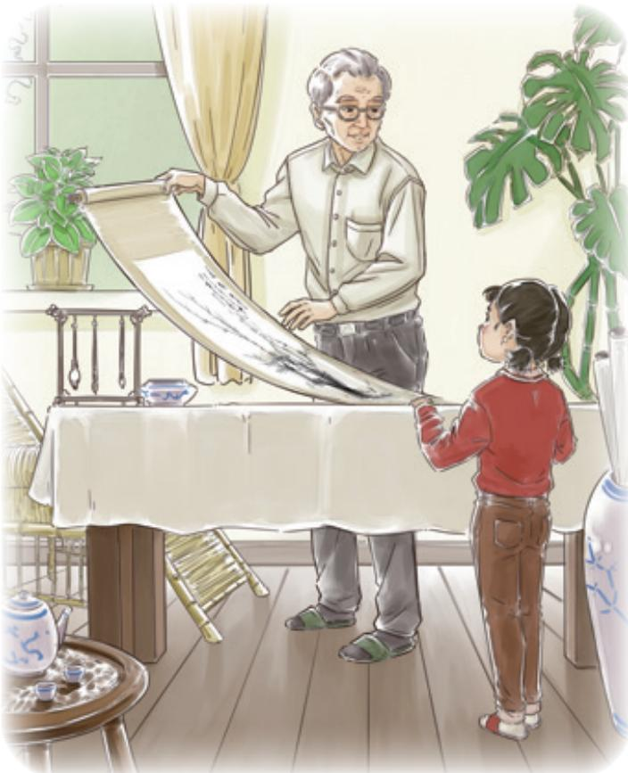

我们中国最有名的花。旁的花，大抵是春暖才开花。她却不一样，愈是寒冷，愈是风欺雪压，花开得愈精神，愈秀气。她是最有品格、最有灵魂、最有骨气的！几千年来，我们中华民族出了许多有气节的人物，他们不管历经多少磨难，不管受到怎样的欺凌，从来都是顶天立地，不肯低头折节。他们就像这梅花一样。一个中国人，无论在怎样bǐng  
的境遇里，总要有梅花的秉性才好！”

回国的那一天正是元旦，虽然热带是无所谓隆冬的，但腊月sōu mǎ liáo天气，毕竟也凉飕飕的。外祖父把我们送到码头。风撩乱了老人平日梳理得整整齐齐的银发，我觉得外祖父一下子衰老了许多。

船快开了，母亲只好狠下心来，拉着我登上大客轮。想不到眼juàn含泪水的外祖父也随着上了船，递给我一块手绢—雪白的细亚麻布上绣着血色的梅花。

当年的我，还过于稚嫩，并不懂得，我带走的，岂止是我慈爱的外祖父珍藏的一幅丹青、几朵血梅？我带走的，是身在异国的华qiáo juàn侨老人一颗眷恋祖国的赤子心啊！

腮虬玷郑秉飕码撩绢侨眷

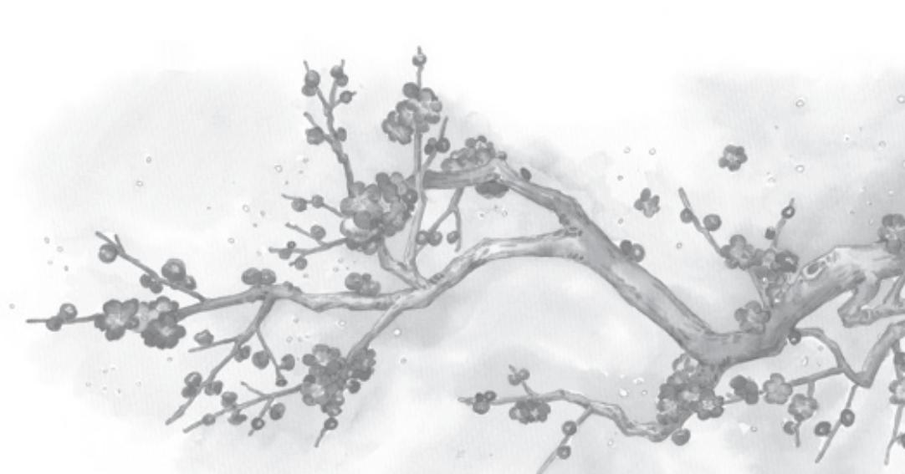

## 口语交际

## 走进他们的童年岁月

童年是纯真、难忘的岁月，每个人都有自己的童年。你知道大人们的童年是什么样的吗？让我们走进他们的童年岁月，了解他们小时候的故事。

先想一想可以了解谁的童年，如祖父母、外祖父母、父母、邻居，再针对不同的对象，列出问题清单。下面两个问题清单供你参考。

## 问题清单一

还记得小时候学过的哪几篇课文?

◇ 做过的最勇敢的事是什么？

◇课后最喜欢玩什么游戏？

## 问题清单二

◇小时候玩过哪些玩具？

最喜欢哪个玩具？为什么最喜欢它?

◇ 这个玩具是怎么玩的？

要认真、耐心地听别人讲话，一边听一边作简要的记录，不要随意打断别人，不明白的地方或感兴趣的内容可以适当追问。

可以从不同方面提问，也可以围绕一个话题提出多个问题。

交流之后，整理你的记录，和同学分享你了解到的情况和你的感受。

认真倾听，交流时边听边记录。

根据整理的记录有条理地表达。

# 那一刻，我长大了

翻阅影集、日记…回忆自己成长的历程，有没有某一个时刻、某一件事情让你突然觉得自己长大了？

今年我过生日，妈妈给我切蛋糕的时候，我发现她的眼角出现了浅浅的皱纹……

今天爷爷走了很远的路，给我买了一双心爱的球鞋。接过爷爷递来的球鞋，我感觉手上沉甸甸的…

三年级的时候，第一次在全校开学典礼上发言，我很紧张。看到同学们鼓励的目光，我又有了信心…

这次习作，写一件自己成长过程中印象最深的事情，要把事情的经过写清楚，还要把感到自己长大了的“那一刻”的情形写具体，记录当时的真实感受。题目自拟。

写完后和同学交流，看看有没有把“那一刻”的情形写具体，根据同学的意见进行修改。

# 人民教育出版社

# 语文园地

## 交流平台

读到《月是故乡明》中“我的小月亮，我永远忘不掉你这句话时，我能直接感受到作者对故乡深深的怀念之情。

读《祖父的园子》时，我从描写园子里的花草、虫子、鸟儿等事物的语句中，体会到了蕴含在字里行间的“我”对祖父和园子深沉的爱与怀念。

我在读《月是故乡明》时，把自己想象成文中的“我”，体会到了作者的怀乡之情。

我通过有感情地朗读，把自己体会到的感情表达出来了，也加深了对课文思想感情的体会。

## 词句段运用

读下面的句子，想象句中描写的情景，再从下列词语中选择一个，照样子说一说。

太阳光芒四射，亮得使人睁不开眼睛，亮得蚯蚓不敢钻出地面来，蝙蝠不敢从黑暗的地方飞出来。

八月，天多热。鸡热得耷拉着翅膀，狗热得吐出舌头，蝉热得不知如何是好。

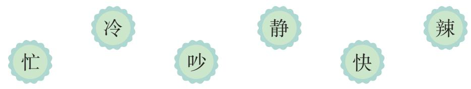

## 人民教育出版社

想一想下面的句子在表达上有什么特点，再照样子写一写。

在风光旖旎的瑞士莱芒湖上，在无边无垠的非洲大沙漠中，在碧波万顷的大海中，在巍峨雄奇的高山上，我都看到过月亮。………对比之下，我感到这些广阔世界的大月亮，无论如何比不上我那心爱的小月亮。

口 这里的桂花再香，也比不上家乡院子里的桂花。

虽然姑爹小船上盖的只是破旧的篷，远比不上绍兴的乌篷船精致，但姑爹的小渔船仍然是那么亲切，那么难忘…

## 日积月累

游子吟

[唐]孟郊

慈母手中线，游子身上衣。临行密密缝，意恐迟迟归。谁言寸草心，报得三春晖。

# 第二单元

观三国烽烟，识梁山好汉，叹取经艰难，惜红楼梦断。

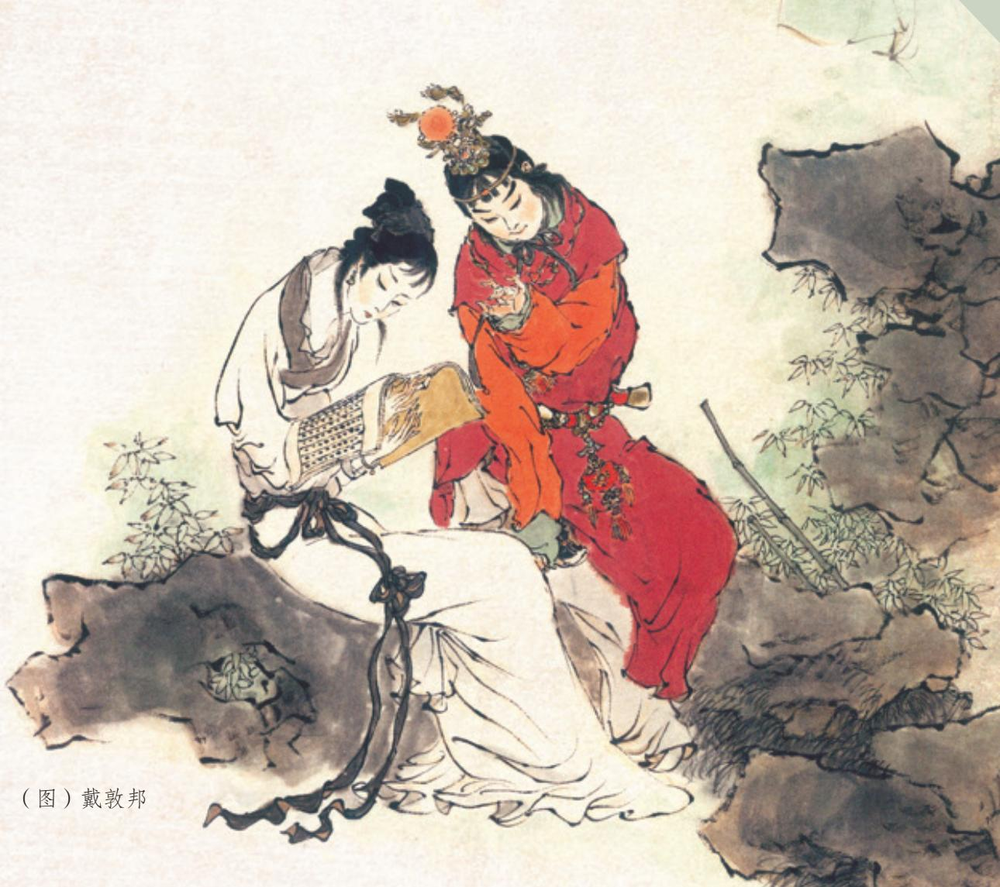

初步学习阅读古典名著的方法。

学习写读后感。

# ⑤ 草船借箭

yú jì周瑜对诸葛亮心怀妒忌。

有一天，周瑜请诸葛亮商议军事，说：“我们就要跟曹军交战了。水上交战，用什么兵器最好？”诸葛亮说：“用弓箭最好。”周瑜说：“对，先生跟我想的一样。现在军中缺箭，想请先生负责赶dū造十万支。这是公事，希望先生不要推却。”诸葛亮说：“都督委托，当然照办。不知道这十万支箭什么时候用？”周瑜问：“十天造得好吗？”诸葛亮说：“既然就要交战，十天造好，必然误了大事。”周瑜问：“先生预计几天可以造好？”诸葛亮说：“只要三天。”周瑜说：“军情紧急，可不能开玩笑。”诸葛亮说：“怎么敢跟都督开玩笑？我愿意立下军令状，三天造不好，甘受重罚。”周瑜很高兴，叫诸葛亮当面立下军令状，又摆了酒席招待他。诸葛亮说：“今天来不及了。从明天算起，到第三天，请派五百个军士到江边来搬箭。”诸葛亮喝了几杯酒就走了。

鲁肃对周瑜说：“十万支箭，三天怎么造得成呢？诸葛亮说的是假话吧？”周瑜说：“是他自己说的，我可没逼他。我得吩咐军匠们，叫他们故意迟延，造箭用的材料不给他准备齐全。到时候造不成，定他的罪，他就没话可说了。你去探听探听，看他怎么打算，回来报告我。”

鲁肃见了诸葛亮。诸葛亮说：“三天之内要造十万支箭，得请你

帮帮我的忙。”鲁肃说：“都是你自找的，我怎么帮得了你的忙？”诸葛亮说：“你借给我二十条船，每条船上要三十多名军màn士。船用青布幔子遮起来，还要一千多个草把子，排在船的两边。我自有妙用。第三天管保有十万支箭。不过不能让都督知道。他要是知道了，我的计划就完了。”

鲁肃答应了。他不知道诸葛亮借船有什么用，回来报告周瑜，果

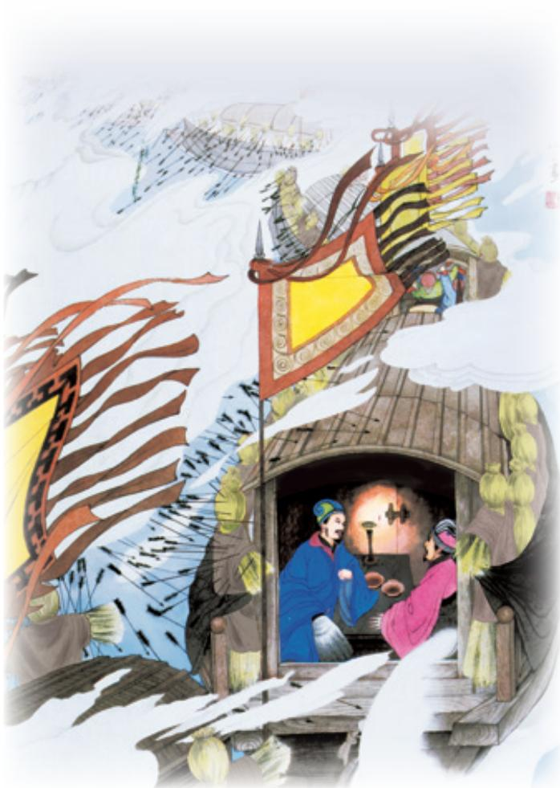  
líng

然不提借船的事，只说诸葛亮不用竹子、翎毛、胶漆这些材料。周瑜疑惑起来，说：“到了第三天，看他怎么办！”

鲁肃私自拨了二十条快船，每条船上配三十多名军士，照诸葛亮说的，布置好青布幔子和草把子，等诸葛亮调度。第一天，不见诸葛亮有什么动静；第二天，仍然不见诸葛亮有什么动静；直到第三天四更时候，诸葛亮秘密地把鲁肃请到船里。鲁肃问他：“你叫我来做什么？”诸葛亮说：“请你一起去取箭。”鲁肃问：“哪里去取？”诸葛亮说：“不用问，去了就知道。”诸葛亮吩咐把二十条船用绳索连接起来，朝北岸开去。

这时候大雾漫天，江上的人连面对面都看不清。五更时分，船zhài已经靠近曹军的水寨。诸葛亮下令把船头朝西，船尾朝东，一字摆léi nà开，又叫船上的军士一边擂鼓，一边呐喊。鲁肃吃惊地说：“如果曹兵出来，怎么办？”诸葛亮笑着说：“雾这么大，曹操一定不敢派兵出来。我们只管饮酒取乐，雾散了就回去。”

曹操得知江上的动静后，就下令说：“江上雾很大，敌人忽然nù来攻，必有埋伏，我们看不清虚实，不要轻易出动。拨水军弓弩手朝他们射箭便是。”然后，他又派人去旱寨调来六千名弓弩手，到江边支援水军。一万多名弓弩手一齐朝江中放箭，箭好像下雨一样。诸葛亮又下令把船掉过来，船头朝东，船尾朝西，仍旧擂鼓呐喊，逼近曹军水寨受箭。

到雾散时，诸葛亮下令返回。船两边的草把子上都插满了箭。chéng诸葛亮吩咐军士们齐声高喊“谢谢曹丞相的箭”。曹操知道上了当，可是诸葛亮那边船轻水急，已经驶出二十多里，要追也来不及了。

二十条船靠岸的时候，周瑜派来搬箭的五百个军士已经等在江边了。每条船有五六千支箭，二十条船总共有十万多支。鲁肃见了周瑜，告诉他借箭的经过。周瑜大吃一惊，长叹道：“诸葛亮神机妙算，我真比不上他！”

## 瑜忌督幔翎寨擂呐弩丞

妒忌曹督委鲁遮

漆疑惑寨擂呐插

默读课文，按照起因、经过、结果的顺序，说一说故事的主要内容。

读下面的语句，回答括号里的问题。课文中还有一些体现人物特点的语句，画出来和同学交流。

诸葛亮说：“怎么敢跟都督开玩笑？我愿意立下军令状，三天造不好，甘受重罚。”周瑜很高兴，叫诸葛亮当面立下军令状，又摆了酒席招待他。(三天造十万支箭这么难，诸葛亮为什么主动立下军令状？他立下军令状后，周瑜为什么很高兴？)

读课文前，你对课文中的人物有什么了解？读课文后，你对哪些人物有了进一步的了解？你还想了解《三国演义》中的哪些故事？

读下面的“阅读链接”，找出课文中对应的段落。

## 阅读链接

却说曹寨中，听得擂鼓呐喊，毛玠、于禁二人慌忙飞报曹操。操传令曰：“重雾迷江，彼军忽至，必有埋伏，切不可轻动。可拨水军弓弩手乱箭射之。”又差人往旱寨内唤张辽、徐晃各带弓弩军三千，火速到江边助射。比及号令到来，毛玠、于禁怕南军抢入水寨，已差弓弩手在寨前放箭；少顷，旱寨内弓弩手亦到，约一万余人，尽皆向江中放箭：箭如雨发。孔明教把船吊回，头东尾西，逼近水寨受箭，一面擂鼓呐喊。待至日高雾散，孔明令收船急回。二十只船两边束草上，排满箭枝。孔明令各船上军士齐声叫曰：“谢丞相箭！”比及曹军寨内报知曹操时，这里船轻水急，已放回二十余里，追之不及。曹操懊悔不已。

选自元末明初罗贯中的《三國演义》第四十六回

## 景阳冈

武松在路上行了几日，来到阳谷县地面。此去离县治还远。当  
日晌午时分，走得肚中饥渴，望见前面有一个酒店，挑着一面招  
旗在门前，上头写着五个字道：“三碗不过冈。”武松入到里面坐yǐ  
下，把梢棒①倚了，叫道：“主人家，快把酒来吃。”只见店主人把zhù dié  
三只碗、一双箸、一碟热菜，放在武松面前，满满筛一碗酒来。武  
松拿起碗，一饮而尽，叫道：“这酒好生有气力！主人家，有饱肚jīn  
的买些吃酒。”酒家道：“只有熟牛肉。”武松道：“好的切二三斤来  
吃酒。”店家去里面切出二斤熟牛肉，做一大盘子将来，放在武松  
面前，随即再筛一碗酒。武松吃了道：“好酒！”又筛下一碗，恰好  
吃了三碗酒，再也不来筛。武松敲着桌子叫道：“主人家，怎的不  
来筛酒？”酒家道：“客官要肉便添来。”武松道：“我也要酒，也再  
切些肉来。”酒家道：“肉便切来，添与客官吃，酒却不添了。”武  
松道：“却又作怪。”便问主人家道：“你如何不肯卖酒与我吃？”酒  
家道：“客官，你须见我门前招旗，上面明明写道‘三碗不过冈’。”ǎn  
武松道：“怎地唤做三碗不过冈？”酒家道：“俺家的酒，虽是村酒，  
却比老酒的滋味。但凡客人来我店中吃了三碗的，便醉了，过不得  
前面的山冈去。因此唤做‘三碗不过冈’。若是过往客人到此，只nèn  
吃三碗，更不再问。”武松笑道：“原来恁地。我却吃了三碗，如何  
不醉？”酒家道：“我这酒叫做‘透瓶香’，又唤做‘出门倒’。初

chún nóng入口时，醇酢好吃，少刻时便倒。”武松道：“休要胡说。没地①不还你钱，再筛三碗来我吃。”酒家见武松全然不动，又筛三碗。武松吃道：“端的好酒！主人家，我吃一碗，还你一碗钱，只顾筛来。”酒家道：“客官休只管要饮，这酒端的要醉倒人，没药医。”武松道：“休得胡说！便是你使蒙汗药在里面，我也有鼻子。”店家被他发话不过，一连又筛了三碗。武松道：“肉便再把二斤来吃。”酒家又切了二斤熟牛肉，再筛了三碗酒。武松吃得口滑，只顾要吃，去身边取出些碎银子，叫道：“主人家，你且来看我银子，还你酒肉钱勾②么？”酒家看了道：“有余，还有些贴钱与你。”武松道：“不要你贴钱，只将酒来筛。”酒家道：“客官，你要吃酒时，还有五六碗酒哩，只怕你吃不的了。”武松道：“就有五六碗多时，你尽数筛将来。”酒家道：“你这条长汉，倘或醉倒了时，怎扶的你住？”武松答道：“要chāo你扶的不算好汉。”酒家再筛了六碗酒与武松吃了。绰了梢棒，立起身来道：“我却又不曾醉。”走出门前来，笑道：“却不说‘三碗不过冈’！”手提梢棒便走。

酒家赶出来叫道：“客官那里去？”武松立住了，问道：“叫我  
做甚么？我又不少你酒钱，唤我怎地？”酒家叫道：“我是好意。你  
且回来我家看官司榜文。”武松道：“甚么榜文？”酒家道：“如今前  
面景阳冈上，有只吊睛白额大虫，晚了出来伤人，坏了三二十条大qín  
汉性命。官司如今杖限打猎捕户，擒捉发落。冈子路口两边人民，sì  
都有榜文。可教往来客人，结伙成队，于巳、午、未三个时辰过yín mǎo yǒu xū  
冈，其余寅、卯、申、酉、戌、亥六个时辰，不许过冈。更兼单身  
客人，不许白日过冈，务要等伴结伙而过。这早晚正是未末申初时

分，我见你走都不问人，枉送了自家性命。不如就我此间歇了，等明日慢慢凑的三二十人，一齐好过冈子。”武松听了，笑道：“我是清河县人氏，这条景阳冈上少也走过了一二十遭，几时见说有大虫！你休说这话来吓我！便有大虫，我也不怕。”酒家道：“我是好意救你。你不信时，进来看官司榜文。”武松道：“便真个有虎，老móu爷也不怕。你留我在家里歇，莫不半夜三更要谋我财，害我性命，却把大虫吓我？”酒家道：“你看么！我是一片好心，反做恶意，倒落得你恁地说。你不信我时，请尊便自行。”

那酒店里主人摇着头，自进店里去了。这武松提了梢棒，大着步自过景阳冈来。约行了四五里路，来到冈子下，见一大树，刮去了皮，一片白，上写两行字。武松也颇识几字，拾头看时，上面写道：“近因景阳冈大虫伤人，但有过往客商，可于巳、午、未三个wù quǐ时辰，结伙成队过冈。请勿自误。”武松看了，笑道：“这是酒家诡zhà sī诈，惊吓那等客人，便去那厮家里宿歇。我却怕甚么！”横拖着梢棒，便上冈子来。那时已有申牌时分。这轮红日，厌厌地相傍下山。武松乘着酒兴，只管走上冈子来。走不到半里多路，见一个败落的山神庙。行到庙前，见这庙门上贴着一张印信榜文。武松住了脚读时，上面写道：

“阳谷县示：为这景阳冈上新有一只大虫，近来伤害人命。见今杖限各乡里正并猎户人等，打捕未获。如有过往客商人等，可于已、午、未三个时辰，结伴过冈。其余时分及单身客人，白日不许过冈。恐被伤害性命不便。各宜知悉。”

武松读了印信榜文，方知端的有虎。欲待发步再回酒店里来，

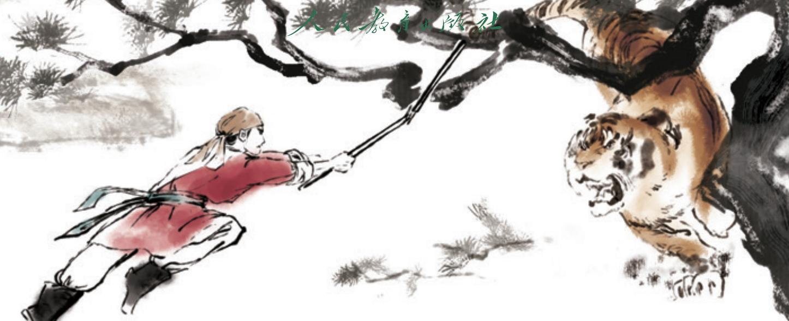

寻思道：“我回去时，须吃他耻笑，不是好汉，难以转去。”存想了  
一回，说道：“怕甚么！且只顾上去，看怎地！”武松正走，看看酒zhānli wǎn lèi  
涌上来，便把毡笠儿背在脊梁上，将梢棒绾在肋下，一步步上那冈  
子来。回头看这日色时，渐渐地坠下去了。此时正是十月间天气，  
日短夜长，容易得晚。武松自言自说道：“那得甚么大虫！人自怕  
了，不敢上山。”武松走了一直，酒力发作，焦热起来，一只手提tǎn liàng qiàng  
着梢棒，一只手把胸膛前袒开，踉踉跄跄，直奔过乱树林来。见一tà  
块光挞挞大青石，把那梢棒倚在一边，放翻身体，却待要睡，只见  
发起一阵狂风来。那一阵风过处，只听得乱树背后扑地一声响，跳出一只吊睛白ā  
额大虫来。武松见了，叫声：“呵呀！”从青石上翻将下来，便拿那  
条梢棒在手里，闪在青石边。那个大虫又饥又渴，把两只爪在地下cuān  
略按一按，和身望上一扑，从半空里撺将下来。武松被那一惊，酒  
都做冷汗出了。说时迟，那时快。武松见大虫扑来，只一闪，闪在kuà  
大虫背后。那大虫背后看人最难，便把前爪搭在地下，把腰胯一  
掀，掀将起来。武松只一躲，躲在一边。大虫见掀他不着，吼一pī lì  
声，却似半天里起个霹雳，振得那山冈也动。把这铁棒也似虎尾倒  
竖起来，只一剪。武松却又闪在一边。原来那大虫拿人，只是一  
扑，一掀，一剪，三般提不着时，气性先自没了一半。那大虫又剪  
不着，再吼了一声，一兜兜将回来。武松见那大虫复翻身回来，双  
手轮①起梢棒，尽平生气力，只一棒，从半空劈将下来。只听得一sù  
声响，簌簌地将那树连枝带叶劈脸打将下来。定睛看时，一棒劈不  
着大虫。原来慌了，正打在枯树上，把那条梢棒折做两截，只拿得páo xiào  
一半在手里。那大虫咆哮，性发起来，翻身又只一扑，扑将来。武  
松又只一跳，却退了十步远。那大虫却好把两只前爪搭在武松面jiū  
前。武松将半截棒丢在一边，两只手就势把大虫顶花皮揪住，一按  
按将下来。那只大虫急要挣扎，早没了气力。被武松尽气力纳定，  
那里肯放半点儿松宽。武松把只脚望大虫面门上、眼睛里只顾乱  
踢。那大虫咆哮起来，把身底下扒起两堆黄泥，做了一个土坑。武  
松把那大虫嘴直按下黄泥坑里去。那大虫吃武松奈何得没了些气chuí  
力。武松把左手紧紧地揪住顶花皮，偷出右手来，提起铁锤般大小  
拳头，尽平生之力，只顾打。打得五七十拳，那大虫眼里、口里、bèng  
鼻子里、耳朵里都迸出鲜血来。那武松尽平昔神威，仗胸中武艺，  
半歇儿把大虫打做一堆，却似躺着一个锦布袋。

武松放了手，来松树边寻那打折的棒橛，拿在手里，只怕大虫不死，把棒橛又打了一回。那大虫气都没了。武松再寻思道：“我pō就地拖得这死大虫下冈子去。”就血泊里双手来提时，那里提得动？原来使尽了气力，手脚都疏软②了。

武松再来青石坐了半歇，寻思道：“天色看看黑了，倘或又跳出一只大虫来时，我却怎地斗得他过？且挣扎下冈子去，明早却来理会。”就石头边寻了毡笠儿，转过乱树林边，一步步挨下冈子来。

# 倚箸碟斤俺绰擒勿笠肋

# 踉跄呵胯霹雳咆哮锤泊

冈饥碟斤俺榜杖申

兼勿拖悉坠膛截

默读课文，遇到不懂的词语，如“梢棒、筛酒”，可以猜一猜意思。

按照故事的发展顺序，把下面的内容补充完整，再说说故事的主要内容。喝酒→( )→( )→( ）

用自己的话详细讲述武松打虎的部分，可以加上适当的语气、表情和动作。

对课文中的武松，人们有不同的评价。你有什么看法？说说你的理由。

武松真勇敢，“明知山有虎，偏向虎山行”。

武松很要面子，有些鲁莽，不听别人善意的劝告。

## 资料袋

《水浒传》是我国著名的古代长篇小说，写了北宋末年以宋江为首的众多梁山好汉的故事。武松是这部小说的主要人物之一，在梁山一百单八将中排行第十四位，人称“行者武松”。景阳冈打虎之后，他被阳谷县令任命为都头。后来，他历经波折，投靠梁山，成为十大步军头领之一。

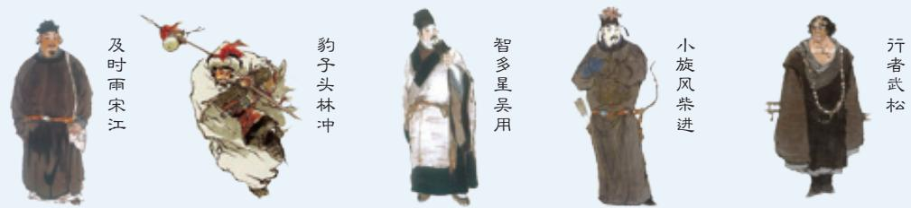  
（图）戴敦邦

# ⑦猴王出世

默读课文，遇到不明白的语句，可以猜猜大致意思，然后继续往下读。读后用自已的话说一说石猴是怎么出世的，又是怎么成为猴王的。

海外有一国土，名曰傲来国。国近大海，海中有一座名山，唤为花果山。那座山正当顶上，有一块仙石。其石有三丈六尺五寸zhī高，有二丈四尺围圆。四面更无树木遮阴，左右倒有芝兰相衬。盖suì自开辟以来，每受天真地秀，日精月华，感之既久，遂有灵通之bèng意。内育仙胞，一日迸裂，产一石卵，似圆球样大。因见风，化作jiàn一个石猴。那猴在山中，却会行走跳跃，食草木，饮涧泉，采山zhāng míyuán花，觅树果；与狼虫为伴，虎豹为群，獐鹿为友，猕猿为亲；夜宿石崖之下，朝游峰洞之中。

本文选自明代吴承恩的《西游记》第一回，选作课文时有删节，题目为编者所加。

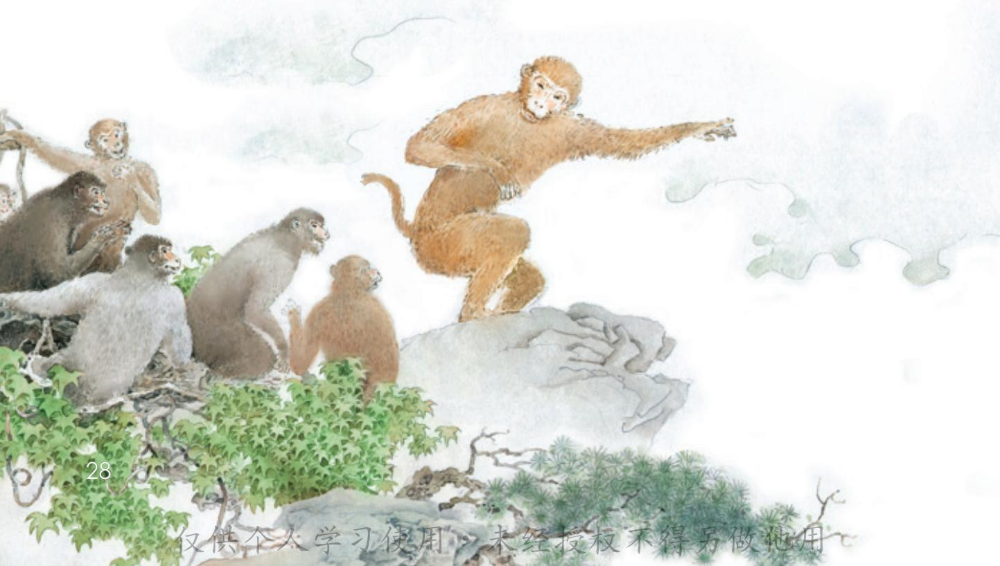

一朝天气炎热，与群猴避暑，都在松阴之下顽①耍。一群猴子耍了一会，却去那山涧中洗澡。见那股涧水奔流，真个似滚瓜qín涌溅。古云：“禽有禽言，兽有兽语。”众猴都道：“这股水不知是那里的水。我们今日赶闲无事，顺涧边往上溜头寻看源流，耍子去yé qiè耶！”喊一声，都拖男挈女，唤弟呼兄，一齐跑来，顺涧爬山，直至源流之处，乃是一股瀑布飞泉。众猴拍手称扬道：“好水！好水！原来此处远通山脚之下，直接大海之波。”又道：“那一个有本事的，钻进去寻个源头出来，不伤身体者，我等即拜他为王。”连呼了三声，忽见从杂中跳出一个石猴，应míng声高叫道：“我进去！我进去！”他瞑目蹲身，将身一纵，径跳入瀑布泉中，忽睁睛拾头观看，那里边却无水无波，明明朗朗的一架桥梁。他住了身，定了神，仔细再看，原qiào来是座铁板桥。桥下之水，冲贯于石窍之间，倒挂流出去，遮闭了桥门。却又欠身上桥头，再走再看，却似有人家住处一般，真个好所在。看罢多时，跳过桥中间，左右观看，只jié kǎi见正当中有一石碣。碣上有一行楷书大字，juān镌着“花果山福地，水帘洞洞天”。

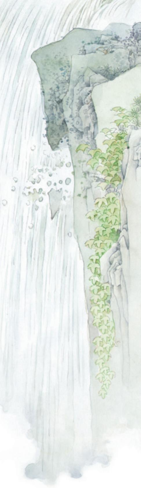

石猴喜不自胜，急抽身往外便走，复瞑目蹲身，跳出水外，打了两个呵呵道：“大造化！大造化！”众猴把他围住，问道：“里面怎么样？水有多深？”石猴道：“没水！没水！原来是一座铁板桥。桥那边是一座天造地设的家当。”众猴道：“怎见得是个家当？”石猴笑道：“这股水乃是桥下冲贯石窍，倒挂下来遮闭门户的。桥边有花有树，乃是一座石房。房内有石锅、石灶、石碗、石盆、石床、石凳。中间一块石碣上，镌着花果山福地，水帘洞洞天’。真个是我们安身之处。里面且是宽阔，容得千百口老小。我们都进去住，也省得受老天之气。”

众猴听得，个个欢喜。都道：“你还先走，带我们进去，进去！”石猴却又瞑目蹲身，往里一跳，叫道：“都随我进来！进来！”náo那些猴有胆大的，都跳进去了；胆小的，一个个伸头缩颈，抓耳挠腮，大声叫喊，缠一会，也都进去了。跳过桥头，一个个抢盆夺liè碗，占灶争床，搬过来，移过去，正是猴性顽劣，再无一个宁时，a只搬得力倦神疲方止。石猴端坐上面道：“列位呵，人而无信，不知其可’。你们才说有本事进得来，出得去，不伤身体者，就拜他为王。我如今进来又出去，出去又进来，寻了这一个洞天与列位安眠稳睡，各享成家之福，何不拜我为王？”众猴听说，即拱伏无违。一个个序齿排班，朝上礼拜，都称“千岁大王”。自此，石猴高登王位，将“石”字儿隐了，遂称美猴王。

芝遂迸涧獐猕猿耶挈

瞑窍碣楷镌挠劣呵

# ⑧红楼春趣

《红楼梦》中的许多故事，在我国广为流传。这篇课文讲述的是宝玉、黛玉等在大观园里放风筝的故事。读读课文，能大致读懂就可以。读后和同学交流：宝玉给你留下了什么样的印象？

一语未了，只听窗外竹子上一声响，恰似窗屉子倒了一般，众huán人吓了一跳。丫鬟们出去瞧时，帘外丫头子们回道：“一个大蝴蝶风筝，挂在竹梢上了。”众丫鬟笑道：“好一个齐整风筝！不知是谁家放的，断了线。咱们拿下他①来。”宝玉等听了，也都出来看时，yān宝玉笑道：“我认得这风筝，这是大老爷那院里嫣红姑娘放的。拿下来给他送过去罢。”紫鹃笑道：“难道天下没有一样的风筝，单他有这个不成？二爷也太死心眼儿了！我不管，我且拿起来。”探春笑道：“紫鹃也太小器，你们一般有的，这会子拾人走了的，也不huì dài嫌个忌讳？”黛玉笑道：“可是呢。把咱们的拿出来，咱们也放放huì晦气②。”

丫头们听见放风筝，巴不得一声儿，七手八脚，都忙着拿出dūn来：也有美人儿的，也有沙雁儿的。丫头们搬高墩，捆剪子股儿，yuè chāi一面拨起簍子来。宝钗等立在院门前，命丫头们在院外敞地下放去。宝琴笑道：“你这个不好看，不如三姐姐的一个软翅子大凤凰好。”宝钗回头向翠墨笑道：“你去把你们的拿来也放放。”

宝玉又兴头起来，也打发个小丫头子家去，说：“把昨日赖大

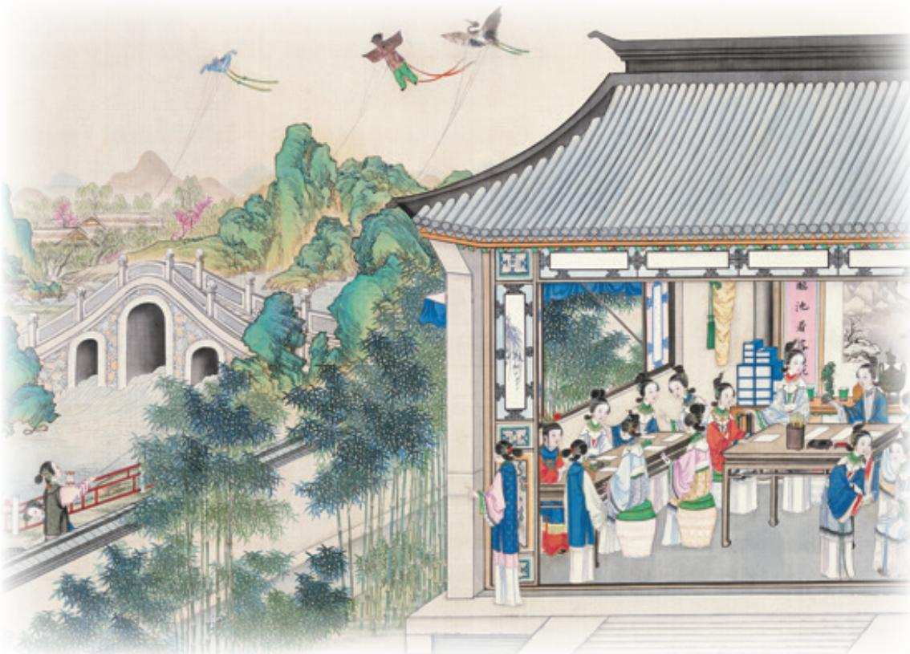  
（图）孙温

娘送的那个大鱼取来。”小丫头去了半天，空手回来，笑道：“晴wén  
雯姑娘昨儿放走了。”宝玉道：“我还没放一遭儿呢！”探春笑道：“横竖是给你放晦气罢了！”宝玉道：“再把大螃蟹拿来罢。”丫头去xí  
了，同了几个人，扛了一个美人并簍子来，回说：“袭姑娘说，昨儿把螃蟹给了三爷了，这一个是林大娘才送来的，放这一个罢。”宝玉细看了一回，只见这美人做的十分精致，心中欢喜，便叫：“放起来！”

此时探春的也取了来了，丫头们在那山坡上已放起来。宝琴叫丫头放起一个大蝙蝠来，宝钗也放起个一连七个大雁来，独有宝玉的美人儿，再放不起来。宝玉说丫头们不会放，自己放了半天，只起房高，就落下来，急的头上的汗都出来了。众人都笑他，他便恨的摔在地下，指着风筝说道：“要不是个美人儿，我一顿脚跺个稀烂！”黛玉笑道：“那是顶线不好。拿去叫人换好了，就好放了。再取一个来放罢。”

宝玉等大家都仰面看天上这几个风筝起在空中。一时风紧，众diàn丫鬟都用绢子垫着手放。黛玉见风力紧了，过去将簍子一松，只听huò lā“豁喇喇”一阵响，登时线尽，风筝随风去了。黛玉因让众人来放。众人都说：“林姑娘的病根儿都放了去了，咱们大家都放了罢。”于jiǎo yáo是丫头们拿过一把剪子来，铰断了线，那风筝都飘飘随风而去。一时只有鸡蛋大，一展眼只剩下一点黑星儿，一会儿就不见了。众人仰面说道：“有趣，有趣！”说着，有丫头来请吃饭，大家方散。

## 屉嫣讳黛晦墩钗雯袭垫豁喇

## 阅读链接

从小我就欢喜放风筝，故一切风筝好像都同我有一点儿缘分。但一个风筝能到我的手中，不是一件很容易的事情。第一得把零用钱慢慢积存起来，才能买得一个放得起的风筝。第二住在城里没地方可放，等到有风了，还得央求听差替我们爬上房顶，或用叉杆兜起，高高地摇着。有时候父亲有正经事情叫他们做，放风筝自然是儿戏，我们便只好空望着天上的好风了。最不幸的却是末一层，房子左右前后总有许多的高树与电杆，风稍微急一点儿，或忽然转了方向变小了的时候，风筝便会挂到那上面去，许久积下来的钱就这样轻轻地飞去了，纵使舍得，也总有个无能为力的时候，于是青黄不接中，只好背着手，站在院子里，昂头看天上别人家飘扬着的东西，点点它，批评它，确也有一种不可形容的滋味。风筝从你房角里斜刺飞起，如一面顺风的船帆，你便不能不看，于是升到极高的天上去了，之后会看见有彩色的纸条飘然系上去，有时有玲珑的小人、灯笼、纸球…，这些都一直高飞，飞到与风筝在一起而有些看不清了，于是你又看见收线，风筝愈来愈大，渐渐地什么都鲜明了，先下来的是小人、灯笼、纸球…，后来又有彩色的纸条从屋脊上掠过，最后是一个风筝翩然一闪地落到墙那边去了，这在心上是希望呢，是嫉妒呢，欣悦与惋惜似乎占满了一颗童心。空中风筝不见了，傍到门边坐到门限上去，方觉得脖子已发疼了。

北平前十来年，是还保持着故都盛况的，如旧年新正的看灯，春秋二季的排楼。每到积雪方融的二月，春风正好的时候，天上的风筝常是不计其数，龙睛鱼的尾巴如美髯公的胡须，风一吹，便能听见哗啦哗啦的响声。老鹰照例是会在天上打旋儿的，这是我小时候最羡慕的一种风筝，它只在胸上有一根线索着，飞起来身子是平的，十分灵活。当天上许多风筝都沉静不动的时候，独它扶摇直上雍容回旋着，有时忽然一放线，便会如鹰捕食一般翻身直落，但紧接着又翻回来，这样的风筝在我心中是最理想的，而且我自小见到真鹰时也总是把什么都忘了，站在那里呆看。

…

在艳阳天中，许多风筝都不动的时候，有一个风筝比北极星更坚定地直钉在天上的，那便是修长的蜈蚣了。它的头朝下，尾向上，眼睛可以笔直地成一条线直撞入青天的深心去。在忽而一松线的刹那，却如游龙般的矫健，但立刻又坚定得如指着一个方向，把人的心带到无极之境去。

风筝在传说中被认为是放晦气的，所以落到谁家院子里，那家必定赶快把它撕掉。但在我放风筝以来，此说大约已被玩的人忘记了，小孩子有风筝自然拿去放，没有风筝呢，心里总很希望凭空能掉下一个来。记得好像是在正月，有一个绿色的水桶样子的风筝，底下垂着一条绿绒线的细长尾巴，每天清早必定从我家屋角斜飞过去。我真想把那“水桶”拿过来，好像那上面拴着青青的童心飞入如碧海的晴天中去。

——选自林庚的《风筝》，有改动

## 口语交际

## 怎么表演课本剧

漫长悠久的岁月，大千世界的风景，性格迥异的人物，各具特色的故事，都可以浓缩在课本剧中。在那里，我们可以尽情展示自己，重现课文中精彩的情节。

分小组讨论怎么表演课本剧，可以讨论以下内容：

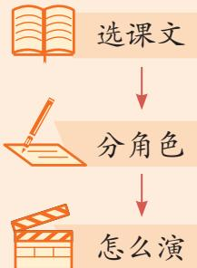

◇ 学过的课文中，哪一篇适合演课本剧。

◇不同身份、性格的角色，适合分配给谁。

怎么演好故事中的每个角色。可以从角色的台词、表情、动作等方面进行讨论。如，怎么把课文中叙述的语言改为人物的对话，表演时可以加上哪些表情和动作。此外，还可以想想需要准备哪些服装和道具。

讨论时，大家轮流做主持人，其他组员既要清楚地表达自己的想法，又要认真听取别人的意见。意见不同时，要一起协商，形成一致的看法。

课后，各小组可以根据讨论的内容进行排练，再在班上表演。

主持讨论时，要引导每个人发表意见。

尊重大家的共同决定。

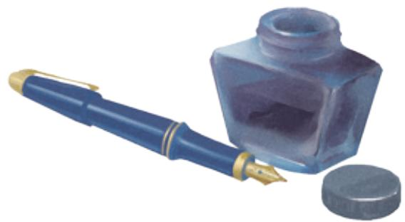

## 写读后感

我们读一篇文章或一本书，往往会有自己的感想。有时一些人物会给你留下很深的印象，如安徒生童话中的小人鱼；有时一些情形会让你受到触动，如《祖父的园子》中“我”跟着祖父学种菜的温馨情景；有时文字中蕴含的道理会让你深受启发，如《铁杵成针》揭示的做事要有恒心的道理。把读一篇文章或一本书的感想写下来，就是读后感。

选择读过的一篇文章或一本书，写一篇读后感。先简单介绍一下文章或书的内容，可以重点介绍你印象最深的部分。再选择一两处你感触最深的内容，写出自己的感想，感想要真实、具体。可以联系自己的阅读积累和生活经验，也可以引用原文中的个别语句。

题目可以是“读《×××》有感”或“《×××》读后感”，也可以将它作为副标题，再自拟主标题。写完后读一读，看看有没有把自己的感想表达清楚，再和同学交流。

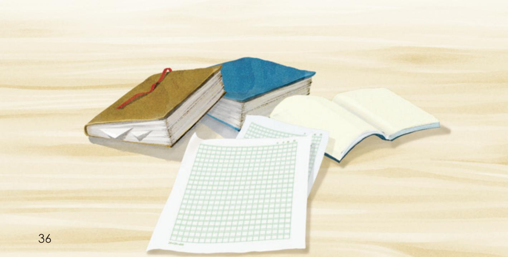

# 人民教育出版社

# 语文园地

## 交流平台

本单元的课文内容理解起来有些难度，如果掌握一些方法，阅读起来就能更加顺畅，也能更有收获。

可以联系上下文猜测语句的意思。如《猴王出世》中 的“每受天真地秀，日精月华，感之既久，遂有灵通之意” 联系上文的“仙石”，我大致猜到这句话在讲仙石很有灵性。

遇到一些较难理解的语句，不用反复琢磨，如《红楼春趣》中“剪子股儿、υ子”等词语，只要知道是与风筝有关的物品就行了。

读《景阳冈》的时候，我借助资料对武松有了更多的了解，也有了阅读古典名著的兴趣。

我结合看过的电影、电视剧，加深了对课文的理解，得到了更多阅读的乐趣。

## 词句段运用

你能猜出下面词语的大致意思吗？

榜文 印信 驿站 郎中 店家 客舍 货郎 墨客

读下面的句子，注意加点的部分，说说你是怎么知道它们的意思的。

但有过往客商，可于巳、午、未三个时辰，结伙成队过冈。请勿自误。

石猴喜不自胜，急抽身往外便走，复瞑目蹲身，跳出水外。

众猴听说，即拱伏无违。一个个序齿排班，朝上礼拜，都称“千岁大王”。

下面的句子描写的都是本单元课文中的人物，读一读，猜猜写的是谁，说说你的理由。

身穿金甲亮堂堂，头戴金冠光映映。手举金箍棒一根，足踏云鞋皆相称。一双怪眼似明星，两耳过眉查又硬。

身长八尺，面如冠玉，头戴纶巾，身披鹤氅，飘飘然有神仙之概。

身躯凛凛，相貌堂堂。一双眼光射寒星，两弯眉浑如刷漆。胸脯横阔，有万夫难敌之威风；语话轩昂，吐千丈凌云之志气。

## 日积月累

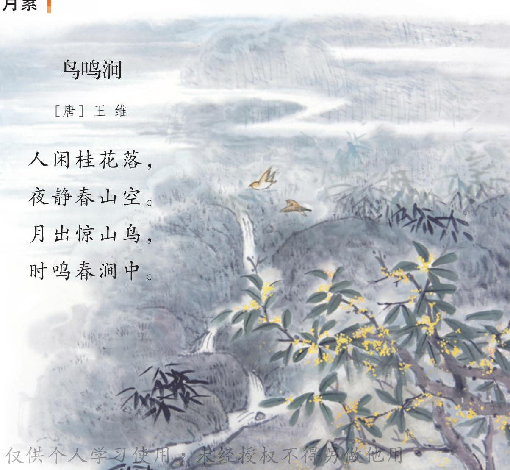

## 快乐读书吧

# 读古典名著，品百味人生

诸葛亮足智多谋，李逵鲁莽刚猛，孙悟空神通广大，林黛玉多愁善感…让我们一起漫步中国古典名著长廊，走近这些人物，品读精彩故事。

## 你读过吗

漫漫取经路上，有妖魔鬼怪，有刀山火海，也有师徒四人坚定的背影和永不停歇的脚步。让我们随着唐僧、孙悟空、猪八戒和沙僧的脚步，体验《西游记》中险境迭出的取经之旅。三打白骨精、大战红孩儿、女儿国遇险、真假美猴王、三借芭蕉扇………一个个扣人心弦的故事会吸引我们一口气读下去。

请看第六十一回“猪八戒助力败魔王，孙行者三调芭蕉扇”中，神通广大的孙悟空与同样变化多端的牛魔王斗法的精彩情形。

这大圣收了金箍棒，捻诀念咒，摇身一变，变作一个海东青，飕的一翅，钻在云眼里，倒飞下来，落在天鹅身上，抱住颈项赚眼。那牛王也知是孙行者变化，急忙抖抖翅，变作一只黄鹰，返来赚海东青。行者又变作一个乌凤，专一赶黄鹰。牛王识得，又变作一只白鹤，长唳一声，向南飞去。行者立定，抖抖翎毛，又变作一只丹凤，高鸣一声。那白鹤见凤是鸟王，诸禽不敢妄动，刷的一翅，淬下山崖，将身一变，变作一只香獐，也也些些，在崖前吃草。行者认得，也就落下翅来，变作一只饿虎，剪尾跑蹄，要来赶獐作食。魔王慌了手脚，又变作一只金钱花斑的大豹，要伤饿虎。行者见了，迎着风，把头一幌，又变作一只金眼犹猊，声如霹雳，铁额铜头，复转身要食大豹。牛王着了急，又变作一个人熊，放开脚，就来擒那狻猊。行者打个滚，就变作一只赖象，鼻似长蛇，牙如竹笋，撒开鼻子，要去卷那人熊。

选自明代吴承恩的《西游记》第六十一回

# 人民教育出版社

作者用生动的语言将这激烈的场面描写得动人心魄，快翻开《西游记》，看看更多精彩的故事吧！

古代長篇小說多是章回或整 体。这 些作品里，一 回若干回组成一个相对 完的小故事，连起来就串成了一个长篇故事。

我很喜欢读回目，只要看一下某一回的标题，就可以猜出它主要讲了什么故事。

## 相信你可以读更多

还有很多中国古典名著等着我们去阅读。

煮酒论英雄、火烧赤壁、千里走单骑…无论是气势磅礴的战争场面，还是运筹帷幄的谋略，我们都能在《三国演义》中读到，从中领略历史的风云变幻。

鲁智深倒拔垂杨柳，吴用智取生辰纲，宋江率军三打祝家庄…《水浒传》中到处都是英雄的豪情壮志。

宝玉和众人结社赋诗，恣意畅快；黛玉葬花，凄美缠绵；湘云醉卧芍药丛，娇憨烂漫…在《红楼梦》里，既有家族盛衰、世事变迁，也有命运沉浮、人情冷暖。 1

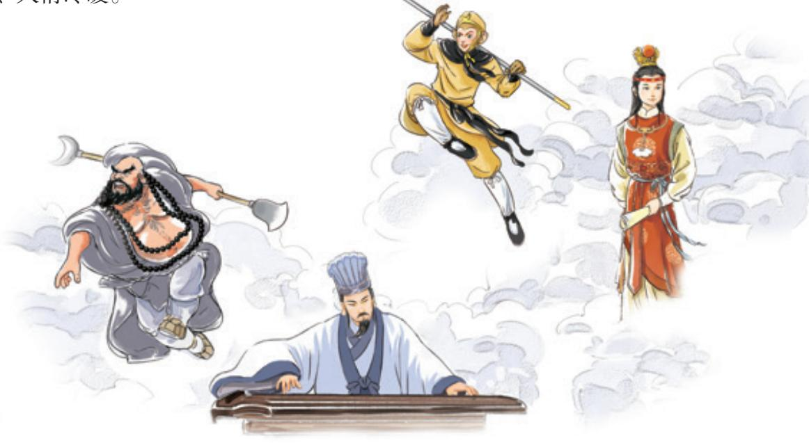

# 第二三单元

横竖撇捺有乾坤，一笔一画成文章。

步部都尉祖又鳳 侯相个城西部都

2 JA 禁也适个 坐少土国 照献 只願火氣廿鮮火冬上馨高脯 国靠移社 宗帝 不下舞 新工群 世 K 5 胡超

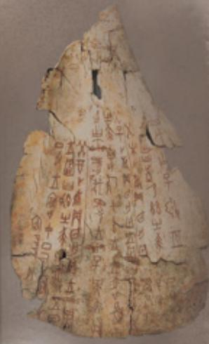

感受汉字的趣味，了解汉字文化。

学习搜集资料的基本方法。

学写简单的研究报告。

# 综合性学习：遨游汉字王国

我们平时读书、看报、写文章，都离不开汉字。你对汉字有哪些了解?

汉字产生于几千年前，是世界上最古老的文字之一，经历了漫长的演变过程，沿用至今。

汉字是世界上使用人口最多的文字之一，曾对周边一些国家的文化产生过重要影响。

汉字书法是一门独特的艺术。古往今来，我国涌现了许多著名的书法家，他们的书法作品是艺术中的珍品。

你一定想更多地了解汉字吧！让我们开展综合性学习活动，一起遨游汉字王国，感受汉字的趣味，了解汉字文化，并为汉字的规范使用做一些力所能及的事情。

# 汉字真有趣

## 活动建议

自由组成小组，讨论可以从哪些方面了解汉字。从下面的内容中选择一项，制订活动计划，根据计划开展活动。“阅读材料”供参考。

搜集字谜，开展猜字谜活动。

搜集体现汉字特点的古诗、歇后语、对联、故事等资料，办次趣味汉字交流会。

## 搜集资料

## 查找图书

1.在学校阅览室、图书馆或书店，可以按类别找书。如，搜集汉字故事，可以到语言类或文化类的书架上去找。

2.书名、目录、内容简介等，能帮助我们大致判断书中是否有自己需要的内容。

## 网络搜索

1.在网上搜集资料，关键词很重要。如，搜集汉字故事，可以检索关键词“汉字故事”，不能仅仅检索“故事”。

2.检索后的条目很多，可以根据题目、显示的内容等，判断哪些是需要的资料。

## & 请教别人

1.想想谁可能会有自己需要的资料。

2.想好问题，请教合适的人。

## 阅读材料

## 1字谜七则

① 画时圆，写时方。冬时短，夏时长。

②一块土，两人站，中间隔条线，两人看不见。

③有人不是我，有马飞跑过，有水能养鱼，有土庄稼活。

④右边有，左边无。后面有，前面无。哥哥有，弟弟无。周家有，李家无。

5

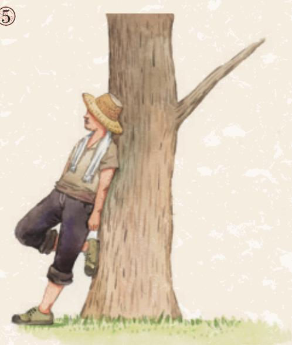

⑥

相传唐伯虎曾在街头卖画。一天，他挂出一幅水墨画，上面画着一只黑狗，十分可爱。唐伯虎对人们说：“这是一则字谜，想购买者，需要付三十两银子，如果猜中谜语，就分文不收。”大半天过去了，无人猜中。这时，有位年轻人说：“我猜中了。”唐伯虎请他说出谜底，他却笑而不答，取下画来便走。

唐伯虎望着这位年轻人的背影，哈哈一笑，说：“猜中了！他猜中了！”

你能猜出这是什么字吗？

# 2门内添“活”字

传说东汉时的杨修是猜谜高手。有一次，曹操命人造一座花园，花园造好之后，曹操去看，也没说好坏，随手在花园的门上写了一个“活”字。众人不解其意，于是去请教杨修。杨修心领神会，对众人说：“门内添活’字，乃阔’字也，丞相是嫌你们把花园的门造得太宽大了。”众人听后便把花园的门重修了，曹操见后非常高兴。

## 3有意思的谐音

外甥打灯笼 -照旧（舅）

◎梁山泊的军师—无（吴）用

四月的冰河——开动（冻）了

咸菜烧豆腐——有言（盐）在先

隔着门缝吹喇叭—名（鸣）声在外

## 4“枇杷”和“琵琶”

古时候，有人送枇杷给朋友，可他在礼单上把“枇杷”错写成了“琵琶”。朋友笑道：“枇杷’不是此‘琵琶’，只恨当年识字差！”旁边有人应声道：“若使琵琶能结果，满城箫管尽开花。”

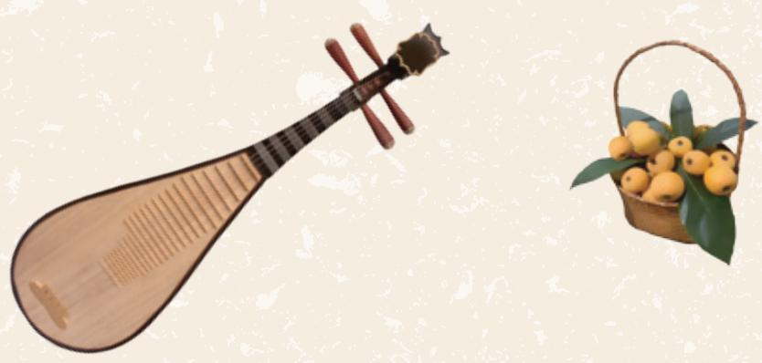

# 人民教育出版社

## 5有趣的形声字

在汉字王国里，形声字是重要的一员。数千年来，我们的祖先不断地创造形声字，光是在甲骨文中，就有许多象形字向形声字演变的例子。

品。这是星星的“星”。天上三光日月星，在甲骨文里，日和月都只用一个形体来表示，星星的特点是数量多，所以一开始用三个相同的形体来表示，以便跟日、月相区别。但问题是，这些简单的形体能表示的事物太多了三块石头、三个拳头…谁说一定就是星星呢？于是，古人就在原来的字形上加了一个声符“生”。强化了字音，就能把“星”和其他事物区分开来了。

这是凤凰的“凤”，繁体字写作“鳳”。凤凰是古代传说中的神鸟，它的样子有点儿像今天的孔雀，头上有冠，身后拖着漂亮的长尾巴。尽管如此，表示“凤”与表示其他鸟的字形也较难分清。古人想出了办法：在原来的字形上增加了一个部件“凡”，用来标示字音。这样一来，“凤”字有了声符凡”，原来的象形字就变成了形符，是不是象凤凰之形，已经变得不重要了

“星”和“凤”有共同的特点：它们原来都是象形字，有着鲜明的图画文字特征。汉字毕竟不是绘画，而是文字符号，字形经过演变，象形的特征一旦弱化，就不容易辨认出来了。因此，古人在象形字的基础上增加声符，创造了新的形声字。

还有一种形声字，是在象形字的基础上增加形符创造出来的。

你猜到了吗？这是蜀国的“蜀”。相传古蜀国有一位先祖，名叫蚕丛，是养蚕的专家。“蜀”字最开始就是蚕的象形，上部像蚕首，下部像蚕蜷曲的身子。但这个字与其他象形字的区分度还不够大，古人给它增加了一个部件“虫”，强化了它的类别。有了“虫”充当形符，原来的象形字就自然而然变为声符了。

， 你看出来了吗？这是祭祀的“祭”。最早的字形描述古代的血祭，画的是一只手杀牲祭祀，把血滴在盆里。后来古人觉得这样表意还不够充分，就给它增加了表示祭祀的部件“示”。这样，就产生了一个“示”充当形符、原来的象形字变为声符的形声字。

形声字是不是很有趣?

本文作者王宁，选作课文时有改动。

我爱你，汉字

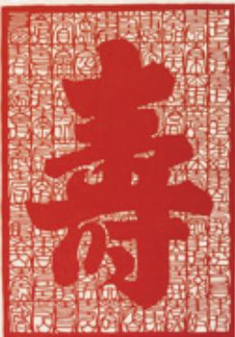

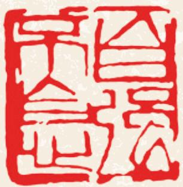

印章

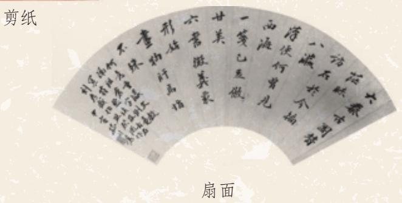

## 活动建议

汉字有着悠久的历史，蕴含着丰富的文化。我们每天都在学习和使用汉字，应该增进对汉字的了解，为汉字的规范使用做一些力所能及的事情。从下面的内容中选择一项开展活动，写一份简单的研究报告。“阅读材料”供参考。

搜集更多的资料，围绕汉字历史、汉字书法或其他感兴趣的与汉字有关的内容，开展简单的研究。

调查同学的作业本、街头招牌、书籍报刊等，围绕生活中用字不规范的情况，开展简单的研究。

## 阅读材料

## 1汉字字体的演变

<table><tr><td rowspan=1 colspan=1>甲骨文</td><td rowspan=1 colspan=1>曰</td><td rowspan=1 colspan=1>D</td><td rowspan=1 colspan=1></td><td rowspan=1 colspan=1>断</td></tr><tr><td rowspan=1 colspan=1>金文</td><td rowspan=1 colspan=1>Θ</td><td rowspan=1 colspan=1>D</td><td rowspan=1 colspan=1>鞋</td><td rowspan=1 colspan=1>案</td></tr><tr><td rowspan=1 colspan=1>小篆</td><td rowspan=1 colspan=1>日</td><td rowspan=1 colspan=1>き</td><td rowspan=1 colspan=1>車</td><td rowspan=1 colspan=1>馬</td></tr><tr><td rowspan=1 colspan=1>隶书</td><td rowspan=1 colspan=1>曰</td><td rowspan=1 colspan=1>月</td><td rowspan=1 colspan=1>車</td><td rowspan=1 colspan=1>馬</td></tr><tr><td rowspan=1 colspan=1>楷书</td><td rowspan=1 colspan=1>日</td><td rowspan=1 colspan=1>月</td><td rowspan=1 colspan=1>車</td><td rowspan=1 colspan=1>馬</td></tr></table>

汉字已经有三四千年的历史。在漫长的发展演变过程中，字体发生了很大变化，其中以甲骨文、金文、小篆、隶书、楷书五种字体最为典型。

甲骨文是刻在龟甲或兽骨上的文字，主要在商周时期使用，它是我们目前所能见到的最早的成熟汉字。已经出土的单字有四千多个，其中已经认出的有一千多个，主要记录祭祀、战争、狩猎、农事、气象等内容。字形的象形性较强，写法也不固定，如，“田”字可以写作田、田、由、田、囲、曲。由于是刀刻，字的线条比较纤细。

金文是铸刻在铜器上的文字，主要在商周时期使用。字的线条粗壮，早期部分字形的象形性还很明显，西周晚期之后，字形逐渐规整、美观。有些字形繁简差别很大，如，“车”字早期一般写作猫、事、、，看上去很烦琐，中晚期一般写作、車，与现在的繁体字“車”差别不大。

小篆是从战国时期的秦国文字发展而来的，秦统一全国后得到推行，成为我国最早的统一的文字。小篆字形结构稳定，线条圆转，粗细基本一致，象形意本文是自编课文。 木文是白编课文

味不明显。今天的书法作品，特别是印章中仍然较多地使用这种字体。

隶书形成于战国晚期，通行于两汉。它将篆书圆转的线条改为直笔或方笔，象形意味已基本消失，笔画简化，书写方便，汉字的点、横、竖、撇、捺等基本笔画已经形成，成为汉字发展史上的分水岭。

魏晋时期有了楷书。“楷”是规矩、楷模的意思。楷书字形方正，笔画规整平直，比隶书更加便于书写和认读。进入南北朝之后，楷书成为占主导地位的字体，一直通行至今。

## 2甲骨文的发现

十九世纪七八十年代，河南安阳小屯村的村民在田间劳作时，发现一些带有刻痕的龟甲、兽骨，称它们为龙骨。他们不知道这是古代的遗物，将较大的龙骨卖给了药铺，将小的龙骨丢弃了。药铺将龙骨碾成粉末用作治疗创伤的药材。龙骨上的刻痕因无人知道是极有价值的殷商时期的刀刻文字，而常被村民打磨掉。

1899年，一次偶然的机会，这些龟甲、兽骨上的刻痕，引起了清代国子监①主管官员王懿荣的注意。王懿荣平时酷爱收藏古董，精通金石之学②。经过仔细研究，他认为这些龙骨上的刻痕是一种比篆书更早的文字。

后来，人们把刻在龟甲或兽骨上的文字叫作甲骨文，我国学术领域由此又多了一门新学科，叫“甲骨学”。

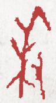

(秉）

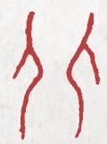

(北)

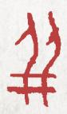

(并）

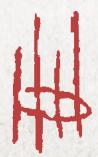

（册）

## 3书法欣赏

天地玄賓宇宙涅蕉日自登吳唇宿知張定來暑性秋收太藏問拜成歲律呂調均雲騰致為露結為需主生麗水玉出崐園鞠編主闕珠稱

明代文征明行草《千字文》(局部)

天地玄黃宇宙洪氣曰盈吳辰宿列張寒來暑注秋收冬蔵門餘反歲律名謫陽雲騰殘雨露結為霜金生麗水玉出崐崗號

南朝智永楷书《千字文》（局部）唐代怀素草书《千字文》（局部）

天地玄黄，宇宙洪荒。日月盈昃，辰宿列张。寒来暑往，秋收冬藏。闰余成岁，律吕调阳。云腾致雨，露结为霜。金生丽水，玉出昆冈。剑号巨阙，珠称夜光。果珍李柰，菜重芥姜。

## 4 制定国家通用语言文字法的必要性①

我国是一个多民族、多语言、多文种的国家，……制定国家通用语言文字法，用法律的形式确定普通话和规范汉字作为国家通用语言文字的地位，规定国家通用语言文字的使用范围，有利于语言文字的社会应用，有利于各民族之间的交往有利于促进民族团结，维护国家统一。

## 5关于“李”姓的历史和现状的研究报告

## 一、问题的提出

我们学校有不少同学姓李，我有好几个邻居也姓李。“李”姓是怎么来的？历史上姓李的名人有哪些？现在的“李”姓是不是我国人口最多的姓氏？带着这些问题，我对“李”姓的历史和现状作了一次研究。

## 二、研究方法

1.查阅书籍和报刊。

2.询问身边的人。

3.其他方法。

## 三、资料整理

<table><tr><td rowspan=1 colspan=1>类别</td><td rowspan=1 colspan=1>内容</td></tr><tr><td rowspan=1 colspan=1>来源</td><td rowspan=1 colspan=1>传说皋陶曾任尧帝的大理官（掌管刑罚的官职），其子孙以官名“理”为姓氏。后来的“李”姓大多来源于此。唐代时，“李”为国姓。一些姓徐、安、杜、郭、麻、鲜于的武将，因立功被皇帝赐“李”姓。</td></tr><tr><td rowspan=1 colspan=1>历史名人</td><td rowspan=1 colspan=1>战国时期的李冰父子主持修建了都江堰水利工程；汉代的李广抗击匈奴，威名远扬；隋代的李春是著名的桥梁专家，举世闻名的赵州桥就是他设计并参加建造的；唐代的李白被誉为“诗仙”；宋代的李清照是一</td></tr></table>

研究报告的标题要体现研究的主要内容。

续表
<table><tr><td rowspan=1 colspan=1>类别</td><td rowspan=1 colspan=1>内容</td></tr><tr><td rowspan=1 colspan=1>历史名人</td><td rowspan=1 colspan=1>位词人，有“千古第一才女”之称；明代的李时珍编写了我国古代药物学巨著《本草纲目》；近现代的李大钊是中国共产党的创始人之一……</td></tr><tr><td rowspan=1 colspan=1>现状</td><td rowspan=1 colspan=1>据统计，2018年全国户籍人口中，王、李、张、刘、陈五个姓氏的数量占据前五名。其中，“王”姓和“李”姓的数量均超过一亿，并且“王”姓比“李”姓略多。</td></tr></table>

## 四、研究结论

1. 传说，“李”姓来源于上古时代的官名。唐代时，有些姓氏改为“李”姓，这可能为后来“李”姓人口的增长奠定了基础。

2. 历史上，“李”姓名人辈出。有水利专家李冰父子、军事将领李广、桥梁专家李春、“诗仙”李白、词人李清照、医药学家李时珍、革命先驱李大钊……他们在各个领域都闪耀着光芒。

3.2018年，我国户籍人口最多的姓氏是“王”姓，“李”姓排名第二。

這份研究报告给了我许多启发……

第四单元

苟利国家生死以，岂因祸福避趋之。—清]林则徐

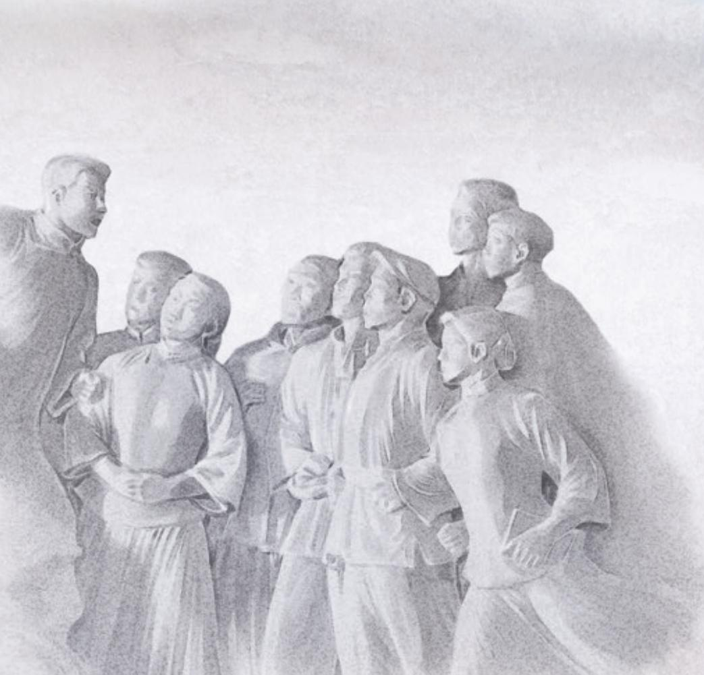

通过课文中动作、语言、神态的描写，体会人物的内心。

尝试运用动作、语言、神态描写，表现人物的内心。

# ⑨ 古诗三首

## 从军行①

[唐]王昌龄

青海长云暗雪山，孤城遥望玉门关®。黄沙百战穿金甲，不破楼兰终不还。

## 秋夜将晓出篱门迎凉有感

[宋]陆游

## 注释

三万里河东入海，rèn yuè五千仞岳上摩天。遗民泪尽胡尘里，南望王师又一年。

③〔楼兰〕西域古国名，这里泛指西域地区的各部族政权。

①〔从军行〕乐府曲名，内容多写边塞情况和战士的生活。

②〔玉门关〕古关名，故址在 今甘肃敦煌西北。

## 注释

①〔三万里河〕指黄河。“三万里”形容很长。

②〔五千仞岳〕指华山。“仞”， 长度单位。“五千仞”形 容很高。

③〔摩天〕碰到天，形容极高。

④〔遗民]指在金统治地区的原宋朝百姓。

⑤〔胡尘〕指金统治地区的风沙，这里借指金政权。

⑥〔王师〕指南宋朝廷的军队。

# 闻官军收河南河北

[唐]杜甫

剑外忽传收蓟北， tì cháng   
初闻涕泪满衣裳。   
却看何在，   
漫卷诗书喜欲狂。   
白日放歌须纵酒，   
青春作伴好还乡。   
即从巴峡穿巫峡， xiāng   
便下襄阳向洛阳。

注释

①〔剑外〕指作者所在的蜀地。

②〔蓟北〕泛指唐朝蓟州北部 地区，当时是叛军盘踞 的地方。

③〔却看〕回头看。

④〔妻子〕妻子和孩子。

⑤〔青春〕指春天。

## 仞岳蓟涕裳襄

## 篱仞岳摩遗涕巫

有感情地朗读课文。背诵课文。默写《从军行》《秋夜将晓出篱门迎凉有感》。

借助注释，说说下面诗句的意思，再想想它们表达了诗人怎样的感情。

黄沙百战穿金甲，不破楼兰终不还。

◇ 遗民泪尽胡尘里，南望王师又一年。

白日放歌须纵酒，青春作伴好还乡。

# 10 青山处处埋忠骨

中南海，毛主席的卧室。

写字台上，放着那封从朝鲜前线志愿军司令部发来的，由司令员péng nǐ彭德怀拟定的电报。

móu

我们今日7时已进入防空洞，毛岸英同3个参谋在房子内。11时敌机4架经过时，他们4人已出来。敌机过后，他们4人返回房子内，忽又来敌机4架，投下近百枚燃烧弹，命中房子，当时有二名参谋跑出，毛岸英及高瑞欣未及跑出被烧死。其他无损失。

从见到这封电报起，毛主席整整一天没说一句话，只是一支接着一支地吸着烟。桌子上的饭菜已经热了几次。岸英是毛主席最心爱的长子，毛主席在他身上倾注了无限的父爱。当年，地下党的同志们冒着生命危险找到了岸英，把他送到毛主席身边。后来岸英去苏联留学，回国后毛主席又亲自把爱子送到农村锻炼。那一次次的分离，岸英不都平平安安回到自己的身边来了吗？这次怎么会……“岸英！岸英！”毛主席用食指按着紧锁的眉头，情不自禁地喃喃着。

一

秘书走了进来。

“主席，志愿军司令部来电请示中央军委，是否将岸英的遗骨运回国内。”秘书凑近毛主席，轻声说，“朝鲜方面向主席表示慰问，说岸英同志是为朝鲜人民的解放事业牺牲的，也是朝鲜人民的儿子，请求把岸英安葬在朝鲜。”

毛主席不由自主地站了起来，仰起头，望着天花板，强忍着心中fù  
的悲痛，目光中流露出无限的眷恋。岸英奔赴朝鲜时，他因为工作  
繁忙，未能见上一面，谁知竟成了永别！“儿子活着不能相见，就让我  
见见遗骨吧！”毛主席想。然而，他很快打消了这种念头。他若有所

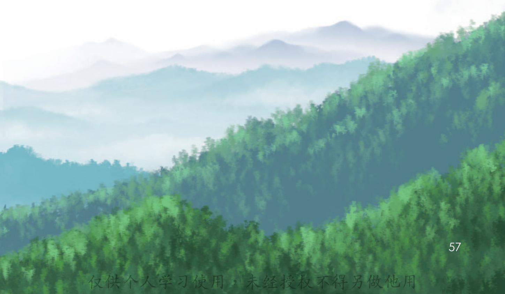

思地说道：“哪个战士的血肉之躯不是父母所生？不能因为我是主席，shū就要搞特殊。不是有千千万万志愿军烈士安葬在朝鲜吗？岸英是我的儿子，也是朝鲜人民的儿子，就尊重朝鲜人民的意愿吧。”

chóu

秘书将电报记录稿交毛主席签字的一瞬间，毛主席下意识地踌chú躇了一会儿，那神情分明在说，难道岸英真的回不来了？父子真的不àn能相见了？毛主席黯然的目光转向窗外，右手指指写字台，示意秘书将电报记录稿放在上面。

第二天早上，秘书来到毛主席的卧室。毛主席已经出去了，签过字的电报记录稿被放在了枕头上，下面是被泪水打湿的枕巾。

青山处处埋忠骨，何须马革裹尸还。

## 彭拟谋赴殊踌躇黯革

彭拟谋瑞锻炼眷赴

搞殊尊签踌躇革

默读课文，说说课文的两个部分分别写了什么内容。

从课文中找出描写毛主席动作、语言、神态的语句，体会他的内心世界，再有感情地朗读课文。

在抗美援朝战争中，无数英雄儿女为了保家卫国浴血奋战，他们被称为“最可爱的人”。查找资料，结合这些人物的故事，说说你对“青山处处埋忠骨，何须马革裹尸还”的理解。

# 11 军神

wò

重庆临江门外，一个德国人开设的诊所里，医生沃克端坐在桌后。他头也不抬，冷冷地问：“你叫什么名字？”

“刘大川。”

“年龄？”

“二十四岁。”

“什么病？”fěi

“土匪打伤了眼睛。”

沃克医生站起身，熟练bēng地解开病人右眼上的绷带。他愣住了，蓝色的眼睛里闪出一丝惊疑。他重新审视着眼前这个人，冷冷地问：“你是干什么的？”

“邮局职员。”

“你是军人！”沃克医生

一针见血地说，“我当过军医，这么重的伤势，只有军人才能这样从容镇定！”

病人微微一笑，说：“沃克医生，你说我是军人，我就是军人吧。”

沃克医生的目光柔和下来，他吩咐护士：“准备手术。”

沃克医生正在换手术服，护土跑来，低声告诉他病人拒绝使用麻醉剂。沃克医生的眉毛扬了起来，他走进手术室，生气地说：“年轻人，在这儿要听医生的指挥！”

病人平静地回答：“沃克医生，眼睛离脑子太近，我担心施行麻醉会影响脑神经。而我，今后需要一个非常清醒的大脑！”

沃克医生再一次愣住了，竟有点儿口吃地说：“你，你能忍受吗？你的右眼需要摘除坏死的眼球，把烂肉和新生的息肉一刀刀割掉！”

“试试看吧。”

手术台上，一向从容镇定的沃克医生，这次双手却有些颤抖。他额上汗珠滚滚，护士帮他擦了一次又一次。最后他忍不住开口对病人说：“你挺不住可以哼叫。”

病人一声不吭，他双手紧紧抓住身下的白床单，手背青筋暴起，汗如雨下。他越来越使劲，崭新的白床单居然被抓破了。

zhōng

脱去手术服的沃克医生擦着汗走过来，由衷地说：“年轻人，我真担心你会晕过去。”

病人脸色苍白。他勉力一笑，说：“我一直在数你的刀数。”

沃克医生吓了一跳，不相信地问：“我割了多少刀？”

“七十二刀。”

沃克医生惊呆了，大声嚷道：“你是一个真正的男子汉，一块kān会说话的钢板！你堪称军神！”

“你过奖了。”

沃克医生的脸上浮现出慈祥的神情。他想说什么又忍住了，挥手让护士出去，然后关上手术室的门，注视着病人，说：“告诉我，

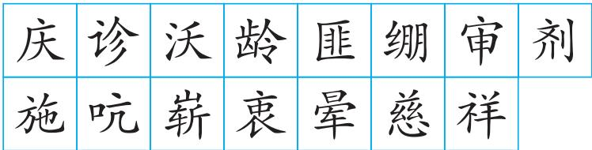

你的真名叫什么？”

“刘伯承。”

沃克医生肃然起敬：“啊，久仰久仰，认识你很荣幸。”刘伯承友好地把手伸了过去。

## 沃匪绷衷堪

朗读课文，注意读出人物说话的语气。

沃克医生是怎么发现刘伯承是军人的？后来为什么称他为“军神”？

从下面的句子中体会刘伯承的内心，再有感情地朗读。

病人微微一笑，说：“沃克医生，你说我是军人，我就是军人吧。”

病人一声不吭，他双手紧紧抓住身下的白床单，手背青筋暴起，汗如雨下。他越来越使劲，崭新的白床单居然被抓破了。

从课文中找出对沃克医生动作、语言、神态的描写，体会他的内心变化，再以他的口吻讲讲这个故事。

## 阅读链接

## 丰碑

红军队伍在冰天雪地里艰难地前进。严寒把群山冻成了一个大冰坨。狂风呼啸，大雪纷飞，似乎要吞掉这支装备很差的队伍。

军长早把他的马让给了重伤员。他率领战士们向前挺进，在冰雪中为后续部队开辟一条通路。等待着他们的将是恶劣的环境和残酷的战斗，可能三天两头吃不上饭，可能睡雪窝，可能一天要走一百多里路，可能遭到敌人的突然袭击。这支队伍能不能经受住这样严峻的考验呢？军长思索着……

队伍忽然放慢了行军的速度，前面有许多人围在一起，不知在干什么。

军长边走边喊：“不要停下来，快速前进！”

“……前面……有人冻死了……”警卫员跑回来告诉他。

军长愣了一下，什么话也没说，快步朝前走去。风雪太大了。他步履有些跟跑，眼睛有点儿迷离。

一位冻僵的老战士，倚靠一棵光秃秃的树干坐着，一动不动，好似一尊塑像。他浑身都落满了雪，无法辨认他的面目，但可以看出，他的神态十分镇定，十分安详：右手的中指和食指间还夹着半截纸卷的旱烟火已被雪打灭；左手微微向前伸着，好像在向战友借火。单薄破旧的衣服紧紧地贴在他的身上。

军长的脸上顿时阴云密布，嘴角的肌肉抽动了一下。他忽然转过脸向身边的人吼道：“叫军需处长来！”

一阵呼啸的狂风淹没了军长的话音。没有人回答他，也没有人走开。他红着眼睛，像一头发怒的豹子，样子十分可怕。

“听见没有？警卫员！叫军需处长跑步过来！”军长两腮的肌肉抖动着，不知是由于冷，还是由于愤怒。

终于，有人小声告诉军长：“他就是军需处长……”

军长愣住了，他怔怔地伫立了足有一分钟。雪花无声地落在他的眼睑上，融化成了闪烁的泪珠…他深深地呼了一口气，缓缓地举起右手，举到齐眉处，向那位跟巍巍群山化为一体的牺牲者敬了一个军礼。

风更狂了，雪更大了。大雪很快覆盖了军需处长的身体，他成了一座晶莹的丰碑。

本文作者李本深，选用时有改动

# ①2 清贫

默读课文，说说你从方志敏的自述中体会到他怎样的品质，再和同学交流你对“清贫”的理解。

我从事革命斗争，已经十余年了。在这长期的奋斗中，我一向是过着朴素的生活，从没有奢侈过。经手的款项，总在数百万元；但为chóu革命而筹集的金钱，是一点一滴都用之于革命事业的。这在国方的伟jīn人们①看来，颇似奇迹，或认为夸张；而矜持不苟，舍己为公，却是每个共产党员具备的美德。所以，如果有人问我身边有没有一些积蓄，那我可以告诉你一桩趣事。

就在我被俘的那一天—一个最不幸的日子，有两个国方兵士在树林中发现了我，而且猜到了我是什么人，他们满肚子热望在我zhuó身上搜出一千或八百大洋，或者搜出一些金镯金戒指一类的东西，发个意外之财。哪知道从我上身摸到下身，从袄领捏到袜底，除了一只时表和一支自来水笔，一个铜板都没有搜出。他们于是被激怒了，猜疑我是把钱藏在哪里，不肯拿出来。他们之中有一个，左手拿着一个木柄榴弹，右手拉出榴弹中的引线，双脚拉开一步，做出要抛掷的姿hè势，用凶恶的眼光盯着我，威吓地吼道：

“赶快将钱拿出来，不然就是一炸弹，把你炸死去！”

“哼！你不要做出那难看的样子来吧！我确实一个铜板都没有存，想从我这里发洋财，是想错了。”我微笑着，淡淡地说。

“你骗谁！像你这样当大官的人会没有钱！”拿榴弹的兵士坚决不相信。

“绝不会没有钱的，一定是藏在哪里，我是老出门的，骗不得dāng我。”另一个兵士一面说，一面弓着背将我的衣角裤裆过细地捏，总qǐ企望着有新的发现。

“你们要相信我的话，不要瞎忙吧！我不比你们国民党当官，个个都有钱，我今天确实是一个铜板也没有，我们革命不是为着发财！”我再次向他们解释。

等他们确知在我身上搜不出什么的时候，也就停手不搜了；又在我藏躲的地方周围，低头注目搜寻了一番，也毫无所得。他们是多么失望啊！那个持弹欲放的兵士，也将拉着的引线，仍旧塞进榴弹的木柄里，转过来抢夺我的表和水笔。后来彼此说定表和笔卖出钱来平分，才算无话。他们用怀疑而又惊异的目光，对我自上而下地望了几遍，就同声命令：“走吧！”

是不是还要问问我家里有没有一些财产？请等一下，让我想一想，啊，记起来了，有的有的，但不算多。去年暑天我穿的几套旧guà wù的汗褂裤，与几双缝上底的线袜，已交给我的妻放在深山坞里保藏着—怕国军①进攻时，被人抢了去，准备今年暑天拿出来再穿；那些就算是我唯一的财产了。但我说出那几件“传世宝”来，岂不要叫那些富翁们齿冷三天？！

清贫，洁白朴素的生活，正是我们革命者能够战胜许多困难的地方！

一九三五年五月二十六日写于囚室

## 筹矜俘镯吓裆企彼褂坞

## 他 了

生活中，谁陶醉、生气或伤心时的样子让你印象深刻？把题目补充完整，如“他陶醉了”“他生气了”“他伤心了”。回想一下，当时发生了什么事？事情的前因后果是什么？把这件事写下来，特别要把这个人当时的表现写具体，反映出他的内心。

读下面这个片段，注意它是怎样把这个人当时的表现写具体的。

他的眼睛闪着奇异的光芒，面孔因为激动而涨得通红，嘴里不停地说：“太美了！真是太美了！”他根本没听见周围喧闹的声音，整个世界对他来说好像都消失了。一个小时过去了，两个小时过去了，他痴痴地站在那里，一动不动地凝望着这座雕像…

我们可以从多个角度写一个人当时的表现，如：

◇ 他的面部表情是怎样的？眼神与平时一样吗？

◇他有哪些不寻常的举动？

◇ 他说了哪些话？说话时的语气是怎样的？

写好后，和同学交流，看看有没有把人物当时的表现写具体，反映出他的内心，然后对不满意的地方进行修改。

# 语文园地

## 交流平台

抓住人物的动作、语言、神态，体会人物的内心，可以加深对课文内容的理解，是一种很好的阅读方法。

如《军神》一文，从刘伯承平静地回答沃克医生的话“眼睛离脑子太近，我担心施行麻醉会影响脑神经。而我，今后需要一个非常清醒的大脑”，我们可以感受到刘伯承顽强的意志和坚定的信念。

此外，课文着力刻画了沃克医生的一系列变化，从“冷冷地问”到“目光柔和下来”，再到“脸上浮现出慈祥的神情”，我们能感受到他对刘伯承从冷漠到赞许、钦佩的内心变化。

## 词句段运用

读下面的句子，体会人物的内心，再选择一种情景，照样子写一写。

从见到这封电报起，毛主席整整一天没说一句话，只是一支接着一支地吸着烟。

◇ 黄继光愤怒地注视着敌人的火力点，他转过身来坚定地对营参谋长说：“参谋长，请把这个任务交给我吧！”

将军看了看他们桌子上的罐头，喉咙哽了一下，说：“同志们………”停了一下，又说：“孩子们，我给大家分菜，每人一筷子。”

焦急地等人

期待落空

久别重逢

下面的句子写出了人物与平时不同的表现，体会它们的表达效果，照样子说一说。

◇ 手术台上，一向从容镇定的沃克医生，这次双手却有些颤抖。他额上汗珠滚滚，护士帮他擦了一次又一次。

平时遇到不顺心的事我都能一笑而过，可是这件事让我实在无法释然，胸口总像是被什么堵住了似的，白天心神不宁，晚上也无法入睡。

## 书写提示

标题和作者要写在醒目的位置。

段落要分明。

我愿意看见一只只白帆。

在帆的上面，是飘动的白云和天空，在帆的下面，是温暖的船舱；在那里，生活不是僵硬的，而是在不停地流动和飘荡。

我愿意看见一只只白帆。

无论在小河，在大江，还是在海洋，它都在前进，在和风浪搏斗。在每一片鼓满风的帆里，都藏着一个美丽的幻想

我愿意看见一只只白帆。我愿我们的生活像一只只白帆，永远寻求不冻的港。

## 日积月累

## 凉州词

[唐]王之涣

黄河远上白云间，一片孤城万仞山。羌笛何须怨杨柳，春风不度玉门关。

# 黄鹤楼送孟浩然之广陵

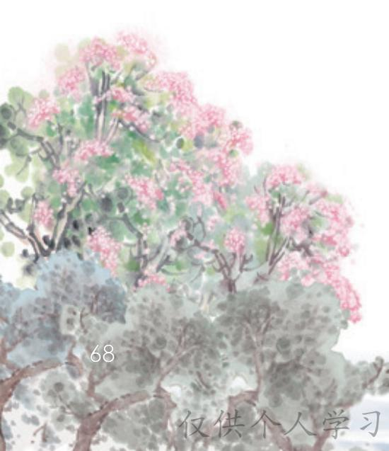

[唐]李白

故人西辞黄鹤楼，烟花三月下扬州。孤帆远影碧空尽，唯见长江天际流。

# 第五单元

字里行间众生相，大千世界你我他。

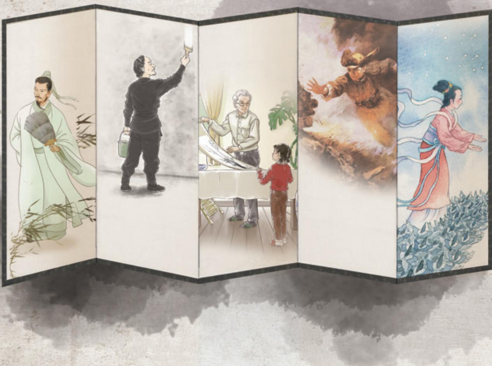

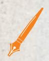

学习描写人物的基本方法。

初步运用描写人物的基本方法，具体地表现一个人的特点。

# ①③ 人物描写一组

## 摔跤①

“要不——摔跤。”

“是吗？”小胖墩儿跳起来，立刻退后两步，一闪身脱了单褂儿，叉着腰说，“来吧，是一叉一搂的，还是随便摔？”

小嘎子在家里跟人摔跤，一向仗着手疾眼快，从不单凭力气，  
自然不跟他一叉一搂。两人把“枪”和“鞭”放在门墩儿上，各自qiān  
虎势儿一站，公鸡鹐架似的对起阵来。起初，小嘎子精神抖擞，欺  
负对手傻大黑粗，动转不灵，围着他猴儿似的蹦来蹦去，总想使巧bàn  
招，下冷绊子，仿佛很占了上风。可是小胖墩儿也是个摔跤的惯  
手，塌着腰，合了裆，鼓着眼珠子，不露一点儿破绽。两人走马  
灯似的转了三四圈，终于三抓两jiū  
挠，揪在了一起。这一来，小嘎  
子可上了当：小胖墩儿膀大腰粗，  
一身牛劲儿，任你怎样推拉拽顶，bān  
硬是扳他不动。小嘎子已有些沉wàn  
不住气，刚想用脚腕子去钩他的  
腿，不料反给他把脚别住了。小  
胖墩儿趁势往旁侧里一推，咕咚  
一声，小嘎子摔了个仰面朝天。

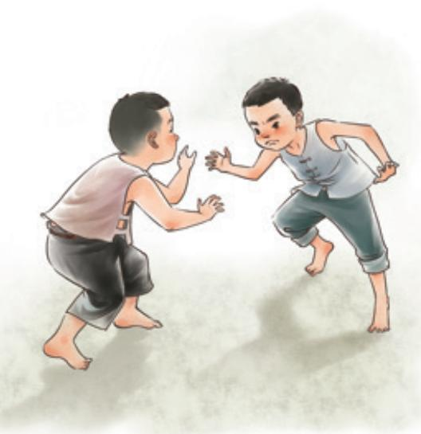

## 他像一棵挺脱的树①

他的身量与筋肉都发展到年岁前边去了。二十来岁，他已经很大很高，虽然zhù肢体还没被年月铸成一定的格局，可是已经像个成人了一个脸上身上都带出天真淘气的样子的大人。看着那高等的车夫，他计划着怎样杀进他的腰去，好更显出他的铁扇面似的胸与直硬的背。扭头看看自己的肩，多么宽，多么威严！杀好了腰，再穿上肥腿的白裤，裤脚用鸡肠子带儿系住，露出那对“出号”的大脚！是的，他无疑可以成为最出色的车夫，傻子似的他自己笑了。

他没有什么模样，使他可爱的是脸上的精神。头不很大，圆眼，肉鼻子，两条眉很短很粗，头上永远剃得发亮；腮上没有多余的肉，脖子可是几乎与头一边儿粗；脸上永远红扑扑的，特别亮的quán bā是颧骨与右耳之间一块不小的疤—小时候在树下睡觉，被驴啃了一口。他不甚注意他的模样，他爱自己的脸正如同他爱自己的身体，都那么结实硬棒，他把脸仿佛算在四肢之内，只要硬棒就好。是的，到城里以后，他还能头朝下，倒着立半天。这样立着，他觉得，他就很像一棵树，上下没有一个地方不挺脱的。

# 两茎灯草①

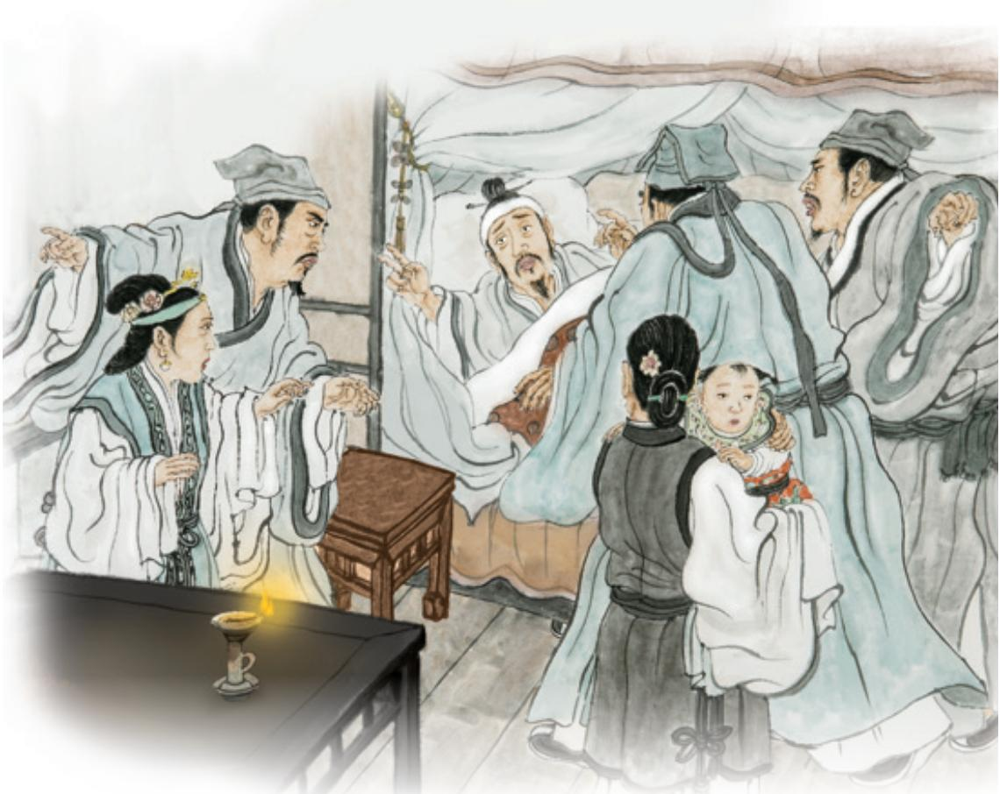

un自此，严监生②的病，一日重似一日，再不回头。诸亲六眷都zhí  
来问候。五个侄子穿梭的③过来陪郎中弄药。到中秋已后，医家都  
不下药了。把管庄的家人都从乡里叫了上来。病重得一连三天不能tán  
说话。晚间挤了一屋的人，桌上点着一盏灯。严监生喉咙里痰响  
得一进一出，一声不倒一声④的，总不得断气，还把手从被单里拿

出来，伸着两个指头。大侄子走上前来问道：“二叔，你莫不是还有两个亲人不曾见面？”他就把头摇了两三摇。二侄子走上前来问道：“二叔，莫不是还有两笔银子在那里，不曾吩咐明白？”他把两眼睁的的溜圆①，把头又狠狠摇了几摇，越发指得紧了。奶妈抱着哥子②插口道：“老爷想是因两位舅爷不在跟前，故此记念。”他听kāi了这话，把眼闭着摇头，那手只是指着不动。赵氏慌忙揩揩眼泪，走近上前道：“爷，别人都说的不相干，只有我晓得你的意思！你是为那灯盏里点的是两茎灯草，不放心，恐费了油。我如今挑掉一茎就是了。”说罢，忙走去挑掉一茎。众人看严监生时，点一点头，把手垂下，登时就没了气。

嘎绊揪扳腕铸颧疤监侄痰揩

跤搂 仗 鞭 欺 挠 扳腕 剃 腮 疤 监 侄 喉咙

默读课文，说说三个片段中的人物分别给你留下了什么印象，你是从哪些语句体会到的。

举例说说三个片段分别用了哪些描写人物的方法，结合课文中的语句，体会这些方法的表达效果。

# ①4 刷子李

刷子李专干粉刷这一行。他要是给您刷好一间屋子，屋里什么都不用放，单坐着，就如同神仙一般快活。最让人叫绝的是，他刷浆时必穿一身黑，干完活，身上绝没有一个白点。别不信！他还给自己立下一个规矩，只要身上有白点，白刷不要钱。

但这是传说，人信也不会全信。行外的没见过的不信，行内的生气愣说不信。

一年的一天，刷子李收个徒弟叫曹小三。当徒弟的开头都是端fù茶、点烟、跟在屁股后边提东西。曹小三当然早就听说过师傅那手绝活，一直半信半疑，这回非要亲眼瞧瞧。

那天，曹小三头一次跟师傅出去干活，到镇南道给姓李的人家  
新造的楼房刷浆。到了那儿，刷子李跟管事的人一谈，曹小三才知  
道师傅派头十足。照他的规矩一天只刷一间屋子。这楼房大小九间fú  
屋，得刷九天。干活前，他把随身带的一个四四方方的小包袱打开

果然一身黑衣黑裤，一双黑布鞋。穿上这身黑，就好像跟地上一桶白浆较上了劲。

一间屋子，一个屋顶四面墙，先刷屋zhàn  
顶后刷墙。屋顶尤其难刷，蘸了稀溜溜粉  
浆的板刷往上一举，谁能一滴不掉？一掉  
准掉在身上。可刷子李一举刷子，就像没

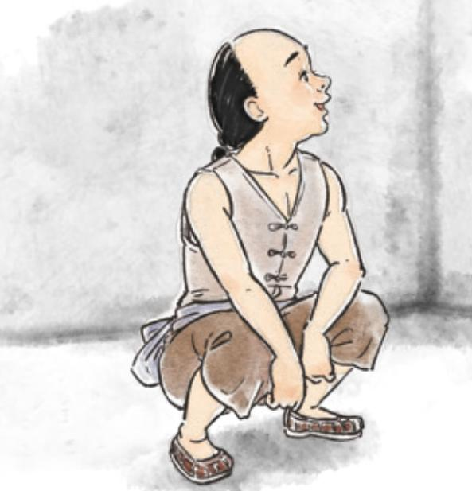

有蘸浆。但刷子划过屋顶，立时匀匀实实一道白，白得透亮，白得清爽。有人说这蘸浆的手法有高招，有人说这调浆的配料有秘方。曹小三哪里看得出来？只见师傅的手臂悠然摆来，悠然摆去，如同伴着鼓点，和着琴音，每一摆刷，那长长的带浆的毛刷便在墙面啪地清脆一响，极是好听。啪啪声里，一道道浆，衔接得天衣无缝，刷过去的墙面，真好比平平整整打开一面雪白的屏障。可是曹小三最关心的还是刷子李身上到底有没有白点。

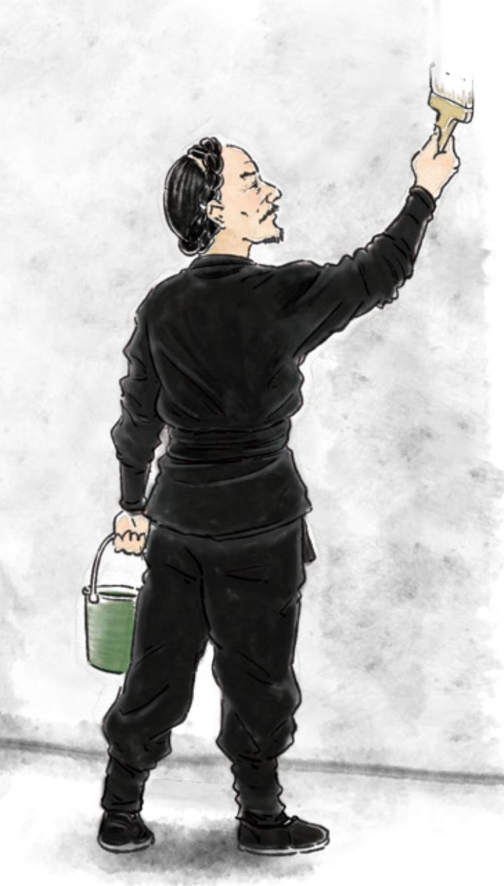

刷子李干活还有一个规矩。每刷完一面墙，必得在凳子上坐一会儿，抽一袋烟，喝一碗茶，再刷下一面墙。此刻，曹小三借着给师傅倒水点烟的机会，拿目光仔细搜索刷子李的全身。每一面墙刷完，他搜索一遍，居然连一个芝麻大小的粉点也没发现。他真觉得这身黑色的衣服有种神shèng圣不可侵犯的威严。

当刷子李刷完最后一面墙，坐下来，曹小三给他点烟时，竟然瞧见刷子李裤子上出现一个白点，黄豆大小。黑中白，比白中黑更扎眼。完了，师傅xiàn露馅儿了，他不是神仙，往日传说中那如山般的形象轰然倒去。他怕师傅难堪，不敢说，也不敢看，可忍不住还要扫一眼。

这时候，刷子李忽然朝他说话：“小三，你瞧见我裤子上的白zhà点了吧？你以为师傅的能耐有假，名气有诈，是吧？傻小子，你再仔细瞧瞧吧

说着，刷子李手指捏着裤子轻轻往上一提，那白点即刻没了，再一松手，白点又出现，奇了！他凑上脸用神再瞧，那白点原来是一个小洞！刚才抽烟时不小心烧的。里边的白衬裤打小洞透出来，看上去就跟粉浆落上去的白点一模一样！

zhèng

刷子李看着曹小三发怔发傻的模样，笑道：“好好学本事吧！”

曹小三学徒的头一天，见到听到学到的，恐怕别人一辈子也不一定能明白呢。

傅袱蘸圣馅诈怔

浆傅袱障芝圣犯

馅轰堪诈傻捏怔

默读课文，结合课文内容，说说刷子李这个人物的特点。

画出描写刷子李和曹小三的语句，体会课文是怎么写出刷子李的特点的。

# 人民教育出版社

## 交流平台

本单元课文中鲜活的人物给我们留下了深刻的印象。要写好一个人物，写出人物的特点，不仅要细致观察，还要了解一些写人的基本方法。

首先，选用典型事例，把它写具体。人与事是分不开的，一个人往往在做事情、与别人相处时，会显出自己的特点，习作时应选择最能表现人物特点的典型事例。如，《两茎灯草》通过写严监生临死时仍惦记节省灯油这件事，表现他的吝啬。

其次，用多种方法表现人物的特点。如，为了表现车夫祥子旺盛的生命力，《他像一棵挺脱的树》细致描写了他结实健美的身体；为了表现小嘎子的机灵，《摔跤》生动刻画了小嘎子的一连串动作。还可以描写人物的神态、语言、心理等，具体地表现人物的特点，使人物的形象更鲜活。

此外，也可以描写周围人的反应，间接写出人物的特点。如，《刷子李》写了曹小三在观察师傅刷墙时，从崇敬到质疑再到崇敬的心理变化，侧面反映出刷子李的高超技艺。

## 初试身手

课间，观察一位同学，试着用学过的方法写一写他。

你的家人有什么特点？想一想可以用哪些典型事例表现他们的特点，列出来和同学交流。

## 习作例文

## 我的朋友容容

课文细致地描写了容容的动作，表现了她取报纸的不容易。

我的朋友容容是一个助人为乐的人。

我订了一份报纸，每天早上，容容总是搬着椅子，爬diǎn上去，踮起脚，从大门口的邮箱里取出报纸来，然后爬下rén椅子，奔来把报纸交给我：“任叔叔，报纸来啦！”

不知从什么时候开始，这已经成了她的习惯，而且她认为这是一项“权利”，是绝不能让别人侵犯的。

有一天，我忘了尊重她的权利，自己去把报纸取来了。

容容一天没有取到报纸就发脾气，这个事例体现了她“忠于职守”。

我正在看报，容容走来，她看juē看我手里的报纸，忽然噘起嘴，挺委屈地走了。过了一会儿，我听到她的哭声和奶奶又骂又哄的声音。起初我没在意，后来忽然感到这似乎跟报纸的事有些关系，过去一打听，果然，她是为了报纸的事在发脾气。我连忙把报纸送回大门口去。容容就不哭了，又搬着椅子去把报纸取来交给我，才又高兴起来。容容就是这么忠于职守。

一天我下班回家，容容给我拿来一封信，是我的一个老同学从外地寄来的。容容似乎对信产生了浓厚的兴趣，等我看完信，她好奇地问：“任叔叔，这是什么？”

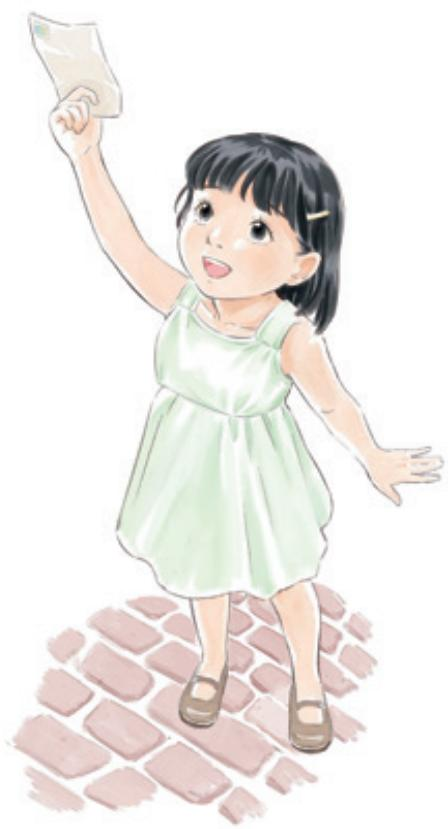

“这是信。”

“信是什么？”

“信就是信。譬如说，我有个好朋友，我有话跟他讲，我就可以写一封信寄给他。信封上写个名字，就可以寄了。”

“那么我也可以寄信给好朋友吗？”

“当然可以，如果你有好朋友的话。”我笑着说。

“就拿这样的信封寄吗？”

“对！”

“到哪儿去寄呢？”

“往邮筒里一塞就行。我们大门外边不就有个邮筒吗？”

“知道啦！知道啦！”她高兴地说。

不知什么时候，她把我的信封拿去玩了，我也没在意。不料过了一天，邮递员通知我说有一封“欠资待领”的信，叫我到邮局去领。我连忙上邮局付了邮资，领出信来一看，啊，原来又是那位老同学寄来的。这家伙开什么玩笑，信封上贴了张用过的旧邮票。拆开信一看，啊？难道他疯了？信封里连半张纸也没有，却装着一片梧桐树叶。真是奇怪！我把叶子翻来覆去看了半天，怎么也猜不出它藏着什么奥妙。

容容追问“我”的话，显露出她的天真、好奇。

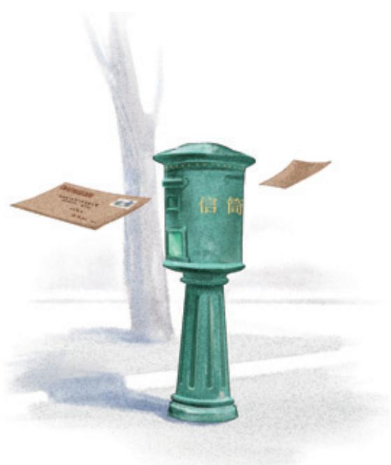

我十分纳闷。回到家里，容容却跟在我旁边，老用一种异样的眼光看着我，似乎准备告诉我什么秘密。过了一

容容的动作、神态和她忍不住告诉“我”的话，突显了她的可爱。

会儿，她似乎忍不住了，就拉住我，在我耳边轻轻地说：“任叔叔，我告诉你，我给你寄了一封信！真正的信！”

“什么？”我好奇地问。

“我今天给你寄了一封信，就用那个信封寄的。里面藏着一片叶子……”

不等她说完，我就大笑起来，几乎把肚子都笑疼了。原来那封“欠资待领”的信就是她寄的啊！

默读课文，结合批注，想一想课文是怎么写容容这个人的，这样写有什么好处。

## 小守门员和他的观众们

放学以后，孩子们又来到这片空地。他们分成两拨儿，把书包和帽子堆起来当球门，就摆开阵势赛起来。小弟弟小妹妹被吸引过来了，路过的大个子叔叔也坐到场边，欣赏他们这场球赛。

课文对小守门员穿着的描写，符合他的身份；对他动作、神态的描写，表现出他是个尽责的守门员。

看那个留平头的小守门员，他身着深蓝色的运动衣，浅蓝色的短裤，脚穿运动鞋，戴着手套。只见他分腿弯腰，上tì身前倾，目光警惕地注视着前方，膝盖磕破了也毫不在意真像个专业的足球守门员！他想着自己可千万不能大意，绝tiǎn不让对手冲破最后一道防线。站在小守门员身后的，是个腆着肚子的小男孩。他好像是候补的，一心想着快点儿上场，好显一显身手，扑住几个险球。

比赛进入白热化阶段，小守门员和观众们紧紧盯着球场中的足球。那个戴红帽子的小女孩生怕别人挡住她，往外探着身子。那个扎蝴蝶结的女孩索性站了起来。搂着小弟弟的“红领巾”可能来迟了，他坐在最边上，也全神贯注地注视着局势的发展。不知谁家的漂亮白狗跟主人一块儿来了，它对球赛没兴趣，正卧在场边闭目养神呢。

课文描写了观众的外貌、动作或神态，表现了他们不同的特点。

那个抱着洋娃娃的小女孩跟别人不大一样，腰挺得直直的，脸上没有什么表情，好像胜负都跟她不相干。旁边的那个戴帽子的小男孩却显得挺紧张，也许是头一回看到这样激烈的球赛。

那位大个子叔叔始终面带笑容，看得津津有味。孩子们踢得太精彩了，也许勾起了他小时候踢球的美好回忆。

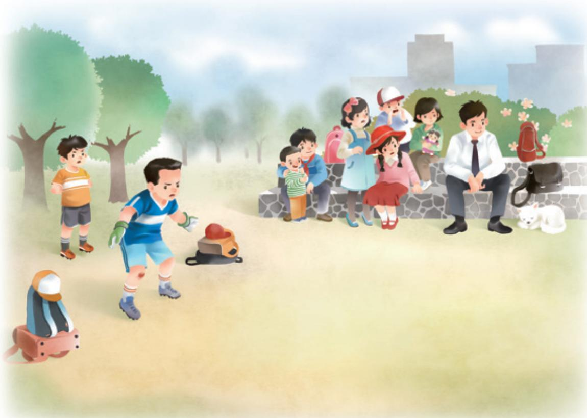

默读课文，说说课文是怎样通过对小守门员和观众们的外貌、动作或神态的描写，表现出人物的不同特点的。和同学交流，哪个人物给你的印象最深。

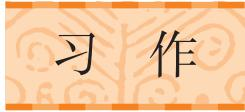

## 形形色色的人

我们每天都会接触到形形色色的人：小区里锻炼身体的爷爷奶奶，学校里的老师、同学，还有上学时遇到的公交车司机、维持秩序的交通警察…选择一个人写下来，运用本单元学过的描写人物的方法，具体地表现人物的特点。题目自拟。

写的时候，要选取典型的事例，如：

事例1：他读完一本故事书，能把所有的细节都记住。

  
事例2：他记住了我昨天说过的一句话。

事例3：他能记住我的生日。

事例4：那幅地图他只  
看了一遍，就能一  
点儿不差地画下来。

事例 1 和事例 4最能表現叔叔记忆力超群的特点。

写完后，和同学交流，看看有没有具体地表现出人物的特点，再根据同学的意见进行修改。

第六单元

思维的火花跨越时空，照亮昨天、今天和明天。

了解人物的思维过程，加深对课文内容的理解。

根据情境编故事，把事情发展变化的过程写具体。

人民教育出版社

# 15 自相矛盾

yu wù楚人有鬻②盾与矛者，誉之曰：“吾盾之坚，物莫能陷③也。”又誉其矛曰：“吾矛之利，于物无不陷也。”或④曰：“以子之矛陷子fú tú之盾，何如？”其人弗能应也。夫⑤不可陷之盾与无不陷之矛，不可同世而立。

## 注释

①本文选自《韩非子·难一》。

②〔鬻〕卖。

③〔陷〕刺破。

④〔或〕有的人。

⑤〔夫〕放在句首，表示将发议论。 a1

## 吾弗夫

矛盾誉吾

正确、流利地朗读课文。背诵课文。

联系上下文，猜测加点字的意思。

◇誉之曰：“吾盾之坚，物莫能陷也。”

◇ 其人弗能应也。

不可同世而立。

想一想：“其人弗能应也”的原因是什么？

司 用自己的话讲讲这个故事。

# 16 田忌赛马

bìn

孙膑是齐国大将田忌的门客，田忌对他非常赏识。

田忌经常同齐威王及贵族们赛马。孙膑看了几场比赛后发现，大家的马脚力相差不多，而且都能分成上、中、下三等。

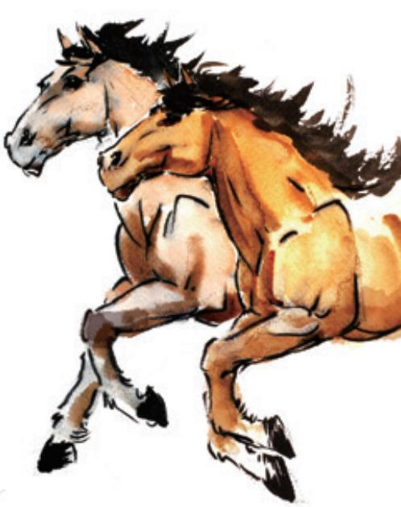

一天，孙膑对田忌说：“将军，我有个办法，保证能让您在赛马时获胜。”

田忌问道：“你是说换几匹更好的马？”

孙膑说：“一匹也不用换。”

田忌有些不明白：“那怎么能有赢的把握呢？”

孙膑胸有成竹地说：“将军请放心，按照我的主意办，一定能让您赢。”

田忌很信任孙膑，决定全听他的。

于是，他同齐威王及贵族们约好一起赛马。

田忌和齐威王的对阵就要开始了。比赛双方摩拳擦掌，跃跃欲试。观众们也兴致勃勃地猜测着比赛结果。就在这时，孙膑把田忌请到一边，悄悄地把办法告诉了他。

第一场，田忌先用下等马对齐威王的上等马，齐威王的马遥遥领先。田忌输了，但他不动声色，一点儿都不着急。

接着，第二场比赛开始了。田忌用上等马对齐威王的中等马，胜了第二场。田忌微微一笑。

第三场，田忌用中等马对齐威王的下等马，又胜了一场。田忌满意地笑了。

比赛结束了。田忌胜两场输一场，赢了齐威王。

齐威王好奇地问田忌：“你这样安排马的出场顺序，是不是有cè人给你出谋划策了？”

田忌如实相告，并引荐了孙膑。后来，齐威王任命孙膑为军师。

## 策荐

## 赢拳擦策荐

默读课文，用自己的话讲讲田忌赛马的故事。

连一连，把齐威王和田忌赛马的对阵图标画出来。说一说：孙膑为什么要让田忌这样安排马的出场顺序？

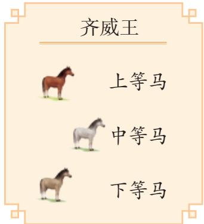

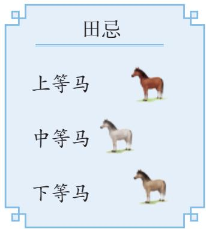

## 选做

历史上有许多运用谋略取得胜利的故事，找一找相关资料，和同学交流。

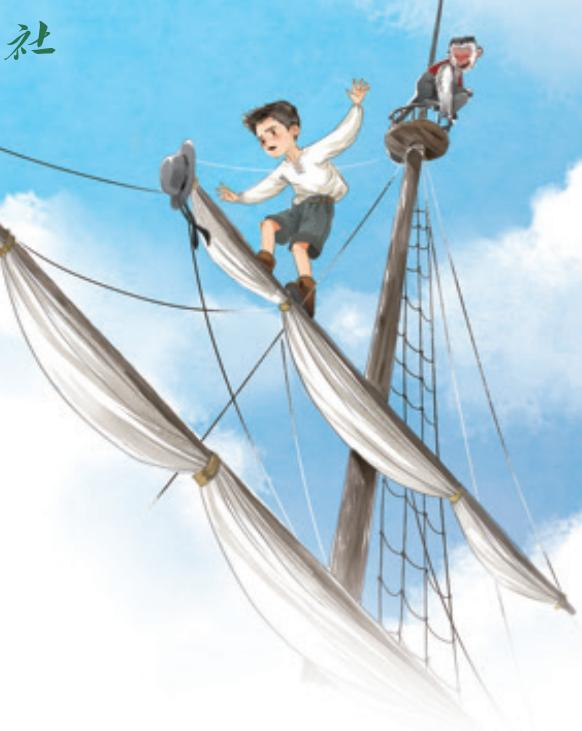

# 17 跳水

一艘环游世界的帆船正往回航行。这一天风平浪静，水手们都在甲板上。一只猴子在人群里钻来钻去，模仿人的动作，惹得大家哈哈大笑。它显然知道sì大家拿它取乐，因而更加放肆起来。

船长的儿子才十一二岁，他也笑得很开心。猴子忽然跳到他面wéi  
前，摘下他的帽子戴在自己的头上，很快地爬上了桅杆。水手们又  
大笑起来，只有那个孩子哭笑不得，眼巴巴地望着猴子坐在桅杆的sī  
第一根横木上，摘下帽子来用牙齿咬，用爪子撕，好像故意逗他生hǔ  
气。孩子吓唬它，朝着它大喊大叫。猴子不但不理，还撕得更凶了。

水手们笑得更欢了，孩子却气得脸都红了。他脱了外套，爬上桅杆去追猴子。他攀着绳子爬到第一根横木上，正要伸手去夺帽子，猴子比他更灵巧，转身抓着桅杆又往上爬。

“你逃不了！”孩子一边追赶一边喊。猴子还不时回过头来逗孩  
子生气。爬到了桅杆的顶端，它用后脚钩住绳子，把帽子挂在最高zī liě  
的那根横木的一头，然后坐在桅杆的顶端，扭着身子，龇牙咧嘴做  
着怪样。横木的一头离桅杆一米多。孩子气极了，他的手放开了绳  
子和桅杆，张开胳膊，摇摇晃晃地走上横木去取帽子。这时候，甲  
板上的水手全都吓呆了。孩子只要一失足，直摔到甲板上就没命了。

即使他走到横木那头拿到了帽子，也难以回转身来。有个人吓得大叫了一声。孩子听到叫声往下一望，两条腿不由得发起抖来。

正在这时候，船长从船舱里出来，手里拿着一支枪。他本来miáo是想打海鸥的，看见儿子在桅杆顶端的横木上，就立刻瞄准儿子，喊道：“向海里跳！快！不跳我就开枪了！”孩子心惊胆战，站在横木上摇摇晃晃的，没听明白他爸爸的话。船长又喊：“向海里跳！不然我就开枪了！一！二！”刚喊出“三”，孩子纵身从横木上跳了下来。

扑通一声，孩子像颗炮弹一样扎进了海里。二十来个勇敢的水手已经跳进了大海：四十秒钟—大家已经觉得时间太长了。等孩子一浮上来，水手们就立刻抓住了他，把他救上了甲板。

## 肆桅撕唬龇咧瞄

艘 航 肆 桅 撕逗 唬钩 咧 舱 鸥 瞄

默读课文，想想故事的起因、经过和结果，把下面的内容填写完整，再讲讲这个故事。水手拿猴子取乐（ ）→( ）

课文多次描写水手们的“笑”，把相关的语句找出来，说说这几次“笑”与故事情节发展的联系。

在那个危急时刻，船长是怎么想的？他的办法好在哪里？和同学交流。

# 神奇的探险之旅

你喜欢探险吗？你读过有关探险的书吗？这次习作就让我们编一个惊险刺激的探险故事吧。

你希望和谁一同去探险？从下面两列人物中各选一个，和你一起组成一支探险小队。

<table><tr><td colspan="2">人物</td></tr><tr><td>经验丰富的探险爱好者</td><td>好奇心强、性格活泼的妹妹</td></tr><tr><td>知识渊博的生物学家</td><td>胆子大但行事鲁莽的表哥</td></tr><tr><td>见多识广的向导</td><td>心细而胆小的同学</td></tr></table>

你想去哪儿探险？打算带上哪些装备？可能会遇到什么险情？下面的提示供你参考：

场景 茫茫大漠、热带雨林、 海中荒岛、幽深洞穴、 南极冰川……

## 装备

指南针、地图、饮用水、食物、药品、帐篷……

## 险情

遭遇猛兽、暴雨来袭、 突发疾病、断水断粮 落石雪崩……

准备好了吗？快开始我们的探险之旅吧！

写的时候要展开丰富合理的想象，把遇到的困境、求生的方法写具体，如果能把心情的变化写出来就更好了。

写完后，认真修改自己的习作。

如果有兴趣，可以续编你的探险故事。

# 语文园地

## 交流平台

了解人物的思维过程，可以加深对课文内容的理解。

学习《田忌赛马》时，可以推测孙膑当时的思维过程。他先分析了赛马双方的具体情况：田忌同齐威王及贵族们的马脚力相差不多，而且都能分成上、中、下三等。于是，他想到可以通过合理安排马的出场顺序，取得三局两胜的结果。通过这样的梳理，我们就能理解孙膑为什么想出了这样的妙计。

学习《跳水》时，也可以推测船长是怎么想的。他知道孩子在高高的横木上，无论是继续往前还是往回走，随时都有可能摔在硬邦邦的甲板上。结合船上的各种情况，他立即决定用枪逼孩子跳水，这也是当时唯一可行的办法。这样分析后，就能知道他的办法好在哪里了。

我们在生活中遇到问题，也应该先分析当时的情况，再选择合适的办法去解决。

## 词句段运用

读一读，注意加点的字，说说你有什么发现。

吾盾之坚坚固

弗能应 应答

道旁李道路

溺而不返 返回

冀复得兔重复

守株待兔守候

读一读，注意加点的部分，说一说自己类似的体验，再选择一种体验写一写。

二十来个勇敢的水手已经跳进了大海：四十秒钟——大家已经觉得时间太长了。等孩子一浮上来，水手们就立刻抓住了他，把他救上了甲板。

几十年，几百年，时间一转眼就过去了。成千上万只绿翅膀的苍蝇和八只脚的蜘蛛来了又去了。

下面的片段节选自叶圣陶先生为一位中学生修改的作文。读完后，你对叶圣陶先生的修改有什么感受？和同学交流。

## 一张画像

二十六中初中三年级 肖复兴

00 (孜至开学了。第一节课是几何。那站在门口手里拿着大三角板和大圆规的王老师，就是我们的新班主任他那魁梧的身材，黧黑的面孔，粗粗的眉毛，简直就看不出他是教几何的，脸 00 00 叫人我越看他倒越像《新儿女英雄传》里的“黑老蔡”。走进教室，

铃一响 上课了，他挺直了腰板望了望大家，然后鞠躬让大家坐 o0下，满都是军人的风度。说不定还真是个复员军人呢！。看样00 00子，他一定挺厉害。

00哼，管他厉害不厉害，反正我上课的“小癖好”谁也干时候涉不了。不瞒你说，我上课的“小癖好”就是爱涂涂抹抹，点儿什么。00染染画画的，差不多教过我们的老师都在我的本子上“留了影”就拿起铅笔00了，今天又见到“黑老蔡”，我的手早痒痒了，于是我便马上00在几何书皮上画了起来。1包书纸

儿 00半堂多课，“黑老蔡”讲的什么，我一点也没听见，可却画00 00出了一张饶有风趣的画像一 那 “黑老蔡”骑在战马上，手里满挥舞着大三角板和圆规，口里还不住地呐喊：“冲啊，向几何进大 从 吐出来几个字军！”00 的 悄悄 00画完后，我递给同桌小强看，还不停地给他讲着。谁知，几何课本看得正带劲，忽然背后伸出一只手把画给拿走了。我生怕让00老师瞧见，就急忙说：“别闹，别闹，回头再让你开眼……”00 看 几何课本我刚(一回头，哎呀，糟糕！原来拿画的正是王老师。我立刻紧张起来，心就像刚上岸的鱼“扑腾扑腾”一e000 头 00个劲儿地跳。我看见他的粗眉紧皱着，像拧成了一股黑绳。里我的心在打鼓，想：“大祸要临头了，这顿‘斥儿’算挨定了！”00 几何课本 00 像忽然他又把画放下，望了望我，只轻轻地笑了一声，象开玩笑似的说：“画得不错啊，不过是个相似形’，我的胡子可没那上 00么长。”说完走回讲台前就又泰然自若地讲起课来。，就

## 日积月累

豆蔻年华：指女子十三四岁的年纪。  
及笄：指女子年满十五岁。  
弱冠：指男子二十岁左右的年纪。  
而立：指人三十岁。不惑：指人四十岁。  
花甲：指人六十岁。  
古稀：指人七十岁。  
期颐：指人一百岁。

第七单元

足下万里，移步换景，寰宇纷呈万花筒。

体会静态描写和动态描写的表达效果。

搜集资料，介绍一个地方。

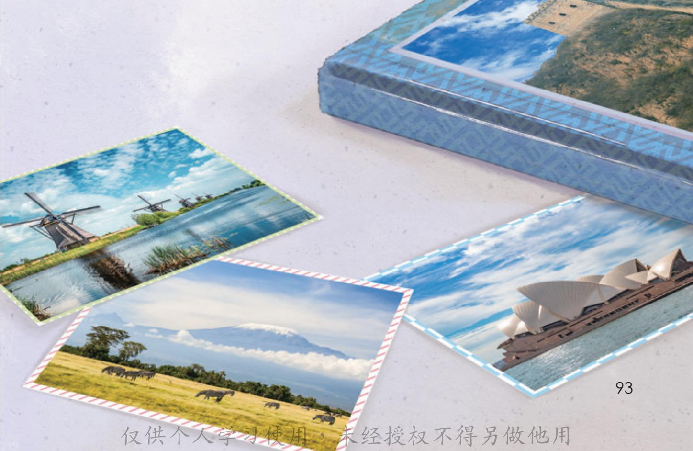

# ní18 威尼斯的小艇

威尼斯是世界闻名的水上城市，河道纵横交错，小艇成了主要的交通工具。

威尼斯的小艇有二三十英尺①长，又窄又深，有点儿像独木舟；shāo qiào船头和船艄向上翘起，像挂在天边的新月；行动轻快灵活，仿佛田沟里的水蛇。

我们坐在船舱里，皮垫子软软的像沙发一般。小艇穿过一座座形式不同的石桥。我们打开窗帘，望望耸立在两岸的古建筑，跟来往的船只打招呼，有说不完的情趣。

船夫的驾驶技术特别好。行船的速度极快，来往船只很多，他操纵自如，毫不手忙脚乱。不管怎么拥挤，他总能左拐右拐地挤过去。遇到极窄的地方，他总能平稳地穿过，而且速度非常快，还能急转弯。两边的建筑飞一般地倒退，我们的眼睛忙极了，不知看哪一处好。

商人夹了大包的货物，匆匆走下小艇，沿河做生意。青年妇女mǔ在小艇里高声谈笑。许多孩子由保姆伴着，坐着小艇到郊外去呼吸dǎo新鲜的空气。老人带了全家，坐着小艇上教堂去作祷告。

半夜，戏院散场了，一大群人拥出来，走上了各自雇好的小艇。簇拥在一起的小艇一会儿就散开了，消失在弯曲的河道中，远huá处传来一片哗笑和告别的声音。水面上渐渐沉寂，只见月亮的影子在水中摇晃。高大的石头建筑耸立在河边，古老的桥梁横在水上，大大小小的船都停泊在码头上。静寂笼罩着这座水上城市，古老的威尼斯又沉沉地入睡了。

## 尼艄翘姆祷雇哗

尼姆 斯 艇 艄 翘 垫码祷 雇 簇 哗

默读课文，说说课文围绕小艇写了哪几方面的内容。

体会作家笔下威尼斯的动、静之美，再有感情地朗读课文。

读下面这段话，说说小艇有哪些特点，再体会加点部分的表达效果。

威尼斯的小艇有二三十英尺长，又窄又深，有点儿像独木舟；船头和船艄向上翘起，像挂在天边的新月；行动轻快灵活，仿佛田沟里的水蛇。

读下面的“阅读链接”，想想在描写威尼斯时，三位作家的表达方法有什么相似之处。

# 人民教育出版社

## 阅读链接

威尼斯是一个别致地方。出了火车站，你立刻便会觉得：这里没有汽车，要到哪儿，不是搭小火轮，便是雇“刚朵拉”。大运河穿过威尼斯，像反写的“S”，这就是大街。另有小河道四百八十条，这些就是小胡同。轮船像公共汽车，在大街上走；“刚朵拉”是一种摇橹的小船，威尼斯所特有，它哪儿都去。威尼斯并非没有桥，三百七十八座，有的是。只要不怕转弯抹角，哪儿都走得到，用不着下河去。

威尼斯是“海中的城”，在意大利半岛的东北角上，是一群小岛，外面一道沙堤隔开亚得里亚海。在圣马可广场的钟楼上看，团花簇锦似的东一块西一块在绿波里荡漾着。远处是水天相接，一片茫茫。这里没有什么煤烟，天空干干净净，在温和的日光中，一切都像透明的。中国人到此，仿佛在江南的水乡；夏初从欧洲北部来的，在这儿还可看见清清楚楚的春天的背影。海水那么绿，那么酽，会带你到梦中去。

——选自朱自清的《威尼斯》，有改动

威尼斯蓝天的妩媚和夜空的可爱是无法用语言来描绘的。在那明净的夜晚，湖面水平如镜，连星星的倒影也不会有丝毫的颤动。泛舟湖心四周一片蔚蓝、宁静，真是水天一色，使人仿佛进入绮丽的梦境一般。空气那么清澈、透明，抬头望去，这里的星星似乎远比我们法兰西北部夜空中的星星要多。夜空布满星辰，那深蓝的夜色都变得暗淡了，融入了一片星辉。

如果你想领略一番这儿独有的清新和恬静，你可以在这迷人的夜晚去皇家花园附近，沿着大理石台阶往下，直到运河边上。要是那里镀金的栅栏已经关上，你可以乘坐一种名叫“刚朵拉”的风格独特的威尼斯小艇，缓缓荡去。到那夕阳余温尚未散尽的石板小路旁，那里就不再会有人来打扰你的宁静。晚风从椴树顶上轻轻吹过，把片片花瓣撒落到水面上，天竺葵和三叶草淡淡的芳香一阵阵向你袭来。

选自法国乔治·桑的《威尼斯之夜》，薛菲译，有改动

# 19 牧场之国

荷兰，是水之国，花之国，也是牧场之国。

一条条运河之间的绿色低地上，黑白花牛，白头黑牛，白腰蓝zhān  
嘴黑牛，在低头吃草。有的牛背上盖着防潮的毛毡。牛群吃草时非dú  
常专注，有时站立不动，仿佛正在思考着什么。牛犊还未长大，却tiào  
有了端庄的仪态。老牛好似牛群的家长，无比威严。极目远眺，四  
周全是碧绿的丝绒般的草原和黑白两色的花牛。这就是真正的荷兰。

这就是真正的荷兰。碧绿色的低地镶嵌在一条条运河之间，成biāo群的骏马，匹匹膘肥体壮。除了深深的野草遮掩着的运河，没有什么能够阻挡它们飞驰到远方。辽阔无垠的原野似乎归它们所有，它jué们是这个自由王国的主人和公爵。

在绿色的草原上，白色的绵羊悠然自得。黑色的猪群不停地呼lū噜着，像是对什么表示赞许。成千上万的小鸡，成群结队的长毛山羊，在见不到一个人影的绿草地上，安闲地欣赏着这属于它们自己的王国。这就是真正的荷兰。

到了傍晚，才看见有人驾着小船过来，坐上小板凳，给严肃沉默的奶牛挤奶。金色的晚霞铺在西天，远处偶尔传来汽笛声，接着

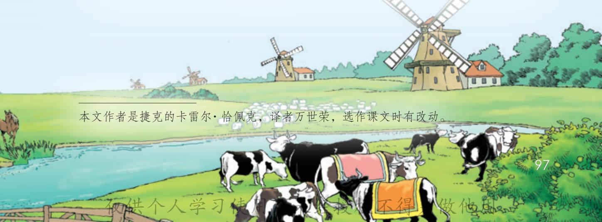

## 人民教育出版社

yāo

又是一片寂静。在这里，谁都不叫喊吆喝，牛脖子上的铃铛也没有响声，挤奶的人更是默默无言。运河之中，装满奶桶的船只在舒缓平稳地行驶。满载着一罐一罐牛奶的汽车、火车，不停地开往城市。车船过后，一切又恢复了平静。最后一抹晚霞也渐渐消失了，mōu整个天地都暗了下来。狗不叫了，圈里的牛也不再发出哞哞声，马

也忘记了踢马房的挡板。沉睡的牲畜，无声的低地，漆黑的夜晚，只有远处的几座灯塔在闪烁着微弱的光。

这就是真正的荷兰。

我體會到了文中描绘的荷兰牧场的宁静之美。

## 毡犊眺膘爵噜吆哞畜

仪 眺 骏 驰 辽 绵 属 凳 吆 铛 罐 恢 踢 牲 畜

有感情地朗读课文。

作者眼中“真正的荷兰”是什么样的？作者为什么反复强调“这就是真正的荷兰”？

作者笔下的牛、马、羊等动物都别有一番情趣，如，“牛犊还未长大，却有了端庄的仪态”。找出这样的句子，读一读，再把它们抄下来。

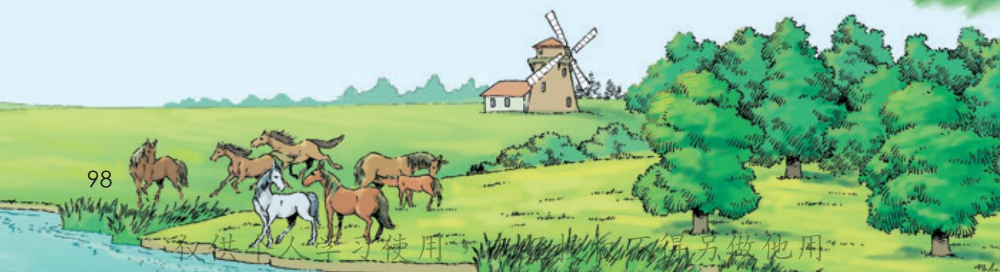

# 20 兴 金字塔

默读下面两篇短文，说说你对金字塔有了哪些了解。两篇短文用了不同的方式写金字塔，你更喜欢哪一种？说说你的理由。

## 金字塔夕照①

九月的开罗是金色的。

在金色的夕阳下，金色的田野，金色的沙漠，连尼罗河的河水也泛着金光，而那古老的金字塔啊，简直像是用纯金铸成的。远远望去，它像漂浮在沙海中的三座金山，似乎一切金色的光，都是从它那里放射出来的。你看，天上地下，黄澄澄，金灿灿，一片耀眼的色调，一幅多么开阔而又雄浑的画卷啊！

从少小时候起，我就听到过许多有关金字塔的传说，向往着它  
神秘的风采。如今，当我来到金字塔下，望着这人间的奇迹，更禁  
不住思绪激荡。我不知道“金字塔”这个译名中的“金”，最早是  
怎么得来的。不管出于什么考虑，我认为都是绝妙的。你看金字塔Vi  
多像一个“金”的汉字。几千年来，在人们的心目中，它不愧是熠  
熠发光的珍宝，人类劳动和智慧的结晶，它无疑比金子还要贵重。

有人说金字塔的白昼和月夜，各有各的情趣，各有各的美，但我觉得最令人难忘的，恐怕还是这大漠夕照中金字塔的色彩。那一片迷人的金色，简直把你融进一个神奇的境界，使你充满豪迈的感xiá受和无边的遐想，不由自主地产生一种怀古的幽思……

## 不可思议的金字塔①

## 最大的金字塔——胡夫金字塔

塔的重量：约600万吨塔基面积：约5.3万平方米塔的体积：约260万立方米

塔原高约146米，塔基原边长约230米。因年久风化，塔现高约137米，塔基现边长约227米。

为什么在几千年的时间里，一直没有出现比它更高的建筑呢?

当时的人们是怎么修建金字塔的呢?

开罗郊外

约146米

约230米

建于公元前2600年左右。建成几千年后，世界上才出现比它更高的建筑。

用约230万块石材砌成，平均每块重2.5吨左右。整个胡夫金字塔大概有50层楼高，塔基面积相当于126个篮球场那么大。

塔身是由一块一块的石头叠加而成的，nián  
中间没有任何水泥之类的黏着物。石头  
和石头之间贴合得很紧实。

塔高的10亿倍约等于地球到太阳的平均距离。

这是巧合吗？

## 建造金字塔时的古埃及

尼罗河被称为埃及的母亲河。它每年定làn  
期泛滥，给河两岸带来肥沃的淤泥。金  
字塔就建在尼罗河的西岸。

古埃及人在天文学、数学、几何学、地理学等方面取得了很高的成就。比如，在天文历法方面，他们将一年定为365天，并规定每年12个月，一个月30天，剩余5天作为节日。

古埃及人掌握了精湛的造船技术，这些船能在尼罗河上航行。

在尼罗河的上游，考古学家发现了古埃及人的采石场遗迹。

除了金字塔，古埃及人还有石窟陵墓、神庙等多种令人惊叹的建筑成就。

金字塔是如何建成的？我能借助课文内容，大胆推测。

译愧熠遐黏埃滥淤湛

## 口语交际

## 我是小小讲解员

学校来了客人，需要你讲解校园里有代表性的地方；亲友到你家做客，需要你介绍一下周边的环境；暑假开始了，博物馆需要汉字文化讲解员，社区征集志愿者介绍垃圾分类知识…选择一个情境，做一名小小讲解员。

先确定好要讲解什么，再搜集相关的资料。如果有条件，可以实地看一看。根据了解到的信息列一个提纲，自己试着讲一讲。还可以做一些小卡片，标注要讲的关键信息。

## 怎么作讲解

讲解的时候，条理要清楚，语气、语速要适当，可以用动作、表情辅助讲解。

可以根据听众的反应调整讲解的内容。如，发现听众对某个部分不太感兴趣时，可以适当删减内容。

先讲给小组成员听，听的同学提出改进意见，还可以对不明白的地方提出疑问。根据同学们的意见，改进自己的讲解。最后，小组推举代表在班上讲解。

列提纲，按照一定的顺序讲述。

根据听众的反应，对讲解的内容作调整。

## 中国的世界文化遗产

你游览过宏伟的北京故宫吗？你知道美丽的敦煌莫高窟吗？你对秦始皇陵兵马俑感兴趣吗？这些令中国人骄傲的世界文化遗产，凝结着我们祖先的汗水和智慧。

从中国的世界文化遗产中，选择一处你感兴趣的介绍给别人。

◇有目的地搜集相关资料，如历史背景、基本现状。

## 搜集资料

◇ 把资料来源记录下来。

根据要介绍的内容分类整理资料，如描绘外观和结构的，记录历史变化的，讲述相关故事的。

## 整理资料

筛选资料，剔除无关信息。如果资料不够完善，可以继续搜集、补充。

## 撰写

将整理后的资料用自己的话写下来，也可以引用别人的话，但要注明资料来源。

◇可以使用图片、表格等辅助形式。

写完后，和同学交流，互相评一评介绍得是否清楚，再根据同学的意见修改习作。

# 语文园地

## 交流平台

本单元的课文运用静态描写和动态描写，展示了世界各地丰富多彩的美丽画卷。

《威尼斯的小艇》一文，描写了小艇在水面上灵活穿梭的样子，体现了威尼斯的活力，还描写了威尼斯夜晚的情景，表现了古老水城的静寂。

《牧场之国》一文，描写了荷兰牧场上动物们的悠闲和安详，也描写了人们挤奶、运奶时的平和与从容，突显了荷兰牧场的宁静之美。

恰当地运用静态描写和动态描写，能够呈现景物独特的魅力。

## 词句段运用

下面的句子分别写出了景物的动、静之美，读一读，再选择一个情景，照样子写一写。

两边的建筑飞一般地倒退，我们的眼睛忙极了，不知看哪一处好。

车船过后，一切又恢复了平静。最后一抹晚霞也渐渐消失了，整个天地都暗了下来。狗不叫了，圈里的牛也不再发出哞哗声，马也忘记了踢马房的挡板。

放学后的校园

群鸟飞过湖面

火车进站

## 人民教育出版社

读一读，说说下面的句子分别描写了怎样的情景，体会它们在表达上的特点。

◇ 在金色的夕阳下，金色的田野，金色的沙漠，连尼罗河的河水也泛着金光，而那古老的金字塔啊，简直像是用纯金铸成的。

站在白色大理石铺的地上，眼里看到的是纯白的大理石，脚下踩的是纯白的大理石；陵墓是纯白的大理石，栏杆是纯白的大理石，四个高塔也是纯白的大理石。你被裹在一片纯白的光辉中，仿佛给这个白色的奇迹压住了，给这纯白的光辉网牢了。

## 日积月累

## 乡村四月

[宋]翁卷

绿遍山原白满川，子规声里雨如烟。乡村四月闲人少，才了蚕桑又插田。

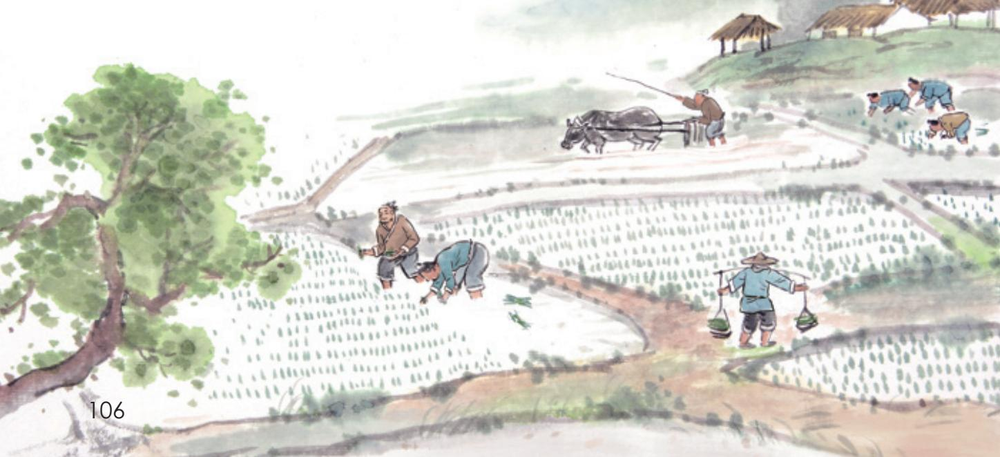

# 风趣和幽默是智慧的闪现。

第八单元

# ②① 杨氏之子

梁国杨氏子九岁，甚聪惠②。孔君平诣其父，父不在，乃④呼儿出。为设果，果有杨梅。孔指以示⑤儿曰：“此是君家果。”儿qín应声答曰：“未闻孔雀是夫子⑥家禽。”

注释

①本文选自《世说新语·言语》。

②〔惠〕同“慧”。

③〔诣〕拜访。

④〔乃〕就，于是。

⑤〔示〕给……看。

⑥〔夫子〕古时对男子的敬称，这里指孔君平。

## 诣禽

## 梁聪诣禽

正确、流利地朗读课文，读好下面的句子。背诵课文。

◇孔指以示儿曰：“此是君家果。”

◇儿应声答曰：“未闻孔雀是夫子家禽。”

借助注释了解课文的意思，说说从哪里可以看出杨氏之子的机智。

# 22 手指

我们每个人，都随时随地随身带着十根手指，永不离身。一只手上的五根手指，各有不同的姿态，各具不同的性格，各有所长，各有所短。

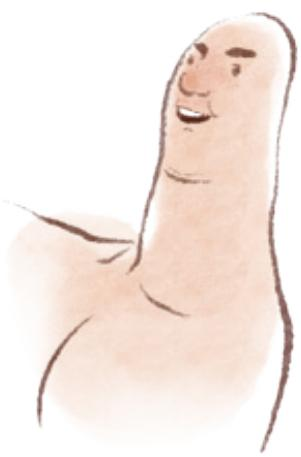

大拇指在五指中，形状实在算不上美。身体矮而胖，头大而肥，构造简单，比人家少一个关节。但在五指中，却是最肯吃苦的。例如拉胡琴，总由其他四xián指按弦，却叫他相帮扶住琴身；水要喷出来，叫他死力抵住；血要流出来，叫他拼命按住；重东西要翻倒去，叫他用劲顶住；要读书了，叫他翻书页；要进门qìn了，叫他擞电铃。讨巧的事，却轮不上他。例如招呼人，都由其他四指上前点头，他只能呆呆站在一旁；sāo给人搔痒，人舒服后，感谢的是其他四指。

常与大拇指合作的是食指。他的姿态可不yǎo tiǎo  
如其他三指窈窕，都是直直落落的强硬的线  
条。他的工作虽不如大拇指吃力，却比大拇指  
复杂。拿笔的时候，全靠他推动笔杆；遇到危huì  
险的事，都要他去试探或冒险；秽物、毒物、yà  
烈物，他接触的机会最多；刀伤、烫伤、轧  
伤、咬伤，他消受的机会最多。他具有大拇指  
所没有的“机敏”，打电话、扳枪机必须请nǐng niǔ  
他，打算盘、拧螺丝、解纽扣等，虽有大拇  
指相助，终是要他主干的。

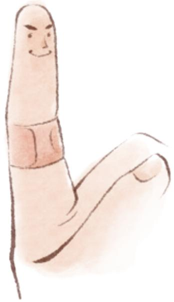

五指中地位最优、相貌最堂皇的，无如中指。他居于中央，左右都有屏障。他个子最高，无名指、食指贴身左右，像关cāng公左右的关平、周仓，左膀右臂，片刻不离。他永远不受外物冲撞，所以曲线优美，处处显示着养尊处优的幸福。每逢做事，名义上他是参加的，实际并不出力。他因为身体最长，取物时，往往最先碰到物，好像取得这物是他一人的功劳。其实，他碰到之后就退在一旁，让大拇指和食指去出力，他只在旁略为扶衬而已。

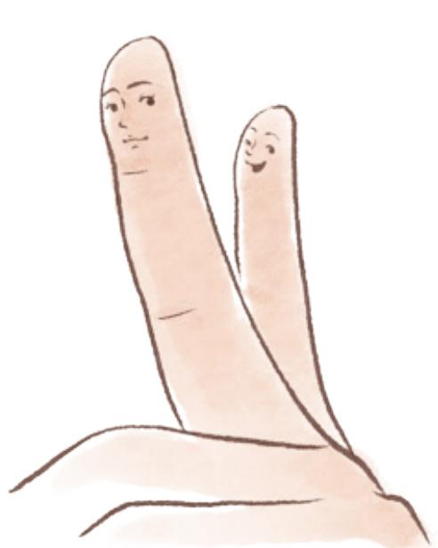

无名指和小指，体态秀丽，样子可爱。然而，能力薄弱也无过于他们了。无名指多用于研脂粉、蘸药末、戴戒指。小指的用处则更渺小，只是掏掏耳朵、抹抹鼻涕而已。他们也有被重用的时候。在丝竹管弦上，他们的能力不让于别人。舞蹈演员的手指不是常作兰花状吗？这两根手指正是这朵“兰花”中最优美的两瓣。除了这等享乐的风光事以外，遇到工作，

yōng

他们只是其他手指的附庸。

zēng

手上的五指，我只觉得姿态与性格，有如上的差异，却无爱憎在其中。手指的全体，同人群的全体一样，五根手指如果能一致团结，成为一个拳头，那就根根有用，根根有力量，不再有什么强弱、美丑之分了。

拇弦拟搔窈窕秽轧拧纽仓庸憎

拇搔痒秽轧拧螺纽

扣貌|仓|渺享庸憎

默读课文，结合课文内容，说说五根手指各有什么作用。

课文的语言很风趣，如，“他永远不受外物冲撞，所以曲线优美，处处显示着养尊处优的幸福”。找出类似的语句体会一下，再抄写下来。

作者笔下的大拇指和食指分别让你想到了生活中的哪些人？和同学交流。

小练笔

仿照课文的表达特点，从人的五官中选一个，写一段话。

人为什么会在梦中飞行？人究竟是从哪里来的？为了弄清楚这些问题，“我”经历了怎样的探究过程？结果怎样？默读课文，找出你觉得有趣的部分，说说自己的感受，还可以和同学交流自己有过什么“发现”。

我在九岁的时候就发现了有关胚胎发育的规律，这完全是我独立思考的结果。

听完这句话，你大概忍不住会哈哈大笑，愿意笑你就笑吧，反huòhuàn正笑声不会给你招来祸患。我跟你可不同，事情过去了三年，有一次我想起了自己的发现，情不自禁笑出了声音，竟使我当众受到了惩罚。

我的发现起始于梦中飞行。每天夜里做梦我都飞，我对飞行是那样迷恋，只要双脚一点，轻轻跃起，就能离开地面飞向空中。后来，我甚至学会了滑翔，在街道上空，在白桦树梢头，在青青的草地和澄澈的湖面上盘旋。我的身体是那样轻盈，可以随心所欲，运转自如，凭着双臂舒展和双腿弹动，似乎想去哪里就能飞到哪里。

我以为在同学中间只有我一个人具有飞行的天赋。可是，有一天我终于弄明白了，每到夜晚，我的小伙伴们也都会在梦中飞腾。那天，我们几个人决定去见我们的老师，让他来解答这个奇妙的问题。

“梦里飞行，说明你们是在长身体啊！”老师解释说。

“为什么只有晚上睡觉时才长？”

白天你们太淘气，妨碍细胞的生长。到了晚上，细胞就不停地繁殖。”

“那为什么人在生长的时候就要飞呢？这究竟是什么道理？”

“这是你们的细胞回想起了远古时代，那个时候，人还是飞鸟。”

“人怎么会是鸟？”我们万分惊讶。

岂止是鸟！人是由简单生命进化来的。最开始是草履虫，后来是鱼，是青蛙，是猴子……所有这些知识，等你们升入高年级上课时老师都会给你们讲解。”

高年级，离我们是那样遥远，而飞行却仍在继续。和老师的一  
次谈话，更加激发了我的想象力。我渴望弄明白，人究竟是怎么来chī  
的。我想得是那样痴迷，以至于从河里抓到一条鱼，我都会翻来覆  
去地看个仔细，恨不得从鱼身上发现将来的人应该具有的某些特征。乡村的孩子从小就知道母亲怀胎九个月才生下婴儿。“为什么jiǎo hēi  
是九个月呢？”我绞尽脑汁思考这个问题的答案。想啊想啊，嘿！  
终于想出了眉目：“哈！这就跟画地图差不多。地上的距离很远很  
远，在地图上画出来只不过几厘米。人是由细胞构成的…从细胞

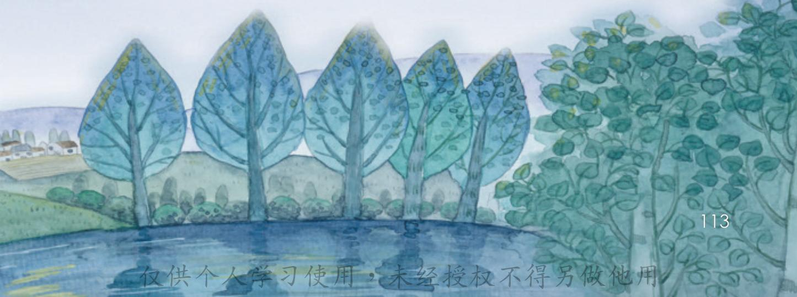

变成小鱼，经过了很长时间。现在，这一段时间就折合成一个月。从小鱼变成青蛙又得经过很长时间，又折合成一个月。这样推算下来，到变化成人，正好是九个月。”我的发现竟是如此简单明了，我为此感到格外高兴。我想，大概还没有人发现这个道理。

又过了三四年，我上了六年级。老师开始给我们上生物课。有一次，年轻的女教师板着面孔一本正经讲人的起源，讲人的发育和进化。这时候，我清清楚楚听见老师说，有的科学家认为，母腹中的胎儿再现了从简单生命进化成人的过程。当时教室里安静得出奇，大家都默不作声。我忽然想起了自己的发现，情不自禁地笑出了声音。老师狠狠地瞪了我一眼。

“费奥多罗夫！……你笑什么？再笑就从教室里出去！”

“奥尔加·伊万诺夫娜，我……我想起了自己的发现……”

教室里一阵笑声。奥尔加·伊万诺夫娜气得脸色苍白，大步朝我走来。

“费奥多罗夫！……你立刻从教室里出去！……”

我的脸由于困窘和羞愧一下子涨得通红。这时候我才意识到，老师误解了我的笑声，以为我的笑不怀好意。幸亏她没有容我解释，不然的话，同学们听见我说自己三年前就发现了“进化论”，还不笑塌房顶！不过，被轰出教室，站在外面，我倒想出了一条自我安慰的理由，我明白了世界上的重大发现，有时还会给人带来被驱逐和被迫害的风险。

## 胚祸患赋痴绞嘿伊娜窘

## 口语交际

# 我们都来讲笑话

笑话给我们带来快乐，让我们都来讲笑话吧。

收集一些笑话，可以是从报纸、杂志上看到的，也可以是从别人那里听到的。准备的笑话内容要积极向上。

讲笑话要注意什么呢?

要熟记笑话的内容。

尽量表现出笑话中人物的神态、语气和动作。

克服口头禅、重复等不良的口语习惯。

要沉住气，自己不要笑场。

选择两三个你觉得好玩的笑话，在家里先试着讲一讲，看看效果，再根据家人的建议改进。

组织一次笑话大会，全班同学一起乐一乐。

◎ 避免不良的口语习惯。

用心倾听，做一个好的听众。

## 漫画的启示

漫画往往意味深长，能引发我们的思考。你能读懂下面这两幅漫画吗？从中获得了什么启示？

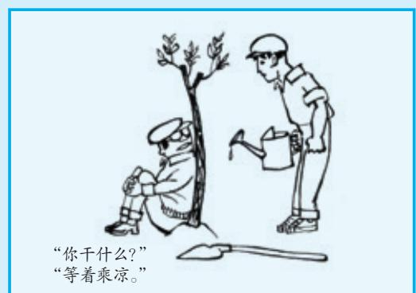

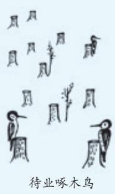  
（图）华君武

这次习作，让我们写一写从漫画中获得的启示。可以从上面两幅漫画中选择一幅来写，也可以写其他漫画。写的时候注意以下几点：

## ā

## 观察

◇ 看看漫画画的是什么内容。

借助漫画的标题或简单的文字提示，联系生活中的人或事，思考漫画的含义，获得启示。

## 撰写

◇先写清楚漫画的内容，再写出自己的思考。

写完后，同学互换习作读一读，看看从漫画中获得的启示是不是写清楚了，再根据同学的建议修改。

# 人民教育出版社

# 语文园地

## 交流平台

本单元的课文很有特点，不仅内容有意思，而且语言风趣幽默。

杨氏之子和孔君平的对话，利用姓氏的特点做文章，你来我往，真是巧妙。

《手指》一文，作者用风趣的语言，展现了五个鲜明的手指形象，让我们想到生活中类似的人。

《童年的发现》中的“我”被老师误会的时候，用自我调侃的语言安慰自己，令人忍俊不禁。

## 词句段运用

体会下面句子表达的特点，再选择一种情景说一说。

他个子最高，无名指、食指贴身左右，像关公左右的关平、周仓，左膀右臂，片刻不离。

这个体操运动员在高低杠上的动作真灵巧，就像敏捷的猴子在树干间攀缘、穿行。

游子回到家乡 雨点儿落在窗玻璃上 云朵在天空飘荡

读一读，体会作者是怎样表达自己的想法的，再照样子写一段话。

但在五指中，大拇指却是最肯吃苦的。例如拉胡琴，总由其他四指按弦，却叫他相帮扶住琴身；水要喷出来，叫他死力抵住；血要流出来，叫他拼命按住；重东西要翻倒去，叫他用劲顶住；要读书了，叫他翻书页；要进门了，叫他揿电铃。

# 人民教育出版社

## 书写提示

颜真卿是唐代著名的书法家，是楷书四大家之一。他的楷书具有恢宏雄壮、大气磅礴的特点。人们常说的“颜筋柳骨”中的“颜筋”，就是形容他的书法筋肉丰满，浑厚有力。《颜勤礼碑》是其代表作之一。

<table><tr><td rowspan=2 colspan=1>太宗</td><td rowspan=1 colspan=1>逾</td><td rowspan=5 colspan=1>序君自作后加</td></tr><tr><td rowspan=1 colspan=1>岷</td></tr><tr><td rowspan=1 colspan=1>为</td><td rowspan=1 colspan=1>将</td></tr><tr><td rowspan=2 colspan=1>太宗为秦王精</td><td rowspan=1 colspan=1>军</td></tr><tr><td rowspan=1 colspan=1></td></tr></table>

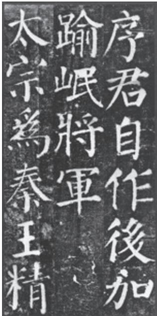

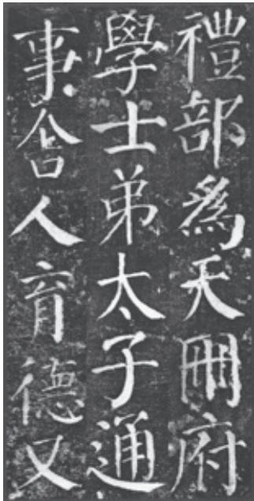  
颜真卿《颜勤礼碑》（局部）  
事舍人育德又 学士弟太子通 礼部为天册府

## 日积月累

君子喻于义，小人喻于利。 ——《论语》

君子坦荡荡，小人长戚戚。 ——《论语》

恻隐之心，仁之端也。 ——《孟子》

多行不义，必自毙。 《左传》

人有耻，则能有所不为。 —《朱子语类》

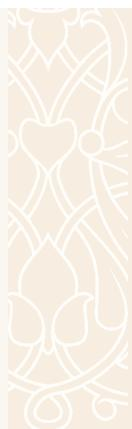

## 识字表

zhòu yín gòng zhì

zhà kěn yīng bàng gē dū wō shuān luo guàng 2蚱啃樱蚌割嘟倭拴啰逛

3 峨燕缀

sāi qiú diàn zhèng bǐng sōu mǎ liáo juàn qiáo juàn 4腮虬玷郑秉飕码撩绢侨眷

5 瑜忌督幔翎寨擂呐弩丞

勿生肋跟 ā 6 呵 p泊

7 斐遂澗獐耶学瞑穿码， juān r náo 镌挠劣呵

tì yān huì dài huì dūn chāi wén xí diàn huò lā 8屉嫣讳黛晦墩钗雯袭垫豁喇

rèn yuè jì. tì cháng xiāng 9仞岳蓟涕裳襄

péng nǐ móu fù shū chóu chú àn gé 10彭拟谋赴殊踌躇黯革

11沃匪绷衷堪

chóu jīn fú zhuó hè dāng qǐ bǐ guà wù 12筹矜俘镯吓裆企彼褂坞

gǎ bàn jiū bān wàn zhù quán bā jiàn zhí tán kāi

13嘎绊揪扳腕铸颧疤监侄痰揩

fù fú zhàn shèng xiàn zhà zhèng

14傅袱蘸圣馅诈怔

17 肆桅撕唬龇咧瞄

ní shāo qiào mǔ dǎo gù huá

18尼艄翘姆祷雇哗

zhān dú tiào biāo jué lū yāo mōu chù 19毡犊眺膘爵噜吆呼畜

yì kuì yì xiá nián āi làn yū zhàn 20译愧熠遐黏埃滥淤湛

mǔ xián qìn sāo yǎo tiǎo huì yà nǐng niǔ cāng yōng zēng 22拇弦拟搔窈窕秽轧拧纽仓庸憎

23胚祸患赋痴绞嘿伊娜窘

（共200个生字）

## 写字表

昼耘桑晓  
2 蝴蚱嗡樱榆拔瞎铲锄割拴瓢逛  
5 妒忌曹督委鲁遮漆疑惑寨擂呐插  
6 冈饥碟斤俺榜杖申兼勿拖悉坠膛截  
篱仞岳摩遗涕巫  
10 彭拟谋瑞锻炼眷赴搞殊尊签踌躇革  
11 庆诊沃龄匪绷审剂施吭崭衷晕慈祥  
13 跤搂仗鞭欺挠扳腕剃腮疤监侄喉咙  
14 浆傅袱障芝圣犯馅轰堪诈傻捏怔  
15 矛盾誉吾  
16 赢拳擦策荐  
17 艘航肆桅撕逗唬钩龇咧舱鸥瞄  
18 尼斯艇艄翘垫姆祷雇簇哗码  
19 仪眺骏驰辽绵属凳吆铛罐恢踢牲畜

21 梁聪诣禽

22 拇搔痒秽轧拧螺纽扣貌仓渺享庸憎

（共180个字）

## 词语表

2 蝴蝶 蜻蜓 蚂蚱 圆滚滚 明晃晃 樱桃 榆树

瞎闹 锄头 承认 随意

5 妒忌 委托 照办 预计 紧急 军令状 探听

疑惑私自布置调度呐喊神机妙算

6 半夜三更 寻思 耻笑 胸膛 武艺

10 拟定 参谋 损失 锻炼 情不自禁 慰问 眷恋

奔赴 繁忙 特殊 尊重 签字 下意识 踌躇

11 诊所 年龄 熟练 审视 一针见血 施行 清醒

颤抖一声不吭崭新由衷苍白慈祥

肃然起敬 荣幸

13 摔跤 手疾眼快 欺负 脚腕子 挺脱 肢体

格局威严侄子喉咙

14 粉刷师傅绝活 派头包袱手法鼓点

衔接屏障芝麻神圣侵犯露馅儿 轰然

难堪发怔

16 赏识 脚力 胸有成竹 摩拳擦掌 跃跃欲试兴致勃勃 出谋划策 引荐

17航行风平浪静取乐放肆桅杆哭笑不得眼巴巴吓唬龇牙咧嘴 船舱 海鸥 瞄准心惊胆战

18 纵横船艄垫子操纵手忙脚乱保姆簇拥

沉寂 停泊 码头 笼罩

19 端庄 仪态 远眺 骏马 遮掩阻挡 飞驰

辽阔 赞许 属于 板凳 吆喝 铛 恢复

沉睡牲畜灯塔

22 拇指接触纽扣 相貌养尊处优 渺小 享乐附庸团结

## 后 记

《义务教育教科书语文》（一\~六年级）由教育部组织编写，北京大学中文系温儒敏教授担任总主编。

王宁、张联荣、柳士镇、张健、翟京华、郑桂华、陈秀玲、武琼、陈萍等专家对教科书的修改完善给予了悉心指导；金波、李明新、陈双新、吴立岗、张立霞、常志丹、杨祎等多次审阅教科书内容，提出了修改建议；在教育部的组织下，广大一线优秀教师通读教科书，保证了教学的适切性；在试教试用过程中，北京市、浙江省、宁夏回族自治区等地教研部门及部分学校给予了大力支持，为教科书质量的进一步提升提供了保障。

人民教育出版社承担了教科书的编辑出版工作，在组织编写、试教试用等方面给予了全方位的协助。人民教育出版社小学语文室全体同仁始终是教科书编写的中坚力量。黄晨靓、孙楠、查家伍、黄晓莹为本书绘制插图，景绍宗为本书封面绘制插图。卢中南为本书“书写提示”栏目书写了硬笔书法范例。对教科书的编写、出版提供过帮助的同仁和社会各界朋友还有很多，在此一并表示诚挚的谢意。

教科书投入使用后，我们根据各方意见作了修订，真诚希望广大师生和家长继续提出宝贵意见！

联系方式

电话：010-58758601

电子邮箱：jcfk@pep.com.cn

编 者

YIWU JIAOYU JIAOKESHU YUWEN

语文

五年级下册

