全国优秀教材特等奖

义务教育教科书

# 语文

# 六年级

上册

人民教育出版社

义务教育教科书

# 语文

## 六年级

上册

教育部组织编写

总主编 温儒敏

总主编：温儒敏

小学主编：陈先云（执行）曹文轩崔 峦 李吉林

编写人员：（以姓氏笔画为序）

丛智芳何源张立霞 陈先云

郑 宇 柯孔标 曹文轩 常志丹

责任编辑：张立霞 何源 常志丹

美术编辑：李宏庆

义务教育教科书 语文 六年级 上册

教育部组织编写

出版人民教育出版社

（北京市海淀区中关村南大街17号院1号楼 邮编：100081）

网址 http://www.pep.com.cn

版权所有·未经许可不得采用任何方式擅自复制或使用本产品任何部分·违者必究

如发现内容质量问题，请登录中小学教材意见反馈平台：jcyjfk.pep.com.cn

## 目录

第一单元…  
1 草原……  
2 丁香结……… …5  
3 古诗词三首…………  
宿建德江………… …8  
六月二十七日望湖楼醉书……8  
西江月·夜行黄沙道中…………9  
4\*花之歌…… ……10  
习作：变形记……12  
语文园地…… ……13  
第二单元… …15  
5七律・长征……16  
6 狼牙山五壮士……………………18  
7 开国大典……… ……21  
8\* 灯光……… ……26  
9\* 我的战友邱少云……………28  
口语交际：演讲…………………………31  
O 习作：多彩的活动……32  
语文园地……33  
第三单元…… …35  
10 竹节人…… ……36  
11 宇宙生命之谜………40  
12\*故宫博物院…… ………44  
习作：\_让生活更美好……50  
语文园地………………  
第四单元………… ……53  
13 桥…… …54  
14 穷人……… ……57  
15\*金色的鱼钩…… …62  
口语交际：请你支持我………67  
习作：笔尖流出的故事………68  
语文园地…… …69  
快乐读书吧：  
笑与泪，经历与成长………71  
第八单元… ·113  
25 少年闰土…… …114  
26 好的故事…… ……118  
27\*我的伯父鲁迅先生………………121  
28\*有的人纪念鲁迅有感……125  
习作：有你，真好…………127  
语文园地…… ……128  
第五单元……… …73  
16 夏天里的成长……………………74  
17 盼…… …76  
习作例文：  
爸爸的计划……………………81  
小站……………  
O 习作：围绕中心意思写………84  
第六单元…… …85  
18 古诗三首……………… ……86  
浪淘沙（其一)…………………86  
江南春……86  
书湖阴先生壁……87  
19 只有一个地球…………………88  
20\*青山不老……………………………90  
21\*三黑和土地……………………92  
O 口语交际：意见不同怎么办…97  
习作：学写倡议书…98  
O 语文园地…………………………………99  
第七单元……101  
22 文言文二则……………………………102

标\*的是略读课文

## 人民教育出版社

第一单元

背起行装出发吧，去触摸山川湖海的心跳。

阅读时能从所读的内容想开去。

习作时发挥想象，把重点部分写得详细一些。

# ①草原

这次，我看到了草原。那里的天比别处的更可爱，空气是那么清鲜，天空是那么明朗，使我总想高歌一曲，表示我满心的愉快。在天底下，一碧千里，而并不茫茫。四面都有小丘，平地是绿的，小丘也是绿的。羊群一会儿上了小丘，一会儿又下来，走在哪里都像给无边的绿毯绣上了白色的大花。那些小丘的线条是那么柔美，xuàn lè就像只用绿色渲染，不用墨线勾勒的中国画那样，到处翠色欲流，轻轻流入云际。这种境界，既使人惊叹，又叫人舒服，既愿久立四望，又想坐下低吟一首奇丽的小诗。在这境界里，连骏马和大牛都有时候静立不动，好像回味着草原的无限乐趣。

我们访问的是陈巴尔虎旗。汽车走了一百五十里，才到达目的地。一百五十里全是草原。再走一百五十里，也还是草原。草原上

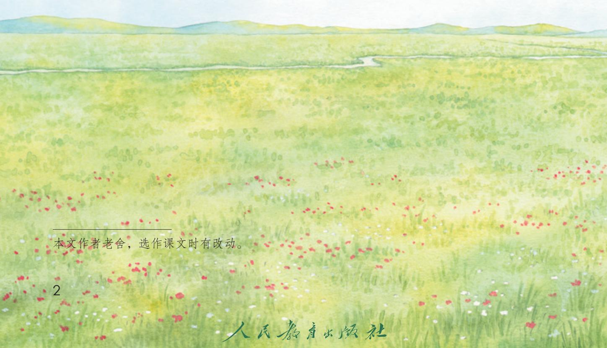

行车十分洒脱，只要方向不错，怎么走都可以。初入草原，听不见一点儿声音，也看不见什么东西，除了一些忽飞忽落的小鸟。走了yū  
许久，远远地望见了一条迂回的明如玻璃的带子—河！牛羊多起来，也看到了马群，隐隐有鞭子的轻响。快了，快到了。忽然，像被一阵风吹来似的，远处的小丘上出现了一群马，马上的男女老少穿着各色的衣裳，群马疾驰，襟飘带舞，像一条彩虹向我们飞过来。这是主人来到几十里外欢迎远客。见到我们，主人们立刻拨转马头，欢呼着，飞驰着，在汽车左右与前面引路。静寂的草原热闹起来：欢呼声，车声，马蹄声，响成一片。车跟着马飞过小丘，看měng  
见了几座蒙古包。

蒙古包外，许多匹马，许多辆车。人很多，都是从几十里外乘马或坐车来看我们的。主人们下了马，我们下了车。也不知道是谁的手，总是热乎乎地握着，握住不放。大家的语言不同，心可是一样。你说你的，我说我的，总的意思是民族团结互助。

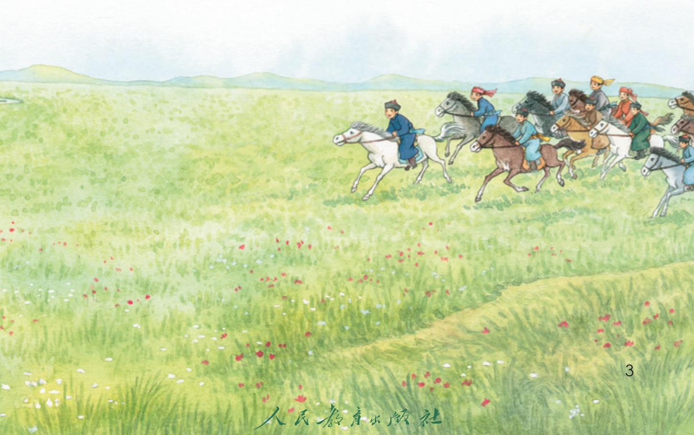

也不知怎的，就进了蒙古包。奶茶倒上了，奶豆腐摆上了，主客都盘腿坐下，谁都有礼貌，谁都又那么亲热，一点儿不拘束。不大一会儿，好客的主人端进来大盘的手抓羊肉。干部向我们敬酒，七十岁的老翁向我们敬酒。我们回敬，主人再举杯，我们再è回敬。这时候，鄂温克族姑娘们戴着尖尖的帽子，既大方，又稍sè有点儿羞涩，来给客人们唱民歌。我们同行的歌手也赶紧唱起来，歌声似乎比什么语言都更响亮，都更感人，不管唱的是什么，听者总会露出会心的微笑。

饭后，小伙子们表演套马、摔跤，姑娘们表演了民族舞蹈。客人们也舞的舞，唱的唱，还要骑一骑蒙古马。太阳已经偏西，谁也不肯走。是啊！蒙汉情深何忍别，天涯碧草话斜阳！

## 毯玻璃裳虹蹄腐稍微

朗读课文，想象草原迷人的景色，读出自己的感受。背诵第1自然段。

读下面的句子，回答括号里的问题。再从课文中找出其他类似的句子，读一读，抄写下来。

那些小丘的线条是那么柔美，就像只用绿色渲染，不用墨线勾勒的中国画那样，到处翠色欲流，轻轻流入云际。这种境界，既使人惊叹，又叫人舒服，既愿久立四望，又想坐下低吟一首奇丽的小诗。（哪句是直接写草原景色的？哪句写了作者的感受？在写景中融入感受有什么好处？）

“蒙汉情深何忍别，天涯碧草话斜阳”，你从课文哪些地方体会到了“蒙汉情深”？生活中你也有过与人惜别的经历吧，和同学交流。

# ② 丁香结

今年的丁香花似乎开得格外茂盛，城里城外，都是一样。城里街旁，尘土纷嚣之间，忽然呈出两片雪白，顿使人眼前一亮，再仔细看，才知是两行丁香花。有的宅院里探出半树银妆，星星般的小花缀满枝头，从墙上窥着行人，惹得人走过了还要回头望。

城外校园里丁香更多。最好的是图书馆北面的丁香三角地，种有十数棵的白丁香和紫丁香。月光下白的潇洒，紫的朦胧。还有淡淡的幽雅的甜香，非桂非兰，在夜色中也能让人分辨出，这是丁香。

在我断断续续住了近三十年的斗室外，有三棵白丁香。每到春来，伏案时拾头便看见檐前积雪。雪色映进窗来，香气直透毫端。人也似乎轻灵得多，不那么浑浊笨拙了。从外面回来时，最先映入cēn cī眼帘的，也是那一片莹白，白下面透出参差的绿，然后才见那两扇红窗。我经历过的春光，几乎都是和这几树丁香联系在一起的。那十字小白花，那样小，却不显得单薄。许多小花形成一簇，许多簇花开满一树，遮掩着我的窗，照耀着我的文思和梦想。

古人诗云：“芭蕉不展丁香结”“丁香空结雨中愁”。在细雨迷wǔ蒙中，着了水滴的丁香格外妩媚。花墙边两株紫色的，如同印象派的画，线条模糊了，直向窗前的莹白渗过来。让人觉得，丁香确实该和微雨连在一起。

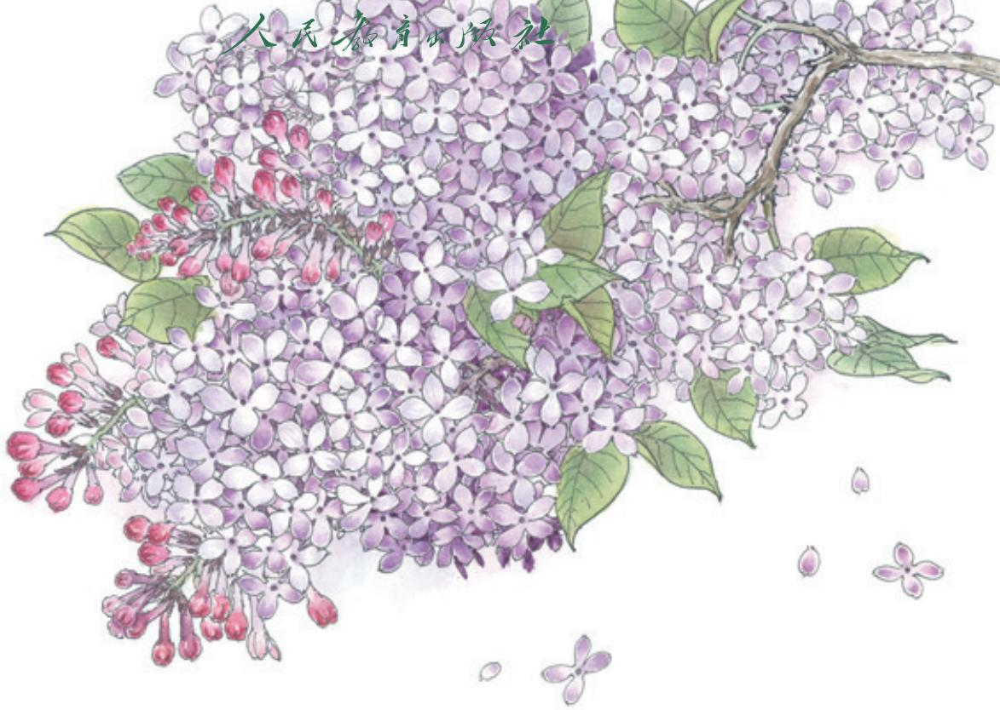

只是赏过这么多年的丁香，却一直不解，何以古人发明了丁香结的说法。今年一次春雨，久立窗前，望着斜伸过来的丁香枝条上bāo一柄花蕾。小小的花苞圆圆的，鼓鼓的，恰如衣襟上的盘花扣。我才恍然，果然是丁香结。

丁香结，这三个字给人许多想象。再联想到那些诗句，真觉得它们负担着解不开的愁怨了。每个人一辈子都有许多不顺心的事，一件完了一件又来。所以丁香结年年都有。结，是解不完的；人生中的问题也是解不完的，不然，岂不太平淡无味了吗？

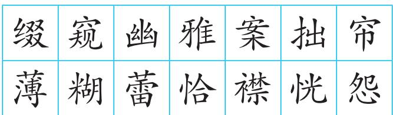

## 人民教育出版社

朗读课文。说说作者是从哪几个方面描写丁香的。

读下面的句子，联系上下文回答括号里的问题。

每到春来，伏案时抬头便看见檐前积雪。雪色映进窗来，香气直透毫端。（这里的“积雪”指什么？你是从哪里看出来的？）

D 在细雨迷蒙中，着了水滴的丁香格外妩媚。花墙边两株紫色的，如同印象派的画，线条模糊了，直向窗前的莹白渗过来。让人觉得，丁香确实该和微雨连在一起。（雨中丁香具有怎样的特点？想象一下这幅画面。作者为什么说“丁香确实该和微雨连在一起”？）

丁香结引发了作者对人生怎样的思考？结合生活实际，谈谈你的理解。

## 阅读链接

芭蕉不展丁香结，同向春风各自愁。

——李商隐《代赠》

殷勤解却丁香结，纵放繁枝散诞春。

——陸龟蒙《丁香》

霜树尽空枝，肠断丁香结。

-冯延巳《醉花间》

青鸟不传云外信，丁香空结雨中愁。

——李璟《摊破浣溪沙》

## ③ 古诗词三首

宿建德江

[唐]孟浩然

zhǔ  
移舟泊烟渚®，  
日暮客愁新。 注释kuàng  
野旷天低树， ①〔建德江]指新安江流经建德（今属浙江）的一段。  
江清月近人。 ②〔渚〕水中间的小块陆地。

六月二十七日望湖楼醉书shì[宋]苏轼

黑云翻墨未遮山，  
白雨跳珠乱入船。注释  
卷地风来忽吹散，①〔望湖楼〕在今浙江杭州西  
望湖楼下水如天。 湖边。

西江月①·夜行黄沙道中

[宋]辛弃疾

明月别枝惊鹊，清风半夜鸣蝉。稻花香里说丰年，听取蛙声一片。 七八个星天外，两三点雨山前。旧时茅店社林，路转溪桥忽见。

注释

①〔西江月〕词牌名。

②〔夜行黄沙道中〕词题。黄沙即黄沙岭，在今江西上饶的南面。

③〔别枝〕横斜的树枝。

④〔茅店〕用茅草盖的旅舍。

⑤〔社林〕社庙丛林。社，社庙，土地庙。

⑥〔见〕同“现”。

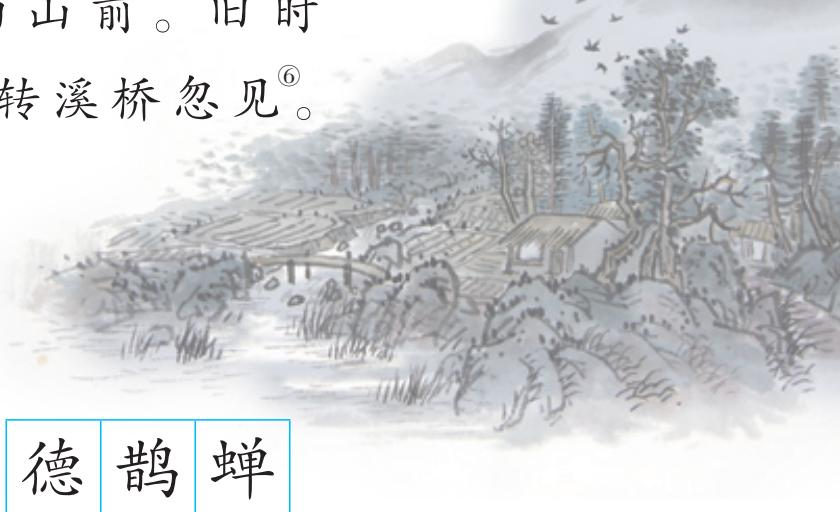

有感情地朗读课文。背诵课文。默写《西江月·夜行黄沙道中》。

《宿建德江》《西江月·夜行黄沙道中》都写了月夜的景色，表达的情感却不一样，结合诗句说一说。

《六月二十七日望湖楼醉书》每一句诗都是一幅画，说说你“看”到了怎样的画面。

# ④花之歌

朗读课文。想想从哪些地方可以看出“我”是花，再找出课文和“阅读链接”中想象奇特的地方，和同学交流。

我是大自然的话语，大自然说出来，又收回去，藏在心间，然后又说一遍……

我是星星，从苍穹坠落在绿茵中。

我是诸元素之女：冬将我孕育，春使我开放，夏让我成长，秋令我昏昏睡去。

我是亲友之间交往的礼品，我是婚礼的冠冕， 我是生者赠予死者最后的祭献。

清早，我同晨风一道将光明欢迎；傍晚，我又与群鸟一起为它送行。

我在原野上摇曳，使原野风光更加旖旎；我fù在清风中呼吸，使清风芬芳馥郁。我微睡时，黑夜星空的千万颗亮晶晶的眼睛对我察看；我醒来时，白昼的那只硕大无朋的独眼向我凝视。

## 杨柳与水莲

晓风里的杨柳对残月下的水莲说：

“太阳起来了，你睡醒了吗？你花苞似的眼里为什么含了清泪？”

“它是我昨夜恐惧悲哀的泪，也是我今朝欢欣感激的泪。”

“你恐惧些什么？你悲哀些什么？”

“啊，夜的黑暗啊，污泥的冷湿啊！”

“你不曾看见夜的美吗？”

“我含泪的眼和悲哀的心，一届黄昏，就深藏到绿叶的沉梦里。”

“夜的幕上有繁星织就了的花园，园中有月神在徘徊着，有牛童织女在恋爱着，有夜莺啼着，有花香绕着，你何不从那绿叶的帘里，来到碧夜的幕中！”

水莲说：“啊，是啊！”

太阳落后，明月起时，可怜的水莲，抱着她悲哀的心，含泪的眼，婷婷地立在黑暗的深处。

-本文作者宗白华，选用时有改动

## 习作

## 变形记

《花之歌》是花的自述，想象奇特，读来很有趣味。如果你有这样一个机会，把自己变成另一种事物，会发生什么呢？

你可以变得很小，如一只蚂蚁，一棵草，一粒石子；也可以变得很大，如一头大象，一辆汽车，甚至是一个星球。

变形后，你生活的世界将随之发生改变。

如果你变成一只蚂蚁，可以在笔杆上散步，可以在书桌上探险；可能会结交几位蚂蚁朋友，可能会跟着哪只小昆虫去探索一个全新的世界……

如果你变成一盏路灯，你将无法移动，每天都有形形色色的人从你面前走过，你会看到很多发生在路上的故事…

从下面的题目中选一个来写你的故事，也可以自拟一个有趣的题目。地球自述 我是一条幸福的蚯蚓飘在天上的日子 夜晚，一棵大树下的故事

发挥想象，把你“变形”后的经历写下来，注意把重点部分写详细一些。写完后，和同学交换习作，看看他们对你的“世界”是不是感兴趣，再根据他们的意见修改自己的习作。

# 语文园地

## 交流平台

阅读文章时，我们要注意从所读的内容想开去。

可以联系自己的生活经验想开去。如，阅读《草原》，读到课文中主客相聚与惜别的内容，可以联想生活中自己与别人相聚和惜别的情景，与作者产生共鸣，从而加深对课文思想感情的理解。

还要能从课文内容联想到更多。如，《丁香结》写到丁香结引发了作者对人生的思考，由此可以想到其他有象征意义的植物，如梅、兰、竹、菊，想到这些植物象征着什么，由这些植物想到人生的追求。

阅读的时候能想开去，不仅可以深化对课文内容的理解，而且可以活跃思想，激发创造力。我们应该在这方面多下功夫。

## 词句段运用

读一读，体会下面句子的特点，说说这样写的好处。

我是亲友之间交往的礼品，我是婚礼的冠冕，我是生者赠予死者最后 的祭献。

漓江的水真静啊，静得让你感觉不到它在流动；漓江的水真清啊，清得可以看见江底的沙石；漓江的水真绿啊，绿得仿佛那是一块无瑕的翡翠。

花开了，就像睡醒了似的。鸟飞了，就像在天上逛似的。虫子叫了，就像在说话似的。

## 人民教育出版社

读下面的句子，再说说分号的用法。

我在原野上摇曳，使原野风光更加旖旎；我在清风中呼吸，使清风芬芳馥郁。我微睡时，黑夜星空的千万颗亮晶晶的眼睛对我察看；我醒来时，白昼的那只硕大无朋的独眼向我凝视。

太阳晒着地面，有些地区吸收的热量多，那里的空气就比较热；有些地区吸收的热量少，那里的空气就比较冷。空气有冷有热，才能流动，成为风。

你注意过路牌吗？我们可以借助拼音认识地名。

复兴路 西 FUXING LU 东

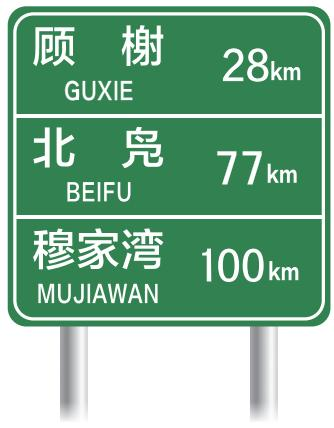

我留意 到了地名拼音白 的拼写规则。

我还知道怎么用拼音拼写自己的名字。

## 日积月累

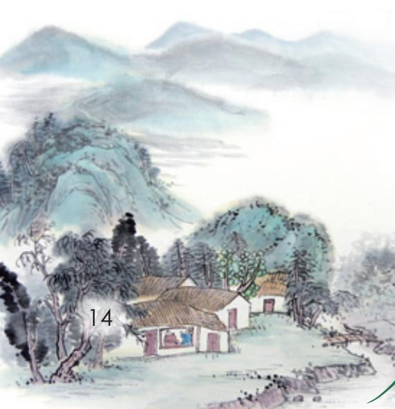

过故人庄

[唐]孟浩然

故人具鸡黍，邀我至田家。  
绿树村边合，青山郭外斜。  
开轩面场圃，把酒话桑麻。  
待到重阳日，还来就菊花。

# 第二单元

重温革命岁月，把历史的声音留在心里。

了解文章是怎样点面结合写场面的。

尝试运用点面结合的写法记一次活动。

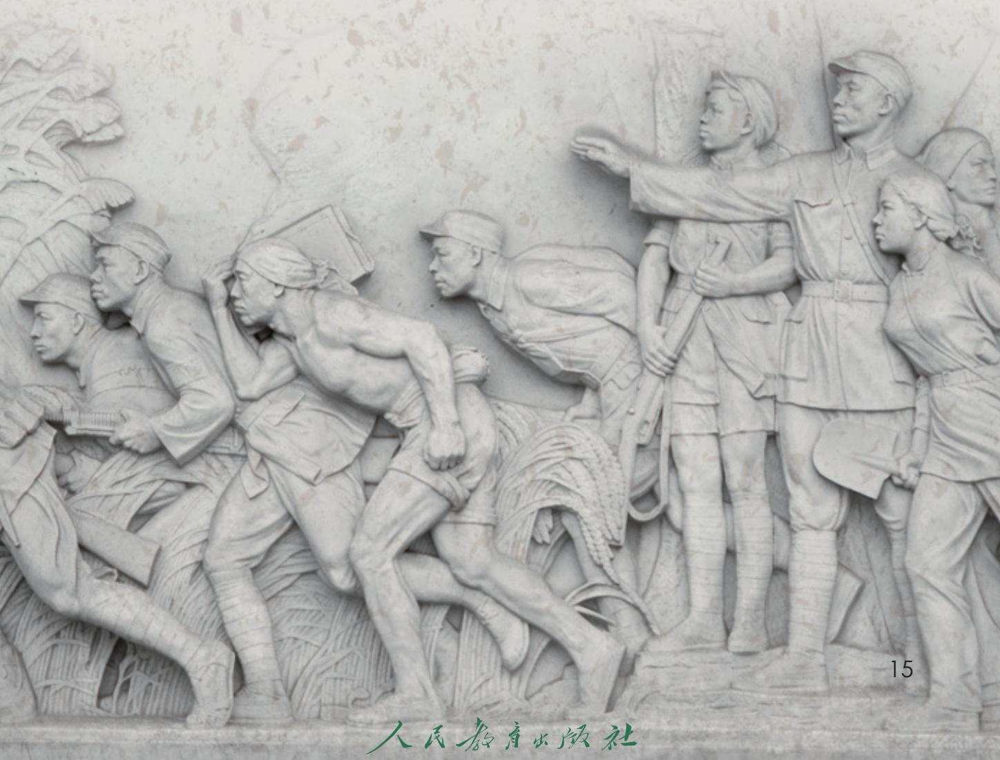

## ⑤ 七律·长征

红军不怕远征难 、  
万水千山只等闲wēi yí  
五岭逶迤腾细浪，páng bó wán  
乌蒙磅礴走泥丸。  
金沙®水拍云崖暖，  
大渡桥横铁索寒。mín  
更喜岷山千里雪，  
三军过后尽开颜。

## 律崖渡 索

本诗作者毛泽东。

## 注释

①〔五岭〕越城岭、都庞岭、萌渚岭、骑田岭、大庾岭的总称，位于湖南、江西、广东、广西四省区交界处。  
②〔乌蒙〕即乌蒙山，位于贵州、云南两省交界处。  
③〔金沙〕即金沙江，指长江上游从青海玉树到四川宜宾这一段。  
④〔云崖〕高耸入云的山崖。  
⑤〔大渡〕即大渡河，位于四川中西部。  
⑥〔岷山〕位于四川、甘肃两省交界处。  
⑦〔三军〕这里指红军队伍。

朗读课文，试着读出磅礴的气势。背诵课文。

读一读，说说诗句的意思和表达的情感。

五岭逶迤腾细浪，乌蒙磅礴走泥丸。

◇金沙水拍云崖暖，大渡桥横铁索寒。

## 阅读链接

## 菩萨蛮·大柏地

毛泽东

赤橙黄绿青蓝紫，谁持彩练当空舞?雨后复斜阳，关山阵阵苍。

当年鏖战急，弹洞前村壁。装点此关山，今朝更好看。

# ⑥狼牙山五壮士

1941年秋，日寇集中兵力，向我晋察冀根据地大举进犯。当时，七连奉命在狼牙山一带坚持游击战争。经过一个多月英勇奋战，七连决定向龙王庙转移，把掩护群众和连队转移的任务交给了六班。

为了拖住敌人，七连六班的五个战士一边痛击追上来的敌人，  
一边有计划地把大批敌人引上了狼牙山。他们利用险要的地形，把  
冲上来的敌人一次又一次地打了下去。班长马宝玉沉着地指挥战  
斗，让敌人走近了，才下命令狠狠地打。副班长葛振林打一枪就大  
吼一声，好像细小的枪口喷不完他的满腔怒火。战士宋学义扔手榴  
弹总要把胳膊抡一个圈，好使出浑身的力气。胡德林和胡福才这两běng  
个小战士把脸绷得紧紧的，全神贯注地瞄准敌人射击。敌人始终不qí qū  
能前进一步。在崎岖的山路上，横七竖八地躺着许多敌人的尸体。

五位战士胜利地完成了掩护任务，准备转移。面前有两条路：一条通往主力转移的方向，走这条路可以很快追上连队，可是敌人紧跟在身后；另一条通向狼牙山的顶峰棋盘陀，那儿三面都是悬崖绝壁。走哪条路呢？为了不让敌人发现群众和连队主力，班长马宝玉斩钉截铁地说了一声：“走！”带头向棋盘陀走去。战士们热血沸腾，紧跟在班长后面。他们知道班长要把敌人引上绝路。

五位壮士一面向顶峰攀登，一面依托大树和岩石向敌人射击。山路上又留下了许多具敌人的尸体。到了狼牙山峰顶，五位壮士居

高临下，继续向紧跟在身后的敌人射击。不少敌人坠落山涧，粉身碎骨。班长马宝玉负伤了，子弹都打完了，只有胡福才手里还剩下一颗手榴弹。他刚要拧开盖子，马宝玉抢前一步，夺过手榴弹插在腰间，猛地举起一块大石头，大声喊道：“同志们！用石头砸！”顿时，石头像雹子一样，带着五位壮士的决心，带着中国人民的仇quā  
恨，向敌人头上砸去。山坡上传来一阵叽里呱啦的叫声，敌人纷纷滚落深谷。

sōu

又一群敌人扑上来了。马宝玉嗖的一声拔出手榴弹，拧开盖子，用尽全身气力扔向敌人。随着一声巨响，手榴弹在敌群中开了花。

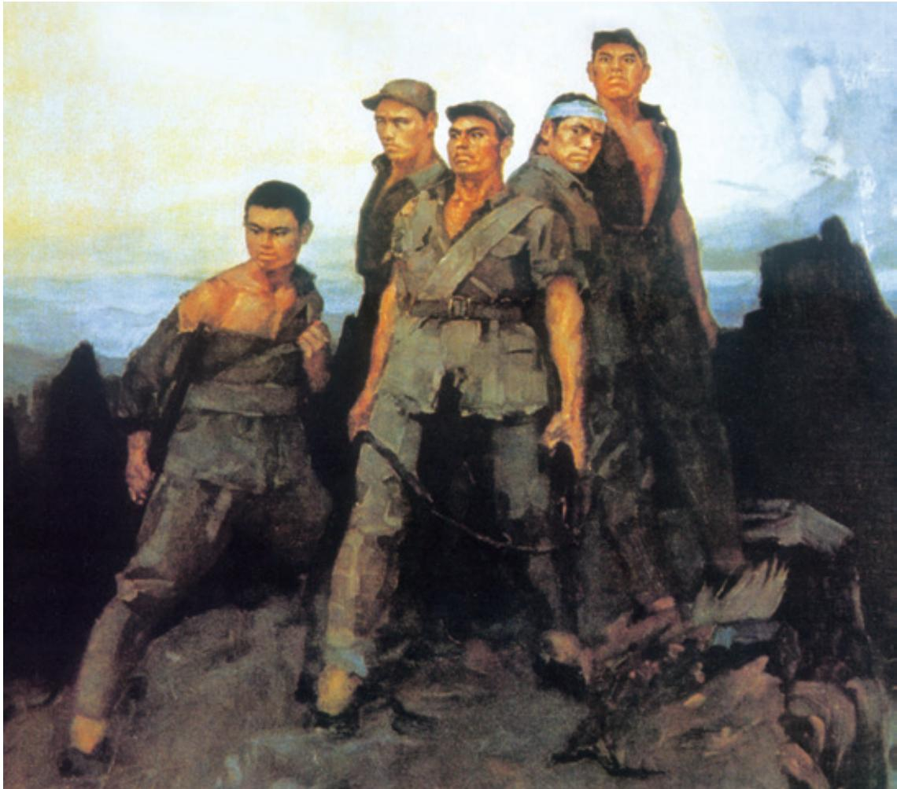  
（图）詹建俊

五位壮士屹立在狼牙山顶峰，眺望着群众和部队主力远去的方向。他们回头望望还在向上爬的敌人，脸上露出胜利的喜悦。班长马宝玉激动地说：“同志们，我们的任务胜利完成了！”说罢，他把那支从敌人手里夺来的枪砸碎了，然后走到悬崖边上，像每次发起冲锋一样，第一个纵身跳下深谷。战士们也昂首挺胸，相继从悬崖往下跳。狼牙山上响起了他们壮烈豪迈的口号声：

“打倒日本帝国主义！”

“中国共产党万岁！”

这是英雄的中国人民坚强不屈的声音！这声音惊天动地，气壮山河！

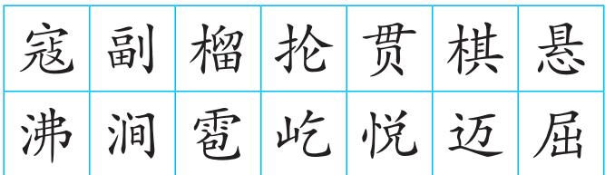

朗读课文。根据课文内容填一填，再讲讲这个故事。  
接受任务（ )( ）( ）英勇跳崖

读下面的句子，注意加点的部分，体会五位壮士的英雄气概。在课文中画出类似的词句，和同学交流。

为了不让敌人发现群众和连队主力，班长马宝玉斩钉截铁地说了一声：“走！”带头向棋盘陀走去。战士们热血沸腾，紧跟在班长后面。

他刚要拧开盖子，马宝玉抢前一步，夺过手榴弹插在腰间，猛地举起一块大石头，大声喊道：“同志们！用石头砸！”

课文第2自然段既关注了人物群体，也写了每一位战士，结合相关内容说说这样写的好处。

# ⑦开国大典

1949年10月1日，中华人民共和国中央人民政府成立，在首都北京举行典礼。参加开国大典的，有中华人民共和国中央人民政府主席、副主席、各位委员，有中国人民政治协商会议全体代表，有工人、农民、学校师生、机关工作人员、城防部队，总数达三十万人。观礼台上还有外宾。

会场在天安门广场。广场呈丁字形。丁字形一横的北面是一道河，河上并排架着五座白石桥；再北面是城墙，城墙中央高高耸起天安门的城楼。丁字形的一竖向南直伸到中华门。在一横一竖的交点的南面，场中挺立着一根电动旗杆。

主席台设在天安门城楼上。城楼檐下，八盏大红宫灯分挂两边。靠着城楼左右两边的石栏，八面红旗迎风招展。

丁字形的广场汇集了从四面八方来的群众队伍。早上六点钟qíng起，就有群众的队伍入场了。人们有的擎着红旗，有的提着红灯。进入会场后，按照预定的地点排列。工人队伍中，有从老远的长辛店、丰台、通县来的铁路工人，他们清早到了北京车站，一下火车就直奔会场。郊区的农民是五更天摸着黑起床，步行四五十里路赶来的。到了正午，天安门广场已经成了人的海洋，红旗翻动，像海上的波浪。

（）

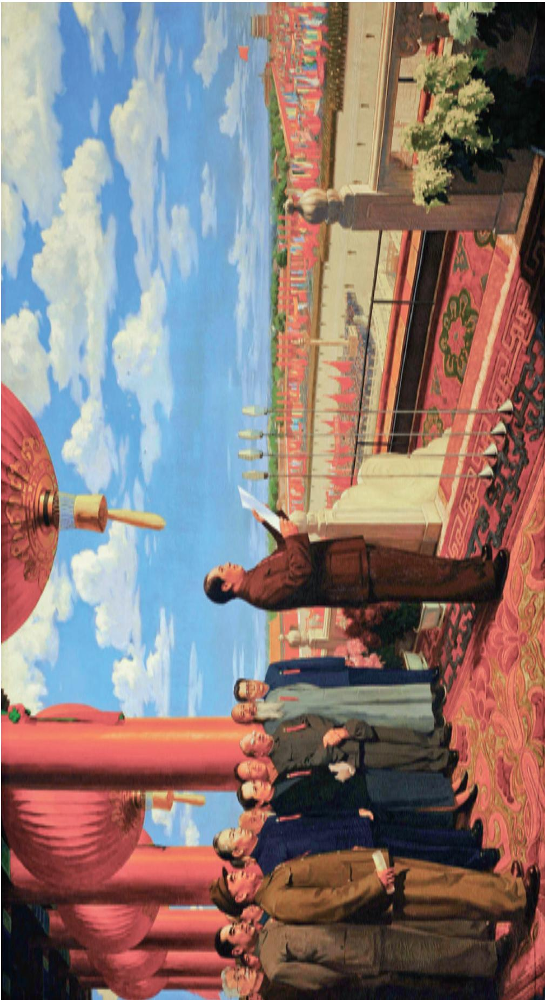  
人民教育出版社

下午三点整，会场上爆发出一阵排山倒海的掌声，中华人民共和国中央人民政府主席毛泽东出现在主席台上，跟群众见面了。三十万人的目光一齐投向主席台。

中央人民政府秘书长林伯渠宣布典礼开始。中央人民政府主席、副主席、各位委员就位。接着，毛泽东主席宣布：“中华人民共和国中央人民政府今天成立了！”

这庄严的宣告，这雄伟的声音，使全场三十万人一齐欢呼起来。这庄严的宣告，这雄伟的声音，经过无线电广播，传到长城内外，传到大江南北，使全中国人民的心一齐欢跃起来。

接着，升国旗。毛主席亲自按动连通电动旗杆的电钮，新中国的国旗—五星红旗在雄壮的《义勇军进行曲》中徐徐上升。zhān三十万人一齐脱帽肃立，一齐拾起头，瞻仰这鲜红的国旗。五星红旗升起来了，表明中国人民从此站起来了。

升旗的时候，礼炮响起来。每一响都是五十四门大炮齐发，一共二十八响。起初是全场肃静，只听见炮声和乐曲声，只听见国旗zhì和其他许多旗帜飘拂的声音，到后来，每一声炮响后，全场就响起一阵雷鸣般的掌声。

接着，毛主席在群众一阵又一阵的掌声中宣读中央人民政府的公告。他用强有力的语调向全世界发出新中国的声音。他读到“选举了毛泽东为中央人民政府主席”这一句的时候，广场上的人们热爱领袖的心情融成一阵热烈的欢呼。观礼台上同时响起一阵掌声。

毛主席宣读公告完毕，阅兵式开始。中国人民解放军朱德总司niè  zhēn令任检阅司令员，聂荣臻将军任阅兵总指挥。朱总司令和聂将军同乘汽车，先检阅部队，然后朱总司令回到主席台，宣读中国人民解放军总部的命令。受检阅的部队就由聂将军率领，在《中国人民解放军进行曲》的乐曲声中，由东往西，缓缓进场。

开头是海军两个排，雪白的帽子，跟海洋一个颜色的蓝制服。接着是步兵一个师，以连为单位，列成方阵，齐步行进。接着是炮兵一个师，野炮、榴弹炮等各式各样的炮，都排成一字形的横列前进。接着是一个战车师，各种装甲车和坦克车两辆或三辆一排，整整齐齐地前进；战士们挺着胸膛站在战车上，像钢铁巨人一样。接着是一个骑兵师，“红马连”一色红马，“白马连”一色白马，六马并行，马腿的动作完全一致。以上这些部队，全都以相等的距离和相同的速度经过主席台前。当战车部队经过的时候，人民空军的飞机也一队队排成人字形，飞过天空。毛主席首先向空中招手。群众看见了，都把头上的帽子、手里的报纸和别的东西抛上天去，欢呼声盖过了飞机的隆隆声。

两个半钟头的检阅，广场上不断地欢呼，不断地鼓掌，一个高潮接着一个高潮。群众差不多把嗓子都喊哑了，把手掌都拍麻了，还觉得不能够表达自己心里的欢喜和激动。

阅兵式完毕，已经是傍晚的时候。天安门广场上的灯笼火把全都点起来，一万支礼花陆续射入天空。天上五颜六色的火花结成彩，地上千千万万的灯火一片红。群众游行就在这时候开始。游行队伍分东西两个方向出发，他们擎着灯，舞着火把，高呼：“中国共产党万岁！”“中华人民共和国万岁！”“中央人民政府万岁！”他们一队一队按照次序走，走到正对天安门的白石桥前，就举起灯笼火把，高声欢呼：“毛主席万岁！”“毛主席万岁！”毛主席在城楼上主席台前边，向前探着身子，不断地向群众挥手，不断地高呼：“人民万岁！”“同志们万岁！”

晚上九点半，游行队伍才完全走出会场。两股“红流”分头向东城、西城的街道流去，光明充满了整个北京城。

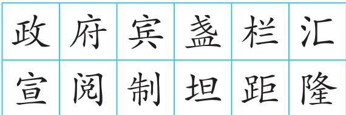

默读课文，体会新中国成立时人们自豪、激动的心情。想想从群众入场到游行结束，课文写了哪几个场面，连起来简要说说开国大典的过程。

读读写阅兵式的部分，说说课文是怎样点面结合写场面的。

读下面的句子，体会字里行间传达出的热烈、庄严的气氛。再从课文中找出这样的句子，在旁边作批注，和同学交流。

主席台设在天安门城楼上。城楼檐下，八盏大红宫灯分挂两边。靠着城楼左右两边的石栏，八面红旗迎风招展。

到了正午，天安门广场已经成了人的海洋，红旗翻动，像海上的波浪。

两个半钟头的检阅，广场上不断地欢呼，不断地鼓掌，一个高潮接着一个高潮。群众差不多把嗓子都喊哑了，把手掌都拍麻了，还觉得不能够表达自己心里的欢喜和激动。

# ⑧灯光

用较快的速度默读课文，和同学讨论：课文中，天安门前璀璨的灯光、郝副营长书上插图中的灯光和战场上微弱的火光，三者之间有什么联系？它们与课文题目又有什么联系？

我爱到天安门广场走走，尤其是晚上。广场上无数盏灯静静地照耀着周围的宏伟建筑，令人心头光明而又温暖。

清明节前的一个晚上，我又漫步在广场上，忽然背后传来一声赞叹：“多好啊！”我心头微微一震，是什么时候听到过这句话来ō着？噢，对了，那是很久以前了。于是，我沉入了深深的回忆。

1947年的初秋，当时我是战地记者。挺进豫皖苏平原的我军部队，把国民党军五十七师紧紧地包围在一个叫沙土集的村子里。激jiān烈的围歼战就要开始了。天黑的时候，我摸进一片茂密的沙柳林，hǎo在匆匆挖成的交通沟里找到了突击连，来到了郝副营长的身边。

郝副营长是一位著名的战斗英雄，虽然只有二十二岁，已经打过不少仗了。今晚就由他带领突击连去攻破守敌的围墙，为全军打通歼灭敌军的道路。大约一切准备工作都完成了，这会儿，他正倚着交通沟的胸墙坐着，一手拿着火柴盒，夹着自制的烟卷，一手轻轻地划着火柴。他并没有点烟，却借着微弱的亮光看摆在双膝上的一本破旧的书。书上有一幅插图，画的是一盏吊着的电灯，一个孩子正在灯下聚精会神地读书。他注视着那幅图，默默地沉思着。

“多好啊！”他在自言自语。突然，他凑到我的耳朵边轻轻地

问：“记者，你见过电灯吗？”

我不由得一愣，摇了摇头，说：“没见过。”我说的是真话。我从小生活在农村，真的没见过电灯。

“听说一按电钮，那玩意就亮了，很亮很亮。”他又划着一根火柴，点燃了烟，又望了一眼图画，深情地说：“赶明儿胜利了，咱们也能用上电灯，让孩子们都在那样亮的灯光底下学习，该多好啊！”他把头靠在胸墙上，望着漆黑的夜空，完全陷入了对未来chōng jǐng的憧憬里。

半个小时以后，我刚回到团指挥所，战斗就打响了。三发绿色的信号弹升上天空，接着就是震天动地的炸药包爆炸声。守敌的围墙被炸开一个缺口，突击连马上冲了进去。没想到后续部队遭到敌人炮火的猛烈阻击，在黑暗里找不到突破口，和突击连失去了联系。

整个团指挥所的人都焦急地钻出了地堡，望着黑魆魆的围墙。突然，黑暗里出现一星火光，一闪，又一闪。这火光虽然微弱，对于寻找突破口的部队来说已经足够亮了，战士们靠着这微弱的火光冲进了围墙。围墙里响起了一片喊杀声。

后来才知道，在这千钧一发的时刻，是郝副营长划着了火柴，点燃了那本书，举得高高的，为后续部队照亮了前进的路。可是，火光暴露了他自己，他被敌人的机枪打中了。

这一仗，我们消灭了敌人的一个整编师。战斗结束后，我们把郝副营长埋在茂密的沙柳丛里。这位年轻的战友为了让孩子们能够在电灯底下学习，不惜牺牲自己的生命，他自己却没有来得及见一见电灯。

cuǐ càn

事情已经过去很长时间了。在天安门前璀璨的华灯下面，我又想起这位亲爱的战友来。

# qiū⑨我的战友邱少云

我们读过英雄黄继光的故事，这篇课文的主人公同样是一位抗美援朝英雄。默读课文，找出描写“我”心理活动的句子，体会邱少云是怎样一位“伟大的战士”。课文写了邱少云和战友们潜伏的山沟环境，又写了邱少云任凭烈火烧身纹丝不动，结合相关内容说说两者有什么联系。

天亮以前，我们在391高地的山坳里，找了一条比较隐蔽的山沟潜伏起来。

太阳渐渐爬上山头，晒干了我们身上的寒霜，早上冻麻了的腿也开始暖和起来。我们本来打算趁这时候在温暖的阳光下睡一会儿，因为已经熬了整整一夜，而且当天晚上还有激烈的战斗在等着，需要养养精神，好完成晚上的战斗任务，可是我怎么也合不上眼睛。谁能趴在敌人的鼻子底下睡大觉呢？

hé

我发现这条干涸的小山沟并不十分隐蔽。我们离敌人太近了，前面几十米就是敌人的前沿阵地。我们不但可以看见敌人设置的铁丝网和胸墙，而且可以看见敌人主阵地上的地堡和火力点，甚至连敌人的谈话声都听得见。可以想见，敌人居高临下，发现我们当然quán更容易。我们必须僵卧着一动不动，一声低低的咳嗽或者轻轻地蜷一下腿，都可能被敌人发觉。

wěi

我们全靠身上的伪装掩护自己。我看了一下前面，班长和几个战士都伏在枯黄的茅草里，身上也披着厚厚的茅草作为伪装，猛一看去，很难发现他们。我又看了看伏在不远处的邱少云，他也全身伪装，隐蔽得更好，相隔这么近，我都几乎找不到他。

我们的炮兵不断地向敌人阵地上轰击，山顶上不时地腾起一团一团的青烟，敌人阵地前沿的地堡一个接一个地被掀翻了。炮兵的轰击不但摧毁了敌人的一部分工事，便于我们晚上突击，而且把敌人打得躲进隐蔽洞里，保证了潜伏部队的安全。

看到山顶上敌人被我军炮火轰击的情景，我只盼望快点儿天黑，好痛痛快快地打一仗。看看太阳，却老是停在原来的地方，就像钉住了似的。

约莫11点钟的时候，突然一发烟幕弹飞来，在附近爆炸了，一排一排的炮弹跟着打过来。显然，狡猾的敌人对他们阵地前沿的安全极不放心，又没有胆量冒着我军的炮火到这一带来搜索，只好把看家本领“火力警戒”拿出来了。

附近的荒草着火了，火苗子呼呼地蔓延着，烧得枯黄的茅草毕毕剥剥地响。恶毒的敌人竟使用燃烧弹来进行搜索了。

不一会儿，火已经烧到我面前，火苗子一伸一伸的，烤得我脸上热辣辣地疼。幸而面前有一堆不长草的乱石头挡着，火才没烧到我身上。

忽然，一阵浓重的棉布焦味钻进我的鼻子，我扭头一看，哎呀！火烧到了邱少云身上！他的棉衣已经烧着了，浑身火苗乱窜，看样子是溅上了燃烧弹的油液。趁着风势，一团烈火把他整个包围了。

这个时候，邱少云如果迅速从火堆里跳出来，就地打几个滚，身上的火是可以扑灭的。卧在他附近的任何一个人，如果跳过去把他拉出来，扯掉他着火的棉衣，也能救出自己的战友。但是这样一来，我们就会被山头上敌人的哨兵发觉，那么不仅是我们这一个班

要牺牲在这里，也不仅是埋伏在我们身后的整个潜伏部队要受到重大损失，更严重的是准备了好久的作战计划要完全落空。

我的心紧缩着，我担心这个年轻的战士会实在忍耐不住突然跳起来，或者突然叫出声来。我几次回过头来，不敢朝他那儿看，不忍看着我的战友被活活烧死，但是我又忍不住不看。我心里像刀绞一般，眼泪模糊了我的眼睛。

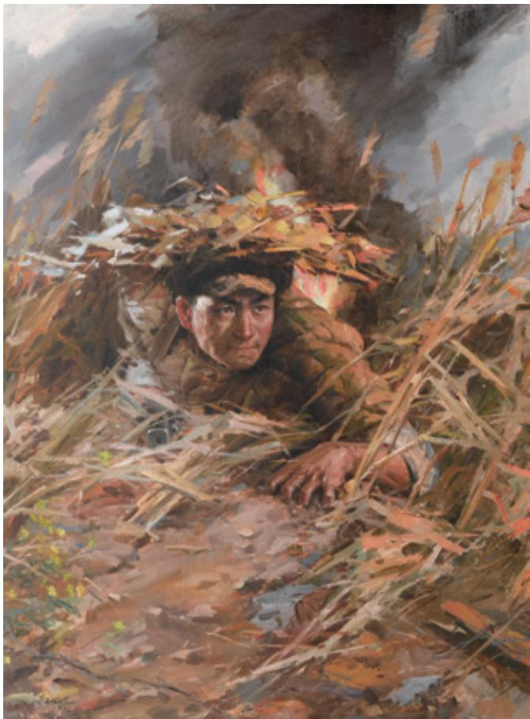  
（图）孙国岐

烈火在我的战友邱少云身上烧了半个多钟头才渐渐熄灭。这个伟大的战士，像千斤巨石，伏在那儿纹丝不动，直到牺牲前的最后一息，都没发出哪怕是极轻微的一声呻吟。

黄昏时，我们勇猛地冲上了敌人的阵地。在391高地上沸腾着激动人心的口号：“为邱少云同志报仇！”

我当时的感觉，仿佛邱少云同志并没有牺牲，他和我们一起向敌人冲锋！

我永远忘不了那一天——1952年10月12日。

## 口语交际

## 演 讲

你作过演讲吗?

我竟选班干部的时候作过演讲。

我没作过演讲，不过很想试试……

让我们在班上开展一次演讲活动。可以从下面选择一个话题范围，也可以自定。

## 科学

## 读书

## 家乡新貌

健康饮食

根据演讲的内容，拟定一个题目，如“读书的快乐”“拒食野味，从我做起”“远离垃圾食品，关注身体健康”。

作好演讲，首先要写好演讲稿。什么样的演讲稿才有说服力呢？

◇观点要鲜明。

选择合适的材料说明观点，如，列举有代表性的事例，引用名言警句。

要有感染力，可以引用生动的故事。

演讲稿写好后，可以自己先练习一下，试试怎样演讲更好。演讲后，听听大家的建议，提高自己的演讲水平。

语气、语调适当，姿應大方。

利用停顿、重复或者辅以动作强调要点，增强表现力。

# 多彩的活动

“祖国在我心中”朗诵会、学校运动会、“六一”儿童节演出，植树、端午节看赛龙舟、看望孤寡老人…这些校内外活动，你参加过哪些？

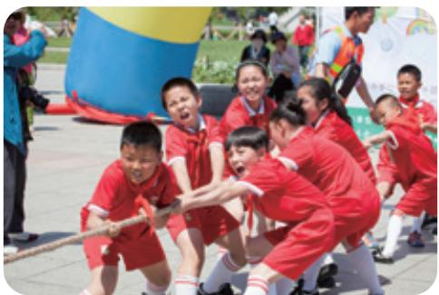

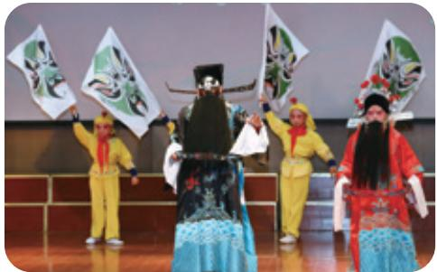

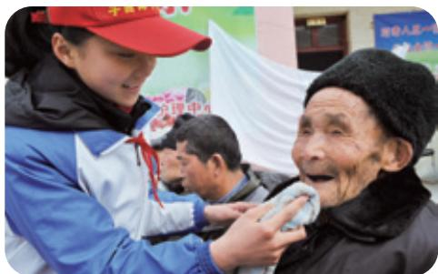

选一次活动写下来，和同学分享你的经历。

写清楚活动过程，把印象深刻的部分作为重点来写。

写活动的场面时，既要关注整个场景，也要注意同学的表现，写一写他们的动作、语言、神态。

把活动中的体会写下来。

写完后读给同学听，根据他们的建议，用修改符号修改自己的习作。

# 人民教育出版社

# 语文园地

## 交流平台

本单元有的课文写到了大的场面，如狼牙山上的激烈战斗、开国大典中的阅兵式。课文在写这些场面时，运用了点面结合的方法。如，《开国大典》写阅兵式时，既从整体上写了受阅部队经过天安门广场时那种整齐威武的情景，又注意通过细节展现各个方阵的风采。这不仅让我们感受到了整个阅兵式的庄严、隆重，还让我们领略到了各个队伍的特色。

平时的阅读中，你是否也读到过这样的场面描写？在自己的习作中，你是怎样写场面的？和同学交流。

## 词句段运用

读句子，注意加点的部分，说说这样写的好处。

起初是全场肃静，只听见炮声和乐曲声，只听见国旗和其他许多旗帜飘拂的声音。

那里的天比别处的更可爱，空气是那么清鲜，天空是那么明朗，使我总想高歌一曲，表示我满心的愉快。

写人物说话时，可以不用“说”来表达。读句子，仿照着写一写。

清明节前的一个晚上，我又漫步在广场上，忽然背后传来一声赞叹：“多好啊！”

“我还有作业没完成，不能和你一起去玩了。”我婉言谢绝了伙伴的邀请。

“既然这样，你以后再也不要找我借书了！”话一出口，我就后悔了。

這兩个句子分別用“赞叹”“婉言谢绝”代替 了“说”。我还想到了“谈论、讲解、窃窃私语……”

妈妈俯下身子盯着我的眼睛，一脸焦急：“你的眼睛怎么肿了？”

也可以不用与“说”有关的词语……

## 书写提示

下面是两位同学的书写作品。我们也来试着写一写，举办一次书写作品展览。

孟郊诗×x×书

注意行款整齐、布局合理。

书写要正确，不出现错别字和不规范的字。

养成自我检视的习惯，不断提高书写水平。

我最亲爱的孩子啊！母亲不用千言万语来教育你，就用实行来教育你。在你长大成人之后，希望不要忘记你的母亲是为国而牺牲的！

摘自《赵一曼写给儿子的信》×××书

## 日积月累

捐躯赴国难，视死忽如归。 一曹植

祖宗疆土，当以死守，不可以尺寸与人。

位卑未敢忘忧国。 陆游

第三单元

读书好比串门儿隐身的串门儿。 杨绛

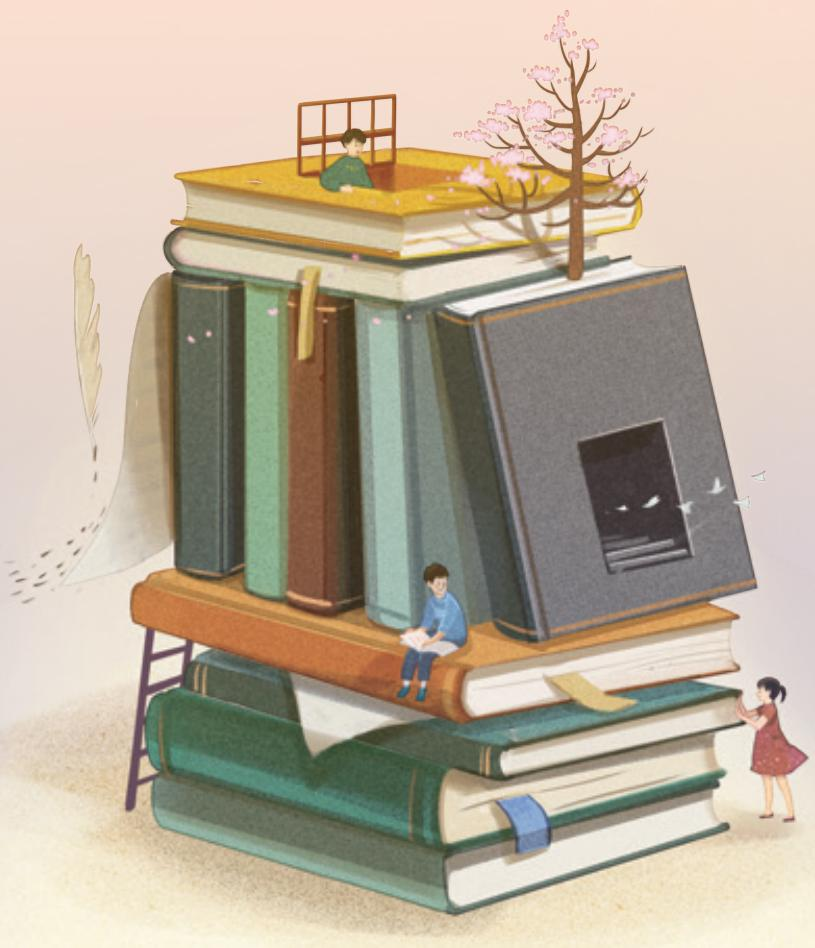

根据阅读目的，选用恰当的阅读方法。

写生活体验，试着表达自己的看法。

# 10 竹节人

同一篇文章，阅读的目的不同，关注的内容、采用的阅读方法也会有所不同。如果给你以下任务，你会怎么读《竹节人》这篇文章？

写玩具制作指南，并教别人玩这种玩具。

◇ 体会传统玩具给人们带来的乐趣。

讲一个有关老师的故事。

我们小时候的玩具，都是自己做的，也只能自己做。只要有一mǐ个人做了一件新鲜玩意，大家看了有趣，很快就能风靡全班，以至全校。

有一段时间，我们全迷上了斗竹节人。

把毛笔杆锯成寸把长的一截，这就是竹节人的脑袋连同身躯了，在上面钻一对小眼，供装手臂用。再锯八截短的，分别当四肢。用一根纳鞋底的线把它们穿在一起，就成了。锯的时候要小心，弄不好一个个崩裂，前功尽弃。

  
本文作者范锡林，选作课文时有改动。

那一段时间，妈妈怪我总是把毛笔弄丢，而校门口卖毛笔的老头则生意特别好。

教室里的课桌破旧得看不出年纪，桌huō面上是一道道豁开的裂缝，像黄河长江，一不小心，铅笔就从裂缝里掉下去了。

而现在，这些裂缝正好用来玩竹节人。

仔细想来，那个发明这竹节人的家伙，准也是坐这种课桌长大的。

把穿着九个竹节的鞋线嵌入课桌裂缝里，在下面一拉紧，那立在裂缝上的竹节们就站成一个壮士模

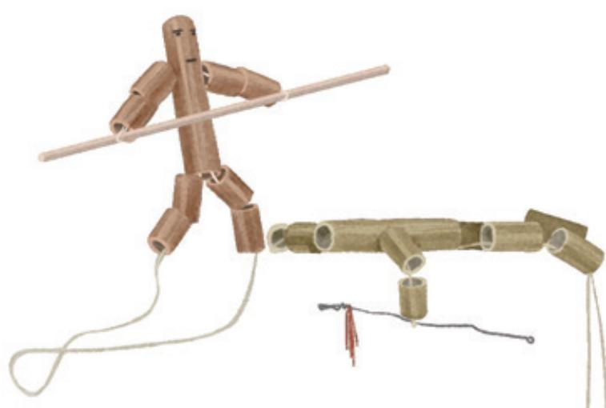

样，叉腿张胳膊，威风凛凛，跟现今健美比赛中那脖子老粗、浑身疙瘩肉的小伙子差不多。

将鞋线一松一紧，那竹节人就手舞之、身摆之地动起来。两个竹节人放在一起，那就是搏斗了，没头没脑地对打着，不知疲倦，也永不会倒下。

有时其中一个的线卡住了，那“斗士”便显出一副呆头呆脑的傻样子，挺着肚子净挨揍。

竹节人手上系上一根冰棍棒，就成了手握金箍棒的孙悟空，号称“齐天小圣”，四个字歪歪斜斜刻在竹节人背上，神气！

找到两根针织机上废弃的钩针，装在竹节人手上，就成了窦尔dūn敦的虎头双钩。把“金钩大王”刻在竹节人的胸口，神气！

用铅皮剪一把偃月刀，用铁丝系一绺红丝线做一柄蛇矛，给那竹节人装上，再挖空心思取一个更威风、更吓人、叫得更响的名号。

破课桌，俨然一个剑拔弩张的古战场。

还有同学别出心裁，想技高一筹，给竹节人粘上一个橡皮雕成的脑袋，做一套纸盔甲。一有机会，便得意扬扬招呼大伙来观摩。谁知弄巧成拙，中看不中用，没打几个回合，那粘上的脑袋连盔甲被它自己手里的大刀磕飞了，于是对方大呼胜利。

其实，竹节人的动作压根不由扯线人做主，那不过是在竹节间的线一紧一松间的胡乱耸动而已，可看上去，却挺像是那么回事。

黑虎掏心！泰山压顶！双龙抢珠！

咚锵咚锵咚咚锵！咚咚锵！

cuán

下课时，教室里摆开场子，吸引了一圈黑脑袋，攒着观战，还zhā跺脚拍手，咋咋呼呼，好不热闹。常要等老师进来，才知道已经上hòng课，便一哄作鸟兽散。

上课了，意兴依然不减，手痒痒的，将课本竖在面前当屏风，跟同桌在课桌上又搏将起来，这会儿，嘴里不便咚锵。

偏偏后面的同学不知趣，看得入了迷，伸长脖子，恨不能从我dān们肩膀上探过来，被那虎视眈眈的老师看出了破绽。

老师大步流星走过来，怒气冲冲伸手一拂，“屏风”颓然倒了，hè一切秘密暴露无遗。不消说，费了许多功夫做出来的，建立了赫赫áo伟绩，鏖战犹酣的两个竹节人被一把抓去。

下课后，眼巴巴看别的同学重新开战，玩得欢，不禁沮丧得要命，便一起悄悄溜到办公室窗户下的冬青丛里转悠，希望老师能像往常一样，把没收的东西扯散了，随手扔出窗外。

蹲着身子，瞪大眼，可一无所获。正悻悻然准备离去，却见同桌趴在窗玻璃旁看得津津有味。

我也凑过去，一探头，咦，看见了什么？

只见老师在他自己的办公桌上，玩着刚才收去的那竹节人。双手在抽屉里扯着线，嘴里念念有词，全神贯注，忘乎所以，一点儿也没注意到我们在偷看。

他脸上的神情，跟我们玩得入迷时一模一样。

于是，我跟同桌相视一笑，虽两手空空，但心满意足，轻手轻脚地溜了。

方才的那份小小的怨恨和沮丧化为乌有。

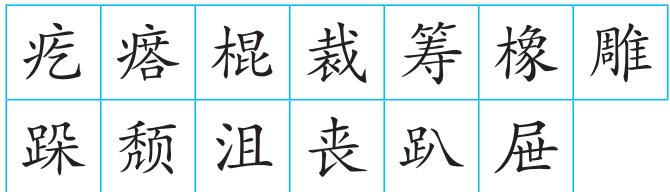

为完成三个不同的任务，你是怎样读这篇文章的？和同学交流。

为完成“写玩具制作指南，并教别人玩这种玩具”这个任务，可以先快速读全文，找到相关内容，再仔细读。

“体会传统玩具给人们带来的乐趣”，读的时候要特别注意文章中写“我们”投入地做玩具、玩玩具的部分………

为完成“讲一个有关老师的故事”这个任务，我主要关注了老师没收玩具、玩玩具的内容，重点梳理了故事的起因、经过、结果。

## 宇宙生命之谜

多年来，人们一直在探索宇宙生命问题。我们常常有这样的疑问：宇宙中，除了地球外，其他星球上是否也有生命存在？为了解决这个疑惑，有位同学找到了这篇文章。

浏览了这一段后，发现它对了解地球之外是否有生命没有帮助。

每个自然段往往有提示主要意思的语句，阅读时我要注意找出来。

古时候，科学不发达，人们一直向往着“天上的世界”。于是，有了许许多多的故事：嫦娥奔pán月，仙女下凡，蟠桃盛会……现在，科学发达了，人们知道那都是古人编出来的。但是，地球之外的太空中是否有生命存在，仍然是一个吸引人的问题。

从理论上说，宇宙是无限的。地球只是太阳系中的一颗行星，而太阳系只是银河系中一个极小的cāng sù部分，银河系对宇宙来说又是沧海一粟。整个银河héng系中有几千亿颗恒星，类似太阳系这样的天体系统为数不少，其中肯定有与地球类似的行星。可以猜测，地球绝不是有生命存在的唯一天体。但是，人类至今尚未找到另外一颗存在生命的星球。

哪些天体上可能有生命存在呢？这个天体又必须具备什么样的条件呢？人们了解了生命起源的过程之后，认为至少应有这样几个条件：一是适合生物生存的温度，一般应在-50\~150℃之间；二是必要的水分，生命物质诸如蛋白质、核酸的活力都和水紧密相关，没有水，也就没有生命；三是适当成分的大气，虽然已发现少数厌氧菌能在没有氧气的条件下生存，但氧气和二氧化碳对于生命的存在是极为重要的；四是要有足够的光和热，为生命系统提供能源。

根据这些条件，科学家首先对太阳系除地球xī以外的其他行星进行了分析。水星离太阳最近，朝向太阳的一面表面温度达到300\~400℃，不可能存在生命。金星是一颗缺氧、缺水，有着浓fú厚云层的行星，太阳辐射和云层造成的“温室效应”，使得金星表面温度极高，不可能有生命存在。木星、土星、天王星和海王星离太阳很远，它们的表面温度一般都低于-140℃，因此，也不可能有生命存在。

太阳系中唯一还可能存在生命的行星是火星。火  
星与地球有不少相似之处：地球自转一圈是23小时  
56分4秒，火星自转一圈是24小时37分22.6秒；地guǐ  
球自转轴与公转轨道平面有66度34分的倾角，而  
火星的倾角约66度1分，所以火星和地球昼夜长  
短相近，而且也有四季更替。更有趣的是，1877  
年，意大利的一位天文学家观察到火星表面有很  
多纵横的黑色线条，人们猜测这是火星人开挖的  
运河。人们还观察到火星表面的颜色随着季节而

这一段对解决问题很重要，画出关键词帮我理清了生命存在的条件。

这段的段首提到了地球外的其他行星。通过提取关键信息，我知道这些星球上是不存在生命的。

前面排除了那些不具备生命存在条件的行星，这一段提示火星上有可能存在生命，关于火星的内容很重要。

变化，有人认为这是火星表面植物随着季节的变化而改变了颜色。

为了揭开火星神秘的面纱，科学家们决定利用探测器对火星作近距离的观测。1971年，美国发射的“水手9号”探测器进入了环绕火星飞行的轨道，给火星拍摄了大量的照片。这些照片表明，意大利天文学家观察到的所谓“运河”，原来是一连串的暗环形山和暗的斑点。通过近距离观测还发现，以前观察到的火星表面上所谓颜色的四季变化，并不是植物的生长和枯萎造成的，而是风把火星表面上的尘土吹来吹去引起的颜色明暗变化。

科学家们还发现：火星是一个非常干燥的星球，在它的大气中虽然找到了水汽，但含量极少，只有地球上沙漠地区的1%；火星的大气层非常稀薄，95%是二氧化碳，氧气含量极少；火星表面温度很低；火星的磁场非常弱，太阳风和宇宙射线可以直接轰击火星表面。所有这些因素都说明，在火星上生命难以存在。

近年来科学家在对火星的研究中可能有了新的发现。

为了对火星作进一步的考察，1975年，美国  
发射了两个名叫“海盗号”的探测器。这两个探  
测器在火星着陆，进行了一系列的分析和测试，rǎng  
得到两个重要结果：一是在火星的土壤中未检测  
到有机分子；二是在对火星表面取样的培养中，

未发现微生物的存在。这证明，在探测器着陆的地区，火星表面没有生命存在。科学家又提出，生命物质是否会存在于火星的岩层之中呢？这有待进一步研究。

人们至今尚未在地球以外的太空中找到生命存在的确凿证据，但仍然相信遥远的太空存在着yǔn生命。近年来，科学家对落在地球上的一些陨石进行分析，发现陨石上存在有机分子，说明太空可能存在生命。

地球之外是否有生命存在，是人类一直探索的宇宙之谜。

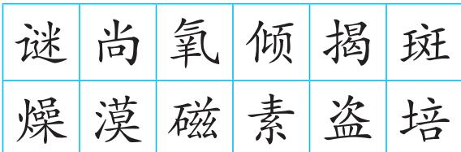

为了了解其他星球是否存在生命，你在阅读时是怎么做的？这位同学的思考给了你哪些启发？

与问题相关的內容我会仔細读，必要時會多讀几遍。有的段落和我想要了解的问题关系不大，就不需要细读。

有的信息可能是不准确的，需要再查查相关资料加以判断。

如果你想探究下面这些问题，会怎样阅读这篇文章？

科学家是怎么判断其他星球有没有生命的呢？

人类是否有可能移居火星？

# 12 故宫博物院

下面提供了两个任务，和同学交流：你会怎样根据不同的任务阅读以下材料?

为家人计划故宫一日游，画一张故宫参观路线图。

选择一两个景点，游故宫的时候为家人作讲解。

## 材料一

在北京城的中心，有一座城中之城，这就是紫禁城，如今人们习惯叫它故宫。这是明清两代的皇宫，是我国现存的最大最完整的古代宫殿建筑群，有六百多年的历史了。这座宫殿现在已经成为我国最大的博物院故宫博物院。

紫禁城城墙十米多高，有四座城门：南边午门，北边神武门，东西两边分别是东华门、西华门。宫城呈长方形，占地七十二万平方米。城墙外是五十多米宽的护城河。城墙的四角，各有一座玲珑奇巧的角楼。故宫建筑群规模宏大，建筑精美，布局统一，集中体现了我国古代建筑艺术的独特风格。

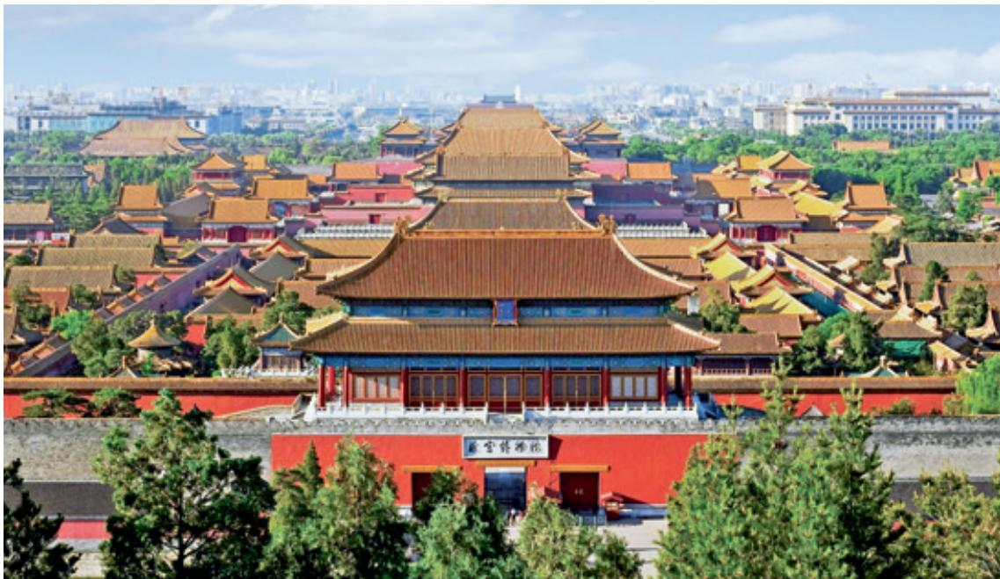

从天安门往里走，沿着一条笔直的大道穿过端门，就到了午门的前面。午门俗称“五凤楼”，是紫禁城的正门。走进午门，是一个宽阔的广场，弯弯的内金水河像一条玉带横贯东西，河上是五座精美的汉白玉石桥。桥的北面是太和门，一对威武的铜狮守卫在门的两侧。

进了太和门，就来到紫禁城的中心三大殿：太和殿、中chù和殿、保和殿。三座大殿矗立在八米多高的台基上。台基有三层，每层的边缘都有汉白玉栏杆围绕着，栏杆上面刻着龙凤流云，四chī角和望柱下面伸出一千多个圆雕螭首，螭首嘴里都有一个小圆洞，是台基的排水管道。

太和殿俗称“金銮殿”，高二十七米，面积近两千三百八十平liú方米，是故宫最大的殿堂。在湛蓝的天空下，那金黄色的琉璃瓦重fāng xǐ檐屋顶，显得格外辉煌。殿檐斗拱、额枋、梁柱，装饰着金龙和玺彩画。正面是十二根红色大圆柱，金琐窗，朱漆门，同台基上的白色栏杆相互衬映，色彩鲜明，雄伟壮丽。

大殿正中是一个约两米高的朱漆方台，上面安放着金銮宝座，pán背后是雕龙屏。方台两旁有六根高大的蟠龙金柱，每根大柱上都盘绕zǎo着矫健的金龙。仰望殿顶，中央藻井有一条巨大的雕金蟠龙，从龙口里垂下一颗银白色大圆珠，周围环绕着六颗小珠，龙头、宝珠正对着下面的宝座。梁枋间彩画绚丽，有双龙戏珠、单龙翔舞，有行龙、升龙、降龙，多态多姿，龙身周围还衬托着流云火焰。

太和殿建在紫禁城的中轴线上。这条线也是北京城的中轴线，向南从午门到天安门延伸到正阳门、永定门，往北从神武门到地安门、鼓楼、钟楼，全长约八公里。

太和殿是举行重大典礼的地方。皇帝即位、生日、婚礼和元旦等，都在这里接受朝贺。每逢大典，皇帝端坐在宝座上，殿外的台基上下，文武百官分列左右，中间御道两边排列着仪仗，大殿廊qìng下，鸣钟击磬，乐声悠扬。台基上的香炉里点起香或松柏枝，烟雾缭绕。

太和殿后面是中和殿。这是一座亭子形大殿，殿顶把四道垂脊cuán liú kuò攒在一起，正中安放着一个大圆镏金宝顶，轮廓非常优美。举行大典时，皇帝先在这里休息。

中和殿后面是保和殿。乾隆以后，这里是举行最高一级考试殿试的地方。

从保和殿出来，下了石级是一个长方形小广场。广场西起隆宗门，东到景运门。它把紫禁城分为前后两大部分。广场以南，主要建筑是三大殿和东西两侧的文华殿、武英殿，叫“外朝”。广场北fēi面乾清门以内叫“内廷”，是皇帝和后妃们起居生活的地方，主要建筑有乾清宫、交泰殿、坤宁宫和东六宫、西六宫。

乾清宫是皇帝的寝宫，也是皇帝处理日常政务的地方，后来还在这里接见外国使节。

乾清宫后面是交泰殿，交泰殿后面是坤宁宫。坤宁宫是清代皇帝结婚的地方。

乾清宫、交泰殿、坤宁宫合称“后三宫”。布局和前三殿基本mù  
一样，但庄严肃穆的气氛减少了，彩画图案也有明显的变化。前三  
殿的图案以龙为主，后三宫凤凰逐渐增加，出现了双凤朝阳、龙凤

呈祥的彩画，还有飞凤、舞凤、凤凰牡丹等图案。

后三宫往北是御花园。御花园面积不是很大，有大小建筑二十多  
座，但毫无拥挤和重复的感觉。这里的建筑布局、环境气氛，和前几jiǒng xiè  
部分迥然不同。亭台楼阁、池馆水榭，掩映在青松翠柏之中；假山怪  
石、花坛盆景、藤萝翠竹，点缀其间。来到这里，仿佛进入苏州园林。

从御花园出顺贞门，就到了紫禁城的北门—神武门，对面就是景山。据说景山是明代修建紫禁城的时候，在原有土丘的基础上，用护城河等处挖出的泥土堆起来的，现在成了风景优美的景山公园。站在景山的高处望故宫，重重殿宇，层层楼阁，道道宫墙，错综相连而又井然有序。这样宏伟的建筑群，这样和谐统一的布局，不能不令人惊叹。

——选自黄传惕的《故宫博物院》，有改动

## 材料二

现在见到的太和门，是清末光绪十五年（1889）重修的。光绪十四年十二月十五日深夜，太和门西的贞度门失火，向东延烧zhāo wǔ太和门、昭德门以及整个太和殿南庑。由于当时消防器材不全及灭火水源不足，大火烧了两天才被扑灭。起火原因是贞度门值夜班的kuí护军富山、双奎，把旧洋油灯挂在贞度门东山墙后檐柱上睡了觉。时间一久，油灯烧着柱子，四更火起，借着大风，烧个不停。事后这二人都被处了绞刑。

这是一场不大不小的火灾，但时机不好，一个多月后，即转年zhēng正月二十六日，正是光绪帝大婚的吉日。大婚纳彩、迎娶都必经太

## 人民教育出版社

和门。时间紧迫，又值天寒地冻，修复三门肯定来不及。于是，宫bēi  
中请来市面上扎彩棚的能工巧匠，按原建筑面貌复制，其高卑广lòu wéi xiào  
狭，乃至檐角小兽、大吻雕镂，无不惟妙惟肖，即使宫中人员也看wěi yú  
不出真伪，而且高逾数丈竟风吹不摇。这样总算应付过了大婚。

——选自姜舜源的《故宫史话》，有改动

材料三  
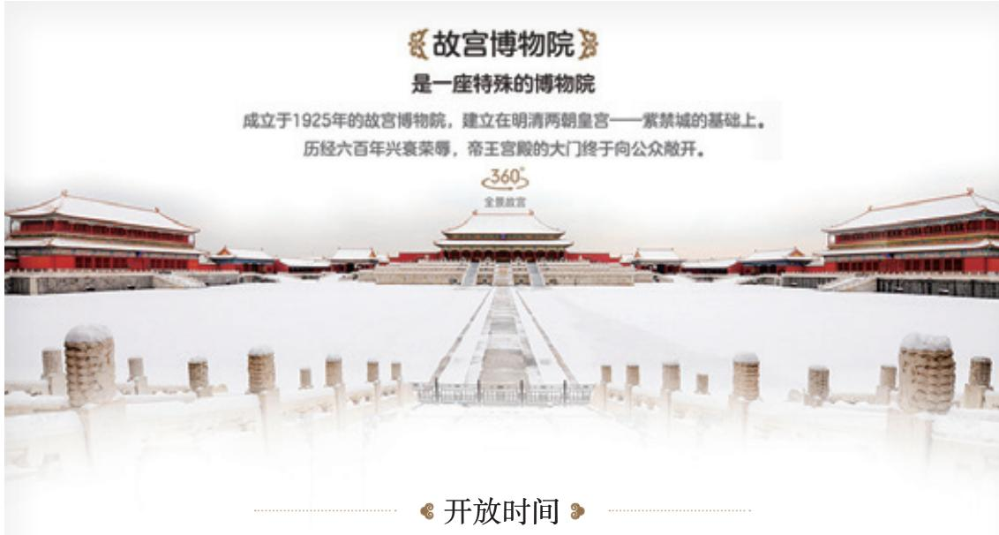

旺季

每年4月1日至10月31日采用旺季开放时间

开放入馆时间：8:30

停止入馆时间： 16:00

闭馆时间： 17:00

淡季

每年11月1日至来年3月31日采用淡季开放时间

开放入馆时间：8:30

停止入馆时间：15:30

闭馆时间： 16:30

自2011年7月2日起，故宫博物院实行自南向北单向参观路线：午门（南门）只作为参观入口，观众一律从午门进入故宫；神武门（北门）只作为参观出口，观众参观结束后可由神武门或东华门（东门）离开故宫。

（资料来源：2023年9月的故宫博物院官方网站）

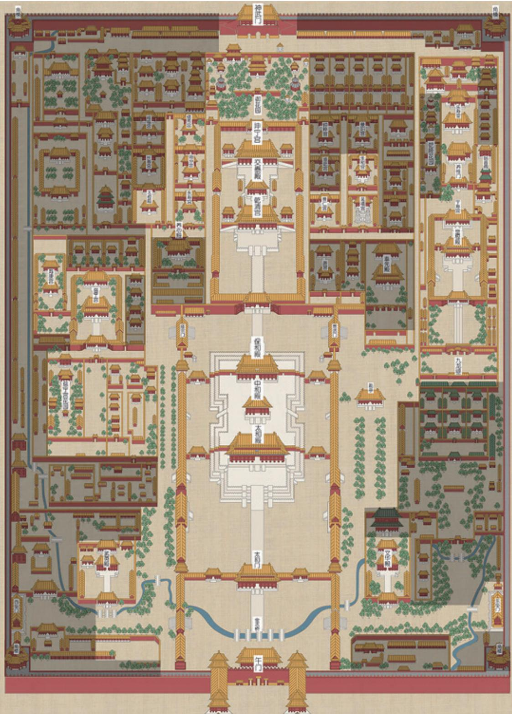  
（故宫博物院开放区域。资料来源：2023年9月的故宫博物院官方网站）

## 习作

## 让生活更美好

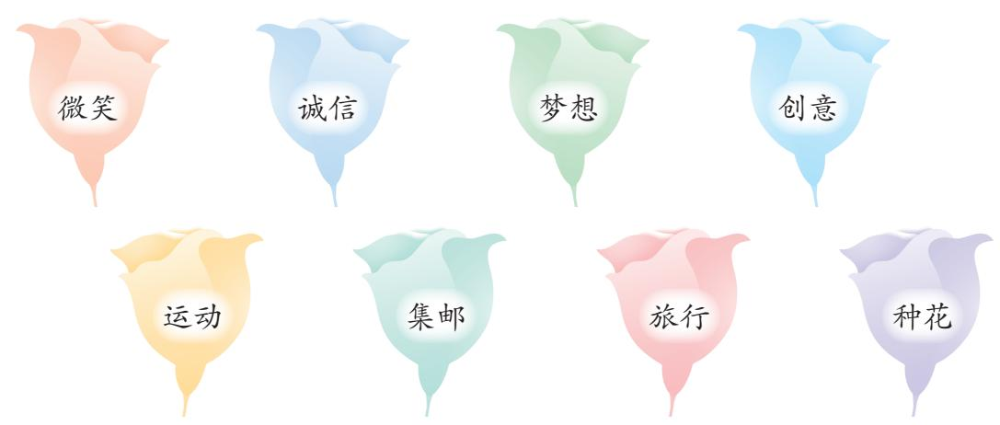

## 你有没有想过，什么让你的生活更美好？

科技的发展给我們的生活带来了极大便利。现在去爷爷奶奶家可以坐高铁了，比以前快了两个小时；妈妈买菜时，扫一扫二维码就能支付，非常方便、快捷。

想至 到 的 是 音乐， 唱放歌，会 让我

我的答案是种花。把种子种下去，等它們发芽，看它們慢慢长大，很有成就感。

结合自己的生活体验，完成这次习作。从“微笑、诚信、梦想………”中选一个话题写，也可以写其他话题。写之前想一想它是怎么影响你的生活的，为什么让你觉得生活更美好。写的时候注意把原因写具体。

写完后，开展一次“共享美好生活”主题班会，共同分享各自的心得体会。

# 人民教育出版社

# 语文园地

## 交流平台

学习了这个单元，我知道了要根据目的选择合适的材料。如，要为家人计划故宫一日游，应该重点阅读材料一、材料三和材料四。

读文章时，与阅读目的关联性不强的内容，不需要逐字逐句地读，这样可以提高阅读速度。如，带着“写玩具制作指南，并教别人玩这种玩具”这一任务读《竹节人》，有关玩竹节人的有趣经历这部分内容，浏览一下就可以了。

我逐渐养成了一個习惯，读書時先想想阅读的目的，再有针对性地选择适合的阅读方法。

## 词句段运用

下面的句子写出了人对某件事入迷的样子。读一读，试着写一写类似的情景。

下课时，教室里摆开场子，吸引了一圈黑脑袋，攒着观战，还踩脚拍手，咋咋呼呼，好不热闹。常要等老师进来，才知道已经上课。

偏偏后面的同学不知趣，看得入了迷，伸长脖子，恨不能从我们肩膀上探过来。

只见罗丹一会儿上前，一会儿后退，嘴里叽里咕噜的，好像在跟谁说悄悄话；忽然眼睛闪着异样的光，似乎在跟谁激烈地争吵。他把地板踩得吱吱响，手不停地挥动……一刻钟过去了，半小时过去了，罗丹越干越有劲，情绪更加激动了。他像喝醉了酒一样，整个世界对他来讲好像已经消失了—大约过了一个小时，罗丹才停下来，对着塑像痴痴地微笑，然后轻轻地舒了口气。

## 人民教育出版社

读下面的例句，注意加点的部分，想一想这样表达有什么好处。选择一个话题，用这种方法说一说。

人们认为天体上若有生命存在，至少应有这样几个条件：一是适合生物生存的温度，一般应在-50～150℃之间；二是必要的水分，生命物质诸如蛋白质、核酸的活力都和水紧密相关，没有水，也就没有生命；

三是适当成分的大气，虽然已发现少数厌氧菌能在没有氧气的条件下生存，但氧气和二氧化碳对于生命的存在是极为重要的；四是要有足够的光和热，为生命系统提供能源。

可以用這种方法说明理由，表达观点……

## 竞选班级劳动委员

向妈妈请求，每周三放学后踢一会儿足球

## 日积月累

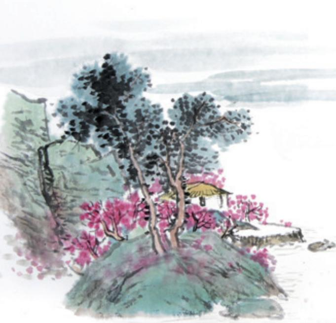

## 春 日

[宋]朱熹

胜日寻芳泗水滨，无边光景一时新。等闲识得东风面，万紫千红总是春。

## 第四单元

小说大多是虚构的，却又有生活的影子。

读小说，关注情节、环境，感受人物形象。

发挥想象，创编生活故事。

# 13桥

黎明的时候，雨突然大了。像泼。像倒。

山洪咆哮着，像一群受惊的野马，从山谷里狂奔而来，势不可当。

村庄惊醒了。人们翻身下床，却一脚踩进水里。是谁惊慌地喊了一嗓子，一百多号人你拥我挤地往南跑。近一米高的洪水已经在路面上跳舞了。人们又疯了似的折回来。

东面、西面没有路。只有北面有座窄窄的木桥。

níng

死亡在洪水的狞笑声中逼近。

人们跌跌撞撞地向那木桥拥去。

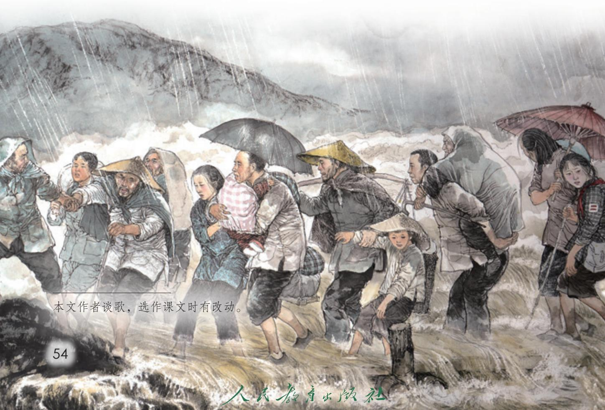

木桥前，没腿深的水里，站着他们的党支部书记，那个全村人都拥戴的老汉。

老汉清瘦的脸上淌着雨水。他不说话，盯着乱哄哄的人们。他像一座山。

人们停住脚，望着老汉。

老汉沙哑地喊话：“桥窄！排成一队，不要挤！党员排在后边！”

有人喊了一声：“党员也是人。”

老汉冷冷地说：“可以退党，到我这儿报名。”

竟没人再喊。一百多人很快排成队，依次从老汉身边奔上木桥。

水渐渐蹿上来，放肆地舔着人们的腰。

老汉突然冲上前，从队伍里揪出一个小伙子，吼道：“你还算是个党员吗？排到后面去！”老汉凶得像只豹子。

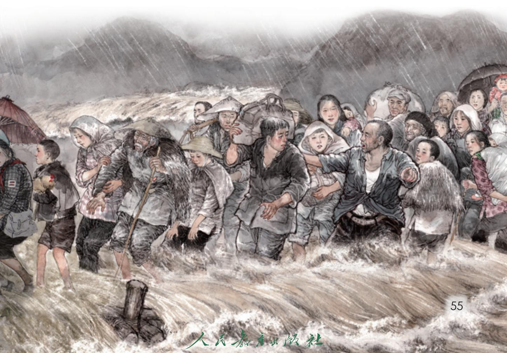

小伙子瞪了老汉一眼，站到了后面。

木桥开始发抖，开始痛苦地呻吟。

水，爬上了老汉的胸膛。最后，只剩下了他和小伙子。

小伙子推了老汉一把，说：“你先走。”

老汉吼道：“少废话，快走。”他用力把小伙子推上木桥。

突然，那木桥轰的一声塌了。小伙子被洪水吞没了。

老汉似乎要喊什么，猛然间，一个浪头也吞没了他。

一片白茫茫的世界。

五天以后，洪水退了。

一个老太太，被人搀扶着，来这里祭奠。

她来祭奠两个人。

她丈夫和她儿子。

## 黎咆哮嗓哑揪瞪呻废

有感情地朗读课文，注意读好短句。

这篇小说写了一位怎样的老支书？找出写老支书动作、语言、神态的句子，结合相关情节说说你的理解。

画出描写雨、洪水和桥的句子读一读。再联系老支书在洪水中的表现，说说这些描写对表现人物的作用。

小说最后才点明老支书和小伙子的关系，和同学讨论这样写有什么好处。

# ①④穷人

渔夫的妻子桑娜坐在火炉旁补一张破帆。屋外寒风呼啸，汹涌澎湃的海浪拍击着海岸，溅起一阵阵浪花。海上正起着风暴，外面又黑又冷，这间渔家的小屋里却温暖而舒适。地扫得干干净净，炉子里的火还没有熄，食具在搁板上闪闪发亮。挂着白色帐子的床上，五个孩子正在海风呼啸声中安静地睡着。丈夫清早驾着小船出海，这时候还没有回来。桑娜听着波涛的轰鸣和狂风的怒吼，感到心惊肉跳。

古老的钟发哑地敲了十下，十一下……始终不见丈夫回来。桑娜沉思：丈夫不顾惜身体，冒着寒冷和风暴出去打鱼，她自己也从早到晚地干活，还只能勉强填饱肚子。孩子们没有鞋穿，不论冬夏都光着脚跑来跑去；吃的是黑面包，菜只有鱼。不过，孩子们都还健康，没什么可抱怨的。桑娜倾听着风暴的声音。“他现在在yòu哪儿？老天啊，保佑他，救救他，开开恩吧！”她自言自语着。

睡觉还早。桑娜站起身来，把一块很厚的围巾包在头上，提着马灯走出门去。她想看看灯塔上的灯是不是亮着，丈夫的小船能不能望见。海面上什么也看不见。风掀起她的围巾，卷着被刮断的什么东西敲打着邻居小屋的门。桑娜想起了傍晚就想去探望的那个生病的女邻居。“没有一个人照顾她啊！”桑娜一边想一边敲了敲门。她侧着耳朵听，没有人答应。

guǎ

“寡妇的日子真困难啊！”桑娜站在门口想，“孩子虽然不算多—只有两个，可是全靠她一个人张罗，如今又加上病。唉，寡妇的日子真难过啊！进去看看吧！”

桑娜一次又一次地敲门，仍旧没有人答应。

“喂，西蒙！”桑娜喊了一声，心想，莫不是出什么事了？她猛地推开门。

屋子里没有生炉子，又潮湿又阴冷。桑娜举起马灯，想看看病人在什么地方。首先投入眼帘的是对着门的一张床，床上仰面躺着她的女邻居。她一动不动。桑娜把马灯举得更近一些，不错，是西蒙。她头往后仰着，冰冷发青的脸上显出死的宁静，一只苍白僵硬的手像要抓住什么似的，从稻草铺上垂下来。就在这死去的母亲旁边，睡着两个很小的孩子，都是卷头发、圆脸蛋，身上盖着旧衣quán服，蜷缩着身子，两个浅黄头发的小脑袋紧紧地靠在一起。显然，母亲在临死的时候，拿自己的衣服盖在他们身上，还用旧头巾包住他们的小脚。孩子呼吸均匀而平静，睡得正香甜。

桑娜用头巾裹住睡着的孩子，把他们抱回家里。她的心跳得很厉害，自己也不知道为什么要这样做，但是觉得非这样做不可。她把这两个熟睡的孩子放在床上，让他们同自己的孩子睡在一起，又连忙把帐子拉好。

tǎn tè

桑娜脸色苍白，神情激动。她忐忑不安地想：“他会说什么呢？这是闹着玩的吗？自己的五个孩子已经够他受的了……是他来啦？……不，还没来！……为什么把他们抱过来啊？……他会揍我àg的！那也活该，我自作自受……嗯，揍我一顿也好！”

门吱嘎一声，仿佛有人进来了。桑娜一惊，从椅子上站起来。

“不，没有人！天啊，我为什么要这样做？……如今叫我怎么对

他说呢？……”桑娜沉思着，久久地坐在床前。

kuí lí

门突然开了，一股清新的海风冲进屋子。魁梧黧黑的渔夫拖着湿淋淋的被撕破了的渔网，一边走进来，一边说：“嘿，我回来啦，桑娜！”

“哦，是你！”桑娜站起来，不敢抬起眼睛看他。

“瞧，这样的夜晚！真可怕！”

“是啊，是啊，天气坏透了！哦，鱼打得怎么样？”

“糟糕，真糟糕！什么也没有打到，还把网给撕破了。倒霉，倒霉！天气可真厉害！我简直记不起几时有过这样的夜晚了，还谈得上什么打鱼！还好，总算活着回来啦。……我不在，你在家里做些什么呢？”

渔夫说着，把网拖进屋里，坐在炉子旁边。

“我？”桑娜脸色发白，说，“我嘛……缝缝补补……风吼得这 么凶，真叫人害怕。我可替你担心呢！”

“是啊，是啊，”丈夫喃喃地说，“这天气真是活见鬼！可是有什么办法呢！”

两个人沉默了一阵。

“你知道吗？”桑娜说，“咱们的邻居西蒙死了。”

“哦？什么时候？”

“我也不知道，大概是昨天。唉！她死得好惨啊！两个孩子都在她身边，睡着了。他们那么小……一个还不会说话，另一个刚会爬……”桑娜沉默了。

渔夫皱起眉，他的脸变得严肃、忧虑。“嗯，是个问题！”他搔搔后脑勺说，“嗯，你看怎么办？得把他们抱来，同死人待在一起怎么行！哦，我们，我们总能熬过去的！快去！别等他们醒来。”

但桑娜坐着一动不动。

“你怎么啦？不愿意吗？你怎么啦，桑娜？”

“你瞧，他们在这里啦。”桑娜拉开了帐子。

<table><tr><td>汹涌澎湃熄掀困</td><td></td><td></td><td></td><td></td><td></td><td></td></tr><tr><td>唉</td><td>淋</td><td>嘿</td><td>糟</td><td>嘛</td><td>皱</td><td>勺</td></tr></table>

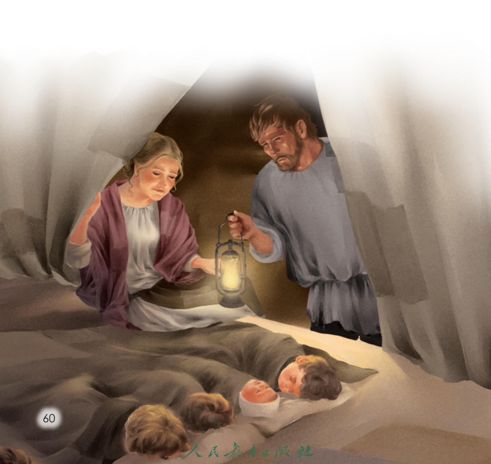

快速默读课文，说说课文主要讲了一件什么事。

从课文中找出描写人物对话和心理活动的句子，有感情地读一读。说说从这些描写中，可以看出桑娜和渔夫是怎样的人。

渔家的小屋“温暖而舒适”，这样的环境描写对刻画桑娜这个人物有什么作用？找出课文中其他描写环境的句子，体会它们的作用。

## 小练笔

“是啊，是啊，”丈夫喃喃地说，“这天气真是活见鬼！可是有什么办法呢！”

两个人沉默了一阵。

沉默中，桑娜会想些什么呢？联系课文内容，写一写桑娜的心理活动。

## 资料袋

列夫·托尔斯泰（1828—1910）是俄国作家。他的作品深受世界人民喜爱，代表作有《战争与和平》《安娜·卡列尼娜》《复活》等。

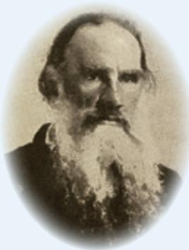

“不认识托尔斯泰，就不能认为自己认识祖国，也不能认为自己是个文化人。”苏联作家高尔基曾这样评价他。奥地利作家茨威格

在传记作品《三作家》中这样刻画他的形象：“他生就一副多毛的脸庞，植被多于空地，浓密的胡髭使人难以看清他的内心世界。长髯覆盖了两颊，遮住了嘴唇，遮住了皱似树皮的黝黑脸膛，一根根迎风飘动，颇有长者风度。宽约一指的眉毛像纠缠不清的树根，朝上倒竖。一给络灰白的鬈发像泡沫一样堆在额头上。不管从哪个角度看，你都能见到热带森林般茂密的须发。”

# (①5)金色的鱼钩

这是一篇以红军长征为背景的小说。默读课文，说说小说写了一位怎样的老班长。再找出描写人物对话和心理的句子读一读，和同学交流这些描写对刻画老班长有什么作用。

1935年秋天，红四方面军进入草地，许多同志得了肠胃病。我和两个小同志病得实在赶不上队伍了，指导员派炊事班长照顾我们，让我们走在后面。

炊事班长快四十岁了，个子挺高，背有点儿驼，四方脸，高颧骨，脸上布满了皱纹。全连数他岁数大，对大家又特别亲，大伙都叫他“老班长”。

三个病号走不快，一天只走二十来里路。一路上，老班长带我kē们走一阵歇一阵。到了宿营地，他就到处去找野菜，和着青稞面给xié我们做饭。不到半个月，两袋青稞面吃完了。饥饿威胁着我们。老班长到处找野菜，挖草根，可是光吃这些东西怎么行呢？老班长看我们一天天瘦下去，他整夜整夜地合不拢眼，其实，这些天他比我们瘦得还厉害呢！

一天，他在一个水塘边给我们洗衣裳，忽然看见一条鱼跳出水面。他喜出望外地跑回来，取出一根缝衣针，烧红了，弯成个钓鱼钩。这天夜里，我们就吃到了新鲜的鱼汤。尽管没有调料，可我们觉得没有比这鱼汤更鲜美的了，端起碗来吃了个精光。

从那以后，老班长尽可能找有水塘的地方宿营，把我们安顿好，就带着鱼钩出去了。第二天，他总能端着热气腾腾的鲜鱼野菜汤给我们吃。虽然我们还是一天一天衰弱下去，但比起光吃草根野菜毕竟好多了。可是老班长自己呢，我从来没见他吃过一点儿鱼。

有一次，我禁不住问他：“老班长，你怎么不吃鱼啊？”

他摸了摸嘴，好像回味似的说：“吃过了。我一起锅就吃，比你们还先吃呢。”

我不信，等他收拾完碗筷走了，就悄悄地跟着他。走近一看，táng啊！我不由得呆住了。他坐在那里捧着搪瓷碗，嚼着几根草根和我们吃剩下的鱼骨头，嚼了一会儿，就皱紧眉头硬咽下去。我觉得好像有万根钢针扎着喉管，失声喊起来：“老班长，你怎么……”

老班长猛拾起头，看见我目不转睛地看着他手里的搪瓷碗，就支吾着说：“我，我早就吃过了。看到碗里还没吃干净，扔了怪可惜的……”

“不，我全知道了。”我打断了他的话。

老班长转身朝两个小同志睡觉的地方看了一眼，一把把我搂到身边，轻声说：“小声点儿，小梁！咱们俩是党员，你既然知道了，可不要再告诉别人。”

“可是，你也要爱惜自己啊！”

“不要紧，我身体还硬实！”他抬起头，望着夜色弥漫的草地，好久，才用低沉的声音说：“指导员把你们三个人交给我，他临走的时候说：他们年轻。一路上，你是上级，是保姆，是勤务员啊，无论多么艰苦，都要把他们带出草地。’小梁，你看这草地，无边无涯，没个尽头。我估计，还要二十天才能走出去。熬过这二十天不简单啊！眼看你们的身子一天比一天衰弱，只要哪一天吃不上东西，说不定就会起不来，真有个三长两短，我怎么去向党报告呢？难道我能说：‘指导员，我把同志们留在草地上，我自己克服困难出来啦！””

“可是，你总该跟我们一起吃一点儿啊！”

“不行，太少啦。”他轻轻地摇摇头，“小梁，说真的，弄点儿吃的不容易啊！有时候等了半夜，也不见鱼上钩。为了弄一点儿鱼ěr饵，我翻了多少草皮也找不到一条蚯蚓……还有，我的眼睛坏了，天色一暗，找野菜就得一棵一棵地摸……”

我再也忍不住了，抢着说：“老班长，以后我帮你一起找，我看得见。”

“不，咱们不是早就分好工了吗？再说，你的病也不轻，不好好休息会撑不住的。”

我还坚持我的意见。老班长忽然严厉地说：“小梁同志，共产党员要服从党的分配。你的任务是坚持走路，安定两个小同志的情绪，增强他们的信心！”

望着他那十分严峻的脸，我一句话也说不上来，竟扑倒在他怀里哭了。

第二天，老班长端来的鱼汤特别少，每个搪瓷碗里只有小半条猫鱼，上面漂着一丁点儿野菜。他笑着说：“吃吧，就是少了点儿。唉！一条好大的鱼已经上了钩，又跑啦！”

我端起搪瓷碗，觉得这个碗有千斤重，怎么也送不到嘴边。两个小同志不知道为什么，也端着碗不往嘴边送。老班长看到这情liǎn况，收敛了笑容，眉头拧成了疙瘩。他说：“怎么了，吃不下？要是不吃，咱们就走不出这草地。同志们，为了革命，你们必须吃下去。小梁，你不要太脆弱！”最后这句话是严厉的，意思只有我知道。

我把碗端到嘴边，泪珠大颗大颗地落在热气腾腾的鱼汤里。我悄悄背转身，擦擦眼睛，大口大口地咽着鱼汤。老班长看着我们吃完，脸上的皱纹舒展开了，嘴边露出了一丝笑意。可是我的心里好像塞了铅块似的，沉重极了。

挨了一天又一天，渐渐接近草地的边了，我们的病却越来越重。我还能勉强挺着走路，那两个小同志连直起腰来的力气也没有了。老班长虽然瘦得只剩皮包骨头，眼睛深深地陷了下去，但是还chān一直用饱满的情绪鼓励着我们。我们就这样扶一段，搀一段，终于走到了草地边上。远处，重重叠叠的山峰已经看得见了。

这天上午，老班长快活地说：“同志们，咱们在这儿停一下，好好弄点儿吃的，鼓一鼓劲，一口气走出草地去。”说罢，他就拿起鱼钩找水塘去了。

我们的精神特别好，四处去找野菜，拾干草，好像过节似的。但是过了好久，还不见老班长回来。我们四面寻找，最后在一个水塘旁边找到了他，他已经昏迷不醒了。

我们都慌了。过雪山的时候有过不少这样的例子，战士用惊人的毅力支持着自己的生命，但是一倒下去就再也起不来了。要挽救老班长，最好的办法是让他赶快吃些东西。我们立即分了工，我去钓鱼，剩下的一个人照料老班长，一个人生火。

我蹲在水边，心里不停地念叨：“鱼啊！快些来吧！这是挽救一个革命战士的生命啊！”可是，等了好久，还不见鱼上钩。好容易看到漂在水面的芦秆动了一下，赶紧扯起钓竿，还是空的…

当我俯下身子，把鱼汤送到老班长嘴边的时候，老班长已经yǎn奄奄一息了。他微微地睁开眼睛，看见我端着的鱼汤，头一句话就说：“小梁，别浪费东西了。我……我不行啦。你们吃吧！还有二十多里路，吃完了，一定要走出去！”

“老班长，你吃啊！我们抬也要把你拾出去！”我几乎要哭出来了。

“不，你们吃吧。你们一定要走出草地去！见着指导员，告诉他，我没完成党交给我的任务，没把你们照顾好。看，你们都瘦得……”

老班长用粗糙的手无力地抚摸我的头。突然间，他的手垂了下去。

“老班长！老班长！”我们失声叫着。但老班长还是慢慢地闭上了眼睛。

我们扑在老班长身上，抽噎着，很久很久。

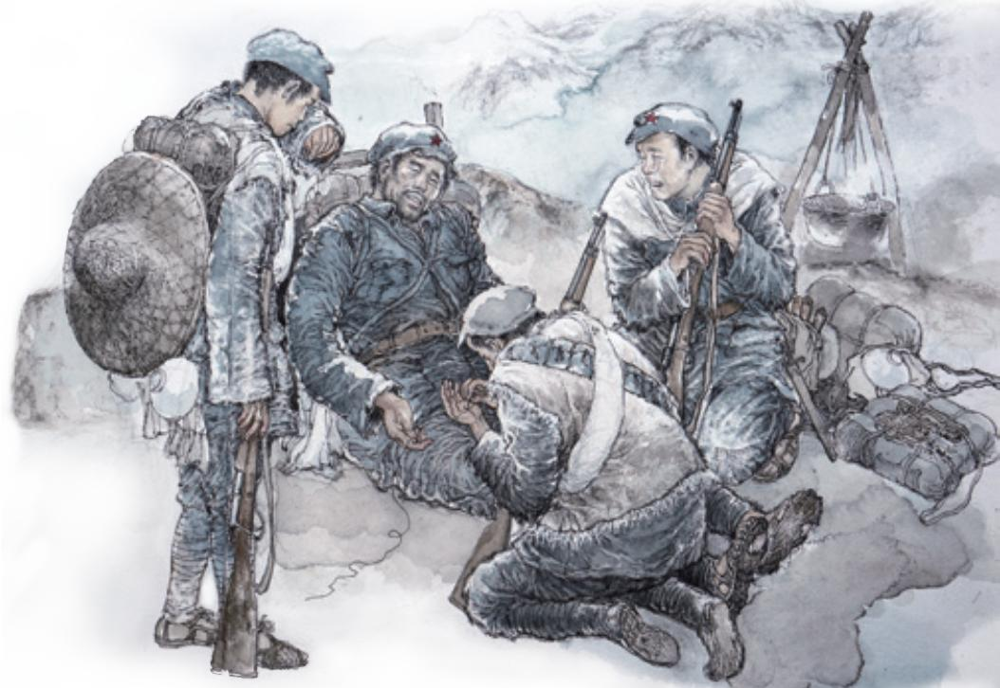

擦干了眼泪，我把老班长留下的鱼钩小心地包起来，放在贴身的衣兜里。我想，等革命胜利以后，一定要把它送到革命烈士zhān纪念馆去，让我们的子子孙孙都来瞻仰它。在这个长满了红锈的鱼钩上，闪烁着灿烂的金色的光芒！

## 口语交际

## 请你支持我

有时候，我们需要说服别人支持我们做一件事情。

假如现在你要去找老师，希望他同意你办一份报纸并提供必要的帮助。想一想，应该怎么跟老师交流呢？

礼貌诚恳地说明来意。如：“请问您现在有时间吗？我想和您谈一件事情。”

把办报纸的设想讲清楚，尤其是办报的目的，以及可能给同学带来的好处。

◇设想老师可能的担心，想办法打消老师的疑虑。

小组分角色扮演，模拟与老师交流的过程。根据每个同学的表现，说说谁最有可能获得支持。

从下面的任务中选择一个，试着说服别人支持你。

说服妈妈，让她同意你在家里养一只小狗。

说服同学，在班里设立“生物角”。

说服校长，在学校组织一次义卖活动。

最后和同学交流：面对不同的人，解决不同的问题，需要特别注意些什么？

先说想法，再把具体的理由讲清楚。

设想对方可能的反应，恰当应对。

## 笔尖流出的故事

本单元学习的几篇课文都是虚构的故事，读起来却像在生活中发生过一样，因为这些故事都能从生活中找到影子。

虚构的故事往往情节曲折，有较鲜明的人物形象，读来比较吸引人。下面提供了三组环境和人物，从中选择一组或自己创设一组，展开丰富的想象，创编故事。

环境：开满丁香花的校园

人物：淘气包张明雷厉风行的班长王寒冰充满活力的年轻班主任李军

环境：冬日黄昏时车来人往的街头

人物：充满爱心的少年陆天志愿者徐明

环境：月光下的村庄

人物：铁蛋铁蛋远道而来的表哥

写的时候注意：

故事要围绕主要人物展开。

把故事写完整，情节尽可能吸引人。

试着写出故事发生的环境，还可以写一写人物的心理活动。

写完后，在班里开一个故事会，说说你最喜欢的故事。

# 语文园地

## 交流平台

这个单元的三篇课文都是小说。小说一般有比较鲜明的人物形象，如《桥》中的老支书、《穷人》中的桑娜。怎样理解小说的人物形象呢？我们以《穷人》为例谈一谈。

留意人物的语言、动作、心理活动，可以帮助我们深入地理解人物形象。如，关注写桑娜语言、动作、心理的内容，可以感受到她对丈夫的担忧、体贴，以及对邻居的关心。

我们还可以通过小说的情节感受人物形象。从桑娜把两个孤儿抱回家的情节中，可以体会到她宁可自己受苦也要照顾孤儿的善良。

小说还会借环境描写来突显人物形象。《穷人》把故事安排在一个风雨大作、又黑又冷的夜晚，有利于表现穷人生活的艰难，反衬桑娜夫妇的善良以及他们内心世界的富有。关注小说的环境描写，也有利于我们深入地理解人物形象。

## 词句段运用

古典小说《三国演义》塑造了诸多鲜明的人物形象，其中有许多情节，对突出人物形象起了很好的作用，如，“长坂桥张飞退曹军”就是一个经典情节。朗读下面的片段，读出张飞的神勇。

张飞睁圆环眼，隐隐见后军青罗伞盖、旄钺旌旗来到，料得是曹操心疑，亲自来看。飞乃厉声大喝曰：“我乃燕人张翼德也！谁敢与我决一死战？”声如巨雷。曹军闻之，尽皆股栗。

## 人民教育出版社

读一读，体会人物复杂的内心世界。试着写一写你忐忑不安或犹豫不决时的心理活动。

桑娜脸色苍白，神情激动。她忐忑不安地想：“他会说什么呢？这是闹着玩的吗？自己的五个孩子已经够他受的了……是他来啦？…不，还没来！………为什么把他们抱过来啊？……他会揍我的！那也活该，我自作自受……嗯，揍我一顿也好！”

我的心紧缩着，我担心这个年轻的战士会实在忍耐不住突然跳起来，或者突然叫出声来。我几次回过头来，不敢朝他那儿看，不忍看着我的战友被活活烧死，但是我又忍不住不看。我心里像刀绞一般，眼泪模糊了我的眼睛。

## 日积月累

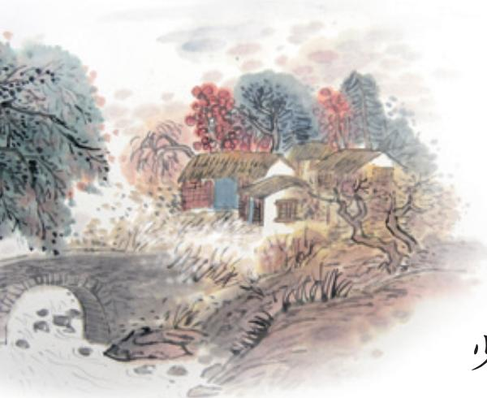

## 回乡偶书

[唐]贺知章

少小离家老大回，乡音无改鬓毛衰。儿童相见不相识，笑问客从何处来。

## 快乐读书吧

## 笑与泪，经历与成长

我们从出生起，就踏上了成长之旅。很多作家的作品讲述了成长的故事，这些故事的主人公有的是和我们同龄的孩子。他们的生活，有欢笑和喜悦，也有磨难和痛苦。这些或甜或苦的经历，教他们一步步向前，勇敢地面对未来。

## 你读过吗

《童年》是苏联作家高尔基的小说。故事的主人公阿廖沙在父亲病逝后，随母亲投奔外祖父。外祖父粗野自私，经常毒打孩子们，曾把阿廖沙打得失去知觉。除了脾气暴躁的外祖父，这个家庭里还有两个为争夺财产整日争吵、打架的舅舅。阿廖沙经常惊惧不安，还好有慈祥善良的外祖母安慰他、保护他。

《童年》以孩子的视角来讲述故事，给这个充满伤痛的故事蒙上了一层天真烂漫的色彩。

那时我病得很重，刚能勉强起身。我清楚地记得，我病着的时候，开始是父亲开开心心地照顾着我，后来他突然不见了，照顾我的人换成了外祖母， 一个很奇怪的人。

“你从哪儿过来啊？”我问她。

她回答：“从上面来，从下城来，不是过来，是坐船来！人怎么能自己从水上过来呢，真是个小迷糊！”

这真可笑，又是上又是下的，让人糊涂。上面，楼上住的是几个染了大胡子的波斯人，而地下室住了一个卖羊皮的黄皮肤卡尔梅克老头。下楼梯可以从扶手上滑下去，要是摔倒的话就滚下去，这我一清二楚。可是这关水什么事？简直都乱套了。

“我怎么就迷糊呢？”

“因为你吵得人迷糊啊。”她说完也笑了起来。

——选自高尔基的《童年》，黄玫译

## 人民教育出版社

外祖母的爱，仿佛黑暗中的明灯，照亮了阿廖沙的心。除了外祖母，善良、乐观、富于同情心的“小茨冈”，忠厚老实的老工人格里高利，献身于科学的知识分子“好事儿”，以及阿廖沙遇到的其他许许多多好人，都让他感受到了人世间的温暖和美好，让他面对苦难依然保持对生活的勇气和信心。

很多小说中人物众多，理清人物关系能够帮助我們更好地读懂故事。如，《童年》中出现了数十个人物，不容易分清楚，但他们都是围绕着主人公阿廖沙塑造的，弄明白他们和阿廖沙之间的关系，就不难分清了。

小說生動的故事情节会给我们留下较深的印象，这些情节让我們记住了一个个性格各异的人物。

## 相信你可以读更多

成长的故事各不相同，却同样带给我们感动。

我们知道小英雄雨来的故事，雨来为掩护交通员被鬼子抓住后机智逃脱了。《小英雄雨来》这本书还写了雨来给八路军送鸡毛信，和小伙伴们制造假地雷迷惑敌人、为八路军站岗放哨……在抗日战争中，雨来不断成长，完成了多项重要任务，最终如愿参加了游击队。

《爱的教育》是意大利作家亚米契斯的日记体小说，原名《心》。作者在序言中说：“这部书是特地奉献给九岁到十三岁的小学生的。”书中以小学生的口吻，讲述了一个四年级小男孩的成长故事。故事中的人物主要是学生、老师以及学生父母等平凡的人。小说写出了他们对祖国和人民、父母和兄弟姐妹、老师和同学深厚而真挚的爱。

精彩的成长故事还有很多，让我们找来读一读，和同学交流你的收获。

第五单元

以立意为宗，不以能文为本。

——[梁]萧统

体会文章是怎样围绕中心意思来写的。

从不同方面或选取不同事例，表达中心意思。

人民教育出版社

# 16 夏天里的成长

夏天是万物迅速生长的季节。

生物从小到大，本来是天天长的，不过夏天的长是飞快的长，跳跃的长，活生生的看得见的长。你在棚架上看瓜藤，一天可以长出几寸；你到竹子林、高粱地里听声音，在叭叭的声响里，一夜可bāo以多出半节。昨天是苞蕾，今天是鲜花，明天就变成了小果实。一块白石头，几天不见，就长满了苔藓；一片黄泥土，几天不见，就qí变成了草坪菜畦。邻家的小猫小狗小鸡小鸭，个把月不过来，再见面，它已经有了妈妈的一半大。

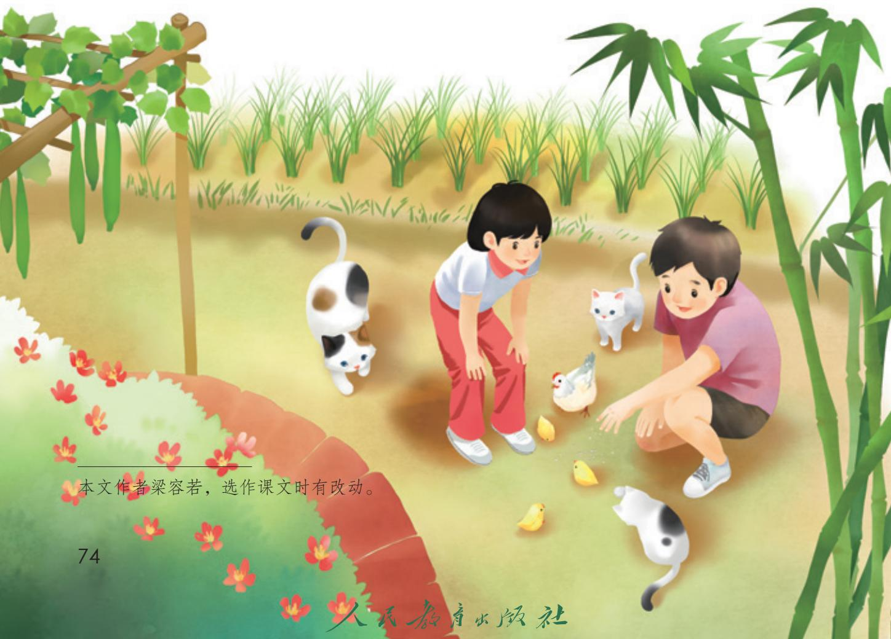

草长，树木长，山是一天一天地变丰满。稻秧长，甘蔗长，地是一天一天地高起来。水长，瀑布长，河也是一天一天地变宽变深。俗话说：“不热不长，不热不大。”随着太阳威力的增加，温guǐ度的增加，什么都在生长。最热的时候，连铁路的铁轨也长，把连接处的缝隙几乎填满。柏油路也软绵绵的，像是高起来。

一过夏天，小学生有的成了中学生，中学生有的成了大学生。升级、跳班，快点儿，慢点儿，总是要长。北方农家的谚语说：“六月六，看谷秀。”又说：“处暑不出头，割谷喂老牛。”农作物到了该长的时候不长，或是长得太慢，就没有收成的希望。人也是一样，要赶时候，赶热天，尽量地用力地长。

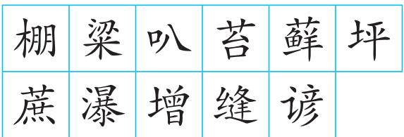

默读课文，找出中心句，说说课文是怎样围绕这句话来写的。

第2自然段写出了生物在夏天里飞快生长的状态。读一读，说说写到了哪些动植物，是怎样体现这一段的中心意思的。

# 17盼

有一天，妈妈下班回来，递给我一个扁扁的纸盒子。我打开一看，是一件淡绿色的、透明的新雨衣。我立刻就抖开雨衣往身上穿。怎么？雨衣上竟然还长着两只袖筒，不像那种斗篷式的：手在雨衣里缩着，什么也干不了。穿上这件情况就不同了，管你下雨不下雨，想干什么就干什么。

我一边想，一边在屋里走来走去，戴上雨帽，又抖抖袖子，把xī sū雨衣弄得窸窸窣窣响。直到妈妈一声喊：“蕾蕾，你疯啦？嫌身上fèi没长痱子吗？”我才赶忙把雨衣脱下来。摸摸后背，衬衫已经让汗水浸湿了，浑身凉冰冰的。

我开始盼着变天。可是一连好多天，白天天上都是瓦蓝瓦蓝的，夜晚又变成满天星斗。我的雨衣一直安安静静地躺在盒子里，盒子一直安安静静地躺在衣柜里。每天放学路上我都在想：太阳把天烤得这样干，还能长云彩吗？为什么我一有了雨衣，天气预报就总是“晴”呢?

有一天，快到家时，路边的小杨树忽然沙啦啦地喧闹起来，就像在嘻嘻地笑。还用问，这是起了风。一会儿，几朵厚墩墩的云彩飘游过来，把太阳也给遮盖住了。天一下子变了脸色。路上行人都加快了走路的速度，我却放慢了脚步，心想，雨点儿打在头上，才是世界上最美的事呢！果然，随着几声闷雷，头顶上真的落上了几

个雨点儿。我又伸手试了试周围，手心里也落上了两三个雨点儿。   
我兴奋地仰起头，甩打着书包就大步跑进了楼门。

“妈妈！”我嚷着奔进厨房。

“蕾蕾回来得正好，快把头发擦擦，准备听英语讲座！”

“可是……还差半小时啊。”我嘟囔着，心想，你怎么就不向窗外看一眼呢？

“那就休息一下。”妈妈说完，只听吱的一声响，原来她正往热tái油锅里放蒜薹呢。

“我今天特别特别不累。妈妈，我给你买酱油去吧，啊？”我央求着。

“你看，酱油我下班带回来了。”妈妈冲我笑了笑，好像猜着了我的心思。

“可是……不是还要炖肉吗？炖肉得放好多好多酱油呢。”我一piǎo边说，一边用眼瞟着窗外，生怕雨停了。

“我什么时候说过要炖肉？”妈妈焖上米饭，转过身来看了我两眼。

“你没说，爸爸可说过。”这话一出口，我就脸红了。因为我没见爸爸，也没人告诉我要炖什么肉。

“真的吗？”妈妈问。

我不再说话，也不敢再去看妈妈，急忙背过身子盯住碗架，上边的瓶瓶罐罐确实满满当当，看来不会有出去买东西的希望了。再看看屋里的闹钟，六点二十，我只好打开电视，不声不响地听英语讲座。

吃过晚饭，雨还在不停地下着，嗒嗒嗒地打着玻璃窗，好像是敲着鼓点逗引我出去。我跑到窗前，不住地朝街上张望着。望着望着又担心起来：要是今天雨都下完了，那明天还有雨可下吗？最好还是留到明天吧。

说来也怪，雨果真像我希望的那样停了。四周一下子变得那xīng样安静。我推开窗子，凉爽的空气扑了过来，还带点儿腥味。路灯照着大雨冲刷过的马路，马路上像铺了一层明晃晃的玻璃；路mǎnǎo灯照着路旁的小杨树，小杨树上像挂满了珍珠玛瑙。可雨点儿要是淋在淡绿色的雨衣上呢，那一定比珍珠玛瑙还好看。我扑到自己的床上，一心想着明天雨点儿打在雨衣上的事。

第二天早晨一睁眼，四周还是静悄悄的。我决心不再想什么雨不雨的。谁知等我背着书包走到街上，脑门又落上了几滴水珠。我还以为是树上掉下来的，直到我仰着头躲开树，甜丝丝的雨点儿又滴到我嘴唇上时，我的心才又像要从嗓子里蹦出来一样。我几步跑回家，理直气壮地打开柜门，拿出雨衣冲妈妈说：“妈妈，下呢，还在下呢！”

妈妈一歪头冲我笑了笑，帮我系好扣，戴上帽子。我挺着脖 子，小心翼翼地跑下了楼梯。

我走在街上，甩着两只透明的绿袖子，觉得好像雨点儿都特别爱往我的雨衣上落。它们在我的头顶和肩膀上起劲地跳跃：滴答，滴答滴答……

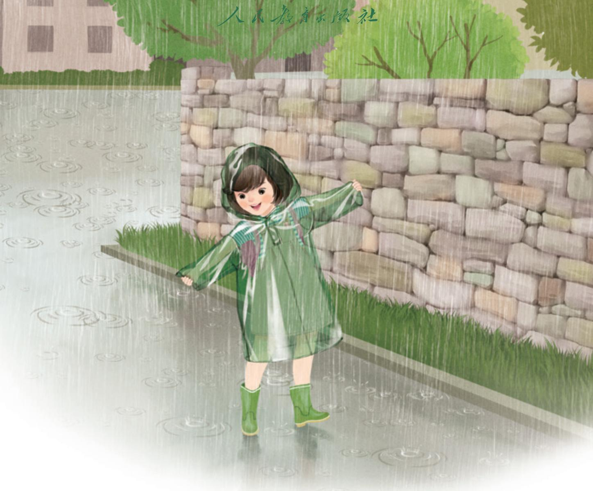

默读课文，想想课文围绕“盼”写了“我”的哪些表现。

围绕“盼”这一心理活动，课文哪些部分写得比较具体？选出写得生动的两处，说说这样写的好处。

# 人民教育出版社

## 交流平台

中心意思确立后，怎样才能把这个意思表达得更全面、更充分呢？可以围绕中心意思，从不同的方面或者选取不同的事例来写。如，《夏天里的成长》为了表现夏天是万物生长的季节，就选择了各种各样的事物作为例子，让我们深深感受到了夏日的生机与活力。

在围绕一个意思表达时，要将重要部分写得详细些、具体些，才能给读者留下更深刻的印象。如，课文《盼》紧扣“盼”字，具体写了“我”放学路上惊喜地发现下雨了，兴冲冲地跑回家，想借买酱油的机会穿上新雨衣，却未能如愿……这些具体生动的描写，让我们对“盼”的心情感同身受。

## 初试身手

下面是一位同学围绕“戏迷爷爷”这个题目选的材料。判断一下，哪些材料可以用来表达中心意思，在后面的括号里打“√”。

跑了几十里地去看戏。（ ）

常给我们讲故事。（）

在爷爷的倡导下，街道组织了业余戏班子。（）

◇ 干活时会哼上两句流行歌曲。（

口 边炒菜边做戏曲里的动作，把菜炒煳了。（

到文化馆拜师学戏。（ )

每天看书看到很晚。（）

□ 一看到戏曲表演就占着电视。（

从下面的题目中选一两个，说说可以选择哪些事例或从哪些方面来写。

好斗的公鸡 弟弟变了 闲不住的奶奶忙碌的早晨 欢声笑语满校园 那些温暖的时光

## 习作例文

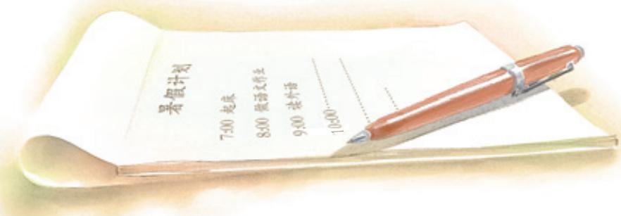

## 爸爸的计划

我爸爸是一个工厂的计划科科长，擅长订计划。在家里，他也给我们订了计划。妈妈有学习电子技术的计划，外pēng婆有学习烹调的计划，我有作息计划、复习功课计划，他自己有读书计划、读报计划、做家务计划，每个人还有如何订计划的计划、如何督促各人执行计划的计划………

爸爸执行计划一丝不苟。比如他的家务计划规定，每天定时开关气窗，他就照章办事，到了关气窗的时间，哪怕外面打雷下雨，雨水打湿了窗帘，打湿了写字台上他正在拟订的计划，他也是先关气窗后关门窗；又如按照他的计划，全家人九点休息，时钟敲过九下，爸爸便大声宣布：“今天各项计划都已胜利完成，最后一项计划开始睡觉！”

在爸爸的计划之下，我能有自己的计划吗？

晚上，爸爸的钥匙响过一连串的“交响乐”后，他便fēng对我说：“烽烽，你要放暑假了，我们订一个暑假计划吧！”

一到订计划的时候，爸爸便眉飞色舞。“七时起床，八时做语文作业，九时读外语，十时……”他每写上一条，我就像又被猛抽了一下的陀螺，晕头转向。

罗列爸爸给每个人订的计划，突出了爸爸爱订计划的特点。

两个典型的事例，让人印象深刻。

订暑假计划这个事例，写得很具体。

望着那长长的计划，我试探地问：“爸爸，这计划中是不是加一条游泳啊什么的……”

“什么？”爸爸仿佛不认识我似的瞪了我好一会儿，“我订的计划是最最全面的。你看，午睡、吃饭、休息，什么都有了。”于是爸爸又订了一个如何执行计划的计划：作业由他亲自检查，午睡、吃饭由外婆监督。

默读课文，说说作者是怎么写这个爱订计划的爸爸的。

## 小 站

这是一个铁路线上的小站，只有慢车才停靠两三分钟。快车转瞬间疾驰而过，旅客们甚至连站名还来不及看清楚。

就在这转瞬间，你也许看到一间红瓦灰墙的小屋，月zhà台上几根漆成淡蓝色的木栅栏，或者还有三五个人影。而这一切又立即消失了，火车两旁依然是逼人而来的山崖和巨石。

小站的“小”，可以从哪些语句中看出来?

这是一个在北方山区常见的小站。月台左面有一张红榜，上面用大字标明了二百四十一天安全无事故的记录，贴着竞赛优胜者的照片。红榜旁边是一块小黑板，上面用白粉笔写着当天的天气预报和早晨的报纸摘要。出站口的旁边贴着一张讲卫生的宣传画。月台上，有两三个挑着箩筐的农民，正准备上车进城。几步以外，站上的两位工作人员正在商量着什么。

月台中间有一个小小的喷水池，显然是经过精心设计的。喷水池中间堆起一座小小的假山，假山上栽着一棵尺把高的小树。喷泉从小树下面的石孔喷出来，水珠四射，把假山上的小宝塔洗得一尘不染。

月台的两头种了几株杏树，花开得正艳，引来一群蜜蜂。蜜蜂嗡嗡地边歌边舞，点缀着这个宁静的小站。

小站上没有钟，也没有电铃。站长吹一长声哨子，刚到站的火车跟着长啸一声，缓缓地离开小站，继续自己的征途。

这个小站坐落在山坳里。站在月台上向四周望去，tū只看到光秃秃的石头山，没有什么秀丽的景色。可是就在这儿，就在这个小站上，却出现了一股活泼的喷泉，几树灿烂的杏花。

这喷泉，这杏花，给旅客们带来了温暖的春意。

最后两段没有再写小站的“小”，这在表达上有什么作用?

课文要表达的中心意思是什么？是怎样一步一步表达出来的?

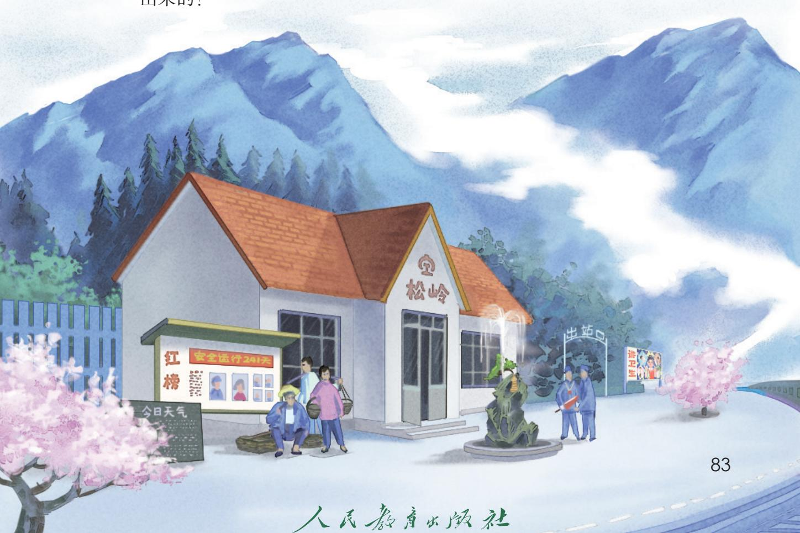

## 围绕中心意思写

汉字有着丰富的文化内涵。选择一个你感受最深的汉字写一篇习作，可以从下面的字里选，也可以选其他的字。可以写生活中发生过的事情，也可以写想象故事。

想清楚自己要表达的中心意思。注意围绕中心意思，从不同的方面或选择不同的事例来写。

写之前，可以拟个提纲，看看选择的材料是不是能够表达中心意思。写完后，请同学读读，看看他能不能体会到你写的中心意思。

可以用你选的字作为题目，也可以另外拟一个题目。

甜乐泪暖悔望

迷妙变忙寻让

## 人民教育出版社

第六单元

我们是大地的一部分，大地也是我们的一部分。

抓住关键句，把握文章的主要观点。

学写倡议书。

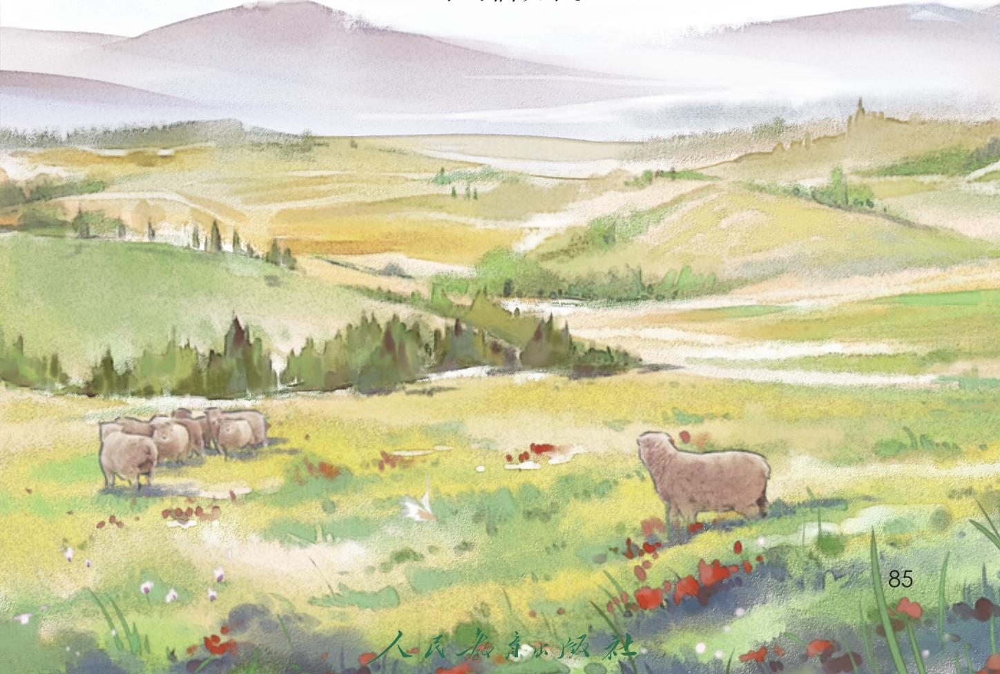

## 18 古诗三首

浪淘沙(其一)

[唐]刘禹锡

九曲黄河万里沙，bǒ浪淘风簸自天涯。如今直上银河去，同到牵牛织女家。

## 江南春

[唐]杜牧

千里莺啼绿映红，水村山郭酒旗风。南朝四百八十寺，多少楼台烟雨中。

## 注释

①〔浪淘沙〕唐代曲名。   
②〔簸〕颠簸。

注释

①〔山郭〕山城。

②〔酒旗〕酒招子，酒馆外悬 挂的旗子之类的标识。

③〔南朝〕公元420—589年先后建都于建康(今江苏南京)的宋、齐、梁、陈四个朝代的总称。

④〔四百八十寺]“四百八十”是虚指，形容寺院很多。

## 书湖阴先生壁

[宋]王安石

茅檐长扫净无苔， 花木成畦手自栽。 一水护田将绿绕， tà 两山排闼送青来。

注释

①〔湖阴先生〕杨骥(字德逢)的别号。杨骥是王安石退居江宁(今江苏南京)时的邻居。

②〔苔〕青苔。

③〔畦〕这里指种有花木的一块块排列整齐的土地，周围有土埂围着。

④〔排闼〕推开门。闼，小门。

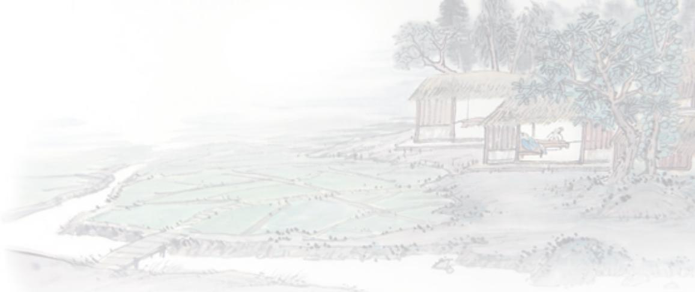

## 涯莺

有感情地朗读课文。背诵课文。

读读《浪淘沙》（其一），说说你从哪里体会到了黄河的磅礴气势。

想想《江南春》抓住哪些景物写出了江南春天的特点。

司 读读下面的诗句，说说你发现了什么。一水护田将绿绕， \~0。两山排闼送青来。

我想起了其他古诗里这样的诗句。

## 19只有一个地球

据有幸飞上太空的宇航员介绍，他们在天际遨游时遥望地球，映入眼帘的是一个晶莹的球体，上面蓝色和白色的纹痕相互交错周围裹着一层薄薄的水蓝色“纱衣”。地球，这位人类的母亲，这个生命的摇篮，是那样美丽壮观，和蔼可亲。

cuǐ càn

但是，在群星璀璨的宇宙中，地球是渺小的。它是一个半径不到6400千米的星球。它只有这么大，不会再长大。

地球所拥有的自然资源也是有限的。拿矿产资源来说，它不是谁的恩赐，而是经过几百万年，甚至几亿年的地质变化才形成的。地球是无私的，它向人类慷慨地提供矿产资源。但是，如果不加节制地开采，必将加速地球上矿产资源的枯竭。

人类生活所需要的水资源、土地资源、生物资源等，本来是可以不断再生，长期给人类作贡献的。但是，因为人们随意毁坏自然资源，不顾后果地滥用化学品，不但使它们不能再生，还造成了xié系列生态灾难，给人类生存带来了严重的威胁。

有人会说，宇宙空间不是大得很吗，那里有数不清的星球，在地球资源枯竭的时候，我们不能移居到别的星球上去吗？

科学家已经证明，至少在以地球为中心的40万亿千米的范围内，没有适合人类居住的第二个星球。人类不能指望地球被破坏以后再移居到别的星球上去。

不错，科学家们提出了许多设想，例如，在火星或者月球上建造移民基地。但是，即使这些设想能实现，也是遥远的事情。

“我们这个地球太可爱了，同时又太容易破碎了！”这是宇航员遨游太空目睹地球时发出的感叹。

只有一个地球，如果它被破坏了，我们别无去处。如果地球上的各种资源都枯竭了，我们很难从别的地方得到补充。我们要精心地保护地球，保护地球的生态环境。让地球更好地造福于我们的子孙后代吧！

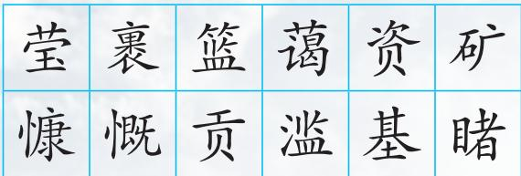

默读课文，结合关键句，说说课文讲了哪几个方面的内容。

“我们要精心地保护地球，保护地球的生态环境”，这一结论是怎样一步步得出的？结合课文内容，和同学交流。

读下面的句子时，你想到了生活中的哪些现象？针对这些现象设计一两条保护环境或节约资源的宣传标语，和同学交流。

因为人们随意毁坏自然资源，不顾后果地滥用化学品，不但使它们不能再生，还造成了一系列生态灾难，给人类生存带来了严重的威胁。

# 20 青山不老

人与土地、人与自然相互依存。巍巍青山，有多少默默守护的人。默读课文，说说文中的老人创造了怎样的奇迹，是在什么样的条件下创造的。再想想课文为什么以“青山不老”为题。

窗外是参天的杨柳。院子在山沟里，山上全是树。我们盘腿坐在土炕上，就像坐在船上，四周全是绿色的波浪，风一吹，树梢卷lín过涛声，叶间闪着粼粼的波光。

我知道这条山沟所处的大环境。这是中国的晋西北，是西伯利nüè亚大风常来肆虐的地方，是干旱、霜冻、沙尘暴等与生命作对的怪jù物盘踞之地。过去，这里风吹沙起，能一直埋到城头。当地县志记zǎi qíng载：“风大作时，能逆吹牛马使倒行，或擎之高二三丈而坠。”就在如此险恶的地方，我对面这个手端一杆旱烟袋的瘦小老头，竟创造了这块绿洲。

我还知道这个院子里的小环境。一排三间房，就剩下老者一qiāo人。老人每天早晨抓把柴煮饭，带上干粮扛上铁锹进沟上山；晚上回来，吃过饭，抽袋烟睡觉。六十五岁那年，他组织了七位老汉开始治理这条沟，现在已有五人离世。他可敬的老伴，与他风雨同舟一生；一天他栽树回来时，发现她已静静地躺在炕上过世了。他已经八十一岁，知道终有一天自己也会爬不起来。他唯一的女儿三番五次地从城里回来，要接他去享清福，他不走。他觉得种树是命运的选择，屋后的青山就是生命的归宿。

他敲着旱烟锅不紧不慢地说着，村干部在旁边恭敬地补充着…十五年啊，绿化了八条沟，造了七条防风林带、三千七百亩林网，这是多么了不起的奇迹。去年冬天，他用林业收入资助每户村民买了一台电视机他还有宏伟设想，还要栽树，直到自己爬不起来为止。

在屋里说完话，老人陪我们到沟里去看树。杨树、柳树，如臂jìng如股，劲挺在山洼、山腰。看不见它们的根，山洪涌下的泥埋住了树的下半截，树却勇敢地顶住了山洪的凶猛。这山已失去了原来的坡形，依着一层层的树形成一层层的梯。老人说：“这树下的淤泥有两米厚，都是好土啊！”是的，保住了这黄土，我们才有这绿树；有了这绿树，我们才守住了这片土。

看完树，我们在村口道别。老人拄着拐杖，慢慢迈进他那个绿风荡漾的小院。我不禁鼻子一酸—也许老人进去后就再也出不来了。作为一个山野老农，他就这样来实现自己的价值。他已经将自己的生命转化为另一种东西。他是真正与山川共存、与日月同辉了。

这位普通老人让我领悟到：青山是不会老的。

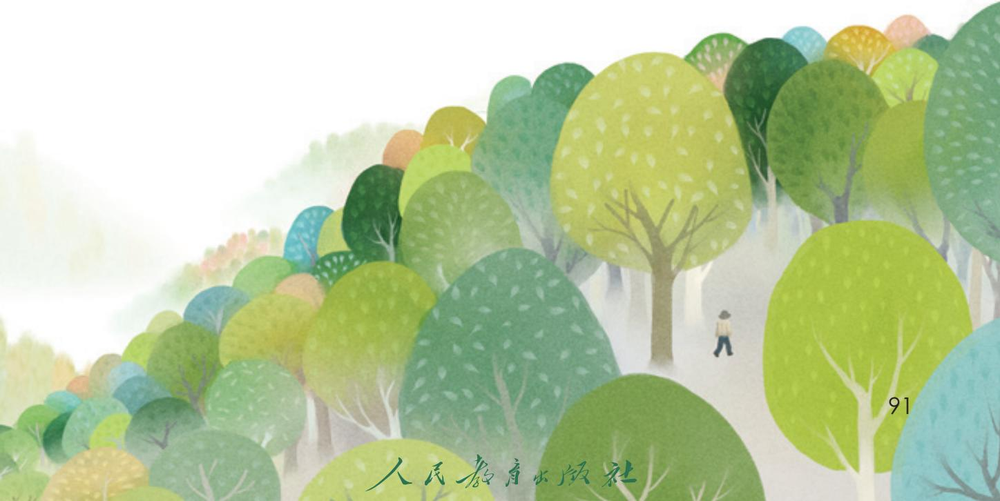

# (21)三黑和土地

有感情地朗读课文。说说三黑是怎样看待土地的。读了这篇课文，你对脚下的土地有了什么新的感受？

农民一有了土地，  
就把整个生命投入了土地。  
活像旱天的鹅，  
一见了水就连头带尾巴钻进水里。

恨不得把每一块土，都送到舌头上，是咸是甜，自己先来尝一尝。

恨不得自己变成一粒种子，躺在土里试一试，  
看温暖不温暖，  
合适不合适。

三黑就是这样地翻着土地。从东到西，从南到北，每一寸土都给翻起，每一块土疙瘩都给细细打碎。

pá   
地翻好，又耙了几遍，   
耙得又平又顺溜，   
看起来   
好像妇女们刚梳的头。

这么松散的地，简直是一张软床，叫人想在上面打滚，想在上面躺一躺。

## 三黑

从来没睡过这么好的床，今天准备好了，  
叫麦籽儿睡上。这么好的床，  
麦籽儿躺下去挺舒服，就想发芽，  
赶紧钻出来吸些雨露。  
三黑耙过地，  
坐下来歇一歇。qiáo  
看见自己种的荞麦已经开花，  
白霎霎的像一片雪。  
荞麦地里guō  
还有两个蝈蝈儿在叫唤，  
吱吱吱……  
叫得人心里痒抓抓的好喜欢。  
小时候因为逮蝈蝈儿，  
常常挨骂，  
爹娘骂：不好好拾柴火。tāng  
地主骂：蹚坏了他的庄稼。

## 现在

蝈蝈儿就在自己地里叫，

他想招呼从地头路过的那个孩子：

“快去逮吧，你听，叫得多好！”

他又在打算：

明年要跟人合伙，

把地浇得肥肥的，

让庄稼长得更好，收得更多。

再买头小毛驴，

打完场赶着送公粮；

驮着老伴儿

看闺女，上东庄。

三黑一边耙地，一边想着：

翻身的人儿心里真甜。

他笑嘻嘻的，连嘴都合不上。

地里的蝈蝈儿也叫得更欢。

## 在希望的田野上

陈晓光

我们的家乡在希望的田野上，炊烟在新建的住房上飘荡，  
小河在美丽的村庄旁流淌。  
一片冬麦，一片高粱，  
十里荷塘，十里果香。  
我们世世代代在这田野上生活，为她富裕，为她兴旺。我们的理想在希望的田野上，禾苗在农民的汗水里抽穗，  
牛羊在牧人的笛声中成长。  
西村纺花，东港撒网，  
北疆播种，南国打场。  
我们世世代代在这田野上劳动为她打扮，为她梳妆。

我们的未来在希望的田野上人们在明媚的阳光下生活，生活在人们的劳动中变样。老人们举杯，孩子们欢笑，小伙儿弹琴，姑娘歌唱。我们世世代代在这田野上奋斗为她幸福，为她增光。

## 口语交际

## 意见不同怎么办

对生活中的很多事情，大家的意见会有分歧，需要协商才能解决。如，遇到下面这样的情况，应该怎么办呢？

<table><tr><td rowspan=1 colspan=1>事例</td><td rowspan=1 colspan=1>有关方面的人</td></tr><tr><td rowspan=1 colspan=1>爆竹声声辞旧岁，银花朵朵贺新年。噼里啪啦的爆竹、五彩缤纷的烟花，给人们带来浓浓的年味和喜庆气氛，但也在环保、安全等方面带来很多问题。是否燃放烟花爆竹，一些城市的政策不断摇摆。那么，春节到底该不该燃放烟花爆竹呢?</td><td rowspan=1 colspan=1>普通市民消防队员环卫工人鞭炮厂工人</td></tr><tr><td rowspan=1 colspan=1>多年前，某市为了拓宽城市道路，砍掉了道路两边生长了几十年的大树。这件事引起了热议。有人认为，为拓宽城市道路，促进经济繁荣，砍树是值得的；有人认为，砍树容易栽树难，应该另想办法发展交通，不应该砍树。到底是要路还是要树呢?</td><td rowspan=1 colspan=1>司机交通运输局工作人员道路附近居民市政园林局局长</td></tr></table>

分小组，选择一则材料进行讨论。讨论时，小组成员分别选择一个角色，从这个角色出发阐述对这个问题的看法。听到不同意见，要换位思考，积极沟通。

准确把握别人的观点，不曲解，不断章取义。

O 尊重不同意见，讨论问题时，态度要平和，以理服人。

## 学写倡议书

如果你有一个想法希望得到大家的支持，并一起去实施，可以写一份倡议书。如，号召同学节约用水、不使用一次性用品，倡议居民进行垃圾分类。读读下面的倡议书，和同学交流写倡议书需要注意什么。

## “节約用水”倡议書

标题要鲜明。

## 同学们：

我国是水资源紧缺的国家，爱护水资源是我们每个人的义务。节约用水不能仅仅是一句口号，我们还要时时刻刻注意从自身做起。为此，我们向全校同学发出节约用水的倡议，让我们从今天起努力做到以下几点：

1. 洗漱时，及时关掉水龙头。

2.一水多用，充分利用水资源。如，用淘米水浇花，用洗脸水冲厕所。

3.制作“节约用水”的标签并张贴。

正文写清楚倡议的内容，可以分点说明。

4. 看到浪费水的行为，要及时劝说并制止。

依据倡议的对象写称呼。有时也可以不用称呼，在正文中点出即可。

一份倡议，一个承诺，一种责任。亲爱的同学们，让我们行动起来吧！

育英小学阳光中队全体少先队员12月8日

最后要署名并写上日期。

仿照上面的例子，就你关心的问题写一份倡议书。

根据倡议的对象，将倡议书发布在合适的地方，如校园的公告栏、小区的布告栏、网络论坛。

# 语文园地

## 交流平台

读古诗词的时候，遇到不理解的字词，可以借助注释理解。

有画面感的诗句，可以通过想象来体会。如，读到“千里莺啼绿映红，水村山郭酒旗风”时，我的脑海中浮现出了江南春天的美丽景象。带着这样的想象读，让我体会到了诗歌的美。

读李商隐的《嫦娥》时，联系嫦娥奔月的故事，体会诗中写到的嫦娥在月宫的孤独寂寞，更容易理解这首诗的意思。看来，多了解一些传统文化知识，对我们学习古诗词很有帮助。

## 词句段运用

读一读，说说下面这段话表达了怎样的观点。

为了生活环境更舒适，人们在城市里种植了大量的花草树木。这些树木花草是城市的“绿色卫士”，守护着城市的环境。人们把它们比作“城市之肺”，是十分形象和贴切的。因为这些“绿色卫士”，不仅能吸收空气中的二氧化碳，调节城市空气，而且能降低灰尘污染—叶子表面的绒毛和黏液能吸附飘尘，阻止灰尘微粒蔓延。

公交车是常用交通工具，选择合适的乘车方案，能让出行更顺利、快捷。读材料，想一想：小林同学家住温泉镇，他希望早上9点以前赶到在宋家洼的外婆家，好跟舅舅一起去爬山。他怎样乘车最合适？

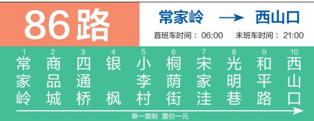

86路车停靠常家岭、商品城等10个站点。一般来说，停靠的站点越多，需要的时间越长。

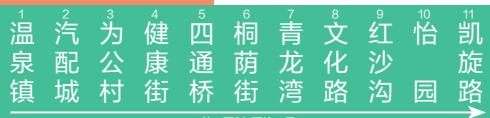

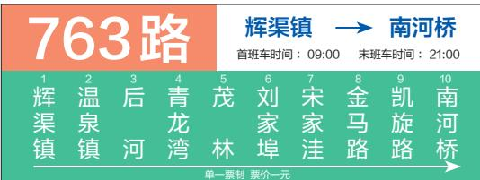

首班车时间是指最早一班车的发车时间，末班车时间是指最晚一班车的发车时间。

## 日积月累

五行：金、木、水、火、土五谷：稻、麦、黍、菽、稷五音：宫、商、角、徵、羽五彩：黄、青、赤、白、黑

第七单元

一首歌，一幅画，一件小工艺品……一段美好的艺术之旅。

借助语言文字展开想象，体会艺术之美。

写自己的拿手好戏，把重点部分写具体

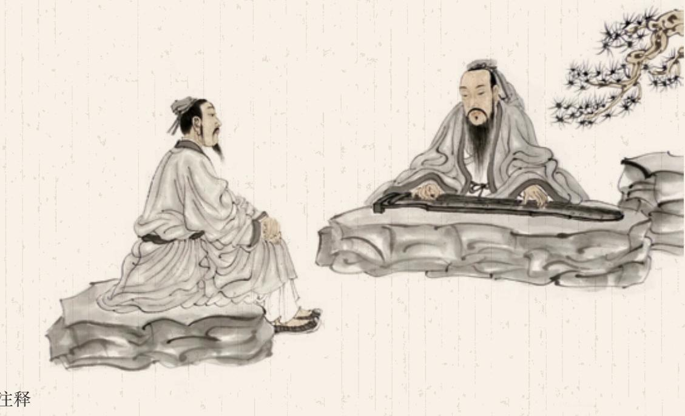

# ②2 文言文二则

## 伯牙鼓琴①

zhōng

伯牙鼓琴，锺子期听之。方鼓琴而志②在太山③，锺子期曰：善哉④乎鼓琴，巍巍乎若太山⑤。”少选之间而志在流水，锺子期shāng又曰：“善哉乎鼓琴，汤汤乎若流水⑦。”锺子期死，伯牙破琴绝弦，终身不复鼓琴，以为世无足复为鼓琴者®

注释

①本文选自《吕氏春秋·本味》。鼓，弹。

②〔志〕心志，情志。

③〔太山〕泛指大山、高山。一说指东岳泰山。

④〔善哉〕好啊。

⑤〔巍巍乎若太山〕像大山一样高峻。巍巍，高大的样子。若，像。

⑥〔少选〕一会儿，不久。

⑦〔汤汤乎若流水〕像流水一样浩荡。汤汤，水流大而急的样子。

⑧〔以为世无足复为鼓琴者〕认为世上再没有值得他为之弹琴的人了。

# 人民教育出版社

## 书戴嵩画牛①

蜀中有杜处士②，好书画，所宝③以百数。有戴嵩《牛》④轴，尤所爱，锦囊玉轴⑤，常以自随。

日曝书画，有一牧童见之，拊掌大笑，曰：“此画斗牛也。chù miù牛斗，力在角，尾搐⑦入两股®间，今乃掉尾而斗，谬矣。”处士nù笑而然之①。古语有云：“耕当问奴，织当问婢。”不可改也。

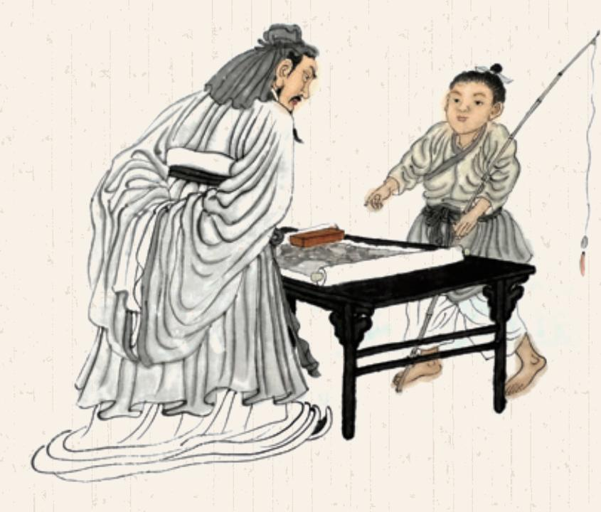

⑥〔拊掌〕拍手。  
⑦〔搐〕抽缩。  
⑧〔股〕大腿。  
⑨〔乃〕却。  
⑩〔掉〕摆动，摇。  
⑩〔然之〕认为他说得对。

# 哉巍弦轴锦曝矣

正确、流利地朗读课文。背诵《伯牙鼓琴》。

“伯牙破琴绝弦，终身不复鼓琴，以为世无足复为鼓琴者。”说说这句话的意思，再结合“资料袋”和同学交流感受。

用自己的话讲讲《书戴嵩画牛》的故事。

## 资料袋

伯牙、锺子期相传为春秋时期人，关于他们二人成为知音的传说，《吕氏春秋》《列子》等古书均有记载，也流传于民间。由于这个传说，人们把真正了解自己的人叫作“知音”，用“高山流水”比喻知音难觅或乐曲高妙。

我国古诗常提及伯牙、锺子期的传说，如：

锺期一见知，山水千秋闻。 孟浩然《示孟郊》

锺期久已没，世上无知音。 李白《月夜听卢子顺弹琴》

故人舍我归黄壤，流水高山心自知。 王安石《伯牙》

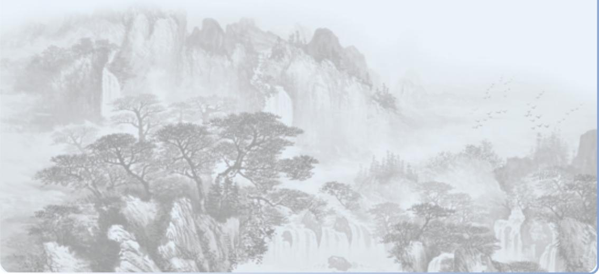

# 23 月光曲

两百多年前，德国有个音乐家叫贝多芬，他谱写了许多著名的乐曲。其中有一首著名的钢琴曲叫《月光曲》①，传说是这样谱成的。

有一年秋天，贝多芬去各地旅行演出，来到莱茵河边的一个小镇上。一天夜晚，他在幽静的小路上散步，听到断断续续的钢琴声从一所茅屋里传出来，弹的正是他的曲子。

贝多芬走近茅屋，琴声忽然停了，屋子里有人在谈话。一个姑娘说：“这首曲子多难弹哪！我只听别人弹过几遍，总是记不住该怎样弹，要是能听一听贝多芬自己是怎样弹的，那有多好哇！”一个男quàn的说：“是啊，可是音乐会的入场券太贵了，咱们又太穷。”姑娘说：“哥哥，你别难过，我不过随便说说罢了。”

贝多芬听到这里，推开门，轻轻地走了进去。茅屋里点着一支蜡烛。在微弱的烛光下，男的正在做皮鞋。窗前有架旧钢琴，前面坐着一个十六七岁的姑娘，脸很清秀，可是眼睛失明了。

皮鞋匠看见进来个陌生人，站起来问：“先生，您找谁？走错门了吧？”贝多芬说：“不，我是来弹一首曲子给这位姑娘听的。”

姑娘连忙站起来让座。贝多芬坐在钢琴前面，弹起盲姑娘刚才弹的那首曲子。盲姑娘听得入了神，一曲弹完，她激动地说：“弹得多纯熟哇！感情多深哪！您，您就是贝多芬先生吧？”

贝多芬没有回答，他问盲姑娘：“您爱听吗？我再给您弹一首吧。’

一阵风把蜡烛吹灭了。月光照进窗子，茅屋里的一切好像披上了银纱，显得格外清幽。贝多芬望了望站在他身旁的兄妹俩，借着清幽的月光，按起了琴键。

皮鞋匠静静地听着。他好像面对着大海，月亮正从水天相接的lín地方升起来。微波粼粼的海面上，霎时间洒满了银光。月亮越升越高，穿过一缕一缕轻纱似的微云。忽然，海面上刮起了大风，卷起了巨浪。被月光照得雪亮的浪花，一个连一个朝着岸边涌过来……tián皮鞋匠看看妹妹，月光正照在她那恬静的脸上，照着她睁得大大的眼睛。她仿佛也看到了，看到了她从来没有看到过的景象月光照耀下的波涛汹涌的大海。

兄妹俩被美妙的琴声陶醉了。等他们醒过神来，贝多芬早已离开了茅屋。他飞奔回客店，花了一夜工夫，把刚才弹的曲子一《月光曲》记录了下来。

## 谱莱茵盲纯键缕陶

有感情地朗读课文。说说贝多芬为什么弹琴给盲姑娘听，为什么弹完一曲又弹一曲。

反复朗读第9自然段，想象描绘的画面，感受乐曲的美妙，再背诵下来。

## 选做

听一听自己喜爱的音乐，展开联想和想象，把想到的情景写下来。

# 24 京剧趣谈

提起京剧，你的脑海中也许会浮现出丰富多彩的京剧脸谱。如果你细细欣赏京剧，还会发现其中的许多奥秘。默读课文，说说你对京剧有了哪些了解。课后，有兴趣的同学可以看看京剧，并和同学交流。

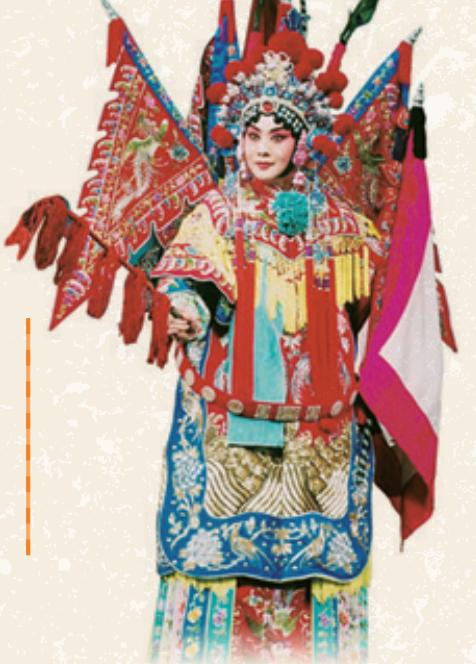

## 马鞭

中国古人时常要骑马。可骑马在舞台上没办法表现，舞台方圆chěng太小，马匹是无法驰骋的。真马出现在舞台上，演员也怕它失去控制。京剧继承、发展了中国传统戏曲的表现手段，终于战胜了这种尴gà表演方式十分符合中国的美学。巨大的马匹被整个省略，但骑马人那种特定和优美的姿态却鲜明地显现出来。同时这一根虚拟的马鞭①给演员以无穷无尽的表演自由：可以高扬，可以低垂；可以跑半天还在家门口，可以一抬手就走了一百里。马鞭本身具备一种装饰的美而且不同人物在使用马鞭时，也各自形成了一套约定俗成的方法。

马鞭是实在的道具，是可感觉可使用的。京剧还有一些虚拟的道具，但一样可感觉可使用。比如《拾玉镯》中小姑娘纳鞋底，鞋底是实的，针线可是虚的，但在演员手里，“无”远远胜过了“有”。

再比如宴席上的酒壶酒杯。主人一声吩咐“酒宴摆下—”，仆人立刻把酒壶酒杯端上舞台。主人和客人举杯喝酒，一杯又一杯，但就是不见吃饭吃菜，可客人也一样“饱”了。京剧一般是不把饭碗搬上舞台的，一旦真用，那就得“狠狠做戏”。比如《金玉nú奴》中有一个细节，小生演员用饭碗喝完豆汁，又用嘴去舔筷子如果没有这一“舔”，那饭碗也就完全不必拿上舞台。

## 亮相

京剧还有一种奇特之处：双方正在对打，激烈到简直是风雨不透，台下看的人非常紧张，一个个大气儿不敢出，都把眼睛睁得大大的，唯恐在一眨眼间，谁就把对方给“杀”了。然而也怪，就在luó双方打得不可开交之际，那紧张而又整齐的锣鼓声忽然一停，人物jiá的动作也戛然而止双方脸对着脸，眼睛对着眼睛，兵器对着兵器，一切都像被某种定身术给制服了！小孩子和外宾忍不住要问：如果他们当中哪个先‘醒’了，拿起兵器朝着对方一刺，对方不就‘完’了吗？”

问得有理，但这恰恰是京剧艺术的高妙之处。俗话说“一动不如一静”，古诗也说“此时无声胜有声”，讲的就是这种情况。静，越发能显示武艺的高强，越发能显示必胜的信心。

还有一种“刀（枪）下场”，可以视为动态的亮相。双方正在交战，一方被打败，跑下去了。可胜利一方不紧追，反而留在原地，抡圆了胳膊把手中的兵器（刀或枪）要了个风雨不透。这，哪里还是戏剧？这，不是太像杂技了吗？您说得太对了，这就是京剧中的杂技成分，自古如此，如今还保留着。它的存在，就是为了突显人物的英雄气概。

## 口语交际

## 聊聊书法

书法是我们的国粹，散发着艺术的魅力，受到人们的喜爱和珍视。今天，我们一起来聊聊书法吧！

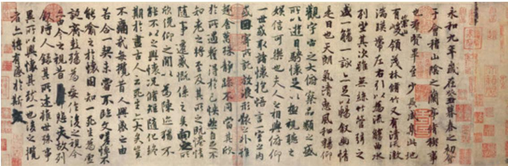  
王羲之《兰亭集序》(冯承素摹本)

你知道我国古代哪些著名的书法家？你知道他们的哪些故事？

你参观过书法作品展览吗？你欣赏哪些人的作品？

你学习过书法吗？在这一过程中，有什么特别的感受？

◇你认为练习书法有什么益处？

可以课前先搜集资料，作好准备。

和同学交流的时候，表述要清楚。结合图片、实物，能让你的讲述更加生动。

有条理地表达，如分点说明。

对感兴趣的话题深入交谈。

## 习作

## 我的拿手好戏

十八般武艺，样样是好戏！

跳舞，唱歌，画画，变魔术

剪纸，捏泥人，做标本，做航模

挑西瓜，做面包，炒拿手菜

吹口哨，玩魔方，钓鱼

你的拿手好戏是什么？写下来，和同学一起交流吧！写之前想一想：

你的拿手好戏是怎样练成的？关于拿手好戏，有哪些想要分享的故事？

怎样写你的拿手好戏？哪些内容先写？哪些内容后写？

哪些内容作为重点部分？哪些内容可以写得简略一些？

可以仿照下面的例子列一个提纲。

点明拿手好戏是挑西瓜。

## 《三招挑西瓜》

简单介绍：是怎样练成挑西瓜的拿手好戏的。

具体写：周末和同学郊游時挑西瓜、吃西瓜的趣事。

我用“看、拍、听”三招，自信地挑了两个大西瓜。

第一个西瓜很好，得意。

第二个西瓜没熟，我很尴尬——拿手好戏演砸啦！

写完后读一读，看看是否通顺，重点部分是不是写具体了，再改一改。

# 语文园地

## 交流平台

俗话说，好记性不如烂笔头。做课堂笔记，是一个非常好的学习习惯，不仅能帮助我们记忆，还能促使我们积极思考。

7 开国大典

我在课堂笔记本上，记 师讲的重要内容。

群众入场—典礼开始—宣布新中国成立—升国旗—宣读公告阅兵盛况—群众游行

有了疑问，需要继续思考，或者查找资料的，我会认真记下来。

23月光曲

1. 传说是这样谱成的。

“传说”？看来这首曲子的创作过程不一定是这样。查资料了解一下。

2. 您就是贝多芬先生吧？

盲姑娘听琴声猜出了贝多芬，这是说贝多芬遇到了知音吧？

## 词句段运用

我会把听课过程中产生的想法记录下来。

日常生活中使用的一些词语与戏曲有关。读一读下面的词语，和同学交流它们的意思，再选一两个说句子。

亮相 行当 压轴 行头跑龙套 唱白脸 花架子 对台戏粉墨登场 字正腔圆 有板有眼 科班出身

一位同学根据下面的说明书，做成了图中的小台灯。小台灯有一处做错了，跟说明书写得不够清楚有关系。读读说明书，把写得不清楚的地方画出来，再改一改。

## 玩具小台灯制作说明书

材料：

半个乒乓球，一个瓶盖，一段铅丝，一块橡皮泥。

做法：

1. 在半个乒乓球中间钻个小洞，当灯罩。

2. 在瓶盖中间钻个小洞，从洞中穿进铅丝，铅丝一端弯一点儿，钩住盖底。在靠近洞的盖面和盖底处用橡皮泥把铅丝粘牢。

3. 把铅丝的另一端插入乒乓球的小洞里。把洞的两边粘牢。铅丝的头上用橡皮泥做一个小灯泡。

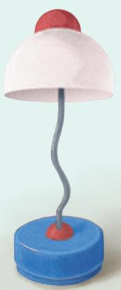

## 日积月累

高山流水轻歌曼舞画龙点睛天籁之音行云流水笔走龙蛇余音绕梁巧夺天工妙笔生花黄钟大吕惟妙惟肖栩栩如生

第八单元

有的人活着，他已经死了；有的人死了，他还活着。

——臧克家

借助相关资料，理解课文主要内容。

通过事情写一个人，表达出自己的情感。

鲁迅，原名周树人，浙江绍兴人。主要作品有小说集《呐喊》《彷徨》《故事新编》，散文诗集《野草》，散文集《朝花夕拾》，以及大量杂文。他是伟大的文学家思想家、革命家，新文化运动的重要参与者，中国现代文学的奠基人。

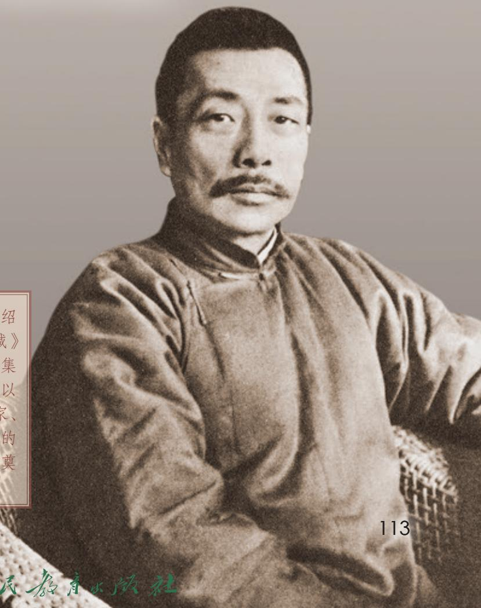

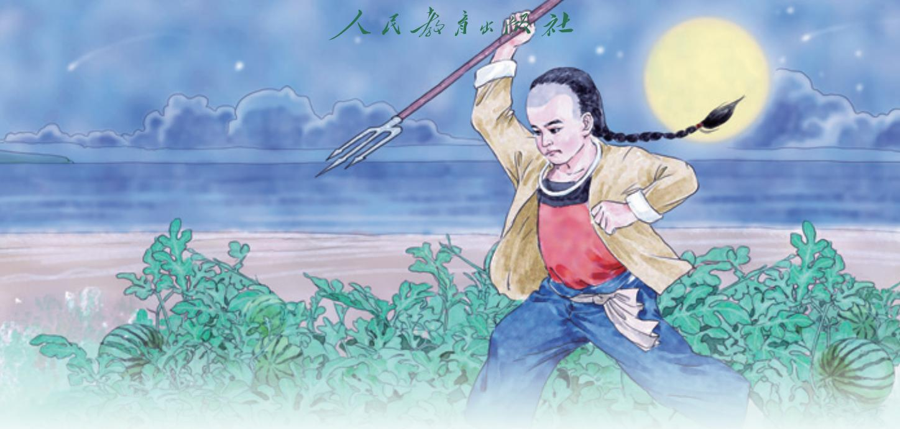

# rùn25 少年闰土

深蓝的天空中挂着一轮金黄的圆月，下面是海边的沙地，都种着一望无际的碧绿的西瓜，其间有一个十一二岁的少年，项带①银chá圈，手捏一柄钢叉，向一匹猹②尽力的刺去，那渣却将身一扭，反从他的胯下逃走了。

这少年便是闰土。我认识他时，也不过十多岁，离现在将有  
三十年了；那时我的父亲还在世，家景也好，我正是一个少爷。那sì  
一年，我家是一件大祭祀的值年。这祭祀，说是三十多年才能轮到zhēng  
一回，所以很郑重；正月里供祖像，供品很多，祭器很讲究，拜的  
人也很多，祭器也很要防偷去。我家只有一个忙月（我们这里给人

做工的分三种：整年给一定人家做工的叫长年；按日给人做工的叫短工；自己也种地，只在过年过节以及收租时候来给一定的人家做工的称忙月），忙不过来，他便对父亲说，可以叫他的儿子闰土来管祭器的。

我的父亲允许了；我也很高兴，因为我早听到闰土这名字，而且知道他和我仿佛年纪，闰月生的，五行缺土，所以他的父亲叫他jiàng闰土。他是能装弶捉小鸟雀的。

我于是日日盼望新年，新年到，闰土也就到了。好容易到了年末，有一日，母亲告诉我，闰土来了，我便飞跑的去看。他正在厨房里，紫色的圆脸，头戴一顶小毡帽，颈上套一个明晃晃的银项圈，这可见他的父亲十分爱他，怕他死去，所以在神佛面前许下愿心，用圈子将他套住了。他见人很怕羞，只是不怕我，没有旁人的时候，便和我说话，于是不到半日，我们便熟识了。

我们那时候不知道谈些什么，只记得闰土很高兴，说是上城之后，见了许多没有见过的东西。

第二日，我便要他捕鸟。他说：

“这不能。须大雪下了才好。我们沙地上，下了雪，我扫出一biǎn bǐ块空地来，用短棒支起一个大竹匾，撒下秕谷，看鸟雀来吃时，我远远地将缚在棒上的绳子只一拉，那鸟雀就罩在竹匾下了。什么都bó gū有：稻鸡，角鸡，鹁鸪，蓝背……”

我于是又很盼望下雪。

闰土又对我说：

“现在太冷，你夏天到我们这里来。我们日里到海边检①贝壳去，红的绿的都有，鬼见怕也有，观音手也有。晚上我和爹管西瓜去，你也去。”

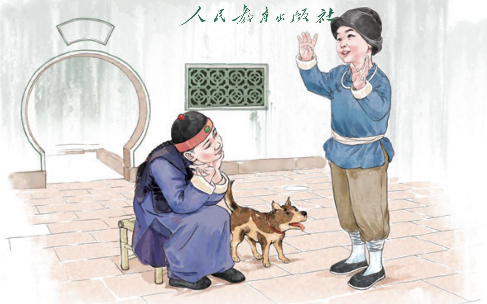

“管贼么？”

“不是。走路的人口渴了摘一个瓜吃，我们这里是不算偷的。huān要管的是獾猪，刺猬，猹。月亮地下，你听，啦啦的响了，渣在咬瓜了。你便捏了胡叉，轻轻地走去……”

我那时并不知道这所谓渣的是怎么一件东西—便是现在也没有知道只是无端的觉得状如小狗而很凶猛。

“他不咬人么？”

“有胡叉呢。走到了，看见猹了，你便刺。这畜生很伶俐，倒向你奔来，反从胯下窜了。他的皮毛是油一般的滑……”

我素不知道天下有这许多新鲜事：海边有如许五色的贝壳；西瓜有这样危险的经历，我先前单知道他在水果店里出卖罢了。

“我们沙地里，潮汛要来的时候，就有许多跳鱼儿只是跳，都有青蛙似的两个脚……”

阿！闰土的心里有无穷无尽的希奇①的事，都是我往常的朋友所不知道的。他们不知道一些事，闰土在海边时，他们都和我一样只看见院子里高墙上的四角的天空。

可惜正月过去了，闰土须回家里去，我急得大哭，他也躲到厨房里，哭着不肯出门，但终于被他父亲带走了。他后来还托他的父亲带给我一包贝壳和几支很好看的鸟毛，我也曾送他一两次东西，但从此没有再见面。

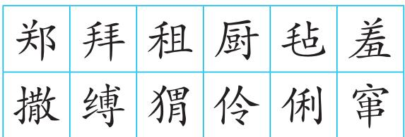

有感情地朗读课文。背诵第1自然段，体会闰土在“我”心中的美好形象。

课文写了月下看瓜刺猹的闰土、初次相识时的闰土、给“我”讲新鲜事的闰土。结合相关内容，说说闰土是个怎样的少年。

读句子，注意加点的部分，说说从中感受到“我”怎样的内心世界。

◇ 我那时并不知道这所谓猹的是怎么一件东西——便是现在也没有知道……

◇ 我素不知道天下有这许多新鲜事……

阿！闰土的心里有无穷无尽的希奇的事，都是我往常的朋友所不知道的……

## 小练笔

照片凝固了我们生活中的一个个瞬间。从你的照片中选一张，仿照第1自然段写一写。

①〔希奇〕现在写作“稀奇”。

# 26 好的故事

灯火渐渐地缩小了，在预告石油①的已经不多；石油又不是老牌，早熏得灯罩很昏暗。鞭爆的繁响在四近，烟草的烟雾在身边：是昏沉的夜。

我闭了眼睛，向后一仰，靠在椅背上；捏着《初学记》的手搁kē在膝髁上。

我在蒙胧②中，看见一个好的故事。

这故事很美丽，幽雅，有趣。许多美的人和美的事，错综起来像一天云锦，而且万颗奔星似的飞动着，同时又展开去，以至于无穷。

我仿佛记得曾坐小船经过山阴道③，两岸边的乌柏，新禾，野qié花，鸡，狗，丛树和枯树，茅屋，塔，伽蓝，农夫和村妇，村女，suō晒着的衣裳，和尚，蓑笠，天，云，竹，……都倒影在澄碧的小河zǎo中，随着每一打桨，各各夹带了闪烁的日光，并水里的萍藻游鱼，一同荡漾。诸影诸物，无不解散，而且摇动，扩大，互相融和；刚cēn cī一融和，却又退缩，复近于原形。边缘都参差如夏云头，镶着日光，发出水银色焰。凡是我所经过的河，都是如此。

现在我所见的故事也如此。水中的青天的底子，一切事物统在上面交错，织成一篇，永是生动，永是展开，我看不见这一篇的结束。

河边枯柳树下的几株瘦削的一丈红，该是村女种的罢①。大红yān花和斑红花，都在水里面浮动，忽而碎散，拉长了，如缕缕的胭脂水，然而没有晕。茅屋，狗，塔，村女，云，……也都浮动着。大là红花一朵朵全被拉长了，这时是泼刺奔迸的红锦带。带织入狗中，狗织入白云中，白云织入村女中……。在一瞬间，他们又将退缩了。但斑红花影也已碎散，伸长，就要织进塔，村女，狗，茅屋，云里去。

现在我所见的故事清楚起来了，美丽，幽雅，有趣，而且分明。青天上面，有无数美的人和美的事，我一一看见，一一知道。

我就要凝视他们……。

我正要凝视他们时，骤然一惊，睁开眼，云锦也已皱蹙，凌乱，仿佛有谁掷一块大石下河水中，水波陡然起立，将整篇的影子撕成片片了。我无意识地赶忙捏住几乎坠地的《初学记》，眼前还ní剩着几点虹霓色的碎影。

我真爱这一篇好的故事，趁碎影还在，我要追回他，完成他，留下他。我抛了书，欠身伸手去取笔，何尝有一丝碎影，只见昏暗的灯光，我不在小船里了。

但我总记得见过这一篇好的故事，在昏沉的夜…。

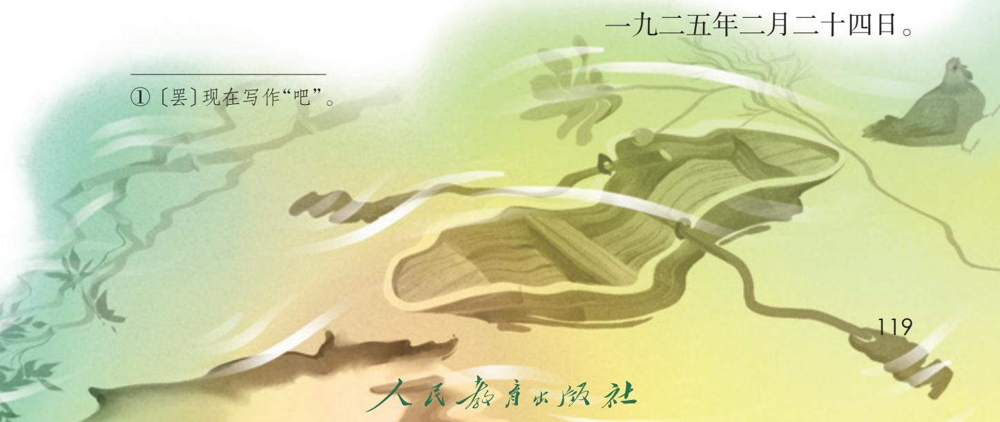

# 搁综澄萍削

# 瞬凝骤掷陡

本文写于上个世纪二十年代，语言表达与现在不完全一样，有些词语比较难懂。初读课文时，遇到难懂的词语可以先跳过去。再读课文时，试着联系上下文理解它们的意思。

“好的故事”其实是一个梦境。这故事的美丽、幽雅、有趣体现在哪里？结合课文内容说一说。

结合“阅读链接”中的材料，说说对课文最后两个自然段的理解。

## 阅读链接

一个“昏沉的夜”里，作者于工作之余闭眼休息的刹那间，在蒙眬中看见一幅很美丽的生活图画，其中“许多美的人和美的事，错综起来像一天云锦”。这一幅美丽的生活图画也绝不是模糊的，而是十分清楚和真实的，它像记忆中的江南农村的美丽景色那样实在，像河岸美景倒映在澄碧的河水中那样分明…作者希望着这样美丽的生活，是这篇作品的主要精神。

-选自冯雪峰的《论〈野草〉》

作者憧憬于“美的人和美的事”，但现实是“昏沉的夜”，没有“美的人和美的事”，所以只能在梦中看见；醒来却“只见昏暗的灯光”，“何尝有一丝碎影”。表现了作者的怅惘和失望，也表现了作者的理想和现实的矛盾。但作者最后还是坚信他看见了一篇好的故事（“我总记得见过这一篇好的故事”)，虽然“在昏沉的夜”。在黑暗的现实中，他强烈地追求美好的事物，把美好的事物描绘得非常“美丽，幽雅，有趣”，艳绚多姿；表面是在描写风景，眷恋故乡的景物，实际是有所象征或寄托…

选自李何林的《鲁迅〈野草〉注解》

# 27 我的伯父鲁迅先生

用较快的速度默读课文，想想课文写了关于鲁迅的哪几件事，给每件事加个小标题。再结合资料和同学交流：课文中的鲁迅给你留下了怎样的印象？

伯父鲁迅先生在世的时候，我年纪还小，根本不知道鲁迅是谁，以为伯父就是伯父，跟任何人的伯父一样。伯父去世了，他的遗体bìn dào躺在万国殡仪馆的礼堂里，许多人都来追悼他，向他致敬，有的甚至失声痛哭。数不清的挽联挂满了墙壁，大大小小的花圈堆满了整间屋子。送挽联送花圈的有工人，有学生，各色各样的人都有。那时候我有点儿惊异了，为什么伯父得到这么多人的爱戴？我呆呆地yàn望着来来往往吊唁的人，想到我永远见不到伯父的面了，听不到他的声音了，也得不到他的爱抚了，泪珠就一滴一滴地掉下来。

zhēng

就在伯父去世那一年的正月里，一个星期六的下午，爸爸妈  
妈带我到伯父家里去。那时候每到周末，我们姐妹三个轮流跟随  
着爸爸妈妈到伯父家去团聚。这一天在晚餐桌上，伯父跟我谈起hǔ  
《水浒传》里的故事和人物。不知道伯父怎么会知道我读了《水浒hú lún  
传》，大概是爸爸告诉他的吧。老实说，我读《水浒传》不过囫囵  
吞枣地看一遍，只注意紧张动人的情节；那些好汉的个性，那些  
复杂的内容，全搞不清楚，有时候还把这个人做的事情安在那个  
人身上。伯父问我的时候，我就张冠李戴地乱说一气。伯父摸着

胡子，笑了笑，说：“哈哈！还是我的记性好。”听了伯父这句话，我又羞愧，又悔恨，比挨打挨骂还难受。从此，我读什么书都不再马马虎虎了。

那天临走的时候，伯父送我两本书，一本是《表》，一本是hàn《小约翰》。伯父已经去世多年了，这两本书我还保存着。

有一次，在伯父家里，大伙儿围着一张桌子吃晚饭。我望望爸爸的鼻子，又望望伯父的鼻子，对他说：“大伯，您跟爸爸哪儿都像，就是有一点不像。”

“哪一点不像呢？”伯父转过头来，微笑着问我。他嚼着东西，嘴唇上的胡子跟着一动一动的。

“爸爸的鼻子又高又直，您的呢，又扁又平。”我望了他们半天才说。

“你不知道，”伯父摸了摸自己的鼻子，笑着说，“我小的时候，鼻子跟你爸爸的一样，也是又高又直的。”

“那怎么”

“可是到了后来，碰了几次壁，把鼻子碰扁了。”

“碰壁？”我说，“您怎么会碰壁呢？是不是您走路不小心？”

“你想，四周黑洞洞的，还不容易碰壁吗？”

“哦！”我恍然大悟，“墙壁当然比鼻子硬得多了，怪不得您把鼻子碰扁了。”

在座的人都哈哈大笑起来。

有一年的除夕，我们全家都到伯父家里去了。伯父买了许多爆竹和花筒给我们。我们都胆小得很，没有一个人敢放，伯父和爸爸就替我们放。他们每人捧了一大堆，走到天井里去。我们掩着耳朵，躲在玻璃门后面，睁大了眼睛望着他们。四扇玻璃门，我们三个和海婴一人占一扇。伯母和妈妈站在我们旁边。

爸爸放的是爆竹，声音真大，可怕极了，虽然关紧了门，掩住了耳朵，也照样听得见。我们紧张极了，气都不敢透一口。

爸爸放完爆竹，轮到伯父放花筒了。火花在我们眼前飞舞，艳丽的色彩映照在伯父的脸上。我突然注意到他脸上的表情，那么慈祥，那么愉快，眉毛，眼睛，还有额上一条条的皱纹，都现出他心底的欢笑来。那时候，他的脸上充满了自然而和谐的美，是我从来没看见过的。

有一天黄昏，呼呼的北风怒号着，天色十分阴暗。街上的人都匆匆忙忙赶着回家。爸爸妈妈拉着我的手，到伯父家去。走到离伯父家门口不远的地方，看见一个拉黄包车的坐在地上呻吟，车子扔在一边。

我们走过去，看见他两只手捧着脚，脚上没穿鞋，地上淌了一摊血。他听见脚步声，抬起头来，饱经风霜的脸上现出难以忍受的痛苦。

“怎么了？”爸爸问他。

“先生，”他那灰白的抽动着的嘴唇里发出低微的声音，“没留心，踩在碎玻璃上，玻璃片插进脚底了。疼得厉害，回不了家啦！”

爸爸跑到伯父家里，不一会儿，就跟伯父拿了药和纱布出来。niè他们把那个拉车的扶上车子，一个蹲着，一个半跪着，爸爸拿镊子

péng fū夹出碎玻璃片，伯父拿硼酸水给他洗干净。他们又给他敷上药，扎好绷带。

拉车的感激地说：“我家离这儿不远，这就可以支持着回去了。两位好心的先生，我真不知道怎么谢你们！”

伯父又掏出一些钱来给他，叫他在家里休养几天，把剩下的药和绷带也给了他。

天黑了，路灯发出微弱的光。我站在伯父家门口看着他们，突然感到深深的寒意，摸摸自己的鼻尖，冷得像冰，脚和手也有些麻木了。我想，这么冷的天，那个拉车的怎么能光着脚拉着车在路上跑呢？

伯父和爸爸回来的时候，我就问他们。伯父的回答我现在记不清了，只记得他的话很深奥，不容易懂。我拾起头来，要求他给我详细地解说。这时候，我清清楚楚地看见，而且现在也清清楚楚地记得，他的脸上不再有那种慈祥的愉快的表情了，他变得那么严肃。他没有回答我，只把枯瘦的手按在我的头上，半天没动，最后深深地叹了一口气。

伯父逝世以后，我见到他家的女佣阿三。阿三是个工人的妻子，她丈夫失了业，她愁得两只眼睛起了蒙，看东西不清楚，模模糊糊的像隔着雾。她跟我谈起伯父生前的事情。她说：“周先生自己病得那么厉害，还三更半夜地写文章。有时候我听着他一阵阵接连不断地咳嗽，真替他难受。他对自己的病一点儿也不在乎，倒常常劝我多休息，不叫我干重活儿。”

的确，伯父就是这样的一个人，他为自己想得少，为别人想得多。

# 28有的人

## 纪念鲁迅有感

鲁迅走了，但他给后人留下了很多很多，有怀念，更有深深的思考。《有的人》是诗人臧克家为纪念鲁迅逝世十三周年写的一首诗。有感情地读一读，结合本单元的课文和你查找的资料，说说鲁迅是一个怎样的人。

有的人活着，

他已经死了；

有的人死了，

他还活着。

有的人

骑在人民头上：“啊，我多伟大！”

有的人

俯下身子给人民当牛马。

有的人

xiù 把名字刻入石头，想“不朽”；

有的人

情愿作野草，等着地下的火烧。

本诗作者臧克家。

有的人  
他活着别人就不能活；  
有的人  
他活着为了多数人更好地活。

骑在人民头上的人民把他摔垮；给人民作牛马的人民永远记住他！

把名字刻入石头的名字比尸首烂得更早；只要春风吹到的地方到处是青青的野草。

他活着别人就不能活的人，他的下场可以看到；他活着为了多数人更好地活的人群众把他抬举得很高，很高。

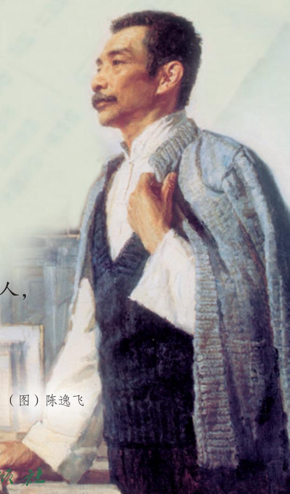

## 有你，真好

“有你，真好”是一句让人感到温暖的话。凝视着它，那人、那事、那场景……就会慢慢浮现在眼前。

看到“有你，真好”这句话，你想到了谁？

为什么觉得有他“真好”？

哪件事或哪几件事让你感触比较深？

口 当时的场景是怎样的？

拿起笔，表达你真挚的情感吧！写的时候，可以假想这个“你”就在眼前，你在用文字和他对话。

写完后读一读，看看是不是把事情写具体了，是不是融入了自己的情感。如果有可能，把这篇习作与文中的“你”分享。

# 人民教育出版社

# 语文园地

## 交流平台

阅读文章，要注意把握文章的主要内容。

我们已经知道：文章的题目有时能提示文章的主要内容；关键句对了解主要内容也很有帮助；写一件事的文章，可以通过理清事情的起因、经过、结果来把握主要内容。

一般来讲，了解了文章每个部分主要讲的是什么，再把各个部分的主要意思连起来，就能把握主要内容。如《只有一个地球》，我们可以边读边列提纲，把各部分的内容写出来，再连起来想一想，就知道了文章的主要内容。

把握文章的主要内容，不同的文章有不同的方法，我们要灵活运用。

## 词句段运用

读下面各组题目，说说你的发现，和同学交流。

这是用文章中的主要人物作题目。

开国大典 “诺曼底号”遇难记 草船借箭

这组题目很有意思，因为……

在牛肚子里旅行 “精彩极了”和“糟糕透了”慢性子裁缝和急性子顾客

读下面的词语，你想到了什么？选择一个词语，把你想到的用一段话写下来。饱经风霜的脸 饱经风霜的老屋饱经风霜的大树树林的深处 秋天的深处 心灵的深处

# 人民教育出版社

## 书写提示

柳公权是唐代著名的书法家。他的楷书用笔方圆并施，点画棱角分明，结构精妙。人们常说的“颜筋柳骨”之“柳骨”，即形容其书法瘦硬挺拔，骨力遒劲。《玄秘塔碑》是其楷书代表作之一。

之明效也夫將欲 显大不思议之道 辅大有为之君固 必有冥符玄契欤 驾橫海之大航拯 迷途于彼岸者固 必有奇功妙道欤 以开成元年六月

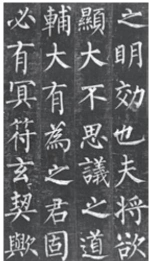

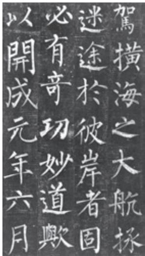  
柳公权《玄秘塔碑》(局部)

## 日积月累

无情未必真豪杰，怜子如何不丈夫。

鲁迅《答客诮》

其实地上本没有路，走的人多了，也便成了路。

——鲁迅《故乡》

惟有民魂是值得宝贵的，惟有他发扬起来，中国才有真进步。 -鲁迅《学界的三魂》

我们从古以来，就有埋头苦干的人，有拼命硬干的人，有为民请命的人，有舍身求法的人…这就是中国的脊梁。

鲁迅《中国人失掉自信力了吗》

## 写字表

1 毯玻璃裳虹蹄腐稍微  
2 缀窥幽雅案拙帘薄糊蕾恰襟恍怨  
3 德鹊蝉  
律崖渡索  
寇副榴抢贯棋悬沸涧雹屹悦迈屈  
7 政府宾盏栏汇宣阅制坦距隆  
10疙瘩棍裁筹橡雕踩颓沮丧趴屉  
11 谜尚氧倾揭斑燥漠磁素盗培  
13 黎咆哮嗓哑揪瞪呻废  
14汹涌澎湃熄掀困唉淋嘿糟嘛皱勺  
16 棚粱叭苔藓坪蔗瀑增缝谚  
17 袖篷缩疯瓦柜喧甩嚷蒜酱唇蹦  
18 涯莺  
19 莹里篮蔼资矿慷慨贡滥基睹  
22 哉巍弦轴锦曝矣  
23 谱莱茵盲纯键缕陶  
25 郑拜租厨毡羞撒缚猬伶俐窜  
26 搁综澄萍漾削瞬凝骤掷陡

## 词语表

1 绿毯线条柔美 惊叹 回味目的地洒脱

玻璃 衣裳 彩虹 马蹄 热乎乎 礼貌 拘束

举杯感人會心微笑

2 宅院 幽雅 伏案 浑浊 笨拙 眼帘 参差

单薄 文思 梦想 迷蒙 模糊 花蕾 恰如

衣襟 恍然 愁怨 顺心 平淡

6 日寇 奋战 险要 手榴弹 全神贯注 悬崖

斩钉截铁 热血沸腾 攀登 居高临下 山涧

粉身碎骨雹子屹立眺望喜悦壮烈豪迈

7 政府 外宾 汇集 预定 爆发 排山倒海 就位

宣告雄伟肃静语调完毕检阅制服

坦克 一致 距离 高潮 次序

10 疙瘩 疲倦 呆头呆脑 冰棍 别出心裁

技高一筹 橡皮 踩脚 大步流星 颓然

# 暴露无遗沮丧抽屉念念有词忘乎所以

心满意足

11 发达理论 类似 猜测起源适当 氧气

提供 能源 昼夜 神秘 观测 拍摄 斑点

枯萎 干燥 沙漠 磁场 因素 考察 培养

13 黎明 咆哮 惊慌 嗓子 跌跌撞撞 拥戴 沙哑

党员呻吟废话吞没猛然

14 渔夫汹涌澎湃风暴轰鸣心惊肉跳抱怨

倾听探望照顾困难阴冷自作自受

湿淋淋 渔网糟糕忧虑后脑勺

16 活生生高粱苔藓草坪 甘蔗 瀑布增加

缝隙 软绵绵 谚语 农作物 尽量

17 斗篷 情况 袖子 瓦蓝 衣柜 预报 喧闹

遮盖讲座 酱油 逗引嘴唇

19 晶莹 摇篮 壮观 和蔼 资源 有限 矿产

无私 慷慨 节制 枯竭 贡献 毁坏 滥用

生态 设想 例如 基地 目睹 子孙

23 谱写 钢琴 幽静 断断续续 茅屋 失明 纯熟

清幽 琴键 景象 陶醉

25 一望无际 家景 郑重 供品 祭器 讲究 盼望

厨房毡帽项圈刺猬伶俐经历潮汛

26 预告 昏沉 错综 澄碧 荡漾 解散退缩

瘦削浮动瞬间凝视骤然凌乱 陡然

## 后 记

《义务教育教科书语文》（一\~六年级）由教育部组织编写，北京大学中文系温儒敏教授担任总主编。

王宁、张联荣、柳士镇、张健、翟京华、郑桂华、陈秀玲、武琼、陈萍等专家对教科书的修改完善给予了悉心指导；金波、伍新春、李明新、沈大安、熊宁宁等多次审阅教科书内容，提出了修改建议；在教育部的组织下，广大一线优秀教师通读教科书，保证了教学的适切性；在试教试用过程中，北京市、天津市、福建省等地教研部门及部分学校给予了大力支持，为教科书质量的进一步提升提供了保障。

人民教育出版社承担了教科书的编辑出版工作，在组织编写、试教试用等方面给予了全方位的协助。人民教育出版社小学语文室全体同仁始终是教科书编写的中坚力量。于泉滢、何保全、王平、孙雪松为本书绘制插图，景绍宗为本书封面绘制插图。北京大学附属小学的学生为本书“书写提示”栏目书写了硬笔书法作品。对教科书的编写、出版提供过帮助的同仁和社会各界朋友还有很多，在此一并表示诚挚的谢意。

教科书投入使用后，我们根据各方意见作了修订，真诚希望广大师生和家长继续提出宝贵意见！

联系方式

电话：010-58758616

电子邮箱：jcfk@pep.com.cn

编 者

人民教育出版社

YIWU JIAOYU JIAOKESHU YUWEN

语文

六年级 上册

