全国优秀教材特等奖

义务教育教科书

六年级

下册

人民教育出版社

# 语文

义务教育教科书

# 六年级下册

教育部组织编写

总主编 温儒敏

总主编：温儒敏

小学主编：陈先云（执行）曹文轩崔 峦 李吉林

编写人员：（以姓氏笔画为序）

冯颖何致文陈先云徐轶

曹文轩温儒敏 熊宁宁滕春友

责任编辑：熊宁宁冯颖徐轶

美术编辑：李宏庆

义务教育教科书 语文 六年级 下册

教育部组织编写

出版人民教育出版社

（北京市海淀区中关村南大街17号院1号楼 邮编：100081)

网址 http://www.pep.com.cn

## 人民教育出版社

## 目录

第一单元…  
1 北京的春节…………  
2腊八粥………… …8  
3 古诗三首…… ……11  
寒食…… …11  
迢迢牵牛星……………11  
十五夜望月…… ……12  
4\*藏戏……… ………13  
O 口语交际：即兴发言………………15  
O 习作：家乡的风俗…………16  
语文园地……… ……17  
第二单元· 19  
5 鲁滨逊漂流记（节选）………20  
6\*骑鹅旅行记（节选）…………27  
7\*汤姆·索亚历险记（节选）…33  
口语交际：同读一本书……37  
O 习作：写作品梗概……………………38  
语文园地…… …39  
快乐读书吧：  
漫步世界名著花园…………41  
第三单元… …43  
8匆匆…… ……44  
9 那个星期天…… ……46  
习作例文：  
别了，语文课……51  
阳光的两种用法………54  
习作：让真情自然流露…………56  
第四单元… …57  
10 古诗三首……58  
马诗…… ……58  
石灰吟…… ……58  
竹石……  
11 十六年前的回忆…………………60  
12 为人民服务………… ………64  
13\*董存瑞舍身炸暗堡…………66  
综合性学习：奋斗的历程……68  
O  
第五单元… 79  
14 文言文二则……80  
学弈…… …80  
两小儿辩日…………81  
15 真理诞生于一百个问号之后…82  
16 表里的生物………… ……87  
17\*他们那时候多有趣啊……………90  
O 口语交际：辩论……………93  
O 习作：插上科学的翅膀飞……94  
O 语文园地……… ………95  
第六单元… …97  
综合性学习：难忘小学生活………98  
回忆往事  
依依惜别……105  
古诗词诵读  
1 采薇(节选)…………………111  
2 送元二使安西……… ……112  
3 春夜喜雨……… …113  
4 早春呈水部张十八员外……114  
5 江上渔者…… ……115  
6 泊船瓜洲……… ……116  
7 游园不值…… ……117  
8 卜算子·送鲍浩然之浙东……118  
9 浣溪沙… …119  
10 清平乐…… ………120  
写字表…… …121  
词语表…… …122

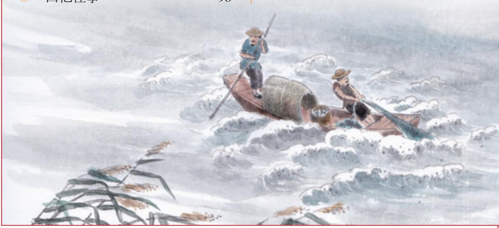

标\*的是略读课文

仅供个人学习使用，未经授权不得另做他用

第一单元

百里不同风，千里不同俗。

分清内容的主次，体会作者是如何详写主要部分的。

习作时注意抓住重点，写出特点。

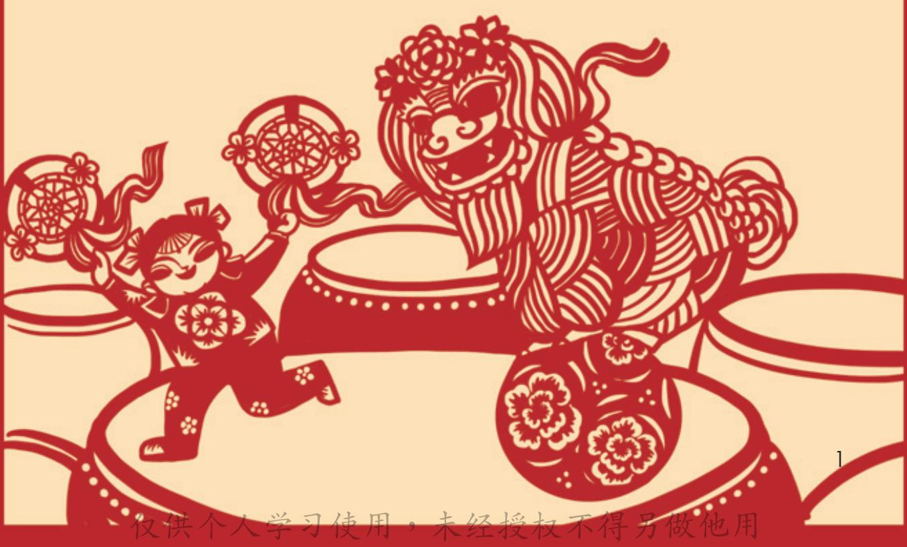

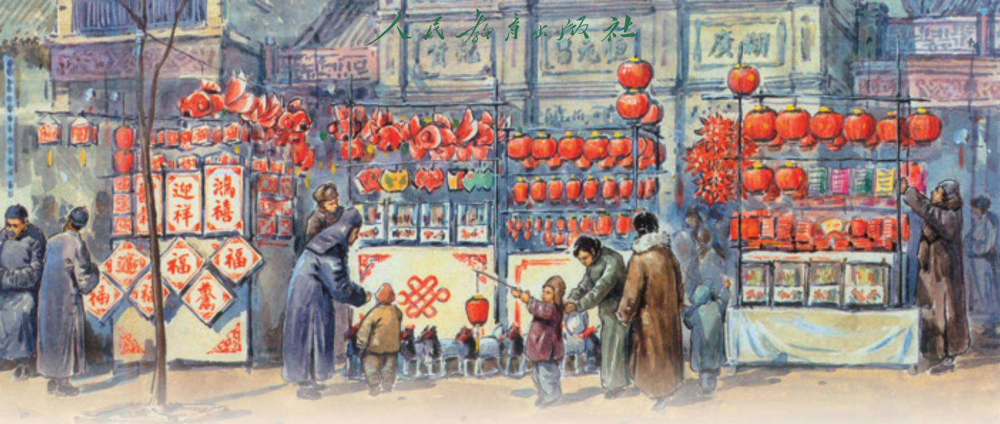

## ① 北京的春节

xún

按照北京的老规矩，春节差不多在腊月的初旬就开始了。“腊七腊八，冻死寒鸦”，这是一年里最冷的时候。可是，到了严冬不久便是春天，所以人们并不因为寒冷而减少过年与迎春的热情。在腊八那天，家家都熬腊八粥。这种特制的粥是祭祖祭神的，可是细一想，它倒是农业社会一种自傲的表现 —这种粥是用各种米，rén各种豆，与各种干果（杏仁、核桃仁、瓜子、荔枝肉、莲子、花生líng米、葡萄干、菱角米……）熬成的。这不是粥，而是小型的农业产品展览会。

腊八这天还要泡腊八蒜。把蒜瓣放到高醋里，封起来，为过年fěi吃饺子用。到年底，蒜泡得色如翡翠，醋也有了些辣味，色味双美，使人忍不住要多吃几个饺子。在北京，过年时，家家吃饺子。

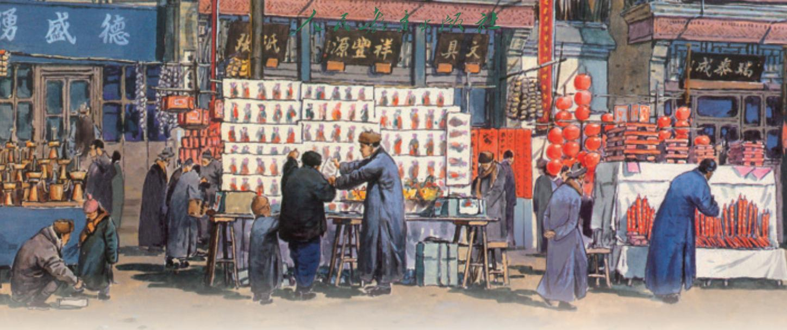  
（图）盛锡珊

从腊八起，铺户就加紧上年货，街上增加了货摊子——卖春联的、卖年画的、卖蜜供的、卖水仙花的等等，他们都是只在这个季节才会出现的。这些摊子都让孩子们的心跳得更快一些。在胡同里，吆喝的声音也比平时更多更复杂，其中也有仅在腊月才出现yì的，像卖松枝的、薏仁米的、年糕的等等。

孩子们准备过年，第一件事是买杂拌儿。这是用各种干果（花zhēn jiàn chān生、胶枣、榛子、栗子等）与蜜饯掺和成的，普通的带皮，高级的没有皮—例如普通的用带皮的榛子，高级的就用榛仁。孩子们喜欢吃这些零七八碎儿，即使没有饺子吃，也必须买杂拌儿。他们的第二件事是买爆竹，特别是男孩子们。恐怕第三件事才是买玩意儿—风筝、空竹、口琴等——和年画。

孩子们忙乱，大人们也紧张。他们必须预备过年吃的喝的用的一切，也必须赶快给孩子做新鞋新衣，好在新年时显出万象更新的气象。

腊月二十三过小年，差不多就是过春节的“彩排”。在老年间，这天晚上家家祭灶王，从一擦黑儿，鞭炮就响起来，人们随着鞭炮声把灶王的纸像焚化，美其名曰送灶王上天。在前几天，街上就有好多卖麦芽糖与江米糖的，糖形或为长方块或为大小瓜形。按旧日的说法，用糖粘住灶王的嘴，他到了天上就不会向玉帝报告家中的坏事了。现在，还有卖糖的，但是只由大家享用，并不再粘灶王的嘴了。

过了二十三，大家就更忙了，春节眨眼就到了啊。在除夕以前，家家必须把春联贴好，必须大扫除一次，名曰扫房。必须把肉、鸡、鱼、青菜、年糕什么的都预备充足，至少足够吃用一个星zhēng期的—按老习惯，铺户多数关五天门，到正月初六才开张。假若不预备下几天的吃食，临时不容易补充。

除夕真热闹。家家赶做年菜，到处是酒肉的香味。老少男女都穿起新衣，门外贴好红红的对联，屋里贴好各色的年画，哪一家都灯火通宵，不许间断，鞭炮声日夜不绝。在外边做事的人，除非万不得已，必定赶回家来，吃团圆饭，祭祖。这一夜，除了很小的孩子，没有什么人睡觉，都要守岁。

初一的光景与除夕截然不同：除夕，街上挤满了人；初一，铺户都上着板子，门前堆着昨夜燃放的爆竹纸皮，全城都在休息。

男人们在午前就出动，到亲戚家、朋友家去拜年。女人们在家中接待客人。城内城外有许多寺院开放，任人游览，小贩们在庙外摆摊儿，卖茶、食品和各种玩具。北城外的大钟寺、西城外的白云

guàn

观、南城的火神庙（厂甸）是最有名的。可是，开庙最初的两三  
天，并不十分热闹，因为人们正忙着彼此贺年，无暇顾及。到了初  
五初六，庙会开始风光起来。孩子们特别热心去逛，为的是到城外  
看看野景，可以骑毛驴，还能买到那些新年特有的玩具。白云观外  
的广场上有赛轿车赛马的，在老年间，据说还有赛骆驼的。这些比luó  
赛并不为争谁第一谁第二，而是在观众面前表演骡马与骑者的美好xián  
姿态和娴熟技能。

多数铺户在初六开张，又放鞭炮，从黎明到清早，全城鞭炮声不绝。虽然开了张，可是除了卖吃食与其他重要日用品的铺子，大家并不很忙，铺中的伙计们还可以轮流去逛庙会、逛天桥和听戏。

元宵（或汤圆）上市，春节的又一个高潮到了。除夕是热闹的，可是没有月光；元宵节呢，恰好是明月当空。大年初一是体面的，家家门前贴着鲜红的春联，人们穿着新衣裳，可是它还不够美；元宵chì节，处处悬灯结彩，整条大街像是办喜事，火炽而美丽。有名的老铺都要挂出几百盏灯来：有的一律是玻璃的，有的清一色是牛角的，有的都是纱灯；有的通通彩绘《红楼梦》或《水浒传》故事，有的图案各式各样。这在当年，也就是一种广告。灯一悬起，任何人都可以进到铺中参观，晚间灯中都点上蜡烛，观者就更多。这广告可不庸俗。干果店在灯节还要做一批杂拌儿生意，所以每每独出心裁，制成各样的冰灯，或用麦苗做成一两条碧绿的长龙，把顾客招来。

孩子们买各种花炮燃放，即使不跑到街上去淘气，在家中也照样能有声有光地玩耍。家中也有灯：走马灯、宫灯、各形各色的纸灯，还有纱灯，里面有小铃，到时候就叮叮地响。大家还必须吃元宵啊。这的确是美好快乐的日子。

人民教育出版社

一眨眼，到了残灯末庙，学生该去上学，大人又去照常做事，春节在正月十九结束了。腊月和正月，在农村正是大家最闲在的时候。过了灯节，天气转暖，大家就又去忙着干活儿了。北京虽是城市，可是它也跟着农村一齐过年，而且过得分外热闹。

醋饺摊拌筝眨宵燃

戚贩彼贺轿骆驼默读课文，想想课文是按照怎样的顺序写老北京人过春节的，哪几天写得详细，哪几天写得简略，再讨论一下这样写的好处。

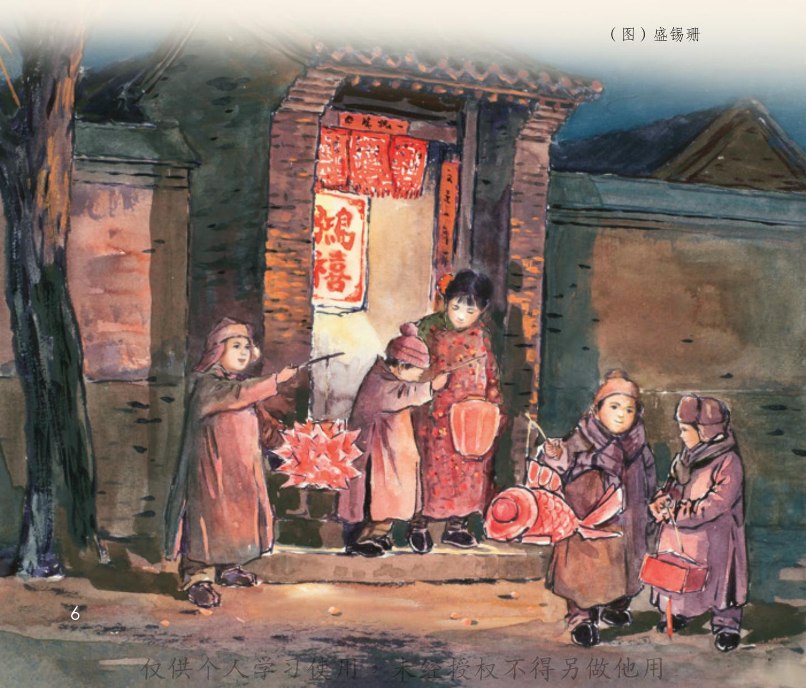

找出课文中描写孩子们过春节的部分读一读，再说说你是怎样过春节的。

读下面的句子，注意加点的词语，体会老舍“京味儿”语言的特点。

孩子们喜欢吃这些零七八碎儿，即使没有饺子吃，也必须买杂拌儿。他们的第二件事是买爆竹，特别是男孩子们。恐怕第三件事才是买玩意儿—风筝、空竹、口琴等——和年画。

腊月和正月，在农村正是大家最闲在的时候。

下面的“阅读链接”也写了过春节的事情，读一读，想想与老舍笔下的春节有什么不同，和同学交流。

## 阅读链接

我于是猛地想起今天是一个特别的日子。记忆中这个日子在老外婆手里是从凌晨三点开始的。凌晨三点外婆就赤着脚下床，然后开始佝偻着腰紧张而麻利地忙着。

今天是腊月二十九。是围炉的日子，迎新送旧的日子。

在闽南老家，这一天是大忙特忙的日子。要擦桌擦床擦门洗地板，要蒸桌面那样大的白糖年糕、红糖年糕、咸味年糕，要炸成缸的“炸枣”，做整盆的五香肠，还要换上新浆洗的窗帘床单，铺上雪白的台布然后，要开始热气腾腾地忙围炉的年饭。

夜幕降临时，大家便团团围坐在圆桌前。外婆开始祷告，舅舅们开始祝酒，小孩子们开始整段整段地往嘴里塞五香肠。

妈妈和老外公开始悠悠扬扬地哼起乡剧来。

于是，除夕噼里啪啦大笑着走来，又噼里啪啦大笑着离去。

选自斯妤的《除夕》，有改动

# ② 腊八粥

初学喊爸爸的小孩子，会出门叫洋车了的大孩子，嘴巴上长了许多白胡子的老孩子，提到腊八粥，谁不是嘴里就立时生出一种甜lì rén甜的腻腻的感觉呢。把小米、饭豆、枣、栗、白糖、花生仁合拢来，糊糊涂涂煮成一锅，让它在锅中叹气似的沸腾着，单看它那叹tuò气样儿，闻闻那种香味，就够咽三口以上的唾沫了，何况是，大碗大碗地装着，大匙大匙朝嘴里塞灌呢！

住方家大院的八儿，今天喜得快要发疯了。他一个人进进出出灶房，看到一大锅粥正在叹气，碗盏都已预备整齐，摆到灶边好久了，但妈妈总是说时候还早。

他妈妈正拿起一把锅铲在粥里搅和。锅里的粥也像是益发浓稠了。

“妈，妈，要到什么时候才……”

“要到夜里！”其实他妈妈所说的夜里，并不是上灯以后。但八儿听了这种松劲的话，眼睛可急红了。锅中的粥，有声无力的叹气还在继续。

“那我饿了！”八儿要哭的样子。

“饿了，也得到太阳落下时才准吃。”

饿了，也得到太阳落下时才准吃。你们想，妈妈的命令，看羊还不够资格的八儿，难道还能设什么法来反抗吗？并且八儿所说的饿，也不可靠，不过因为一进灶房，就听到那锅中叹气又像是正在nāng.嘟囔的声音，因好奇而急于想尝尝这奇怪的东西罢了。

“妈，妈，等一下我要吃三碗！我们只准大哥吃一碗。大哥同爹都吃不得甜的，我们俩光吃甜的也行…妈，妈，你吃三碗我也吃三碗，大哥同爹只准各吃一碗，一共八碗，是吗？”

“是啊！孥孥说得对。”

“要不然我吃三碗半，你就吃两碗半……”

“噗。”锅内又叹了声气。八儿回过头来，也不过是看到一股淡淡烟气往上一冲而已！

锅中的一切，对八儿来说，只能猜想：栗子已稀烂到认不清楚了吧，饭豆会煮得浑身肿胀了吧，花生仁吃来总该是面面的了！枣子必大了三四倍要是真的干红枣也有那么大，那就妙极了！糖若放多了，它会起锅巴……“妈，妈，你抱我起来看看吧！”于是妈妈就如八儿所求的把他抱了起来。

“呃！”他惊异得喊起来了，锅中的一切已进了他的眼中。

这不能不说是奇怪呀，栗子跌进锅里，不久就得粉碎，那是他mèn知道的。他曾见过跌进黄焖鸡锅子里的一群栗子，不久就融掉了。饭豆煮得肿胀，那也是往常熬粥时常见的事。花生仁脱了它的红外套，这是不消说的事。锅巴，正是围了锅边成一圈。总之，一切都成了如他所猜的样子了，但他却没想到今日粥的颜色是深褐。

“怎么，黑的！”八儿同时想起了染缸里的脏水。

“枣子同赤豆搁多了。”妈妈解释的结果，是拣了一枚大得特别吓人的赤枣给了八儿。

虽说是枣子同饭豆搁得多了一点儿，但大家都承认味道是比普通的粥要好吃得多了。

晚饭桌边，靠着妈妈斜立着的八儿，肚子已成了一面小鼓了。他身边桌上那两支筷子，很浪漫地摆成一个十字。桌上那大青花碗中的半碗陈腊肉，八儿的爹同妈也都奈何它不来了。

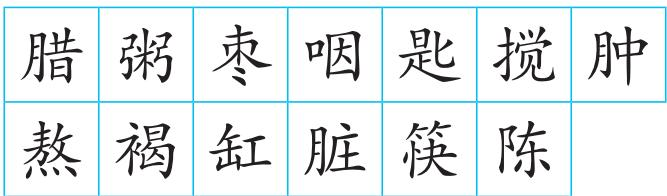

朗读课文，一边读一边想象八儿的馋样儿。

课文主要写了等粥和喝粥两部分内容，说说哪部分写得详细，哪部分写得简略，想想这样写有什么好处。

“花生仁脱了它的红外套，这是不消说的事。锅巴，正是围了锅边成一圈。”像这样细腻描写腊八粥的句子，课文中还有一些，找出来读一读，和同学交流自己的感受。

小练笔

作者笔下的腊八粥让人垂涎欲滴。再读读课文第1自然段，照样子写一种你喜爱的食物。

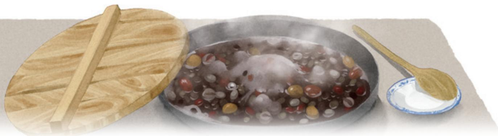

## ③古诗三首

寒食 hóng [唐]韩翃

春城无处不飞花，寒食东风御柳斜。日暮汉宫传蜡烛轻烟散入五侯家。

## 注释

①〔寒食〕寒食节，通常在冬至后的第105天，过去在节日期间不能生火做饭。  
②〔春城〕指春天的京城。  
③〔御柳〕皇城里的柳树。  
④〔汉宫〕这里用汉代皇宫来借指唐代皇宫。  
⑤〔传蜡烛〕指传赐新火。  
⑥〔五侯〕这里泛指权贵豪门。

## 迢迢牵牛星

迢迢牵牛星，皎皎河汉女®。zhuó zhá zhù  
纤纤擢素，札札弄机。  
终日不成章，泣涕零如雨。  
河汉清且浅，相去复几许。mò  
盈盈一水间，脉脉不得语。

## 注释

①选自《古诗十九首》。作者不详，写作时代大约在东汉末年。  
②〔河汉女〕指织女星。河汉，银河。  
③〔擢〕伸出。  
④〔素〕白皙。  
⑤〔札札〕织机发出的响声。  
⑥〔机杼〕织机。杼，梭子。  
⑦〔章]花纹。  
⑧〔零〕落下。  
⑨〔盈盈〕清澈的样子。  
⑩〔脉脉〕凝视的样子。

## 人民教育出版社

## 十五夜望月

[唐]王建

中庭地白树栖，冷露无声湿桂花。今夜月明人尽望，不知秋思落谁家。

注释

①〔十五夜〕农历八月十五中秋节的夜晚。

②〔中庭〕即庭中，庭院中。

③〔地白〕地面因月光照射而呈现银白色。

## 御侯皎章泣盈脉栖鸦

有感情地朗读课文。背诵课文。

结合牛郎织女的故事，说说《迢迢牵牛星》表达的情感。

《十五夜望月》中的“不知秋思落谁家”委婉地表达了思念之情。在你读过的古诗词中，还有哪些类似的诗句？和同学交流。

## 选做

这三首古诗分别与哪些传统节日有关？还有一些古诗也写到了传统节日和习俗，查找资料了解一下。

## ④藏戏

不同的地方不仅有不同的节日风俗，还有各具特色的艺术样式。默读课文，说说藏戏有什么特色，作者是从哪几个方面写的。

世界上还有几个剧种是戴着面具演出的呢？

世界上还有几个剧种在演出时是没有舞台的呢？

世界上还有几个剧种是一部戏可以演出三五天还没有结束的呢?

还是从西藏僧人唐东杰布的传奇故事讲起吧。

那时候，雅鲁藏布江上没有一座桥，数不清的牛皮船被掀翻在jiāng shì野马脱缰般的激流中，许多涉水过江的百姓被咆哮的江水吞噬。于是，唐东杰布许下宏愿，发誓架桥，为民造福。一无所有的唐东杰布，招来的只有一阵哄堂大笑。

qióng

于是就有了这样一段传奇。唐东杰布在山南琼结认识了能歌善舞的七兄妹，组成了西藏的第一个藏戏班子，用歌舞说唱的形式，表演历史故事和传说，劝人行善积德，出钱出力，共同修桥。随着雄浑的歌声响彻雪山旷野，有人献出钱财，有人布施铁块，有人送来粮食，更有大批的渔民、工匠、流浪汉跟着他们，从一个架桥工地走到另一个架桥工地。随着铁索桥一座接着一座地架起来，藏戏的种子也随之撒遍了雪域高原。

身无分文的唐东杰布就这样在雅鲁藏布江上留下了58座铁索桥，同时，成为藏戏的开山鼻祖。

传说，唐东杰布在母亲的肚子里待了80年，出生时头发胡子都白了。因此，在藏戏里，他的面具是白色的，前额饰有日月，两颊贴着短发，眉眼嘴角永远带着神秘的笑。

在藏戏里，身份相同的人物所戴的面具，其颜色和形状基本相同。

国王的面具是红色的，红色代表威严。

王妃的面具是绿色的，绿色代表柔顺。

巫女的面具半黑半白，代表两面三刀。

妖魔的面具青面獠牙，以示压抑和恐怖。

村民的面具则用白布或黄布缝制，眼睛和嘴唇处挖出窟窿，以dūn示朴实敦厚。

雪山江河作背景，草原大地作舞台。表演藏戏的艺人们席地而bó唱，不要幕布，不要灯光，不要道具，只要一鼓、一钹为其伴奏。他们别无所求，只要有观众就行。

观众团团围坐，所有的剧情全靠艺人们用说唱来描述。艺人们yì唱着，说着，跳着，在面具下演绎着各种故事。面具运用象征、夸张的手法，使戏剧中的人物形象突出、性格鲜明，这是藏戏面具在长期发展的过程中得以保留的原因之一。

西藏地广人稀，生活节奏比较缓慢。表现在藏戏中，艺人们的唱腔、舞蹈动作可以随意发挥，一段戏可以一而再、再而三地重复，观众也在吃喝玩耍中看戏，双方随心所欲，优哉游哉，一出戏演他个三五天毫不稀奇。

藏戏就是这样，一代一代地师传身授下去。

## 口语交际

## 即兴发言

生活中有些场合，需要我们作即兴发言。如：

班里来了新同学，班主任让你代表全班同学向他表示欢迎。

学校作文比赛获奖，老师让你即兴发表获奖感言。

开班会时，主持人临时请你说一说平时应该怎样珍惜粮食、拒绝浪费。

参加爷爷的寿宴，宴席上向爷爷说几句祝福的话。

放学回家的路上，遇到电视台采访，记者让你谈谈对“小学生带手机去学校”的看法。

这些情况下的即兴发言，由于时间紧迫，事先没有太多准备的时间，需要我们迅速组织语言，临场发挥。

先快速打个腹稿，根据场合、对象等，想想要讲哪几点，先讲什么，后讲什么，哪一点需要多讲几句。再把自己想表达的意思逐条说清楚。语气要自然，态度要大方。

班里事先准备一些即兴发言的题目，每个同学抽签选一个话题，稍作准备，然后作即兴发言。

之后全班交流：谁的即兴发言精彩？哪些地方值得大家借鉴？自己的发言还有哪些地方需要改进？

提前打腹稿，想清楚先说什么，后说什么，重点说什么。

注意说话的场合和对象。

## 家乡的风俗

“离家三里远，别是一乡风。”我们的祖国幅员辽阔，民族众多，每个地方都有自己的风俗习惯。

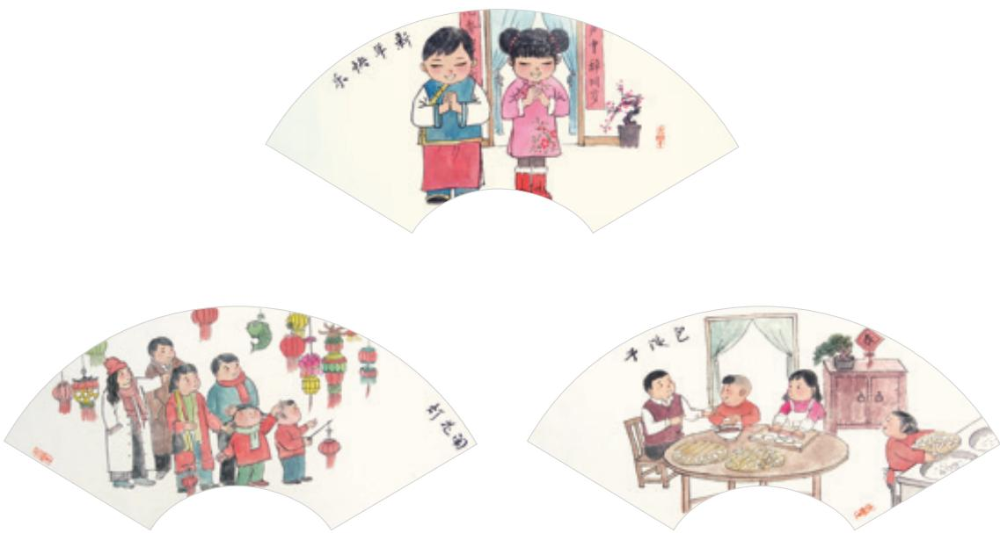

你的家乡有哪些风俗习惯？请你介绍一种风俗，或写一写你参加一次风俗活动的经历。

如果是介绍一种风俗，写之前，先查阅资料或问问长辈，深入了解这种风俗，想一想这种风俗的主要特点是什么，可以分几个方面介绍，重点介绍什么。在介绍的时候，可以适当写写自己对这种风俗的实际体验。

如果是写自己参加风俗活动的亲身经历，则可以把这种风俗的特点或来历自然地穿插在合适的地方，如，“听爸爸说，这个习俗大有来历呢……”或“我查资料得知，元宵象征着……”，然后重点描写活动现场的情况和自身的感受。

如果你对这种风俗习惯有自己的看法，也可以表达出来。

写好以后和同学分享，根据同学的意见进行修改、完善。如果有条件，可以将全班同学的习作集中在一起，编成一本民俗作品集。

# 语文园地

## 交流平台

我们读文章，常常发现有些内容写得很详细，有些内容写得很简略。

如，《北京的春节》重点写了腊八、腊月二十三、除夕、正月初一、正月十五这几天，其他的日子则一笔带过。即使重点写腊八、初一，也不是铺开写，而是突出写最具特色的一两个民俗活动，给人印象颇深。

为什么这样写呢？仔细阅读就会明白，《北京的春节》讲的是当年北京地区过春节的独特习俗，而最能表现北京独特习俗的，莫过于这几天。这几天可以说是春节的高潮，所以要详写。其他的日子大体相似，就没有必要一一详细描述了。因此，文章主要写什么，次要写什么，是根据作者想要重点表达的意思决定的。

读文章的时候，分清文章的主次，就能领会作者要表达的主要意思。习作的时候，先想好重点要表达哪些内容，把它们写得具体详细一点儿，其他内容则写得简略一点儿。详略安排得当，中心突出，才能更好地让别人了解自己想表达的意思。

## 词句段运用

读下面的句子，注意加点的部分，说说你发现了什么。

有名的老铺都要挂出几百盏灯来：有的一律是玻璃的，有的清一色是牛角的，有的都是纱灯。

全校运动会上，大山在短跑比赛中勇夺第一，志杰在跳高比赛中喜获金牌，思雨在跳远比赛中摘得桂冠，宁宁在游泳比赛中拔得头筹。

你知道下面这些习俗的寓意吗？你还知道哪些有吉祥寓意的习俗？

过年的时候吃年糕：寓意万事如意年年高

◇过年的时候吃鱼：

建筑上雕刻蝙蝠：

## 书写提示

观察下面的字，再照着写一写，试着提高自己的书写速度。

我就生长在这样一个小城里，将近十五岁时方离开。出门两年半回过那小城一次以后，直到现在为止，那城门我还没再进去过。但那地方我是熟悉的。现在还有许多人生活在那个城市里，我却常常生活在那个小城过去给我的印象里。

沈从文

## 日积月累

## 长歌行

汉乐府

青青园中葵，朝露待日晞。阳春布德泽，万物生光辉。常恐秋节至，焜黄华叶衰。百川东到海，何时复西归？少壮不努力，老大徒伤悲！

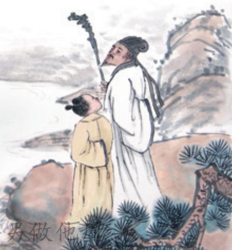

第二单元

跟随外国文学名著的脚步，去发现更广阔的世界。

借助作品梗概，了解名著的主要内容。

就印象深刻的人物和情节交流感受。

学习写作品梗概。

# ⑤ 鲁滨逊漂流记（节选）

从前，有一个叫鲁滨逊的英国人，他喜欢航海和冒险，到过世wèi界上很多地方，碰到过许多危险，但他一点儿也不畏惧，希望走遍天涯海角。

有一次，鲁滨逊乘船前往非洲，途中遇上大风，船严重受损，同伴们在乘小艇逃生时都死在海里，只有他一个人被大浪冲到海岛边。这是一个无名的、没有人居住的荒岛，到处是乱石野草。他又累又饿，心里想：流落到这种地方，怎样活下去呢？

等到潮水退了，鲁滨逊看到那大船竟然还浮在海面上，离岸并fá不远。他游到船边，用船上的桅杆、木板制成了木筏，运送从船上带来的物品。在船舱里，鲁滨逊找到很多可以用、可以吃的东西，陆续搬到岸上。没有淹死的一条狗、两只猫陪着他，这使他在凄凉中感到一丝安慰。

鲁滨逊走遍荒岛，在山坡上选择了一块有水源、可以防御野兽lòu的地方，用木头和船帆搭起一座简陋的帐篷。那儿可以看到海面，他希望瞧见过往的船只，以便请求救援。

鲁滨逊在岛上定居下来，过着寂寞的生活。船上搬下来的食物越来越少，要想活下去，就得想办法。

他每天要么拿着枪，带着狗到森林里去打猎，要么到海边去捕鱼，还把捕到的活山羊畜养起来。后来他竟有了成群的山羊，可以常喝羊奶，吃羊肉。鲁滨逊从船上搬来的东西里还有一些麦子，由于被老鼠啃过了，他就随意把它们丢撒在地上，没想到不久竟长出了嫩芽，后来又结出了穗子。他用这点儿麦种反复种收，到了第四年，终于吃到了自己种的粮食。

很多年过去了。有一天，鲁滨逊忽然发现海边沙滩上出现了人  
的脚印。他惊恐万分，猜想这一定是附近的野人留下来的。他担心  
这些野人会来吃掉他，于是在住所前的空地上密密麻麻地插上树枝  
作防御，又把羊分在几个地方圈养。他在这种不安的心情下又生活  
了两年。后来，鲁滨逊再一次看到野人留下的生火的痕迹和满地的mán  
人骨，他不由得联想到他们野蛮的宴会。鲁滨逊在恐惧之中开始考

# 人民教育出版社

慮怎樣對付這些可能出現的野人。

又过了几年，有一天，鲁滨逊看到三十多个野人乘着小木船上了岸。他们拖出两个倒霉的同伴，杀了其中一个人，另一个则挣扎着逃跑。他逃的方向正是鲁滨逊住所的方向。鲁滨逊决心救下这个逃跑的野人，于是开枪打死了追赶他的两个野人。他给救下的野人取名“星期五”。“星期五”很快成了他的好帮手，他们愉快地生活在岛上，扩大了粮食种植面积，又增加了几个羊圈，晒了很多葡萄干。鲁滨逊差不多淡忘了要回到英国、回到文明社会的想法。

有一天清晨，鲁滨逊被“星期五”喊醒，原来，有一艘英国船只pàn  
正在附近停泊着。他发现这艘船上发生了叛乱，水手们绑架了船长。  
鲁滨逊和“星期五”救出了船长，船长愉快地答应带他们回英国去。

在荒岛上度过了二十八年后，鲁滨逊终于回到了英国。

## 节选

我现在处在一个令人忧伤的、没有言语交流的生活场景中，也许这种生活在世界上是前所未有的。但我必须接受这种生活，并且一天一天过下去。根据我的估算，我是在9月30日登上了这个荒无人烟的岛。当时刚过秋分，太阳几乎正好在我的头顶上，所以我估wěi计自己是在北纬9度22分的地方。

在岛上待了十一二天以后，我忽然想到，由于没有本子、笔和墨水，我将没法估算日子，甚至分不清休息日和工作日。为了避免这种情况，我用刀子在一根大木杆上刻了一些字，并把它竖在我第一次登岸的地方，上面刻着：“1659年9月30日，我在这里登岸。”在这根方木杆的侧面，我每天用刀子刻一道痕，每第七道刻痕比其他的长一倍，每月第一天的刻痕再长一倍，这样，我就有了日历。

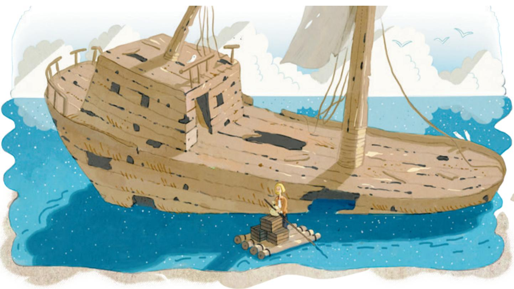

我几次到船上去，取出了许多东西。有几件虽然不值什么钱，对我来说却很有用，比如笔、墨水，还有纸，在船长、大副、炮手和木匠保管的物品中找到的几个包裹、三四个罗盘、几台数学仪器，guǐ还有日晷、望远镜、地图和航海类的书籍。我把它们一股脑堆在一起，以备不时之需。

还要提到的是，我们的船上有一条狗和两只猫。那两只猫是我带上岸的；至于那条狗，是在我带着第一批货上岸的第二天，它自己从船上跳出来，游上岸到我这儿来的，在以后的许多年里是我可信任的仆役。我不稀罕它给我弄来什么东西，也不稀罕它同我做伴，我只需要它同我聊聊天，但是它却办不到。找到了笔、墨水和纸之后，我尽最大的可能节省使用。只要我还有墨水，就能把事情记得非常准确。但是墨水用完以后，我就办不到了，因为我想尽办法还是制造不出墨水来。

尽管我收罗了这么多东西，还是缺少许多，比如墨水，还有用xiān来挖土或者运土的铲子、鹤嘴锄、铁锨，以及针线。至于内衣之类，虽然缺乏，但我很快就习惯了。

没有工具，干什么都困难重重。我几乎花了一年工夫才完全布zhà置好我那个用栅栏围起来的小小的住所。那些尖桩或者圆桩沉得很，我要使出全力才举得起来。我花了好长的时间才砍下那些木材，并且在林子里加工好，再花上更长的时间把它们运回家。也就是说，我需要花两天时间砍成一根木桩并运回来，在第三天才把它打进地qiào里。我最初用一根很沉的木棒打桩，后来想到了用铁撬棒打。尽管如此，打起桩来还是很费劲，而且非常麻烦。

但是，我既然不得不干这活儿，又有的是时间，有什么必要介意呢？这活儿要是干完了的话，除了在岛上转悠，寻找吃的以外，那我也没有其他的事可干了。

我现在开始认真考虑我的处境。我一一记下我经历的事情，并yíng不是想把自身的遭遇传给后人看，而是要把一直萦系在我心头、不断折磨着我的想法吐露出来。我的理智现在已经逐渐能够控制我的沮丧心情，我开始尽可能地安慰自己，把我遇到的凶险和幸运作个bù对比，使自己能够心平气和。我按照商业簿记中借方和贷方的格式，如实记录了我所遇到的幸与不幸：

## 人民教育出版社

坏处

我被抛弃在一座可怕的荒岛上，没有重见天日的希望。

我被单独剔出来，与世隔绝，受尽苦难。

我被从人类中分离出来，成为一个孤独的人。

我没有衣服穿。

好处

我没有任何防御力量或者手段来抵抗人或野兽的侵袭。

没有人可以同我说话，或者宽慰我。

但是我还活着，没有像我的伙伴们一样被淹死。

但是，我也免于死亡，而船上其他人员都已丧命。

但是，我在这片荒芜的土地yǎn上既没有挨饿，也没有奄奄待毙。

但是，我身处热带，即使有衣服也不用穿。

但是，在这里我看不见会伤害我的野兽，在非洲海岸上，我却看见过。要是我的船在那儿倾覆，该怎么办呢？

但是，船漂到了离岸很近的地方，我取出了很多必需品，有些甚至够我用一辈子。

总的说来，这是世界上少有的叫人受尽折磨的处境，但是其中也有一些值得宽慰的东西。这场世界上苦难最深重的经历告诉世人：在困境中，我们可以把好处和坏处对照起来看，并且从中找到一些东西来宽慰自己。

现在，我对自己的处境稍稍有了一点儿焉知非福的想法，我不再远眺大海，一心想看到船的踪影了。我着手调整我的生活方式，尽我可能把一切安排得舒舒服服。

读了这个片段，我能推断出它在小说的哪个部分。

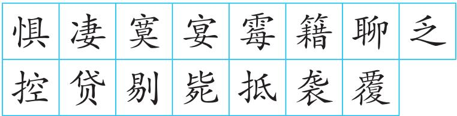

默读梗概，想想这部小说写了鲁滨逊流落荒岛的哪些事，用小标题的方式列出来。

流落荒岛

读节选的片段，说一说：鲁滨逊克服了哪些困难？他的心态发生了什么变化？你觉得鲁滨逊是一个什么样的人？和同学交流。

## 选做

最近你遇到什么让你感到烦恼的事情了吗？像鲁滨逊一样把这件事的坏处与好处列出来，再说说这样做对你是否有帮助。

# \* 骑鹅旅行记（节选

《骑鹅旅行记》是享誉世界的儿童文学作品。读读下面这个片段，说说小男孩尼尔斯变成小狐仙之后，他的世界发生了什么变化。作品中还有许多有趣的故事，如“鹤之舞表演大会”“大海中的白银”，猜猜它们又将讲述怎样的神奇。有兴趣的话可以找来原著读一读。

男孩简直不敢相信他会变成小狐仙。“这大概是一场梦，一种幻觉吧！”他想，“过一会儿我肯定还会再变成一个人。”

他站在镜子前面闭上眼睛，过了好几分钟才睁开。当时他估计怪样子肯定消失了。可是怪样子并没有消失，他仍然像刚才一样小。从别的方面看，他和以前完全一样。他那淡黄的头发、鼻子上的雀斑、皮裤和袜子上的补丁都和过去一模一样，只不过变得很小很小罢了。

他发现，光那样站着等待是无济于事的，一定得想别的办法。他觉得最聪明的做法就是去找小狐仙讲和。

他忽然想起，曾听母亲讲过，小狐仙平时都是住在牛棚里的。他立刻决定到那里去看看是否能找到小狐仙。幸好房门半开着，不然他还够不到锁，无法开门呢，而现在他没碰到任何障碍就跑了出去。

门廊外面的地板上有一只麻雀在跳来跳去。他一看见男孩就叫了起来：“叽叽，叽叽，快看放鹅娃尼尔斯！快看拇指大的小人儿！快看拇指大的小人儿尼尔斯·豪尔耶松！”

院子里的鹅和鸡立即掉过头来盯着男孩，并发出了一阵使人无gē法忍受的咯咯声。“咯咯里咕，”公鸡叫道，“他活该，咯咯里咕，他扯过我的鸡冠！”

然而最奇怪的是，男孩竟听懂了他们说的话。他大为吃惊，就一动不动地站在台阶上听了起来。“这可能是因为我变成了小狐仙的缘故吧！”他自语着，“肯定是由于这个原因，我才听懂了他们说的话。”

那些鸡没完没了地叫着：“他活该！他活该……”他实在无法忍受，捡起一块石头朝他们扔了过去，并骂道：“住嘴！你们这群坏家伙！”

可是他没有想到，他已不再是原来的样子，鸡根本就不怕他。整群鸡都跑到他身边，站在他周围叫着：“咕咕咕，你活该！咕咕咕，你活该！”

男孩想摆脱他们，但是那些鸡在他后面追着叫着，都快把他的耳朵吵聋了。如果不是家里养的那只猫走了出来，他是怎么也溜不掉的。那些鸡一看见猫便住了嘴，páo装着聚精会神的样子在地上刨虫子吃。

男孩马上跑到猫跟前。“亲爱的猫mī咪，”他说，“院子里各个角落和暗洞你不是都很熟悉吗？请你告诉我，在哪里能找到小狐仙？”

猫没有立刻回答。他坐下来，把尾巴精心地在腿前盘成了一个圆圈，两

眼盯着男孩。那是一只大黑猫，脖子下面有个白斑点。他的皮毛平滑，在阳光下闪闪发亮。他的爪子收缩着，灰白的眼睛眯成了一条细缝，样子十分温柔。

“我知道小狐仙住在什么地方，”他低声说，“但是这并不等于说我愿意告诉你。”

“亲爱的猫咪，你可得帮我的忙啊！”男孩说，“你没看见他把我变成什么样子了吗？”

猫稍稍睁了睁眼睛，里面射出了一道寒光。他先得意扬扬地念了一阵经，然后才说：“要我帮你的忙？是不是因为你经常揪我的尾巴？”

这时男孩恼怒了。他已经完全忘了他现在是多么弱小无力。“怎么着？我还要揪你的尾巴！”他说着便向猫扑了过去。

转眼间，猫摇身一变，男孩几乎不敢相信他还是刚才那个动物。他全身的毛都竖了起来，拱起腰，伸直了腿，四脚抓地，尾巴变得粗而短，两耳朝后，嘴里嘶叫着，瞪大的眼睛冒着火星。

男孩对猫并不示弱，反而向前逼近了一步。这时猫突然一跃，径直朝他扑了过去，把他扑倒在地，跳到他身上，前爪按住他的胸口，对着他的咽喉张开了大嘴。

男孩感觉到猫的爪子穿过他的背心和衬衣，刺进了他的皮肤，quǎn锋利的犬牙触到了他的咽喉。他拼命地喊着救命。

可是一个人也没有来。他断定，他死亡的时刻到了。正在这时，他又觉得猫把爪子收了回去，松开了他的喉咙。

“好了，”猫说，“这回够了，看在女主人的面子上，这次我饶了你。我只想让你知道，咱们俩现在究竟谁厉害。”

说着，猫就走开了，看上去像他来的时候一样温柔和善。男孩

羞得连一句话也说不出来，赶紧溜到牛棚里去找小狐仙了。

是吼声四起，一片混乱，听起来至少是三十头。

“你过来，”名叫五月玫瑰的牛说，“我给你一蹄子，让你永远 不能忘记！”

“你过来，”名叫金百合的牛说，“我要让你在我的角上跳舞。”

“你过来，我也叫你尝尝去年夏天你经常用木鞋打我的滋味！”名叫星星的牛吼道。

“你过来，你曾经把马蜂放进我的耳朵，现在我要报仇！”金百合叫着。

五月玫瑰在她们中间年纪最大、最聪明，现在也最生气。“你过来，”她说，“你做的事都应该遭报应了。你曾多次从你母亲腿下抽走她挤奶时坐的小凳，你多次在你母亲提着奶桶走过时伸脚绊倒她，你多次气得她站在这里流眼泪！”

男孩想对她们说，过去他对她们不好，现在后悔了，只要告诉他小狐仙在哪里，以后他就再也不捣蛋了。但是牛都不听他说话。jiāng她们吵闹得非常凶，他真担心哪头牛会挣断缰绳，所以他觉得还是趁早溜掉为妙。

他垂头丧气地从牛棚里走了出来。院子里不会有人帮他寻找小狐仙，这他是能够理解的。在这种情况下，即使找到小狐仙，可能也没有多大用处。

méi

他爬到了布满荆棘和黑莓藤蔓的厚石头围墙上，坐在那里环顾着自己的家。那是一座用石头砌墙、木头作支架的白色小房子。其他附属的房屋也很小，耕地窄得几乎连马都无法在上面打滚。可是这地方无论怎么小怎么穷，对他来说已经够好的了。他现在除了在牛棚的地上找个洞以外，再也不能要求更好的住所了。

chán

这天天气好极了。水渠里流水潺潺，树上嫩芽满枝，小鸟在耳边欢唱。而他却坐在那里十分难过，再也没有什么东西能引起他的兴致。

他从来没有见过天空像这样蓝。候鸟都回来了。他们从海外飞dì  
来，越过了波罗的海直奔斯密格虎克，正向北飞行。鸟的种类很  
多，但是别的鸟他都不认识，只认识那些排成“人”字形的大雁。

有几群大雁已经飞了过去。他们飞得很高，但是仍然能够听见他们的叫声：“现在飞向高山，现在飞向高山。”

当大雁们看到在院子里漫游的家鹅时，就一边朝大地低飞，一边喊着：“跟我们来吧！跟我们来吧！现在飞向高山。”

家鹅不由得抬起头，听着大雁的叫声。他们回答说：“我们在这里生活得很好！我们在这里生活得很好！”

如前所说，这天天气格外晴朗，空气清新，春风拂面，这时飞行真是一种享受。随着一群一群的大雁飞过，家鹅越来越动心了。他们中间有几只扇着翅膀跃跃欲试，但是一只老母鹅总是说：“别犯傻！你们一定会受冻挨饿的。”

大雁的呼叫却使一只年轻的雄鹅真的动了心。“再过来一群我就跟着他们飞走。”他说。

真的又过来一群大雁，他们照样呼唤。那只年轻的雄鹅答道：“等一等！等一等！我就来。”

他张开翅膀朝天空飞去。但是他没有飞行的习惯，于是又落到了地上。

大雁们还是听到了他的叫声。他们掉过头来慢慢地朝回飞，看他是不是真要跟着去。

“等一等！等一等！”他一面叫着一面进行新的尝试。

男孩坐在围墙上，这一切都听得一清二楚。

“如果这只大雄鹅飞走，可是一个很大的损失，”他想，“父母从教堂回来时，发现雄鹅不见了，他们会伤心的。”

当他这样想的时候，他又忘记了他是多么弱小无力。他一下子从墙上跳下来，跑进鹅群里，用双臂抱住了雄鹅的脖子。“你可千万不要飞走啊！”他喊道。

恰恰就在这一瞬间，雄鹅学会了怎样腾空而起。他来不及抖掉男孩就飞向了天空。

雄鹅飞得那么快，男孩都感到头晕目眩了。等他想到应该放开雄鹅的脖子时，已经到了高空。如果他现在一松手，肯定会掉到地上摔死。

要想舒服一点儿，他唯一能做的就是设法爬到鹅背上去。他费了九牛二虎之力总算爬了上去。然而要在翅膀中间光滑的脊背上坐稳，也不是一件容易的事，何况翅膀还在不停地扇动。为了不滑下去，他不得不用两只手紧紧地抓住雄鹅的羽毛。

# ⑦汤姆·索亚历险记（节选）

汤姆·索亚是美国作家马克·吐温笔下著名的儿童形象。默读课文，说说哪些情节特别吸引你。你觉得汤姆是一个怎样的孩子？在他身上，你能找到自已或是身边伙伴的影子吗？如果你还想知道汤姆的其他故事，就去读一读《汤姆·索亚历险记》这本书吧。

到了星期二的黄昏，圣彼得斯堡镇仍然笼罩在一片悲伤之中，两个走失的孩子还没有找到。镇上的人们已经为他们作了公开的祈祷，还有许许多多的人私下里为这两个孩子作了祈祷，诚心诚意地祈求他们平平安安，但是依然没有从洞里传来好消息。大多数搜索的人已经放弃了搜寻孩子这件事，回到镇上继续干他们平日的活儿去了，他们认为孩子明摆着是找不回来了。撒切尔太太病得厉害，大部分时间都在说胡话。人们听见她呼喊孩子，看见她每次抬起头侧耳听上好久，然后一边呻吟着一边软弱无力地垂下头去，那情景真是让人心碎。波莉姨妈已经陷入了悲痛和绝望之中，她那满头的灰发几乎全变白了。到了晚上，镇上停止了一切活动，整个小镇被蒙上了悲伤与凄惨的阴影。

半夜时分，镇上传来了发疯般的钟声。不一会儿，街道上就挤  
满了衣衫不整却欣喜若狂的人，他们高声喊着：“快来看！找到他dā  
俩了！”人们叮叮当当地敲响了铁碗铜盆，嘀嘀嗒嗒的喇叭声与人

们的喧嚷声汇成了一片。大家成群结队地拥向河岸，去迎接那两个乘敞篷车归来的孩子。车子由欢呼着的村民拉着，簇拥着。前来迎fá接的人们加入了这支回小镇的队伍，他们迈着雄壮有力的步伐，浩浩荡荡地穿过大街，欢呼声一浪高过一浪。

整个小镇灯火通明，谁也没有再回去睡觉。这是这个小镇前所未有的最辉煌的一个夜晚。在孩子们回来后的半个小时，镇上的人排着队来到撒切尔法官家，搂着两个获救的孩子又亲又吻，同时还使劲握住撒切尔太太的手，满肚子的话想说又说不出，泪水如雨，洒了一地。

波莉姨妈真是高兴到了极点，撒切尔太太也是如此。然而，等xùn  
派到山洞里的信使把这个喜讯报告给她的丈夫时，快乐才会变得十  
全十美。汤姆躺在一张沙发上，身边围满了热切的听众。他给他们xū  
讲着这次精彩的历险过程，同时还夸张地吹嘘了一番，最后又描述qí  
了他怎样离开贝琪去探险，如何在风筝线能达到的情况下顺着那两

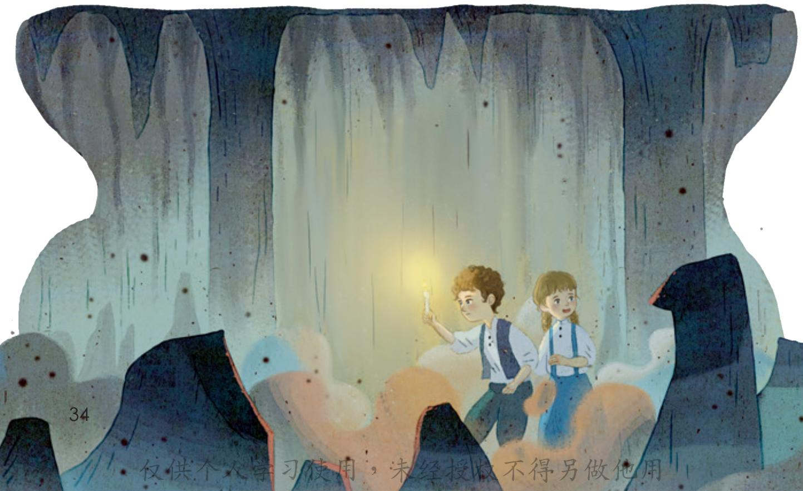

人民教育出版社

条通道向前探路，又是怎么去探索第三条通道，直到风筝线不够用了为止。正当他转身往回走时，突然发现远处有一小块亮光，好像是太阳光，于是他放下风筝线朝它摸索着走了过去。他把肩和头从一个小洞中探了出来，竟看见宽阔的密西西比河正从下面滚滚流过！如果碰巧是晚上，他绝不会看见那一小块太阳光，也就找不到这条通道了。他又讲述了他怎样回去找贝琪，告诉了她这个好消息，而她却让他别拿这些无聊的谎话来烦她，因为她很累，知道自己快要死了，她也愿意死掉。他还讲了自己如何费尽口舌说服了贝琪，当她摸索着爬到洞口，看见那一小块太阳光时，怎样兴奋得不得了，简直就要高兴死了。他还说自己怎样先爬出洞口，然后又帮助贝琪爬了出来，他们是如何坐在那里高兴得大声哭了起来，一些人怎样乘着小船打那儿经过，他俩又是怎样呼喊着他们，告诉他们自己的遭遇。他也描述了起初这些人如何不相信这荒唐离奇的故事，因为他们说：“你们是在河的下游，离那个峡谷里的山洞有五英里远呢。”然后他们就将他俩扶上船，划到一户人家，给他俩吃了晚饭，让他们歇息了两三个小时，随后便把他们送回了家。

汤姆和贝琪很快发现，在洞里所遭受的三天三夜的疲劳和饥饿，是不可能马上恢复过来的。星期三和星期四整整两天，他们一直卧床不起，好像越躺越难受，浑身没有一点儿力气。汤姆星期四稍微能下地活动一会儿，星期五就能到镇上逛逛了，到了星期六差不多完全恢复正常了。但贝琪直到星期天才能够到户外走走，看上去好像刚得了一场大病似的。

汤姆听说哈克病了，星期五便去看他，谁知道被挡在了门外，星期六、星期天一连两天也都没让他进去。过了星期天，他可以每天去看哈克了，但是那家人告诫他不能透露他的探险经过，也不要

谈及任何令人兴奋的话题。道格拉斯寡妇守在旁边，看汤姆是否遵kǎ  
守规定。回到家里，汤姆才听说卡迪夫山发生的事，还得知那个lán lǚ  
“衣衫褴褛的人”的尸体最后在渡船码头附近被发现了，很可能是  
在逃跑途中溺水而死的。

汤姆从山洞里获救两个星期之后，哈克已经强壮多了，也不怕听令人激动的话题了。汤姆又去看望哈克，他想，有一些话题正是哈克感兴趣的。撒切尔法官的家离哈克住的地方不远，于是汤姆就顺道去看了看贝琪。法官和他的几个朋友逗他滔滔不绝地讲了起来，有的人还用嘲弄的口吻问他是否还想再去那个山洞走一趟。汤姆说，他认为他不会在意的。法官说：

“还有一些人和你一样想去山洞看看呢，汤姆，这一点是毫无疑问的。但是我们已经采取了防范措施，以后谁也不会再在那个山洞里迷路了。”

“为什么？”

“因为两周前我就找人用锅炉钢板把山洞的洞口封上了，然后又上了三道锁，钥匙在我这里。”

汤姆的脸立刻变得煞白。

“怎么了，孩子！喂，快来人哪！快拿杯水来！”

有人拿过一杯水，一下子泼在了汤姆的脸上。

“啊，现在没事了。你怎么了，汤姆？”

“哎呀，法官，印江·养埃还在洞里呢！”

## 口语交际

## 同读一本书

阅读往往能唤起读者独特的感受，即使读同一本书，不同的读者，心得体会也可能不一样。让我们一起来开展班级读书会，围绕同一本书交流读书心得，分享阅读的收获。

可以围绕哪些话题交流读书心得呢？

这本书讲了一个什么样的故事？

你怎样评价主人公？你对哪个人物印象最深？为什么？

有没有什么地方让你觉得困惑，或是感到奇怪？有没有完全出乎意料、令人感到不可思议的情节？

读这本书的时候，你想到了哪些相似的书，或是想到了生活中的哪些人？

故事的结局你喜欢吗？如果你来写这个故事，你会怎么写？

选择一两个大家感兴趣的、值得讨论的话题展开深入交流。

交流之前，想想围绕话题谈论哪些具体内容。可以借助批注梳理思路，深入地表达自己的想法或观点。要以内容为依据，从书中找出例子来说明自己的观点。要勇于表达自己的真实想法，哪怕你的想法与大多数人都不一样。

交流时，认真听别人的发言，准确地理解别人的想法。对于不同的想法，想想他们的理由是什么。

和同学分享交流之后，说说你对这本书有了哪些新的想法。

引用原文说明观点，使观点更有说服力。

分辨别人的观点是否有道理，讲的理由是否充分。

## 习作

## 写作品梗概

学校征集最受欢迎的少儿读物，要求高年级每位同学推荐一本最喜爱的书。

班里每周请一位同学简要介绍一本书。

你的好伙伴看到你最近读一本书很入迷，很想知道你读的这本书讲了些什么。

遇到以上情况，需要我们对书的内容进行概括，以梗概的形式，用简练的语言介绍这本书。

可以这样来写书的梗概：

## 读懂内容，把握脉络

◇ 理清书籍内容的基本框架，把握要点。

筛选概括，合并成段。

◇保留“主干”，去除“枝叶”。

锤炼语言，连贯表达。

用简明的叙述性语言概括主要章节的内容。

□ 适当补充内容，自然过渡，使语意清楚连贯。

选择你读过的一本书写梗概。写好以后读给同学听，看他们是否能明白书的大意，然后根据他们的反馈，对没写清楚的地方进行修改。

# 人民教育出版社

# 语文园地

## 交流平台

读名著时，我会对书里的人物作出自己的评价。如，在我眼里，汤姆·索亚是一个热爱自由、喜欢冒险的孩子，同时他又很有趣，还有点儿虚荣心。从小说中的很多地方都能看出他的这些特点。

我特别留意描写人物语言、动作、神态的句子，从中能看出一个人的性格。之前学习《穷人》，读到桑娜“用头巾裹住睡着的孩子，把他们抱回家里。…让他们同自己的孩子睡在一起，又连忙把帐子拉好”，我想，她是多么善良而勇敢啊！

每个人都是立体的、多面的，评价人物时角度不能太单一。如，很多人觉得尼尔斯太淘气、太顽皮，但是当我读到他心里想“父母从教堂回来时，发现雄鹅不见了，他们会伤心的”，我觉得尼尔斯其实也是一个体贴父母的孩子。

## 词句段运用

读下面的句子，说说加点的部分有什么共同的特点。再从后面的词语中选择一两个，发挥想象，仿写句子。

◇ 镇上的人排着队来到撒切尔法官家，搂着两个获救的孩子又亲又吻，……泪水如雨，洒了一地。

D 过了二十三，大家就更忙了，春节眨眼就到了啊。

他大吼了一声，大山都抖了三抖。

饿 安静 厚 盼望 喜欢

## 人民教育出版社

下面是不同译者笔下《汤姆·索亚历险记》中的句子，读一读，说说你更喜欢哪一个。

这是这个小镇前所未有的最辉煌的一个夜晚。

这天晚上的伟大场面是这个小镇从来没有见到过的。

这是小镇经历过的最激动人心的一夜。

满肚子的话想说又说不出，泪水如雨，洒了一地。

译者： 俞东明、 陈海庆

想说话又说不出来然后像流水似的涌出，到处都像下雨一般掉了满地的眼泪。

译张 松

想说什么但什么也说不出来- 一路出去时如下雨似的洒了满地的眼泪。

译者时：

## 日积月累

读书须用意，一字值千金。

莫道君行早，更有早行人。

听君一席话，胜读十年书。

路遥知马力，日久见人心。

近水知鱼性，近山识鸟音。

## 快乐读书吧

## 漫步世界名著花园

每一本名著都是独一无二的花朵。当你漫步在世界名著花园中，与心仪的书籍不期而遇，一定会惊喜地停下脚步。

## 你读过吗

有这样一本书，为我们讲述了一个人流落荒岛后的种种际遇。翻开它，你会看到一个人如何在绝境中变成自己的国王，一座岛如何从荒芜之地变成微型的文明社会。二十八年，鲁滨逊凭借自己勇往直前的精神和辛勤的劳动，成就了一段传奇。

这本书面世后，吸引了不少学者对其进行评论。

它就是我们学习的课本，我们关于自然科学的一切谈话，都不过是对它的一个注释罢了。

[法国]卢梭

经典是那些你经常听人家说“我正在重读…”而不是“我正在读…”的书。…《鲁滨逊漂流记》无疑是一部值得逐字逐行重读的小说。

[意大利]卡尔维诺

有些名著读起來比较难，不像流行读物那样通俗易懂，但想到能成为经典的书不简单，是人类智慧的结晶，你就会让自己沉下心来读，越读越有味。

先大致了解名著的写作背景，能帮助我们理解作品的内容和价值。读的時候如果能做一些讀书笔记，收获就更大了。

# 人民教育出版社

## 相信你可以读更多

在这个单元里，我们接触了几本世界名著，它们不仅有引人入胜的情节，还有复杂的内涵，正因为如此，读起来才更有乐趣。《鲁滨逊漂流记》背后鲜明的时代烙印，《骑鹅旅行记》字里行间的怀乡之情，《汤姆·索亚历险记》对自由的向往和对社会的讽刺，都需要我们慢慢去发现，去品味。

除了这几本名著，小学六年，你一定还读了很多书。在读过的书中，你认为哪些书可以被称作“经典”？你在读这些经典名著时，用过什么读书方法？和同学交流一下吧！

我们可以在页面的空白处随时写下自己的感触。

读到特别喜欢的段落，可以摘抄在笔记本中，并把页码标注出来。

遇到人物关系比较复杂的情况，可以画一个人物图谱，以便阅读时随时查阅。

读完整本书以后，还可以写出全书的结构，以及作者在书中想要表达的一些想法。

第三单元

让真情在笔尖流露。

体会文章是怎样表达情感的。

选择合适的内容写出真情实感。

# ⑧匆匆

燕子去了，有再来的时候；杨柳枯了，有再青的时候；桃花谢了，有再开的时候。但是，聪明的，你告诉我，我们的日子为什么一去不复返呢？是有人偷了他们吧：那是谁？又藏在何处呢？是他们自己逃走了吧：现在又到了哪里呢？

我不知道他们给了我多少日子，但我的手确乎是渐渐空虚了。在默默里算着，八千多日子已经从我手中溜去，像针尖上一滴水滴在大海里，我的日子滴在时间的流里，没有声音，也没有影子。我cén shān不禁头涔涔而泪潸潸了。

去的尽管去了，来的尽管来着，去来的中间，又怎样地匆匆呢？早上我起来的时候，小屋里射进两三方斜斜的太阳。太阳他有脚啊，轻轻悄悄地挪移了，我也茫茫然跟着旋转。于是一洗手的时候，日子从水盆里过去；吃饭的时候，日子从饭碗里过去；默默时，便从凝然的双眼前过去；我觉察他去得匆匆了，伸出手遮挽时，他又从遮挽着的手边过去；天黑时，我躺在床上，他便伶伶俐俐地从我身上跨过，从我脚边飞去了；等我睁开眼和太阳再见，这算又溜走了一日；我掩着面叹息，但是新来的日子的影儿又开始在叹息里闪过了。

在逃去如飞的日子里，在千门万户的世界里的我能做些什么呢？只有徘徊罢了，只有匆匆罢了。在八千多日的匆匆里，除徘徊外，又剩些什么呢？过去的日子如轻烟，被微风吹散了，如薄雾，被初阳蒸融了。我留着些什么痕迹呢？我何曾留着像游丝样的痕迹呢？我赤裸裸来到这世界，转眼间也将赤裸裸地回去吧？但不能平的，为什么偏要白白走这一遭啊？

你聪明的，告诉我，我们的日子为什么一去不复返呢？

## 藏挪徘徊蒸裸

有感情地朗读课文。背诵课文。

课文中有两处使用了一连串的问句，找出来读读，说说表达了作者怎样的内心感受，体会这样表达有什么好处。

时间的流逝本是司空见惯的现象，为什么作者能写得如此感人？读了课文，你对时间的流逝有什么感触？仿照课文第3自然段，用一段话把你的感触写下来。

# ⑨那个星期天

我还记得我的第一次盼望。那是一个星期天，从早晨到下午，一直到天色昏暗下去。

那个星期天母亲答应带我出去，去哪儿已经记不清了，可能是动物园，也可能是别的什么地方。总之她很久之前就答应了，就在那个星期天带我出去玩，这不会错。一个人平生第一次盼一个日子，都不会错。而且就在那天早晨，母亲也还是这样答应的：去，当然去。我想到底是让我盼来了。

起床，刷牙，吃饭，那是个春天的早晨，阳光明媚。走吗？等一会儿，等一会儿再走。我跑出去，站在街门口，等一会儿就等一会儿。我藏在大门后，藏了很久。我知道不会是那么简单的一会儿，我得不出声地多藏一会儿。母亲出来了，可我忘了吓唬她，她手里怎么提着菜篮？您说了去！等等，买完菜，买完菜就去。买完àg菜马上就去吗？嗯。

这段时光不好挨。我踏着一块块方砖跳，跳房子，等母亲回来。我看着天看着云彩走，等母亲回来，焦急又兴奋。我蹲在院子的地上，用树枝拨弄着一个蚁穴，爬着去找更多的蚁穴。院子里就我一个孩子，没人跟我玩。我蹲在草丛里翻看一本画报，那是一本看了多少回的电影画报。那上面有一群比我大的女孩子，一个个都非常漂亮。我蹲在草丛里看她们，想象她们的家，想象她们此刻在干什么，想象她们的兄弟姐妹和她们的父母，想象她们的声音。去年的荒草丛里又有了绿色，院子很大，空空落落。

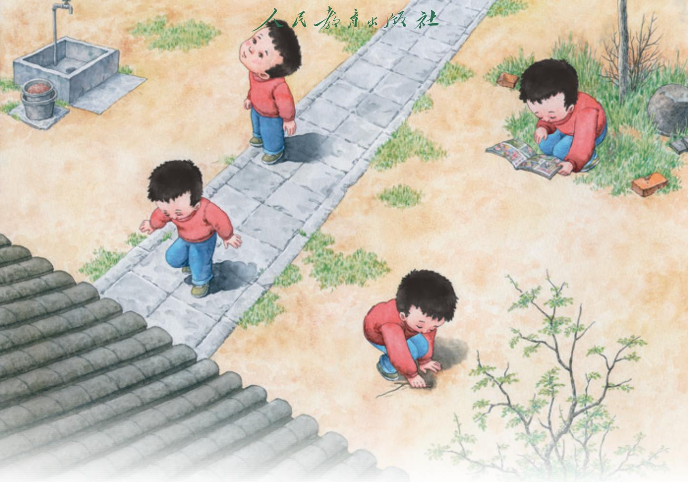

母亲买菜回来却又翻箱倒柜忙开了。走吧，您不是说买菜回来就走吗？好啦好啦，没看我正忙呢吗？真奇怪，该是我有理的事啊？不是吗，我不是一直在等着，母亲不是答应过了吗？整个上午我就跟在母亲腿底下：去吗？去吧，走吧，怎么还不走啊？走吧……我就这样念念叨叨地追在母亲的腿底下，看她做完一件事又去做一件事。我还没有她的腿高，那两条不停顿的腿至今都在我眼前晃动，它们不停下来，它们好几次绊在我身上，我好几次差点儿绞在它们中间把它们碰倒。

下午吧，母亲说，下午，睡醒午觉再去。去，母亲说，下午，

准去。但这次怨我，怨我自己，我把午觉睡过了头。醒来时我看见母亲在洗衣服。要是那时就走还不晚。我看看天，还不晚。还liàng  
去吗？去。走吧？洗完衣服。这一次不能原谅。我不知道那堆衣服要洗多久，可母亲应该知道。我蹲在她身边，看着她洗。我一声不吭，盼着。我想我再不离开半步，再不把觉睡过头。我想衣服一洗完我马上拉起她就走，决不许她再耽搁。我看着盆里的衣服和盆外的衣服，我看着太阳，看着光线，我一声不吭。看着盆里揉动的衣服和绽开的泡沫，我感觉到周围的光线渐渐暗下去，pião miăo  
渐渐地凉下去沉郁下去，越来越远越来越缥缈，我一声不吭，忽然有点儿明白了。

我现在还能感觉到那光线漫长而急遽的变化，孤独而惆怅的黄kāchā昏的到来，并且听得见母亲咔嚓咔嚓搓衣服的声音，那声音永无休

chóu chàng

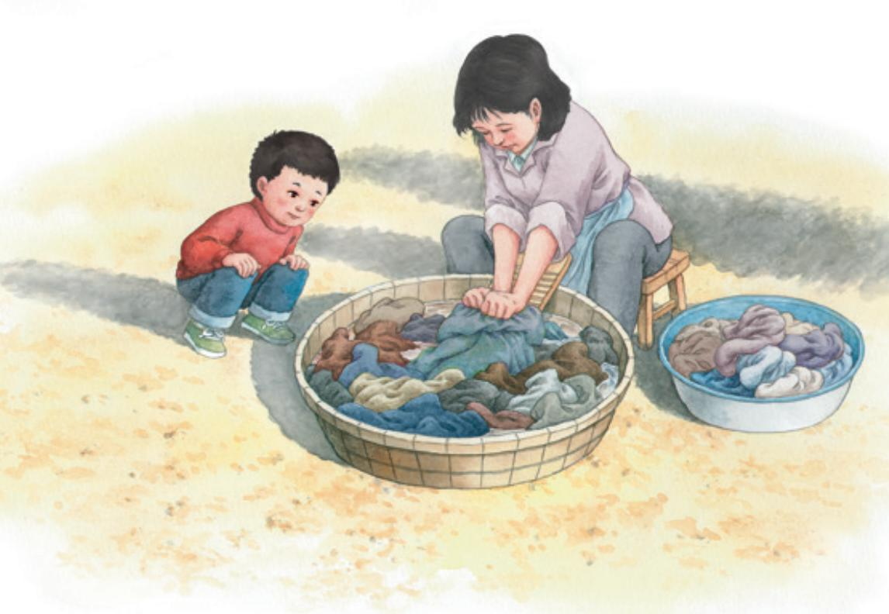

止就像时光的脚步。那个星期天。就在那天。母亲发现男孩儿蹲在那儿一动不动，发现他在哭，在不出声地流泪。我感到母亲惊惶地甩了甩手上的水，把我拉过去拉进她的怀里。我听见母亲在说，一边亲吻着我一边不停地说：“噢，对不起，噢，对不起………”那个星期天，本该是出去的，去哪儿记不得了。男孩儿蹲在那个又大又重的洗衣盆旁，依偎在母亲怀里，闭上眼睛不再看太阳，光线正无shì  
可挽回地消逝，一派荒凉。

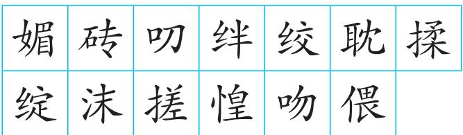

默读课文，说说在这一天里“我”的心情经历了什么样的变化。

读下面的句子，想想作者是怎样在具体细致的叙述中，真实自然地表达内心感受的。在课文中再找一找类似的语句，仔细体会。

我蹲在她身边，看着她洗。我一声不吭，盼着。我想我再不离开半步，再不把觉睡过头。我想衣服一洗完我马上拉起她就走，决不许她再耽搁。（“我”盼着什么？这里是怎么写出“盼”的心情的？）

我现在还能感觉到那光线漫长而急遽的变化，孤独而惆怅的黄昏的到来，并且听得见母亲咔嚓咔嚓搓衣服的声音，那声音永无休止就像时光的脚步。那个星期天。就在那天。（这个片段表现了“我”怎样的心情？为什么不直接写心情，而是写“那个星期天”的光线和声音？）

《匆匆》和《那个星期天》都表达了真实的情感，这两篇课文在表达情感的方式上，有哪些相同点和不同点？

## 交流平台

“情以物迁，辞以情发。”写文章就像说话一样，要抒发自己的真实情感。

有时，我们把情感融入具体的人、事或景物之中，在叙述中自然而然地流露情感。如，《那个星期天》有一段叙述了“我”怎样“挨时光”：“我踏着一块块方砖跳，跳房子，等母亲回来。我看着天看着云彩走，等母亲回来……”借助写“跳房子”“看着云彩走”这些举动，真实自然地表达了“我”等待时“焦急又兴奋”的情感。

有时，我们也可以把心里想说的话直接写出来，抒发自己的情感。如《匆匆》第4自然段，作者用一连串的问句，表达了对时间飞逝的惋惜和感叹，很能打动读者，容易使读者产生相同的感受。

## 初试身手

我们都生活在一定的环境中，当心情不同时，对身边事物的感受也会有所不同。如：

一直想养一只小狗， 妈妈今天终于答应了。

路旁的一朵朵花儿好像在对我微笑，树上的鸟儿也在欢唱，树叶沙沙作响，好像也在为我高兴。

打篮球的时候，我有几个好机会没把握住，结果我们输给了二班。

路旁的花儿耷拉着脑袋，一副无精打采的样子。树上的小鸟叽叽喳喳地叫着，也像是在讥笑我。

从下面的情境中选择一两个，就心情“好”与“不好”这两种状态，分别写几句话。

走在小巷里 奔跑在田野上 弹琴 钓鱼 ……

## 别了，语文课

钟声响了，第一堂课是语文。以前我上语文课时总是懒洋洋提不起劲，奇怪，今天我翻开语文书，别有一番滋味，我的脑子也不再胡思乱想，全神贯注地听张先生授课。我为什么会忽然喜欢上语文课，觉得张先生每一句话都那么动听？这一堂课好像过得特别快，一下子就听到了下课钟声。

放学回家，我一口气读完张先生送给我的书。这本书先浅显地介绍中文的发展，然后分述了中文的特点，最后讲述学好中文的方法。我一下子对中文了解了很多很多。我有点儿怪张先生，为什么不早点儿送这本书给我，让我早点儿知道中文的丰富和优美。

我放下书，走到爸爸跟前，问他：“爸爸，我们将来移民到中美洲，我还有机会学习中文吗？”

爸爸说：“我正为这件事操心。那边华侨很少，没有为

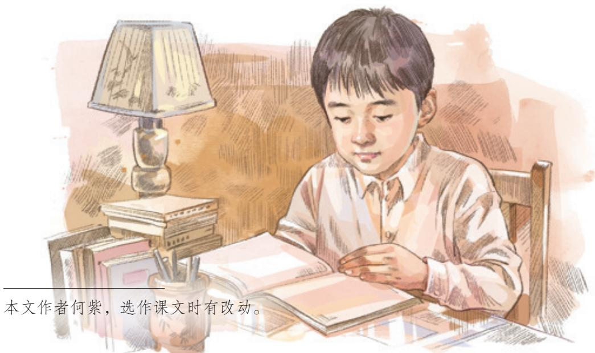

用几个具体事例写出了“我”对语文课的情感变化，读起来非常真实自然。

这段独白，更加直接而强烈地表达了心情。

华侨办的学校。到了那边，你就要学习西班牙文。我担心你会渐渐忘记了中文。”

我听后吓了一跳。我拿起一张报纸，单是大字标题就有不少字不认识，不要说报纸的内文了。我现在念五年级，可是因为我过去不喜欢语文课，实在学得不好，实际上大约只有三四年级的程度。我张皇地拿出语文书，急急温习今天教过的课文，觉得课文内容饶有趣味。我又拿出纸，用笔反复写新学的生字。我一想起自己顶多还有一个月学习中文的时间，心里就难过，真希望把整本语文书一下子全学会。

我一连两次默书都得到八十分，张先生每次都鼓励我；最近一次默书，我居然一个字也没有错，得到一百分！语bù文课上，张先生拿出我的默书簿，翻开第一页给大家看，然后又翻到最后一页，高高举起让同学们看。张先生说：“陈小允是我们学习的好榜样。你们看，他学期开始默书总不合格，现在却得了一百分！”

有谁知道我心里的痛！唉，语文课，在我深深喜欢上你的时候，我就要离开你了，我将要学习另一种完全不同qín的语言了，想到这里，我噙着泪。坐在我旁边的叶志聪看见，大惊说：“张先生，陈小允哭啦！”

同学们都奇怪地注视着我。张先生走到我身旁，亲切地抚着我的头，说：“小允，是为你的进步而哭吗？”

我擦拭着泪水，站起来，鸣咽着说：“张先生，我下星期要离开这里了，我们全家移民到中美洲，我……我再没有机会学习中文了。”

泪水模糊了眼睛，我看不见同学和张先生的反应，只知道全班忽然异样地沉寂。张先生轻抚着我的头，叫我坐下。

离开这里的日子越来越近了。同学们纷纷在我的纪念册上留言，叮嘱我不要忘记中国，不要忘记中文。

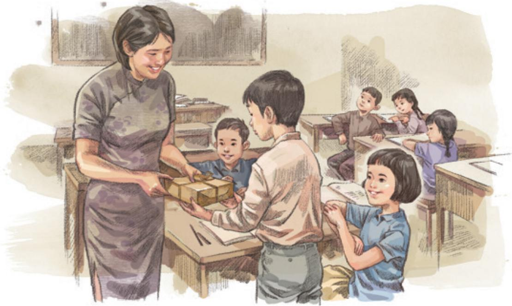

这天，是我最后一次上语文课了，张先生带来一扎用鸡皮纸封好的包裹，她对全体同学说：“陈小允是最后一xù天和大家相叙了。我们祝福他在国外健康快乐地成长。我没有什么送给他，只送他一套小学六年级到中学五年级的语文课本，希望他远离祖国后还可以好好自修，不要忘记母语。”

我接过这套书，心里非常难过。下课后，同学们都围上来，有人送我一本字典，有人送我一本故事书。他们的热情，使我热泪盈眶。

别了，我亲爱的老师，我亲爱的同学。我一定不会忘记中文，我会把我的默书簿一生一世留在身边，常常翻阅。我会激励自己把中文自修好，像这本默书簿的成绩那样。

写告别语文课，可能有很多事情可写，这里选择了老师和同学留言、送书的事，把气氛与心情突显出来。

默读课文，说说“我”对学习语文的情感和态度发生了怎样的变化，课文是怎样表达的。

## 阳光的两种用法

童年的大院里，住的都是引车卖浆者流，生活不大富yù裕，日子各有各的过法。

冬天，屋子里冷，特别是晚上睡觉的时候，被窝里冰凉如铁，那时家里连个暖水袋都没有。母亲有主意，中午的时候，她把被子抱到院子里，晾到太阳底下。其实，这样的法子很古老，几乎各家都会这样做。有意思的是，母亲把被子从绳子上取下来，抱回屋里，赶紧就把被子叠好，铺成被窝状，晚上睡觉我钻进去时，被子里还是暖乎乎的，连被套的棉花味道都烤了出来，很香的感觉。母亲对我说：“我这是把老阳儿叠起来了。”母亲一直用老家话，把太阳叫老阳儿。“阳儿”读成“爷儿”音。

通过讲述母亲把“老阳儿”叠在被子里的事情，作者的情感自然地流露出来。

从母亲那里，我总能听到好多新词。把老阳儿叠起来，让我觉得新鲜。太阳也可以如卷尺或纸或布一样，能够折叠自如吗？在母亲那里，可以。阳光便能够从中午最热烈的时候，一直储存到晚上我钻进被窝里，温暖的气息和味道，让我感觉到阳光的另一种形态，如同母亲大手的抚摸，xīn比暖水袋温馨许多。

街坊毕大妈，靠摆摊儿养活一家老小。她家门口有一口半人多高的大水缸，冬天用它来储存大白菜，夏天它还有特殊的用处。夏天到来时，每天中午，毕大妈都要接满一缸自来水，骄阳似火，毒辣辣地照到下午，晒得缸里的róng水都有些烫手了。水能够溶解糖，溶解盐，水还能够溶解阳光，这大概是童年时候我最大的发现了。溶解糖的水变甜，溶解盐的水变咸，溶解了阳光的水变暖，变得犹如母亲温暖的怀抱。

毕大妈的孩子多。黄昏，她家的孩子放学了，毕大妈把孩子们都叫过来，一个个排队洗澡。毕大妈用盆舀的就pī是缸里的水，正温乎，孩子们连玩带洗，大呼小叫，噼里né zhā啪啦的，溅起一盆的水花，个个演出一场哪吒闹海。

那时候，各家都没有现在普及的热水器，洗澡一般都是用火烧热水，像毕大妈这样给孩子洗澡，在我们大院是独一份。母亲对我说：“看人家毕大妈，把老阳儿煮在水里面了！”

作者反复提到的“老阳儿”，起到了贯穿全文情感脉络的作用。

我得佩服母亲用词的准确和生动，一个“煮”字，让太阳成了居家过日子必备的一种物件，柴米油盐酱醋茶，这开门七件事之后，还得加上一件，即母亲说的老阳儿。

真的，谁家都离不开柴米油盐酱醋茶，但是，谁家又离得开老阳儿呢？如同清风朗月不用一文钱一样，老阳儿rén也不用花一分钱，对所有人都大方且一视同仁，而柴米油盐酱醋茶却样样都得花钱买才行。不过，如母亲和毕大妈这样将阳光派上如此用法的人家，也不多。这样的用法，需要一点儿智慧和温暖的心，更需要在艰苦日子里磨炼出的一点儿本事。阳光成了居家过日子的一把好手，陪伴着母亲和毕大妈一起，让那些庸常而艰辛的琐碎日子变得有滋有味。

从两家人的生活中，你体会到了怎样的情感？作者是怎样把这种情感表达出来的？和同学交流。

## 让真情自然流露

生活中经历的一切，都会带给我们各种各样的情感体验。

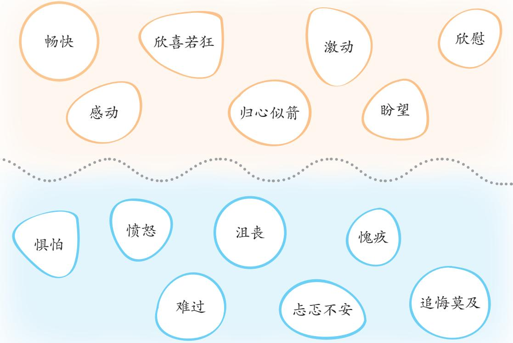

你有过这些感受吗？是什么事情使你产生了这样的感受？选择一种你印象最深的感受，先回顾事情的经过，回忆当时的心情，然后理清思路写下来。

写的时候注意，把印象深刻的内容写具体，把情感真实自然地表达出来。如果在事情发展的过程中，情感有所变化，要把情感的变化也写清楚。

写完后，和同学交换读一读，互相说说哪些地方较好地表达了真情实感。

# 第四单元

人生自古谁无死？留取丹心照汗青。—[宋]文天祥

关注外貌、神态、言行的描写，体会人物品质。

查阅相关资料，加深对课文的理解。

习作时选择适合的方式进行表达。

# 10 古诗三首

## 马诗

[唐]李贺

大漠沙如雪，燕山月似钩®何当络脑快走踏清秋。

## 注释

①〔燕山〕燕然山。这里借指边塞。

②〔钩〕古代的一种兵器，像剑但形状弯曲。

③〔何当〕什么时候。

④〔金络脑〕用黄金装饰的马笼头。这里指戴上金络脑。

## 石灰吟

[明]于谦

千锤万凿出深山，烈火焚烧若等闲。粉骨碎身浑不怕，要留清白在人间。

注释

①〔等闲〕平常。   
②〔浑〕全，全然。   
③〔清白〕指高尚的节操。

## 人民教育出版社

## 竹石

xiè [清]郑燮

咬定青山不放松，立根原在破岩中。jìng千磨万击还坚劲，任尔®东西南北风。

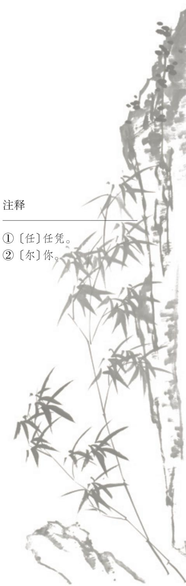

## 络锤凿焚

有感情地朗读课文。背诵课文。默写《竹石》。

借助注释，说说下面诗句的意思。

何当金络脑，快走踏清秋。

粉骨碎身浑不怕，要留清白在人间。

（图）郑燮

千磨万击还坚劲，任尔东西南北风。

三首古诗分别表达了诗人怎样的志向？表达的方法有什么共同特点？

# 11 十六年前的回忆

1927年4月28日，我永远忘不了那一天。那是父亲的被难日，离现在已经十六年了。

那年春天，父亲每天夜里回来得很晚。每天早晨，不知道什么时候他又出去了。有时候他留在家里，埋头整理书籍和文件。我蹲在旁边，看他把书和有字的纸片投到火炉里去。

我奇怪地问他：“爹，为什么要烧掉呢？怪可惜的。”

待了一会儿，父亲才回答：“不要了就烧掉。你小孩子家知道什么！”

父亲一向是慈祥的，从没有骂过我们，更没有打过我们。我总  
爱向父亲问许多幼稚可笑的问题。他不论多忙，对我的问题总是很  
感兴趣，总是耐心地讲给我听。这一次不知道为什么，父亲竟这样  
含糊地回答我。1

后来听母亲说，军阀张作霖要派人来搜查。为了避免党组织被破坏，父亲只好把一些书籍和文件烧掉。才过了两天，果然出事yán了。工友阎振三一早上街买东西，直到夜里还不见回来。第二天，父亲才知道他被抓到警察厅里去了。我们心里都很不安，为这位工友着急。

局势越来越严峻，父亲的工作也越来越紧张。他的朋友劝他离开北京，母亲也几次劝他。父亲坚决地对母亲说：“不是常对你说吗？我是不能轻易离开北京的。你要知道现在是什么时候，这里的工作多么重要。我哪能离开呢？”母亲只好不再说什么了。

可怕的一天果然来了。4月6日的早晨，妹妹换上了新夹衣，母yú亲带她到儿童娱乐场去散步了。父亲在里间屋里写字，我坐在外间的长木椅上看报。短短的一段新闻还没看完，就听见啪，啪…几声尖锐的枪声，接着是一阵纷乱的喊叫。

“什么？爹！”我瞪着眼睛问父亲。

“没有什么，不要怕。星儿，跟我到外面看看去。”

父亲不慌不忙地向外走去。我紧跟在他身后，走出院子，暂时躲在一间僻静的小屋里。

一会儿，外面传来一阵沉重的皮鞋声。我的心剧烈地跳动起来，用恐惧的眼光瞅了瞅父亲。

“不要放走一个！”窗外响起粗暴的吼声。穿灰制服和长筒皮xiàn  
靴的宪兵，穿便衣的侦探，穿黑制服的警察，一拥而入，挤满了这  
间小屋。他们像一群魔鬼似的，把我们包围起来。他们每人拿着一  
支手枪，枪口对着父亲和我。在军警中间，我发现了前几天被捕的  
工友阎振三。他的胳膊上拴着绳子，被一个肥胖的便衣侦探拉着。

那个满脸横肉的便衣侦探指着父亲问阎振三：“你认识他吗？”

阎振三摇了摇头。他那披散的长头发中间露出一张苍白的脸，显然是受过苦刑了。

“哼！你不认识？我可认识他。”侦探冷笑着，又吩咐他手下的那一伙，“看好，别让他自杀！”

他们仔细地把父亲全身搜了一遍。父亲保持着他那惯有的严峻态度，没有向他们讲任何道理。因为他明白，对他们是没有道理可讲的。

残暴的匪徒把父亲绑起来，拖走了。我也被他们带走了。在高高的砖墙围起来的警察厅的院子里，我看见母亲和妹妹也都被带来了。我们被关在女拘留所里。

十几天过去了，我们始终没看见父亲。有一天，我们正在啃手里的窝窝头，听见警察喊我们母女的名字，说是提审。

在法庭上，我们跟父亲见了面。父亲仍旧穿着他那件灰布旧棉袍，可是没戴眼镜。我看到了他那乱蓬蓬的长头发下面的平静而慈祥的脸。

“爹！”我忍不住喊出声来。母亲哭了，妹妹也跟着哭起来了。

“不许乱喊！”法官拿起惊堂木重重地在桌子上拍了一下。

父亲瞅了瞅我们，没有说一句话。他的神情非常安定，非常沉着。他的心被一种伟大的力量占据着。这个力量就是他平日对我们讲的他对于革命事业的信心。

“这是我的妻子。”他指着母亲说。接着他又指了一下我和妹妹：“这是我的两个孩子。”

“她是你最大的孩子吗？”法官指着我问父亲。

“是的，我是最大的。”我怕父亲说出哥哥来，就这样抢着说了。我不知道当时哪里来的机智和勇敢。

“不要多嘴！”法官怒气冲冲的，又拿起他面前那块木板狠狠地拍了几下。

父亲立刻就会意了，接着说：“她是我最大的孩子。我的妻子是个乡下人，我的孩子年纪都还小，她们什么也不懂，一切都跟她们没有关系。”父亲说完了这段话，又望了望我们。

法官命令把我们押下去。我们就这样跟父亲见了一面，匆匆分别了。想不到这竟是我们最后一次见面。

28日黄昏，警察叫我们收拾行李出拘留所。

我们回到家里，天已经全黑了。第二天，舅老爷到街上去买报。他是哭着从街上回来的，手里无力地握着一份报。我看到报上zhāo用头号字登着“李大钊等昨已执行绞刑”，立刻感到眼前蒙了一团云雾，昏倒在床上了。母亲伤心过度，昏过去三次，每次都是刚刚叫醒又昏过去了。

过了好半天，母亲醒过来了，她低声问我：“昨天是几号？记住，昨天是你爹被害的日子。”

我又哭了，从地上捡起那张报纸，咬紧牙，又勉强看了一遍，低声对母亲说：“妈，昨天是4月28日。”

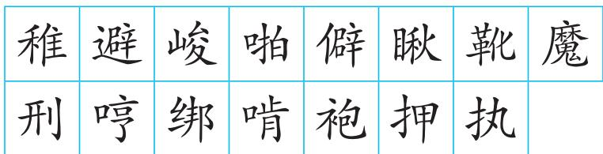

有感情地朗读课文。

默读课文，说说课文按照时间顺序写了哪些事情，给你印象最深的是哪件事。

下面的句子描写了李大钊的外貌、神态和言行，读一读，再找出类似的句子体会他的品格。

我看到了他那乱蓬蓬的长头发下面的平静而慈祥的脸。

父亲坚决地对母亲说：“不是常对你说吗？我是不能轻易离开北京的。你要知道现在是什么时候，这里的工作多么重要。我哪能离开呢？”

◇父亲不慌不忙地向外走去。

课文最后两个自然段与开头有什么联系？说说这样写有什么好处。

# 12 为人民服务

我们的共产党和共产党所领导的八路军、新四军，是革命的队伍。我们这个队伍完全是为着解放人民的，是彻底地为人民的利益工作的。张思德同志就是我们这个队伍中的一个同志。

人总是要死的，但死的意义有不同。中国古时候有个文学家叫hóng做司马迁的说过：“人固有一死，或重于泰山，或轻于鸿毛。”为人民利益而死，就比泰山还重；替法西斯卖力，替剥削人民和压迫人民的人去死，就比鸿毛还轻。张思德同志是为人民利益而死的，他的死是比泰山还要重的。

因为我们是为人民服务的，所以，我们如果有缺点，就不怕别人批评指出。不管是什么人，谁向我们指出都行。只要你说得对，我们就改正。你说的办法对人民有好处，我们就照你的办。“精兵míng简政”这一条意见，就是党外人士李鼎铭先生提出来的；他提得好，对人民有好处，我们就采用了。只要我们为人民的利益坚持好的，为人民的利益改正错的，我们这个队伍就一定会兴旺起来。

我们都是来自五湖四海，为了一个共同的革命目标，走到一起来了。我们还要和全国大多数人民走这一条路。我们今天已经领导着有九千一百万人口的根据地，但是还不够，还要更大些，才能取得全民族的解放。我们的同志在困难的时候，要看到成绩，要看到光明，要提高我们的勇气。中国人民正在受难，我们有责任解救他们，我们要努力奋斗。要奋斗就会有牺牲，死人的事是经常发生的。但是我们想到人民的利益，想到大多数人民的痛苦，我们为人民而死，就是死得其所。不过，我们应当尽量地减少那些不必要的牺牲。我们的干部要关心每一个战士，一切革命队伍的人都要互相关心，互相爱护，互相帮助。

今后我们的队伍里，不管死了谁，不管是炊事员，是战士，只dào要他是做过一些有益的工作的，我们都要给他送葬，开追悼会。这要成为一个制度。这个方法也要介绍到老百姓那里去。村上的人死了，开个追悼会。用这样的方法，寄托我们的哀思，使整个人民团结起来。

## 彻迁泰迫批标牺炊葬

有感情地朗读课文。背诵第2～3自然段。

说说课文围绕“为人民服务”讲了哪几方面的意思。

读下面这段话。说说每句话的意思，想想句子之间是怎样连起来的。

因为我们是为人民服务的，所以，我们如果有缺点，就不怕别人批评指出。不管是什么人，谁向我们指出都行。只要你说得对，我们就改正。你说的办法对人民有好处，我们就照你的办。

联系本单元的学习内容，说说对“人固有一死，或重于泰山，或轻于鸿毛”这句话的理解和体会。

# 13 董存瑞舍身炸暗堡

为了民族解放和人民幸福，无数革命先烈浴血奋战，百折不挠，在革命事业的道路上谱写了壮烈的诗篇。董存瑞就是其中的一位。默读课文，说一说董存瑞是一个怎样的战士。再找出描写董存瑞神态、言行的句子读一读，和同学交流这些描写对刻画人物有什么作用。

1948年5月25日，攻城的大炮震撼着整个隆化城，解放隆化的战斗打响了。战士们像潮水一般冲向敌军司令部所在地一隆化中dā学。嗒嗒嗒……从一座桥上，突然喷出几条火舌，封锁了我军前进的道路。那座桥架在隆化中学墙外的一条旱河上。狡猾的敌人在桥的两侧筑了墙，顶上加了盖，构成了一座暗堡。冲锋的部队被压在一个小土坡下面，抬不起头。冲在最前面的一个战士倒下了。

董存瑞瞪着敌人的暗堡，两眼迸射出仇恨的火花。他跑到连长身边，坚决地说：“连长，我去炸掉它！”

“连长，我掩护！”战友郅顺义也恳切地说。

连长和指导员商量了一下，同意了他们的请求。“同志们，扔手榴弹！”连长给战士们下了命令。

董存瑞抱起炸药包，郅顺义背起两兜手榴弹，同时跃出战壕，冲了上去。他们互相配合，郅顺义扔一阵手榴弹，董存瑞就向前跃进几步；郅顺义再扔一阵，董存瑞再跃进几步。跟在后面的战友把

一捆捆手榴弹送到郅顺义手里。

敌人的机枪更疯狂了，子弹扑哧扑哧打在董存瑞身边，激起了点点尘土，四周冒起了白烟。董存瑞夹紧炸pú fú药包，一会儿忽左忽右地匍匐前进，一会儿又向前滚上好几米。敌人的机枪一齐向董存瑞扫射，在他面前交织成一道火网。突然，他身子一震，左腿中了一枪。他用手一摸，全是血。这时，他离暗堡只有几十米了。他隐āo蔽在一小块凹地里。郅顺义接二连三地扔手榴弹。趁着腾起的黑烟，董存瑞猛冲到桥下。

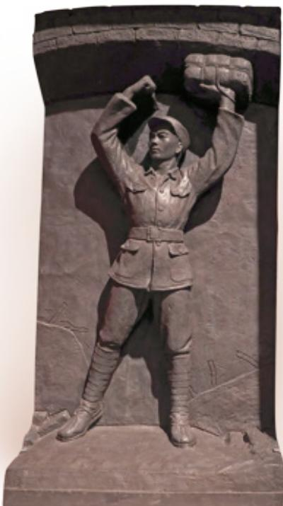  
董存瑞雕像 雕塑者刘开渠

董存瑞看看四周，这座桥有一人多高，两边是光滑的斜坡。炸药包放在哪儿呢？他想把炸药包放在河沿上，试了两次，都滑了下liáo来。要是把炸药包放在河床上，又无法炸毁暗堡。就在这时候，嘹亮的冲锋号响了，惊天动地的喊杀声由远而近。在这万分紧急的关头，董存瑞昂首挺胸，站在桥底中央，左手托起炸药包，顶住桥底，右手猛地一拉导火索。导火索哧哧地冒着白烟，闪着火花，火光照亮了他那钢铸一般的脸。一秒钟、两秒钟……他像巨人一样挺立着，两眼放射着坚毅的光芒。他抬头眺望远方，用尽力气高喊着：“同志们，为了新中国，冲啊！”

巨大的响声震得地动山摇，前进的道路炸开了。战士们冲过烟雾，沿着董存瑞开辟的道路杀向敌军司令部，消灭了全部敌人。胜利的红旗在隆化中学上空迎风飘扬。

综合性学习：奋斗的历程

百年来，中国共产党在马克思主义引领下，忠实践行初心使命，团结带领全国各族人民，在中国这片广袤的土地上，绘就了人类发展史上波澜壮阔的壮美画卷。让我们围绕“奋斗的历程”这个主题，开展一次综合性学习活动，继承光荣传统，创造美好未来。

开展阅读分享会。

我们已经学习了很多阅读方法，如，抓住关键句，把握文章的主要观点；关注外貌、神态、言行等描写，体会人物的内心和品质；查找相关资料，加深对文章内容的理解；体会场景、细节描写中蕴含的感情。运用这些方法读读“阅读材料”，深入体会文章的思想感情。然后分小组进行交流，说说自己是用什么方法阅读每篇文章的，有哪些让自己感动的人和事，也可以分享自己在阅读过程中有哪些收获，受到了怎样的启迪。

制作小诗集。

“砍头不要紧，只要主义真。”“不到长城非好汉，屈指行程二万。”一首首红色诗词，记录了共产党人和中国人民坚韧不拔、宁折不弯的大无畏精神。和同学一起查找资料，搜集红色诗词，感受其中蕴含的深厚的革命情怀。全班可以分成不同的小组，分类搜集，如，有的搜集革命领袖、革命英雄写的诗词，有的搜集歌颂中国共产党、歌颂新中国的诗词，还有的搜集讴歌改革开放和新时代的诗词。在小组内研读搜集到的诗词，交流各自的感受和体会。最后全班共同制作一本诗集。

写一写自己的心愿。

一百年来，无数优秀的中华儿女为了中华民族的伟大复兴，进行了艰苦卓绝、可歌可泣的斗争，他们共同的心愿就是实现人民对美好生活的向往。你的心愿是什么？仔细想一想，选择你最想和别人交流的心愿写下来。下面的角度供参考。

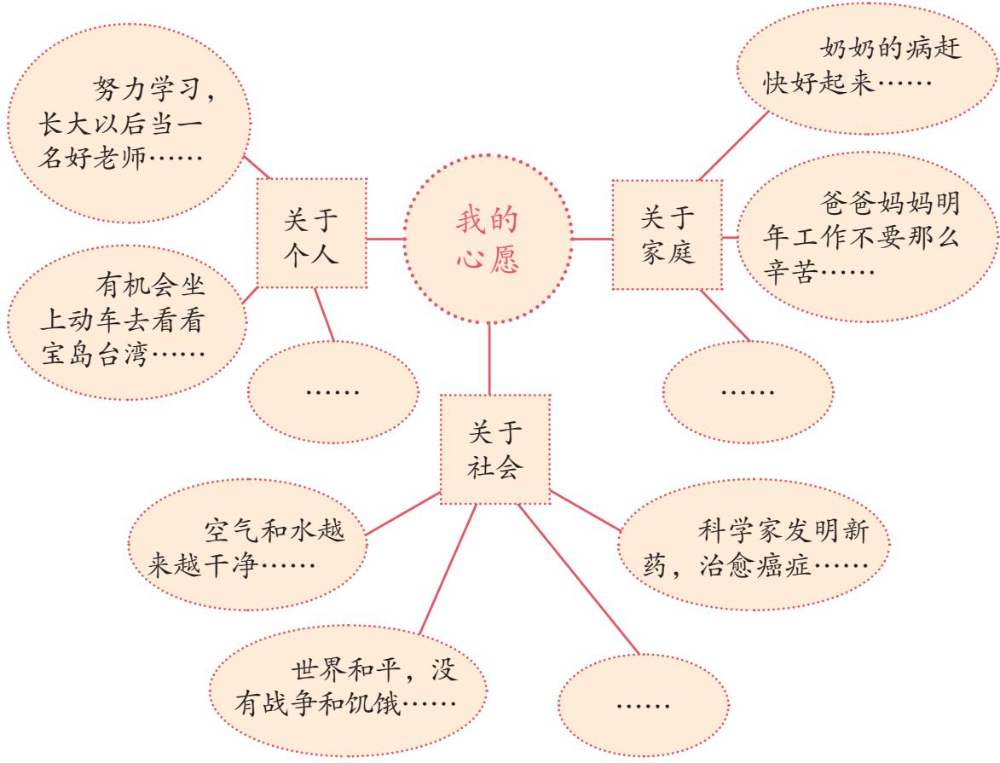

写之前想一想，选择什么材料能够更好地表达你的心愿。再根据想表达的内容，选择一种适合的方式来写，如记叙故事、写信，或者写日记、创作诗歌…写好以后认真读一读，用修改符号修改不满意的地方，使语言更加通顺、流畅，意思更加清楚、明白。

## 阅读材料

# 1毛主席在花山

1948年的春夏之交，毛主席转移到了花山村。在临时借用的农家房舍里，他夜以继日地为解放全中国的事业操劳着。

一天早晨，毛主席正在看地图，忽然抬起头，问警卫员：“昨天这个时候，门口花椒树下的碾子有碾米声，现在怎么没动静了呢？”警卫员说：“报告主席，为了不影响您工作，我和村长商量后，他请乡亲们到别处碾米去了。”

毛主席皱了皱眉，严肃地说：“这会影响群众吃饭的，不能因为我们在这里工作影响群众的生活。这样吧，交给你一个任务，尽快把乡亲们请到这里来碾米。”“是！”警卫员拔腿就走。

“注意，和群众说话态度要诚恳。”主席说。警卫员回头一笑：“知道了，请主席放心。”他走出小院不久，花椒树下的碾子又吱吱扭扭地转了起来。

警卫员刚回到院里，毛主席又叫住他，说：“任务完成得不错。还有一件事等着你办。把这筒茶叶交给炊事员，让他每天这个时候泡一桶茶水，你负责送给碾米的乡亲们。”

茶泡好了，警卫员拎着一桶清香的茶水来到碾盘旁，用粗瓷碗盛好，一一凉在石板上，请碾米的乡亲们喝。开始大家还不好意思，经他一动员就喝了起来。茶水对这里的人来说确实新鲜。一位上了年纪的大叔端着一碗茶水，凑到警卫员跟前：“我说同志，这水一不甜二不辣的，喝它顶什么用？”警卫员乐呵呵地说：“您老就慢慢地喝吧，一会儿就喝出味道来了。”

这时候，毛主席来了，乡亲们纷纷跟毛主席打招呼。毛主席笑着向大家点头，说：“要说喝茶的好处，确实不少嘛，喝了它浑身有精神，还能让人多吃饭……”正在推碾子的大娘和小姑娘越推越慢，转到毛主席身边，便停了下来。毛主席舀了两碗茶水送到她们母女手里，说：“你们俩歇会儿吧！”然后对警卫员说：“来，咱俩试试。”毛主席推碾子还挺在行，一边推，一边用笤帚往碾盘里扫碾出来的米粒。一位老人细细端详着毛主席：“这位首长，好像在哪儿见过。在哪儿呢？”

## 2十里长街送总理

天灰蒙蒙的，又阴又冷。长安街两旁的人行道上挤满了男女老少。路那样长，人那样多，向东望不见头，向西望不见尾。人们臂上都缠着黑纱，胸前都佩着白花，眼睛都望着周总理的灵车将要开来的方向。一位满头银发的老奶奶，双手拄着拐杖，背靠着一棵洋槐树，焦急地等待着。一对青年夫妇，丈夫抱着小女儿，妻子领着六七岁的儿子，他们挤下了人行道，探着身子张望。一群泪痕满面的“红领巾”，相互扶着肩，踞着脚望着，望着…

夜幕开始降下来。几辆前导车过去以后，总理的灵车缓缓地开来了。灵车四周挂着黑色和黄色的挽幛，上面装饰着大白花，庄严，肃穆。人们心情沉

痛，目光随着灵车移动。好像有谁在无声地指挥，老人、青年、小孩，都不约而同地站直了身体，摘下帽子，眼睁睁地望着灵车，哭泣着，顾不得擦去腮边的泪水。

从老人、青年、小孩不约而同的动作中，我充分感受到了人们失去周总理的悲痛心情。

就在这十里长街上，我们的周总理陪着毛主席检阅过多少次人民群众，迎送过多少位来自五洲四海的国际友人。人们常常幸福地看到周总理，看到他矫健的身躯、慈祥的面庞。然而今天，他静静地躺在灵车里，越去越远，和我们永別了！

灵车缓缓地前进，牵动着千万人的心。许多人在人行道上追着灵车奔跑。人们多么希望车子能停下来，希望时间能停下来！可是灵车渐渐地远去了，最后消失在苍茫的夜色中了。人们还是面向灵车开去的方向，静静地站着，站着，好像在等待周总理回来。

## 3飞夺泸定桥

1935年5月，北上抗日的红军向天险大渡河挺进。大渡河水流湍急，两岸都是高山峻岭，只有一座铁索桥可以通过。这座铁索桥，就是红军北上必须夺取的泸定桥。

敌人早就派了两个团防守泸定桥，阻拦红军北上；后来又调了两个旅赶去增援，妄想把我军消灭在桥头上。我军早就看穿了敌人的诡计。28日早上，红四团接到上级命令：“29日早晨夺下泸定桥！”时间只剩下20多个小时了，红四团离泸定桥还有240里，对岸敌人的两个旅援兵正在向泸定桥行进。抢在敌人前头，是我军战胜敌人的关键。

红四团翻山越岭，沿路击溃了好几股阻击的敌人，到晚上7点钟，离泸定桥还有110里。战士们一整天没顾得上吃饭。天又下起了大雨，把他们都淋透了。战胜敌人的决心使他们忘记了饥饿和疲劳。在漆黑的夜里，他们冒着雨，踩着泥水继续前进。

忽然对岸出现了无数火把，像一条长蛇向泸定桥的方向奔去，分明是敌人的增援部队。红四团的战士索性也点起火把，照亮了道路跟对岸的敌人赛跑。

敌人看到了这边的火把，扯着嗓子喊：“你们是哪个部分的？”我们的战士高声答话：“是碰上红军撤下来的。”对岸的敌人并不疑心。两支军队像两条火龙，隔着大渡河走了二三十里。雨越下越猛，像瓢泼一样，把两岸的火把都浇灭了。对岸的敌人不能再走，只好停下来宿营。红四团仍旧摸黑冒雨前进，终于在29日清晨赶到了泸定桥，把增援的两个旅的敌人抛在了后面。

泸定桥离水面有好几丈高，是由13根铁链组成的：两边各有两根，算是桥栏；底下并排9根，铺上木板，就是桥面。人走在桥上摇摇晃晃，就像荡秋千似的。现在连木板也被敌人抽掉了，只剩下铁链。向桥下一看，真叫人心惊胆寒，红褐色的河水像瀑布一样，从上游的山峡里直泻下来，撞击在岩石上，溅起一丈多高的浪花，涛声震耳欲聋。桥对岸的泸定城背靠着山，西门正对着桥头。守城的两个团的敌人早已在城墙和山坡上筑好工事，凭着天险，疯狂地向红军喊叫：“来吧，看你们飞过来吧！”

红四团马上发起总攻。团长和政委亲自站在桥头上指挥战斗。号手们吹起冲锋号，所有武器一齐开火，枪炮声，喊杀声，霎时间震动山谷。二连担任突击队，22位英雄拿着短枪，背着马刀，带着手榴弹，冒着敌人密集的枪弹，攀着铁链向对岸冲去。跟在他们后面的是三连，战士们除了武器，每人带一块木板，一边前进一边铺桥。

突击队刚刚冲到对岸，敌人就放起火来，桥头立刻被大火包围了。在这千钧一发的时刻，传来了团长和政委的喊声：“同志们！为了党的事业，为了最后的胜利，冲啊！”英雄们听到党的号召，更加奋不顾身，都箭一般地穿过熊熊大火，冲进城去，和城里的敌人展开了激烈的搏斗。激战了两个小时，守城的敌人被消灭了大半，其余的都狼狈地逃跑了。

红四团英勇地夺下了泸定桥，取得了长征中的又一次决定性的胜利。红军的主力渡过了天险大渡河，浩浩荡荡地奔赴抗日的最前线。

# 4狱中联欢①

几个戴着脚镣的同志，在往常放风的地坝中间扭起秧歌。沉重的铁镣，撞击得叮当作响，成了节奏强烈的伴奏。欢乐的歌舞里，充满了对黑暗势力的轻蔑。看啊，还有什么节目比得上这种顽强而鲜明的高歌曼舞！

狂热的掌声，送走了一间牢房的节目，又迎来另一间牢房的表演。人潮卷来卷去，地坝变成了绝妙的露天舞台。

楼下四室的“报幕员”宣布：“我们的节目是歌舞表演。表演开始！”只见铁门哗啦一开，一连串的人影，打着空心筋斗，翻了出来，博得同志们齐声喝彩。接着，几个人聚拢来，站成一个圆圈，又有几个人爬上去站在他们肩上，又有人再爬上去……一层、两层、三层……他们在叠罗汉。最上边站着一个人，满脸兴奋的微笑，站得比集中营的高墙、电网更高，手里拿着一面红纸做的鲜艳的红旗，遥望着远处的云山。

## 5伟大的友谊

马克思和恩格斯的互相关怀是无微不至的。他们同住在伦敦时，每天下午，恩格斯总要到马克思家里去。他们讨论各种政治事件和科学问题，一连谈上好几个小时，各抒

我从后面的细节描写中理解了这句话的意思。

己见，滔滔不绝，有时候还进行激烈的争论。天气晴朗的日子，他们就一起到郊外散步。后来他们住在两个地方，就经常通信，彼此交换对政治事件的意见和研究工作的成果。

他们时时刻刻设法给对方以帮助，都为对方在事业上的成就感到骄傲。马克思答应给一家英文报纸写通讯的时候，还没精通英文，恩格斯就帮他翻译，必要时甚至代他写。恩格斯从事著述的时候，马克思也往往放下自己的工作，编写其中的某些部分。马克思逝世的时候，他的伟大著作《资本论》还没最后完成。恩格斯毅然放下自己的研究工作，竭尽全力从事《资本论》后两卷的出版工作。

## 6囚歌

为人进出的门紧锁着，为狗爬出的洞敞开着，一个声音高叫着：—爬出来吧，给你自由！

通过查找资料，我了解了《囚歌》和《春天的故事》的创作背景，對它們表达的情感有了更加深入的体会。

我渴望自由，  
但我深深地知道一  
人的身躯怎能从狗洞子里爬出！  
我希望有一天，  
地下的烈火，  
将我连这活棺材一齐烧掉，  
我应该在烈火与热血中得到永生！

本诗作者叶挺。

## 7春天的故事

1979年，那是一个春天，  
有一位老人在中国的南海边画了一个圈。神话般地崛起座座城，  
奇迹般地聚起座座金山。  
春雷啊唤醒了长城内外，  
春晖啊暖透了大江两岸。  
啊，中国！啊，中国！  
你迈开了气壮山河的新步伐，  
走进万象更新的春天。

1992年，又是一个春天，

有一位老人在中国的南海边写下诗篇。

天地间荡起滚滚春潮，

征途上扬起浩浩风帆。

春风啊吹绿了东方神州，

春雨啊滋润了华夏故园。

啊，中国！啊，中国！

你展开了一幅百年的新画卷，

捧出万紫千红的春天。

# 语文园地

## 交流平台

一个好的开头，可以激发读者阅读的兴趣；一个好的结尾，可以增强文章的感染力，令人回味无穷。回顾下面的这些开头和结尾，你有什么发现？再找一些你认为写得好的文章，把开头和结尾列出来，和同学一起分析这样写的好处。

## 文章的开头

1927年4月28日，我永远忘不了那一天。那是父亲的被难日，离现在已经十六年了。

—《十六年前的回忆》

世界上还有几个剧种是戴着面具演出的呢?

世界上还有几个剧种在演出时是没有舞台的呢?

世界上还有几个剧种是一部戏可以演出三五天还没有结束的呢?

《藏戏》

这次，我看到了草原。那里的天比别处的更可爱，空气是那么清鲜，天空是那么明朗，使我总想高歌一曲，表示我满心的愉快。

《草原》

## 文章的结尾

我又哭了，从地上捡起那张报纸，咬紧牙，又勉强看了一遍，低声对母亲说：“妈，昨天是4月28 日。”

—《十六年前的回忆》

你聪明的，告诉我，我们的日子为什么一去不复返呢?-《匆匆》

男孩儿蹲在那个又大又重的洗衣盆旁，依偎在母亲怀里，闭上眼睛不再看太阳，光线正无可挽回地消逝，一派荒凉。

——《那个星期天》

## 词句段运用

读下面的诗句，联系你读过的古诗，说说有哪些事物在诗中被赋予了人的品格和志向。

□ 千磨万击还坚劲，任尔东西南北风。

不要人夸好颜色，只留清气满乾坤。

荷尽已无擎雨盖，菊残犹有傲霜枝。

联系课文想一想：下面的外貌和神态描写对刻画人物有什么作用？如果删去这些内容，是否会影响文章的表达效果？

父亲仍旧穿着他那件灰布旧棉袍，可是没戴眼镜。我看到了他那乱蓬蓬的长头发下面的平静而慈祥的脸。

扁鼻子军官的目光立刻变得凶恶可怕，他向前弓着身子，伸出两只大手。啊！那双手就像鹰的爪子，扭着雨来的两只耳朵，向两边拉。

他没有什么模样，使他可爱的是脸上的精神。头不很大，圆眼，肉鼻子，两条眉很短很粗，头上永远剃得发亮；腮上没有多余的肉，脖子可是几乎与头一边儿粗。

## 日积月累

有意栽花花不发，无心插柳柳成荫。

良药苦口利于病，忠言逆耳利于行。

◎树欲静而风不止，子欲养而亲不待。

常将有日思无日，莫把无时当有时。

书到用时方恨少，事非经过不知难。

第五单元

科学发现的机遇，总是等着好奇而又爱思考的人。

体会文章是怎样用具体事例说明观点的。

展开想象，写科幻故事。

# ①④ 文言文二则

## 学 ①

弈秋②，通国③之善弈者也。使弈秋诲 wéi 二人弈，其一人专心致志，惟弈秋之为听④； hóng hú 一人虽听之，一心以为有鸿鹄将至，思援 zhuó 弓缴⑦而射之。虽与之®俱学，弗若之矣。 为是其智弗若与①？曰：非然也。

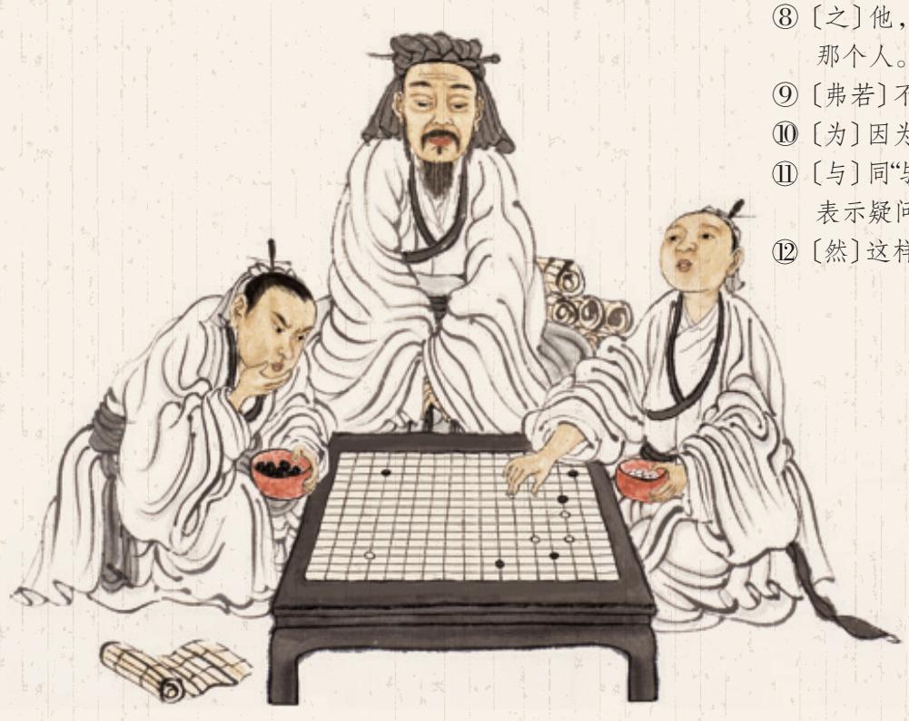

注释

①本文选自《孟子·告子上》，题目为后人所加。弈，下棋。

②〔弈秋〕“秋”是人名，因 善于下棋，所以称为弈秋。

③〔通国〕全国。

④〔惟弈秋之为听〕只听弈秋的教诲。

⑤〔鸿鹄〕天鹅。

⑥〔援〕牵引，拉开。

⑦〔缴〕系在箭上的丝绳这里指带有丝绳的箭射出后可以将箭收回。

⑧〔之〕他，指专心致志的  
1那个人。

⑨〔弗若〕不如。

⑩〔与〕同“欤”，句末语气词表示疑问。这里读yú。

## 两小儿辩日①

孔子东游，见两小儿辩斗，问其故。

一儿曰：“我以③日始出时去人近，而日中④时远也。”

一儿曰：“我以日初出远，而日中时近也。”

一儿曰：“日初出大如车盖⑤，及日中yú则如盘孟⑦，此不为远者小而近者大乎？”

一儿曰：“日初出沧沧凉凉®，及其日中如探汤®，此不为近者热而远者凉乎？”

孔子不能决也。

shú两小儿笑曰：“孰为汝多知乎？”

## 注释

①本文选自《列子·汤问》，题目为后人所加。

②〔辩斗〕争辩，争论。

③〔以〕认为。

④〔日中〕正午。

⑤〔车盖〕古时车上的圆形篷盖，像雨伞一样。

⑥〔及〕到，到了。

⑦〔盘盂〕盛水和食物的器皿。

⑧〔沧沧凉凉〕寒凉。

9 〔探汤〕把手伸到热水里。这里比喻天气很热。汤，热水。

⑩〔孰〕谁。

⑩〔为〕同“谓”，说。

②〔汝〕你。

③〔知〕同“智”，智慧。这里读zhì。

## 援俱弗辩

正确、流利地朗读课文。背诵课文。

联系上下文，说说加点字的意思。

◇通国之善弈者也。

◇思援弓缴而射之。

◇孔子不能决也。

对照注释，想想每句话的意思，再连起来说说故事的内容。

在《两小儿辩日》中，两个小孩的观点分别是什么？他们是怎样说明自己的观点的？

## dàn 15 真理诞生于一百个问号之后

有人说过这样一句话：真理诞生于一百个问号之后。其实，这句话本身就是一个真理。

纵观千百年来的科学技术发展史，那些在科学领域有所建树的人，都善于从细微的、司空见惯的现象中发现问题，不断发问，不断解决疑问，追根求源，最后把“？”拉直变成“！”，找到真理。

波义耳是17世纪英国著名的化学家。一天，他急匆匆地向自己的实验室走去，路过花圃时，阵阵醉人的香气扑鼻而来，他这才发现花圃里的花已经开了。他摘下几朵紫罗兰插入一个盛水的烧瓶中，然后开始和助手们做实验。不巧的是，盐酸溅到了紫罗兰的花瓣上。爱花的波义耳急忙把冒烟的紫罗兰冲洗了一下，重新插入花瓶中。谁知过了一会儿，溅上盐酸的花瓣竟奇迹般地变红了。波义耳立即敏锐地意识到，紫罗兰中有一种物质遇到盐酸会变红。那么，这种物质到底是什么？别的植物中会不会有同样的物质？别的酸对这种物质会有什么样的反应？这一奇怪的现象以及一连串的问题，促使波义耳进行了许多实验。由此他发现，大部分花草受酸或碱的作用都会改变颜色，其中以从地衣类生物—石蕊中提取的紫色浸出液最明显：它遇酸变成红色，遇碱变成蓝色。利用这一特点，波义耳制成了实验中常用的石蕊试纸，用来检测溶液的酸碱性。从那以后，这种试纸一直被广泛应用于化学实验中。

这样的事情不止一例。20世纪初的一天，德国地球物理学家魏tū格纳正无聊地看着墙上的世界地图，突然发现南美洲东海岸的凸出āo部分与非洲西海岸的凹陷部分，竟然不可思议地互相吻合！魏格纳被自己偶然的发现惊呆了。这不会是一种巧合吧？他将地图上的一块块陆地作了比较，结果发现，从海岸线的情形看，地球上所有的大陆都能较好地吻合在一起。魏格纳开始认真地研究这个有趣的现象，他阅读了大量的相关文献，同时搜集古生物学方面的证据。他注意到，一位名叫米歇尔逊的生物学家发现，在美国东海岸有一种wěi蚯蚓，欧洲西海岸的同纬度地区也有这种蚯蚓，而在美国西海岸却没有这种蚯蚓。魏格纳认为，这种蚯蚓的分布情况正说明，亚欧大陆与美洲大陆本来是连在一起的，否则，蚯蚓即使是插上翅膀也难以飞渡重洋。1915年，魏格纳系统整理了他的“大陆漂移说”，出版了《海陆的起源》一书，在地质学界产生了重大影响。

é yì

更有趣的是一位名叫阿瑟林斯基的俄裔美国睡眠研究专家。一次，他发现儿子在睡觉的时候，眼珠忽然转动起来。他感到很奇怪：为什么睡觉时眼珠会转动？这会不会与做梦有关？会有什么关系呢？阿瑟林斯基带着一连串的疑问，对自己八岁的儿子进行了实验，结果表明：脑电波的变化与做梦有关。接着，他又对二十名成年人进行了反复的观察实验，最后得出结论：睡眠中眼珠快速转动的时候，人的脑电波也会发生较大的变化，这是人最容易做梦的阶段。阿瑟林斯基的研究成果，成为心理学家研究做梦的重要依据。

在科学史上，这样的事例还有很多，这说明科学并不神秘，真理并不遥远。只要你见微知著，善于发问并不断探索，那么，当你解决了若干个问题之后，就有可能发现真理。

当然，见微知著、善于发问并不断探索的能力，不是凭空产生huà gēng的。正像数学家华罗庚说过的，科学的灵感，绝不是坐等可以等来的。如果说科学领域的发现有什么偶然的机遇的话，那么这种“偶qiè然的机遇”只会给那些善于独立思考的人，给那些具有锲而不舍精神的人。

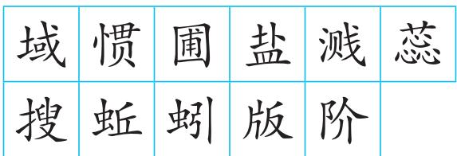

默读课文，想想“真理诞生于一百个问号之后”这句话的含义，再说说你从中受到了什么启发。

为了证明自己的观点，作者列举了哪几个事例？每个事例是按照怎样的顺序写的？

## 小练笔

仿照课文的写法，用具体事例说明一个观点，如“有志者事竟成”“玩也能玩出名堂”。

## 詹天佑

詹天佑是我国杰出的爱国工程师。从北京到张家口这一段铁路，最早就是在他的主持下修筑成功的。这是第一条完全由我国的工程技术人员设计施工的铁路干线。

从北京到张家口的铁路长两百千米，是联结华北和西北的交通要道。当时，清政府刚提出修筑的计划，一些帝国主义国家就出来阻挠，他们都要争夺这条铁路的修筑权，想进一步控制我国的北部。帝国主义者谁也不肯让谁，事情争持了好久得不

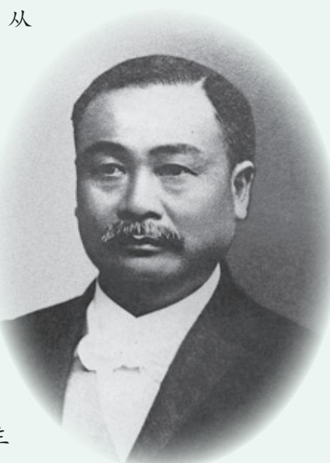

到解决。他们最后提出一个条件：清政府如果用本国的工程师来修筑铁路，他们就不再过问。他们以为这样一要挟，铁路就无法动工，最后还得求助于他们。帝国主义者完全想错了，中国那时候已经有了自己的工程师，詹天佑就是其中一位。

1905年，清政府任命詹天佑为总工程师，修筑从北京到张家口的铁路。消息一传出来，全国轰动，大家说这一回咱们可争了一口气。帝国主义者却认为这是个笑话。有一家外国报纸轻蔑地说：“能在南口以北修筑铁路的中国工程师还没有出世呢。”原来，从南口往北过居庸关到八达岭，一路都是高山深涧、悬崖峭壁。他们认为，这样艰巨的工程，外国著名的工程师都不敢轻易尝试，至于中国人，是无论如何也完成不了的。

詹天佑不怕困难，也不怕嘲笑，毅然接受了任务，马上开始勘测线路。哪里要开山，哪里要架桥，哪里要把陡坡铲平，哪里要把弯度改

# 人民教育出版社

小，都要经过勘测，进行周密计算。詹天佑经常对工作人员说：“我们的工作首先要精密，不能有一点儿马虎。‘大概’‘差不多’这类说法不应该出自工程人员之口。”他亲自带着学生和工人，扛着标杆，背着经纬仪，在峭壁上定点制图。塞外常常狂风怒号，黄沙满天，一不小心还有坠入深谷的危险。不管条件怎样恶劣，詹天佑始终坚持在野外工作。白天，他攀山越岭，勘测线路；晚上，他就在油灯下绘图，计算。为了寻找一条合适的线路，他常常请教当地的农民。遇到困难，他总是想：这是中国人自己修筑的第一条铁路，一定要把它修好，否则，不但惹外国人讥笑，还会让中国的工程师失掉信心。

铁路要经过很多高山，不得不开凿隧道，其中数居庸关和八达岭两条隧道的工程最艰巨。居庸关山势高，岩层厚，詹天佑决定采用从两端同时向中间凿进的办法。山顶的泉水往下渗，隧道里满是泥浆，工地上没有抽水机，詹天佑就带头挑着水桶去排水。八达岭隧道有居庸关隧道的三倍长。他跟老工人一起商量，决定采用中部凿井法，先从山顶往下打一口大的竖井和一口小的竖井，再分别向两头开凿，外面两端也同时施工，把工期缩短了一半。

铁路经过青龙桥附近，坡度特别大。火车怎样才能爬上这样的陡坡呢？詹天佑顺着山势，设计了一种“人”字形线路。北上的列车到了南口就用两个火车头，一个在前边拉，一个在后边推。过青龙桥之后，列车向东北前进，过了“人”字形线路的岔道口就倒过来，原先推的火车头拉，原先拉的火车头推，使列车折向西北前进。这样一来，火车上山就容易多了。

京张铁路不满四年就全线竣工了，比计划提早了两年。这件事给了藐视中国的帝国主义者一个有力的回击。今天，我们乘火车去八达岭，过青龙桥车站，可以看到一座铜像，那就是詹天佑的塑像。

本文根据《科学的中国》和《革命故事读本》相关内容改写

# 16 表里的生物

我小时候住在一座小城里，城里没有工厂，所以也没有机器的声音。我那时以为凡能发出声音的，都是活的生物。早晨有鸟叫得很好听，夜里有狗吠得很怕人，夏天蝉在绿树上叫，秋晚有各种的虫在草丛中唱不同的歌曲。钟楼上的钟不是活的，有时却洪亮地响起来，那是有一个老人在敲；街心有时响着三弦的声音，那是一个盲人在弹。哪里有死的东西会自己走动，并且能自动地发出和谐的声音呢？

可是父亲怀里的表有时放在桌子上，不但它的秒针会自己走dā动，而且它坚硬的表盖里还会发出清脆的声音：嘀嗒，嘀嗒……没有一刻的休息，这声音比蝉鸣要柔和些，比虫的歌曲要单调些。

一天，我对父亲说：

“我爱听这表的声音。”

我一边说一边向着表伸出手去。父亲立刻把我的手拦住了，他说：“只许听，不许动。”

停了一会儿，他又添上一句：

“小孩儿不许动表。”

他这么说，就更增加了表的神秘。“不许动”，里边该是什么东西在响呢？我对于它的好奇心一天比一天增加。树上的蝉，草里的虫，都不会轻易被人看见，我想：表里边一定也有一个蝉或虫一类的生物吧，这生物被父亲关在表里，不许小孩子动。

越不许我动，我越想动，但是我又不敢，因此很痛苦。这样过了许多天。父亲一把表放在桌子上，我的眼睛就再也离不开它。有一次，父亲也许看我的样子太可怜了，也许自己有什么高兴的事，他对我笑着说：“你来，我给你看看表里是什么在响，可是只许看，不许动。”

没有请求，父亲就自动给我看，我高兴极了，同时我的心也加速跳动。父亲取出一把小刀，把表盖拨开，我的面前立即呈现出一个美丽的世界：蓝色的、红色的小宝石，钉住几个金黄色的齿轮，里边还有一个小尾巴似的东西不停地摆来摆去。这小世界不但被表盖保护着，还被一层玻璃蒙着。我看得入神，唯恐父亲再把这美丽的世界盖上。但是，过了一会儿，父亲还是把表盖上了。父亲的表里边真是好看。

此后我就常常请求父亲把他的表打开给我看，有时父亲答应我，有时也拒绝我，这要看他高兴不高兴。有一回，父亲又把表打开了，我问：

“为什么还蒙着一层玻璃呢？”

“这就是叫你只许看，不许动。”父亲回答。

“为什么呢？”我又问。

## 人民教育出版社

xiē zhē“这摆来摆去的是一个小蝎子的尾巴，一动就要蜇你。”

我吓了一跳，蝎子是多么丑恶而恐怖的东西，为什么把它放在这样一个美丽的世界里呢？但是我也感到愉快，证实我的猜测没有错：表里边有一个活的生物。我继续问：

“为什么把那样可怕的东西放在这么好的表里？”

父亲没有回答。我只想，大半因为它有好听的声音吧。但是一般的蝎子都没有这么好听的声音，也许这里边的蝎子与一般的不同。

后来我见人就说：“我有蟋蟀在钵子里，蝈蝈在葫芦里，鸟儿在笼子里，父亲却有一个小蝎子在表里。”

这样的话我不知说了多久，也不知道到什么时候才不说了。

## 吠脆拦恶蟋蟀

默读课文，联系课题，说说课文写了一件什么事。

读下面的句子，说说从中可以看出“我”是一个怎样的孩子。再从课文中找出相关的语句，和同学交流你的看法。

我吓了一跳，蝎子是多么丑恶而恐怖的东西，为什么把它放在这样一个美丽的世界里呢？但是我也感到愉快，证实我的猜测没有错：表里边有一个活的生物。

我只想，大半因为它有好听的声音吧。但是一般的蝎子都没有这么好听的声音，也许这里边的蝎子与一般的不同。

## 选做

课文的结尾写道：“这样的话我不知说了多久，也不知道到什么时候才不说了。”你也有过类似的经历吗？和同学交流。

# ①7他们那时候多有趣啊

用较快的速度默读这篇科幻小说，看看在作者的想象中，未来的上学方式和今天有什么不同。再大胆想象一下，未来的学习生活还有可能是什么样的？

mǎ qí

那天晚上，玛琪甚至把这件事记在自己的日记里了。在2155年5月17日这一天，她写道：“今天，托米发现了一本真正的书！”

这是一本很旧的书。玛琪的爷爷有一次告诉过她，当他还是一个小孩子的时候，他的爷爷对他讲，曾经有那么一个时候，所有的故事都是印在纸上的。

玛琪和托米翻着这本书，书页已经发黄，皱皱巴巴的。他们读到的字全都静止不动，不像他们通常在荧光屏上看到的那样，顺序移动。真是有趣极了，你说是不是？读到后面，再翻回来看前面的一页时，刚刚读过的那些字仍然停留在原地。

玛琪问：“你在哪儿找到这本书的？”

“在我们家。”托米指了一下，可并没有抬起头，因为他正在全神贯注地看书。“在顶楼上。”他又说。

“书里写的什么？”

“学校。”

玛琪脸上露出鄙夷不屑的神情：“学校？学校有什么好写的？我讨厌学校。”玛琪一向讨厌学校里的机器老师，可现在她比以往任何时候都更憎恶它。那个机器老师一次又一次地给她做地理测本文作者是美国的艾萨克·阿西莫夫，译者高萍，选作课文时有改动。

验，她一次比一次答得糟，最后她的妈妈发愁地摇了摇头，把教学视察员找了来。

视察员把机器老师调好以后，拍拍玛琪的脑袋，笑着对她妈妈qióng说：“这不是小姑娘的错，琼斯太太。我认为是这个机器里的地理部分调得太快了一些，这种事是常有的。我把它调慢了，已经适合十岁左右孩子们的水平了。说实在的，她总的学习情况够令人满意了。”说着，他又拍了拍玛琪的脑袋。

玛琪失望极了，她本来希望他把这个机器老师拿走，他们有一次就把托米的老师搬走了将近一个月之久，因为历史那部分的装置完全显示不出图像了。

所以她对托米说：“怎么会有人写学校呢？”

托米非常高傲地瞧了她一眼：“因为那不是我们这种类型的学校，傻瓜。那是几百年前的那种老式学校。”接着他一字一顿地说：“几世纪前。”

玛琪很难过。“嗯，我不知道古时候他们有什么样的学校。”她从他肩膀后面看了一会儿那本书，开口说，“不管怎么说，他们得有一个老师吧？”

“当然，他们有个老师，可不是我们这样的老师。是一个真人！”

“一个真人？真人怎么会是老师呢？”

“是这样的，他只不过给孩子们讲讲课，留些作业，提提问题。”

“真人可没那么聪明。”

“当然聪明啦。我爸爸就和我的机器老师知道得一样多。’

玛琪不打算争吵下去，便说：“我可不想让一个陌生人到我家里来教我功课。”

托米尖声大笑。“你不知道的事太多了，玛琪。那些老师才不到你家里来上课呢。他们有一个专门的地方，所有的孩子都到那儿去上学。”

“所有的孩子都学一样的功课吗？”

“那当然，如果他们的年龄一样的话。”

“可我妈妈说，一个老师是需要调整的，好适合他所教的每个孩子的智力。另外，对每个孩子的教法都应该是不同的。”

“他们那时候恰好不是那么做的。如果你不喜欢书里说的这些事，你就干脆别读这本书。”

“我没说我不喜欢。”玛琪急忙说。她很想知道那些有趣的学校是怎么回事。

他们还没看完一半，玛琪的妈妈就喊了起来：“玛琪！该上课了！”

玛琪叹了口气，去上课了。她脑子里还在想着当她爷爷的爷爷是个小孩子的时候，他们上的那种老式学校。附近所有的孩子都到一处去上学，他们在校园里笑啊，喊啊，他们一起坐在课堂里上课；上完一天的课，就一块儿回家。他们学的功课都一样，这样，在做作业的时候他们就可以互相帮助，有问题还可以互相讨论。

而且他们的老师是真人……

机器老师正在屏幕上显现出这样的字：“我们把 $\frac 1 2$ 和 $\frac 1 4$ 这两个分数加在一起……”

玛琪想，在过去的日子里，那些孩子一定非常热爱他们的学校。她想，他们那时候多有趣啊！

## 口语交际

## 辩论

在日常生活中，我们常常会遇到一些容易产生分歧的问题，如：

电脑时代需要/不需要练字

不可以说谎/可以讲善意的谎言

人们通过竞争/合作取得更大的成功

现代信息交流方式会/不会增进人与人之间的理解

对于这样的问题，可以展开辩论，通过摆事实、讲道理来丰富认识，帮助我们全面地看待事情，处理问题。

我们来开一次辩论会吧！分小组任选一个感兴趣的辩题，然后每个人抽签决定做正方还是反方。也可以全班选择一个话题进行辩论。

◇ 有针对性地搜集材料。既要搜集能证明自己观点的材料，也要搜集能反驳对方观点的材料。

辩论前，要作充分的准备。

◇选择的事例要有说服力。可以引用名人名言。

根据观点对材料进行梳理、归纳。如果材料很多，可以把要点记在卡片上。

辩论时，既要证明自己，又要反驳别人。

◇ 我方陈述时，要充分利用时间，清晰表达自己的观点。

对方陈述时，要注意倾听，抓住对方的漏洞。

D 自由辩论时，进一步强调我方观点，并针对对方观点进行有效的反驳。

辩论结束之后，和同学交流一下，有哪些地方可以做得更好。

听出别人讲话中的矛盾或漏洞。

抓住漏洞进行反驳，注意用语文明。

# 插上科学的翅膀飞

想象一下，如果大脑能直接从书上拷贝知识，如果人能在火星上生活，如果你能用时光机穿越时空回到恐龙时代…会发生些什么？

让我们写一个科幻故事，将头脑中天马行空的想象记录下来。

写之前和同学交流：你印象最深刻的科幻故事是什么？故事里写了哪些现实中并不存在，却看起来令人信服的科学技术？这些科学技术对人们的生活和命运产生了什么影响？

交流之后大胆设想：在你的笔下，人物的生活环境会是怎样的？他们可能运用哪些不可思议的科学技术？这些科学技术使故事中的人物有了怎样的奇特经历？放飞想象，让你的故事把读者带进一个神奇的科幻世界。

写好以后和同学交流，看看谁写的科幻故事奇特而又令人信服。

# 语文园地

## 交流平台

通过这六年的学习，你养成了哪些良好的学习习惯？和同学一起交流吧。

我现在几乎每天都要读课外书，而且读的大多是名著，阅读品位也在提高。

我习惯边读书边思考，用旁批或笔记把心得写下来，感觉好像在和作者聊天，同时也加深了对作品的理解。

我每次完成习作后都认真读几遍，看看通不通顺，有什么问题，然后用修改符号仔细修改。我越来越喜欢写作文了。

我碰到不懂的问题会随时向别人请教，或者去读书、查资料，琢磨解决问题的办法。勤问勤查的习惯让我学到了不少知识。

## 词句段运用

你能借助文言文里学过的字的意思，推测下面词语的意思吗？

走马观花不以为然自愧弗如过犹不及声泪俱下赴汤蹈火

在学习《两小儿辩日》的时候，我知道了“汤”有“热水”的意思，所以“赴汤蹈火”的意思可能是……

读下面的句子，联系课文内容体会引用的好处。你在习作中是否也引用过名人名言？和同学交流。

正像数学家华罗庚说过的，科学的灵感，绝不是坐等可以等来的。

中国古时候有个文学家叫做司马迁的说过：“人固有一死，或重于泰山，或轻于鸿毛。”

## 书写提示

赵孟烦是元代著名的书法家。他的楷书运笔自然，点画圆润多姿，具有行书的笔意；结构严谨端庄，平正宽绰；整体上显得秀丽柔美，稳健大方。《三门记》是其楷书代表作之一。

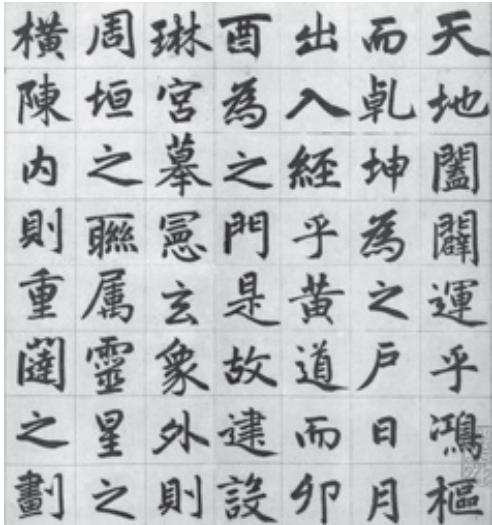  
赵孟烦《三门记》(局部)

天地阖辟运乎鴻柩而乾坤为之户日月出入经乎黄道而卯酉为之门是故建设琳宮摹宪玄象外则周垣之联属灵星之橫陈内则重闼之划

## 日积月累

穷则变，变则通，通则久。 ——《周易》

苟日新，日日新，又日新。 ——《礼记》

青，取之于蓝，而青于蓝。 ——《荀子》

苟利于民，不必法古；苟周于事，不必循旧。

——《淮南子》

第六单元

那些种在校园里长不大的记忆那些留在岁月中忘不掉的纯真

运用学过的方法整理资料。  
策划简单的校园活动，学写策划书。

综合性学习：难忘小学生活

不久以后，我们就要告别美丽的校园，告别朝夕相处的老师、同学，带着依依不舍的深情，跨入新的学校，开始新的学习生活。临近毕业之际，让我们围绕“难忘小学生活”这个主题，开展一次综合性学习活动，向师友、向母校告别。

## 回忆往事

## 活动建议

在回忆的基础上，采用各种形式，把师生情、同学情以及对母校的感激之情表达出来，并永久珍藏。“阅读材料”供参考。

## 填写时间轴

借助时间轴回忆六年的小学生活，记录值得我们细细回味的点点滴滴。可以把印象最深的人或事填写在相应的时间点上，还可以把照片贴在旁边。

## 分享难忘回忆

选取时间轴上有代表性的内容与同学分享，如，令人难忘的集体活动，舍不得的人，有特殊意义的物品，或者一两个关于成长的关键词。

制作成长纪念册

一起回忆了小学生活之后，用心制作一本成长纪念册，珍藏这段难忘的成长记忆。

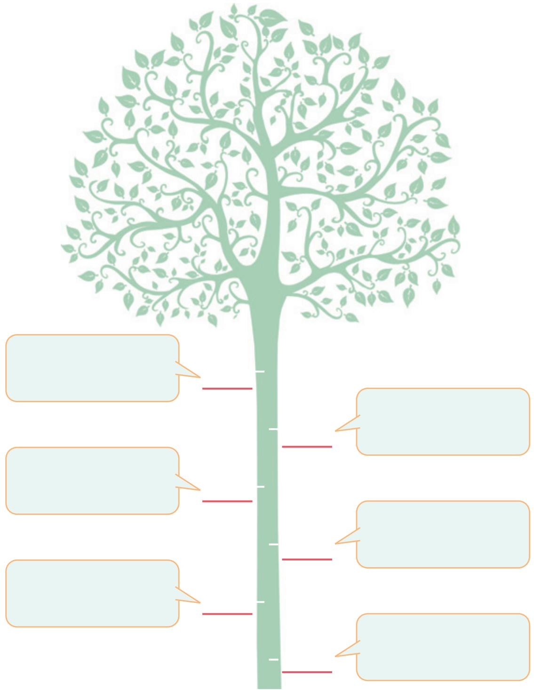

## 阅读材料

# 1老师领进门

1942年正月新春，我不满六周岁，就到邻村小学读书。

这个小学坐落在关帝庙的后殿，只有一位老师，教四个年级。四个年级四个班，四个班只有四十人。

老师姓田，十七岁就开始了小学教师生涯，执教四十年，桃李满门，弟子不下三千。

田老师很有口才，文笔也好。

开学头一天，我们排队进入教室。每个一年级小学生，配备一个三年级的学兄带笔。田老师先给二年级和四年级学生上课，让三年级的学兄把着一年级学弟的小手，描红摹纸。

红摹纸上，一首小诗：

一去二三里，烟村四五家。

亭台六七座，八九十枝花。

轮到给一年级上课时，田老师先把这首诗念一遍，串讲一遍，然后，以这四句诗为内容，编出一段故事，讲得娓娓动听。

我还记得，故事的大意是：

一个小孩儿，牵着妈妈的衣襟儿，去姥姥家，一口气走出了二三里。娘儿俩路过一个小村子，只有四五户人家，正在做午饭，家家冒炊烟。两个人走累了，看见路边有六七座亭子，就走过去歇脚。亭子外边，花开得茂盛，小孩儿越看越喜爱，伸出指头点数，嘴里念叨着“………八枝，九枝，十枝”。他想折下一枝来，戴在耳朵上，把自己打扮得像个迎春小喜神儿。他刚要动手，妈妈喝住他，说：“你折一枝，他折一枝，后边歇脚的人就不能看景了。”小孩儿听了妈妈的话，就缩回了手。后来，花越开越多，数也数不过来了，此地就变成

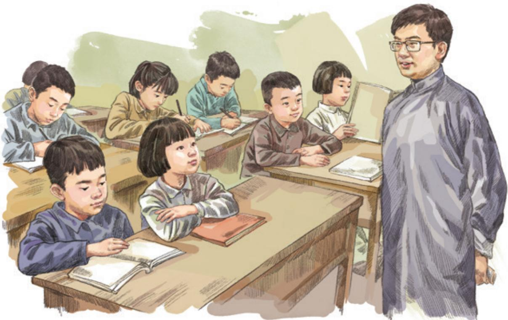

一座大花园……

我听得入迷，恍如身临其境，田老师的话戛然而止，我却仍在发呆，直到三年级的学兄捅了我一下，我才惊醒。

那时候，田老师每讲一课，都要编一个引人入胜的故事，一、二、三、四年级的课文都是如此。我在田老师门下受业四年，听到上千个故事，有如春雨点点入地。

从事文学创作需要丰富的想象力，在这方面田老师培育了我，给我开了窍。

我回家乡去，在村边、河畔、堤坡，遇到田老师拄杖散步，仍然像四十年前的一年级小学生那样，恭恭敬敬地向他行礼。谈起往事，我深深感谢他在我那幼小的心田上，播下了文学的种子。老师摇摇头，说：“这不过是无心插柳柳成荫啊！”

十年树木，百年树人；插柳之恩，终生难忘。

# 2作文上的红双圈

1972年的5月，我正上高二。学校里举办“红五月”征文比赛，我投了稿，是一篇很长的作文，题目叫“补考”。

一天上午，我们正在操场劳动，有同学跑过来告诉我：“获奖征文在报栏里贴出来了，有你的！上面打满了红双圈。”那时候，老师们批阅作文，喜欢在认为最好的词句下面画红双圈。我很兴奋，立刻就想去看看，却又矜持，不愿在同学面前显出我的迫不及待。挨到中午，校园里寂静无人时，我像做贼一样地溜到报栏前，傻乎乎地笑着，独自欣赏我的打满了红双圈的作文。我的心怦怦跳着，从头到尾一个个数下来，一共是九十八个红双圈。这就是语文老师给我的评价。

带着红双圈的作文在报栏里贴了很久。一天，县文化馆的同志来到学校，看见了报栏里的这篇作文，就揭下来带走了。不久，我的作文刊登在了县办刊物上。县办刊物送到扬州地区，被地区刊物选中，第二次发表。几经周转，次年，《补考》竞发表在上海一家出版社的正式刊物上。

那时，我已经下乡插队。父亲鼓励我：既有一，何不能有二？于是，我就接着“折腾”，陆续发表了很多小说，成了作家。

没有当年作文上的九十八个红双圈，会有我今天的一切吗？人生有无数条轨道可走，之所以选择了其中的一条，是偶然，更是必然。

永远感谢我的老师，感谢母校的报栏，感谢挂在我生命之树上的红双圈。

## 3如何制作成长纪念册

## 一、收集、筛选成长资料

选出最能反映你小学生活的有代表性的资料。如：

有纪念意义的照片

与成长相关的习作、书法、美术作品等

各种获奖证书、奖牌（复印件或照片）

老师和同学的寄语、祝福

快速浏览收集到的资料，筛选出可以用来制作成长纪念册的内容。

## 二、根据需要，给收集的资料分类

想想怎样给收集的资料分类，才能更好地呈现在成长纪念册中。可以采用“编年体”的方式制作成长纪念册，把小学六年的学习生活一年一年地展示出来；也可以采用“栏目式”，按照不同的栏目把内容分成几个部分。

<table><tr><td>编年体</td><td>栏目式</td></tr><tr><td>一年级——我上学了</td><td>发展足迹</td></tr><tr><td>二年级一 —我进步了</td><td>多彩生活</td></tr><tr><td>三年级 -我长大了</td><td>才艺集萃</td></tr><tr><td>四年级 我学会了 五年级 -我做到了</td><td>班级之最</td></tr><tr><td>六年级- —我毕业了</td><td>毕业赠言</td></tr></table>

你也可以按照自己的想法从其他角度进行分类。

## 三、编排成长纪念册

一般来说，成长纪念册分为封面、扉页、正文等几个部分。怎样编排成长纪念册呢？

1. 给成长纪念册取一个贴切的名字，设计个性化的封面。

2. 扉页为“卷首语”或“成长感言”，可以自己写，也可以请老师或家长写。

3. 正文内容按照一定顺序编排，呈现的方式多种多样，如，每张照片配以简短、有趣的文字介绍，每个部分加一个合适的小标题。

有的资料不能直接拿来就用，还需要进行修改。如，有的文章太长，可以从中节选一段最有价值的。

制作成长纪念册，最好能表现出你的独特个性和创意。

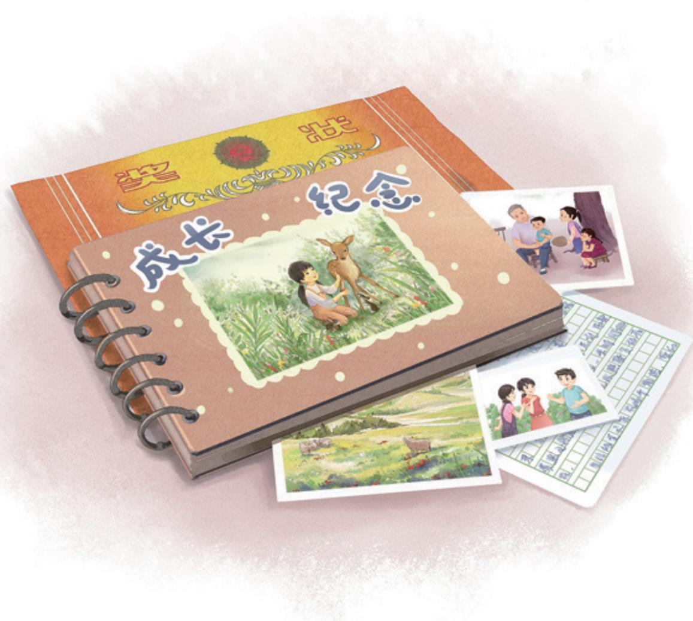

# 依依惜别

## 活动建议

在毕业之前，开展以下活动，为自己的小学生活画上一个圆满的句号。“阅读材料”供参考。

## 举办毕业联欢会

通过文艺表演的形式，表达对师友、对母校的惜别之情。如，把小学生活中令人难忘的事情改编成小品演一演；朗诵临别赠言或与毕业有关的诗歌；以歌舞的形式表达对校园的留恋。

为了办好联欢会，我们要先作好策划，写一份策划书。根据分工认真准备，以便在联欢会上有精彩的展示。

## 毕业联欢会活动策划书

活动名称“再见了，母校”毕业联欢会

活动目的感恩母校，感谢师友，告别小学生活

活动时间 6月 29 日

活动地点 阶梯教室

活动分工 节目统筹：

会场布置：

分工职责要明确。

道具准备：

主持与串词撰写：

秩序维护：

场地清洁：

活动报道：

## 活动流程

1. 毕业演讲

2. 节目表演

活动流程要清楚。

3. 交换毕业赠言

## 节目单

1. 放飞梦想（师生集体诗朗诵）  
2. 高山流水（古筝独奏）  
3. 最美好的回忆（歌曲联唱）  
4. 孔雀舞（民族舞）  
5. 团结就是力量（游戏）  
6. 感恩的心（集体歌舞）  
7. 依依惜别情（诗朗诵）  
8. 心有灵犀猜成语（游戏）  
9. 谁是最可爱的人（相声）  
10. 老师寄语

## 写信

可以给老师或同学写一封信，回忆共同度过的美好时光，表达深切的感恩之情。

可以给母校写一封信，提出中肯的建议，期许美好的未来。

还可以给自己写一封信，展望将来的自己，放飞纯真的梦想。写完之后，把这封信“贮藏”起来，将来某一时刻再“开封”，相信那时候的你读到这封信，一定会有很多感动和怀念。

## 阅读材料

## 1我为少男少女们歌唱

我为少男少女们歌唱。  
我歌唱早晨，  
我歌唱希望，  
我歌唱那些属于未来的事物，我歌唱正在生长的力量。我的歌呵，  
你飞吧，  
飞到年轻人的心中去找你停留的地方。所有使我像草一样颤抖过的快乐或者好的思想，  
都变成声音飞到四方八面去吧，不管它像一阵微风  
或者一片阳光。轻轻地从我琴弦上  
失掉了成年的忧伤，  
我重新变得年轻了，  
我的血流得很快，  
对于生活我又充满了梦想，充满了渴望。

## 本诗作者何其芳。

## 2聪明在于学习，天才在于积累

—华罗庚1956年在北京大学的演讲

有的人在工作、学习中缺乏耐性和韧性，他们一旦碰了钉子，走了弯路，就开始怀疑自己是否有研究才能。其实，我可以告诉大家，许多有名的科学家和作家，都是经过很多次失败，走过很多弯路才成功的。有人看见一个作家写出一本好小说，或者看见一个科学家发表几篇有分量的论文，便仰慕不已，很想自己能够信手拈来，妙手成章，一觉醒来，誉满天下。其实，成功的作品和论文只不过是作家、学者们整个创作和研究中的极小部分，甚至数量上还不及失败作品的十分之一。大家看到的只是他们成功的作品，而失败的作品是不会公开发表出来的。

要知道，一个科学家在攻克科学堡垒的长征中，失败的次数和经验，远比成功的经验要丰富、深刻得多。失败虽然不是什么令人快乐的事情，但也决不应该因此气馁。在进行研究时，研究方向不正确，走了些岔路，白费了许多精力，这也是常有的事。但不要紧，可以再调换方向进行研究。更重要的是要善于吸取失败的教训，总结已有的经验，再继续前进。

根据我自己的体会，所谓天才，就是坚持不断的努力。有些人也许觉得我在数学方面有什么天分，其实从我身上是找不到这种天分的。我读小学时，因为成绩不好，没有拿到毕业证书，只拿到一张修业证书。初中一年级时，我的数学也是经过补考才及格的。但是说来奇怪，从初中二年级以后，我就发生了一个根本转变，因为我认识到既然我的资质差些，就应该多用点儿时间来学习。别人学一小时，我就学两小时，这样，我的数学成绩得以不断提高。

一直到现在我也贯彻这个原则：别人看一篇东西要三小时，我就花三个半小时。经过长期积累，就多少可以看出成绩来。并且在基本技巧烂熟之后，往往能够一个钟头就看懂一篇人家看十天半月也解不透的文章。所以，前一段时间的加倍努力，在后一段时间能收到预想不到的效果。

是的，聪明在于学习，天才在于积累。

## 3给家乡孩子的信

亲爱的同学们：

谢谢你们写信给我，一大堆信！我数了数，一共四十封，好像你们都站在我面前，争先恐后，讲个不停，好不热闹！家乡的孩子们，感谢你们给我这个老人带来温暖。

请原谅我今年不能回家乡，并不是我不愿意看望你们，正相反，我多么想看见你们天真的笑脸，多么想听见你们歌唱般的语声，但是我没有体力和精力支持这样一次长途的旅行，那么就让这封信代替我同你们见面吧。

不要把我当作什么杰出人物，我只是一个普通人。我写作不是我有才华，而是我有感情，对我的祖国和同胞我有无限的爱，我用作品表达我的这种感情。我今年八十七岁，今天回顾过去，说不上失败，也谈不到成功，我只是老老实实、平平凡凡地走了这一生，我思索，我追求，我终于明白生命的意义在于奉献，而不在于享受。我在回答和平街小学同学们的信中说：“我愿意再活一次，重新学习，重新工作，让我的生命开花结果。”有人问我生命开花是什么意思，我说：“人活着不是为了白吃干饭，我们活着就要给我们生活在其中的社会添上一点光彩。这个我们办得到，因为我们每个人都有更多的爱，更多的同情，更多的精力，更多的时间，比维持我们自己的生存所需要的多得多，只有为别人花费了它们，我们的生命才会开花。一心为自己、一生为自己的人什么也得不到。”

我和别人一样，也希望看到自己生命的开花。但是我不可能再活一次。过去我浪费了不少的光阴，现在我快走到路的尽头，剩下的日子已经不多了。我十分珍惜这有限的一分一秒。

亲爱的家乡的孩子们，我真羡慕你们。你们前面有无比宽广的道路，你们心里有那么多美好的事物，爱惜你们可以使用的宝贵时间，好好地学习吧，希望在你们身上。

我真诚地祝福你们。

巴金五月十五日

# 人民教育出版社

# 4毕业赠言

## 给老师

从齐腰高到与肩齐平，整整六年。六年间，每天的两声“老师好”与“老师再见”，载着我对您不变的情谊。

敬爱的老师，时间是多么匆匆啊！匆匆中，我们走进小学的课堂;匆匆中，我们又要离开校园，离开您！

不知从什么时候起，您满头的青丝中冒出了一根根白发；不知从什么时候起，鱼尾纹悄悄爬上了您的眼角。但在我眼中，您永远是年轻的，永远是最美的老师！

## 给同学

六个春秋我们在一起，每一次游戏，每一次辩论…都让我回味无穷它们将化作美好的记忆.珍藏在我心中。

嘿，同桌，记得你说过，你的梦想是遨游太空。愿你继续带着梦想展翅高飞，去拥抱美好的未来。

## 采薇(节选）

昔我往矣， 杨柳依依。 今我来思 雨雪霏霏 fēi 行道迟迟 载渴载饥。 我心伤悲， 知我哀！

# 古诗词诵读

## 注释

① 选自《诗经·小雅》。薇，植物名。

②〔昔〕从前，指出征时。

③〔往〕指当初去从军。

④〔依依〕形容柳丝轻轻随风摇曳的样子。

⑤〔思〕句末语气词，没有实在意义。

⑥〔雨雪〕指下雪。“雨”，这里读yù。

⑦〔霏霏〕雪下得很大的样子。

⑧〔迟迟〕迟缓的样子。

⑨〔载〕则，又。

⑩0〔莫〕没有人。

## 2 送元二使安西①

[唐]王维

渭城雨轻尘，客舍青青柳色新。劝君更尽一杯酒，西出阳关无故人。

## 注释

①〔安西〕指唐代安西都护府。

②〔渭城〕秦时咸阳城，汉代改称渭城，在今陕西咸阳东北，位于渭水北岸。

③〔浥〕湿润，沾湿。

④〔阳关〕古关名，故址在今甘肃敦煌西南。

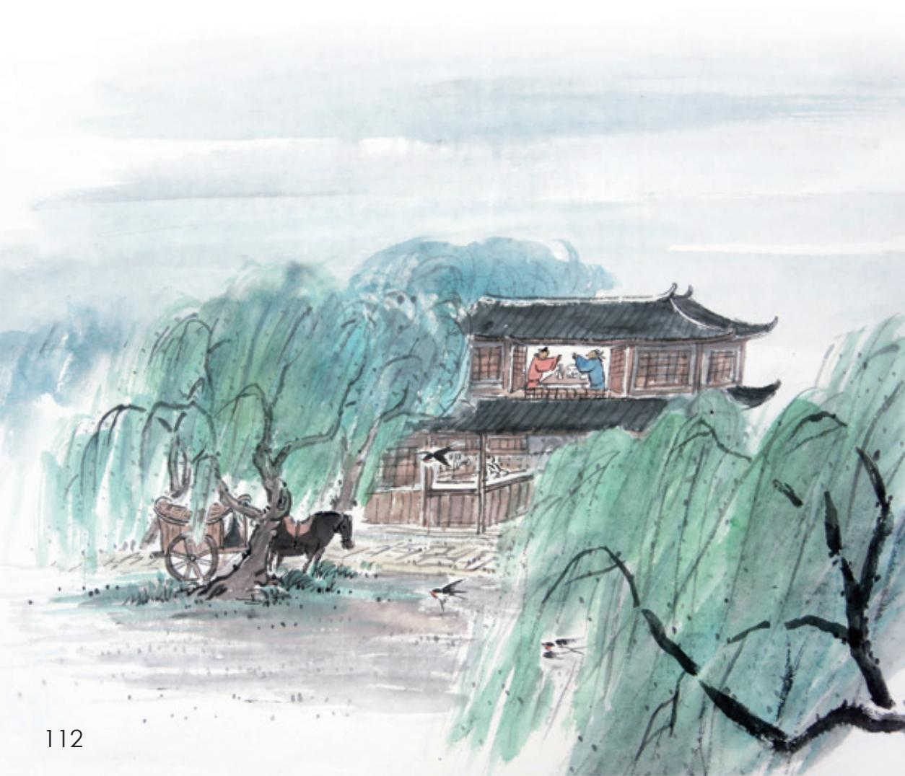

# 人民教育出版社

## 3 春夜喜雨

[唐]杜甫

好雨知时节，当春乃发生。  
随风潜入夜，润物细无声。  
野径云俱黑，江船火独明。  
晓看红湿处，花重锦官城。

## 注释

①〔发生〕使植物萌发、生长。

②〔野径〕田野间的小路。

③〔红湿处〕被雨水打湿的花丛。

④〔花重〕花因为饱含雨水而显得沉重。

⑤〔锦官城〕成都的别称。成都曾经是主持织锦的官员的官署所在地，所以叫“锦官城”。

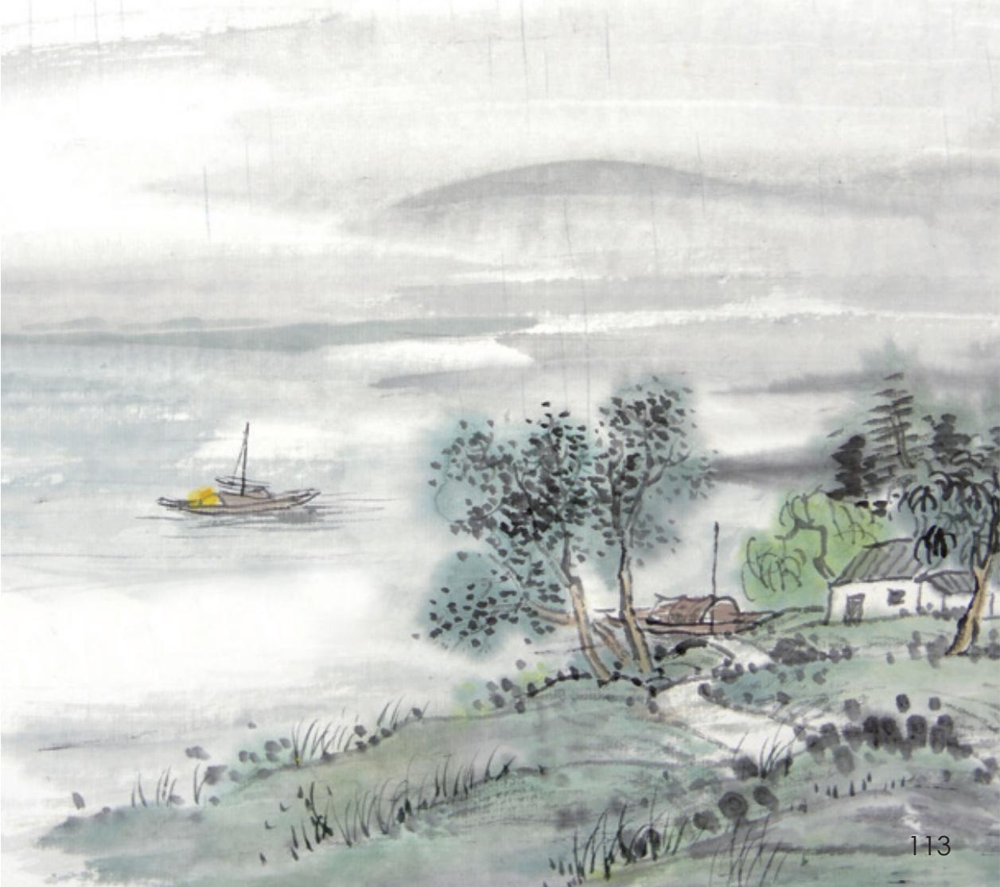  
仅供个人学习使用，未经授权不得另做他用

## 4 早春呈水部张十八员外®

[唐]韩愈

sū天街小雨润如酥，草色遥看近却无。最是一年春好处，绝胜烟柳满皇都。

注释

①〔呈〕恭敬地送上。

②〔水部张十八员外〕指唐代诗人张籍，他在同族兄弟中排行第十八，曾任水部员外郎。

③〔天街〕京城街道。

④〔润如酥〕形容春雨滋润细腻。酥，酥油。

⑤〔处〕时。

⑥〔绝胜〕远远胜过。

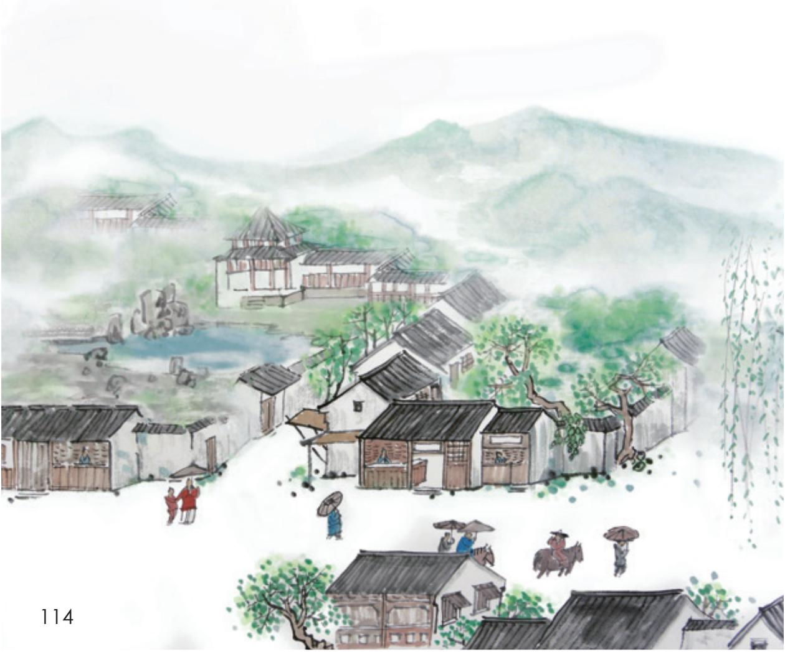

## 5 江上渔者

[宋]范仲淹

江上往来人，lú但爱鲈鱼美。君看一叶舟，出没风波里。

## 注释

①〔但〕单单，只是。

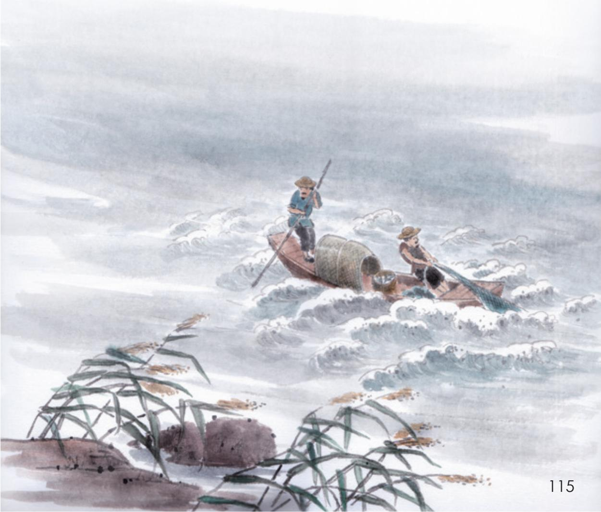

## 6 泊船瓜洲①

[宋]王安石

京口瓜洲一水间，钟山只隔数重山。春风又绿江南岸，明月何时照我还。

## 注释

①〔瓜洲〕在今江苏扬州一带，位于长江北岸。

②〔京口〕在今江苏镇江，位于长江南岸。

③〔钟山〕今江苏南京紫金山。

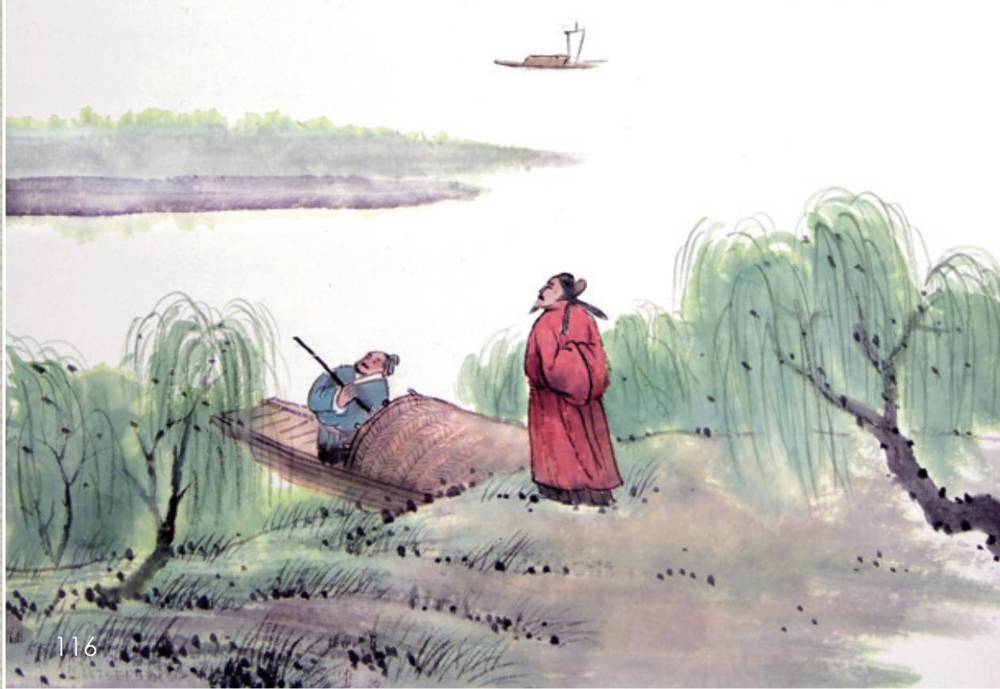  
仅供个人学习使用，未经授权不得另做他用

## 7 游园不值①

[宋]叶绍翁

应齿苍苔fēi小扣柴扉久不开。春色满园关不住，一枝红杏出墙来。

## 注释

①〔不值〕没有遇到人。值，遇到。

②〔应〕大概，表示猜测。

③〔怜〕怜惜。

④〔屐齿〕指木屐底下突出的部分。屐，木鞋。

⑤〔印苍苔〕在青苔上留下印迹。

⑥〔小扣〕轻轻地敲。

⑦〔柴扉〕用木柴、树枝编成的门。

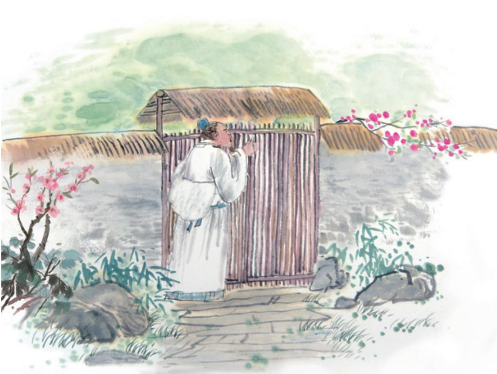

## bào 8 卜算子·送鲍浩然之浙东

[宋]王观

水是眼波横，山是眉峰聚④。欲问行人去那边？眉眼盈盈处。 才始送春归，又送君归去。若到江南赶上春，千万和春住。

## 注释

①〔卜算子〕词牌名。

②〔送鲍浩然之浙东〕词 题。之，往，去。

③〔水是眼波横〕水像美人流动的眼波。

④〔山是眉峰聚〕山如美人蹙起的眉毛。

⑤〔那〕同“哪”。

⑥〔眉眼盈盈处〕山水交汇的地方。盈盈，仪态美好的样子。

⑦〔才始]方才。

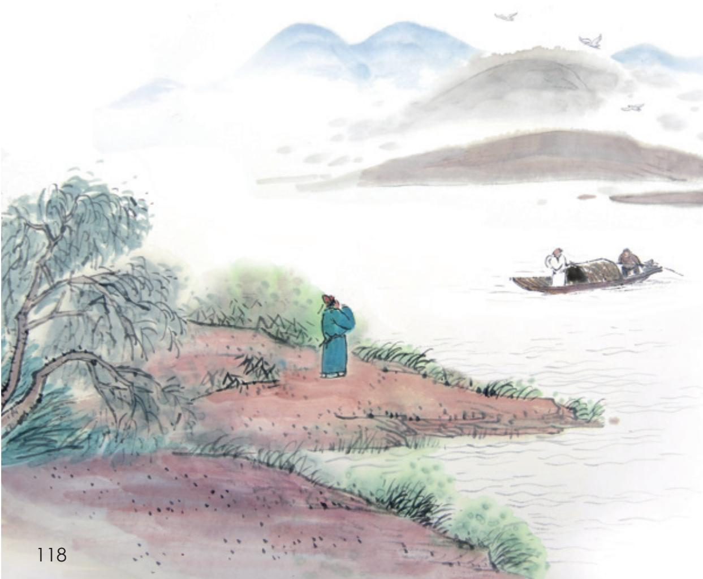

# huàn 9 浣溪沙①

shì [宋]苏轼

qí 游蕲水清泉寺，寺临兰溪③ 溪水西流。

山下兰芽短浸溪，松间xiāo  
沙路净无泥。萧萧暮雨子规  
啼。 谁道人生无再少®？门  
前流水尚能西！休将白发唱黄鸡®。

## 注释

①〔浣溪沙〕词牌名。

②〔蕲水〕古县名，即今湖 北浠水县。

③〔兰溪〕浠水的古称。

④〔兰芽短浸溪〕初生的兰的嫩芽浸在溪水中。

⑤〔萧萧〕这里形容雨声。

⑥〔子规〕杜鹃鸟。

⑦〔无再少〕不能再回到少年时代。

⑧〔休将白发唱黄鸡〕不要因老去而悲叹。唱黄鸡，语出白居易“黄鸡催晓丑时鸣”，比喻时光流逝。

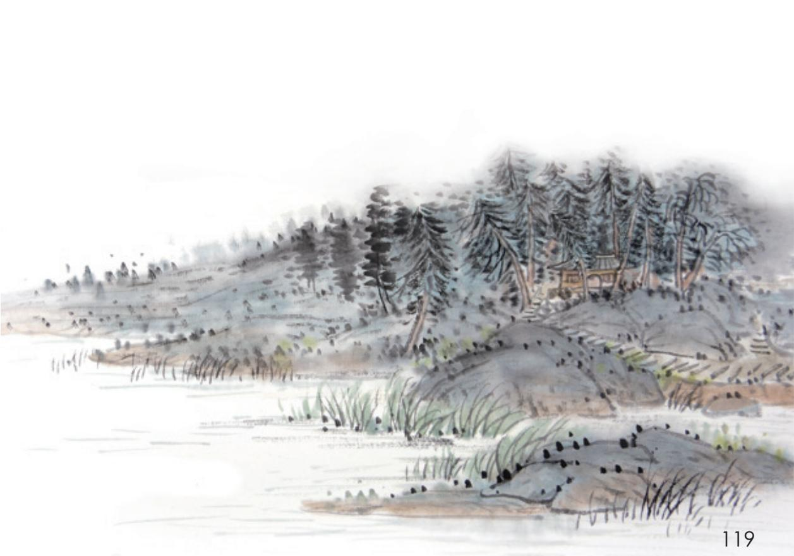

## 10 清平乐

[宋]黄庭坚

春归何处？寂寞无行路①。若有人知春去处，唤取归来同住。 春无踪迹谁知？除非问zhuàn取黄鹂。百啭无人能解，因风飞过蔷薇。

## 注释

①〔无行路〕没有留下春去的行踪。

②〔啭〕鸟婉转地鸣叫。

③〔因风〕借着风势。因，凭借。

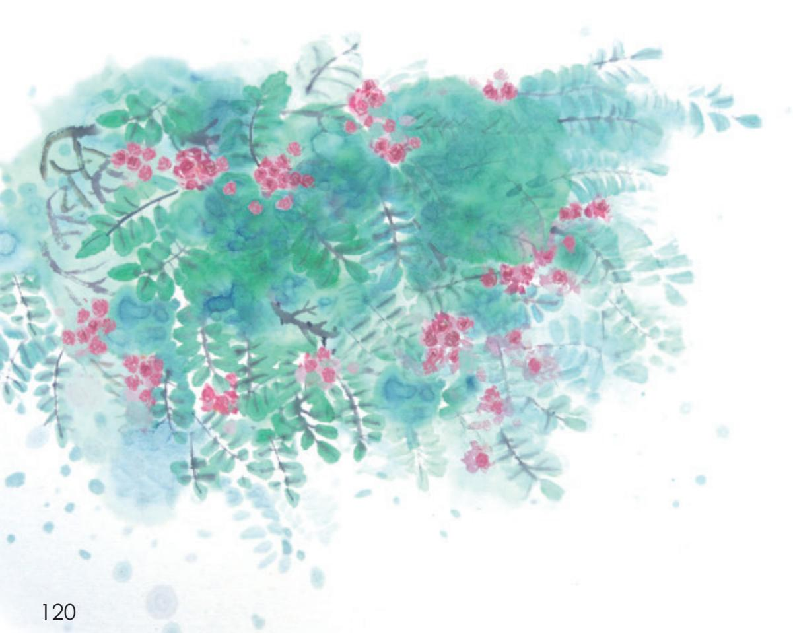

## 写字表

1 醋饺摊拌筝眨宵燃戚贩彼贺轿骆驼  
2 腊粥枣咽匙搅肿熬祸缸脏筷陈  
3 御侯皎章泣盈脉栖鸦  
5 惧凄寞宴霉籍聊乏控贷剔毙抵袭覆  
8 藏挪徘徊蒸裸  
9 媚砖叨绊绞耽揉绽沫搓惶吻偎  
10络锤凿焚  
11 稚避峻啪僻瞅靴魔刑哼绑啃袍押执  
12 彻迁泰迫批标牺炊葬  
14 援俱弗辩  
15 域惯圃盐溅蕊搜蚯蚓版阶  
16 吠脆拦恶蟋蟀

（共120个字）

## 词语表

1 热情 风筝 万象更新 鞭炮 眨眼 通宵 间断

万不得已截然燃放亲戚小贩摆摊儿

彼此 贺年 骆驼 恰好 一律 彩绘 分外

2 腊八粥 感觉 沸腾 何况 搅和 资格 可靠

罢了要不然猜想肿胀惊异总之染缸

解释筷子 浪漫 奈何

5 流落 凄凉 防御 寂寞 宴会 恐惧 倒霉

忧伤书籍缺乏处境理智控制心平气和

抛弃 重见天日 抵抗 侵袭 倾覆 宽慰 深重

困境 焉知非福

8 确乎空虚不禁挪移觉察叹息徘徊

微风 何曾 游丝 赤裸裸

9 明媚 时光 拨弄 草丛 画报 翻箱倒柜

念念叨叨停顿晃动 耽搁泡沫沉郁

漫长 休止 惊惶亲吻 依偎挽回 荒凉

11 埋头 幼稚 含糊 避免 局势 严峻 轻易

尖锐僻静魔鬼苦刑冷笑残暴匪徒

法庭安定 占据 会意 执行 过度

12 革命 解放 彻底 利益 意义 剥削 压迫

批评 兴旺五湖四海目标 责任 牺牲

死得其所 制度 寄托 哀思

15 真理 领域 建树 司空见惯 疑问 敏锐 提取

明显无聊不可思议吻合偶然文献证据

系统 整理见微知著灵感 机遇

16 机器 钟楼 洪亮 街心 盲人 坚硬 清脆

单调请求加速齿轮唯恐丑恶证实

蟋蟀

## 后 记

《义务教育教科书语文》（一\~六年级）由教育部组织编写，北京大学中文系温儒敏教授担任总主编。

王宁、张联荣、柳士镇、张健、翟京华、郑桂华、陈秀玲、武琼、陈萍等专家对教科书的修改完善给予了悉心指导；金波、李明新、吴然、吴立岗、施建平、林孝杰、向瑞等多次审阅教科书内容，提出了修改建议：在教育部的组织下，广大一线优秀教师通读教科书，保证了教学的适切性；在试教试用过程中，天津市、福建省等地教研部门及部分学校给予了大力支持，为教科书质量的进一步提升提供了保障。

人民教育出版社承担了教科书的编辑出版工作，在组织编写、试教试用等方面给予了全方位的协助。人民教育出版社小学语文室全体同仁始终是教科书编写的中坚力量。黄国想、何保全、李旻、陈露茜为本书绘制插图，景绍宗为本书封面绘制插图。吴玉生为本书“书写提示”栏目书写了硬笔书法范例。对教科书的编写、出版提供过帮助的同仁和社会各界朋友还有很多，在此一并表示诚挚的谢意。

教科书投入使用后，我们根据各方意见作了修订，真诚希望广大师生和家长继续提出宝贵意见！

联系方式

电话：010-58758605

电子邮箱：jcfk@pep.com.cn

编 者

YIWU JIAOYU JIAOKESHU YUWEN

语文

六年级 下册

